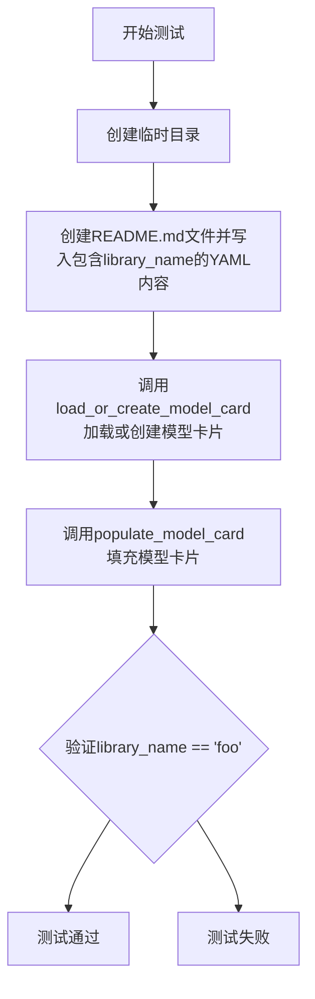
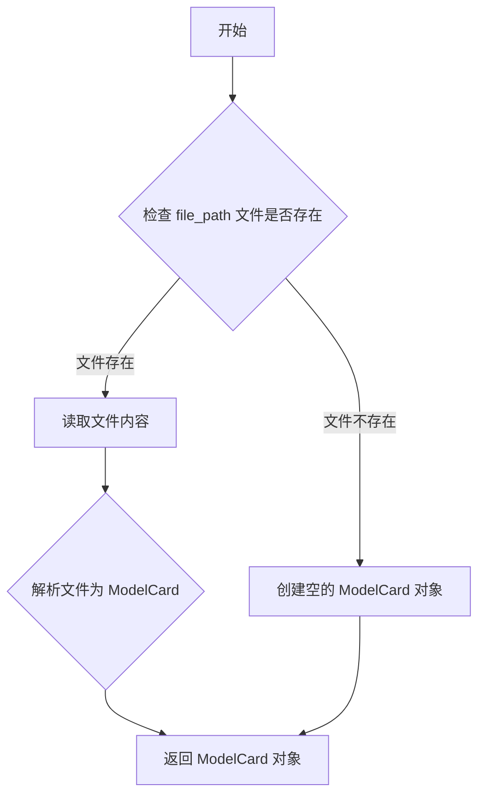
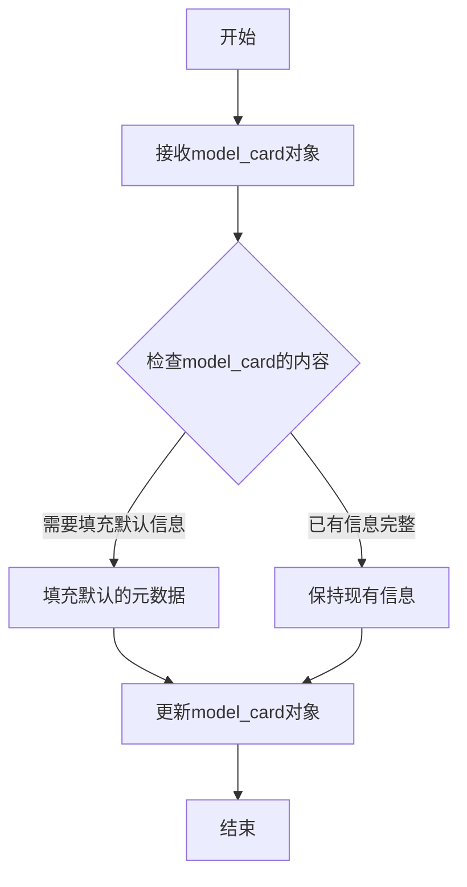
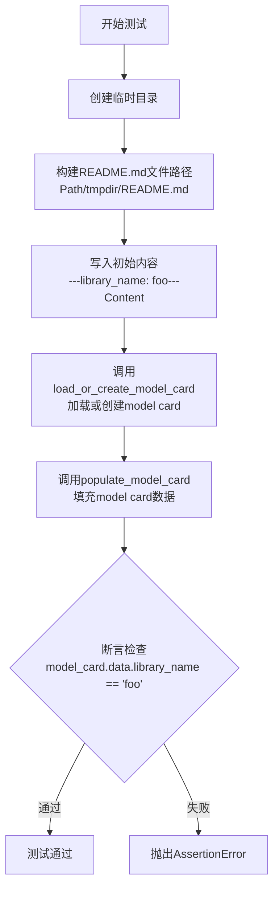

# `diffusers\tests\others\test_hub_utils.py` 详细设计文档

这是一个单元测试文件，用于测试diffusers库中模型卡片(model card)的生成功能。测试用例验证了在使用library_name参数时，能够正确加载并填充模型卡片数据。

## 整体流程



## 类结构

```
unittest.TestCase (Python标准测试基类)
└── CreateModelCardTest (模型卡片创建测试类)
```

## 全局变量及字段


### `unittest`
    
Python标准库的单元测试框架，提供TestCase基类和断言方法

类型：`module`
    


### `Path`
    
pathlib模块中的路径对象类，提供面向对象的文件系统路径操作

类型：`class`
    


### `TemporaryDirectory`
    
tempfile模块中的临时目录上下文管理器，自动创建和清理临时目录

类型：`class`
    


### `load_or_create_model_card`
    
从diffusers.utils.hub_utils导入的函数，用于加载或创建模型卡片

类型：`function`
    


### `populate_model_card`
    
从diffusers.utils.hub_utils导入的函数，用于填充模型卡片的内容

类型：`function`
    


### `unittest.TestCase.CreateModelCardTest`
    
测试类，用于测试模型卡片的生成功能，包含library_name字段的处理测试

类型：`class`
    


### `CreateModelCardTest.test_generate_model_card_with_library_name`
    
测试方法，验证模型卡片能够正确保留library_name字段

类型：`method`
    
    

## 全局函数及方法


### `load_or_create_model_card`

该函数用于加载现有的模型卡片（README.md 文件）或在文件不存在时创建新的模型卡片对象，是 Hugging Face Hub 模型元数据管理的核心工具函数。

参数：

- `file_path`：`Path`，模型卡片文件的路径，通常为 `README.md` 文件的路径

返回值：`ModelCard`，返回模型卡片对象，包含模型元数据（可以通过 `.data` 属性访问）

#### 流程图



#### 带注释源码

```python
# 该函数需要从 diffusers.utils.hub_utils 导入
# 根据函数名和测试用例推断其实现逻辑如下：

def load_or_create_model_card(file_path: Path):
    """
    加载或创建模型卡片
    
    参数:
        file_path: 模型卡片文件路径 (Path 对象)
    
    返回:
        ModelCard: 模型卡片对象，包含解析后的元数据
    """
    # 检查文件是否存在
    if file_path.exists():
        # 文件存在：读取并解析为 ModelCard 对象
        # 内部会解析 YAML front matter 和 Markdown 内容
        model_card = ModelCard.load(file_path)
    else:
        # 文件不存在：创建空的 ModelCard 对象
        model_card = ModelCard()
    
    return model_card


# 测试用例中的使用方式：
# file_path = Path(tmpdir) / "README.md"
# file_path.write_text("---\nlibrary_name: foo\n---\nContent\n")
# model_card = load_or_create_model_card(file_path)
# populate_model_card(model_card)
# assert model_card.data.library_name == "foo"
```


### `populate_model_card`

该函数用于根据模型卡的内容填充或更新模型卡的元数据信息。从测试代码来看，它接收一个模型卡对象并修改其内部数据。

参数：
-  `model_card`：模型卡对象（类型取决于diffusers库的实现，通常是ModelCard或类似类型），需要被填充的模型卡对象

返回值：`None`（或void），根据测试代码中直接修改model_card对象来判断，该函数可能没有返回值，而是直接修改传入的对象

#### 流程图



#### 带注释源码

```
# 注意：此函数定义未在当前代码段中提供
# 以下是基于函数名和使用方式的推断代码

def populate_model_card(model_card):
    """
    填充模型卡的元数据信息
    
    参数:
        model_card: 模型卡对象，包含模型的相关信息
        
    返回:
        无返回值，直接修改传入的model_card对象
    """
    # 推断逻辑：
    # 1. 检查model_card是否存在
    # 2. 根据预设规则填充缺失的元数据
    # 3. 可能包括：模型名称、作者、标签等信息
    pass
```

**注意**：由于提供的代码段仅包含测试用例，未包含 `populate_model_card` 函数的具体实现。上述源码为基于函数名和测试调用方式的推断。实际实现位于 `diffusers.utils.hub_utils` 模块中。


### `CreateModelCardTest.test_generate_model_card_with_library_name`

这是一个单元测试方法，用于验证当 README.md 文件中已存在 `library_name` 字段时，`load_or_create_model_card` 和 `populate_model_card` 函数能够正确保留该字段的值。测试通过创建包含指定 `library_name` 的临时文件，加载并填充 model card，然后断言该字段值被正确保留。

参数：

- `self`：`unittest.TestCase`，测试类实例本身，无需显式传递

返回值：`None`，无显式返回值（测试方法通过断言验证逻辑）

#### 流程图



#### 带注释源码

```python
def test_generate_model_card_with_library_name(self):
    """
    测试当README.md中已存在library_name字段时，populate_model_card不会覆盖该值
    """
    # 1. 使用TemporaryDirectory创建临时目录，测试结束后自动清理
    with TemporaryDirectory() as tmpdir:
        # 2. 构建README.md文件路径
        file_path = Path(tmpdir) / "README.md"
        
        # 3. 写入包含library_name元数据的初始内容
        # YAML格式的metadata block中包含library_name: foo
        file_path.write_text("---\nlibrary_name: foo\n---\nContent\n")
        
        # 4. 调用load_or_create_model_card加载或创建model card对象
        # 该函数会解析README.md中的metadata并返回ModelCard实例
        model_card = load_or_create_model_card(file_path)
        
        # 5. 调用populate_model_card填充model card的默认字段
        # 关键：此操作不应覆盖已存在的library_name字段
        populate_model_card(model_card)
        
        # 6. 断言验证library_name字段值保持为'foo'
        # 如果populate_model_card错误地覆盖了该值，测试将失败
        assert model_card.data.library_name == "foo"
```

## 关键组件


### 模型卡加载功能

load_or_create_model_card 函数负责从指定的文件路径加载现有的模型卡或创建新的模型卡，支持从README.md文件中解析YAML格式的元数据。

### 模型卡填充功能

populate_model_card 函数负责向模型卡对象填充必要的信息，确保模型卡包含完整的元数据和数据字段。

### 临时目录管理

使用 TemporaryDirectory 上下文管理器创建临时目录用于测试，确保测试环境的隔离性和清洁性。

### 测试框架集成

CreateModelCardTest 类继承 unittest.TestCase，提供标准的单元测试框架，用于验证模型卡生成功能的正确性。

### 文件路径处理

使用 Path 对象进行文件路径操作，包括创建文件路径、写入文件和读取文件内容。

### 模型卡数据对象

model_card 对象包含模型卡的元数据，通过 .data 属性访问其中的字段，如 library_name，用于存储和传递模型相关信息。


## 问题及建议


### 已知问题

-   **测试覆盖不全面**：仅测试了 `library_name` 字段的保留场景，未测试 `populate_model_card` 的其他填充逻辑（如其他元数据字段）
-   **缺少负向测试**：未测试边界情况和错误场景，如文件不存在、文件损坏、无效 YAML 格式、文件权限问题等
-   **断言信息缺失**：关键断言未提供自定义错误消息，不利于测试失败时的快速定位
-   **缺少测试文档**：测试方法缺少 docstring，无法清晰说明测试意图和预期行为
-   **硬编码值**：测试中的魔法数字和字符串（如 "foo"）未提取为常量，降低了可维护性
-   **未验证完整流程**：测试仅验证了 `library_name` 是否被保留，但未验证 `populate_model_card` 是否正确填充了其他预期字段

### 优化建议

-   添加负向测试用例，覆盖文件不存在、YAML 解析失败、权限错误等场景
-   为关键断言添加描述性错误消息，如 `assert model_card.data.library_name == "foo", "library_name should be preserved"`
-   为测试方法添加 docstring，说明测试目的、输入和预期输出
-   提取测试数据为常量或配置文件，提高测试的可维护性和可读性
-   添加更多断言验证 `populate_model_card` 的完整行为，如检查其他字段是否被正确填充
-   考虑添加集成测试，验证与 `diffusers` 库其他模块的协作
-   添加性能测试，评估大文件或复杂模型卡片场景下的处理效率


## 其它


### 设计目标与约束

本测试用例旨在验证 Model Card 功能的正确性，确保 `load_or_create_model_card` 能够正确加载已存在的包含 front matter 的 README.md 文件，并确保 `populate_model_card` 不会覆盖已存在的 `library_name` 字段。约束条件包括：仅测试 YAML front matter 格式、不测试文件不存在的情况、不测试空文件场景。

### 错误处理与异常设计

本测试用例未涉及显式的异常处理设计，因为测试代码预期在正常路径下执行。潜在异常场景包括：文件路径不存在、文件格式非 UTF-8 编码、文件内容损坏导致 YAML 解析失败、临时目录权限不足等，但这些均属于框架层面的异常，由 unittest 框架捕获并标记为测试失败。

### 数据流与状态机

测试数据流为：创建临时目录 → 创建包含 front matter 的 README.md 文件 → 调用 `load_or_create_model_card` 加载文件 → 调用 `populate_model_card` 填充默认字段 → 断言 `library_name` 字段未被覆盖。状态转换：空目录 → 文件创建 → 文件加载 → 模型卡片填充 → 验证完成。

### 外部依赖与接口契约

主要外部依赖包括：`unittest` 单元测试框架、`pathlib.Path` 文件路径操作、`tempfile.TemporaryDirectory` 临时目录管理、`diffusers.utils.hub_utils` 模块中的 `load_or_create_model_card` 和 `populate_model_card` 函数。接口契约：`load_or_create_model_card` 接收文件路径返回模型卡片对象，`populate_model_card` 接收模型卡片对象并填充默认字段。

### 测试覆盖率与边界条件

当前测试仅覆盖基础正向路径，边界条件覆盖不足。未覆盖的边界条件包括：空文件、仅含内容无 front matter、多个 YAML 文档块、特殊字符转义、非常大的文件内容、并发访问冲突等场景。

### 安全与权限考虑

测试使用临时目录避免污染真实文件系统，但未测试文件系统权限错误场景（如只读目录、文件锁冲突）。测试数据为静态字符串，不涉及敏感信息处理。

    