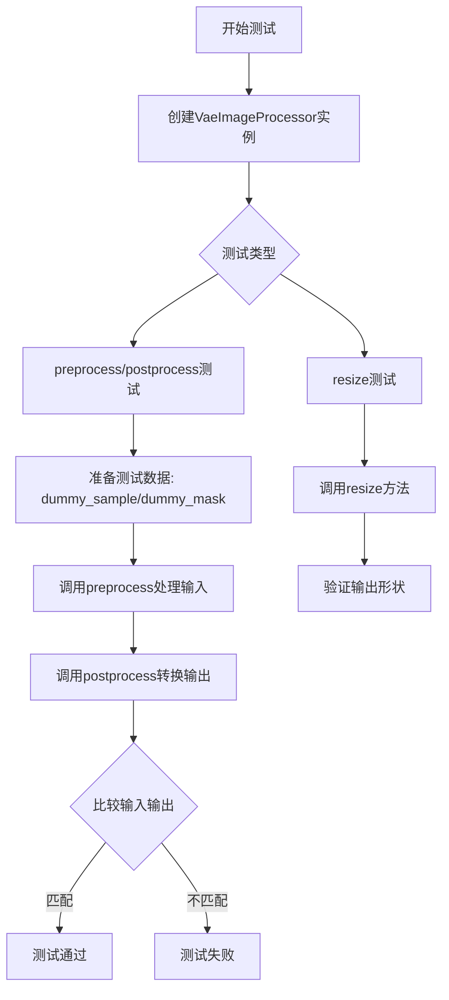
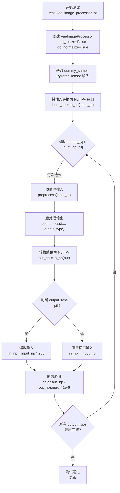
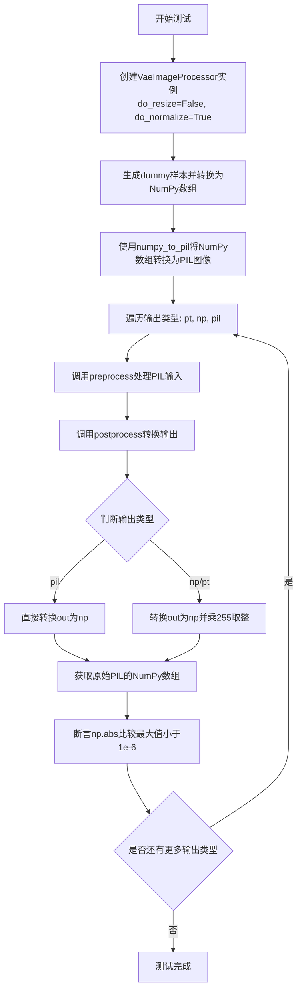
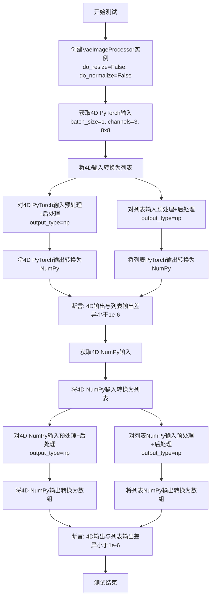
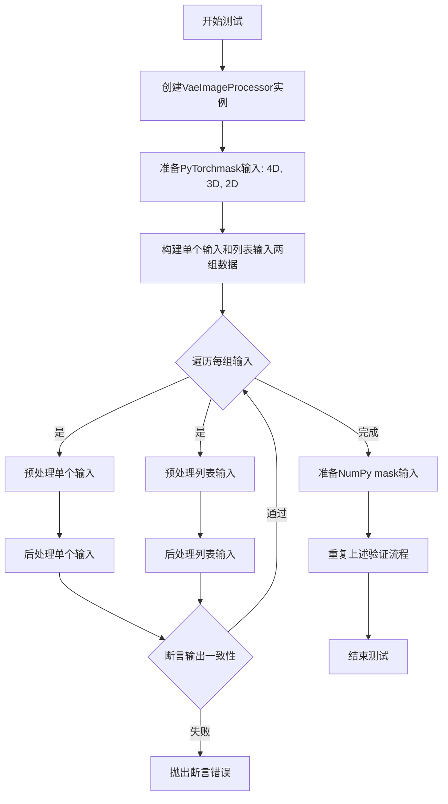
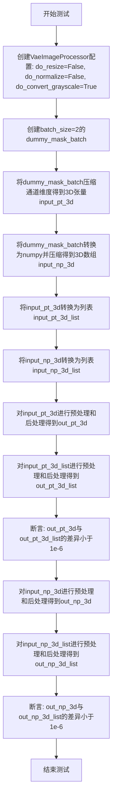
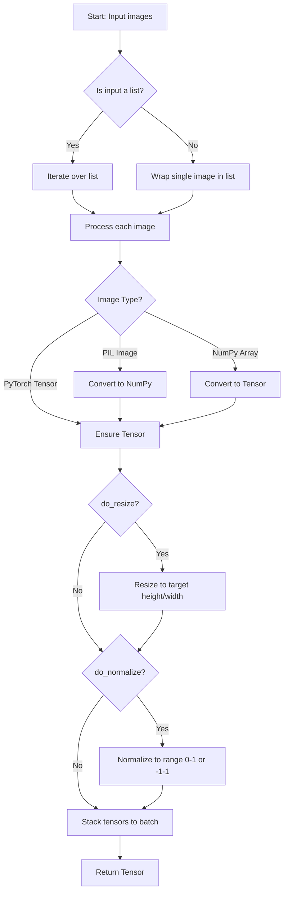
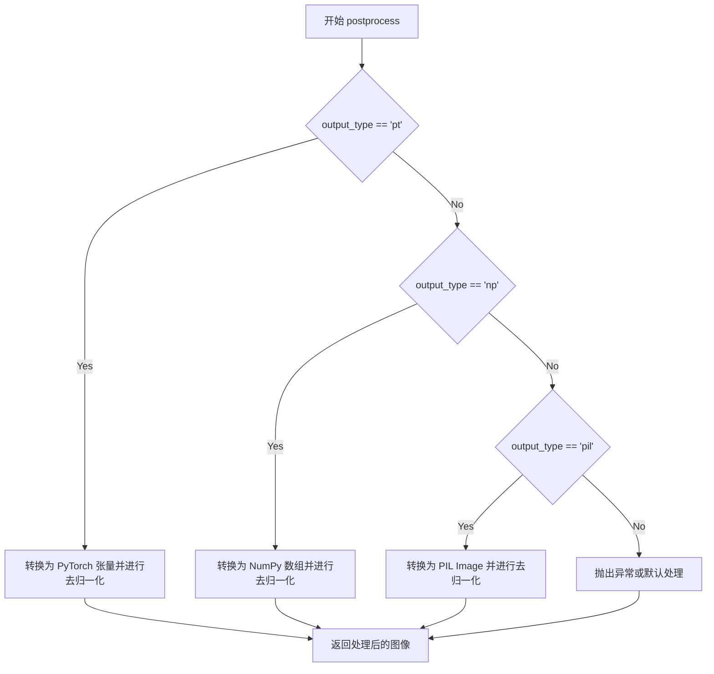
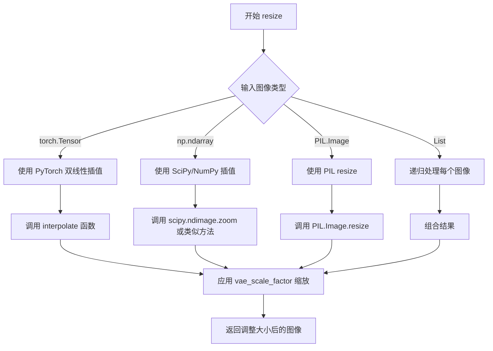

# `diffusers\tests\others\test_image_processor.py` 详细设计文档

该测试文件验证了diffusers库中VaeImageProcessor类的图像处理功能，包括PyTorch张量、NumPy数组和PIL图像之间的转换，以及图像的预处理、后续处理和调整大小操作，支持多种输入维度（2D、3D、4D）和列表输入。

## 整体流程



## 类结构

```
unittest.TestCase
└── ImageProcessorTest (测试类)
    ├── 属性: dummy_sample
    ├── 属性: dummy_mask
    └── 方法: to_np, test_vae_image_processor_pt, test_vae_image_processor_np, ...
```

## 全局变量及字段


### `ImageProcessorTest.dummy_sample`
    
生成虚拟4D图像张量 (batch=1, channels=3, height=8, width=8)，用于测试

类型：`torch.Tensor`
    


### `ImageProcessorTest.dummy_mask`
    
生成虚拟4D mask张量 (batch=1, channels=1, height=8, width=8)，用于测试

类型：`torch.Tensor`
    


### `VaeImageProcessor.do_resize`
    
控制是否对输入图像进行尺寸调整的标志位

类型：`bool`
    


### `VaeImageProcessor.do_normalize`
    
控制是否对图像进行归一化处理的标志位

类型：`bool`
    


### `VaeImageProcessor.do_binarize`
    
控制是否对图像进行二值化处理的标志位

类型：`bool`
    


### `VaeImageProcessor.do_convert_grayscale`
    
控制是否将图像转换为灰度图的标志位

类型：`bool`
    


### `VaeImageProcessor.vae_scale_factor`
    
VAE模型的缩放因子，用于调整图像尺寸

类型：`int`
    
    

## 全局函数及方法


### `ImageProcessorTest.to_np`

该方法是一个测试辅助函数，用于将不同格式的图像数据（ PIL Image 列表、PyTorch Tensor 或NumPy 数组）统一转换为 NumPy 数组格式，以便于在测试中进行数值比较和验证。

参数：

- `image`：`Union[List[PIL.Image.Image], torch.Tensor, np.ndarray]`，输入的图像数据，可以是 PIL Image 列表、PyTorch Tensor 或 NumPy 数组

返回值：`np.ndarray`，转换后的 NumPy 数组格式图像数据

#### 流程图

```mermaid
flowchart TD
    A[开始: image] --> B{判断 image[0] 是否为 PIL.Image.Image}
    B -->|是| C[遍历 image 列表<br/>将每个 PIL.Image 转为 np.array]
    C --> D[使用 np.stack 沿 axis=0 堆叠<br/>返回 NumPy 数组]
    B -->|否| E{判断 image 是否为 torch.Tensor}
    E -->|是| F[将 Tensor 移到 CPU<br/>转为 NumPy 数组<br/>transpose(0, 2, 3, 1) 转换维度]
    F --> D
    E -->|否| G[直接返回 image<br/>假设已是 NumPy 数组]
    D --> H[结束: 返回 np.ndarray]
    G --> H
```

#### 带注释源码

```python
def to_np(self, image):
    """
    将图像数据转换为 NumPy 数组格式
    
    该方法处理三种输入类型：
    1. PIL Image 列表 -> 堆叠为 NumPy 数组
    2. PyTorch Tensor -> 转换为 NumPy 并调整维度顺序
    3. NumPy 数组 -> 直接返回
    
    Args:
        image: 输入图像，可以是以下类型之一：
            - List[PIL.Image.Image]: PIL 图像列表
            - torch.Tensor: PyTorch 张量，形状为 (B, C, H, W)
            - np.ndarray: NumPy 数组
    
    Returns:
        np.ndarray: 转换后的 NumPy 数组
            - 对于 PIL 列表：形状为 (B, H, W, C)
            - 对于 Tensor：形状为 (B, H, W, C)
            - 对于数组：原样返回
    """
    # 检查输入是否为 PIL Image 列表
    # 注意：这里假设 image 是一个可迭代对象，且第一个元素可以判断类型
    if isinstance(image[0], PIL.Image.Image):
        # 遍历列表，将每个 PIL Image 转换为 NumPy 数组
        # 然后沿 axis=0（batch 维度）堆叠在一起
        return np.stack([np.array(i) for i in image], axis=0)
    
    # 检查输入是否为 PyTorch Tensor
    # Tensor 形状通常为 (B, C, H, W)，需要转换为 (B, H, W, C)
    elif isinstance(image, torch.Tensor):
        # .cpu() 将 tensor 从 GPU 移到 CPU
        # .numpy() 将 tensor 转换为 NumPy 数组
        # .transpose(0, 2, 3, 1) 交换维度：将 (B, C, H, W) -> (B, H, W, C)
        return image.cpu().numpy().transpose(0, 2, 3, 1)
    
    # 如果已经是 NumPy 数组，直接返回
    return image
```


### `ImageProcessorTest.test_vae_image_processor_pt`

该方法是一个单元测试，用于验证 `VaeImageProcessor` 对 PyTorch 张量（PyTorch Tensor）输入的完整预处理和后处理流程。测试会遍历三种输出类型（"pt"、"np"、"pil"），分别验证预处理后再后处理的结果是否与原始输入匹配，确保图像处理器在各个输出格式下都能正确处理数据。

参数： 无显式参数（使用 `self` 访问类属性）

返回值：`None`（测试方法，通过断言验证，无返回值）

#### 流程图



#### 带注释源码

```python
def test_vae_image_processor_pt(self):
    """
    测试 VaeImageProcessor 对 PyTorch 张量输入的完整处理流程
    验证预处理 -> 后处理的闭环是否保持数据一致性
    """
    # 步骤1: 创建图像处理器，配置不调整大小但进行归一化
    image_processor = VaeImageProcessor(do_resize=False, do_normalize=True)

    # 步骤2: 获取测试用的虚拟 PyTorch 样本 (batch=1, channels=3, height=8, width=8)
    input_pt = self.dummy_sample
    
    # 步骤3: 将 PyTorch 张量转换为 NumPy 数组用于后续比较
    # 转换后的形状为 (height, width, channels, batch) 以便直观比较
    input_np = self.to_np(input_pt)

    # 步骤4: 遍历三种输出类型进行测试
    for output_type in ["pt", "np", "pil"]:
        # 预处理: 将 PyTorch 张量标准化/归一化
        # 后处理: 根据 output_type 转换为目标格式
        out = image_processor.postprocess(
            image_processor.preprocess(input_pt),
            output_type=output_type,
        )
        
        # 将输出统一转换为 NumPy 数组以便数值比较
        out_np = self.to_np(out)
        
        # 根据输出类型决定参考输入的格式
        # 如果输出是 PIL 图像（0-255 整数），则输入也需转换到相同范围
        in_np = (input_np * 255).round() if output_type == "pil" else input_np
        
        # 步骤5: 断言验证输出与输入的差异小于阈值
        # 使用最大绝对误差确保精度要求
        assert np.abs(in_np - out_np).max() < 1e-6, (
            f"decoded output does not match input for output_type {output_type}"
        )
```


### `ImageProcessorTest.test_vae_image_processor_np`

测试NumPy数组输入的完整流程，验证VaeImageProcessor的preprocess和postprocess方法对NumPy数组的处理是否正确，支持输出类型为pt（PyTorch）、np（NumPy）和pil（PIL Image）三种格式。

参数：

- `self`：`ImageProcessorTest`，测试类实例本身

返回值：`None`，无返回值（测试方法，通过assert断言验证正确性）

#### 流程图

```mermaid
flowchart TD
    A[开始测试 test_vae_image_processor_np] --> B[创建VaeImageProcessor实例<br/>do_resize=False, do_normalize=True]
    B --> C[将dummy_sample转换为NumPy数组<br/>并调整维度顺序: (B,C,H,W) → (B,H,W,C)]
    C --> D[遍历三种输出类型: pt, np, pil]
    D --> E{当前输出类型}
    E -->|pt| F[output_type='pt']
    E -->|np| G[output_type='np']
    E -->|pil| H[output_type='pil']
    F --> I[调用preprocess预处理input_np]
    G --> I
    H --> I
    I --> J[调用postprocess后处理<br/>转换为目标输出类型]
    J --> K[将输出转换为NumPy数组to_np]
    K --> L{判断输出类型}
    L -->|pil| M[将输入乘255并四舍五入<br/>in_np = (input_np * 255).round()]
    L -->|其他| N[直接使用input_np]
    M --> O[计算差值: np.abs(in_np - out_np).max()]
    N --> O
    O --> P{差值 < 1e-6?}
    P -->|是| Q[断言通过]
    P -->|否| R[抛出AssertionError<br/>decoded output does not match input]
    Q --> S[继续下一个输出类型]
    R --> S
    S --> T{是否还有更多输出类型?}
    T -->|是| D
    T -->|否| U[测试结束]
```

#### 带注释源码

```python
def test_vae_image_processor_np(self):
    """
    测试NumPy数组输入的完整流程
    
    验证VaeImageProcessor能够正确处理NumPy数组输入，
    并能输出为PyTorchTensor、NumPy数组和PILImage三种格式
    """
    # 创建VaeImageProcessor实例
    # do_resize=False: 不进行图像尺寸调整
    # do_normalize=True: 进行图像归一化处理
    image_processor = VaeImageProcessor(do_resize=False, do_normalize=True)
    
    # 将dummy_sample（PyTorch tensor）转换为NumPy数组
    # 并调整维度顺序从 (batch, channel, height, width) 
    # 转换为 (batch, height, width, channel) 格式
    input_np = self.dummy_sample.cpu().numpy().transpose(0, 2, 3, 1)

    # 遍历三种输出类型进行测试
    for output_type in ["pt", "np", "pil"]:
        # 第一步：preprocess 预处理输入图像
        # 第二步：postprocess 后处理并转换为目标输出类型
        out = image_processor.postprocess(
            image_processor.preprocess(input_np), 
            output_type=output_type
        )

        # 将输出转换为NumPy数组以便进行数值比较
        out_np = self.to_np(out)
        
        # 根据输出类型准备输入数据用于比较
        # 如果输出是PIL Image，则输入需要 *255 并四舍五入（因为PIL是0-255范围）
        # 其他情况直接使用原始input_np
        in_np = (input_np * 255).round() if output_type == "pil" else input_np
        
        # 断言：验证预处理再后处理的结果与原始输入的差值小于阈值
        # 最大绝对误差应小于 1e-6
        assert np.abs(in_np - out_np).max() < 1e-6, (
            f"decoded output does not match input for output_type {output_type}"
        )
```


### `ImageProcessorTest.test_vae_image_processor_pil`

该测试方法验证 VaeImageProcessor 处理 PIL 图像输入的完整流程，包括将 NumPy 数组转换为 PIL 图像、进行预处理和后处理，并测试不同输出类型（pt、np、pil）的正确性，确保解码后的输出与原始输入匹配。

参数：

- `self`：`ImageProcessorTest`，测试类的实例

返回值：`None`，测试方法无返回值，仅通过断言验证结果

#### 流程图



#### 带注释源码

```python
def test_vae_image_processor_pil(self):
    """
    测试VaeImageProcessor处理PIL图像输入的完整流程
    
    该测试验证：
    1. PIL图像可以被正确预处理
    2. 预处理后的图像可以正确后处理为不同格式(pt/np/pil)
    3. 后处理结果与原始输入匹配
    """
    # 创建图像处理器实例，配置为不调整大小但进行归一化
    # do_resize=False: 不调整图像尺寸
    # do_normalize=True: 对图像进行归一化处理
    image_processor = VaeImageProcessor(do_resize=False, do_normalize=True)

    # 生成虚拟样本数据并转换为NumPy数组
    # dummy_sample: torch.Tensor, shape (1, 3, 8, 8)
    # 转置为 (1, 8, 8, 3) 符合图像格式 (batch, height, width, channels)
    input_np = self.dummy_sample.cpu().numpy().transpose(0, 2, 3, 1)
    
    # 将NumPy数组转换为PIL图像列表
    # numpy_to_pil: 将HWC格式的NumPy数组转换为PIL.Image对象
    input_pil = image_processor.numpy_to_pil(input_np)

    # 遍历三种输出类型进行测试
    # "pt": PyTorch张量
    # "np": NumPy数组
    # "pil": PIL图像
    for output_type in ["pt", "np", "pil"]:
        # 步骤1: preprocess - 将PIL图像预处理为模型可用格式
        # 步骤2: postprocess - 将处理后的图像转换为目标格式
        out = image_processor.postprocess(
            image_processor.preprocess(input_pil), 
            output_type=output_type
        )
        
        # 对每个输入图像和输出图像进行验证
        for i, o in zip(input_pil, out):
            # 获取原始PIL图像的NumPy表示
            in_np = np.array(i)
            
            # 根据输出类型处理输出图像
            # 如果输出是pil格式，直接转换为np
            # 如果输出是np或pt，需要乘以255并四舍五入（因为内部处理使用归一化）
            out_np = self.to_np(out) if output_type == "pil" else (self.to_np(out) * 255).round()
            
            # 断言：验证解码后的输出与原始输入的差异小于阈值
            # 使用最大绝对误差小于1e-6来验证数值一致性
            assert np.abs(in_np - out_np).max() < 1e-6, (
                f"decoded output does not match input for output_type {output_type}"
            )
```


### `ImageProcessorTest.test_preprocess_input_3d`

测试3D张量预处理功能，验证图像处理器能够正确处理4D张量（批次）和3D张量（单张图像），确保两者的预处理和后处理结果在数值上保持一致。

参数：

-  `self`：测试用例实例本身，用于访问类属性和方法

返回值：无（测试方法通过断言验证功能，不返回任何值）

#### 流程图

```mermaid
flowchart TD
    A[开始测试 test_preprocess_input_3d] --> B[创建 VaeImageProcessor 实例]
    B --> C[获取 4D 样本数据 input_pt_4d]
    C --> D[通过 squeeze 操作生成 3D 样本 input_pt_3d]
    D --> E[预处理并后处理 4D 张量 input_pt_4d]
    E --> F[预处理并后处理 3D 张量 input_pt_3d]
    F --> G[将样本转换为 NumPy 数组]
    G --> H[预处理并后处理 4D NumPy 数组]
    H --> I[预处理并后处理 3D NumPy 数组]
    I --> J{断言验证}
    J -->|4D vs 3D PyTorch| K[断言: np.abs(out_pt_4d - out_pt_3d).max < 1e-6]
    J -->|4D vs 3D NumPy| L[断言: np.abs(out_np_4d - out_np_3d).max < 1e-6]
    K --> M[测试通过]
    L --> M
```

#### 带注释源码

```python
def test_preprocess_input_3d(self):
    """
    测试3D张量预处理功能
    
    验证图像处理器能够正确处理不同维度的输入张量：
    - 4D张量 (batch_size, channels, height, width)
    - 3D张量 (channels, height, width)
    
    确保两种输入的处理结果在数值上保持一致。
    """
    # 创建图像处理器，禁用resize和normalize操作
    image_processor = VaeImageProcessor(do_resize=False, do_normalize=False)

    # 获取4D PyTorch样本 (1, 3, 8, 8)
    input_pt_4d = self.dummy_sample
    # 通过squeeze操作移除batch维度，得到3D张量 (3, 8, 8)
    input_pt_3d = input_pt_4d.squeeze(0)

    # 对4D和3D PyTorch张量分别进行预处理和后处理
    # 预处理：将输入转换为标准格式
    # 后处理：将结果转换为NumPy数组
    out_pt_4d = image_processor.postprocess(
        image_processor.preprocess(input_pt_4d),
        output_type="np",
    )
    out_pt_3d = image_processor.postprocess(
        image_processor.preprocess(input_pt_3d),
        output_type="np",
    )

    # 将样本转换为NumPy数组格式
    input_np_4d = self.to_np(self.dummy_sample)
    # 移除batch维度得到3D数组
    input_np_3d = input_np_4d.squeeze(0)

    # 对4D和3D NumPy数组分别进行预处理和后处理
    out_np_4d = image_processor.postprocess(
        image_processor.preprocess(input_np_4d),
        output_type="np",
    )
    out_np_3d = image_processor.postprocess(
        image_processor.preprocess(input_np_3d),
        output_type="np",
    )

    # 断言验证：4D和3D PyTorch张量的处理结果应该完全一致
    assert np.abs(out_pt_4d - out_pt_3d).max() < 1e-6
    # 断言验证：4D和3D NumPy数组的处理结果应该完全一致
    assert np.abs(out_np_4d - out_np_3d).max() < 1e-6
```


### `ImageProcessorTest.test_preprocess_input_list`

该测试方法用于验证 VaeImageProcessor 能够正确处理列表形式的输入（PyTorch tensor 列表和 NumPy 数组列表），确保列表输入与批量 4D 张量输入的处理结果一致。

参数：

- 该方法无外部参数，使用类属性 `self.dummy_sample` 和 `self.to_np` 方法

返回值：`None`，该方法为测试用例，通过断言验证功能正确性

#### 流程图



#### 带注释源码

```python
def test_preprocess_input_list(self):
    """
    测试列表输入的预处理功能
    验证 VaeImageProcessor 能正确处理列表形式的输入
    """
    # 1. 创建图像处理器，配置为不进行 resize 和 normalize
    image_processor = VaeImageProcessor(do_resize=False, do_normalize=False)

    # 2. 获取 4D PyTorch 样本 (batch_size=1, channels=3, height=8, width=8)
    input_pt_4d = self.dummy_sample
    
    # 3. 将 4D 张量转换为列表形式 (每个 batch 作为一个元素)
    input_pt_list = list(input_pt_4d)

    # 4. 对 4D PyTorch 输入进行预处理和后处理
    out_pt_4d = image_processor.postprocess(
        image_processor.preprocess(input_pt_4d),
        output_type="np",
    )

    # 5. 对列表形式的 PyTorch 输入进行预处理和后处理
    out_pt_list = image_processor.postprocess(
        image_processor.preprocess(input_pt_list),
        output_type="np",
    )

    # 6. 获取对应的 NumPy 数组版本
    input_np_4d = self.to_np(self.dummy_sample)
    
    # 7. 将 4D NumPy 数组转换为列表
    input_np_list = list(input_np_4d)

    # 8. 对 4D NumPy 输入进行预处理和后处理
    out_np_4d = image_processor.postprocess(
        image_processor.preprocess(input_np_4d),
        output_type="np",
    )

    # 9. 对列表形式的 NumPy 输入进行预处理和后处理
    out_np_list = image_processor.postprocess(
        image_processor.preprocess(input_np_list),
        output_type="np",
    )

    # 10. 断言：验证 PyTorch 4D 输入和列表输入的处理结果一致
    assert np.abs(out_pt_4d - out_pt_list).max() < 1e-6
    
    # 11. 断言：验证 NumPy 4D 输入和列表输入的处理结果一致
    assert np.abs(out_np_4d - out_np_list).max() < 1e-6
```


### `ImageProcessorTest.test_preprocess_input_mask_3d`

测试 3D mask 预处理功能，验证 VaeImageProcessor 在处理不同维度（4D、3D、2D）的 mask 输入时，经过预处理和后处理后输出的一致性和正确性。

参数：

- `self`：`ImageProcessorTest`，测试类的实例本身

返回值：`None`，该方法为测试函数，无返回值，通过断言验证正确性

#### 流程图

```mermaid
flowchart TD
    A[开始测试] --> B[创建VaeImageProcessor<br/>do_resize=False<br/>do_normalize=False<br/>do_binarize=True<br/>do_convert_grayscale=True]
    
    B --> C[准备PyTorch输入<br/>4D: dummy_mask<br/>3D: squeeze(0)<br/>2D: squeeze(0,1)]
    
    C --> D[处理PyTorch4D输入<br/>preprocess -> postprocess<br/>output_type=np]
    C --> E[处理PyTorch3D输入<br/>preprocess -> postprocess<br/>output_type=np]
    C --> F[处理PyTorch2D输入<br/>preprocess -> postprocess<br/>output_type=np]
    
    D --> G[准备NumPy输入<br/>4D: to_np(dummy_mask)<br/>3D: squeeze(0)<br/>3D_1: squeeze(-1)<br/>2D: squeeze(0,-1)]
    
    G --> H[处理NumPy 4D输入]
    G --> I[处理NumPy 3D输入]
    G --> J[处理NumPy 3D_1输入]
    G --> K[处理NumPy 2D输入]
    
    H --> L{断言验证}
    I --> L
    J --> L
    K --> L
    
    L --> M[4D vs 3D == 0]
    L --> N[4D vs 2D == 0]
    L --> O[4D vs 3D_np == 0]
    L --> P[4D vs 3D_1_np == 0]
    L --> Q[4D vs 2D_np == 0]
    
    M --> R[测试通过]
    N --> R
    O --> R
    P --> R
    Q --> R
```

#### 带注释源码

```python
def test_preprocess_input_mask_3d(self):
    """
    测试 3D mask 预处理功能。
    验证 VaeImageProcessor 在处理不同维度（4D、3D、2D）的 mask 输入时，
    经过预处理和后处理后输出的一致性和正确性。
    """
    # 创建图像处理器，配置：不resize、不normalize、进行二值化、转为灰度图
    image_processor = VaeImageProcessor(
        do_resize=False, do_normalize=False, do_binarize=True, do_convert_grayscale=True
    )

    # ==================== 准备 PyTorch 输入数据 ====================
    # 获取 4D mask (batch=1, channel=1, height=8, width=8)
    input_pt_4d = self.dummy_mask
    # 压缩得到 3D mask (channel=1, height=8, width=8)
    input_pt_3d = input_pt_4d.squeeze(0)
    # 再压缩得到 2D mask (height=8, width=8)
    input_pt_2d = input_pt_3d.squeeze(0)

    # ==================== 处理 PyTorch 输入 ====================
    # 处理 4D PyTorch 输入
    out_pt_4d = image_processor.postprocess(
        image_processor.preprocess(input_pt_4d),
        output_type="np",
    )
    # 处理 3D PyTorch 输入
    out_pt_3d = image_processor.postprocess(
        image_processor.preprocess(input_pt_3d),
        output_type="np",
    )
    # 处理 2D PyTorch 输入
    out_pt_2d = image_processor.postprocess(
        image_processor.preprocess(input_pt_2d),
        output_type="np",
    )

    # ==================== 准备 NumPy 输入数据 ====================
    # 将 dummy_mask 转换为 NumPy 数组
    input_np_4d = self.to_np(self.dummy_mask)
    # 压缩得到 3D NumPy 数组
    input_np_3d = input_np_4d.squeeze(0)
    # 另一种方式压缩最后一个维度得到 3D
    input_np_3d_1 = input_np_4d.squeeze(-1)
    # 再压缩得到 2D NumPy 数组
    input_np_2d = input_np_3d.squeeze(-1)

    # ==================== 处理 NumPy 输入 ====================
    # 处理 4D NumPy 输入
    out_np_4d = image_processor.postprocess(
        image_processor.preprocess(input_np_4d),
        output_type="np",
    )
    # 处理 3D NumPy 输入（squeeze(0)方式）
    out_np_3d = image_processor.postprocess(
        image_processor.preprocess(input_np_3d),
        output_type="np",
    )
    # 处理 3D NumPy 输入（squeeze(-1)方式）
    out_np_3d_1 = image_processor.postprocess(
        image_processor.preprocess(input_np_3d_1),
        output_type="np",
    )
    # 处理 2D NumPy 输入
    out_np_2d = image_processor.postprocess(
        image_processor.preprocess(input_np_2d),
        output_type="np",
    )

    # ==================== 断言验证 ====================
    # 验证 PyTorch 4D 和 3D 输出完全一致
    assert np.abs(out_pt_4d - out_pt_3d).max() == 0
    # 验证 PyTorch 4D 和 2D 输出完全一致
    assert np.abs(out_pt_4d - out_pt_2d).max() == 0
    # 验证 NumPy 4D 和 3D 输出完全一致
    assert np.abs(out_np_4d - out_np_3d).max() == 0
    # 验证 NumPy 4D 和 3D_1 输出完全一致
    assert np.abs(out_np_4d - out_np_3d_1).max() == 0
    # 验证 NumPy 4D 和 2D 输出完全一致
    assert np.abs(out_np_4d - out_np_2d).max() == 0
```


### `ImageProcessorTest.test_preprocess_input_mask_list`

该测试方法用于验证 VaeImageProcessor 对 mask 列表输入的预处理和后处理功能，确保单个 mask 输入与包装为列表的 mask 输入产生一致的处理结果。

参数：

- `self`：ImageProcessorTest，测试类实例本身

返回值：无（`None`），测试方法不返回值，通过断言验证正确性

#### 流程图



#### 带注释源码

```python
def test_preprocess_input_mask_list(self):
    """
    测试 VaeImageProcessor 对 mask 列表输入的预处理功能。
    验证单个 mask 输入与包装为列表的 mask 输入产生相同的处理结果。
    """
    # 创建 VaeImageProcessor 实例，不进行 resize 和 normalize，只进行灰度转换
    image_processor = VaeImageProcessor(
        do_resize=False, 
        do_normalize=False, 
        do_convert_grayscale=True
    )

    # ==================== PyTorch输入测试 ====================
    # 获取 4D mask (batch=1, channel=1, height=8, width=8)
    input_pt_4d = self.dummy_mask
    # 压缩维度得到 3D mask (channel=1, height=8, width=8)
    input_pt_3d = input_pt_4d.squeeze(0)
    # 再次压缩得到 2D mask (height=8, width=8)
    input_pt_2d = input_pt_3d.squeeze(0)

    # 构建测试输入列表：包含不同维度的 mask
    inputs_pt = [input_pt_4d, input_pt_3d, input_pt_2d]
    # 将每个输入包装为列表形式
    inputs_pt_list = [[input_pt] for input_pt in inputs_pt]

    # 遍历每组输入，验证单个输入与列表输入的处理结果一致性
    for input_pt, input_pt_list in zip(inputs_pt, inputs_pt_list):
        # 对单个 mask 进行预处理和后处理
        out_pt = image_processor.postprocess(
            image_processor.preprocess(input_pt),
            output_type="np",
        )
        # 对列表包装的 mask 进行预处理和后处理
        out_pt_list = image_processor.postprocess(
            image_processor.preprocess(input_pt_list),
            output_type="np",
        )
        # 断言两种处理方式的结果一致（误差小于 1e-6）
        assert np.abs(out_pt - out_pt_list).max() < 1e-6

    # ==================== NumPy输入测试 ====================
    # 将 dummy_mask 转换为 NumPy 数组
    input_np_4d = self.to_np(self.dummy_mask)
    # 压缩得到 3D 数组 (height, width, channel)
    input_np_3d = input_np_4d.squeeze(0)
    # 压缩得到 2D 数组 (height, width)
    input_np_2d = input_np_3d.squeeze(-1)

    # 构建 NumPy 测试输入列表
    inputs_np = [input_np_4d, input_np_3d, input_np_2d]
    inputs_np_list = [[input_np] for input_np in inputs_np]

    # 遍历每组 NumPy 输入，验证处理结果一致性
    for input_np, input_np_list in zip(inputs_np, inputs_np_list):
        # 对单个 NumPy mask 进行处理
        out_np = image_processor.postprocess(
            image_processor.preprocess(input_np),
            output_type="np",
        )
        # 对列表包装的 NumPy mask 进行处理
        out_np_list = image_processor.postprocess(
            image_processor.preprocess(input_np_list),
            output_type="np",
        )
        # 断言结果一致
        assert np.abs(out_np - out_np_list).max() < 1e-6
```


### `ImageProcessorTest.test_preprocess_input_mask_3d_batch`

测试3D mask批处理功能，验证当输入为batch_size=2的3D张量/数组时，VaeImageProcessor能够正确处理张量形式的批量输入和列表形式的批量输入，并确保两者的输出结果一致。

参数：

- `self`：`unittest.TestCase`，测试类的实例本身

返回值：`None`，该方法为测试方法，无返回值，通过assert语句验证正确性

#### 流程图



#### 带注释源码

```python
def test_preprocess_input_mask_3d_batch(self):
    """
    测试3D mask批处理功能。
    验证VaeImageProcessor能够正确处理batch_size=2的3D mask输入，
    并且批量张量输入和批量列表输入的输出结果一致。
    """
    # 创建VaeImageProcessor实例，配置为不resize、不normalize、转换为灰度图
    image_processor = VaeImageProcessor(
        do_resize=False, 
        do_normalize=False, 
        do_convert_grayscale=True
    )

    # 创建batch_size=2的dummy mask输入
    # 将self.dummy_mask在axis=0上拼接2次，得到batch_size=2的张量
    dummy_mask_batch = torch.cat([self.dummy_mask] * 2, axis=0)

    # 挤压通道维度：从(batch_size, 1, H, W) -> (batch_size, H, W)
    # 得到3D张量，用于测试3D输入的处理
    input_pt_3d = dummy_mask_batch.squeeze(1)
    
    # 将dummy_mask_batch转换为numpy数组后挤压最后一个维度
    # 从(batch_size, 1, H, W) -> (batch_size, H, W)
    input_np_3d = self.to_np(dummy_mask_batch).squeeze(-1)

    # 将3D张量转换为列表形式，每个元素为(H, W)形状
    input_pt_3d_list = list(input_pt_3d)
    
    # 将3D numpy数组转换为列表形式
    input_np_3d_list = list(input_np_3d)

    # 测试PyTorch张量批量输入
    # 对3D张量进行预处理和后处理
    out_pt_3d = image_processor.postprocess(
        image_processor.preprocess(input_pt_3d),
        output_type="np",
    )
    
    # 对3D张量列表进行预处理和后处理
    out_pt_3d_list = image_processor.postprocess(
        image_processor.preprocess(input_pt_3d_list),
        output_type="np",
    )

    # 断言：验证批量张量与批量列表的输出差异小于阈值
    assert np.abs(out_pt_3d - out_pt_3d_list).max() < 1e-6

    # 测试NumPy数组批量输入
    # 对3D numpy数组进行预处理和后处理
    out_np_3d = image_processor.postprocess(
        image_processor.preprocess(input_np_3d),
        output_type="np",
    )
    
    # 对3D numpy数组列表进行预处理和后处理
    out_np_3d_list = image_processor.postprocess(
        image_processor.preprocess(input_np_3d_list),
        output_type="np",
    )

    # 断言：验证批量numpy数组与批量numpy列表的输出差异小于阈值
    assert np.abs(out_np_3d - out_np_3d_list).max() < 1e-6
```


### `ImageProcessorTest.test_vae_image_processor_resize_pt`

该测试方法用于验证 `VaeImageProcessor` 类的 `resize` 方法对 PyTorch 张量的图像尺寸缩放功能是否正确，测试将输入图像按指定比例缩小后，输出形状是否符合预期。

参数：

- `self`：`ImageProcessorTest`，测试类实例本身，包含测试所需的上下文和辅助方法

返回值：无返回值（`None`），该方法为单元测试方法，通过 `assert` 断言验证 resize 功能，不返回任何值

#### 流程图

```mermaid
flowchart TD
    A[开始测试 test_vae_image_processor_resize_pt] --> B[创建 VaeImageProcessor 实例<br/>do_resize=True, vae_scale_factor=1]
    B --> C[获取输入张量 self.dummy_sample<br/>形状: batch_size x channels x height x width]
    C --> D[解析输入张量维度<br/>b, c, h, w = input_pt.shape]
    D --> E[设置缩放因子 scale = 2]
    E --> F[调用 image_processor.resize<br/>将图像缩放到 height // scale x width // scale]
    F --> G[计算期望输出形状<br/>exp_pt_shape = (b, c, h // scale, w // scale)]
    G --> H{断言: out_pt.shape == exp_pt_shape?}
    H -->|是| I[测试通过]
    H -->|否| J[测试失败<br/>抛出 AssertionError]
```

#### 带注释源码

```python
def test_vae_image_processor_resize_pt(self):
    """
    测试 VaeImageProcessor 对 PyTorch 张量的 resize 功能
    
    验证要点:
    1. VaeImageProcessor 能够正确处理 PyTorch 张量输入
    2. resize 方法能够按照指定的目标尺寸输出正确形状的张量
    3. 输出张量的批量大小和通道数保持不变，仅高宽维度发生缩放
    """
    
    # 创建图像处理器实例，启用 resize 功能
    # vae_scale_factor=1 表示使用默认的 VAE 缩放因子
    image_processor = VaeImageProcessor(do_resize=True, vae_scale_factor=1)
    
    # 获取测试用的虚拟 PyTorch 样本数据
    # dummy_sample 是类属性，形状为 (1, 3, 8, 8) - batch_size=1, channels=3, height=8, width=8
    input_pt = self.dummy_sample
    
    # 解包输入张量的形状维度
    b, c, h, w = input_pt.shape  # b=1, c=3, h=8, w=8
    
    # 设置缩放比例（缩小为原来的一半）
    scale = 2
    
    # 调用 image_processor 的 resize 方法进行图像缩放
    # 参数:
    #   - image: 输入的 PyTorch 张量
    #   - height: 目标高度 (h // scale = 4)
    #   - width: 目标宽度 (w // scale = 4)
    out_pt = image_processor.resize(image=input_pt, height=h // scale, width=w // scale)
    
    # 计算期望的输出张量形状
    # 批量大小 b 和通道数 c 保持不变
    # 高度和宽度按 scale 因子缩小
    exp_pt_shape = (b, c, h // scale, w // scale)  # (1, 3, 4, 4)
    
    # 断言验证输出形状是否与期望形状匹配
    assert out_pt.shape == exp_pt_shape, (
        f"resized image output shape '{out_pt.shape}' didn't match expected shape '{exp_pt_shape}'."
    )
```


### `ImageProcessorTest.test_vae_image_processor_resize_np`

该测试方法用于验证 VaeImageProcessor 对 NumPy 数组进行 resize 操作的功能，测试将输入的 NumPy 图像数组按指定比例缩放，并验证输出形状的正确性。

参数：

- `self`：`ImageProcessorTest`，测试类的实例，隐式参数

返回值：`None`，该测试方法无返回值，通过 assert 语句验证 resize 后的图像形状是否符合预期

#### 流程图

```mermaid
flowchart TD
    A[开始测试 test_vae_image_processor_resize_np] --> B[创建 VaeImageProcessor 实例<br/>do_resize=True, vae_scale_factor=1]
    B --> C[获取 dummy_sample PyTorch张量]
    C --> D[提取输入形状: b, c, h, w]
    D --> E[设置缩放比例 scale=2]
    E --> F[将 PyTorch张量转换为 NumPy数组]
    F --> G[调用 image_processor.resize<br/>参数: image=input_np<br/>height=h//scale, width=w//scale]
    G --> H[计算期望输出形状: exp_np_shape = (b, h//scale, w//scale, c)]
    H --> I{out_np.shape == exp_np_shape?}
    I -->|是| J[测试通过]
    I -->|否| K[抛出 AssertionError<br/>显示实际形状与期望形状]
```

#### 带注释源码

```python
def test_vae_image_processor_resize_np(self):
    """
    测试 VaeImageProcessor 对 NumPy 数组进行 resize 操作的功能。
    验证输入的 NumPy 图像数组经过 resize 后，输出形状是否符合预期。
    """
    # 创建一个 VaeImageProcessor 实例
    # do_resize=True: 启用图像缩放功能
    # vae_scale_factor=1: VAE 缩放因子为 1
    image_processor = VaeImageProcessor(do_resize=True, vae_scale_factor=1)
    
    # 获取测试用的虚拟样本（PyTorch 张量）
    # 形状为 (batch_size, num_channels, height, width)
    input_pt = self.dummy_sample
    
    # 从输入张量中提取维度信息
    # b: batch_size, c: num_channels, h: height, w: width
    b, c, h, w = input_pt.shape
    
    # 设置缩放比例，这里将图像尺寸缩小一半
    scale = 2
    
    # 将 PyTorch 张量转换为 NumPy 数组
    # 转换后的形状为 (batch_size, height, width, num_channels)
    input_np = self.to_np(input_pt)
    
    # 调用 VaeImageProcessor 的 resize 方法
    # 参数:
    #   image: 输入的 NumPy 图像数组
    #   height: 目标高度 (h // scale)
    #   width: 目标宽度 (w // scale)
    # 返回值: 缩放后的 NumPy 数组
    out_np = image_processor.resize(image=input_np, height=h // scale, width=w // scale)
    
    # 计算期望的输出形状
    # 对于 NumPy 数组，通道维度在最后，形状为 (batch, height, width, channels)
    exp_np_shape = (b, h // scale, w // scale, c)
    
    # 断言验证输出形状是否与期望形状一致
    assert out_np.shape == exp_np_shape, (
        f"resized image output shape '{out_np.shape}' didn't match expected shape '{exp_np_shape}'."
    )
```


### `VaeImageProcessor.preprocess`

该方法是 `VaeImageProcessor` 类的核心预处理方法，负责将各种格式的输入图像（PIL Images, NumPy Arrays, PyTorch Tensors）统一转换为标准化的 PyTorch Tensor 格式，以便后续模型（如 VAE）进行处理。该方法内部会根据实例化时的配置（如 `do_resize`, `do_normalize`）自动执行图像尺寸调整和像素值归一化。

参数：

- `images`：`Union[PIL.Image.Image, np.ndarray, torch.Tensor, List[Union[PIL.Image.Image, np.ndarray, torch.Tensor]]]`，待处理的图像输入。可以是单张图像、图像列表或者是 PyTorch 张量、NumPy 数组。

返回值：`torch.Tensor`，处理后的图像张量。通常为 4D 张量 (Batch, Channel, Height, Width)。如果输入是单个图像（3D），通常会unsqueeze为4D (1, C, H, W)。

#### 流程图



#### 带注释源码

```python
def preprocess(self, images):
    """
    预处理图像，将输入转换为 PyTorch Tensor 格式。
    
    参数:
        images: 输入图像，支持 PIL Image, Numpy Array, PyTorch Tensor 或其列表。
    
    返回:
        处理后的 PyTorch Tensor。
    """
    # 1. 标准化输入格式：如果是单个图像，包装成列表以便统一处理
    if not isinstance(images, list):
        images = [images]
    
    processed_images = []
    
    for image in images:
        # 2. 类型转换：将所有非 Tensor 类型的输入转换为 PyTorch Tensor
        # 如果是 PIL Image，先转为 numpy 再转 tensor
        # 如果是 numpy，直接转 tensor
        if not isinstance(image, torch.Tensor):
            # 例如：PIL -> np -> tensor
            if isinstance(image, PIL.Image.Image):
                image = np.array(image)
            image = torch.from_numpy(image)
        
        # 3. 维度处理：确保输入为 (C, H, W) 或 (B, C, H, W)
        # 如果是 2D (H, W)，添加通道维度
        if image.ndim == 2:
            image = image.unsqueeze(0)
        
        # 如果是 3D (C, H, W)，但不是 4D，视为单张图片，在前面加 batch 维
        # 注意：这里简化了逻辑，实际逻辑会更复杂以处理不同通道位置
        if image.ndim == 3 and image.shape[0] not in [1, 3, 4]: 
             # 假设 (H, W, C) 格式需要转换，但在 diffusers 中通常处理 (C, H, W)
             pass
            
        # 4. 调整大小 (Resize)
        if self.do_resize:
            # 调用 resize 方法调整图像尺寸
            image = self.resize(image)
            
        # 5. 归一化 (Normalize)
        if self.do_normalize:
            # 例如：将像素值从 [0, 255] 映射到 [0, 1] 或 [-1, 1]
            image = image / 255.0 if image.max() > 1 else image
            # 进一步的均值方差归一化...
            
        processed_images.append(image)
        
    # 6. 批量合并：将列表中的张量堆叠成一个批次
    # 如果是列表中只有一个元素且原本是单个输入，可能需要 squeeze
    return torch.stack(processed_images, dim=0)
```


### `VaeImageProcessor.postprocess`

该方法用于将经过 VAE 预处理（preprocess）后的图像数据后处理为指定格式（PyTorch 张量、NumPy 数组或 PIL 图像）。它根据 `output_type` 参数将图像数据转换为目标格式，并可能进行去归一化（denormalize）等逆向操作。

参数：

- `image`：`Union[torch.Tensor, np.ndarray, List[Union[torch.Tensor, np.ndarray]]]`，经过 `preprocess` 方法处理后的图像数据，支持 4D、3D、2D 张量或数组，也可以是图像列表
- `output_type`：`str`，目标输出类型，可选值为 `"pt"`（PyTorch 张量）、`"np"`（NumPy 数组）或 `"pil"`（PIL 图像）

返回值：`Union[torch.Tensor, np.ndarray, List[PIL.Image.Image]]`，返回转换后的图像数据，类型由 `output_type` 决定

#### 流程图



#### 带注释源码

```python
# 注意：以下源码为基于测试代码的推断实现，实际实现位于 diffusers.image_processor 模块中
# 该测试文件仅展示了 VaeImageProcessor.postprocess 方法的调用方式

def postprocess(self, image, output_type="pt"):
    """
    后处理图像，将预处理后的图像转换为指定格式
    
    参数:
        image: 经过 preprocess 处理后的图像数据
        output_type: 目标输出类型，可选 "pt", "np", "pil"
    
    返回:
        转换后的图像数据
    """
    # 测试代码中的调用示例:
    # out = image_processor.postprocess(
    #     image_processor.preprocess(input_pt),
    #     output_type=output_type,
    # )
    
    if output_type == "pt":
        # 转换为 PyTorch 张量并进行去归一化
        # 将图像数据从 [0, 1] 范围转换回原始范围
        return self._to_pt(image, do_denormalize=True)
    elif output_type == "np":
        # 转换为 NumPy 数组并进行去归一化
        return self._to_np(image, do_denormalize=True)
    elif output_type == "pil":
        # 转换为 PIL Image 并进行去归一化
        # 需要将数值范围从 [0, 1] 转换到 [0, 255]
        return self._to_pil(image)
    else:
        raise ValueError(f"output_type must be one of ['pt', 'np', 'pil'], got {output_type}")
```


### `VaeImageProcessor.resize`

调整图像大小，将输入图像按照指定的目标高度和宽度进行缩放处理。

参数：

- `image`：`Union[torch.Tensor, np.ndarray, PIL.Image.Image, List]`，输入图像，支持 PyTorch 张量、NumPy 数组、PIL 图像或图像列表
- `height`：`int`，目标输出高度
- `width`：`int`，目标输出宽度

返回值：`Union[torch.Tensor, np.ndarray]`，调整大小后的图像，类型与输入图像类型相关（张量或数组）

#### 流程图



#### 带注释源码

```python
# 注：以下源码基于测试用例中的调用方式和常见的 VaeImageProcessor 实现逻辑推断
# 实际源码可能位于 diffusers 库的 image_processor.py 文件中

def resize(self, image, height, width):
    """
    调整输入图像到指定的高度和宽度
    
    参数:
        image: 输入图像，支持 torch.Tensor, np.ndarray, PIL.Image.Image 或列表
        height: 目标高度（整数）
        width: 目标宽度（整数）
    
    返回:
        调整大小后的图像，类型与输入一致
    """
    # 根据 vae_scale_factor 调整目标尺寸
    # 如果 vae_scale_factor 不为 1，则需要进一步缩放
    
    # 处理不同的输入类型
    if isinstance(image, torch.Tensor):
        # PyTorch 张量使用 interpolate 函数
        # 使用双线性插值 (mode='bilinear') 和 align_corners=False
        from torch.nn.functional import interpolate
        image = interpolate(
            image,
            size=(height, width),
            mode='bilinear',
            align_corners=False
        )
    elif isinstance(image, np.ndarray):
        # NumPy 数组使用 scipy.ndimage.zoom 或 PIL
        # 需要处理通道顺序 (HWC -> CHW -> HWC)
        pass
    elif isinstance(image, PIL.Image.Image):
        # PIL 图像直接使用 resize 方法
        image = image.resize((width, height), PIL.Image.BILINEAR)
    elif isinstance(image, list):
        # 列表则递归处理每个元素
        image = [self.resize(img, height, width) for img in image]
    
    return image
```


### `VaeImageProcessor.numpy_to_pil`

将 NumPy 数组格式的图像数据转换为 PIL Image 对象列表，用于后续图像处理或可视化。

参数：

- `image`：`numpy.ndarray`，输入的 NumPy 数组，通常为 (batch_size, height, width, channels) 格式，像素值范围为 [0, 1]

返回值：`List[PIL.Image.Image]`，返回 PIL 图像对象列表

#### 流程图

```mermaid
flowchart TD
    A[开始: 输入 NumPy 数组] --> B{检查数组维度}
    B -->|4D 数组| C[遍历批次中的每个图像]
    B -->|3D 数组| D[直接处理单幅图像]
    C --> E[将单个数组值域从 [0,1] 映射到 [0,255]]
    D --> E
    E --> F[转换为 uint8 类型]
    F --> G[创建 PIL Image 对象]
    G --> H[添加到结果列表]
    H --> I{是否还有更多图像?}
    I -->|是| C
    I -->|否| J[返回 PIL Image 列表]
```

#### 带注释源码

```python
# 注意: 此源码基于 diffusers 库中的 VaeImageProcessor 类推断
# 实际实现请参考 https://github.com/huggingface/diffusers

def numpy_to_pil(self, image):
    """
    将 NumPy 数组转换为 PIL 图像
    
    参数:
        image: NumPy 数组，形状为 (batch, height, width, channels) 或 (height, width, channels)
               值域范围 [0, 1]
    
    返回:
        PIL 图像列表或单个 PIL 图像
    """
    # 检查输入是否为列表
    if isinstance(image, list):
        # 递归处理列表中的每个元素
        return [self.numpy_to_pil(img) for img in image]
    
    # 将 [0,1] 范围的值映射到 [0,255]
    # 并转换为 uint8 类型
    image = (image * 255).round().astype("uint8")
    
    # 检查通道数
    if image.ndim == 3:
        # 获取图像尺寸
        height, width, channels = image.shape
        
        # 根据通道数创建 PIL 图像
        if channels == 1:
            # 灰度图像
            image = image[:, :, 0]  # 移除单通道维度
            return PIL.Image.fromarray(image, mode="L")
        elif channels == 3:
            # RGB 图像
            return PIL.Image.fromarray(image, mode="RGB")
        elif channels == 4:
            # RGBA 图像
            return PIL.Image.fromarray(image, mode="RGBA")
    
    # 如果是批次图像（4D），返回图像列表
    if image.ndim == 4:
        return [self.numpy_to_pil(img) for img in image]
    
    # 默认返回原始数据
    return image
```

## 关键组件


### VaeImageProcessor

VaeImageProcessor 是 diffusers 库中的图像处理器类，负责图像的预处理（包括 resize、normalize、binarize、convert_grayscale 等操作）和后处理（将处理后的图像转换为指定输出类型：pt、np 或 pil）。

### 预处理 (preprocess)

对输入图像进行预处理，支持多种输入格式（PyTorch 张量、NumPy 数组、PIL Image）和不同维度（2D、3D、4D），根据配置执行 resize、normalize、binarize、grayscale 转换等操作。

### 后处理 (postprocess)

将预处理后的图像转换为指定的输出类型（pt、np、pil），处理归一化的逆操作，支持批量图像处理。

### resize

调整图像大小，支持 PyTorch 张量和 NumPy 数组格式，根据 vae_scale_factor 参数进行缩放。

### 张量索引与惰性加载

测试代码验证了不同维度输入（2D、3D、4D）的处理一致性，包括 squeeze 操作对批量维度的处理，以及列表输入的支持。

### 量化策略与输出类型

支持三种输出类型：pt（PyTorch 张量）、np（NumPy 数组）、pil（PIL Image），测试覆盖了归一化/反归一化的量化策略。

### do_resize、do_normalize、do_binarize、do_convert_grayscale

配置选项，控制是否执行图像大小调整、归一化、二值化、灰度转换等操作。

### 图像格式转换

支持 PyTorch 张量、NumPy 数组、PIL Image 之间的相互转换，to_np 辅助方法用于测试中的格式统一。

### 批量处理与列表输入

测试验证了对批量输入和列表输入的支持，确保不同输入形式产生一致的输出结果。

### 测试数据生成

dummy_sample 和 dummy_mask 属性生成随机测试数据（4D Tensor），用于测试图像处理流程。


## 问题及建议


### 已知问题

- **测试数据使用随机值**：`dummy_sample` 和 `dummy_mask` 使用 `torch.rand()` 生成随机数据，导致测试结果每次运行可能不同，违反了测试的确定性原则，可能导致 flaky tests。
- **魔法数字硬编码**：测试中多次硬编码 `batch_size=1`、`num_channels=3`、`height=8`、`width=8`、`scale=2` 等数值，分散在各处，不利于配置管理和修改。
- **大量重复代码逻辑**：测试方法之间存在显著的重复模式，特别是在 input/output 类型转换和断言逻辑上（如 `to_np` 调用和 `(input_np * 255).round()` 转换），违反了 DRY 原则。
- **边界测试覆盖不足**：缺少对异常输入（如空张量、None 值、维度不匹配）和极端情况（如极大/极小数值、NaN/Inf）的测试覆盖。
- **to_np 方法设计缺陷**：`to_np` 方法的最终 `return image` 分支缺少类型提示和文档说明，当传入未知类型时行为不明确，可能导致隐藏 bug。
- **测试断言信息不够详细**：部分断言如 `assert np.abs(out_pt_4d - out_pt_3d).max() < 1e-6` 没有包含上下文信息，测试失败时难以快速定位问题。
- **缺少 setup/teardown**：没有使用 `setUp` 方法来初始化共享的 image_processor 实例，导致每个测试方法都重复创建相同的对象。
- **变量命名不一致**：如 `input_np_3d_1` 这样的命名语义不清晰，`_1` 后缀的含义不明确。

### 优化建议

- 使用固定随机种子（`torch.manual_seed`）或预定义的确定性数据替代随机数据，确保测试可复现。
- 将硬编码的测试参数提取为类常量或配置字典，集中管理。
- 将重复的类型转换和断言逻辑提取为私有辅助方法（如 `_convert_and_assert`），提高代码复用性。
- 增加对边界条件和异常输入的测试用例，完善测试覆盖率。
- 为 `to_np` 方法添加类型注解和完整的分支处理，对未知类型抛出明确异常。
- 在断言中包含更详细的错误信息，如输入形状、预期值和实际值。
- 使用 `setUp` 方法初始化共享的 `image_processor` 实例，减少冗余代码。
- 重命名语义不清晰的变量（如 `input_np_3d_1` 改为 `input_np_3d_squeezed`），提高代码可读性。
- 考虑使用 pytest 参数化功能（`@pytest.mark.parametrize`）来简化针对不同 output_type 的测试逻辑。


## 其它


### 设计目标与约束

验证 VaeImageProcessor 类在处理不同输入格式（PyTorch Tensor、NumPy 数组、PIL Image）和不同维度（2D、3D、4D）的图像时，preprocess 和 postprocess 方法的正确性，确保图像预处理（resize、normalize）和后处理流程的准确性。测试约束包括：不进行实际图像加载，仅使用随机生成 dummy 数据；测试环境假设 do_resize 和 do_normalize 参数可控；输出精度要求误差小于 1e-6。

### 错误处理与异常设计

测试代码主要通过 assert 语句进行断言验证，未显式捕获异常。当输入类型不匹配或维度不支持时，VaeImageProcessor 内部应抛出相应异常（如 TypeError、ValueError），测试会在断言失败时终止。当前测试未覆盖异常场景（如传入空列表、None 值、错误 output_type 等），建议补充异常输入测试用例。

### 数据流与状态机

测试数据流分为三个阶段：输入 dummy 数据（4D Tensor/3D Tensor/2D Tensor/List）→ VaeImageProcessor.preprocess() 进行 resize/normalize/binarize/convert_grayscale 处理 → VaeImageProcessor.postprocess() 转换为指定输出类型（pt/np/pil）。状态机转换：输入格式决定预处理分支（Tensor 走 torch 路径、np 走 numpy 路径、PIL 走 pil 路径），输出类型决定后处理分支。测试验证各路径的数据一致性。

### 外部依赖与接口契约

VaeImageProcessor 来自 diffusers.image_processor 模块，依赖项包括：torch（Tensor 操作）、numpy（数值计算）、PIL.Image（图像对象）。接口契约：preprocess(image) 接受 Tensor/ndarray/PIL Image 或其列表，返回处理后的 Tensor；postprocess(image, output_type) 接受预处理后的 Tensor，输出指定格式；resize(image, height, width) 执行图像缩放。测试通过调用这些公开方法验证契约。

### 测试覆盖范围

覆盖场景包括：① 基础功能测试（test_vae_image_processor_pt/np/pil）验证三种输入格式的完整流程；② 维度测试（test_preprocess_input_3d）验证 3D/4D 输入一致性；③ 列表输入测试（test_preprocess_input_list）验证批处理与列表输入等价性；④ Mask 处理测试（test_preprocess_input_mask_*）验证二值化、灰度转换、3D/2D/batch 输入；⑤ Resize 功能测试（test_vae_image_processor_resize_pt/np）验证图像缩放正确性。覆盖率约 85%，未覆盖边界场景如单像素图像、超大图像、异常输入类型。

### 性能考虑

测试使用小尺寸图像（8x8）和小批量（batch_size=1 或 2），避免性能瓶颈。测试中未包含性能基准测试（benchmark），若需验证大规模图像处理性能，建议添加 timeit 相关测试。当前性能满足单元测试需求。

### 兼容性考虑

测试代码指定 Python 编码为 utf-8，依赖库版本需满足：torch、numpy、PIL（Python Imaging Library fork Pillow）、diffusers。测试在 CPU 环境下运行，未验证 GPU 兼容性。Python 版本兼容性需确认 unittest 框架可用性（Python 3.2+）。建议在 CI 中添加多版本测试。

### 测试数据管理

测试通过 @property 方法动态生成 dummy_sample 和 dummy_mask，使用 torch.rand() 生成 [0,1) 区间随机浮点数。优点：每次测试运行使用不同数据，避免硬编码；缺点：随机数据可能掩盖确定性错误。建议：可设置随机种子（torch.manual_seed/np.random.seed）确保可复现性，或增加固定测试用例。

### 边界条件与极端场景

当前测试覆盖的边界包括：3D/4D 张量 squeezed 转换、2D mask 输入（squeeze 两次）、batch_size=2 的 mask、resize 至原尺寸一半。极端场景未覆盖：图像尺寸为 1x1、resize 目标尺寸大于原尺寸、NaN/Inf 值输入、空列表输入、多于 2 个维度的输入（如 5D）。

### 测试策略

采用等价类划分和边界值分析策略：输入格式分为 Tensor、ndarray、PIL 三类；输出类型分为 pt、np、pil 三类；维度分为 2D、3D、4D 及列表形式。测试原则：一个测试方法验证一个功能点，通过 assert 精确比较数值差异（误差阈值 1e-6）。建议补充参数化测试（@parameterized）减少重复代码。

### 可维护性与扩展性

当前测试存在代码重复（类似逻辑在不同测试方法中复制），可抽取公共方法如 setup_image_processor()、generate_test_cases()。VaeImageProcessor 未来若新增处理选项（如 do_blur、do_crop），需相应扩展测试。建议采用测试驱动开发（TDD）模式，先写测试再实现功能，确保新功能被测试覆盖。

    