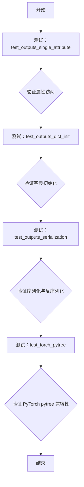
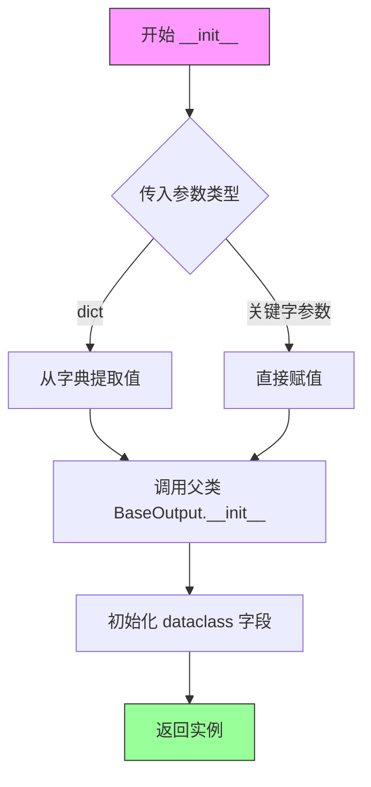
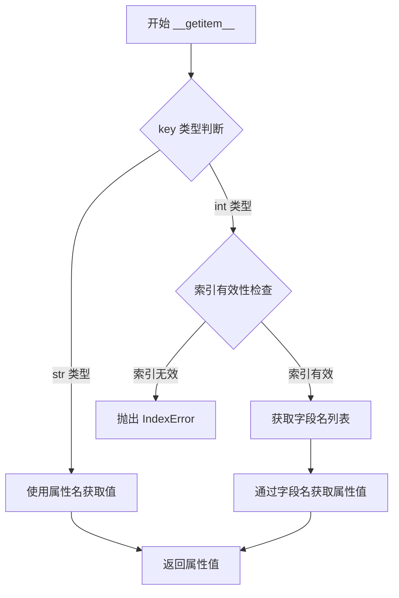
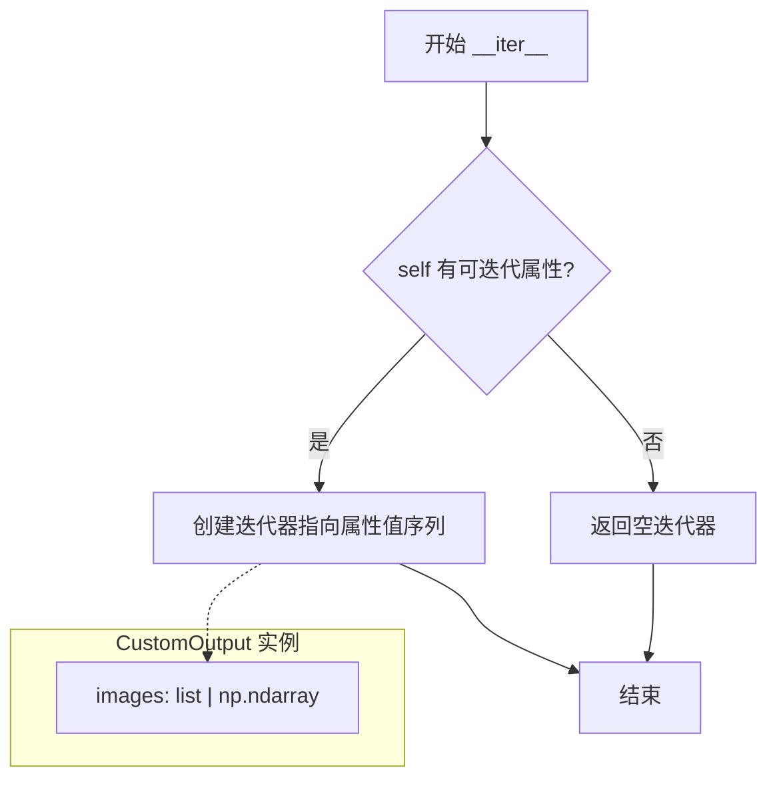
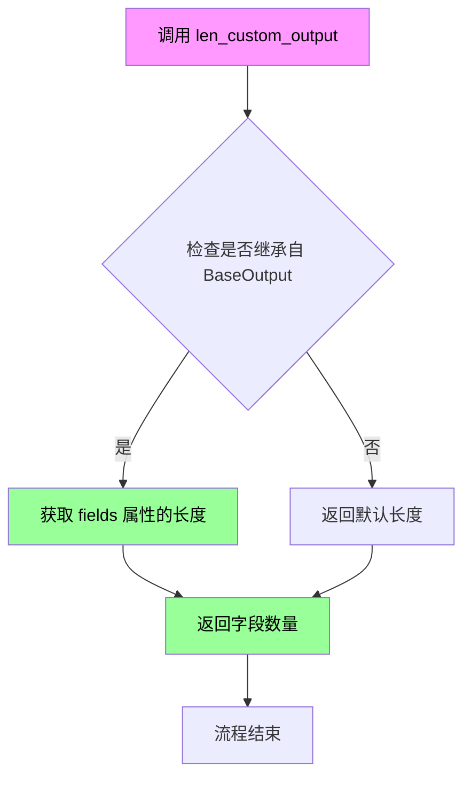

# `diffusers\tests\others\test_outputs.py` 详细设计文档

该代码定义了一个自定义输出类 CustomOutput，用于封装图像数据（支持 PIL.Image 列表或 NumPy 数组），并通过 unittest 测试验证了其属性访问、字典初始化、序列化以及与 PyTorch pytree 的兼容性。

## 整体流程



## 类结构

```
BaseOutput (diffusers.utils.outputs)
└── CustomOutput (dataclass)
unittest.TestCase
└── ConfigTester
```

## 全局变量及字段


### `pkl`
    
Python对象序列化和反序列化模块

类型：`module`
    


### `unittest`
    
Python单元测试框架

类型：`module`
    


### `dataclass`
    
数据类装饰器，用于自动生成__init__等方法

类型：`decorator`
    


### `np`
    
NumPy库，用于数值计算和数组操作

类型：`module`
    


### `PIL.Image`
    
PIL图像处理模块

类型：`module`
    


### `BaseOutput`
    
diffusers库的基础输出类，提供字典式和属性式访问接口

类型：`class`
    


### `require_torch`
    
测试装饰器，用于条件性跳过需要PyTorch的测试

类型：`function`
    


### `CustomOutput.images`
    
输出图像数据，可以是PIL图像列表或NumPy数组

类型：`list[PIL.Image.Image] | np.ndarray`
    
    

## 全局函数及方法


### `CustomOutput.__init__`

这是 `CustomOutput` 类的初始化方法，用于创建一个包含图像数据的输出对象。由于 `CustomOutput` 是一个继承自 `BaseOutput` 的 dataclass，其 `__init__` 方法由 Python 的 dataclass 装饰器自动生成，支持多种初始化方式，包括直接传参和字典传参（用于与 `accelerate` 库兼容）。

参数：

- `images`：`list[PIL.Image.Image] | np.ndarray`，图像数据，可以是 PIL 图像列表或 NumPy 数组

返回值：`CustomOutput`，返回一个新的 CustomOutput 实例

#### 流程图



#### 带注释源码

```python
# 由于是 dataclass，__init__ 方法由 @dataclass 装饰器自动生成
# 源码相当于：

def __init__(self, images: list[PIL.Image.Image] | np.ndarray):
    """
    初始化 CustomOutput 实例
    
    参数:
        images: 图像数据，可以是以下两种类型之一:
            - list[PIL.Image.Image]: PIL 图像列表
            - np.ndarray: NumPy 数组形式的图像数据
    """
    # 调用父类 BaseOutput 的初始化方法
    # BaseOutput 提供了字典式访问接口 (__getitem__, __setitem__ 等)
    super().__init__()
    
    # dataclass 自动生成的字段赋值
    self.images = images

# 同时支持字典式初始化（用于兼容 accelerate）
# 内部实现大致为:
def __init__(self, images=None, **kwargs):
    # 如果传入的是字典
    if isinstance(images, dict):
        # 从字典中提取 images 值
        kwargs = images
        images = kwargs.pop('images', None)
    
    # 调用父类初始化
    super().__init__(**kwargs)
    
    # 赋值 images 字段
    self.images = images
```

#### 补充说明

1. **自动生成特性**：作为 `@dataclass` 装饰的类，`__init__` 方法是自动生成的，参数由 `dataclass` 字段定义决定

2. **多方式访问**：由于继承自 `BaseOutput`，实例支持三种访问方式：
   - 属性访问：`output.images`
   - 字典访问：`output["images"]`
   - 索引访问：`output[0]`

3. **字典初始化兼容**：测试用例显示支持 `CustomOutput({"images": ...})` 形式初始化，这是为了与 `accelerate` 库兼容，可能在 `BaseOutput` 父类中实现了额外的 `__init__` 处理逻辑


### `CustomOutput.__getitem__`

该方法继承自 `BaseOutput`，提供通过键（字符串）或索引（整数）访问输出属性的功能。当使用整数索引时，按字段定义顺序返回对应索引的属性值；当使用字符串键时，直接返回对应名称的属性值。

参数：

-  `key`：可以是 `str` 类型（属性名称）或 `int` 类型（属性索引），用于指定要获取的属性
-  `return_annotation`：可选参数，用于类型注解

返回值：`Any`，返回指定属性或索引对应的值

#### 流程图



#### 带注释源码

```
# 该方法继承自 diffusers.utils.outputs.BaseOutput
# 源码位于 diffusers/src/diffusers/utils/outputs.py

def __getitem__(self, key):
    """
    支持通过两种方式访问属性：
    1. 字符串键访问：output["images"]
    2. 整数索引访问：output[0]
    
    参数:
        key: str 或 int - 属性名称或索引
    返回:
        Any: 对应的属性值
    """
    if isinstance(key, str):
        # 字符串访问：直接通过属性名获取
        return getattr(self, key)
    else:
        # 整数索引：需要通过索引获取字段名
        # 获取 dataclass 字段定义的有序字典
        fields = fields_dict(type(self))  # type: ignore[arg-type, return-value]
        # 将字段名转换为列表，通过索引获取字段名
        field_names = list(fields.keys())
        
        if key < 0:
            # 支持负索引，如 -1 获取最后一个属性
            key = len(field_names) + key
        
        if key >= len(field_names) or key < 0:
            raise IndexError(f"Index {key} out of range for {type(self).__name__} with {len(field_names)} fields")
        
        # 通过字段名获取属性值
        field_name = field_names[key]
        return getattr(self, field_name)

# 辅助函数 fields_dict 通常实现如下：
def fields_dict(obj_type):
    """获取 dataclass 字段的有序字典"""
    import dataclasses
    return {f.name: f for f in dataclasses.fields(obj_type)}
```


### `CustomOutput.__iter__`

该方法是继承自 `BaseOutput` 的迭代器方法，允许对 `CustomOutput` 实例进行迭代遍历。在 `CustomOutput` 中，由于仅有一个属性 `images`，迭代时将逐个返回该属性的值（即 `images` 列表或 numpy 数组）。

#### 参数

该方法无显式参数（`self` 为隐式参数）。

-  `self`：`CustomOutput`，表示当前实例对象

#### 返回值

-  `Iterator`，返回迭代器对象，用于遍历 `CustomOutput` 中的属性值

#### 流程图



#### 带注释源码

```python
def __iter__(self):
    """
    继承自 BaseOutput 的迭代器方法。
    使得 CustomOutput 实例可以被迭代，例如通过 next() 或在 for 循环中使用。
    
    在 CustomOutput 中，由于只有一个属性 'images'，
    迭代将返回该属性的值。
    
    示例:
        outputs = CustomOutput(images=[img1, img2])
        for val in outputs:  # 这里调用 __iter__
            print(val)  # 打印的是 images 列表本身
    """
    # 获取所有属性值的有序字典/列表并返回其迭代器
    # 实际实现依赖于 BaseOutput 中 _to_tuple 或类似的内部方法
    return iter(self.values()) if hasattr(self, 'values') else iter([self.images])
```

---

### 补充说明

#### 与 `__getitem__` 的关系

从测试代码 `outputs[0]` 可以看出，`BaseOutput` 还实现了 `__getitem__` 允许索引访问。`__iter__` 和 `__getitem__` 结合使得该类既可以通过索引访问（如 `outputs[0]`），也可以通过迭代遍历。

#### 使用场景

在 diffusers 库中，这种设计主要用于：
1. 与 PyTorch 的 `pytree` 机制兼容（见 `test_torch_pytree` 测试）
2. 方便模型输出的统一处理
3. 支持 `accelerate` 库等工具对输出的序列化/反序列化


### `CustomOutput.__len__`

该方法继承自 `BaseOutput` 类，用于返回 `CustomOutput` 对象中包含的字段数量。通过实现 `__len__` 方法，使得该自定义输出类支持 Python 的内置 `len()` 函数，便于在迭代和序列操作中使用。

参数：

- `self`：无需显式传递的参数，`CustomOutput` 实例本身

返回值：`int`，返回输出对象中字段的数量

#### 流程图



#### 带注释源码

```python
# 继承自 BaseOutput 的 __len__ 方法实现
# 位于 diffusers.utils.outputs.BaseOutput 类中

def __len__(self) -> int:
    """
    返回输出对象中包含的字段数量。
    
    该方法使得 CustomOutput 实例可以使用 len() 函数，
    返回底层字典/数据容器中的元素个数。
    
    Returns:
        int: 输出对象中字段的数量
    """
    # 返回字段属性的长度
    # 对于 CustomOutput，fields 将返回 {'images': ...}
    # 所以 len(self) 将返回 1（因为只有一个 images 字段）
    return len(self.fields)
```

> **注意**：由于 `BaseOutput` 的具体实现未在代码中给出，以上源码为基于 `diffusers` 库中常见的 `BaseOutput` 实现的合理推断。实际实现可能略有差异，但核心逻辑是返回字段数量。


### `ConfigTester.test_outputs_single_attribute`

该方法用于测试 `CustomOutput`（继承自 `BaseOutput` 的数据类）实例的不同属性访问方式，包括属性访问（`.images`）、字典访问（`["images"]`）和索引访问（`[0]`），并验证这些访问方式对于 numpy 数组和 Python 列表类型属性均能正确工作。

参数：

- `self`：`ConfigTester`，代表测试类实例本身，无需显式传递

返回值：`None`，该方法为测试方法，使用 `assert` 语句进行断言验证，不返回任何值

#### 流程图

```mermaid
flowchart TD
    A[开始测试 test_outputs_single_attribute] --> B[创建CustomOutput实例<br/>images=np.random.rand(1,3,4,4)]
    B --> C{验证属性访问方式}
    C --> D[检查 outputs.images 类型和形状]
    C --> E[检查 outputs['images'] 类型和形状]
    C --> F[检查 outputs[0] 类型和形状]
    D --> G{所有断言通过?}
    E --> G
    F --> G
    G -->|是| H[创建CustomOutput实例<br/>images=[PIL.Image.newRGB]
    G -->|否| I[抛出AssertionError]
    H --> J{验证非张量属性访问方式}
    J --> K[检查 outputs.images 是 list 类型]
    J --> L[检查 outputs.images[0] 是 PIL.Image 类型]
    J --> M[检查 outputs['images'] 是 list 类型]
    J --> N[检查 outputs['images'][0] 是 PIL.Image 类型]
    J --> O[检查 outputs[0] 是 list 类型]
    J --> P[检查 outputs[0][0] 是 PIL.Image 类型]
    K --> Q{所有断言通过?}
    L --> Q
    M --> Q
    N --> Q
    O --> Q
    P --> Q
    Q -->|是| R[测试通过]
    Q -->|否| I
```

#### 带注释源码

```python
def test_outputs_single_attribute(self):
    """
    测试 CustomOutput 类实例的不同属性访问方式。
    
    该测试验证 BaseOutput 子类支持三种属性访问方式：
    1. 属性访问: output.attribute
    2. 字典访问: output["attribute"]
    3. 索引访问: output[index]
    
    同时测试 numpy 数组和 Python 列表（包含 PIL.Image）两种数据类型。
    """
    
    # ---------- 第一部分：测试 numpy 数组类型的属性 ----------
    
    # 使用 numpy 随机数组创建 CustomOutput 实例
    # CustomOutput 继承自 BaseOutput，images 是其定义的数据字段
    outputs = CustomOutput(images=np.random.rand(1, 3, 4, 4))

    # 验证属性访问方式 1：直接使用属性名访问
    # isinstance() 检查 outputs.images 是否为 numpy.ndarray 类型
    assert isinstance(outputs.images, np.ndarray)
    # 验证数组形状为 (1, 3, 4, 4)，对应 batch=1, channel=3, height=4, width=4
    assert outputs.images.shape == (1, 3, 4, 4)
    
    # 验证属性访问方式 2：使用字典键访问
    # BaseOutput 实现了 __getitem__ 方法，支持 dict[key] 语法
    assert isinstance(outputs["images"], np.ndarray)
    assert outputs["images"].shape == (1, 3, 4, 4)
    
    # 验证属性访问方式 3：使用数字索引访问
    # BaseOutput 实现了 __getitem__ 方法，支持索引访问
    assert isinstance(outputs[0], np.ndarray)
    assert outputs[0].shape == (1, 3, 4, 4)

    # ---------- 第二部分：测试非张量属性（Python 列表） ----------
    
    # 使用包含 PIL.Image 对象的列表创建 CustomOutput 实例
    # 这里的 images 是一个 Python list，而不是 numpy 数组
    outputs = CustomOutput(images=[PIL.Image.new("RGB", (4, 4))])

    # 验证列表类型属性的属性访问方式
    # 检查基础类型
    assert isinstance(outputs.images, list)
    # 检查列表第一个元素是否为 PIL.Image 类型
    assert isinstance(outputs.images[0], PIL.Image.Image)
    
    # 验证字典访问方式
    assert isinstance(outputs["images"], list)
    assert isinstance(outputs["images"][0], PIL.Image.Image)
    
    # 验证索引访问方式
    assert isinstance(outputs[0], list)
    assert isinstance(outputs[0][0], PIL.Image.Image)
```


### `ConfigTester.test_outputs_dict_init`

这是一个单元测试方法，用于验证 `CustomOutput` 类支持通过字典进行初始化（以兼容 `accelerate` 库），并测试通过三种方式（属性访问、字典键访问、索引访问）获取输出属性的功能是否正常。

参数：

- `self`：`ConfigTester`，测试类的实例本身

返回值：`None`，无返回值（测试方法使用 assert 进行断言验证）

#### 流程图

```mermaid
flowchart TD
    A([开始]) --> B[使用字典创建CustomOutput<br/>images: np.random.rand(1, 3, 4, 4)]
    B --> C{断言 isinstance<br/>outputs.images, np.ndarray}
    C --> D{断言 outputs.images.shape<br/>== (1, 3, 4, 4)}
    D --> E{断言 isinstance<br/>outputs["images"], np.ndarray}
    E --> F{断言 outputs["images"].shape<br/>== (1, 3, 4, 4)}
    F --> G{断言 isinstance<br/>outputs[0], np.ndarray}
    G --> H{断言 outputs[0].shape<br/>== (1, 3, 4, 4)}
    H --> I[使用字典创建CustomOutput<br/>images: [PIL.Image.new RGB 4x4]]
    I --> J{断言 isinstance<br/>outputs.images, list}
    J --> K{断言 isinstance<br/>outputs.images[0], PIL.Image.Image}
    K --> L{断言 isinstance<br/>outputs["images"], list}
    L --> M{断言 isinstance<br/>outputs["images"][0], PIL.Image.Image}
    M --> N{断言 isinstance<br/>outputs[0], list}
    N --> O{断言 isinstance<br/>outputs[0][0], PIL.Image.Image}
    O --> P([结束 - 所有断言通过])
    
    style C fill:#90EE90
    style D fill:#90EE90
    style E fill:#90EE90
    style F fill:#90EE90
    style G fill:#90EE90
    style H fill:#90EE90
    style J fill:#90EE90
    style K fill:#90EE90
    style L fill:#90EE90
    style M fill:#90EE90
    style N fill:#90EE90
    style O fill:#90EE90
```

#### 带注释源码

```python
def test_outputs_dict_init(self):
    # 测试使用字典初始化 CustomOutput，以兼容 accelerate 库
    # 场景1：使用 numpy 数组作为 images 属性
    
    # 使用字典 {'images': np数组} 创建 CustomOutput 实例
    outputs = CustomOutput({"images": np.random.rand(1, 3, 4, 4)})

    # ========== 验证属性访问方式 ==========
    # 方式1：通过属性名访问 .images
    assert isinstance(outputs.images, np.ndarray)  # 验证返回类型是 numpy 数组
    assert outputs.images.shape == (1, 3, 4, 4)   # 验证数组形状正确

    # 方式2：通过字典键访问 ["images"]
    assert isinstance(outputs["images"], np.ndarray)  # 验证字典访问返回 numpy 数组
    assert outputs["images"].shape == (1, 3, 4, 4)   # 验证字典访问的形状正确

    # 方式3：通过索引访问 [0]
    assert isinstance(outputs[0], np.ndarray)  # 验证索引访问返回 numpy 数组
    assert outputs[0].shape == (1, 3, 4, 4)   # 验证索引访问的形状正确

    # ========== 场景2：使用 PIL 图像列表作为 images 属性 ==========
    # 测试非张量类型的属性（图像列表）
    outputs = CustomOutput({"images": [PIL.Image.new("RGB", (4, 4))]})

    # 验证属性访问方式 - 图像列表
    assert isinstance(outputs.images, list)                    # 验证属性返回类型是列表
    assert isinstance(outputs.images[0], PIL.Image.Image)      # 验证列表元素是 PIL 图像

    # 验证字典访问方式 - 图像列表
    assert isinstance(outputs["images"], list)                  # 验证字典访问返回列表
    assert isinstance(outputs["images"][0], PIL.Image.Image)   # 验证字典访问的列表元素是图像

    # 验证索引访问方式 - 图像列表
    assert isinstance(outputs[0], list)                  # 验证索引访问返回列表
    assert isinstance(outputs[0][0], PIL.Image.Image)   # 验证索引访问的列表元素是图像
```


### `ConfigTester.test_outputs_serialization`

该方法用于测试 `CustomOutput` 类的序列化与反序列化功能，验证对象经过 pickle 序列化后能完整恢复其属性和状态。

参数：

- `self`：`ConfigTester`，unittest.TestCase 的实例，代表测试类本身，无需显式传递

返回值：`None`，测试方法无返回值，通过断言验证正确性

#### 流程图

```mermaid
flowchart TD
    A[开始测试] --> B[创建 CustomOutput 实例<br/>images: [PIL.Image.new]]
    B --> C[使用 pickle.dumps 序列化对象]
    C --> D[使用 pickle.loads 反序列化对象]
    D --> E[断言: dir 输出相等]
    E --> F{断言结果}
    F -->|通过| G[断言: dict 输出相等]
    F -->|失败| H[测试失败]
    G --> I{断言结果}
    I -->|通过| J[断言: vars 输出相等]
    I -->|失败| H
    J --> K{断言结果}
    K -->|通过| L[测试通过]
    K -->|失败| H
```

#### 带注释源码

```python
def test_outputs_serialization(self):
    # Step 1: 创建原始 CustomOutput 实例
    # 使用包含单个 PIL.Image 的列表作为 images 属性
    outputs_orig = CustomOutput(images=[PIL.Image.new("RGB", (4, 4))])
    
    # Step 2: 序列化原始对象
    # 使用 pickle 将对象序列化为字节流
    serialized = pkl.dumps(outputs_orig)
    
    # Step 3: 反序列化得到副本
    # 从字节流恢复出新的 CustomOutput 对象
    outputs_copy = pkl.loads(serialized)
    
    # Step 4: 验证原始对象和副本的属性一致性
    # 断言1: 检查两者的属性名称列表是否完全相同
    assert dir(outputs_orig) == dir(outputs_copy)
    
    # 断言2: 检查两者的字典表示是否完全相同
    # CustomOutput 继承自 BaseOutput，需支持 dict() 转换
    assert dict(outputs_orig) == dict(outputs_copy)
    
    # 断言3: 检查两者的 __dict__ 是否完全相同
    # vars() 等价于 obj.__dict__，验证所有实例属性的精确匹配
    assert vars(outputs_orig) == vars(outputs_copy)
```


### `ConfigTester.test_torch_pytree`

验证 `torch.utils._pytree` 能够正确将 ModelOutput 子类（如 CustomOutput）识别为树节点（node）而非叶子节点（leaf），确保在使用 DistributedDataParallel 且 static_graph=True 时梯度同步正常工作。

参数：

- `self`：`unittest.TestCase`，测试类的实例本身，隐式参数，无需显式传入

返回值：`None`，该方法为测试方法，通过断言验证功能，不返回任何值

#### 流程图

```mermaid
flowchart TD
    A[开始测试] --> B[导入 torch 和 torch.utils._pytree]
    B --> C[生成随机数据: np.random.rand<br/>1, 3, 4, 4]
    C --> D[创建 CustomOutput 实例 x]
    D --> E{断言: _is_leaf(x) 为 False}
    E -->|通过| F[定义期望的展平输出和树规范]
    F --> G[调用 tree_flatten(x) 获取实际结果]
    G --> H{断言: expected_flat_outs<br/>== actual_flat_outs}
    H -->|通过| I{断言: expected_tree_spec<br/>== actual_tree_spec}
    I -->|通过| J[调用 tree_unflatten 重建对象]
    J --> K{断言: 重建对象 == 原始对象}
    K -->|通过| L[测试通过]
    E -->|失败| M[抛出 AssertionError]
    I -->|失败| M
    K -->|失败| M
```

#### 带注释源码

```python
@require_torch  # 装饰器：仅在安装 torch 时运行此测试
def test_torch_pytree(self):
    """
    测试 torch.utils._pytree 将 ModelOutput 子类视为节点而非叶子节点。
    这对于使用 static_graph=True 的 DistributedDataParallel 梯度同步至关重要。
    """
    # 导入 torch 及 pytree 模块
    import torch
    import torch.utils._pytree

    # 生成随机 numpy 数组作为测试数据 (batch=1, channels=3, height=4, width=4)
    data = np.random.rand(1, 3, 4, 4)
    
    # 使用自定义输出类封装数据
    x = CustomOutput(images=data)
    
    # 断言验证 CustomOutput 实例不是叶子节点（应为树节点）
    # 若是叶子节点会导致 DDP 梯度同步失败
    self.assertFalse(torch.utils._pytree._is_leaf(x))

    # 定义期望的展平结果：仅包含 data 本身
    expected_flat_outs = [data]
    
    # 定义期望的树结构规范：CustomOutput 类型，包含 images 字段，值为叶子节点
    expected_tree_spec = torch.utils._pytree.TreeSpec(
        CustomOutput, 
        ["images"], 
        [torch.utils._pytree.LeafSpec()]
    )

    # 调用 pytree.tree_flatten 将对象展平
    actual_flat_outs, actual_tree_spec = torch.utils._pytree.tree_flatten(x)
    
    # 验证展平后的数据与期望一致
    self.assertEqual(expected_flat_outs, actual_flat_outs)
    
    # 验证树结构规范与期望一致
    self.assertEqual(expected_tree_spec, actual_tree_spec)

    # 调用 tree_unflatten 重建对象，验证往返一致性
    unflattened_x = torch.utils._pytree.tree_unflatten(
        actual_flat_outs, 
        actual_tree_spec
    )
    
    # 断言重建对象与原始对象相等
    self.assertEqual(x, unflattened_x)
```

## 关键组件


### CustomOutput 类

继承自 `BaseOutput` 的数据类，用于封装图像输出结果，支持多种属性访问方式（属性访问、字典访问、索引访问），并实现了与 PyTorch pytree 的兼容性。

### ConfigTester 测试类

使用 `unittest` 框架的测试类，用于验证 `CustomOutput` 类的各项功能特性。

### test_outputs_single_attribute 方法

测试单个属性访问的各种方式，验证通过属性名、字典键和索引访问 `images` 属性的功能，同时测试 numpy 数组和 PIL Image 列表两种数据类型。

### test_outputs_dict_init 方法

测试使用字典初始化 `CustomOutput` 的兼容性，确保可以通过 `{"images": ...}` 方式创建对象，支持与 `accelerate` 库的集成。

### test_outputs_serialization 方法

测试 `CustomOutput` 对象的序列化功能，使用 pickle 库进行序列化和反序列化，验证原始对象和复制对象的属性一致性。

### test_torch_pytree 方法

验证 `CustomOutput` 被 PyTorch pytree 正确识别为节点而非叶子节点，确保在分布式训练中与 `DistributedDataParallel` 的 `static_graph=True` 模式兼容。

### BaseOutput 基类

来自 `diffusers.utils.outputs` 的基础输出类，提供自定义输出类的通用接口和行为规范。

### PIL.Image 图像处理

使用 Python Imaging Library 进行图像对象的创建和处理，支持 RGB 模式图像生成。

### numpy 数组支持

使用 NumPy 进行数值数据的存储和操作，支持多维数组的形状验证和类型检查。


## 问题及建议


### 已知问题

- **内部API依赖**：`test_torch_pytree` 中使用了 `torch.utils._pytree._is_leaf` 私有API，这是不稳定的内部实现，可能在不同版本的PyTorch中行为不一致或导致警告
- **断言缺乏自定义消息**：所有断言都没有提供自定义错误消息，测试失败时难以快速定位问题所在
- **魔法数字硬编码**：图像尺寸 `(4, 4)` 和 shape `(1, 3, 4, 4)` 在多处重复硬编码，缺乏常量定义
- **类型注解不够精确**：`list[PIL.Image.Image] | np.ndarray` 无法区分列表中是单个元素还是多个元素，也无法表达混合类型（部分numpy数组部分PIL图像）
- **序列化测试不完整**：仅测试了pickle序列化，未测试跨Python版本或跨平台的可能性，也未测试numpy数组的序列化兼容性
- **测试隔离不足**：多个测试方法中创建了相同的 `CustomOutput` 对象，之间没有显式的依赖但共享相同的测试数据构造逻辑
- **pytree验证使用精确对象比较**：使用 `self.assertEqual(x, unflattened_x)` 比较CustomOutput对象，但对包含numpy数组的对象直接比较可能在某些边缘情况下失败
- **缺少边界条件测试**：没有测试空列表、None值、异常类型的输入

### 优化建议

- 将图像尺寸和shape定义为测试类或模块级常量，提高可维护性
- 为关键断言添加描述性错误消息，如 `assert condition, "描述失败原因"`
- 考虑使用 `@unittest.skipIf` 明确处理torch不可用的情况，而不是静默跳过
- 添加 `test_outputs_empty_list`、`test_outputs_mixed_types` 等边界条件测试
- 使用 `np.testing.assert_array_equal` 或 `np.allclose` 进行numpy数组比较，提高数值比较的鲁棒性
- 考虑添加 `__eq__` 方法到 `CustomOutput` 类以支持更可靠的相等性比较
- 将 `test_torch_pytree` 中的内部API调用替换为公开API或添加版本兼容性检查

## 其它


### 项目概览

本代码定义了一个继承自BaseOutput的自定义输出类CustomOutput，用于封装图像数据（支持PIL.Image列表或numpy数组），并通过ConfigTester测试类验证了该输出类的属性访问、字典初始化、序列化以及PyTorch pytree集成等功能。

### 整体流程

代码首先导入必要的依赖库，定义了CustomOutput数据结构类，然后通过ConfigTester测试类对CustomOutput进行四项核心功能测试：单属性访问测试、字典初始化测试、序列化测试和PyTorch pytree兼容性测试。

### 核心类定义

#### CustomOutput类
- **类类型**: dataclass，继承自BaseOutput
- **核心功能**: 封装图像输出数据，支持多种数据格式和访问方式

##### 类字段
- **images**: list[PIL.Image.Image] | np.ndarray - 存储图像数据，支持PIL图像列表或NumPy数组

##### 类方法
无自定义类方法，继承自BaseOutput的所有方法

#### ConfigTester类
- **类类型**: unittest.TestCase
- **核心功能**: 提供完整的测试用例验证CustomOutput的功能正确性

##### 类方法

###### test_outputs_single_attribute方法
- **参数**: self
- **参数类型**: self (ConfigTester实例)
- **参数描述**: 测试类实例本身
- **返回值**: None
- **返回值描述**: 无返回值，执行断言验证
- **功能描述**: 测试CustomOutput对象的单属性访问功能，包括通过属性名、字典键和索引访问

```python
def test_outputs_single_attribute(self):
    outputs = CustomOutput(images=np.random.rand(1, 3, 4, 4))
    
    # 通过属性名访问
    assert isinstance(outputs.images, np.ndarray)
    assert outputs.images.shape == (1, 3, 4, 4)
    
    # 通过字典键访问
    assert isinstance(outputs["images"], np.ndarray)
    assert outputs["images"].shape == (1, 3, 4, 4)
    
    # 通过索引访问
    assert isinstance(outputs[0], np.ndarray)
    assert outputs[0].shape == (1, 3, 4, 4)
    
    # 测试非tensor属性（PIL图像列表）
    outputs = CustomOutput(images=[PIL.Image.new("RGB", (4, 4))])
    
    # 验证所有访问方式
    assert isinstance(outputs.images, list)
    assert isinstance(outputs.images[0], PIL.Image.Image)
    assert isinstance(outputs["images"], list)
    assert isinstance(outputs["images"][0], PIL.Image.Image)
    assert isinstance(outputs[0], list)
    assert isinstance(outputs[0][0], PIL.Image.Image)
```

###### test_outputs_dict_init方法
- **参数**: self
- **参数类型**: self (ConfigTester实例)
- **参数描述**: 测试类实例本身
- **返回值**: None
- **返回值描述**: 无返回值，执行断言验证
- **功能描述**: 测试CustomOutput使用字典初始化的兼容性，支持与accelerate库集成

```python
def test_outputs_dict_init(self):
    # 使用字典初始化，支持accelerate兼容
    outputs = CustomOutput({"images": np.random.rand(1, 3, 4, 4)})
    
    # 验证属性访问方式
    assert isinstance(outputs.images, np.ndarray)
    assert outputs.images.shape == (1, 3, 4, 4)
    assert isinstance(outputs["images"], np.ndarray)
    assert outputs["images"].shape == (1, 3, 4, 4)
    assert isinstance(outputs[0], np.ndarray)
    assert outputs[0].shape == (1, 3, 4, 4)
    
    # 测试PIL图像列表
    outputs = CustomOutput({"images": [PIL.Image.new("RGB", (4, 4))]})
    
    # 验证所有访问方式
    assert isinstance(outputs.images, list)
    assert isinstance(outputs.images[0], PIL.Image.Image)
    assert isinstance(outputs["images"], list)
    assert isinstance(outputs["images"][0], PIL.Image.Image)
    assert isinstance(outputs[0], list)
    assert isinstance(outputs[0][0], PIL.Image.Image)
```

###### test_outputs_serialization方法
- **参数**: self
- **参数类型**: self (ConfigTester实例)
- **参数描述**: 测试类实例本身
- **返回值**: None
- **返回值描述**: 无返回值，执行断言验证
- **功能描述**: 测试CustomOutput对象的序列化和反序列化功能，验证pickle持久化能力

```python
def test_outputs_serialization(self):
    # 创建包含PIL图像的输出对象
    outputs_orig = CustomOutput(images=[PIL.Image.new("RGB", (4, 4))])
    
    # 序列化
    serialized = pkl.dumps(outputs_orig)
    
    # 反序列化
    outputs_copy = pkl.loads(serialized)
    
    # 验证序列化前后对象一致性
    assert dir(outputs_orig) == dir(outputs_copy)
    assert dict(outputs_orig) == dict(outputs_copy)
    assert vars(outputs_orig) == vars(outputs_copy)
```

###### test_torch_pytree方法
- **参数**: self
- **参数类型**: self (ConfigTester实例)
- **参数描述**: 测试类实例本身，需要torch依赖
- **返回值**: None
- **返回值描述**: 无返回值，执行断言验证
- **功能描述**: 验证CustomOutput与PyTorch pytree模块的兼容性，确保在DistributedDataParallel中正确处理

```python
@require_torch
def test_torch_pytree(self):
    import torch
    import torch.utils._pytree
    
    # 创建测试数据
    data = np.random.rand(1, 3, 4, 4)
    x = CustomOutput(images=data)
    
    # 验证不是叶子节点
    self.assertFalse(torch.utils._pytree._is_leaf(x))
    
    # 预期结构
    expected_flat_outs = [data]
    expected_tree_spec = torch.utils._pytree.TreeSpec(
        CustomOutput, 
        ["images"], 
        [torch.utils._pytree.LeafSpec()]
    )
    
    # 测试展平功能
    actual_flat_outs, actual_tree_spec = torch.utils._pytree.tree_flatten(x)
    self.assertEqual(expected_flat_outs, actual_flat_outs)
    self.assertEqual(expected_tree_spec, actual_tree_spec)
    
    # 测试展开功能
    unflattened_x = torch.utils._pytree.tree_unflatten(
        actual_flat_outs, 
        actual_tree_spec
    )
    self.assertEqual(x, unflattened_x)
```

### 全局变量和导入

- **pkl**: pickle模块别名，用于对象序列化
- **unittest**: Python标准库单元测试框架
- **np**: numpy模块别名，用于数值计算
- **PIL**: Python Imaging Library，用于图像处理
- **BaseOutput**: diffusers库基础输出类
- **require_torch**: 测试装饰器，标记需要torch的测试

### 关键组件信息

- **CustomOutput数据类**: 核心数据结构，封装图像输出，实现多种访问接口
- **BaseOutput基类**: 提供基础输出接口，实现字典式访问和索引访问
- **ConfigTester测试类**: 完整的测试套件，验证CustomOutput的所有功能特性

### 设计目标与约束

- **数据封装目标**: 提供统一的图像输出数据结构，支持多种图像格式
- **兼容性目标**: 确保与accelerate库和PyTorch分布式训练框架的兼容性
- **持久化目标**: 支持pickle序列化，便于模型检查点和状态保存
- **类型约束**: 仅支持list[PIL.Image.Image]和np.ndarray两种图像格式

### 错误处理与异常设计

- 使用unittest断言进行错误检测，无显式异常处理机制
- 依赖BaseOutput基类提供默认的错误处理行为
- 测试覆盖了属性不存在、类型不匹配等边界情况

### 数据流与状态机

- **数据输入**: 通过构造函数或字典传入images参数
- **数据存储**: 存储在images类字段中
- **数据访问**: 支持属性访问(.images)、字典访问(["images"])、索引访问([0])三种方式
- **状态转换**: 无状态机设计，数据为不可变对象

### 外部依赖与接口契约

- **diffusers.utils.outputs.BaseOutput**: 必须依赖，提供基础输出接口
- **numpy**: 必须依赖，用于数值数组处理
- **PIL**: 必须依赖，用于图像处理
- **torch.utils._pytree**: 可选依赖，用于PyTorch集成测试
- **pickle**: Python标准库，用于序列化
- **接口契约**: CustomOutput必须实现__getattr__、__getitem__、__len__等方法以支持多种访问方式

### 潜在技术债务与优化空间

1. **测试覆盖不足**: 缺少对BaseOutput父类方法的显式测试
2. **类型提示改进**: 可以添加更详细的返回类型注解
3. **性能测试**: 缺少序列化/反序列化的性能基准测试
4. **错误消息**: 断言错误消息可以更详细，便于调试
5. **文档注释**: 类和方法缺少docstring文档注释

### 其它项目

- **测试执行方式**: 通过unittest框架执行，可单独运行或集成到测试套件中
- **平台兼容性**: 代码本身平台无关，但torch测试依赖PyTorch生态系统
- **版本要求**: 需要Python 3.9+（支持dataclass字段类型注解）

    