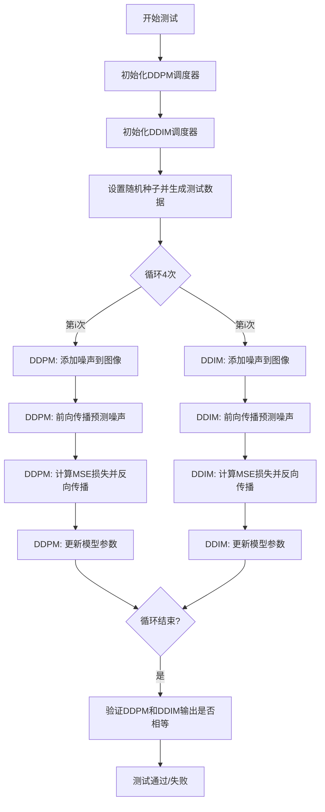
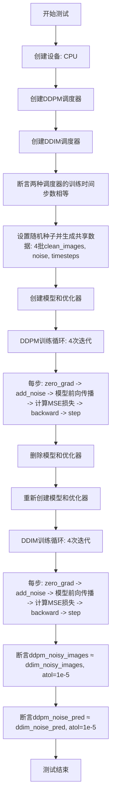

# `diffusers\tests\others\test_training.py` 详细设计文档

该代码是一个Diffusers库的单元测试文件，通过比较DDPM和DDIM两种噪声调度器在相同训练步骤下的输出，验证它们在去噪预测和噪声添加过程中的一致性。

## 整体流程



## 类结构

```
unittest.TestCase
└── TrainingTests (测试训练步骤等价性)
```

## 全局变量及字段


### `torch.backends.cuda.matmul.allow_tf32`
    
全局配置属性，控制CUDA矩阵乘法是否允许使用TF32（TensorFloat-32）精度以提高计算性能，设置为False可确保更高精度但可能牺牲部分性能

类型：`bool`
    


    

## 全局函数及方法


### `TrainingTests.get_model_optimizer`

该方法是 `TrainingTests` 类的私有辅助方法，用于创建一个用于测试的 `UNet2DModel` 模型实例及其对应的 SGD 优化器，确保测试环境的可复现性。

参数：

- `resolution`：`int`，可选参数，默认值为 `32`，指定创建模型的样本尺寸（分辨率）。

返回值：`tuple`，返回包含模型和优化器的元组。其中 `model` 是 `UNet2DModel` 实例，`optimizer` 是 `torch.optim.SGD` 实例。

#### 流程图

```mermaid
flowchart TD
    A[方法开始] --> B[调用 set_seed 设置随机种子为 0]
    B --> C[创建 UNet2DModel 实例]
    C --> D[配置模型参数: sample_size=resolution, in_channels=3, out_channels=3]
    D --> E[创建 SGD 优化器]
    E --> F[配置优化器: 学习率 lr=0.0001]
    F --> G[返回 (model, optimizer) 元组]
    G --> H[方法结束]
```

#### 带注释源码

```python
def get_model_optimizer(self, resolution=32):
    """
    创建并返回一个用于测试的UNet2DModel模型及其SGD优化器。
    
    参数:
        resolution (int): 模型输入/输出的空间分辨率，默认为32。
                         决定UNet2DModel的sample_size参数。
    
    返回:
        tuple: 包含以下两个元素的元组:
            - model (UNet2DModel): 初始化后的UNet2DModel实例
            - optimizer (torch.optim.SGD): 配置好的SGD优化器
    """
    # 设置随机种子为0，确保测试结果的可复现性
    set_seed(0)
    
    # 创建UNet2DModel模型实例
    # sample_size: 输入图像的空间尺寸
    # in_channels: 输入通道数（3对应RGB图像）
    # out_channels: 输出通道数（3对应RGB图像）
    model = UNet2DModel(sample_size=resolution, in_channels=3, out_channels=3)
    
    # 创建SGD优化器，用于模型参数更新
    # params: 模型的所有可训练参数
    # lr: 学习率，设置为0.0001
    optimizer = torch.optim.SGD(model.parameters(), lr=0.0001)
    
    # 返回模型和优化器元组，供调用者使用
    return model, optimizer
```


### `TrainingTests.test_training_step_equality`

这是一个测试方法，用于验证 DDPM（去噪扩散概率模型）和 DDIM（去噪扩散隐式模型）调度器在训练步骤中产生的噪声图像和噪声预测是否相等，以确保两种不同的扩散调度器在相同条件下产生一致的结果。

参数：

- `self`：`TrainingTests`，测试类的实例，隐含参数

返回值：`None`，该方法为测试方法，不返回任何值，通过 `assert` 语句进行断言验证

#### 流程图



#### 带注释源码

```python
@slow  # 标记为慢速测试
def test_training_step_equality(self):
    """
    测试方法：验证DDPM和DDIM调度器在训练步骤上的相等性
    
    该测试确保在相同条件下，DDPM和DDIM两种扩散调度器
    产生的噪声图像和噪声预测结果相近
    """
    # 设置设备为CPU以确保完全确定性，无需设置CUBLAS_WORKSPACE_CONFIG环境变量
    device = "cpu"
    
    # 创建DDPMScheduler调度器
    # num_train_timesteps: 训练时间步数
    # beta_start/end: beta调度线性起始/结束值
    # clip_sample: 是否裁剪样本到[-1,1]范围
    ddpm_scheduler = DDPMScheduler(
        num_train_timesteps=1000,
        beta_start=0.0001,
        beta_end=0.02,
        beta_schedule="linear",
        clip_sample=True,
    )
    
    # 创建DDIMScheduler调度器，参数与DDPM相同
    ddim_scheduler = DDIMScheduler(
        num_train_timesteps=1000,
        beta_start=0.0001,
        beta_end=0.02,
        beta_schedule="linear",
        clip_sample=True,
    )
    
    # 断言两种调度器的训练时间步数相等
    assert ddpm_scheduler.config.num_train_timesteps == ddim_scheduler.config.num_train_timesteps
    
    # 设置随机种子为0，确保DDPM和DDIM使用相同的随机数据
    set_seed(0)
    
    # 生成4批共享数据：干净图像、噪声、时间步
    # clean_images: 4个(4,3,32,32)的张量，值裁剪到[-1,1]
    # noise: 4个(4,3,32,32)的张量
    # timesteps: 4个(4,)的张量，值为0-999的随机整数
    clean_images = [torch.randn((4, 3, 32, 32)).clip(-1, 1).to(device) for _ in range(4)]
    noise = [torch.randn((4, 3, 32, 32)).to(device) for _ in range(4)]
    timesteps = [torch.randint(0, 1000, (4,)).long().to(device) for _ in range(4)]
    
    # ========== 使用DDPM调度器进行训练 ==========
    # 获取模型和优化器
    model, optimizer = self.get_model_optimizer(resolution=32)
    
    # 设置模型为训练模式并移动到设备
    model.train().to(device)
    
    # 训练4步
    for i in range(4):
        optimizer.zero_grad()  # 清零梯度
        
        # 使用DDPM调度器添加噪声到干净图像
        ddpm_noisy_images = ddpm_scheduler.add_noise(clean_images[i], noise[i], timesteps[i])
        
        # 模型预测噪声
        ddpm_noise_pred = model(ddpm_noisy_images, timesteps[i]).sample
        
        # 计算MSE损失：预测噪声 vs 真实噪声
        loss = torch.nn.functional.mse_loss(ddpm_noise_pred, noise[i])
        
        loss.backward()  # 反向传播
        optimizer.step() # 更新参数
    
    # 清理DDPM模型和优化器
    del model, optimizer
    
    # ========== 使用DDIM调度器进行训练 ==========
    # 重新创建模型和优化器，确保与DDPM训练从相同初始状态开始
    model, optimizer = self.get_model_optimizer(resolution=32)
    model.train().to(device)
    
    # 训练4步
    for i in range(4):
        optimizer.zero_grad()  # 清零梯度
        
        # 使用DDIM调度器添加噪声到干净图像
        ddim_noisy_images = ddim_scheduler.add_noise(clean_images[i], noise[i], timesteps[i])
        
        # 模型预测噪声
        ddim_noise_pred = model(ddim_noisy_images, timesteps[i]).sample
        
        # 计算MSE损失
        loss = torch.nn.functional.mse_loss(ddim_noise_pred, noise[i])
        
        loss.backward()  # 反向传播
        optimizer.step() # 更新参数
    
    # 清理DDIM模型和优化器
    del model, optimizer
    
    # ========== 验证结果 ==========
    # 断言：DDPM和DDIM产生的噪声图像在容差1e-5内相等
    self.assertTrue(torch.allclose(ddpm_noisy_images, ddim_noisy_images, atol=1e-5))
    
    # 断言：DDPM和DDIM产生的噪声预测在容差1e-5内相等
    self.assertTrue(torch.allclose(ddpm_noise_pred, ddim_noise_pred, atol=1e-5))
```

## 关键组件


### 张量索引与惰性加载

代码使用列表存储多个张量（clean_images、noise、timesteps），通过索引i访问每次迭代所需的数据，实现惰性加载而非一次性加载所有数据到内存。

### 反量化支持

使用`.clip(-1, 1)`将生成的随机图像值限制在[-1, 1]范围内，模拟反量化操作，确保输入图像值在合理的像素范围内。

### 调度器组件

包含DDPMScheduler和DDIMScheduler两个调度器，用于在扩散模型训练过程中向干净图像添加噪声，支持线性beta调度和样本裁剪。

### UNet2DModel模型

用于denoising的2D UNet模型，输入为加噪图像和时间步，输出预测的噪声。

### 训练流程控制

通过4次迭代的训练循环，对比DDPM和DDIM调度器在相同输入下的训练步骤相等性，验证两种调度器的兼容性。

### 确定性控制

使用set_seed(0)和CPU设备确保训练过程的可重复性，禁用TF32以保证结果的一致性。

### 损失计算与反向传播

使用MSE损失函数计算预测噪声与真实噪声之间的差异，通过backward()和optimizer.step()完成参数更新。


## 问题及建议


### 已知问题

- **变量作用域与比较逻辑错误**：在for循环外部使用的变量`ddpm_noisy_images`、`ddpm_noise_pred`、`ddim_noisy_images`、`ddim_noise_pred`在循环结束后只保留最后一次迭代（i=3）的值，但测试名称`test_training_step_equality`暗示比较单个训练步骤的相等性，实际上比较的是第4次迭代的结果
- **硬编码魔法数字**：分辨率32、批量大小4、迭代次数4、学习率0.0001、时间步数1000等参数均为硬编码，缺乏可配置性
- **代码重复**：DDPM和DDIM的训练循环逻辑几乎完全相同，仅调度器不同，存在重复代码
- **资源清理不规范**：使用`del`手动删除变量而非`try-finally`上下文管理器，且调度器对象未显式清理
- **测试隔离性不足**：`set_seed(0)`在多处调用，且共享`clean_images`、`noise`、`timesteps`数据，可能导致测试间的隐式依赖
- **设备管理不灵活**：硬编码`device = "cpu"`，无法利用GPU加速测试，且未提供CUDA可用性检测

### 优化建议

- **修复变量使用逻辑**：在循环内收集每次迭代的结果，或使用列表存储所有迭代的输出，明确测试的是"多次训练步骤后相等"还是"单步相等"
- **参数化测试**：使用`unittest.parameterized`或`pytest.mark.parametrize`将硬编码参数提取为测试参数
- **提取公共训练函数**：将重复的训练逻辑封装为`_train_with_scheduler(scheduler, ...)`函数
- **改进资源管理**：使用上下文管理器或`try-finally`确保资源释放，或依赖Python垃圾回收
- **增强测试独立性**：在`setUp`方法中初始化随机种子，每个测试使用独立的输入数据
- **动态设备选择**：添加`torch.cuda.is_available()`检测，优先使用CUDA设备
- **添加中间断言**：可增加对每次迭代损失值的检查，验证训练动态

## 其它


### 设计目标与约束

本测试代码的设计目标是验证DDPM（Denoising Diffusion Probabilistic Models）和DDIM（Denoising Diffusion Implicit Models）两种扩散模型调度器在训练步骤上的输出一致性。约束条件包括：1）使用CPU设备以确保完全确定性，避免CUBLAS_WORKSPACE_CONFIG环境变量配置；2）设置torch.backends.cuda.matmul.allow_tf32=False以禁用TF32计算精度，确保数值精度一致性；3）使用固定随机种子（set_seed(0)）确保可重复性；4）使用SGD优化器和固定学习率0.0001；5）测试使用小批量（batch_size=4）和低分辨率（32x32）图像以减少测试时间。

### 错误处理与异常设计

本测试代码采用Python unittest框架进行错误处理与异常设计。主要包括：1）使用assert语句验证调度器配置参数一致性（num_train_timesteps）；2）使用torch.allclose()配合atol=1e-5容差进行浮点数近似相等判断，替代精确相等判断以处理数值精度问题；3）测试方法使用@slow装饰器标记为慢速测试，便于测试套件分类执行；4）使用del关键字显式删除模型和优化器对象以释放GPU/CPU内存；5）通过device="cpu"确保测试在CPU上运行以获得确定性结果。

### 外部依赖与接口契约

本测试代码依赖以下外部组件和接口契约：1）torch库：用于张量操作、优化器（SGD）和损失计算（MSELoss）；2）diffusers库：提供UNet2DModel（2D UNet模型）、DDPMScheduler（DDPM调度器）和DDIMScheduler（DDIM调度器）；3）diffusers.training_utils模块：提供set_seed函数用于设置随机种子；4）测试工具：slow装饰器用于标记慢速测试；5）调度器接口契约：add_noise(clean_images, noise, timesteps)方法返回加噪图像，模型forward(x, timesteps)返回噪声预测。

### 性能考虑

本测试代码的性能考虑包括：1）使用CPU而非GPU进行计算，避免CUDA非确定性行为；2）禁用TF32计算以确保数值精度；3）使用小尺寸图像（32x32）和少量迭代（4次）以缩短测试时间；4）显式删除模型对象以释放内存；5）使用torch.inference_mode()或.eval()模式（虽然代码中使用.train()）可以进一步优化内存使用；6）可以考虑使用torch.no_grad()包装推理部分以减少内存占用。

### 测试策略

本测试采用对比验证的测试策略：1）首先使用DDPM调度器执行完整训练循环，记录加噪图像和噪声预测结果；2）然后重新创建模型和优化器，使用DDIM调度器执行相同的训练循环；3）最后对比两种调度器产生的中间结果（ddpm_noisy_images与ddim_noisy_images、ddpm_noise_pred与ddim_noise_pred）是否在容差范围内相等；4）这种测试策略验证了两种不同扩散采样方法在训练阶段的数学等价性。

### 配置管理

本测试代码的配置管理通过硬编码参数实现：1）图像分辨率：resolution=32；2）通道数：in_channels=3, out_channels=3；3）调度器参数：num_train_timesteps=1000, beta_start=0.0001, beta_end=0.02, beta_schedule="linear", clip_sample=True；4）训练参数：学习率0.0001，训练轮次4次，批量大小4；5）随机种子：0；6）容差设置：atol=1e-5；7）时间步范围：0到1000。

    