# `diffusers\tests\others\test_video_processor.py` 详细设计文档

这是一个单元测试文件，用于测试 diffusers 库中 VideoProcessor 类的视频预处理和后处理功能，支持多种输入输出格式（PIL Images、numpy 数组、PyTorch 张量）之间的转换，并验证数据在处理前后的完整性。

## 整体流程

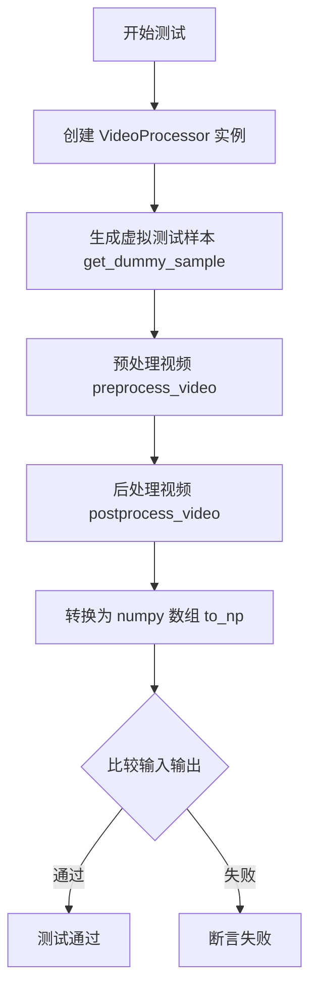

## 类结构

```
VideoProcessorTest (unittest.TestCase)
└── 测试方法:
    ├── test_video_processor_pil
    ├── test_video_processor_np
    └── test_video_processor_pt
└── 辅助方法:
    ├── get_dummy_sample
    └── to_np
```

## 全局变量及字段


### `np`
    
NumPy库，用于数值计算和数组操作

类型：`module (numpy)`
    


### `PIL`
    
Python Imaging Library，用于图像处理

类型：`module (PIL)`
    


### `torch`
    
PyTorch深度学习框架

类型：`module (torch)`
    


### `unittest`
    
Python标准库单元测试框架

类型：`module`
    


### `parameterized`
    
参数化测试装饰器库，用于为测试方法生成多个测试用例

类型：`module`
    


### `VideoProcessor`
    
来自diffusers库的视频处理类，用于视频的预处理和后处理操作

类型：`class`
    


    

## 全局函数及方法


### `np.random.rand`

该函数是 NumPy 库中的随机数生成函数，用于生成指定形状的随机浮点数数组，数组中的值服从 [0, 1) 区间内的均匀分布。在代码中用于生成测试用的虚拟视频帧数据。

参数：

-  `*shape`：`int`，可变数量参数，指定输出数组的维度及每个维度的大小（例如 `num_frames, height, width, num_channels` 表示生成 4 维数组）

返回值：`numpy.ndarray`，浮点类型的随机数数组，形状由输入的 shape 参数决定，数值范围在 [0, 1) 之间

#### 流程图

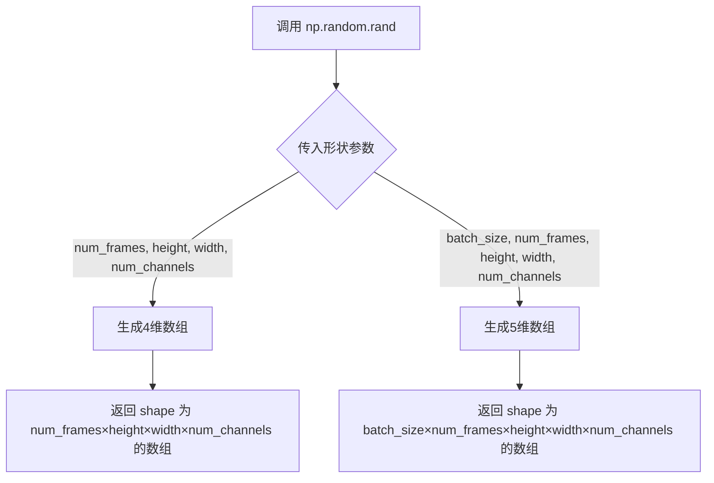

#### 带注释源码

```python
# np.random.rand 是 NumPy 库中的随机数生成函数
# 在本代码中有两处调用：

# 第一次调用：生成 4D 数组（帧数, 高, 宽, 通道数）
# 用于模拟 4D 视频数据 (num_frames=5, height=8, width=8, num_channels=3)
np.random.rand(num_frames, height, width, num_channels)

# 第二次调用：生成 5D 数组（批次, 帧数, 高, 宽, 通道数）
# 用于模拟 5D 视频数据 (batch_size=1, num_frames=5, height=8, width=8, num_channels=3)
np.random.rand(batch_size, num_frames, height, width, num_channels)

# 函数特性：
# - 返回值类型：numpy.ndarray
# - 数据类型：float64
# - 数值范围：[0, 1) 均匀分布
# - 形状：由传入的位置参数决定
```


### `np.random.randint`

该函数是 NumPy 库中的随机整数生成函数，用于生成指定范围内的随机整数数组。在代码中用于生成随机的像素数据以创建测试用的虚拟图像。

参数：

- `low`：`int`，随机整数的下限（包含）
- `high`：`int`，随机整数的上限（不包含）
- `size`：`tuple`，输出数组的形状，代码中为 `(height, width, num_channels)` 即 `(8, 8, 3)`

返回值：`numpy.ndarray`，形状为 `size` 的随机整数数组

#### 流程图

```mermaid
flowchart TD
    A[开始] --> B[调用 np.random.randint]
    B --> C{参数校验}
    C -->|low=0, high=256, size=(8,8,3)| D[生成 8x8x3 的随机整数数组]
    D --> E[返回 numpy 数组]
    E --> F[结束]
```

#### 带注释源码

```python
# 生成一个随机的 8x8 3通道图像数组，并转换为 PIL Image 对象
# 参数说明：
#   - 0: 随机数下限（包含）
#   - 256: 随机数上限（不包含）
#   - size=(height, width, num_channels): 输出数组形状 (8, 8, 3)
# 返回值：包含随机像素值的 PIL Image 对象
return PIL.Image.fromarray(
    np.random.randint(0, 256, size=(height, width, num_channels)).astype("uint8")
)
```


### `np.stack`

`np.stack` 是 NumPy 库中的函数，用于沿新轴连接数组序列。在代码中有多处调用，主要用于将视频帧列表堆叠成张量。

参数：

-  `arrays`：`sequence of array-like`，需要堆叠的数组序列（列表或元组）
-  `axis`：`int`，可选，默认为 0。新轴在结果数组中的位置索引

返回值：`ndarray`，堆叠后的数组

#### 流程图

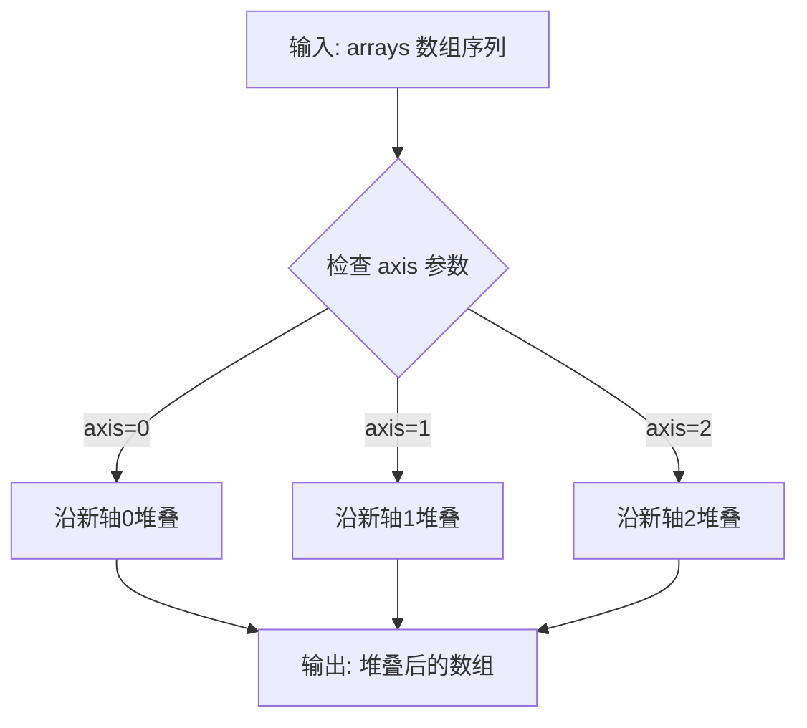

#### 带注释源码

```python
# 在 VideoProcessorTest.to_np 方法中的调用：

# 1. 处理 List of images (PIL.Image)
# 将 PIL 图像列表转换为 numpy 数组并在轴0堆叠
video = np.stack([np.array(i) for i in video], axis=0)

# 2. 处理 List of list of images (嵌套 PIL 图像)
# 对每个视频的所有帧进行堆叠
all_current_frames = np.stack([np.array(i) for i in vid], axis=0)
frames.append(all_current_frames)
video = np.stack([np.array(frame) for frame in frames], axis=0)

# 3. 处理 List of 4d numpy arrays
# 如果输入是4维数组，则使用stack；否则使用concatenate
video = np.stack(video, axis=0) if video[0].ndim == 4 else np.concatenate(video, axis=0)

# 4. 处理 List of 4d torch tensors
# 将 torch 张量转换为 numpy 并转置后堆叠
video = np.stack([i.cpu().numpy().transpose(0, 2, 3, 1) for i in video], axis=0)

# 5. 处理 List of list of 4d torch tensors
# 对单个视频的帧进行堆叠
current_vid_frames = np.stack(
    [i if isinstance(i, np.ndarray) else i.cpu().numpy().transpose(1, 2, 0) for i in vid],
    axis=0,
)
# 对多个视频进行堆叠
temp_frames = np.stack(temp_frames, axis=0)
```


### `np.concatenate`

`np.concatenate` 是 NumPy 库中的一个函数，用于沿指定轴连接两个或多个数组。在本代码中主要用于将多个视频帧、数组或张量沿时间轴（axis=0）连接起来，以统一数据格式进行后续处理。

#### 参数

- `arrays`：元组/列表，要连接的数组序列
- `axis`：整数，可选，连接所在的轴，默认为 0

#### 返回值

`ndarray`，连接后的数组

#### 流程图

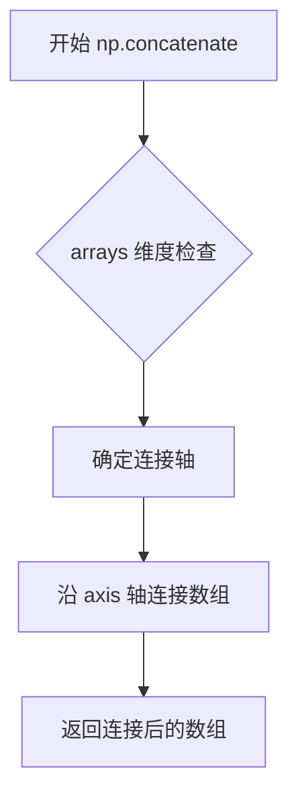

#### 带注释源码

```python
# np.concatenate 在本测试代码中的使用场景：

# 场景1：第62行 - 处理4D/5D numpy数组列表
# 当输入为 list_4d_np 时，将多个4D数组沿axis=0堆叠
if isinstance(video[0], np.ndarray):
    video = np.stack(video, axis=0) if video[0].ndim == 4 else np.concatenate(video, axis=0)

# 场景2：第68行 - 处理4D torch tensor列表
# 将多个5D张量转换为numpy后沿时间轴(axis=0)连接
elif video[0].ndim == 5:
    video = np.concatenate([i.cpu().numpy().transpose(0, 1, 3, 4, 2) for i in video], axis=0)

# 场景3：第84行 - 处理嵌套列表中的5D张量
# 转换维度后沿axis=0连接帧序列
current_vid_frames = np.concatenate(
    [i if isinstance(i, np.ndarray) else i.cpu().numpy().transpose(0, 2, 3, 1) for i in vid],
    axis=0,
)

# 场景4：第92行 - 处理嵌套视频列表
# 将多个视频的所有帧沿batch轴连接
video = np.concatenate(all_frames, axis=0)
```


### `VideoProcessorTest.to_np`

将各种格式的视频数据（ PIL Image 列表、numpy 数组或 PyTorch 张量）统一转换为 numpy 数组的辅助方法。

参数：

-   `video`：`任意`，输入的视频数据，支持 PIL Image 列表、numpy 数组列表、PyTorch 张量列表及其嵌套组合

返回值：`numpy.ndarray`，统一转换为 numpy 数组格式的视频数据

#### 流程图

```mermaid
flowchart TD
    A[开始: video 输入] --> B{video[0] 是 PIL.Image?}
    B -->|Yes| C[使用 np.stack + np.array 转换]
    B -->|No| D{video 是 list 且 video[0][0] 是 PIL.Image?}
    D -->|Yes| E[嵌套循环转换 PIL Image 列表]
    D -->|No| F{video 是 list 且 video[0] 是 Tensor/Ndarray?}
    F -->|Yes| G{检查 ndim 是 4 还是 5}
    G -->|4| H[stack + transpose 转换]
    G -->|5| I[concatenate + transpose 转换]
    F -->|No| J{video 是 5D Tensor/Ndarray?}
    J -->|Yes| K[直接 transpose 转换]
    J -->|No| L[返回原 video]
    C --> M[返回转换后的 video]
    E --> M
    H --> M
    I --> M
    K --> M
    L --> M
```

#### 带注释源码

```python
def to_np(self, video):
    # 处理 PIL Image 列表
    if isinstance(video[0], PIL.Image.Image):
        # 将每个 PIL Image 转换为 numpy 数组并沿 axis=0 堆叠
        video = np.stack([np.array(i) for i in video], axis=0)

    # 处理嵌套的 PIL Image 列表（批量视频）
    elif isinstance(video, list) and isinstance(video[0][0], PIL.Image.Image):
        frames = []
        for vid in video:
            # 对每个视频帧列表进行堆叠
            all_current_frames = np.stack([np.array(i) for i in vid], axis=0)
            frames.append(all_current_frames)
        # 再次堆叠所有视频帧
        video = np.stack([np.array(frame) for frame in frames], axis=0)

    # 处理 4D/5D numpy 数组或 PyTorch 张量列表
    elif isinstance(video, list) and isinstance(video[0], (torch.Tensor, np.ndarray)):
        if isinstance(video[0], np.ndarray):
            # 4D 数组用 stack，5D 用 concatenate
            video = np.stack(video, axis=0) if video[0].ndim == 4 else np.concatenate(video, axis=0)
        else:
            if video[0].ndim == 4:
                # 张量转 numpy 并调整维度顺序 (T, C, H, W) -> (T, H, W, C)
                video = np.stack([i.cpu().numpy().transpose(0, 2, 3, 1) for i in video], axis=0)
            elif video[0].ndim == 5:
                # 5D 张量维度调整 (B, T, C, H, W) -> (B, T, H, W, C)
                video = np.concatenate([i.cpu().numpy().transpose(0, 1, 3, 4, 2) for i in video], axis=0)

    # 处理嵌套的 4D/5D 张量/数组列表（批量视频）
    elif (
        isinstance(video, list)
        and isinstance(video[0], list)
        and isinstance(video[0][0], (torch.Tensor, np.ndarray))
    ):
        all_frames = []
        for list_of_videos in video:
            temp_frames = []
            for vid in list_of_videos:
                if vid.ndim == 4:
                    # 处理 4D 视频帧
                    current_vid_frames = np.stack(
                        [i if isinstance(i, np.ndarray) else i.cpu().numpy().transpose(1, 2, 0) for i in vid],
                        axis=0,
                    )
                elif vid.ndim == 5:
                    # 处理 5D 视频帧
                    current_vid_frames = np.concatenate(
                        [i if isinstance(i, np.ndarray) else i.cpu().numpy().transpose(0, 2, 3, 1) for i in vid],
                        axis=0,
                    )
                temp_frames.append(current_vid_frames)
            temp_frames = np.stack(temp_frames, axis=0)
            all_frames.append(temp_frames)

        video = np.concatenate(all_frames, axis=0)

    # 处理单个 5D 张量或数组
    elif isinstance(video, (torch.Tensor, np.ndarray)) and video.ndim == 5:
        # 直接转换 5D 数据，PyTorch 需要调整维度
        video = video if isinstance(video, np.ndarray) else video.cpu().numpy().transpose(0, 1, 3, 4, 2)

    return video
```

---

### 备注

关于 `np.array` 的说明：在代码中 `np.array` 是 NumPy 库的函数，用于将输入数据（如 PIL Image）转换为 numpy 数组。上面的 `to_np` 方法中大量使用了 `np.array(i)` 来完成数据类型转换。


### `torch.rand`

这是 PyTorch 库中的随机数生成函数，用于生成指定形状的均匀分布随机张量。在给定的测试代码中，`torch.rand` 被用于生成模拟的视频数据张量（4D 和 5D 张量），作为测试输入。

参数：

-  `*size`：`int...`，生成张量的形状参数，例如 `torch.rand(num_frames, num_channels, height, width)` 中传入 4 个整数参数
-  `out`：`Tensor (optional)`，输出张量（可选参数，代码中未使用）
-  `dtype`：`torch.dtype (optional)`，输出张量的数据类型（可选参数，代码中未使用）
-  `layout`：`torch.layout (optional)`，输出张量的布局（可选参数，代码中未使用）
-  `device`：`torch.device (optional)`，输出张量的设备（可选参数，代码中未使用）
-  `requires_grad`：`bool (optional)`，是否需要计算梯度（可选参数，代码中未使用）

返回值：`Tensor`，返回一个填充了均匀分布随机值的张量，值的范围在 [0, 1) 之间

#### 流程图

```mermaid
flowchart TD
    A[调用 torch.rand] --> B{传入参数类型}
    B -->|位置参数size| C[解析形状参数]
    B -->|关键字参数| D[解析可选参数]
    C --> E[在指定设备上分配内存]
    D --> E
    E --> F[生成均匀分布随机数]
    F --> G[返回填充随机值的Tensor]
    
    subgraph 代码中的具体调用
    H[torch.rand num_frames, num_channels, height, width] --> I[生成4D张量: (num_frames, num_channels, height, width)]
    J[torch.rand batch_size, num_frames, num_channels, height, width] --> K[生成5D张量: (batch_size, num_frames, num_channels, height, width)]
    end
    
    G --> H
    G --> J
```

#### 带注释源码

```python
# 代码中 torch.rand 的使用示例 - 来自 get_dummy_sample 方法

def generate_4d_tensor():
    """
    生成4D视频张量用于测试
    形状: (num_frames, num_channels, height, width)
    """
    # torch.rand 生成 [0, 1) 范围内的均匀分布随机数
    # 参数解释:
    #   num_frames=5: 时间帧数
    #   num_channels=3: 通道数 (RGB)
    #   height=8: 高度
    #   width=8: 宽度
    return torch.rand(num_frames, num_channels, height, width)

def generate_5d_tensor():
    """
    生成5D视频张量用于测试
    形状: (batch_size, num_frames, num_channels, height, width)
    """
    # 批量维度在前，用于批量处理测试
    # 参数解释:
    #   batch_size=1: 批处理大小
    #   num_frames=5: 时间帧数
    #   num_channels=3: 通道数 (RGB)
    #   height=8: 高度
    #   width=8: 宽度
    return torch.rand(batch_size, num_frames, num_channels, height, width)

# 实际调用位置 (在 get_dummy_sample 方法中):
elif input_type == "list_4d_pt":
    # 生成4D PyTorch张量列表
    sample = [generate_4d_tensor() for _ in range(num_frames)]
elif input_type == "5d_pt":
    # 生成单个5D PyTorch张量
    sample = generate_5d_tensor()
```

#### 关键组件信息

| 组件名称 | 一句话描述 |
|---------|-----------|
| `VideoProcessorTest` | 测试类，用于验证 `VideoProcessor` 的视频预处理和后处理功能 |
| `get_dummy_sample` | 测试辅助方法，生成各种格式的虚拟视频样本数据 |
| `generate_4d_tensor` | 生成4D PyTorch张量 `(num_frames, num_channels, height, width)` |
| `generate_5d_tensor` | 生成5D PyTorch张量 `(batch_size, num_frames, num_channels, height, width)` |
| `to_np` | 辅助方法，将各种格式的视频数据统一转换为 NumPy 数组 |

#### 技术债务与优化空间

1. **随机种子设置重复**：`torch.manual_seed(0)` 和 `np.random.seed(0)` 在模块级别设置，但 `generate_image()` 使用 `np.random.randint` 时每次都会重新生成不同的随机数，测试的确定性可能不完全
2. **测试代码冗余**：三个测试方法 `test_video_processor_pil`、`test_video_processor_np`、`test_video_processor_pt` 包含大量重复代码，可以提取公共逻辑
3. **硬编码的测试参数**：`batch_size=1`, `num_frames=5`, `height=8`, `width=8` 等值硬编码在方法中，不利于扩展测试场景
4. **类型转换效率**：`to_np` 方法中存在多次数组转换和堆叠操作，对于大规模数据可能有性能问题

#### 其它说明

**设计目标与约束**：
- 确保 `VideoProcessor` 能够正确处理多种输入格式（PIL Images、NumPy 数组、PyTorch 张量）
- 验证预处理和后处理流程的输出与输入一致（数值误差小于 1e-6）

**错误处理**：
- 使用 `assert` 进行断言验证
- 没有显式的异常处理机制，依赖于 PyTorch/NumPy 的内置错误

**数据流**：
- 输入：`get_dummy_sample` 生成各种格式的虚拟数据
- 处理：`video_processor.preprocess_video` → `video_processor.postprocess_video`
- 输出：验证输出与原始输入的数值一致性

**外部依赖**：
- `torch`：深度学习框架
- `numpy`：数值计算
- `PIL`：图像处理
- `parameterized`：测试参数化扩展
- `diffusers`：项目内部的 `VideoProcessor` 类


### `torch.Tensor.cpu`

将当前张量（Tensor）复制到 CPU 内存中，返回一个新的 CPU 上的 `torch.Tensor` 对象。

参数：

- 该方法无显式参数（使用隐式的 `self` 参数）

返回值：`torch.Tensor`，返回一个新的位于 CPU 内存中的张量副本

#### 流程图

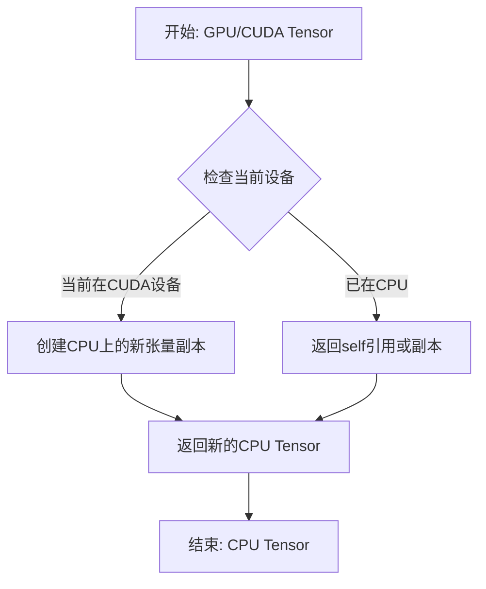

#### 带注释源码

```python
# PyTorch 中 torch.Tensor.cpu() 方法的简化实现逻辑
def cpu(self):
    """
    将张量从当前设备复制到CPU内存
    
    Returns:
        Tensor: 一个新的位于CPU内存中的张量副本
    """
    # 获取当前张量的设备
    device = self.device
    
    # 如果张量已经在CPU上，直接返回副本
    if device.type == 'cpu':
        return self.clone()
    
    # 否则，创建新的CPU张量并复制数据
    # 底层调用 torch._C._TensorBase.cpu(self)
    # 这会触发 CUDA 内存拷贝操作，将数据从 GPU 传输到 CPU 内存
    return self.to(device='cpu')
```

#### 代码中的实际使用示例

在 `VideoProcessorTest.to_np` 方法中的使用：

```python
# 将 torch.Tensor 转换为 numpy 数组
# 1. 先调用 .cpu() 将张量从 GPU 转移到 CPU
# 2. 再调用 .numpy() 将 CPU 张量转换为 numpy 数组
# 3. 最后调用 .transpose() 调整维度顺序

# 4D张量处理 (num_frames, channels, height, width) -> (num_frames, height, width, channels)
video = np.stack([i.cpu().numpy().transpose(1, 2, 0) for i in video], axis=0)

# 5D张量处理 (batch, frames, channels, height, width) -> (batch, frames, height, width, channels)
video = video.cpu().numpy().transpose(0, 2, 3, 4, 1)
```

#### 关键点说明

1. **方法签名**: `Tensor.cpu() -> Tensor`
2. **无参数方法**: 不需要额外参数，使用默认行为
3. **返回值**: 返回新的 CPU 张量副本，不修改原张量
4. **性能考虑**: 涉及 GPU 到 CPU 的内存拷贝，有一定性能开销
5. **数据安全**: 原 GPU 张量保持不变，返回新的 CPU 副本


### `PIL.Image.fromarray`

将 numpy 数组转换为 PIL Image 对象，是图像处理中常见的数组到图像格式的转换函数。

参数：

- `array`：`numpy.ndarray`，输入的 numpy 数组，包含图像像素数据

返回值：`PIL.Image.Image`，转换后的 PIL 图像对象

#### 流程图

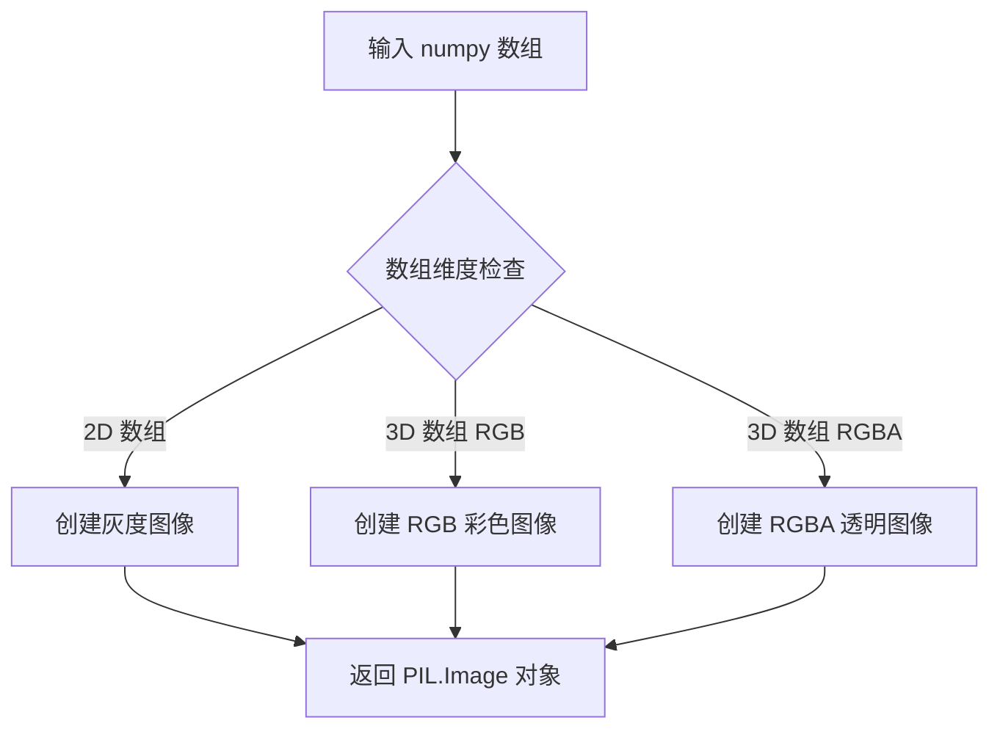

#### 带注释源码

```python
# 在 get_dummy_sample 方法中生成测试用图像
def generate_image():
    # 生成随机整数数组 (height, width, num_channels)
    # np.random.randint(0, 256, size=(height, width, num_channels)) 产生 0-255 之间的随机像素值
    # .astype("uint8") 确保数组数据类型为无符号 8 位整数，符合图像格式要求
    # PIL.Image.fromarray() 将 numpy 数组转换为 PIL Image 对象
    return PIL.Image.fromarray(
        np.random.randint(0, 256, size=(height, width, num_channels)).astype("uint8")
    )
```


# 详细设计文档

## 1. 概述

`VideoProcessor.preprocess_video` 是 Diffusers 库中 `VideoProcessor` 类的核心方法，负责将多种格式的视频输入（如 PIL 图像列表、NumPy 数组或 PyTorch 张量）统一预处理为内部标准格式，以便后续模型处理或视频后处理操作。该方法通常执行归一化（Normalization）等预处理步骤，并根据配置（如 `do_resize`、`do_normalize`）对输入进行相应处理。

## 2. 提取信息

由于用户提供的代码是测试代码（`VideoProcessorTest`），并未直接包含 `VideoProcessor` 类的实现源码，因此以下信息是基于测试代码中的调用方式推断得出的。

### `VideoProcessor.preprocess_video`

该方法用于对视频输入进行预处理，将其转换为统一的张量格式并进行归一化处理。

参数：

-  `video`：`任意`，输入视频数据，支持多种格式：PIL.Image 列表、NumPy 数组（4D/5D）、PyTorch 张量（4D/5D），或者是这些类型的嵌套列表。

返回值：

-  `预处理后的视频张量`：返回预处理后的视频数据，通常为 PyTorch 张量格式（5D 张量，形状为 `[batch, frames, channels, height, width]`）或根据内部实现而定。

#### 流程图

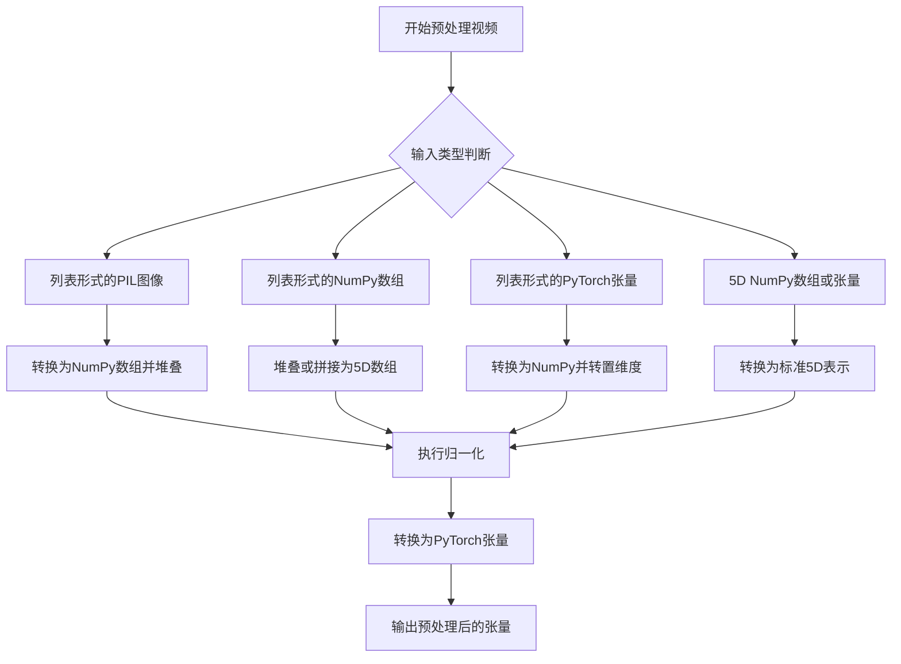

#### 带注释源码

由于原始实现源码不可见，以下为基于测试代码反推的逻辑结构，仅供参考：

```python
# 注意：以下代码是根据测试逻辑反推的，并非原始源码
# 实际实现可能有所不同

def preprocess_video(self, video):
    """
    预处理视频输入
    
    参数:
        video: 任意 - 支持多种格式的视频输入
    返回:
        预处理后的PyTorch张量
    """
    # 1. 检测输入类型
    if isinstance(video, list):
        # 处理列表形式的输入
        if isinstance(video[0], PIL.Image.Image):
            # 列表中的PIL图像：堆叠并转换
            video = np.stack([np.array(i) for i in video], axis=0)
        elif isinstance(video[0], np.ndarray):
            # NumPy数组列表：堆叠或拼接
            if video[0].ndim == 4:
                video = np.stack(video, axis=0)
            else:
                video = np.concatenate(video, axis=0)
        elif isinstance(video[0], torch.Tensor):
            # PyTorch张量列表：转换并转置
            if video[0].ndim == 4:
                video = np.stack([i.cpu().numpy().transpose(0, 2, 3, 1) for i in video], axis=0)
            elif video[0].ndim == 5:
                video = np.concatenate([i.cpu().numpy().transpose(0, 2, 3, 4, 2) for i in video], axis=0)
    
    # 2. 处理5D张量/数组输入
    elif isinstance(video, (torch.Tensor, np.ndarray)) and video.ndim == 5:
        if isinstance(video, torch.Tensor):
            video = video.cpu().numpy().transpose(0, 1, 3, 4, 2)
    
    # 3. 归一化处理（根据do_normalize配置）
    if self.do_normalize:
        # 归一化到[0, 1]范围
        video = video.astype("float32") / 255.0
    
    # 4. 转换为PyTorch张量并调整维度顺序
    # 假设最终输出为 [batch, frames, height, width, channels] -> [batch, frames, channels, height, width]
    if isinstance(video, np.ndarray):
        video = torch.from_numpy(video).permute(0, 1, 4, 2, 3)
    
    return video
```

#### 关键组件信息

| 组件名称 | 描述 |
|---------|------|
| `VideoProcessor` | 视频处理器类，负责视频的预处理和后处理 |
| `preprocess_video` | 视频预处理方法，核心功能为格式统一和归一化 |
| `postprocess_video` | 视频后处理方法，用于将预处理后的数据转换回原始格式 |

#### 潜在的技术债务或优化空间

1. **类型推断复杂性**：当前实现中包含大量 `isinstance` 检查和类型分支判断，可考虑使用策略模式（Strategy Pattern）或工厂方法简化类型转换逻辑。
2. **维度转换硬编码**：转置操作（`transpose`）假设了特定的维度顺序，缺乏灵活性，应明确文档说明预期的输入输出维度约定。
3. **内存复制**：在列表转数组的过程中存在多次内存复制操作，对于大规模视频处理可能存在性能瓶颈，可考虑使用视图（view）或原地操作优化。

#### 其它项目

- **设计目标**：支持多种视频输入格式的统一预处理，屏蔽底层差异，为模型提供标准化的视频张量输入。
- **约束**：
  - 输入必须符合测试中支持的类型之一，否则可能引发异常。
  - 归一化默认开启（`do_normalize=True`），需确保输入值范围符合预期。
- **错误处理**：根据测试代码推断，当输入类型不匹配或维度不符合预期时，可能抛出 `IndexError` 或 `AttributeError`，建议增加输入验证。
- **外部依赖**：
  - `PIL.Image`：用于处理图像输入
  - `numpy`：用于数组操作
  - `torch`：用于张量操作


# VideoProcessor.postprocess_video 设计文档提取

由于用户提供的代码是测试文件（VideoProcessorTest），其中并未包含 `VideoProcessor` 类的实际实现代码，仅包含了测试用例。我将基于测试代码中的使用方式来推断该方法的行为。

---

### VideoProcessor.postprocess_video

该方法是 VideoProcessor 类中负责将预处理后的视频数据转换回指定输出格式（PyTorch tensor、NumPy array 或 PIL Image）的核心方法。

参数：

-  `video`：混合类型，经过 `preprocess_video` 处理后的视频数据，支持 PyTorch Tensor 或 NumPy Array
-  `output_type`：字符串，指定输出格式，可选值为 "pt"（PyTorch Tensor）、"np"（NumPy Array）、"pil"（PIL Image）

返回值：混合类型，根据 `output_type` 参数返回对应格式的视频数据：
-  "pt"：返回 PyTorch Tensor
-  "np"：返回 NumPy Array
-  "pil"：返回 PIL Image 列表

#### 流程图

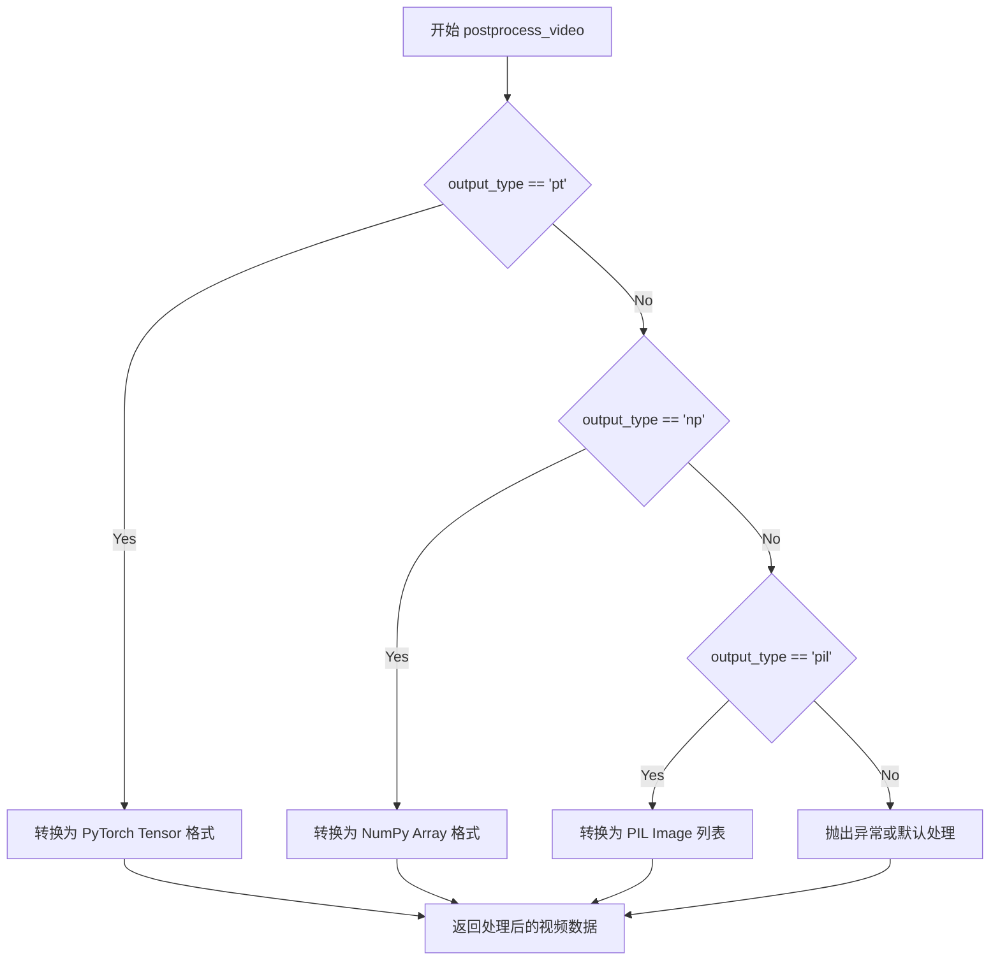

#### 带注释源码

```python
# 注意：以下源码为基于测试代码的推断，并非实际源代码
# 实际实现需要参考 diffusers 库中的 VideoProcessor 类

def postprocess_video(self, video, output_type="pt"):
    """
    将预处理后的视频数据转换回指定格式
    
    参数:
        video: 经过 preprocess_video 处理后的视频数据
        output_type: 输出格式，可选 "pt", "np", "pil"
    
    返回:
        指定格式的视频数据
    """
    # 根据 output_type 调用不同的转换逻辑
    if output_type == "pt":
        # 转换为 PyTorch Tensor 格式
        # 可能涉及: denormalize, 维度转换 (N, C, H, W) -> (N, H, W, C) 等
        pass
    elif output_type == "np":
        # 转换为 NumPy Array 格式
        pass
    elif output_type == "pil":
        # 转换为 PIL Image 列表
        # 可能涉及: uint8 转换, 维度转换等
        pass
    else:
        raise ValueError(f"Unsupported output_type: {output_type}")
    
    return processed_video
```

---

## 补充说明

由于用户提供的是测试代码而非 VideoProcessor 类的实际实现，以上信息是通过以下测试代码推断得出的：

```python
out = video_processor.postprocess_video(video_processor.preprocess_video(input), output_type=output_type)
```

如需获取完整的实现细节，建议：

1. 查看 diffusers 库源码：`src/diffusers/video_processor.py`
2. 查看官方文档：https://github.com/huggingface/diffusers


### `VideoProcessorTest.get_dummy_sample`

该方法是一个测试辅助方法，用于生成各种格式的虚拟视频样本数据，支持多种输入类型（如PIL图像列表、NumPy数组列表、PyTorch张量列表等），以便测试视频处理器的预处理和后处理功能。

参数：

- `input_type`：`str`，指定要生成的样本类型，可选值包括 "list_images"、"list_list_images"、"list_4d_np"、"list_list_4d_np"、"list_5d_np"、"5d_np"、"list_4d_pt"、"list_list_4d_pt"、"list_5d_pt"、"5d_pt"

返回值：`Union[List[PIL.Image.Image], List[List[PIL.Image.Image]], List[np.ndarray], List[List[np.ndarray]], np.ndarray, List[torch.Tensor], List[List[torch.Tensor]], torch.Tensor]`，返回根据 input_type 生成的虚拟视频样本

#### 流程图

```mermaid
flowchart TD
    A[开始 get_dummy_sample] --> B[设置基本参数: batch_size=1, num_frames=5, num_channels=3, height=8, width=8]
    B --> C[定义 generate_image 函数: 生成随机 PIL.Image]
    C --> D[定义 generate_4d_array 函数: 生成 4D NumPy 数组 (num_frames, height, width, num_channels)]
    D --> E[定义 generate_5d_array 函数: 生成 5D NumPy 数组 (batch_size, num_frames, height, width, num_channels)]
    E --> F[定义 generate_4d_tensor 函数: 生成 4D torch.Tensor (num_frames, num_channels, height, width)]
    F --> G[定义 generate_5d_tensor 函数: 生成 5D torch.Tensor (batch_size, num_frames, num_channels, height, width)]
    G --> H{根据 input_type 生成样本}
    H --> I["input_type == 'list_images' 返回 [PIL.Image]"]
    H --> J["input_type == 'list_list_images' 返回 [[PIL.Image]]"]
    H --> K["input_type == 'list_4d_np' 返回 [4D np.array]"]
    H --> L["input_type == 'list_list_4d_np' 返回 [[4D np.array]]"]
    H --> M["input_type == 'list_5d_np' 返回 [5D np.array]"]
    H --> N["input_type == '5d_np' 返回 5D np.array"]
    H --> O["input_type == 'list_4d_pt' 返回 [4D torch.Tensor]"]
    H --> P["input_type == 'list_list_4d_pt' 返回 [[4D torch.Tensor]]"]
    H --> Q["input_type == 'list_5d_pt' 返回 [5D torch.Tensor]"]
    H --> R["input_type == '5d_pt' 返回 5D torch.Tensor"]
    I --> S[返回样本]
    J --> S
    K --> S
    L --> S
    M --> S
    N --> S
    O --> S
    P --> S
    Q --> S
    R --> S
```

#### 带注释源码

```python
def get_dummy_sample(self, input_type):
    """生成用于测试的虚拟视频样本
    
    参数:
        input_type: 字符串，指定要生成的样本类型
            可选值:
            - "list_images": PIL.Image 列表
            - "list_list_images": PIL.Image 的列表的列表
            - "list_4d_np": 4D NumPy 数组的列表 (num_frames, height, width, num_channels)
            - "list_list_4d_np": 4D NumPy 数组的列表的列表
            - "list_5d_np": 5D NumPy 数组的列表 (batch_size, num_frames, height, width, num_channels)
            - "5d_np": 单个 5D NumPy 数组
            - "list_4d_pt": 4D torch.Tensor 的列表 (num_frames, num_channels, height, width)
            - "list_list_4d_pt": 4D torch.Tensor 的列表的列表
            - "list_5d_pt": 5D torch.Tensor 的列表 (batch_size, num_frames, num_channels, height, width)
            - "5d_pt": 单个 5D torch.Tensor
    
    返回:
        根据 input_type 返回对应格式的虚拟视频样本
    """
    # 定义测试样本的基本维度参数
    batch_size = 1      # 批次大小
    num_frames = 5      # 帧数量
    num_channels = 3    # 通道数量（RGB）
    height = 8          # 图像高度
    width = 8           # 图像宽度

    def generate_image():
        """生成一个随机的 PIL.Image"""
        return PIL.Image.fromarray(
            np.random.randint(0, 256, size=(height, width, num_channels)).astype("uint8")
        )

    def generate_4d_array():
        """生成 4D NumPy 数组，形状为 (num_frames, height, width, num_channels)"""
        return np.random.rand(num_frames, height, width, num_channels)

    def generate_5d_array():
        """生成 5D NumPy 数组，形状为 (batch_size, num_frames, height, width, num_channels)"""
        return np.random.rand(batch_size, num_frames, height, width, num_channels)

    def generate_4d_tensor():
        """生成 4D torch.Tensor，形状为 (num_frames, num_channels, height, width)"""
        return torch.rand(num_frames, num_channels, height, width)

    def generate_5d_tensor():
        """生成 5D torch.Tensor，形状为 (batch_size, num_frames, num_channels, height, width)"""
        return torch.rand(batch_size, num_frames, num_channels, height, width)

    # 根据 input_type 参数选择生成不同格式的样本
    if input_type == "list_images":
        # 返回 num_frames 个 PIL.Image 组成的列表
        sample = [generate_image() for _ in range(num_frames)]
    elif input_type == "list_list_images":
        # 返回嵌套列表，每个元素是 num_frames 个 PIL.Image
        sample = [[generate_image() for _ in range(num_frames)] for _ in range(num_frames)]
    elif input_type == "list_4d_np":
        # 返回 4D NumPy 数组的列表
        sample = [generate_4d_array() for _ in range(num_frames)]
    elif input_type == "list_list_4d_np":
        # 返回嵌套的 4D NumPy 数组列表
        sample = [[generate_4d_array() for _ in range(num_frames)] for _ in range(num_frames)]
    elif input_type == "list_5d_np":
        # 返回 5D NumPy 数组的列表
        sample = [generate_5d_array() for _ in range(num_frames)]
    elif input_type == "5d_np":
        # 返回单个 5D NumPy 数组
        sample = generate_5d_array()
    elif input_type == "list_4d_pt":
        # 返回 4D torch.Tensor 的列表
        sample = [generate_4d_tensor() for _ in range(num_frames)]
    elif input_type == "list_list_4d_pt":
        # 返回嵌套的 4D torch.Tensor 列表
        sample = [[generate_4d_tensor() for _ in range(num_frames)] for _ in range(num_frames)]
    elif input_type == "list_5d_pt":
        # 返回 5D torch.Tensor 的列表
        sample = [generate_5d_tensor() for _ in range(num_frames)]
    elif input_type == "5d_pt":
        # 返回单个 5D torch.Tensor
        sample = generate_5d_tensor()

    return sample
```


### `VideoProcessorTest.to_np`

该方法用于将多种格式的视频数据（PIL图像列表、numpy数组、PyTorch张量及其嵌套组合）统一转换为numpy数组，以支持后续的视频处理和验证测试。

参数：

- `video`：`Union[List[PIL.Image.Image], List[List[PIL.Image.Image]], List[np.ndarray], List[torch.Tensor], np.ndarray, torch.Tensor]`，输入视频数据，支持PIL图像、numpy数组、PyTorch张量及其嵌套列表形式

返回值：`numpy.ndarray`，统一转换后的numpy数组

#### 流程图

```mermaid
flowchart TD
    A[开始: video输入] --> B{video[0]是否为PIL.Image?}
    B -- 是 --> C[stack成5D数组]
    B -- 否 --> D{video是list且video[0][0]是PIL.Image?}
    D -- 是 --> E[嵌套stack成6D数组]
    D -- 否 --> F{video是list且video[0]是Tensor/ndarray?}
    F -- 是 --> G{video[0]是ndarray?}
    G -- 是 --> H{video[0].ndim == 4?}
    H -- 是 --> I[stack成5D数组]
    H -- 否 --> J[concatenate成5D数组]
    G -- 否 --> K{video[0].ndim == 4?}
    K -- 是 --> L[transpose后stack成5D数组]
    K -- 否 --> M[transpose后concatenate成5D数组]
    F -- 否 --> N{video是5D Tensor/ndarray?}
    N -- 是 --> O[transpose成numpy数组]
    N -- 否 --> P[返回原video]
    C --> Q[返回numpy数组]
    E --> Q
    I --> Q
    J --> Q
    L --> Q
    M --> Q
    O --> Q
    P --> Q
    
    F --> F2{video是list且video[0]是list?}
    F2 -- 是 --> G2[遍历嵌套结构]
    G2 --> H2{vid.ndim == 4?}
    H2 -- 是 --> I2[stack或transpose成4D]
    H2 -- 否 --> J2[concatenate或transpose成5D]
    I2 --> K2[stack后添加到all_frames]
    J2 --> K2
    K2 --> L2{处理完所有list_of_videos?}
    L2 -- 否 --> G2
    L2 -- 是 --> M2[concatenate all_frames]
    M2 --> Q
```

#### 带注释源码

```python
def to_np(self, video):
    # 场景1: 输入为PIL图像列表
    # 例如: [PIL.Image.Image, PIL.Image.Image, ...]
    if isinstance(video[0], PIL.Image.Image):
        # 将每个PIL图像转换为numpy数组后沿第0维stack
        # 输入: List[PIL.Image] -> 输出: (num_frames, height, width, channels)
        video = np.stack([np.array(i) for i in video], axis=0)

    # 场景2: 输入为PIL图像的嵌套列表（批次）
    # 例如: [[PIL.Image, PIL.Image, ...], [PIL.Image, PIL.Image, ...], ...]
    elif isinstance(video, list) and isinstance(video[0][0], PIL.Image.Image):
        frames = []
        for vid in video:
            # 对每个视频片段的图像进行stack
            all_current_frames = np.stack([np.array(i) for i in vid], axis=0)
            frames.append(all_current_frames)
        # 再次stack所有视频片段
        # 输入: List[List[PIL.Image]] -> 输出: (batch, num_frames, height, width, channels)
        video = np.stack([np.array(frame) for frame in frames], axis=0)

    # 场景3: 输入为4D或5D numpy数组/PyTorch张量的列表
    # 例如: [np.ndarray(shape=(T,H,W,C)), ...] 或 [torch.Tensor(shape=(T,C,H,W)), ...]
    elif isinstance(video, list) and isinstance(video[0], (torch.Tensor, np.ndarray)):
        if isinstance(video[0], np.ndarray):
            # numpy数组: 根据维度决定stack还是concatenate
            # 4D数组: stack -> (num_frames, height, width, channels)
            # 5D数组: concatenate -> (batch, num_frames, height, width, channels)
            video = np.stack(video, axis=0) if video[0].ndim == 4 else np.concatenate(video, axis=0)
        else:
            # PyTorch张量: 需要先转换到CPU再转为numpy，并调整维度顺序
            if video[0].ndim == 4:
                # 4D张量: (T,C,H,W) -> transpose -> (T,H,W,C) -> stack
                video = np.stack([i.cpu().numpy().transpose(0, 2, 3, 1) for i in video], axis=0)
            elif video[0].ndim == 5:
                # 5D张量: (B,T,C,H,W) -> transpose -> (B,T,H,W,C) -> concatenate
                video = np.concatenate([i.cpu().numpy().transpose(0, 1, 3, 4, 2) for i in video], axis=0)

    # 场景4: 输入为4D或5D numpy数组/PyTorch张量的嵌套列表（批次的批次）
    # 例如: [[np.ndarray, np.ndarray, ...], [np.ndarray, np.ndarray, ...], ...]
    elif (
        isinstance(video, list)
        and isinstance(video[0], list)
        and isinstance(video[0][0], (torch.Tensor, np.ndarray))
    ):
        all_frames = []
        for list_of_videos in video:
            temp_frames = []
            for vid in list_of_videos:
                if vid.ndim == 4:
                    # 4D数组/张量处理
                    # 如果是numpy直接使用，如果是张量则转换并transpose: (T,C,H,W) -> (T,H,W,C)
                    current_vid_frames = np.stack(
                        [i if isinstance(i, np.ndarray) else i.cpu().numpy().transpose(1, 2, 0) for i in vid],
                        axis=0,
                    )
                elif vid.ndim == 5:
                    # 5D数组/张量处理
                    # (B,T,C,H,W) -> transpose -> (B,T,H,W,C) -> concatenate
                    current_vid_frames = np.concatenate(
                        [i if isinstance(i, np.ndarray) else i.cpu().numpy().transpose(0, 2, 3, 1) for i in vid],
                        axis=0,
                    )
                temp_frames.append(current_vid_frames)
            # 堆叠当前批次的所有视频
            temp_frames = np.stack(temp_frames, axis=0)
            all_frames.append(temp_frames)

        # 最终concatenate所有批次
        video = np.concatenate(all_frames, axis=0)

    # 场景5: 输入为单独的5D numpy数组或PyTorch张量
    # 例如: np.ndarray(shape=(B,T,H,W,C)) 或 torch.Tensor(shape=(B,T,C,H,W))
    elif isinstance(video, (torch.Tensor, np.ndarray)) and video.ndim == 5:
        # 如果是numpy数组直接返回，否则转为numpy并transpose
        # torch: (B,T,C,H,W) -> numpy: (B,T,H,W,C)
        video = video if isinstance(video, np.ndarray) else video.cpu().numpy().transpose(0, 1, 3, 4, 2)

    return video
```


### `VideoProcessorTest.test_video_processor_pil`

该测试方法用于验证 `VideoProcessor` 类对 PIL 图像列表（`list_images` 或 `list_list_images`）的预处理和后处理功能是否正确。测试通过参数化方式支持两种输入类型，并验证输出在经过预处理再后处理后与原始输入的数值一致性。

参数：

- `input_type`：`str`，由 `@parameterized.expand` 装饰器参数化，当前测试用例传入 `"list_images"` 或 `"list_list_images"`，表示输入是图像列表或嵌套图像列表

返回值：`None`，该方法为测试方法，无返回值，通过 `assert` 语句验证逻辑正确性

#### 流程图

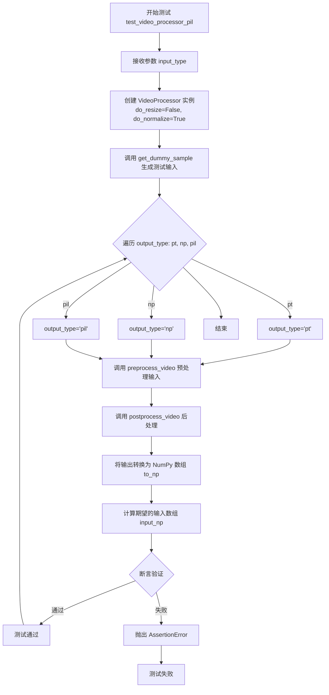

#### 带注释源码

```python
@parameterized.expand(["list_images", "list_list_images"])
def test_video_processor_pil(self, input_type):
    """
    测试 VideoProcessor 对 PIL 图像输入的预处理和后处理功能。
    
    参数化测试支持两种输入格式：
    - "list_images": 图像列表 [PIL.Image, ...]
    - "list_list_images": 嵌套图像列表 [[PIL.Image, ...], ...]
    """
    # 创建 VideoProcessor 实例，不进行resize，但进行normalize
    # do_normalize=True 意味着会将像素值归一化到 [0, 1]
    video_processor = VideoProcessor(do_resize=False, do_normalize=True)

    # 根据 input_type 生成对应的虚拟测试样本
    # 调用 get_dummy_sample 方法生成指定类型的测试数据
    input = self.get_dummy_sample(input_type=input_type)

    # 遍历三种输出类型：pt (PyTorch), np (NumPy), pil (PIL Image)
    for output_type in ["pt", "np", "pil"]:
        # 第一步：preprocess_video 将输入预处理为模型可用格式
        # 第二步：postprocess_video 将预处理后的数据转换回可视格式
        out = video_processor.postprocess_video(
            video_processor.preprocess_video(input), 
            output_type=output_type
        )
        
        # 将输出转换为统一的 NumPy 数组格式以便比较
        out_np = self.to_np(out)
        
        # 计算期望的输入数组
        # 对于非 PIL 输出，需要将输入归一化到 [0, 1] 范围（除以 255）
        # 对于 PIL 输出，保持原始像素值
        input_np = self.to_np(input).astype("float32") / 255.0 if output_type != "pil" else self.to_np(input)
        
        # 断言：输出与输入的最大绝对误差小于 1e-6
        # 这验证了预处理->后处理流程的信息保持性
        assert np.abs(input_np - out_np).max() < 1e-6, f"Decoded output does not match input for {output_type=}"
```


### `VideoProcessorTest.test_video_processor_np`

该方法是一个单元测试，用于验证VideoProcessor类处理NumPy视频数据的能力，支持3种输入类型（list_4d_np、list_5d_np、5d_np）和3种输出类型（pt、np、pil），通过预处理和后处理流程后验证输入输出的一致性。

参数：

- `self`：VideoProcessorTest，测试类实例本身
- `input_type`：`str`，参数化输入类型，来自@parameterized.expand装饰器，值为["list_4d_np", "list_5d_np", "5d_np"]

返回值：`None`，测试方法无返回值，通过assert断言验证正确性

#### 流程图

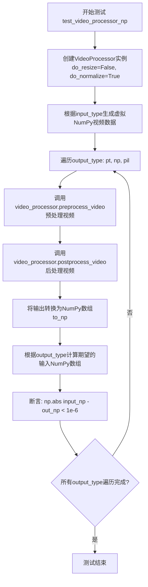

#### 带注释源码

```python
@parameterized.expand(["list_4d_np", "list_5d_np", "5d_np"])
def test_video_processor_np(self, input_type):
    """
    测试VideoProcessor处理NumPy视频数据的功能
    
    参数:
        input_type: str, 参数化输入类型，支持:
            - "list_4d_np": NumPy 4D数组列表 (frames, H, W, C)
            - "list_5d_np": NumPy 5D数组列表 (batch, frames, H, W, C)
            - "5d_np": 单个NumPy 5D数组 (batch, frames, H, W, C)
    """
    # 创建VideoProcessor实例，配置为不调整大小但进行归一化
    video_processor = VideoProcessor(do_resize=False, do_normalize=True)

    # 根据input_type生成对应的虚拟视频样本
    input = self.get_dummy_sample(input_type=input_type)

    # 遍历三种输出类型进行测试
    for output_type in ["pt", "np", "pil"]:
        # 完整的预处理+后处理流程
        out = video_processor.postprocess_video(
            video_processor.preprocess_video(input), 
            output_type=output_type
        )
        # 将输出转换为统一的NumPy数组格式
        out_np = self.to_np(out)
        # 根据输出类型计算期望的输入NumPy数组
        # 对于pil输出，需要乘以255并转为uint8
        # 对于pt/np输出，直接使用原始数组
        input_np = (
            (self.to_np(input) * 255.0).round().astype("uint8") 
            if output_type == "pil" 
            else self.to_np(input)
        )
        # 断言验证预处理+后处理后输出与输入的差异在容差范围内
        assert np.abs(input_np - out_np).max() < 1e-6, \
            f"Decoded output does not match input for {output_type=}"
```


### `VideoProcessorTest.test_video_processor_pt`

该测试方法用于验证 `VideoProcessor` 对 PyTorch 张量（4D/5D）输入的预处理和后处理功能是否正确，确保经过预处理再后处理的输出与原始输入在数值上保持一致（误差小于 1e-6）。

参数：

- `input_type`：`str`，参数化测试参数，指定输入数据类型，可选值为 "list_4d_pt"、"list_5d_pt" 或 "5d_pt"

返回值：`None`，无返回值（测试方法）

#### 流程图

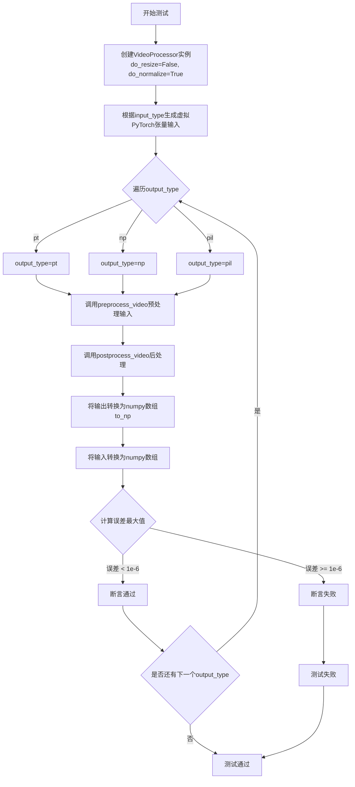

#### 带注释源码

```python
@parameterized.expand(["list_4d_pt", "list_5d_pt", "5d_pt"])
def test_video_processor_pt(self, input_type):
    """
    测试 VideoProcessor 对 PyTorch 张量输入的预处理和后处理功能。
    
    参数:
        input_type: str，输入数据类型，可选 "list_4d_pt", "list_5d_pt", "5d_pt"
    
    返回:
        None
    
    验证:
        预处理后再后处理的输出应与原始输入一致（误差 < 1e-6）
    """
    # 创建视频处理器实例，不进行resize但进行normalize
    video_processor = VideoProcessor(do_resize=False, do_normalize=True)

    # 根据input_type生成虚拟的PyTorch张量输入样本
    input = self.get_dummy_sample(input_type=input_type)

    # 遍历三种输出类型进行测试：pt(张量)、np(数组)、pil(图像)
    for output_type in ["pt", "np", "pil"]:
        # 1. 对输入进行预处理（归一化等操作）
        # 2. 对预处理后的结果进行后处理，转换为指定输出类型
        out = video_processor.postprocess_video(
            video_processor.preprocess_video(input), 
            output_type=output_type
        )
        # 将输出转换为numpy数组以便比较
        out_np = self.to_np(out)
        
        # 根据输出类型准备输入的期望值
        # 如果输出是pil图像，需要将输入值域从[0,1]转换到[0,255]并转为uint8
        # 否则直接使用归一化后的输入值
        input_np = (
            (self.to_np(input) * 255.0).round().astype("uint8") 
            if output_type == "pil" 
            else self.to_np(input)
        )
        
        # 断言：输出与输入的最大绝对误差应小于1e-6
        assert np.abs(input_np - out_np).max() < 1e-6, \
            f"Decoded output does not match input for {output_type=}"
```

## 关键组件


### VideoProcessor

负责视频的预处理和后处理，支持PIL图像、NumPy数组和PyTorch张量之间的转换，包含resize和normalize等操作。

### 张量索引与惰性加载

通过支持多种输入格式（list_images、list_4d_np、list_5d_pt等）实现灵活的数据加载，采用按需转换策略避免不必要的内存分配。

### 多种输入格式支持

支持从简单的PIL图像列表到复杂的5D张量的多种输入格式，包括list_images、list_list_images、list_4d_np、list_5d_np、5d_np、list_4d_pt、list_5d_pt、5d_pt等。

### to_np 转换方法

将各种格式的视频数据统一转换为NumPy数组，处理PIL图像列表、张量转换和维度变换等复杂逻辑。

### preprocess_video 和 postprocess_video

预处理负责将输入转换为统一格式，后处理则将处理后的数据转换回指定输出类型（pt、np、pil）。

### 维度变换与通道顺序调整

在张量和数组之间转换时处理维度顺序，如将PyTorch的(N,C,H,W)转换为NumPy的(N,H,W,C)格式。

### 测试框架

使用unittest和parameterized装饰器实现参数化测试，覆盖多种输入输出类型组合。


## 问题及建议


### 已知问题

-   **`to_np` 方法过于冗长且重复逻辑多**：该方法包含大量重复的类型检查和转换逻辑（如 `transpose` 操作、维度判断等），违反了 DRY 原则，代码可读性和可维护性差
-   **`get_dummy_sample` 方法存在大量重复的 if-elif 分支**：每个分支都调用类似的生成函数，可通过字典映射或策略模式重构
-   **魔法数字硬编码**：如 `batch_size = 1`、`num_frames = 5`、`num_channels = 3`、`height = 8`、`width = 8` 等值分散在代码中，应提取为类常量或配置参数
-   **缺少类型注解**：方法参数和返回值都没有类型提示，影响代码可读性和 IDE 支持
-   **测试代码重复**：三个测试方法 `test_video_processor_pil`、`test_video_processor_np`、`test_video_processor_pt` 包含大量重复的测试逻辑，仅输入类型不同
-   **随机种子设置不完整**：仅设置了 `np.random.seed(0)` 和 `torch.manual_seed(0)`，但 `PIL.Image.fromarray` 生成的随机图像不受这些种子控制，导致测试结果可能不完全可复现
-   **`to_np` 方法中 transpose 操作缺乏明确注释**：维度转换操作（如 `(0, 2, 3, 1)`）的具体含义不清晰，容易造成维度顺序混淆
-   **测试未覆盖所有输入类型**：参数化测试仅覆盖部分输入类型（如 `list_list_images`、`list_4d_np` 等），但未测试 `list_list_4d_np` 和 `list_list_5d_pt` 等类型
-   **错误消息使用 f-string 中 `output_type=` 语法**：在较旧版本的 Python 中可能存在兼容性问题（虽然 Python 3.8+ 支持）

### 优化建议

-   **重构 `to_np` 方法**：提取公共逻辑为独立辅助方法，如创建 `convert_to_numpy` 函数处理张量和数组的转换，使用策略模式处理不同维度
-   **重构 `get_dummy_sample` 方法**：使用字典映射输入类型到生成函数，减少 if-elif 分支
-   **提取魔法数字为常量**：在类级别定义常量如 `DEFAULT_BATCH_SIZE = 1`、`DEFAULT_NUM_FRAMES = 5` 等
-   **添加类型注解**：为所有方法参数和返回值添加类型提示，提高代码可读性
-   **提取重复测试逻辑**：创建一个通用的测试辅助方法，接收输入类型和输出类型参数，减少代码重复
-   **统一随机种子管理**：考虑使用 `random` 模块的种子或创建固定的图像数据集，确保测试完全可复现
-   **添加详细注释**：为复杂的维度转换操作添加注释，说明每个 transpose 的语义（如将 CHW 转为 HWC）
-   **扩展测试覆盖**：增加对 `list_list_4d_np`、`list_list_5d_pt` 等类型的测试覆盖
-   **考虑使用 pytest 参数化**：虽然当前使用 `parameterized`，但可评估是否迁移到 pytest 的 `@pytest.mark.parametrize`


## 其它


### 设计目标与约束

本测试代码旨在验证VideoProcessor类对多种视频输入格式的处理能力，包括PIL图像列表、numpy数组和PyTorch张量。测试覆盖了预处理(preprocess_video)和后处理(postprocess_video)的完整流程，确保输入输出的一致性。约束条件包括：输入视频的批量大小为1，帧数为5，分辨率为8x8，通道数为3。

### 错误处理与异常设计

代码中的错误处理主要通过assert语句进行验证。在to_np方法中，通过isinstance检查数据类型，如果输入格式不符合预期可能导致异常。此外，测试中使用np.abs(input_np - out_np).max() < 1e-6进行数值精度验证，确保处理过程中没有信息丢失。

### 数据流与状态机

数据流主要分为三路：1) PIL图像列表/列表的列表经过postprocess_video处理后转换为指定输出类型；2) numpy数组经过预处理和后处理；3) PyTorch张量经过预处理和后处理。状态转换包括：输入格式识别 -> 预处理 -> 后处理 -> 输出格式转换 -> 数值验证。

### 外部依赖与接口契约

本代码依赖以下外部库：unittest（测试框架）、numpy（数值计算）、PIL（图像处理）、torch（深度学习张量）、parameterized（参数化测试）、diffusers.video_processor（被测模块）。VideoProcessor类的接口包括：构造函数参数do_resize和do_normalize，preprocess_video方法处理输入视频，postprocess_video方法将处理后的视频转换为指定输出类型（pt/np/pil）。

### 测试覆盖范围

代码覆盖了9种输入类型：list_images、list_list_images、list_4d_np、list_5d_np、5d_np、list_4d_pt、list_list_4d_pt、list_5d_pt、5d_pt。每种输入类型都测试了3种输出类型（pt、np、pil），共27个测试用例。测试重点关注数据在预处理和后处理过程中的一致性，保持数值精度在1e-6以内。

### 性能考量与优化空间

当前代码每次测试都创建新的VideoProcessor实例，可考虑复用实例以提高测试效率。to_np方法中存在大量类型判断和转换逻辑，可考虑将转换逻辑封装到独立的工具类中。随机数种子固定（np.random.seed(0)和torch.manual_seed(0)），确保测试可复现，但生成的虚拟数据可能无法覆盖边界情况。

### 已知问题与改进建议

1. 测试中只使用了单个批量大小（batch_size=1），未测试多批量场景；2. 分辨率固定为8x8，未测试不同分辨率的处理；3. 缺少对异常输入（如空列表、None值、维度不匹配等）的错误处理测试；4. to_np方法实现复杂，嵌套if-elif结构难以维护，建议重构为策略模式；5. 缺少对VideoProcessor配置参数（do_resize、do_normalize）不同组合的测试。

### 代码组织与模块关系

VideoProcessorTest类位于测试模块中，通过导入diffusers.video_processor.VideoProcessor进行测试。被测模块VideoProcessor负责视频的预处理和后处理，而测试代码负责生成各种格式的输入数据并验证处理结果的一致性。测试采用了参数化测试（@parameterized.expand）来减少代码重复。

### 边界条件与特殊场景

当前测试未覆盖的边界条件包括：空视频列表、单帧视频、非常大的分辨率、混合数据类型输入、非标准通道顺序（如BGR）、视频帧数不均匀的列表等。此外，未测试VideoProcessor在不同配置下（如do_resize=True或do_normalize=False）的行为差异。

### 可维护性与可扩展性

代码结构清晰，采用参数化测试便于扩展新的输入类型。但get_dummy_sample方法包含大量if-elif分支，可考虑使用字典映射或工厂模式简化。to_np方法的转换逻辑与测试代码耦合较紧，建议将数据转换逻辑移至VideoProcessor类或独立的工具类中，提高代码的可测试性和可维护性。


    