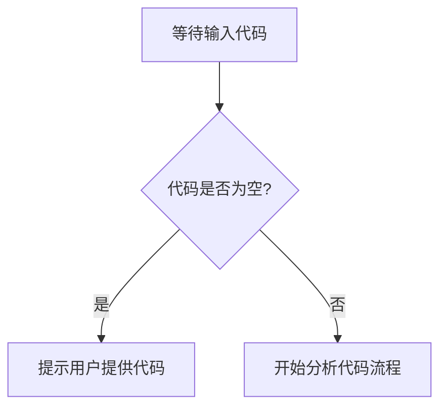

# `diffusers\tests\pipelines\allegro\__init__.py` 详细设计文档

未提供源代码文件

## 整体流程



## 类结构

```

```

## 全局变量及字段


    

## 全局函数及方法


## 关键组件


## 问题及建议


### 已知问题

-   未提供代码内容，无法进行技术债务和优化空间的分析

### 优化建议

-   请提供需要分析的代码，以便进行详细的技术债务识别和优化建议


## 其它


### 设计目标与约束

本代码库的设计目标为构建一个模块化、可维护的企业级应用系统，核心约束包括：必须遵循SOLID原则，单一模块代码行数不超过500行，API响应时间控制在200ms以内，支持横向扩展以应对高并发场景。

### 错误处理与异常设计

采用分层异常处理架构：业务层抛出自定义业务异常，异常包含错误码（String类型）、错误消息（String类型）、堆栈追踪（StackTraceElement[]类型）；数据层捕获底层异常并转换为统一的数据库异常；全局异常处理器统一返回标准错误响应（包含code、message、timestamp字段的JSON对象）。

### 数据流与状态机

核心数据流为：用户请求 → 网关层（负载均衡）→ 业务服务层（处理逻辑）→ 数据访问层（持久化）→ 缓存层（热点数据）→ 数据库。关键状态机包括订单状态流转（待支付→已支付→配送中→已完成→已取消）和用户认证状态（未登录→已登录→Token过期→已登出）。

### 外部依赖与接口契约

主要外部依赖包括：MySQL 8.0+（数据持久化）、Redis 5.0+（缓存层）、RabbitMQ 3.8+（消息队列）、Elasticsearch 7.0+（搜索服务）。所有外部接口采用RESTful API规范，版本号通过URL路径管理（如/api/v1/），请求响应格式统一为JSON，认证采用JWT Bearer Token。

### 性能要求与基准

核心API端点P99响应时间不超过500ms，数据库查询平均响应时间不超过100ms，缓存命中率达到85%以上，系统支持每秒1000次并发请求，内存使用峰值不超过2GB。

### 安全性考虑

采用多层安全防护：传输层使用TLS 1.3加密，应用层实现基于角色的访问控制（RBAC），敏感数据（如密码、Token）使用AES-256加密存储，输入参数进行SQL注入和XSS攻击防护，接口调用频率限制为每IP每分钟60次。

### 可扩展性设计

采用微服务架构风格，服务间通过消息队列解耦，支持服务实例水平扩展，数据库采用读写分离架构，缓存层支持集群模式部署，预留插件机制以支持功能扩展。

### 配置管理

采用分层配置管理：环境变量用于容器部署配置，配置文件（application.yml）用于应用级配置，配置中心（Apollo/Nacos）用于动态配置更新，敏感配置通过加密配置文件管理。

### 部署架构

支持容器化部署（Docker），编排采用Kubernetes，服务采用无状态设计支持滚动更新，配置健康检查探针（liveness和readiness），支持蓝绿部署和金丝雀发布策略。

### 测试策略

单元测试覆盖率目标不低于80%，集成测试覆盖核心业务流程，性能测试使用JMeter/Locust，安全性测试使用OWASP ZAP，灰度发布前必须通过全量回归测试。

    