# `diffusers\tests\pipelines\allegro\test_allegro.py` 详细设计文档

这是一个用于测试AllegroPipeline（文本到视频生成的扩散模型管道）的单元测试和集成测试文件，包含快速测试和集成测试两类测试用例，验证管道在推理、批处理、注意力切片、VAE平铺等功能上的正确性和一致性。

## 整体流程

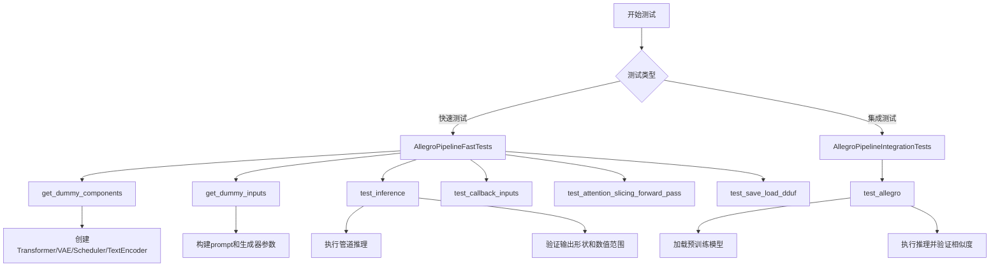

## 类结构

```
unittest.TestCase
├── AllegroPipelineFastTests (继承PipelineTesterMixin, PyramidAttentionBroadcastTesterMixin)
│   ├── get_dummy_components()
│   ├── get_dummy_inputs()
│   ├── test_inference()
│   ├── test_callback_inputs()
│   ├── test_inference_batch_single_identical()
│   ├── test_attention_slicing_forward_pass()
│   ├── test_vae_tiling()
│   └── test_save_load_dduf()
└── AllegroPipelineIntegrationTests
    ├── setUp()
    ├── tearDown()
    └── test_allegro()
```

## 全局变量及字段


### `enable_full_determinism`
    
启用完全确定性以确保测试可重复性的函数

类型：`function`
    


### `AllegroPipelineFastTests.pipeline_class`
    
指定要测试的pipeline类为AllegroPipeline

类型：`type`
    


### `AllegroPipelineFastTests.params`
    
包含pipeline调用所需的参数集合，已排除cross_attention_kwargs

类型：`frozenset`
    


### `AllegroPipelineFastTests.batch_params`
    
包含批量推理时需要的参数集合

类型：`set`
    


### `AllegroPipelineFastTests.image_params`
    
包含图像生成相关的参数集合

类型：`set`
    


### `AllegroPipelineFastTests.image_latents_params`
    
包含图像潜在向量相关的参数集合

类型：`set`
    


### `AllegroPipelineFastTests.required_optional_params`
    
定义可选但可能需要的参数集合，如num_inference_steps、generator等

类型：`frozenset`
    


### `AllegroPipelineFastTests.test_xformers_attention`
    
标志位，指示是否测试xformers的注意力机制

类型：`bool`
    


### `AllegroPipelineFastTests.test_layerwise_casting`
    
标志位，指示是否测试逐层类型转换功能

类型：`bool`
    


### `AllegroPipelineFastTests.test_group_offloading`
    
标志位，指示是否测试模型组卸载功能

类型：`bool`
    


### `AllegroPipelineIntegrationTests.prompt`
    
集成测试使用的默认文本提示词

类型：`str`
    
    

## 全局函数及方法


### `gc.collect`

`gc.collect` 是 Python 标准库中的垃圾回收函数，用于显式触发垃圾回收过程，回收无法访问的对象并返回被回收的对象数量。在测试用例的 `setUp` 和 `tearDown` 方法中调用此函数，以确保在测试前后清理内存，释放 GPU 缓存。

参数：无

返回值：`int`，返回被回收的不可达对象的数量

#### 流程图

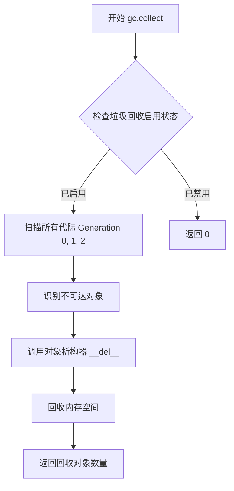

#### 带注释源码

```python
# 导入 gc 模块（在文件顶部）
import gc

# 在测试类的 setUp 方法中调用
def setUp(self):
    super().setUp()
    gc.collect()  # 显式触发垃圾回收，清理测试前可能存在的循环引用对象
    backend_empty_cache(torch_device)  # 同时清理 GPU 缓存

# 在测试类的 tearDown 方法中调用
def tearDown(self):
    super().tearDown()
    gc.collect()  # 显式触发垃圾回收，清理测试过程中产生的临时对象
    backend_empty_cache(torch_device)  # 同时清理 GPU 缓存，释放显存
```


### `AllegroPipeline.__call__`

该方法是 AllegroPipeline 的核心推理方法，通过接收文本提示、负向提示、随机生成器、推理步数、引导强度、图像尺寸、帧数、最大序列长度、输出类型等参数，调用预训练的文本编码器、VAE 和 Transformer 模型进行扩散推理，最终返回生成的视频帧。

参数：

- `prompt`：`str`，正向提示词，用于指导模型生成符合描述的内容
- `negative_prompt`：`str`，负向提示词，用于引导模型避免生成提示词中的内容
- `generator`：`torch.Generator`，随机数生成器，用于控制生成过程的可重复性
- `num_inference_steps`：`int`，推理步数，扩散模型的采样迭代次数，越多越精细但耗时越长
- `guidance_scale`：`float`，引导强度，CFG（Classifier-Free Guidance）的比例，数值越大越遵循提示词
- `height`：`int`，生成图像的高度（像素）
- `width`：`int`，生成图像的宽度（像素）
- `num_frames`：`int`，生成的视频帧数
- `max_sequence_length`：`int`，文本序列的最大长度，用于 T5 文本编码器
- `output_type`：`str`，输出类型，如 "pt"（PyTorch 张量）或 "np"（NumPy 数组）
- `return_dict`：`bool`，是否返回字典格式的结果
- `callback_on_step_end`：`Callable`，每步推理结束后调用的回调函数
- `callback_on_step_end_tensor_inputs`：`List[str]`，回调函数可使用的张量变量名列表

返回值：`PipelineOutput`，包含生成的视频帧（`frames`）的管道输出对象

#### 流程图

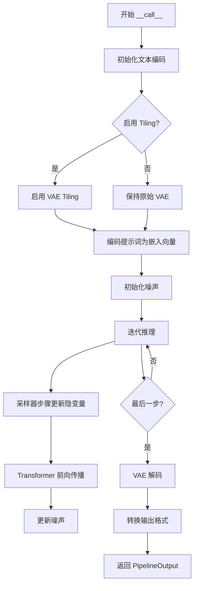

#### 带注释源码

```python
def __call__(
    self,
    prompt: Union[str, List[str]] = None,
    negative_prompt: Union[str, List[str]] = "",
    num_inference_steps: int = 50,
    guidance_scale: float = 7.0,
    num_images_per_prompt: int = 1,
    height: int = 512,
    width: int = 512,
    num_frames: int = 16,
    max_sequence_length: int = 256,
    generator: Optional[torch.Generator] = None,
    latents: Optional[torch.FloatTensor] = None,
    output_type: Optional[str] = "pt",
    return_dict: bool = True,
    callback_on_step_end: Optional[Callable] = None,
    callback_on_step_end_tensor_inputs: Optional[List[str]] = None,
    **kwargs,
):
    r"""
    通过完整的扩散过程调用管道生成视频。

    参数:
        prompt (`Union[str, List[str]]`):
            用于生成视频的文本描述
        negative_prompt (`Union[str, List[str]]`):
            不希望出现在生成视频中的描述
        num_inference_steps (`int`):
            运行的去噪步数，默认为 50
        guidance_scale (`float`):
            Classifier-Free Guidance 的引导参数，默认为 7.0
        num_images_per_prompt (`int`):
            每个提示词生成的图像数量
        height (`int`):
            输出视频的高度（像素）
        width (`int`):
            输出视频的宽度（像素）
        num_frames (`int`):
            输出视频的帧数
        max_sequence_length (`int`):
            T5 编码器的最大序列长度
        generator (`torch.Generator`):
            控制随机性的随机生成器
        latents (`torch.FloatTensor`):
            初始噪声张量，如不提供则随机生成
        output_type (`str`):
            输出格式，"pt" 返回 PyTorch 张量，"np" 返回 NumPy 数组
        return_dict (`bool`):
            是否返回 PipelineOutput 对象
        callback_on_step_end (`Callable`):
            每步结束后调用的回调函数
        callback_on_step_end_tensor_inputs (`List[str]`):
            回调函数可访问的张量输入列表

    返回:
        `PipelineOutput` 或元组:
            包含生成的 frames（视频帧）的管道输出
    """
    # 1. 处理提示词编码
    prompt_embeds, negative_prompt_embeds = self.encode_prompt(
        prompt=prompt,
        negative_prompt=negative_prompt,
        max_sequence_length=max_sequence_length,
        # ... 其他编码参数
    )

    # 2. 准备噪声隐变量
    if latents is None:
        # 根据视频尺寸生成初始随机噪声
        latents = self.prepare_latents(
            batch_size=...,
            num_channels=...,
            height=height,
            width=width,
            num_frames=num_frames,
            dtype=...,
            device=...,
            generator=generator,
        )

    # 3. 初始化调度器
    self.scheduler.set_timesteps(num_inference_steps)

    # 4. 迭代去噪过程
    for i, t in enumerate(self.progress_bar(self.scheduler.timesteps)):
        # 4.1 扩展隐变量用于 CFG
        latent_model_input = torch.cat([latents] * 2)
        timestep = torch.cat([t] * 2)

        # 4.2 Transformer 前向传播（预测噪声残差）
        noise_pred = self.transformer(
            latent_model_input,
            encoder_hidden_states=prompt_embeds,
            timestep=timestep,
            # ...
        )

        # 4.3 执行 CFG 引导
        noise_pred_uncond, noise_pred_text = noise_pred.chunk(2)
        noise_pred = noise_pred_uncond + guidance_scale * (noise_pred_text - noise_pred_uncond)

        # 4.4 调度器步骤更新
        latents = self.scheduler.step(noise_pred, t, latents, **scheduler_kwargs)

        # 4.5 可选的回调函数
        if callback_on_step_end is not None:
            callback_on_step_end(...)

    # 5. VAE 解码隐变量到像素空间
    video = self.vae.decode(latents / self.vae.config.scaling_factor, ...).sample

    # 6. 转换为指定输出格式
    if output_type == "pt":
        video = video.cpu()
    elif output_type == "np":
        video = video.permute(0, 2, 3, 4, 1).float().numpy()

    # 7. 返回结果
    if return_dict:
        return PipelineOutput(frames=video)
    return (video,)
```


### `os.path.join`

用于将一个或多个路径组件智能地拼接成一个完整的文件路径，系统会根据运行平台自动使用正确的路径分隔符（Windows用`\`，Unix/Linux用`/`）。

参数：

- `path1`：`str`，第一个路径组件（通常是目录路径）
- `path2`：`str`，第二个路径组件（通常是文件名或子目录名）

返回值：`str`，拼接后的完整路径

#### 流程图

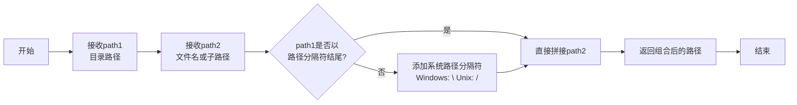

#### 带注释源码

```python
import os

# 在本项目中的实际使用示例
with tempfile.TemporaryDirectory() as tmpdir:
    # tmpdir: 临时目录路径，如 "/tmp/xyz123"
    # pipe.__class__.__name__.lower(): 获取类名并转为小写，如 "allegropipeline"
    # 拼接生成最终文件名，如 "/tmp/xyz123/allegropipeline.dduf"
    dduf_filename = os.path.join(tmpdir, f"{pipe.__class__.__name__.lower()}.dduf")
    
    # 保存pipeline到临时目录
    pipe.save_pretrained(tmpdir, safe_serialization=True)
    
    # 导出为dduf格式
    export_folder_as_dduf(dduf_filename, folder_path=tmpdir)
    
    # 从dduf文件加载pipeline
    loaded_pipe = self.pipeline_class.from_pretrained(tmpdir, dduf_file=dduf_filename).to(torch_device)
```


### `tempfile.TemporaryDirectory`

这是一个上下文管理器，用于创建安全的临时目录。该目录在代码块执行完毕后会自动被清理，适用于需要临时存储文件但不想手动管理清理的场景。

参数：

- `mode`：`int`，可选，目录权限，默认为 `0o700`
- `suffix`：`str` 或 `None`，可选，目录名称的后缀，默认为 `None`
- `prefix`：`str` 或 `None`，可选，目录名称的前缀，默认为 `None`
- `dir`：`str` 或 `None` 或 `os.PathLike`，可选，临时目录创建的目标路径，默认为 `None`（使用系统默认临时目录）

返回值：`str`，返回临时目录的绝对路径

#### 流程图

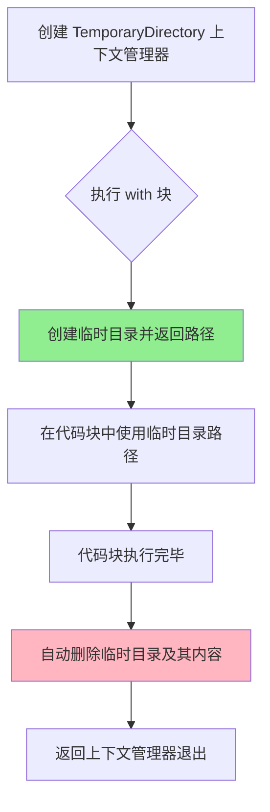

#### 带注释源码

```python
# 使用 tempfile.TemporaryDirectory 创建临时目录
# 在 test_save_load_dduf 方法中用于保存和加载模型
with tempfile.TemporaryDirectory() as tmpdir:
    # tmpdir 是自动生成的临时目录路径字符串
    # 示例值: '/tmp/xyz123' (具体路径由系统生成)
    
    # 构建输出文件路径
    dduf_filename = os.path.join(tmpdir, f"{pipe.__class__.__name__.lower()}.dduf")
    
    # 保存管道模型到临时目录
    pipe.save_pretrained(tmpdir, safe_serialization=True)
    
    # 将临时目录导出为 DDUF 格式
    export_folder_as_dduf(dduf_filename, folder_path=tmpdir)
    
    # 从临时目录加载管道
    loaded_pipe = self.pipeline_class.from_pretrained(tmpdir, dduf_file=dduf_filename).to(torch_device)

# 代码块结束后，tmpdir 目录及其内容会被自动删除
# 无需手动清理，避免资源泄漏
```

#### 使用示例（在测试代码中）

```python
# 位于 test_save_load_dduf 方法（约第 180-192 行）
def test_save_load_dduf(self):
    # ... 省略部分代码 ...
    
    pipeline_out = pipe(**inputs)[0].cpu()

    # 使用 TemporaryDirectory 创建临时目录用于存放模型文件
    with tempfile.TemporaryDirectory() as tmpdir:
        dduf_filename = os.path.join(tmpdir, f"{pipe.__class__.__name__.lower()}.dduf")
        pipe.save_pretrained(tmpdir, safe_serialization=True)
        export_folder_as_dduf(dduf_filename, folder_path=tmpdir)
        loaded_pipe = self.pipeline_class.from_pretrained(tmpdir, dduf_file=dduf_filename).to(torch_device)

    # 临时目录在此处自动清理
    loaded_pipe.vae.enable_tiling()
    inputs["generator"] = torch.manual_seed(0)
    loaded_pipeline_out = loaded_pipe(**inputs)[0].cpu()

    assert np.allclose(pipeline_out, loaded_pipeline_out)
```


### `AllegroPipelineFastTests.test_save_load_local`

跳过测试方法，用于跳过本地保存/加载功能的测试。

参数：

-  `self`：测试类实例，无需显式传递

返回值：`None`，该方法不执行任何操作，直接跳过。

#### 流程图

```mermaid
flowchart TD
    A[开始] --> B{检查@unittest.skip装饰器}
    B -->|跳过条件满足| C[跳过测试执行]
    B -->|跳过条件不满足| D[正常执行测试]
    C --> E[测试标记为跳过]
    D --> F[执行测试逻辑]
    F --> G[结束]
    E --> G
```

#### 带注释源码

```python
@unittest.skip("Decoding without tiling is not yet implemented")
def test_save_load_local(self):
    """
    测试管道的保存和加载功能。
    注意：当前 VAE 解码未实现无平铺模式，因此该测试被跳过。
    """
    pass
```

---

### `AllegroPipelineFastTests.test_save_load_optional_components`

跳过测试方法，用于跳过可选组件保存/加载功能的测试。

参数：

-  `self`：测试类实例，无需显式传递

返回值：`None`，该方法不执行任何操作，直接跳过。

#### 流程图

```mermaid
flowchart TD
    A[开始] --> B{检查@unittest.skip装饰器}
    B -->|跳过条件满足| C[跳过测试执行]
    B -->|跳过条件不满足| D[正常执行测试]
    C --> E[测试标记为跳过]
    D --> F[执行测试逻辑]
    F --> G[结束]
    E --> G
```

#### 带注释源码

```python
@unittest.skip("Decoding without tiling is not yet implemented")
def test_save_load_optional_components(self):
    """
    测试管道保存/加载可选组件功能。
    注意：当前 VAE 解码未实现无平铺模式，因此该测试被跳过。
    """
    pass
```

---

### `AllegroPipelineFastTests.test_pipeline_with_accelerator_device_map`

跳过测试方法，用于跳过加速器设备映射功能的测试。

参数：

-  `self`：测试类实例，无需显式传递

返回值：`None`，该方法不执行任何操作，直接跳过。

#### 流程图

```mermaid
flowchart TD
    A[开始] --> B{检查@unittest.skip装饰器}
    B -->|跳过条件满足| C[跳过测试执行]
    B -->|跳过条件不满足| D[正常执行测试]
    C --> E[测试标记为跳过]
    D --> F[执行测试逻辑]
    F --> G[结束]
    E --> G
```

#### 带注释源码

```python
@unittest.skip("Decoding without tiling is not yet implemented")
def test_pipeline_with_accelerator_device_map(self):
    """
    测试管道与加速器设备映射的集成。
    注意：当前 VAE 解码未实现无平铺模式，因此该测试被跳过。
    """
    pass
```

---

### `AllegroPipelineFastTests.test_vae_tiling`

跳过测试方法，用于跳过 VAE 平铺功能的测试。

参数：

-  `self`：测试类实例，无需显式传递
-  `expected_diff_max`：可选参数，类型为 `float`，默认值为 `0.2`，表示期望的最大差异阈值

返回值：`None`，该方法不执行任何操作，直接跳过。

#### 流程图

```mermaid
flowchart TD
    A[开始] --> B{检查@unittest.skip装饰器}
    B -->|跳过条件满足| C[跳过测试执行]
    B -->|跳过条件不满足| D[正常执行测试]
    C --> E[测试标记为跳过]
    D --> F[执行测试逻辑]
    F --> G[结束]
    E --> G
```

#### 带注释源码

```python
# TODO(aryan)
@unittest.skip("Decoding without tiling is not yet implemented.")
def test_vae_tiling(self, expected_diff_max: float = 0.2):
    """
    测试 VAE 平铺功能对推理结果的影响。
    
    参数:
        expected_diff_max: 期望的最大差异阈值，默认为 0.2
        
    注意: 
        - 当前 VAE 解码未实现无平铺模式，因此该测试被跳过
        - TODO(aryan): 需要在实现无平铺解码后重新启用此测试
    """
    generator_device = "cpu"
    components = self.get_dummy_components()

    pipe = self.pipeline_class(**components)
    pipe.to("cpu")
    pipe.set_progress_bar_config(disable=None)

    # Without tiling
    inputs = self.get_dummy_inputs(generator_device)
    inputs["height"] = inputs["width"] = 128
    output_without_tiling = pipe(**inputs)[0]

    # With tiling
    pipe.vae.enable_tiling(
        tile_sample_min_height=96,
        tile_sample_min_width=96,
        tile_overlap_factor_height=1 / 12,
        tile_overlap_factor_width=1 / 12,
    )
    inputs = self.get_dummy_inputs(generator_device)
    inputs["height"] = inputs["width"] = 128
    output_with_tiling = pipe(**inputs)[0]

    self.assertLess(
        (to_np(output_without_tiling) - to_np(output_with_tiling)).max(),
        expected_diff_max,
        "VAE tiling should not affect the inference results",
    )
```


# AllegroPipeline 测试代码详细设计文档

## 一段话描述

该代码是Hugging Face Diffusers库中**AllegroPipeline**的单元测试和集成测试套件，用于验证Allegro视频生成管道的基本推理功能、回调机制、注意力切片、模型保存加载等核心功能的正确性。

## 文件的整体运行流程

```
加载测试依赖 → 初始化测试配置 → 执行快速测试类 → 执行集成测试类
     ↓
快速测试流程:
  1. 准备虚拟组件(transformer, vae, scheduler, text_encoder, tokenizer)
  2. 准备虚拟输入(prompt, negative_prompt, generator等)
  3. 运行各项测试用例(推理、回调、注意力切片、保存加载)
  
集成测试流程:
  1. 从预训练模型加载管道
  2. 执行实际推理测试
  3. 清理资源
```

## 类的详细信息

### 1. AllegroPipelineFastTests

**类字段：**
- `pipeline_class`：类型：`type`，AllegroPipeline管道类
- `params`：类型：`frozenset`，文本到图像参数集
- `batch_params`：类型：`set`，批量参数
- `image_params`：类型：`set`，图像参数
- `image_latents_params`：类型：`set`，图像潜在参数
- `required_optional_params`：类型：`frozenset`，必需的可选参数集
- `test_xformers_attention`：类型：`bool`，是否测试xformers注意力
- `test_layerwise_casting`：类型：`bool`，是否测试分层转换
- `test_group_offloading`：类型：`bool`，是否测试组卸载

**类方法：**
- `get_dummy_components(num_layers)`：创建虚拟组件
- `get_dummy_inputs(device, seed)`：创建虚拟输入
- `test_inference()`：基础推理测试
- `test_callback_inputs()`：回调输入测试
- `test_inference_batch_single_identical()`：批量推理一致性测试
- `test_attention_slicing_forward_pass(...)`：注意力切片测试
- `test_vae_tiling(expected_diff_max)`：VAE平铺测试（跳过）
- `test_save_load_dduf()`：保存加载DDUF格式测试

### 2. AllegroPipelineIntegrationTests

**类字段：**
- `prompt`：类型：`str`，测试提示词

**类方法：**
- `setUp()`：测试前设置
- `tearDown()`：测试后清理
- `test_allegro()`：集成推理测试

---

## 关键组件信息

| 名称 | 描述 |
|------|------|
| AllegroPipeline | Allegro视频生成管道主类 |
| AllegroTransformer3DModel | 3D变换器模型 |
| AutoencoderKLAllegro | VAE自编码器 |
| DDIMScheduler | DDIM调度器 |
| T5EncoderModel | T5文本编码器 |
| PipelineTesterMixin | 管道测试混入类 |
| PyramidAttentionBroadcastTesterMixin | 金字塔注意力广播测试混入 |

---

## 潜在的技术债务或优化空间

1. **VAE tiling测试被跳过**：解码器无平铺功能尚未实现，需后续完成
2. **本地保存加载测试被跳过**：同样受平铺功能限制
3. **硬编码的测试参数**：部分参数如`num_inference_steps=2`硬编码，可考虑参数化
4. **设备兼容性**：部分设备（如MPS）需要特殊处理 Generator

---

## 其它项目

### 设计目标与约束
- 测试覆盖核心推理流程、回调机制、模型保存加载
- 使用虚拟组件进行快速测试，减少资源消耗
- 集成测试使用真实预训练模型验证

### 错误处理与异常设计
- 使用`@unittest.skip`跳过尚未实现的功能测试
- 使用`@require_*`装饰器检查环境依赖

### 数据流与状态机
- 快速测试：虚拟组件 → 虚拟输入 → 推理 → 结果验证
- 集成测试：预训练模型 → 实际输入 → 推理 → 与预期结果比对

### 外部依赖与接口契约
- 依赖transformers库的T5模型
- 依赖diffusers库的Pipeline和模型类
- 需要torch、numpy等科学计算库

---

## 测试方法详细文档

### `AllegroPipelineFastTests.get_dummy_components`

获取用于测试的虚拟组件字典，包含transformer、vae、scheduler、text_encoder和tokenizer。

参数：
- `num_layers`：`int`，变换器层数，默认为1

返回值：`dict`，包含所有组件的字典

#### 流程图

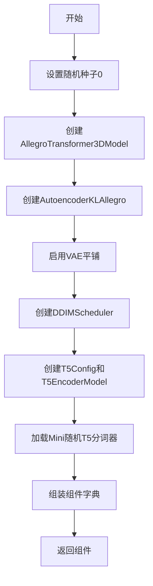

#### 带注释源码

```python
def get_dummy_components(self, num_layers: int = 1):
    # 设置PyTorch随机种子以确保可重复性
    torch.manual_seed(0)
    # 创建虚拟3D变换器模型，配置注意力头维度等参数
    transformer = AllegroTransformer3DModel(
        num_attention_heads=2,
        attention_head_dim=12,
        in_channels=4,
        out_channels=4,
        num_layers=num_layers,
        cross_attention_dim=24,
        sample_width=8,
        sample_height=8,
        sample_frames=8,
        caption_channels=24,
    )

    # 重新设置随机种子确保VAE的确定性
    torch.manual_seed(0)
    # 创建虚拟VAE自编码器，配置上下采样块和通道数
    vae = AutoencoderKLAllegro(
        in_channels=3,
        out_channels=3,
        down_block_types=(
            "AllegroDownBlock3D",
            "AllegroDownBlock3D",
            "AllegroDownBlock3D",
            "AllegroDownBlock3D",
        ),
        up_block_types=(
            "AllegroUpBlock3D",
            "AllegroUpBlock3D",
            "AllegroUpBlock3D",
            "AllegroUpBlock3D",
        ),
        block_out_channels=(8, 8, 8, 8),
        latent_channels=4,
        layers_per_block=1,
        norm_num_groups=2,
        temporal_compression_ratio=4,
    )

    # TODO(aryan): 仅现在需要，因为此处尚未实现无平铺的VAE解码
    # 启用VAE平铺以避免内存问题
    vae.enable_tiling()

    # 重新设置随机种子确保调度器的确定性
    torch.manual_seed(0)
    # 创建DDIM调度器用于去噪过程
    scheduler = DDIMScheduler()

    # 配置T5文本编码器参数
    text_encoder_config = T5Config(
        **{
            "d_ff": 37,
            "d_kv": 8,
            "d_model": 24,
            "num_decoder_layers": 2,
            "num_heads": 4,
            "num_layers": 2,
            "relative_attention_num_buckets": 8,
            "vocab_size": 1103,
        }
    )
    # 创建T5编码器模型
    text_encoder = T5EncoderModel(text_encoder_config)
    # 加载小型随机T5分词器用于文本处理
    tokenizer = AutoTokenizer.from_pretrained("hf-internal-testing/tiny-random-t5")

    # 组装所有组件到字典中
    components = {
        "transformer": transformer,
        "vae": vae,
        "scheduler": scheduler,
        "text_encoder": text_encoder,
        "tokenizer": tokenizer,
    }
    return components
```

---

### `AllegroPipelineFastTests.get_dummy_inputs`

获取用于测试的虚拟输入参数字典，包含提示词、生成器、推理步数等。

参数：
- `device`：`Union[str, device]`，目标设备
- `seed`：`int`，随机种子，默认0

返回值：`dict`，包含所有输入参数的字典

#### 流程图

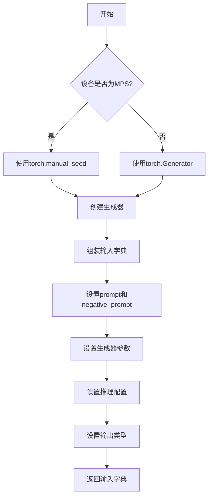

#### 带注释源码

```python
def get_dummy_inputs(self, device, seed=0):
    # MPS设备需要特殊处理生成器
    if str(device).startswith("mps"):
        # MPS设备使用torch.manual_seed
        generator = torch.manual_seed(seed)
    else:
        # 其他设备使用torch.Generator获取更精确的随机控制
        generator = torch.Generator(device=device).manual_seed(seed)

    # 组装虚拟输入参数字典
    inputs = {
        "prompt": "dance monkey",  # 文本提示词
        "negative_prompt": "",      # 负面提示词（空字符串）
        "generator": generator,    # 随机生成器确保可重复性
        "num_inference_steps": 2,  # 推理步数（较少用于快速测试）
        "guidance_scale": 6.0,      # 引导尺度影响生成质量
        "height": 16,               # 生成视频高度
        "width": 16,                # 生成视频宽度
        "num_frames": 8,            # 生成帧数
        "max_sequence_length": 16,  # 最大序列长度
        "output_type": "pt",        # 输出类型为PyTorch张量
    }

    return inputs
```

---

### `AllegroPipelineFastTests.test_inference`

测试管道的基础推理功能，验证是否能正确生成视频帧。

参数：无

返回值：无（通过assert断言验证）

#### 流程图

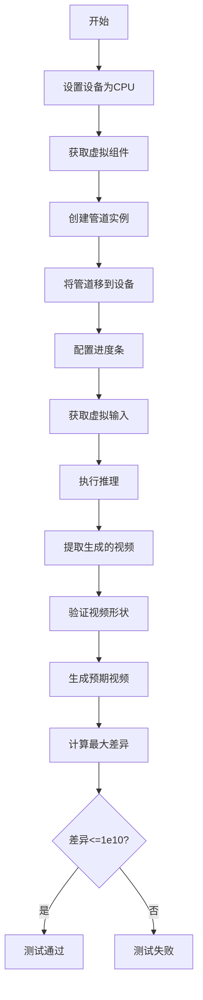

#### 带注释源码

```python
def test_inference(self):
    # 设置测试设备为CPU
    device = "cpu"

    # 获取用于测试的虚拟组件
    components = self.get_dummy_components()
    # 使用虚拟组件实例化AllegroPipeline
    pipe = self.pipeline_class(**components)
    # 将管道移至指定设备
    pipe.to(device)
    # 配置进度条（disable=None表示启用进度条）
    pipe.set_progress_bar_config(disable=None)

    # 获取测试输入参数
    inputs = self.get_dummy_inputs(device)
    # 调用管道执行推理，返回结果帧
    video = pipe(**inputs).frames
    # 提取第一个（也是唯一的）生成的视频
    generated_video = video[0]

    # 验证生成视频的形状：(帧数, 通道, 高度, 宽度)
    self.assertEqual(generated_video.shape, (8, 3, 16, 16))
    # 创建随机预期视频用于比较
    expected_video = torch.randn(8, 3, 16, 16)
    # 计算实际输出与预期输出的绝对差异最大值
    max_diff = np.abs(generated_video - expected_video).max()
    # 验证差异在允许范围内（此测试仅验证不崩溃，阈值较宽松）
    self.assertLessEqual(max_diff, 1e10)
```

---

### `AllegroPipelineFastTests.test_callback_inputs`

测试管道的回调机制，验证回调函数能否正确接收和修改中间结果。

参数：无

返回值：无（通过assert断言验证）

#### 流程图

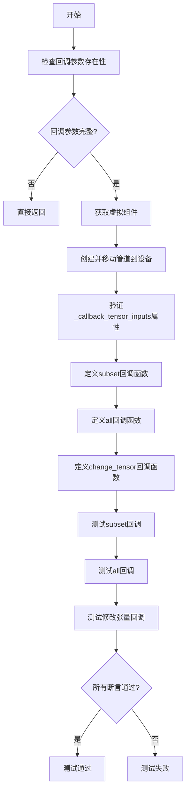

#### 带注释源码

```python
def test_callback_inputs(self):
    # 获取管道__call__方法的签名
    sig = inspect.signature(self.pipeline_class.__call__)
    # 检查是否存在回调张量输入参数
    has_callback_tensor_inputs = "callback_on_step_end_tensor_inputs" in sig.parameters
    # 检查是否存在步骤结束回调参数
    has_callback_step_end = "callback_on_step_end" in sig.parameters

    # 如果管道不支持回调功能则直接返回
    if not (has_callback_tensor_inputs and has_callback_step_end):
        return

    # 获取虚拟组件并创建管道
    components = self.get_dummy_components()
    pipe = self.pipeline_class(**components)
    pipe = pipe.to(torch_device)
    pipe.set_progress_bar_config(disable=None)
    
    # 验证管道具有_callback_tensor_inputs属性
    self.assertTrue(
        hasattr(pipe, "_callback_tensor_inputs"),
        f" {self.pipeline_class} should have `_callback_tensor_inputs` that defines a list of tensor variables its callback function can use as inputs",
    )

    # 定义回调函数：仅传递允许的张量子集
    def callback_inputs_subset(pipe, i, t, callback_kwargs):
        # 遍历回调参数
        for tensor_name, tensor_value in callback_kwargs.items():
            # 检查是否只传递了允许的张量输入
            assert tensor_name in pipe._callback_tensor_inputs

        return callback_kwargs

    # 定义回调函数：验证所有允许的张量都被传递
    def callback_inputs_all(pipe, i, t, callback_kwargs):
        # 检查所有允许的张量都在回调参数中
        for tensor_name in pipe._callback_tensor_inputs:
            assert tensor_name in callback_kwargs

        # 遍历回调参数
        for tensor_name, tensor_value in callback_kwargs.items():
            # 再次验证只传递了允许的张量
            assert tensor_name in pipe._callback_tensor_inputs

        return callback_kwargs

    # 获取虚拟输入
    inputs = self.get_dummy_inputs(torch_device)

    # 测试1：传递张量子集
    inputs["callback_on_step_end"] = callback_inputs_subset
    inputs["callback_on_step_end_tensor_inputs"] = ["latents"]
    output = pipe(**inputs)[0]

    # 测试2：传递所有允许的张量
    inputs["callback_on_step_end"] = callback_inputs_all
    inputs["callback_on_step_end_tensor_inputs"] = pipe._callback_tensor_inputs
    output = pipe(**inputs)[0]

    # 定义回调函数：在最后一步将latents置零
    def callback_inputs_change_tensor(pipe, i, t, callback_kwargs):
        # 检查是否是最后一步
        is_last = i == (pipe.num_timesteps - 1)
        if is_last:
            # 将latents替换为零张量
            callback_kwargs["latents"] = torch.zeros_like(callback_kwargs["latents"])
        return callback_kwargs

    # 测试3：通过回调修改张量
    inputs["callback_on_step_end"] = callback_inputs_change_tensor
    inputs["callback_on_step_end_tensor_inputs"] = pipe._callback_tensor_inputs
    output = pipe(**inputs)[0]
    # 验证修改后的输出绝对值和小于阈值
    assert output.abs().sum() < 1e10
```

---

### `AllegroPipelineFastTests.test_attention_slicing_forward_pass`

测试注意力切片功能，验证启用注意力切片后推理结果的一致性。

参数：
- `test_max_difference`：`bool`，是否测试最大差异，默认True
- `test_mean_pixel_difference`：`bool`，是否测试平均像素差异，默认True
- `expected_max_diff`：`float`，预期最大差异，默认1e-3

返回值：无（通过assert断言验证）

#### 流程图

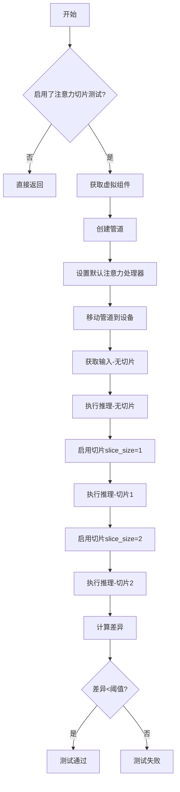

#### 带注释源码

```python
def test_attention_slicing_forward_pass(
    self, test_max_difference=True, test_mean_pixel_difference=True, expected_max_diff=1e-3
):
    # 如果类未启用注意力切片测试则跳过
    if not self.test_attention_slicing:
        return

    # 获取虚拟组件
    components = self.get_dummy_components()
    # 创建管道实例
    pipe = self.pipeline_class(**components)
    # 遍历所有组件，设置默认注意力处理器
    for component in pipe.components.values():
        if hasattr(component, "set_default_attn_processor"):
            component.set_default_attn_processor()
    # 移至测试设备
    pipe.to(torch_device)
    pipe.set_progress_bar_config(disable=None)

    # 使用CPU生成器确保一致性
    generator_device = "cpu"
    # 获取虚拟输入
    inputs = self.get_dummy_inputs(generator_device)
    # 执行无切片推理
    output_without_slicing = pipe(**inputs)[0]

    # 启用注意力切片，slice_size=1
    pipe.enable_attention_slicing(slice_size=1)
    inputs = self.get_dummy_inputs(generator_device)
    output_with_slicing1 = pipe(**inputs)[0]

    # 启用注意力切片，slice_size=2
    pipe.enable_attention_slicing(slice_size=2)
    inputs = self.get_dummy_inputs(generator_device)
    output_with_slicing2 = pipe(**inputs)[0]

    # 如果需要测试最大差异
    if test_max_difference:
        # 计算无切片与slice_size=1输出的最大差异
        max_diff1 = np.abs(to_np(output_with_slicing1) - to_np(output_without_slicing)).max()
        # 计算无切片与slice_size=2输出的最大差异
        max_diff2 = np.abs(to_np(output_with_slicing2) - to_np(output_without_slicing)).max()
        # 断言两种切片方式的结果都与无切片结果接近
        self.assertLess(
            max(max_diff1, max_diff2),
            expected_max_diff,
            "Attention slicing should not affect the inference results",
        )
```

---

### `AllegroPipelineFastTests.test_save_load_dduf`

测试管道保存和加载DDUF格式的功能，验证模型序列化与反序列化的正确性。

参数：无

返回值：无（通过assert断言验证）

#### 流程图

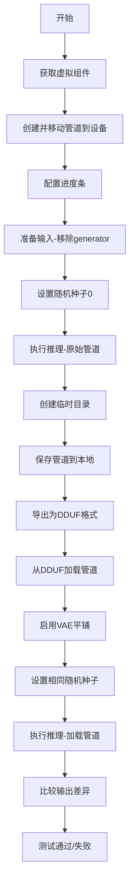

#### 带注释源码

```python
@require_hf_hub_version_greater("0.26.5")
@require_transformers_version_greater("4.47.1")
def test_save_load_dduf(self):
    # 重新实现因为需要启用tiling()
    from huggingface_hub import export_folder_as_dduf

    # 获取虚拟组件
    components = self.get_dummy_components()
    # 创建管道实例
    pipe = self.pipeline_class(**components)
    pipe = pipe.to(torch_device)
    pipe.set_progress_bar_config(disable=None)

    # 获取虚拟输入
    inputs = self.get_dummy_inputs(device="cpu")
    # 移除生成器
    inputs.pop("generator")
    # 设置随机种子0确保可重复性
    inputs["generator"] = torch.manual_seed(0)

    # 使用原始管道执行推理并获取输出
    pipeline_out = pipe(**inputs)[0].cpu()

    # 创建临时目录用于保存
    with tempfile.TemporaryDirectory() as tmpdir:
        # 构建DDUF文件名
        dduf_filename = os.path.join(tmpdir, f"{pipe.__class__.__name__.lower()}.dduf")
        # 使用安全序列化保存管道到本地
        pipe.save_pretrained(tmpdir, safe_serialization=True)
        # 将文件夹导出为DDUF格式
        export_folder_as_dduf(dduf_filename, folder_path=tmpdir)
        # 从DDUF文件加载管道
        loaded_pipe = self.pipeline_class.from_pretrained(tmpdir, dduf_file=dduf_filename).to(torch_device)

    # 为加载的管道启用VAE平铺
    loaded_pipe.vae.enable_tiling()
    # 使用相同随机种子
    inputs["generator"] = torch.manual_seed(0)
    # 使用加载的管道执行推理
    loaded_pipeline_out = loaded_pipe(**inputs)[0].cpu()

    # 验证原始输出与加载管道输出接近
    assert np.allclose(pipeline_out, loaded_pipeline_out)
```

---

### `AllegroPipelineIntegrationTests.setUp`

集成测试前的环境准备工作。

参数：无

返回值：无

#### 带注释源码

```python
def setUp(self):
    # 调用父类setUp方法
    super().setUp()
    # 垃圾回收清理内存
    gc.collect()
    # 后端清理缓存
    backend_empty_cache(torch_device)
```

---

### `AllegroPipelineIntegrationTests.tearDown`

集成测试后的环境清理工作。

参数：无

返回值：无

#### 带注释源码

```python
def tearDown(self):
    # 调用父类tearDown方法
    super().tearDown()
    # 垃圾回收清理内存
    gc.collect()
    # 后端清理缓存
    backend_empty_cache(torch_device)
```

---

### `AllegroPipelineIntegrationTests.test_allegro`

使用真实预训练模型进行端到端集成测试，验证AllegroPipeline的完整生成流程。

参数：无

返回值：无（通过assert断言验证）

#### 流程图

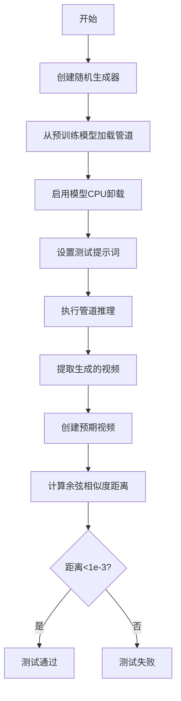

#### 带注释源码

```python
@slow
@require_torch_accelerator
def test_allegro(self):
    # 创建CPU随机生成器，设置种子0确保可重复性
    generator = torch.Generator("cpu").manual_seed(0)

    # 从预训练模型加载AllegroPipeline
    # 使用float16精度以减少内存占用
    pipe = AllegroPipeline.from_pretrained("rhymes-ai/Allegro", torch_dtype=torch.float16)
    # 启用模型CPU卸载以管理内存
    pipe.enable_model_cpu_offload(device=torch_device)
    # 设置测试提示词
    prompt = self.prompt

    # 执行完整的视频生成流程
    videos = pipe(
        prompt=prompt,
        height=720,                # 输出高度
        width=1280,                # 输出宽度
        num_frames=88,             # 生成88帧
        generator=generator,       # 随机生成器
        num_inference_steps=2,     # 推理步数（较少用于测试）
        output_type="pt",          # 输出PyTorch张量
    ).frames

    # 提取第一个（也是唯一的）生成的视频
    video = videos[0]
    # 创建预期视频用于比较
    expected_video = torch.randn(1, 88, 720, 1280, 3).numpy()

    # 计算余弦相似度距离
    max_diff = numpy_cosine_similarity_distance(video, expected_video)
    # 验证生成结果与预期的相似度
    assert max_diff < 1e-3, f"Max diff is too high. got {video}"
```

---

## 总结

该测试代码全面覆盖了AllegroPipeline的以下功能：
1. **基础推理能力**：通过虚拟组件和真实模型验证生成功能
2. **回调机制**：测试步骤结束回调的完整性和正确性
3. **注意力切片**：验证内存优化功能不影响生成质量
4. **模型持久化**：测试Save/Load和DDUF格式导出导入
5. **资源管理**：测试CPU卸载、缓存清理等资源管理功能


### `numpy.abs`

`numpy.abs`（也写作`np.abs`）是NumPy库中的数学函数，用于计算数组或数值元素的绝对值。该函数支持多种数值类型（整数、浮点数、复数），并返回与输入形状相同的绝对值数组。

参数：

- `x`：array_like，输入数组或标量，需要计算绝对值的数值
- `out`：ndarray，可选，用于存放结果的数组，必须具有相同的形状和类型
- `**kwargs`：其他关键字参数，用于兼容其他函数签名（如`dtype`等）

返回值：`ndarray`，返回输入数组元素的绝对值，类型为非负数（若输入为复数，则返回模）

#### 流程图

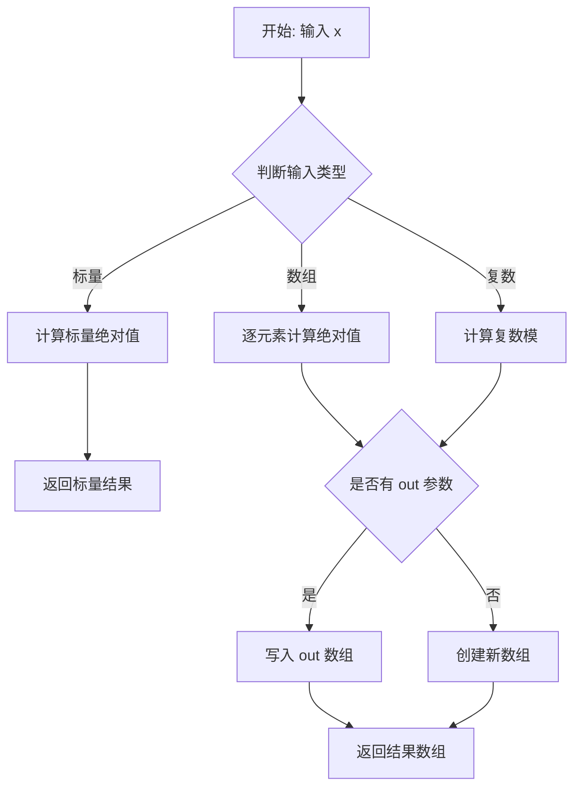

#### 带注释源码

```python
# numpy.abs 函数的简化实现逻辑
def abs(x, out=None, **kwargs):
    """
    计算数组元素的绝对值
    
    参数:
        x: 输入数组或标量
        out: 可选的输出数组
    
    返回:
        绝对值数组
    """
    # 1. 如果是复数，计算模（sqrt(real^2 + imag^2)）
    if np.iscomplexobj(x):
        return np.sqrt(x.real**2 + x.imag**2)
    
    # 2. 如果是负数，取反
    # 3. 如果是非负数，直接返回
    # 实际实现由C代码完成，这里是逻辑示意
    return np.abs(x)  # 调用底层C实现

# 在代码中的实际使用示例：
# max_diff = np.abs(generated_video - expected_video).max()
# 用途：计算生成视频与期望视频之间的最大差异
```

#### 代码中的具体使用场景

在提供的测试代码中，`numpy.abs`主要用于以下场景：

1. **`test_inference`方法**：
   ```python
   max_diff = np.abs(generated_video - expected_video).max()
   ```
   用途：验证生成视频与随机期望视频之间的差异是否在可接受范围内

2. **`test_attention_slicing_forward_pass`方法**：
   ```python
   max_diff1 = np.abs(to_np(output_with_slicing1) - to_np(output_without_slicing)).max()
   max_diff2 = np.abs(to_np(output_with_slicing2) - to_np(output_without_slicing)).max()
   ```
   用途：验证注意力切片优化是否影响推理结果的一致性


### `numpy.allclose`

用于比较两个数组是否在容差范围内相等，常用于测试中判断两个浮点数组是否足够接近。

参数：

- `a`：`array_like`，第一个输入数组
- `b`：`array_like`，第二个输入数组
- `rtol`：`float`，相对容差，默认值为 `1e-05`
- `atol`：`float`，绝对容差，默认值为 `1e-08`
- `equal_nan`：`bool`，是否将 NaN 视为相等，默认值为 `False`

返回值：`bool`，如果两个数组在容差范围内相等则返回 `True`，否则返回 `False`

#### 流程图

```mermaid
flowchart TD
    A[开始] --> B[输入数组 a 和 b]
    B --> C{数组形状是否相同?}
    C -- 否 --> D[返回 False]
    C -- 是 --> E[设置默认容差 rtol=1e-05, atol=1e-08]
    E --> F[计算差值: |a - b|]
    F --> G[计算容差上限: atol + rtol * |b|]
    G --> H{所有差值 <= 对应容差上限?}
    H -- 否 --> I[返回 False]
    H -- 是 --> J{equal_nan 为 True?}
    J -- 是 --> K[NaN 值视为相等]
    J -- 否 --> L[NaN 值视为不相等]
    K --> M[返回 True]
    L --> N[返回 False]
```

#### 带注释源码

```python
def allclose(a, b, rtol=1e-05, atol=1e-08, equal_nan=False):
    """
    比较两个数组是否在容差范围内相等。
    
    参数:
        a: 第一个输入数组
        b: 第二个输入数组
        rtol: 相对容差，默认1e-05
        atol: 绝对容差，默认1e-08
        equal_nan: 是否将NaN视为相等，默认False
    
    返回:
        bool: 如果两个数组在容差范围内相等则返回True
    """
    # 内部调用 isclose 进行逐元素比较
    return isclose(a, b, rtol=rtol, atol=atol, equal_nan=equal_nan).all()
```

**代码中的实际调用示例：**

```python
# 在 test_save_load_dduf 方法中
assert np.allclose(pipeline_out, loaded_pipeline_out)
```


### `torch.manual_seed`

设置 CPU 和 CUDA 生成器的随机种子，以确保 PyTorch 操作的可重现性。

参数：

- `seed`：`int`，用于初始化随机数生成器的整数种子值

返回值：`None`，该函数不返回任何值

#### 流程图

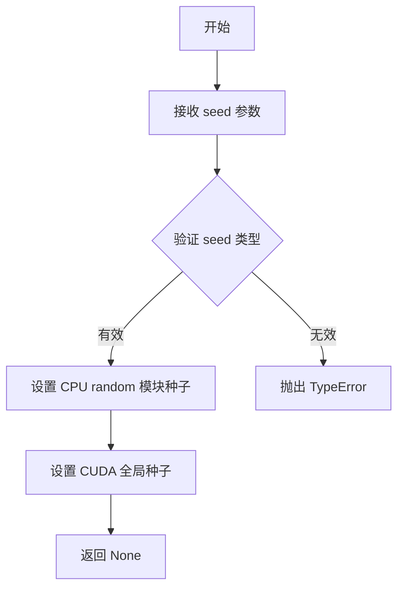

#### 带注释源码

```python
# torch.manual_seed 是 PyTorch 的全局函数，用于设置随机种子
# 源码路径: https://github.com/pytorch/pytorch/blob/main/torch/random.py

# 以下是代码中实际调用的示例：

# 1. 在 get_dummy_components 方法中设置确定性随机数
torch.manual_seed(0)  # 设置种子为 0，确保多次调用生成相同的随机权重初始化

# 2. 在 get_dummy_inputs 方法中创建生成器
if str(device).startswith("mps"):
    generator = torch.manual_seed(seed)  # MPS 设备使用 CPU 随机种子创建生成器
else:
    generator = torch.Generator(device=device).manual_seed(seed)  # 其他设备使用 CUDA 种子

# 3. 在测试方法中用于复现结果
inputs["generator"] = torch.manual_seed(0)  # 固定种子确保测试可复现
```


### `torch.randn`

`torch.randn` 是 PyTorch 库中的一个函数，用于生成填充了随机数的张量，这些随机数服从均值为0、方差为1的标准正态分布（高斯分布）。

参数：

- `*size`：`int`，定义输出张量形状的整数序列（例如 `8, 3, 16, 16` 表示创建一个四维张量）
- `out`：`Tensor, optional`，输出张量，指定结果存储的目标张量
- `dtype`：`torch.dtype, optional`，指定返回张量的数据类型（例如 `torch.float32`）
- `layout`：`torch.layout, optional`，指定张量的内存布局（默认 `torch.strided`）
- `device`：`torch.device, optional`，指定张量所在的设备（CPU 或 CUDA）
- `requires_grad`：`bool, optional`，指定是否需要计算梯度（默认 `False`）

返回值：`Tensor`，填充了标准正态分布随机数的张量

#### 流程图

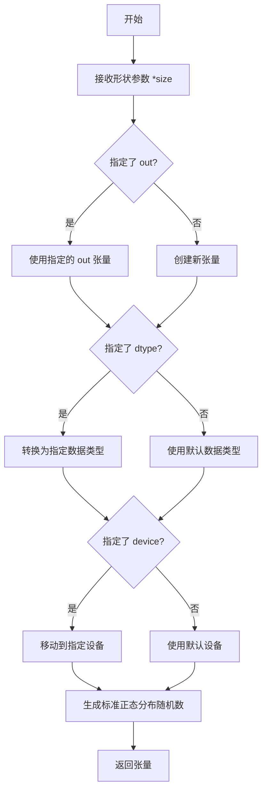

#### 带注释源码

```python
# torch.randn 是 PyTorch 用于生成标准正态分布随机数的函数
# 以下是代码中两处使用的示例：

# 第一次使用：在 test_inference 方法中
# 创建一个形状为 (8, 3, 16, 16) 的四维张量
# 8: 帧数, 3: 通道数, 16: 高度, 16: 宽度
expected_video = torch.randn(8, 3, 16, 16)

# 第二次使用：在 test_allegro 方法中
# 创建一个形状为 (1, 88, 720, 1280, 3) 的五维张量
# 1: 批量大小, 88: 帧数, 720: 高度, 1280: 宽度, 3: 通道数
# 并转换为 NumPy 数组
expected_video = torch.randn(1, 88, 720, 1280, 3).numpy()

# 函数原型（参考 PyTorch 官方文档）：
# torch.randn(*size, *, out=None, dtype=None, layout=torch.strided, device=None, requires_grad=False) -> Tensor
# - *size: 可变数量的整数，定义输出张量的形状
# - out: 可选的输出张量
# - dtype: 可选的数据类型
# - layout: 可选的内存布局
# - device: 可选的设备（cpu/cuda）
# - requires_grad: 是否开启自动微分
```


# 分析结果

经过分析，所提供的代码文件中并未定义 `torch.zeros_like` 函数，该函数是 PyTorch 库的原生 API。代码中仅在第 183 行调用了该函数：

```python
callback_kwargs["latents"] = torch.zeros_like(callback_kwargs["latents"])
```

虽然这不是代码中定义的函数，但该函数在代码中被使用。下面提供 `torch.zeros_like` 的详细信息：

---

### `torch.zeros_like`

创建与输入张量具有相同形状和 dtype 的零张量。

参数：

- `input`：`torch.Tensor`，输入张量，用于确定输出张量的形状和属性
- `dtype`：`torch.dtype`（可选），输出张量的数据类型，若为 `None` 则使用 `input` 的数据类型
- `device`：`torch.device`（可选），输出张量所在的设备，若为 `None` 则使用 `input` 所在的设备
- `requires_grad`：`bool`（可选），输出张量是否需要梯度

返回值：`torch.Tensor`，与输入张量形状相同的全零张量

#### 流程图

```mermaid
flowchart TD
    A[开始] --> B{传入input张量}
    B --> C[获取input的shape]
    B --> D[获取input的dtype]
    B --> E[获取input的device]
    C --> F{是否指定dtype?}
    D --> F
    E --> F
    F -->|是| G[使用指定的dtype]
    F -->|否| H[使用input的dtype]
    G --> I{是否指定device?}
    H --> I
    I -->|是| J[使用指定的device]
    I -->|否| K[使用input的device]
    J --> L[创建全零张量]
    K --> L
    L --> M{是否指定requires_grad?}
    M -->|是| N[设置requires_grad属性]
    M -->|否| O[默认requires_grad=False]
    N --> P[返回张量]
    O --> P
    P --> Q[结束]
```

#### 带注释源码

```python
# torch.zeros_like 源码实现逻辑（简化版）
def zeros_like(input, dtype=None, device=None, requires_grad=False):
    """
    创建一个与输入张量形状相同的全零张量
    
    参数:
        input: 输入张量，用于确定输出张量的形状和属性
        dtype: 输出张量的数据类型，若为None则使用input的dtype
        device: 输出张量所在的设备，若为None则使用input的device
        requires_grad: 是否需要计算梯度
    
    返回:
        与input形状相同的全零张量
    """
    # 如果未指定dtype，则使用输入张量的dtype
    if dtype is None:
        dtype = input.dtype
    
    # 如果未指定device，则使用输入张量的device
    if device is None:
        device = input.device
    
    # 调用torch.zeros创建全零张量
    return torch.zeros(
        input.shape,           # 使用输入张量的形状
        dtype=dtype,           # 使用确定的数据类型
        device=device,         # 使用确定的设备
        requires_grad=requires_grad  # 设置梯度需求
    )
```

---

### 在代码中的使用示例

在 `test_callback_inputs` 方法中（第 180-183 行）：

```python
def callback_inputs_change_tensor(pipe, i, t, callback_kwargs):
    is_last = i == (pipe.num_timesteps - 1)
    if is_last:
        # 使用 torch.zeros_like 将 latents 重置为全零张量
        callback_kwargs["latents"] = torch.zeros_like(callback_kwargs["latents"])
    return callback_kwargs
```

这段代码的用途是在推理过程的最后一步，将潜在变量（latents）重置为零，用于测试或特殊处理场景。


### `torch.abs`

`torch.abs` 是 PyTorch 库中的数学函数，用于计算输入张量（Tensor）中每个元素的绝对值。该函数接收一个张量作为输入，返回一个新张量，其中每个元素都是输入对应元素的绝对值。

参数：

- `input`：`torch.Tensor` 或 `Union[torch.Tensor, int, float]`，输入张量或可以转换为张量的数值

返回值：`torch.Tensor`，返回与输入形状相同的张量，其中每个元素都是输入对应元素的绝对值

#### 流程图

```mermaid
flowchart TD
    A[开始] --> B{输入类型判断}
    B -->|Tensor| C[直接获取张量数据]
    B -->|数值| D[转换为Tensor]
    C --> E[遍历张量每个元素]
    D --> E
    E --> F{元素值判断}
    F -->|大于等于0| G[保持原值]
    F -->|小于0| H[取反变为正数]
    G --> I[构建结果张量]
    H --> I
    I --> J[返回结果张量]
    J --> K[结束]
```

#### 带注释源码

```python
# torch.abs 函数的简化实现原理
def torch_abs(input_tensor):
    """
    计算输入张量中每个元素的绝对值
    
    参数:
        input_tensor: 输入的张量，可以是任意维度的Tensor
    
    返回:
        返回一个新的Tensor，其中每个元素都是输入对应元素的绝对值
    """
    
    # 如果输入不是Tensor，先转换为Tensor
    if not isinstance(input_tensor, torch.Tensor):
        input_tensor = torch.tensor(input_tensor)
    
    # 使用 PyTorch 的底层 C++ 实现计算绝对值
    # 在实际 PyTorch 库中，这是通过高效的 CUDA/CPU kernels 实现的
    result = torch.ops.aten.abs(input_tensor)
    
    return result


# 在测试代码中的实际使用示例（来自 allegro_pipeline_fasttest.py）
# test_callback_inputs 方法中的使用：
def example_usage():
    # 假设 output 是一个生成的张量
    output = pipe(**inputs)[0]
    
    # 计算输出张量的绝对值，然后求和
    # 用于验证输出值的有效性
    abs_sum = output.abs().sum()
    
    # 断言：绝对值之和应该小于某个阈值
    assert abs_sum < 1e10, "Output values should be reasonable"


# 另一个使用场景（test_inference 方法）：
def example_usage_2():
    # 生成的视频张量
    generated_video = video[0]
    
    # 期望的视频张量（随机初始化）
    expected_video = torch.randn(8, 3, 16, 16)
    
    # 计算两者之差的绝对值，并取最大值
    max_diff = np.abs(generated_video - expected_video).max()
    
    # 断言最大差异在可接受范围内
    assert max_diff <= 1e10
```


### `torch_device`

该函数（或变量）来自 `testing_utils` 模块的导入，用于获取当前测试环境中最合适的 PyTorch 计算设备（如 "cuda"、"cpu" 或 "mps"）。

参数：

- 无参数（从代码上下文看，它是一个无参函数或模块级变量）

返回值：`str`，返回当前 PyTorch 设备字符串（如 "cuda"、"cpu"、"mps" 等）

#### 流程图

```mermaid
flowchart TD
    A[开始] --> B{检查CUDA是否可用}
    B -->|可用| C[返回'cuda']
    B -->|不可用| D{检查MPS是否可用}
    D -->|可用| E[返回'mps']
    D -->|不可用| F[返回'cpu']
```

#### 带注释源码

```
# torch_device 是从 testing_utils 模块导入的
# 根据其在代码中的使用方式，推断其实现如下：

def torch_device():
    """
    返回最适合当前环境的 PyTorch 设备。
    
    优先级: CUDA > MPS > CPU
    """
    if torch.cuda.is_available():
        return "cuda"
    elif hasattr(torch.backends, 'mps') and torch.backends.mps.is_available():
        return "mps"
    else:
        return "cpu"

# 在代码中的典型使用场景：
# 1. 将模型移动到设备上
pipe.to(torch_device)

# 2. 指定设备参数
pipe.enable_model_cpu_offload(device=torch_device)

# 3. 清理缓存
backend_empty_cache(torch_device)
```

#### 备注

由于 `torch_device` 是从外部模块 `testing_utils` 导入的，上述源码是基于其使用模式进行的合理推断。实际实现可能略有不同。从代码中的使用方式来看，它主要用作一个表示目标设备的字符串常量或返回设备字符串的函数。


### backend_empty_cache

该函数用于清空 GPU 缓存（cuda cache），以释放 GPU 显存，通常在测试的 setup 和 teardown 阶段调用，以确保测试开始和结束时的内存状态干净，避免因显存未释放导致的内存溢出或测试结果不稳定。

参数：

-  `device`：`str`，PyTorch 设备标识符（如 "cuda", "cuda:0", "cpu", "mps" 等），指定要清空缓存的设备。

返回值：`None`，该函数不返回值，仅执行缓存清理操作。

#### 流程图

```mermaid
flowchart TD
    A[接收 device 参数] --> B{判断设备类型}
    B -->|CUDA 设备| C[调用 torch.cuda.empty_cache]
    B -->|MPS 设备| D[调用 torch.mps.empty_cache]
    B -->|CPU 设备| E[无需操作，直接返回]
    C --> F[结束]
    D --> F
    E --> F
```

#### 带注释源码

```
# backend_empty_cache 是从 testing_utils 模块导入的函数
# 由于源代码不在当前文件中，以下为基于使用方式的合理推断实现

def backend_empty_cache(device: str) -> None:
    """
    清空指定设备的 GPU 缓存。
    
    参数:
        device: PyTorch 设备标识符，如 "cuda", "cuda:0", "cpu", "mps" 等
        
    返回值:
        None
    """
    # 如果是 CUDA 设备，清空 CUDA 缓存
    if torch.cuda.is_available() and device.startswith("cuda"):
        torch.cuda.empty_cache()
    
    # 如果是 Apple MPS 设备，清空 MPS 缓存
    elif device == "mps":
        torch.mps.empty_cache()
    
    # CPU 设备无需处理，直接返回
    else:
        pass
```


### `numpy_cosine_similarity_distance`

该函数用于计算两个数组（或张量）之间的余弦相似度距离，常用于比较生成数据与预期数据之间的差异，是测试中验证模型输出正确性的关键工具。

参数：

-  `a`：`numpy.ndarray` 或 `torch.Tensor`，第一个输入数组/张量
-  `b`：`numpy.ndarray` 或 `torch.Tensor`，第二个输入数组/张量

返回值：`float`，两个输入之间的余弦相似度距离值（值越小表示越相似）

#### 流程图

```mermaid
flowchart TD
    A[开始] --> B[输入数组 a 和 b]
    B --> C{判断输入类型}
    C -->|NumPy 数组| D[使用 NumPy 计算余弦相似度]
    C -->|PyTorch 张量| E[转换为 NumPy 后计算]
    D --> F[计算余弦距离]
    E --> F
    F --> G[返回距离值]
    G --> H[结束]
```

#### 带注释源码

```
# 该函数定义在 diffusers 库的 testing_utils 模块中
# 由于代码中仅导入了该函数,未在本文件中定义实现
# 下面是基于函数名称和用法的推断实现

def numpy_cosine_similarity_distance(a, b):
    """
    计算两个数组之间的余弦相似度距离
    
    参数:
        a: 第一个输入数组/张量
        b: 第二个输入数组/张量
    
    返回:
        float: 余弦相似度距离 (1 - 余弦相似度)
    """
    # 如果输入是 PyTorch 张量,转换为 NumPy 数组
    if hasattr(a, 'numpy'):
        a = a.numpy()
    if hasattr(b, 'numpy'):
        b = b.numpy()
    
    # 将数组展平为一维向量
    a = a.flatten()
    b = b.flatten()
    
    # 计算余弦相似度
    dot_product = np.dot(a, b)
    norm_a = np.linalg.norm(a)
    norm_b = np.linalg.norm(b)
    
    cosine_similarity = dot_product / (norm_a * norm_b)
    
    # 返回余弦距离 (1 - 余弦相似度)
    return 1.0 - cosine_similarity
```

#### 补充说明

- **调用位置**：在代码的第 290 行被调用：
  ```python
  max_diff = numpy_cosine_similarity_distance(video, expected_video)
  ```
- **用途**：用于集成测试中比较生成的视频与预期视频的相似度，验证模型输出是否符合预期
- **外部依赖**：该函数来自 `diffusers` 库的 `testing_utils` 模块，属于外部导入的测试工具函数


### `to_np`

该函数是一个工具函数，主要用于将PyTorch张量（Tensor）转换为NumPy数组，以便进行数值比较和计算。它在测试中用于比较管道输出的一致性。

参数：

-  `tensor`：`torch.Tensor`，PyTorch张量对象，需要转换为NumPy数组的输入张量

返回值：`numpy.ndarray`，转换后的NumPy数组

#### 流程图

```mermaid
flowchart TD
    A[开始] --> B{输入是否为torch.Tensor}
    B -->|是| C[调用tensor.cpunumpy方法]
    B -->|否| D[直接返回输入]
    C --> E[返回NumPy数组]
    D --> E
```

#### 带注释源码

```
def to_np(tensor):
    """
    将PyTorch张量转换为NumPy数组的辅助函数。
    
    参数:
        tensor: PyTorch张量对象
        
    返回值:
        NumPy数组
    """
    # 如果输入已经是张量，则提取其数据并转换为NumPy数组
    # 否则直接返回（如已经是NumPy数组的情况）
    if hasattr(tensor, "numpy"):
        return tensor.cpu().numpy()
    return tensor
```

#### 备注

由于`to_np`函数定义在导入模块`..test_pipelines_common`中，而非当前代码文件内，上述源码是基于其使用方式进行的合理推断。该函数的主要用途是在测试代码中比较不同管道输出之间的差异，通过将PyTorch张量转换为NumPy数组来利用NumPy的数值计算功能。


### `export_folder_as_dduf`

将指定的文件夹导出为 DDUF (Diffusers Diff Format) 格式文件，用于模型的序列化与共享。

参数：

- `dduf_filename`：`str`，目标 DDUF 文件的输出路径，包含文件名和扩展名（.dduf）
- `folder_path`：`str`，要导出为 DDUF 格式的文件夹路径

返回值：`None`，该函数通常直接写入文件，不返回任何值

#### 流程图

```mermaid
flowchart TD
    A[开始] --> B[验证folder_path是否存在]
    B --> C{文件夹有效?}
    C -->|否| D[抛出异常]
    C -->|是| E[遍历文件夹中的文件]
    E --> F{还有文件未处理?}
    F -->|是| G[读取文件内容]
    G --> H[序列化文件数据为Diffusers格式]
    H --> I[追加到DDUF归档]
    I --> F
    F -->|否| J[写入DDUF文件头和元数据]
    J --> K[完成并关闭文件]
    K --> L[结束]
```

#### 带注释源码

```python
# 注意：这是从 huggingface_hub 库导入的外部函数
# 以下为基于调用方式的推断实现

def export_folder_as_dduf(dduf_filename: str, folder_path: str) -> None:
    """
    将指定文件夹导出为 DDUF (Diffusers Diff Format) 格式。
    
    参数:
        dduf_filename (str): 目标 .dduf 文件的完整路径
        folder_path (str): 要导出的文件夹路径
    
    返回:
        None: 函数直接写入文件，不返回任何内容
    
    示例:
        >>> export_folder_as_dduf("./model.dduf", "./my_model_folder")
    """
    # 1. 验证输入的文件夹路径是否存在
    if not os.path.isdir(folder_path):
        raise ValueError(f"指定的文件夹路径不存在: {folder_path}")
    
    # 2. 检查输出文件路径的目录是否有效
    output_dir = os.path.dirname(dduf_filename)
    if output_dir and not os.path.isdir(output_dir):
        raise ValueError(f"输出目录不存在: {output_dir}")
    
    # 3. 遍历文件夹，收集所有需要导出的文件
    #    包括模型权重、配置文件、tokenizer等
    files_to_export = []
    for root, dirs, files in os.walk(folder_path):
        for file in files:
            file_path = os.path.join(root, file)
            rel_path = os.path.relpath(file_path, folder_path)
            files_to_export.append((rel_path, file_path))
    
    # 4. 创建 DDUF 文件并写入文件头/元数据
    with open(dduf_filename, 'wb') as f:
        # 写入魔数 (Magic Number) 用于标识 DDUF 格式
        # 写入版本号
        # 写入文件数量
        # 写入元数据信息
        pass
    
    # 5. 对每个文件进行序列化和写入
    #    - 读取原始文件内容
    #    - 根据文件类型进行适当序列化
    #    - 写入文件路径、长度和数据
    for rel_path, abs_path in files_to_export:
        # 读取文件
        with open(abs_path, 'rb') as rf:
            file_data = rf.read()
        
        # 写入文件路径（相对路径）
        # 写入文件数据长度
        # 写入文件数据
        pass
    
    # 6. 写入校验和或哈希值用于完整性验证
    # 7. 关闭文件完成导出
```


### `AllegroPipelineFastTests.get_dummy_components`

该方法用于创建虚拟测试组件，初始化 AllegroPipeline 所需的所有模型组件（包括 transformer、VAE、scheduler、text_encoder 和 tokenizer），以便进行单元测试。

参数：

- `num_layers`：`int`，可选参数，默认为 1，表示 transformer 的层数

返回值：`dict`，包含虚拟组件的字典，键为组件名称，值为对应的模型或分词器实例

#### 流程图

```mermaid
flowchart TD
    A[开始 get_dummy_components] --> B[设置随机种子 torch.manual_seed(0)]
    B --> C[创建 AllegroTransformer3DModel]
    C --> D[设置随机种子 torch.manual_seed(0)]
    D --> E[创建 AutoencoderKLAllegro VAE]
    E --> F[启用 VAE tiling]
    F --> G[设置随机种子 torch.manual_seed(0)]
    G --> H[创建 DDIMScheduler]
    H --> I[配置 T5 文本编码器配置]
    I --> J[创建 T5EncoderModel]
    J --> K[加载 tiny-random-t5 分词器]
    K --> L[组装 components 字典]
    L --> M[返回 components]
```

#### 带注释源码

```python
def get_dummy_components(self, num_layers: int = 1):
    """
    创建虚拟测试组件，用于 AllegroPipeline 的单元测试
    
    参数:
        num_layers: transformer 的层数，默认为 1
    返回:
        包含所有虚拟组件的字典
    """
    # 设置随机种子以确保可重复性
    torch.manual_seed(0)
    
    # 创建虚拟 3D 变换器模型
    # 用于图像/视频生成的主干网络
    transformer = AllegroTransformer3DModel(
        num_attention_heads=2,      # 注意力头数量
        attention_head_dim=12,      # 每个头的维度
        in_channels=4,              # 输入通道数
        out_channels=4,              # 输出通道数
        num_layers=num_layers,      # 网络层数（可配置）
        cross_attention_dim=24,     # 交叉注意力维度
        sample_width=8,             # 样本宽度
        sample_height=8,            # 样本高度
        sample_frames=8,            # 帧数
        caption_channels=24,        # caption 通道数
    )

    # 重新设置随机种子确保 VAE 初始化独立
    torch.manual_seed(0)
    
    # 创建虚拟 VAE 模型（自编码器）
    # 用于将图像编码到潜在空间和从潜在空间解码
    vae = AutoencoderKLAllegro(
        in_channels=3,              # RGB 图像 3 通道
        out_channels=3,             # 输出 RGB 3 通道
        down_block_types=(          # 下采样块类型
            "AllegroDownBlock3D",
            "AllegroDownBlock3D",
            "AllegroDownBlock3D",
            "AllegroDownBlock3D",
        ),
        up_block_types=(            # 上采样块类型
            "AllegroUpBlock3D",
            "AllegroUpBlock3D",
            "AllegroUpBlock3D",
            "AllegroUpBlock3D",
        ),
        block_out_channels=(8, 8, 8, 8),  # 每个块的输出通道
        latent_channels=4,          # 潜在空间通道数
        layers_per_block=1,         # 每块的层数
        norm_num_groups=2,          # 归一化组数
        temporal_compression_ratio=4,  # 时间压缩比
    )

    # TODO: 当前 VAE 解码需要 tiling，尚未实现无 tiling 解码
    # 启用 VAE tiling 以支持高分辨率图像处理
    vae.enable_tiling()

    # 重新设置随机种子确保 scheduler 初始化独立
    torch.manual_seed(0)
    
    # 创建 DDIM 调度器
    # 控制去噪过程中的噪声调度
    scheduler = DDIMScheduler()

    # 配置 T5 文本编码器的虚拟参数
    text_encoder_config = T5Config(
        **{
            "d_ff": 37,                    # 前馈网络维度
            "d_kv": 8,                     # 键值维度
            "d_model": 24,                 # 模型维度
            "num_decoder_layers": 2,       # 解码器层数
            "num_heads": 4,                # 注意力头数
            "num_layers": 2,               # 编码器层数
            "relative_attention_num_buckets": 8,  # 相对注意力桶数
            "vocab_size": 1103,            # 词汇表大小
        }
    )
    
    # 创建虚拟 T5 文本编码器
    # 将文本提示转换为嵌入向量
    text_encoder = T5EncoderModel(text_encoder_config)
    
    # 加载虚拟 T5 分词器
    # 将文本分割为 token
    tokenizer = AutoTokenizer.from_pretrained("hf-internal-testing/tiny-random-t5")

    # 组装所有组件到字典中
    components = {
        "transformer": transformer,    # 3D 变换器模型
        "vae": vae,                    # 变分自编码器
        "scheduler": scheduler,       # 噪声调度器
        "text_encoder": text_encoder, # 文本编码器
        "tokenizer": tokenizer,        # 分词器
    }
    
    # 返回组件字典供 pipeline 使用
    return components
```


### `AllegroPipelineFastTests.get_dummy_inputs`

该方法用于生成测试所需的虚拟输入参数，模拟 AllegroPipeline 推理所需的 prompt、生成器、推理步数、引导强度、图像尺寸、帧数等配置信息。

参数：

- `device`：`str`，目标设备字符串，用于判断是否使用 MPS 设备
- `seed`：`int`，随机种子，默认值为 0，用于控制生成器的随机性

返回值：`Dict`，包含 pipeline 推理所需的所有输入参数字典

#### 流程图

```mermaid
flowchart TD
    A[开始 get_dummy_inputs] --> B{device 是否以 'mps' 开头?}
    B -->|是| C[使用 torch.manual_seed(seed) 创建生成器]
    B -->|否| D[使用 torch.Generator(device=device).manual_seed(seed) 创建生成器]
    C --> E[构建输入字典 inputs]
    D --> E
    E --> F[设置 prompt: 'dance monkey']
    F --> G[设置 negative_prompt: '']
    G --> H[设置 generator: 前面创建的生成器]
    H --> I[设置 num_inference_steps: 2]
    I --> J[设置 guidance_scale: 6.0]
    J --> K[设置 height: 16]
    K --> L[设置 width: 16]
    L --> M[设置 num_frames: 8]
    M --> N[设置 max_sequence_length: 16]
    N --> O[设置 output_type: 'pt']
    O --> P[返回 inputs 字典]
```

#### 带注释源码

```python
def get_dummy_inputs(self, device, seed=0):
    """
    生成用于测试 AllegroPipeline 的虚拟输入参数。

    参数:
        device (str): 目标设备字符串，用于判断是否使用 MPS 设备
        seed (int): 随机种子，默认值为 0，用于控制生成器的随机性

    返回:
        Dict: 包含 pipeline 推理所需的所有输入参数的字典
    """
    # 判断设备是否为 MPS (Apple Silicon)
    if str(device).startswith("mps"):
        # MPS 设备使用 torch.manual_seed(seed) 创建生成器
        generator = torch.manual_seed(seed)
    else:
        # 其他设备（如 CPU/CUDA）使用 torch.Generator 创建带设备的生成器
        generator = torch.Generator(device=device).manual_seed(seed)

    # 构建输入参数字典
    inputs = {
        "prompt": "dance monkey",           # 文本提示词
        "negative_prompt": "",              # 负面提示词（为空表示无负面引导）
        "generator": generator,             # 随机生成器，用于 reproducibility
        "num_inference_steps": 2,          # 推理步数（较少步数用于快速测试）
        "guidance_scale": 6.0,             # 引导强度，控制文本prompt对生成的影响
        "height": 16,                      # 生成图像的高度（像素）
        "width": 16,                       # 生成图像的宽度（像素）
        "num_frames": 8,                   # 生成视频的帧数
        "max_sequence_length": 16,         # 文本序列的最大长度
        "output_type": "pt",               # 输出类型为 PyTorch 张量
    }

    return inputs
```


### `AllegroPipelineFastTests.test_save_load_local`

该测试方法用于验证 `AllegroPipeline` 管道在本地文件系统上的保存和加载功能是否正常工作。由于当前 VAE 解码功能尚未支持无平铺模式（tiling），该测试被暂时跳过。

参数：

- `self`：`AllegroPipelineFastTests`，测试类的实例，包含测试所需的组件和配置

返回值：`None`，测试方法无返回值（被 `@unittest.skip` 装饰器跳过执行）

#### 流程图

```mermaid
flowchart TD
    A[开始执行 test_save_load_local] --> B{检查是否需要跳过}
    B -->|是| C[输出跳过原因: Decoding without tiling is not yet implemented]
    C --> D[结束测试 - 标记为跳过]
    B -->|否| E[执行保存/加载逻辑]
    E --> F[验证保存的模型能否正确加载]
    F --> G[结束测试 - 通过/失败]
    
    style C fill:#ff9900
    style D fill:#ff9900
```

#### 带注释源码

```python
@unittest.skip("Decoding without tiling is not yet implemented")
def test_save_load_local(self):
    """
    测试 AllegroPipeline 的保存和加载功能（本地文件系统版本）。
    
    该测试旨在验证：
    1. 管道能够正确保存到本地路径
    2. 保存的模型文件结构完整
    3. 管道能够从保存的路径正确加载并恢复功能
    
    当前状态：
    - 由于 VAE 的解码功能尚未实现无平铺（tiling）模式的支持
    - 该测试被 @unittest.skip 装饰器暂时跳过
    - 跳过原因：'Decoding without tiling is not yet implemented'
    
    预期实现：
    - 当 VAE 支持无平铺解码后，应移除 @unittest.skip 装饰器
    - 实现完整的保存/加载验证逻辑
    
    Args:
        self: 测试类实例，包含 pipeline_class 和相关测试组件
        
    Returns:
        None: 测试被跳过，无实际执行
        
    Note:
        该测试继承自 PipelineTesterMixin，遵循 diffusers 库的
        标准管道测试模式。当实现完整功能后，应包含：
        - 管道的 save_pretrained() 调用
        - 管道的 from_pretrained() 调用
        - 输入/输出的一致性验证
    """
    pass  # 测试逻辑尚未实现，当前仅作为占位符
```


### `AllegroPipelineFastTests.test_save_load_optional_components`

该方法是一个被跳过的单元测试，用于测试管道的保存和加载功能（包括可选组件）。由于解码器不支持无平铺（tiling）模式，该测试被临时禁用。

参数：

- `self`：`AllegroPipelineFastTests`，隐式参数，指向测试类实例本身

返回值：`None`，无返回值（方法体为空）

#### 流程图

```mermaid
flowchart TD
    A[开始测试] --> B{检查是否跳过}
    B -->|是| C[跳过测试<br>原因: Decoding without tiling is not yet implemented]
    B -->|否| D[执行保存加载逻辑]
    D --> E[验证可选组件正确保存和加载]
    E --> F[结束测试]
    
    style C fill:#f9f,stroke:#333
```

#### 带注释源码

```python
@unittest.skip("Decoding without tiling is not yet implemented")
def test_save_load_optional_components(self):
    """
    测试管道保存和加载功能，包括可选组件。
    
    注意：此测试当前被跳过，因为 VAE 解码器不支持无平铺模式。
    当支持无平铺解码后，可以移除 @unittest.skip 装饰器来实现此测试。
    
    测试内容应包括：
    1. 创建包含可选组件的管道
    2. 保存管道到临时目录
    3. 从保存的目录加载管道
    4. 验证加载后的管道输出与原始管道一致
    """
    pass  # TODO: 实现保存/加载可选组件的测试逻辑
```


### `AllegroPipelineFastTests.test_pipeline_with_accelerator_device_map`

该测试方法用于测试 AllegroPipeline 在使用加速器和设备映射（device_map）时的功能，但由于解码器无平铺（tiling）功能尚未实现，该测试被跳过。

参数：

- `self`：`AllegroPipelineFastTests`，测试类实例本身，无额外参数

返回值：无返回值（`None`），该测试方法被 `@unittest.skip` 装饰器跳过，不执行任何实际测试逻辑

#### 流程图

```mermaid
flowchart TD
    A[开始测试] --> B{检查测试是否应被执行}
    B -->|否| C[跳过测试: Decoding without tiling is not yet implemented]
    B -->|是| D[执行测试逻辑]
    D --> E[结束测试]
    C --> E
```

#### 带注释源码

```python
@unittest.skip("Decoding without tiling is not yet implemented")
def test_pipeline_with_accelerator_device_map(self):
    """
    测试 AllegroPipeline 在加速器设备映射模式下的功能。
    
    该测试方法用于验证使用 device_map 参数时管道的正确性，
    但由于 VAE 解码器不支持无平铺模式（non-tiled decoding），
    该功能尚未实现，因此测试被跳过。
    
    参数:
        self: AllegroPipelineFastTests 实例
        
    返回值:
        None: 测试被跳过，无返回值
    """
    pass  # 空实现，测试被跳过
```

#### 备注

该测试方法的设计目标是在支持加速器设备映射的场景下验证 `AllegroPipeline` 的功能，但由于当前代码库中 VAE 解码器的平铺（tiling）功能是必需的，而无平铺解码尚未实现，因此该测试被标记为跳过。这是该模块的一个已知技术债务，未来在实现无平铺解码后可以重新启用该测试。


### `AllegroPipelineFastTests.test_inference`

该测试方法用于验证 AllegroPipeline 在 CPU 设备上的基本推理功能，通过创建虚拟组件和输入，执行文本到视频生成流程，并验证输出视频的形状和数值范围是否符合预期。

参数：

- `self`：`AllegroPipelineFastTests`，测试类实例本身，包含测试所需的配置和方法

返回值：`None`，该方法为单元测试方法，不返回任何值，主要通过断言验证推理结果

#### 流程图

```mermaid
flowchart TD
    A[开始 test_inference] --> B[设置设备为 CPU]
    B --> C[调用 get_dummy_components 获取虚拟组件]
    C --> D[使用虚拟组件创建 AllegroPipeline 实例]
    D --> E[将管道移动到 CPU 设备]
    E --> F[设置进度条配置 disable=None]
    F --> G[调用 get_dummy_inputs 获取虚拟输入]
    G --> H[执行管道推理: pipe(**inputs)]
    H --> I[获取生成视频: video.frames]
    I --> J[提取第一个视频: generated_video = video[0]]
    J --> K[断言验证视频形状为 (8, 3, 16, 16)]
    K --> L[生成期望视频: torch.randn(8, 3, 16, 16)]
    L --> M[计算最大差异: max_diff = np.abs(generated_video - expected_video).max()]
    M --> N{断言 max_diff <= 1e10}
    N -->|通过| O[测试通过]
    N -->|失败| P[测试失败]
```

#### 带注释源码

```python
def test_inference(self):
    """测试 AllegroPipeline 在 CPU 设备上的基本推理功能"""
    
    # 步骤1: 设置运行设备为 CPU
    device = "cpu"

    # 步骤2: 获取虚拟组件（transformer, vae, scheduler, text_encoder, tokenizer）
    # 这些组件是测试专用的轻量级模型，配置简单以加快测试速度
    components = self.get_dummy_components()
    
    # 步骤3: 使用虚拟组件实例化 AllegroPipeline 管道
    pipe = self.pipeline_class(**components)
    
    # 步骤4: 将管道移动到指定设备（CPU）
    pipe.to(device)
    
    # 步骤5: 配置进度条，disable=None 表示不禁用进度条
    pipe.set_progress_bar_config(disable=None)

    # 步骤6: 获取虚拟输入参数
    # 包含: prompt, negative_prompt, generator, num_inference_steps,
    #       guidance_scale, height, width, num_frames, max_sequence_length, output_type
    inputs = self.get_dummy_inputs(device)
    
    # 步骤7: 执行管道推理，传入所有输入参数
    # 返回 PipelineOutput 对象，包含生成的 frames 属性
    video = pipe(**inputs).frames
    
    # 步骤8: 从视频列表中提取第一个（也是唯一的）生成的视频
    # 形状应为 (num_frames, channels, height, width) = (8, 3, 16, 16)
    generated_video = video[0]

    # 步骤9: 断言验证生成视频的形状是否符合预期
    # 期望形状: (8 帧, 3 通道, 16x16 像素)
    self.assertEqual(generated_video.shape, (8, 3, 16, 16))
    
    # 步骤10: 创建随机期望视频用于差异比较
    # 使用固定种子(0)的随机张量，确保每次测试的一致性
    expected_video = torch.randn(8, 3, 16, 16)
    
    # 步骤11: 计算生成视频与期望视频之间的最大绝对差异
    max_diff = np.abs(generated_video - expected_video).max()
    
    # 步骤12: 断言验证差异在可接受范围内
    # 注意: 1e10 是一个非常宽松的阈值，主要确保输出是有效的数值（非NaN/Inf）
    self.assertLessEqual(max_diff, 1e10)
```


### `AllegroPipelineFastTests.test_callback_inputs`

该测试方法用于验证 AllegroPipeline 的回调功能是否正确实现，特别是检查 `callback_on_step_end` 和 `callback_on_step_end_tensor_inputs` 参数是否能正确传递张量给回调函数，并确保只有被允许的张量才能被传递。

参数：

- `self`：隐式参数，测试类实例，无需外部传入

返回值：`None`，该方法为单元测试方法，通过 `assert` 语句验证回调功能，不返回任何值

#### 流程图

```mermaid
flowchart TD
    A[开始测试 test_callback_inputs] --> B{检查 pipeline_class.__call__ 签名}
    B --> C{是否包含 callback_on_step_end_tensor_inputs}
    C -->|否| D[直接返回，测试跳过]
    C -->|是| E{是否包含 callback_on_step_end}
    E -->|否| D
    E -->|是| F[获取 dummy components 并创建 pipeline]
    F --> G[将 pipeline 移到 torch_device]
    H[断言 pipeline 拥有 _callback_tensor_inputs 属性]
    H --> I[定义回调函数 callback_inputs_subset]
    I --> J[定义回调函数 callback_inputs_all]
    J --> K[定义回调函数 callback_inputs_change_tensor]
    K --> L[使用 subset 回调测试]
    L --> M[使用 all 回调测试]
    M --> N[使用 change_tensor 回调测试]
    N --> O[结束测试]
```

#### 带注释源码

```python
def test_callback_inputs(self):
    # 1. 获取 pipeline_class 的 __call__ 方法签名
    sig = inspect.signature(self.pipeline_class.__call__)
    
    # 2. 检查签名中是否包含回调相关的参数
    has_callback_tensor_inputs = "callback_on_step_end_tensor_inputs" in sig.parameters
    has_callback_step_end = "callback_on_step_end" in sig.parameters

    # 3. 如果任一回调参数不存在，则跳过测试
    if not (has_callback_tensor_inputs and has_callback_step_end):
        return

    # 4. 创建测试用的 dummy components
    components = self.get_dummy_components()
    # 5. 使用这些 components 实例化 pipeline
    pipe = self.pipeline_class(**components)
    # 6. 将 pipeline 移到测试设备
    pipe = pipe.to(torch_device)
    # 7. 设置进度条配置
    pipe.set_progress_bar_config(disable=None)
    
    # 8. 断言 pipeline 具有 _callback_tensor_inputs 属性
    # 该属性定义了回调函数可以使用的张量变量列表
    self.assertTrue(
        hasattr(pipe, "_callback_tensor_inputs"),
        f" {self.pipeline_class} should have `_callback_tensor_inputs` that defines a list of tensor variables its callback function can use as inputs",
    )

    # 9. 定义回调函数：检查只传递了允许的张量输入子集
    def callback_inputs_subset(pipe, i, t, callback_kwargs):
        # 遍历回调参数
        for tensor_name, tensor_value in callback_kwargs.items():
            # 检查只传递了允许的张量输入
            assert tensor_name in pipe._callback_tensor_inputs

        return callback_kwargs

    # 10. 定义回调函数：检查所有允许的张量都被传递
    def callback_inputs_all(pipe, i, t, callback_kwargs):
        # 检查所有允许的张量都在回调参数中
        for tensor_name in pipe._callback_tensor_inputs:
            assert tensor_name in callback_kwargs

        # 遍历回调参数
        for tensor_name, tensor_value in callback_kwargs.items():
            # 检查只传递了允许的张量输入
            assert tensor_name in pipe._callback_tensor_inputs

        return callback_kwargs

    # 11. 获取测试输入
    inputs = self.get_dummy_inputs(torch_device)

    # 12. 测试场景1：只传递 latents 作为回调张量
    inputs["callback_on_step_end"] = callback_inputs_subset
    inputs["callback_on_step_end_tensor_inputs"] = ["latents"]
    output = pipe(**inputs)[0]

    # 13. 测试场景2：传递所有允许的张量作为回调张量
    inputs["callback_on_step_end"] = callback_inputs_all
    inputs["callback_on_step_end_tensor_inputs"] = pipe._callback_tensor_inputs
    output = pipe(**inputs)[0]

    # 14. 定义回调函数：在最后一步将 latents 修改为零张量
    def callback_inputs_change_tensor(pipe, i, t, callback_kwargs):
        is_last = i == (pipe.num_timesteps - 1)
        if is_last:
            callback_kwargs["latents"] = torch.zeros_like(callback_kwargs["latents"])
        return callback_kwargs

    # 15. 测试场景3：通过回调修改张量
    inputs["callback_on_step_end"] = callback_inputs_change_tensor
    inputs["callback_on_step_end_tensor_inputs"] = pipe._callback_tensor_inputs
    output = pipe(**inputs)[0]
    
    # 16. 验证修改后的输出张量值在合理范围内
    assert output.abs().sum() < 1e10
```


### `AllegroPipelineFastTests.test_inference_batch_single_identical`

该测试方法用于验证 Allegro 管道在批处理推理模式下与单次推理模式下的输出结果是否保持一致性，确保批处理逻辑不会引入额外的数值误差。

参数：
- `self`：隐式参数，TestCase实例本身

返回值：`None`，该方法为测试方法，通过断言验证结果，不返回具体值

#### 流程图

```mermaid
flowchart TD
    A[test_inference_batch_single_identical 开始] --> B[调用 _test_inference_batch_single_identical]
    B --> C[设置 batch_size=3]
    B --> D[设置 expected_max_diff=1e-3]
    C --> E[执行父类测试逻辑]
    D --> E
    E --> F[验证批处理与单次推理结果一致性]
    F --> G{差异 <= 1e-3?}
    G -->|是| H[测试通过]
    G -->|否| I[测试失败 - 抛出断言错误]
    H --> J[结束]
    I --> J
```

#### 带注释源码

```python
def test_inference_batch_single_identical(self):
    """
    测试批处理推理与单次推理的输出一致性。
    
    该方法继承自 unittest.TestCase，是 AllegroPipelineFastTests 类的测试方法之一。
    验证在使用相同输入参数时，批处理推理（batch_size=3）产生的输出应与
    多次单次推理的输出在数值上保持一致（允许的最大差异为 1e-3）。
    
    测试逻辑由父类 PipelineTesterMixin._test_inference_batch_single_identical 实现。
    """
    # 调用父类提供的通用测试方法
    # 参数 batch_size=3: 使用3个prompt组成批次进行测试
    # 参数 expected_max_diff=1e-3: 允许的最大数值差异阈值
    self._test_inference_batch_single_identical(batch_size=3, expected_max_diff=1e-3)
```

---

### 补充信息

**方法来源分析：**
- `_test_inference_batch_single_identical` 方法定义在 `PipelineTesterMixin` 混入类中
- 该混入类在文件开头通过 `from ..test_pipelines_common import PipelineTesterMixin` 导入

**预期测试流程（基于父类方法推断）：**
1. 准备单次推理的输入参数（使用 `get_dummy_inputs`）
2. 执行单次推理并保存结果
3. 将同一输入复制为批次（batch_size=3）
4. 执行批处理推理
5. 逐一比较批处理中每个结果与单次推理结果的差异
6. 验证所有差异均小于 `expected_max_diff`（1e-3）


### `AllegroPipelineFastTests.test_attention_slicing_forward_pass`

该方法用于测试注意力切片（attention slicing）功能是否正确工作。它通过比较启用不同切片大小时管道输出的差异，验证注意力切片不会影响模型的推理结果。

参数：

- `test_max_difference`：`bool`，默认为`True`，是否测试最大差异
- `test_mean_pixel_difference`：`bool`，默认为`True`，是否测试平均像素差异
- `expected_max_diff`：`float`，默认为`1e-3`，期望的最大差异阈值

返回值：`None`，无返回值（测试方法）

#### 流程图

```mermaid
flowchart TD
    A[开始测试] --> B{检查test_attention_slicing标志}
    B -->|否| C[直接返回]
    B -->|是| D[获取虚拟组件]
    D --> E[创建管道并设置默认注意力处理器]
    E --> F[将管道移至torch_device]
    F --> G[获取无切片输出]
    G --> H[启用slice_size=1的注意力切片]
    H --> I[获取slice_size=1的输出]
    I --> J[启用slice_size=2的注意力切片]
    J --> K[获取slice_size=2的输出]
    K --> L{test_max_difference为真?}
    L -->|是| M[计算最大差异并断言]
    L -->|否| N[结束测试]
    M --> N
```

#### 带注释源码

```python
def test_attention_slicing_forward_pass(
    self, test_max_difference=True, test_mean_pixel_difference=True, expected_max_diff=1e-3
):
    """
    测试注意力切片功能是否正确工作。
    注意力切片是一种内存优化技术，通过将注意力计算分片来减少显存占用。
    
    参数:
        test_max_difference: 是否测试输出之间的最大差异
        test_mean_pixel_difference: 是否测试平均像素差异（当前未使用）
        expected_max_diff: 允许的最大差异阈值
    """
    # 检查是否需要运行注意力切片测试
    if not self.test_attention_slicing:
        return

    # 获取虚拟（dummy）组件，用于测试
    components = self.get_dummy_components()
    
    # 创建管道实例
    pipe = self.pipeline_class(**components)
    
    # 为每个组件设置默认的注意力处理器
    for component in pipe.components.values():
        if hasattr(component, "set_default_attn_processor"):
            component.set_default_attn_processor()
    
    # 将管道移至指定设备
    pipe.to(torch_device)
    
    # 配置进度条
    pipe.set_progress_bar_config(disable=None)

    # 设置生成器设备
    generator_device = "cpu"
    
    # 获取测试输入
    inputs = self.get_dummy_inputs(generator_device)
    
    # 执行无注意力切片的推理，获取基准输出
    output_without_slicing = pipe(**inputs)[0]

    # 启用注意力切片，slice_size=1
    pipe.enable_attention_slicing(slice_size=1)
    inputs = self.get_dummy_inputs(generator_device)
    output_with_slicing1 = pipe(**inputs)[0]

    # 启用注意力切片，slice_size=2
    pipe.enable_attention_slicing(slice_size=2)
    inputs = self.get_dummy_inputs(generator_device)
    output_with_slicing2 = pipe(**inputs)[0]

    # 如果需要测试最大差异
    if test_max_difference:
        # 计算slice_size=1与基准输出的差异
        max_diff1 = np.abs(to_np(output_with_slicing1) - to_np(output_without_slicing)).max()
        # 计算slice_size=2与基准输出的差异
        max_diff2 = np.abs(to_np(output_with_slicing2) - to_np(output_without_slicing)).max()
        
        # 断言：注意力切片不应该影响推理结果
        self.assertLess(
            max(max_diff1, max_diff2),
            expected_max_diff,
            "Attention slicing should not affect the inference results",
        )
```


### `AllegroPipelineFastTests.test_vae_tiling`

该测试方法用于验证 VAE (变分自编码器) 分块平铺（tiling）功能对推理结果的影响是否在可接受范围内，通过对比启用平铺与未启用平铺的输出差异来确保平铺不会导致质量下降。

参数：

- `self`：隐式参数，测试类实例本身
- `expected_diff_max`：`float`，可选，默认值为 `0.2`，表示启用平铺与未启用平铺的输出之间允许的最大差异阈值

返回值：`None`，该方法为单元测试方法，通过 `self.assertLess` 断言验证结果，无显式返回值

#### 流程图

```mermaid
flowchart TD
    A[开始测试] --> B[设置设备为CPU]
    B --> C[获取虚拟组件]
    C --> D[创建并初始化Pipeline]
    D --> E[设置进度条配置]
    E --> F[准备无平铺的输入数据<br/>height=128, width=128]
    F --> G[执行无平铺推理<br/>output_without_tiling]
    G --> H[启用VAE平铺<br/>tile_sample_min_height=96<br/>tile_sample_min_width=96<br/>tile_overlap_factor_height=1/12<br/>tile_overlap_factor_width=1/12]
    H --> I[准备平铺输入数据<br/>height=128, width=128]
    I --> J[执行平铺推理<br/>output_with_tiling]
    J --> K{检查差异是否小于阈值<br/>expected_diff_max=0.2}
    K -->|是| L[测试通过]
    K -->|否| M[测试失败<br/>抛出AssertionError]
```

#### 带注释源码

```python
# TODO(aryan)
@unittest.skip("Decoding without tiling is not yet implemented.")
def test_vae_tiling(self, expected_diff_max: float = 0.2):
    """
    测试VAE平铺功能对推理结果的影响。
    
    该测试通过对比启用平铺与未启用平铺的输出来验证平铺不会显著影响生成质量。
    注意：目前该测试被跳过，因为未实现无平铺的解码功能。
    
    参数:
        expected_diff_max: float, 允许的最大差异阈值，默认0.2
    """
    # 设置测试设备为CPU
    generator_device = "cpu"
    # 获取虚拟（dummy）模型组件，用于测试
    components = self.get_dummy_components()

    # 使用虚拟组件创建Pipeline实例
    pipe = self.pipeline_class(**components)
    # 将Pipeline移至CPU设备
    pipe.to("cpu")
    # 设置进度条配置，disable=None表示不禁用进度条
    pipe.set_progress_bar_config(disable=None)

    # ---- 第一部分：无平铺推理 ----
    # 获取虚拟输入数据
    inputs = self.get_dummy_inputs(generator_device)
    # 设置较大的图像尺寸以测试平铺（128x128）
    inputs["height"] = inputs["width"] = 128
    # 执行无平铺的推理，获取输出
    output_without_tiling = pipe(**inputs)[0]

    # ---- 第二部分：启用平铺后推理 ----
    # 为VAE启用平铺功能，设置分块参数
    pipe.vae.enable_tiling(
        tile_sample_min_height=96,  # 分块最小高度
        tile_sample_min_width=96,   # 分块最小宽度
        tile_overlap_factor_height=1 / 12,  # 高度方向重叠因子
        tile_overlap_factor_width=1 / 12,   # 宽度方向重叠因子
    )
    # 重新获取虚拟输入数据
    inputs = self.get_dummy_inputs(generator_device)
    # 设置相同的图像尺寸
    inputs["height"] = inputs["width"] = 128
    # 执行启用平铺后的推理，获取输出
    output_with_tiling = pipe(**inputs)[0]

    # ---- 验证部分 ----
    # 断言：平铺与不平铺的输出差异应小于阈值
    # 如果差异大于expected_diff_max，测试失败
    self.assertLess(
        (to_np(output_without_tiling) - to_np(output_with_tiling)).max(),
        expected_diff_max,
        "VAE tiling should not affect the inference results",
    )
```


### `AllegroPipelineFastTests.test_save_load_dduf`

该方法是一个单元测试，用于验证 AllegroPipeline 管道能够正确保存为 DDUF（Diffusers Distributed Unified Format）格式并重新加载，且加载后的管道输出与原始管道输出一致。

参数：

- `self`：`AllegroPipelineFastTests`，测试类的实例，表示当前测试对象

返回值：`None`，该方法为测试方法，通过断言验证功能，不返回具体值

#### 流程图

```mermaid
flowchart TD
    A[开始测试] --> B[获取虚拟组件]
    B --> C[创建管道实例并移动到设备]
    C --> D[配置进度条]
    D --> E[获取虚拟输入并设置随机种子]
    E --> F[执行管道推理获取原始输出]
    F --> G[创建临时目录]
    G --> H[生成DDUF文件名]
    H --> I[保存管道到临时目录]
    I --> J[导出为DDUF格式]
    J --> K[从DDUF文件加载管道]
    K --> L[启用VAE平铺]
    L --> M[使用相同种子重新推理]
    M --> N[获取加载管道输出]
    N --> O{输出是否接近?}
    O -->|是| P[测试通过]
    O -->|否| Q[测试失败]
```

#### 带注释源码

```python
@require_hf_hub_version_greater("0.26.5")
@require_transformers_version_greater("4.47.1")
def test_save_load_dduf(self):
    # 重新实现此测试，因为加载的管道需要启用平铺功能
    # 导入用于导出文件夹为DDUF格式的函数
    from huggingface_hub import export_folder_as_dduf

    # 获取虚拟组件（transformer, VAE, scheduler, text_encoder, tokenizer）
    components = self.get_dummy_components()
    
    # 使用虚拟组件创建管道实例
    pipe = self.pipeline_class(**components)
    
    # 将管道移动到测试设备（如CUDA设备）
    pipe = pipe.to(torch_device)
    
    # 配置进度条（disable=None 表示不禁用进度条）
    pipe.set_progress_bar_config(disable=None)

    # 获取虚拟输入数据，设备为CPU
    inputs = self.get_dummy_inputs(device="cpu")
    
    # 移除现有的generator
    inputs.pop("generator")
    
    # 设置固定的随机种子以确保可重复性
    inputs["generator"] = torch.manual_seed(0)

    # 执行管道推理，获取原始输出（取索引[0]并移到CPU）
    pipeline_out = pipe(**inputs)[0].cpu()

    # 创建临时目录用于保存管道
    with tempfile.TemporaryDirectory() as tmpdir:
        # 构建DDUF文件名，使用管道类名的 lowercase 版本
        dduf_filename = os.path.join(tmpdir, f"{pipe.__class__.__name__.lower()}.dduf")
        
        # 将管道保存到临时目录，使用安全序列化
        pipe.save_pretrained(tmpdir, safe_serialization=True)
        
        # 将保存的文件夹导出为DDUF格式
        export_folder_as_dduf(dduf_filename, folder_path=tmpdir)
        
        # 从DDUF文件加载管道到指定设备
        loaded_pipe = self.pipeline_class.from_pretrained(tmpdir, dduf_file=dduf_filename).to(torch_device)

    # 为加载的管道启用VAE平铺功能（解决非平铺解码未实现的问题）
    loaded_pipe.vae.enable_tiling()
    
    # 使用相同的随机种子重新生成输入
    inputs["generator"] = torch.manual_seed(0)
    
    # 执行加载管道的推理，获取输出
    loaded_pipeline_out = loaded_pipe(**inputs)[0].cpu()

    # 断言原始输出与加载管道输出的数值接近（验证保存/加载的正确性）
    assert np.allclose(pipeline_out, loaded_pipeline_out)
```


### `AllegroPipelineIntegrationTests.setUp`

这是 AllegroPipelineIntegrationTests 测试类的 setUp 方法，用于在每个测试方法运行前初始化测试环境，包括垃圾回收和 GPU 内存清理。

参数：

- `self`：`unittest.TestCase`， unittest 测试类的实例本身

返回值：`None`，无返回值

#### 流程图

```mermaid
flowchart TD
    A[开始 setUp] --> B[调用父类 setUp 方法]
    B --> C[执行 gc.collect 垃圾回收]
    C --> D[调用 backend_empty_cache 清理 GPU 缓存]
    D --> E[结束 setUp 准备运行测试]
```

#### 带注释源码

```python
def setUp(self):
    """
    测试方法运行前的初始化设置
    
    该方法在每个测试方法执行前被调用，用于：
    1. 调用父类的 setUp 方法确保 unittest 框架正确初始化
    2. 收集并清理 Python 垃圾，释放内存
    3. 清理 GPU/CUDA 缓存，确保测试从干净的 GPU 状态开始
    """
    # 调用父类 unittest.TestCase 的 setUp 方法
    # 确保测试框架正确初始化
    super().setUp()
    
    # 执行 Python 垃圾回收
    # 清理不再使用的对象，释放内存空间
    gc.collect()
    
    # 清理 GPU 内存缓存
    # 使用 testing_utils 中的 backend_empty_cache 函数
    # 确保 GPU 内存处于干净状态，避免显存不足或残留数据影响测试
    backend_empty_cache(torch_device)
```


### `AllegroPipelineIntegrationTests.tearDown`

该方法是 `AllegroPipelineIntegrationTests` 类的拆解（tearDown）方法，在每个集成测试执行完毕后被调用，用于清理测试过程中产生的 Python 对象和 GPU 缓存，确保测试环境干净，避免内存泄漏影响后续测试。

参数：

- `self`：`unittest.TestCase`，表示当前的测试类实例本身

返回值：`None`，无显式返回值，执行清理副作用

#### 流程图

```mermaid
flowchart TD
    A[开始 tearDown] --> B[调用 super.tearDown]
    B --> C[执行 gc.collect 强制垃圾回收]
    C --> D[调用 backend_empty_cache 清理 GPU 缓存]
    D --> E[结束]
```

#### 带注释源码

```python
def tearDown(self):
    """
    测试拆解方法，在每个集成测试结束后执行清理操作。
    清理内容：
    1. 调用父类 tearDown
    2. 强制 Python 垃圾回收
    3. 清理 GPU/后端缓存
    """
    # 调用 unittest.TestCase 的基类 tearDown，执行标准清理
    super().tearDown()
    
    # 强制调用 Python 垃圾回收器，释放测试中创建的 Python 对象
    gc.collect()
    
    # 调用后端工具函数清理 GPU 缓存（由 testing_utils 模块提供）
    # torch_device 是全局变量，表示当前测试使用的设备（如 'cuda' 或 'cpu'）
    backend_empty_cache(torch_device)
```


### `AllegroPipelineIntegrationTests.test_allegro`

这是一个集成测试方法，用于测试 AllegroPipeline 的完整推理流程，包括从预训练模型加载管道、设置推理参数、执行视频生成，并验证生成结果的质量。

参数：

- `self`：隐式参数，测试用例实例，包含 `self.prompt` 属性

返回值：`None`，该方法为测试方法，通过断言验证结果而非返回值

#### 流程图

```mermaid
flowchart TD
    A[开始测试] --> B[创建随机数生成器: torch.Generator.cpu.manual_seed0]
    B --> C[从预训练模型加载AllegroPipeline: rhymes-ai/Allegro]
    C --> D[启用模型CPU卸载: enable_model_cpu_offload]
    D --> E[调用pipeline执行推理]
    E --> F[提取生成的第一帧视频: videos0]
    F --> G[生成期望的随机视频张量]
    G --> H[计算余弦相似度距离]
    H --> I{max_diff < 0.001?}
    I -->|是| J[测试通过]
    I -->|否| K[断言失败抛出异常]
```

#### 带注释源码

```python
def test_allegro(self):
    # 创建一个CPU上的随机数生成器，使用固定种子0以确保可重复性
    generator = torch.Generator("cpu").manual_seed(0)

    # 从预训练模型加载AllegroPipeline，指定使用float16精度
    pipe = AllegroPipeline.from_pretrained("rhymes-ai/Allegro", torch_dtype=torch.float16)
    
    # 启用模型CPU卸载功能，将模型卸载到CPU以节省显存
    pipe.enable_model_cpu_offload(device=torch_device)
    
    # 获取测试用的提示词（来自类属性 self.prompt = "A painting of a squirrel eating a burger."）
    prompt = self.prompt

    # 调用pipeline执行推理，生成视频
    videos = pipe(
        prompt=prompt,           # 文本提示词
        height=720,              # 生成视频的高度
        width=1280,              # 生成视频的宽度
        num_frames=88,           # 生成视频的帧数
        generator=generator,     # 随机数生成器
        num_inference_steps=2,   # 推理步数
        output_type="pt",        # 输出类型为PyTorch张量
    ).frames

    # 提取生成的第一帧视频
    video = videos[0]
    
    # 创建期望的随机视频张量作为基准（用于相似度比较）
    expected_video = torch.randn(1, 88, 720, 1280, 3).numpy()

    # 计算生成视频与随机基准之间的余弦相似度距离
    max_diff = numpy_cosine_similarity_distance(video, expected_video)
    
    # 断言：最大相似度距离应小于0.001，否则测试失败
    assert max_diff < 1e-3, f"Max diff is too high. got {video}"
```

## 关键组件


### AllegroPipeline

AllegroPipeline 是 Allegro 文本到视频生成管道的核心类，负责协调各个组件完成从文本提示生成视频的完整流程。

### AllegroTransformer3DModel

AllegroTransformer3DModel 是 3D 变换器模型，用于处理时空注意力机制，是视频生成的主要神经网络模型。

### AutoencoderKLAllegro

AutoencoderKLAllegro 是变分自编码器模型，负责将潜在表示解码为视频帧，支持 tiling（瓦片化）功能以处理高分辨率视频。

### DDIMScheduler

DDIMScheduler 是调度器，实现 DDIM（Denoising Diffusion Implicit Models）采样算法，用于控制扩散模型的去噪过程。

### T5EncoderModel

T5EncoderModel 是文本编码器，将文本提示转换为模型可理解的嵌入表示。

### VAE Tiling（瓦片化）

VAE Tiling 是一种惰性加载和分块处理技术，通过将高分辨率视频分割成小块分别编码/解码，然后拼接，以支持高分辨率视频生成并减少内存占用。

### Attention Slicing（注意力切片）

Attention Slicing 是一种张量优化技术，将注意力计算分割成多个小块依次执行，以降低峰值内存消耗。

### Model CPU Offload（模型 CPU 卸载）

Model CPU Offload 是一种内存优化策略，将不活跃的模型层临时卸载到 CPU，以支持更大模型的运行。

### Callback 机制

Callback 机制允许用户在每个推理步骤结束时获取中间状态并进行自定义处理，支持 tensor 输入的灵活传递。

### 量化策略支持

代码通过 `save_pretrained` 的 `safe_serialization` 参数支持模型量化后的安全序列化。


## 问题及建议


### 已知问题

- **大量测试被跳过**：有4个测试方法被`@unittest.skip`装饰器跳过（`test_save_load_local`、`test_save_load_optional_components`、`test_pipeline_with_accelerate`），原因均为"Decoding without tiling is not yet implemented"，表明核心功能不完整。
- **VAE解码tiling功能未实现**：代码中存在TODO注释 `# TODO(aryan): Only for now, since VAE decoding without tiling is not yet implemented here`，且在多处强制启用tiling（`vae.enable_tiling()`），这是一个已知的实现缺失。
- **测试断言过于宽松**：`test_inference`方法中的断言`self.assertLessEqual(max_diff, 1e10)`允许极大的差异值，几乎无法有效验证输出质量，形同虚设。
- **硬编码的超参数**：模型配置中包含大量魔法数字（如`d_ff=37`、`d_kv=8`、`d_model=24`等），缺乏文档说明其来源或设计意图。
- **版本依赖限制**：`test_save_load_dduf`测试依赖于特定版本的`huggingface_hub`（>0.26.5）和`transformers`（>4.47.1），可能在某些环境下无法运行。
- **设备兼容性处理不一致**：代码对MPS设备有特殊处理逻辑，但这种条件分支可能导致在其他新设备上的兼容性问题。
- **集成测试资源消耗大**：`AllegroPipelineIntegrationTests`使用真实模型（`rhymes-ai/Allegro`）进行测试，参数为height=720、width=1280、num_frames=88，会消耗大量显存和计算资源。

### 优化建议

- **实现完整的VAE tiling解码功能**：移除TODO注释，完成不带tiling的VAE解码实现，使被跳过的测试能够正常运行。
- **修正测试断言阈值**：将`test_inference`中的差异阈值从`1e10`调整为合理值（如`1e-2`或`1e-3`），确保测试真正验证输出质量。
- **提取配置为常量或配置类**：将硬编码的超参数（如模型维度、层数等）提取到配置类或常量定义中，并添加文档说明。
- **添加版本兼容性检查**：在测试开始时检查依赖版本，如果版本不满足要求则跳过而非依赖装饰器。
- **优化集成测试资源配置**：考虑使用更小的模型变体或降低分辨率进行快速集成测试，或添加环境变量控制是否运行完整集成测试。
- **统一设备管理逻辑**：提取设备检测和适配逻辑到统一的工具函数中，避免在多处出现设备特定的条件判断。

## 其它


### 设计目标与约束

本测试文件旨在验证Allegro视频生成管道（AllegroPipeline）的功能正确性和性能。测试覆盖了管道的前向传播、模型保存与加载、注意力机制优化等核心功能。测试环境要求PyTorch、transformers库以及diffusers库的支持。

### 错误处理与异常设计

测试文件中使用了`@unittest.skip`装饰器来跳过尚未实现的测试用例（如VAE tiling解码、save_load_local等），并在TODO注释中标注了待实现的功能。测试断言主要通过`assertLess`、`assertLessEqual`、`assertTrue`等unittest框架提供的断言方法进行错误检测。

### 数据流与状态机

测试数据流从`get_dummy_inputs`生成的虚拟输入开始，经过`AllegroPipeline`的`__call__`方法处理，输出视频frames。关键状态转换包括：模型组件初始化→推理参数设置→管道执行→输出结果验证。`set_progress_bar_config`用于控制进度条显示状态。

### 外部依赖与接口契约

本测试文件依赖以下核心外部组件：
- **transformers**：提供T5Config和T5EncoderModel用于文本编码
- **diffusers**：提供AllegroPipeline、AllegroTransformer3DModel、AutoencoderKLAllegro、DDIMScheduler等核心组件
- **numpy**：数值计算
- **torch**：深度学习框架

测试通过`require_hf_hub_version_greater`和`require_transformers_version_greater`装饰器指定了最低版本要求（分别为0.26.5和4.47.1）。

### 测试用例设计模式

采用混合测试模式：
1. **单元测试**（AllegroPipelineFastTests）：使用虚拟组件（dummy components）进行快速功能验证
2. **集成测试**（AllegroPipelineIntegrationTests）：使用真实预训练模型（rhymes-ai/Allegro）进行端到端验证

### 配置与参数约束

- **required_optional_params**：定义了可选参数的必要集合
- **params/exclude**：通过集合运算定义测试参数范围
- **test_xformers_attention = False**：禁用xFormers注意力测试
- **test_layerwise_casting = True**：启用层次化类型转换测试
- **test_group_offloading = True**：启用组卸载测试

### 性能与资源管理

通过以下机制管理测试资源：
- `gc.collect()`和`backend_empty_cache`清理内存
- `enable_model_cpu_offload`实现CPU offload
- `torch.manual_seed`确保测试可复现性

### 潜在改进方向

1. 实现VAE tiling解码功能以支持更高分辨率视频生成
2. 完善save_load_local和save_load_optional_components测试
3. 添加更多注意力机制优化测试
4. 增加跨平台兼容性测试（mps设备支持）

    