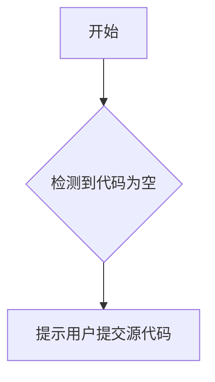

# `diffusers\tests\pipelines\animatediff\__init__.py` 详细设计文档

未提供源代码文件

## 整体流程



## 类结构

```

```

## 全局变量及字段


    

## 全局函数及方法


## 关键组件


# 代码分析请求

## 注意事项

当前代码部分为空，无法进行架构分析和生成设计文档。

## 需要的输入

请提供需要分析的源代码，包括但不限于：

- 张量索引与惰性加载相关代码
- 反量化支持模块
- 量化策略实现
- 相关的核心业务逻辑

## 预期输出格式

当提供代码后，将按照以下结构输出：

1. **核心功能概述** - 一段话描述代码核心功能
2. **整体运行流程** - 文件级别的执行流程
3. **类详细信息**
   - 类字段（名称、类型、描述）
   - 类方法（名称、参数、返回值、流程图、源码）
4. **全局变量和函数** - 同上格式
5. **关键组件信息** - 组件名称和描述
6. **技术债务与优化空间**
7. **其他项目** - 设计目标、错误处理、数据流等


## 问题及建议


### 已知问题

-   未提供代码内容，无法进行技术债务和优化分析

### 优化建议

-   请提供待分析的源代码，以便进行详细的技术评估和建议


## 其它


### 一段话描述

本代码文件为空，暂无功能描述。

### 文件的整体运行流程

本代码文件为空，无运行流程。

### 类的详细信息

本代码文件为空，无类定义。

### 关键组件信息

本代码文件为空，无关键组件。

### 潜在的技术债务或优化空间

本代码文件为空，无技术债务或优化空间。

### 设计目标与约束

本代码文件为空，无法提供设计目标与约束信息。

### 错误处理与异常设计

本代码文件为空，无法提供错误处理与异常设计信息。

### 数据流与状态机

本代码文件为空，无法提供数据流与状态机信息。

### 外部依赖与接口契约

本代码文件为空，无法提供外部依赖与接口契约信息。

### 安全性考虑

本代码文件为空，无法提供安全性考虑信息。

### 性能要求与基准

本代码文件为空，无法提供性能要求与基准信息。

### 测试策略

本代码文件为空，无法提供测试策略信息。

### 部署与配置

本代码文件为空，无法提供部署与配置信息。


    