# `diffusers\tests\pipelines\animatediff\test_animatediff.py` 详细设计文档

这是一个用于测试AnimateDiffPipeline（动画扩散管道）的单元测试文件，包含快速测试类和慢速测试类，验证管道的基本功能、IP适配器支持、FreeInit初始化方法、FreeNoise噪声控制、xFormers注意力机制、VAE切片等特性，并包含真实的模型推理测试。

## 整体流程

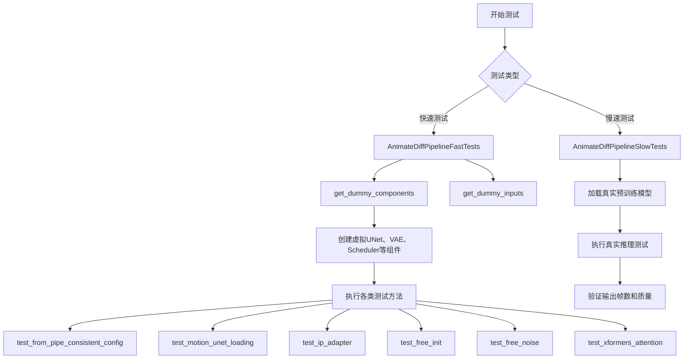

## 类结构

```
unittest.TestCase (基类)
├── AnimateDiffPipelineFastTests (快速测试类)
│   ├── IPAdapterTesterMixin
│   ├── SDFunctionTesterMixin
│   ├── PipelineTesterMixin
│   └── PipelineFromPipeTesterMixin
└── AnimateDiffPipelineSlowTests (慢速测试类)
```

## 全局变量及字段


### `to_np`
    
将PyTorch tensor.detach().cpu().numpy()转换为numpy数组的辅助函数

类型：`function`
    


### `AnimateDiffPipelineFastTests.pipeline_class`
    
指定测试的管道类为AnimateDiffPipeline

类型：`type`
    


### `AnimateDiffPipelineFastTests.params`
    
包含文本到图像管道需要测试的参数集合

类型：`frozenset`
    


### `AnimateDiffPipelineFastTests.batch_params`
    
包含批量推理时需要测试的批量参数集合

类型：`frozenset`
    


### `AnimateDiffPipelineFastTests.required_optional_params`
    
定义测试必需的可选参数集合，包括num_inference_steps、generator、latents等

类型：`frozenset`
    


### `AnimateDiffPipelineFastTests.test_layerwise_casting`
    
标志位，指示是否测试逐层类型转换功能

类型：`bool`
    


### `AnimateDiffPipelineFastTests.test_group_offloading`
    
标志位，指示是否测试模型组卸载功能

类型：`bool`
    
    

## 全局函数及方法


### `to_np`

将 PyTorch 张量（Tensor）安全地转换为 NumPy 数组（ndarray），同时确保张量已从计算图中分离并移至 CPU 设备。

参数：

- `tensor`：`Union[torch.Tensor, Any]`，输入的 PyTorch 张量或其他类型数据

返回值：`Union[np.ndarray, Any]`，如果输入是 PyTorch 张量则返回对应的 NumPy 数组，否则原样返回输入对象

#### 流程图

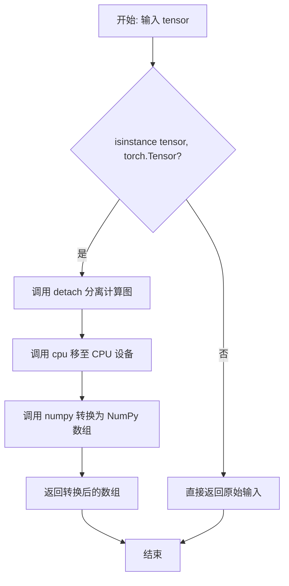

#### 带注释源码

```python
def to_np(tensor):
    """
    将 PyTorch Tensor 转换为 NumPy 数组。
    
    如果输入是 PyTorch Tensor，会先调用 detach() 分离计算图，
    然后调用 cpu() 将数据移至 CPU，最后转换为 NumPy 数组。
    如果输入不是 Tensor 类型，则直接返回原对象。
    
    参数:
        tensor: 输入的 PyTorch Tensor 或其他类型数据
        
    返回:
        转换后的 NumPy 数组，或原样返回非 Tensor 输入
    """
    # 检查输入是否为 PyTorch 张量
    if isinstance(tensor, torch.Tensor):
        # detach(): 分离计算图，防止梯度回溯
        # cpu(): 将张量从 GPU 移至 CPU（因为 NumPy 仅支持 CPU）
        # numpy(): 将张量转换为 NumPy 数组
        tensor = tensor.detach().cpu().numpy()

    # 返回转换后的张量或原输入
    return tensor
```


### `AnimateDiffPipelineFastTests.get_dummy_components`

该方法用于创建并返回一组虚拟（测试用）组件，这些组件是 AnimateDiffPipeline 所需的各种轻量级模型和配置，用于单元测试而不需要加载完整的预训练模型。

参数：该方法无显式参数（仅包含隐式 `self` 参数）

返回值：`Dict[str, Any]`，返回一个包含 AnimateDiffPipeline 各组件的字典，包括 UNet、调度器、VAE、motion_adapter、text_encoder、tokenizer、feature_extractor 和 image_encoder。

#### 流程图

```mermaid
flowchart TD
    A[开始 get_dummy_components] --> B[设置 cross_attention_dim=8, block_out_channels=(8, 8)]
    --> C[使用 torch.manual_seed(0) 设置随机种子]
    --> D[创建 UNet2DConditionModel]
    --> E[创建 DDIMScheduler]
    --> F[使用 torch.manual_seed(0) 设置随机种子]
    --> G[创建 AutoencoderKL VAE]
    --> H[使用 torch.manual_seed(0) 设置随机种子]
    --> I[创建 CLIPTextConfig 配置]
    --> J[创建 CLIPTextModel 文本编码器]
    --> K[创建 CLIPTokenizer 分词器]
    --> L[使用 torch.manual_seed(0) 设置随机种子]
    --> M[创建 MotionAdapter 运动适配器]
    --> N[组装 components 字典]
    --> O[返回 components]
```

#### 带注释源码

```python
def get_dummy_components(self):
    """
    创建虚拟组件用于 AnimateDiffPipeline 的单元测试
    
    Returns:
        Dict[str, Any]: 包含所有必需组件的字典
    """
    # 定义交叉注意力维度和块输出通道数
    cross_attention_dim = 8
    block_out_channels = (8, 8)

    # 设置随机种子以确保可重复性
    torch.manual_seed(0)
    
    # 创建虚拟 UNet2DConditionModel（条件扩散模型的核心网络）
    unet = UNet2DConditionModel(
        block_out_channels=block_out_channels,  # 块输出通道数
        layers_per_block=2,                       # 每个块的层数
        sample_size=8,                            # 样本尺寸
        in_channels=4,                            # 输入通道数
        out_channels=4,                          # 输出通道数
        down_block_types=("CrossAttnDownBlock2D", "DownBlock2D"),  # 下采样块类型
        up_block_types=("CrossAttnUpBlock2D", "UpBlock2D"),       # 上采样块类型
        cross_attention_dim=cross_attention_dim, # 交叉注意力维度
        norm_num_groups=2,                        # 归一化组数
    )
    
    # 创建 DDIMScheduler（调度器，用于控制扩散过程）
    scheduler = DDIMScheduler(
        beta_start=0.00085,      # Beta 起始值
        beta_end=0.012,         # Beta 结束值
        beta_schedule="linear", # Beta 调度策略
        clip_sample=False,      # 是否裁剪采样
    )
    
    # 重新设置随机种子
    torch.manual_seed(0)
    
    # 创建虚拟 AutoencoderKL（变分自编码器，用于潜在空间编码/解码）
    vae = AutoencoderKL(
        block_out_channels=block_out_channels,
        in_channels=3,                              # RGB 图像输入通道
        out_channels=3,                             # RGB 图像输出通道
        down_block_types=["DownEncoderBlock2D", "DownEncoderBlock2D"],  # 下编码块类型
        up_block_types=["UpDecoderBlock2D", "UpDecoderBlock2D"],        # 上解码块类型
        latent_channels=4,                          # 潜在空间通道数
        norm_num_groups=2,
    )
    
    # 重新设置随机种子
    torch.manual_seed(0)
    
    # 创建 CLIP 文本编码器配置
    text_encoder_config = CLIPTextConfig(
        bos_token_id=0,                # 句子开始 token ID
        eos_token_id=2,               # 句子结束 token ID
        hidden_size=cross_attention_dim,     # 隐藏层大小
        intermediate_size=37,         # 中间层大小
        layer_norm_eps=1e-05,         # LayerNorm epsilon
        num_attention_heads=4,        # 注意力头数
        num_hidden_layers=5,          # 隐藏层数量
        pad_token_id=1,               # 填充 token ID
        vocab_size=1000,              # 词汇表大小
    )
    
    # 根据配置创建 CLIPTextModel 文本编码器
    text_encoder = CLIPTextModel(text_encoder_config)
    
    # 从预训练模型加载虚拟 CLIPTokenizer
    tokenizer = CLIPTokenizer.from_pretrained("hf-internal-testing/tiny-random-clip")
    
    # 重新设置随机种子
    torch.manual_seed(0)
    
    # 创建 MotionAdapter（运动适配器，用于动画生成）
    motion_adapter = MotionAdapter(
        block_out_channels=block_out_channels,
        motion_layers_per_block=2,      # 每个块的运动层数
        motion_norm_num_groups=2,        # 运动模块归一化组数
        motion_num_attention_heads=4,    # 运动模块注意力头数
    )

    # 组装所有组件到字典中
    components = {
        "unet": unet,                              # UNet2DConditionModel
        "scheduler": scheduler,                    # DDIMScheduler
        "vae": vae,                                # AutoencoderKL
        "motion_adapter": motion_adapter,         # MotionAdapter
        "text_encoder": text_encoder,              # CLIPTextModel
        "tokenizer": tokenizer,                    # CLIPTokenizer
        "feature_extractor": None,                 # 特征提取器（测试用设为 None）
        "image_encoder": None,                     # 图像编码器（测试用设为 None）
    }
    
    # 返回组件字典
    return components
```


### `AnimateDiffPipelineFastTests.get_dummy_inputs`

该方法用于生成AnimateDiffPipeline的虚拟输入参数，创建一个包含提示词、随机数生成器、推理步数、引导比例和输出类型的字典，用于测试pipeline的推理功能。

参数：

- `self`：隐式参数，测试类实例本身
- `device`：`torch.device` 或 `str`，指定生成器所创建的设备（如"cpu"、"cuda"等）
- `seed`：`int`，默认为0，用于设置随机数生成器的种子，确保测试结果可复现

返回值：`Dict[str, Any]`，返回一个包含以下键的字典：
  - `prompt`（str）：测试用的提示词 "A painting of a squirrel eating a burger"
  - `generator`（torch.Generator 或 None）：随机数生成器对象
  - `num_inference_steps`（int）：推理步数，固定为2
  - `guidance_scale`（float）：引导比例，固定为7.5
  - `output_type`（str）：输出类型，固定为"pt"（PyTorch张量）

#### 流程图

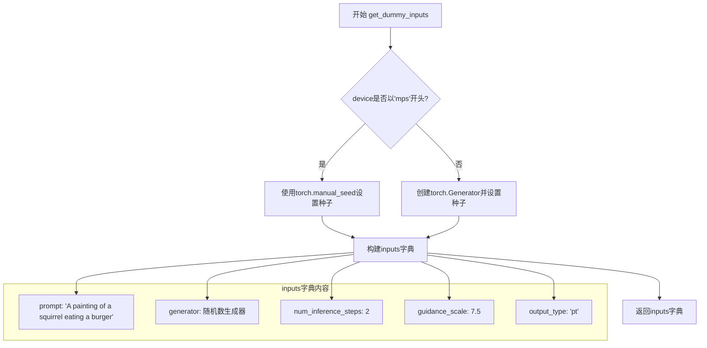

#### 带注释源码

```python
def get_dummy_inputs(self, device, seed=0):
    """
    生成用于测试AnimateDiffPipeline的虚拟输入参数。
    
    参数:
        device: torch.device 或 str - 运行设备，用于创建随机数生成器
        seed: int - 随机种子，默认为0，确保测试结果可复现
    
    返回:
        Dict[str, Any] - 包含pipeline推理所需参数的字典
    """
    # 判断设备是否为Apple MPS (Metal Performance Shaders)
    # MPS设备不支持torch.Generator，需要使用torch.manual_seed代替
    if str(device).startswith("mps"):
        # MPS设备：直接使用torch.manual_seed设置全局种子
        generator = torch.manual_seed(seed)
    else:
        # 其他设备（CPU/CUDA）：创建设备特定的随机数生成器并设置种子
        generator = torch.Generator(device=device).manual_seed(seed)

    # 构建包含所有必要输入参数的字典
    inputs = {
        "prompt": "A painting of a squirrel eating a burger",  # 文本提示词
        "generator": generator,  # 随机数生成器，控制噪声生成
        "num_inference_steps": 2,  # 推理步数，较小的值用于快速测试
        "guidance_scale": 7.5,  # Classifier-free guidance的引导强度
        "output_type": "pt",  # 输出格式为PyTorch张量
    }
    return inputs  # 返回输入参数字典供pipeline调用
```


### `AnimateDiffPipelineFastTests.test_from_pipe_consistent_config`

该方法用于测试 AnimateDiffPipeline 与其原始 StableDiffusionPipeline 之间通过 `from_pipe` 方法进行管道转换时配置（config）的一致性。它首先从原始管道创建新管道，然后再次转换回原始管道类型，最后比较两次转换后的配置是否与原始配置一致，确保 `from_pipe` 方法正确保留了必要的配置信息。

参数：

- `self`：`AnimateDiffPipelineFastTests`，测试类的实例，包含 `original_pipeline_class`、`pipeline_class` 等属性

返回值：`None`，该方法为测试方法，使用 `assert` 语句进行断言，不返回任何值

#### 流程图

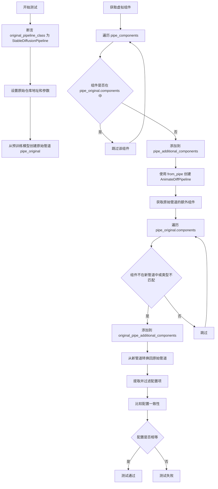

#### 带注释源码

```python
def test_from_pipe_consistent_config(self):
    # 断言：验证原始管道类是否为 StableDiffusionPipeline
    # 这是测试的前提条件，确保测试环境正确
    assert self.original_pipeline_class == StableDiffusionPipeline
    
    # 定义原始管道的预训练模型仓库和额外参数
    # 使用 HuggingFace Hub 上的小型稳定扩散管道模型
    original_repo = "hf-internal-testing/tinier-stable-diffusion-pipe"
    original_kwargs = {"requires_safety_checker": False}

    # 步骤1: 创建原始管道 (StableDiffusionPipeline)
    # 从预训练模型加载管道，传入特定参数
    pipe_original = self.original_pipeline_class.from_pretrained(original_repo, **original_kwargs)

    # 步骤2: 将原始管道转换为目标管道 (AnimateDiffPipeline)
    # 获取虚拟组件用于测试
    pipe_components = self.get_dummy_components()
    pipe_additional_components = {}
    
    # 遍历虚拟组件，找出原始管道中没有的组件
    # 这些是 AnimateDiffPipeline 特有的组件（如 motion_adapter）
    for name, component in pipe_components.items():
        if name not in pipe_original.components:
            pipe_additional_components[name] = component

    # 使用 from_pipe 方法从原始管道创建新管道
    # 传入额外的组件（motion_adapter 等）
    pipe = self.pipeline_class.from_pipe(pipe_original, **pipe_additional_components)

    # 步骤3: 将新管道再次转换回原始管道类型
    # 找出原始管道中有但新管道中没有或类型不同的组件
    original_pipe_additional_components = {}
    for name, component in pipe_original.components.items():
        if name not in pipe.components or not isinstance(component, pipe.components[name].__class__):
            original_pipe_additional_components[name] = component

    # 从新管道转换回原始管道类型
    pipe_original_2 = self.original_pipeline_class.from_pipe(pipe, **original_pipe_additional_components)

    # 步骤4: 比较配置一致性
    # 过滤掉以 "_" 开头的私有配置项
    original_config = {k: v for k, v in pipe_original.config.items() if not k.startswith("_")}
    original_config_2 = {k: v for k, v in pipe_original_2.config.items() if not k.startswith("_")}
    
    # 断言：验证转换后的配置与原始配置一致
    # 如果不一致，说明 from_pipe 方法没有正确保留配置
    assert original_config_2 == original_config
```


### `AnimateDiffPipelineFastTests.test_motion_unet_loading`

该测试方法用于验证 AnimateDiffPipeline 能否正确加载 MotionAdapter 并将其转换为 UNetMotionModel 类型，确保 motion UNet 在管道初始化时正确实例化。

参数：

- `self`：`AnimateDiffPipelineFastTests`，测试类实例本身，包含测试所需的上下文和方法

返回值：`None`，该方法为测试方法，通过 assert 断言验证结果，不返回任何值

#### 流程图

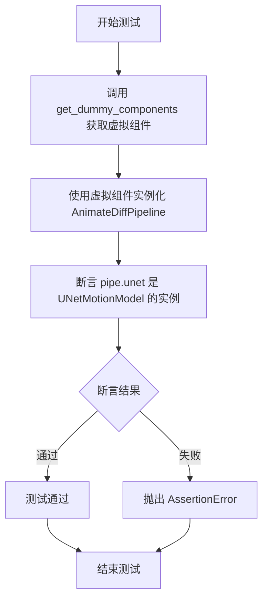

#### 带注释源码

```python
def test_motion_unet_loading(self):
    """
    测试 Motion UNet 的加载功能。
    验证 AnimateDiffPipeline 能够正确加载 MotionAdapter 并将其转换为 UNetMotionModel。
    """
    # 获取预定义的虚拟组件，用于测试
    # 包含：unet, scheduler, vae, motion_adapter, text_encoder, tokenizer 等
    components = self.get_dummy_components()
    
    # 使用虚拟组件实例化 AnimateDiffPipeline
    # 管道初始化时会将 motion_adapter 转换为 UNetMotionModel
    pipe = AnimateDiffPipeline(**components)

    # 断言验证：确保管道的 unet 属性是 UNetMotionModel 类型
    # 这验证了 motion adapter 正确集成到了 UNet 中
    assert isinstance(pipe.unet, UNetMotionModel)
```


### `test_attention_slicing_forward_pass`

该测试方法用于验证 AnimateDiffPipeline 的注意力切片（Attention Slicing）前向传播功能是否正常工作。由于当前管道的注意力切片功能未启用，该测试被跳过。

参数：

- `self`：`AnimateDiffPipelineFastTests`，测试类实例，表示当前的测试对象

返回值：`None`，无返回值（方法体为 `pass`）

#### 流程图

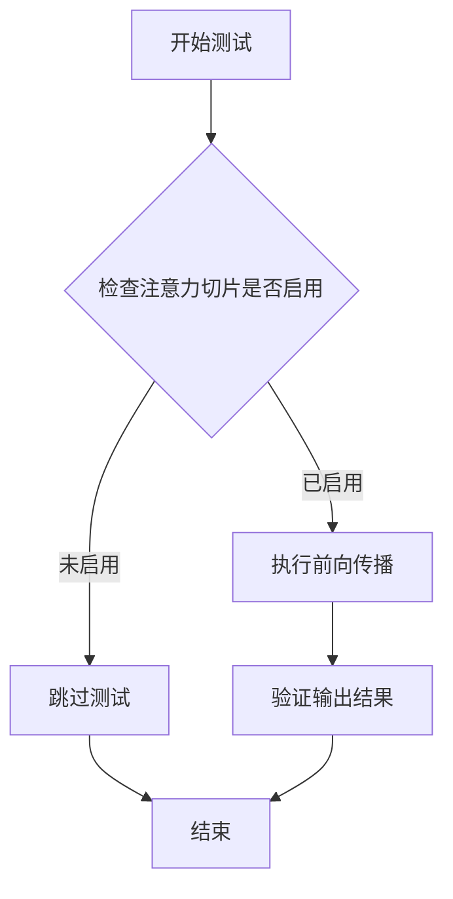

#### 带注释源码

```python
@unittest.skip("Attention slicing is not enabled in this pipeline")
def test_attention_slicing_forward_pass(self):
    """
    测试注意力切片的前向传播功能。
    
    该测试用于验证管道在启用注意力切片时的前向传播是否产生正确结果。
    注意力切片是一种内存优化技术，通过将大型注意力矩阵分割成较小的块来减少显存占用。
    
    注意：由于 AnimateDiffPipeline 当前未实现注意力切片功能，此测试被跳过。
    """
    pass  # 方法体为空，测试被跳过
```


### `AnimateDiffPipelineFastTests.test_ip_adapter`

该测试方法用于验证AnimateDiffPipeline的IP-Adapter功能，根据设备类型设置不同的预期输出切片，并调用父类的IP-Adapter测试逻辑进行验证。

参数：

- `self`：`AnimateDiffPipelineFastTests`类型，测试类实例本身，包含pipeline对象和测试配置
- `expected_pipe_slice`：`numpy.ndarray`或`None`类型，当设备为CPU时的预期输出切片值，用于验证pipeline输出的正确性（通过`super().test_ip_adapter(expected_pipe_slice=expected_pipe_slice)`调用时隐式传递）

返回值：`unittest.TestResult`类型，父类测试方法的执行结果，表示IP-Adapter功能测试的通过/失败状态

#### 流程图

```mermaid
flowchart TD
    A[开始 test_ip_adapter] --> B{检查设备类型}
    B -->|torch_device == "cpu"| C[设置 expected_pipe_slice 为预定义numpy数组]
    B -->|其他设备| D[expected_pipe_slice 设为 None]
    C --> E[调用父类 test_ip_adapter]
    D --> E
    E --> F[返回测试结果]
```

#### 带注释源码

```python
def test_ip_adapter(self):
    """
    测试 AnimateDiffPipeline 的 IP-Adapter 功能。
    该方法根据运行设备设置不同的预期输出，用于验证pipeline输出的正确性。
    """
    # 初始化预期输出切片为None
    expected_pipe_slice = None
    
    # 如果当前设备是CPU，设置预定义的预期输出切片
    # 这些数值是针对CPU设备经过验证的正确输出值
    if torch_device == "cpu":
        expected_pipe_slice = np.array(
            [
                0.5216,
                0.5620,
                0.4927,
                0.5082,
                0.4786,
                0.5932,
                0.5125,
                0.4514,
                0.5315,
                0.4694,
                0.3276,
                0.4863,
                0.3920,
                0.3684,
                0.5745,
                0.4499,
                0.5081,
                0.5414,
                0.6014,
                0.5062,
                0.3630,
                0.5296,
                0.6018,
                0.5098,
                0.4948,
                0.5101,
                0.5620,
            ]
        )
    
    # 调用父类（IPAdapterTesterMixin）的test_ip_adapter方法进行实际测试
    # 父类方法会构建pipeline、执行推理并验证输出与预期值的匹配度
    return super().test_ip_adapter(expected_pipe_slice=expected_pipe_slice)
```


### `AnimateDiffPipelineFastTests.test_dict_tuple_outputs_equivalent`

该测试方法用于验证 AnimateDiffPipeline 的输出在字典格式和元组格式下是否等价，确保管道既可以返回字典形式（包含 frames、latents 等字段），也可以返回传统元组形式，且两种方式的输出结果一致。

参数：

- `self`：`AnimateDiffPipelineFastTests`，测试类实例，包含管道配置和测试固件
- `expected_slice`：`numpy.ndarray`，可选参数，期望的输出切片值，仅在 CPU 设备时设置，用于验证输出数值的准确性

返回值：返回父类 `PipelineTesterMixin.test_dict_tuple_outputs_equivalent` 的测试结果，通常为 `None` 或 `unittest.TestCase` 的断言结果，用于验证管道输出的等价性。

#### 流程图

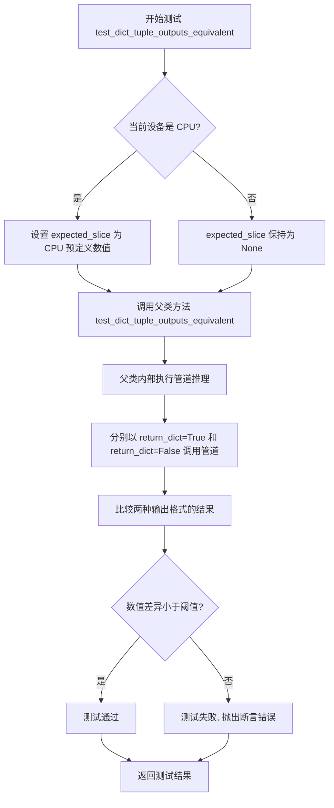

#### 带注释源码

```python
def test_dict_tuple_outputs_equivalent(self):
    """
    测试 AnimateDiffPipeline 的字典输出和元组输出是否等价。
    继承自 PipelineTesterMixin，确保管道在两种返回格式下产生一致的结果。
    """
    # 初始化期望的输出切片值，用于 CPU 设备下的数值验证
    expected_slice = None
    # 如果当前设备是 CPU，使用预定义的数值切片进行精确验证
    if torch_device == "cpu":
        expected_slice = np.array([0.5125, 0.4514, 0.5315, 0.4499, 0.5081, 0.5414, 0.4948, 0.5101, 0.5620])
    
    # 调用父类的测试方法，传入期望的输出切片值
    # 父类方法会分别以 return_dict=True 和 return_dict=False 调用管道
    # 并验证两种方式的输出结果是否等价
    return super().test_dict_tuple_outputs_equivalent(expected_slice=expected_slice)
```


### `AnimateDiffPipelineFastTests.test_inference_batch_single_identical`

该测试方法用于验证 AnimateDiffPipeline 在单次推理和批量推理模式下输出的一致性。通过对比相同输入参数下单次推理与批量推理的结果差异，确保管道在两种推理模式下能产生相同的输出，从而保证批处理功能的正确性。

参数：

- `batch_size`：`int`，默认为 2，测试时使用的批次大小
- `expected_max_diff`：`float`，默认为 1e-4，单次推理和批量推理结果之间允许的最大差异阈值
- `additional_params_copy_to_batched_inputs`：`list`，默认为 `["num_inference_steps"]`，需要复制到批量输入的额外参数列表

返回值：`None`，该方法为测试用例，使用 `assert` 断言进行验证，无显式返回值

#### 流程图

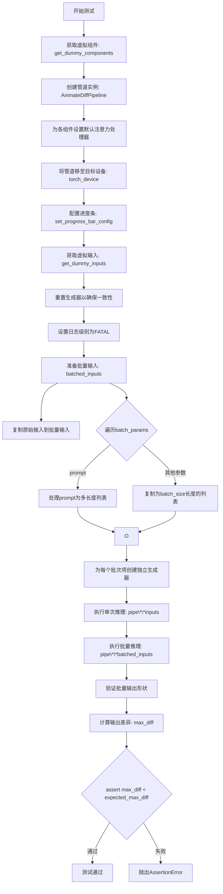

#### 带注释源码

```python
def test_inference_batch_single_identical(
    self,
    batch_size=2,  # int: 批次大小，用于批量推理测试
    expected_max_diff=1e-4,  # float: 允许的最大差异阈值
    additional_params_copy_to_batched_inputs=["num_inference_steps"],  # list: 需要复制到批量输入的额外参数
):
    # 步骤1: 获取虚拟组件（用于测试的轻量级模型配置）
    components = self.get_dummy_components()
    
    # 步骤2: 使用虚拟组件创建AnimateDiffPipeline管道实例
    pipe = self.pipeline_class(**components)
    
    # 步骤3: 为所有组件设置默认的注意力处理器
    # 这确保测试在不同注意力优化策略下一致运行
    for components in pipe.components.values():
        if hasattr(components, "set_default_attn_processor"):
            components.set_default_attn_processor()

    # 步骤4: 将管道移至目标设备（如CUDA/CPU）
    pipe.to(torch_device)
    
    # 步骤5: 配置进度条（disable=None表示不禁用）
    pipe.set_progress_bar_config(disable=None)
    
    # 步骤6: 获取用于测试的虚拟输入参数
    inputs = self.get_dummy_inputs(torch_device)
    
    # 步骤7: 重置生成器，确保与get_dummy_inputs中的初始状态一致
    # 避免之前调用中可能产生的随机状态影响测试
    inputs["generator"] = self.get_generator(0)

    # 步骤8: 获取日志记录器并将级别设为FATAL以减少测试输出噪音
    logger = logging.get_logger(pipe.__module__)
    logger.setLevel(level=diffusers.logging.FATAL)

    # 步骤9: 批量处理输入准备
    # 初始化batched_inputs字典，复制原始输入
    batched_inputs = {}
    batched_inputs.update(inputs)

    # 步骤10: 遍历batch_params处理需要批量化的参数
    for name in self.batch_params:
        if name not in inputs:
            continue

        value = inputs[name]
        
        # 处理prompt参数：创建不同长度的prompt列表
        # 最后一个prompt设置为超长字符串（100个"very long"）
        if name == "prompt":
            len_prompt = len(value)
            batched_inputs[name] = [value[: len_prompt // i] for i in range(1, batch_size + 1)]
            batched_inputs[name][-1] = 100 * "very long"
        else:
            # 其他参数：复制为batch_size数量的列表
            batched_inputs[name] = batch_size * [value]

    # 步骤11: 为每个批次项创建独立的生成器
    # 确保批量推理中每个样本有独立的随机种子
    if "generator" in inputs:
        batched_inputs["generator"] = [self.get_generator(i) for i in range(batch_size)]

    # 步骤12: 处理batch_size参数
    if "batch_size" in inputs:
        batched_inputs["batch_size"] = batch_size

    # 步骤13: 复制额外指定的参数到批量输入
    for arg in additional_params_copy_to_batched_inputs:
        batched_inputs[arg] = inputs[arg]

    # 步骤14: 执行单次推理（单样本）
    output = pipe(**inputs)
    
    # 步骤15: 执行批量推理（多样本）
    output_batch = pipe(**batched_inputs)

    # 步骤16: 验证批量输出的第一个样本数量是否等于batch_size
    assert output_batch[0].shape[0] == batch_size

    # 步骤17: 计算单次推理和批量推理输出之间的最大差异
    # 使用to_np将张量转换为numpy数组进行比较
    max_diff = np.abs(to_np(output_batch[0][0]) - to_np(output[0][0])).max()
    
    # 步骤18: 断言差异在允许范围内
    assert max_diff < expected_max_diff
```


### `AnimateDiffPipelineFastTests.test_to_device`

该测试方法用于验证 AnimateDiffPipeline 能够在不同计算设备（CPU 和 CUDA）之间正确迁移，并确保所有模型组件的设备属性和输出结果的有效性。

参数：

- `self`：测试类实例本身，无需显式传递

返回值：`None`，该方法为单元测试方法，通过 `assert` 语句进行断言验证，不返回任何值

#### 流程图

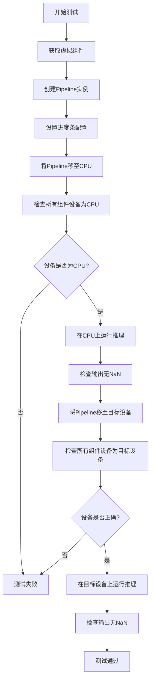

#### 带注释源码

```python
@require_accelerator  # 装饰器：仅在有GPU加速器时执行此测试
def test_to_device(self):
    """
    测试 Pipeline 的 to() 方法是否能正确将所有组件移动到指定设备
    """
    # Step 1: 获取虚拟组件配置
    components = self.get_dummy_components()
    
    # Step 2: 使用组件初始化 Pipeline
    pipe = self.pipeline_class(**components)
    
    # Step 3: 配置进度条（禁用）
    pipe.set_progress_bar_config(disable=None)

    # === 测试 CPU 设备 ===
    
    # Step 4: 将整个 Pipeline 移至 CPU
    pipe.to("cpu")
    
    # Step 5: 收集所有组件的设备类型
    # 注意：Pipeline 内部会创建新的 motion UNet，需要从 components 中检查
    model_devices = [
        component.device.type 
        for component in pipe.components.values() 
        if hasattr(component, "device")
    ]
    
    # Step 6: 断言所有组件都在 CPU 上
    self.assertTrue(all(device == "cpu" for device in model_devices))

    # Step 7: 使用 CPU 进行推理并获取输出
    output_cpu = pipe(**self.get_dummy_inputs("cpu"))[0]
    
    # Step 8: 断言输出中没有 NaN 值（确保数值有效）
    self.assertTrue(np.isnan(output_cpu).sum() == 0)

    # === 测试目标设备（通常是 CUDA）===
    
    # Step 9: 将 Pipeline 移至目标设备（torch_device）
    pipe.to(torch_device)
    
    # Step 10: 再次收集所有组件的设备类型
    model_devices = [
        component.device.type 
        for component in pipe.components.values() 
        if hasattr(component, "device")
    ]
    
    # Step 11: 断言所有组件都在目标设备上
    self.assertTrue(all(device == torch_device for device in model_devices))

    # Step 12: 使用目标设备进行推理并获取输出
    output_device = pipe(**self.get_dummy_inputs(torch_device))[0]
    
    # Step 13: 断言输出中没有 NaN 值
    self.assertTrue(np.isnan(to_np(output_device)).sum() == 0)
```


### `AnimateDiffPipelineFastTests.test_to_dtype`

该测试方法用于验证 AnimateDiffPipeline 能够正确地将所有模型组件的数据类型（dtype）从默认的 `torch.float32` 转换为指定的类型（如 `torch.float16`），确保管道在混合精度推理时的dtype一致性。

参数：
- 无显式参数（使用 `self` 访问实例属性）

返回值：无返回值（`None`），通过 `assert` 断言验证 dtype 转换的正确性

#### 流程图

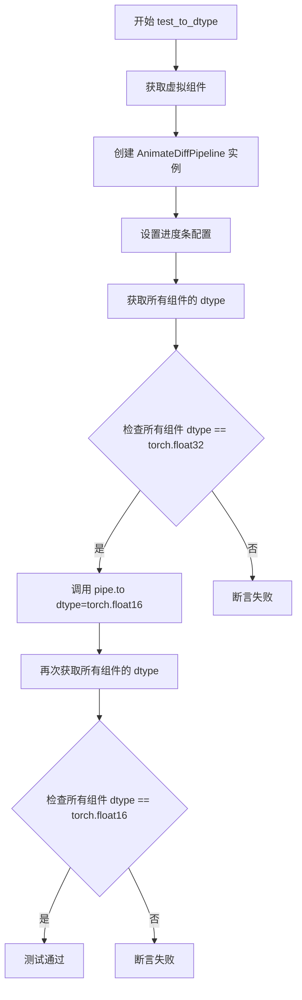

#### 带注释源码

```python
def test_to_dtype(self):
    # 获取预定义的虚拟组件（用于测试）
    components = self.get_dummy_components()
    
    # 使用虚拟组件实例化 AnimateDiffPipeline 管道
    pipe = self.pipeline_class(**components)
    
    # 配置进度条显示（disable=None 表示启用进度条）
    pipe.set_progress_bar_config(disable=None)

    # 收集所有具有 dtype 属性的组件的数据类型
    # 过滤掉没有 dtype 属性的组件（如调度器、tokenizer 等）
    model_dtypes = [
        component.dtype 
        for component in pipe.components.values() 
        if hasattr(component, "dtype")
    ]
    
    # 断言：默认情况下，所有模型组件的 dtype 应为 torch.float32
    # 这是 PyTorch 模型的默认数据类型
    self.assertTrue(
        all(dtype == torch.float32 for dtype in model_dtypes),
        "默认 dtype 应该是 torch.float32"
    )

    # 将管道转换为 float16 数据类型
    # 这会递归地转换所有模型组件的 dtype
    pipe.to(dtype=torch.float16)
    
    # 重新收集转换后所有组件的 dtype
    model_dtypes = [
        component.dtype 
        for component in pipe.components.values() 
        if hasattr(component, "dtype")
    ]
    
    # 断言：转换后，所有模型组件的 dtype 应为 torch.float16
    # 验证 .to(dtype=...) 方法是否正确工作
    self.assertTrue(
        all(dtype == torch.float16 for dtype in model_dtypes),
        "转换后 dtype 应该是 torch.float16"
    )
```


### `AnimateDiffPipelineFastTests.test_prompt_embeds`

该测试方法用于验证 AnimateDiffPipeline 能够接受预先计算的提示词嵌入（prompt_embeds）而非原始文本提示词（prompt），确保管道在跳过文本编码步骤时仍能正常运行推理。

参数：

- `self`：`AnimateDiffPipelineFastTests`，测试类实例，包含测试所需的管道组件和辅助方法

返回值：`None`，该方法为测试用例，无返回值（通过管道调用验证功能）

#### 流程图

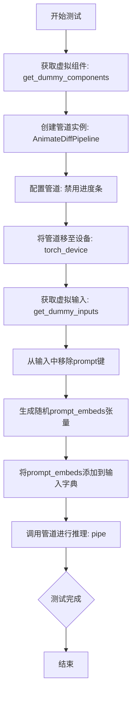

#### 带注释源码

```python
def test_prompt_embeds(self):
    """
    测试管道能否接受预计算的prompt_embeds而非原始prompt文本
    验证文本编码器可以被跳过，嵌入可直接传入管道
    """
    # 步骤1: 获取用于测试的虚拟组件（UNet、VAE、TextEncoder、Scheduler等）
    components = self.get_dummy_components()
    
    # 步骤2: 使用虚拟组件实例化AnimateDiffPipeline
    pipe = self.pipeline_class(**components)
    
    # 步骤3: 配置管道进度条显示（None表示不禁用）
    pipe.set_progress_bar_config(disable=None)
    
    # 步骤4: 将管道所有组件移至测试设备（CPU/CUDA）
    pipe.to(torch_device)

    # 步骤5: 获取虚拟输入参数（包含prompt、generator、num_inference_steps等）
    inputs = self.get_dummy_inputs(torch_device)
    
    # 步骤6: 移除prompt字段，测试不提供原始文本的情况
    inputs.pop("prompt")
    
    # 步骤7: 构造符合形状要求的prompt_embeds
    # 形状: (batch_size=1, sequence_length=4, hidden_size=text_encoder.config.hidden_size)
    inputs["prompt_embeds"] = torch.randn(
        (1, 4, pipe.text_encoder.config.hidden_size), 
        device=torch_device
    )
    
    # 步骤8: 调用管道执行推理，使用预计算的嵌入而非文本
    # 管道内部将跳过text_encoder的encode步骤，直接使用提供的embeds
    pipe(**inputs)
```

---

#### 潜在技术债务与优化空间

1. **缺失断言**：该测试方法调用管道后未进行任何断言验证，仅确保管道不崩溃。建议添加输出验证以确保生成的帧符合预期形状或质量。
2. **硬编码维度**：张量序列长度固定为4，建议将其参数化或从配置中读取。
3. **负样本嵌入未测试**：测试仅提供了`prompt_embeds`，未验证`negative_prompt_embeds`的处理。


### `AnimateDiffPipelineFastTests.test_free_init`

该测试方法用于验证 AnimateDiffPipeline 的 FreeInit 功能，通过对比普通推理、启用 FreeInit 和禁用 FreeInit 三种情况下的输出差异，确认 FreeInit 能够产生不同于默认结果的帧，同时禁用后应恢复到与默认结果相近的水平。

参数：

- `self`：隐式参数，测试类实例本身

返回值：`None`（无返回值），该方法为单元测试方法，通过断言验证功能正确性

#### 流程图

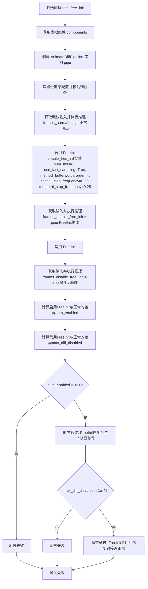

#### 带注释源码

```python
def test_free_init(self):
    """
    测试 AnimateDiffPipeline 的 FreeInit 功能。
    
    验证流程：
    1. 使用默认配置进行推理，获取基准输出 frames_normal
    2. 启用 FreeInit（配置 butterworth 滤波器参数），获取输出 frames_enable_free_init
    3. 禁用 FreeInit，获取输出 frames_disable_free_init
    4. 断言：启用 FreeInit 的输出应与基准显著不同（sum_enabled > 1e1）
    5. 断言：禁用 FreeInit 的输出应与基准接近（max_diff_disabled < 1e-4）
    """
    # Step 1: 获取虚拟组件配置（用于测试的轻量级模型组件）
    components = self.get_dummy_components()
    
    # Step 2: 使用虚拟组件实例化 AnimateDiffPipeline
    pipe: AnimateDiffPipeline = self.pipeline_class(**components)
    
    # Step 3: 配置进度条（disable=None 表示启用进度条）
    pipe.set_progress_bar_config(disable=None)
    
    # Step 4: 将管道移动到测试设备（GPU/CPU）
    pipe.to(torch_device)

    # Step 5: 使用默认配置（无 FreeInit）进行推理，获取基准结果
    inputs_normal = self.get_dummy_inputs(torch_device)
    frames_normal = pipe(**inputs_normal).frames[0]

    # Step 6: 启用 FreeInit，配置参数：
    # - num_iters=2: 迭代次数
    # - use_fast_sampling=True: 使用快速采样
    # - method="butterworth": 使用巴特沃斯滤波器
    # - order=4: 滤波器阶数
    # - spatial_stop_frequency=0.25: 空间停止频率
    # - temporal_stop_frequency=0.25: 时间停止频率
    pipe.enable_free_init(
        num_iters=2,
        use_fast_sampling=True,
        method="butterworth",
        order=4,
        spatial_stop_frequency=0.25,
        temporal_stop_frequency=0.25,
    )
    
    # Step 7: 使用启用 FreeInit 的配置进行推理
    inputs_enable_free_init = self.get_dummy_inputs(torch_device)
    frames_enable_free_init = pipe(**inputs_enable_free_init).frames[0]

    # Step 8: 禁用 FreeInit，恢复到默认行为
    pipe.disable_free_init()
    
    # Step 9: 使用禁用 FreeInit 的配置进行推理
    inputs_disable_free_init = self.get_dummy_inputs(torch_device)
    frames_disable_free_init = pipe(**inputs_disable_free_init).frames[0]

    # Step 10: 计算启用 FreeInit 与默认结果的差异总和
    # 使用 numpy 计算绝对差值并求和
    sum_enabled = np.abs(to_np(frames_normal) - to_np(frames_enable_free_init)).sum()

    # Step 11: 计算禁用 FreeInit 与默认结果的最大差异
    max_diff_disabled = np.abs(to_np(frames_normal) - to_np(frames_disable_free_init)).max()

    # Step 12: 断言验证
    # 验证点1：启用 FreeInit 应该产生明显不同的结果
    self.assertGreater(
        sum_enabled, 1e1, 
        "Enabling of FreeInit should lead to results different from the default pipeline results"
    )
    
    # 验证点2：禁用 FreeInit 后应该恢复到与默认结果接近
    self.assertLess(
        max_diff_disabled,
        1e-4,
        "Disabling of FreeInit should lead to results similar to the default pipeline results",
    )
```


### `AnimateDiffPipelineFastTests.test_free_init_with_schedulers`

该测试方法用于验证 AnimateDiffPipeline 在启用 FreeInit 功能时与不同调度器（DPMSolverMultistepScheduler 和 LCMScheduler）结合使用的正确性。测试通过比较启用 FreeInit 前后生成的帧内容差异，确保 FreeInit 功能能够正确影响推理结果。

参数：无（仅包含 `self` 隐式参数）

返回值：`None`，该方法为单元测试方法，通过断言验证行为而非返回具体数据

#### 流程图

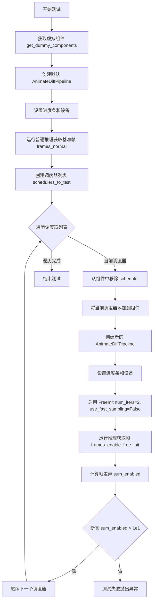

#### 带注释源码

```python
def test_free_init_with_schedulers(self):
    """
    测试 FreeInit 功能在不同调度器下的行为
    验证启用 FreeInit 后生成的帧内容与默认配置有显著差异
    """
    # 获取预定义的虚拟组件（包含 UNet、VAE、调度器、文本编码器等）
    components = self.get_dummy_components()
    
    # 使用虚拟组件创建 AnimateDiffPipeline 实例
    pipe: AnimateDiffPipeline = self.pipeline_class(**components)
    
    # 配置进度条显示（disable=None 表示启用进度条）
    pipe.set_progress_bar_config(disable=None)
    
    # 将 Pipeline 移动到指定的计算设备（如 CUDA）
    pipe.to(torch_device)

    # 获取默认输入参数并运行推理，获取基准帧序列
    inputs_normal = self.get_dummy_inputs(torch_device)
    frames_normal = pipe(**inputs_normal).frames[0]

    # 定义要测试的调度器列表，包含两种不同的调度算法
    schedulers_to_test = [
        # DPMSolverMultistepScheduler: 多步DPM求解器调度器
        DPMSolverMultistepScheduler.from_config(
            components["scheduler"].config,
            timestep_spacing="linspace",
            beta_schedule="linear",
            algorithm_type="dpmsolver++",
            steps_offset=1,
            clip_sample=False,
        ),
        # LCMScheduler: 潜在一致性模型调度器，支持快速采样
        LCMScheduler.from_config(
            components["scheduler"].config,
            timestep_spacing="linspace",
            beta_schedule="linear",
            steps_offset=1,
            clip_sample=False,
        ),
    ]
    
    # 从组件字典中移除默认调度器，后续将替换为测试调度器
    components.pop("scheduler")

    # 遍历每个调度器进行独立测试
    for scheduler in schedulers_to_test:
        # 将当前调度器添加到组件中
        components["scheduler"] = scheduler
        
        # 使用新调度器创建 Pipeline 实例
        pipe: AnimateDiffPipeline = self.pipeline_class(**components)
        
        # 配置进度条显示
        pipe.set_progress_bar_config(disable=None)
        
        # 移动到目标设备
        pipe.to(torch_device)

        # 启用 FreeInit 功能
        # num_iters=2: 迭代次数
        # use_fast_sampling=False: 不使用快速采样
        pipe.enable_free_init(num_iters=2, use_fast_sampling=False)

        # 获取输入参数并运行推理
        inputs = self.get_dummy_inputs(torch_device)
        frames_enable_free_init = pipe(**inputs).frames[0]
        
        # 计算基准帧与启用 FreeInit 帧的绝对差异总和
        sum_enabled = np.abs(to_np(frames_normal) - to_np(frames_enable_free_init)).sum()

        # 断言：启用 FreeInit 后结果应与默认结果有明显差异
        # 差异总和应大于 10（1e1），以确保 FreeInit 确实影响了生成结果
        self.assertGreater(
            sum_enabled,
            1e1,
            "Enabling of FreeInit should lead to results different from the default pipeline results",
        )
```


### `AnimateDiffPipelineFastTests.test_free_noise_blocks`

该测试方法验证 AnimateDiffPipeline 的 FreeNoise 功能是否正确启用和禁用，检查在启用/禁用 free noise 后，UNet 下采样块中的运动模块 transformer 块是否正确转换为/恢复为 `FreeNoiseTransformerBlock` 类型。

参数：无（除隐式 `self`）

返回值：`None`，该方法为测试方法，使用断言验证类型变化

#### 流程图

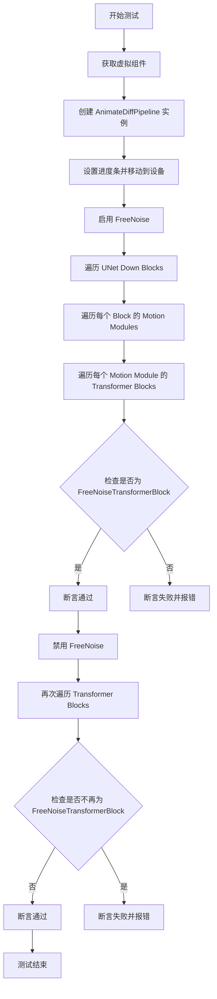

#### 带注释源码

```python
def test_free_noise_blocks(self):
    # 获取虚拟组件用于测试
    components = self.get_dummy_components()
    # 使用虚拟组件创建 AnimateDiffPipeline 实例
    pipe: AnimateDiffPipeline = self.pipeline_class(**components)
    # 设置进度条配置（disable=None 表示启用进度条）
    pipe.set_progress_bar_config(disable=None)
    # 将管道移动到测试设备（CPU 或 CUDA）
    pipe.to(torch_device)

    # 启用 FreeNoise 功能
    pipe.enable_free_noise()
    
    # 遍历 UNet 的下采样块（down_blocks）
    for block in pipe.unet.down_blocks:
        # 遍历每个块中的运动模块
        for motion_module in block.motion_modules:
            # 遍历每个运动模块中的 transformer 块
            for transformer_block in motion_module.transformer_blocks:
                # 断言：启用 FreeNoise 后，transformer 块必须是 FreeNoiseTransformerBlock 实例
                self.assertTrue(
                    isinstance(transformer_block, FreeNoiseTransformerBlock),
                    "Motion module transformer blocks must be an instance of `FreeNoiseTransformerBlock` after enabling FreeNoise."
                )

    # 禁用 FreeNoise 功能
    pipe.disable_free_noise()
    
    # 再次遍历检查
    for block in pipe.unet.down_blocks:
        for motion_module in block.motion_modules:
            for transformer_block in motion_module.transformer_blocks:
                # 断言：禁用 FreeNoise 后，transformer 块必须不是 FreeNoiseTransformerBlock 实例
                self.assertFalse(
                    isinstance(transformer_block, FreeNoiseTransformerBlock),
                    "Motion module transformer blocks must not be an instance of `FreeNoiseTransformerBlock` after disabling FreeNoise."
                )
```


### `AnimateDiffPipelineFastTests.test_free_noise`

该测试方法用于验证 AnimateDiffPipeline 的 FreeNoise（自由噪声）功能是否正常工作。测试通过对比启用和禁用 FreeNoise 时的输出，验证启用时结果应与默认管道结果显著不同，而禁用后结果应与默认结果相似。

参数：

- `self`：`unittest.TestCase`，测试类的实例方法隐含参数

返回值：`None`，该方法为单元测试方法，通过断言验证功能，不返回任何值

#### 流程图

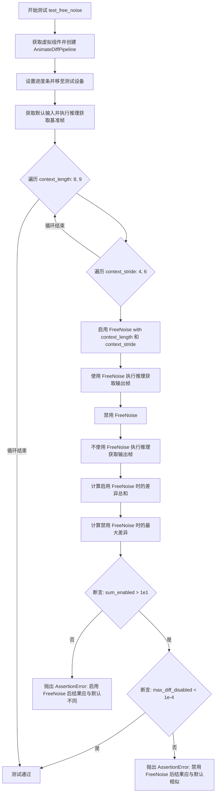

#### 带注释源码

```python
def test_free_noise(self):
    """
    测试 AnimateDiffPipeline 的 FreeNoise 功能。
    
    验证：
    1. 启用 FreeNoise 时，输出结果应与默认管道结果显著不同（差异 > 10）
    2. 禁用 FreeNoise 后，输出结果应与默认管道结果相似（最大差异 < 1e-4）
    
    测试参数组合：
    - context_length: 8, 9
    - context_stride: 4, 6
    """
    # Step 1: 使用虚拟组件创建 AnimateDiffPipeline 实例
    # get_dummy_components() 返回预配置的虚拟（dummy）模型组件
    components = self.get_dummy_components()
    
    # 使用虚拟组件初始化管道
    pipe: AnimateDiffPipeline = self.pipeline_class(**components)
    
    # Step 2: 配置管道
    # 禁用进度条以便测试输出的一致性
    pipe.set_progress_bar_config(disable=None)
    
    # 将管道移至测试设备（GPU/CPU）
    pipe.to(torch_device)

    # Step 3: 获取默认输入并执行基准推理
    # 不启用 FreeNoise 的情况下运行管道，获取基准帧序列
    inputs_normal = self.get_dummy_inputs(torch_device)
    frames_normal = pipe(**inputs_normal).frames[0]

    # Step 4: 遍历不同的 FreeNoise 参数组合进行测试
    # context_length: 上下文长度，控制噪声的时序范围
    # context_stride: 上下文步长，控制噪声采样的间隔
    for context_length in [8, 9]:
        for context_stride in [4, 6]:
            # 启用 FreeNoise 功能，传入指定的上下文长度和步长
            pipe.enable_free_noise(context_length, context_stride)

            # 使用 FreeNoise 执行推理
            inputs_enable_free_noise = self.get_dummy_inputs(torch_device)
            frames_enable_free_noise = pipe(**inputs_enable_free_noise).frames[0]

            # 禁用 FreeNoise 功能，恢复默认行为
            pipe.disable_free_noise()

            # 禁用 FreeNoise 后执行推理
            inputs_disable_free_noise = self.get_dummy_inputs(torch_device)
            frames_disable_free_noise = pipe(**inputs_disable_free_noise).frames[0]

            # Step 5: 计算差异并进行断言验证
            # 计算启用 FreeNoise 时与基准结果的差异总和
            sum_enabled = np.abs(to_np(frames_normal) - to_np(frames_enable_free_noise)).sum()
            
            # 计算禁用 FreeNoise 时与基准结果的最大差异
            max_diff_disabled = np.abs(to_np(frames_normal) - to_np(frames_disable_free_noise)).max()

            # 断言：启用 FreeNoise 应该产生明显不同的结果
            # 如果差异总和 <= 10，说明 FreeNoise 没有产生预期效果
            self.assertGreater(
                sum_enabled,
                1e1,  # 10.0
                "Enabling of FreeNoise should lead to results different from the default pipeline results"
            )

            # 断言：禁用 FreeNoise 后应该产生与基准相似的结果
            # 如果最大差异 >= 1e-4，说明禁用功能不彻底或存在问题
            self.assertLess(
                max_diff_disabled,
                1e-4,
                "Disabling of FreeNoise should lead to results similar to the default pipeline results"
            )
```


### `AnimateDiffPipelineFastTests.test_free_noise_split_inference`

这是一个测试方法，用于验证 AnimateDiffPipeline 中 FreeNoise 分割推理（split inference）内存优化功能是否正常工作，并确保启用该优化后产生的图像帧结果与默认管道结果相似。

参数：

- `self`：隐式参数，测试类实例本身

返回值：`None`，该方法通过断言验证结果，不返回任何值

#### 流程图

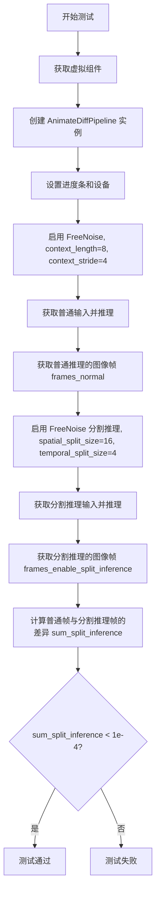

#### 带注释源码

```python
def test_free_noise_split_inference(self):
    # 1. 获取预定义的虚拟组件，用于测试
    components = self.get_dummy_components()
    
    # 2. 使用虚拟组件创建 AnimateDiffPipeline 实例
    pipe: AnimateDiffPipeline = self.pipeline_class(**components)
    
    # 3. 禁用进度条配置
    pipe.set_progress_bar_config(disable=None)
    
    # 4. 将管道移动到测试设备（CPU 或 CUDA）
    pipe.to(torch_device)

    # 5. 启用 FreeNoise 功能，参数：context_length=8, context_stride=4
    pipe.enable_free_noise(8, 4)

    # 6. 获取标准测试输入
    inputs_normal = self.get_dummy_inputs(torch_device)
    
    # 7. 执行推理，获取普通 FreeNoise 的输出帧
    frames_normal = pipe(**inputs_normal).frames[0]

    # 8. 测试 FreeNoise 的分割推理内存优化功能
    # spatial_split_size=16: 空间分割大小
    # temporal_split_size=4: 时间分割大小
    pipe.enable_free_noise_split_inference(spatial_split_size=16, temporal_split_size=4)

    # 9. 获取新的测试输入（使用分割推理）
    inputs_enable_split_inference = self.get_dummy_inputs(torch_device)
    
    # 10. 执行分割推理，获取优化后的输出帧
    frames_enable_split_inference = pipe(**inputs_enable_split_inference).frames[0]

    # 11. 计算普通推理与分割推理结果的差异
    # 使用 NumPy 计算绝对差值之和
    sum_split_inference = np.abs(to_np(frames_normal) - to_np(frames_enable_split_inference)).sum()
    
    # 12. 断言：分割推理结果应与普通推理结果非常接近（差异小于 1e-4）
    # 确保内存优化不会显著影响输出质量
    self.assertLess(
        sum_split_inference,
        1e-4,
        "Enabling FreeNoise Split Inference memory-optimizations should lead to results similar to the default pipeline results",
    )
```


### `AnimateDiffPipelineFastTests.test_free_noise_multi_prompt`

该测试方法用于验证 AnimateDiffPipeline 在启用 FreeNoise 功能时，对多提示词（multi-prompt）场景的支持是否正确，包括提示词索引边界检查。

参数：

-  `self`：无（隐式参数），测试类实例本身

返回值：`None`，无返回值（测试方法）

#### 流程图

```mermaid
flowchart TD
    A[开始测试 test_free_noise_multi_prompt] --> B[获取虚拟组件]
    B --> C[创建 AnimateDiffPipeline 实例]
    C --> D[设置进度条并移至测试设备]
    D --> E[设置 context_length=8, context_stride=4]
    E --> F[启用 FreeNoise 功能]
    F --> G[准备有效输入: prompt={0: 'Caterpillar on a leaf', 10: 'Butterfly on a leaf'}, num_frames=16]
    G --> H[调用 pipeline 并验证在范围内的提示词索引正常工作]
    H --> I[准备无效输入: prompt包含索引42超出范围]
    I --> J[使用 assertRaises 验证抛出 ValueError 异常]
    J --> K[测试通过]
```

#### 带注释源码

```python
def test_free_noise_multi_prompt(self):
    """
    测试 FreeNoise 功能在多提示词场景下的行为。
    
    验证点：
    1. 当提示词索引在 num_frames 范围内时，pipeline 应正常工作
    2. 当提示词索引超出 num_frames 范围时，应抛出 ValueError 异常
    """
    # 步骤1: 获取虚拟组件配置，用于创建测试用 pipeline
    components = self.get_dummy_components()
    
    # 步骤2: 使用虚拟组件创建 AnimateDiffPipeline 实例
    pipe: AnimateDiffPipeline = self.pipeline_class(**components)
    
    # 步骤3: 配置进度条显示（disable=None 表示启用进度条）
    pipe.set_progress_bar_config(disable=None)
    
    # 步骤4: 将 pipeline 移至测试设备（GPU/CPU）
    pipe.to(torch_device)

    # 步骤5: 配置 FreeNoise 参数
    context_length = 8      # 上下文长度，控制噪声生成的 temporal 窗口
    context_stride = 4     # 上下文步长，控制相邻上下文之间的重叠
    pipe.enable_free_noise(context_length, context_stride)

    # 步骤6: 测试有效场景 - 提示词索引在合法范围内
    # prompt 字典的 key 表示帧索引，value 表示该帧对应的提示词
    inputs = self.get_dummy_inputs(torch_device)
    inputs["prompt"] = {0: "Caterpillar on a leaf", 10: "Butterfly on a leaf"}
    inputs["num_frames"] = 16  # 总帧数，索引范围应为 0-15
    # 执行 pipeline，验证在范围内的提示词索引能正常工作
    pipe(**inputs).frames[0]

    # 步骤7: 测试无效场景 - 提示词索引超出范围
    # 使用 assertRaises 上下文管理器验证应抛出 ValueError
    with self.assertRaises(ValueError):
        # 准备包含非法索引（42）的输入，超出 num_frames=16 的范围
        inputs = self.get_dummy_inputs(torch_device)
        inputs["num_frames"] = 16
        inputs["prompt"] = {0: "Caterpillar on a leaf", 10: "Butterfly on a leaf", 42: "Error on a leaf"}
        # 此调用应抛出 ValueError，因为索引 42 超出范围
        pipe(**inputs).frames[0]
```


### `AnimateDiffPipelineFastTests.test_xformers_attention_forwardGenerator_pass`

这是一个单元测试方法，用于验证 xformers 高效注意力机制在 AnimateDiffPipeline 中是否能正确工作且不影响推理结果。该测试通过比较启用 xformers 前后管道的输出差异来确保注意力机制的实现正确性。

参数：

- `self`：无参数，类实例本身

返回值：`无返回值`，该方法为一个测试用例，通过断言来验证结果正确性

#### 流程图

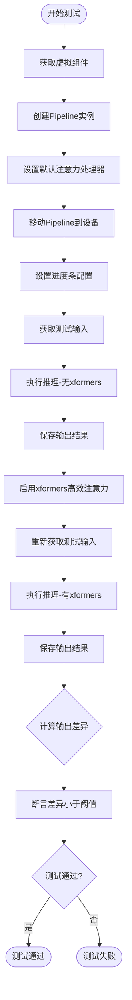

#### 带注释源码

```python
@unittest.skipIf(
    torch_device != "cuda" or not is_xformers_available(),
    reason="XFormers attention is only available with CUDA and `xformers` installed",
)
def test_xformers_attention_forwardGenerator_pass(self):
    """
    测试 xformers 注意力机制是否能正常工作且不影响推理结果
    
    测试步骤：
    1. 创建虚拟组件和Pipeline实例
    2. 使用默认注意力处理器执行推理并保存结果
    3. 启用xformers高效注意力
    4. 再次执行推理并保存结果
    5. 比较两次输出的差异，确保差异在可接受范围内
    """
    # 获取用于测试的虚拟组件
    components = self.get_dummy_components()
    # 使用组件创建Pipeline实例
    pipe = self.pipeline_class(**components)
    
    # 遍历所有组件，设置默认的注意力处理器
    for component in pipe.components.values():
        if hasattr(component, "set_default_attn_processor"):
            component.set_default_attn_processor()
    
    # 将Pipeline移动到指定的计算设备上
    pipe.to(torch_device)
    # 设置进度条配置，disable=None 表示不禁用进度条
    pipe.set_progress_bar_config(disable=None)

    # 获取用于推理的虚拟输入
    inputs = self.get_dummy_inputs(torch_device)
    # 执行推理（不启用xformers），获取第一帧结果
    output_without_offload = pipe(**inputs).frames[0]
    # 确保输出为CPU张量（如果已经是张量则移到CPU）
    output_without_offload = (
        output_without_offload.cpu() if torch.is_tensor(output_without_offload) else output_without_offload
    )

    # 启用xformers高效注意力
    pipe.enable_xformers_memory_efficient_attention()
    # 重新获取测试输入（重新创建以确保独立性）
    inputs = self.get_dummy_inputs(torch_device)
    # 执行推理（启用xformers），获取第一帧结果
    output_with_offload = pipe(**inputs).frames[0]
    # 确保输出为CPU张量
    output_with_offload = (
        output_with_offload.cpu() if torch.is_tensor(output_with_offload) else output_without_offload
    )

    # 计算两次输出的最大差异
    max_diff = np.abs(to_np(output_with_offload) - to_np(output_without_offload)).max()
    # 断言：xformers注意力不应影响推理结果，差异应小于1e-4
    self.assertLess(max_diff, 1e-4, "XFormers attention should not affect the inference results")
```


### `test_vae_slicing`

这是一个测试方法，用于验证VAE（变分自编码器）的切片功能是否正常工作。该方法通过调用父类的 `test_vae_slicing` 方法，传入 `image_count=2` 参数来测试 VAE 在处理 2 张图像时的切片功能是否正常。

参数：

- `self`：`AnimateDiffPipelineFastTests`，测试类实例本身，隐式参数

返回值：`None`，无返回值（调用父类方法进行测试）

#### 流程图

```mermaid
flowchart TD
    A[开始测试 test_vae_slicing] --> B[调用父类方法 super().test_vae_slicing]
    B --> C[传入参数 image_count=2]
    C --> D[执行父类中的 VAE 切片测试逻辑]
    D --> E[测试完成]
```

#### 带注释源码

```python
def test_vae_slicing(self):
    """
    测试 VAE 切片功能。
    
    该方法调用父类的 test_vae_slicing 方法来验证 VAE 切片功能
    是否能够正常工作。VAE 切片是一种内存优化技术，可以将 VAE
    的编码/解码过程分成多个小批次进行处理，以减少显存占用。
    
    参数:
        self: AnimateDiffPipelineFastTests - 测试类实例
    
    返回:
        None: 无返回值，测试结果通过 unittest 框架的断言进行验证
    """
    return super().test_vae_slicing(image_count=2)
```


### `AnimateDiffPipelineFastTests.test_encode_prompt_works_in_isolation`

该方法用于测试文本编码提示（prompt encoding）的隔离性，确保在给定特定设备、图像数量和分类器自由引导条件下，文本编码功能能够独立正确运行。

参数：

- `self`：隐式参数，类型为 `AnimateDiffPipelineFastTests` 实例，表示测试类本身

返回值：无明确返回值（`None`），该方法为 `unittest.TestCase` 的测试方法，通过断言验证功能正确性

#### 流程图

```mermaid
flowchart TD
    A[开始测试] --> B[构建 extra_required_param_value_dict 字典]
    B --> C[获取 device: torch.device(torch_device).type]
    C --> D[获取 num_images_per_prompt: 1]
    D --> E[获取 do_classifier_free_guidance: 判断 guidance_scale > 1.0]
    E --> F[调用父类 test_encode_prompt_works_in_isolation 方法]
    F --> G[结束测试]
```

#### 带注释源码

```python
def test_encode_prompt_works_in_isolation(self):
    """
    测试文本编码提示（prompt encoding）的隔离性。
    
    该测试方法验证在特定参数条件下，文本编码器能够独立正确工作，
    不受其他pipeline组件的影响。
    """
    # 构建额外的必需参数字典，用于配置父类测试方法
    extra_required_param_value_dict = {
        # 获取当前测试设备类型（如 'cuda' 或 'cpu'）
        "device": torch.device(torch_device).type,
        # 每次提示生成的图像数量
        "num_images_per_prompt": 1,
        # 判断是否执行分类器自由引导（当 guidance_scale > 1.0 时为 True）
        "do_classifier_free_guidance": self.get_dummy_inputs(device=torch_device).get("guidance_scale", 1.0) > 1.0,
    }
    # 调用父类（PipelineTesterMixin）的同名测试方法
    # 传递额外参数字典以自定义测试行为
    return super().test_encode_prompt_works_in_isolation(extra_required_param_value_dict)
```


### `AnimateDiffPipelineSlowTests.setUp`

该方法为测试类的初始化方法，在每个测试用例执行前被自动调用，用于清理GPU显存（VRAM），确保测试环境处于干净状态，避免显存泄漏导致的测试问题。

参数：

- `self`：`unittest.TestCase`，测试类实例本身，隐含参数

返回值：`None`，无返回值，仅执行清理操作

#### 流程图

```mermaid
flowchart TD
    A[开始 setUp] --> B[调用 super().setUp]
    B --> C[执行 gc.collect 垃圾回收]
    C --> D[调用 backend_empty_cache 清理GPU缓存]
    D --> E[结束 setUp]
```

#### 带注释源码

```python
def setUp(self):
    # clean up the VRAM before each test
    # 清理每个测试运行前的VRAM（显存），防止显存泄漏
    super().setUp()
    # 调用父类的setUp方法，执行unittest.TestCase的标准初始化逻辑
    gc.collect()
    # 手动触发Python垃圾回收器，清理不再使用的对象
    backend_empty_cache(torch_device)
    # 调用后端工具函数清理GPU显存缓存，确保GPU内存得到释放
```


### `AnimateDiffPipelineSlowTests.tearDown`

该方法为测试类的清理方法，在每个测试用例执行完毕后被调用，用于释放VRAM显存资源，通过调用垃圾回收和清空GPU缓存来防止内存泄漏。

参数：

- `self`：`无`（隐式实例参数），代表测试类实例本身

返回值：`None`，无返回值（执行清理操作）

#### 流程图

```mermaid
graph TD
    A[开始 tearDown] --> B[调用父类 tearDown 方法<br/>super().tearDown]
    B --> C[执行垃圾回收<br/>gc.collect]
    C --> D[清空GPU后端缓存<br/>backend_empty_cache]
    D --> E[结束]
```

#### 带注释源码

```python
def tearDown(self):
    # clean up the VRAM after each test
    # 清理每次测试后的VRAM内存
    super().tearDown()  # 调用父类的tearDown方法，执行基类清理逻辑
    gc.collect()  # 手动调用Python垃圾回收器，释放不再使用的对象
    backend_empty_cache(torch_device)  # 清空GPU显存缓存，torch_device指定目标设备
```


### `test_animatediff`

该方法是 `AnimateDiffPipelineSlowTests` 类中的一个集成测试函数，用于完整测试 AnimateDiffPipeline 的视频生成能力。它加载预训练的运动适配器和 Stable Diffusion 模型，配置调度器和优化选项，然后执行文本到视频的推理，验证输出帧的形状和内容是否符合预期。

参数：

- `self`：`AnimateDiffPipelineSlowTests`，unittest 测试类实例，隐式参数

返回值：`None`，该方法为测试方法，通过 assert 语句验证结果，不返回具体值

#### 流程图

```mermaid
flowchart TD
    A[开始测试 test_animatediff] --> B[加载 VRAM 缓存清理]
    B --> C[从预训练模型加载 MotionAdapter]
    C --> D[从预训练模型加载 AnimateDiffPipeline]
    D --> E[将 Pipeline 移动到指定设备]
    E --> F[配置 DDIMScheduler 调度器]
    F --> G[启用 VAE slicing 优化]
    G --> H[启用模型 CPU 卸载]
    H --> I[配置进度条显示]
    I --> J[设置提示词和负提示词]
    J --> K[创建随机数生成器]
    K --> L[执行 Pipeline 推理]
    L --> M{验证输出}
    M -->|形状验证| N[验证 image.shape == (16, 512, 512, 3)]
    M -->|内容验证| O[计算图像相似度]
    N --> P[结束测试]
    O --> P
```

#### 带注释源码

```python
@unittest.skipIf(
    torch_device != "cuda" or not is_xformers_available(),
    reason="XFormers attention is only available with CUDA and `xformers` installed",
)
def test_animatediff(self):
    """
    完整的 AnimateDiff Pipeline 集成测试
    测试从加载模型到生成视频帧的完整流程
    """
    # 1. 从预训练模型加载运动适配器 (Motion Adapter)
    # 这是一个专门用于视频生成 motion module 的预训练权重
    adapter = MotionAdapter.from_pretrained("guoyww/animatediff-motion-adapter-v1-5-2")
    
    # 2. 从预训练模型加载 AnimateDiffPipeline
    # 结合了 Stable Diffusion 模型和 motion adapter
    pipe = AnimateDiffPipeline.from_pretrained("frankjoshua/toonyou_beta6", motion_adapter=adapter)
    
    # 3. 将 Pipeline 移动到指定的计算设备 (GPU/CPU)
    pipe = pipe.to(torch_device)
    
    # 4. 配置 DDIM 调度器 (Denoising Diffusion Implicit Models)
    # 设置噪声调度参数: beta 起始/结束值, 调度方式, 步数偏移等
    pipe.scheduler = DDIMScheduler(
        beta_start=0.00085,
        beta_end=0.012,
        beta_schedule="linear",
        steps_offset=1,
        clip_sample=False,
    )
    
    # 5. 启用 VAE slicing 优化
    # 将 VAE 推理分片处理，减少显存占用
    pipe.enable_vae_slicing()
    
    # 6. 启用模型 CPU 卸载
    # 将不使用的模型组件卸载到 CPU，节省 GPU 显存
    pipe.enable_model_cpu_offload(device=torch_device)
    
    # 7. 配置进度条显示
    pipe.set_progress_bar_config(disable=None)
    
    # 8. 定义生成提示词
    # prompt: 正面提示词，描述期望生成的视频内容
    prompt = "night, b&w photo of old house, post apocalypse, forest, storm weather, wind, rocks, 8k uhd, dslr, soft lighting, high quality, film grain"
    # negative_prompt: 负面提示词，描述需要避免的元素
    negative_prompt = "bad quality, worse quality"
    
    # 9. 创建随机数生成器
    # 使用固定种子(0)确保结果可复现
    generator = torch.Generator("cpu").manual_seed(0)
    
    # 10. 执行 Pipeline 推理
    # 参数说明:
    # - prompt: 文本提示词
    # - negative_prompt: 负面提示词
    # - num_frames: 生成 16 帧视频
    # - generator: 随机数生成器 (确保可复现性)
    # - guidance_scale: CFG 引导强度 (7.5)
    # - num_inference_steps: 推理步数 (3, 较少步数用于快速测试)
    # - output_type: 输出类型为 numpy 数组
    output = pipe(
        prompt,
        negative_prompt=negative_prompt,
        num_frames=16,
        generator=generator,
        guidance_scale=7.5,
        num_inference_steps=3,
        output_type="np",
    )
    
    # 11. 获取生成的视频帧
    # frames[0] 取第一个提示词对应的视频
    image = output.frames[0]
    
    # 12. 验证输出形状
    # 期望: 16 帧, 512x512 分辨率, RGB 3 通道
    assert image.shape == (16, 512, 512, 3)
    
    # 13. 验证生成图像质量
    # 提取最后一帧的右下角 3x3 像素块
    image_slice = image[0, -3:, -3:, -1]
    
    # 预期的像素值 (用于回归测试)
    expected_slice = np.array(
        [
            0.11357737,
            0.11285847,
            0.11180121,
            0.11084166,
            0.11414117,
            0.09785956,
            0.10742754,
            0.10510018,
            0.08045256,
        ]
    )
    
    # 14. 使用余弦相似度验证图像内容
    # 确保生成的图像与预期相近 (误差 < 0.001)
    assert numpy_cosine_similarity_distance(image_slice.flatten(), expected_slice.flatten()) < 1e-3
```


### `AnimateDiffPipelineFastTests.get_dummy_components`

该方法用于创建并返回一组虚拟（dummy）组件，这些组件是 `AnimateDiffPipeline` 正常运行所需的最小配置测试组件，包括 UNet、调度器、VAE、文本编码器、分词器和运动适配器等，用于单元测试而不需要加载真实的预训练模型。

参数：
- 该方法无显式参数（`self` 为隐式参数）

返回值：`Dict[str, Any]`，返回一个包含 AnimateDiffPipeline 各组件的字典，键为组件名称，值为对应的模型实例或 None

#### 流程图

```mermaid
flowchart TD
    A[开始] --> B[设置 cross_attention_dim = 8]
    B --> C[设置 block_out_channels = (8, 8)]
    C --> D[设置随机种子 torch.manual_seed(0)]
    D --> E[创建 UNet2DConditionModel]
    E --> F[创建 DDIMScheduler]
    F --> G[设置随机种子 torch.manual_seed(0)]
    G --> H[创建 AutoencoderKL]
    H --> I[设置随机种子 torch.manual_seed(0)]
    I --> J[创建 CLIPTextConfig]
    J --> K[创建 CLIPTextModel]
    K --> L[创建 CLIPTokenizer]
    L --> M[设置随机种子 torch.manual_seed(0)]
    M --> N[创建 MotionAdapter]
    N --> O[组装 components 字典]
    O --> P[返回 components]
```

#### 带注释源码

```python
def get_dummy_components(self):
    # 定义交叉注意力维度为 8，用于文本和图像特征的注意力计算
    cross_attention_dim = 8
    # 定义UNet的块输出通道数，使用较小的通道数以加快测试速度
    block_out_channels = (8, 8)

    # 设置随机种子为0，确保测试结果的可重复性
    torch.manual_seed(0)
    # 创建虚拟的UNet2DConditionModel，用于条件图像生成
    # 参数：块输出通道、每块层数、样本大小、输入输出通道数、块类型、交叉注意力维度、归一化组数
    unet = UNet2DConditionModel(
        block_out_channels=block_out_channels,
        layers_per_block=2,
        sample_size=8,
        in_channels=4,
        out_channels=4,
        down_block_types=("CrossAttnDownBlock2D", "DownBlock2D"),
        up_block_types=("CrossAttnUpBlock2D", "UpBlock2D"),
        cross_attention_dim=cross_attention_dim,
        norm_num_groups=2,
    )
    
    # 创建DDIM调度器，用于扩散模型的采样调度
    # 参数：beta起始值、beta结束值、beta调度方式、是否裁剪样本
    scheduler = DDIMScheduler(
        beta_start=0.00085,
        beta_end=0.012,
        beta_schedule="linear",
        clip_sample=False,
    )
    
    # 重新设置随机种子，确保VAE初始化的可重复性
    torch.manual_seed(0)
    # 创建虚拟的AutoencoderKL模型，用于图像的编码和解码
    vae = AutoencoderKL(
        block_out_channels=block_out_channels,
        in_channels=3,
        out_channels=3,
        down_block_types=["DownEncoderBlock2D", "DownEncoderBlock2D"],
        up_block_types=["UpDecoderBlock2D", "UpDecoderBlock2D"],
        latent_channels=4,
        norm_num_groups=2,
    )
    
    # 重新设置随机种子，确保文本编码器初始化的可重复性
    torch.manual_seed(0)
    # 创建CLIP文本编码器的配置对象
    text_encoder_config = CLIPTextConfig(
        bos_token_id=0,
        eos_token_id=2,
        hidden_size=cross_attention_dim,
        intermediate_size=37,
        layer_norm_eps=1e-05,
        num_attention_heads=4,
        num_hidden_layers=5,
        pad_token_id=1,
        vocab_size=1000,
    )
    # 根据配置创建CLIP文本编码器模型
    text_encoder = CLIPTextModel(text_encoder_config)
    # 加载一个小的CLIP分词器用于文本处理
    tokenizer = CLIPTokenizer.from_pretrained("hf-internal-testing/tiny-random-clip")
    
    # 重新设置随机种子，确保运动适配器初始化的可重复性
    torch.manual_seed(0)
    # 创建MotionAdapter，用于动画扩散模型的运动控制
    motion_adapter = MotionAdapter(
        block_out_channels=block_out_channels,
        motion_layers_per_block=2,
        motion_norm_num_groups=2,
        motion_num_attention_heads=4,
    )

    # 组装所有组件到字典中返回
    components = {
        "unet": unet,                  # UNet条件模型
        "scheduler": scheduler,        # DDIM调度器
        "vae": vae,                     # 变分自编码器
        "motion_adapter": motion_adapter,  # 运动适配器
        "text_encoder": text_encoder,  # 文本编码器
        "tokenizer": tokenizer,         # 分词器
        "feature_extractor": None,      # 特征提取器（未使用）
        "image_encoder": None,          # 图像编码器（未使用）
    }
    return components
```


### `AnimateDiffPipelineFastTests.get_dummy_inputs`

该方法是一个测试辅助函数，用于生成虚拟输入参数，以便在测试 AnimateDiffPipeline 时使用。它根据传入的设备和随机种子创建一个包含提示词、生成器、推理步数、引导比例和输出类型等关键参数的字典。

参数：

- `self`：AnimateDiffPipelineFastTests，隐式参数，测试类实例本身
- `device`：`torch.device`，目标设备，用于指定模型运行设备（如 "cpu"、"cuda" 等）
- `seed`：`int`，默认值为 `0`，随机种子，用于生成器初始化以确保测试可重复性

返回值：`Dict[str, Any]`，返回包含虚拟输入参数的字典，包含提示词、生成器、推理步数、引导比例和输出类型。

#### 流程图

```mermaid
flowchart TD
    A[开始 get_dummy_inputs] --> B{检查 device 是否为 mps}
    B -->|是| C[使用 torch.manual_seed 设置种子]
    B -->|否| D[创建 torch.Generator 并设置种子]
    C --> E[构建 inputs 字典]
    D --> E
    E --> F[包含 prompt: 'A painting of a squirrel eating a burger']
    E --> G[包含 generator: 初始化后的生成器]
    E --> H[包含 num_inference_steps: 2]
    E --> I[包含 guidance_scale: 7.5]
    E --> J[包含 output_type: 'pt']
    F --> K[返回 inputs 字典]
    G --> K
    H --> K
    I --> K
    J --> K
    K --> L[结束]
```

#### 带注释源码

```python
def get_dummy_inputs(self, device, seed=0):
    """
    生成用于测试的虚拟输入参数。
    
    参数:
        device: 目标设备 (如 torch.device('cuda') 或 'cpu')
        seed: 随机种子，默认值为 0
    
    返回:
        包含测试所需参数的字典
    """
    # 判断设备是否为 Apple MPS (Metal Performance Shaders)
    if str(device).startswith("mps"):
        # MPS 设备使用 torch.manual_seed 进行简单种子设置
        generator = torch.manual_seed(seed)
    else:
        # 其他设备（如 CUDA、CPU）使用 torch.Generator 创建可复现的随机数生成器
        generator = torch.Generator(device=device).manual_seed(seed)

    # 构建包含推理所需参数的字典
    inputs = {
        "prompt": "A painting of a squirrel eating a burger",  # 测试用提示词
        "generator": generator,  # 随机数生成器，确保生成可复现
        "num_inference_steps": 2,  # 推理步数，测试时使用较少步数加快速度
        "guidance_scale": 7.5,  # 引导比例，控制文本提示对生成的影响程度
        "output_type": "pt",  # 输出类型，"pt" 表示返回 PyTorch 张量
    }
    return inputs
```


### `AnimateDiffPipelineFastTests.test_from_pipe_consistent_config`

该测试方法用于验证AnimateDiffPipeline与StableDiffusionPipeline之间的配置一致性，确保通过`from_pipe`方法在不同pipeline类型之间转换时，配置信息能够正确保留且不丢失。

参数：

- `self`：测试类实例本身，无需显式传递

返回值：`None`，该方法为单元测试，通过assert语句验证配置一致性，测试失败时抛出AssertionError

#### 流程图

```mermaid
flowchart TD
    A[开始测试] --> B[断言original_pipeline_class为StableDiffusionPipeline]
    B --> C[定义原始仓库地址和参数]
    C --> D[从预训练模型创建原始StableDiffusionPipeline]
    D --> E[获取虚拟组件get_dummy_components]
    E --> F[筛选不在原始pipeline中的额外组件]
    F --> G[使用from_pipe方法创建AnimateDiffPipeline]
    G --> H[筛选需要转回原始pipeline的组件]
    H --> I[再次使用from_pipe转回StableDiffusionPipeline]
    I --> J[过滤配置文件排除私有属性]
    J --> K{比较两个配置是否一致}
    K -->|一致| L[测试通过]
    K -->|不一致| M[抛出AssertionError]
```

#### 带注释源码

```python
def test_from_pipe_consistent_config(self):
    """
    测试AnimateDiffPipeline与StableDiffusionPipeline之间的配置一致性。
    验证通过from_pipe方法在不同pipeline类型之间转换时，配置能够正确保留。
    """
    # 断言确认原始pipeline类必须是StableDiffusionPipeline
    assert self.original_pipeline_class == StableDiffusionPipeline
    
    # 定义要加载的预训练模型仓库和额外参数
    original_repo = "hf-internal-testing/tinier-stable-diffusion-pipe"
    original_kwargs = {"requires_safety_checker": False}

    # 步骤1: 创建原始的StableDiffusionPipeline
    # 从预训练模型加载pipeline，传入额外的requires_safety_checker参数
    pipe_original = self.original_pipeline_class.from_pretrained(original_repo, **original_kwargs)

    # 步骤2: 将StableDiffusionPipeline转换为AnimateDiffPipeline
    # 获取虚拟组件配置（用于测试的假组件）
    pipe_components = self.get_dummy_components()
    
    # 筛选出在原始pipeline中不存在的组件（即AnimateDiffPipeline特有的组件）
    pipe_additional_components = {}
    for name, component in pipe_components.items():
        if name not in pipe_original.components:
            pipe_additional_components[name] = component

    # 使用from_pipe方法从原始pipeline创建AnimateDiffPipeline
    # 传入额外的motion_adapter等AnimateDiff特有组件
    pipe = self.pipeline_class.from_pipe(pipe_original, **pipe_additional_components)

    # 步骤3: 将AnimateDiffPipeline再次转换回StableDiffusionPipeline
    # 找出需要从AnimateDiffPipeline中提取的原始组件
    original_pipe_additional_components = {}
    for name, component in pipe_original.components.items():
        # 检查组件是否不存在于新pipeline，或类型是否不匹配
        if name not in pipe.components or not isinstance(component, pipe.components[name].__class__):
            original_pipe_additional_components[name] = component

    # 再次使用from_pipe方法从AnimateDiffPipeline创建StableDiffusionPipeline
    pipe_original_2 = self.original_pipeline_class.from_pipe(pipe, **original_pipe_additional_components)

    # 步骤4: 比较原始配置和转换后的配置
    # 过滤掉以双下划线开头的私有配置项（通常是内部状态）
    original_config = {k: v for k, v in pipe_original.config.items() if not k.startswith("_")}
    original_config_2 = {k: v for k, v in pipe_original_2.config.items() if not k.startswith("_")}
    
    # 断言两个配置字典完全相等，确保配置在转换过程中没有丢失或改变
    assert original_config_2 == original_config
```


### `AnimateDiffPipelineFastTests.test_motion_unet_loading`

该测试方法用于验证AnimateDiffPipeline在加载时能够正确创建Motion UNet（UNetMotionModel），确保运动适配器与管道正确集成。

参数：

- `self`：`AnimateDiffPipelineFastTests`，测试类实例本身，包含测试所需的上下文和方法

返回值：`None`，该测试方法不返回任何值，仅通过断言验证UNet类型是否符合预期

#### 流程图

```mermaid
flowchart TD
    A[开始测试] --> B[获取虚拟组件: get_dummy_components]
    B --> C[创建AnimateDiffPipeline实例]
    C --> D{pipe.unet是否为UNetMotionModel类型?}
    D -->|是| E[测试通过]
    D -->|否| F[测试失败: 断言错误]
```

#### 带注释源码

```python
def test_motion_unet_loading(self):
    """
    测试AnimateDiffPipeline在创建时是否能正确加载Motion UNet。
    该测试验证motion_adapter是否被正确集成到pipeline的unet组件中。
    """
    # 步骤1: 获取虚拟组件（用于测试的dummy components）
    # 这些组件是测试专用的轻量级模型配置
    components = self.get_dummy_components()
    
    # 步骤2: 使用这些组件实例化AnimateDiffPipeline
    # 在AnimateDiffPipeline的__init__中，会将motion_adapter与unet合并
    # 生成UNetMotionModel类型的unet
    pipe = AnimateDiffPipeline(**components)
    
    # 步骤3: 断言验证pipe.unet是UNetMotionModel类型
    # UNetMotionModel是结合了原始SD UNet和MotionAdapter的模型
    assert isinstance(pipe.unet, UNetMotionModel)
```


### `AnimateDiffPipelineFastTests.test_attention_slicing_forward_pass`

该测试方法用于验证 AnimateDiffPipeline 中的注意力切片（attention slicing）功能的前向传播是否正确执行。然而，该测试当前被标记为跳过，原因是该管道中未启用注意力切片功能。

参数：

- `self`：`AnimateDiffPipelineFastTests`，测试类实例本身，代表当前测试用例的上下文

返回值：`None`，该方法不返回任何值，作为测试方法其结果通过断言或异常来体现

#### 流程图

```mermaid
graph TD
    A[开始测试 test_attention_slicing_forward_pass] --> B{检查是否需要跳过测试}
    B -->|是| C[跳过测试并输出原因: Attention slicing is not enabled in this pipeline]
    B -->|否| D[执行注意力切片前向传播测试逻辑]
    D --> E[断言输出结果]
    C --> F[结束测试]
    E --> F
    
    style C fill:#f9f,stroke:#333,stroke-width:2px
    style F fill:#9f9,stroke:#333,stroke-width:2px
```

#### 带注释源码

```python
@unittest.skip("Attention slicing is not enabled in this pipeline")
def test_attention_slicing_forward_pass(self):
    """
    测试注意力切片功能的前向传播。
    
    注意：此测试当前被跳过，因为 AnimateDiffPipeline 
    尚未实现注意力切片功能。该测试旨在验证使用注意力切片
    优化时，管道仍能生成正确的结果。
    """
    pass  # 测试逻辑未实现，仅保留接口
```


### `AnimateDiffPipelineFastTests.test_ip_adapter`

该方法是一个测试方法，用于测试 AnimateDiffPipeline 的 IP Adapter 功能。它根据当前设备（CPU）设置特定的期望输出切片，然后调用父类的 test_ip_adapter 方法执行实际的 IP Adapter 测试。

参数：

- `self`：隐式参数，类型为 `AnimateDiffPipelineFastTests` 实例，表示测试类本身

返回值：`Any`，返回父类 `IPAdapterTesterMixin.test_ip_adapter` 方法的执行结果

#### 流程图

```mermaid
flowchart TD
    A[开始 test_ip_adapter] --> B{torch_device == 'cpu'?}
    B -->|是| C[设置 expected_pipe_slice 为 CPU 期望值数组]
    B -->|否| D[expected_pipe_slice = None]
    C --> E[调用 super().test_ip_adapter]
    D --> E
    E --> F[返回测试结果]
```

#### 带注释源码

```python
def test_ip_adapter(self):
    """
    测试 AnimateDiffPipeline 的 IP Adapter 功能
    
    该测试方法覆盖了 IPAdapterTesterMixin 中的 test_ip_adapter 方法，
    针对 CPU 设备提供了特定的期望输出值，用于验证 IP Adapter 功能的正确性。
    """
    # 初始化期望输出切片为 None
    expected_pipe_slice = None
    
    # 如果当前设备是 CPU，设置特定的期望输出值
    # 这些数值是预先计算的正确输出，用于验证测试结果
    if torch_device == "cpu":
        expected_pipe_slice = np.array(
            [
                0.5216,
                0.5620,
                0.4927,
                0.5082,
                0.4786,
                0.5932,
                0.5125,
                0.4514,
                0.5315,
                0.4694,
                0.3276,
                0.4863,
                0.3920,
                0.3684,
                0.5745,
                0.4499,
                0.5081,
                0.5414,
                0.6014,
                0.5062,
                0.3630,
                0.5296,
                0.6018,
                0.5098,
                0.4948,
                0.5101,
                0.5620,
            ]
        )
    
    # 调用父类的 test_ip_adapter 方法执行实际测试
    # 传递 CPU 特定的期望输出切片
    return super().test_ip_adapter(expected_pipe_slice=expected_pipe_slice)
```


### `AnimateDiffPipelineFastTests.test_dict_tuple_outputs_equivalent`

该测试方法用于验证 AnimateDiffPipeline 管道以字典形式返回输出和以元组形式返回输出时，结果是否等价。它通过调用父类的同名测试方法来实现，并针对 CPU 设备提供特定的期望输出切片进行比对。

参数：

- `self`：`AnimateDiffPipelineFastTests`，测试类实例，隐式参数，表示当前测试对象本身

返回值：`unittest.TestCase.test_dict_tuple_outputs_equivalent` 的返回值，具体为 `None`（继承自 `unittest.TestCase` 的测试方法返回值），该方法执行断言验证，不返回具体数据

#### 流程图

```mermaid
flowchart TD
    A[开始测试 test_dict_tuple_outputs_equivalent] --> B{当前设备是否为 CPU}
    B -->|是| C[设置 expected_slice 为 CPU 特定值]
    B -->|否| D[设置 expected_slice 为 None]
    C --> E
    D --> E
    E[调用父类 test_dict_tuple_outputs_equivalent 方法] --> F[传入 expected_slice 参数]
    F --> G[父类执行输出格式等价性验证]
    G --> H[测试结束返回结果]
```

#### 带注释源码

```python
def test_dict_tuple_outputs_equivalent(self):
    # 定义期望的输出切片值，用于 CPU 设备上的结果验证
    expected_slice = None
    # 判断当前设备是否为 CPU，根据设备类型设置对应的期望输出切片
    if torch_device == "cpu":
        # CPU 设备上的预期输出值，用于验证管道输出的正确性
        expected_slice = np.array([0.5125, 0.4514, 0.5315, 0.4499, 0.5081, 0.5414, 0.4948, 0.5101, 0.5620])
    # 调用父类的同名测试方法，传入根据设备确定的期望切片值
    # 父类方法会验证管道以字典和元组形式返回输出时结果是否等价
    return super().test_dict_tuple_outputs_equivalent(expected_slice=expected_slice)
```


### `AnimateDiffPipelineFastTests.test_inference_batch_single_identical`

该测试方法用于验证 AnimateDiffPipeline 在批处理模式下与单样本推理时的输出一致性，确保批处理实现不会引入意外的数值差异。

参数：

- `self`：隐含的实例参数，类型为 `AnimateDiffPipelineFastTests`，测试类的实例本身
- `batch_size`：可选参数，类型为 `int`，默认值为 `2`，表示批处理时的批次大小
- `expected_max_diff`：可选参数，类型为 `float`，默认值为 `1e-4`，期望批处理输出与单样本输出之间的最大绝对差异阈值
- `additional_params_copy_to_batched_inputs`：可选参数，类型为 `List[str]`，默认值为 `["num_inference_steps"]`，指定需要额外复制到批处理输入的参数名称列表

返回值：无明确返回值（测试方法），通过 `assert` 语句验证，验证失败时抛出 `AssertionError`

#### 流程图

```mermaid
flowchart TD
    A[开始测试] --> B[获取虚拟组件: get_dummy_components]
    B --> C[创建管道实例: AnimateDiffPipeline]
    C --> D[为每个组件设置默认注意力处理器]
    D --> E[将管道移至设备: torch_device]
    E --> F[设置进度条配置: set_progress_bar_config]
    F --> G[获取虚拟输入: get_dummy_inputs]
    G --> H[重置随机数生成器]
    H --> I[设置日志级别为FATAL]
    I --> J[批处理化输入: batchify inputs]
    J --> K[为prompt创建不同长度的批次]
    K --> L[为其他参数创建batch_size份副本]
    L --> M[为每个批次创建独立的generator]
    M --> N[执行单样本推理: pipe]
    N --> O[执行批处理推理: pipe batched]
    O --> P[验证批处理输出形状]
    P --> Q[计算输出差异: max_diff]
    Q --> R{max_diff < expected_max_diff?}
    R -->|是| S[测试通过]
    R -->|否| T[断言失败]
```

#### 带注释源码

```python
def test_inference_batch_single_identical(
    self,
    batch_size=2,
    expected_max_diff=1e-4,
    additional_params_copy_to_batched_inputs=["num_inference_steps"],
):
    # 获取预定义的虚拟组件，用于测试
    components = self.get_dummy_components()
    # 使用虚拟组件实例化AnimateDiffPipeline管道
    pipe = self.pipeline_class(**components)
    
    # 遍历管道中的所有组件，为支持set_default_attn_processor的组件设置默认注意力处理器
    # 这确保了测试的一致性，使用标准的注意力机制
    for components in pipe.components.values():
        if hasattr(components, "set_default_attn_processor"):
            components.set_default_attn_processor()

    # 将管道移至测试设备（如GPU或CPU）
    pipe.to(torch_device)
    # 设置进度条配置，disable=None表示不禁用进度条
    pipe.set_progress_bar_config(disable=None)
    
    # 获取虚拟输入参数（包含prompt、generator等）
    inputs = self.get_dummy_inputs(torch_device)
    
    # 重置generator，因为在get_dummy_inputs中可能已经使用过
    # 确保单样本推理和批处理推理使用相同的随机种子
    inputs["generator"] = self.get_generator(0)

    # 获取日志记录器并设置日志级别为FATAL，减少测试过程中的日志输出
    logger = logging.get_logger(pipe.__module__)
    logger.setLevel(level=diffusers.logging.FATAL)

    # 初始化批处理输入字典，复制原始输入
    batched_inputs = {}
    batched_inputs.update(inputs)

    # 遍历批处理参数，根据不同参数类型进行批处理化
    for name in self.batch_params:
        if name not in inputs:
            continue

        value = inputs[name]
        # 特殊处理prompt：创建不同长度的prompts
        # 第一个prompt是原始长度，后面依次减半，最后一个填满到100个"very long"
        if name == "prompt":
            len_prompt = len(value)
            batched_inputs[name] = [value[: len_prompt // i] for i in range(1, batch_size + 1)]
            batched_inputs[name][-1] = 100 * "very long"

        else:
            # 其他参数直接复制batch_size份
            batched_inputs[name] = batch_size * [value]

    # 为批处理中的每个样本创建独立的generator，确保随机性
    if "generator" in inputs:
        batched_inputs["generator"] = [self.get_generator(i) for i in range(batch_size)]

    # 设置批处理大小
    if "batch_size" in inputs:
        batched_inputs["batch_size"] = batch_size

    # 将额外指定的参数复制到批处理输入
    for arg in additional_params_copy_to_batched_inputs:
        batched_inputs[arg] = inputs[arg]

    # 执行单样本推理
    output = pipe(**inputs)
    # 执行批处理推理
    output_batch = pipe(**batched_inputs)

    # 验证批处理输出的第一个样本数量是否等于batch_size
    assert output_batch[0].shape[0] == batch_size

    # 计算批处理输出与单样本输出之间的最大绝对差异
    # 使用to_np将张量转换为numpy数组进行计算
    max_diff = np.abs(to_np(output_batch[0][0]) - to_np(output[0][0])).max()
    
    # 断言：最大差异应小于期望阈值，确保批处理和单样本输出一致
    assert max_diff < expected_max_diff
```


### `AnimateDiffPipelineFastTests.test_to_device`

该测试方法用于验证 AnimateDiffPipeline 能够在不同计算设备（CPU 和 CUDA）之间正确切换，并确保在两个设备上的推理输出均不包含 NaN 值。

参数：

- `self`：隐式参数，AnimateDiffPipelineFastTests 实例

返回值：`None`，无返回值（测试方法）

#### 流程图

```mermaid
flowchart TD
    A[开始测试] --> B[获取虚拟组件]
    B --> C[创建 AnimateDiffPipeline 实例]
    C --> D[设置进度条配置]
    D --> E[将管道移至 CPU]
    E --> F[检查所有组件设备为 cpu]
    F --> G[在 CPU 上执行推理]
    G --> H{输出是否包含 NaN?}
    H -->|是| I[测试失败]
    H -->|否| J[将管道移至 torch_device]
    J --> K[检查所有组件设备为 torch_device]
    K --> L[在 torch_device 上执行推理]
    L --> M{输出是否包含 NaN?}
    M -->|是| I
    M -->|否| N[测试通过]
```

#### 带注释源码

```python
@require_accelerator  # 装饰器：仅在有加速器（GPU）时运行
def test_to_device(self):
    """
    测试管道在 CPU 和 GPU 设备之间的切换功能
    """
    # 步骤1：获取虚拟组件（用于测试的轻量级模型配置）
    components = self.get_dummy_components()
    
    # 步骤2：使用虚拟组件实例化 AnimateDiffPipeline
    pipe = self.pipeline_class(**components)
    
    # 步骤3：配置进度条（disable=None 表示启用进度条）
    pipe.set_progress_bar_config(disable=None)

    # 步骤4：将管道所有组件移至 CPU
    pipe.to("cpu")
    
    # 步骤5：获取所有组件的设备类型（排除无 device 属性的组件）
    model_devices = [
        component.device.type for component in pipe.components.values() if hasattr(component, "device")
    ]
    
    # 断言：验证所有组件都在 CPU 上
    self.assertTrue(all(device == "cpu" for device in model_devices))

    # 步骤6：使用 CPU 设备进行推理，获取第一帧输出
    output_cpu = pipe(**self.get_dummy_inputs("cpu"))[0]
    
    # 断言：验证 CPU 推理输出不包含 NaN 值
    self.assertTrue(np.isnan(output_cpu).sum() == 0)

    # 步骤7：将管道移至目标设备（通常是 CUDA）
    pipe.to(torch_device)
    
    # 步骤8：再次获取所有组件的设备类型
    model_devices = [
        component.device.type for component in pipe.components.values() if hasattr(component, "device")
    ]
    
    # 断言：验证所有组件都在目标设备上
    self.assertTrue(all(device == torch_device for device in model_devices))

    # 步骤9：使用目标设备进行推理
    output_device = pipe(**self.get_dummy_inputs(torch_device))[0]
    
    # 断言：验证目标设备推理输出不包含 NaN 值
    self.assertTrue(np.isnan(to_np(output_device)).sum() == 0)
```


### `AnimateDiffPipelineFastTests.test_to_dtype`

这是一个单元测试方法，用于验证 AnimateDiffPipeline 能否正确地将所有模型组件的数据类型（dtype）从默认的 float32 转换为指定的 float16，并确保所有组件都成功转换。

参数：

- 无显式参数（继承自 unittest.TestCase）

返回值：`None`，通过断言验证数据类型转换的正确性

#### 流程图

```mermaid
flowchart TD
    A[开始测试 test_to_dtype] --> B[调用 get_dummy_components 获取虚拟组件]
    B --> C[使用组件创建 AnimateDiffPipeline 实例]
    C --> D[设置进度条配置 disable=None]
    D --> E[获取所有组件的 dtype 属性]
    E --> F{验证所有 dtype == torch.float32}
    F -->|是| G[调用 pipe.to(dtype=torch.float16)]
    F -->|否| H[测试失败 - 断言错误]
    G --> I[再次获取所有组件的 dtype 属性]
    I --> J{验证所有 dtype == torch.float16}
    J -->|是| K[测试通过]
    J -->|否| L[测试失败 - 断言错误]
```

#### 带注释源码

```python
def test_to_dtype(self):
    """
    测试 AnimateDiffPipeline 的数据类型转换功能
    
    该测试验证:
    1. 管道组件默认使用 torch.float32
    2. 调用 pipe.to(dtype=torch.float16) 后，所有组件正确转换为 float16
    """
    # 步骤1: 获取预定义的虚拟组件（包含 UNet, VAE, Scheduler, TextEncoder, MotionAdapter 等）
    components = self.get_dummy_components()
    
    # 步骤2: 使用虚拟组件实例化 AnimateDiffPipeline
    pipe = self.pipeline_class(**components)
    
    # 步骤3: 设置进度条配置，disable=None 表示不禁用进度条
    pipe.set_progress_bar_config(disable=None)

    # 步骤4: 获取所有模型组件的数据类型
    # 遍历 pipe.components 中的所有组件，过滤出具有 dtype 属性的组件
    # 注意: pipeline 内部会创建新的 motion UNet，所以需要从 pipe.components 获取
    model_dtypes = [component.dtype for component in pipe.components.values() if hasattr(component, "dtype")]
    
    # 步骤5: 断言验证所有组件默认数据类型为 torch.float32
    self.assertTrue(all(dtype == torch.float32 for dtype in model_dtypes))

    # 步骤6: 调用 to 方法将管道所有组件转换为 torch.float16
    pipe.to(dtype=torch.float16)
    
    # 步骤7: 再次获取转换后所有组件的数据类型
    model_dtypes = [component.dtype for component in pipe.components.values() if hasattr(component, "dtype")]
    
    # 步骤8: 断言验证所有组件已正确转换为 torch.float16
    self.assertTrue(all(dtype == torch.float16 for dtype in model_dtypes))
```


### `AnimateDiffPipelineFastTests.test_prompt_embeds`

该测试方法验证了 AnimateDiffPipeline 能够直接接收预计算的 prompt_embeds 进行推理，测试绕过文本编码器直接使用嵌入向量的功能。

参数：

- `self`：隐式参数，TestCase 实例本身

返回值：`None`，该方法为测试方法，执行推理后不返回任何值（通过断言验证行为）。

#### 流程图

```mermaid
flowchart TD
    A[开始测试] --> B[获取虚拟组件]
    B --> C[创建 AnimateDiffPipeline 实例]
    C --> D[配置进度条为启用]
    D --> E[将管道移至 torch_device]
    E --> F[获取虚拟输入]
    F --> G[移除 prompt 字段]
    G --> H[生成随机 prompt_embeds]
    H --> I[调用管道执行推理]
    I --> J[验证管道接受 prompt_embeds]
    J --> K[结束测试]
```

#### 带注释源码

```python
def test_prompt_embeds(self):
    """
    测试管道能够直接接收预计算的 prompt_embeds 而不是 prompt。
    验证文本编码嵌入可以绕过文本编码器直接传入管道。
    """
    # 步骤1: 获取预配置的虚拟组件（UNet、VAE、Scheduler、TextEncoder等）
    components = self.get_dummy_components()
    
    # 步骤2: 使用组件实例化 AnimateDiffPipeline
    pipe = self.pipeline_class(**components)
    
    # 步骤3: 配置进度条（disable=None 表示启用进度条）
    pipe.set_progress_bar_config(disable=None)
    
    # 步骤4: 将管道及其所有组件移至指定的计算设备
    pipe.to(torch_device)
    
    # 步骤5: 获取虚拟输入字典，包含 prompt、generator、num_inference_steps 等
    inputs = self.get_dummy_inputs(torch_device)
    
    # 步骤6: 从输入字典中移除 'prompt' 键，模拟不提供文本提示的场景
    inputs.pop("prompt")
    
    # 步骤7: 构造符合文本编码器隐藏层维度的随机嵌入向量
    # 形状: (batch_size=1, seq_len=4, hidden_size=hidden_size)
    inputs["prompt_embeds"] = torch.randn(
        (1, 4, pipe.text_encoder.config.hidden_size),
        device=torch_device
    )
    
    # 步骤8: 调用管道进行推理，传入预计算的 prompt_embeds
    # 管道应能正常执行而不需要 text_encoder
    pipe(**inputs)
    
    # 测试验证: 如果管道能成功执行而不报错，说明支持 prompt_embeds 输入
```


### `AnimateDiffPipelineFastTests.test_free_init`

该方法是一个测试方法，用于验证 AnimateDiffPipeline 中 FreeInit 功能的正确性。FreeInit 是一种用于改善视频生成质量的初始化技术，该测试通过对比启用和禁用 FreeInit 时的输出差异，来验证功能的有效性。

参数：

- 无显式参数（继承自 unittest.TestCase）

返回值：`None`，该方法为测试方法，使用断言验证结果

#### 流程图

```mermaid
flowchart TD
    A[开始测试] --> B[获取虚拟组件]
    B --> C[创建AnimateDiffPipeline实例]
    C --> D[配置pipeline设备]
    D --> E[获取默认输入并执行推理]
    E --> F[获取frames_normal]
    F --> G[启用FreeInit<br/>num_iters=2<br/>use_fast_sampling=True<br/>method=butterworth]
    G --> H[获取输入并执行推理]
    H --> I[获取frames_enable_free_init]
    I --> J[禁用FreeInit]
    J --> K[获取输入并执行推理]
    K --> L[获取frames_disable_free_init]
    L --> M[计算启用FreeInit与默认的差异sum_enabled]
    M --> N[计算禁用FreeInit与默认的差异max_diff_disabled]
    N --> O{sum_enabled > 1e1?}
    O -->|是| P{max_diff_disabled < 1e-4?}
    O -->|否| Q[测试失败: FreeInit未产生预期差异]
    P -->|是| R[测试通过]
    P -->|否| S[测试失败: 禁用FreeInit后结果应相似]
```

#### 带注释源码

```python
def test_free_init(self):
    """
    测试 FreeInit 功能是否正常工作。
    FreeInit 是一种用于改进视频生成质量的初始化技术。
    """
    # 步骤1: 获取虚拟组件（用于测试的模拟模型组件）
    components = self.get_dummy_components()
    
    # 步骤2: 使用虚拟组件创建 AnimateDiffPipeline 实例
    pipe: AnimateDiffPipeline = self.pipeline_class(**components)
    
    # 步骤3: 配置进度条（disable=None 表示启用进度条）
    pipe.set_progress_bar_config(disable=None)
    
    # 步骤4: 将 pipeline 移动到测试设备（torch_device）
    pipe.to(torch_device)

    # 步骤5: 获取默认输入并执行推理（不启用 FreeInit）
    inputs_normal = self.get_dummy_inputs(torch_device)
    frames_normal = pipe(**inputs_normal).frames[0]

    # 步骤6: 启用 FreeInit，使用指定的参数
    # num_iters: 迭代次数
    # use_fast_sampling: 是否使用快速采样
    # method: 滤波方法（butterworth）
    # order: 滤波器阶数
    # spatial_stop_frequency: 空间停止频率
    # temporal_stop_frequency: 时间停止频率
    pipe.enable_free_init(
        num_iters=2,
        use_fast_sampling=True,
        method="butterworth",
        order=4,
        spatial_stop_frequency=0.25,
        temporal_stop_frequency=0.25,
    )
    
    # 步骤7: 使用 FreeInit 执行推理
    inputs_enable_free_init = self.get_dummy_inputs(torch_device)
    frames_enable_free_init = pipe(**inputs_enable_free_init).frames[0]

    # 步骤8: 禁用 FreeInit
    pipe.disable_free_init()
    
    # 步骤9: 禁用 FreeInit 后执行推理
    inputs_disable_free_init = self.get_dummy_inputs(torch_device)
    frames_disable_free_init = pipe(**inputs_disable_free_init).frames[0]

    # 步骤10: 计算差异
    # 计算启用 FreeInit 与默认结果的差异总和
    sum_enabled = np.abs(to_np(frames_normal) - to_np(frames_enable_free_init)).sum()
    
    # 计算禁用 FreeInit 与默认结果的最大差异
    max_diff_disabled = np.abs(to_np(frames_normal) - to_np(frames_disable_free_init)).max()
    
    # 步骤11: 断言验证
    # 验证启用 FreeInit 应该产生与默认明显不同的结果
    self.assertGreater(
        sum_enabled, 1e1, 
        "Enabling of FreeInit should lead to results different from the default pipeline results"
    )
    
    # 验证禁用 FreeInit 后应该产生与默认相似的结果
    self.assertLess(
        max_diff_disabled,
        1e-4,
        "Disabling of FreeInit should lead to results similar to the default pipeline results",
    )
```


### `AnimateDiffPipelineFastTests.test_free_init_with_schedulers`

该测试方法用于验证 AnimateDiffPipeline 的 FreeInit（自由初始化）功能能否与不同的调度器（schedulers）正常配合工作。测试通过创建带有 FreeInit 功能的 pipeline，并使用不同的调度器生成视频帧，然后检查启用 FreeInit 后的输出是否与默认输出存在显著差异。

参数：

- `self`：隐式参数，测试类实例本身

返回值：`None`，该方法为单元测试方法，通过断言验证功能正确性，不返回任何值

#### 流程图

```mermaid
flowchart TD
    A[开始测试] --> B[获取虚拟组件 components]
    B --> C[创建默认 AnimateDiffPipeline]
    C --> D[设置进度条和设备]
    D --> E[获取虚拟输入并生成基准帧 frames_normal]
    E --> F[定义要测试的调度器列表]
    F --> G{遍历调度器列表}
    G -->|是| H[从默认调度器配置创建新调度器]
    H --> I[更新 components 中的调度器]
    I --> J[使用新调度器创建 pipeline]
    J --> K[设置进度条和设备]
    K --> L[启用 FreeInit]
    L --> M[获取虚拟输入并生成帧]
    M --> N[计算输出差异 sum_enabled]
    N --> O{断言: sum_enabled > 1e1}
    O -->|通过| G
    O -->|失败| P[测试失败]
    G -->|遍历完成| Q[结束测试]
```

#### 带注释源码

```python
def test_free_init_with_schedulers(self):
    """
    测试 FreeInit 功能与不同调度器的兼容性
    
    该测试方法验证 AnimateDiffPipeline 的 FreeInit 功能能否与
    不同的调度器（如 DPMSolverMultistepScheduler、LCMScheduler）
    正常配合工作。
    """
    
    # 步骤1: 获取虚拟组件配置
    # 用于创建测试所需的虚拟（dummy）组件
    components = self.get_dummy_components()
    
    # 步骤2: 使用默认调度器创建 pipeline 并生成基准输出
    pipe: AnimateDiffPipeline = self.pipeline_class(**components)
    pipe.set_progress_bar_config(disable=None)  # 启用进度条显示
    pipe.to(torch_device)  # 将 pipeline 移动到测试设备

    inputs_normal = self.get_dummy_inputs(torch_device)  # 获取虚拟输入
    frames_normal = pipe(**inputs_normal).frames[0]  # 生成基准视频帧

    # 步骤3: 定义要测试的调度器列表
    # 测试两种不同的调度器：DPMSolverMultistepScheduler 和 LCMScheduler
    schedulers_to_test = [
        DPMSolverMultistepScheduler.from_config(
            components["scheduler"].config,
            timestep_spacing="linspace",
            beta_schedule="linear",
            algorithm_type="dpmsolver++",
            steps_offset=1,
            clip_sample=False,
        ),
        LCMScheduler.from_config(
            components["scheduler"].config,
            timestep_spacing="linspace",
            beta_schedule="linear",
            steps_offset=1,
            clip_sample=False,
        ),
    ]
    
    # 从 components 中移除默认调度器，为后续测试做准备
    components.pop("scheduler")

    # 步骤4: 遍历每个调度器进行测试
    for scheduler in schedulers_to_test:
        # 使用新调度器更新组件
        components["scheduler"] = scheduler
        
        # 创建新的 pipeline 实例
        pipe: AnimateDiffPipeline = self.pipeline_class(**components)
        pipe.set_progress_bar_config(disable=None)
        pipe.to(torch_device)

        # 启用 FreeInit 功能
        # num_iters=2: 迭代次数
        # use_fast_sampling=False: 不使用快速采样
        pipe.enable_free_init(num_iters=2, use_fast_sampling=False)

        # 获取虚拟输入并生成带有 FreeInit 的输出
        inputs = self.get_dummy_inputs(torch_device)
        frames_enable_free_init = pipe(**inputs).frames[0]
        
        # 计算基准输出与 FreeInit 输出的差异
        sum_enabled = np.abs(to_np(frames_normal) - to_np(frames_enable_free_init)).sum()

        # 步骤5: 断言验证
        # 验证启用 FreeInit 后输出应该与默认输出有显著差异
        self.assertGreater(
            sum_enabled,
            1e1,  # 差异应该大于10
            "Enabling of FreeInit should lead to results different from the default pipeline results"
        )
```


### `AnimateDiffPipelineFastTests.test_free_noise_blocks`

该方法是一个单元测试，用于验证 AnimateDiffPipeline 的 FreeNoise（自由噪声）功能。它测试了启用和禁用 FreeNoise 后，UNet 的下采样块中的运动模块的 transformer 块类型是否正确切换为 `FreeNoiseTransformerBlock` 或恢复为原始类型。

参数：
- 无（仅包含隐式参数 `self`）

返回值：`None`，该方法为测试方法，通过断言验证功能，不返回任何值

#### 流程图

```mermaid
graph TD
    A[开始 test_free_noise_blocks] --> B[获取虚拟组件 components = self.get_dummy_components()]
    B --> C[创建管道 pipe = AnimateDiffPipeline(**components)]
    C --> D[设置进度条 pipe.set_progress_bar_config(disable=None)]
    D --> E[将管道移动到设备 pipe.to(torch_device)]
    E --> F[启用自由噪声 pipe.enable_free_noise()]
    F --> G[遍历 pipe.unet.down_blocks]
    G --> H[遍历每个 block 的 motion_modules]
    H --> I[遍历每个 motion_module 的 transformer_blocks]
    I --> J{断言: transformer_block 是 FreeNoiseTransformerBlock}
    J -->|失败| K[抛出 AssertionError]
    J -->|成功| L[禁用自由噪声 pipe.disable_free_noise()]
    L --> M[再次遍历 pipe.unet.down_blocks]
    M --> N[遍历每个 block 的 motion_modules]
    N --> O[遍历每个 motion_module 的 transformer_blocks]
    O --> P{断言: transformer_block 不是 FreeNoiseTransformerBlock}
    P -->|失败| Q[抛出 AssertionError]
    P -->|成功| R[测试结束]
```

#### 带注释源码

```python
def test_free_noise_blocks(self):
    """
    测试 FreeNoise 功能的启用和禁用是否正确切换 transformer block 的类型。
    验证 enable_free_noise() 后 transformer 块变为 FreeNoiseTransformerBlock，
    disable_free_noise() 后恢复为原始类型。
    """
    # 1. 获取虚拟组件（用于测试的轻量级模型配置）
    components = self.get_dummy_components()
    
    # 2. 使用虚拟组件创建 AnimateDiffPipeline 实例
    pipe: AnimateDiffPipeline = self.pipeline_class(**components)
    
    # 3. 配置进度条显示（disable=None 表示启用进度条）
    pipe.set_progress_bar_config(disable=None)
    
    # 4. 将管道移动到测试设备（通常是 CUDA 或 CPU）
    pipe.to(torch_device)

    # 5. 启用 FreeNoise 功能
    pipe.enable_free_noise()
    
    # 6. 验证启用后：所有 motion 模块的 transformer 块必须是 FreeNoiseTransformerBlock 类型
    for block in pipe.unet.down_blocks:  # 遍历 UNet 的下采样块
        for motion_module in block.motion_modules:  # 遍历每个块的运动模块
            for transformer_block in motion_module.transformer_blocks:  # 遍历每个运动模块的 transformer 块
                # 断言验证 transformer_block 是 FreeNoiseTransformerBlock 的实例
                self.assertTrue(
                    isinstance(transformer_block, FreeNoiseTransformerBlock),
                    "Motion module transformer blocks must be an instance of `FreeNoiseTransformerBlock` after enabling FreeNoise.",
                )

    # 7. 禁用 FreeNoise 功能
    pipe.disable_free_noise()
    
    # 8. 验证禁用后：所有 transformer 块不应再是 FreeNoiseTransformerBlock 类型
    for block in pipe.unet.down_blocks:  # 再次遍历 UNet 的下采样块
        for motion_module in block.motion_modules:  # 遍历每个块的运动模块
            for transformer_block in motion_module.transformer_blocks:  # 遍历每个运动模块的 transformer 块
                # 断言验证 transformer_block 不再是 FreeNoiseTransformerBlock 的实例
                self.assertFalse(
                    isinstance(transformer_block, FreeNoiseTransformerBlock),
                    "Motion module transformer blocks must not be an instance of `FreeNoiseTransformerBlock` after disabling FreeNoise.",
                )
```


### `AnimateDiffPipelineFastTests.test_free_noise`

该测试方法验证 AnimateDiffPipeline 中 FreeNoise（自由噪声）功能的正确性，通过启用和禁用 FreeNoise 并比较生成结果的差异，确保功能按预期工作。

参数：

- `self`：测试类实例本身，无需显式传递

返回值：无返回值（`None`），该方法为单元测试，通过 `self.assertGreater` 和 `self.assertLess` 断言验证结果

#### 流程图

```mermaid
flowchart TD
    A[开始测试 test_free_noise] --> B[获取虚拟组件 components]
    B --> C[创建 AnimateDiffPipeline 实例]
    C --> D[配置进度条并移动到设备]
    D --> E[获取普通输入并生成基准帧 frames_normal]
    E --> F[外层循环: context_length in [8, 9]]
    F --> G[内层循环: context_stride in [4, 6]]
    G --> H[启用 FreeNoise: pipe.enable_free_noise]
    H --> I[获取输入并生成启用 FreeNoise 的帧]
    I --> J[禁用 FreeNoise: pipe.disable_free_noise]
    J --> K[获取输入并生成禁用 FreeNoise 的帧]
    K --> L[计算启用 FreeNoise 后的差异 sum_enabled]
    L --> M[计算禁用 FreeNoise 后的差异 max_diff_disabled]
    M --> N{sum_enabled > 1e1?}
    N -->|是| O{max_diff_disabled < 1e-4?}
    N -->|否| P[断言失败: 启用 FreeNoise 应产生不同结果]
    O -->|是| Q[继续下一个组合或结束]
    O -->|否| R[断言失败: 禁用 FreeNoise 应产生相似结果]
    Q --> G
    G --> F
    F --> S[结束测试]
```

#### 带注释源码

```python
def test_free_noise(self):
    """
    测试 FreeNoise 功能是否正常工作
    - 验证启用 FreeNoise 后生成的帧与默认不同
    - 验证禁用 FreeNoise 后生成的帧与默认相似
    """
    # 步骤1: 获取预定义的虚拟组件（用于测试的轻量级模型配置）
    components = self.get_dummy_components()
    
    # 步骤2: 使用虚拟组件创建 AnimateDiffPipeline 实例
    pipe: AnimateDiffPipeline = self.pipeline_class(**components)
    
    # 步骤3: 配置进度条显示（disable=None 表示不禁用）
    pipe.set_progress_bar_config(disable=None)
    
    # 步骤4: 将管道移动到测试设备（CPU 或 CUDA）
    pipe.to(torch_device)

    # 步骤5: 获取普通输入并生成基准帧
    # 这些帧作为比较的参考标准
    inputs_normal = self.get_dummy_inputs(torch_device)
    frames_normal = pipe(**inputs_normal).frames[0]

    # 步骤6: 遍历不同的 context_length 和 context_stride 组合
    for context_length in [8, 9]:
        for context_stride in [4, 6]:
            # 启用 FreeNoise 功能，传入上下文长度和步长
            pipe.enable_free_noise(context_length, context_stride)

            # 使用 FreeNoise 生成帧
            inputs_enable_free_noise = self.get_dummy_inputs(torch_device)
            frames_enable_free_noise = pipe(**inputs_enable_free_noise).frames[0]

            # 禁用 FreeNoise 功能
            pipe.disable_free_noise()

            # 不使用 FreeNoise 生成帧（作为对照）
            inputs_disable_free_noise = self.get_dummy_inputs(torch_device)
            frames_disable_free_noise = pipe(**inputs_disable_free_noise).frames[0]

            # 计算启用 FreeNoise 后的结果差异
            sum_enabled = np.abs(to_np(frames_normal) - to_np(frames_enable_free_noise)).sum()
            
            # 计算禁用 FreeNoise 后的结果差异
            max_diff_disabled = np.abs(to_np(frames_normal) - to_np(frames_disable_free_noise)).max()
            
            # 断言: 启用 FreeNoise 应该产生明显不同的结果
            self.assertGreater(
                sum_enabled,
                1e1,
                "Enabling of FreeNoise should lead to results different from the default pipeline results"
            )
            
            # 断言: 禁用 FreeNoise 应该产生与默认相似的结果
            self.assertLess(
                max_diff_disabled,
                1e-4,
                "Disabling of FreeNoise should lead to results similar to the default pipeline results",
            )
```


### `AnimateDiffPipelineFastTests.test_free_noise_split_inference`

该函数是一个单元测试方法，用于测试 AnimateDiffPipeline 中 FreeNoise 的 split inference（分片推理）内存优化功能。测试验证启用分片推理后，输出结果应与未启用时保持相似（差异小于阈值），以确保内存优化不会影响生成质量。

参数：

- `self`：`AnimateDiffPipelineFastTests` 实例，测试类本身，无需显式传递

返回值：`None`，该方法为测试方法，通过 `assert` 语句验证结果，不返回任何值

#### 流程图

```mermaid
flowchart TD
    A[测试开始] --> B[获取虚拟组件]
    B --> C[创建 AnimateDiffPipeline 实例]
    C --> D[设置进度条配置]
    D --> E[将管道移至 torch_device]
    E --> F[启用 FreeNoise context_length=8, context_stride=4]
    F --> G[获取普通输入并推理]
    G --> H[提取普通输出 frames_normal]
    H --> I[启用 FreeNoise split_inference spatial_split_size=16, temporal_split_size=4]
    I --> J[获取新的输入并推理]
    J --> K[提取分片推理输出 frames_enable_split_inference]
    K --> L[计算输出差异 sum_split_inference]
    L --> M{sum_split_inference < 1e-4?}
    M -->|是| N[测试通过]
    M -->|否| O[测试失败 - 抛出 AssertionError]
    N --> P[测试结束]
    O --> P
```

#### 带注释源码

```python
def test_free_noise_split_inference(self):
    """
    测试 FreeNoise 的 split inference 内存优化功能。
    
    该测试验证启用 split inference 后，管道输出应与未启用时保持数值相似性，
    以确保内存优化不影响生成质量。
    """
    # 步骤1: 获取虚拟组件（用于测试的假模型组件）
    components = self.get_dummy_components()
    
    # 步骤2: 使用虚拟组件创建 AnimateDiffPipeline 实例
    pipe: AnimateDiffPipeline = self.pipeline_class(**components)
    
    # 步骤3: 配置进度条（disable=None 表示不禁用进度条）
    pipe.set_progress_bar_config(disable=None)
    
    # 步骤4: 将管道移至指定的计算设备（CPU/CUDA）
    pipe.to(torch_device)

    # 步骤5: 启用 FreeNoise 功能
    # 参数: context_length=8, context_stride=4
    pipe.enable_free_noise(8, 4)

    # 步骤6: 获取标准输入并进行推理（作为基准）
    inputs_normal = self.get_dummy_inputs(torch_device)
    frames_normal = pipe(**inputs_normal).frames[0]

    # 步骤7: 启用 FreeNoise split inference 内存优化
    # 参数: spatial_split_size=16, temporal_split_size=4
    # 这是一种内存优化技术，将推理过程分片处理以减少显存占用
    pipe.enable_free_noise_split_inference(spatial_split_size=16, temporal_split_size=4)

    # 步骤8: 使用相同的输入进行推理（启用分片推理后）
    inputs_enable_split_inference = self.get_dummy_inputs(torch_device)
    frames_enable_split_inference = pipe(**inputs_enable_split_inference).frames[0]

    # 步骤9: 计算两次输出之间的差异
    # 将张量转换为 numpy 数组后计算绝对值差的总和
    sum_split_inference = np.abs(to_np(frames_normal) - to_np(frames_enable_split_inference)).sum()
    
    # 步骤10: 断言验证
    # 差异应小于 1e-4，确保内存优化不影响生成质量
    self.assertLess(
        sum_split_inference,
        1e-4,
        "Enabling FreeNoise Split Inference memory-optimizations should lead to results similar to the default pipeline results",
    )
```


### `AnimateDiffPipelineFastTests.test_free_noise_multi_prompt`

该测试方法验证 AnimateDiffPipeline 的 FreeNoise 功能与多提示词（字典形式的提示词，键为帧索引）结合时的正确性，包括验证有效帧索引范围内提示词能正常生成，以及索引超出 num_frames 范围时正确抛出 ValueError 异常。

参数：

- `self`：测试类实例本身，无显式参数

返回值：`None`，该方法为 unittest 测试方法，通过断言验证行为，不返回具体值

#### 流程图

```mermaid
flowchart TD
    A[开始测试] --> B[获取dummy组件]
    B --> C[创建AnimateDiffPipeline实例]
    C --> D[配置pipeline: 禁用进度条]
    D --> E[移动pipeline到测试设备]
    E --> F[启用FreeNoise: context_length=8, context_stride=4]
    F --> G[准备测试输入1: prompt={0: 'Caterpillar on a leaf', 10: 'Butterfly on a leaf'}, num_frames=16]
    G --> H[调用pipeline生成帧]
    H --> I{检查是否成功生成}
    I -->|是| J[准备测试输入2: prompt包含越界索引42]
    I -->|否| K[测试失败]
    J --> L[使用assertRaises验证抛出ValueError]
    L --> M{检查是否抛出ValueError}
    M -->|是| N[测试通过]
    M -->|否| O[测试失败]
```

#### 带注释源码

```python
def test_free_noise_multi_prompt(self):
    """
    测试 FreeNoise 功能与多提示词的兼容性。
    验证字典形式的提示词（键为帧索引）能正常工作，
    且当索引超出 num_frames 范围时能正确抛出 ValueError。
    """
    # 步骤1: 获取预定义的测试组件（包含 UNet, VAE, Scheduler, MotionAdapter 等）
    components = self.get_dummy_components()
    
    # 步骤2: 使用测试组件创建 AnimateDiffPipeline 实例
    pipe: AnimateDiffPipeline = self.pipeline_class(**components)
    
    # 步骤3: 禁用进度条显示
    pipe.set_progress_bar_config(disable=None)
    
    # 步骤4: 将 pipeline 移动到测试设备（CPU 或 CUDA）
    pipe.to(torch_device)

    # 步骤5: 配置 FreeNoise 参数
    # context_length: 上下文长度，控制每帧的噪声上下文窗口
    # context_stride: 上下文步长，控制相邻帧之间的重叠程度
    context_length = 8
    context_stride = 4
    pipe.enable_free_noise(context_length, context_stride)

    # 步骤6: 测试用例1 - 验证有效范围内的提示词索引可以正常工作
    # 提示词字典: 帧0使用"Caterpillar on a leaf"，帧10使用"Butterfly on a leaf"
    # num_frames=16 表示生成的视频有16帧，索引范围为0-15
    inputs = self.get_dummy_inputs(torch_device)
    inputs["prompt"] = {0: "Caterpillar on a leaf", 10: "Butterfly on a leaf"}
    inputs["num_frames"] = 16
    
    # 执行推理，验证pipeline能接受字典形式的提示词
    pipe(**inputs).frames[0]

    # 步骤7: 测试用例2 - 验证超出范围的提示词索引会抛出错误
    # 索引42超出了num_frames=16的有效范围（0-15），应该抛出ValueError
    with self.assertRaises(ValueError):
        inputs = self.get_dummy_inputs(torch_device)
        inputs["num_frames"] = 16
        inputs["prompt"] = {0: "Caterpillar on a leaf", 10: "Butterfly on a leaf", 42: "Error on a leaf"}
        pipe(**inputs).frames[0]
```


### `AnimateDiffPipelineFastTests.test_xformers_attention_forwardGenerator_pass`

该测试方法用于验证在使用 XFormers 内存高效注意力机制时，AnimateDiffPipeline 的推理结果应与默认注意力机制保持一致（差异小于指定阈值），从而确保 XFormers 优化的正确性。

参数：

- `self`：`AnimateDiffPipelineFastTests`，测试类实例本身，包含测试所需的组件和配置

返回值：`None`，该方法为测试方法，通过 `assert` 语句验证结果，不返回具体值

#### 流程图

```mermaid
flowchart TD
    A[开始测试] --> B[获取虚拟组件]
    B --> C[创建Pipeline实例]
    C --> D[设置默认注意力处理器]
    D --> E[将Pipeline移动到目标设备]
    E --> F[配置进度条]
    F --> G[获取虚拟输入]
    G --> H[执行推理 - 不使用XFormers]
    H --> I[获取输出帧]
    I --> J[启用XFormers内存高效注意力]
    J --> K[重新获取虚拟输入]
    K --> L[执行推理 - 使用XFormers]
    L --> M[获取输出帧]
    M --> N[计算输出差异最大值]
    N --> O{差异 < 1e-4?}
    O -->|是| P[测试通过]
    O -->|否| Q[测试失败]
    P --> R[结束]
    Q --> R
```

#### 带注释源码

```python
@unittest.skipIf(
    torch_device != "cuda" or not is_xformers_available(),
    reason="XFormers attention is only available with CUDA and `xformers` installed",
)
def test_xformers_attention_forwardGenerator_pass(self):
    """
    测试 XFormers 注意力机制前向传播是否通过
    验证启用 XFormers 内存高效注意力后，推理结果应与默认实现一致
    """
    # 获取虚拟组件用于测试
    components = self.get_dummy_components()
    # 使用虚拟组件创建 AnimateDiffPipeline 实例
    pipe = self.pipeline_class(**components)
    
    # 遍历所有组件，设置默认注意力处理器
    for component in pipe.components.values():
        if hasattr(component, "set_default_attn_processor"):
            component.set_default_attn_processor()
    
    # 将 Pipeline 移动到测试设备（GPU）
    pipe.to(torch_device)
    # 配置进度条，disable=None 表示启用进度条
    pipe.set_progress_bar_config(disable=None)

    # 获取虚拟输入参数
    inputs = self.get_dummy_inputs(torch_device)
    # 执行推理（不启用 XFormers），获取第一帧输出
    output_without_offload = pipe(**inputs).frames[0]
    # 如果输出是张量，则转移到 CPU
    output_without_offload = (
        output_without_offload.cpu() if torch.is_tensor(output_without_offload) else output_without_offload
    )

    # 启用 XFormers 内存高效注意力
    pipe.enable_xformers_memory_efficient_attention()
    # 重新获取虚拟输入（重置随机种子等）
    inputs = self.get_dummy_inputs(torch_device)
    # 执行推理（启用 XFormers），获取第一帧输出
    output_with_offload = pipe(**inputs).frames[0]
    # 如果输出是张量，则转移到 CPU
    output_with_offload = (
        output_with_offload.cpu() if torch.is_tensor(output_with_offload) else output_without_offload
    )

    # 计算两种输出的最大差异
    max_diff = np.abs(to_np(output_with_offload) - to_np(output_without_offload)).max()
    # 断言：XFormers 注意力不应影响推理结果
    self.assertLess(max_diff, 1e-4, "XFormers attention should not affect the inference results")
```


### `AnimateDiffPipelineFastTests.test_vae_slicing`

该方法是AnimateDiffPipelineFastTests类的测试方法，用于验证VAE（变分自编码器）切片功能是否正常工作。它通过调用父类的test_vae_slicing方法并传入image_count=2参数来执行具体的测试逻辑。

参数：

- `self`：实例方法，指向测试类AnimateDiffPipelineFastTests的实例

返回值：`None`或测试断言结果，调用父类test_vae_slicing方法的返回值，通常是None或测试断言

#### 流程图

```mermaid
graph TD
    A[开始: test_vae_slicing] --> B[调用super().test_vae_slicing<br/>传入image_count=2]
    B --> C[父类执行VAE切片测试]
    C --> D[返回测试结果]
    D --> E[结束]
```

#### 带注释源码

```python
def test_vae_slicing(self):
    """
    测试VAE切片功能
    
    该方法重写了父类的test_vae_slicing方法，用于测试
    AnimateDiffPipeline中的VAE切片功能是否正常工作。
    VAE切片是一种内存优化技术，可以将VAE的编码/解码过程
    分成多个小块进行处理，以减少显存占用。
    
    参数:
        self: AnimateDiffPipelineFastTests类的实例
        
    返回值:
        调用父类test_vae_slicing的返回值，通常为None或测试断言结果
    """
    # 调用父类的test_vae_slicing方法进行测试
    # 传入image_count=2表示测试2张图像的VAE切片处理
    return super().test_vae_slicing(image_count=2)
```


### `AnimateDiffPipelineFastTests.test_encode_prompt_works_in_isolation`

该方法用于测试文本提示编码功能在隔离环境下的工作情况。它通过构建额外的必需参数字典（包含设备类型、每提示生成的图像数量以及是否执行无分类器引导），调用父类的同名测试方法来验证 `AnimateDiffPipeline` 的 `encode_prompt` 方法能否独立于完整推理流程正常工作。

参数：

- `self`：`AnimateDiffPipelineFastTests`，当前测试类实例，用于访问类属性和方法

返回值：`any`，返回父类 `test_encode_prompt_works_in_isolation` 方法的执行结果（通常为 `None`，测试结果通过断言体现）

#### 流程图

```mermaid
flowchart TD
    A[开始 test_encode_prompt_works_in_isolation] --> B[获取 torch_device 类型]
    B --> C[创建 extra_required_param_value_dict 字典]
    C --> D[设置 device: torch.device 类型]
    C --> E[设置 num_images_per_prompt: 1]
    C --> F[设置 do_classifier_free_guidance: 判断 guidance_scale > 1.0]
    D --> G[调用 self.get_dummy_inputs 获取输入]
    E --> G
    F --> G
    G --> H[调用 super().test_encode_prompt_works_in_isolation]
    H --> I[传入 extra_required_param_value_dict]
    I --> J[返回父类测试结果]
```

#### 带注释源码

```python
def test_encode_prompt_works_in_isolation(self):
    """
    测试 encode_prompt 方法在隔离环境下是否能正常工作。
    该测试验证文本编码器能够在不执行完整扩散模型推理的情况下，
    正确地将文本提示编码为嵌入向量。
    """
    # 构建传递给父类测试方法的额外参数字典
    extra_required_param_value_dict = {
        # 获取当前计算设备类型（如 'cuda', 'cpu', 'mps'）
        "device": torch.device(torch_device).type,
        # 每次提示生成的图像数量，设为 1 表示单图生成
        "num_images_per_prompt": 1,
        # 判断是否执行无分类器引导扩散（CFG）
        # 如果 guidance_scale > 1.0，则启用 CFG
        "do_classifier_free_guidance": self.get_dummy_inputs(device=torch_device).get("guidance_scale", 1.0) > 1.0,
    }
    # 调用父类的测试方法，验证 prompt 编码的隔离性
    # 父类方法继承自 PipelineTesterMixin 或 SDFunctionTesterMixin
    return super().test_encode_prompt_works_in_isolation(extra_required_param_value_dict)
```


### `AnimateDiffPipelineSlowTests.setUp`

该方法是 `AnimateDiffPipelineSlowTests` 测试类的初始化方法，在每个测试方法运行前被自动调用。它首先调用父类的 `setUp` 方法，然后执行垃圾回收和清空 GPU 缓存，以确保测试环境干净，避免 VRAM 残留影响测试结果。

参数：

- `self`：`AnimateDiffPipelineSlowTests`，测试类实例本身

返回值：`None`，该方法不返回任何值

#### 流程图

```mermaid
flowchart TD
    A[开始 setUp] --> B[调用 super().setUp]
    B --> C[执行 gc.collect]
    C --> D[调用 backend_empty_cache]
    D --> E[结束 setUp]
```

#### 带注释源码

```python
def setUp(self):
    # 在每个测试之前清理 VRAM
    super().setUp()  # 调用父类的 setUp 方法
    gc.collect()  # 执行 Python 垃圾回收
    backend_empty_cache(torch_device)  # 清空 GPU 缓存
```


### `AnimateDiffPipelineSlowTests.tearDown`

该方法是 AnimateDiffPipelineSlowTests 类的清理方法，在每个测试执行完毕后进行 VRAM 内存清理，调用父类的 tearDown 方法、强制进行垃圾回收并清空 GPU 缓存，以确保测试之间的内存隔离。

参数： 无

返回值：`None`，无返回值

#### 流程图

```mermaid
flowchart TD
    A[开始 tearDown] --> B[调用 super().tearDown]
    B --> C[执行 gc.collect 强制垃圾回收]
    C --> D[调用 backend_empty_cache 清理 GPU 缓存]
    D --> E[结束]
```

#### 带注释源码

```python
def tearDown(self):
    # 清理测试后的 VRAM 内存
    # 调用父类的 tearDown 方法执行标准清理
    super().tearDown()
    
    # 强制执行 Python 垃圾回收，释放不再使用的对象
    gc.collect()
    
    # 调用后端工具函数清空 GPU 缓存，释放显存
    backend_empty_cache(torch_device)
```


### `AnimateDiffPipelineSlowTests.test_animatediff`

这是一个集成测试方法，用于测试 AnimateDiffPipeline 的完整动画生成流程，包括模型加载、推理执行、输出验证等完整链路。

参数：

- `self`：无，实际为 unittest.TestCase 的实例方法，无显式参数

返回值：`None`，该方法为测试方法，通过断言验证输出是否符合预期，无显式返回值

#### 流程图

```mermaid
flowchart TD
    A[开始测试] --> B[setUp: 清理VRAM]
    B --> C[加载MotionAdapter模型]
    C --> D[加载AnimateDiffPipeline]
    D --> E[将pipeline移到设备]
    E --> F[配置DDIMScheduler]
    F --> G[启用VAE slicing]
    G --> H[启用model CPU offload]
    H --> I[配置进度条]
    I --> J[设置prompt和negative_prompt]
    J --> K[创建随机生成器]
    K --> L[执行pipeline推理]
    L --> M{验证输出}
    M -->|通过| N[tearDown: 清理VRAM]
    M -->|失败| O[测试失败]
    N --> P[结束]
```

#### 带注释源码

```python
def test_animatediff(self):
    # 从预训练模型加载 MotionAdapter 运动适配器
    # 用于提供动画生成所需的运动模块
    adapter = MotionAdapter.from_pretrained("guoyww/animatediff-motion-adapter-v1-5-2")
    
    # 从预训练模型加载 AnimateDiffPipeline 动画生成管道
    # 并传入之前加载的 motion_adapter
    pipe = AnimateDiffPipeline.from_pretrained("frankjoshua/toonyou_beta6", motion_adapter=adapter)
    
    # 将整个 pipeline 移动到指定的计算设备（如 CUDA）
    pipe = pipe.to(torch_device)
    
    # 配置调度器为 DDIMScheduler
    # 设置线性 beta 调度，起始值为 0.00085，结束值为 0.012
    # steps_offset=1 用于与预训练模型对齐
    # clip_sample=False 禁用样本裁剪
    pipe.scheduler = DDIMScheduler(
        beta_start=0.00085,
        beta_end=0.012,
        beta_schedule="linear",
        steps_offset=1,
        clip_sample=False,
    )
    
    # 启用 VAE slicing 以减少显存占用
    # 将 VAE 推理分片处理
    pipe.enable_vae_slicing()
    
    # 启用模型 CPU 卸载
    # 将不活跃的模型层移到 CPU 以节省显存
    pipe.enable_model_cpu_offload(device=torch_device)
    
    # 配置进度条显示
    pipe.set_progress_bar_config(disable=None)
    
    # 定义正向提示词：描述想要生成的场景
    prompt = "night, b&w photo of old house, post apocalypse, forest, storm weather, wind, rocks, 8k uhd, dslr, soft lighting, high quality, film grain"
    
    # 定义负向提示词：指定要避免的特征
    negative_prompt = "bad quality, worse quality"
    
    # 创建随机数生成器，种子为 0，确保结果可复现
    generator = torch.Generator("cpu").manual_seed(0)
    
    # 执行管道推理
    # prompt: 正向提示词
    # negative_prompt: 负向提示词
    # num_frames: 生成 16 帧动画
    # generator: 随机生成器
    # guidance_scale: 引导强度 7.5
    # num_inference_steps: 推理步数 3（快速测试）
    # output_type: 输出为 numpy 数组
    output = pipe(
        prompt,
        negative_prompt=negative_prompt,
        num_frames=16,
        generator=generator,
        guidance_scale=7.5,
        num_inference_steps=3,
        output_type="np",
    )
    
    # 从输出中提取生成的帧序列
    image = output.frames[0]
    
    # 断言验证：确保输出形状为 (16, 512, 512, 3)
    # 16 帧，每帧 512x512 分辨率，RGB 3 通道
    assert image.shape == (16, 512, 512, 3)
    
    # 提取第一帧的右下角 3x3 像素区域用于相似度验证
    image_slice = image[0, -3:, -3:, -1]
    
    # 定义期望的像素值切片（单通道）
    expected_slice = np.array(
        [
            0.11357737,
            0.11285847,
            0.11180121,
            0.11084166,
            0.11414117,
            0.09785956,
            0.10742754,
            0.10510018,
            0.08045256,
        ]
    )
    
    # 验证生成图像与期望结果的余弦相似度距离
    # 距离应小于 0.001，确保数值精度符合预期
    assert numpy_cosine_similarity_distance(image_slice.flatten(), expected_slice.flatten()) < 1e-3
```

## 关键组件


### AnimateDiffPipeline

核心扩散管道类，支持基于Stable Diffusion的动画生成，集成了MotionAdapter实现运动功能。

### MotionAdapter

运动适配器模块，为SD模型添加时间维度的运动能力，包含motion_layers_per_block等运动特定配置。

### UNetMotionModel

运动UNet模型，继承自UNet2DConditionModel，集成了motion_modules实现时空联合建模。

### FreeNoiseTransformerBlock

FreeNoise变换器块，用于实现自由噪声功能的特殊注意力模块，支持context_length和context_stride参数控制噪声上下文。

### DDIMScheduler

DDIM调度器，负责去噪过程的噪声调度配置，支持beta_schedule等参数设置。

### DPMSolverMultistepScheduler

DPM多步求解器调度器，提供快速采样策略，支持dpmsolver++算法类型。

### LCMScheduler

LCM（Latent Consistency Model）调度器，实现一致性模型加速推理。

### AutoencoderKL

变分自编码器模块，负责图像的潜在空间编码与解码，支持latent_channels配置。

### CLIPTextModel

CLIP文本编码器模型，将文本提示转换为文本嵌入向量，用于引导图像生成。

### IPAdapterTesterMixin

IP适配器测试混入类，提供图像提示适配器相关功能的测试支持。

### PipelineTesterMixin

管道测试混入类，封装通用的pipeline测试方法，如批量推理、设备转换等。

### PipelineFromPipeTesterMixin

管道复制测试混入类，测试从一个pipeline复制到另一个pipeline的配置一致性。

### SDFunctionTesterMixin

SD函数测试混入类，提供与Stable Diffusion特定功能相关的测试工具方法。

### enable_free_noise

自由噪声功能启用方法，支持context_length和context_stride参数，允许在生成过程中使用非均匀噪声策略。

### enable_free_init

FreeInit初始化方法，提供butterworth滤波器等空间-时间频率控制，用于改善生成质量。

### enable_xformers_memory_efficient_attention

XFormers高效注意力机制启用方法，降低显存占用的同时保持推理质量。

### enable_free_noise_split_inference

分片推理内存优化方法，通过spatial_split_size和temporal_split_size参数实现内存优化。

### test_free_noise_blocks

测试方法，验证启用FreeNoise后motion_modules中的transformer_blocks正确转换为FreeNoiseTransformerBlock实例。

### test_free_noise

测试方法，验证FreeNoise功能在不同context_length和context_stride配置下产生差异化结果。

### test_motion_unet_loading

测试方法，验证pipeline正确加载UNetMotionModel而非标准UNet2DConditionModel。

## 问题及建议


### 已知问题

- **魔法数字和硬编码值**：代码中存在大量硬编码的数值和参数，如`context_length=8, context_stride=4`、`spatial_split_size=16, temporal_split_size=4`、`beta_start=0.00085, beta_end=0.012`等，这些值缺乏解释且难以维护，应提取为常量或配置。
- **重复代码**：多处出现重复的组件初始化、设备转移和进度条配置代码，如`get_dummy_components()`、`pipe.set_progress_bar_config(disable=None)`、`pipe.to(torch_device)`等模式，可通过辅助方法或测试基类封装。
- **被跳过的测试未实现**：`test_attention_slicing_forward_pass`方法被标记为跳过但只有`pass`语句，这是死代码或待完成的功能，应实现或移除。
- **测试类继承复杂度高**：`AnimateDiffPipelineFastTests`继承了`IPAdapterTesterMixin, SDFunctionTesterMixin, PipelineTesterMixin, PipelineFromPipeTesterMixin`四个混合类，使得测试行为难以追踪，继承层次过深。
- **设备特定逻辑复杂**：`get_dummy_inputs`方法对MPS设备有特殊处理（使用`torch.manual_seed`而非`torch.Generator`），增加了代码分支和理解难度。
- **测试隔离性问题**：部分测试修改全局状态（如`pipe.enable_free_init`、`pipe.enable_free_noise`），可能在测试间造成副作用，缺乏适当的清理机制。
- **硬编码的模型路径**：测试中硬编码了多个模型仓库路径（如`"hf-internal-testing/tinier-stable-diffusion-pipe"`、`"guoyww/animatediff-motion-adapter-v1-5-2"`），不利于在不同环境部署。
- **未使用的导入**：需要验证`torch`、`unittest`等导入的所有模块是否在代码中全部使用，避免死代码。
- **断言信息不够具体**：部分断言如`self.assertGreater(sum_enabled, 1e1, "...")`的错误信息不够详细，调试时难以快速定位问题。

### 优化建议

- **提取配置和常量**：将所有魔法数字、字符串路径、阈值等提取到类级别常量或配置文件中，提高可读性和可维护性。
- **重构公共辅助方法**：将重复的组件创建、设备转移、进度条配置等逻辑抽取为测试类的私有方法或基类方法。
- **实现或删除跳过测试**：明确`test_attention_slicing_forward_pass`的意图，如果暂时不需要应删除而非保留空方法。
- **简化继承结构**：考虑使用组合而非继承，或通过插件系统动态加载测试功能，减少多重继承带来的复杂性。
- **统一设备处理逻辑**：考虑使用统一的随机数生成器策略，消除MPS设备的特殊分支，或在文档中明确说明设备差异。
- **增强测试隔离**：每个测试前后确保状态清理，使用`setUp`和`tearDown`方法管理全局状态变更，或使用上下文管理器处理。
- **参数化测试**：对于`test_free_noise`中循环测试多组参数的情况，可使用`@parameterized`装饰器实现参数化测试，提高代码简洁性。
- **改进断言信息**：为所有断言添加更具体的错误信息，包括实际值、预期值和上下文，以便快速定位失败原因。
- **异步或并行测试考虑**：对于慢速测试类`AnimateDiffPipelineSlowTests`，可考虑使用`pytest-xdist`实现并行执行，减少总体测试时间。


## 其它


### 设计目标与约束

本测试模块旨在验证 AnimateDiffPipeline 的功能正确性和性能表现。设计目标包括：确保 pipeline 在 CPU 和 GPU 环境下的推理结果一致性；验证 motion adapter、UNet、VAE 等核心组件的正确集成；测试 FreeInit、FreeNoise、XFormers 等高级特性的功能完整性；确保批处理和单样本推理的数学等价性。约束条件包括：需要 GPU (CUDA) 和 xformers 才能运行部分注意力机制测试；测试必须在有限的 VRAM 环境下验证内存优化功能（VAE slicing、model offloading、split inference）；部分测试被标记为 slow，仅在加速器上运行。

### 错误处理与异常设计

测试中的错误处理主要通过以下方式实现：使用 `unittest.assertRaises` 验证边界条件下的异常抛出（如 test_free_noise_multi_prompt 中对越界 prompt 索引的检验）；通过 `np.isnan` 检测数值稳定性问题；使用 `numpy_cosine_similarity_distance` 验证输出与期望值的相似度。pipeline 本身应处理以下异常情况：device 不匹配时自动转换；xformers 不可用时回退到标准注意力；内存不足时触发 offloading 机制。测试用例中对可能的错误路径进行了覆盖，包括注意力切片未启用、模型类型检查失败等场景。

### 数据流与状态机

Pipeline 的数据流遵循以下路径：输入 prompt → Tokenizer 分词 → Text Encoder 编码 → Motion Adapter 处理 → UNet2DConditionModel / UNetMotionModel 去噪 → VAE 解码 → 输出帧序列。状态机转换包括：pipeline 初始化状态 → 设备绑定状态 → 推理就绪状态 → 推理完成状态。FreeInit 和 FreeNoise 功能会动态修改内部状态：enable_free_init() 激活 → 推理使用修改后的初始化 → disable_free_init() 恢复；enable_free_noise() 激活上下文处理 → disable_free_noise() 禁用。调度器（Scheduler）在推理过程中维护 timestep 状态，支持动态切换（DDIMScheduler ↔ DPMSolverMultistepScheduler ↔ LCMScheduler）。

### 外部依赖与接口契约

核心依赖包括：diffusers 库（提供 Pipeline、Model、Scheduler 基类）；transformers 库（CLIPTextModel、CLIPTokenizer）；PyTorch（张量运算、设备管理）；numpy（数值计算）。可选依赖：xformers（高效注意力实现）。接口契约方面：pipeline 接受 prompt/negative_prompt、num_frames、guidance_scale、num_inference_steps、generator、latents 等参数；输出遵循 `return_dict=True` 时的标准格式（包含 frames 字段）；组件必须实现 device 和 dtype 属性以支持 to() 方法；motion_adapter 参数可选，不提供时使用标准 UNet2DConditionModel。测试中通过 `from_pretrained` 和 `from_pipe` 两种方式验证了模型加载的兼容性契约。

### 性能考量与基准测试

测试中包含的性能相关验证：批处理推理与单样本推理的数值等价性（test_inference_batch_single_identical，expected_max_diff=1e-4）；VAE slicing 对多帧编码的内存优化验证；model CPU offload 的设备转换正确性；XFormers 注意力与标准注意力的结果一致性（max_diff < 1e-4）；FreeNoise split inference 的内存优化与结果保真度验证（sum_split_inference < 1e-4）。性能基准包括：16帧 512x512 分辨率输出的显存占用测试；不同调度器（DDIM、DPM++、LCM）的推理步数对比；FreeInit 迭代次数对结果的影响测试。

### 测试策略与覆盖范围

测试策略采用分层设计：单元测试（FastTests）覆盖核心功能验证，包括组件加载、参数传递、设备转换、基础推理；集成测试（SlowTests）验证真实模型效果，使用预训练权重进行端到端验证；特性测试针对特定功能：MotionAdapter 加载、IP-Adapter 支持、FreeInit / FreeNoise 机制、XFormers 注意力、VAE 优化技术。测试覆盖的边界条件包括：MPS 设备的 generator 行为差异、CPU vs CUDA 设备输出的一致性验证、prompt 索引越界检测、多调度器切换兼容性。

### 版本兼容性与配置管理

版本兼容性考虑：测试针对特定 diffusers 版本设计，使用 frozenset 定义 required_optional_params；调度器配置通过 .from_config() 加载，保持与保存配置的兼容性；xformers 可用性通过 is_xformers_available() 动态检测。配置管理方面：使用 torch.manual_seed(0) 确保测试可复现性；通过 get_dummy_components() 和 get_dummy_inputs() 分离配置与测试逻辑；测试参数（batch_size=2、expected_max_diff=1e-4）可通过参数化调整；设备选择通过 torch_device 全局变量统一管理。

### 资源清理与生命周期管理

测试中的资源管理：setUp() 和 tearDown() 方法调用 gc.collect() 和 backend_empty_cache() 清理 VRAM；pipeline 通过 .to(device) 和 .to(dtype) 管理设备与数据类型转换；Generator 对象在每次测试中重新创建以确保独立性；progress bar 通过 set_progress_bar_config(disable=None) 统一配置。内存优化特性的生命周期：enable_vae_slicing() / enable_model_cpu_offload() 在推理前激活；enable_free_noise() / enable_free_noise_split_inference() 可动态开关；XFormers 通过 enable_xformers_memory_efficient_attention() 启用。

### 边界条件与安全考虑

边界条件测试覆盖：prompt 索引必须在 num_frames 范围内（test_free_noise_multi_prompt）；generator 种子重置确保输入一致性；MPS 设备使用 torch.manual_seed 而非 Generator 对象（因 MPS 不支持）；批处理时 prompt 长度截断与填充策略。安全考虑：测试使用 tiny-random 模型而非真实大模型避免潜在滥用；slow 测试明确标记需要加速器；未包含实际图像输出保存（仅验证数值正确性）；敏感参数（如模型路径）使用测试专用仓库地址。


    