# `diffusers\tests\pipelines\animatediff\test_animatediff_controlnet.py` 详细设计文档

这是一个针对AnimateDiffControlNetPipeline的单元测试文件，测试了结合了Stable Diffusion、ControlNet和Motion Adapter的动画生成管道的各种功能，包括Motion UNet加载、IP Adapter支持、Free Init、Free Noise、VAE切片、设备迁移等功能。

## 整体流程

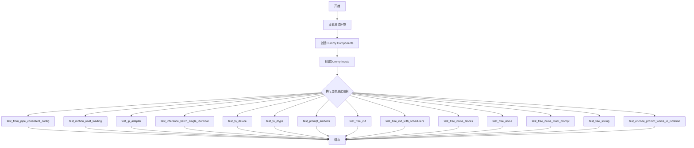

## 类结构

```
unittest.TestCase
├── IPAdapterTesterMixin
├── SDFunctionTesterMixin
├── PipelineTesterMixin
└── PipelineFromPipeTesterMixin
    └── AnimateDiffControlNetPipelineFastTests (测试类)
```

## 全局变量及字段


### `AnimateDiffControlNetPipelineFastTests.pipeline_class`
    
测试的管道类，指向 AnimateDiffControlNetPipeline，用于执行动画扩散控制网络管道的测试

类型：`type`
    


### `AnimateDiffControlNetPipelineFastTests.params`
    
文本到图像管道的参数集合，定义了测试所需的参数列表

类型：`frozenset`
    


### `AnimateDiffControlNetPipelineFastTests.batch_params`
    
批处理参数集合，包含文本到图像批处理参数和 conditioning_frames，用于批量推理测试

类型：`set`
    


### `AnimateDiffControlNetPipelineFastTests.required_optional_params`
    
必需的可选参数集合，定义了测试中必须支持的可选参数如 num_inference_steps、generator 等

类型：`frozenset`
    
    

## 全局函数及方法


### `to_np`

该函数是一个工具函数，用于将 PyTorch 张量（Tensor）转换为 NumPy 数组，以便于进行数值比较或使用 NumPy 进行后续处理。如果输入不是 PyTorch 张量，则直接返回原对象。

参数：

- `tensor`：`Any`，需要转换的张量或任意 Python 对象

返回值：`Any`，如果输入是 `torch.Tensor` 则返回对应的 `numpy.ndarray`，否则返回原始输入对象。

#### 流程图

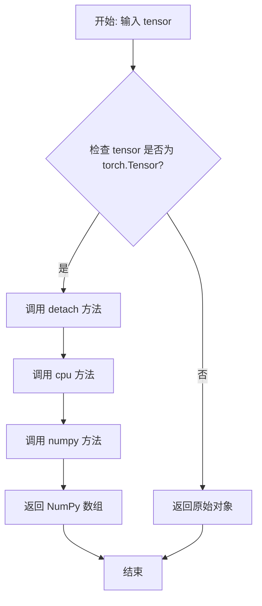

#### 带注释源码

```python
def to_np(tensor):
    """
    将 PyTorch Tensor 转换为 NumPy 数组的辅助函数。
    
    参数:
        tensor: 任意类型，通常是 torch.Tensor，但也可以是其他类型
        
    返回:
        如果输入是 torch.Tensor，则返回对应的 NumPy 数组；
        否则直接返回原始输入对象
    """
    # 检查输入是否为 PyTorch 张量
    if isinstance(tensor, torch.Tensor):
        # detach(): 分离张量，移除梯度信息
        # cpu(): 将张量从 GPU 移动到 CPU（NumPy 只支持 CPU 张量）
        # numpy(): 将张量转换为 NumPy 数组
        tensor = tensor.detach().cpu().numpy()

    # 返回转换后的张量或原始对象
    return tensor
```


### `AnimateDiffControlNetPipelineFastTests.get_dummy_components`

该方法用于创建并返回一个包含AnimateDiffControlNetPipeline所需的所有虚拟（测试用）组件的字典，包括UNet、ControlNet、VAE、调度器、文本编码器、tokenizer和运动适配器等，用于单元测试。

参数：

- 该方法无显式参数（隐式参数`self`为测试类实例）

返回值：`Dict[str, Any]`，返回一个包含所有虚拟组件的字典，用于初始化`AnimateDiffControlNetPipeline`进行测试

#### 流程图

```mermaid
flowchart TD
    A[开始 get_dummy_components] --> B[设置交叉注意力维度 cross_attention_dim = 8]
    B --> C[设置块输出通道 block_out_channels = (8, 8)]
    C --> D[设置随机种子 torch.manual_seed(0)]
    D --> E[创建 UNet2DConditionModel]
    E --> F[创建 DDIMScheduler]
    F --> G[设置随机种子 torch.manual_seed(0)]
    G --> H[创建 ControlNetModel]
    H --> I[设置随机种子 torch.manual_seed(0)]
    I --> J[创建 AutoencoderKL]
    J --> K[设置随机种子 torch.manual_seed(0)]
    K --> L[创建 CLIPTextConfig]
    L --> M[创建 CLIPTextModel]
    M --> N[创建 CLIPTokenizer]
    N --> O[创建 MotionAdapter]
    O --> P[组装 components 字典]
    P --> Q[返回 components]
```

#### 带注释源码

```
def get_dummy_components(self):
    """
    创建用于测试的虚拟组件集合
    
    该方法生成一个包含AnimateDiffControlNetPipeline所需的所有虚拟模型组件的字典。
    所有组件都使用相同的随机种子(0)以确保测试的可重复性。
    """
    # 定义交叉注意力维度，用于控制注意力机制的参数量
    cross_attention_dim = 8
    # 定义UNet和ControlNet的块输出通道数
    block_out_channels = (8, 8)

    # 设置随机种子确保UNet模型的可重复性
    torch.manual_seed(0)
    # 创建UNet2DConditionModel: 用于去噪的UNet模型
    # 参数说明:
    #   - block_out_channels: 输出通道数 (8, 8)
    #   - layers_per_block: 每块层数 2
    #   - sample_size: 样本大小 8
    #   - in_channels/out_channels: 输入输出通道数 4
    #   - down_block_types/up_block_types: 上下采样块类型
    #   - cross_attention_dim: 交叉注意力维度 8
    #   - norm_num_groups: 归一化组数 2
    unet = UNet2DConditionModel(
        block_out_channels=block_out_channels,
        layers_per_block=2,
        sample_size=8,
        in_channels=4,
        out_channels=4,
        down_block_types=("CrossAttnDownBlock2D", "DownBlock2D"),
        up_block_types=("CrossAttnUpBlock2D", "UpBlock2D"),
        cross_attention_dim=cross_attention_dim,
        norm_num_groups=2,
    )
    # 创建DDIMScheduler: 用于扩散模型推理的调度器
    # 参数说明:
    #   - beta_start/beta_end: beta值范围
    #   - beta_schedule: beta调度方式
    #   - clip_sample: 是否裁剪样本
    scheduler = DDIMScheduler(
        beta_start=0.00085,
        beta_end=0.012,
        beta_schedule="linear",
        clip_sample=False,
    )
    # 重新设置随机种子以确保ControlNet的可重复性
    torch.manual_seed(0)
    # 创建ControlNetModel: 用于提供条件控制的模型
    # 参数说明:
    #   - in_channels: 输入通道数 4
    #   - conditioning_embedding_out_channels: 条件嵌入输出通道 (8, 8)
    #   - norm_num_groups: 归一化组数 1
    controlnet = ControlNetModel(
        block_out_channels=block_out_channels,
        layers_per_block=2,
        in_channels=4,
        down_block_types=("CrossAttnDownBlock2D", "DownBlock2D"),
        cross_attention_dim=cross_attention_dim,
        conditioning_embedding_out_channels=(8, 8),
        norm_num_groups=1,
    )
    # 重新设置随机种子以确保VAE的可重复性
    torch.manual_seed(0)
    # 创建AutoencoderKL: 用于变分自编码器，进行潜在空间的编码和解码
    # 参数说明:
    #   - in_channels/out_channels: 输入输出通道数 3 (RGB图像)
    #   - latent_channels: 潜在空间通道数 4
    #   - down_block_types/up_block_types: 编码器/解码器块类型
    vae = AutoencoderKL(
        block_out_channels=block_out_channels,
        in_channels=3,
        out_channels=3,
        down_block_types=["DownEncoderBlock2D", "DownEncoderBlock2D"],
        up_block_types=["UpDecoderBlock2D", "UpDecoderBlock2D"],
        latent_channels=4,
        norm_num_groups=2,
    )
    # 重新设置随机种子以确保文本编码器的可重复性
    torch.manual_seed(0)
    # 创建CLIPTextConfig: CLIP文本编码器的配置
    # 参数说明:
    #   - hidden_size: 隐藏层大小 (等于cross_attention_dim)
    #   - intermediate_size: 中间层大小 37
    #   - num_attention_heads: 注意力头数 4
    #   - num_hidden_layers: 隐藏层数 5
    #   - vocab_size: 词汇表大小 1000
    #   - bos_token_id/eos_token_id/pad_token_id: 特殊token ID
    text_encoder_config = CLIPTextConfig(
        bos_token_id=0,
        eos_token_id=2,
        hidden_size=cross_attention_dim,
        intermediate_size=37,
        layer_norm_eps=1e-05,
        num_attention_heads=4,
        num_hidden_layers=5,
        pad_token_id=1,
        vocab_size=1000,
    )
    # 创建CLIPTextModel: 基于CLIP的文本编码器
    text_encoder = CLIPTextModel(text_encoder_config)
    # 创建CLIPTokenizer: 用于将文本 token 化
    # 使用预训练的小型随机CLIP模型
    tokenizer = CLIPTokenizer.from_pretrained("hf-internal-testing/tiny-random-clip")
    # 创建MotionAdapter: 用于动画扩散的运动适配器
    # 参数说明:
    #   - motion_layers_per_block: 每块的运动层数 2
    #   - motion_norm_num_groups: 运动归一化组数 2
    #   - motion_num_attention_heads: 运动注意力头数 4
    motion_adapter = MotionAdapter(
        block_out_channels=block_out_channels,
        motion_layers_per_block=2,
        motion_norm_num_groups=2,
        motion_num_attention_heads=4,
    )

    # 组装所有组件到字典中
    # 键名对应pipeline的构造函数参数名
    # feature_extractor 和 image_encoder 设为 None，因为IP Adapter测试中未使用
    components = {
        "unet": unet,
        "controlnet": controlnet,
        "scheduler": scheduler,
        "vae": vae,
        "motion_adapter": motion_adapter,
        "text_encoder": text_encoder,
        "tokenizer": tokenizer,
        "feature_extractor": None,
        "image_encoder": None,
    }
    return components
```


### `AnimateDiffControlNetPipelineFastTests.get_dummy_inputs`

该方法用于生成测试所需的虚拟输入参数，模拟 AnimateDiffControlNetPipeline 推理时所需的 prompt、conditioning_frames、generator 等配置信息，以便在没有真实模型的情况下进行单元测试。

参数：

- `device`：`torch.device`，指定生成器和张量所在的设备（如 "cpu", "cuda", "mps"）
- `seed`：`int`，随机种子，默认值为 0，用于确保测试结果的可重复性
- `num_frames`：`int`，生成的视频帧数，默认值为 2

返回值：`Dict[str, Any]`，包含模型推理所需的所有输入参数的字典

#### 流程图

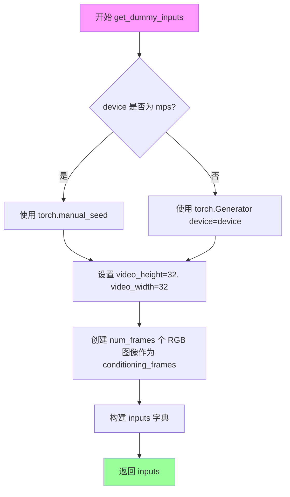

#### 带注释源码

```python
def get_dummy_inputs(self, device, seed: int = 0, num_frames: int = 2):
    """
    生成用于测试 AnimateDiffControlNetPipeline 的虚拟输入参数。
    
    Args:
        device: 目标设备，用于创建随机数生成器
        seed: 随机种子，确保测试可重复
        num_frames: 生成的视频帧数
    
    Returns:
        包含推理所需参数的字典
    """
    # 根据设备类型选择随机数生成方式
    # MPS 设备使用 torch.manual_seed，其他设备使用 torch.Generator
    if str(device).startswith("mps"):
        generator = torch.manual_seed(seed)
    else:
        generator = torch.Generator(device=device).manual_seed(seed)

    # 设置虚拟视频的分辨率
    video_height = 32
    video_width = 32
    
    # 创建 conditioning_frames 列表，用于 ControlNet 条件控制
    # 每个元素是一个 32x32 的 RGB 空白图像
    conditioning_frames = [Image.new("RGB", (video_width, video_height))] * num_frames

    # 构建完整的输入参数字典
    inputs = {
        "prompt": "A painting of a squirrel eating a burger",  # 文本提示
        "conditioning_frames": conditioning_frames,            # ControlNet 条件帧
        "generator": generator,                                # 随机数生成器
        "num_inference_steps": 2,                              # 推理步数
        "num_frames": num_frames,                              # 输出帧数
        "guidance_scale": 7.5,                                 # CFG 引导强度
        "output_type": "pt",                                   # 输出类型为 PyTorch 张量
    }
    return inputs
```


### `AnimateDiffControlNetPipelineFastTests.test_from_pipe_consistent_config`

该测试方法验证了在使用 `from_pipe` 方法在不同 Pipeline 类之间转换时，配置信息保持一致性。具体流程为：先创建一个原始的 `StableDiffusionPipeline`，然后将其转换为目标 `AnimateDiffControlNetPipeline`，再从目标 Pipeline 转回原始 Pipeline，最后比较原始配置和最终配置是否完全一致。

参数：

- 该方法无显式参数（隐含参数 `self` 为测试类实例）

返回值：`None`，通过断言验证配置一致性

#### 流程图

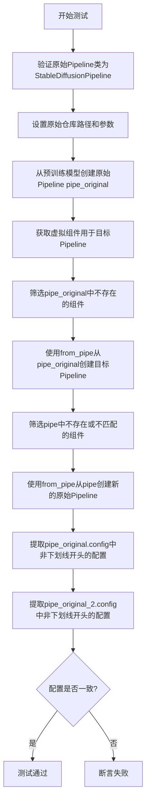

#### 带注释源码

```python
def test_from_pipe_consistent_config(self):
    # 验证原始pipeline类是否为StableDiffusionPipeline
    assert self.original_pipeline_class == StableDiffusionPipeline
    
    # 定义原始模型仓库和额外参数
    original_repo = "hf-internal-testing/tinier-stable-diffusion-pipe"
    original_kwargs = {"requires_safety_checker": False}

    # 步骤1: 创建原始的StableDiffusionPipeline
    # 从预训练模型加载原始pipeline
    pipe_original = self.original_pipeline_class.from_pretrained(original_repo, **original_kwargs)

    # 步骤2: 获取目标pipeline的虚拟组件
    # 创建一组虚拟（测试用）组件用于AnimateDiffControlNetPipeline
    pipe_components = self.get_dummy_components()
    
    # 步骤3: 找出原始pipeline中不存在的额外组件
    # 筛选出pipe_original中缺少的组件，这些需要从虚拟组件中获取
    pipe_additional_components = {}
    for name, component in pipe_components.items():
        if name not in pipe_original.components:
            pipe_additional_components[name] = component

    # 步骤4: 使用from_pipe方法从原始pipeline创建目标pipeline
    # 将StableDiffusionPipeline转换为AnimateDiffControlNetPipeline
    pipe = self.pipeline_class.from_pipe(pipe_original, **pipe_additional_components)

    # 步骤5: 找出目标pipeline中不存在的原始组件
    # 筛选出pipe中缺少或不匹配类型的组件
    original_pipe_additional_components = {}
    for name, component in pipe_original.components.items():
        if name not in pipe.components or not isinstance(component, pipe.components[name].__class__):
            original_pipe_additional_components[name] = component

    # 步骤6: 使用from_pipe方法从目标pipeline创建新的原始pipeline
    # 将AnimateDiffControlNetPipeline转回StableDiffusionPipeline
    pipe_original_2 = self.original_pipeline_class.from_pipe(pipe, **original_pipe_additional_components)

    # 步骤7: 比较配置一致性
    # 提取原始配置，排除以下划线开头的内部配置
    original_config = {k: v for k, v in pipe_original.config.items() if not k.startswith("_")}
    original_config_2 = {k: v for k, v in pipe_original_2.config.items() if not k.startswith("_")}
    
    # 断言：转换后的配置应与原始配置一致
    assert original_config_2 == original_config
```


### `AnimateDiffControlNetPipelineFastTests.test_motion_unet_loading`

该方法是一个单元测试，用于验证 `AnimateDiffControlNetPipeline` 在实例化时能够正确加载 motion UNet（`UNetMotionModel`）而非普通的 `UNet2DConditionModel`。测试通过获取虚拟组件并使用管道类实例化管道，然后断言管道中的 unet 属性是 `UNetMotionModel` 的实例。

参数：

- `self`：测试类的实例方法，无需显式传递参数

返回值：`None`，该方法为测试方法，无返回值（通过断言验证逻辑）

#### 流程图

```mermaid
flowchart TD
    A[开始测试 test_motion_unet_loading] --> B[调用 get_dummy_components 获取虚拟组件]
    B --> C[使用 pipeline_class 实例化管道: pipe = AnimateDiffControlNetPipeline(**components)]
    C --> D{断言检查}
    D -->|通过| E[pipe.unet 是 UNetMotionModel 实例]
    D -->|失败| F[抛出 AssertionError]
    E --> G[测试通过]
    F --> G
```

#### 带注释源码

```python
def test_motion_unet_loading(self):
    """
    测试方法：验证 AnimateDiffControlNetPipeline 正确加载 motion UNet
    
    该测试确保管道在实例化时使用 UNetMotionModel 而不是普通的 UNet2DConditionModel。
    这是 AnimateDiff 管道与标准 Stable Diffusion 管道的关键区别。
    """
    # 步骤1: 获取虚拟组件
    # 调用 get_dummy_components 方法创建用于测试的虚拟（dummy）组件
    # 这些组件是轻量级的模型配置，用于快速测试
    components = self.get_dummy_components()
    
    # 步骤2: 实例化管道
    # 使用虚拟组件实例化 AnimateDiffControlNetPipeline
    # 这会触发管道的 __init__ 方法，其中会创建或转换 UNet 模型
    pipe = self.pipeline_class(**components)
    
    # 步骤3: 断言验证
    # 验证管道中的 unet 属性是 UNetMotionModel 的实例
    # AnimateDiff 管道在内部会将 UNet2DConditionModel 转换为 UNetMotionModel
    # 以支持视频/动画生成的时间步处理
    assert isinstance(pipe.unet, UNetMotionModel)
```


### `AnimateDiffControlNetPipelineFastTests.test_attention_slicing_forward_pass`

该方法是一个单元测试，用于测试 AnimateDiffControlNetPipeline 的注意力切片（attention slicing）前向传播功能。但由于该 pipeline 未启用注意力切片功能，此测试被跳过，方法体为空实现。

参数：

- `self`：隐式参数，类型为 `AnimateDiffControlNetPipelineFastTests`，表示测试类实例本身

返回值：`None`，无返回值（方法体仅包含 `pass` 语句）

#### 流程图

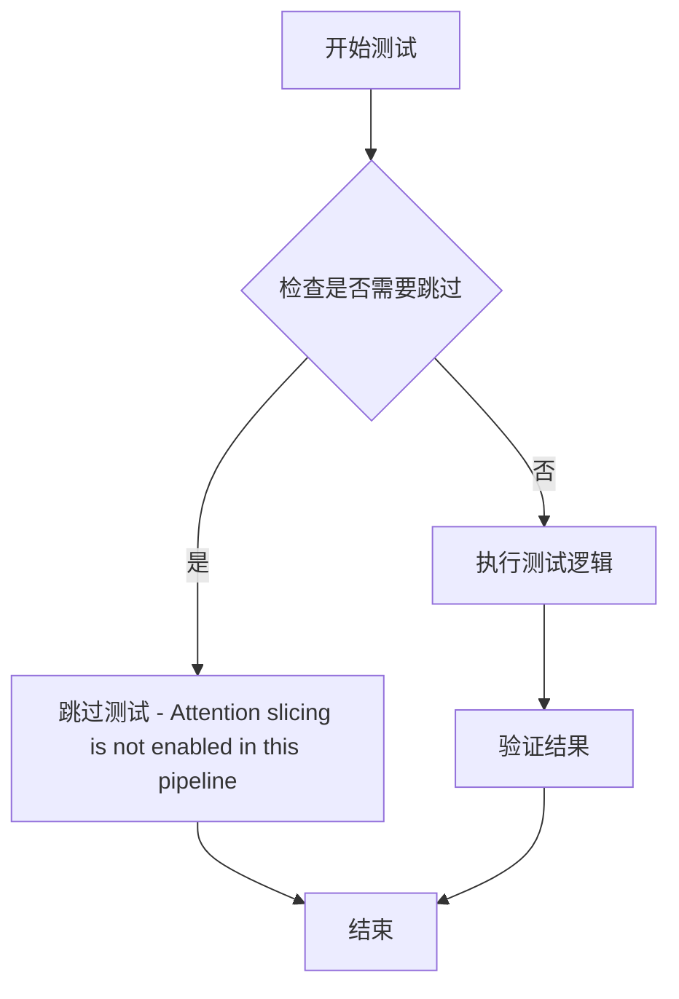

#### 带注释源码

```python
@unittest.skip("Attention slicing is not enabled in this pipeline")
def test_attention_slicing_forward_pass(self):
    """
    测试注意力切片前向传播。
    
    该测试用于验证 AnimateDiffControlNetPipeline 的注意力切片功能。
    由于当前 pipeline 版本未启用注意力切片功能，测试被跳过。
    
    注意：
    - 该测试方法体为空（仅包含 pass 语句）
    - 使用 @unittest.skip 装饰器跳过执行
    - 跳过原因：pipeline 配置中未启用 attention_slicing
    """
    pass
```

---

### 补充信息

**关键组件信息：**

- **AnimateDiffControlNetPipeline**：结合了 AnimateDiff 动画生成能力和 ControlNet 条件控制能力的图像/视频生成管道
- **UNet2DConditionModel**：条件扩散模型的核心网络结构
- **ControlNetModel**：用于条件图像控制的神经网络
- **MotionAdapter**：为静态扩散模型添加时间维度动画能力的适配器

**潜在技术债务或优化空间：**

1. **跳过的测试**：该测试被永久跳过，若未来需要启用注意力切片功能，需要重新实现测试逻辑
2. **测试覆盖不完整**：作为重要的性能优化特性，注意力切片的测试缺失可能导致该功能出现问题时无法及时发现

**其他项目：**

- **设计目标**：测试通过时注意力切片应能减少显存占用，同时保持输出质量
- **错误处理**：由于测试被跳过，无实际错误处理逻辑
- **外部依赖**：依赖 diffusers 库中的 `AnimateDiffControlNetPipeline` 类实现


### `AnimateDiffControlNetPipelineFastTests.test_ip_adapter`

该方法是 AnimateDiffControlNetPipeline 的快速测试套件中的一部分，用于测试 IP Adapter 功能。它根据当前设备类型设置不同的预期输出切片值，然后调用父类的 test_ip_adapter 方法执行实际的 IP Adapter 集成测试。

参数：

- 该方法无显式参数（隐式接收 `self`，即测试类实例）

返回值：`unittest.TestCase.test_ip_adapter` 的返回值，父类方法的测试结果（通常为 None 或 TestCase 实例）

#### 流程图

```mermaid
flowchart TD
    A[开始 test_ip_adapter] --> B{torch_device == 'cpu'?}
    B -->|是| C[设置 expected_pipe_slice 为 CPU 预期值数组]
    B -->|否| D[expected_pipe_slice 保持为 None]
    C --> E[调用 super().test_ip_adapter]
    D --> E
    E --> F[返回父类测试结果]
    F --> G[结束]
```

#### 带注释源码

```python
def test_ip_adapter(self):
    """
    测试 IP Adapter 功能
    IP Adapter 是一种图像提示适配器，用于将图像信息注入到扩散模型的生成过程中
    """
    # 初始化预期输出切片为 None
    expected_pipe_slice = None
    
    # 根据设备类型设置不同的预期输出值
    # CPU 设备使用预定义的基准值进行对比验证
    if torch_device == "cpu":
        expected_pipe_slice = np.array(
            [
                0.6604,
                0.4099,
                0.4928,
                0.5706,
                0.5096,
                0.5012,
                0.6051,
                0.5169,
                0.5021,
                0.4864,
                0.4261,
                0.5779,
                0.5822,
                0.4049,
                0.5253,
                0.6160,
                0.4150,
                0.5155,
            ]
        )
    
    # 调用父类的 test_ip_adapter 方法执行实际测试
    # 父类 IPAdapterTesterMixin.test_ip_adapter 会验证：
    # 1. 图像编码器正确处理输入图像
    # 2. IP Adapter 权重正确注入到 UNet 的注意力层
    # 3. 输出结果与预期值匹配
    return super().test_ip_adapter(expected_pipe_slice=expected_pipe_slice)
```


### `AnimateDiffControlNetPipelineFastTests.test_dict_tuple_outputs_equivalent`

该方法是一个测试用例，用于验证 AnimateDiffControlNetPipeline 管道在字典格式输出和元组格式输出时的结果是否等价。它首先根据当前设备（CPU）设置期望的输出切片，然后调用父类的同名测试方法来完成验证。

参数：

- `self`：`AnimateDiffControlNetPipelineFastTests`，测试类实例本身，包含管道配置和测试辅助方法
- `expected_slice`：`numpy.ndarray`，可选参数，期望的输出切片值，用于在 CPU 设备上进行结果验证

返回值：`unittest.TestCase` 或 `None`，返回父类测试方法的执行结果

#### 流程图

```mermaid
flowchart TD
    A[开始 test_dict_tuple_outputs_equivalent] --> B{torch_device == 'cpu'?}
    B -->|是| C[设置 expected_slice = np.array([0.6051, 0.5169, 0.5021, 0.6160, 0.4150, 0.5155])]
    B -->|否| D[expected_slice = None]
    C --> E[调用 super().test_dict_tuple_outputs_equivalent(expected_slice=expected_slice)]
    D --> E
    E --> F[返回测试结果]
```

#### 带注释源码

```python
def test_dict_tuple_outputs_equivalent(self):
    """
    测试管道字典输出和元组输出是否等价
    
    该测试方法继承自测试混合类，用于验证管道在不同输出格式下
    （字典格式 return_dict=True vs 元组格式 return_dict=False）
    产生的结果是否一致。
    """
    # 初始化期望切片值，用于CPU设备上的结果验证
    expected_slice = None
    
    # 根据设备类型设置期望的输出切片
    # CPU设备有特定的预期输出数值，用于断言验证
    if torch_device == "cpu":
        expected_slice = np.array([0.6051, 0.5169, 0.5021, 0.6160, 0.4150, 0.5155])
    
    # 调用父类（PipelineTesterMixin或SDFunctionTesterMixin）的测试方法
    # 传递期望切片参数，执行实际的输出等价性验证逻辑
    return super().test_dict_tuple_outputs_equivalent(expected_slice=expected_slice)
```


### `AnimateDiffControlNetPipelineFastTests.test_inference_batch_single_identical`

该方法用于测试 AnimateDiffControlNetPipeline 管道在批处理推理时与单次推理结果的一致性，确保批处理不会引入额外的数值误差。

参数：

- `self`：`AnimateDiffControlNetPipelineFastTests`，测试类实例本身
- `batch_size`：`int`，批处理大小，默认为 2
- `expected_max_diff`：`float`，期望的最大差异阈值，默认为 1e-4
- `additional_params_copy_to_batched_inputs`：`list`，需要复制到批处理输入的额外参数列表，默认为 `["num_inference_steps"]`

返回值：`None`，该方法为测试方法，通过断言验证管道行为的正确性

#### 流程图

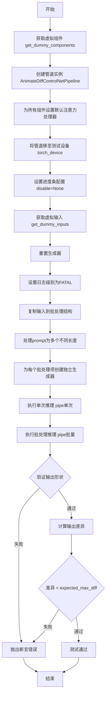

#### 带注释源码

```python
def test_inference_batch_single_identical(
    self,
    batch_size=2,
    expected_max_diff=1e-4,
    additional_params_copy_to_batched_inputs=["num_inference_steps"],
):
    """
    测试批处理推理与单次推理的一致性
    
    参数:
        batch_size: 批处理大小
        expected_max_diff: 期望的最大差异阈值
        additional_params_copy_to_batched_inputs: 需要复制到批处理输入的参数列表
    """
    # 1. 获取预定义的虚拟组件（UNet, ControlNet, VAE, Scheduler等）
    components = self.get_dummy_components()
    
    # 2. 使用虚拟组件创建AnimateDiffControlNetPipeline管道实例
    pipe = self.pipeline_class(**components)
    
    # 3. 为所有支持该方法的组件设置默认注意力处理器
    # 确保测试环境的一致性
    for components in pipe.components.values():
        if hasattr(components, "set_default_attn_processor"):
            components.set_default_attn_processor()

    # 4. 将管道移至测试设备（如CUDA或CPU）
    pipe.to(torch_device)
    
    # 5. 设置进度条配置（disable=None表示启用进度条）
    pipe.set_progress_bar_config(disable=None)
    
    # 6. 获取用于单次推理的虚拟输入
    inputs = self.get_dummy_inputs(torch_device)
    
    # 7. 重置生成器，确保输入的generator被正确初始化
    # 防止get_dummy_inputs中可能产生的生成器状态影响测试
    inputs["generator"] = self.get_generator(0)

    # 8. 获取日志记录器并设置日志级别为FATAL
    # 减少测试过程中的日志输出
    logger = logging.get_logger(pipe.__module__)
    logger.setLevel(level=diffusers.logging.FATAL)

    # 9. 准备批处理输入
    # 复制原始输入到batched_inputs字典
    batched_inputs = {}
    batched_inputs.update(inputs)

    # 10. 遍历批处理参数，对每个参数进行批处理化
    for name in self.batch_params:
        if name not in inputs:
            continue

        value = inputs[name]
        
        # 特殊处理prompt：创建不同长度的prompts
        # 第一个prompt最短，最后一个prompt最长（100个"very long"）
        if name == "prompt":
            len_prompt = len(value)
            batched_inputs[name] = [value[: len_prompt // i] for i in range(1, batch_size + 1)]
            batched_inputs[name][-1] = 100 * "very long"

        # 其他参数：复制batch_size份
        else:
            batched_inputs[name] = batch_size * [value]

    # 11. 为批处理中的每个样本创建独立的生成器
    # 确保每个样本使用不同的随机种子
    if "generator" in inputs:
        batched_inputs["generator"] = [self.get_generator(i) for i in range(batch_size)]

    # 12. 设置批处理大小
    if "batch_size" in inputs:
        batched_inputs["batch_size"] = batch_size

    # 13. 复制额外参数到批处理输入
    for arg in additional_params_copy_to_batched_inputs:
        batched_inputs[arg] = inputs[arg]

    # 14. 执行单次推理（非批处理）
    output = pipe(**inputs)
    
    # 15. 执行批处理推理
    output_batch = pipe(**batched_inputs)

    # 16. 验证批处理输出的第一维（帧数）等于batch_size
    assert output_batch[0].shape[0] == batch_size

    # 17. 计算单次推理与批处理推理结果的差异
    # 比较第一个样本的结果
    max_diff = np.abs(to_np(output_batch[0][0]) - to_np(output[0][0])).max()
    
    # 18. 断言：差异必须小于期望的最大差异阈值
    assert max_diff < expected_max_diff
```


### `AnimateDiffControlNetPipelineFastTests.test_to_device`

这是一个单元测试方法，用于验证 `AnimateDiffControlNetPipeline` 能够在不同计算设备（CPU 和 CUDA）之间正确迁移，并确保在设备迁移后管道能够正常执行推理且输出不包含 NaN 值。

参数：
- `self`：`AnimateDiffControlNetPipelineFastTests`，测试类实例本身，无需显式传递

返回值：`None`，该方法为单元测试方法，通过 `assert` 语句进行断言验证，不返回具体值

#### 流程图

```mermaid
flowchart TD
    A[开始测试 test_to_device] --> B[获取虚拟组件: get_dummy_components]
    B --> C[创建管道实例: pipeline_class]
    C --> D[禁用进度条显示]
    D --> E[将管道移至 CPU: pipe.to('cpu')]
    E --> F[提取所有组件的设备类型]
    F --> G{所有组件设备是否为 CPU?}
    G -->|是| H[使用 CPU 执行推理]
    G -->|否| I[断言失败 - 测试不通过]
    H --> J{输出包含 NaN?}
    J -->|否| K[将管道移至目标设备: torch_device]
    J -->|是| L[断言失败 - 测试不通过]
    K --> M[提取所有组件的设备类型]
    M --> N{所有组件设备是否为目标设备?}
    N -->|是| O[使用目标设备执行推理]
    N -->|否| P[断言失败 - 测试不通过]
    O --> Q{输出包含 NaN?}
    Q -->|否| R[测试通过]
    Q -->|是| S[断言失败 - 测试不通过]
```

#### 带注释源码

```python
@require_accelerator  # 装饰器：仅在有 accelerator（GPU）可用时运行此测试
def test_to_device(self):
    """
    测试管道在 CPU 和 CUDA 设备之间的设备迁移功能。
    验证：
    1. 管道组件能够正确迁移到指定设备
    2. 设备迁移后管道能够正常执行推理
    3. 推理输出不包含 NaN 值（数值稳定性）
    """
    
    # 第一步：准备测试环境
    # 获取虚拟（dummy）组件，用于模拟真实模型的配置
    components = self.get_dummy_components()
    
    # 使用虚拟组件创建 AnimateDiffControlNetPipeline 管道实例
    pipe = self.pipeline_class(**components)
    
    # 配置进度条显示：disable=None 表示不禁用进度条
    pipe.set_progress_bar_config(disable=None)

    # 第二步：测试 CPU 设备迁移
    # 将整个管道（包括所有组件）迁移到 CPU 设备
    pipe.to("cpu")
    
    # 从管道的所有组件中提取具有 device 属性的组件设备类型
    # 注意：管道内部会创建新的 motion UNet，因此需要从 pipe.components 获取
    model_devices = [
        component.device.type 
        for component in pipe.components.values() 
        if hasattr(component, "device")  # 过滤掉没有 device 属性的组件
    ]
    
    # 断言：确保所有组件都已成功迁移到 CPU
    self.assertTrue(all(device == "cpu" for device in model_devices))

    # 使用 CPU 执行推理，获取输出
    # get_dummy_inputs("cpu") 返回虚拟输入参数
    output_cpu = pipe(**self.get_dummy_inputs("cpu"))[0]
    
    # 断言：确保 CPU 推理输出不包含 NaN 值（数值稳定性检查）
    self.assertTrue(np.isnan(output_cpu).sum() == 0)

    # 第三步：测试目标设备（通常是 CUDA）迁移
    # 将管道从 CPU 迁移到目标设备（torch_device）
    pipe.to(torch_device)
    
    # 再次提取所有组件的设备类型
    model_devices = [
        component.device.type 
        for component in pipe.components.values() 
        if hasattr(component, "device")
    ]
    
    # 断言：确保所有组件都已成功迁移到目标设备
    self.assertTrue(all(device == torch_device for device in model_devices))

    # 使用目标设备执行推理
    output_device = pipe(**self.get_dummy_inputs(torch_device))[0]
    
    # 断言：确保目标设备推理输出不包含 NaN 值
    # 使用 to_np 将张量转换为 numpy 数组后再检查 NaN
    self.assertTrue(np.isnan(to_np(output_device)).sum() == 0)
```


### `AnimateDiffControlNetPipelineFastTests.test_to_dtype`

该测试方法用于验证 AnimateDiffControlNetPipeline 管道能否正确地在不同的dtype（数据类型）之间转换。测试首先检查管道组件默认使用torch.float32，然后通过调用`pipe.to(dtype=torch.float16)`将管道转换为半精度浮点数，并验证所有模型组件的dtype是否都已正确转换为torch.float16。

参数：

- `self`：`AnimateDiffControlNetPipelineFastTests`，测试类的实例，隐含参数

返回值：`None`，该方法为单元测试方法，没有显式返回值，通过`assert`语句进行断言验证

#### 流程图

```mermaid
flowchart TD
    A[开始测试 test_to_dtype] --> B[获取虚拟组件: components = get_dummy_components]
    B --> C[创建管道实例: pipe = pipeline_class(**components)]
    C --> D[设置进度条配置: pipe.set_progress_bar_config]
    D --> E[获取所有组件的dtype列表<br>model_dtypes = [c.dtype for c in pipe.components.values() if hasattr c, 'dtype']]
    E --> F{验证所有dtype == torch.float32}
    F -->|失败| G[抛出AssertionError]
    F -->|成功| H[转换为float16: pipe.to(dtype=torch.float16)]
    H --> I[重新获取所有组件的dtype列表]
    I --> J{验证所有dtype == torch.float16}
    J -->|失败| K[抛出AssertionError]
    J -->|成功| L[测试通过]
```

#### 带注释源码

```python
def test_to_dtype(self):
    """
    测试管道能否正确转换为指定的数据类型(dtype)
    
    该测试方法验证:
    1. 管道组件默认使用 torch.float32
    2. 调用 pipe.to(dtype=torch.float16) 后，所有组件正确转换为半精度浮点数
    """
    # Step 1: 获取预定义的虚拟组件用于测试
    # 这些组件是专门构造的小型模型，用于快速测试
    components = self.get_dummy_components()
    
    # Step 2: 使用虚拟组件创建 AnimateDiffControlNetPipeline 实例
    pipe = self.pipeline_class(**components)
    
    # Step 3: 配置进度条（disable=None 表示启用进度条）
    # 这是一个通用配置，确保管道在推理时不跳过任何步骤
    pipe.set_progress_bar_config(disable=None)

    # Step 4: 获取管道中所有具有 dtype 属性的组件的数据类型
    # 遍历 pipe.components 字典中的所有组件
    # 只有具有 'dtype' 属性的组件才被纳入检查（如模型组件）
    # 不具备 dtype 的组件（如调度器、tokenizer等）会被忽略
    model_dtypes = [
        component.dtype 
        for component in pipe.components.values() 
        if hasattr(component, "dtype")
    ]
    
    # Step 5: 断言验证所有模型组件的 dtype 均为 torch.float32（单精度浮点数）
    # 这是 PyTorch 模型的默认数据类型
    self.assertTrue(
        all(dtype == torch.float32 for dtype in model_dtypes),
        "Not all model components are in float32"
    )

    # Step 6: 将整个管道转换为指定的数据类型 - torch.float16（半精度浮点数）
    # 这对于在 GPU 上加速推理和减少显存占用非常有用
    pipe.to(dtype=torch.float16)
    
    # Step 7: 重新获取转换后所有组件的 dtype
    # 用于验证转换是否成功应用到所有模型组件
    model_dtypes = [
        component.dtype 
        for component in pipe.components.values() 
        if hasattr(component, "dtype")
    ]
    
    # Step 8: 断言验证所有模型组件的 dtype 已成功转换为 torch.float16
    # 注意：pipeline 内部创建了新的 motion UNet，所以需要从 pipe.components 检查
    self.assertTrue(
        all(dtype == torch.float16 for dtype in model_dtypes),
        "Not all model components are in float16 after conversion"
    )
```


### `AnimateDiffControlNetPipelineFastTests.test_prompt_embeds`

该测试方法用于验证 AnimateDiffControlNetPipeline 能否正确处理直接传入的 prompt_embeds 参数，而非通过文本编码器生成的 prompt。它通过创建带有虚拟组件的管道实例，移除 prompt 并替换为随机生成的 prompt_embeds，然后执行推理来验证管道对此类输入的处理能力。

参数：

- `self`：隐式参数，测试类实例本身

返回值：`None`，该方法为测试用例，无返回值

#### 流程图

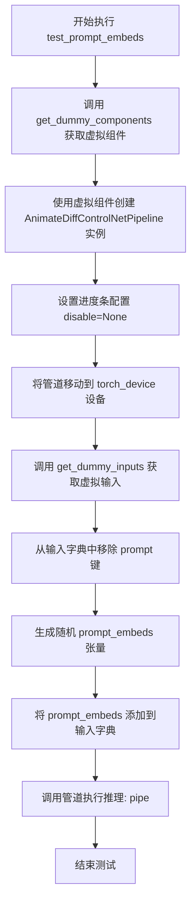

#### 带注释源码

```python
def test_prompt_embeds(self):
    # 获取预定义的虚拟组件（UNet、ControlNet、VAE、文本编码器等）
    components = self.get_dummy_components()
    
    # 使用虚拟组件实例化 AnimateDiffControlNetPipeline
    pipe = self.pipeline_class(**components)
    
    # 配置进度条：禁用进度条显示
    pipe.set_progress_bar_config(disable=None)
    
    # 将整个管道（包括所有模型组件）移动到指定设备（torch_device）
    pipe.to(torch_device)
    
    # 获取用于测试的虚拟输入参数
    inputs = self.get_dummy_inputs(torch_device)
    
    # 从输入字典中移除 'prompt' 键，模拟不提供文本提示的场景
    inputs.pop("prompt")
    
    # 创建随机初始化的 prompt_embeds 张量
    # 形状: (batch_size=1, num_tokens=4, hidden_size=文本编码器隐藏层大小)
    # 用于直接传入已编码的文本嵌入，绕过文本编码器
    inputs["prompt_embeds"] = torch.randn(
        (1, 4, pipe.text_encoder.config.hidden_size), 
        device=torch_device
    )
    
    # 执行管道推理，验证管道能正确处理 prompt_embeds 而非 prompt
    # 测试目标：确保管道支持直接使用预计算的文本嵌入
    pipe(**inputs)
```


### `AnimateDiffControlNetPipelineFastTests.test_xformers_attention_forwardGenerator_pass`

该方法是 AnimateDiffControlNetPipelineFastTests 类中的测试方法，用于验证 xformers 注意力机制的前向传播是否正常工作。它使用 `@unittest.skipIf` 装饰器条件跳过测试（仅在 CUDA 设备和 xformers 可用时执行），并调用父类的 `_test_xformers_attention_forwardGenerator_pass` 方法进行实际测试，传入 `test_mean_pixel_difference=False` 参数以禁用像素差异均值检查。

参数：

- `self`：`AnimateDiffControlNetPipelineFastTests`，测试类实例，隐式参数，用于访问类方法和属性

返回值：`None`，无返回值（测试方法，通过断言验证）

#### 流程图

```mermaid
flowchart TD
    A[开始测试 test_xformers_attention_forwardGenerator_pass] --> B{检查条件: torch_device == 'cuda' 且 xformers 可用?}
    B -- 否 --> C[跳过测试 - 原因: XFormers attention 仅在 CUDA 和 xformers 安装时可用]
    B -- 是 --> D[调用父类方法: super()._test_xformers_attention_forwardGenerator_pass test_mean_pixel_difference=False]
    D --> E{父类测试执行}
    E -- 断言通过 --> F[测试通过]
    E -- 断言失败 --> G[测试失败 - 抛出 AssertionError]
    C --> F
```

#### 带注释源码

```python
@unittest.skipIf(
    torch_device != "cuda" or not is_xformers_available(),
    reason="XFormers attention is only available with CUDA and `xformers` installed",
)
def test_xformers_attention_forwardGenerator_pass(self):
    """
    测试 xformers 注意力机制的前向传播是否正常工作。
    
    该测试方法验证 AnimateDiffControlNetPipeline 在使用 xformers 加速注意力计算时
    能否正确执行前向传播。测试仅在 CUDA 设备和 xformers 库可用时运行。
    
    参数:
        self: AnimateDiffControlNetPipelineFastTests 实例
        
    返回:
        None: 测试方法，通过 super() 调用父类测试进行验证
        
    异常:
        AssertionError: 当父类测试断言失败时抛出
    """
    # 调用父类 SDFunctionTesterMixin 的 _test_xformers_attention_forwardGenerator_pass 方法
    # 传入 test_mean_pixel_difference=False 表示不检查像素差异均值
    super()._test_xformers_attention_forwardGenerator_pass(test_mean_pixel_difference=False)
```


### `AnimateDiffControlNetPipelineFastTests.test_free_init`

该方法用于测试 AnimateDiffControlNetPipeline 的 FreeInit（自由初始化）功能，验证启用 FreeInit 后生成的视频帧与默认设置不同，而禁用后应恢复到接近默认结果。

参数：
- `self`：隐式参数，测试类实例本身

返回值：无返回值（`None`），该方法为单元测试方法，通过 `assert` 语句验证条件

#### 流程图

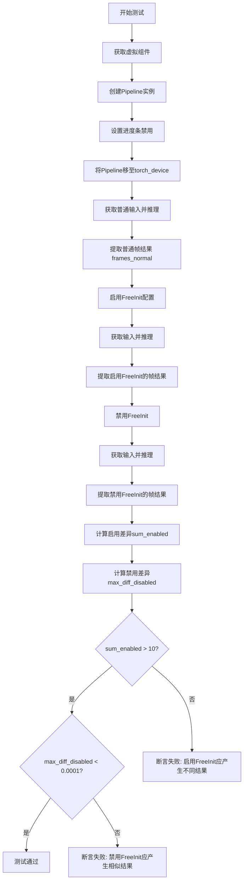

#### 带注释源码

```python
def test_free_init(self):
    """
    测试FreeInit功能：验证启用FreeInit后结果不同，禁用后结果相似
    
    FreeInit是一种用于改进视频生成质量的技术，通过初始化优化
    来减少时序噪声和提升帧间一致性
    """
    # Step 1: 获取预配置的虚拟组件（UNet, ControlNet, VAE, Scheduler等）
    components = self.get_dummy_components()
    
    # Step 2: 使用组件实例化AnimateDiffControlNetPipeline
    pipe: AnimateDiffControlNetPipeline = self.pipeline_class(**components)
    
    # Step 3: 配置进度条为禁用状态
    pipe.set_progress_bar_config(disable=None)
    
    # Step 4: 将Pipeline移至指定设备（CPU/CUDA）
    pipe.to(torch_device)

    # Step 5: 使用默认设置进行推理，获取基准帧结果
    inputs_normal = self.get_dummy_inputs(torch_device)
    frames_normal = pipe(**inputs_normal).frames[0]

    # Step 6: 配置并启用FreeInit参数
    # num_iters: 迭代次数，越多效果越好但耗时越长
    # use_fast_sampling: 是否使用快速采样
    # method: 滤波方法（butterworth/巴特沃斯滤波器）
    # order: 滤波器阶数
    # spatial_stop_frequency: 空间停止频率
    # temporal_stop_frequency: 时间停止频率
    pipe.enable_free_init(
        num_iters=2,                    # 初始化迭代次数
        use_fast_sampling=True,         # 启用快速采样
        method="butterworth",           # 使用巴特沃斯滤波器方法
        order=4,                        # 滤波器阶数为4
        spatial_stop_frequency=0.25,    # 空间停止频率25%
        temporal_stop_frequency=0.25,  # 时间停止频率25%
    )
    
    # Step 7: 使用启用FreeInit的配置进行推理
    inputs_enable_free_init = self.get_dummy_inputs(torch_device)
    frames_enable_free_init = pipe(**inputs_enable_free_init).frames[0]

    # Step 8: 禁用FreeInit，恢复默认行为
    pipe.disable_free_init()
    
    # Step 9: 使用禁用FreeInit的配置进行推理
    inputs_disable_free_init = self.get_dummy_inputs(torch_device)
    frames_disable_free_init = pipe(**inputs_disable_free_init).frames[0]

    # Step 10: 计算启用FreeInit与默认的差异总和
    # 期望差异较大（>10），证明FreeInit确实改变了生成结果
    sum_enabled = np.abs(to_np(frames_normal) - to_np(frames_enable_free_init)).sum()

    # Step 11: 计算禁用FreeInit与默认的差异最大值
    # 期望差异极小（<0.0001），证明禁用后恢复到默认行为
    max_diff_disabled = np.abs(to_np(frames_normal) - to_np(frames_disable_free_init)).max()

    # Step 12: 断言验证 - 确保启用FreeInit产生明显不同的结果
    self.assertGreater(
        sum_enabled, 
        1e1,  # 10
        "Enabling of FreeInit should lead to results different from the default pipeline results"
    )
    
    # Step 13: 断言验证 - 确保禁用FreeInit后结果接近默认
    self.assertLess(
        max_diff_disabled,
        1e-4,  # 0.0001
        "Disabling of FreeInit should lead to results similar to the default pipeline results",
    )
```


### `AnimateDiffControlNetPipelineFastTests.test_free_init_with_schedulers`

该测试方法用于验证 AnimateDiffControlNetPipeline 的 FreeInit 功能在与不同调度器（DPMSolverMultistepScheduler 和 LCMScheduler）配合使用时的正确性，通过比较启用 FreeInit 前后的生成结果差异来确保功能正常工作。

参数：

- `self`：测试类实例本身，无需显式传递

返回值：`None`，该方法为测试方法，不返回任何值

#### 流程图

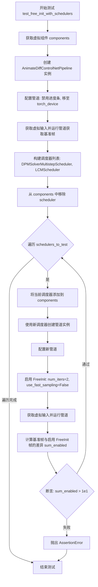

#### 带注释源码

```python
def test_free_init_with_schedulers(self):
    """
    测试 FreeInit 功能与不同调度器的兼容性。
    
    该测试方法验证 AnimateDiffControlNetPipeline 在启用 FreeInit 功能时，
    能够与多种调度器（DPMSolverMultistepScheduler、LCMScheduler）正常工作，
    并且启用 FreeInit 后生成的结果应该与基准结果有明显差异。
    """
    # Step 1: 获取用于测试的虚拟组件（UNet、ControlNet、VAE、文本编码器等）
    components = self.get_dummy_components()
    
    # Step 2: 使用虚拟组件创建 AnimateDiffControlNetPipeline 实例
    pipe: AnimateDiffControlNetPipeline = self.pipeline_class(**components)
    
    # Step 3: 配置管道：禁用进度条显示
    pipe.set_progress_bar_config(disable=None)
    
    # Step 4: 将管道移至测试设备（CPU 或 CUDA）
    pipe.to(torch_device)

    # Step 5: 使用默认设置运行管道，获取基准帧（用于后续对比）
    inputs_normal = self.get_dummy_inputs(torch_device)
    frames_normal = pipe(**inputs_normal).frames[0]

    # Step 6: 定义要测试的调度器列表
    # 这些调度器将从默认调度器配置中创建，但使用不同的参数
    schedulers_to_test = [
        # 调度器1: DPMSolverMultistepScheduler (DPM-Solver++ 算法)
        DPMSolverMultistepScheduler.from_config(
            components["scheduler"].config,
            timestep_spacing="linspace",
            beta_schedule="linear",
            algorithm_type="dpmsolver++",
            steps_offset=1,
            clip_sample=False,
        ),
        # 调度器2: LCMScheduler (Latent Consistency Model)
        LCMScheduler.from_config(
            components["scheduler"].config,
            timestep_spacing="linspace",
            beta_schedule="linear",
            steps_offset=1,
            clip_sample=False,
        ),
    ]
    
    # Step 7: 从组件字典中移除默认调度器（将在循环中重新添加）
    components.pop("scheduler")

    # Step 8: 遍历每个调度器进行测试
    for scheduler in schedulers_to_test:
        # 8.1: 将当前调度器添加到组件字典
        components["scheduler"] = scheduler
        
        # 8.2: 使用新调度器创建管道实例
        pipe: AnimateDiffControlNetPipeline = self.pipeline_class(**components)
        
        # 8.3: 配置新管道
        pipe.set_progress_bar_config(disable=None)
        pipe.to(torch_device)

        # 8.4: 启用 FreeInit 功能
        # num_iters=2: 迭代次数
        # use_fast_sampling=False: 不使用快速采样
        pipe.enable_free_init(num_iters=2, use_fast_sampling=False)

        # 8.5: 获取虚拟输入并运行管道
        inputs = self.get_dummy_inputs(torch_device)
        frames_enable_free_init = pipe(**inputs).frames[0]
        
        # 8.6: 计算基准帧与启用 FreeInit 帧之间的差异总和
        sum_enabled = np.abs(to_np(frames_normal) - to_np(frames_enable_free_init)).sum()

        # 8.7: 断言验证
        # 启用 FreeInit 后，结果应该与基准结果明显不同（差异 > 10）
        self.assertGreater(
            sum_enabled,
            1e1,
            "Enabling of FreeInit should lead to results different from the default pipeline results"
        )
```


### `AnimateDiffControlNetPipelineFastTests.test_free_noise_blocks`

这是一个单元测试方法，用于验证 AnimateDiffControlNetPipeline 的 FreeNoise 功能在启用和禁用时，motion module 中的 transformer blocks 是否被正确地转换为 FreeNoiseTransformerBlock 类型或恢复为原始类型。

参数：

- `self`：测试类实例本身，无需显式传递

返回值：`None`，测试方法无返回值，通过 assert 语句验证结果

#### 流程图

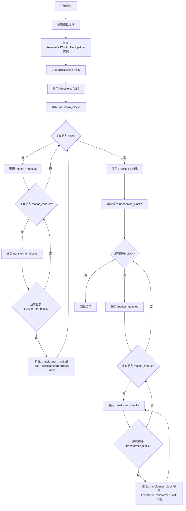

#### 带注释源码

```python
def test_free_noise_blocks(self):
    """
    测试 FreeNoise 功能启用和禁用时，motion module 的 transformer blocks 
    是否正确地在 FreeNoiseTransformerBlock 和原始类型之间切换
    """
    # 步骤1: 获取虚拟组件用于测试
    components = self.get_dummy_components()
    
    # 步骤2: 使用虚拟组件创建 AnimateDiffControlNetPipeline 实例
    pipe: AnimateDiffControlNetPipeline = self.pipeline_class(**components)
    
    # 步骤3: 配置进度条（禁用）和设备
    pipe.set_progress_bar_config(disable=None)
    pipe.to(torch_device)

    # 步骤4: 启用 FreeNoise 功能
    pipe.enable_free_noise()
    
    # 步骤5: 验证启用后，motion module 的 transformer blocks 
    #       已转换为 FreeNoiseTransformerBlock 类型
    for block in pipe.unet.down_blocks:
        for motion_module in block.motion_modules:
            for transformer_block in motion_module.transformer_blocks:
                self.assertTrue(
                    isinstance(transformer_block, FreeNoiseTransformerBlock),
                    "Motion module transformer blocks must be an instance of "
                    "`FreeNoiseTransformerBlock` after enabling FreeNoise.",
                )

    # 步骤6: 禁用 FreeNoise 功能
    pipe.disable_free_noise()
    
    # 步骤7: 验证禁用后，motion module 的 transformer blocks 
    #       已恢复为非 FreeNoiseTransformerBlock 类型
    for block in pipe.unet.down_blocks:
        for motion_module in block.motion_modules:
            for transformer_block in motion_module.transformer_blocks:
                self.assertFalse(
                    isinstance(transformer_block, FreeNoiseTransformerBlock),
                    "Motion module transformer blocks must not be an instance of "
                    "`FreeNoiseTransformerBlock` after disabling FreeNoise.",
                )
```


### `AnimateDiffControlNetPipelineFastTests.test_free_noise`

该方法是 `AnimateDiffControlNetPipelineFastTests` 类的测试方法，用于验证 FreeNoise（自由噪声）功能在 AnimateDiffControlNetPipeline 中的正确性。测试会验证启用 FreeNoise 后管道输出应与默认输出不同，而禁用后应与默认输出相似。

参数：

- `self`：测试类实例本身，无类型描述
- `context_length`：（隐式）FreeNoise 的上下文长度，默认为 8 和 9
- `context_stride`：（隐式）FreeNoise 的上下文步幅，默认为 4 和 6
- `num_frames`：（隐式）视频帧数，默认为 16

返回值：`None`，无返回值描述（该方法为 unittest 测试方法，通过断言验证行为）

#### 流程图

```mermaid
flowchart TD
    A[开始测试 test_free_noise] --> B[获取 Dummy 组件]
    B --> C[创建 AnimateDiffControlNetPipeline 实例]
    C --> D[设置进度条和设备]
    D --> E[获取普通输入 num_frames=16]
    E --> F[运行管道获取普通输出 frames_normal]
    F --> G[外层循环: context_length in [8, 9]]
    G --> H[内层循环: context_stride in [4, 6]]
    H --> I[启用 FreeNoise: pipe.enable_free_noisecontext_length, context_stride]
    I --> J[获取输入并运行管道]
    J --> K[获取启用 FreeNoise 后的输出 frames_enable_free_noise]
    K --> L[禁用 FreeNoise: pipe.disable_free_noise]
    L --> M[获取禁用 FreeNoise 后的输出]
    M --> N[计算启用 FreeNoise 后的差异 sum_enabled]
    N --> O[计算禁用 FreeNoise 后的最大差异 max_diff_disabled]
    O --> P{断言: sum_enabled > 1e1}
    P -->|通过| Q{断言: max_diff_disabled < 1e-4}
    P -->|失败| R[测试失败: 启用 FreeNoise 应产生不同结果]
    Q -->|通过| S[测试通过]
    Q -->|失败| T[测试失败: 禁用 FreeNoise 应产生相似结果]
    S --> U[继续下一组 context_length 和 context_stride 组合]
    U --> G
    G --> V[结束所有测试组合]
    H --> V
```

#### 带注释源码

```python
def test_free_noise(self):
    # 1. 获取预定义的虚拟组件（UNet、ControlNet、VAE、Scheduler等）
    components = self.get_dummy_components()
    
    # 2. 使用虚拟组件实例化 AnimateDiffControlNetPipeline 管道
    pipe: AnimateDiffControlNetPipeline = self.pipeline_class(**components)
    
    # 3. 禁用进度条显示并设置管道设备
    pipe.set_progress_bar_config(disable=None)
    pipe.to(torch_device)

    # 4. 获取普通输入（未启用 FreeNoise），num_frames=16 表示生成16帧视频
    inputs_normal = self.get_dummy_inputs(torch_device, num_frames=16)
    
    # 5. 运行管道获取默认/普通情况下的输出帧
    frames_normal = pipe(**inputs_normal).frames[0]

    # 6. 遍历不同的 context_length 和 context_stride 组合进行测试
    for context_length in [8, 9]:
        for context_stride in [4, 6]:
            # 启用 FreeNoise 功能，传入上下文长度和步幅参数
            pipe.enable_free_noise(context_length, context_stride)

            # 重新获取输入（需要重新创建 generator 以确保独立性）
            inputs_enable_free_noise = self.get_dummy_inputs(torch_device, num_frames=16)
            
            # 运行管道获取启用 FreeNoise 后的输出
            frames_enable_free_noise = pipe(**inputs_enable_free_noise).frames[0]

            # 禁用 FreeNoise 功能
            pipe.disable_free_noise()

            # 获取禁用 FreeNoise 后的输出
            inputs_disable_free_noise = self.get_dummy_inputs(torch_device, num_frames=16)
            frames_disable_free_noise = pipe(**inputs_disable_free_noise).frames[0]

            # 计算启用 FreeNoise 时的输出与默认输出的差异总和
            sum_enabled = np.abs(to_np(frames_normal) - to_np(frames_enable_free_noise)).sum()
            
            # 计算禁用 FreeNoise 时的输出与默认输出的最大差异
            max_diff_disabled = np.abs(to_np(frames_normal) - to_np(frames_disable_free_noise)).max()
            
            # 断言：启用 FreeNoise 应该产生明显不同的结果（差异总和 > 10）
            self.assertGreater(
                sum_enabled,
                1e1,
                "Enabling of FreeNoise should lead to results different from the default pipeline results"
            )
            
            # 断言：禁用 FreeNoise 应该产生与默认相似的结果（最大差异 < 0.0001）
            self.assertLess(
                max_diff_disabled,
                1e-4,
                "Disabling of FreeNoise should lead to results similar to the default pipeline results",
            )
```


### `AnimateDiffControlNetPipelineFastTests.test_free_noise_multi_prompt`

该测试方法用于验证 AnimateDiffControlNetPipeline 在启用 FreeNoise 功能时对多提示词（prompt indices）处理是否正确，包括提示词索引在有效范围内时的正常执行，以及索引超出范围时抛出 ValueError 异常。

参数：

- `self`：测试类实例本身，包含测试所需的各种辅助方法和属性

返回值：`None`，该测试方法无返回值，通过断言验证功能正确性

#### 流程图

```mermaid
flowchart TD
    A[开始测试 test_free_noise_multi_prompt] --> B[获取虚拟组件 components]
    B --> C[创建 AnimateDiffControlNetPipeline 实例]
    C --> D[设置进度条配置为不禁用]
    D --> E[将管道移至 torch_device]
    E --> F[设置 context_length=8, context_stride=4]
    F --> G[调用 pipe.enable_free_noise 启用 FreeNoise]
    G --> H[获取虚拟输入, num_frames=16]
    H --> I[设置 prompt 为字典: {0: 'Caterpillar on a leaf', 10: 'Butterfly on a leaf'}]
    I --> J[执行管道 pipe 并验证成功运行]
    J --> K[准备超出范围的提示词索引输入]
    K --> L[设置 prompt 为字典: 包含索引 42 超出范围]
    L --> M[使用 assertRaises 捕获 ValueError]
    M --> N{是否抛出 ValueError?}
    N -->|是| O[测试通过]
    N -->|否| P[测试失败]
    O --> Q[结束测试]
```

#### 带注释源码

```python
def test_free_noise_multi_prompt(self):
    """
    测试 FreeNoise 功能在多提示词场景下的行为
    
    验证点：
    1. 当 prompt indices 在 num_frames 范围内时管道正常工作
    2. 当 prompt indices 超出 num_frames 范围时抛出 ValueError
    """
    # 步骤1: 获取预定义的虚拟组件用于测试
    # 这些组件是轻量级的模拟模型，不依赖真实权重
    components = self.get_dummy_components()
    
    # 步骤2: 使用虚拟组件实例化 AnimateDiffControlNetPipeline
    # pipeline_class 指向 AnimateDiffControlNetPipeline
    pipe: AnimateDiffControlNetPipeline = self.pipeline_class(**components)
    
    # 步骤3: 配置进度条显示（disable=None 表示不禁用进度条）
    pipe.set_progress_bar_config(disable=None)
    
    # 步骤4: 将管道移至测试设备（CPU 或 CUDA）
    pipe.to(torch_device)
    
    # 步骤5: 设置 FreeNoise 参数
    # context_length: 每个上下文窗口的帧数
    # context_stride: 上下文窗口之间的步长
    context_length = 8
    context_stride = 4
    
    # 步骤6: 启用 FreeNoise 功能
    # FreeNoise 允许在生成过程中使用不同的噪声上下文
    pipe.enable_free_noise(context_length, context_stride)
    
    # 步骤7: 测试场景1 - 有效的提示词索引
    # 确保当 prompt indices 在 num_frames 范围内时管道能正常工作
    inputs = self.get_dummy_inputs(torch_device, num_frames=16)
    # prompt 字典格式: {帧索引: 提示词内容}
    # 索引 0 和 10 都在 num_frames=16 的范围内 (0-15)
    inputs["prompt"] = {0: "Caterpillar on a leaf", 10: "Butterfly on a leaf"}
    
    # 执行管道并获取结果（此处只验证能成功执行，不检查输出内容）
    # frames[0] 获取第一个视频/帧序列
    pipe(**inputs).frames[0]
    
    # 步骤8: 测试场景2 - 无效的提示词索引
    # 确保当 prompt indices 超出 num_frames 范围时抛出 ValueError
    with self.assertRaises(ValueError):
        # 准备新的输入，索引 42 超出范围（应为 0-15）
        inputs = self.get_dummy_inputs(torch_device, num_frames=16)
        inputs["prompt"] = {
            0: "Caterpillar on a leaf", 
            10: "Butterfly on a leaf", 
            42: "Error on a leaf"  # 索引 42 超出范围！
        }
        # 预期抛出 ValueError 异常
        pipe(**inputs).frames[0]
```


### `AnimateDiffControlNetPipelineFastTests.test_vae_slicing`

该方法用于测试 AnimateDiffControlNetPipeline 的 VAE slicing 功能，验证启用 VAE slicing 后解码的输出结果与未启用时的结果保持一致（误差在允许范围内）。

参数：

- `self`：隐含的 `unittest.TestCase` 实例，表示测试类本身
- `video_count`：`int`，可选参数，默认值为 `2`，指定要处理的视频数量

返回值：`None`，该方法为测试方法，使用 `assert` 语句进行断言验证，不返回具体值

#### 流程图

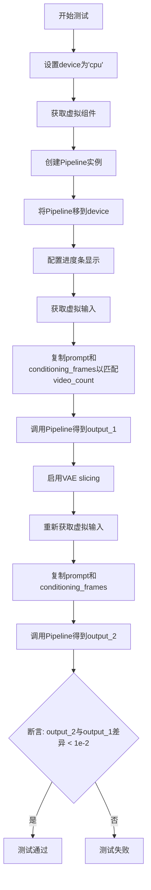

#### 带注释源码

```python
def test_vae_slicing(self, video_count=2):
    """
    测试 VAE slicing 功能
    验证启用 VAE slicing 后，解码结果与未启用时一致
    
    参数:
        video_count: 要处理的视频数量，默认值为 2
    """
    # 设置设备为 CPU，确保随机数生成器的确定性
    device = "cpu"  # ensure determinism for the device-dependent torch.Generator
    
    # 获取虚拟组件（用于测试的假模型组件）
    components = self.get_dummy_components()
    
    # 使用虚拟组件创建 Pipeline 实例
    pipe = self.pipeline_class(**components)
    
    # 将 Pipeline 移至指定设备
    pipe = pipe.to(device)
    
    # 配置进度条（disable=None 表示不禁用进度条）
    pipe.set_progress_bar_config(disable=None)
    
    # 获取虚拟输入
    inputs = self.get_dummy_inputs(device)
    
    # 复制 prompt 和 conditioning_frames 以匹配 video_count
    inputs["prompt"] = [inputs["prompt"]] * video_count
    inputs["conditioning_frames"] = [inputs["conditioning_frames"]] * video_count
    
    # 第一次调用 Pipeline（未启用 VAE slicing）
    output_1 = pipe(**inputs)
    
    # 启用 VAE slicing
    # make sure sliced vae decode yields the same result
    pipe.enable_vae_slicing()
    
    # 重新获取虚拟输入（重置随机状态）
    inputs = self.get_dummy_inputs(device)
    
    # 复制输入以匹配 video_count
    inputs["prompt"] = [inputs["prompt"]] * video_count
    inputs["conditioning_frames"] = [inputs["conditioning_frames"]] * video_count
    
    # 第二次调用 Pipeline（启用 VAE slicing）
    output_2 = pipe(**inputs)
    
    # 断言：验证两次输出的最大差异小于阈值 1e-2
    # 使用 flatten() 展平后比较，max() 获取最大差异
    assert np.abs(output_2[0].flatten() - output_1[0].flatten()).max() < 1e-2
```


### `AnimateDiffControlNetPipelineFastTests.test_encode_prompt_works_in_isolation`

该方法是一个单元测试，用于测试 `encode_prompt` 方法在隔离环境下的工作情况。它构建了一个包含设备类型、每提示生成的图像数量以及是否执行无分类器自由引导的参数字典，然后调用父类的测试方法来验证文本编码器能够正确处理这些参数。

参数：

- `self`：`AnimateDiffControlNetPipelineFastTests`（继承自 unittest.TestCase），表示测试类实例，用于访问类的属性和方法

返回值：`None` 或 `unittest.TestResult`，取决于父类 `SDFunctionTesterMixin.test_encode_prompt_works_in_isolation` 的返回值，通常测试方法返回 `None` 或测试结果对象

#### 流程图

```mermaid
flowchart TD
    A[开始测试 test_encode_prompt_works_in_isolation] --> B[构建 extra_required_param_value_dict]
    B --> C[获取 torch_device 并转换为设备类型]
    C --> D[设置 num_images_per_prompt = 1]
    D --> E[从 get_dummy_inputs 获取 guidance_scale]
    E --> F{guidance_scale > 1.0?}
    F -->|是| G[do_classifier_free_guidance = True]
    F -->|否| H[do_classifier_free_guidance = False]
    G --> I[调用父类 test_encode_prompt_works_in_isolation]
    H --> I
    I --> J[返回测试结果]
```

#### 带注释源码

```python
def test_encode_prompt_works_in_isolation(self):
    """
    测试 encode_prompt 方法在隔离环境下的工作情况。
    该测试验证文本编码器能够在特定的设备、图像数量和引导条件下正确运行。
    """
    # 构建额外的必需参数字典，用于配置测试环境
    extra_required_param_value_dict = {
        # 获取当前设备类型（如 'cuda' 或 'cpu'）
        "device": torch.device(torch_device).type,
        # 设置每提示生成的图像数量为 1
        "num_images_per_prompt": 1,
        # 根据 guidance_scale 判断是否启用无分类器自由引导
        # 如果 guidance_scale > 1.0，则启用 CFG
        "do_classifier_free_guidance": self.get_dummy_inputs(device=torch_device).get("guidance_scale", 1.0) > 1.0,
    }
    # 调用父类的测试方法，传入配置好的参数字典
    # 父类 SDFunctionTesterMixin.test_encode_prompt_works_in_isolation 会执行实际的测试逻辑
    return super().test_encode_prompt_works_in_isolation(extra_required_param_value_dict)
```

## 关键组件


### AnimateDiffControlNetPipeline

结合AnimateDiff动画生成能力与ControlNet控制能力的图像/视频生成管道，支持基于文本提示和条件帧生成动画内容。

### MotionAdapter

运动适配器模块，为基础扩散模型添加时间维度上的运动建模能力，支持生成连贯的动画序列。

### UNet2DConditionModel

条件UNet模型，扩散模型的核心骨干网络，负责在给定条件（文本嵌入、控制网络输出）下预测噪声。

### ControlNetModel

控制网络模型，从 conditioning_frames（条件帧）中提取结构化信息（如边缘、深度、姿态等），以控制生成内容的构图。

### AutoencoderKL

变分自编码器(VAE)，负责将图像压缩到潜在空间进行高效处理，以及将潜在表示解码回像素空间。

### Motion modules (motion_modules)

运动模块，包含transformer_blocks，负责在时间维度上进行特征交互，实现帧间的运动信息传递与生成。

### FreeNoiseTransformerBlock

自由噪声变换器块，支持FreeNoise机制，允许在生成过程中使用上下文感知的噪声策略，改善长视频生成的时序一致性。

### IPAdapterTesterMixin

IP适配器测试混入类，提供对图像提示适配器（IP-Adapter）功能的测试支持，该适配器允许通过图像而非仅文本作为条件进行生成。

### FreeInit

自由初始化方法，通过在推理过程中使用自定义初始化策略和滤波器（如butterworth）来改善生成质量，支持快速采样模式。

### FreeNoise

自由噪声机制，通过context_length和context_stride参数控制噪声上下文窗口，实现更长视频的时序一致性生成。

### VAE slicing

VAE切片技术，通过enable_vae_slicing()启用，将VAE解码过程分片处理以降低显存占用，适用于高分辨率视频生成。

### Scheduler (DDIMScheduler, DPMSolverMultistepScheduler, LCMScheduler)

调度器组件，控制去噪过程中的噪声调度策略，DDIM用于确定性生成，DPMSolverMultistep用于快速高质量采样，LCM用于潜在一致性模型加速。

### ControlNet conditioning_frames

条件帧系统，允许用户提供一系列图像帧作为生成的控制条件，支持基于关键帧的动画生成与控制。

### PipelineFromPipeTesterMixin

管道迁移测试混入类，测试不同管道配置间的组件迁移与配置一致性，确保from_pipe方法正确处理组件覆盖。

### XFormers attention

XFormers注意力机制优化，通过xformers库提供更高效的注意力计算，适用于CUDA环境下的显存和速度优化。


## 问题及建议


### 已知问题

- **未完成的测试实现**: `test_prompt_embeds` 方法调用了 `pipe(**inputs)` 但没有任何断言语句，导致该测试实际上不会验证任何内容。
- **魔法数字和阈值缺乏解释**: 多处使用硬编码的阈值（如 `1e-4`、`1e-2`、`1e1`）和参数（如 `context_length=8, context_stride=4`），没有注释说明这些值的含义或选择依据。
- **被跳过的功能未实现**: `test_attention_slicing_forward_pass` 被永久跳过，注释表明该pipeline未启用 attention slicing 功能，这是一个未完成的功能特性。
- **测试逻辑重复**: 获取组件、设备设置、进度条配置等代码在多个测试方法中重复出现，缺乏统一的测试辅助方法。
- **设备依赖的硬编码**: 多个测试方法中直接使用 `torch_device` 变量和条件判断 `if torch_device == "cpu"`，导致测试在不同设备上行为不一致，难以维护。
- **潜在的状态泄露风险**: 测试方法之间没有明确的隔离机制，共享的组件和状态可能造成测试间相互影响。
- **不完整的错误验证**: `test_free_noise_multi_prompt` 中的错误测试使用 `with self.assertRaises(ValueError)`，但没有验证具体的错误消息内容。

### 优化建议

- **完善测试断言**: 为 `test_prompt_embeds` 添加明确的输出验证逻辑，确保 prompt_embeds 被正确处理。
- **提取配置常量**: 将魔法数字和阈值提取为类级别常量或配置文件，并添加详细的文档注释说明其用途。
- **实现或移除被跳过的测试**: 如果 attention slicing 是计划内的功能，应实现该功能；否则应删除该测试方法。
- **创建测试辅助方法**: 封装重复的组件获取、设备设置和进度条配置代码到 `setUp` 方法或专门的辅助函数中。
- **统一设备处理逻辑**: 创建统一的设备管理辅助方法，消除跨测试方法的硬编码设备判断。
- **增强错误测试**: 为异常测试添加更具体的错误消息验证，确保捕获的异常符合预期。
- **添加测试隔离**: 在每个测试方法开始时显式重置pipeline状态，避免测试间的潜在状态泄露。

## 其它


### 设计目标与约束

本测试类的设计目标是验证 AnimateDiffControlNetPipeline 的核心功能正确性，包括 ControlNet 引导、动画生成、FreeNoise、FreeInit、IP Adapter 等特性。约束条件包括：需要 CUDA 和 xformers 才能测试某些特性（如 xformers attention），测试在 CPU 和 CUDA 设备上运行，依赖 diffusers 库的相关组件。

### 错误处理与异常设计

测试类通过 unittest 框架进行错误处理，主要包括：
- 使用 assert 语句验证预期结果
- 使用 @unittest.skip 装饰器跳过不支持的测试（如 attention slicing）
- 使用 @unittest.skipIf 装饰器在条件不满足时跳过测试（如 xformers 测试需要 CUDA）
- 使用 self.assertRaises 捕获预期异常（如 test_free_noise_multi_prompt 中测试超出范围的 prompt 索引）

### 数据流与状态机

测试数据流如下：
1. get_dummy_components() 创建虚拟组件（unet、controlnet、scheduler、vae、motion_adapter、text_encoder、tokenizer）
2. get_dummy_inputs() 生成虚拟输入（prompt、conditioning_frames、generator、num_inference_steps、num_frames、guidance_scale）
3. 测试方法使用这些虚拟组件和输入调用 pipeline
4. 验证输出的形状、类型和数值正确性

状态机转换：
- FreeInit: disable -> enable -> disable
- FreeNoise: disable -> enable -> disable

### 外部依赖与接口契约

主要外部依赖包括：
- diffusers: AnimateDiffControlNetPipeline, AutoencoderKL, ControlNetModel, DDIMScheduler, DPMSolverMultistepScheduler, LCMScheduler, MotionAdapter, StableDiffusionPipeline, UNet2DConditionModel, UNetMotionModel
- transformers: CLIPTextConfig, CLIPTextModel, CLIPTokenizer
- torch: 深度学习框架
- numpy: 数值计算
- PIL: 图像处理
- unittest: 测试框架

接口契约：
- pipeline_class: AnimateDiffControlNetPipeline
- params: TEXT_TO_IMAGE_PARAMS
- batch_params: TEXT_TO_IMAGE_BATCH_PARAMS.union({"conditioning_frames"})
- required_optional_params: 包含 num_inference_steps, generator, latents, return_dict 等

### 性能要求与基准

测试中涉及的数值容差：
- test_inference_batch_single_identical: expected_max_diff=1e-4
- test_free_init: 禁用时差异应小于 1e-4
- test_free_noise: 禁用时差异应小于 1e-4
- test_vae_slicing: 差异应小于 1e-2

### 安全考虑

测试代码不涉及敏感数据处理，所有输入均为虚拟生成的测试数据。模型加载使用公开的测试仓库 "hf-internal-testing/tinier-stable-diffusion-pipe" 和 "hf-internal-testing/tiny-random-clip"。

### 版本兼容性

测试代码依赖以下版本要求：
- torch: 支持 CPU 和 CUDA
- diffusers: 包含 AnimateDiffControlNetPipeline 的版本
- transformers: 与 diffusers 兼容的版本
- xformers: 仅在 CUDA 环境下可选使用

### 测试覆盖率

测试覆盖了以下功能：
- Pipeline 配置一致性 (test_from_pipe_consistent_config)
- Motion UNet 加载 (test_motion_unet_loading)
- IP Adapter (test_ip_adapter)
- 字典/元组输出等价性 (test_dict_tuple_outputs_equivalent)
- 批量推理一致性 (test_inference_batch_single_identical)
- 设备迁移 (test_to_device)
- 数据类型转换 (test_to_dtype)
- Prompt embeddings (test_prompt_embeds)
- XFormers attention (test_xformers_attention_forwardGenerator_pass)
- FreeInit 功能 (test_free_init, test_free_init_with_schedulers)
- FreeNoise 功能 (test_free_noise_blocks, test_free_noise, test_free_noise_multi_prompt)
- VAE slicing (test_vae_slicing)
- Prompt 编码隔离 (test_encode_prompt_works_in_isolation)

### 配置管理

测试使用虚拟组件配置：
- cross_attention_dim: 8
- block_out_channels: (8, 8)
- layers_per_block: 2
- sample_size: 8
- video_height/video_width: 32
- num_inference_steps: 2
- num_frames: 2 (默认)

### 并发与异步考虑

测试代码主要为同步执行，使用 unittest 框架的顺序执行模型。pipeline 调用为同步阻塞操作，未涉及异步处理或并发场景。

    