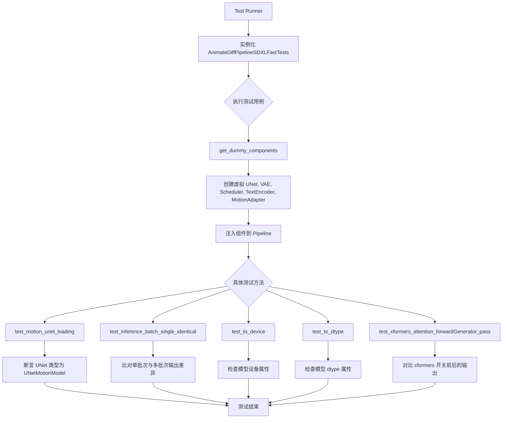
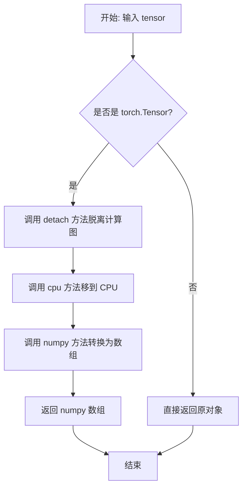
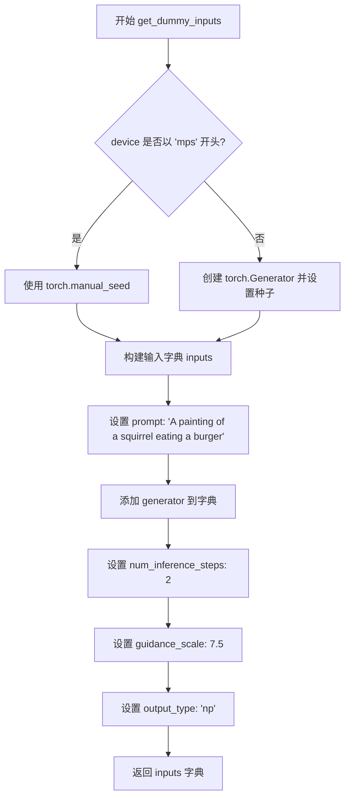
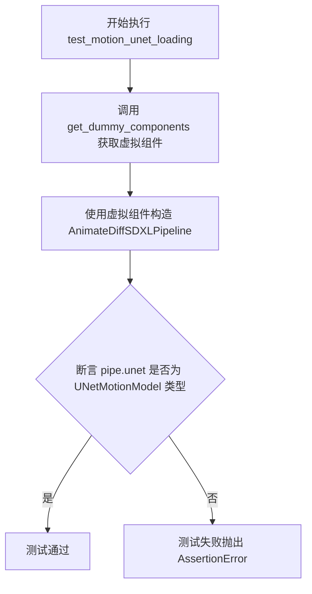
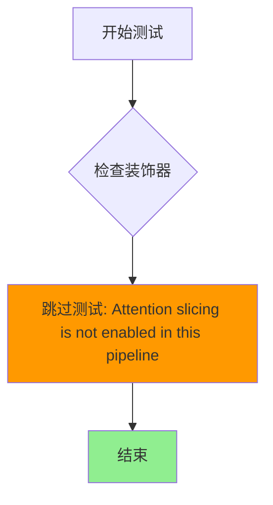
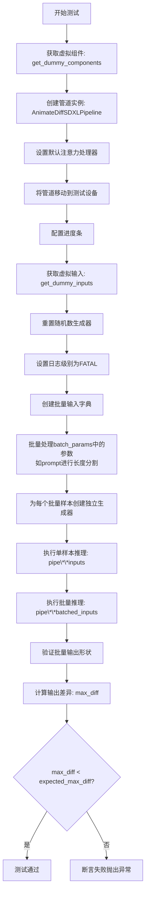
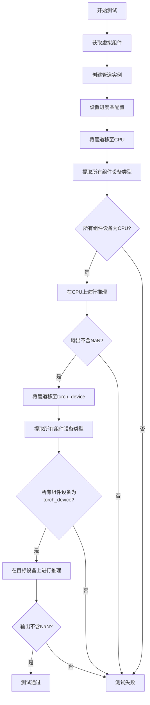
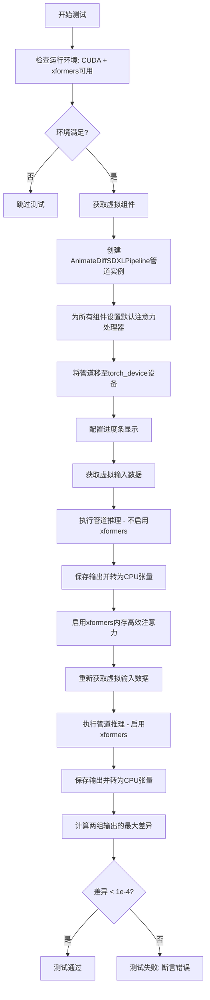
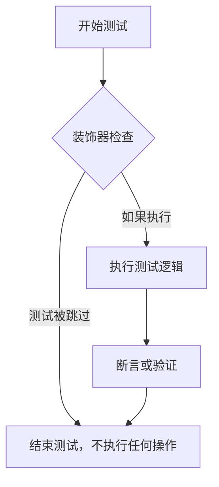

# `diffusers\tests\pipelines\animatediff\test_animatediff_sdxl.py` 详细设计文档

这是一个针对 AnimateDiffSDXLPipeline 的自动化单元测试文件，通过构建虚拟组件（Dummy Components）来验证流水线的模型加载、推理一致性、设备迁移（to_device）、数据类型转换（to_dtype）以及 xformers 内存优化等功能。

## 整体流程



## 类结构

```
unittest.TestCase (Python 标准库)
├── PipelineTesterMixin (Diffusers 测试基类)
├── SDFunctionTesterMixin (SD 函数测试Mixin)
├── IPAdapterTesterMixin (IP Adapter 测试Mixin)
└── AnimateDiffPipelineSDXLFastTests (当前测试类)
```

## 全局变量及字段


### `torch_device`
    
全局变量，表示PyTorch运行时设备标识符，如'cuda'或'cpu'

类型：`str`
    


### `is_xformers_available`
    
全局函数，用于检查xformers高效注意力机制是否可用

类型：`function`
    


### `AnimateDiffPipelineSDXLFastTests.pipeline_class`
    
类属性，指定测试所针对的管道类为AnimateDiffSDXLPipeline

类型：`type[AnimateDiffSDXLPipeline]`
    


### `AnimateDiffPipelineSDXLFastTests.params`
    
类属性，定义文本到图像生成所需的参数集合

类型：`tuple`
    


### `AnimateDiffPipelineSDXLFastTests.batch_params`
    
类属性，定义批处理模式下文本到图像生成的参数集合

类型：`tuple`
    


### `AnimateDiffPipelineSDXLFastTests.required_optional_params`
    
类属性，定义管道可选但测试中必须提供的参数集合

类型：`frozenset[str]`
    


### `AnimateDiffPipelineSDXLFastTests.callback_cfg_params`
    
类属性，定义回调函数在每步执行后需要传递的配置参数字段集合

类型：`set[str]`
    
    

## 全局函数及方法


### `to_np`

将 PyTorch 张量（Tensor）安全地转换为 NumPy 数组，以便于后续的数值计算或数据处理。

参数：

- `tensor`：`torch.Tensor`，需要转换的 PyTorch 张量对象，也可能已经是 numpy 数组

返回值：`numpy.ndarray`，转换后的 NumPy 数组，如果输入本身不是张量则直接返回原对象

#### 流程图



#### 带注释源码

```python
def to_np(tensor):
    """
    将 PyTorch张量转换为 NumPy 数组的辅助函数
    
    参数:
        tensor: torch.Tensor 或其他类型
        
    返回:
        numpy.ndarray 或原始输入
    """
    # 检查输入是否为 PyTorch 张量
    if isinstance(tensor, torch.Tensor):
        # detach(): 脱离计算图，避免梯度追踪
        # cpu(): 将张量从 GPU 移到 CPU（numpy 仅支持 CPU）
        # numpy(): 转换为 NumPy 数组
        tensor = tensor.detach().cpu().numpy()

    # 如果不是张量，直接返回（如已经是 numpy 数组）
    return tensor
```

#### 潜在的技术债务或优化空间

1. **类型提示缺失**：建议添加类型注解 `def to_np(tensor: Union[torch.Tensor, np.ndarray]) -> np.ndarray:` 以提高代码可读性和 IDE 支持
2. **异常处理不足**：未处理特殊情况，如：
   - 非-contiguous 张量（应调用 `.contiguous()` 后再转 numpy）
   - 复数张量（`numpy()` 不支持）
   - 设备类型未知情况
3. **文档注释可以更完善**：可以添加 raise 异常说明和使用示例
4. **可考虑使用 `torch.Tensor.numpy()` 的 `return_fastest=True` 选项以获得更好的性能


### `AnimateDiffPipelineSDXLFastTests.get_dummy_components`

该方法用于生成虚拟（dummy）组件字典，为 AnimateDiff SDXL Pipeline 的单元测试提供必要的模型和配置对象。该方法创建包括 UNet、VAE、调度器、文本编码器、运动适配器等所有 pipeline 所需组件的模拟实例。

参数：

- `time_cond_proj_dim`：`int` 或 `None`，可选参数，时间条件投影维度，用于配置 UNet 模型的时间条件投影层维度，默认为 `None`

返回值：`Dict[str, Any]`，返回包含以下键的字典：
- `unet`：UNet2DConditionModel 实例
- `scheduler`：DDIMScheduler 实例
- `vae`：AutoencoderKL 实例
- `motion_adapter`：MotionAdapter 实例
- `text_encoder`：CLIPTextModel 实例
- `tokenizer`：CLIPTokenizer 实例
- `text_encoder_2`：CLIPTextModelWithProjection 实例
- `tokenizer_2`：CLIPTokenizer 实例
- `feature_extractor`：None
- `image_encoder`：None

#### 流程图

```mermaid
flowchart TD
    A[开始 get_dummy_components] --> B[设置随机种子 torch.manual_seed(0)]
    B --> C[创建 UNet2DConditionModel]
    C --> D[创建 DDIMScheduler]
    D --> E[设置随机种子 torch.manual_seed(0)]
    E --> F[创建 AutoencoderKL]
    F --> G[设置随机种子 torch.manual_seed(0)]
    G --> H[创建 CLIPTextConfig]
    H --> I[创建 CLIPTextModel]
    I --> J[创建 CLIPTokenizer]
    J --> K[创建 CLIPTextModelWithProjection]
    K --> L[创建另一个 CLIPTokenizer]
    L --> M[创建 MotionAdapter]
    M --> N[组装 components 字典]
    N --> O[返回 components]
```

#### 带注释源码

```python
def get_dummy_components(self, time_cond_proj_dim=None):
    """
    生成用于测试的虚拟组件字典
    
    参数:
        time_cond_proj_dim: 可选的时间条件投影维度参数
    """
    # 设置随机种子确保测试可复现性
    torch.manual_seed(0)
    
    # 创建 UNet2DConditionModel - 用于图像去噪的条件扩散模型
    unet = UNet2DConditionModel(
        block_out_channels=(32, 64, 128),        # 各阶段输出通道数
        layers_per_block=2,                       # 每块层数
        time_cond_proj_dim=time_cond_proj_dim,    # 时间条件投影维度
        sample_size=32,                           # 样本空间尺寸
        in_channels=4,                            # 输入通道数（latent）
        out_channels=4,                           # 输出通道数
        down_block_types=("DownBlock2D", "CrossAttnDownBlock2D", "CrossAttnDownBlock2D"),  # 下采样块类型
        up_block_types=("CrossAttnUpBlock2D", "CrossAttnUpBlock2D", "UpBlock2D"),          # 上采样块类型
        attention_head_dim=(2, 4, 8),             # 注意力头维度
        use_linear_projection=True,               # 使用线性投影
        addition_embed_type="text_time",          # 额外的嵌入类型（文本和时间）
        addition_time_embed_dim=8,                # 时间嵌入维度
        transformer_layers_per_block=(1, 2, 4),   # 每块的 transformer 层数
        projection_class_embeddings_input_dim=80, # 类别嵌入输入维度 (6*8+32)
        cross_attention_dim=64,                   # 交叉注意力维度
        norm_num_groups=1,                        # 归一化组数
    )
    
    # 创建 DDIMScheduler - 用于调度去噪步骤的调度器
    scheduler = DDIMScheduler(
        beta_start=0.00085,    # beta 起始值
        beta_end=0.012,        # beta 结束值
        beta_schedule="linear", # beta 调度方式
        clip_sample=False,     # 是否裁剪采样
    )
    
    # 重新设置随机种子确保 VAE 可复现
    torch.manual_seed(0)
    
    # 创建 VAE (Variational Autoencoder) - 用于编码和解码图像
    vae = AutoencoderKL(
        block_out_channels=[32, 64],              # 块输出通道
        in_channels=3,                            # 输入通道（RGB）
        out_channels=3,                           # 输出通道
        down_block_types=["DownEncoderBlock2D", "DownEncoderBlock2D"], # 下采样编码块
        up_block_types=["UpDecoderBlock2D", "UpDecoderBlock2D"],       # 上采样解码块
        latent_channels=4,                         # latent 空间通道数
        sample_size=128,                          # 样本尺寸
    )
    
    # 重新设置随机种子确保文本编码器可复现
    torch.manual_seed(0)
    
    # 创建 CLIPTextConfig - 文本编码器的配置
    text_encoder_config = CLIPTextConfig(
        bos_token_id=0,           # 句子开始 token ID
        eos_token_id=2,            # 句子结束 token ID
        hidden_size=32,           # 隐藏层大小
        intermediate_size=37,     # 中间层大小
        layer_norm_eps=1e-05,     # LayerNorm epsilon
        num_attention_heads=4,    # 注意力头数
        num_hidden_layers=5,     # 隐藏层数
        pad_token_id=1,           # 填充 token ID
        vocab_size=1000,          # 词汇表大小
        hidden_act="gelu",        # 激活函数
        projection_dim=32,        # 投影维度
    )
    
    # 创建主文本编码器 (CLIP Text Encoder)
    text_encoder = CLIPTextModel(text_encoder_config)
    
    # 创建主分词器
    tokenizer = CLIPTokenizer.from_pretrained("hf-internal-testing/tiny-random-clip")
    
    # 创建第二个文本编码器（用于 SDXL 双文本编码器配置）
    text_encoder_2 = CLIPTextModelWithProjection(text_encoder_config)
    
    # 创建第二个分词器
    tokenizer_2 = CLIPTokenizer.from_pretrained("hf-internal-testing/tiny-random-clip")
    
    # 创建运动适配器 (Motion Adapter) - 用于动画生成
    motion_adapter = MotionAdapter(
        block_out_channels=(32, 64, 128),     # 运动块输出通道
        motion_layers_per_block=2,            # 每块运动层数
        motion_norm_num_groups=2,             # 运动归一化组数
        motion_num_attention_heads=4,         # 运动注意力头数
        use_motion_mid_block=False,           # 是否使用中间运动块
    )

    # 组装所有组件到字典中
    components = {
        "unet": unet,                         # UNet 去噪模型
        "scheduler": scheduler,               # 扩散调度器
        "vae": vae,                           # VAE 编码器/解码器
        "motion_adapter": motion_adapter,     # 运动适配器
        "text_encoder": text_encoder,         # 主文本编码器
        "tokenizer": tokenizer,               # 主分词器
        "text_encoder_2": text_encoder_2,     # 第二文本编码器
        "tokenizer_2": tokenizer_2,           # 第二分词器
        "feature_extractor": None,            # 特征提取器（测试时为 None）
        "image_encoder": None,                # 图像编码器（测试时为 None）
    }
    
    # 返回完整的组件字典
    return components
```


### `AnimateDiffPipelineSDXLFastTests.get_dummy_inputs`

该方法为 AnimateDiff SDXL Pipeline 测试生成虚拟输入参数，创建一个包含 prompt、generator、num_inference_steps、guidance_scale 和 output_type 的字典，用于测试pipeline的推理功能。

参数：

- `self`：隐式参数，类实例本身
- `device`：`str` 或 `torch.device`，指定生成器和张量应该放置的设备（如 "cpu", "cuda", "mps" 等）
- `seed`：`int`，默认值为 0，用于设置随机种子以确保测试的可重复性

返回值：`Dict[str, Any]`，返回一个包含测试所需输入参数的字典

#### 流程图



#### 带注释源码

```python
def get_dummy_inputs(self, device, seed=0):
    """
    为 AnimateDiff SDXL Pipeline 测试生成虚拟输入参数。
    
    参数:
        device: 目标设备，可以是 'cpu', 'cuda', 'mps' 等
        seed: 随机种子，用于确保测试的可重复性
    
    返回:
        包含测试所需参数的字典
    """
    # 检查设备类型，MPS (Apple Silicon) 需要特殊处理
    if str(device).startswith("mps"):
        # MPS 设备使用 torch.manual_seed 而非 Generator
        generator = torch.manual_seed(seed)
    else:
        # 其他设备创建标准的 PyTorch Generator 并设置种子
        generator = torch.Generator(device=device).manual_seed(seed)

    # 构建输入字典，包含 pipeline 推理所需的所有参数
    inputs = {
        "prompt": "A painting of a squirrel eating a burger",  # 文本提示
        "generator": generator,  # 随机数生成器，确保可重复性
        "num_inference_steps": 2,  # 推理步数，较少步数用于快速测试
        "guidance_scale": 7.5,  # classifier-free guidance 强度
        "output_type": "np",  # 输出类型为 numpy 数组
    }
    return inputs
```


### `AnimateDiffPipelineSDXLFastTests.test_motion_unet_loading`

验证 `AnimateDiffSDXLPipeline` 在初始化时能够正确加载 motion adapter 并将其转换为 `UNetMotionModel` 类型。

参数：
- 该方法无显式参数（仅包含隐式 `self` 参数）

返回值：`None`，该方法为测试用例，通过断言验证类型，不返回任何值

#### 流程图



#### 带注释源码

```python
def test_motion_unet_loading(self):
    """
    测试方法：验证 motion UNet 正确加载
    
    该测试确保 AnimateDiffSDXLPipeline 在初始化时能够正确处理
    motion_adapter 参数，并将其转换为 UNetMotionModel 实例
    """
    # 步骤1: 获取预定义的虚拟组件配置
    # 这些组件是用于测试的轻量级虚拟模型，不包含真实的预训练权重
    components = self.get_dummy_components()
    
    # 步骤2: 使用虚拟组件实例化 AnimateDiffSDXLPipeline
    # 在 Pipeline 内部，会将 motion_adapter 与 unet 合并为 UNetMotionModel
    pipe = AnimateDiffSDXLPipeline(**components)
    
    # 步骤3: 断言验证 pipe.unet 的类型是 UNetMotionModel
    # 这确保 motion adapter 已经被正确加载并集成到 UNet 中
    assert isinstance(pipe.unet, UNetMotionModel)
```


### `AnimateDiffPipelineSDXLFastTests.test_attention_slicing_forward_pass`

该测试方法用于验证 AnimateDiff SDXL Pipeline 的注意力切片（attention slicing）前向传播功能，但由于当前管道实现中未启用注意力切片功能，该测试被无条件跳过。

参数：

- `self`：`unittest.TestCase`，TestCase 实例本身，代表当前测试用例

返回值：`None`，无返回值（方法体为 `pass` 语句）

#### 流程图



#### 带注释源码

```python
@unittest.skip("Attention slicing is not enabled in this pipeline")
def test_attention_slicing_forward_pass(self):
    """
    测试注意力切片的前向传播。
    
    注意：此测试被跳过，因为 AnimateDiffSDXLPipeline 
    当前未实现或启用注意力切片功能。
    """
    pass
```

#### 附加说明

- **跳过原因**：装饰器 `@unittest.skip()` 明确指出该管道不支持注意力切片功能
- **测试意图**：原本该测试应验证使用 `enable_attention_slicing()` 方法后的前向传播是否正确
- **实际状态**：该方法为空实现（pass），不会执行任何实际测试逻辑


### `AnimateDiffPipelineSDXLFastTests.test_inference_batch_single_identical`

该方法用于测试 AnimateDiffSDXLPipeline 在批量推理模式下，单个样本的输出与批量中对应位置的样本输出是否保持一致，验证批量处理逻辑不会影响输出质量。

参数：

- `self`：隐式参数，`AnimateDiffPipelineSDXLFastTests` 类的实例
- `batch_size`：`int`，默认值 2，测试用的批量大小
- `expected_max_diff`：`float`，默认值 1e-4，允许的最大差异阈值
- `additional_params_copy_to_batched_inputs`：`List[str]`，默认值 `["num_inference_steps"]`，需要复制到批量输入的额外参数列表

返回值：`None`，该方法为测试用例，通过断言验证逻辑，无显式返回值

#### 流程图



#### 带注释源码

```python
def test_inference_batch_single_identical(
    self,
    batch_size=2,
    expected_max_diff=1e-4,
    additional_params_copy_to_batched_inputs=["num_inference_steps"],
):
    """
    测试批量推理时，单个样本的输出与批量中对应位置的样本输出是否一致。
    
    参数:
        batch_size: 批量大小，默认为2
        expected_max_diff: 期望的最大差异，默认为1e-4
        additional_params_copy_to_batched_inputs: 需要复制到批量输入的额外参数列表
    """
    
    # 步骤1: 获取虚拟组件（用于测试的模拟模型组件）
    components = self.get_dummy_components()
    
    # 步骤2: 使用虚拟组件创建管道实例
    pipe = self.pipeline_class(**components)
    
    # 步骤3: 为所有组件设置默认的注意力处理器
    for components in pipe.components.values():
        if hasattr(components, "set_default_attn_processor"):
            components.set_default_attn_processor()

    # 步骤4: 将管道移动到测试设备（CPU/CUDA）
    pipe.to(torch_device)
    
    # 步骤5: 设置进度条配置（disable=None表示启用进度条）
    pipe.set_progress_bar_config(disable=None)
    
    # 步骤6: 获取虚拟输入（包含prompt、generator等）
    inputs = self.get_dummy_inputs(torch_device)
    
    # 步骤7: 重置生成器，避免get_dummy_inputs中使用的生成器状态影响测试
    inputs["generator"] = self.get_generator(0)

    # 步骤8: 获取日志记录器并设置日志级别为FATAL以减少输出
    logger = logging.get_logger(pipe.__module__)
    logger.setLevel(level=diffusers.logging.FATAL)

    # 步骤9: 批量ify inputs - 初始化批量输入字典
    batched_inputs = {}
    batched_inputs.update(inputs)

    # 步骤10: 处理batch_params中的参数，将其批量化为多个样本
    for name in self.batch_params:
        if name not in inputs:
            continue

        value = inputs[name]
        
        # 特殊处理prompt：创建不同长度的prompt列表
        if name == "prompt":
            len_prompt = len(value)
            # 生成1到batch_size个不同长度的prompt
            batched_inputs[name] = [value[: len_prompt // i] for i in range(1, batch_size + 1)]
            # 最后一个prompt设置为很长的字符串
            batched_inputs[name][-1] = 100 * "very long"
        else:
            # 其他参数直接复制batch_size份
            batched_inputs[name] = batch_size * [value]

    # 步骤11: 为批量输入中的每个样本创建独立的生成器
    if "generator" in inputs:
        batched_inputs["generator"] = [self.get_generator(i) for i in range(batch_size)]

    # 步骤12: 设置批量大小
    if "batch_size" in inputs:
        batched_inputs["batch_size"] = batch_size

    # 步骤13: 复制额外的参数到批量输入
    for arg in additional_params_copy_to_batched_inputs:
        batched_inputs[arg] = inputs[arg]

    # 步骤14: 执行单样本推理
    output = pipe(**inputs)
    
    # 步骤15: 执行批量推理
    output_batch = pipe(**batched_inputs)

    # 步骤16: 验证批量输出的第一个元素的批量大小是否正确
    assert output_batch[0].shape[0] == batch_size

    # 步骤17: 计算批量推理结果与单样本推理结果的差异
    # 比较批量中第一个样本与单样本输出的差异
    max_diff = np.abs(to_np(output_batch[0][0]) - to_np(output[0][0])).max()
    
    # 步骤18: 断言差异在允许范围内
    assert max_diff < expected_max_diff
```


### `AnimateDiffPipelineSDXLFastTests.test_to_device`

该测试方法验证了 AnimateDiffSDXLPipeline 在不同计算设备（CPU 和 CUDA）之间迁移的正确性，确保所有模型组件正确移动到目标设备，并且推理输出在两个设备上均不包含 NaN 值。

参数：

- `self`：隐式参数，`AnimateDiffPipelineSDXLFastTests` 类型，表示测试类实例本身

返回值：`None`，该方法为单元测试方法，通过断言验证行为，不返回具体值

#### 流程图



#### 带注释源码

```python
@require_accelerator  # 装饰器：要求在有 accelerator（GPU）环境下运行
def test_to_device(self):
    """
    测试管道在不同设备间迁移的功能
    1. 验证管道可以正确移至 CPU
    2. 验证管道可以正确移至目标设备（torch_device）
    3. 验证两种设备上的推理输出均不包含 NaN 值
    """
    # 步骤1：获取预定义的虚拟组件（用于测试）
    components = self.get_dummy_components()
    
    # 步骤2：使用虚拟组件实例化管道
    pipe = self.pipeline_class(**components)
    
    # 步骤3：配置进度条（disable=None 表示不禁用进度条）
    pipe.set_progress_bar_config(disable=None)

    # 步骤4：将管道移至 CPU 设备
    pipe.to("cpu")
    
    # 步骤5：从所有组件中提取具有 device 属性的组件设备类型
    # 注意：AnimateDiff 管道内部会创建新的 motion UNet，因此需要检查 pipe.components
    model_devices = [
        component.device.type 
        for component in pipe.components.values() 
        if hasattr(component, "device")
    ]
    
    # 步骤6：断言所有组件都在 CPU 上
    self.assertTrue(all(device == "cpu" for device in model_devices))

    # 步骤7：在 CPU 上执行推理，获取第一帧输出
    output_cpu = pipe(**self.get_dummy_inputs("cpu"))[0]
    
    # 步骤8：断言 CPU 输出不包含 NaN（确保数值稳定性）
    self.assertTrue(np.isnan(output_cpu).sum() == 0)

    # 步骤9：将管道移至目标设备（通常是 CUDA 设备）
    pipe.to(torch_device)
    
    # 步骤10：再次提取所有组件设备类型
    model_devices = [
        component.device.type 
        for component in pipe.components.values() 
        if hasattr(component, "device")
    ]
    
    # 步骤11：断言所有组件都在目标设备上
    self.assertTrue(all(device == torch_device for device in model_devices))

    # 步骤12：在目标设备上执行推理
    output_device = pipe(**self.get_dummy_inputs(torch_device))[0]
    
    # 步骤13：断言目标设备输出不包含 NaN
    # 注意：需要先将输出转为 numpy 数组才能用 np.isnan 检查
    self.assertTrue(np.isnan(to_np(output_device)).sum() == 0)
```


### `AnimateDiffPipelineSDXLFastTests.test_to_dtype`

该方法是 `AnimateDiffPipelineSDXLFastTests` 类的测试方法，用于验证 AnimateDiffSDXLPipeline 能否正确地在不同数据类型（dtype）之间进行转换，特别是从默认的 `torch.float32` 转换到 `torch.float16`。该测试通过获取虚拟组件、创建管道、检查转换前后各组件的 dtype 是否符合预期来确保管道的数据类型转换功能正常工作。

参数：

- `self`：隐式参数，代表测试类实例本身，无需显式传递

返回值：`None`，该方法为测试方法，使用断言进行验证，不返回具体数值

#### 流程图

```mermaid
flowchart TD
    A[开始执行 test_to_dtype] --> B[获取虚拟组件: components = get_dummy_components]
    B --> C[创建管道实例: pipe = pipeline_class(**components)]
    C --> D[设置进度条配置: pipe.set_progress_bar_config(disable=None)]
    D --> E[获取所有组件的 dtype 列表]
    E --> F{检查 dtype 是否全为 torch.float32}
    F -->|是| G[执行管道转换到 float16: pipe.to(dtype=torch.float16)]
    F -->|否| H[测试失败, 抛出断言错误]
    G --> I[再次获取转换后所有组件的 dtype 列表]
    I --> J{检查 dtype 是否全为 torch.float16}
    J -->|是| K[测试通过]
    J -->|否| L[测试失败, 抛出断言错误]
```

#### 带注释源码

```python
def test_to_dtype(self):
    """
    测试管道的数据类型转换功能
    验证组件能够从默认的 float32 转换到 float16
    """
    # 步骤1: 获取预配置的虚拟组件（包含 UNet、VAE、TextEncoder、Scheduler 等）
    components = self.get_dummy_components()
    
    # 步骤2: 使用这些组件实例化 AnimateDiffSDXLPipeline
    pipe = self.pipeline_class(**components)
    
    # 步骤3: 配置进度条（disable=None 表示不禁用进度条）
    pipe.set_progress_bar_config(disable=None)
    
    # 步骤4: 获取所有具有 dtype 属性的组件的数据类型
    # 过滤掉没有 dtype 属性的组件（如字典、None 等）
    model_dtypes = [component.dtype for component in pipe.components.values() if hasattr(component, "dtype")]
    
    # 步骤5: 断言所有组件的 dtype 默认为 torch.float32
    # 注意: pipeline 内部会创建一个新的 motion UNet，需要从 pipe.components 中检查
    self.assertTrue(all(dtype == torch.float32 for dtype in model_dtypes))
    
    # 步骤6: 将管道所有组件转换为 float16 数据类型
    pipe.to(dtype=torch.float16)
    
    # 步骤7: 再次获取转换后所有组件的数据类型
    model_dtypes = [component.dtype for component in pipe.components.values() if hasattr(component, "dtype")]
    
    # 步骤8: 断言所有组件的 dtype 已成功转换为 torch.float16
    self.assertTrue(all(dtype == torch.float16 for dtype in model_dtypes))
```


### `AnimateDiffPipelineSDXLFastTests.test_xformers_attention_forwardGenerator_pass`

该测试方法用于验证 AnimateDiff SDXL 管道在启用 xformers 高效注意力机制后，推理结果与默认注意力机制保持一致，确保 xformers 优化不会影响模型的输出质量。

参数：
- `self`：隐式参数，`AnimateDiffPipelineSDXLFastTests` 实例本身，无需显式传递

返回值：`无`（该方法为单元测试，通过 `self.assertLess` 断言验证结果，不返回值）

#### 流程图



#### 带注释源码

```python
@unittest.skipIf(
    torch_device != "cuda" or not is_xformers_available(),
    reason="XFormers attention is only available with CUDA and `xformers` installed",
)
def test_xformers_attention_forwardGenerator_pass(self):
    """
    测试 xformers 高效注意力机制的前向传播是否保持结果一致性
    
    该测试验证:
    1. 在CUDA环境下xformers可用时才能运行
    2. 启用xformers前后推理结果应保持一致(差异<1e-4)
    """
    # Step 1: 获取虚拟组件配置
    components = self.get_dummy_components()
    
    # Step 2: 使用虚拟组件实例化管道
    pipe = self.pipeline_class(**components)
    
    # Step 3: 为管道中所有支持该方法的组件设置默认注意力处理器
    # 这确保了测试的公平性: baseline使用标准注意力
    for component in pipe.components.values():
        if hasattr(component, "set_default_attn_processor"):
            component.set_default_attn_processor()
    
    # Step 4: 将管道移至测试设备(CUDA)
    pipe.to(torch_device)
    
    # Step 5: 配置进度条(参数设为None表示不禁用)
    pipe.set_progress_bar_config(disable=None)
    
    # ======= 第一次推理: 不启用xformers =======
    
    # Step 6: 获取虚拟输入(包含prompt、generator等)
    inputs = self.get_dummy_inputs(torch_device)
    
    # Step 7: 执行推理并获取第一帧
    # pipe返回的frames[0]包含生成的图像序列
    output_without_offload = pipe(**inputs).frames[0]
    
    # Step 8: 确保输出为CPU张量以便后续数值比较
    output_without_offload = (
        output_without_offload.cpu() if torch.is_tensor(output_without_offload) else output_without_offload
    )
    
    # ======= 第二次推理: 启用xformers =======
    
    # Step 9: 启用xformers内存高效注意力
    pipe.enable_xformers_memory_efficient_attention()
    
    # Step 10: 重新获取输入以确保generator状态一致
    inputs = self.get_dummy_inputs(torch_device)
    
    # Step 11: 执行推理
    output_with_offload = pipe(**inputs).frames[0]
    
    # Step 12: 确保输出为CPU张量
    output_with_offload = (
        output_with_offload.cpu() if torch.is_tensor(output_with_offload) else output_without_offload
    )
    
    # ======= 结果验证 =======
    
    # Step 13: 计算启用xformers前后输出的最大差异
    max_diff = np.abs(to_np(output_with_offload) - to_np(output_without_offload)).max()
    
    # Step 14: 断言差异在容差范围内
    # xformers优化不应改变模型的数学输出
    self.assertLess(max_diff, 1e-4, "XFormers attention should not affect the inference results")
```


### `AnimateDiffPipelineSDXLFastTests.test_encode_prompt_works_in_isolation`

该方法是一个测试用例，用于验证 `encode_prompt` 方法能否独立工作，但目前该测试被跳过，不执行任何操作。

参数：

- `self`：`AnimateDiffPipelineSDXLFastTests`，测试类实例本身，用于访问类属性和方法

返回值：`None`，该方法被 `@unittest.skip` 装饰器跳过，不执行任何操作，因此没有返回值

#### 流程图



#### 带注释源码

```python
@unittest.skip("Test currently not supported.")  # 跳过该测试，原因是不支持
def test_encode_prompt_works_in_isolation(self):
    """测试 encode_prompt 方法能否独立工作，但该测试目前被跳过。"""
    pass  # 方法体为空，不执行任何操作
```


### `AnimateDiffPipelineSDXLFastTests.test_save_load_optional_components`

该方法是 `AnimateDiffPipelineSDXLFastTests` 测试类中的一个测试方法，用于测试管道的保存和加载功能（包括可选组件）。由于装饰器 `@unittest.skip` 的存在，该测试被跳过，标记为"功能已在其他地方测试"。

参数：

- `self`：无，测试类实例方法的隐式参数，表示测试类本身

返回值：`None`，该方法没有返回值（仅包含 `pass` 语句）

#### 流程图

```mermaid
flowchart TD
    A[开始测试方法] --> B{检查装饰器}
    B --> C[跳过测试 - 原因: 'Functionality is tested elsewhere.'}
    C --> D[结束 - 不执行任何测试逻辑]
```

#### 带注释源码

```python
@unittest.skip("Functionality is tested elsewhere.")
def test_save_load_optional_components(self):
    """
    测试管道的保存和加载功能，包括可选组件。
    
    该测试方法用于验证 AnimateDiffSDXLPipeline 能够在保存和加载时
    正确处理可选组件（如 feature_extractor, image_encoder 等）。
    
    注意：由于功能已在其他测试中覆盖，该测试当前被跳过。
    """
    pass  # 方法体为空，测试被跳过
```

## 关键组件


### AnimateDiffSDXLPipeline

AnimateDiff SDXL 扩散管道测试类，继承自多个测试混入类，用于验证 AnimateDiffSDXLPipeline 的功能和行为。

### UNet2DConditionModel

条件 UNet 模型，用于根据时间步和文本嵌入生成图像特征，是扩散模型的核心组件。

### UNetMotionModel

运动 UNet 模型，由 AnimateDiffSDXLPipeline 内部通过 MotionAdapter 自动创建，用于处理视频/动画生成。

### MotionAdapter

运动适配器模块，为静态图像扩散模型添加时间维度上的运动能力，支持视频生成功能。

### AutoencoderKL

变分自编码器 (VAE) 模型，负责将图像编码到潜在空间并从潜在空间解码重建图像。

### CLIPTextModel / CLIPTextModelWithProjection

CLIP 文本编码器模型，用于将文本提示编码为向量表示，支持 SDXL 的双文本编码器架构。

### DDIMScheduler

DDIM 调度器，控制扩散模型的去噪过程，决定每个时间步的噪声调度策略。

### MotionAdapter (motion_layers_per_block)

运动适配器的层配置参数，控制时间维度上运动特征的提取和融合。

### to_np (全局函数)

张量转换辅助函数，将 PyTorch 张量detach后转换为 NumPy 数组，便于结果比较和验证。

### IPAdapterTesterMixin

IP-Adapter 测试混入类，提供 IP 适配器相关功能的测试辅助方法。

### PipelineTesterMixin

管道测试混入类，提供通用的扩散管道测试辅助方法。

### SDFunctionTesterMixin

SD 函数测试混入类，提供 Stable Diffusion 相关功能的测试辅助方法。

### test_to_dtype

数据类型转换测试，验证管道组件可以在 float32 和 float16 之间正确切换。

### test_to_device

设备转移测试，验证管道组件可以在 CPU 和 CUDA 之间正确迁移。

### get_dummy_components

虚拟组件生成方法，创建用于测试的虚拟 UNet、VAE、文本编码器、运动适配器等模型实例。

### get_dummy_inputs

虚拟输入生成方法，创建用于测试的虚拟提示词、随机数生成器等输入参数。


## 问题及建议


### 已知问题

- **魔法数字和硬编码参数**：大量使用硬编码的数值（如`block_out_channels=(32, 64, 128)`、`layers_per_block=2`、`attention_head_dim=(2, 4, 8)`等），缺乏配置化管理，影响代码可维护性和可测试性。
- **变量名冲突**：`test_inference_batch_single_identical`方法中，循环体内使用`components`变量名与外部的`components`变量产生冲突，覆盖了外部变量，可能导致逻辑错误。
- **重复设置随机种子**：`get_dummy_components`方法中多次调用`torch.manual_seed(0)`，代码冗余，且每次创建组件前都重新设置种子，意图不明确。
- **未实现的测试用例**：存在多个被`@unittest.skip`装饰器跳过的测试方法（`test_attention_slicing_forward_pass`、`test_encode_prompt_works_in_isolation`、`test_save_load_optional_components`），表明功能未完全实现或测试覆盖不完整。
- **设备兼容性处理不完整**：`get_dummy_inputs`方法中仅对MPS设备特殊处理生成器创建逻辑，其他设备使用`torch.Generator(device=device)`，但未对不支持的设备类型进行异常处理。
- **测试隔离性不足**：测试方法之间可能存在状态共享（如随机种子、全局配置），`test_inference_batch_single_identical`中修改了`inputs`字典后未重置，可能影响后续测试。
- **XFormers测试条件过于严格**：`test_xformers_attention_forwardGenerator_pass`方法名中存在拼写错误（`forwardGenerator`），且该测试仅在CUDA环境下运行，覆盖率有限。

### 优化建议

- **提取配置常量**：将所有硬编码参数集中到类常量或配置类中，例如定义`DEFAULT_UNET_CONFIG`、`DEFAULT_MOTION_ADAPTER_CONFIG`等字典，提高代码可读性和可维护性。
- **修复变量命名冲突**：将循环体内的`components`变量重命名为`component`或`comp`，避免覆盖外部变量。
- **优化随机种子管理**：在`get_dummy_components`方法开始处统一设置一次随机种子，并在方法注释中明确说明种子复现的必要性。
- **完善未实现的测试**：补充`test_attention_slicing_forward_pass`等功能的具体实现，或将其移至单独的待办测试类中。
- **增强设备兼容性**：在`get_dummy_inputs`中添加设备类型检查，对不支持的设备抛出明确的异常或回退到CPU。
- **提高测试隔离性**：在每个测试方法开始时重置必要的全局状态（如随机种子、日志级别），或使用`setUp`和`tearDown`方法管理测试环境。
- **修复拼写错误**：将`test_xformers_attention_forwardGenerator_pass`重命名为`test_xformers_attention_forward_generator_pass`。

## 其它


### 一段话描述

该代码是AnimateDiffSDXLPipeline的单元测试类，用于验证SDXL动画扩散模型的pipeline功能，包含模型加载、设备转换、数据类型转换、批处理推理等多种测试场景。

### 文件的整体运行流程

测试类通过unittest框架运行，首先初始化pipeline组件（UNet、VAE、文本编码器、运动适配器等），然后执行各类测试方法验证pipeline的正确性。测试流程包括：创建虚拟组件→实例化pipeline→执行推理→验证输出结果。

### 类的详细信息

#### 类字段
- **pipeline_class**: AnimateDiffSDXLPipeline - 被测试的pipeline类
- **params**: TEXT_TO_IMAGE_PARAMS - 文本到图像推理参数
- **batch_params**: TEXT_TO_IMAGE_BATCH_PARAMS - 批处理参数
- **required_optional_params**: frozenset - 必需的可选参数集合
- **callback_cfg_params**: set - 回调配置参数

#### 类方法
- **get_dummy_components**: 创建虚拟pipeline组件
- **get_dummy_inputs**: 创建虚拟输入数据
- **test_motion_unet_loading**: 测试UNet加载
- **test_attention_slicing_forward_pass**: 测试注意力切片（已跳过）
- **test_inference_batch_single_identical**: 测试批处理推理一致性
- **test_to_device**: 测试设备转换
- **test_to_dtype**: 测试数据类型转换
- **test_xformers_attention_forwardGenerator_pass**: 测试xformers注意力

### 关键组件信息

- **UNet2DConditionModel**: 条件UNet模型，用于去噪过程
- **DDIMScheduler**: DDIM调度器，控制扩散步进
- **AutoencoderKL**: VAE编解码器，处理潜在空间
- **CLIPTextModel/CLIPTextModelWithProjection**: 文本编码器
- **MotionAdapter**: 运动适配器，添加动画能力
- **CLIPTokenizer**: 文本分词器

### 潜在的技术债务或优化空间

1. 测试中大量使用torch.manual_seed(0)进行随机种子固定，可能导致测试覆盖率不足
2. 部分测试方法被skip标记为未实现或不支持，降低了测试完整性
3. get_dummy_components方法中重复设置随机种子，代码冗余
4. 缺少对motion_adapter特定功能的专项测试

### 设计目标与约束

- 目标：验证AnimateDiffSDXLPipeline的正确性和一致性
- 约束：依赖diffusers库、transformers库、PyTorch环境
- 测试环境：需要CUDA和xformers才能运行部分测试

### 错误处理与异常设计

测试使用unittest框架的assert方法进行断言，包括：
- assert isinstance检查类型
- assertTrue/assertLess验证条件
- 使用try-except处理设备相关异常
- @unittest.skip装饰器跳过不支持的测试

### 数据流与状态机

输入数据流：prompt → tokenizer → text_encoder → 文本嵌入 → UNet去噪 → VAE解码 → 输出帧序列
状态转换：组件初始化 → 设备绑定 → dtype转换 → 推理执行 → 结果验证

### 外部依赖与接口契约

- **diffusers库**: 提供Pipeline、Scheduler、Model类
- **transformers库**: 提供CLIP模型和分词器
- **PyTorch**: 张量计算和设备管理
- **numpy**: 数值计算和数组操作
- **测试工具**: testing_utils和pipeline_params模块

### 测试覆盖范围

- 模型组件创建和加载
- 设备转换（CPU/GPU）
- 数据类型转换（float32/float16）
- 批处理推理一致性
- XFormers内存高效注意力
- 文本提示编码

    