# `diffusers\tests\pipelines\animatediff\test_animatediff_sparsectrl.py` 详细设计文档

这是一个针对AnimateDiffSparseControlNetPipeline的单元测试文件，用于测试结合了SparseControlNet和MotionAdapter的动画生成流水线的各种功能，包括配置一致性、模型加载、推理批处理、设备转换、数据类型转换、提示词嵌入、注意力机制、FreeInit初始化和VAE切片等功能。

## 整体流程

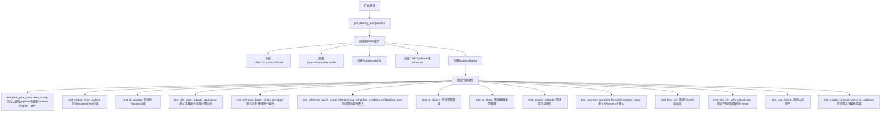

## 类结构

```
unittest.TestCase
└── AnimateDiffSparseControlNetPipelineFastTests (继承自多个mixin)
    ├── IPAdapterTesterMixin
    ├── SDFunctionTesterMixin
    ├── PipelineTesterMixin
    └── PipelineFromPipeTesterMixin
```

## 全局变量及字段


### `to_np`
    
将PyTorch张量转换为NumPy数组的辅助函数，用于测试中的输出比较

类型：`function`
    


### `AnimateDiffSparseControlNetPipelineFastTests.pipeline_class`
    
被测试的AnimateDiffSparseControlNetPipeline管道类，用于执行带运动适配器和稀疏控制网络的文本到视频生成

类型：`type`
    


### `AnimateDiffSparseControlNetPipelineFastTests.params`
    
文本到图像管道的参数集合，定义了单次推理所需的输入参数列表

类型：`tuple`
    


### `AnimateDiffSparseControlNetPipelineFastTests.batch_params`
    
批量推理的参数集合，定义了支持批量处理的输入参数列表

类型：`tuple`
    


### `AnimateDiffSparseControlNetPipelineFastTests.required_optional_params`
    
必需的可选参数集合，包含了管道中非必需但测试时需要验证的可选参数名称

类型：`frozenset`
    
    

## 全局函数及方法


### `to_np`

将 PyTorch 张量转换为 NumPy 数组的全局辅助函数。如果输入是 `torch.Tensor`，则先将其从计算图中分离（detach），然后移到 CPU，最后转换为 NumPy 数组；如果输入不是张量，则直接返回原值。

参数：

- `tensor`：`Union[torch.Tensor, Any]`，需要转换的张量或任意类型的数据

返回值：`Union[np.ndarray, Any]`，转换后的 NumPy 数组（如果输入是张量），或原始输入（如果输入不是张量）

#### 流程图

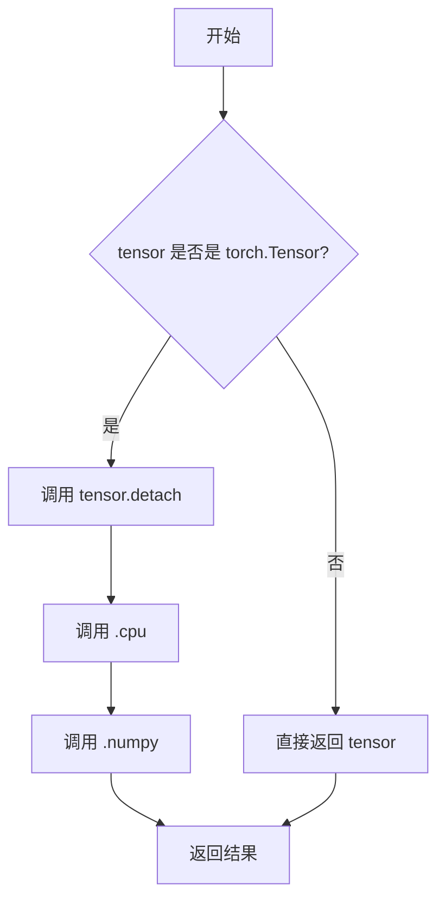

#### 带注释源码

```python
def to_np(tensor):
    """将 PyTorch 张量转换为 NumPy 数组的辅助函数
    
    Args:
        tensor: 输入的 PyTorch 张量或任意类型数据
        
    Returns:
        如果输入是 torch.Tensor，返回对应的 NumPy 数组；
        否则直接返回输入值
    """
    # 检查输入是否为 PyTorch 张量
    if isinstance(tensor, torch.Tensor):
        # detach(): 从计算图中分离，避免梯度追踪
        # .cpu(): 将张量从 GPU 移到 CPU（numpy 仅支持 CPU 张量）
        # .numpy(): 将 PyTorch 张量转换为 NumPy 数组
        tensor = tensor.detach().cpu().numpy()

    # 如果不是张量，直接返回原始对象
    return tensor
```


### `AnimateDiffSparseControlNetPipelineFastTests.get_dummy_components`

该方法用于创建虚拟（dummy）组件集合，专门为 `AnimateDiffSparseControlNetPipeline` 管道生成测试所需的各类模型组件，包括 UNet、ControlNet、VAE、文本编码器、分词器、运动适配器等，这些组件使用较小的维度参数以实现快速测试。

参数：
- 无显式参数（隐式参数 `self` 为测试类实例）

返回值：`Dict[str, Any]`，返回包含以下键的字典：`unet`、`controlnet`、`scheduler`、`vae`、`motion_adapter`、`text_encoder`、`tokenizer`、`feature_extractor`、`image_encoder`

#### 流程图

```mermaid
flowchart TD
    A[开始 get_dummy_components] --> B[设置 cross_attention_dim=8 和 block_out_channels=(8, 8)]
    B --> C[设置随机种子 torch.manual_seed(0)]
    C --> D[创建 UNet2DConditionModel]
    D --> E[创建 DDIMScheduler]
    E --> F[设置随机种子 torch.manual_seed(0)]
    F --> G[创建 SparseControlNetModel]
    G --> H[设置随机种子 torch.manual_seed(0)]
    H --> I[创建 AutoencoderKL]
    I --> J[设置随机种子 torch.manual_seed(0)]
    J --> K[创建 CLIPTextConfig 和 CLIPTextModel]
    K --> L[从预训练加载 CLIPTokenizer]
    L --> M[创建 MotionAdapter]
    M --> N[组装 components 字典]
    N --> O[返回 components]
```

#### 带注释源码

```python
def get_dummy_components(self):
    """
    创建用于测试的虚拟组件。
    
    返回一个包含AnimateDiffSparseControlNetPipeline所需的所有模型组件的字典，
    这些组件使用较小的维度以便进行快速测试。
    """
    # 定义交叉注意力维度和块输出通道数
    # 使用较小的值(8)以便快速测试
    cross_attention_dim = 8
    block_out_channels = (8, 8)

    # 设置随机种子以确保可重复性
    torch.manual_seed(0)
    # 创建UNet2D条件模型 - 用于去噪处理
    unet = UNet2DConditionModel(
        block_out_channels=block_out_channels,
        layers_per_block=2,
        sample_size=8,
        in_channels=4,
        out_channels=4,
        down_block_types=("CrossAttnDownBlock2D", "DownBlock2D"),
        up_block_types=("CrossAttnUpBlock2D", "UpBlock2D"),
        cross_attention_dim=cross_attention_dim,
        norm_num_groups=2,
    )
    
    # 创建DDIM调度器 - 控制去噪过程的噪声调度
    scheduler = DDIMScheduler(
        beta_start=0.00085,
        beta_end=0.012,
        beta_schedule="linear",
        clip_sample=False,
    )
    
    # 重新设置随机种子以确保ControlNet的可重复性
    torch.manual_seed(0)
    # 创建SparseControlNet模型 - 用于稀疏条件控制
    controlnet = SparseControlNetModel(
        block_out_channels=block_out_channels,
        layers_per_block=2,
        in_channels=4,
        conditioning_channels=3,
        down_block_types=("CrossAttnDownBlockMotion", "DownBlockMotion"),
        cross_attention_dim=cross_attention_dim,
        conditioning_embedding_out_channels=(8, 8),
        norm_num_groups=1,
        use_simplified_condition_embedding=False,
    )
    
    # 重新设置随机种子
    torch.manual_seed(0)
    # 创建变分自编码器(VAE) - 用于潜在空间编码/解码
    vae = AutoencoderKL(
        block_out_channels=block_out_channels,
        in_channels=3,
        out_channels=3,
        down_block_types=["DownEncoderBlock2D", "DownEncoderBlock2D"],
        up_block_types=["UpDecoderBlock2D", "UpDecoderBlock2D"],
        latent_channels=4,
        norm_num_groups=2,
    )
    
    # 重新设置随机种子
    torch.manual_seed(0)
    # 创建CLIP文本编码器配置
    text_encoder_config = CLIPTextConfig(
        bos_token_id=0,
        eos_token_id=2,
        hidden_size=cross_attention_dim,
        intermediate_size=37,
        layer_norm_eps=1e-05,
        num_attention_heads=4,
        num_hidden_layers=5,
        pad_token_id=1,
        vocab_size=1000,
    )
    # 创建CLIP文本编码器模型
    text_encoder = CLIPTextModel(text_encoder_config)
    # 加载一个小型CLIP分词器用于测试
    tokenizer = CLIPTokenizer.from_pretrained("hf-internal-testing/tiny-random-clip")
    
    # 创建运动适配器 - 用于动画扩散
    motion_adapter = MotionAdapter(
        block_out_channels=block_out_channels,
        motion_layers_per_block=2,
        motion_norm_num_groups=2,
        motion_num_attention_heads=4,
    )

    # 组装所有组件到字典中
    components = {
        "unet": unet,
        "controlnet": controlnet,
        "scheduler": scheduler,
        "vae": vae,
        "motion_adapter": motion_adapter,
        "text_encoder": text_encoder,
        "tokenizer": tokenizer,
        "feature_extractor": None,  # 未使用，设为None
        "image_encoder": None,       # 未使用，设为None
    }
    return components
```


### `AnimateDiffSparseControlNetPipelineFastTests.get_dummy_inputs`

该方法用于生成AnimateDiffSparseControlNetPipeline的虚拟测试输入参数，包括提示词、控制帧、随机生成器等，确保测试在不同设备和随机种子下可复现。

参数：

- `self`：隐式参数，测试类实例本身
- `device`：设备类型（str或torch.device），指定运行设备，用于创建随机生成器
- `seed`：`int`，默认值=0，用于设置随机数生成器的种子，确保测试可复现
- `num_frames`：`int`，默认值=2，生成的视频帧数量

返回值：`Dict`，包含以下键值对的字典：
- `prompt`：str，文本提示词
- `conditioning_frames`：List[Image]，控制网络的输入帧列表
- `controlnet_frame_indices`：List[int]，控制网络使用的帧索引
- `generator`：torch.Generator，随机数生成器
- `num_inference_steps`：int，推理步数
- `num_frames`：int，总帧数
- `guidance_scale`：float，分类器自由引导比例
- `output_type`：str，输出类型（"pt"表示PyTorch张量）

#### 流程图

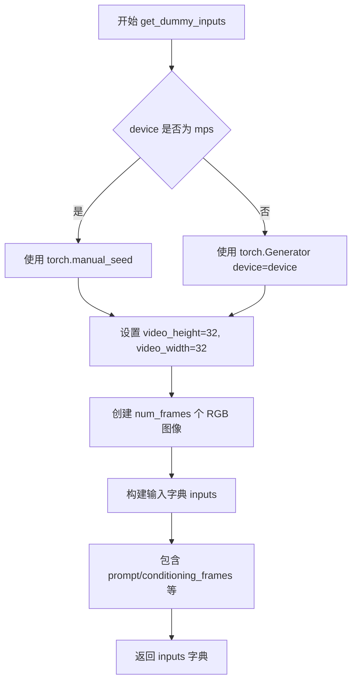

#### 带注释源码

```python
def get_dummy_inputs(self, device, seed: int = 0, num_frames: int = 2):
    """
    生成虚拟测试输入参数
    
    参数:
        device: 运行设备
        seed: 随机种子，默认0
        num_frames: 帧数，默认2
    """
    # 根据设备类型选择随机生成器创建方式
    # MPS设备需要特殊处理，使用torch.manual_seed
    if str(device).startswith("mps"):
        generator = torch.manual_seed(seed)
    else:
        # 其他设备使用torch.Generator并设置种子
        generator = torch.Generator(device=device).manual_seed(seed)

    # 定义虚拟视频的尺寸
    video_height = 32
    video_width = 32
    
    # 创建虚拟的控制网络输入帧（RGB图像）
    # 使用PIL创建指定尺寸的RGB图像，数量由num_frames决定
    conditioning_frames = [Image.new("RGB", (video_width, video_height))] * num_frames

    # 构建完整的输入参数字典
    inputs = {
        "prompt": "A painting of a squirrel eating a burger",  # 测试用提示词
        "conditioning_frames": conditioning_frames,  # 控制网络的条件帧
        "controlnet_frame_indices": list(range(num_frames)),  # 使用的帧索引
        "generator": generator,  # 随机生成器
        "num_inference_steps": 2,  # 推理步数
        "num_frames": num_frames,  # 总帧数
        "guidance_scale": 7.5,  # CFG引导比例
        "output_type": "pt",  # 输出为PyTorch张量
    }
    return inputs
```


### `AnimateDiffSparseControlNetPipelineFastTests.test_from_pipe_consistent_config`

该测试方法验证了 `AnimateDiffSparseControlNetPipeline` 与 `StableDiffusionPipeline` 之间的管道配置一致性。具体流程为：首先从预训练模型加载原始管道，然后通过 `from_pipe` 方法将其转换为目标管道类型，再从目标管道转换回原始类型，最后比较两次转换后的配置是否一致，确保管道组件的正确迁移和兼容性。

参数：

- `self`：隐式参数，测试类实例本身

返回值：`None`，该方法为单元测试，通过 `assert` 语句进行断言验证，不返回任何值

#### 流程图

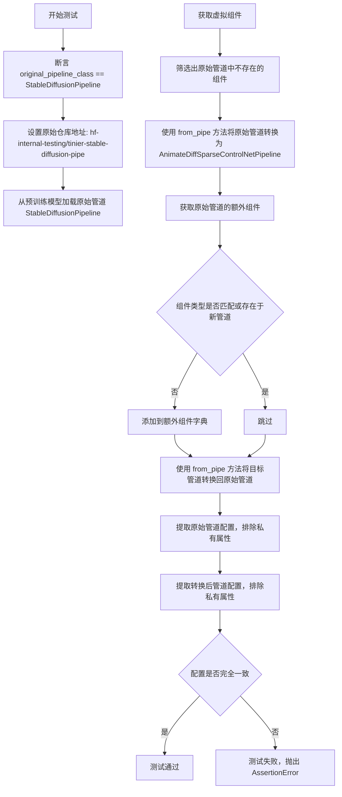

#### 带注释源码

```python
def test_from_pipe_consistent_config(self):
    # 断言：验证原始管道类是否为 StableDiffusionPipeline
    # 这是测试的前置条件，确保测试环境正确
    assert self.original_pipeline_class == StableDiffusionPipeline
    
    # 定义原始管道的预训练模型仓库地址
    # 使用 HuggingFace Hub 上的测试用小型管道模型
    original_repo = "hf-internal-testing/tinier-stable-diffusion-pipe"
    
    # 定义加载原始管道时的额外参数
    # requires_safety_checker=False 禁用安全检查器以简化测试
    original_kwargs = {"requires_safety_checker": False}

    # 步骤1：创建原始管道 (StableDiffusionPipeline)
    # 使用 from_pretrained 方法从预训练模型加载管道
    pipe_original = self.original_pipeline_class.from_pretrained(original_repo, **original_kwargs)

    # 步骤2：将原始管道转换为目标管道 (AnimateDiffSparseControlNetPipeline)
    # 获取虚拟组件配置，用于构建目标管道的额外组件
    pipe_components = self.get_dummy_components()
    
    # 筛选出原始管道中不存在的组件
    # 这些是需要额外添加的组件（如 motion_adapter、controlnet 等）
    pipe_additional_components = {}
    for name, component in pipe_components.items():
        if name not in pipe_original.components:
            pipe_additional_components[name] = component

    # 使用 from_pipe 方法从原始管道创建目标管道
    # 并传入额外组件作为参数
    pipe = self.pipeline_class.from_pipe(pipe_original, **pipe_additional_components)

    # 步骤3：将目标管道转换回原始管道
    # 找出原始管道中有但目标管道中缺失或不匹配的组件
    original_pipe_additional_components = {}
    for name, component in pipe_original.components.items():
        # 如果组件不在目标管道中，或者类型不匹配
        if name not in pipe.components or not isinstance(component, pipe.components[name].__class__):
            original_pipe_additional_components[name] = component

    # 使用 from_pipe 方法从目标管道创建新的原始管道
    pipe_original_2 = self.original_pipeline_class.from_pipe(pipe, **original_pipe_additional_components)

    # 步骤4：比较配置一致性
    # 从原始管道配置中排除私有属性（以 _ 开头的键）
    original_config = {k: v for k, v in pipe_original.config.items() if not k.startswith("_")}
    
    # 从转换后的原始管道配置中排除私有属性
    original_config_2 = {k: v for k, v in pipe_original_2.config.items() if not k.startswith("_")}
    
    # 断言：验证配置一致性
    # 如果配置不一致，测试将失败并抛出 AssertionError
    assert original_config_2 == original_config
```


### `AnimateDiffSparseControlNetPipelineFastTests.test_motion_unet_loading`

该测试方法用于验证 `AnimateDiffSparseControlNetPipeline` 在实例化时正确加载了运动 UNet（`UNetMotionModel`），确保管道的 `unet` 属性是 `UNetMotionModel` 类型的实例。

参数：

- `self`：`AnimateDiffSparseControlNetPipelineFastTests`，测试类的实例对象，包含测试所需的组件和配置信息

返回值：`None`，该方法通过 `assert` 语句进行断言验证，成功时返回 `None`，失败时抛出 `AssertionError`

#### 流程图

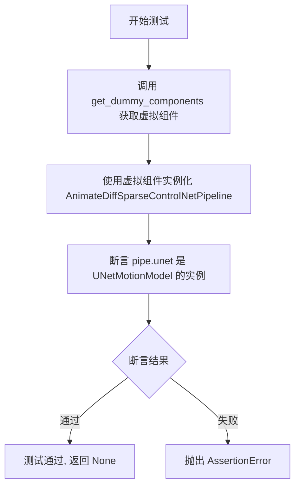

#### 带注释源码

```python
def test_motion_unet_loading(self):
    """
    测试方法：验证 AnimateDiffSparseControlNetPipeline 正确加载运动 UNet
    
    该测试确保管道在实例化时能够正确地将 unet 组件
    替换为 UNetMotionModel 类型，以支持动画扩散功能。
    """
    # 步骤1: 获取虚拟组件配置
    # 调用 get_dummy_components 方法创建用于测试的虚拟模型组件
    # 包含: unet, controlnet, scheduler, vae, motion_adapter, text_encoder, tokenizer 等
    components = self.get_dummy_components()
    
    # 步骤2: 使用虚拟组件实例化管道
    # 将虚拟组件传递给 AnimateDiffSparseControlNetPipeline 构造函数
    # 管道内部会将原始的 UNet2DConditionModel 替换为 UNetMotionModel
    pipe = AnimateDiffSparseControlNetPipeline(**components)
    
    # 步骤3: 断言验证
    # 验证管道的 unet 属性已被正确替换为 UNetMotionModel 类型
    # 这是 AnimateDiffSparseControlNetPipeline 的核心功能之一
    assert isinstance(pipe.unet, UNetMotionModel)
```


### `AnimateDiffSparseControlNetPipelineFastTests.test_attention_slicing_forward_pass`

该测试方法用于验证 AnimateDiffSparseControlNetPipeline 的注意力切片（attention slicing）前向传播功能是否正常工作。由于该 Pipeline 当前未启用注意力切片功能，该测试被主动跳过（Skip），不执行任何实际验证逻辑。

参数：

- `self`：`AnimateDiffSparseControlNetPipelineFastTests`，测试类实例本身，无需显式传递

返回值：`None`，该方法体仅为 `pass` 语句，不返回任何值

#### 流程图

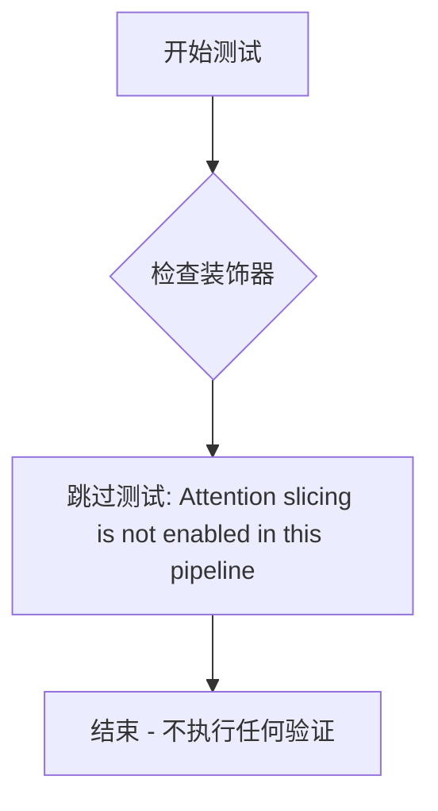

#### 带注释源码

```python
@unittest.skip("Attention slicing is not enabled in this pipeline")
def test_attention_slicing_forward_pass(self):
    """
    测试注意力切片（Attention Slicing）前向传播功能。
    
    该测试方法用于验证 Pipeline 在启用注意力切片优化时的
    前向传播是否产生正确结果。由于当前 AnimateDiffSparseControlNetPipeline
    未实现或未启用注意力切片功能，该测试被跳过。
    
    Attention Slicing 是一种内存优化技术，通过将大型注意力矩阵
    分割成较小的块来减少显存占用。
    """
    pass  # 测试被跳过，不执行任何验证逻辑
```


### `AnimateDiffSparseControlNetPipelineFastTests.test_ip_adapter`

该方法是 AnimateDiffSparseControlNetPipelineFastTests 类中的测试方法，用于测试 AnimateDiffSparseControlNetPipeline 的 IP Adapter 功能。根据运行设备（CPU 或 CUDA）设置不同的期望输出切片值，然后调用父类的 test_ip_adapter 方法执行实际的 IP Adapter 集成测试。

参数：

- 该方法无显式参数（为实例方法，`self` 为隐式参数）

返回值：`None`，无返回值（测试方法）

#### 流程图

```mermaid
graph TD
    A[开始 test_ip_adapter] --> B{torch_device == 'cpu'?}
    B -->|是| C[设置 expected_pipe_slice 为预定义的CPU数值数组]
    B -->|否| D[设置 expected_pipe_slice = None]
    C --> E[调用 super().test_ip_adapter]
    D --> E
    E --> F[父类 IPAdapterTesterMixin.test_ip_adapter 执行测试]
    F --> G[结束]
```

#### 带注释源码

```python
def test_ip_adapter(self):
    """
    测试 AnimateDiffSparseControlNetPipeline 的 IP Adapter 功能
    
    该方法根据运行设备设置不同的期望输出切片值：
    - CPU设备：使用预定义的数值数组作为期望输出
    - CUDA设备：不设置特定期望值，使用默认行为
    
    然后调用父类的 test_ip_adapter 方法执行实际测试
    """
    # 初始化期望输出切片为 None（默认行为）
    expected_pipe_slice = None
    
    # 如果运行在 CPU 设备上，设置特定的期望输出切片
    # 这些数值是预先计算的标准输出，用于验证测试结果的正确性
    if torch_device == "cpu":
        expected_pipe_slice = np.array(
            [
                0.6604,
                0.4099,
                0.4928,
                0.5706,
                0.5096,
                0.5012,
                0.6051,
                0.5169,
                0.5021,
                0.4864,
                0.4261,
                0.5779,
                0.5822,
                0.4049,
                0.5253,
                0.6160,
                0.4150,
                0.5155,
            ]
        )
    
    # 调用父类 IPAdapterTesterMixin 的 test_ip_adapter 方法
    # 传递 expected_pipe_slice 参数用于结果验证
    return super().test_ip_adapter(expected_pipe_slice=expected_pipe_slice)
```


### `AnimateDiffSparseControlNetPipelineFastTests.test_dict_tuple_outputs_equivalent`

该测试方法用于验证管道在字典输出和元组输出形式下的等价性，确保管道既可以返回字典格式（`return_dict=True`）的输出，也可以返回元组格式（`return_dict=False`）的输出，且两者的核心数值结果保持一致。

参数：

- `self`：`AnimateDiffSparseControlNetPipelineFastTests`，测试类实例本身，包含测试所需的组件和配置
- `expected_slice`：`numpy.ndarray` 或 `None`，期望的输出切片值，用于在 CPU 设备上与实际输出进行比对验证

返回值：`unittest.TestCase.test_dict_tuple_outputs_equivalent` 的返回值，通常为 `None`（测试通过）或抛出 `AssertionError`（测试失败），具体取决于父类方法的实现。

#### 流程图

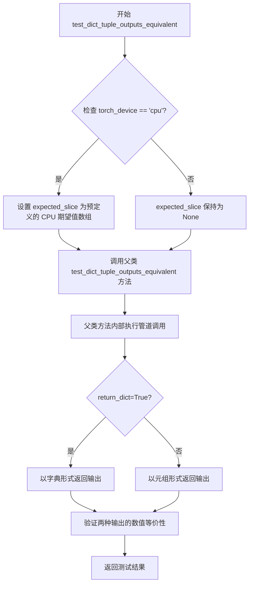

#### 带注释源码

```python
def test_dict_tuple_outputs_equivalent(self):
    """
    测试方法：验证字典输出和元组输出的等价性
    
    该方法继承自测试混合类 SDFunctionTesterMixin，用于确保管道在不同的
    返回格式配置下（return_dict=True/False）能够产生数值上一致的结果。
    """
    # 初始化期望切片值为 None
    expected_slice = None
    
    # 如果当前测试设备为 CPU，则使用预定义的期望值数组进行精确比对
    # 这些数值是在 CPU 设备上运行管道时的参考输出切片
    if torch_device == "cpu":
        expected_slice = np.array([0.6051, 0.5169, 0.5021, 0.6160, 0.4150, 0.5155])
    
    # 调用父类（PipelineTesterMixin/SDFunctionTesterMixin）的同名测试方法
    # 传入根据设备确定的 expected_slice 参数
    # 父类方法会执行以下操作：
    # 1. 使用 return_dict=True 调用管道，捕获输出
    # 2. 使用 return_dict=False 调用管道，捕获输出
    # 3. 比对两次输出的关键数值（如 latents、frames 等）
    # 4. 验证两者差异在允许范围内（通常为 1e-4）
    return super().test_dict_tuple_outputs_equivalent(expected_slice=expected_slice)
```


### `AnimateDiffSparseControlNetPipelineFastTests.test_inference_batch_single_identical`

该方法用于测试 AnimateDiffSparseControlNetPipeline 管道在批处理推理时与单帧推理结果的一致性。它通过构造单帧输入和批处理输入，分别执行推理，并比较两者输出结果的差异是否在预期范围内，以验证管道批处理功能的正确性。

参数：

- `batch_size`：`int`，批处理大小，默认为 2，指定批处理输入中包含的样本数量
- `expected_max_diff`：`float`，期望的最大差异阈值，默认为 1e-4，用于判断单帧和批处理输出的一致性
- `additional_params_copy_to_batched_inputs`：`list`，额外的参数列表，默认为 `["num_inference_steps"]`，指定需要复制到批处理输入的额外参数

返回值：`None`，该方法为测试方法，不返回任何值，通过断言验证批处理推理的正确性

#### 流程图

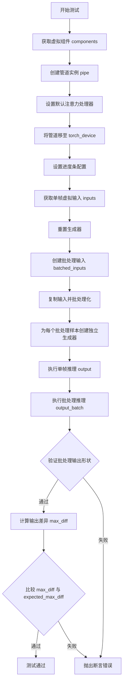

#### 带注释源码

```python
def test_inference_batch_single_identical(
    self,
    batch_size=2,
    expected_max_diff=1e-4,
    additional_params_copy_to_batched_inputs=["num_inference_steps"],
):
    # 获取用于测试的虚拟组件（UNet、ControlNet、VAE、Scheduler等）
    components = self.get_dummy_components()
    # 使用虚拟组件创建 AnimateDiffSparseControlNetPipeline 实例
    pipe = self.pipeline_class(**components)
    
    # 遍历管道中的所有组件，为支持该方法的组件设置默认注意力处理器
    for components in pipe.components.values():
        if hasattr(components, "set_default_attn_processor"):
            components.set_default_attn_processor()

    # 将管道移至指定的计算设备（如 CUDA 或 CPU）
    pipe.to(torch_device)
    # 配置进度条（disable=None 表示不禁用进度条）
    pipe.set_progress_bar_config(disable=None)
    
    # 获取虚拟输入数据（包含 prompt、conditioning_frames、generator 等）
    inputs = self.get_dummy_inputs(torch_device)
    # 重置生成器，以防在 get_dummy_inputs 中已被使用
    inputs["generator"] = self.get_generator(0)

    # 获取日志记录器并设置日志级别为 FATAL 以减少输出
    logger = logging.get_logger(pipe.__module__)
    logger.setLevel(level=diffusers.logging.FATAL)

    # 批处理化输入：创建 batched_inputs 字典并复制原始输入
    batched_inputs = {}
    batched_inputs.update(inputs)

    # 遍历批处理参数，对每个参数进行批处理化处理
    for name in self.batch_params:
        if name not in inputs:
            continue

        value = inputs[name]
        # 对于 prompt 参数，创建不同长度的 prompt 列表
        if name == "prompt":
            len_prompt = len(value)
            batched_inputs[name] = [value[: len_prompt // i] for i in range(1, batch_size + 1)]
            # 最后一个 prompt 设置为很长的字符串
            batched_inputs[name][-1] = 100 * "very long"
        else:
            # 对于其他参数，复制 batch_size 份
            batched_inputs[name] = batch_size * [value]

    # 如果输入中包含 generator，为批处理中的每个样本创建独立的生成器
    if "generator" in inputs:
        batched_inputs["generator"] = [self.get_generator(i) for i in range(batch_size)]

    # 设置批处理大小
    if "batch_size" in inputs:
        batched_inputs["batch_size"] = batch_size

    # 将额外指定的参数复制到批处理输入中
    for arg in additional_params_copy_to_batched_inputs:
        batched_inputs[arg] = inputs[arg]

    # 执行单帧推理
    output = pipe(**inputs)
    # 执行批处理推理
    output_batch = pipe(**batched_inputs)

    # 断言批处理输出的第一维度大小等于 batch_size
    assert output_batch[0].shape[0] == batch_size

    # 计算单帧输出与批处理输出第一个样本的差异
    max_diff = np.abs(to_np(output_batch[0][0]) - to_np(output[0][0])).max()
    # 断言差异小于期望的最大差异阈值
    assert max_diff < expected_max_diff
```


### `AnimateDiffSparseControlNetPipelineFastTests.test_inference_batch_single_identical_use_simplified_condition_embedding_true`

这是一个用于测试 AnimateDiffSparseControlNetPipeline 在使用简化条件嵌入（use_simplified_condition_embedding=True）时，批处理推理结果与单张推理结果一致性的单元测试方法。

参数：

- `self`：隐式参数，测试类实例本身
- `batch_size`：`int`，批量大小，默认为 2，用于测试批处理时的输入数量
- `expected_max_diff`：`float`，期望的最大差异阈值，默认为 1e-4，用于验证批处理和单张推理结果的一致性
- `additional_params_copy_to_batched_inputs`：`list`，需要额外复制到批处理输入的参数列表，默认为 ["num_inference_steps"]

返回值：`None`，该方法为单元测试方法，通过 assert 语句进行断言验证，不返回具体值

#### 流程图

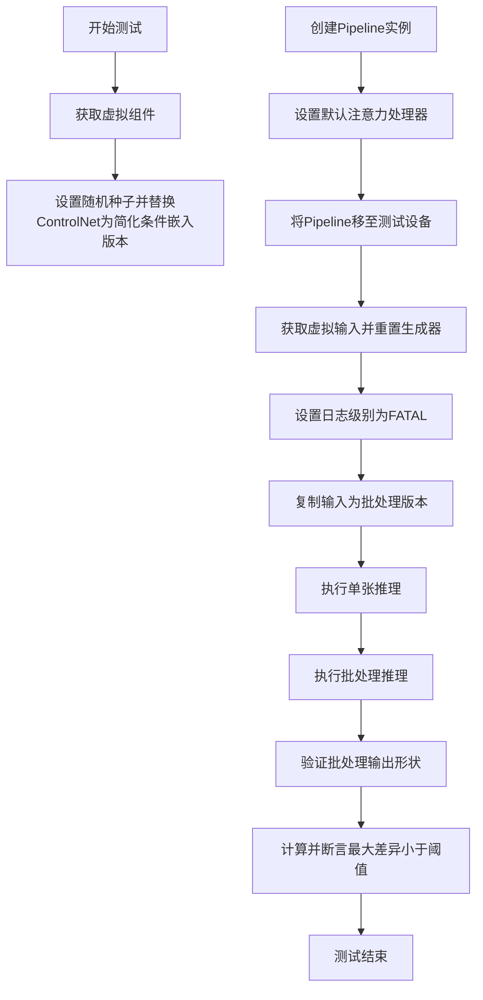

#### 带注释源码

```python
def test_inference_batch_single_identical_use_simplified_condition_embedding_true(
    self,
    batch_size=2,
    expected_max_diff=1e-4,
    additional_params_copy_to_batched_inputs=["num_inference_steps"],
):
    # 步骤1: 获取预定义的虚拟组件（包含UNet、VAE、TextEncoder等）
    components = self.get_dummy_components()

    # 步骤2: 设置随机种子确保可重复性
    torch.manual_seed(0)
    # 步骤3: 取出原来的ControlNet，并用简化条件嵌入版本替换
    old_controlnet = components.pop("controlnet")
    components["controlnet"] = SparseControlNetModel.from_config(
        old_controlnet.config, 
        conditioning_channels=4,  # 设置条件通道数为4
        use_simplified_condition_embedding=True  # 启用简化条件嵌入
    )

    # 步骤4: 使用修改后的组件创建Pipeline实例
    pipe = self.pipeline_class(**components)
    
    # 步骤5: 为所有支持默认注意力处理器的组件设置默认处理器
    for components in pipe.components.values():
        if hasattr(components, "set_default_attn_processor"):
            components.set_default_attn_processor()

    # 步骤6: 将Pipeline移至测试设备（CPU/CUDA）
    pipe.to(torch_device)
    # 步骤7: 配置进度条（disable=None 表示不禁用）
    pipe.set_progress_bar_config(disable=None)
    
    # 步骤8: 获取虚拟输入数据
    inputs = self.get_dummy_inputs(torch_device)
    # 重置生成器，以防在get_dummy_inputs中已被使用
    inputs["generator"] = self.get_generator(0)

    # 步骤9: 获取日志记录器并设置日志级别为FATAL以减少输出
    logger = logging.get_logger(pipe.__module__)
    logger.setLevel(level=diffusers.logging.FATAL)

    # 步骤10: 将单张输入转换为批处理输入
    batched_inputs = {}
    batched_inputs.update(inputs)

    # 遍历批处理参数，对每个参数进行批处理化处理
    for name in self.batch_params:
        if name not in inputs:
            continue

        value = inputs[name]
        if name == "prompt":
            # 对prompt进行长度变化的批处理
            len_prompt = len(value)
            batched_inputs[name] = [value[: len_prompt // i] for i in range(1, batch_size + 1)]
            # 最后一个prompt使用很长的字符串
            batched_inputs[name][-1] = 100 * "very long"

        else:
            # 其他参数直接复制batch_size份
            batched_inputs[name] = batch_size * [value]

    # 步骤11: 为批处理中的每个样本创建独立的生成器
    if "generator" in inputs:
        batched_inputs["generator"] = [self.get_generator(i) for i in range(batch_size)]

    # 步骤12: 设置批处理大小
    if "batch_size" in inputs:
        batched_inputs["batch_size"] = batch_size

    # 步骤13: 复制额外的参数到批处理输入
    for arg in additional_params_copy_to_batched_inputs:
        batched_inputs[arg] = inputs[arg]

    # 步骤14: 执行单张推理
    output = pipe(**inputs)
    # 步骤15: 执行批处理推理
    output_batch = pipe(**batched_inputs)

    # 步骤16: 验证批处理输出的第一项（视频帧）的batch维度是否为batch_size
    assert output_batch[0].shape[0] == batch_size

    # 步骤17: 计算单张和批处理推理结果的最大差异，并进行断言
    max_diff = np.abs(to_np(output_batch[0][0]) - to_np(output[0][0])).max()
    assert max_diff < expected_max_diff
```


### `AnimateDiffSparseControlNetPipelineFastTests.test_to_device`

该方法用于测试 AnimateDiffSparseControlNetPipeline 管道在不同设备（CPU 和 CUDA）之间移动的功能，验证所有模型组件正确转移到目标设备，并且输出结果没有 NaN 值。

参数：

- `self`：`AnimateDiffSparseControlNetPipelineFastTests`，测试类的实例，隐式参数

返回值：`None`，无返回值（该方法为测试用例，使用断言验证逻辑）

#### 流程图

```mermaid
flowchart TD
    A[开始 test_to_device] --> B[获取虚拟组件 components = self.get_dummy_components]
    B --> C[创建管道 pipe = self.pipeline_class(**components)]
    C --> D[设置进度条配置 pipe.set_progress_bar_config(disable=None)]
    D --> E[将管道移到CPU pipe.to('cpu')]
    E --> F[获取所有组件的设备类型 model_devices]
    F --> G{验证所有设备是否为'cpu'}
    G -->|是| H[执行推理获取输出 output_cpu = pipe(...)]
    H --> I{验证输出无NaN}
    I -->|是| J[将管道移到目标设备 pipe.to(torch_device)]
    J --> K[再次获取所有组件的设备类型 model_devices]
    K --> L{验证所有设备是否为torch_device}
    L -->|是| M[执行推理获取输出 output_cuda = pipe(...)]
    M --> N{验证输出无NaN}
    N -->|是| O[结束测试]
    G -->|否| P[断言失败]
    I -->|否| P
    L -->|否| P
    N -->|否| P
```

#### 带注释源码

```python
@require_accelerator  # 装饰器：仅在有加速器（GPU）时运行
def test_to_device(self):
    """
    测试管道在CPU和CUDA设备之间移动的功能
    
    验证点：
    1. 管道组件能正确转移到CPU
    2. CPU模式下推理输出无NaN
    3. 管道组件能正确转移到目标设备（CUDA）
    4. CUDA模式下推理输出无NaN
    """
    # Step 1: 获取虚拟组件（用于测试的假模型组件）
    components = self.get_dummy_components()
    
    # Step 2: 使用虚拟组件创建管道实例
    pipe = self.pipeline_class(**components)
    
    # Step 3: 设置进度条配置（disable=None 表示启用进度条）
    pipe.set_progress_bar_config(disable=None)

    # ========== 测试 CPU 设备 ==========
    
    # Step 4: 将管道所有组件移到CPU
    pipe.to("cpu")
    
    # Step 5: 获取所有有device属性的组件的设备类型
    # 注意：pipeline内部会创建新的motion UNet，需要从pipe.components检查
    model_devices = [
        component.device.type 
        for component in pipe.components.values() 
        if hasattr(component, "device")
    ]
    
    # Step 6: 断言所有组件都在CPU上
    self.assertTrue(all(device == "cpu" for device in model_devices))

    # Step 7: 在CPU上进行推理，获取输出
    # get_dummy_inputs返回测试用的输入参数
    output_cpu = pipe(**self.get_dummy_inputs("cpu"))[0]
    
    # Step 8: 断言CPU输出不包含NaN值
    self.assertTrue(np.isnan(output_cpu).sum() == 0)

    # ========== 测试 CUDA 设备 ==========
    
    # Step 9: 将管道移到目标设备（通常是CUDA）
    pipe.to(torch_device)
    
    # Step 10: 再次获取所有组件的设备类型
    model_devices = [
        component.device.type 
        for component in pipe.components.values() 
        if hasattr(component, "device")
    ]
    
    # Step 11: 断言所有组件都在目标设备上
    self.assertTrue(all(device == torch_device for device in model_devices))

    # Step 12: 在目标设备上进行推理
    output_cuda = pipe(**self.get_dummy_inputs(torch_device))[0]
    
    # Step 13: 断言CUDA输出不包含NaN值
    # 需要先转换为numpy数组，因为output_cuda可能是torch.Tensor
    self.assertTrue(np.isnan(to_np(output_cuda)).sum() == 0)
```


### `AnimateDiffSparseControlNetPipelineFastTests.test_to_dtype`

该测试方法用于验证 AnimateDiffSparseControlNetPipeline 管道组件的数据类型（dtype）转换功能是否正常工作。测试首先获取虚拟组件并创建管道实例，然后验证所有组件的初始 dtype 为 float32，接着将管道转换为 float16 并再次验证所有组件的 dtype 已正确转换为 float16。

参数：

- `self`：隐式参数，类型为 `AnimateDiffSparseControlNetPipelineFastTests`，表示测试类实例本身

返回值：`None`，无返回值（测试方法通过断言验证，不返回任何值）

#### 流程图

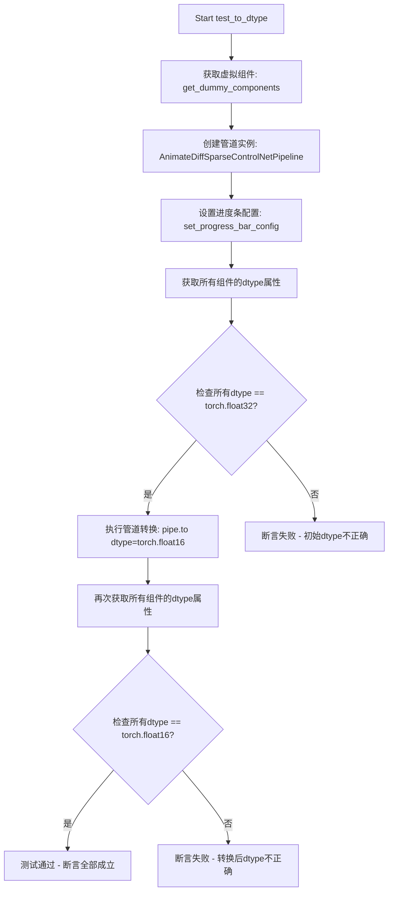

#### 带注释源码

```python
def test_to_dtype(self):
    """
    测试管道组件的数据类型(dtype)转换功能
    验证组件可以从默认float32转换到float16
    """
    # 步骤1: 获取预定义的虚拟组件（包含UNet、ControlNet、VAE等）
    components = self.get_dummy_components()
    
    # 步骤2: 使用虚拟组件创建AnimateDiffSparseControlNetPipeline实例
    pipe = self.pipeline_class(**components)
    
    # 步骤3: 禁用进度条配置（避免测试输出时的干扰）
    pipe.set_progress_bar_config(disable=None)

    # 步骤4: 获取所有具有dtype属性的组件的dtype值
    # 过滤掉没有dtype属性的组件（如tokenizer等）
    model_dtypes = [component.dtype for component in pipe.components.values() if hasattr(component, "dtype")]
    
    # 步骤5: 断言验证所有组件的初始dtype都是torch.float32
    self.assertTrue(all(dtype == torch.float32 for dtype in model_dtypes))

    # 步骤6: 将管道转换为float16数据类型
    pipe.to(dtype=torch.float16)
    
    # 步骤7: 再次获取转换后所有组件的dtype值
    model_dtypes = [component.dtype for component in pipe.components.values() if hasattr(component, "dtype")]
    
    # 步骤8: 断言验证所有组件的dtype都已转换为torch.float16
    self.assertTrue(all(dtype == torch.float16 for dtype in model_dtypes))
```


### `AnimateDiffSparseControlNetPipelineFastTests.test_prompt_embeds`

该测试方法用于验证 `AnimateDiffSparseControlNetPipeline` 管道能够接受预计算的 `prompt_embeds`（提示词嵌入）而非原始的 `prompt` 字符串来执行推理。这是测试管道对提示词嵌入输入的支持能力。

参数：

- `self`：隐式参数，测试类实例本身

返回值：`None`，该测试方法通过调用管道执行而不显式返回结果，用于验证管道在接收 `prompt_embeds` 时的正确运行。

#### 流程图

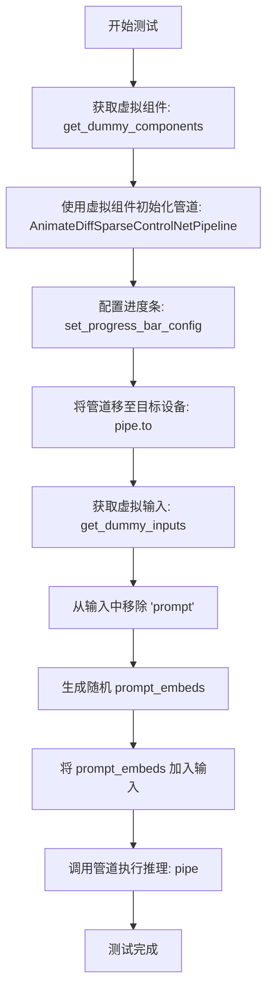

#### 带注释源码

```python
def test_prompt_embeds(self):
    """
    测试管道是否支持使用预计算的 prompt_embeds 而非原始 prompt 字符串
    """
    # 步骤1: 获取虚拟组件（用于测试的轻量级模型配置）
    components = self.get_dummy_components()
    
    # 步骤2: 使用虚拟组件实例化 AnimateDiffSparseControlNetPipeline 管道
    pipe = self.pipeline_class(**components)
    
    # 步骤3: 配置进度条（disable=None 表示启用进度条）
    pipe.set_progress_bar_config(disable=None)
    
    # 步骤4: 将管道移至测试设备（如 cpu 或 cuda）
    pipe.to(torch_device)
    
    # 步骤5: 获取虚拟输入参数
    inputs = self.get_dummy_inputs(torch_device)
    
    # 步骤6: 移除 prompt 参数，改为使用 prompt_embeds
    inputs.pop("prompt")
    
    # 步骤7: 生成随机形状的 prompt_embeds
    # 形状: (batch_size=1, num_frames=4, hidden_size)
    # hidden_size 来自 text_encoder.config.hidden_size
    inputs["prompt_embeds"] = torch.randn(
        (1, 4, pipe.text_encoder.config.hidden_size), 
        device=torch_device
    )
    
    # 步骤8: 调用管道，使用 prompt_embeds 进行推理
    # 测试管道是否能正确处理预计算的提示词嵌入
    pipe(**inputs)
```


### `AnimateDiffSparseControlNetPipelineFastTests.test_xformers_attention_forwardGenerator_pass`

该方法用于测试 XFormers 注意力机制的前向传播是否正常工作，通过调用父类的 `_test_xformers_attention_forwardGenerator_pass` 方法来验证 XFormers 在 AnimateDiffSparseControlNetPipeline 中的注意力计算是否正确。

参数：

- `self`：实例方法，调用该方法的类实例本身，无显式参数描述

返回值：无显式返回值，该方法调用父类方法执行测试逻辑

#### 流程图

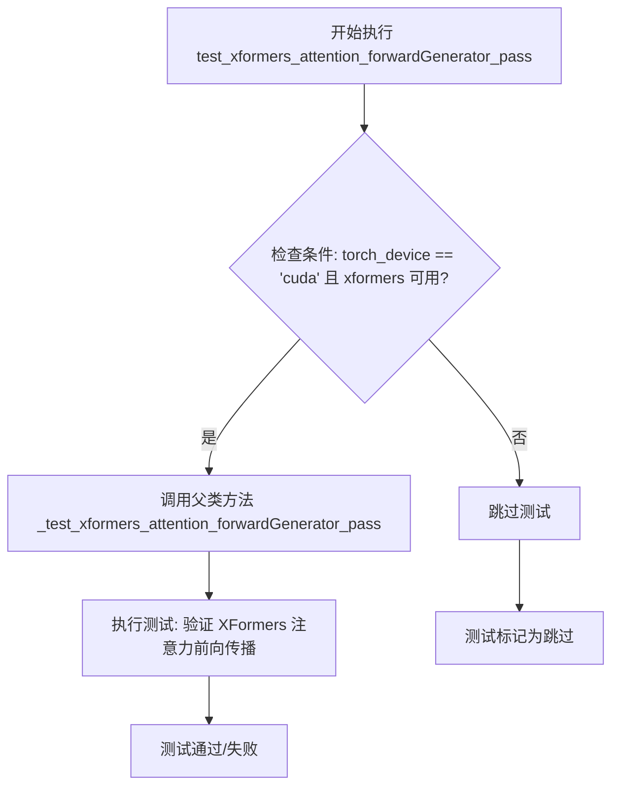

#### 带注释源码

```python
@unittest.skipIf(
    torch_device != "cuda" or not is_xformers_available(),
    reason="XFormers attention is only available with CUDA and `xformers` installed",
)
def test_xformers_attention_forwardGenerator_pass(self):
    """
    测试 XFormers 注意力机制的前向传播是否正确工作。
    
    该测试方法仅在以下条件满足时执行：
    1. 当前设备为 CUDA
    2. xformers 库已安装可用
    
    测试逻辑委托给父类的 _test_xformers_attention_forwardGenerator_pass 方法，
    并传入 test_mean_pixel_difference=False 参数，表示不测试像素差异均值。
    """
    # 调用父类的测试方法执行实际的 XFormers 注意力测试
    # test_mean_pixel_difference=False 禁用了像素差异均值测试
    super()._test_xformers_attention_forwardGenerator_pass(test_mean_pixel_difference=False)
```


### `AnimateDiffSparseControlNetPipelineFastTests.test_free_init`

该测试方法验证了 AnimateDiffSparseControlNetPipeline 中 FreeInit 功能的正确性。测试通过比较默认推理、启用 FreeInit 和禁用 FreeInit 三种情况下的输出帧差异，确保 FreeInit 能够正确改变生成结果，并且在禁用后能够恢复到与默认管道相似的性能。

参数：

- `self`：实例本身，无需显式传递

返回值：`None`，测试方法无返回值，通过 `self.assertGreater` 和 `self.assertLess` 断言验证逻辑正确性

#### 流程图

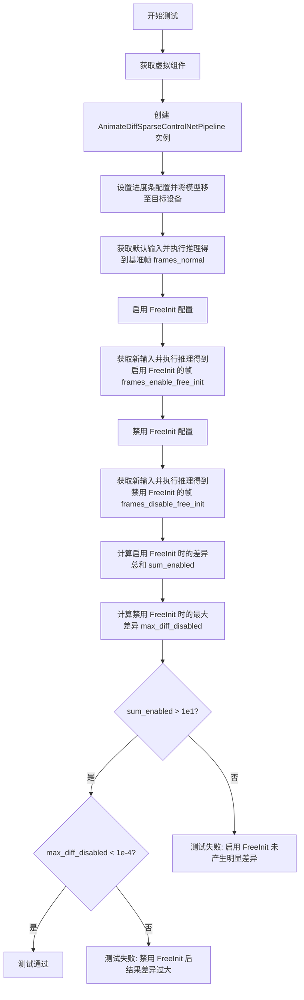

#### 带注释源码

```python
def test_free_init(self):
    """
    测试 FreeInit 功能是否正确启用和禁用
    FreeInit 是一种用于改进扩散模型采样质量的技术
    """
    # 步骤1: 获取虚拟组件（用于测试的轻量级模型配置）
    components = self.get_dummy_components()
    
    # 步骤2: 使用虚拟组件创建 AnimateDiffSparseControlNetPipeline 管道实例
    # AnimateDiffSparseControlNetPipeline 结合了 AnimateDiff、Sparse ControlNet 和 Stable Diffusion
    pipe: AnimateDiffSparseControlNetPipeline = self.pipeline_class(**components)
    
    # 步骤3: 配置进度条（disable=None 表示启用进度条）
    pipe.set_progress_bar_config(disable=None)
    
    # 步骤4: 将管道移至测试设备（如 CPU 或 CUDA）
    pipe.to(torch_device)

    # 步骤5: 获取默认输入并进行推理，得到基准帧
    # 不启用任何特殊优化或功能
    inputs_normal = self.get_dummy_inputs(torch_device)
    frames_normal = pipe(**inputs_normal).frames[0]

    # 步骤6: 配置并启用 FreeInit
    # 参数说明:
    # - num_iters=2: 迭代次数
    # - use_fast_sampling=True: 使用快速采样
    # - method="butterworth": 使用巴特沃斯滤波器方法
    # - order=4: 滤波器阶数
    # - spatial_stop_frequency=0.25: 空间停止频率
    # - temporal_stop_frequency=0.25: 时间停止频率
    pipe.enable_free_init(
        num_iters=2,
        use_fast_sampling=True,
        method="butterworth",
        order=4,
        spatial_stop_frequency=0.25,
        temporal_stop_frequency=0.25,
    )
    
    # 步骤7: 使用新的随机种子获取输入，启用 FreeInit 后推理
    inputs_enable_free_init = self.get_dummy_inputs(torch_device)
    frames_enable_free_init = pipe(**inputs_enable_free_init).frames[0]

    # 步骤8: 禁用 FreeInit，恢复到默认行为
    pipe.disable_free_init()
    
    # 步骤9: 获取新输入并禁用 FreeInit 进行推理
    inputs_disable_free_init = self.get_dummy_inputs(torch_device)
    frames_disable_free_init = pipe(**inputs_disable_free_init).frames[0]

    # 步骤10: 计算差异指标
    # 计算启用 FreeInit 与基准帧的差异总和
    # 如果差异太小，说明 FreeInit 没有产生预期效果
    sum_enabled = np.abs(to_np(frames_normal) - to_np(frames_enable_free_init)).sum()
    
    # 计算禁用 FreeInit 与基准帧的最大差异
    # 如果差异太大，说明禁用 FreeInit 后管道行为异常
    max_diff_disabled = np.abs(to_np(frames_normal) - to_np(frames_disable_free_init)).max()

    # 步骤11: 断言验证
    # 验证1: 启用 FreeInit 应该产生明显不同于基准的结果
    # 预期差异总和应大于 10（1e1 = 10）
    self.assertGreater(
        sum_enabled, 1e1, "Enabling of FreeInit should lead to results different from the default pipeline results"
    )
    
    # 验证2: 禁用 FreeInit 后结果应与基准非常相似
    # 预期最大差异应小于 0.0001（1e-4）
    self.assertLess(
        max_diff_disabled,
        1e-4,
        "Disabling of FreeInit should lead to results similar to the default pipeline results",
    )
```


### `AnimateDiffSparseControlNetPipelineFastTests.test_free_init_with_schedulers`

该测试方法用于验证 FreeInit 功能在与不同调度器（DPMSolverMultistepScheduler 和 LCMScheduler）结合使用时能否正常工作。通过比较启用 FreeInit 前后的输出差异，确保 FreeInit 能够产生与默认设置不同的结果。

参数：

- `self`：测试类实例，隐含参数，用于访问类方法和属性

返回值：`None`，测试方法无返回值，通过 `assert` 语句进行验证

#### 流程图

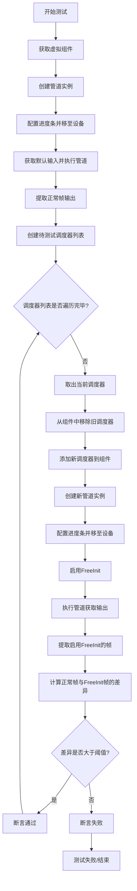

#### 带注释源码

```python
def test_free_init_with_schedulers(self):
    """
    测试FreeInit功能在与不同调度器结合时是否正常工作
    验证启用FreeInit后生成的结果与默认结果存在显著差异
    """
    
    # 步骤1: 获取虚拟组件，用于构建管道
    components = self.get_dummy_components()
    
    # 步骤2: 使用虚拟组件创建AnimateDiffSparseControlNetPipeline管道实例
    pipe: AnimateDiffSparseControlNetPipeline = self.pipeline_class(**components)
    
    # 步骤3: 配置进度条显示（disable=None表示不禁用）
    pipe.set_progress_bar_config(disable=None)
    
    # 步骤4: 将管道移至测试设备（CPU或CUDA）
    pipe.to(torch_device)

    # 步骤5: 获取默认虚拟输入，使用默认调度器执行管道
    inputs_normal = self.get_dummy_inputs(torch_device)
    
    # 步骤6: 执行管道并获取第一帧输出作为基准
    frames_normal = pipe(**inputs_normal).frames[0]

    # 步骤7: 定义待测试的调度器列表
    # 包括DPMSolverMultistepScheduler和LCMScheduler两种
    schedulers_to_test = [
        DPMSolverMultistepScheduler.from_config(
            components["scheduler"].config,
            timestep_spacing="linspace",
            beta_schedule="linear",
            algorithm_type="dpmsolver++",
            steps_offset=1,
            clip_sample=False,
        ),
        LCMScheduler.from_config(
            components["scheduler"].config,
            timestep_spacing="linspace",
            beta_schedule="linear",
            steps_offset=1,
            clip_sample=False,
        ),
    ]
    
    # 步骤8: 从组件字典中移除默认调度器
    components.pop("scheduler")

    # 步骤9: 遍历每个待测试的调度器
    for scheduler in schedulers_to_test:
        # 将新调度器添加到组件中
        components["scheduler"] = scheduler
        
        # 创建带有新调度器的管道实例
        pipe: AnimateDiffSparseControlNetPipeline = self.pipeline_class(**components)
        
        # 配置进度条并移至设备
        pipe.set_progress_bar_config(disable=None)
        pipe.to(torch_device)

        # 启用FreeInit，设置2次迭代，不使用快速采样
        pipe.enable_free_init(num_iters=2, use_fast_sampling=False)

        # 获取输入并执行管道
        inputs = self.get_dummy_inputs(torch_device)
        
        # 获取启用FreeInit后的输出帧
        frames_enable_free_init = pipe(**inputs).frames[0]
        
        # 计算基准帧与FreeInit帧之间的差异总和
        sum_enabled = np.abs(to_np(frames_normal) - to_np(frames_enable_free_init)).sum()

        # 断言：启用FreeInit应该产生与基准显著不同的结果
        # 差异总和应大于10（1e1），否则测试失败
        self.assertGreater(
            sum_enabled,
            1e1,
            "Enabling of FreeInit should lead to results different from the default pipeline results",
        )
```


### `AnimateDiffSparseControlNetPipelineFastTests.test_vae_slicing`

该方法是 AnimateDiffSparseControlNetPipelineFastTests 测试类中的测试方法，用于测试 VAE（变分自编码器）切片功能是否正常工作。它通过调用父类的 test_vae_slicing 方法并传入 image_count=2 参数来执行具体的测试逻辑，验证管道在处理图像时的 VAE 切片功能是否符合预期。

参数：

- `self`：`AnimateDiffSparseControlNetPipelineFastTests` 类型，表示测试类的实例本身

返回值：`any` 类型，返回父类 test_vae_slicing 方法的执行结果

#### 流程图

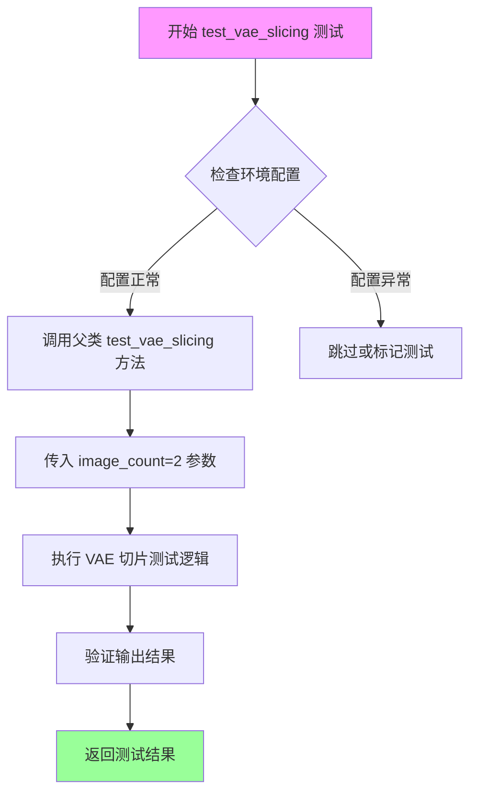

#### 带注释源码

```python
def test_vae_slicing(self):
    """
    测试 VAE 切片功能
    
    该测试方法继承自 PipelineTesterMixin，用于验证 AnimateDiffSparseControlNetPipeline
    在使用 VAE 切片时的正确性。VAE 切片是一种内存优化技术，可以将大图像分割成
    较小的块进行处理，从而降低显存占用。
    
    Returns:
        返回父类测试的执行结果，通常是 unittest 的断言结果
    """
    # 调用父类 PipelineTesterMixin 的 test_vae_slicing 方法
    # image_count=2 表示测试时使用2张图像进行验证
    return super().test_vae_slicing(image_count=2)
```


### `AnimateDiffSparseControlNetPipelineFastTests.test_encode_prompt_works_in_isolation`

该测试方法用于验证 `encode_prompt` 功能能够独立正常工作，通过构建额外的必要参数字典（包括设备类型、每提示词生成的图像数量以及是否使用无分类器自由引导），然后调用父类的同名测试方法来确保文本编码过程在隔离环境中能够正确执行。

参数：

- `self`：类的实例本身，用于访问类方法和属性

返回值：`any`，返回父类 `test_encode_prompt_works_in_isolation` 方法的执行结果

#### 流程图

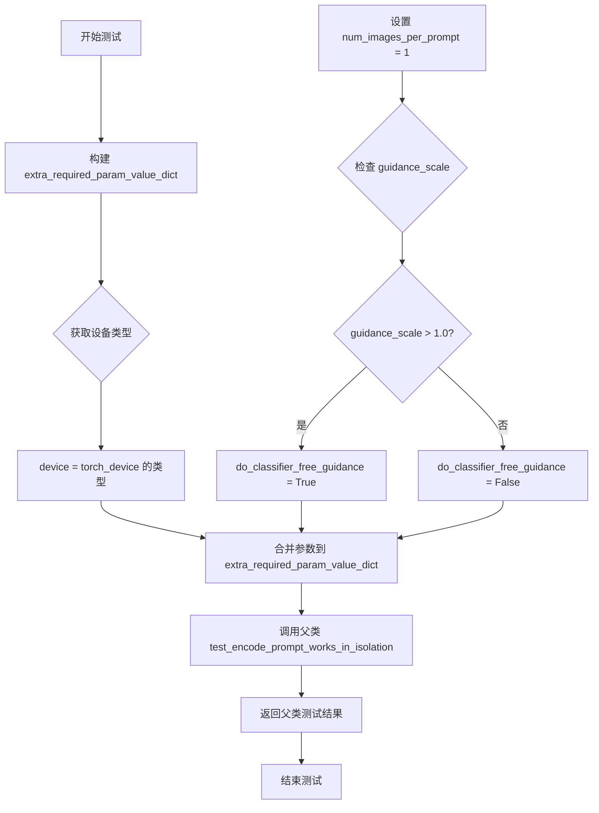

#### 带注释源码

```
def test_encode_prompt_works_in_isolation(self):
    """
    测试 encode_prompt 方法能够独立正常工作
    
    该方法创建一个包含额外必要参数的字典，用于验证文本编码功能
    在隔离环境中能否正确执行，继承自父类的测试方法
    """
    # 构建额外必要参数字典
    extra_required_param_value_dict = {
        # 获取当前测试设备的类型（如 'cuda' 或 'cpu'）
        "device": torch.device(torch_device).type,
        # 设置每提示词生成的图像数量为1
        "num_images_per_prompt": 1,
        # 根据 guidance_scale 判断是否启用无分类器自由引导
        # 如果 guidance_scale > 1.0 则启用，否则不启用
        "do_classifier_free_guidance": self.get_dummy_inputs(device=torch_device).get("guidance_scale", 1.0) > 1.0,
    }
    # 调用父类的测试方法，验证 encode_prompt 功能
    return super().test_encode_prompt_works_in_isolation(extra_required_param_value_dict)
```

## 关键组件


### AnimateDiffSparseControlNetPipeline

核心动画生成管道，结合了SparseControlNet和MotionAdapter，用于根据文本提示和条件帧生成动画视频。

### SparseControlNetModel

稀疏控制网络模型，用于从输入的条件帧中提取控制信息，支持简化条件嵌入配置。

### MotionAdapter

运动适配器模块，为Stable Diffusion模型添加时间维度的运动能力，处理视频帧间的时序信息。

### UNetMotionModel

运动UNet模型，继承自UNet2DConditionModel，增强了时序注意力机制以支持视频生成。

### AutoencoderKL

变分自编码器(VAE)模型，负责将图像编码到潜在空间并从潜在表示解码回图像空间。

### CLIPTextModel & CLIPTokenizer

文本编码组件，将文本提示转换为模型可理解的嵌入向量，用于条件生成。

### DDIMScheduler

DDIM调度器，提供确定性退火采样策略，控制去噪过程的噪声调度。

### DPMSolverMultistepScheduler

DPM-Solver多步调度器，一种高效的扩散模型采样方法，支持快速推理。

### LCMScheduler

LCM(Latent Consistency Models)调度器，用于加速一致性模型的采样过程。

### IPAdapterTesterMixin

IP-Adapter测试混入类，提供图像提示适配器功能的测试验证。

### SDFunctionTesterMixin

SD函数测试混入类，测试Stable Diffusion标准功能的兼容性。

### PipelineTesterMixin

管道测试混入类，提供管道通用功能的测试基础。

### PipelineFromPipeTesterMixin

管道继承测试混入类，验证管道从其他管道继承配置的能力。

### FreeInit

自由初始化方法，通过额外的时域和空域滤波器增强生成结果的多样性和质量。

### XFormers Attention

xFormers注意力机制优化，提供更高效的注意力计算实现。

### VAE Slicing

VAE切片技术，将VAE编码/解码过程分片处理以节省显存。

### Attention Slicing

注意力切片技术，将注意力计算分片处理以降低显存占用。


## 问题及建议


### 已知问题

-   **重复代码**：测试方法 `test_inference_batch_single_identical` 和 `test_inference_batch_single_identical_use_simplified_condition_embedding_true` 存在大量重复的批处理输入构建逻辑和断言代码，可提取为共享方法
-   **硬编码配置**：`get_dummy_components` 和 `get_dummy_inputs` 方法中包含大量硬编码的数值（如 `cross_attention_dim=8`、`video_height=32` 等），缺乏灵活性
-   **魔法数字**：多处使用魔法数字（如 `expected_max_diff=1e-4`、`sum_enabled > 1e1`、`max_diff_disabled < 1e-4`），缺乏常量定义
-   **未使用的导入**：导入了 `StableDiffusionPipeline`、`UNet2DConditionModel` 等组件但在测试代码中未直接使用
-   **设备相关条件分支**：MPS 设备特殊处理（`if str(device).startswith("mps")`）与 CUDA 设备的逻辑不一致，可能导致测试行为差异
-   **空实现测试**：`test_attention_slicing_forward_pass` 被跳过且方法体为空，缺乏实现
-   **配置过滤逻辑脆弱**：使用 `not k.startswith("_")` 过滤配置键的方式不够健壮，可能遗漏其他非公开配置
-   **测试依赖父类实现**：多个测试方法依赖 `super()` 调用父类实现（如 `test_vae_slicing`、`test_ip_adapter`），但传入的 `expected_pipe_slice` 可能与实际 pipeline 输出不匹配

### 优化建议

-   将重复的批处理输入构建逻辑抽取为私有方法，如 `_prepare_batched_inputs`
-   将魔法数字提取为类级别常量或配置文件
-   统一设备处理逻辑，或使用 pytest fixtures 管理设备参数
-   清理未使用的导入，保持代码整洁
-   为跳过的测试添加详细的 skip 原因说明，或实现相应的功能
-   使用更健壮的配置过滤方式，如检查 `k.startswith("__")` 或使用 `not callable(getattr(config, k, None))`
-   考虑将 `get_dummy_components` 的返回值参数化，支持不同配置场景

## 其它


### 设计目标与约束

本测试套件旨在验证 AnimateDiffSparseControlNetPipeline 的功能正确性和性能表现。设计目标包括：确保管道在 CPU 和 CUDA 设备上的兼容性、验证批量推理的一致性、测试不同的调度器和注意力机制、确保配置在不同管道间转换时的一致性。约束条件包括：XFormers 注意力仅支持 CUDA、需要 Accelerator 环境、部分功能如 Attention Slicing 未启用。

### 错误处理与异常设计

测试使用标准 Python unittest 框架，通过 assert 语句进行断言验证。关键错误处理包括：`unittest.skip` 用于跳过不支持的测试场景（如 MPS 设备的注意力切片测试）、`unittest.skipIf` 用于条件性跳过（如 XFormers 需要 CUDA 环境）。预期异常类型包括：设备不兼容错误、配置不一致错误、输出形状不匹配错误、数值溢出或 NaN 值检测。

### 数据流与状态机

测试数据流如下：get_dummy_components() 创建虚拟模型组件 → get_dummy_inputs() 生成虚拟输入数据 → 管道执行推理 → 验证输出。状态转换包括：管道初始化（从组件字典创建）→ 设备迁移（to CPU/CUDA）→ 数据类型转换（float32/float16）→ 推理执行 → 输出验证。FreeInit 机制具有 enable/disable 两种状态，可动态切换。

### 外部依赖与接口契约

主要外部依赖包括：PyTorch (torch)、NumPy、transformers (CLIPTextConfig, CLIPTextModel, CLIPTokenizer)、diffusers 库（AnimateDiffSparseControlNetPipeline, UNet2DConditionModel, SparseControlNetModel 等）。接口契约：pipeline_class 属性指定被测试管道类、params 和 batch_params 定义推理参数、required_optional_params 定义可选参数集、get_dummy_components() 返回组件字典、get_dummy_inputs() 返回输入字典。

### 测试覆盖范围

测试覆盖以下场景：管道配置一致性验证、Motion UNet 类型检查、设备迁移（CPU/CUDA）、数据类型转换（float32/float16）、提示嵌入支持、批量推理一致性、VAE 切片、IP 适配器功能、自由初始化（FreeInit）机制、多种调度器兼容性（DPMSolverMultistepScheduler, LCMScheduler）、XFormers 注意力机制。

### 配置与参数说明

关键配置参数：video_height/video_width 默认 32x32、num_frames 默认 2 帧、num_inference_steps 默认 2 步、guidance_scale 默认 7.5、output_type 默认 "pt"。组件配置：cross_attention_dim=8、block_out_channels=(8,8)、layers_per_block=2、norm_num_groups=2。

### 性能基准与预期

预期输出形状：frames[0] 的 batch_size 维度应与输入匹配。数值稳定性要求：输出中 NaN 值数量必须为 0。批量推理一致性：max_diff 应小于 1e-4。FreeInit 效果：启用后 sum_enabled 应大于 1e1，禁用后 max_diff_disabled 应小于 1e-4。

### 已知限制与假设

已知限制：Attention Slicing 功能未启用、MPS 设备支持不完整（generator 处理特殊）、XFormers 需要 CUDA 环境。假设：测试在 dummy 组件上运行，不依赖真实预训练模型权重。
    