# `diffusers\tests\pipelines\animatediff\test_animatediff_video2video.py` 详细设计文档

这是一个针对AnimateDiffVideoToVideoPipeline的单元测试文件，用于测试视频到视频的AI生成管道功能，包括模型加载、推理、设备迁移、注意力机制、FreeNoise和FreeInit等高级特性的正确性。

## 整体流程

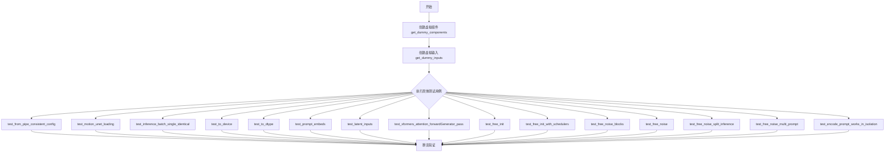

## 类结构

```
unittest.TestCase
├── IPAdapterTesterMixin
├── PipelineTesterMixin
├── PipelineFromPipeTesterMixin
└── AnimateDiffVideoToVideoPipelineFastTests
```

## 全局变量及字段


### `AnimateDiffVideoToVideoPipelineFastTests.pipeline_class`
    
指定测试所针对的管道类，用于实例化管道进行测试。

类型：`type`
    


### `AnimateDiffVideoToVideoPipelineFastTests.params`
    
文本到图像测试参数名列表，用于定义测试所需的参数。

类型：`tuple`
    


### `AnimateDiffVideoToVideoPipelineFastTests.batch_params`
    
视频到视频批量测试参数名列表，用于批量输入测试。

类型：`tuple`
    


### `AnimateDiffVideoToVideoPipelineFastTests.required_optional_params`
    
测试所需的可选参数集合，用于验证管道接受这些参数。

类型：`frozenset`
    
    

## 全局函数及方法


### `to_np`

该函数用于将 PyTorch 张量（Tensor）转换为 NumPy 数组，以便进行数值比较或与不支持 PyTorch 张量的代码进行交互。函数首先检查输入是否为 PyTorch 张量，如果是，则分离计算图、移至 CPU 并转换为 NumPy 数组；否则直接返回原对象。

参数：

- `tensor`：`torch.Tensor` 或任意类型，需要转换的张量或数据对象

返回值：`numpy.ndarray` 或输入的原始类型，当输入为 PyTorch 张量时返回对应的 NumPy 数组，否则直接返回原对象。

#### 流程图

```mermaid
flowchart TD
    A[开始: 输入 tensor] --> B{isinstance(tensor, torch.Tensor)?}
    B -- 是 --> C[调用 tensor.detach]
    C --> D[调用 tensor.cpu]
    D --> E[调用 tensor.numpy]
    E --> F[返回转换后的 NumPy 数组]
    B -- 否 --> G[直接返回原始 tensor]
    F --> H[结束]
    G --> H
```

#### 带注释源码

```python
def to_np(tensor):
    """
    将 PyTorch 张量转换为 NumPy 数组的辅助函数。
    
    该函数主要用于测试场景中，将模型输出的张量转换为 NumPy 数组，
    以便使用 NumPy 进行数值比较和断言。
    
    参数:
        tensor: 输入的张量，可以是 torch.Tensor 或其他类型（如已转换的 NumPy 数组）
    
    返回值:
        如果输入是 torch.Tensor，返回对应的 NumPy 数组；
        否则直接返回原始输入对象
    """
    # 检查输入是否为 PyTorch 张量
    if isinstance(tensor, torch.Tensor):
        # 分离计算图，避免梯度追踪带来的额外内存开销
        tensor = tensor.detach()
        # 将张量从计算设备（如 GPU）移至 CPU
        tensor = tensor.cpu()
        # 将 PyTorch 张量转换为 NumPy 数组
        tensor = tensor.numpy()

    # 返回转换后的数组或原始对象
    return tensor
```


### `AnimateDiffVideoToVideoPipelineFastTests.get_dummy_components`

该方法用于创建测试用的虚拟组件（dummy components），生成包含 UNet、调度器、VAE、文本编码器、分词器、运动适配器等核心组件的字典，用于测试 AnimateDiffVideoToVideoPipeline 的功能。

参数：无

返回值：`Dict[str, Any]`，返回包含管道各组件的字典，包括 unet、scheduler、vae、motion_adapter、text_encoder、tokenizer、feature_extractor 和 image_encoder

#### 流程图

```mermaid
flowchart TD
    A[开始] --> B[设置 cross_attention_dim = 8]
    B --> C[设置 block_out_channels = (8, 8)]
    C --> D[设置随机种子 torch.manual_seed(0)]
    D --> E[创建 UNet2DConditionModel]
    E --> F[创建 DDIMScheduler]
    F --> G[设置随机种子 torch.manual_seed(0)]
    G --> H[创建 AutoencoderKL VAE]
    H --> I[设置随机种子 torch.manual_seed(0)]
    I --> J[创建 CLIPTextConfig]
    J --> K[创建 CLIPTextModel 文本编码器]
    K --> L[创建 CLIPTokenizer 分词器]
    L --> M[设置随机种子 torch.manual_seed(0)]
    M --> N[创建 MotionAdapter 运动适配器]
    N --> O[组装 components 字典]
    O --> P[返回 components]
```

#### 带注释源码

```python
def get_dummy_components(self):
    """
    创建用于测试的虚拟组件字典
    
    Returns:
        Dict[str, Any]: 包含AnimateDiffVideoToVideoPipeline所需的所有组件
    """
    # 设置交叉注意力维度为8，用于减少计算复杂度
    cross_attention_dim = 8
    # 设置模块输出通道数为(8, 8)的元组
    block_out_channels = (8, 8)

    # 设置随机种子为0，确保测试结果可复现
    torch.manual_seed(0)
    # 创建UNet2DConditionModel条件扩散模型
    # 参数：输出通道块、每层块数、样本大小、输入/输出通道数、上下块类型、交叉注意力维度、归一化组数
    unet = UNet2DConditionModel(
        block_out_channels=block_out_channels,
        layers_per_block=2,
        sample_size=8,
        in_channels=4,
        out_channels=4,
        down_block_types=("CrossAttnDownBlock2D", "DownBlock2D"),
        up_block_types=("CrossAttnUpBlock2D", "UpBlock2D"),
        cross_attention_dim=cross_attention_dim,
        norm_num_groups=2,
    )
    
    # 创建DDIMScheduler调度器，用于控制扩散模型的采样过程
    scheduler = DDIMScheduler(
        beta_start=0.00085,
        beta_end=0.012,
        beta_schedule="linear",
        clip_sample=False,
    )
    
    # 重置随机种子确保VAE初始化可复现
    torch.manual_seed(0)
    # 创建AutoencoderKL变分自编码器，用于编码/解码图像到潜在空间
    vae = AutoencoderKL(
        block_out_channels=block_out_channels,
        in_channels=3,
        out_channels=3,
        down_block_types=["DownEncoderBlock2D", "DownEncoderBlock2D"],
        up_block_types=["UpDecoderBlock2D", "UpDecoderBlock2D"],
        latent_channels=4,
        norm_num_groups=2,
    )
    
    # 重置随机种子确保文本编码器初始化可复现
    torch.manual_seed(0)
    # 创建CLIPTextConfig文本编码器配置
    text_encoder_config = CLIPTextConfig(
        bos_token_id=0,
        eos_token_id=2,
        hidden_size=cross_attention_dim,
        intermediate_size=37,
        layer_norm_eps=1e-05,
        num_attention_heads=4,
        num_hidden_layers=5,
        pad_token_id=1,
        vocab_size=1000,
    )
    # 使用配置创建CLIPTextModel文本编码器模型
    text_encoder = CLIPTextModel(text_encoder_config)
    # 加载CLIPTokenizer分词器，用于将文本转换为token ids
    tokenizer = CLIPTokenizer.from_pretrained("hf-internal-testing/tiny-random-clip")
    
    # 重置随机种子确保运动适配器初始化可复现
    torch.manual_seed(0)
    # 创建MotionAdapter运动适配器，用于视频到视频的动画扩散
    motion_adapter = MotionAdapter(
        block_out_channels=block_out_channels,
        motion_layers_per_block=2,
        motion_norm_num_groups=2,
        motion_num_attention_heads=4,
    )

    # 组装所有组件到字典中返回
    components = {
        "unet": unet,
        "scheduler": scheduler,
        "vae": vae,
        "motion_adapter": motion_adapter,
        "text_encoder": text_encoder,
        "tokenizer": tokenizer,
        "feature_extractor": None,  # 特征提取器设为None（可选组件）
        "image_encoder": None,      # 图像编码器设为None（可选组件）
    }
    return components
```


### `AnimateDiffVideoToVideoPipelineFastTests.get_dummy_inputs`

该方法用于生成测试用的虚拟输入参数，模拟视频到视频（Video-to-Video）pipeline的输入场景。通过创建指定数量的虚拟视频帧、随机生成器以及标准的推理参数，为pipeline的单元测试提供一致的输入数据。

参数：

- `device`：`torch.device`，执行设备，用于创建PyTorch随机数生成器
- `seed`：`int`，随机数种子，默认值为0，用于确保测试结果的可重复性
- `num_frames`：`int`，视频帧数量，默认值为2，指定生成的虚拟视频包含的帧数

返回值：`Dict`，返回包含以下键的字典对象：
- `video`：List[Image.Image]，由PIL Image对象组成的列表，每帧为32x32的RGB空白图像
- `prompt`：`str`，文本提示词，描述生成内容
- `generator`：`torch.Generator`，PyTorch随机数生成器
- `num_inference_steps`：`int`，推理步数，设置为2
- `guidance_scale`：`float`，引导比例，设置为7.5
- `output_type`：`str`，输出类型，设置为"pt"（PyTorch张量）

#### 流程图

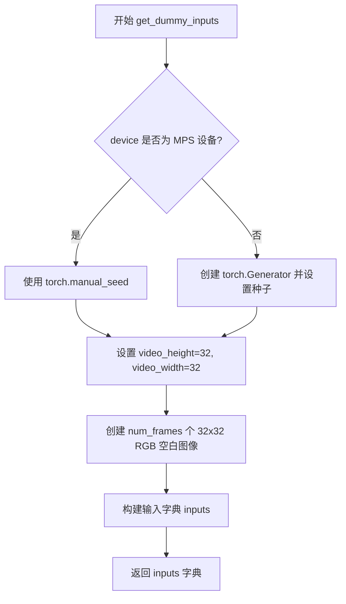

#### 带注释源码

```python
def get_dummy_inputs(self, device, seed=0, num_frames: int = 2):
    """
    生成用于测试的虚拟输入参数
    
    参数:
        device: 执行设备 (torch.device)
        seed: 随机数种子，默认值为0
        num_frames: 视频帧数量，默认值为2
    
    返回:
        包含虚拟输入参数的字典
    """
    # 判断设备是否为 MPS (Apple Silicon)
    if str(device).startswith("mps"):
        # MPS 设备使用 torch.manual_seed
        generator = torch.manual_seed(seed)
    else:
        # 其他设备创建 Generator 并设置种子
        generator = torch.Generator(device=device).manual_seed(seed)

    # 设置虚拟视频的分辨率
    video_height = 32
    video_width = 32
    
    # 创建虚拟视频帧列表 (每个元素是 32x32 的空白 RGB 图像)
    video = [Image.new("RGB", (video_width, video_height))] * num_frames

    # 构建输入参数字典
    inputs = {
        "video": video,                                    # 视频帧列表
        "prompt": "A painting of a squirrel eating a burger",  # 文本提示词
        "generator": generator,                            # 随机数生成器
        "num_inference_steps": 2,                         # 推理步数
        "guidance_scale": 7.5,                             # 引导比例
        "output_type": "pt",                               # 输出类型 (PyTorch)
    }
    return inputs
```


### `AnimateDiffVideoToVideoPipelineFastTests.test_from_pipe_consistent_config`

该测试方法验证了 `AnimateDiffVideoToVideoPipeline` 与 `StableDiffusionPipeline` 之间通过 `from_pipe` 方法进行管道组件转换时配置的一致性。具体流程为：从预训练模型创建原始 `StableDiffusionPipeline`，提取额外组件后通过 `from_pipe` 转换为 `AnimateDiffVideoToVideoPipeline`，再从新管道转换回原始管道类型，最后对比两次转换后的配置对象是否完全一致。

参数：
- `self`：隐式参数，类型为 `AnimateDiffVideoToVideoPipelineFastTests` 实例，表示测试类本身

返回值：`None`，该方法为测试方法，通过断言验证逻辑，不返回任何值

#### 流程图

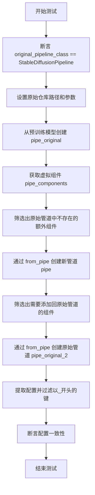

#### 带注释源码

```python
def test_from_pipe_consistent_config(self):
    """
    测试 from_pipe 方法在 AnimateDiffVideoToVideoPipeline 和 StableDiffusionPipeline
    之间进行双向转换时配置的一致性
    """
    # 验证原始管道类是否为 StableDiffusionPipeline
    assert self.original_pipeline_class == StableDiffusionPipeline
    
    # 定义测试用的预训练模型仓库和加载参数
    original_repo = "hf-internal-testing/tinier-stable-diffusion-pipe"
    original_kwargs = {"requires_safety_checker": False}

    # 步骤1: 使用 StableDiffusionPipeline 从预训练模型创建原始管道
    pipe_original = self.original_pipeline_class.from_pretrained(original_repo, **original_kwargs)

    # 步骤2: 将原始 SD 管道转换为 AnimateDiffVideoToVideoPipeline
    # 获取虚拟组件配置
    pipe_components = self.get_dummy_components()
    
    # 筛选出原始管道中不存在的组件（这些是 AnimateDiff 特有的组件）
    pipe_additional_components = {}
    for name, component in pipe_components.items():
        if name not in pipe_original.components:
            pipe_additional_components[name] = component

    # 通过 from_pipe 方法将 SD 管道转换为视频到视频管道
    pipe = self.pipeline_class.from_pipe(pipe_original, **pipe_additional_components)

    # 步骤3: 将新管道再转换回原始 SD 管道
    original_pipe_additional_components = {}
    for name, component in pipe_original.components.items():
        # 找出需要额外添加的组件：要么新管道中没有，要么类型不匹配
        if name not in pipe.components or not isinstance(component, pipe.components[name].__class__):
            original_pipe_additional_components[name] = component

    # 从新管道转换回原始 SD 管道
    pipe_original_2 = self.original_pipeline_class.from_pipe(pipe, **original_pipe_additional_components)

    # 步骤4: 比较配置一致性
    # 过滤掉以 _ 开头的内部配置键
    original_config = {k: v for k, v in pipe_original.config.items() if not k.startswith("_")}
    original_config_2 = {k: v for k, v in pipe_original_2.config.items() if not k.startswith("_")}
    
    # 断言两次转换后的配置应该完全一致
    assert original_config_2 == original_config
```


### `AnimateDiffVideoToVideoPipelineFastTests.test_motion_unet_loading`

这是一个单元测试方法，用于验证 `AnimateDiffVideoToVideoPipeline` 在实例化时能够正确加载 Motion UNet（即 `UNetMotionModel`）。

参数：

- `self`：`AnimateDiffVideoToVideoPipelineFastTests`，隐式参数，表示测试类实例本身

返回值：`None`，无显式返回值（测试方法通过 `assert` 断言进行验证）

#### 流程图

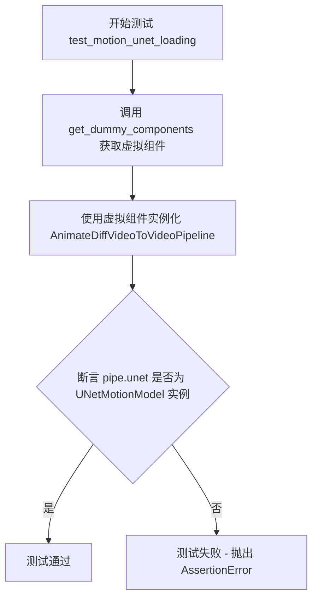

#### 带注释源码

```python
def test_motion_unet_loading(self):
    """
    测试 Motion UNet 的加载功能。
    
    该测试验证 AnimateDiffVideoToVideoPipeline 在实例化时
    能够正确将基础的 UNet2DConditionModel 替换为 UNetMotionModel，
    以支持视频到视频的扩散模型生成。
    """
    # 步骤1: 获取虚拟组件
    # get_dummy_components() 方法创建用于测试的虚拟模型组件
    # 包括: unet, scheduler, vae, motion_adapter, text_encoder, tokenizer 等
    components = self.get_dummy_components()
    
    # 步骤2: 使用虚拟组件实例化管道
    # AnimateDiffVideoToVideoPipeline 在初始化时会自动将
    # 基础 UNet2DConditionModel 与 MotionAdapter 结合,
    # 创建支持运动生成的 UNetMotionModel
    pipe = AnimateDiffVideoToVideoPipeline(**components)
    
    # 步骤3: 验证 UNet 类型
    # assert 验证 pipe.unet 是否被正确转换为 UNetMotionModel 类型
    # 这是确保 Motion Adapter 功能正常工作的前提条件
    assert isinstance(pipe.unet, UNetMotionModel)
```


### `AnimateDiffVideoToVideoPipelineFastTests.test_attention_slicing_forward_pass`

该方法是一个被跳过的单元测试，原本用于验证 AnimateDiffVideoToVideoPipeline 的注意力切片（Attention Slicing）前向传播功能，但由于当前管道未启用此功能，故标记为跳过。

参数：

- `self`：`AnimateDiffVideoToVideoPipelineFastTests`（隐式），对类实例的引用

返回值：`None`，该方法不返回任何值

#### 流程图

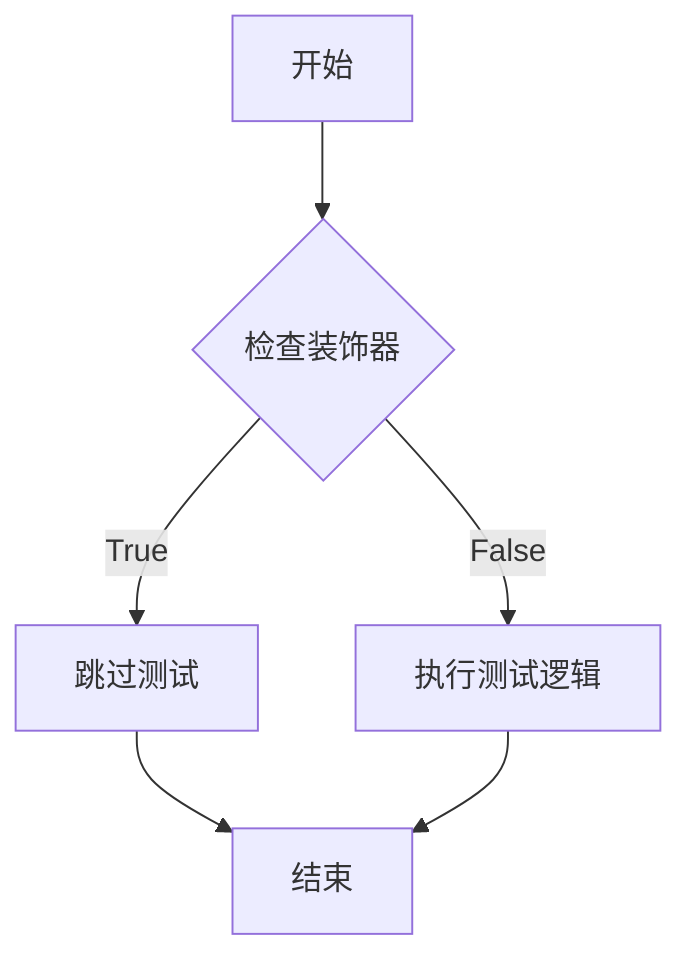

> **注**：由于方法被 `@unittest.skip` 装饰器跳过，实际执行流程直接跳转到测试结束，不会执行任何测试逻辑。

#### 带注释源码

```python
@unittest.skip("Attention slicing is not enabled in this pipeline")
def test_attention_slicing_forward_pass(self):
    """
    测试注意力切片前向传播的单元测试。
    
    该测试原本用于验证管道的注意力切片功能是否正常工作。
    注意力切片是一种内存优化技术，可以减少大模型推理时的显存占用。
    
    当前由于 AnimateDiffVideoToVideoPipeline 未启用注意力切片功能，
    该测试被跳过。
    
    参数:
        self: 类实例引用，继承自 unittest.TestCase
        
    返回值:
        None: 该方法不返回任何值
    """
    pass  # 测试逻辑未实现，方法体为空
```


### `AnimateDiffVideoToVideoPipelineFastTests.test_ip_adapter`

该方法是一个单元测试，用于验证 AnimateDiffVideoToVideoPipeline 的 IP-Adapter 功能是否正常工作。IP-Adapter 是一种图像提示适配器，允许模型根据输入图像生成相关内容。该测试根据当前设备类型设置期望的输出切片值，并调用父类的测试方法执行实际的 IP-Adapter 功能验证。

参数：

- `self`：实例本身，包含测试所需的组件和配置

返回值：`None`，该方法为测试用例，通过断言验证功能正确性，不返回具体数值

#### 流程图

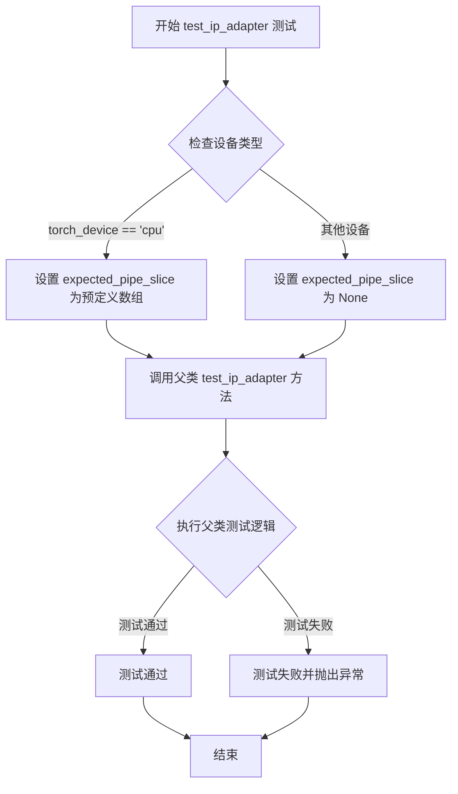

#### 带注释源码

```python
def test_ip_adapter(self):
    """
    测试 AnimateDiffVideoToVideoPipeline 的 IP-Adapter 功能。
    
    IP-Adapter 是一种图像提示适配器，允许扩散模型根据输入图像
    生成相关内容。该测试验证管道在处理图像提示时的正确性。
    """
    # 初始化期望输出切片为 None，用于非 CPU 设备
    expected_pipe_slice = None

    # 根据设备类型设置期望的输出切片值
    # CPU 设备有预定义的参考值用于验证
    if torch_device == "cpu":
        expected_pipe_slice = np.array(
            [
                0.5569,
                0.6250,
                0.4145,
                0.5613,
                0.5563,
                0.5213,
                0.5092,
                0.4950,
                0.4950,
                0.5685,
                0.3858,
                0.4864,
                0.6458,
                0.4312,
                0.5518,
                0.5608,
                0.4418,
                0.5378,
            ]
        )
    
    # 调用父类 IPAdapterTesterMixin 的 test_ip_adapter 方法
    # 传入期望的输出切片值进行验证
    return super().test_ip_adapter(expected_pipe_slice=expected_pipe_slice)
```


### `AnimateDiffVideoToVideoPipelineFastTests.test_inference_batch_single_identical`

该测试方法验证管道在批量推理模式下，单个样本的输出与批量中对应索引样本的输出是否一致（像素级等价），确保批处理逻辑正确实现。

参数：

- `batch_size`：`int`，默认值=2，测试用的批量大小
- `expected_max_diff`：`float`，默认值=1e-4，单个输出与批量输出之间的最大允许差异
- `additional_params_copy_to_batched_inputs`：`list`，默认值=["num_inference_steps"]，需要复制到批量输入的额外参数列表

返回值：`None`，无返回值（测试方法，通过 assert 断言验证正确性）

#### 流程图

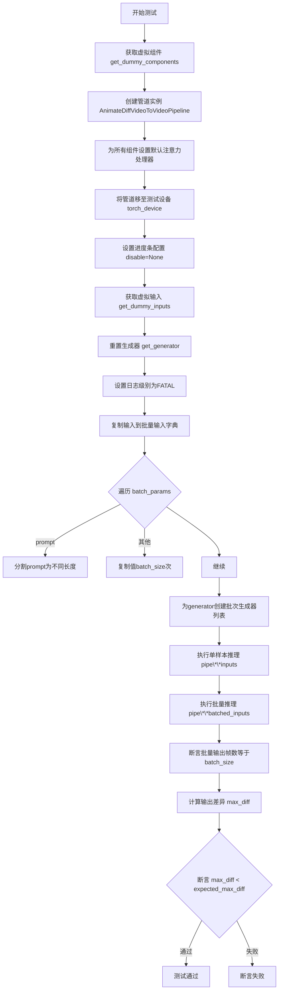

#### 带注释源码

```python
def test_inference_batch_single_identical(
    self,
    batch_size=2,
    expected_max_diff=1e-4,
    additional_params_copy_to_batched_inputs=["num_inference_steps"],
):
    """
    测试批量推理时，单个样本的输出是否与批量中对应索引的样本输出一致。
    
    参数:
        batch_size: 批量大小，默认为2
        expected_max_diff: 允许的最大差异，默认为1e-4
        additional_params_copy_to_batched_inputs: 需要复制到批量输入的额外参数
    """
    # 步骤1: 获取虚拟（测试用）组件
    components = self.get_dummy_components()
    
    # 步骤2: 使用虚拟组件创建管道实例
    pipe = self.pipeline_class(**components)
    
    # 步骤3: 为所有组件设置默认注意力处理器，确保推理一致性
    for components in pipe.components.values():
        if hasattr(components, "set_default_attn_processor"):
            components.set_default_attn_processor()

    # 步骤4: 将管道移至测试设备（如CUDA或CPU）
    pipe.to(torch_device)
    
    # 步骤5: 配置进度条（disable=None表示启用进度条）
    pipe.set_progress_bar_config(disable=None)
    
    # 步骤6: 获取虚拟输入（包含video, prompt, generator等）
    inputs = self.get_dummy_inputs(torch_device)
    
    # 步骤7: 重置生成器，以防在get_dummy_inputs中被使用
    inputs["generator"] = self.get_generator(0)

    # 步骤8: 获取日志记录器并设置日志级别为FATAL，减少输出噪声
    logger = logging.get_logger(pipe.__module__)
    logger.setLevel(level=diffusers.logging.FATAL)

    # 步骤9: 准备批量输入字典
    batched_inputs = {}
    batched_inputs.update(inputs)

    # 步骤10: 根据batch_params处理每个参数
    for name in self.batch_params:
        if name not in inputs:
            continue

        value = inputs[name]
        if name == "prompt":
            # prompt特殊处理：生成长度递减的prompt列表，最后一个为超长prompt
            len_prompt = len(value)
            batched_inputs[name] = [value[: len_prompt // i] for i in range(1, batch_size + 1)]
            batched_inputs[name][-1] = 100 * "very long"
        else:
            # 其他参数复制batch_size次
            batched_inputs[name] = batch_size * [value]

    # 步骤11: 为每个批量样本创建独立的生成器
    if "generator" in inputs:
        batched_inputs["generator"] = [self.get_generator(i) for i in range(batch_size)]

    # 步骤12: 设置批量大小
    if "batch_size" in inputs:
        batched_inputs["batch_size"] = batch_size

    # 步骤13: 复制额外参数到批量输入
    for arg in additional_params_copy_to_batched_inputs:
        batched_inputs[arg] = inputs[arg]

    # 步骤14: 执行单样本推理
    output = pipe(**inputs)
    
    # 步骤15: 执行批量推理
    output_batch = pipe(**batched_inputs)

    # 步骤16: 断言批量输出的第一帧数量等于batch_size
    assert output_batch[0].shape[0] == batch_size

    # 步骤17: 计算单个输出与批量输出的最大差异
    max_diff = np.abs(to_np(output_batch[0][0]) - to_np(output[0][0])).max()
    
    # 步骤18: 断言差异在允许范围内
    assert max_diff < expected_max_diff
```


### `AnimateDiffVideoToVideoPipelineFastTests.test_to_device`

该测试方法用于验证 `AnimateDiffVideoToVideoPipeline` 管道在不同计算设备（CPU 和 GPU）之间迁移时的正确性，确保所有模型组件正确移动到目标设备且推理输出不包含 NaN 值。

参数：此方法无显式外部参数（`self` 为类实例本身）

返回值：`None`，该方法为单元测试，使用断言进行验证，不返回任何值

#### 流程图

```mermaid
flowchart TD
    A[开始测试 test_to_device] --> B[获取虚拟组件]
    B --> C[创建管道实例]
    C --> D[设置进度条配置]
    D --> E[将管道移至 CPU]
    E --> F[获取所有组件的设备类型]
    F --> G{所有设备是否为 CPU?}
    G -->|是 --> H[执行 CPU 推理]
    G -->|否 --> I[断言失败, 测试终止]
    H --> J{输出包含 NaN?}
    J -->|否 --> K[将管道移至 torch_device]
    J -->|是 --> I
    K --> L[获取所有组件的设备类型]
    L --> M{所有设备是否为 torch_device?}
    M -->|是 --> N[执行 torch_device 推理]
    M -->|否 --> I
    N --> O{输出包含 NaN?}
    O -->|否 --> P[测试通过]
    O -->|是 --> I
```

#### 带注释源码

```python
@require_accelerator  # 装饰器：要求有加速器才能运行此测试
def test_to_device(self):
    """
    测试管道在不同设备（CPU 和 GPU）之间的迁移功能。
    验证所有模型组件正确移动到目标设备且推理输出有效。
    """
    # 获取虚拟组件配置，用于创建测试管道
    components = self.get_dummy_components()
    
    # 使用获取的组件实例化管道
    pipe = self.pipeline_class(**components)
    
    # 配置进度条（disable=None 表示不禁用进度条）
    pipe.set_progress_bar_config(disable=None)

    # ===== 第一阶段：测试 CPU 设备 =====
    
    # 将整个管道（包括内部创建的 motion UNet）移至 CPU
    pipe.to("cpu")
    
    # 由于管道内部会创建新的 motion UNet，需要从 pipe.components 检查设备
    # 遍历所有组件，获取具有 'device' 属性的组件的设备类型
    model_devices = [
        component.device.type 
        for component in pipe.components.values() 
        if hasattr(component, "device")
    ]
    
    # 断言：所有组件的设备都应该是 'cpu'
    self.assertTrue(all(device == "cpu" for device in model_devices))

    # 使用 CPU 进行推理，获取输出（取第一个元素 [0]）
    # 调用 get_dummy_inputs 获取虚拟输入参数
    output_cpu = pipe(**self.get_dummy_inputs("cpu"))[0]
    
    # 断言：CPU 输出中不应包含 NaN 值
    self.assertTrue(np.isnan(output_cpu).sum() == 0)

    # ===== 第二阶段：测试目标设备（通常是 GPU）=====
    
    # 将管道移至 torch_device（通常是 CUDA 设备）
    pipe.to(torch_device)
    
    # 再次获取所有组件的设备类型
    model_devices = [
        component.device.type 
        for component in pipe.components.values() 
        if hasattr(component, "device")
    ]
    
    # 断言：所有组件的设备都应该是 torch_device
    self.assertTrue(all(device == torch_device for device in model_devices))

    # 使用目标设备进行推理
    output_device = pipe(**self.get_dummy_inputs(torch_device))[0]
    
    # 断言：目标设备输出中不应包含 NaN 值
    # 使用 to_np 将张量转换为 numpy 数组进行 NaN 检查
    self.assertTrue(np.isnan(to_np(output_device)).sum() == 0)
```


### `AnimateDiffVideoToVideoPipelineFastTests.test_to_dtype`

该函数是一个单元测试方法，用于验证 `AnimateDiffVideoToVideoPipeline` 管道在切换数据类型（dtype）时，所有模型组件的数据类型能够正确切换。它首先检查默认数据类型为 float32，然后调用 `pipe.to(dtype=torch.float16)` 切换到 float16，并验证所有组件的数据类型已正确切换。

参数：

- `self`：隐式参数，`AnimateDiffVideoToVideoPipelineFastTests` 类的实例，表示测试类本身

返回值：无明确返回值（`None`），该方法通过断言（assert）验证数据类型转换的正确性，若验证失败则抛出异常

#### 流程图

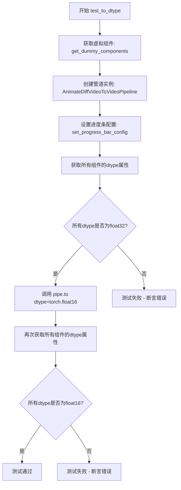

#### 带注释源码

```python
def test_to_dtype(self):
    """
    测试管道的数据类型转换功能。
    
    验证要点：
    1. 默认情况下，管道组件使用 torch.float32
    2. 调用 pipe.to(dtype=torch.float16) 后，所有组件应切换到 torch.float16
    """
    # 步骤1：获取虚拟（测试用）组件
    # 这里创建用于测试的虚拟模型组件，而非加载真实预训练模型
    components = self.get_dummy_components()
    
    # 步骤2：使用虚拟组件实例化 AnimateDiffVideoToVideoPipeline 管道
    pipe = self.pipeline_class(**components)
    
    # 步骤3：配置进度条（disable=None 表示不禁用进度条）
    pipe.set_progress_bar_config(disable=None)
    
    # 步骤4：获取管道中所有具有 dtype 属性的组件的数据类型
    # 注意：pipeline 内部会创建一个新的 motion UNet，因此需要从 pipe.components 获取
    model_dtypes = [
        component.dtype 
        for component in pipe.components.values() 
        if hasattr(component, "dtype")
    ]
    
    # 步骤5：断言验证默认数据类型为 float32
    self.assertTrue(
        all(dtype == torch.float32 for dtype in model_dtypes),
        "默认数据类型应为 torch.float32"
    )
    
    # 步骤6：调用 to 方法将管道切换到 float16 数据类型
    pipe.to(dtype=torch.float16)
    
    # 步骤7：再次获取所有组件的数据类型
    model_dtypes = [
        component.dtype 
        for component in pipe.components.values() 
        if hasattr(component, "dtype")
    ]
    
    # 步骤8：断言验证切换后数据类型为 float16
    self.assertTrue(
        all(dtype == torch.float16 for dtype in model_dtypes),
        "切换后的数据类型应为 torch.float16"
    )
```


### `AnimateDiffVideoToVideoPipelineFastTests.test_prompt_embeds`

该测试函数用于验证 AnimateDiffVideoToVideoPipeline 管道能够正确处理直接传入的 prompt_embeds 参数（预计算的文本嵌入），而非使用原始的 prompt 字符串。当用户提供预计算的嵌入时，管道应跳过文本编码步骤并直接使用提供的嵌入进行推理。

参数：

- `self`：`AnimateDiffVideoToVideoPipelineFastTests`，测试类实例，隐式参数，包含测试所需的上下文和辅助方法

返回值：`None`，该测试函数不返回任何值，只执行断言验证管道的正确性

#### 流程图

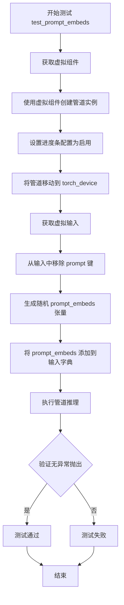

#### 带注释源码

```python
def test_prompt_embeds(self):
    """
    测试函数：验证管道能够正确处理预计算的 prompt_embeds 参数
    
    该测试确保当用户不提供 prompt 字符串而是直接提供预计算的 
    prompt_embeds 时，AnimateDiffVideoToVideoPipeline 能够正确运行。
    这对于需要重复使用相同文本嵌入或进行批量推理的场景非常重要。
    """
    # Step 1: 获取预配置的虚拟组件（UNet、VAE、Scheduler、TextEncoder等）
    components = self.get_dummy_components()
    
    # Step 2: 使用虚拟组件实例化 AnimateDiffVideoToVideoPipeline
    pipe = self.pipeline_class(**components)
    
    # Step 3: 配置进度条（disable=None 表示启用进度条）
    pipe.set_progress_bar_config(disable=None)
    
    # Step 4: 将管道移动到指定的计算设备（CPU/CUDA）
    pipe.to(torch_device)
    
    # Step 5: 获取测试用的虚拟输入参数
    inputs = self.get_dummy_inputs(torch_device)
    
    # Step 6: 移除 prompt 键，模拟用户不提供文本提示的场景
    inputs.pop("prompt")
    
    # Step 7: 创建随机张量作为预计算的文本嵌入
    # 形状: (batch_size=1, sequence_length=4, hidden_size=768)
    # hidden_size 来自 text_encoder.config.hidden_size
    inputs["prompt_embeds"] = torch.randn(
        (1, 4, pipe.text_encoder.config.hidden_size), 
        device=torch_device
    )
    
    # Step 8: 使用 prompt_embeds 调用管道进行推理
    # 如果管道能正确处理预计算的嵌入，推理将成功完成
    pipe(**inputs)
```


### `AnimateDiffVideoToVideoPipelineFastTests.test_latent_inputs`

该测试方法用于验证 `AnimateDiffVideoToVideoPipeline` 管道在直接接收预计算的潜在向量（latents）作为输入时的功能正确性，通过绕过视频编码步骤来测试管道对显式潜在输入的处理能力。

参数：

- `self`：`AnimateDiffVideoToVideoPipelineFastTests`，测试类实例本身

返回值：`None`，该方法为单元测试方法，无返回值，仅通过断言验证管道行为

#### 流程图

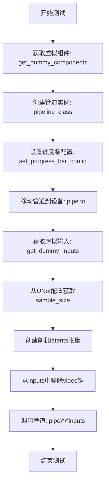

#### 带注释源码

```python
def test_latent_inputs(self):
    """
    测试管道直接接收潜在向量(latents)输入的功能。
    验证管道能够正确处理预先计算的潜在向量，
    而不依赖于从视频数据编码得到潜在向量。
    """
    # 步骤1: 获取用于测试的虚拟（dummy）组件
    components = self.get_dummy_components()
    
    # 步骤2: 使用虚拟组件实例化管道
    pipe = self.pipeline_class(**components)
    
    # 步骤3: 配置进度条（disable=None 表示启用进度条）
    pipe.set_progress_bar_config(disable=None)
    
    # 步骤4: 将管道移至测试设备（CPU或GPU）
    pipe.to(torch_device)

    # 步骤5: 获取虚拟输入参数
    inputs = self.get_dummy_inputs(torch_device)
    
    # 步骤6: 从UNet配置中获取样本大小，用于构建latents张量维度
    sample_size = pipe.unet.config.sample_size
    
    # 步骤7: 创建随机潜在向量张量
    # 形状: (batch_size=1, channels=4, frames=1, height, width)
    inputs["latents"] = torch.randn(
        (1, 4, 1, sample_size, sample_size), 
        device=torch_device
    )
    
    # 步骤8: 移除video参数，因为我们现在直接使用latents
    # 这样可以测试绕过视频编码器的代码路径
    inputs.pop("video")
    
    # 步骤9: 执行管道前向传播
    # 管道将使用提供的latents而非从视频编码得到的latents
    pipe(**inputs)
```


### `AnimateDiffVideoToVideoPipelineFastTests.test_xformers_attention_forwardGenerator_pass`

该测试方法用于验证 AnimateDiffVideoToVideoPipeline 在启用 xformers 内存高效注意力机制后，推理结果与默认注意力机制保持一致（差异小于阈值），确保 xformers 优化不会影响输出质量。

参数：

- `self`：测试类实例，无需显式传递

返回值：`None`，该方法为单元测试，通过 `assert` 语句验证结果是否符合预期

#### 流程图

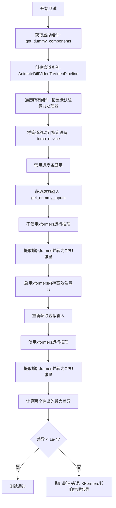

#### 带注释源码

```python
@require_accelerator
def test_xformers_attention_forwardGenerator_pass(self):
    """
    测试 xformers 注意力机制前向传播是否影响推理结果
    
    该测试验证：
    1. 管道可以正常启用 xformers 内存高效注意力
    2. 启用 xformers 后的输出与默认设置一致（差异小于1e-4）
    """
    # 步骤1: 获取预定义的虚拟组件，用于测试
    # 这些组件是轻量级的模拟模型，用于快速验证功能
    components = self.get_dummy_components()
    
    # 步骤2: 使用虚拟组件创建 AnimateDiffVideoToVideoPipeline 实例
    pipe = self.pipeline_class(**components)
    
    # 步骤3: 遍历管道中的所有组件
    # 对于支持 set_default_attn_processor 的组件，设置默认注意力处理器
    for component in pipe.components.values():
        if hasattr(component, "set_default_attn_processor"):
            component.set_default_attn_processor()
    
    # 步骤4: 将管道移动到测试设备（通常是CUDA设备）
    pipe.to(torch_device)
    
    # 步骤5: 禁用进度条显示，避免测试输出杂乱
    pipe.set_progress_bar_config(disable=None)
    
    # 步骤6: 获取虚拟输入数据
    # 包含: video frames, prompt, generator, num_inference_steps, guidance_scale, output_type
    inputs = self.get_dummy_inputs(torch_device)
    
    # 步骤7: 不使用xformers的默认注意力机制运行推理
    # 返回结果包含 frames 属性，取第一个元素得到视频帧
    output_without_offload = pipe(**inputs).frames[0]
    
    # 步骤8: 确保输出张量在CPU上（如果是GPU张量则移动到CPU）
    # 统一在CPU上进行数值比较
    output_without_offload = (
        output_without_offload.cpu() if torch.is_tensor(output_without_offload) else output_without_offload
    )
    
    # 步骤9: 启用 xformers 提供的内存高效注意力机制
    # xformers 可以显著减少注意力计算的内存占用
    pipe.enable_xformers_memory_efficient_attention()
    
    # 步骤10: 重新获取虚拟输入（确保随机性一致）
    inputs = self.get_dummy_inputs(torch_device)
    
    # 步骤11: 使用 xformers 注意力机制运行推理
    output_with_offload = pipe(**inputs).frames[0]
    
    # 步骤12: 确保输出在CPU上
    output_with_offload = (
        output_with_offload.cpu() if torch.is_tensor(output_with_offload) else output_without_offload
    )
    
    # 步骤13: 计算两个输出之间的最大绝对差异
    # 使用 to_np 将张量转换为 numpy 数组进行比较
    max_diff = np.abs(to_np(output_with_offload) - to_np(output_without_offload)).max()
    
    # 步骤14: 断言验证差异在可接受范围内
    # xformers 优化应该在数值上与默认实现等效
    self.assertLess(max_diff, 1e-4, "XFormers attention should not affect the inference results")
```


### `AnimateDiffVideoToVideoPipelineFastTests.test_free_init`

该方法是一个单元测试，用于验证 AnimateDiffVideoToVideoPipeline 中 FreeInit 功能的正确性。测试通过比较默认管道、启用 FreeInit 和禁用 FreeInit 三种情况下的输出来确保 FreeInit 功能按预期工作——启用时应产生与默认不同的结果，禁用时应产生与默认相似的结果。

参数：

- `self`：隐式参数，测试类实例本身，无需显式传递

返回值：`None`，该方法为单元测试，通过 assert 语句进行断言验证，不返回任何值

#### 流程图

```mermaid
flowchart TD
    A[开始测试 test_free_init] --> B[获取虚拟组件 components]
    B --> C[创建管道实例 pipe]
    C --> D[配置进度条 disable=None]
    D --> E[将管道移至 torch_device]
    E --> F[获取默认输入并推理]
    F --> G[提取 frames_normal]
    G --> H[启用 FreeInit<br/>num_iters=2<br/>use_fast_sampling=True<br/>method=butterworth<br/>order=4<br/>spatial_stop_frequency=0.25<br/>temporal_stop_frequency=0.25]
    H --> I[获取新输入并推理]
    I --> J[提取 frames_enable_free_init]
    J --> K[禁用 FreeInit]
    K --> L[获取新输入并推理]
    L --> M[提取 frames_disable_free_init]
    M --> N[计算 sum_enabled<br/>= |frames_normal - frames_enable_free_init|]
    N --> O[计算 max_diff_disabled<br/>= |frames_normal - frames_disable_free_init|]
    O --> P{sum_enabled > 1e1?}
    P -->|是| Q{max_diff_disabled < 1e-4?}
    P -->|否| R[测试失败: 启用FreeInit应产生不同结果]
    Q -->|是| S[测试通过]
    Q -->|否| T[测试失败: 禁用FreeInit应产生相似结果]
    R --> U[结束]
    S --> U
    T --> U
```

#### 带注释源码

```python
def test_free_init(self):
    """
    测试 FreeInit 功能是否正常工作。
    
    FreeInit 是一种用于改进视频生成质量的技术，通过在推理过程中
    调整噪声初始化方式来产生不同的结果。本测试验证：
    1. 启用 FreeInit 后产生的结果应与默认管道不同
    2. 禁用 FreeInit 后产生的结果应与默认管道相似
    """
    # 第一步：准备测试环境
    # 获取预定义的虚拟组件，用于创建测试管道
    components = self.get_dummy_components()
    
    # 使用虚拟组件实例化 AnimateDiffVideoToVideoPipeline
    pipe = self.pipeline_class(**components)
    
    # 配置进度条显示，disable=None 表示不禁用进度条
    pipe.set_progress_bar_config(disable=None)
    
    # 将管道移至测试设备（通常是 CUDA 或 CPU）
    pipe.to(torch_device)

    # 第二步：获取默认管道输出（作为基准）
    # 使用虚拟输入调用管道
    inputs_normal = self.get_dummy_inputs(torch_device)
    # 执行推理并获取第一帧结果
    frames_normal = pipe(**inputs_normal).frames[0]

    # 第三步：启用 FreeInit 并获取输出
    # 配置 FreeInit 的参数：
    # - num_iters: 迭代次数
    # - use_fast_sampling: 是否使用快速采样
    # - method: 滤波器方法（butterworth、Chebyshev 等）
    # - order: 滤波器阶数
    # - spatial_stop_frequency: 空间停止频率
    # - temporal_stop_frequency: 时间停止频率
    pipe.enable_free_init(
        num_iters=2,
        use_fast_sampling=True,
        method="butterworth",
        order=4,
        spatial_stop_frequency=0.25,
        temporal_stop_frequency=0.25,
    )
    
    # 使用新的随机种子获取输入并推理
    inputs_enable_free_init = self.get_dummy_inputs(torch_device)
    frames_enable_free_init = pipe(**inputs_enable_free_init).frames[0]

    # 第四步：禁用 FreeInit 并获取输出
    pipe.disable_free_init()
    inputs_disable_free_init = self.get_dummy_inputs(torch_device)
    frames_disable_free_init = pipe(**inputs_disable_free_init).frames[0]

    # 第五步：验证结果
    # 计算启用 FreeInit 时输出与默认输出的差异总和
    # 差异应该较大（> 1e1），证明 FreeInit 确实改变了生成结果
    sum_enabled = np.abs(to_np(frames_normal) - to_np(frames_enable_free_init)).sum()
    
    # 计算禁用 FreeInit 时输出与默认输出的最大差异
    # 差异应该较小（< 1e-4），证明禁用后管道恢复正常行为
    max_diff_disabled = np.abs(to_np(frames_normal) - to_np(frames_disable_free_init)).max()
    
    # 断言：启用 FreeInit 应产生显著不同的结果
    self.assertGreater(
        sum_enabled, 1e1, 
        "Enabling of FreeInit should lead to results different from the default pipeline results"
    )
    
    # 断言：禁用 FreeInit 应产生与默认相似的结果
    self.assertLess(
        max_diff_disabled,
        1e-4,
        "Disabling of FreeInit should lead to results similar to the default pipeline results",
    )
```


### `AnimateDiffVideoToVideoPipelineFastTests.test_free_init_with_schedulers`

该测试方法用于验证 FreeInit 功能与不同调度器（DPMSolverMultistepScheduler 和 LCMScheduler）结合使用时的正确性。测试创建管道，获取正常推理结果，然后分别使用两种调度器启用 FreeInit，验证启用 FreeInit 后的结果与正常结果存在显著差异（确保 FreeInit 确实对输出产生了影响）。

参数：

- `self`：测试类实例本身，包含测试所需的上下文和断言方法

返回值：`None`，通过 `self.assertGreater` 断言进行验证，不返回任何值

#### 流程图

```mermaid
flowchart TD
    A[开始测试] --> B[获取虚拟组件 components = self.get_dummy_components]
    B --> C[创建管道 pipe = pipeline_class(**components)]
    C --> D[设置进度条 disable=None]
    D --> E[将管道移动到 torch_device]
    E --> F[获取正常输入 inputs_normal = self.get_dummy_inputs]
    F --> G[执行正常推理 frames_normal = pipe(**inputs_normal).frames[0]]
    G --> H[定义测试调度器列表 schedulers_to_test: DPMSolverMultistepScheduler, LCMScheduler]
    H --> I[从组件中移除 scheduler]
    I --> J{遍历 schedulers_to_test 中的每个 scheduler}
    J -->|是| K[将当前 scheduler 赋值给 components['scheduler']]
    K --> L[使用新 scheduler 创建新管道 pipe]
    L --> M[设置进度条并移动到设备]
    M --> N[启用 FreeInit: pipe.enable_free_init]
    N --> O[获取测试输入并执行推理]
    O --> P[计算差异 sum_enabled]
    P --> Q{断言: sum_enabled > 1e1}
    Q -->|通过| J
    J -->|遍历完成| R[测试结束]
    Q -->|失败| S[抛出 AssertionError]
```

#### 带注释源码

```python
def test_free_init_with_schedulers(self):
    """
    测试 FreeInit 功能与不同调度器结合使用时的行为。
    验证启用 FreeInit 后输出结果与默认结果存在显著差异。
    """
    # 步骤1: 获取预定义的虚拟组件（用于测试的轻量级模型配置）
    components = self.get_dummy_components()
    
    # 步骤2: 使用虚拟组件创建 AnimateDiffVideoToVideoPipeline 管道实例
    pipe: AnimateDiffVideoToVideoPipeline = self.pipeline_class(**components)
    
    # 步骤3: 配置进度条显示（disable=None 表示启用进度条）
    pipe.set_progress_bar_config(disable=None)
    
    # 步骤4: 将管道及其所有组件移动到指定的计算设备（torch_device）
    pipe.to(torch_device)

    # 步骤5: 获取标准的虚拟输入数据进行正常推理
    inputs_normal = self.get_dummy_inputs(torch_device)
    
    # 步骤6: 执行正常推理并提取生成的视频帧（取第一个结果）
    frames_normal = pipe(**inputs_normal).frames[0]

    # 步骤7: 定义需要测试的调度器列表
    # 这些调度器将用于测试 FreeInit 与不同推理策略的兼容性
    schedulers_to_test = [
        # DPMSolverMultistepScheduler: 多步微分方程求解器调度器
        DPMSolverMultistepScheduler.from_config(
            components["scheduler"].config,
            timestep_spacing="linspace",      # 时间步长均匀分布
            beta_schedule="linear",           # 线性 beta 调度
            algorithm_type="dpmsolver++",    # 使用 dpmsolver++ 算法
            steps_offset=1,                   # 步骤偏移量
            clip_sample=False,                # 不裁剪样本
        ),
        # LCMScheduler: 潜在一致性模型调度器（支持快速推理）
        LCMScheduler.from_config(
            components["scheduler"].config,
            timestep_spacing="linspace",
            beta_schedule="linear",
            steps_offset=1,
            clip_sample=False,
        ),
    ]
    
    # 步骤8: 从组件字典中移除原有的调度器
    # 以便为每个测试调度器创建新的管道实例
    components.pop("scheduler")

    # 步骤9: 遍历每个调度器进行独立测试
    for scheduler in schedulers_to_test:
        # 9.1: 将当前调度器添加到组件中
        components["scheduler"] = scheduler
        
        # 9.2: 使用新调度器配置创建新的管道实例
        pipe: AnimateDiffVideoToVideoPipeline = self.pipeline_class(**components)
        
        # 9.3: 配置进度条
        pipe.set_progress_bar_config(disable=None)
        
        # 9.4: 移动到计算设备
        pipe.to(torch_device)

        # 9.5: 启用 FreeInit 功能（用于改善视频生成质量）
        # num_iters=2: 迭代次数
        # use_fast_sampling=False: 不使用快速采样
        pipe.enable_free_init(num_iters=2, use_fast_sampling=False)

        # 9.6: 获取测试输入并执行推理
        inputs = self.get_dummy_inputs(torch_device)
        frames_enable_free_init = pipe(**inputs).frames[0]
        
        # 9.7: 计算启用 FreeInit 与正常推理结果的差异绝对值之和
        sum_enabled = np.abs(to_np(frames_normal) - to_np(frames_enable_free_init)).sum()

        # 9.8: 断言验证
        # FreeInit 应该使结果与默认结果明显不同（差异总和 > 10）
        self.assertGreater(
            sum_enabled,
            1e1,
            "Enabling of FreeInit should lead to results different from the default pipeline results",
        )
```


### `AnimateDiffVideoToVideoPipelineFastTests.test_free_noise_blocks`

这是一个单元测试方法，用于验证 AnimateDiffVideoToVideoPipeline 的 FreeNoise（自由噪声）功能是否正确启用和禁用。该测试通过检查 UNet 的下采样块中的运动模块的 transformer blocks 类型，来确认 FreeNoiseTransformerBlock 在启用时被正确使用，在禁用后被正确移除。

参数：此方法无显式参数（继承自 unittest.TestCase 的实例方法，隐式接收 `self`）

返回值：`None`，该方法为测试用例，不返回任何值

#### 流程图

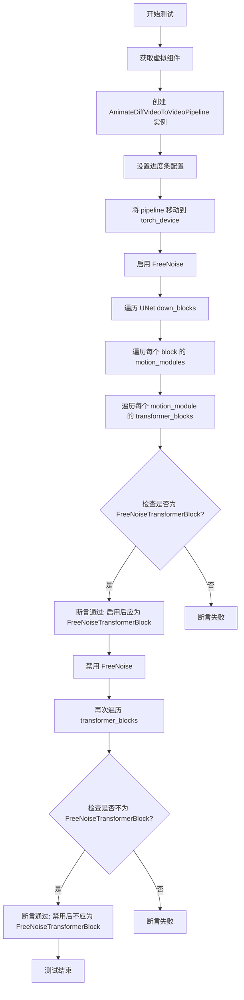

#### 带注释源码

```python
def test_free_noise_blocks(self):
    """
    测试 FreeNoise 功能在 AnimateDiffVideoToVideoPipeline 中的启用和禁用行为。
    验证在启用 FreeNoise 后，运动模块的 transformer blocks 类型正确转换为 FreeNoiseTransformerBlock，
    在禁用后正确恢复为原始类型。
    """
    # 步骤1: 获取虚拟组件（用于测试的假模型组件）
    components = self.get_dummy_components()
    
    # 步骤2: 使用虚拟组件创建 AnimateDiffVideoToVideoPipeline 实例
    pipe: AnimateDiffVideoToVideoPipeline = self.pipeline_class(**components)
    
    # 步骤3: 设置进度条配置，disable=None 表示启用进度条
    pipe.set_progress_bar_config(disable=None)
    
    # 步骤4: 将 pipeline 移动到指定的计算设备（torch_device）
    pipe.to(torch_device)

    # 步骤5: 启用 FreeNoise 功能
    pipe.enable_free_noise()
    
    # 步骤6: 遍历 UNet 的所有下采样块（down_blocks）
    for block in pipe.unet.down_blocks:
        # 步骤7: 遍历每个 block 中的所有运动模块（motion_modules）
        for motion_module in block.motion_modules:
            # 步骤8: 遍历每个运动模块中的所有 transformer blocks
            for transformer_block in motion_module.transformer_blocks:
                # 步骤9: 断言验证启用 FreeNoise 后，transformer block 类型应为 FreeNoiseTransformerBlock
                self.assertTrue(
                    isinstance(transformer_block, FreeNoiseTransformerBlock),
                    "Motion module transformer blocks must be an instance of `FreeNoiseTransformerBlock` after enabling FreeNoise.",
                )

    # 步骤10: 禁用 FreeNoise 功能
    pipe.disable_free_noise()
    
    # 步骤11: 再次遍历验证禁用后的状态
    for block in pipe.unet.down_blocks:
        for motion_module in block.motion_modules:
            for transformer_block in motion_module.transformer_blocks:
                # 步骤12: 断言验证禁用 FreeNoise 后，transformer block 类型不应为 FreeNoiseTransformerBlock
                self.assertFalse(
                    isinstance(transformer_block, FreeNoiseTransformerBlock),
                    "Motion module transformer blocks must not be an instance of `FreeNoiseTransformerBlock` after disabling FreeNoise.",
                )
```


### `AnimateDiffVideoToVideoPipelineFastTests.test_free_noise`

该测试方法用于验证 AnimateDiffVideoToVideoPipeline 的 FreeNoise 功能是否正常工作，通过比较启用/禁用 FreeNoise 时的输出差异来确认功能的正确性。

参数：

- `self`：隐式参数，测试类实例本身

返回值：`None`，该方法为测试方法，不返回任何值，主要通过断言验证功能正确性

#### 流程图

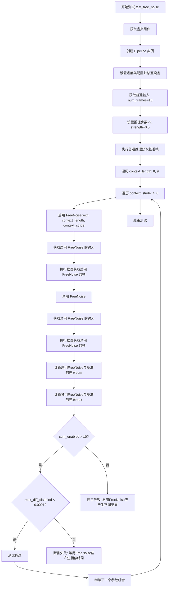

#### 带注释源码

```python
def test_free_noise(self):
    # 获取用于测试的虚拟组件（模型、调度器等）
    components = self.get_dummy_components()
    
    # 使用虚拟组件创建 AnimateDiffVideoToVideoPipeline 实例
    pipe: AnimateDiffVideoToVideoPipeline = self.pipeline_class(**components)
    
    # 设置进度条配置（disable=None 表示启用进度条）
    pipe.set_progress_bar_config(disable=None)
    
    # 将 Pipeline 移动到指定的计算设备（如 CUDA 或 CPU）
    pipe.to(torch_device)

    # 获取普通输入参数，num_frames=16 表示生成16帧视频
    inputs_normal = self.get_dummy_inputs(torch_device, num_frames=16)
    
    # 设置推理步数为2（用于快速测试）
    inputs_normal["num_inference_steps"] = 2
    
    # 设置视频转换强度为0.5（影响原始视频与生成视频的混合比例）
    inputs_normal["strength"] = 0.5
    
    # 执行基准推理，获取普通情况下的输出帧
    frames_normal = pipe(**inputs_normal).frames[0]

    # 遍历不同的 context_length 和 context_stride 参数组合
    for context_length in [8, 9]:
        for context_stride in [4, 6]:
            # 使用指定参数启用 FreeNoise 功能
            # context_length: 噪声上下文长度
            # context_stride: 噪声上下文步幅
            pipe.enable_free_noise(context_length, context_stride)

            # 获取启用 FreeNoise 后的输入参数
            inputs_enable_free_noise = self.get_dummy_inputs(torch_device, num_frames=16)
            inputs_enable_free_noise["num_inference_steps"] = 2
            inputs_enable_free_noise["strength"] = 0.5
            
            # 执行推理，获取启用 FreeNoise 时的输出帧
            frames_enable_free_noise = pipe(**inputs_enable_free_noise).frames[0]

            # 禁用 FreeNoise 功能
            pipe.disable_free_noise()
            
            # 获取禁用 FreeNoise 后的输入参数
            inputs_disable_free_noise = self.get_dummy_inputs(torch_device, num_frames=16)
            inputs_disable_free_noise["num_inference_steps"] = 2
            inputs_disable_free_noise["strength"] = 0.5
            
            # 执行推理，获取禁用 FreeNoise 时的输出帧
            frames_disable_free_noise = pipe(**inputs_disable_free_noise).frames[0]

            # 计算启用 FreeNoise 结果与基准结果的差异总和
            # 预期：启用 FreeNoise 应该产生与基准明显不同的结果
            sum_enabled = np.abs(to_np(frames_normal) - to_np(frames_enable_free_noise)).sum()
            
            # 计算禁用 FreeNoise 结果与基准结果的差异最大值
            # 预期：禁用 FreeNoise 应该产生与基准非常相似的结果
            max_diff_disabled = np.abs(to_np(frames_normal) - to_np(frames_disable_free_noise)).max()
            
            # 断言：启用 FreeNoise 应该导致结果与默认不同（差异总和应大于10）
            self.assertGreater(
                sum_enabled,
                1e1,  # 10
                "Enabling of FreeNoise should lead to results different from the default pipeline results"
            )
            
            # 断言：禁用 FreeNoise 应该产生与默认相似的结果（最大差异应小于0.0001）
            self.assertLess(
                max_diff_disabled,
                1e-4,  # 0.0001
                "Disabling of FreeNoise should lead to results similar to the default pipeline results"
            )
```


### `AnimateDiffVideoToVideoPipelineFastTests.test_free_noise_split_inference`

该测试方法用于验证 FreeNoise 分割推理（split inference）功能，测试启用空间和时间分割的内存优化后，管道输出结果应与默认管道结果保持高度相似（差异小于 1e-4）。

参数：

- `self`：测试类实例，无需显式传递

返回值：`None`，该方法为测试方法，通过断言验证功能正确性

#### 流程图

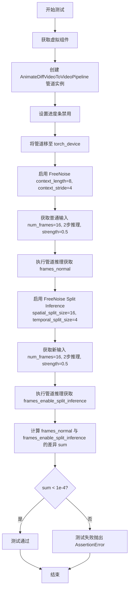

#### 带注释源码

```python
def test_free_noise_split_inference(self):
    """
    测试 FreeNoise 分割推理功能
    验证启用内存优化后结果与默认管道结果相似
    """
    # 步骤1: 获取虚拟组件用于测试
    components = self.get_dummy_components()
    
    # 步骤2: 使用虚拟组件创建 AnimateDiffVideoToVideoPipeline 管道实例
    pipe: AnimateDiffVideoToVideoPipeline = self.pipeline_class(**components)
    
    # 步骤3: 设置进度条配置，disable=None 表示不禁用进度条
    pipe.set_progress_bar_config(disable=None)
    
    # 步骤4: 将管道移至测试设备 (torch_device)
    pipe.to(torch_device)

    # 步骤5: 启用 FreeNoise 功能，context_length=8 表示上下文长度，context_stride=4 表示步幅
    pipe.enable_free_noise(8, 4)

    # 步骤6: 获取默认虚拟输入，num_frames=16 帧视频
    inputs_normal = self.get_dummy_inputs(torch_device, num_frames=16)
    inputs_normal["num_inference_steps"] = 2  # 设置推理步数为2
    inputs_normal["strength"] = 0.5  # 设置转换强度为0.5
    
    # 步骤7: 执行管道推理，获取普通 FreeNoise 的输出帧
    frames_normal = pipe(**inputs_normal).frames[0]

    # 步骤8: 启用 FreeNoise 分割推理内存优化
    # spatial_split_size=16 表示空间分割大小
    # temporal_split_size=4 表示时间分割大小
    pipe.enable_free_noise_split_inference(spatial_split_size=16, temporal_split_size=4)

    # 步骤9: 获取新的虚拟输入用于分割推理测试
    inputs_enable_split_inference = self.get_dummy_inputs(torch_device, num_frames=16)
    inputs_enable_split_inference["num_inference_steps"] = 2
    inputs_enable_split_inference["strength"] = 0.5
    
    # 步骤10: 执行分割推理管道，获取优化后的输出帧
    frames_enable_split_inference = pipe(**inputs_enable_split_inference).frames[0]

    # 步骤11: 计算普通输出与分割推理输出的差异绝对值之和
    sum_split_inference = np.abs(to_np(frames_normal) - to_np(frames_enable_split_inference)).sum()
    
    # 步骤12: 断言验证差异小于阈值 (1e-4)
    # 如果差异过大，说明分割推理优化导致结果偏离原始结果
    self.assertLess(
        sum_split_inference,
        1e-4,
        "Enabling FreeNoise Split Inference memory-optimizations should lead to results similar to the default pipeline results",
    )
```


### `AnimateDiffVideoToVideoPipelineFastTests.test_free_noise_multi_prompt`

该测试方法用于验证 AnimateDiffVideoToVideoPipeline 在启用 FreeNoise（自由噪声）功能时对多提示词（multi-prompt）的支持情况，包括正常情况下的多提示词处理以及超出帧索引范围的提示词是否正确抛出 ValueError 异常。

参数：

- `self`：隐式参数，测试类实例本身

返回值：`None`，该方法为单元测试方法，通过断言验证逻辑，不返回具体数据

#### 流程图

```mermaid
flowchart TD
    A[开始测试 test_free_noise_multi_prompt] --> B[获取虚拟组件 get_dummy_components]
    B --> C[创建 AnimateDiffVideoToVideoPipeline 实例]
    C --> D[设置进度条配置 disable=None]
    D --> E[将管道移至 torch_device]
    E --> F[设置 context_length=8, context_stride=4]
    F --> G[启用 FreeNoise 功能 enable_free_noise]
    G --> H[准备测试输入 num_frames=16]
    H --> I[设置多提示词 prompt={0: 'Caterpillar on a leaf', 10: 'Butterfly on a leaf'}]
    I --> J[设置 num_inference_steps=2, strength=0.5]
    J --> K[执行管道并获取结果 frames[0]]
    K --> L{验证无异常}
    L -->|成功| M[准备超界提示词 prompt包含索引42]
    M --> N[执行管道应抛出 ValueError]
    N --> O{验证异常类型}
    O -->|正确| P[测试通过]
    O -->|错误| Q[测试失败]
```

#### 带注释源码

```python
def test_free_noise_multi_prompt(self):
    """
    测试 FreeNoise 功能与多提示词的兼容性
    验证：1. 有效的多提示词索引能正常工作 2. 超出的索引会抛出 ValueError
    """
    # 获取用于测试的虚拟（dummy）组件
    components = self.get_dummy_components()
    
    # 使用虚拟组件创建 AnimateDiffVideoToVideoPipeline 实例
    pipe: AnimateDiffVideoToVideoPipeline = self.pipeline_class(**components)
    
    # 配置进度条（disable=None 表示不禁用进度条）
    pipe.set_progress_bar_config(disable=None)
    
    # 将管道移至测试设备（cuda 或 cpu）
    pipe.to(torch_device)

    # 定义 FreeNoise 的上下文长度和步长参数
    context_length = 8
    context_stride = 4
    
    # 启用 FreeNoise 功能，传入上下文长度和步长
    pipe.enable_free_noise(context_length, context_stride)

    # === 测试用例1：有效的提示词索引 ===
    
    # 获取 dummy 输入数据，指定 16 帧视频
    inputs = self.get_dummy_inputs(torch_device, num_frames=16)
    
    # 设置多提示词字典：第0帧使用 "Caterpillar on a leaf"，第10帧使用 "Butterfly on a leaf"
    inputs["prompt"] = {0: "Caterpillar on a leaf", 10: "Butterfly on a leaf"}
    
    # 设置推理步数为 2（快速测试）
    inputs["num_inference_steps"] = 2
    
    # 设置转换强度为 0.5
    inputs["strength"] = 0.5
    
    # 执行管道并获取第一组生成的帧（验证多提示词在有效范围内正常工作）
    pipe(**inputs).frames[0]

    # === 测试用例2：验证索引越界时的异常处理 ===
    
    # 使用 assertRaises 验证当提示词索引超出范围时应抛出 ValueError
    with self.assertRaises(ValueError):
        # 重新获取输入数据
        inputs = self.get_dummy_inputs(torch_device, num_frames=16)
        
        # 设置推理参数
        inputs["num_inference_steps"] = 2
        inputs["strength"] = 0.5
        
        # 故意设置超出范围的提示词索引（42 超出 16 帧范围）
        inputs["prompt"] = {0: "Caterpillar on a leaf", 10: "Butterfly on a leaf", 42: "Error on a leaf"}
        
        # 执行管道，应抛出 ValueError 异常
        pipe(**inputs).frames[0]
```


### `AnimateDiffVideoToVideoPipelineFastTests.test_encode_prompt_works_in_isolation`

该测试方法用于验证 `encode_prompt` 方法能够独立工作（即在隔离环境下正确编码提示词），测试时会传入额外的必要参数（如设备类型、每提示词生成的图像数量、是否启用无分类器自由引导等）。

参数：

-  `self`：测试类实例本身，包含 `torch_device` 等属性用于获取测试环境信息

返回值：`any`，返回父类测试方法的执行结果，通常为 `None` 或断言结果

#### 流程图

```mermaid
flowchart TD
    A[开始测试] --> B[构建 extra_required_param_value_dict]
    B --> C{获取 torch_device}
    C -->|mps 设备| D[使用 torch.manual_seed]
    C -->|其他设备| E[使用 torch.Generator]
    D --> F[获取 guidance_scale]
    E --> F
    F --> G[判断 do_classifier_free_guidance]
    G --> H[调用父类测试方法]
    H --> I[返回测试结果]
```

#### 带注释源码

```python
def test_encode_prompt_works_in_isolation(self):
    """
    测试 encode_prompt 方法能否在隔离环境下正确工作
    """
    # 构建传递给父类测试方法的额外参数字典
    extra_required_param_value_dict = {
        # 获取设备类型字符串（如 'cuda'、'cpu'、'mps'）
        "device": torch.device(torch_device).type,
        # 每个提示词生成的图像数量，默认为 1
        "num_images_per_prompt": 1,
        # 判断是否启用无分类器自由引导（CFG）
        # 如果 guidance_scale > 1.0 则启用 CFG
        "do_classifier_free_guidance": self.get_dummy_inputs(device=torch_device).get("guidance_scale", 1.0) > 1.0,
    }
    # 调用父类（PipelineTesterMixin）的测试方法，传入参数字典
    return super().test_encode_prompt_works_in_isolation(extra_required_param_value_dict)
```

## 关键组件


### AnimateDiffVideoToVideoPipeline

用于视频到视频转换的扩散管道，支持运动适配器和文本提示生成视频

### MotionAdapter

运动模块适配器，为基础Stable Diffusion模型添加时间维度的运动建模能力

### UNetMotionModel

带运动模块的UNet模型，继承自UNet2DConditionModel，支持时序注意力机制

### FreeNoiseTransformerBlock

自由噪声Transformer块，用于实现FreeNoise功能的特殊Transformer块

### AutoencoderKL

变分自编码器(VAE)，负责将视频帧编码到潜在空间和解码回像素空间

### CLIPTextModel + CLIPTokenizer

CLIP文本编码器和解码器，将文本提示转换为文本嵌入向量

### DDIMScheduler / DPMSolverMultistepScheduler / LCMScheduler

不同的噪声调度器，用于控制扩散模型的采样过程

### IPAdapterTesterMixin

图像提示适配器(IP-Adapter)的测试混入类，提供IP-Adapter相关功能的测试方法

### FreeInit

一种初始化方法，通过BUTTERWORTH滤波器进行时空频率过滤，可提升生成视频的时间一致性

### FreeNoise

自由噪声机制，通过上下文长度和步长控制噪声采样，实现更好的时间连贯性

### xformers_memory_efficient_attention

Facebook提供的内存高效注意力机制实现，显著降低长视频生成的显存占用

### test_from_pipe_consistent_config

管道配置一致性测试，验证不同管道类型之间配置的正确传递和保留

### test_free_noise / test_free_noise_blocks

FreeNoise功能的核心测试，验证运动模块transformer块类型转换和生成结果的差异性

### get_dummy_components / get_dummy_inputs

测试辅助函数，用于构建虚拟的管道组件和测试输入数据


## 问题及建议


### 已知问题

- **硬编码的设备检查**：在 `test_ip_adapter` 方法中硬编码检查 `torch_device == "cpu"`，这种方式缺乏灵活性，测试应使用参数化或动态检测。
- **魔法数字和硬编码值**：代码中大量使用硬编码数值（如 `num_frames=16`、`context_length=8`、`context_stride=4`、`expected_max_diff=1e-4` 等），这些值应提取为类常量或配置文件。
- **重复的设置代码**：多个测试方法中重复出现 `pipe.set_progress_bar_config(disable=None)` 和 `pipe.to(torch_device)` 等设置代码，可提取为测试类的 `setUp` 方法或辅助方法。
- **被跳过的测试未实现**：`test_attention_slicing_forward_pass` 使用 `@unittest.skip` 跳过但没有任何实现代码，导致该功能完全没有测试覆盖。
- **类型注解不一致**：部分方法使用了类型注解（如 `pipe: AnimateDiffVideoToVideoPipeline`），但在其他地方又重新赋值 `pipe = self.pipeline_class(**components)`，风格不统一。
- **变量名遮蔽**：在 `test_inference_batch_single_identical` 方法中存在 `for components in pipe.components.values()`，变量名 `components` 与方法参数遮蔽，可能导致混淆。
- **测试断言过于宽松**：`test_free_noise_multi_prompt` 中的异常测试只检查是否抛出 `ValueError`，未验证具体的错误消息内容，测试精确度不足。
- **MPS 设备特殊处理**：`get_dummy_inputs` 方法中对 MPS 设备使用 `torch.manual_seed(seed)` 而其他设备使用 `torch.Generator(device=device).manual_seed(seed)`，这种不一致的处理可能导致测试行为差异。
- **方法名拼写错误风险**：`test_xformers_attention_forwardGenerator_pass` 方法名中包含不必要的大写字母，可能是笔误。

### 优化建议

- 提取所有硬编码的测试参数为类级别的常量（如 `DEFAULT_NUM_FRAMES = 16`、`DEFAULT_CONTEXT_LENGTH = 8` 等），提高代码可维护性。
- 将通用的设置逻辑（如模型加载、设备分配）提取到 `setUp` 方法中，或创建专门的辅助方法（如 `_setup_pipeline`）。
- 实现被跳过的 `test_attention_slicing_forward_pass` 测试，或添加明确的注释说明为何该功能不被支持。
- 统一类型注解的使用风格，避免在同一类中混合使用注解和不使用注解。
- 在异常测试中添加具体的错误消息验证，例如 `with self.assertRaises(ValueError, match=".*"):`。
- 修复变量名遮蔽问题，将循环变量改为更明确的名称（如 `component`）。
- 统一 `get_dummy_inputs` 方法中随机数生成器的创建方式，确保在不同设备上行为一致。
- 为需要特定硬件（如 CUDA、xformers）的测试添加更明确的标记和跳过条件说明。

## 其它


### 设计目标与约束

本测试文件旨在验证 AnimateDiffVideoToVideoPipeline 的核心功能正确性，包括视频到视频转换、FreeNoise 特性、FreeInit 特性、XFormers 注意力机制、多调度器兼容性等。测试需在 CPU 和 CUDA 设备上均可运行，支持 MPS 设备，依赖 diffusers 库和 transformers 库。

### 错误处理与异常设计

测试中主要使用 assert 语句进行断言验证，通过 unittest.TestCase 的 assertTrue、assertLess、assertGreater、assertEqual 等方法检查预期行为。对于预期失败的场景（如 FreeNoise 多提示词边界检查），使用 self.assertRaises(ValueError) 捕获异常并验证。XFormers 测试在条件不满足时使用 unittest.skipIf 跳过。

### 数据流与状态机

测试数据流主要分为两类：组件初始化流程和推理调用流程。组件初始化通过 get_dummy_components 方法创建 UNet、Scheduler、VAE、TextEncoder、Tokenizer、MotionAdapter 等组件；推理调用通过 get_dummy_inputs 生成测试输入（包括 video、prompt、generator、num_inference_steps、guidance_scale 等参数），然后传递给 pipeline 的 __call__ 方法执行推理，最终返回包含 frames 的结果对象。

### 外部依赖与接口契约

本测试文件依赖以下外部库：unittest（测试框架）、numpy（数值计算）、torch（深度学习框架）、PIL（图像处理）、transformers（CLIP 文本模型）、diffusers（核心管道和模型组件）。关键接口契约包括：pipeline_class 指向 AnimateDiffVideoToVideoPipeline，params 定义 TEXT_TO_IMAGE_PARAMS，batch_params 定义 VIDEO_TO_VIDEO_BATCH_PARAMS，required_optional_params 定义可选参数集合。管道组件需实现 device 和 dtype 属性以支持设备迁移和类型转换。

### 性能考量与基准测试

测试中包含性能相关的验证：test_inference_batch_single_identical 用于验证批处理与单样本推理的一致性，设置 expected_max_diff=1e-4；test_xformers_attention_forwardGenerator_pass 验证 XFormers 注意力机制不会影响推理结果精度；test_free_noise_split_inference 验证分块推理内存优化不影响结果准确性。测试使用小规模模型（cross_attention_dim=8, block_out_channels=(8,8)）和少量推理步数（num_inference_steps=2）以加快执行速度。

### 测试覆盖范围

测试覆盖以下核心功能：test_from_pipe_consistent_config 验证管道配置一致性；test_motion_unet_loading 验证 MotionAdapter 正确加载为 UNetMotionModel；test_to_device 和 test_to_dtype 验证设备和数据类型迁移；test_prompt_embeds 和 test_latent_inputs 验证提示词嵌入和潜在向量输入；test_free_init 和 test_free_init_with_schedulers 验证 FreeInit 功能及调度器兼容性；test_free_noise_blocks、test_free_noise、test_free_noise_split_inference、test_free_noise_multi_prompt 验证 FreeNoise 各类特性；test_ip_adapter 验证 IP-Adapter 功能。

    