# `diffusers\tests\pipelines\animatediff\test_animatediff_video2video_controlnet.py` 详细设计文档

这是一个针对AnimateDiffVideoToVideoControlNetPipeline的单元测试文件，用于验证视频到视频控制网络流水线的各项功能，包括模型加载、推理一致性、IP适配器支持、注意力切片、xformers优化、FreeInit初始化方法和FreeNoise功能等。

## 整体流程

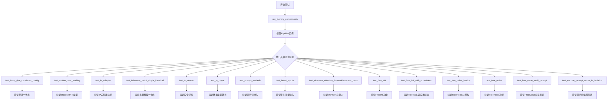

## 类结构

```
unittest.TestCase
└── AnimateDiffVideoToVideoControlNetPipelineFastTests (测试类)
    ├── IPAdapterTesterMixin (混入)
    ├── PipelineTesterMixin (混入)
    └── PipelineFromPipeTesterMixin (混入)
```

## 全局变量及字段


### `to_np`
    
将张量转换为numpy数组的辅助函数

类型：`function`
    


### `AnimateDiffVideoToVideoControlNetPipelineFastTests.pipeline_class`
    
待测试的AnimateDiff视频到视频ControlNet pipeline类

类型：`type`
    


### `AnimateDiffVideoToVideoControlNetPipelineFastTests.params`
    
文本到图像参数集合，用于定义pipeline的输入参数

类型：`frozenset`
    


### `AnimateDiffVideoToVideoControlNetPipelineFastTests.batch_params`
    
视频到视频批处理参数集合，包含conditioning_frames参数

类型：`set`
    


### `AnimateDiffVideoToVideoControlNetPipelineFastTests.required_optional_params`
    
必需的可选参数集合，定义了可选但常用的参数

类型：`frozenset`
    


### `AnimateDiffVideoToVideoControlNetPipelineFastTests.original_pipeline_class`
    
原始StableDiffusionPipeline类，用于测试from_pipe配置一致性

类型：`type`
    
    

## 全局函数及方法


### `to_np`

将 torch.Tensor 对象转换为 NumPy 数组，以便于后续的数值处理或可视化。如果输入不是 Tensor，则直接返回原对象。

参数：
- `tensor`：`torch.Tensor` 或任意类型，输入的张量或数据对象。当输入为 torch.Tensor 时，会进行梯度分离、设备转移（CPU）和类型转换；若为其他类型，则直接返回。

返回值：`numpy.ndarray` 或输入的原始类型，转换后的 NumPy 数组或原对象。

#### 流程图

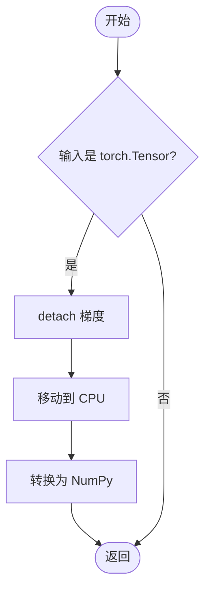

#### 带注释源码

```python
def to_np(tensor):
    """
    将张量转换为 numpy 数组
    
    参数:
        tensor: torch.Tensor 或其他类型
            输入的张量对象。如果不是 torch.Tensor 类型，将直接返回原对象。
    
    返回:
        numpy.ndarray 或原类型
            转换后的 numpy 数组，如果输入不是张量则返回原对象。
    """
    # 检查输入是否为 PyTorch 张量
    if isinstance(tensor, torch.Tensor):
        # 分离梯度连接，阻止梯度追踪
        # 转移到 CPU 设备（避免 CUDA 内存问题）
        # 转换为 NumPy 数组格式
        tensor = tensor.detach().cpu().numpy()

    # 返回处理后的结果
    return tensor
```


### `AnimateDiffVideoToVideoControlNetPipelineFastTests.get_dummy_components`

该方法用于创建虚拟组件（dummy components），为 `AnimateDiffVideoToVideoControlNetPipeline` 管道测试提供所需的各种模型和配置，包括 UNet、ControlNet、调度器、VAE、运动适配器、文本编码器和分词器等。

参数：

- `self`：实例方法隐式参数，表示类的实例本身

返回值：`Dict[str, Any]`，返回一个包含虚拟组件的字典，键为组件名称，值为对应的模型对象或 None

#### 流程图

```mermaid
flowchart TD
    A[开始 get_dummy_components] --> B[设置 cross_attention_dim=8 和 block_out_channels]
    B --> C[创建 UNet2DConditionModel]
    C --> D[创建 DDIMScheduler]
    D --> E[创建 ControlNetModel]
    E --> F[创建 AutoencoderKL]
    F --> G[创建 CLIPTextConfig 和 CLIPTextModel]
    G --> H[创建 CLIPTokenizer]
    H --> I[创建 MotionAdapter]
    I --> J[组装 components 字典]
    J --> K[返回 components]
    
    C -.->|torch.manual_seed(0)| C
    E -.->|torch.manual_seed(0)| E
    F -.->|torch.manual_seed(0)| F
    I -.->|torch.manual_seed(0)| I
```

#### 带注释源码

```python
def get_dummy_components(self):
    """
    创建虚拟组件用于测试 AnimateDiffVideoToVideoControlNetPipeline
    
    Returns:
        Dict[str, Any]: 包含虚拟组件的字典
    """
    # 定义交叉注意力维度和块输出通道数
    cross_attention_dim = 8
    block_out_channels = (8, 8)

    # 设置随机种子并创建 UNet2DConditionModel（条件 UNet 模型）
    # 用于去噪过程中的潜在空间预测
    torch.manual_seed(0)
    unet = UNet2DConditionModel(
        block_out_channels=block_out_channels,
        layers_per_block=2,
        sample_size=8,
        in_channels=4,
        out_channels=4,
        down_block_types=("CrossAttnDownBlock2D", "DownBlock2D"),
        up_block_types=("CrossAttnUpBlock2D", "UpBlock2D"),
        cross_attention_dim=cross_attention_dim,
        norm_num_groups=2,
    )
    
    # 创建 DDIMScheduler（去噪扩散隐式模型调度器）
    # 用于控制扩散模型的采样过程
    scheduler = DDIMScheduler(
        beta_start=0.00085,
        beta_end=0.012,
        beta_schedule="linear",
        clip_sample=False,
    )
    
    # 设置随机种子并创建 ControlNetModel（控制网络模型）
    # 用于根据条件帧控制生成过程
    torch.manual_seed(0)
    controlnet = ControlNetModel(
        block_out_coordinates_channels=block_out_channels,
        layers_per_block=2,
        in_channels=4,
        down_block_types=("CrossAttnDownBlock2D", "DownBlock2D"),
        cross_attention_dim=cross_attention_dim,
        conditioning_embedding_out_channels=(8, 8),
        norm_num_groups=1,
    )
    
    # 设置随机种子并创建 AutoencoderKL（变分自编码器）
    # 用于潜在空间与像素空间之间的转换
    torch.manual_seed(0)
    vae = AutoencoderKL(
        block_out_channels=block_out_channels,
        in_channels=3,
        out_channels=3,
        down_block_types=["DownEncoderBlock2D", "DownEncoderBlock2D"],
        up_block_types=["UpDecoderBlock2D", "UpDecoderBlock2D"],
        latent_channels=4,
        norm_num_groups=2,
    )
    
    # 设置随机种子并创建文本编码器配置和模型
    # 用于将文本提示编码为嵌入向量
    torch.manual_seed(0)
    text_encoder_config = CLIPTextConfig(
        bos_token_id=0,
        eos_token_id=2,
        hidden_size=cross_attention_dim,
        intermediate_size=37,
        layer_norm_eps=1e-05,
        num_attention_heads=4,
        num_hidden_layers=5,
        pad_token_id=1,
        vocab_size=1000,
    )
    text_encoder = CLIPTextModel(text_encoder_config)
    
    # 创建 CLIPTokenizer（分词器）
    # 用于将文本分割成 token
    tokenizer = CLIPTokenizer.from_pretrained("hf-internal-testing/tiny-random-clip")
    
    # 设置随机种子并创建 MotionAdapter（运动适配器）
    # 用于视频生成中的运动控制
    torch.manual_seed(0)
    motion_adapter = MotionAdapter(
        block_out_channels=block_out_channels,
        motion_layers_per_block=2,
        motion_norm_num_groups=2,
        motion_num_attention_heads=4,
    )

    # 组装所有组件到字典中
    components = {
        "unet": unet,
        "controlnet": controlnet,
        "scheduler": scheduler,
        "vae": vae,
        "motion_adapter": motion_adapter,
        "text_encoder": text_encoder,
        "tokenizer": tokenizer,
        "feature_extractor": None,  # 特征提取器设为 None
        "image_encoder": None,       # 图像编码器设为 None
    }
    
    # 返回组件字典，用于初始化管道
    return components
```


### `AnimateDiffVideoToVideoControlNetPipelineFastTests.get_dummy_inputs`

该方法用于生成虚拟/测试输入数据，为 AnimateDiff 视频到视频 ControlNet 管道创建包含视频帧、条件帧、提示词、随机生成器及推理参数的测试字典，以便在单元测试中验证管道的各项功能。

**参数：**

- `self`：`AnimateDiffVideoToVideoControlNetPipelineFastTests`，隐式的测试类实例
- `device`：`Any`，目标设备，用于创建 PyTorch 随机数生成器
- `seed`：`int`，默认值 0，用于初始化随机数生成器的种子，确保测试结果可复现
- `num_frames`：`int`，默认值 2，视频帧的数量

**返回值：** `Dict[str, Any]`，包含以下键值的字典：
- `video`：视频帧列表（PIL.Image 对象）
- `conditioning_frames`：条件帧列表（PIL.Image 对象）
- `prompt`：文本提示词（str）
- `generator`：PyTorch 随机数生成器
- `num_inference_steps`：推理步数（int）
- `guidance_scale`：引导比例（float）
- `output_type`：输出类型（str）

#### 流程图

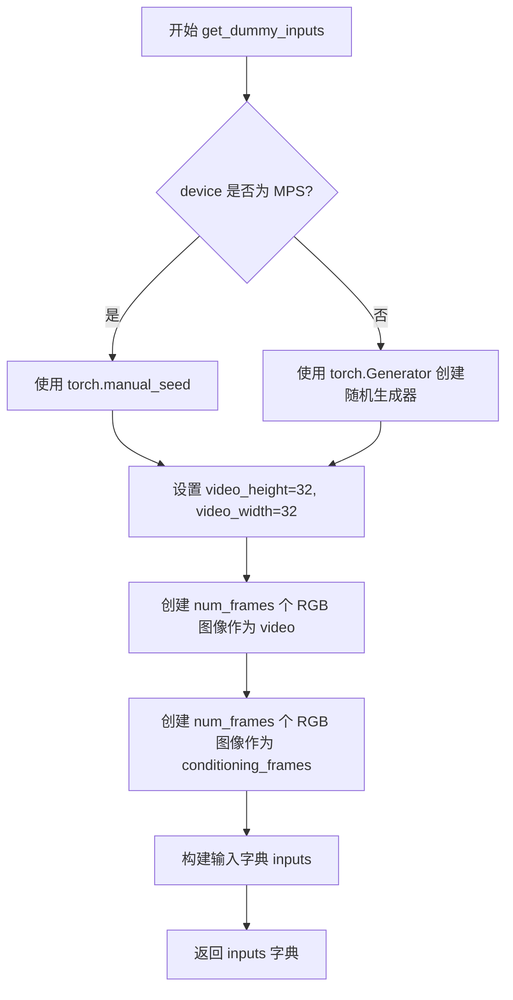

#### 带注释源码

```python
def get_dummy_inputs(self, device, seed=0, num_frames: int = 2):
    """
    生成虚拟输入数据，用于测试 AnimateDiffVideoToVideoControlNetPipeline。
    
    参数:
        device: 目标设备（CPU/CUDA/MPS等）
        seed: 随机种子，默认值为0
        num_frames: 视频帧数量，默认值为2
    
    返回:
        包含视频、提示词、生成器等参数的字典
    """
    # 判断是否为 MPS 设备，MPS 不支持 torch.Generator，使用 torch.manual_seed
    if str(device).startswith("mps"):
        generator = torch.manual_seed(seed)
    else:
        # 为其他设备创建带有种子的随机生成器
        generator = torch.Generator(device=device).manual_seed(seed)

    # 设置视频尺寸（低分辨率，用于快速测试）
    video_height = 32
    video_width = 32
    
    # 创建 num_frames 个空白 RGB 图像作为输入视频
    # 使用列表乘法创建多个相同图像的副本
    video = [Image.new("RGB", (video_width, video_height))] * num_frames

    # 再次设置视频尺寸（此处为冗余代码，可优化）
    video_height = 32
    video_width = 32
    
    # 创建与视频帧数量相同的条件帧（conditioning frames）
    # 用于 ControlNet 的条件输入
    conditioning_frames = [Image.new("RGB", (video_width, video_height))] * num_frames

    # 构建最终的输入参数字典
    inputs = {
        "video": video,                              # 输入视频帧列表
        "conditioning_frames": conditioning_frames,  # ControlNet 条件帧列表
        "prompt": "A painting of a squirrel eating a burger",  # 文本提示词
        "generator": generator,                      # 随机数生成器
        "num_inference_steps": 2,                    # 推理步数（较少用于快速测试）
        "guidance_scale": 7.5,                       # Classifier-free guidance 比例
        "output_type": "pt",                         # 输出类型为 PyTorch 张量
    }
    return inputs
```


### `AnimateDiffVideoToVideoControlNetPipelineFastTests.test_from_pipe_consistent_config`

该测试方法验证 `from_pipe` 方法在 `StableDiffusionPipeline` 与 `AnimateDiffVideoToVideoControlNetPipeline` 之间相互转换时配置的一致性，确保管道组件的迁移不会丢失或改变原始配置信息。

参数：

- `self`：`AnimateDiffVideoToVideoControlNetPipelineFastTests`，测试类实例本身，包含原始管道类、配置参数等测试上下文

返回值：`None`，该方法为测试用例，通过 `assert` 断言验证配置一致性，不返回具体值

#### 流程图

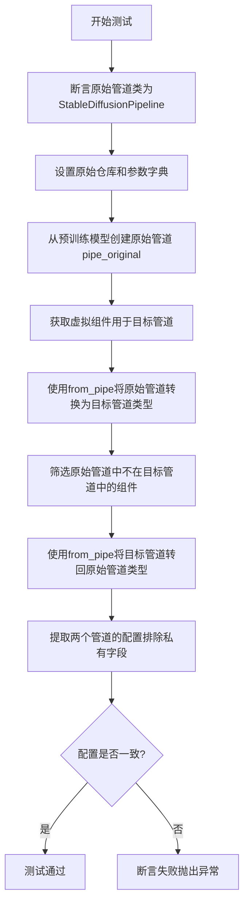

#### 带注释源码

```python
def test_from_pipe_consistent_config(self):
    # 验证原始管道类是否为StableDiffusionPipeline
    assert self.original_pipeline_class == StableDiffusionPipeline
    
    # 定义原始管道的仓库路径和额外参数
    original_repo = "hf-internal-testing/tinier-stable-diffusion-pipe"
    original_kwargs = {"requires_safety_checker": False}

    # 使用from_pretrained方法加载原始的StableDiffusionPipeline
    # 这个管道将作为转换的源管道
    pipe_original = self.original_pipeline_class.from_pretrained(original_repo, **original_kwargs)

    # 获取目标管道（AnimateDiffVideoToVideoControlNetPipeline）的虚拟组件
    pipe_components = self.get_dummy_components()
    
    # 初始化额外组件字典，用于存储目标管道需要但原始管道没有的组件
    pipe_additional_components = {}
    
    # 遍历目标管道的所有组件，找出原始管道中不存在的组件
    # 这些组件需要额外传递给from_pipe方法
    for name, component in pipe_components.items():
        if name not in pipe_original.components:
            pipe_additional_components[name] = component

    # 使用from_pipe方法将原始管道转换为目标管道类型
    # 同时传入额外的组件（如motion_adapter等）
    pipe = self.pipeline_class.from_pipe(pipe_original, **pipe_additional_components)

    # 反向转换：找出原始管道中需要添加到目标管道的组件
    original_pipe_additional_components = {}
    for name, component in pipe_original.components.items():
        # 如果组件不存在于目标管道，或者类型不匹配，则需要保留
        if name not in pipe.components or not isinstance(component, pipe.components[name].__class__):
            original_pipe_additional_components[name] = component

    # 将目标管道转换回原始管道类型
    pipe_original_2 = self.original_pipeline_class.from_pipe(pipe, **original_pipe_additional_components)

    # 提取两个原始管道的配置，排除以双下划线开头的私有配置项
    original_config = {k: v for k, v in pipe_original.config.items() if not k.startswith("_")}
    original_config_2 = {k: v for k, v in pipe_original_2.config.items() if not k.startswith("_")}
    
    # 断言两个配置字典相等，确保from_pipe方法在往返转换后配置保持一致
    assert original_config_2 == original_config
```


### `AnimateDiffVideoToVideoControlNetPipelineFastTests.test_motion_unet_loading`

该测试方法验证 AnimateDiffVideoToVideoControlNetPipeline 能否正确加载 Motion UNet（UNetMotionModel），确保管道在初始化时通过 MotionAdapter 正确集成了运动适配器模块。

参数：

- `self`：`AnimateDiffVideoToVideoControlNetPipelineFastTests`，测试类的实例，包含测试所需的上下文和辅助方法

返回值：`None`，该方法为测试方法，不返回任何值，通过 `assert` 断言验证结果

#### 流程图

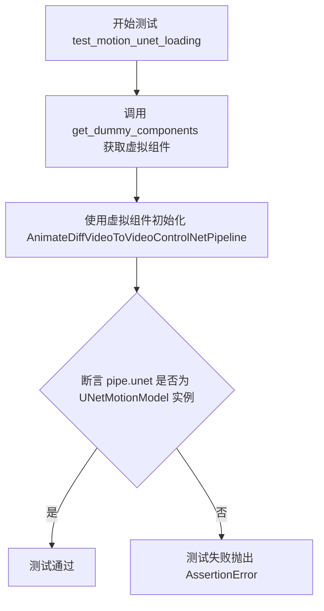

#### 带注释源码

```python
def test_motion_unet_loading(self):
    """
    测试 Motion UNet 的加载功能。
    
    该测试验证 AnimateDiffVideoToVideoControlNetPipeline 在初始化时
    是否正确将底层的 UNet2DConditionModel 替换为 UNetMotionModel，
    以支持视频到视频的动画扩散功能。
    """
    # 获取预定义的虚拟组件，用于构建管道
    # 这些组件包括：unet, controlnet, scheduler, vae, motion_adapter, text_encoder, tokenizer 等
    components = self.get_dummy_components()
    
    # 使用虚拟组件初始化 AnimateDiffVideoToVideoControlNetPipeline 管道
    # 管道内部会将普通的 UNet2DConditionModel 与 MotionAdapter 结合
    # 生成支持动画功能的 UNetMotionModel
    pipe = AnimateDiffVideoToVideoControlNetPipeline(**components)
    
    # 断言验证管道的 unet 属性是否为 UNetMotionModel 类型
    # 这确保了 MotionAdapter 正确集成到了管道中
    assert isinstance(pipe.unet, UNetMotionModel)
```


### `AnimateDiffVideoToVideoControlNetPipelineFastTests.test_attention_slicing_forward_pass`

该测试方法用于验证 AnimateDiffVideoToVideoControlNetPipeline 流水线在启用注意力切片（Attention Slicing）优化技术时的前向传播功能是否正常工作，但由于当前管道未启用注意力切片功能，该测试被跳过。

参数：

- `self`：`AnimateDiffVideoToVideoControlNetPipelineFastTests`，测试类的实例本身，包含测试所需的组件和配置

返回值：`None`，该方法被跳过且方法体为空，不执行任何操作也不返回任何值

#### 流程图

```mermaid
flowchart TD
    A[测试开始] --> B{检查装饰器}
    B -->|存在@unittest.skip| C[跳过测试]
    B -->|未跳过| D[执行测试逻辑]
    C --> E[测试结束]
    D --> E
    
    style C fill:#ff9999
    style E fill:#99ff99
```

#### 带注释源码

```python
@unittest.skip("Attention slicing is not enabled in this pipeline")
def test_attention_slicing_forward_pass(self):
    """
    测试注意力切片（Attention Slicing）前向传播功能。
    
    注意：
    - 该测试方法目前被跳过，原因是在 AnimateDiffVideoToVideoControlNetPipeline 中
      未启用注意力切片优化技术
    - 注意力切片是一种内存优化技术，用于减少大型模型在推理时的显存占用
    - 若未来需要启用此功能，需要在管道配置中设置相应的注意力处理器
    """
    pass
```


### `AnimateDiffVideoToVideoControlNetPipelineFastTests.test_ip_adapter`

测试 IP（Image Prompt）适配器功能，验证该管道在加载 IP-Adapter 时能否正确处理图像提示并生成符合预期的视频帧。

参数：

- `self`：`AnimateDiffVideoToVideoControlNetPipelineFastTests`，测试类实例本身，包含管道配置和测试所需的状态信息

返回值：`None`，该方法为测试用例，通过 `super().test_ip_adapter()` 执行实际的测试断言

#### 流程图

```mermaid
flowchart TD
    A[开始 test_ip_adapter 测试] --> B{检查 torch_device 是否为 'cpu'}
    B -->|是| C[设置 expected_pipe_slice 为 CPU 预期值数组]
    B -->|否| D[设置 expected_pipe_slice 为 None]
    C --> E[调用 super().test_ip_adapter 传递 expected_pipe_slice]
    D --> E
    E --> F[执行 IP-Adapter 测试逻辑]
    F --> G[结束测试]
```

#### 带注释源码

```python
def test_ip_adapter(self):
    """
    测试 IP-Adapter 功能是否正常工作
    
    IP-Adapter 是一种图像提示技术，允许模型根据输入图像生成视频
    该测试方法验证管道在加载 IP-Adapter 时能否正确处理图像条件输入
    """
    # 初始化期望输出为 None，用于非 CPU 设备
    expected_pipe_slice = None
    
    # 根据设备类型设置不同的期望值
    # CPU 设备使用预计算的预期输出数组进行像素级比对
    if torch_device == "cpu":
        expected_pipe_slice = np.array(
            [
                0.5569,  # 预期输出的第一个像素值
                0.6250,
                0.4144,
                0.5613,
                0.5563,
                0.5213,
                0.5091,
                0.4950,
                0.4950,
                0.5684,
                0.3858,
                0.4863,
                0.6457,
                0.4311,
                0.5517,
                0.5608,
                0.4417,
                0.5377,
            ]
        )
    
    # 调用父类的 test_ip_adapter 方法执行实际测试
    # 父类 IPAdapterTesterMixin.test_ip_adapter 会：
    # 1. 检查 pipeline 是否正确加载了 image_encoder
    # 2. 使用测试输入执行推理
    # 3. 验证输出与 expected_pipe_slice 的一致性
    return super().test_ip_adapter(expected_pipe_slice=expected_pipe_slice)
```


### `AnimateDiffVideoToVideoControlNetPipelineFastTests.test_inference_batch_single_identical`

该方法用于测试批量推理与单次推理的一致性，确保批量处理多条输入时得到的输出与单独处理每条输入时得到的输出在数值上足够接近（差异小于预期最大值），以验证pipeline在批处理模式下功能正确。

参数：

- `self`：隐式参数，`AnimateDiffVideoToVideoControlNetPipelineFastTests` 类型，当前测试类实例
- `batch_size`：`int`，默认值 2，表示批处理的数量
- `expected_max_diff`：`float`，默认值 1e-4，批量输出与单次输出之间允许的最大差异阈值
- `additional_params_copy_to_batched_inputs`：`list`，默认值 `["num_inference_steps"]`，需要复制到批量输入的额外参数列表

返回值：`None`，该方法为测试方法，通过 `assert` 断言进行验证，无显式返回值

#### 流程图

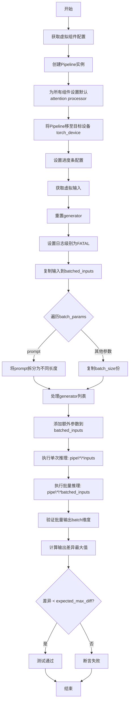

#### 带注释源码

```python
def test_inference_batch_single_identical(
    self,
    batch_size=2,
    expected_max_diff=1e-4,
    additional_params_copy_to_batched_inputs=["num_inference_steps"],
):
    """
    测试批量推理与单次推理的一致性
    
    参数:
        batch_size: 批量大小，默认2
        expected_max_diff: 允许的最大差异，默认1e-4
        additional_params_copy_to_batched_inputs: 需要复制到批量输入的额外参数
    """
    # 1. 获取虚拟组件配置（包含UNet、ControlNet、VAE、scheduler、motion_adapter等）
    components = self.get_dummy_components()
    
    # 2. 使用组件创建Pipeline实例
    pipe = self.pipeline_class(**components)
    
    # 3. 为所有组件设置默认的attention processor（确保推理一致性）
    for components in pipe.components.values():
        if hasattr(components, "set_default_attn_processor"):
            components.set_default_attn_processor()

    # 4. 将Pipeline移至目标设备（如cuda或cpu）
    pipe.to(torch_device)
    
    # 5. 设置进度条配置（disable=None表示启用进度条）
    pipe.set_progress_bar_config(disable=None)
    
    # 6. 获取虚拟输入（包含video、conditioning_frames、prompt等）
    inputs = self.get_dummy_inputs(torch_device)
    
    # 7. 重置generator（确保可复现性）
    inputs["generator"] = self.get_generator(0)

    # 8. 获取日志记录器并设置日志级别为FATAL（减少输出）
    logger = logging.get_logger(pipe.__module__)
    logger.setLevel(level=diffusers.logging.FATAL)

    # 9. 批量化输入准备
    batched_inputs = {}
    batched_inputs.update(inputs)

    # 10. 根据batch_params批量化各个参数
    for name in self.batch_params:
        if name not in inputs:
            continue

        value = inputs[name]
        if name == "prompt":
            # 将prompt拆分成不同长度，最后一个使用超长prompt
            len_prompt = len(value)
            batched_inputs[name] = [value[: len_prompt // i] for i in range(1, batch_size + 1)]
            batched_inputs[name][-1] = 100 * "very long"
        else:
            # 其他参数复制batch_size份
            batched_inputs[name] = batch_size * [value]

    # 11. 为每个批量输入创建独立的generator
    if "generator" in inputs:
        batched_inputs["generator"] = [self.get_generator(i) for i in range(batch_size)]

    # 12. 设置批量大小
    if "batch_size" in inputs:
        batched_inputs["batch_size"] = batch_size

    # 13. 添加额外指定的参数到批量输入
    for arg in additional_params_copy_to_batched_inputs:
        batched_inputs[arg] = inputs[arg]

    # 14. 执行单次推理
    output = pipe(**inputs)
    
    # 15. 执行批量推理
    output_batch = pipe(**batched_inputs)

    # 16. 验证批量输出的batch维度正确
    assert output_batch[0].shape[0] == batch_size

    # 17. 计算批量推理与单次推理的最大差异
    max_diff = np.abs(to_np(output_batch[0][0]) - to_np(output[0][0])).max()
    
    # 18. 断言差异在允许范围内
    assert max_diff < expected_max_diff
```


### `AnimateDiffVideoToVideoControlNetPipelineFastTests.test_to_device`

该测试方法用于验证 `AnimateDiffVideoToVideoControlNetPipeline` 管道在不同计算设备（CPU 和 CUDA）之间的迁移功能，确保所有模型组件正确移动到目标设备并能正常执行推理，且输出结果不包含 NaN 值。

参数：

- `self`：实例方法隐含参数，代表测试类 `AnimateDiffVideoToVideoControlNetPipelineFastTests` 的实例对象

返回值：`None`，该方法为单元测试方法，通过 `assert` 断言验证设备迁移的正确性，无显式返回值

#### 流程图

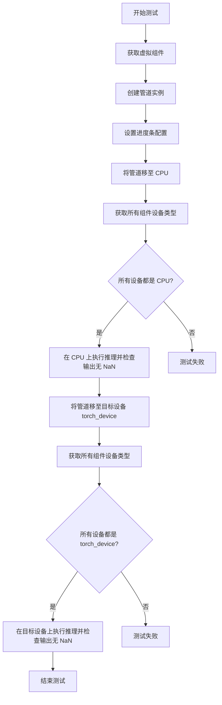

#### 带注释源码

```python
@require_accelerator  # 装饰器：要求有加速器（GPU）才能运行此测试
def test_to_device(self):
    # 获取虚拟/测试用的模型组件（UNet、VAE、ControlNet、TextEncoder 等）
    components = self.get_dummy_components()
    
    # 使用测试组件初始化 AnimateDiffVideoToVideoControlNetPipeline 管道
    pipe = self.pipeline_class(**components)
    
    # 配置进度条：disable=None 表示不禁用进度条
    pipe.set_progress_bar_config(disable=None)

    # 步骤1：将整个管道（包括所有组件）移动到 CPU 设备
    pipe.to("cpu")
    
    # 从管道组件中提取所有具有 device 属性的组件设备类型
    # 用于检查每个模型组件是否正确迁移到目标设备
    model_devices = [
        component.device.type 
        for component in pipe.components.values() 
        if hasattr(component, "device")
    ]
    
    # 断言：验证所有组件都已正确迁移到 CPU 设备
    # 如果有任何一个组件不在 CPU 上，测试将失败
    self.assertTrue(all(device == "cpu" for device in model_devices))

    # 步骤2：在 CPU 设备上执行一次推理，获取输出
    # 使用 get_dummy_inputs 生成测试输入（视频、提示词、随机种子等）
    output_cpu = pipe(**self.get_dummy_inputs("cpu"))[0]
    
    # 断言：验证 CPU 推理输出中不包含 NaN 值（确保推理正常）
    self.assertTrue(np.isnan(output_cpu).sum() == 0)

    # 步骤3：将管道从 CPU 移动到目标设备（通常是 CUDA）
    pipe.to(torch_device)
    
    # 再次获取所有组件的设备类型
    model_devices = [
        component.device.type 
        for component in pipe.components.values() 
        if hasattr(component, "device")
    ]
    
    # 断言：验证所有组件已正确迁移到目标设备（torch_device）
    self.assertTrue(all(device == torch_device for device in model_devices))

    # 步骤4：在目标设备（CUDA）上执行推理
    output_cuda = pipe(**self.get_dummy_inputs(torch_device))[0]
    
    # 断言：验证 CUDA 推理输出中不包含 NaN 值
    # 使用 to_np 将张量转换为 NumPy 数组以便检查 NaN
    self.assertTrue(np.isnan(to_np(output_cuda)).sum() == 0)
```


### `AnimateDiffVideoToVideoControlNetPipelineFastTests.test_to_dtype`

测试数据类型转换功能，验证 AnimateDiffVideoToVideoControlNetPipeline 能否正确将所有模型组件的数据类型（dtype）从 float32 转换为 float16。

参数：

- `self`：`unittest.TestCase`，测试用例实例，隐式参数，表示当前测试对象

返回值：`None`，无显式返回值，该方法通过断言验证数据类型转换的正确性

#### 流程图

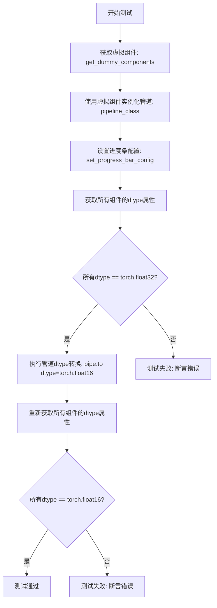

#### 带注释源码

```python
def test_to_dtype(self):
    """
    测试管道的数据类型转换功能
    验证管道能够正确地将所有模型组件从 float32 转换为 float16
    """
    # 步骤1: 获取虚拟组件
    components = self.get_dummy_components()
    
    # 步骤2: 使用虚拟组件实例化 AnimateDiffVideoToVideoControlNetPipeline
    pipe = self.pipeline_class(**components)
    
    # 步骤3: 设置进度条配置（disable=None 表示启用进度条）
    pipe.set_progress_bar_config(disable=None)

    # 步骤4: 获取所有组件的数据类型
    # 注意：管道内部会创建一个新的 motion UNet，所以需要从 pipe.components 获取
    model_dtypes = [
        component.dtype 
        for component in pipe.components.values() 
        if hasattr(component, "dtype")
    ]
    
    # 步骤5: 断言默认数据类型为 float32
    self.assertTrue(
        all(dtype == torch.float32 for dtype in model_dtypes),
        "所有模型组件默认应该使用 torch.float32 数据类型"
    )

    # 步骤6: 将管道转换为 float16 数据类型
    pipe.to(dtype=torch.float16)
    
    # 步骤7: 再次获取转换后的所有组件数据类型
    model_dtypes = [
        component.dtype 
        for component in pipe.components.values() 
        if hasattr(component, "dtype")
    ]
    
    # 步骤8: 断言转换后数据类型为 float16
    self.assertTrue(
        all(dtype == torch.float16 for dtype in model_dtypes),
        "所有模型组件应该正确转换为 torch.float16 数据类型"
    )
```


### `AnimateDiffVideoToVideoControlNetPipelineFastTests.test_prompt_embeds`

该测试方法用于验证 AnimateDiffVideoToVideoControlNetPipeline 管道能够正确接受预计算的提示词嵌入（prompt_embeds）而非原始的提示词（prompt），确保管道在提供直接嵌入时能够正常执行推理。

参数：

- `self`：`AnimateDiffVideoToVideoControlNetPipelineFastTests`，测试类实例本身

返回值：`None`，该方法为测试方法，不返回任何值，仅执行管道推理并通过断言验证功能

#### 流程图

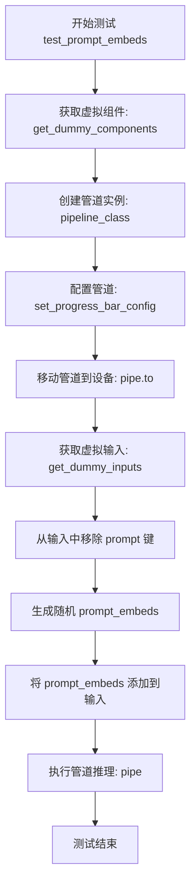

#### 带注释源码

```python
def test_prompt_embeds(self):
    """
    测试提示词嵌入功能，验证管道能够接受预计算的 prompt_embeds 而非原始 prompt 字符串。
    """
    # 步骤1: 获取预定义的虚拟组件（UNet、ControlNet、VAE、TextEncoder等）
    components = self.get_dummy_components()
    
    # 步骤2: 使用虚拟组件实例化 AnimateDiffVideoToVideoControlNetPipeline 管道
    pipe = self.pipeline_class(**components)
    
    # 步骤3: 禁用进度条显示
    pipe.set_progress_bar_config(disable=None)
    
    # 步骤4: 将管道移至测试设备（CPU或GPU）
    pipe.to(torch_device)
    
    # 步骤5: 获取标准的虚拟输入（包含 video、conditioning_frames、prompt 等）
    inputs = self.get_dummy_inputs(torch_device)
    
    # 步骤6: 从输入字典中移除 "prompt" 键，因为本测试要测试直接传入 prompt_embeds 的场景
    inputs.pop("prompt")
    
    # 步骤7: 构造符合文本编码器配置的随机 prompt_embeds
    # 形状: (batch_size=1, seq_len=4, hidden_size=text_encoder.config.hidden_size)
    inputs["prompt_embeds"] = torch.randn(
        (1, 4, pipe.text_encoder.config.hidden_size), 
        device=torch_device
    )
    
    # 步骤8: 执行管道推理，验证管道能正确处理预计算的嵌入
    # 测试通过条件：管道能成功运行而不抛出异常
    pipe(**inputs)
```


### `AnimateDiffVideoToVideoControlNetPipelineFastTests.test_latent_inputs`

该测试方法用于验证 `AnimateDiffVideoToVideoControlNetPipeline` 管道能够正确接受用户提供的潜在变量（latents）作为输入，而非自动生成，从而确保管道在自定义潜在变量场景下的正确性。

参数：

- `self`：`AnimateDiffVideoToVideoControlNetPipelineFastTests`，测试类实例本身

返回值：`None`，该方法为测试方法，无返回值，通过断言验证管道执行成功

#### 流程图

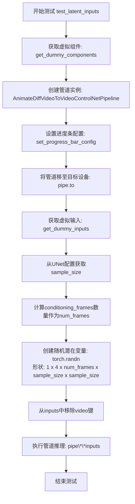

#### 带注释源码

```python
def test_latent_inputs(self):
    """
    测试管道能够接受用户提供的潜在变量(latents)作为输入。
    验证当显式传入latents参数时，管道正确使用这些latents而非自动生成。
    """
    # 步骤1: 获取用于测试的虚拟组件(模型配置)
    components = self.get_dummy_components()
    
    # 步骤2: 使用虚拟组件实例化AnimateDiffVideoToVideoControlNetPipeline管道
    pipe = AnimateDiffVideoToVideoControlNetPipeline(**components)
    
    # 步骤3: 配置进度条，disable=None表示启用进度条
    pipe.set_progress_bar_config(disable=None)
    
    # 步骤4: 将管道及其所有组件移至目标设备(如cuda或cpu)
    pipe.to(torch_device)
    
    # 步骤5: 获取虚拟输入参数
    inputs = self.get_dummy_inputs(torch_device)
    
    # 步骤6: 从UNet配置中获取sample_size，用于确定潜在变量的空间维度
    sample_size = pipe.unet.config.sample_size
    
    # 步骤7: 获取conditioning_frames的数量作为视频帧数
    num_frames = len(inputs["conditioning_frames"])
    
    # 步骤8: 创建指定形状的随机潜在变量
    # 形状解释: (batch_size=1, channels=4, num_frames, height, width)
    inputs["latents"] = torch.randn(
        (1, 4, num_frames, sample_size, sample_size), 
        device=torch_device
    )
    
    # 步骤9: 移除video键，因为测试只关注latents输入
    # 此时管道将使用提供的latents而非从video编码
    inputs.pop("video")
    
    # 步骤10: 执行管道推理，传入修改后的inputs
    # 管道应使用inputs["latents"]中提供的潜在变量
    pipe(**inputs)
```


### `AnimateDiffVideoToVideoControlNetPipelineFastTests.test_xformers_attention_forwardGenerator_pass`

该测试方法用于验证 AnimateDiffVideoToVideoControlNetPipeline 在启用 xformers 内存高效注意力机制后，推理结果与未启用时应保持一致（差异小于阈值），确保 xformers 优化不影响模型的输出质量。

参数：

- `self`：`AnimateDiffVideoToVideoControlNetPipelineFastTests`，测试类的实例，包含测试所需的上下文和断言方法

返回值：`None`，测试方法无返回值，通过断言判断测试是否通过

#### 流程图

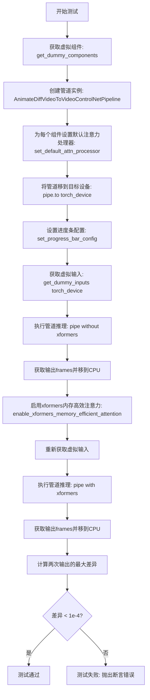

#### 带注释源码

```python
@unittest.skipIf(
    torch_device != "cuda" or not is_xformers_available(),
    reason="XFormers attention is only available with CUDA and `xformers` installed",
)
def test_xformers_attention_forwardGenerator_pass(self):
    # 获取预定义的虚拟组件（UNet、ControlNet、VAE、TextEncoder等）
    components = self.get_dummy_components()
    
    # 使用虚拟组件实例化 AnimateDiffVideoToVideoControlNetPipeline 管道
    pipe = self.pipeline_class(**components)
    
    # 遍历管道中的所有组件，为每个组件设置默认的注意力处理器
    # 这确保了在测试 xformers 之前使用的是标准的注意力机制
    for component in pipe.components.values():
        if hasattr(component, "set_default_attn_processor"):
            component.set_default_attn_processor()
    
    # 将管道及其所有组件移到测试设备（通常是 CUDA 设备）
    pipe.to(torch_device)
    
    # 配置进度条（disable=None 表示启用进度条）
    pipe.set_progress_bar_config(disable=None)

    # 获取虚拟输入参数，包括视频、conditioning_frames、prompt、generator等
    inputs = self.get_dummy_inputs(torch_device)
    
    # 执行管道推理（未启用 xformers）
    # 返回结果包含 frames 属性，frames[0] 是生成的视频帧
    output_without_offload = pipe(**inputs).frames[0]
    
    # 确保输出张量已移到 CPU（如果仍是张量）
    output_without_offload = (
        output_without_offload.cpu() if torch.is_tensor(output_without_offload) else output_without_offload
    )

    # 启用 xformers 内存高效注意力机制
    # 这是一种针对 Transformer 的内存优化实现，可以显著减少显存使用
    pipe.enable_xformers_memory_efficient_attention()
    
    # 重新获取虚拟输入（重置 generator 以确保可重复性）
    inputs = self.get_dummy_inputs(torch_device)
    
    # 执行管道推理（已启用 xformers）
    output_with_offload = pipe(**inputs).frames[0]
    
    # 确保输出张量已移到 CPU
    output_with_offload = (
        output_with_offload.cpu() if torch.is_tensor(output_with_offload) else output_without_offload
    )

    # 计算两次输出的最大绝对差异
    max_diff = np.abs(to_np(output_with_offload) - to_np(output_without_offload)).max()
    
    # 断言：xformers 注意力机制不应显著影响推理结果
    # 差异应小于 1e-4，否则说明 xformers 实现存在问题
    self.assertLess(max_diff, 1e-4, "XFormers attention should not affect the inference results")
```


### `AnimateDiffVideoToVideoControlNetPipelineFastTests.test_free_init`

该测试方法用于验证 FreeInit 功能在 AnimateDiffVideoToVideoControlNetPipeline 中的正确性。通过对比启用 FreeInit、禁用 FreeInit 与默认推理的结果差异，确保 FreeInit 能够产生不同于基准的输出，同时禁用后能恢复到基准性能。

参数：

- `self`：`AnimateDiffVideoToVideoControlNetPipelineFastTests`，测试类实例本身，包含管道类和测试配置

返回值：`None`，该方法为测试用例，通过断言验证 FreeInit 功能，不返回具体数值

#### 流程图

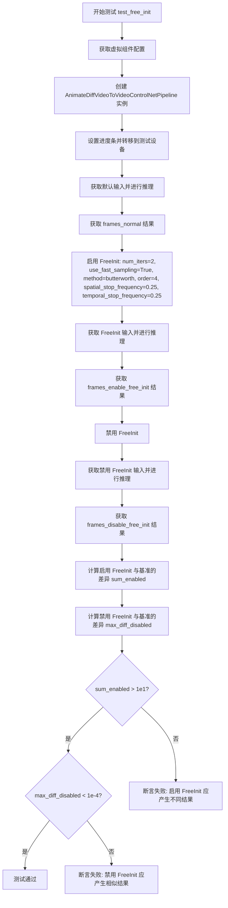

#### 带注释源码

```python
def test_free_init(self):
    """
    测试 FreeInit 功能是否正常工作。
    
    验证逻辑:
    1. 使用默认参数进行推理作为基准
    2. 启用 FreeInit 后推理应该产生不同结果
    3. 禁用 FreeInit 后推理应该恢复到基准水平
    """
    # 获取虚拟组件配置，用于创建测试用管道
    components = self.get_dummy_components()
    
    # 使用管道类创建 pipeline 实例，类型注解为 AnimateDiffVideoToVideoControlNetPipeline
    pipe: AnimateDiffVideoToVideoControlNetPipeline = self.pipeline_class(**components)
    
    # 配置进度条显示（disable=None 表示启用进度条）
    pipe.set_progress_bar_config(disable=None)
    
    # 将管道移动到测试设备（CPU 或 CUDA）
    pipe.to(torch_device)

    # 获取默认输入参数并进行推理，获取基准结果 frames_normal
    inputs_normal = self.get_dummy_inputs(torch_device)
    frames_normal = pipe(**inputs_normal).frames[0]

    # 启用 FreeInit 初始化方法，配置参数包括：
    # - num_iters: 迭代次数为 2
    # - use_fast_sampling: 使用快速采样
    # - method: 滤波器方法为 butterworth
    # - order: 滤波器阶数为 4
    # - spatial_stop_frequency: 空间停止频率 0.25
    # - temporal_stop_frequency: 时间停止频率 0.25
    pipe.enable_free_init(
        num_iters=2,
        use_fast_sampling=True,
        method="butterworth",
        order=4,
        spatial_stop_frequency=0.25,
        temporal_stop_frequency=0.25,
    )
    
    # 使用启用 FreeInit 的配置进行推理
    inputs_enable_free_init = self.get_dummy_inputs(torch_device)
    frames_enable_free_init = pipe(**inputs_enable_free_init).frames[0]

    # 禁用 FreeInit，恢复到默认行为
    pipe.disable_free_init()
    
    # 使用禁用 FreeInit 的配置进行推理
    inputs_disable_free_init = self.get_dummy_inputs(torch_device)
    frames_disable_free_init = pipe(**inputs_disable_free_init).frames[0]

    # 计算启用 FreeInit 与基准结果的差异总和
    sum_enabled = np.abs(to_np(frames_normal) - np_np(frames_enable_free_init)).sum()
    
    # 计算禁用 FreeInit 与基准结果的最大差异
    max_diff_disabled = np.abs(to_np(frames_normal) - np_np(frames_disable_free_init)).max()
    
    # 断言：启用 FreeInit 应该产生显著不同的结果（差异总和应大于 1e1）
    self.assertGreater(
        sum_enabled, 
        1e1, 
        "Enabling of FreeInit should lead to results different from the default pipeline results"
    )
    
    # 断言：禁用 FreeInit 应该产生与基准相似的结果（最大差异应小于 1e-4）
    self.assertLess(
        max_diff_disabled,
        1e-4,
        "Disabling of FreeInit should lead to results similar to the default pipeline results",
    )
```


### `AnimateDiffVideoToVideoControlNetPipelineFastTests.test_free_init_with_schedulers`

该测试方法验证 FreeInit 功能与不同调度器（DPMSolverMultistepScheduler 和 LCMScheduler）组合时的正确性，通过对比启用 FreeInit 前后的生成结果差异来确保功能正常工作。

参数：

- `self`：`unittest.TestCase`，测试类实例本身，包含测试所需的断言方法

返回值：`None`，该方法为测试方法，通过 `self.assertGreater` 断言验证结果，不返回具体值

#### 流程图

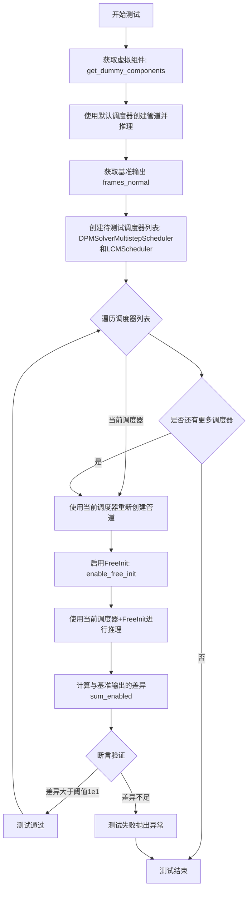

#### 带注释源码

```python
def test_free_init_with_schedulers(self):
    """
    测试FreeInit功能与不同调度器组合时的行为
    验证在启用FreeInit后，生成结果应与基准结果有明显差异
    """
    # 步骤1: 获取预定义的虚拟组件（UNet、VAE、ControlNet、调度器等）
    components = self.get_dummy_components()
    
    # 步骤2: 使用默认调度器创建管道实例
    pipe: AnimateDiffVideoToVideoControlNetPipeline = self.pipeline_class(**components)
    
    # 步骤3: 配置进度条（disable=None表示启用进度条）
    pipe.set_progress_bar_config(disable=None)
    
    # 步骤4: 将管道移至测试设备（CPU或CUDA）
    pipe.to(torch_device)

    # 步骤5: 获取默认输入并执行推理，获取基准结果
    inputs_normal = self.get_dummy_inputs(torch_device)
    frames_normal = pipe(**inputs_normal).frames[0]

    # 步骤6: 定义要测试的调度器列表
    schedulers_to_test = [
        # DPM++调度器 - 一种高效的扩散模型求解器
        DPMSolverMultistepScheduler.from_config(
            components["scheduler"].config,
            timestep_spacing="linspace",
            beta_schedule="linear",
            algorithm_type="dpmsolver++",
            steps_offset=1,
            clip_sample=False,
        ),
        # LCM调度器 - 潜在一致性模型调度器
        LCMScheduler.from_config(
            components["scheduler"].config,
            timestep_spacing="linspace",
            beta_schedule="linear",
            steps_offset=1,
            clip_sample=False,
        ),
    ]
    
    # 步骤7: 从组件字典中移除原有调度器，准备替换
    components.pop("scheduler")

    # 步骤8: 遍历每个调度器进行测试
    for scheduler in schedulers_to_test:
        # 8.1: 将新调度器放入组件字典
        components["scheduler"] = scheduler
        
        # 8.2: 使用新调度器创建管道实例
        pipe: AnimateDiffVideoToVideoControlNetPipeline = self.pipeline_class(**components)
        
        # 8.3: 配置进度条并移至设备
        pipe.set_progress_bar_config(disable=None)
        pipe.to(torch_device)

        # 8.4: 启用FreeInit功能（不使用快速采样）
        pipe.enable_free_init(num_iters=2, use_fast_sampling=False)

        # 8.5: 执行推理获取启用FreeInit后的结果
        inputs = self.get_dummy_inputs(torch_device)
        frames_enable_free_init = pipe(**inputs).frames[0]
        
        # 8.6: 计算与基准结果的差异绝对值之和
        sum_enabled = np.abs(to_np(frames_normal) - to_np(frames_enable_free_init)).sum()

        # 步骤9: 断言验证 - FreeInit应产生明显不同的结果
        self.assertGreater(
            sum_enabled,
            1e1,  # 阈值：差异之和应大于10
            "Enabling of FreeInit should lead to results different from the default pipeline results"
        )
```


### `AnimateDiffVideoToVideoControlNetPipelineFastTests.test_free_noise_blocks`

该测试方法用于验证 FreeNoise 块结构，通过启用和禁用 FreeNoise 功能后，检查 UNet 的下采样块中的运动模块的 Transformer 块类型是否正确切换为 `FreeNoiseTransformerBlock`。

参数：

- `self`：`unittest.TestCase`，测试类实例本身，包含测试所需的上下文和方法

返回值：`None`，该测试方法不返回任何值，仅通过断言验证条件

#### 流程图

```mermaid
flowchart TD
    A[开始测试] --> B[获取虚拟组件: components = self.get_dummy_components]
    B --> C[创建管道实例: pipe = AnimateDiffVideoToVideoControlNetPipeline(**components)]
    C --> D[设置进度条配置: pipe.set_progress_bar_config(disable=None)]
    D --> E[移动管道到设备: pipe.to(torch_device)]
    E --> F[启用FreeNoise: pipe.enable_free_noise]
    F --> G[遍历pipe.unet.down_blocks]
    G --> H[遍历每个block的motion_modules]
    H --> I[遍历每个motion_module的transformer_blocks]
    I --> J{检查transformer_block是否为FreeNoiseTransformerBlock}
    J -->|是| K[断言通过: self.assertTrue]
    J -->|否| L[断言失败: 测试报错]
    K --> M[禁用FreeNoise: pipe.disable_free_noise]
    M --> N[再次遍历检查类型已更改]
    N --> O{检查transformer_block不是FreeNoiseTransformerBlock}
    O -->|是| P[断言通过: self.assertFalse]
    O -->|否| Q[断言失败: 测试报错]
    P --> R[测试结束]
```

#### 带注释源码

```python
def test_free_noise_blocks(self):
    """
    测试FreeNoise块结构。
    
    该测试方法验证在启用FreeNoise功能后，UNet的down_blocks中的motion_modules的
    transformer_blocks应该被替换为FreeNoiseTransformerBlock实例；在禁用后应该恢复
    为原来的类型。
    """
    # 步骤1: 获取虚拟组件，用于构建测试管道
    # get_dummy_components返回包含unet, controlnet, scheduler, vae, motion_adapter,
    # text_encoder, tokenizer等组件的字典
    components = self.get_dummy_components()
    
    # 步骤2: 使用虚拟组件创建AnimateDiffVideoToVideoControlNetPipeline管道实例
    # pipeline_class指向AnimateDiffVideoToVideoControlNetPipeline
    pipe: AnimateDiffVideoToVideoControlNetPipeline = self.pipeline_class(**components)
    
    # 步骤3: 配置进度条显示（disable=None表示启用进度条）
    pipe.set_progress_bar_config(disable=None)
    
    # 步骤4: 将管道移动到测试设备（torch_device，如'cuda'或'cpu'）
    pipe.to(torch_device)
    
    # 步骤5: 启用FreeNoise功能
    # 这会修改pipeline内部unet的transformer_blocks结构
    pipe.enable_free_noise()
    
    # 步骤6-9: 验证启用FreeNoise后，transformer_blocks类型正确
    # 遍历UNet的所有down_blocks（下采样块）
    for block in pipe.unet.down_blocks:
        # 遍历每个block中的motion_modules（运动模块）
        for motion_module in block.motion_modules:
            # 遍历每个motion_module中的transformer_blocks
            for transformer_block in motion_module.transformer_blocks:
                # 断言：启用FreeNoise后，这些transformer_block必须是FreeNoiseTransformerBlock类型
                self.assertTrue(
                    isinstance(transformer_block, FreeNoiseTransformerBlock),
                    "Motion module transformer blocks must be an instance of `FreeNoiseTransformerBlock` after enabling FreeNoise."
                )
    
    # 步骤10: 禁用FreeNoise功能
    # 这会将transformer_blocks恢复为原来的类型
    pipe.disable_free_noise()
    
    # 步骤11-14: 验证禁用FreeNoise后，transformer_blocks类型已恢复
    # 再次遍历所有down_blocks
    for block in pipe.unet.down_blocks:
        for motion_module in block.motion_modules:
            for transformer_block in motion_module.transformer_blocks:
                # 断言：禁用FreeNoise后，这些transformer_block不再是FreeNoiseTransformerBlock类型
                self.assertFalse(
                    isinstance(transformer_block, FreeNoiseTransformerBlock),
                    "Motion module transformer blocks must not be an instance of `FreeNoiseTransformerBlock` after disabling FreeNoise."
                )
```


### `AnimateDiffVideoToVideoControlNetPipelineFastTests.test_free_noise`

测试 FreeNoise 功能是否正确启用和禁用，验证启用 FreeNoise 时生成结果应与默认结果不同，禁用后应恢复默认行为。

参数：

- `self`：测试类实例，无需显式传递

返回值：`None`，该方法为单元测试方法，通过 `assert` 语句验证行为，不返回任何值

#### 流程图

```mermaid
flowchart TD
    A[开始测试] --> B[获取虚拟组件并创建Pipeline]
    B --> C[配置Pipeline: 禁用进度条, 移至设备]
    C --> D[准备普通输入: 16帧, 2步推理, 强度0.5]
    D --> E[运行普通推理获取基准帧]
    E --> F[外层循环: context_length = 8, 9]
    F --> G[内层循环: context_stride = 4, 6]
    G --> H[启用FreeNoise: context_length, context_stride]
    H --> I[准备启用FreeNoise的输入]
    I --> J[运行启用FreeNoise的推理]
    J --> K[禁用FreeNoise]
    K --> L[准备禁用FreeNoise的输入]
    L --> M[运行禁用FreeNoise的推理]
    M --> N[计算差异: sum_enabled = |基准帧 - 启用帧|总和]
    N --> O[计算差异: max_diff_disabled = |基准帧 - 禁用帧|最大值]
    O --> P{sum_enabled > 10?}
    P -->|是| Q[断言通过: 启用FreeNoise产生不同结果]
    P -->|否| R[测试失败: 启用FreeNoise未产生预期差异]
    Q --> S{max_diff_disabled < 0.0001?}
    S -->|是| T[断言通过: 禁用FreeNoise恢复默认行为]
    S -->|否| U[测试失败: 禁用FreeNoise未恢复默认]
    T --> V[内层循环继续或结束]
    V --> G
    R --> W[测试失败]
    U --> W
    F --> X[外层循环结束]
    X --> Y[结束测试]
```

#### 带注释源码

```python
def test_free_noise(self):
    """
    测试FreeNoise功能:
    1. 验证启用FreeNoise后生成结果与默认结果不同
    2. 验证禁用FreeNoise后生成结果与默认结果相似
    """
    # Step 1: 获取虚拟组件并创建Pipeline实例
    components = self.get_dummy_components()
    pipe: AnimateDiffVideoToVideoControlNetPipeline = self.pipeline_class(**components)
    
    # Step 2: 配置Pipeline - 禁用进度条显示, 移至测试设备
    pipe.set_progress_bar_config(disable=None)
    pipe.to(torch_device)

    # Step 3: 准备普通推理的输入参数
    inputs_normal = self.get_dummy_inputs(torch_device, num_frames=16)
    inputs_normal["num_inference_steps"] = 2  # 设置推理步数为2
    inputs_normal["strength"] = 0.5  # 设置视频转换强度为0.5
    
    # Step 4: 执行普通推理, 获取基准帧用于后续对比
    frames_normal = pipe(**inputs_normal).frames[0]

    # Step 5: 遍历不同的context_length和context_stride参数组合
    for context_length in [8, 9]:
        for context_stride in [4, 6]:
            # Step 6: 启用FreeNoise功能, 传入context_length和context_stride
            pipe.enable_free_noise(context_length, context_stride)

            # Step 7: 准备启用FreeNoise后的推理输入
            inputs_enable_free_noise = self.get_dummy_inputs(torch_device, num_frames=16)
            inputs_enable_free_noise["num_inference_steps"] = 2
            inputs_enable_free_noise["strength"] = 0.5
            
            # Step 8: 执行启用FreeNoise的推理
            frames_enable_free_noise = pipe(**inputs_enable_free_noise).frames[0]

            # Step 9: 禁用FreeNoise功能
            pipe.disable_free_noise()
            
            # Step 10: 准备禁用FreeNoise后的推理输入
            inputs_disable_free_noise = self.get_dummy_inputs(torch_device, num_frames=16)
            inputs_disable_free_noise["num_inference_steps"] = 2
            inputs_disable_free_noise["strength"] = 0.5
            
            # Step 11: 执行禁用FreeNoise的推理
            frames_disable_free_noise = pipe(**inputs_disable_free_noise).frames[0]

            # Step 12: 计算差异 - 启用FreeNoise vs 基准
            sum_enabled = np.abs(to_np(frames_normal) - to_np(frames_enable_free_noise)).sum()
            
            # Step 13: 计算差异 - 禁用FreeNoise vs 基准
            max_diff_disabled = np.abs(to_np(frames_normal) - to_np(frames_disable_free_noise)).max()

            # Step 14: 断言启用FreeNoise应产生明显不同的结果
            self.assertGreater(
                sum_enabled,
                1e1,  # 阈值10
                "Enabling of FreeNoise should lead to results different from the default pipeline results"
            )
            
            # Step 15: 断言禁用FreeNoise应恢复默认行为
            self.assertLess(
                max_diff_disabled,
                1e-4,  # 阈值0.0001
                "Disabling of FreeNoise should lead to results similar to the default pipeline results"
            )
```


### `AnimateDiffVideoToVideoControlNetPipelineFastTests.test_free_noise_multi_prompt`

该测试方法用于验证 FreeNoise（自由噪声）功能在多提示词场景下的正确性，包括正常情况下的执行和越界提示词索引的异常处理。

参数：

- `self`：unittest.TestCase，测试类实例本身，包含测试所需的环境和工具方法

返回值：`None`，该方法为测试方法，通过断言验证功能，不返回具体数据

#### 流程图

```mermaid
flowchart TD
    A[开始测试 test_free_noise_multi_prompt] --> B[获取虚拟组件配置]
    B --> C[创建 AnimateDiffVideoToVideoControlNetPipeline 实例]
    C --> D[配置进度条显示]
    D --> E[将 pipeline 移至测试设备 torch_device]
    E --> F[设置 context_length=8, context_stride=4]
    F --> G[启用 FreeNoise 功能]
    G --> H[获取虚拟输入数据 num_frames=16]
    H --> I[设置多提示词 prompt={0: 'Caterpillar on a leaf', 10: 'Butterfly on a leaf'}]
    I --> J[设置推理步数 num_inference_steps=2]
    J --> K[设置变换强度 strength=0.5]
    K --> L[执行 pipeline 正常调用]
    L --> M{验证正常情况是否成功}
    M -->|成功| N[获取新输入数据准备异常测试]
    M -->|失败| Z[测试失败]
    
    N --> O[设置越界提示词 prompt={0:..., 10:..., 42: 'Error on a leaf'}]
    O --> P[执行 pipeline 期望抛出 ValueError]
    P --> Q{验证异常是否抛出}
    Q -->|是| R[测试通过]
    Q -->|否| Z
    
    style Z fill:#ffcccc
    style R fill:#ccffcc
```

#### 带注释源码

```python
def test_free_noise_multi_prompt(self):
    """
    测试 FreeNoise 功能在多提示词场景下的行为
    
    测试内容：
    1. 验证当提示词索引在有效范围内（0-15）时，pipeline 能正常执行
    2. 验证当提示词索引超出范围（42 > 15）时，pipeline 会抛出 ValueError
    """
    
    # Step 1: 获取用于测试的虚拟组件配置（UNet、VAE、ControlNet等）
    components = self.get_dummy_components()
    
    # Step 2: 使用虚拟组件创建 AnimateDiffVideoToVideoControlNetPipeline 实例
    pipe: AnimateDiffVideoToVideoControlNetPipeline = self.pipeline_class(**components)
    
    # Step 3: 配置进度条显示（disable=None 表示启用进度条）
    pipe.set_progress_bar_config(disable=None)
    
    # Step 4: 将 pipeline 移至测试设备（torch_device，如 cuda 或 cpu）
    pipe.to(torch_device)
    
    # Step 5: 配置 FreeNoise 参数
    context_length = 8      # 上下文长度，控制每段噪声的长度
    context_stride = 4      # 上下文步长，控制滑动窗口的步长
    
    # Step 6: 启用 FreeNoise 功能，允许在视频生成中使用动态噪声
    pipe.enable_free_noise(context_length, context_stride)
    
    # ====== 正常情况测试：提示词索引在有效范围内 ======
    # Step 7: 获取虚拟输入数据，生成 16 帧的视频输入
    inputs = self.get_dummy_inputs(torch_device, num_frames=16)
    
    # Step 8: 设置多提示词字典，键为帧索引，值为对应提示词
    # 索引 0 和 10 都在有效范围 [0, 15] 内
    inputs["prompt"] = {0: "Caterpillar on a leaf", 10: "Butterfly on a leaf"}
    
    # Step 9: 设置推理参数
    inputs["num_inference_steps"] = 2   # 推理步数，越少越快
    inputs["strength"] = 0.5            # 变换强度，控制对原视频的保留程度
    
    # Step 10: 执行 pipeline，验证正常情况能成功运行
    pipe(**inputs).frames[0]
    
    # ====== 异常情况测试：提示词索引超出范围 ======
    # Step 11: 使用 assertRaises 验证越界索引会抛出 ValueError
    with self.assertRaises(ValueError):
        # 重新获取输入数据
        inputs = self.get_dummy_inputs(torch_device, num_frames=16)
        
        # 设置推理参数
        inputs["num_inference_steps"] = 2
        inputs["strength"] = 0.5
        
        # 设置包含越界索引的提示词字典
        # 索引 42 超出范围（num_frames=16 有效索引为 0-15）
        inputs["prompt"] = {0: "Caterpillar on a leaf", 10: "Butterfly on a leaf", 42: "Error on a leaf"}
        
        # 执行 pipeline，期望在此处抛出 ValueError 异常
        pipe(**inputs).frames[0]
```


### `AnimateDiffVideoToVideoControlNetPipelineFastTests.test_encode_prompt_works_in_isolation`

该测试方法用于验证提示词编码（encode_prompt）功能在隔离环境中是否正常工作，通过构建额外的必需参数字典并调用父类的测试方法来确保文本编码器能够正确处理提示词而不受其他 pipeline 组件的干扰。

参数：

- `self`：`AnimateDiffVideoToVideoControlNetPipelineFastTests`，测试类实例本身，包含测试所需的 pipeline 组件和辅助方法

返回值：`unittest.TestCase` 的测试结果（通常是 `None` 或 `TestResult` 对象），具体取决于父类 `test_encode_prompt_works_in_isolation` 方法的返回值

#### 流程图

```mermaid
flowchart TD
    A[开始测试 test_encode_prompt_works_in_isolation] --> B[构建 extra_required_param_value_dict]
    B --> C[获取 device: torch.device类型]
    B --> D[设置 num_images_per_prompt: 1]
    B --> E[计算 do_classifier_free_guidance: 判断guidance_scale > 1.0]
    C --> F[组装参数字典]
    D --> F
    E --> F
    F --> G{调用父类测试方法}
    G --> H[super().test_encode_prompt_works_in_isolation<br/>传入extra_required_param_value_dict]
    H --> I[返回测试结果]
    I --> J[结束测试]
```

#### 带注释源码

```python
def test_encode_prompt_works_in_isolation(self):
    """
    测试提示词编码在隔离环境中是否正常工作。
    
    该测试方法验证 pipeline 的 encode_prompt 功能能够独立运行，
    不受其他组件（如 UNet、VAE 等）的影响。通过传入特定的参数
    来控制测试环境，确保文本编码器能够正确处理提示词。
    """
    # 构建额外的必需参数字典，用于配置父类测试方法
    extra_required_param_value_dict = {
        # 获取当前测试设备的类型（如 'cuda', 'cpu', 'mps'）
        "device": torch.device(torch_device).type,
        # 设置每条提示词生成的图像数量为1
        "num_images_per_prompt": 1,
        # 根据 guidance_scale 判断是否启用 classifier-free guidance
        # 如果 guidance_scale > 1.0，则启用 CFG
        "do_classifier_free_guidance": self.get_dummy_inputs(device=torch_device).get("guidance_scale", 1.0) > 1.0,
    }
    
    # 调用父类的测试方法，验证 encode_prompt 隔离性
    # 父类 test_encode_prompt_works_in_isolation 来自 PipelineTesterMixin
    return super().test_encode_prompt_works_in_isolation(extra_required_param_value_dict)
```

## 关键组件


### AnimateDiffVideoToVideoControlNetPipeline

核心视频到视频转换管道，结合了ControlNet条件控制和MotionAdapter运动适配器，用于实现带控制条件的视频生成和转换任务。

### UNetMotionModel

运动增强的UNet2DConditionModel，在标准UNet基础上集成了motion_modules，支持时序建模和视频帧间的特征传播，是实现视频生成的核心去噪模型。

### ControlNetModel

条件控制网络，用于从 conditioning_frames 中提取控制特征，引导生成过程遵循指定的空间布局或边缘信息。

### MotionAdapter

运动适配器模块，为扩散模型添加时序运动建模能力，支持视频帧间的时间一致性建模和运动特征注入。

### FreeNoiseTransformerBlock

FreeNoise 技术的核心转换器块，通过特殊的噪声采样策略实现更灵活的时间轴控制，支持 context_length 和 context_stride 参数调节。

### IPAdapterTesterMixin

IP-Adapter 混合测试基类，提供图像提示适配器的测试支持，验证文本和图像条件的联合编码能力。

### PipelineTesterMixin

通用管道测试混合类，封装了批次推理、批量一致性、提示嵌入等标准化测试流程。

### DDIMScheduler

确定性扩散调度器，实现 DDIM 采样策略，用于控制去噪过程的噪声调度和时间步安排。

### LCMScheduler

潜在一致性模型调度器，支持快速采样模式，大幅减少推理步骤数。

### DPMSolverMultistepScheduler

多步 DPM-Solver 调度器，提供高阶 ODE 求解以加速收敛的采样策略。

### FreeNoise 技术

通过 enable_free_noise() 激活，支持自定义 context_length 和 context_stride，实现视频帧的滑动窗口噪声采样策略。

### FreeInit 技术

通过 enable_free_init() 激活的空间时间频率滤波初始化方法，支持 buttherworth 滤波器配置以改善生成质量。

### XFormers 注意力

通过 enable_xformers_memory_efficient_attention() 激活的内存高效注意力机制，用于减少推理显存占用。


## 问题及建议


### 已知问题

-   **重复代码**：`get_dummy_inputs` 方法中 `video_height` 和 `video_width` 被定义了两次，且 `get_dummy_components` 中多次调用 `torch.manual_seed(0)` 可能导致随机性问题
-   **方法命名拼写错误**：`test_xformers_attention_forwardGenerator_pass` 方法名中 "forwardGenerator" 存在拼写错误，应为 "ForwardGenerator"
-   **测试被跳过**：`test_attention_slicing_forward_pass` 被无条件跳过，导致注意力切片功能未被测试覆盖
-   **魔法数字和硬编码**：多处使用硬编码值如 `num_frames=2`、`num_frames=16`、`context_length=8`、`context_stride=4` 等，缺乏配置化
-   **测试逻辑复杂**：`test_from_pipe_consistent_config` 方法过长，嵌套循环和条件判断较多，可读性差
-   **设备检查不一致**：部分测试依赖特定硬件（如 CUDA、xformers），但未在测试开始前进行充分的硬件兼容性检查
-   **资源管理问题**：`test_xformers_attention_forwardGenerator_pass` 中 `output_with_offload` 的处理存在逻辑错误，使用了 `output_without_offload` 而非 `output_with_offload`
-   **缺失错误处理**：部分测试如 `test_free_noise_multi_prompt` 中的边界检查错误信息不够明确
-   **测试独立性**：测试方法之间可能存在隐式依赖，例如共享 `components` 变量或修改全局状态
-   **断言信息不完整**：多处断言缺少自定义错误消息，如 `assert max_diff < expected_max_diff` 未说明具体差异值

### 优化建议

-   提取重复的组件初始化逻辑到独立的工厂方法，减少代码冗余
-   将硬编码的测试参数（如帧数、上下文长度）抽取为类属性或测试配置常量
-   修复 `test_xformers_attention_forwardGenerator_pass` 方法名拼写错误和输出处理逻辑
-   重构 `test_from_pipe_consistent_config` 方法，拆分为多个小型测试方法以提高可读性
-   为被跳过的测试 `test_attention_slicing_forward_pass` 添加具体的实现或说明原因
-   在测试开始前添加硬件兼容性检查，使用 `unittest.skipIf` 装饰器统一处理平台依赖
-   完善断言的错误信息，包含实际值和期望值以便调试
-   确保每个测试方法的独立性，避免共享可变状态
-   考虑添加性能基准测试，记录关键操作的执行时间

## 其它


### 设计目标与约束

本测试套件旨在验证 AnimateDiffVideoToVideoControlNetPipeline 的核心功能正确性，包括：1) 管道组件的正确加载和配置；2) 视频到视频转换功能的准确性；3) ControlNet与运动适配器的集成；4) 各种可选功能（IP Adapter、Free Init、Free Noise、xformers）的正常工作。测试约束包括：仅在CUDA环境下测试xformers注意力机制；跳过注意力切片测试（当前管道未启用该功能）；使用固定随机种子确保测试可复现性。

### 错误处理与异常设计

测试中包含多处异常验证：1) test_free_noise_multi_prompt 中使用 assertRaises(ValueError) 验证当 prompt 索引超出 num_frames 范围时抛出 ValueError 异常；2) 设备转换测试验证模型设备类型一致性；3) dtype转换测试确保浮点精度正确切换；4) 批量推理测试通过 max_diff 阈值确保输出一致性，任何超出阈值的差异都会导致测试失败。

### 数据流与状态机

测试数据流遵循以下路径：get_dummy_components() 创建模拟组件 → get_dummy_inputs() 生成测试输入（视频帧、提示词、随机生成器）→ 管道执行 __call__ 方法 → 输出_frames 结果。状态转换包括：管道初始化（加载组件）→ 设备/dtype设置 → 推理执行 → 结果验证。Free Init 和 Free Noise 功能具有独立的状态机：enable_*() → 执行推理 → disable_*()，状态变更会影响transformer_block的类型和噪声采样方式。

### 外部依赖与接口契约

主要依赖包括：diffusers库（管道和模型）、transformers（文本编码器）、torch、numpy、PIL、unittest。关键接口契约：pipeline_class 必须是 AnimateDiffVideoToVideoControlNetPipeline；params 必须是 TEXT_TO_IMAGE_PARAMS；batch_params 必须是 VIDEO_TO_VIDEO_BATCH_PARAMS 并包含 conditioning_frames；所有测试方法需返回 super() 对应方法的返回值以保持测试框架兼容性。

### 性能考虑与基准测试

性能测试涵盖：1) test_inference_batch_single_identical 验证批量推理与单帧推理结果一致性（max_diff < 1e-4）；2) test_xformers_attention_forwardGenerator_pass 对比xformers与默认注意力的性能差异（max_diff < 1e-4）；3) test_to_device 验证CPU/GPU设备转换后的数值稳定性（无NaN值）；4) 多种调度器（DPMSolverMultistepScheduler、LCMScheduler）与Free Init的兼容性测试。

### 安全考虑

测试中不涉及敏感数据处理，使用模拟组件和测试图像。潜在安全风险：1) from_pipe 方法在组件类型不匹配时的处理逻辑需谨慎；2) 外部模型加载（original_repo）需验证来源可靠性；3) torch.randn 生成随机张量时注意内存安全。

### 配置管理

测试配置通过以下方式管理：1) 组件配置在 get_dummy_components() 中硬编码定义（cross_attention_dim=8, block_out_channels=(8,8)等）；2) 调度器使用DDIMScheduler作为默认配置；3) 测试参数通过类属性（params, batch_params, required_optional_params）集中定义；4) 设备配置通过 torch_device 全局变量动态获取。

### 版本兼容性

测试需兼容以下版本要求：1) torch >= 相关版本支持torch_device；2) CUDA环境用于GPU相关测试；3) xformers库条件导入（is_xformers_available()）；4) diffusers库版本需支持AnimateDiffVideoToVideoControlNetPipeline及相关组件；5) 调度器需支持from_config方法进行配置迁移。

### 测试覆盖范围

当前测试覆盖：组件加载（test_motion_unet_loading）、管道配置（test_from_pipe_consistent_config）、设备管理（test_to_device）、数据类型（test_to_dtype）、提示词嵌入（test_prompt_embeds）、潜在输入（test_latent_inputs）、注意力机制（test_xformers_attention_forwardGenerator_pass, test_attention_slicing_forward_pass被跳过）、高级功能（test_free_init, test_free_init_with_schedulers, test_free_noise, test_free_noise_blocks, test_free_noise_multi_prompt）、批处理（test_inference_batch_single_identical）、IP适配器（test_ip_adapter）、编码器隔离（test_encode_prompt_works_in_isolation）。覆盖缺口：长时间推理测试、内存泄漏检测、并发推理测试。

### 部署和运维考虑

测试环境要求：1) CUDA GPU用于主要测试，CPU作为后备；2) 需安装diffusers、transformers、torch、numpy、PIL等依赖；3) xformers为可选依赖；4) 测试通过require_accelerator装饰器标记加速器依赖。运维关注点：随机种子管理确保测试可复现；进度条配置（set_progress_bar_config）便于调试；日志级别调整（logging.FATAL）减少输出干扰。

    