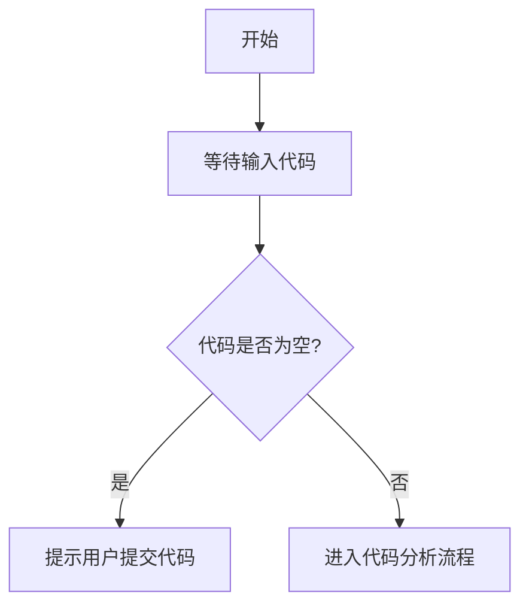

# `diffusers\tests\pipelines\audioldm2\__init__.py` 详细设计文档

未提供源代码，无法进行分析。请提供需要分析的代码。

## 整体流程



## 类结构

```

```

## 全局变量及字段


    

## 全局函数及方法


## 关键组件


## 问题及建议


### 已知问题

-   未提供待分析的代码，无法进行具体的技术债务和优化空间分析
-   缺少代码实现，无法识别潜在的代码层面的问题

### 优化建议

-   请提供具体的代码内容以便进行详细的技术债务分析和优化建议
-   如果是新建项目，建议在编写代码时遵循SOLID原则、DRY原则、YAGNI原则
-   建议保持代码简洁性，避免过度工程化
-   建议添加适当的日志记录和错误处理机制
-   建议编写单元测试以保证代码质量


## 其它


### 设计目标与约束

设计目标：待代码提供后填写
约束条件：待代码提供后填写

### 错误处理与异常设计

错误处理机制：待代码提供后填写
异常分类：待代码提供后填写

### 数据流与状态机

数据流图：待代码提供后填写
状态机定义：待代码提供后填写

### 外部依赖与接口契约

外部依赖列表：待代码提供后填写
接口定义：待代码提供后填写

### 性能要求与基准

性能指标：待代码提供后填写
性能测试基准：待代码提供后填写

### 安全性考虑

安全需求：待代码提供后填写
安全实现措施：待代码提供后填写

### 兼容性设计

向前兼容性：待代码提供后填写
向后兼容性：待代码提供后填写

### 测试策略

单元测试策略：待代码提供后填写
集成测试策略：待代码提供后填写

### 部署与运维

部署配置：待代码提供后填写
运维监控：待代码提供后填写

### 版本变更记录

版本历史：待代码提供后填写

    