# `diffusers\tests\pipelines\audioldm2\test_audioldm2.py` 详细设计文档

这是一个用于测试AudioLDM2Pipeline的单元测试文件，包含了快速测试类和慢速测试类，用于验证文本到音频生成pipeline的各种功能，包括调度器测试、提示嵌入、负面提示、波形数量控制、音频长度、模型保存加载等。

## 整体流程

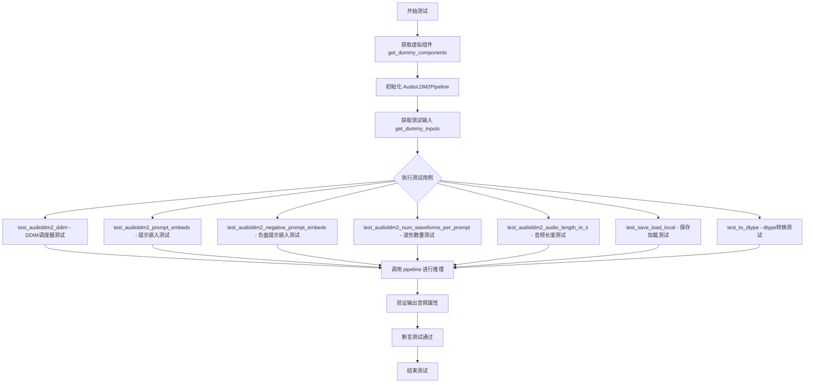

## 类结构

```
AudioLDM2PipelineFastTests (单元测试类)
├── get_dummy_components() - 获取虚拟组件
├── get_dummy_inputs() - 获取虚拟输入
├── test_audioldm2_ddim() - DDIM调度器测试
├── test_audioldm2_prompt_embeds() - 提示嵌入测试
├── test_audioldm2_negative_prompt_embeds() - 负面提示嵌入测试
├── test_audioldm2_negative_prompt() - 负面提示测试
├── test_audioldm2_num_waveforms_per_prompt() - 波形数量测试
├── test_audioldm2_audio_length_in_s() - 音频长度测试
├── test_audioldm2_vocoder_model_in_dim() - 声码器维度测试
├── test_attention_slicing_forward_pass() - 注意力切片测试
├── test_dict_tuple_outputs_equivalent() - 输出等价性测试
├── test_inference_batch_single_identical() - 批处理一致性测试
├── test_save_load_local() - 本地保存加载测试
├── test_save_load_optional_components() - 可选组件保存加载测试
└── test_to_dtype() - dtype转换测试

AudioLDM2PipelineSlowTests (慢速测试类)
├── setUp() - 测试前设置
├── tearDown() - 测试后清理
├── get_inputs() - 获取测试输入
├── get_inputs_tts() - 获取TTS测试输入
├── test_audioldm2() - 标准AudioLDM2测试
├── test_audioldm2_lms() - LMS调度器测试
├── test_audioldm2_large() - 大模型测试
└── test_audioldm2_tts() - TTS功能测试
```

## 全局变量及字段


### `enable_full_determinism`
    
启用完全确定性模式的函数

类型：`function`
    


### `TEXT_TO_AUDIO_PARAMS`
    
文本到音频管道的参数元组

类型：`tuple`
    


### `TEXT_TO_AUDIO_BATCH_PARAMS`
    
文本到音频管道批处理参数元组

类型：`tuple`
    


### `PipelineTesterMixin`
    
管道测试混合类，提供通用测试方法

类型：`class`
    


### `backend_empty_cache`
    
后端缓存清理函数

类型：`function`
    


### `is_torch_version`
    
检查PyTorch版本的函数

类型：`function`
    


### `nightly`
    
夜间测试装饰器

类型：`decorator`
    


### `torch_device`
    
PyTorch设备字符串

类型：`str`
    


### `AudioLDM2PipelineFastTests.pipeline_class`
    
AudioLDM2Pipeline测试类的类引用

类型：`type`
    


### `AudioLDM2PipelineFastTests.params`
    
文本到音频管道参数元组

类型：`tuple`
    


### `AudioLDM2PipelineFastTests.batch_params`
    
文本到音频管道批处理参数元组

类型：`tuple`
    


### `AudioLDM2PipelineFastTests.required_optional_params`
    
必需的可选参数不可变集合

类型：`frozenset`
    


### `AudioLDM2PipelineFastTests.supports_dduf`
    
标识是否支持DDUF的布尔标志

类型：`bool`
    
    

## 全局函数及方法


### `AudioLDM2PipelineFastTests.get_dummy_components`

该方法用于创建测试用的虚拟模型组件，包括 UNet、VAE、文本编码器、Tokenizer、特征提取器、语言模型、投影模型和声码器等所有 AudioLDM2Pipeline 所需的组件，以便在单元测试中执行推理而不需要加载真实的预训练模型。

参数：
- 该方法无显式参数（隐式接收 `self` 参数）

返回值：`dict`，返回包含所有虚拟模型组件的字典，键名包括 `"unet"`、`"scheduler"`、`"vae"`、`"text_encoder"`、`"text_encoder_2"`、`"tokenizer"`、`"tokenizer_2"`、`"feature_extractor"`、`"language_model"`、`"projection_model"` 和 `"vocoder"`。

#### 流程图

```mermaid
flowchart TD
    A[开始 get_dummy_components] --> B[设置随机种子 torch.manual_seed(0)]
    B --> C[创建 AudioLDM2UNet2DConditionModel]
    C --> D[创建 DDIMScheduler]
    D --> E[创建 AutoencoderKL VAE]
    E --> F[构建 text_branch_config 字典]
    F --> G[构建 audio_branch_config 字典]
    G --> H[创建 ClapConfig 并创建 ClapModel]
    H --> I[创建 RobertaTokenizer]
    I --> J[创建 ClapFeatureExtractor]
    J --> K[创建 T5Config 并创建 T5EncoderModel]
    K --> L[创建 T5Tokenizer]
    L --> M[创建 GPT2Config 并创建 GPT2LMHeadModel]
    M --> N[创建 AudioLDM2ProjectionModel]
    N --> O[创建 SpeechT5HifiGanConfig 并创建 SpeechT5HifiGan]
    O --> P[组装 components 字典]
    P --> Q[返回 components 字典]
```

#### 带注释源码

```python
def get_dummy_components(self):
    """
    创建并返回用于测试的虚拟模型组件。
    
    该方法初始化所有必需的模型组件（UNet、VAE、文本编码器等），
    使用小型配置以便于快速执行单元测试。
    """
    # 设置随机种子以确保测试的可重复性
    torch.manual_seed(0)
    
    # 创建 UNet2D 条件模型 - 用于去噪过程的神经网络
    unet = AudioLDM2UNet2DConditionModel(
        block_out_channels=(8, 16),      # 块输出通道数
        layers_per_block=1,               # 每个块的层数
        norm_num_groups=8,                # 归一化组数
        sample_size=32,                   # 样本尺寸
        in_channels=4,                    # 输入通道数
        out_channels=4,                    # 输出通道数
        down_block_types=("DownBlock2D", "CrossAttnDownBlock2D"),  # 下采样块类型
        up_block_types=("CrossAttnUpBlock2D", "UpBlock2D"),       # 上采样块类型
        cross_attention_dim=(8, 16),      # 交叉注意力维度
    )
    
    # 创建 DDIM 调度器 - 控制去噪过程中的噪声调度
    scheduler = DDIMScheduler(
        beta_start=0.00085,               # Beta 起始值
        beta_end=0.012,                   # Beta 结束值
        beta_schedule="scaled_linear",   # Beta 调度策略
        clip_sample=False,                # 是否裁剪样本
        set_alpha_to_one=False,           # 是否将 alpha 设置为 1
    )
    
    # 设置随机种子并创建 VAE (变分自编码器) - 用于潜在空间编码/解码
    torch.manual_seed(0)
    vae = AutoencoderKL(
        block_out_channels=[8, 16],       # 块输出通道数
        in_channels=1,                    # 输入通道数
        out_channels=1,                   # 输出通道数
        norm_num_groups=8,                # 归一化组数
        down_block_types=["DownEncoderBlock2D", "DownEncoderBlock2D"],  # 下编码块类型
        up_block_types=["UpDecoderBlock2D", "UpDecoderBlock2D"],       # 上解码块类型
        latent_channels=4,                # 潜在通道数
    )
    
    # 定义文本分支配置 (CLAP 模型的一部分)
    torch.manual_seed(0)
    text_branch_config = {
        "bos_token_id": 0,                 # 起始 token ID
        "eos_token_id": 2,                # 结束 token ID
        "hidden_size": 8,                 # 隐藏层大小
        "intermediate_size": 37,          # 中间层大小
        "layer_norm_eps": 1e-05,          # 层归一化 epsilon
        "num_attention_heads": 1,          # 注意力头数
        "num_hidden_layers": 1,           # 隐藏层数
        "pad_token_id": 1,                # 填充 token ID
        "vocab_size": 1000,               # 词汇表大小
        "projection_dim": 8,               # 投影维度
    }
    
    # 定义音频分支配置 (CLAP 模型的一部分)
    audio_branch_config = {
        "spec_size": 8,                    # 频谱大小
        "window_size": 4,                 # 窗口大小
        "num_mel_bins": 8,                 # Mel  bins 数量
        "intermediate_size": 37,          # 中间层大小
        "layer_norm_eps": 1e-05,          # 层归一化 epsilon
        "depths": [1, 1],                 # 深度列表
        "num_attention_heads": [1, 1],    # 注意力头数列表
        "num_hidden_layers": 1,           # 隐藏层数
        "hidden_size": 192,               # 隐藏层大小
        "projection_dim": 8,              # 投影维度
        "patch_size": 2,                  # 补丁大小
        "patch_stride": 2,                # 补丁步幅
        "patch_embed_input_channels": 4,  # 补丁嵌入输入通道数
    }
    
    # 创建 CLAP 配置并实例化文本编码器 (第一个文本编码器)
    text_encoder_config = ClapConfig(
        text_config=text_branch_config, 
        audio_config=audio_branch_config, 
        projection_dim=16                 # 投影维度
    )
    text_encoder = ClapModel(text_encoder_config)
    
    # 从预训练模型加载分词器 (RobertaTokenizer)
    tokenizer = RobertaTokenizer.from_pretrained(
        "hf-internal-testing/tiny-random-roberta", 
        model_max_length=77               # 模型最大长度
    )
    
    # 从预训练模型加载特征提取器 (ClapFeatureExtractor)
    feature_extractor = ClapFeatureExtractor.from_pretrained(
        "hf-internal-testing/tiny-random-ClapModel", 
        hop_length=7900                   # 跳跃长度
    )

    # 创建第二个文本编码器 (T5 编码器模型)
    torch.manual_seed(0)
    text_encoder_2_config = T5Config(
        vocab_size=32100,                 # 词汇表大小
        d_model=32,                       # 模型维度
        d_ff=37,                          # 前馈网络维度
        d_kv=8,                           # 键值维度
        num_heads=1,                      # 注意力头数
        num_layers=1,                    # 层数
    )
    text_encoder_2 = T5EncoderModel(text_encoder_2_config)
    
    # 从预训练模型加载第二个分词器 (T5Tokenizer)
    tokenizer_2 = T5Tokenizer.from_pretrained(
        "hf-internal-testing/tiny-random-T5Model", 
        model_max_length=77
    )

    # 创建语言模型 (GPT2) 用于生成提示嵌入
    torch.manual_seed(0)
    language_model_config = GPT2Config(
        n_embd=16,                        # 嵌入维度
        n_head=1,                         # 注意力头数
        n_layer=1,                        # 层数
        vocab_size=1000,                  # 词汇表大小
        n_ctx=99,                         # 上下文长度
        n_positions=99,                   # 位置数量
    )
    language_model = GPT2LMHeadModel(language_model_config)
    language_model.config.max_new_tokens = 8  # 最大新 token 数量

    # 创建投影模型 - 用于融合不同文本编码器的输出
    torch.manual_seed(0)
    projection_model = AudioLDM2ProjectionModel(
        text_encoder_dim=16,              # 文本编码器维度
        text_encoder_1_dim=32,            # 文本编码器1维度 (T5)
        langauge_model_dim=16,            # 语言模型维度
    )

    # 配置声码器 (Vocoder) - 将梅尔频谱图转换为音频波形
    vocoder_config = SpeechT5HifiGanConfig(
        model_in_dim=8,                   # 模型输入维度
        sampling_rate=16000,             # 采样率
        upsample_initial_channel=16,     # 上采样初始通道数
        upsample_rates=[2, 2],           # 上采样率
        upsample_kernel_sizes=[4, 4],    # 上采样内核大小
        resblock_kernel_sizes=[3, 7],    # 残差块内核大小
        resblock_dilation_sizes=[[1, 3, 5], [1, 3, 5]],  # 残差块扩张大小
        normalize_before=False,          # 是否在之前归一化
    )

    # 实例化声码器
    vocoder = SpeechT5HifiGan(vocoder_config)

    # 组装所有组件到字典中
    components = {
        "unet": unet,                                  # UNet 去噪模型
        "scheduler": scheduler,                       # 调度器
        "vae": vae,                                   # VAE 变分自编码器
        "text_encoder": text_encoder,                # CLAP 文本编码器
        "text_encoder_2": text_encoder_2,             # T5 文本编码器
        "tokenizer": tokenizer,                       # CLAP 分词器
        "tokenizer_2": tokenizer_2,                   # T5 分词器
        "feature_extractor": feature_extractor,       # 特征提取器
        "language_model": language_model,             # GPT2 语言模型
        "projection_model": projection_model,         # 投影模型
        "vocoder": vocoder,                           # 声码器
    }
    
    # 返回包含所有组件的字典
    return components
```


### `AudioLDM2PipelineFastTests.get_dummy_inputs`

该方法用于生成测试用的虚拟输入参数，构建一个包含提示词、随机数生成器、推理步数和引导比例的字典，以支持 AudioLDM2Pipeline 的自动化测试。

参数：

- `device`：`str`，目标计算设备（如 "cpu"、"cuda" 等），用于创建随机数生成器
- `seed`：`int`，随机种子，默认值为 0，用于确保测试结果的可重复性

返回值：`dict`，包含以下键值的字典：
- `prompt`：测试用提示词字符串
- `generator`：PyTorch 随机数生成器
- `num_inference_steps`：推理步数
- `guidance_scale`：引导比例

#### 流程图

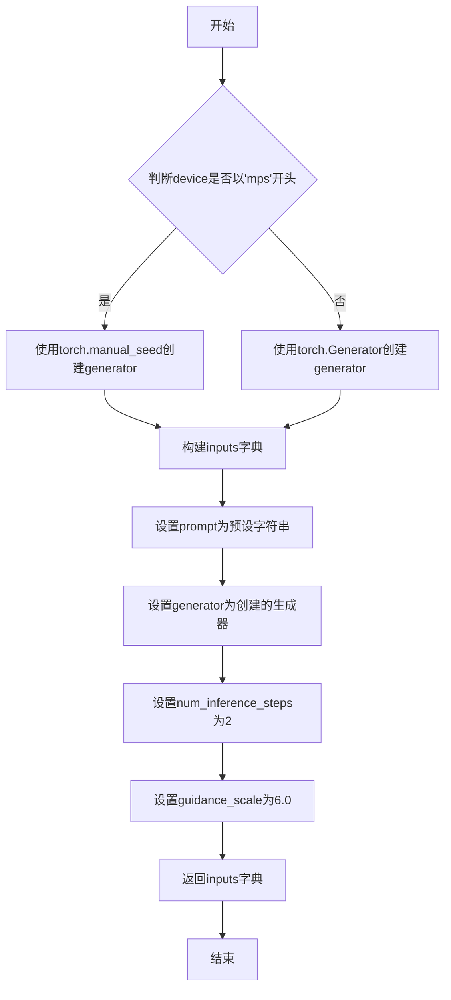

#### 带注释源码

```python
def get_dummy_inputs(self, device, seed=0):
    """
    生成用于测试 AudioLDM2Pipeline 的虚拟输入参数。
    
    参数:
        device (str): 目标计算设备，用于创建随机数生成器
        seed (int): 随机种子，用于确保测试结果可重复，默认值为 0
    
    返回:
        dict: 包含测试所需参数的字典，包括 prompt、generator、num_inference_steps 和 guidance_scale
    """
    # 判断是否为苹果MPS设备，因为MPS后端不支持torch.Generator
    if str(device).startswith("mps"):
        # MPS设备使用torch.manual_seed创建伪随机数生成器
        generator = torch.manual_seed(seed)
    else:
        # 其他设备使用torch.Generator创建可复现的随机数生成器
        generator = torch.Generator(device=device).manual_seed(seed)
    
    # 构建测试输入字典
    inputs = {
        "prompt": "A hammer hitting a wooden surface",  # 测试用提示词
        "generator": generator,                         # 随机数生成器
        "num_inference_steps": 2,                        # 推理步数
        "guidance_scale": 6.0,                           # 引导比例
    }
    return inputs
```


### `AudioLDM2PipelineSlowTests.setUp`

该方法用于在每个测试用例运行前进行环境设置和资源清理，确保测试环境的一致性和内存的有效释放。

参数：

- `self`：隐式参数，`AudioLDM2PipelineSlowTests`类的实例，代表当前测试对象

返回值：`None`，该方法不返回任何值，仅执行副作用操作

#### 流程图

```mermaid
flowchart TD
    A[开始 setUp] --> B[调用 super().setUp]
    B --> C[执行 gc.collect]
    C --> D[调用 backend_empty_cache]
    D --> E[结束 setUp]
```

#### 带注释源码

```python
def setUp(self):
    # 调用父类的 setUp 方法，确保 unittest.TestCase 的标准初始化逻辑被执行
    super().setUp()
    # 手动触发 Python 的垃圾回收，清理未使用的对象，释放内存
    gc.collect()
    # 调用后端工具函数清空 GPU 缓存，确保测试之间没有显存残留
    backend_empty_cache(torch_device)
```


### `AudioLDM2PipelineSlowTests.tearDown`

测试完成后的资源清理方法，用于释放测试过程中占用的内存和GPU缓存。

参数：

- 该方法无参数

返回值：`None`，无返回值描述

#### 流程图

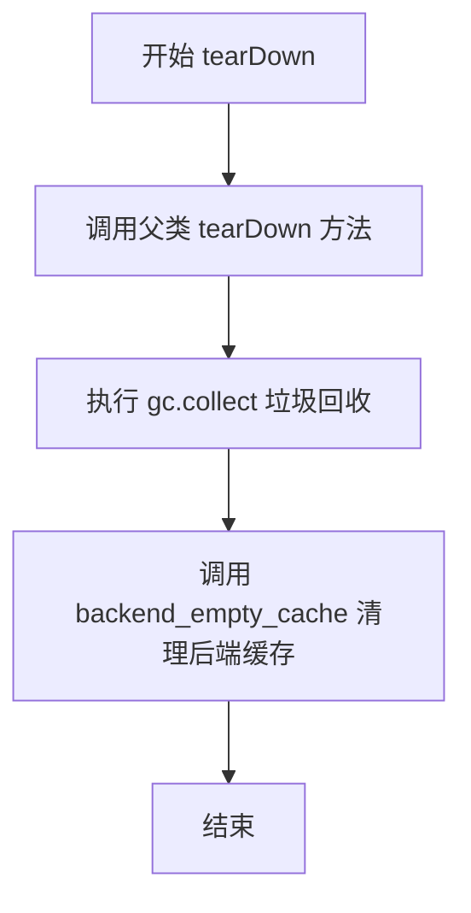

#### 带注释源码

```python
def tearDown(self):
    """
    测试完成后的资源清理方法。
    
    该方法在每个测试用例执行完毕后被调用，用于清理测试过程中
    产生的内存占用和GPU缓存，确保测试之间的隔离性。
    """
    # 调用父类的 tearDown 方法，执行基类定义的清理逻辑
    super().tearDown()
    
    # 手动触发 Python 垃圾回收，释放不再使用的对象
    gc.collect()
    
    # 清理后端（GPU）的内存缓存，防止显存泄漏
    backend_empty_cache(torch_device)
```


### `AudioLDM2PipelineSlowTests.get_inputs`

获取 AudioLDM2Pipeline 慢速测试的标准测试输入参数，包括提示词、潜在变量、生成器、推理步数和引导比例。

参数：

- `device`：`torch.device`，指定计算设备，用于将潜在变量放置到正确的设备上
- `generator_device`：`str`，生成器设备，默认为 `"cpu"`，用于创建随机数生成器
- `dtype`：`torch.dtype`，数据类型，默认为 `torch.float32`，用于潜在变量的数据类型
- `seed`：`int`，随机种子，默认为 `0`，用于确保测试的可重复性

返回值：`dict`，包含以下键值对的字典：
- `prompt`：字符串，提示词 "A hammer hitting a wooden surface"
- `latents`：torch.Tensor，形状为 (1, 8, 128, 16) 的潜在变量
- `generator`：torch.Generator，随机数生成器
- `num_inference_steps`：int，推理步数，值为 3
- `guidance_scale`：float，引导比例，值为 2.5

#### 流程图

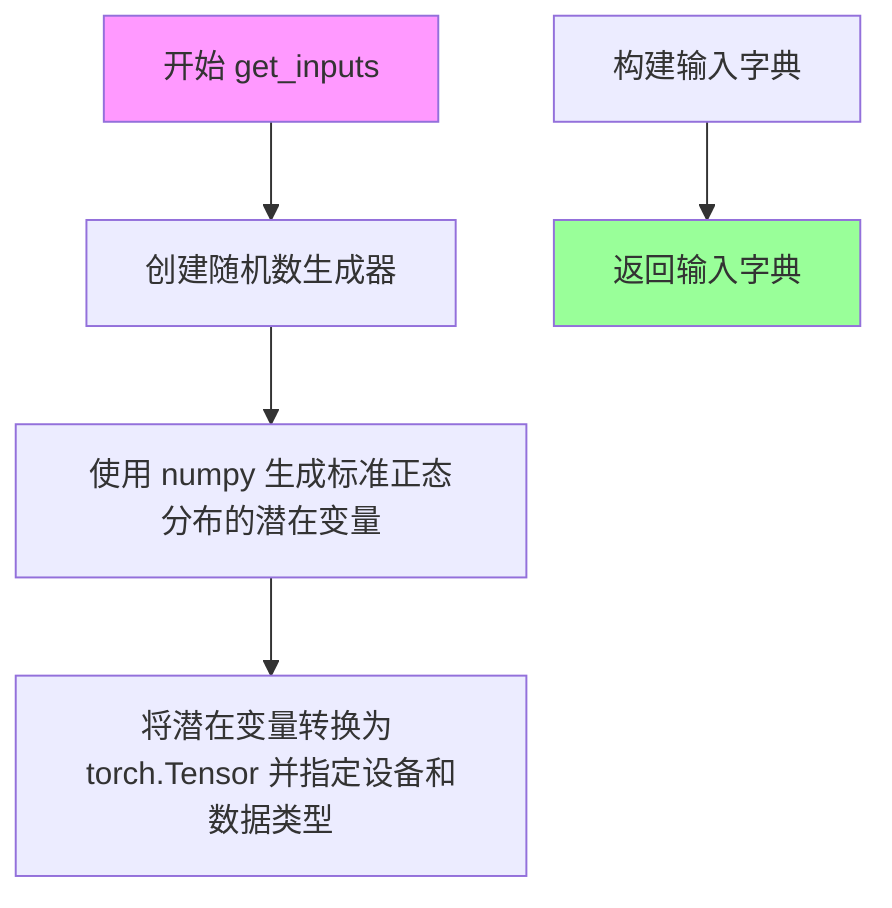

#### 带注释源码

```python
def get_inputs(self, device, generator_device="cpu", dtype=torch.float32, seed=0):
    # 创建一个随机数生成器，使用指定的设备和随机种子
    generator = torch.Generator(device=generator_device).manual_seed(seed)
    
    # 使用 numpy 生成标准正态分布的随机潜在变量，形状为 (1, 8, 128, 16)
    # 这模拟了扩散模型在推理过程中的中间状态
    latents = np.random.RandomState(seed).standard_normal((1, 8, 128, 16))
    
    # 将 numpy 数组转换为 torch.Tensor，并移动到指定设备，转换为指定数据类型
    latents = torch.from_numpy(latents).to(device=device, dtype=dtype)
    
    # 构建包含所有推理所需参数的字典
    inputs = {
        "prompt": "A hammer hitting a wooden surface",  # 文本提示词
        "latents": latents,                             # 初始潜在变量
        "generator": generator,                          # 随机生成器确保可重复性
        "num_inference_steps": 3,                       # 扩散模型推理步数
        "guidance_scale": 2.5,                          # cfg 引导强度
    }
    return inputs  # 返回完整的输入参数字典
```


### `AudioLDM2PipelineSlowTests.get_inputs_tts`

获取TTS（文本到语音）测试输入的辅助方法，用于准备AudioLDM2Pipeline的测试参数，包含文本提示、转录文本、潜在向量和生成器配置。

参数：

- `device`：`torch.device`，目标计算设备
- `generator_device`：`str`，生成器设备，默认为"cpu"
- `dtype`：`torch.dtype`，张量数据类型，默认为torch.float32
- `seed`：`int`，随机种子，默认为0

返回值：`Dict`，包含以下键值对的字典：
- `prompt`（str）：文本提示 "A men saying"
- `transcription`（str）：转录文本 "hello my name is John"
- `latents`（torch.Tensor）：预生成的潜在向量，形状为(1, 8, 128, 16)
- `generator`（torch.Generator）：随机数生成器
- `num_inference_steps`（int）：推理步数，默认值为3
- `guidance_scale`（float）：引导比例，默认值为2.5

#### 流程图

```mermaid
flowchart TD
    A[开始] --> B[创建随机数生成器]
    B --> C[使用numpy生成标准正态分布的随机 latent]
    C --> D[将latent转换为torch张量]
    D --> E[构建输入字典]
    E --> F[返回输入字典]
    
    subgraph 创建随机数生成器
        B1[使用seed初始化Generator] --> B2[设置设备为generator_device]
    end
    
    subgraph 生成latent
        C1[np.random.RandomState] --> C2[standard_normal生成形状(1,8,128,16)]
    end
    
    subgraph 构建输入字典
        E1[设置prompt] --> E2[设置transcription]
        E2 --> E3[设置latents]
        E3 --> E4[设置generator]
        E4 --> E5[设置num_inference_steps和guidance_scale]
    end
```

#### 带注释源码

```python
def get_inputs_tts(self, device, generator_device="cpu", dtype=torch.float32, seed=0):
    """
    获取TTS测试输入的辅助方法
    
    参数:
        device: 目标计算设备
        generator_device: 生成器设备，默认为"cpu"
        dtype: 张量数据类型，默认为torch.float32
        seed: 随机种子，默认为0
    
    返回:
        包含TTS测试所需参数的字典
    """
    # 使用指定种子创建随机数生成器，确保测试可复现
    generator = torch.Generator(device=generator_device).manual_seed(seed)
    
    # 使用numpy生成标准正态分布的随机潜在向量
    # 形状说明: (batch=1, channels=8, height=128, width=16)
    latents = np.random.RandomState(seed).standard_normal((1, 8, 128, 16))
    
    # 将numpy数组转换为PyTorch张量，并移动到目标设备
    latents = torch.from_numpy(latents).to(device=device, dtype=dtype)
    
    # 构建完整的输入参数字典
    inputs = {
        "prompt": "A men saying",                    # 文本提示
        "transcription": "hello my name is John",   # 转录文本（用于TTS任务）
        "latents": latents,                          # 预生成的潜在向量
        "generator": generator,                       # 随机数生成器
        "num_inference_steps": 3,                    # 推理步数
        "guidance_scale": 2.5,                       # CFG引导比例
    }
    
    return inputs
```


### `AudioLDM2PipelineFastTests.get_dummy_components`

该方法用于创建 AudioLDM2 管道所需的全部虚拟组件（dummy components），包括 UNet 模型、各类文本编码器（CLAP、T5）、语言模型、VAE、Scheduler 和 Vocoder 等，以便进行单元测试。

参数：无（仅含隐式参数 `self`）

返回值：`Dict[str, Any]`，返回包含 AudioLDM2 管道所有组件的字典，键名包括 "unet"、"scheduler"、"vae"、"text_encoder"、"text_encoder_2"、"tokenizer"、"tokenizer_2"、"feature_extractor"、"language_model"、"projection_model"、"vocoder"

#### 流程图

```mermaid
flowchart TD
    A[开始 get_dummy_components] --> B[设置随机种子 torch.manual_seed(0)]
    B --> C[创建 AudioLDM2UNet2DConditionModel]
    C --> D[创建 DDIMScheduler]
    D --> E[设置随机种子创建 AutoencoderKL]
    E --> F[构建 text_branch_config 字典]
    F --> G[构建 audio_branch_config 字典]
    G --> H[创建 ClapConfig 并实例化 ClapModel]
    H --> I[加载 RobertaTokenizer 和 ClapFeatureExtractor]
    I --> J[设置随机种子创建 T5EncoderModel]
    J --> K[加载 T5Tokenizer]
    K --> L[设置随机种子创建 GPT2LMHeadModel]
    L --> M[设置随机种子创建 AudioLDM2ProjectionModel]
    M --> N[创建 SpeechT5HifiGanConfig 和 SpeechT5HifiGan]
    N --> O[组装 components 字典]
    O --> P[返回 components]
```

#### 带注释源码

```python
def get_dummy_components(self):
    """
    创建并返回 AudioLDM2 管道所需的所有虚拟组件，用于单元测试。
    
    该方法初始化以下组件：
    - UNet2D 条件模型 (AudioLDM2UNet2DConditionModel)
    - 调度器 (DDIMScheduler)
    - VAE 自动编码器 (AutoencoderKL)
    - 文本编码器 (ClapModel)
    - 第二文本编码器 (T5EncoderModel)
    - 分词器 (RobertaTokenizer, T5Tokenizer)
    - 特征提取器 (ClapFeatureExtractor)
    - 语言模型 (GPT2LMHeadModel)
    - 投影模型 (AudioLDM2ProjectionModel)
    - 声码器 (SpeechT5HifiGan)
    
    Returns:
        Dict[str, Any]: 包含所有组件的字典，用于实例化 AudioLDM2Pipeline
    """
    # 设置随机种子以确保测试可重复性
    torch.manual_seed(0)
    
    # 创建 UNet 模型 - 用于去噪过程的扩散模型
    unet = AudioLDM2UNet2DConditionModel(
        block_out_channels=(8, 16),     # UNet 块的输出通道数
        layers_per_block=1,              # 每个块中的层数
        norm_num_groups=8,               # 归一化组数
        sample_size=32,                 # 采样空间大小
        in_channels=4,                  # 输入通道数
        out_channels=4,                 # 输出通道数
        down_block_types=("DownBlock2D", "CrossAttnDownBlock2D"),  # 下采样块类型
        up_block_types=("CrossAttnUpBlock2D", "UpBlock2D"),        # 上采样块类型
        cross_attention_dim=(8, 16),    # 交叉注意力维度
    )
    
    # 创建调度器 - 控制扩散过程的噪声调度
    scheduler = DDIMScheduler(
        beta_start=0.00085,              # beta 起始值
        beta_end=0.012,                  # beta 结束值
        beta_schedule="scaled_linear",  # beta 调度策略
        clip_sample=False,               # 是否裁剪采样
        set_alpha_to_one=False,          # 是否将 alpha 设为 1
    )
    
    # 设置随机种子并创建 VAE - 用于潜在空间的编码/解码
    torch.manual_seed(0)
    vae = AutoencoderKL(
        block_out_channels=[8, 16],      # VAE 块的输出通道
        in_channels=1,                  # 输入通道数
        out_channels=1,                 # 输出通道数
        norm_num_groups=8,              # 归一化组数
        down_block_types=["DownEncoderBlock2D", "DownEncoderBlock2D"],  # 下编码块类型
        up_block_types=["UpDecoderBlock2D", "UpDecoderBlock2D"],      # 上解码块类型
        latent_channels=4,               # 潜在空间通道数
    )
    
    # 构建 CLAP 文本分支配置
    text_branch_config = {
        "bos_token_id": 0,               # 句子开始 token ID
        "eos_token_id": 2,               # 句子结束 token ID
        "hidden_size": 8,                # 隐藏层大小
        "intermediate_size": 37,         # 前馈层中间维度
        "layer_norm_eps": 1e-05,         # 层归一化 epsilon
        "num_attention_heads": 1,        # 注意力头数
        "num_hidden_layers": 1,          # 隐藏层数量
        "pad_token_id": 1,               # 填充 token ID
        "vocab_size": 1000,              # 词汇表大小
        "projection_dim": 8,             # 投影维度
    }
    
    # 构建 CLAP 音频分支配置
    audio_branch_config = {
        "spec_size": 8,                  # 频谱图大小
        "window_size": 4,               # 窗口大小
        "num_mel_bins": 8,               # Mel  bins 数量
        "intermediate_size": 37,         # 前馈层中间维度
        "layer_norm_eps": 1e-05,         # 层归一化 epsilon
        "depths": [1, 1],                # 各层深度
        "num_attention_heads": [1, 1],   # 各层注意力头数
        "num_hidden_layers": 1,          # 隐藏层数量
        "hidden_size": 192,              # 隐藏层大小
        "projection_dim": 8,             # 投影维度
        "patch_size": 2,                 # 补丁大小
        "patch_stride": 2,                # 补丁步幅
        "patch_embed_input_channels": 4, # 补丁嵌入输入通道
    }
    
    # 创建 CLAP 配置并实例化文本编码器
    text_encoder_config = ClapConfig(
        text_config=text_branch_config,    # 文本分支配置
        audio_config=audio_branch_config,  # 音频分支配置
        projection_dim=16                   # 投影维度
    )
    text_encoder = ClapModel(text_encoder_config)  # CLAP 模型实例
    
    # 加载分词器和特征提取器
    tokenizer = RobertaTokenizer.from_pretrained(
        "hf-internal-testing/tiny-random-roberta", 
        model_max_length=77  # 模型最大长度
    )
    feature_extractor = ClapFeatureExtractor.from_pretrained(
        "hf-internal-testing/tiny-random-ClapModel", 
        hop_length=7900      # 跳步长度
    )
    
    # 设置随机种子创建 T5 文本编码器
    torch.manual_seed(0)
    text_encoder_2_config = T5Config(
        vocab_size=32100,         # 词汇表大小
        d_model=32,               # 模型维度
        d_ff=37,                  # 前馈网络维度
        d_kv=8,                    # 键值维度
        num_heads=1,              # 注意力头数
        num_layers=1,             # 层数
    )
    text_encoder_2 = T5EncoderModel(text_encoder_2_config)  # T5 编码器
    
    # 加载 T5 分词器
    tokenizer_2 = T5Tokenizer.from_pretrained(
        "hf-internal-testing/tiny-random-T5Model", 
        model_max_length=77
    )
    
    # 设置随机种子创建 GPT 语言模型
    torch.manual_seed(0)
    language_model_config = GPT2Config(
        n_embd=16,                # 嵌入维度
        n_head=1,                 # 注意力头数
        n_layer=1,                # 层数
        vocab_size=1000,          # 词汇表大小
        n_ctx=99,                 # 上下文长度
        n_positions=99,           # 位置数量
    )
    language_model = GPT2LMHeadModel(language_model_config)
    language_model.config.max_new_tokens = 8  # 最大新 token 数量
    
    # 设置随机种子创建投影模型
    torch.manual_seed(0)
    projection_model = AudioLDM2ProjectionModel(
        text_encoder_dim=16,      # 文本编码器维度
        text_encoder_1_dim=32,    # 文本编码器1维度
        langauge_model_dim=16,    # 语言模型维度 (注意：原代码有拼写错误 langauge)
    )
    
    # 创建声码器配置
    vocoder_config = SpeechT5HifiGanConfig(
        model_in_dim=8,                     # 模型输入维度
        sampling_rate=16000,                # 采样率
        upsample_initial_channel=16,        # 上采样初始通道
        upsample_rates=[2, 2],              # 上采样率
        upsample_kernel_sizes=[4, 4],       # 上采样核大小
        resblock_kernel_sizes=[3, 7],       # 残差块核大小
        resblock_dilation_sizes=[[1, 3, 5], [1, 3, 5]],  # 残差块膨胀尺寸
        normalize_before=False,              # 是否归一化前置
    )
    
    # 实例化声码器
    vocoder = SpeechT5HifiGan(vocoder_config)
    
    # 组装所有组件到字典中
    components = {
        "unet": unet,                        # UNet 去噪模型
        "scheduler": scheduler,              # 扩散调度器
        "vae": vae,                          # VAE 编解码器
        "text_encoder": text_encoder,        # CLAP 文本编码器
        "text_encoder_2": text_encoder_2,    # T5 文本编码器
        "tokenizer": tokenizer,              # Roberta 分词器
        "tokenizer_2": tokenizer_2,          # T5 分词器
        "feature_extractor": feature_extractor,  # CLAP 特征提取器
        "language_model": language_model,    # GPT 语言模型
        "projection_model": projection_model,  # 投影模型
        "vocoder": vocoder,                  # 声码器
    }
    
    return components  # 返回包含所有组件的字典
```


### `AudioLDM2PipelineFastTests.get_dummy_inputs`

该方法用于生成音频生成管道的虚拟输入参数，通过设置随机种子确保测试的可重复性，并根据目标设备（MPS 或其他）创建相应的 PyTorch 随机生成器，最终返回一个包含提示词、生成器、推理步数和引导强度的字典。

参数：

- `device`：`str` 或 `torch.device`，指定运行设备（如 "cpu"、"cuda" 等）
- `seed`：`int`（默认值=0），随机种子，用于确保测试结果的可重复性

返回值：`dict`，包含以下键值对：
- `prompt`：`str`，输入的文本提示词
- `generator`：`torch.Generator`，PyTorch 随机生成器对象
- `num_inference_steps`：`int`，推理步数
- `guidance_scale`：`float`，引导强度

#### 流程图

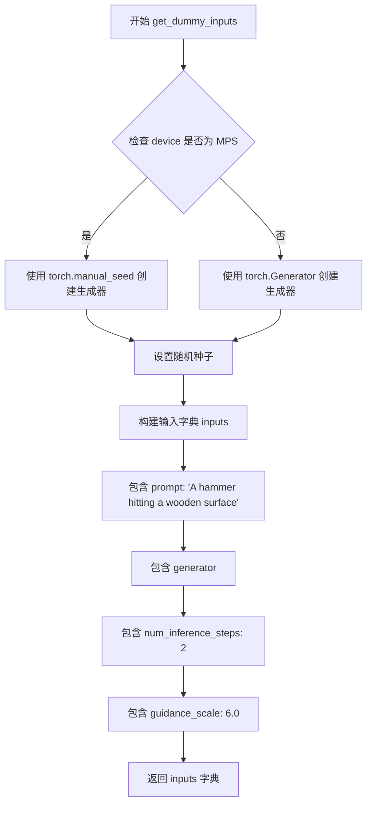

#### 带注释源码

```python
def get_dummy_inputs(self, device, seed=0):
    """
    生成用于测试的虚拟输入参数。
    
    参数:
        device: 目标设备，可以是 'cpu', 'cuda', 'mps' 等
        seed: 随机种子，默认值为 0，用于确保测试可重复性
    
    返回:
        包含以下键的字典:
            - prompt: 文本提示词
            - generator: PyTorch 随机生成器
            - num_inference_steps: 推理步数
            - guidance_scale: 引导强度
    """
    # 检查设备是否为 Apple MPS (Metal Performance Shaders)
    if str(device).startswith("mps"):
        # MPS 设备使用 torch.manual_seed 创建生成器
        generator = torch.manual_seed(seed)
    else:
        # 其他设备使用 torch.Generator 创建生成器并设置种子
        generator = torch.Generator(device=device).manual_seed(seed)
    
    # 构建输入参数字典
    inputs = {
        "prompt": "A hammer hitting a wooden surface",  # 测试用文本提示
        "generator": generator,                         # 随机生成器确保可重复性
        "num_inference_steps": 2,                        # 较少的推理步数用于快速测试
        "guidance_scale": 6.0,                           # Classifier-free guidance 强度
    }
    return inputs
```


### `AudioLDM2PipelineFastTests.test_audioldm2_ddim`

该测试方法验证 AudioLDM2Pipeline 使用 DDIMScheduler 进行文本到音频生成的功能，通过构建虚拟组件、初始化管道、执行推理并验证生成的音频维度、长度和数值精度是否符合预期。

参数：

- `self`：隐式参数，`unittest.TestCase` 的实例方法，表示测试类本身

返回值：无（`None`），该方法为测试方法，通过 `assert` 语句验证行为，不返回任何值

#### 流程图

```mermaid
flowchart TD
    A[开始测试] --> B[设置device为cpu确保确定性]
    B --> C[调用get_dummy_components获取虚拟组件]
    C --> D[使用虚拟组件实例化AudioLDM2Pipeline]
    D --> E[将管道移动到torch_device设备]
    E --> F[设置进度条配置disable=None]
    F --> G[调用get_dummy_inputs获取测试输入]
    G --> H[执行管道推理: audioldm_pipe(**inputs)]
    H --> I[从输出中提取生成的音频: output.audios[0]]
    I --> J[断言验证: audio.ndim == 1]
    J --> K[断言验证: len(audio) == 256]
    K --> L[提取前10个音频样本]
    L --> M[定义expected_slice期望的数值数组]
    M --> N[断言验证: 实际样本与期望样本的最大差异 < 1e-4]
    N --> O[测试通过]
```

#### 带注释源码

```python
@pytest.mark.xfail(
    condition=is_transformers_version(">=", "4.54.1"),
    reason="Test currently fails on Transformers version 4.54.1.",
    strict=False,
)
def test_audioldm2_ddim(self):
    """
    测试 AudioLDM2Pipeline 使用 DDIMScheduler 进行文本到音频生成的功能。
    验证生成的音频维度、长度和数值精度是否符合预期。
    """
    # 设置device为cpu，确保torch.Generator的确定性
    device = "cpu"  # ensure determinism for the device-dependent torch.Generator

    # 获取虚拟组件（UNet、VAE、文本编码器、调度器等）
    components = self.get_dummy_components()
    
    # 使用虚拟组件实例化AudioLDM2Pipeline
    audioldm_pipe = AudioLDM2Pipeline(**components)
    
    # 将管道移动到指定的设备（如cuda或cpu）
    audioldm_pipe = audioldm_pipe.to(torch_device)
    
    # 设置进度条配置，disable=None表示不禁用进度条
    audioldm_pipe.set_progress_bar_config(disable=None)

    # 获取测试输入，包含prompt、generator、num_inference_steps、guidance_scale
    inputs = self.get_dummy_inputs(device)
    
    # 执行管道推理，生成音频
    output = audioldm_pipe(**inputs)
    
    # 从输出中提取第一个生成的音频
    audio = output.audios[0]

    # 断言验证：音频应该是一维的
    assert audio.ndim == 1
    
    # 断言验证：音频长度应该为256
    assert len(audio) == 256

    # 提取前10个音频样本用于精度验证
    audio_slice = audio[:10]
    
    # 定义期望的音频数值数组
    expected_slice = np.array(
        [
            2.602e-03,
            1.729e-03,
            1.863e-03,
            -2.219e-03,
            -2.656e-03,
            -2.017e-03,
            -2.648e-03,
            -2.115e-03,
            -2.502e-03,
            -2.081e-03,
        ]
    )

    # 断言验证：实际音频样本与期望样本的最大差异应小于1e-4
    assert np.abs(audio_slice - expected_slice).max() < 1e-4
```


### `AudioLDM2PipelineFastTests.test_audioldm2_prompt_embeds`

该测试方法验证了 AudioLDM2Pipeline 能够正确使用预计算的 prompt_embeds 和 generated_prompt_embeds 进行音频生成，确保手动构建的嵌入与通过 tokenizer 和 text_encoder 自动生成的嵌入在功能上等价。

参数：

- `self`：隐式参数，TestCase 实例，表示测试类本身

返回值：`None`，该方法为单元测试，通过断言验证音频生成的一致性，不返回任何值

#### 流程图

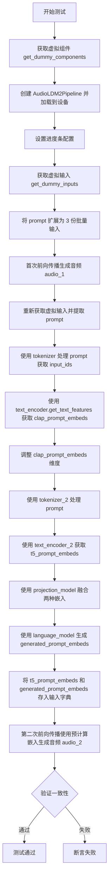

#### 带注释源码

```python
def test_audioldm2_prompt_embeds(self):
    """
    测试 AudioLDM2Pipeline 使用预计算的 prompt_embeds 进行音频生成的功能。
    验证手动构建的嵌入与自动生成的嵌入产生一致的输出。
    """
    # 步骤1: 获取虚拟组件（用于测试的模拟模型组件）
    components = self.get_dummy_components()
    
    # 步骤2: 使用虚拟组件创建 AudioLDM2Pipeline 实例
    audioldm_pipe = AudioLDM2Pipeline(**components)
    
    # 步骤3: 将管道移至测试设备（如 CPU 或 CUDA）
    audioldm_pipe = audioldm_pipe.to(torch_device)
    audioldm_pipe = audioldm_pipe.to(torch_device)  # 重复调用确保设备设置正确
    
    # 步骤4: 配置进度条（disable=None 表示不禁用进度条）
    audioldm_pipe.set_progress_bar_config(disable=None)

    # 步骤5: 获取虚拟输入参数
    inputs = self.get_dummy_inputs(torch_device)
    
    # 步骤6: 将单个 prompt 扩展为 3 个元素的列表（批量处理）
    inputs["prompt"] = 3 * [inputs["prompt"]]

    # 步骤7: 首次前向传播，使用自动编码的 prompt_embeds
    output = audioldm_pipe(**inputs)
    audio_1 = output.audios[0]  # 获取第一个音频结果

    # 步骤8: 重新获取输入并手动构建 prompt_embeds
    inputs = self.get_dummy_inputs(torch_device)
    prompt = 3 * [inputs.pop("prompt")]  # 提取并扩展 prompt

    # 步骤9: 使用第一个 tokenizer (RobertaTokenizer) 处理 prompt
    text_inputs = audioldm_pipe.tokenizer(
        prompt,
        padding="max_length",
        max_length=audioldm_pipe.tokenizer.model_max_length,
        truncation=True,
        return_tensors="pt",
    )
    text_inputs = text_inputs["input_ids"].to(torch_device)

    # 步骤10: 使用 CLAP text_encoder 获取文本特征嵌入
    clap_prompt_embeds = audioldm_pipe.text_encoder.get_text_features(text_inputs)
    clap_prompt_embeds = clap_prompt_embeds[:, None, :]  # 调整维度以匹配后续处理

    # 步骤11: 使用第二个 tokenizer (T5Tokenizer) 处理 prompt
    text_inputs = audioldm_pipe.tokenizer_2(
        prompt,
        padding="max_length",
        max_length=True,  # 使用 True 而非模型最大长度
        truncation=True,
        return_tensors="pt",
    )
    text_inputs = text_inputs["input_ids"].to(torch_device)

    # 步骤12: 使用 T5 encoder 获取 T5 文本嵌入
    t5_prompt_embeds = audioldm_pipe.text_encoder_2(
        text_inputs,
    )
    t5_prompt_embeds = t5_prompt_embeds[0]  # 提取隐藏状态

    # 步骤13: 使用 projection_model 融合 CLAP 和 T5 嵌入
    projection_embeds = audioldm_pipe.projection_model(clap_prompt_embeds, t5_prompt_embeds)[0]

    # 步骤14: 使用 language_model 生成最终的 prompt 嵌入
    generated_prompt_embeds = audioldm_pipe.generate_language_model(projection_embeds, max_new_tokens=8)

    # 步骤15: 将预计算的嵌入添加到输入字典
    inputs["prompt_embeds"] = t5_prompt_embeds
    inputs["generated_prompt_embeds"] = generated_prompt_embeds

    # 步骤16: 第二次前向传播，使用预计算的 prompt_embeds
    output = audioldm_pipe(**inputs)
    audio_2 = output.audios[0]

    # 步骤17: 断言两次生成的音频差异小于阈值（验证一致性）
    assert np.abs(audio_1 - audio_2).max() < 1e-2
```


### `AudioLDM2PipelineFastTests.test_audioldm2_negative_prompt_embeds`

该方法是一个单元测试，用于验证 AudioLDM2Pipeline 在使用 negative prompt embeds（负面提示嵌入）时能够正确生成音频，并通过比较直接使用 negative_prompt 参数与手动构建 negative_prompt_embeds 两种方式的输出来确保一致性。

参数：无（除隐含的 self 参数）

返回值：无（测试方法，无返回值）

#### 流程图

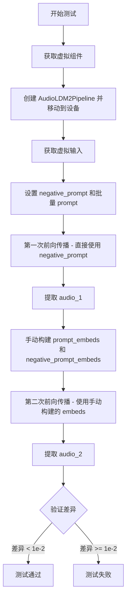

#### 带注释源码

```python
def test_audioldm2_negative_prompt_embeds(self):
    """
    测试 AudioLDM2Pipeline 使用 negative prompt embeds 的功能。
    验证直接使用 negative_prompt 参数与手动构建 negative_prompt_embeds 
    两种方式生成的音频结果一致。
    """
    # 步骤1: 获取用于测试的虚拟组件（模型、tokenizer 等）
    components = self.get_dummy_components()
    
    # 步骤2: 使用虚拟组件创建 AudioLDM2Pipeline 并移动到指定设备
    audioldm_pipe = AudioLDM2Pipeline(**components)
    audioldm_pipe = audioldm_pipe.to(torch_device)
    audioldm_pipe.set_progress_bar_config(disable=None)

    # 步骤3: 获取虚拟输入参数
    inputs = self.get_dummy_inputs(torch_device)
    
    # 步骤4: 设置 negative_prompt 和批量 prompt
    # 创建3个相同的负面提示
    negative_prompt = 3 * ["this is a negative prompt"]
    inputs["negative_prompt"] = negative_prompt
    
    # 将 prompt 也扩展为3个相同的提示
    inputs["prompt"] = 3 * [inputs["prompt"]]

    # 步骤5: 第一次前向传播 - 直接使用 negative_prompt 参数
    output = audioldm_pipe(**inputs)
    audio_1 = output.audios[0]

    # 步骤6: 手动构建 prompt_embeds 和 negative_prompt_embeds
    # 重新获取输入，但移除 prompt
    inputs = self.get_dummy_inputs(torch_device)
    prompt = 3 * [inputs.pop("prompt")]

    # 用于存储 embeddings 的列表
    embeds = []
    generated_embeds = []

    # 分别处理 prompt 和 negative_prompt
    for p in [prompt, negative_prompt]:
        # 使用第一个 tokenizer (CLAP) 处理文本
        text_inputs = audioldm_pipe.tokenizer(
            p,
            padding="max_length",
            max_length=audioldm_pipe.tokenizer.model_max_length,
            truncation=True,
            return_tensors="pt",
        )
        text_inputs = text_inputs["input_ids"].to(torch_device)

        # 获取 CLAP 文本特征
        clap_prompt_embeds = audioldm_pipe.text_encoder.get_text_features(text_inputs)
        clap_prompt_embeds = clap_prompt_embeds[:, None, :]

        # 使用第二个 tokenizer (T5) 处理文本
        text_inputs = audioldm_pipe.tokenizer_2(
            prompt,
            padding="max_length",
            max_length=True if len(embeds) == 0 else embeds[0].shape[1],
            truncation=True,
            return_tensors="pt",
        )
        text_inputs = text_inputs["input_ids"].to(torch_device)

        # 获取 T5 文本 embeddings
        t5_prompt_embeds = audioldm_pipe.text_encoder_2(
            text_inputs,
        )
        t5_prompt_embeds = t5_prompt_embeds[0]

        # 使用投影模型融合 CLAP 和 T5 的 embeddings
        projection_embeds = audioldm_pipe.projection_model(clap_prompt_embeds, t5_prompt_embeds)[0]
        
        # 使用语言模型生成新的 embeddings
        generated_prompt_embeds = audioldm_pipe.generate_language_model(projection_embeds, max_new_tokens=8)

        # 存储 embeddings
        embeds.append(t5_prompt_embeds)
        generated_embeds.append(generated_prompt_embeds)

    # 步骤7: 将手动构建的 embeddings 放入输入字典
    inputs["prompt_embeds"], inputs["negative_prompt_embeds"] = embeds
    inputs["generated_prompt_embeds"], inputs["negative_generated_prompt_embeds"] = generated_embeds

    # 步骤8: 第二次前向传播 - 使用手动构建的 embeddings
    output = audioldm_pipe(**inputs)
    audio_2 = output.audios[0]

    # 步骤9: 验证两次输出的一致性
    # 断言两次生成的音频差异小于阈值 1e-2
    assert np.abs(audio_1 - audio_2).max() < 1e-2
```


### `AudioLDM2PipelineFastTests.test_audioldm2_negative_prompt`

该测试方法用于验证 AudioLDM2Pipeline 在使用负向提示词（negative prompt）生成音频时的功能正确性，确保负向提示词能够正确影响音频生成过程并产生符合预期的音频输出。

参数：

- `self`：隐式参数，测试类实例本身，无类型描述

返回值：无显式返回值（返回类型为 `None`），通过断言验证功能正确性

#### 流程图

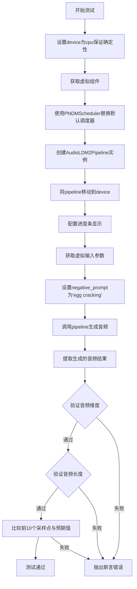

#### 带注释源码

```python
@pytest.mark.xfail(
    condition=is_transformers_version(">=", "4.54.1"),
    reason="Test currently fails on Transformers version 4.54.1.",
    strict=False,
)
def test_audioldm2_negative_prompt(self):
    """
    测试 AudioLDM2Pipeline 使用 negative_prompt 参数生成音频的功能。
    验证负向提示词能够正确影响音频生成过程并产生预期长度的音频。
    """
    # 设置设备为 CPU，确保 torch.Generator 的确定性
    device = "cpu"  # ensure determinism for the device-dependent torch.Generator
    
    # 获取虚拟组件（UNet、VAE、文本编码器等）
    components = self.get_dummy_components()
    
    # 使用 PNDMScheduler 替换默认调度器，并跳过 PRK 步骤
    components["scheduler"] = PNDMScheduler(skip_prk_steps=True)
    
    # 使用虚拟组件创建 AudioLDM2Pipeline 实例
    audioldm_pipe = AudioLDM2Pipeline(**components)
    
    # 将 pipeline 移动到指定设备
    audioldm_pipe = audioldm_pipe.to(device)
    
    # 配置进度条显示（disable=None 表示不禁用）
    audioldm_pipe.set_progress_bar_config(disable=None)
    
    # 获取虚拟输入参数（包含 prompt、generator、num_inference_steps 等）
    inputs = self.get_dummy_inputs(device)
    
    # 设置负向提示词，用于引导模型避免生成提示词相关的内容
    negative_prompt = "egg cracking"
    
    # 调用 pipeline 进行音频生成，传入负向提示词参数
    output = audioldm_pipe(**inputs, negative_prompt=negative_prompt)
    
    # 从输出中提取第一个生成的音频
    audio = output.audios[0]
    
    # 断言：验证音频是一维数组
    assert audio.ndim == 1
    
    # 断言：验证音频长度为 256 个采样点
    assert len(audio) == 256
    
    # 提取前 10 个音频采样点用于精确验证
    audio_slice = audio[:10]
    
    # 定义预期音频切片值（基于已知正确结果）
    expected_slice = np.array(
        [0.0026, 0.0017, 0.0018, -0.0022, -0.0026, -0.002, -0.0026, -0.0021, -0.0025, -0.0021]
    )
    
    # 断言：验证生成音频与预期值的最大差异小于 1e-4
    assert np.abs(audio_slice - expected_slice).max() < 1e-4
```


### `AudioLDM2PipelineFastTests.test_audioldm2_num_waveforms_per_prompt`

该测试方法用于验证 AudioLDM2Pipeline 在不同 `num_waveforms_per_prompt` 参数设置下的音频生成功能，确保单个提示和批量提示都能正确生成相应数量的波形。

参数：

- `self`：测试类实例，无需显式传递

返回值：无返回值（通过断言验证功能正确性）

#### 流程图

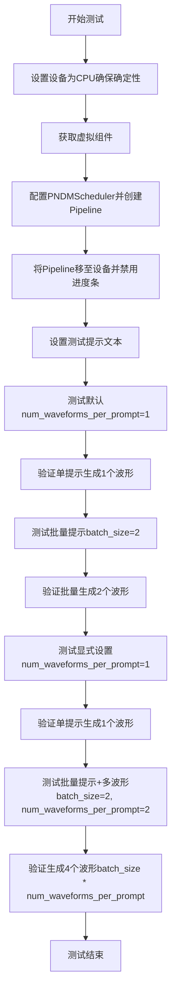

#### 带注释源码

```python
def test_audioldm2_num_waveforms_per_prompt(self):
    # 设置设备为CPU以确保torch.Generator的确定性
    device = "cpu"  # ensure determinism for the device-dependent torch.Generator
    
    # 获取预定义的虚拟组件，用于测试
    components = self.get_dummy_components()
    
    # 使用PNDMScheduler并跳过PRK步骤
    components["scheduler"] = PNDMScheduler(skip_prk_steps=True)
    
    # 使用虚拟组件实例化AudioLDM2Pipeline
    audioldm_pipe = AudioLDM2Pipeline(**components)
    
    # 将Pipeline移至指定设备
    audioldm_pipe = audioldm_pipe.to(device)
    
    # 禁用进度条配置
    audioldm_pipe.set_progress_bar_config(disable=None)

    # 定义测试用的提示文本
    prompt = "A hammer hitting a wooden surface"

    # 测试1：验证默认num_waveforms_per_prompt=1的情况
    # test num_waveforms_per_prompt=1 (default)
    audios = audioldm_pipe(prompt, num_inference_steps=2).audios

    # 断言：单提示应生成1个波形，形状为(1, 256)
    assert audios.shape == (1, 256)

    # 测试2：验证默认情况下批量提示的波形数量
    # test num_waveforms_per_prompt=1 (default) for batch of prompts
    batch_size = 2
    audios = audioldm_pipe([prompt] * batch_size, num_inference_steps=2).audios

    # 断言：批量提示应生成2个波形，形状为(batch_size, 256)
    assert audios.shape == (batch_size, 256)

    # 测试3：验证显式设置num_waveforms_per_prompt=1时的单提示行为
    # test num_waveforms_per_prompt for single prompt
    num_waveforms_per_prompt = 1
    audios = audioldm_pipe(prompt, num_inference_steps=2, num_waveforms_per_prompt=num_waveforms_per_prompt).audios

    # 断言：显式设置应与默认值行为一致
    assert audios.shape == (num_waveforms_per_prompt, 256)

    # 测试4：验证批量提示配合num_waveforms_per_prompt的生成数量
    # test num_waveforms_per_prompt for batch of prompts
    batch_size = 2
    audios = audioldm_pipe(
        [prompt] * batch_size, num_inference_steps=2, num_waveforms_per_prompt=num_waveforms_per_prompt
    ).audios

    # 断言：批量提示应生成batch_size * num_waveforms_per_prompt个波形
    assert audios.shape == (batch_size * num_waveforms_per_prompt, 256)
```


### `AudioLDM2PipelineFastTests.test_audioldm2_audio_length_in_s`

该测试方法用于验证AudioLDM2Pipeline在给定不同`audio_length_in_s`参数时生成音频的长度是否正确。它通过创建虚拟组件、设置管道、调用管道生成音频，然后断言音频的维度和长度与预期值相符。

参数：

- `self`：测试类实例本身，包含测试所需的上下文和辅助方法

返回值：`None`，该方法为单元测试方法，通过断言进行验证，不返回具体值

#### 流程图

```mermaid
flowchart TD
    A[开始测试] --> B[设置device为cpu确保确定性]
    B --> C[获取虚拟组件]
    C --> D[创建AudioLDM2Pipeline实例]
    D --> E[将pipeline移动到torch_device]
    E --> F[禁用进度条配置]
    F --> G[获取vocoder采样率]
    G --> H[获取虚拟输入]
    H --> I[调用pipeline: audio_length_in_s=0.016]
    I --> J[获取生成的音频]
    J --> K[断言: audio.ndim == 1]
    K --> L{断言通过?}
    L -->|是| M[断言: len(audio) / vocoder_sampling_rate == 0.016]
    L -->|否| N[测试失败]
    M --> O[调用pipeline: audio_length_in_s=0.032]
    O --> P[获取生成的音频]
    P --> Q[断言: audio.ndim == 1]
    Q --> R{断言通过?}
    R -->|是| S[断言: len(audio) / vocoder_sampling_rate == 0.032]
    R -->|否| N
    S --> T[测试通过]
```

#### 带注释源码

```python
def test_audioldm2_audio_length_in_s(self):
    """
    测试AudioLDM2Pipeline在不同audio_length_in_s参数下生成音频的长度验证
    
    测试目的：
    验证pipeline能够根据audio_length_in_s参数生成对应长度的音频，
    并且音频长度与采样率的计算是正确的。
    """
    # 使用cpu设备确保torch.Generator的确定性
    device = "cpu"  # ensure determinism for the device-dependent torch.Generator
    
    # 获取预定义的虚拟组件，用于测试
    components = self.get_dummy_components()
    
    # 使用虚拟组件实例化AudioLDM2Pipeline
    audioldm_pipe = AudioLDM2Pipeline(**components)
    
    # 将pipeline移动到指定的计算设备
    audioldm_pipe = audioldm_pipe.to(torch_device)
    
    # 设置进度条配置，disable=None表示不禁用进度条
    audioldm_pipe.set_progress_bar_config(disable=None)
    
    # 从vocoder配置中获取采样率，用于后续计算音频长度
    vocoder_sampling_rate = audioldm_pipe.vocoder.config.sampling_rate

    # 获取虚拟输入参数，包括prompt、generator等
    inputs = self.get_dummy_inputs(device)
    
    # 测试用例1：生成0.016秒的音频
    # 传入audio_length_in_s参数指定音频长度
    output = audioldm_pipe(audio_length_in_s=0.016, **inputs)
    
    # 从输出中获取第一个生成的音频
    audio = output.audios[0]

    # 断言1：验证音频是一维的（单声道）
    assert audio.ndim == 1
    
    # 断言2：验证音频长度与指定的audio_length_in_s一致
    # 音频样本数 / 采样率 = 时长(秒)
    assert len(audio) / vocoder_sampling_rate == 0.016

    # 测试用例2：生成0.032秒的音频，验证不同长度的处理
    output = audioldm_pipe(audio_length_in_s=0.032, **inputs)
    audio = output.audios[0]

    # 断言3：再次验证音频是一维的
    assert audio.ndim == 1
    
    # 断言4：验证0.032秒音频的长度计算正确
    assert len(audio) / vocoder_sampling_rate == 0.032
```


### `AudioLDM2PipelineFastTests.test_audioldm2_vocoder_model_in_dim`

该测试方法用于验证 AudioLDM2Pipeline 在声码器（Vocoder）模型输入维度（model_in_dim）改变时的行为是否符合预期，确保即使声码器的 mel 通道数翻倍，输出音频的波形形状保持不变。

参数：

- `self`：`AudioLDM2PipelineFastTests`，测试类实例本身，包含测试所需的配置和工具方法

返回值：`None`，该方法为测试方法，无返回值，通过断言验证逻辑正确性

#### 流程图

```mermaid
flowchart TD
    A[开始测试] --> B[获取虚拟组件配置]
    B --> C[创建 AudioLDM2Pipeline 实例]
    C --> D[将 Pipeline 移动到 torch_device]
    D --> E[设置进度条配置]
    E --> F[设置提示词 prompt = 'hey']
    F --> G[首次调用 Pipeline 生成音频]
    G --> H[断言输出形状为 (1, 256)]
    H --> I[获取 vocoder 配置并加倍 model_in_dim]
    I --> J[使用新配置重新创建 Vocoder]
    J --> K[再次调用 Pipeline 生成音频]
    K --> L[断言输出形状仍为 (1, 256)]
    L --> M[测试结束]
```

#### 带注释源码

```python
def test_audioldm2_vocoder_model_in_dim(self):
    """
    测试 AudioLDM2Pipeline 在 vocoder 模型输入维度改变时的行为。
    验证当 vocoder 的 model_in_dim 加倍时，输出音频波形形状保持不变。
    """
    # 获取虚拟组件配置，用于构建测试用的 Pipeline
    components = self.get_dummy_components()
    
    # 使用虚拟组件实例化 AudioLDM2Pipeline
    audioldm_pipe = AudioLDM2Pipeline(**components)
    
    # 将 Pipeline 移动到指定的计算设备（CPU/GPU）
    audioldm_pipe = audioldm_pipe.to(torch_device)
    
    # 配置进度条，disable=None 表示不禁用进度条
    audioldm_pipe.set_progress_bar_config(disable=None)

    # 设置测试用的提示词
    prompt = ["hey"]

    # 第一次推理：使用原始配置的 vocoder 生成音频
    output = audioldm_pipe(prompt, num_inference_steps=1)
    
    # 获取输出音频的形状
    audio_shape = output.audios.shape
    
    # 断言：原始配置下音频形状应为 (1, 256)
    # 1 表示 batch_size，256 表示音频采样点数量
    assert audio_shape == (1, 256)

    # 获取当前 vocoder 的配置对象
    config = audioldm_pipe.vocoder.config
    
    # 将 vocoder 的 model_in_dim 加倍
    # 这相当于将 spectrogram 的 mel 通道数翻倍
    config.model_in_dim *= 2
    
    # 使用修改后的配置重新创建 Vocoder
    audioldm_pipe.vocoder = SpeechT5HifiGan(config).to(torch_device)
    
    # 第二次推理：使用修改后的 vocoder 生成音频
    output = audioldm_pipe(prompt, num_inference_steps=1)
    
    # 再次获取输出音频的形状
    audio_shape = output.audios.shape
    
    # 断言：即使 vocoder 的输入维度加倍，输出波形形状仍应为 (1, 256)
    # 注释说明：波形形状不变，我们只是有了 2 倍数量的 mel 通道在频谱图中
    # waveform shape is unchanged, we just have 2x the number of mel channels in the spectrogram
    assert audio_shape == (1, 256)
```


### `AudioLDM2PipelineFastTests.test_attention_slicing_forward_pass`

该测试方法用于验证 AudioLDM2Pipeline 在使用注意力切片（Attention Slicing）优化技术时的前向传播是否正常工作，通过调用父类通用的注意力切片测试逻辑来验证管道的正确性。

参数：

- `self`：`AudioLDM2PipelineFastTests`，测试类实例，包含了测试所需的组件和配置信息

返回值：`None`，该方法为测试方法，不返回任何值，主要通过断言来验证正确性

#### 流程图

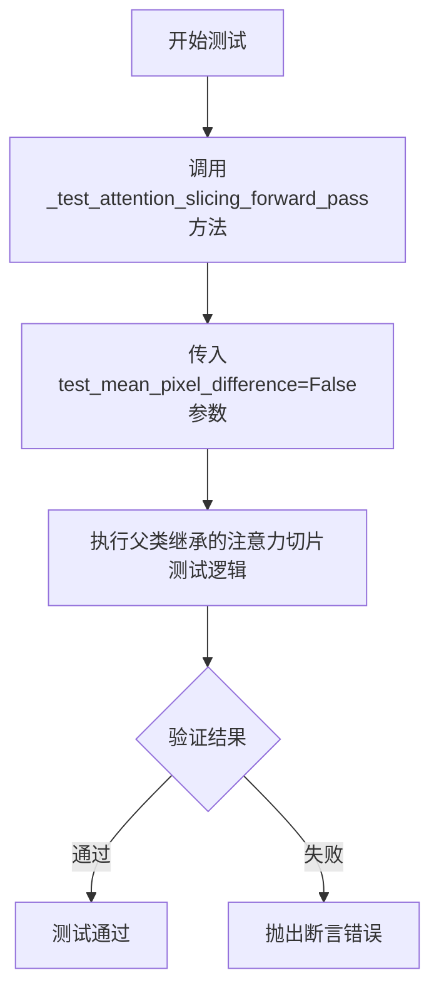

#### 带注释源码

```python
def test_attention_slicing_forward_pass(self):
    """
    测试注意力切片（Attention Slicing）前向传播
    注意力切片是一种内存优化技术，将注意力计算分片处理以减少显存占用
    """
    # 调用父类/混合类中的通用注意力切片测试方法
    # test_mean_pixel_difference=False 表示不测试像素平均值差异（音频域）
    self._test_attention_slicing_forward_pass(test_mean_pixel_difference=False)
```


### `AudioLDM2PipelineFastTests.test_xformers_attention_forwardGenerator_pass`

这是一个被跳过的单元测试方法，用于测试 AudioLDM2 管道中 xformers 注意力机制的转发功能。由于 AudioLDM2 目前不支持 xformers 注意力，该测试被标记为跳过。

参数：

- `self`：`AudioLDM2PipelineFastTests`，表示测试类实例本身，无需显式传递

返回值：`None`，该方法不返回任何值

#### 流程图

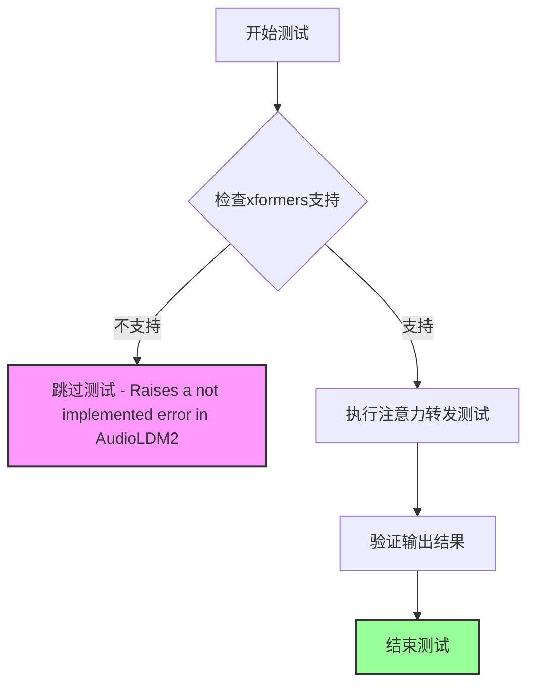

#### 带注释源码

```python
@unittest.skip("Raises a not implemented error in AudioLDM2")
def test_xformers_attention_forwardGenerator_pass(self):
    """
    测试 xformers 注意力机制的前向传播功能
    
    该测试方法用于验证 AudioLDM2Pipeline 中 xformers 注意力机制
    的 forward pass 是否正常工作。由于 AudioLDM2 目前不支持 xformers
    注意力实现，该测试被标记为跳过。
    
    注意：
    - 该测试方法体为空（pass）
    - 使用 @unittest.skip 装饰器跳过测试
    - 跳过原因：AudioLDM2 中 xformers 会抛出未实现错误
    """
    pass  # 方法体为空，测试被跳过
```

#### 额外说明

| 项目 | 说明 |
|------|------|
| **测试类型** | 单元测试（Unit Test） |
| **测试框架** | unittest（Python 标准库） |
| **所属测试类** | `AudioLDM2PipelineFastTests` |
| **跳过标记** | `@unittest.skip("Raises a not implemented error in AudioLDM2")` |
| **跳过原因** | AudioLDM2 管道不支持 xformers 注意力机制，会抛出未实现错误 |
| **技术状态** | 已知技术限制，非测试缺陷 |
| **潜在优化** | 未来可在 AudioLDM2 实现 xformers 支持后重新启用此测试 |


### `AudioLDM2PipelineFastTests.test_dict_tuple_outputs_equivalent`

该测试方法用于验证 AudioLDM2Pipeline 管道在返回字典格式和元组格式输出时结果是否等价，通过调用父类的测试方法并放宽容差阈值以适应大型复合模型。

参数：

- `self`：`AudioLDM2PipelineFastTests`，测试类实例，隐式参数，代表当前测试对象

返回值：`None`，该方法通过调用父类 `PipelineTesterMixin` 的同名方法执行测试断言，无显式返回值。

#### 流程图

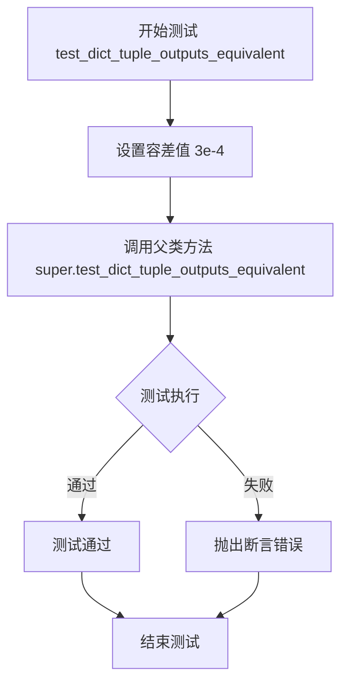

#### 带注释源码

```python
def test_dict_tuple_outputs_equivalent(self):
    """
    测试方法：验证管道字典和元组输出格式的等价性
    
    该测试方法继承自 PipelineTesterMixin，用于验证 AudioLDM2Pipeline
    在使用 return_dict=True 和 return_dict=False（返回元组）时，
    生成的音频输出是否在指定的容差范围内等价。
    """
    # increase tolerance from 1e-4 -> 3e-4 to account for large composite model
    # 注释：增加容差阈值从默认的 1e-4 到 3e-4，以适应大型复合模型
    # 这是因为 AudioLDM2Pipeline 包含多个复杂的子模型组件
    super().test_dict_tuple_outputs_equivalent(expected_max_difference=3e-4)
    # 调用父类 PipelineTesterMixin 的测试方法
    # 参数 expected_max_difference=3e-4 指定了允许的最大差异阈值
```


### `AudioLDM2PipelineFastTests.test_inference_batch_single_identical`

该测试方法用于验证批量推理（batch inference）与单样本推理（single inference）的输出结果是否一致，确保管道在两种推理模式下产生相同的音频结果。由于 AudioLDM2Pipeline 是复杂的复合模型，测试放宽了容差阈值以适应模型精度变化。

参数：无（继承自 `unittest.TestCase`，使用 `self` 调用父类方法）

返回值：无（测试方法，不返回结果，通过断言验证一致性）

#### 流程图

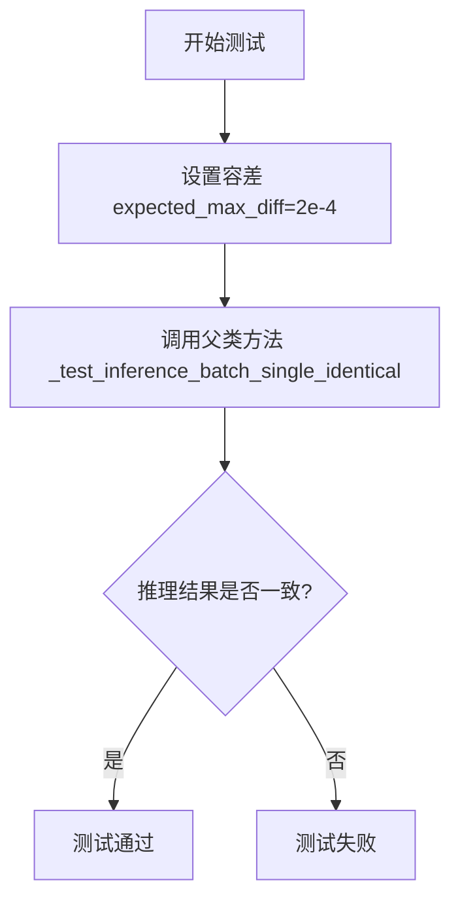

#### 带注释源码

```python
@pytest.mark.xfail(
    condition=is_torch_version(">=", "2.7"),
    reason="Test currently fails on PyTorch 2.7.",
    strict=False,
)
def test_inference_batch_single_identical(self):
    # increase tolerance from 1e-4 -> 2e-4 to account for large composite model
    # 放宽容差阈值：从 1e-4 增加到 2e-4，以适应大型复合模型的数值精度变化
    self._test_inference_batch_single_identical(expected_max_diff=2e-4)
```


### `AudioLDM2PipelineFastTests.test_save_load_local`

该测试方法用于验证 AudioLDM2Pipeline 的保存与加载功能，确保管道在序列化为本地文件后能够正确恢复并且生成一致的音频输出。

参数：

- `self`：`AudioLDM2PipelineFastTests`，表示测试类实例本身，无需显式传递

返回值：`None`，该方法为 `unittest.TestCase` 测试用例，执行过程中通过断言验证正确性，无显式返回值

#### 流程图

```mermaid
flowchart TD
    A[开始测试 test_save_load_local] --> B[获取虚拟组件 components]
    B --> C[获取虚拟输入 inputs]
    C --> D[创建 AudioLDM2Pipeline 实例并置于 CPU]
    D --> E[执行第一次推理生成音频 output1]
    E --> F[将管道保存至临时本地路径]
    F --> G[从保存路径重新加载管道]
    G --> H[使用相同输入执行第二次推理生成音频 output2]
    H --> I{比较 output1 与 output2 差异}
    I -->|差异 <= 2e-4| J[测试通过]
    I -->|差异 > 2e-4| K[测试失败抛出 AssertionError]
    J --> L[结束测试]
    K --> L
```

#### 带注释源码

```python
def test_save_load_local(self):
    """
    测试 AudioLDM2Pipeline 的保存和加载功能。
    验证管道在序列化为本地文件后能够正确恢复，
    并且重新加载后生成的音频与原始音频保持一致（允许 2e-4 的误差容差）。
    """
    # increase tolerance from 1e-4 -> 2e-4 to account for large composite model
    # 由于 AudioLDM2Pipeline 是大型复合模型，增加误差容差从 1e-4 到 2e-4
    super().test_save_load_local(expected_max_difference=2e-4)
    # 调用父类 PipelineTesterMixin 的 test_save_load_local 方法执行实际测试逻辑
    # 父类方法会执行以下步骤：
    # 1. 使用 get_dummy_components() 获取测试用虚拟组件
    # 2. 使用 get_dummy_inputs() 获取测试用虚拟输入
    # 3. 创建管道实例并在 CPU 上执行推理
    # 4. 将管道保存到临时目录
    # 5. 从临时目录加载管道
    # 6. 再次执行推理并比较两次输出的差异
```


### `AudioLDM2PipelineFastTests.test_save_load_optional_components`

该方法是一个测试用例，用于验证 AudioLDM2Pipeline 的可选组件的保存和加载功能是否正常工作。由于大型复合模型的数值差异较大，该方法增加了容差范围（从 1e-4 增加到 2e-4），然后调用父类的相应测试方法执行实际的保存加载验证逻辑。

参数：

- `self`：`AudioLDM2PipelineFastTests`，测试类的实例对象，隐式参数，代表当前测试用例的上下文

返回值：无返回值（`None`），该方法为测试方法，通过断言验证功能，不返回具体数据

#### 流程图

```mermaid
flowchart TD
    A[开始执行 test_save_load_optional_components] --> B[设置容差值为 2e-4]
    B --> C[调用父类 test_save_load_optional_components 方法]
    C --> D{父类测试执行}
    D -->|通过| E[测试通过]
    D -->|失败| F[测试失败]
    E --> G[结束]
    F --> G
```

#### 带注释源码

```python
def test_save_load_optional_components(self):
    """
    测试 AudioLDM2Pipeline 的可选组件保存和加载功能
    
    该测试方法继承自 PipelineTesterMixin，通过调用父类的测试方法来验证：
    1. Pipeline 及其可选组件能够正确序列化和反序列化
    2. 加载后的 Pipeline 生成的音频与原始 Pipeline 保持一致性
    
    增加容差范围的原因：
    - AudioLDM2Pipeline 是一个大型复合模型，包含多个子模型
    - 子模型之间的数值误差累积可能导致较大的整体差异
    - 原始容差 1e-4 可能过于严格，导致测试不稳定
    """
    # 增加容差范围从 1e-4 -> 2e-4，以适应大型复合模型
    # 这是因为 AudioLDM2Pipeline 包含多个复杂的子模型
    super().test_save_load_optional_components(expected_max_difference=2e-4)
```


### `AudioLDM2PipelineFastTests.test_to_dtype`

测试管道在不同数据类型（dtype）之间的转换功能，验证组件在 float32 和 float16 之间的转换是否符合预期。

参数：

- `self`：无参数，测试类实例本身

返回值：`None`，无返回值（测试方法）

#### 流程图

```mermaid
flowchart TD
    A[开始测试 test_to_dtype] --> B[获取虚拟组件 get_dummy_components]
    B --> C[使用虚拟组件创建管道实例 AudioLDM2Pipeline]
    C --> D[获取所有组件的 dtype]
    D --> E{检查 dtype 是否为 float32}
    E -->|是| F[移除 text_encoder 组件]
    E -->|否| K[测试失败]
    F --> G[验证剩余组件 dtype 为 float32]
    G --> H[获取 CLAP text_branch 的 dtype]
    H --> I[验证 CLAP text_branch 为 float32]
    I --> J[将管道转换为 float16: pipe.to dtype=torch.float16]
    J --> L[再次获取所有组件的 dtype]
    L --> M{检查所有 dtype 是否为 float16}
    M -->|是| N[测试通过]
    M -->|否| O[测试失败]
```

#### 带注释源码

```python
def test_to_dtype(self):
    """
    测试管道的 dtype 转换功能。
    验证组件在 float32 和 float16 之间的转换是否符合预期。
    """
    # 步骤1: 获取虚拟组件（用于测试的模拟模型组件）
    components = self.get_dummy_components()
    
    # 步骤2: 使用虚拟组件创建 AudioLDM2Pipeline 管道实例
    pipe = self.pipeline_class(**components)
    
    # 设置进度条配置（disable=None 表示不禁用进度条）
    pipe.set_progress_bar_config(disable=None)

    # 步骤3: 获取所有组件的 dtype
    # 注意：component.dtype 返回的是模型第一个参数的数据类型，
    # 对于 CLAP 模型，第一个参数是一个 float64 常数（logit scale）
    model_dtypes = {key: component.dtype for key, component in components.items() if hasattr(component, "dtype")}

    # 步骤4: 移除 text_encoder 后，验证其他组件都是 float32
    # （因为 text_encoder 的 logit scale 是 float64）
    model_dtypes.pop("text_encoder")
    # 断言：除了 text_encoder 外，所有组件的 dtype 应该是 float32
    self.assertTrue(all(dtype == torch.float32 for dtype in model_dtypes.values()))

    # 步骤5: 验证 CLAP 子模型（text branch）是 float32
    # 获取 CLAP text_encoder 的 text_model 的 dtype
    model_dtypes["clap_text_branch"] = components["text_encoder"].text_model.dtype
    # 断言：所有模型（包括 CLAP text branch）都应该是 float32
    self.assertTrue(all(dtype == torch.float32 for dtype in model_dtypes.values()))

    # 步骤6: 将管道转换为 float16（半精度）
    # 转换后，所有参数都会变成半精度，包括 logit scale
    pipe.to(dtype=torch.float16)
    
    # 步骤7: 再次获取所有组件的 dtype
    model_dtypes = {key: component.dtype for key, component in components.items() if hasattr(component, "dtype")}
    
    # 步骤8: 验证转换后所有组件的 dtype 都是 float16
    self.assertTrue(all(dtype == torch.float16 for dtype in model_dtypes.values()))
```


### `AudioLDM2PipelineFastTests.test_sequential_cpu_offload_forward_pass`

这是一个测试方法，用于验证AudioLDM2Pipeline的顺序CPU卸载前向传播功能。由于该功能当前不被支持，该测试方法被跳过（skip），方法体为空实现。

参数：

- `self`：`AudioLDM2PipelineFastTests`（TestCase实例），隐式参数，表示测试类实例本身，无额外描述

返回值：`None`，该方法不返回任何值，因为方法体为空（pass）

#### 流程图

```mermaid
flowchart TD
    A[开始测试] --> B{检查测试是否应该运行}
    B -->|是| C[执行顺序CPU卸载前向传播测试]
    B -->|否| D[跳过测试 - Test not supported]
    C --> E[验证结果]
    D --> F[结束]
    E --> F
    
    style A fill:#f9f,stroke:#333
    style D fill:#ff9,stroke:#333
    style F fill:#9f9,stroke:#333
```

#### 带注释源码

```python
@unittest.skip("Test not supported.")
def test_sequential_cpu_offload_forward_pass(self):
    """
    测试AudioLDM2Pipeline的顺序CPU卸载前向传播功能。
    
    该测试用于验证在使用顺序CPU卸载（sequential CPU offload）时，
    管道是否能够正确执行前向传播。顺序CPU卸载是一种内存优化技术，
    允许将模型的不同组件依次卸载到CPU以节省GPU显存。
    
    注意：当前该功能不被支持，因此测试被跳过。
    """
    pass
```


### `AudioLDM2PipelineFastTests.test_encode_prompt_works_in_isolation`

该方法是一个被跳过的单元测试，原本用于测试 `encode_prompt` 方法的隔离执行是否正常工作，但由于当前 `projection_model` 在 `encode_prompt()` 中的使用方式，该测试暂不被支持。

参数：

- `self`：`AudioLDM2PipelineFastTests` 类型，表示测试类实例本身

返回值：`None`，该方法体为空（`pass`），不执行任何测试逻辑

#### 流程图

```mermaid
flowchart TD
    A[开始执行 test_encode_prompt_works_in_isolation] --> B{检查测试是否应该执行}
    B -->|是| C[执行 encode_prompt 隔离测试]
    B -->|否| D[跳过测试]
    C --> E[验证 prompt embedding 隔离工作]
    E --> F[结束]
    D --> F
```

#### 带注释源码

```python
@unittest.skip("Test not supported for now because of the use of `projection_model` in `encode_prompt()`.")
def test_encode_prompt_works_in_isolation(self):
    """
    测试 encode_prompt 方法是否能够独立工作（即在隔离环境中正确处理 prompt embedding）。
    
    该测试目前被跳过，原因是 AudioLDM2Pipeline 中的 encode_prompt 方法使用了 projection_model，
    而该测试框架尚未完全支持这种复杂的模型组合方式的隔离测试。
    
    参数:
        self: AudioLDM2PipelineFastTests 实例
        
    返回值:
        None: 测试方法不返回任何值
    """
    pass  # 方法体为空，测试被跳过
```


### `AudioLDM2PipelineFastTests.test_sequential_offload_forward_pass_twice`

该方法是一个测试用例，用于验证 AudioLDM2Pipeline 的顺序卸载（sequential offload）功能是否能正确执行两次前向传播。然而，该测试目前被标记为跳过，原因是 CLAPModel 暂不支持此功能。

参数：

- `self`：`AudioLDM2PipelineFastTests`，表示测试类实例本身

返回值：`None`，由于测试被跳过且方法体为 `pass`，不返回任何值

#### 流程图

```mermaid
flowchart TD
    A[开始测试] --> B{检查装饰器条件}
    B -->|条件为真| C[跳过测试<br/>原因: Not supported yet due to CLAPModel.]
    B -->|条件为假| D[执行测试方法体]
    D --> E[执行 pass 语句]
    E --> F[测试结束]
    C --> F
```

#### 带注释源码

```python
@unittest.skip("Not supported yet due to CLAPModel.")
def test_sequential_offload_forward_pass_twice(self):
    """
    测试顺序卸载前向传播两次的功能。
    
    该测试旨在验证：
    1. 管道能够正确执行两次连续的前向传播
    2. 顺序卸载机制在多次调用时能正确管理模型权重在CPU和GPU之间的迁移
    3. 两次前向传播的输出应保持一致（除去随机性影响）
    
    当前状态：
    - 由于 CLAPModel 暂不支持此功能，该测试被跳过
    - 跳过原因记录在装饰器中："Not supported yet due to CLAPModel."
    """
    pass  # 测试方法体为空，等待后续实现
```


### `AudioLDM2PipelineFastTests.test_cpu_offload_forward_pass_twice`

该测试方法用于验证 AudioLDM2Pipeline 在 CPU offload 模式下连续执行两次前向传播的功能，但由于当前实现中 vocoder 组件未被正确 offload，导致该测试被跳过。

参数：

- `self`：`AudioLDM2PipelineFastTests`，表示测试类实例本身

返回值：`None`，该方法不返回任何值

#### 流程图

```mermaid
flowchart TD
    A[开始 test_cpu_offload_forward_pass_twice] --> B{检查条件}
    B -->|条件满足| C[跳过测试]
    B -->|条件不满足| D[执行测试逻辑]
    C --> E[结束 - 测试跳过]
    D --> E
```

#### 带注释源码

```python
@unittest.skip("Not supported yet, the second forward has mixed devices and `vocoder` is not offloaded.")
def test_cpu_offload_forward_pass_twice(self):
    """
    测试 CPU offload 模式下连续两次前向传播的功能。
    
    该测试方法用于验证在启用 CPU offload 后，Pipeline 能够正确处理
    连续两次的前向传播调用。然而，由于当前实现中 vocoder 组件未被
    正确 offload 到 CPU，导致第二次前向传播时设备混合的问题，因此
    该测试被标记为跳过。
    
    测试跳过原因：
    - vocoder 组件未被 offload
    - 第二次前向传播时存在设备混合问题
    
    参数:
        self: 测试类实例
        
    返回值:
        None: 该方法不执行任何测试逻辑
    """
    pass
```


### `AudioLDM2PipelineFastTests.test_model_cpu_offload_forward_pass`

该测试方法用于验证 AudioLDM2Pipeline 的模型 CPU offload 功能，但由于当前 `vocoder` 组件不支持 offload，该测试被跳过。

参数：

- `self`：`AudioLDM2PipelineFastTests`，表示类的实例对象

返回值：`None`，该方法不返回任何值（被跳过的测试）

#### 流程图

```mermaid
flowchart TD
    A[开始测试] --> B{检查装饰器条件}
    B -->|条件满足| C[跳过测试 - 原因: vocoder未支持offload]
    B -->|条件不满足| D[执行测试逻辑]
    C --> E[结束 - 测试跳过]
    D --> E
```

#### 带注释源码

```python
@unittest.skip("Not supported yet. `vocoder` is not offloaded.")
def test_model_cpu_offload_forward_pass(self):
    """
    测试模型 CPU offload 前向传播功能。
    
    该测试用于验证 AudioLDM2Pipeline 在进行 CPU offload 时的前向传播是否正确。
    当前由于 vocoder 组件不支持 offload，因此该测试被跳过。
    
    参数:
        self: AudioLDM2PipelineFastTests类的实例
        
    返回值:
        None: 测试被跳过，无返回值
    """
    pass  # 测试逻辑未实现，保留位置以便将来实现
```


### `AudioLDM2PipelineSlowTests.setUp`

该方法为 `AudioLDM2PipelineSlowTests` 测试类的初始化方法，在每个测试方法执行前被自动调用，用于清理 Python 垃圾回收和 GPU 显存缓存，确保测试环境干净，避免因内存残留导致的测试不稳定或内存溢出问题。

参数：

- `self`：隐式参数，`AudioLDM2PipelineSlowTests` 类的实例对象，无需显式传递

返回值：`None`，无返回值

#### 流程图

```mermaid
flowchart TD
    A[setUp 开始] --> B[调用父类 setUp 方法]
    B --> C[执行 gc.collect 强制垃圾回收]
    C --> D[调用 backend_empty_cache 清理 GPU 缓存]
    D --> E[setUp 结束]
```

#### 带注释源码

```python
def setUp(self):
    """
    测试类初始化方法，在每个测试方法运行前被调用。
    负责清理内存和GPU缓存，确保测试环境干净。
    """
    # 调用父类的 setUp 方法，执行 unittest.TestCase 的标准初始化
    super().setUp()
    
    # 手动触发 Python 的垃圾回收机制，释放不再使用的对象内存
    gc.collect()
    
    # 清理 GPU/后端的显存缓存，防止显存泄漏导致后续测试内存不足
    # torch_device 是从 testing_utils 导入的全局变量，表示当前测试使用的设备
    backend_empty_cache(torch_device)
```


### `AudioLDM2PipelineSlowTests.tearDown`

这是 `AudioLDM2PipelineSlowTests` 测试类的 teardown 方法，用于在每个测试方法执行完毕后清理测试资源，确保释放 GPU 内存和执行垃圾回收，防止测试之间的内存泄漏。

参数：

- `self`：测试类实例，无需显式传递

返回值：`None`，无返回值

#### 流程图

```mermaid
flowchart TD
    A[开始 tearDown] --> B[调用父类 tearDown]
    B --> C[执行 gc.collect]
    C --> D[调用 backend_empty_cache 清理 GPU 缓存]
    D --> E[结束]
```

#### 带注释源码

```python
def tearDown(self):
    # 调用父类的 tearDown 方法，执行 unittest.TestCase 的标准清理操作
    super().tearDown()
    # 手动触发 Python 的垃圾回收，释放不再使用的对象内存
    gc.collect()
    # 调用后端特定的缓存清理函数，释放 GPU 显存（针对 PyTorch 后端）
    backend_empty_cache(torch_device)
```


### `AudioLDM2PipelineSlowTests.get_inputs`

该方法为 AudioLDM2Pipeline 音频生成测试生成输入参数，包括提示词、潜在变量、生成器和推理步骤等配置。

参数：

-  `self`：调用该方法的实例对象
-  `device`：`torch.device` 或 `str`，目标设备，用于将潜在变量移动到指定设备
-  `generator_device`：`str`，默认值为 `"cpu"`，生成器所在的设备
-  `dtype`：`torch.dtype`，默认值为 `torch.float32`，潜在变量的数据类型
-  `seed`：`int`，默认值为 `0`，随机种子，用于生成可复现的随机潜在变量

返回值：`dict`，包含以下键值对：
- `"prompt"`：提示词字符串
- `"latents"`：潜在变量张量
- `"generator"`：PyTorch 生成器对象
- `"num_inference_steps"`：推理步数
- `"guidance_scale"`：引导尺度

#### 流程图

```mermaid
flowchart TD
    A[开始 get_inputs] --> B[创建 Generator 并设置随机种子]
    B --> C[使用 NumPy 生成标准正态分布的潜在变量]
    C --> D[将潜在变量转换为 PyTorch 张量并移动到目标设备]
    D --> E[构建输入参数字典]
    E --> F[返回输入参数字典]
```

#### 带注释源码

```python
def get_inputs(self, device, generator_device="cpu", dtype=torch.float32, seed=0):
    """
    生成 AudioLDM2Pipeline 的测试输入参数
    
    参数:
        device: 目标设备
        generator_device: 生成器设备，默认为 "cpu"
        dtype: 数据类型，默认为 torch.float32
        seed: 随机种子，默认为 0
    
    返回:
        包含 pipeline 调用所需参数的字典
    """
    # 创建指定设备上的生成器，并设置随机种子以确保可复现性
    generator = torch.Generator(device=generator_device).manual_seed(seed)
    
    # 使用 NumPy 生成标准正态分布的潜在变量，形状为 (1, 8, 128, 16)
    latents = np.random.RandomState(seed).standard_normal((1, 8, 128, 16))
    
    # 将 NumPy 数组转换为 PyTorch 张量，并移动到目标设备和指定数据类型
    latents = torch.from_numpy(latents).to(device=device, dtype=dtype)
    
    # 构建包含所有必要参数的字典
    inputs = {
        "prompt": "A hammer hitting a wooden surface",  # 音频提示词
        "latents": latents,                              # 潜在变量张量
        "generator": generator,                          # 随机生成器
        "num_inference_steps": 3,                        # 推理步数
        "guidance_scale": 2.5,                           # CFG 引导尺度
    }
    
    return inputs  # 返回输入参数字典
```


### `AudioLDM2PipelineSlowTests.get_inputs_tts`

这是一个测试辅助方法，用于生成用于测试 AudioLDM2 文本转语音（TTS）功能的输入参数字典。该方法创建模拟的随机潜在向量和生成器，以便在夜间测试中对 TTS pipeline 进行基准测试。

参数：

- `self`：`AudioLDM2PipelineSlowTests`，测试类实例本身
- `device`：`torch.device`，指定张量存放的设备（如 CPU 或 CUDA 设备）
- `generator_device`：`str`，生成器所在的设备，默认为 "cpu"
- `dtype`：`torch.dtype`，张量的数据类型，默认为 torch.float32
- `seed`：`int`，随机数种子，用于确保测试的可重复性，默认为 0

返回值：`Dict[str, Any]`，返回一个包含以下键的字典：
- `prompt` (str): 提示文本 "A men saying"
- `transcription` (str): 转录文本 "hello my name is John"
- `latents` (torch.Tensor): 形状为 (1, 8, 128, 16) 的随机潜在向量
- `generator` (torch.Generator): 随机数生成器
- `num_inference_steps` (int): 推理步数，值为 3
- `guidance_scale` (float): 引导比例，值为 2.5

#### 流程图

```mermaid
flowchart TD
    A[开始] --> B[创建 Generator]
    B --> C[设置随机种子 seed]
    C --> D[生成随机潜在向量 latents]
    D --> E[转换 latents 到指定设备和数据类型]
    E --> F[构建输入字典 inputs]
    F --> G[包含 prompt transcription latents generator num_inference_steps guidance_scale]
    G --> H[返回 inputs 字典]
```

#### 带注释源码

```python
def get_inputs_tts(self, device, generator_device="cpu", dtype=torch.float32, seed=0):
    """
    生成用于 AudioLDM2 TTS 测试的输入参数。
    
    参数:
        self: AudioLDM2PipelineSlowTests 实例
        device: torch.device - 张量目标设备
        generator_device: str - 随机生成器设备，默认为 "cpu"
        dtype: torch.dtype - 数据类型，默认为 float32
        seed: int - 随机种子，默认为 0
    
    返回:
        dict: 包含 TTS 测试所需参数的字典
    """
    # 创建指定设备上的随机数生成器，并设置种子以确保可重复性
    generator = torch.Generator(device=generator_device).manual_seed(seed)
    
    # 使用 numpy 生成标准正态分布的随机潜在向量
    # 形状 (1, 8, 128, 16) 对应 batch_size=1, 通道数=8, 高度=128, 宽度=16
    latents = np.random.RandomState(seed).standard_normal((1, 8, 128, 16))
    
    # 将 numpy 数组转换为 PyTorch 张量，并移动到指定设备和数据类型
    latents = torch.from_numpy(latents).to(device=device, dtype=dtype)
    
    # 构建包含 TTS 测试所需所有参数的字典
    inputs = {
        "prompt": "A men saying",                    # 提示文本
        "transcription": "hello my name is John",    # 转录文本内容
        "latents": latents,                          # 初始潜在向量
        "generator": generator,                      # 随机生成器
        "num_inference_steps": 3,                    # 扩散模型推理步数
        "guidance_scale": 2.5,                        # classifier-free guidance 比例
    }
    
    return inputs
```


### `AudioLDM2PipelineSlowTests.test_audioldm2`

该函数是 AudioLDM2Pipeline 的慢速集成测试，用于验证使用预训练模型 "cvssp/audioldm2" 进行文本到音频生成的基本功能是否正常。测试通过加载模型、执行推理并验证生成音频的形状和部分音频片段的数值范围来确保管道的正确性。

参数：

-  `self`：隐式参数，测试用例实例本身

返回值：无返回值（`None`），该方法为单元测试方法，通过断言验证功能正确性

#### 流程图

```mermaid
flowchart TD
    A[开始测试] --> B[从预训练模型加载AudioLDM2Pipeline]
    B --> C[将Pipeline移动到torch_device]
    C --> D[设置进度条配置为启用状态]
    D --> E[调用get_inputs获取测试输入]
    E --> F[修改num_inference_steps为25]
    F --> G[执行Pipeline推理生成音频]
    G --> H[提取生成的音频数组 audio = output.audios0]
    H --> I{断言检查}
    I -->|通过| J[验证audio.ndim == 1]
    J --> K[验证len audio == 81952]
    K --> L[提取音频切片 audio_slice = audio[17275:17285]]
    L --> M[定义期望切片 expected_slice]
    M --> N[计算max_diff = np.abs expected_slice - audio_slice]
    N --> O{max_diff < 1e-3}
    O -->|通过| P[测试通过]
    O -->|失败| Q[断言失败抛出异常]
```

#### 带注释源码

```python
def test_audioldm2(self):
    """
    测试 AudioLDM2Pipeline 的基本音频生成功能
    
    该测试执行以下步骤：
    1. 从预训练模型加载 AudioLDM2Pipeline
    2. 将模型移至指定设备
    3. 使用文本提示生成音频
    4. 验证生成音频的形状和数值范围
    """
    # 步骤1: 从预训练模型 "cvssp/audioldm2" 加载 AudioLDM2Pipeline
    # 这是HuggingFace Hub上的官方预训练模型
    audioldm_pipe = AudioLDM2Pipeline.from_pretrained("cvssp/audioldm2")
    
    # 步骤2: 将Pipeline移至目标设备（如CUDA设备）
    audioldm_pipe = audioldm_pipe.to(torch_device)
    
    # 步骤3: 配置进度条，disable=None 表示启用进度条显示
    audioldm_pipe.set_progress_bar_config(disable=None)
    
    # 步骤4: 获取测试输入参数
    # 使用 torch_device 作为目标设备，使用 CPU 作为生成器设备
    # 使用 float32 数据类型，种子为 0 以确保可重复性
    inputs = self.get_inputs(torch_device)
    
    # 步骤5: 修改推理步数为 25（比默认值 3 更多，以获得更高质量的音频）
    inputs["num_inference_steps"] = 25
    
    # 步骤6: 执行音频生成推理
    # **inputs 会解包字典，传递 prompt, latents, generator, num_inference_steps, guidance_scale
    # 返回的 output 包含 audios 属性，是一个音频列表
    audio = audioldm_pipe(**inputs).audios[0]
    
    # ========== 断言验证部分 ==========
    
    # 验证1: 音频应该是一维数组（单声道音频）
    assert audio.ndim == 1
    
    # 验证2: 音频长度应该为 81952 个采样点
    # 这是由模型配置决定的：10秒 × 8195.2采样率 ≈ 81952
    assert len(audio) == 81952
    
    # 验证3: 检查生成音频的一部分数值是否在预期范围内
    # 选择具有最大动态范围的片段以减少测试的随机性
    audio_slice = audio[17275:17285]  # 提取第17275到17284的10个采样点
    
    # 预期的音频切片数值（通过参考运行获得）
    expected_slice = np.array([0.0791, 0.0666, 0.1158, 0.1227, 0.1171, -0.2880, -0.1940, -0.0283, -0.0126, 0.1127])
    
    # 计算实际值与预期值的最大绝对差异
    max_diff = np.abs(expected_slice - audio_slice).max()
    
    # 验证4: 最大差异应该小于 1e-3，表明生成功能正常
    assert max_diff < 1e-3
```

---

### 补充信息

#### 1. 类的整体运行流程

`AudioLDM2PipelineSlowTests` 类是一个夜间测试类（使用 `@nightly` 装饰器标记），包含以下生命周期方法：

- **setUp()**: 在每个测试前执行，清理内存和GPU缓存
- **tearDown()**: 在每个测试后执行，清理资源
- **get_inputs()**: 辅助方法，生成标准化的测试输入参数
- **test_audioldm2()**: 主测试方法，验证基础功能

#### 2. 关键组件信息

| 组件名称 | 一句话描述 |
|---------|-----------|
| `AudioLDM2Pipeline` | 基于扩散模型的文本到音频生成管道 |
| `torch_device` | 测试执行的目标计算设备（CPU或CUDA） |
| `gc.collect()` | Python垃圾回收，用于内存清理 |
| `backend_empty_cache` | 清理GPU缓存的后端工具函数 |

#### 3. 潜在的技术债务或优化空间

- **测试数据硬编码**: 预期的音频切片数值 `expected_slice` 是硬编码的，如果模型更新可能导致测试失败
- **缺乏参数化**: 测试没有使用 pytest 的参数化功能来测试多种配置
- **重复代码**: `test_audioldm2_lms` 和 `test_audioldm2_large` 中有相似的验证逻辑，可以提取为共享辅助方法

#### 4. 设计目标与约束

- **设计目标**: 确保 AudioLDM2Pipeline 的基本推理功能正常工作，输出音频的形状和数值符合预期
- **约束条件**: 
  - 这是一个慢速测试（标记为 `@nightly`），不会在常规CI中运行
  - 依赖预训练模型 "cvssp/audioldm2"，需要网络连接
  - 使用固定种子确保可重复性

#### 5. 错误处理与异常设计

- 使用 `assert` 语句进行基本验证
- 失败时抛出 `AssertionError` 带有具体的数值差异信息
- 测试被标记为 `@nightly`，在网络或模型不可用时会跳过

#### 6. 外部依赖与接口契约

- **输入接口**: 
  - `prompt`: 文本提示字符串
  - `latents`: 预生成的潜在向量
  - `generator`: PyTorch随机数生成器
  - `num_inference_steps`: 扩散推理步数
  - `guidance_scale`: 分类器自由引导比例
- **输出接口**: 
  - 返回包含 `audios` 属性的对象，`audios[0]` 是生成的numpy音频数组


### `AudioLDM2PipelineSlowTests.test_audioldm2_lms`

这是一个单元测试方法，用于测试 AudioLDM2Pipeline 在使用 LMS（Least Mean Squares）离散调度器时的音频生成功能。该测试加载预训练的 AudioLDM2 模型，将调度器替换为 LMSDiscreteScheduler，然后生成音频并验证输出的形状和内容是否与预期值匹配。

参数：

- `self`：`unittest.TestCase`，测试类的实例本身，包含测试所需的状态和方法

返回值：`None`，无返回值（测试方法）

#### 流程图

```mermaid
flowchart TD
    A[开始测试 test_audioldm2_lms] --> B[从预训练模型加载 AudioLDM2Pipeline]
    B --> C[将调度器替换为 LMSDiscreteScheduler]
    C --> D[将模型移动到 torch_device]
    D --> E[设置进度条配置 disable=None]
    E --> F[调用 get_inputs 获取测试输入]
    F --> G[执行 pipeline 生成音频]
    G --> H[断言 audio.ndim == 1]
    H --> I[断言 len(audio) == 81952]
    I --> J[提取音频片段 audio[31390:31400]]
    J --> K[定义期望的数值片段]
    K --> L[计算最大差异 max_diff]
    L --> M[断言 max_diff < 1e-3]
    M --> N[测试通过]
```

#### 带注释源码

```python
def test_audioldm2_lms(self):
    """
    测试 AudioLDM2Pipeline 使用 LMSDiscreteScheduler 的音频生成功能
    
    该测试方法验证:
    1. 预训练模型可以成功加载
    2. 调度器可以替换为 LMSDiscreteScheduler
    3. 生成的音频形状正确 (1维, 81952个采样点)
    4. 生成的音频内容在可接受的误差范围内与参考值匹配
    """
    
    # 步骤1: 从预训练模型加载 AudioLDM2Pipeline
    # 使用 "cvssp/audioldm2" 作为预训练模型路径
    audioldm_pipe = AudioLDM2Pipeline.from_pretrained("cvssp/audioldm2")
    
    # 步骤2: 将默认调度器替换为 LMSDiscreteScheduler
    # LMSDiscreteScheduler 是离散版本的 Least Mean Squares 调度器
    # 用于控制去噪过程中的噪声调度
    audioldm_pipe.scheduler = LMSDiscreteScheduler.from_config(audioldm_pipe.scheduler.config)
    
    # 步骤3: 将模型移动到指定的计算设备 (torch_device)
    audioldm_pipe = audioldm_pipe.to(torch_device)
    
    # 步骤4: 配置进度条 (disable=None 表示不禁用进度条)
    audioldm_pipe.set_progress_bar_config(disable=None)
    
    # 步骤5: 获取测试输入参数
    # 包含 prompt, latents, generator, num_inference_steps, guidance_scale
    inputs = self.get_inputs(torch_device)
    
    # 步骤6: 执行音频生成
    # **inputs 解包字典参数传递给 pipeline
    # .audios[0] 获取第一个 (也是唯一的) 生成的音频
    audio = audioldm_pipe(**inputs).audios[0]
    
    # 步骤7: 验证音频输出形状
    # 断言音频是一维信号 (单声道)
    assert audio.ndim == 1
    # 断言音频长度符合预期 (81952 个采样点)
    assert len(audio) == 81952
    
    # 步骤8: 验证音频内容质量
    # 选取具有最大动态范围的音频片段进行验证 (减少测试的不稳定性)
    audio_slice = audio[31390:31400]
    
    # 期望的音频片段数值 (从参考实现获取)
    expected_slice = np.array(
        [-0.1318, -0.0577, 0.0446, -0.0573, 0.0659, 0.1074, -0.2600, 0.0080, -0.2190, -0.4301]
    )
    
    # 计算实际输出与期望值的最大差异
    max_diff = np.abs(expected_slice - audio_slice).max()
    
    # 断言差异在可接受范围内 (小于 0.001)
    assert max_diff < 1e-3
```


### `AudioLDM2PipelineSlowTests.test_audioldm2_large`

该方法是 `AudioLDM2PipelineSlowTests` 类中的一个测试用例（标记为 `@nightly` 夜间测试），用于测试 AudioLDM2 大型预训练模型（"cvssp/audioldm2-large"）的音频生成功能。测试加载大型模型，执行文本到音频的推理，并验证生成的音频是否符合预期的形状和数值范围。

参数：

- `self`：`AudioLDM2PipelineSlowTests`，表示类的实例本身，无需显式传递

返回值：`None`，该方法为测试用例，通过断言验证结果，不返回任何值

#### 流程图

```mermaid
flowchart TD
    A[开始测试 test_audioldm2_large] --> B[从预训练模型加载 AudioLDM2Pipeline<br/>模型: cvssp/audioldm2-large]
    B --> C[将 Pipeline 移动到 torch_device]
    C --> D[设置进度条配置: disable=None]
    D --> E[调用 get_inputs 获取输入参数<br/>包含 prompt, latents, generator, num_inference_steps, guidance_scale]
    E --> F[执行 Pipeline 推理: audioldm_pipe(**inputs)]
    F --> G[获取生成的音频: output.audios[0]]
    G --> H{断言检查}
    H --> I[检查 audio.ndim == 1]
    H --> J[检查 len(audio) == 81952]
    I --> K[提取音频片段 audio[8825:8835]]
    J --> K
    K --> L[定义期望的音频片段 expected_slice]
    L --> M[计算最大差异: max_diff = np.abs(expected_slice - audio_slice).max()]
    M --> N{断言检查}
    N --> O[验证 max_diff < 1e-3]
    O --> P[测试通过]
```

#### 带注释源码

```python
@nightly  # 标记为夜间测试，用于长时间运行的测试
def test_audioldm2_large(self):
    """
    测试 AudioLDM2 大型预训练模型的文本到音频生成功能。
    加载 cvssp/audioldm2-large 模型，生成音频并验证输出质量。
    """
    # 从预训练模型加载 AudioLDM2Pipeline
    # 使用 "cvssp/audioldm2-large" 大型模型进行检查点加载
    audioldm_pipe = AudioLDM2Pipeline.from_pretrained("cvssp/audioldm2-large")
    
    # 将 Pipeline 移动到指定的计算设备（如 CUDA 或 CPU）
    audioldm_pipe = audioldm_pipe.to(torch_device)
    
    # 配置进度条，disable=None 表示不禁用进度条
    audioldm_pipe.set_progress_bar_config(disable=None)

    # 获取测试输入参数
    # 调用 get_inputs 方法构造输入字典，包含:
    # - prompt: 文本提示 "A hammer hitting a wooden surface"
    # - latents: 初始潜在向量 (1, 8, 128, 16)
    # - generator: 随机数生成器
    # - num_inference_steps: 推理步数 3
    # - guidance_scale: 引导 scale 2.5
    inputs = self.get_inputs(torch_device)
    
    # 执行文本到音频的推理过程
    # **inputs 将字典展开为关键字参数传递给 Pipeline
    audio = audioldm_pipe(**inputs).audios[0]

    # 断言 1: 验证生成音频的维度
    # 期望为 1 维（单声道音频）
    assert audio.ndim == 1
    
    # 断言 2: 验证生成音频的长度
    # 期望长度为 81952 个采样点
    assert len(audio) == 81952

    # 检查生成的音频中动态范围最大的部分
    # 选取音频片段 [8825:8835] 进行数值验证
    # 这样可以减少由于随机性导致的测试不稳定
    audio_slice = audio[8825:8835]
    
    # 定义期望的音频片段数值
    # 这些值是预先计算并存储的参考值
    expected_slice = np.array(
        [-0.1829, -0.1461, 0.0759, -0.1493, -0.1396, 0.5783, 0.3001, -0.3038, -0.0639, -0.2244]
    )
    
    # 计算实际输出与期望值之间的最大绝对差异
    max_diff = np.abs(expected_slice - audio_slice).max()
    
    # 断言 3: 验证最大差异小于阈值 1e-3
    # 确保生成音频的数值精度符合要求
    assert max_diff < 1e-3
```


### `AudioLDM2PipelineSlowTests.test_audioldm2_tts`

该函数是 AudioLDM2Pipeline 的慢速测试用例，用于测试文本到语音（TTS）功能。它通过预训练模型 "anhnct/audioldm2_gigaspeech" 加载 AudioLDM2Pipeline，传入包含提示词、转录文本、潜在向量等参数的输入，生成音频并验证音频的维度和内容是否符合预期。

参数：

- `self`：隐式参数，测试类实例本身

返回值：`numpy.ndarray`，生成的音频数据，一维数组，长度为 81952

#### 流程图

```mermaid
flowchart TD
    A[开始测试 test_audioldm2_tts] --> B[从预训练模型加载 AudioLDM2Pipeline]
    B --> C[设置设备为 torch_device]
    C --> D[配置进度条]
    D --> E[调用 get_inputs_tts 获取输入参数]
    E --> F[调用 pipeline 的 __call__ 方法生成音频]
    F --> G[断言音频维度为 1]
    G --> H[断言音频长度为 81952]
    H --> I[提取音频片段 8825:8835]
    I --> J[与期望值比较最大差异]
    J --> K[断言最大差异小于 1e-3]
    K --> L[测试通过]
```

#### 带注释源码

```python
def test_audioldm2_tts(self):
    """
    测试 AudioLDM2Pipeline 的文本到语音（TTS）功能
    使用预训练模型 'anhnct/audioldm2_gigaspeech' 进行端到端测试
    """
    # 从预训练模型加载 AudioLDM2Pipeline
    audioldm_tts_pipe = AudioLDM2Pipeline.from_pretrained("anhnct/audioldm2_gigaspeech")
    # 将 pipeline 移动到指定的设备（torch_device）
    audioldm_tts_pipe = audioldm_tts_pipe.to(torch_device)
    # 配置进度条（disable=None 表示不禁用进度条）
    audioldm_tts_pipe.set_progress_bar_config(disable=None)

    # 获取测试输入，包含 prompt、transcription、latents 等参数
    inputs = self.get_inputs_tts(torch_device)
    # 调用 pipeline 生成音频
    audio = audioldm_tts_pipe(**inputs).audios[0]

    # 断言：音频应该是一维数组
    assert audio.ndim == 1
    # 断言：音频长度应该是 81952
    assert len(audio) == 81952

    # 检查具有最大动态范围的音频片段（减少测试的不稳定性）
    audio_slice = audio[8825:8835]
    # 期望的音频片段值
    expected_slice = np.array(
        [-0.1829, -0.1461, 0.0759, -0.1493, -0.1396, 0.5783, 0.3001, -0.3038, -0.0639, -0.2244]
    )
    # 计算最大差异
    max_diff = np.abs(expected_slice - audio_slice).max()
    # 断言：最大差异应该小于 1e-3
    assert max_diff < 1e-3


def get_inputs_tts(self, device, generator_device="cpu", dtype=torch.float32, seed=0):
    """
    获取 TTS 测试的输入参数

    参数：
        device: 计算设备
        generator_device: 生成器设备，默认为 "cpu"
        dtype: 数据类型，默认为 torch.float32
        seed: 随机种子，默认为 0

    返回：
        包含所有输入参数的字典
    """
    # 创建随机数生成器
    generator = torch.Generator(device=generator_device).manual_seed(seed)
    # 生成随机潜在向量 (latents)
    latents = np.random.RandomState(seed).standard_normal((1, 8, 128, 16))
    # 转换为 PyTorch 张量并移动到指定设备
    latents = torch.from_numpy(latents).to(device=device, dtype=dtype)
    # 构建输入字典
    inputs = {
        "prompt": "A men saying",  # 文本提示
        "transcription": "hello my name is John",  # 转录文本（TTS 专用）
        "latents": latents,  # 潜在向量
        "generator": generator,  # 随机数生成器
        "num_inference_steps": 3,  # 推理步数
        "guidance_scale": 2.5,  # 引导 scale
    }
    return inputs
```

## 关键组件


### AudioLDM2Pipeline

核心音频生成管道，整合文本编码、潜在空间去噪、频谱图解码和波形合成等多个模型组件，实现从文本描述到音频信号的端到端生成。

### AudioLDM2UNet2DConditionModel

UNet条件去噪模型，在潜在空间中执行扩散过程，根据文本嵌入条件逐步去除噪声，生成音频潜在表示。

### AutoencoderKL

变分自编码器(VAE)，负责将音频信号编码到潜在空间并从潜在表示解码重建，在扩散模型中用于潜在空间的表示学习。

### ClapModel (text_encoder)

CLAP文本编码器，将文本提示转换为文本特征向量，支持多模态理解，提供与音频相关的文本表示。

### T5EncoderModel (text_encoder_2)

T5编码器模型，作为第二文本编码器，提供额外的文本语义表示，与CLAP编码器互补，增强文本理解能力。

### GPT2LMHeadModel (language_model)

GPT语言模型，基于投影后的文本嵌入生成语言提示嵌入，用于引导音频生成过程，提供更丰富的条件信息。

### AudioLDM2ProjectionModel

投影模型，负责将CLAP文本特征、T5特征和语言模型输出进行融合投影，生成统一的条件嵌入向量。

### SpeechT5HifiGan (vocoder)

SpeechT5HiFi-GAN声码器，将梅尔频谱图转换为原始波形音频信号，是音频生成的最后一步，将频域表示转为时域信号。

### DDIMScheduler / PNDMScheduler / LMSDiscreteScheduler

扩散调度器，控制去噪过程的噪声调度策略，包括DDIM、PNDM和LMS等不同算法，影响生成速度和质量。

### RobertaTokenizer / T5Tokenizer

文本分词器，分别用于CLAP和T5文本编码器，将文本提示转换为token序列供模型处理。

### ClapFeatureExtractor

CLAP特征提取器，从音频信号中提取声学特征，支持音频理解相关的预处理。

## 问题及建议


### 已知问题

- **重复代码严重**：`test_audioldm2_prompt_embeds` 和 `test_audioldm2_negative_prompt_embeds` 中包含大量重复的 tokenization、编码和投影逻辑，可提取为共享方法以提高代码可维护性。
- **硬编码的魔法数字**：代码中多处出现硬编码数值（如 `256`、`81952`、`8`、`16`、`77`），缺乏常量定义或解释，影响可读性和可维护性。
- **设备管理不一致**：部分测试硬编码使用 `device = "cpu"`，而其他测试使用全局 `torch_device`，导致设备处理逻辑不统一。
- **测试跳过过多**：大量测试被 `@unittest.skip` 装饰器跳过（如 `test_sequential_cpu_offload_forward_pass`、`test_encode_prompt_works_inolation` 等），导致测试覆盖不足。
- **xfail 标记的回归测试**：多个测试标记为已知失败（`@pytest.mark.xfail`），表明存在未修复的兼容性问题（如 Transformers 4.54.1+ 和 PyTorch 2.7+）。
- **测试断言精度不一致**：不同测试使用不同的容忍度（如 `1e-4`、`3e-4`、`2e-4`、`1e-2`、`1e-3`），缺乏统一的精度策略。
- **参数不一致**：`tokenizer_2` 调用时 `max_length` 参数有时传 `True`，有时传具体数值（如 `77` 或 `embeds[0].shape[1]`），易导致潜在 bug。
- **资源清理不完整**：`AudioLDM2PipelineFastTests` 类未实现 `setUp`/`tearDown` 方法进行资源清理，而 `AudioLDM2PipelineSlowTests` 有实现，可能导致内存泄漏。

### 优化建议

- **提取共享方法**：将 `test_audioldm2_prompt_embeds` 和 `test_audioldm2_negative_prompt_embeds` 中的公共逻辑抽取为 `_encode_prompt` 等辅助方法，减少代码重复。
- **定义常量类**：创建 `AudioLDM2Constants` 类或使用枚举定义所有魔法数字（如采样率、音频长度、模型维度等），提高代码可读性。
- **统一设备管理**：在 `setUp` 方法中统一设置 `self.device = torch_device`，避免在测试方法中硬编码设备。
- **修复 xfail 测试**：分析并解决 `@pytest.mark.xfail` 测试失败的根本原因，或将其转换为条件跳过而非预期失败。
- **添加 setUp/tearDown**：为 `AudioLDM2PipelineFastTests` 添加资源清理逻辑，确保每次测试后清理 GPU 缓存和内存。
- **统一精度策略**：定义测试精度的常量或配置文件，对不同模型组件使用一致的容忍度标准。
- **参数校验**：在调用 `tokenizer_2` 时统一使用具体整数作为 `max_length`，避免布尔值与整数混用。
- **增加集成测试**：逐步实现被跳过的测试（如 offload 相关测试），提高测试覆盖率和代码质量。

## 其它


### 设计目标与约束

本测试文件旨在验证AudioLDM2Pipeline音频生成管线的功能正确性、性能稳定性和参数兼容性。测试覆盖了从文本到音频的完整生成流程，包括多模态文本编码（CLAP+T5）、潜在空间扩散（UNet）、VAE解码和声码器（Vocoder）波形生成。测试必须在CPU和GPU环境下均能通过，确保跨平台兼容性。测试使用固定的随机种子（torch.manual_seed(0)）保证结果可复现性。

### 错误处理与异常设计

测试文件中使用了pytest.mark.xfail标记处理已知的兼容性问题：Transformers >= 4.54.1版本会导致部分测试失败，PyTorch >= 2.7版本会导致推理批次测试失败。对于不支持的功能（如xformers attention、CPU offload等），使用@unittest.skip装饰器跳过测试。测试断言使用数值容差（1e-4到3e-4）处理浮点精度差异，允许模型在CPU和GPU设备上的轻微数值偏差。

### 数据流与状态机

数据流经过以下阶段：1) 文本提示通过RobertaTokenizer和T5Tokenizer分别编码为token IDs；2) CLAP text_encoder提取文本特征，text_encoder_2（T5）提取上下文嵌入；3) projection_model融合双支路特征并通过GPT2 language_model生成语义音频嵌入；4) 融合嵌入传入AudioLDM2UNet2DConditionModel执行去噪扩散；5) DDIM/PNDM/LMS调度器管理噪声调度；6) VAE解码潜在表示为mel频谱；7) SpeechT5HifiGan vocoder将频谱转换为最终音频波形。

### 外部依赖与接口契约

本测试依赖以下外部包和模型：transformers库提供ClapModel、ClapFeatureExtractor、T5EncoderModel、RobertaTokenizer、T5Tokenizer、GPT2LMHeadModel；diffusers库提供AudioLDM2Pipeline、AudioLDM2UNet2DConditionModel、AutoencoderKL、DDIMScheduler、PNDMScheduler、LMSDiscreteScheduler、SpeechT5HifiGan；numpy和torch用于数值计算。测试使用HuggingFace Hub上的预训练模型进行慢速测试（cvssp/audioldm2、cvssp/audioldm2-large、anhnct/audioldm2_gigaspeech）。

### 性能考虑与优化空间

快速测试使用最小的模型配置（hidden_size=8, num_layers=1, vocab_size=1000等）以缩短测试时间。测试验证了attention_slicing功能可用性。代码中存在被跳过的测试（如xformers、CPU offload、model offload等），表明管线在内存优化和推理加速方面有改进空间。建议未来实现vocoder的设备卸载支持，以支持完整的CPU offload流程。

### 配置与参数说明

核心参数包括：num_inference_steps控制扩散步数（快速测试用2步，慢速测试用25步）；guidance_scale控制分类器自由引导强度（通常6.0）；num_waveforms_per_prompt控制每个提示生成的波形数量；audio_length_in_s控制输出音频时长（基于vocoder采样率16000Hz计算）；latents允许用户提供预定义的噪声潜在向量以实现确定性生成。

### 版本兼容性要求

测试明确标注了版本依赖：Transformers版本需低于4.54.1以避免已知失败；PyTorch版本需低于2.7以保证推理批次一致性测试通过。测试使用is_transformers_version和is_torch_version辅助函数进行版本检查。diffusers库需支持AudioLDM2Pipeline及相关组件。

### 测试策略与覆盖率

测试分为两类：FastTests用于CI/CD快速验证（@pytest标记）；SlowTests用于完整模型验证（@nightly标记，仅在夜间CI运行）。测试覆盖场景包括：基础音频生成、提示嵌入、负提示嵌入、批量生成、音频长度控制、声码器维度、attention slicing、保存加载本地模型、dtype转换。跳过测试包括：sequential CPU offload、encode_prompt隔离性、xformers attention等未完全支持的功能。

### 安全考虑

测试代码不涉及用户数据处理，仅使用合成输入（"A hammer hitting a wooden surface"）和预训练模型。测试在CPU设备上强制使用torch.Generator以保证随机数可复现，避免因设备差异导致的安全敏感随机性问题。测试断言验证输出音频形状和数值范围，防止异常输出导致下游处理错误。

### 部署与运维注意事项

慢速测试需要较大显存（建议8GB+）和较长运行时间（单次测试约2-5分钟），应安排在非高峰期执行。测试前后执行gc.collect()和backend_empty_cache()释放GPU内存。建议使用CUDA设备进行最终验证，但CI环境应配置CPU fallback。管线支持torch.float32和torch.float16两种精度模式部署。

    