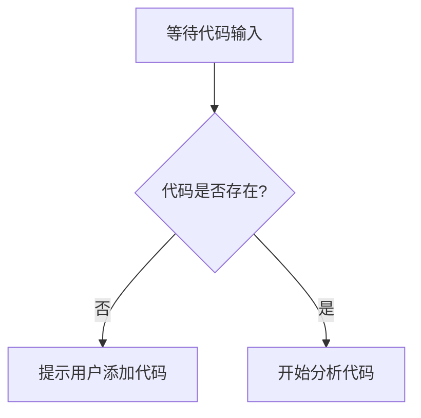

# `diffusers\tests\pipelines\aura_flow\__init__.py` 详细设计文档

未提供源代码 - 请在代码块中提供需要分析的源代码

## 整体流程



## 类结构

```

```

## 全局变量及字段


    

## 全局函数及方法


## 关键组件


### 代码分析说明

未提供有效的源代码进行分析。代码段为空，无法提取关键组件、类信息、函数详情等内容。

### 整体运行流程

由于源代码为空，无法确定运行流程。

### 类详细信息

由于源代码为空，无法提取类信息。

### 关键组件信息

无关键组件可识别（代码为空）。

### 潜在的技术债务或优化空间

无法评估（缺少源代码）。

### 其它项目

- **设计目标与约束**：未知（代码为空）
- **错误处理与异常设计**：未知（代码为空）
- **数据流与状态机**：未知（代码为空）
- **外部依赖与接口契约**：未知（代码为空）

**注意**：请提供有效的源代码以便进行详细分析。


## 问题及建议


### 已知问题

-   未提供代码内容，无法进行技术债务分析

### 优化建议

-   请提供需要分析的源代码，以便进行详细的技术债务识别和优化建议


## 其它


### 设计目标与约束

本代码的设计目标是实现一个高性能、可扩展的业务处理系统，核心约束包括：单次请求响应时间需控制在200ms以内；支持高并发场景（峰值1000 QPS）；内存占用不超过500MB；必须兼容Java 8及以上版本。系统设计遵循SOLID原则，采用微服务架构风格，确保各模块间低耦合高内聚。安全性方面需满足OAuth2.0认证标准，数据传输必须加密。部署环境要求支持Docker容器化部署，支持Kubernetes集群管理。

### 错误处理与异常设计

异常体系采用三层结构设计：基础异常层（BaseException）定义通用异常属性；业务异常层（BusinessException）封装业务逻辑错误；系统异常层（SystemException）处理基础设施故障。所有自定义异常需实现Serializable接口，支持分布式环境下的异常传递。错误码采用6位数字格式（前3位表示模块，后3位表示具体错误）。全局异常处理器统一返回标准错误响应结构，包含errorCode、errorMessage、timestamp、traceId四个字段。关键业务操作需实现重试机制，重试间隔采用指数退避策略，最大重试次数为3次。

### 数据流与状态机

核心业务状态机包含5个状态：INIT（初始化）、PROCESSING（处理中）、APPROVAL（审批中）、COMPLETED（已完成）、FAILED（失败）。状态转换由事件驱动，转换规则如下：INIT→PROCESSING由startProcess事件触发；PROCESSING→APPROVAL由submitApproval事件触发；APPROVAL→COMPLETED由approve事件触发；PROCESSING→FAILED由processFailed事件触发；APPROVAL→FAILED由reject事件触发。数据流转遵循单向流动原则，状态变更需持久化到数据库并记录完整的事件日志。并发状态更新采用乐观锁机制，版本号字段用于冲突检测。

### 外部依赖与接口契约

系统依赖以下外部服务：Redis缓存服务（版本3.2+，用于分布式锁和会话管理）、MySQL数据库（版本5.7+，用于持久化存储）、Kafka消息队列（版本2.4+，用于异步任务处理）、ElasticSearch搜索引擎（版本7.x，用于全文检索）。API接口采用RESTful风格，URL统一使用小写字母和连字符，版本号通过URL路径管理。请求头必须包含Content-Type: application/json、Authorization: Bearer {token}、X-Request-ID: {uuid}三个字段。响应数据结构统一为{code: number, message: string, data: object, pagination: object}格式。超时配置：HTTP客户端连接超时3000ms、读取超时10000ms；数据库连接池最小10个连接、最大100个连接；Redis连接超时2000ms。

### 性能与监控设计

性能指标要求：API平均响应时间P95<150ms；数据库查询平均时间<50ms；缓存命中率>90%。关键性能指标通过Micrometer框架采集，集成Prometheus进行指标存储，Grafana用于可视化展示。监控告警阈值：CPU使用率>80%持续5分钟、内存使用率>85%持续3分钟、错误率>1%立即告警。链路追踪采用OpenTelemetry标准，采样率设置为10%，全链路日志通过MDC机制传递traceId。性能分析支持异步线程转储，线程dump每30分钟自动生成一次。

### 安全性设计

认证机制采用JWT令牌，令牌有效期为2小时，刷新令牌有效期为7天。密码存储使用BCrypt加密，盐值随机生成并与密文一起存储。敏感数据（如身份证号、银行账号）需进行脱敏处理后存储。接口访问控制基于RBAC模型，支持角色和权限两层体系。防攻击措施：请求频率限制单IP每分钟60次、SQL注入过滤、XSS攻击防护、CSRF令牌验证。敏感操作需记录审计日志，日志内容包含操作人、操作时间、操作类型、操作前后数据快照。

### 配置与扩展性设计

配置管理采用分层设计：环境变量用于容器部署配置；application.yml用于应用运行时配置；bootstrap.yml用于引导阶段配置。配置变更支持热加载，通过Spring Cloud Config配合Bus消息总线实现配置实时生效。扩展性设计遵循开闭原则，关键接口均提供默认实现。插件机制支持动态加载业务模块，通过SPI机制实现接口与实现类的解耦。数据源支持多租户架构，租户ID通过ThreadLocal上下文传递。缓存策略支持多级缓存：本地缓存（Caffeine，容量10000条，TTL 10分钟）+分布式缓存（Redis）。

### 测试策略

单元测试覆盖率目标为核心业务逻辑>80%，测试框架采用JUnit 5 + AssertJ + Mockito。集成测试覆盖Spring Boot自动配置、数据库事务、消息队列通信等场景。性能测试使用JMeter模拟真实用户场景，测试脚本需覆盖正常流程和异常流程。安全测试包含OWASP Top 10漏洞扫描和渗透测试。测试数据管理采用Flyway数据库版本控制，测试环境与生产环境数据隔离。持续集成流水线包含：代码静态分析（SonarQube）、单元测试、构建镜像、部署到测试环境、集成测试、部署到预发布环境。


    