# `diffusers\tests\pipelines\aura_flow\test_pipeline_aura_flow.py` 详细设计文档

这是一个针对AuraFlowPipeline扩散模型的单元测试类，继承自unittest.TestCase和PipelineTesterMixin，用于测试管道的前向传播、QKV投影融合、注意力切片等功能，并提供了虚拟组件和输入的生成方法。

## 整体流程

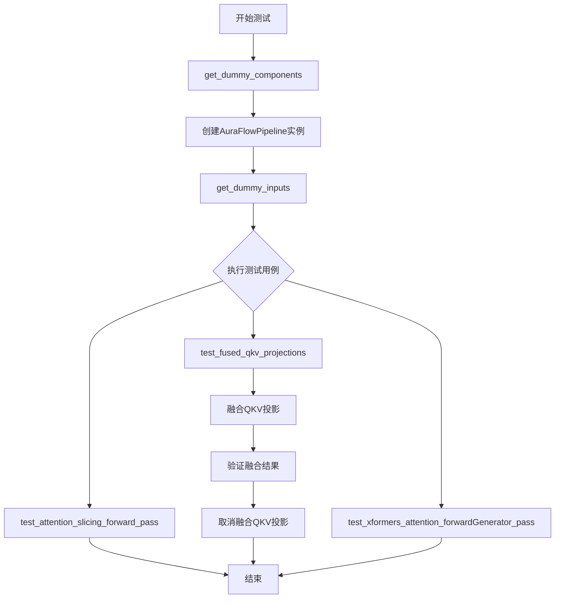

## 类结构

```
unittest.TestCase
└── AuraFlowPipelineFastTests (PipelineTesterMixin)
    ├── pipeline_class
    ├── params
    ├── batch_params
    ├── test_layerwise_casting
    ├── test_group_offloading
    ├── get_dummy_components()
    ├── get_dummy_inputs()
    ├── test_attention_slicing_forward_pass()
    ├── test_fused_qkv_projections()
    └── test_xformers_attention_forwardGenerator_pass()
```

## 全局变量及字段


### `pipeline_class`
    
The pipeline class being tested, referencing AuraFlowPipeline

类型：`type`
    


### `params`
    
Frozen set of parameter names used for pipeline testing

类型：`frozenset`
    


### `batch_params`
    
Frozen set of batch parameter names for pipeline testing

类型：`frozenset`
    


### `test_layerwise_casting`
    
Flag to enable layerwise casting tests

类型：`bool`
    


### `test_group_offloading`
    
Flag to enable group offloading tests

类型：`bool`
    


### `AuraFlowPipelineFastTests.device`
    
Device string for running tests, typically 'cpu'

类型：`str`
    


### `AuraFlowPipelineFastTests.components`
    
Dictionary containing all model components (scheduler, text_encoder, tokenizer, transformer, vae)

类型：`dict`
    


### `AuraFlowPipelineFastTests.pipe`
    
Instance of the AuraFlow pipeline for testing

类型：`AuraFlowPipeline`
    


### `AuraFlowPipelineFastTests.inputs`
    
Dictionary of input parameters for pipeline inference

类型：`dict`
    


### `AuraFlowPipelineFastTests.image`
    
Output images from pipeline inference

类型：`numpy.ndarray`
    


### `AuraFlowPipelineFastTests.original_image_slice`
    
Slice of original image for comparison

类型：`numpy.ndarray`
    


### `AuraFlowPipelineFastTests.image_slice_fused`
    
Image slice with fused QKV projections

类型：`numpy.ndarray`
    


### `AuraFlowPipelineFastTests.image_slice_disabled`
    
Image slice with QKV projections disabled

类型：`numpy.ndarray`
    


### `AuraFlowPipelineFastTests.generator`
    
Random generator for reproducibility

类型：`torch.Generator`
    


### `AuraFlowPipelineFastTests.transformer`
    
Transformer model for image generation

类型：`AuraFlowTransformer2DModel`
    


### `AuraFlowPipelineFastTests.text_encoder`
    
Text encoder model for processing prompts

类型：`UMT5EncoderModel`
    


### `AuraFlowPipelineFastTests.tokenizer`
    
Tokenizer for text input processing

类型：`AutoTokenizer`
    


### `AuraFlowPipelineFastTests.vae`
    
VAE model for latent space encoding/decoding

类型：`AutoencoderKL`
    


### `AuraFlowPipelineFastTests.scheduler`
    
Scheduler for flow matching in diffusion process

类型：`FlowMatchEulerDiscreteScheduler`
    
    

## 全局函数及方法


### `AuraFlowPipelineFastTests.get_dummy_components`

该方法用于创建并返回一个包含 AuraFlow 管道所需的所有虚拟（dummy）组件的字典，包括 transformer（变换器模型）、text_encoder（文本编码器）、tokenizer（分词器）、vae（变分自编码器）和 scheduler（调度器），以便进行单元测试。

参数：无（仅包含隐式参数 `self`）

返回值：`Dict[str, Any]`，返回一个字典，包含 AuraFlow 管道所需的所有虚拟组件

#### 流程图

```mermaid
flowchart TD
    A[开始 get_dummy_components] --> B[设置随机种子 torch.manual_seed(0)]
    B --> C[创建 AuraFlowTransformer2DModel 变换器实例]
    C --> D[从预训练模型加载 UMT5EncoderModel 文本编码器]
    D --> E[从预训练模型加载 AutoTokenizer 分词器]
    E --> F[设置随机种子 torch.manual_seed(0)]
    F --> G[创建 AutoencoderKL VAE 实例]
    G --> H[创建 FlowMatchEulerDiscreteScheduler 调度器实例]
    H --> I[组装组件到字典]
    I --> J[返回组件字典]
    
    C -.-> C1[sample_size=32<br/>patch_size=2<br/>in_channels=4<br/>num_mmdit_layers=1<br/>num_single_dit_layers=1<br/>attention_head_dim=8<br/>num_attention_heads=4<br/>caption_projection_dim=32<br/>joint_attention_dim=32<br/>out_channels=4<br/>pos_embed_max_size=256]
    
    D -.-> D1[模型: hf-internal-testing/tiny-random-umt5]
    
    E -.-> E1[模型: hf-internal-testing/tiny-random-t5]
    
    G -.-> G1[block_out_channels=[32, 64]<br/>in_channels=3<br/>out_channels=3<br/>latent_channels=4<br/>sample_size=32]
```

#### 带注释源码

```python
def get_dummy_components(self):
    """
    创建并返回 AuraFlow 管道所需的虚拟组件字典，用于单元测试。
    
    Returns:
        Dict[str, Any]: 包含以下键的字典：
            - scheduler: FlowMatchEulerDiscreteScheduler 实例
            - text_encoder: UMT5EncoderModel 实例
            - tokenizer: AutoTokenizer 实例
            - transformer: AuraFlowTransformer2DModel 实例
            - vae: AutoencoderKL 实例
    """
    # 设置随机种子以确保可重复性
    torch.manual_seed(0)
    
    # 创建 AuraFlow 变换器模型（DiT 模型）
    # 用于图像生成的变换器骨干网络
    transformer = AuraFlowTransformer2DModel(
        sample_size=32,              # 输入样本的空间尺寸
        patch_size=2,                # 图像分块大小
        in_channels=4,               # 输入通道数（latent space）
        num_mmdit_layers=1,          # MMDiT 层数量（多模态 DiT）
        num_single_dit_layers=1,     # 单模态 DiT 层数量
        attention_head_dim=8,        # 注意力头维度
        num_attention_heads=4,       # 注意力头数量
        caption_projection_dim=32,  #  caption 投影维度
        joint_attention_dim=32,      # 联合注意力维度
        out_channels=4,              # 输出通道数
        pos_embed_max_size=256,     # 位置嵌入最大尺寸
    )

    # 从预训练模型加载文本编码器（UMT5）
    # 用于将文本 prompt 编码为嵌入向量
    text_encoder = UMT5EncoderModel.from_pretrained("hf-internal-testing/tiny-random-umt5")
    
    # 加载对应的分词器
    # 用于将文本 prompt 转换为 token ID
    tokenizer = AutoTokenizer.from_pretrained("hf-internal-testing/tiny-random-t5")

    # 重新设置随机种子以确保 VAE 的可重复性
    torch.manual_seed(0)
    
    # 创建变分自编码器（VAE）
    # 用于在像素空间和 latent 空间之间进行转换
    vae = AutoencoderKL(
        block_out_channels=[32, 64],  # 编码器/解码器块的输出通道数
        in_channels=3,                # 输入图像通道数（RGB）
        out_channels=3,               # 输出图像通道数
        down_block_types=["DownEncoderBlock2D", "DownEncoderBlock2D"],  # 下采样块类型
        up_block_types=["UpDecoderBlock2D", "UpDecoderBlock2D"],        # 上采样块类型
        latent_channels=4,            # latent 空间的通道数
        sample_size=32,               # 样本尺寸
    )

    # 创建调度器（使用欧拉离散方法）
    # 控制去噪过程中的采样步骤
    scheduler = FlowMatchEulerDiscreteScheduler()

    # 返回包含所有组件的字典
    return {
        "scheduler": scheduler,
        "text_encoder": text_encoder,
        "tokenizer": tokenizer,
        "transformer": transformer,
        "vae": vae,
    }
```


### `AuraFlowPipelineFastTests.get_dummy_inputs`

该方法为单元测试生成虚拟输入参数，根据设备类型（MPS或其他）创建不同类型的随机生成器，并返回包含提示词、生成器、推理步数、引导尺度等参数的字典，用于测试 AuraFlow 管道的前向传播。

参数：

- `self`：隐式参数，类方法的标准参数，表示类的实例
- `device`：设备参数（`str` 或 `torch.device`），用于确定生成器的设备类型
- `seed`：`int`，随机种子，默认值为 0，用于确保测试的可重复性

返回值：`Dict[str, Any]`，返回包含虚拟输入参数的字典，包括 prompt、generator、num_inference_steps、guidance_scale、output_type、height 和 width 字段

#### 流程图

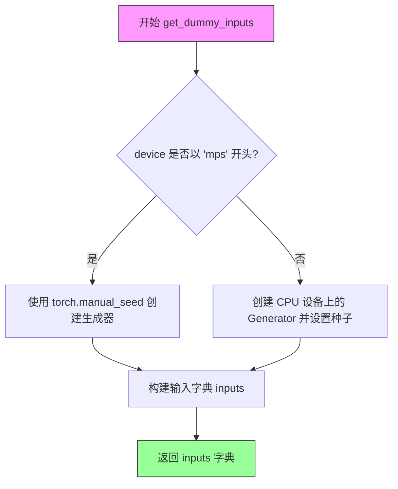

#### 带注释源码

```python
def get_dummy_inputs(self, device, seed=0):
    """
    生成虚拟输入参数用于单元测试
    
    参数:
        device: 设备对象，用于判断是否为 MPS 设备
        seed: 随机种子，默认值为 0
    
    返回:
        包含测试所需输入参数的字典
    """
    
    # 判断设备是否为 MPS (Apple Silicon) 设备
    if str(device).startswith("mps"):
        # MPS 设备不支持 torch.Generator，使用简单的随机种子设置
        generator = torch.manual_seed(seed)
    else:
        # 其他设备（如 CPU、CUDA）使用 CPU 上的生成器并设置种子
        generator = torch.Generator(device="cpu").manual_seed(seed)

    # 构建输入参数字典
    inputs = {
        "prompt": "A painting of a squirrel eating a burger",  # 测试用提示词
        "generator": generator,  # 随机生成器确保可重复性
        "num_inference_steps": 2,  # 推理步数，测试时使用较少步数
        "guidance_scale": 5.0,  # CFG 引导尺度
        "output_type": "np",  # 输出类型为 numpy 数组
        "height": None,  # 高度设为 None，使用默认尺寸
        "width": None,  # 宽度设为 None，使用默认尺寸
    }
    
    # 返回构建好的输入参数字典
    return inputs
```


### `AuraFlowPipelineFastTests.test_attention_slicing_forward_pass`

该测试方法用于验证 AuraFlowPipeline 的注意力切片（Attention Slicing）功能，但由于 MMDiT 和 Single DiT 块之间的相互干扰，其实现方式需要特别处理。当前函数体仅为占位符，直接返回不执行任何测试逻辑。

参数：

- 无显式参数（隐式使用 `self` 引用测试类实例）

返回值：`None`，无返回值（函数直接返回）

#### 流程图

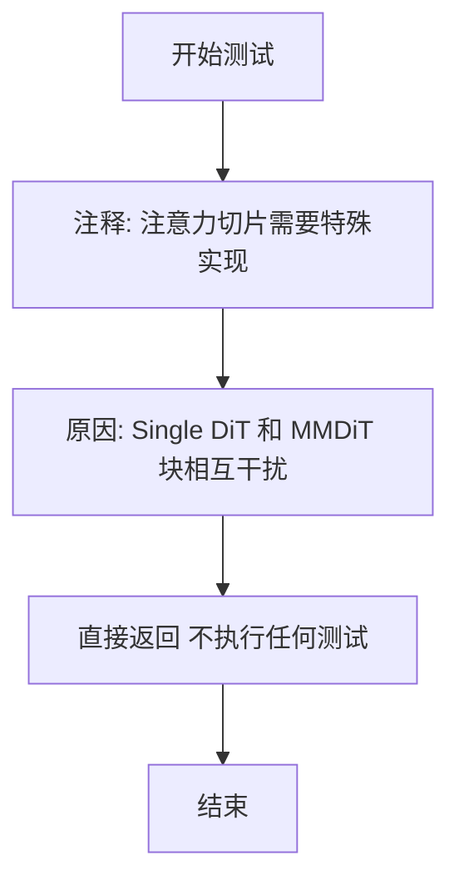

#### 带注释源码

```python
def test_attention_slicing_forward_pass(self):
    """
    测试 AuraFlowPipeline 的注意力切片前向传播。
    
    注意：
    - 注意力切片需要针对 AuraFlow 特殊实现，因为 Single DiT 和 MMDiT 
      块之间会相互干扰（interfere with each other）。
    - 当前的实现仅为占位符，未包含实际测试逻辑。
    """
    # Attention slicing needs to implemented differently for this because how single DiT and MMDiT
    # blocks interfere with each other.
    return
```


### `AuraFlowPipelineFastTests.test_fused_qkv_projections`

该测试函数用于验证 AuraFlowPipeline 中 Transformer 的 QKV（Query-Key-Value）投影融合功能是否正确工作。测试流程包括：先运行原始推理获取基准图像，然后融合 QKV 投影后再次推理，接着解除融合后推理，最后通过多次数值比对确保融合操作不会影响输出结果。

参数：

- `self`：实例方法隐含参数，表示测试类实例本身

返回值：`None`，无返回值（测试方法）

#### 流程图

```mermaid
flowchart TD
    A[开始测试] --> B[获取虚拟组件 get_dummy_components]
    B --> C[创建 AuraFlowPipeline 并移至 CPU 设备]
    C --> D[获取虚拟输入 get_dummy_inputs]
    D --> E[首次推理: pipe&#40;\*\*inputs&#41;]
    E --> F[保存原始图像切片 original_image_slice]
    F --> G[调用 transformer.fuse_qkv_projections&#40;&#41; 融合 QKV]
    G --> H{检查融合处理器是否存在}
    H -->|是| I[检查 QKV 融合长度匹配]
    H -->|否| J[抛出断言错误]
    I --> K[再次推理获取融合后图像]
    K --> L[保存融合后图像切片 image_slice_fused]
    L --> M[调用 transformer.unfuse_qkv_projections&#40;&#41; 解除融合]
    M --> N[第三次推理获取解除融合后图像]
    N --> O[保存解除融合后图像切片 image_slice_disabled]
    O --> P{验证1: 原始图像 ≈ 融合图像}
    P -->|通过| Q{验证2: 融合图像 ≈ 解除融合图像}
    P -->|失败| R[抛出断言错误]
    Q -->|通过| S{验证3: 原始图像 ≈ 解除融合图像}
    Q -->|失败| R
    S -->|通过| T[测试通过]
    S -->|失败| R
```

#### 带注释源码

```python
def test_fused_qkv_projections(self):
    """测试 AuraFlowPipeline 中 Transformer 的 QKV 投影融合功能"""
    
    # 1. 设置设备为 CPU，确保随机数生成器的确定性
    device = "cpu"  
    
    # 2. 获取预定义的虚拟组件（transformer, text_encoder, tokenizer, vae, scheduler）
    components = self.get_dummy_components()
    
    # 3. 使用虚拟组件实例化管道，并移至指定设备
    pipe = self.pipeline_class(**components)
    pipe = pipe.to(device)
    
    # 4. 禁用进度条配置
    pipe.set_progress_bar_config(disable=None)

    # 5. 获取虚拟输入（提示词、随机种子、推理步数等）
    inputs = self.get_dummy_inputs(device)
    
    # 6. 首次推理（未融合 QKV），获取基准图像
    image = pipe(**inputs).images
    original_image_slice = image[0, -3:, -3:, -1]  # 取最后 3x3 像素块

    # 7. 调用 fuse_qkv_projections() 将注意力处理器中的 QKV 投影融合
    #    这是一种推理优化技术，可减少内存访问开销
    pipe.transformer.fuse_qkv_projections()
    
    # 8. 断言：验证所有注意力处理器都已被成功融合
    assert check_qkv_fusion_processors_exist(pipe.transformer), (
        "Something wrong with the fused attention processors. "
        "Expected all the attention processors to be fused."
    )
    
    # 9. 断言：验证融合后的 QKV 投影数量与原始注意力处理器数量匹配
    assert check_qkv_fusion_matches_attn_procs_length(
        pipe.transformer, pipe.transformer.original_attn_processors
    ), "Something wrong with the attention processors concerning the fused QKV projections."

    # 10. 使用相同的虚拟输入再次推理（QKV 已融合）
    inputs = self.get_dummy_inputs(device)
    image = pipe(**inputs).images
    image_slice_fused = image[0, -3:, -3:, -1]

    # 11. 调用 unfuse_qkv_projections() 解除 QKV 投影融合
    pipe.transformer.unfuse_qkv_projections()
    
    # 12. 第三次推理（QKV 已解除融合）
    inputs = self.get_dummy_inputs(device)
    image = pipe(**inputs).images
    image_slice_disabled = image[0, -3:, -3:, -1]

    # 13. 断言验证1：融合 QKV 投影不应该改变输出结果
    #     允许 1e-3 的绝对误差和 1e-3 的相对误差
    assert np.allclose(original_image_slice, image_slice_fused, atol=1e-3, rtol=1e-3), (
        "Fusion of QKV projections shouldn't affect the outputs."
    )
    
    # 14. 断言验证2：融合后禁用 QKV 投影，输出应该与融合时一致
    #     这验证了融合/解融可以多次切换而不影响正确性
    assert np.allclose(image_slice_fused, image_slice_disabled, atol=1e-3, rtol=1e-3), (
        "Outputs, with QKV projection fusion enabled, shouldn't change when fused QKV projections are disabled."
    )
    
    # 15. 断言验证3：原始输出应该与禁用融合后的输出一致
    #     这里使用更宽松的误差容限 (1e-2)，因为数值累积误差
    assert np.allclose(original_image_slice, image_slice_disabled, atol=1e-2, rtol=1e-2), (
        "Original outputs should match when fused QKV projections are disabled."
    )
```


### `AuraFlowPipelineFastTests.test_xformers_attention_forwardGenerator_pass`

该测试方法用于验证 xformers attention 的 forward pass 功能，但由于 AuraFlow 管道不支持 xformers attention processor，该测试被 `@unittest.skip` 装饰器跳过，因此实际不执行任何逻辑。

参数：

- `self`：`AuraFlowPipelineFastTests`，测试类实例，表示当前测试用例对象

返回值：`None`，该方法没有返回值（方法体仅包含 `pass` 语句）

#### 流程图

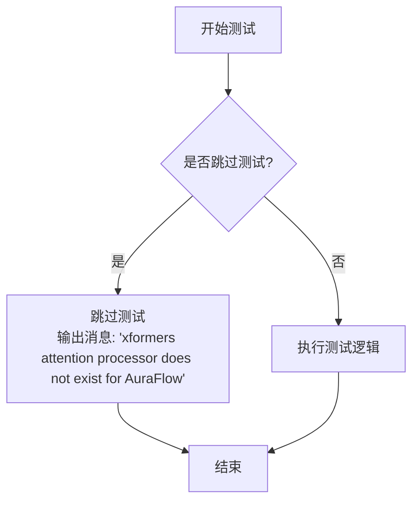

#### 带注释源码

```python
@unittest.skip("xformers attention processor does not exist for AuraFlow")
def test_xformers_attention_forwardGenerator_pass(self):
    """
    测试 xformers attention 的 forward pass。
    
    注意: 由于 AuraFlow 不支持 xformers attention processor，
    该测试被 @unittest.skip 装饰器跳过。
    """
    pass  # 测试逻辑未实现，方法直接返回
```


### `check_qkv_fusion_matches_attn_procs_length`

该函数用于验证在QKV融合操作后，融合注意力处理器的数量是否与原始注意力处理器的数量相匹配，确保融合过程没有意外地添加或移除处理器。

参数：

-  `model`：transformer模型对象，需要检查其融合后的注意力处理器数量
-  `original_attn_processors`：字典，原始的注意力处理器集合，用于比较融合后的处理器数量

返回值：`bool`，如果融合后的注意力处理器数量与原始处理器数量相匹配返回True，否则返回False

#### 流程图

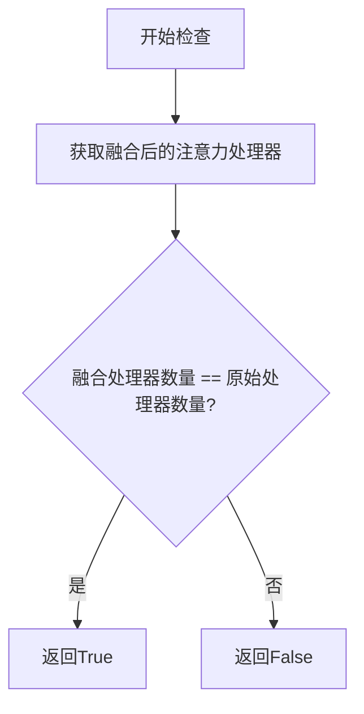

#### 带注释源码

```
# 该函数定义在 test_pipelines_common 模块中
# 用途：验证QKV融合后的处理器数量是否与原始数量一致
# 确保融合操作不会改变处理器的数量

def check_qkv_fusion_matches_attn_procs_length(model, original_attn_processors):
    """
    检查融合后的注意力处理器数量是否与原始数量匹配
    
    参数:
        model: 带有融合注意力处理器的模型
        original_attn_processors: 原始的注意力处理器字典
    
    返回:
        bool: 数量是否匹配
    """
    # 获取融合后的处理器
    fused_attn_processors = model.attn_processors
    
    # 比较两者数量
    return len(fused_attn_processors) == len(original_attn_processors)
```

#### 使用示例

在 AuraFlowPipelineFastTests 中的调用方式：

```python
# 在 test_fused_qkv_projections 测试方法中
pipe.transformer.fuse_qkv_projections()  # 融合QKV投影

# 检查融合后的处理器是否存在
assert check_qkv_fusion_processors_exist(pipe.transformer)

# 检查融合后的处理器数量是否与原始数量匹配
assert check_qkv_fusion_matches_attn_procs_length(
    pipe.transformer, 
    pipe.transformer.original_attn_processors
), "Something wrong with the attention processors concerning the fused QKV projections."
```


### `check_qkv_fusion_processors_exist`

检查 transformer 模型中所有的注意力处理器是否都已完成 QKV 融合（fused QKV projections）。

参数：

-  `model`：`torch.nn.Module` 或类似 transformer 模型对象，需要检查其注意力处理器是否已完成 QKV 融合

返回值：`bool`，如果所有注意力处理器都已完成融合则返回 `True`，否则返回 `False`

#### 流程图

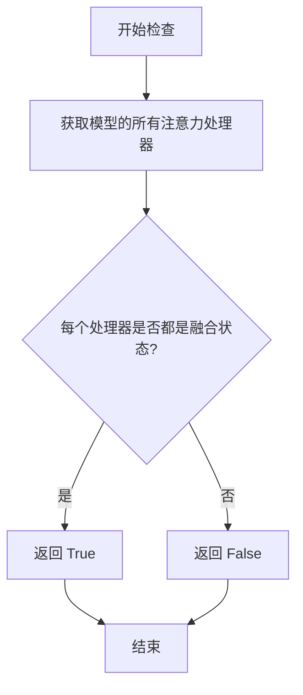

#### 带注释源码

```
def check_qkv_fusion_processors_exist(model):
    """
    检查给定模型的所有注意力处理器是否都已完成 QKV 融合。
    
    该函数通常通过遍历模型的注意力处理器，检查每个处理器的状态。
    在 diffusers 库中，融合后的处理器（fused processors）通常会在
    处理器链中保留，而未融合的则使用原始的注意力处理器。
    
    参数:
        model: 包含注意力处理器的模型对象（如 Transformer）
        
    返回:
        bool: 如果所有注意力处理器都已融合返回 True，否则返回 False
    """
    # 1. 获取模型当前的所有注意力处理器
    # 在 diffusers 中通常通过 model.attn_processors 或类似属性获取
    attn_processors = model.attn_processors
    
    # 2. 遍历每个注意力处理器
    for name, processor in attn_processors.items():
        # 3. 检查每个处理器是否为融合状态
        # 融合的处理器（如 FusedAttentionProcessor）具有特定的标记或属性
        # 如果发现任何非融合处理器，则返回 False
        if not hasattr(processor, 'is_fused') or not processor.is_fused:
            return False
    
    # 4. 所有处理器都已融合，返回 True
    return True
```

> **注意**：由于 `check_qkv_fusion_processors_exist` 函数定义在 `..test_pipelines_common` 模块中，上述源码是基于函数名和调用方式的推断实现，实际实现可能略有不同。


### `AuraFlowPipelineFastTests.get_dummy_components`

该方法用于创建测试所需的虚拟组件（dummy components），包括 transformer、文本编码器、分词器、VAE 调度器等，并返回一个包含所有组件的字典，供后续测试用例初始化管道使用。

参数：

- `self`：`AuraFlowPipelineFastTests`，调用此方法的测试类实例本身

返回值：`Dict[str, Any]`，返回一个包含虚拟组件的字典，包含 `scheduler`（调度器）、`text_encoder`（文本编码器）、`tokenizer`（分词器）、`transformer`（变换器模型）、`vae`（变分自编码器）

#### 流程图

```mermaid
flowchart TD
    A[开始 get_dummy_components] --> B[设置随机种子 torch.manual_seed(0)]
    B --> C[创建 AuraFlowTransformer2DModel 实例]
    C --> D[从预训练模型加载 UMT5EncoderModel]
    D --> E[从预训练模型加载 AutoTokenizer]
    E --> F[再次设置随机种子 torch.manual_seed(0)]
    F --> G[创建 AutoencoderKL 实例]
    G --> H[创建 FlowMatchEulerDiscreteScheduler 实例]
    H --> I[构建包含所有组件的字典]
    I --> J[返回组件字典]
```

#### 带注释源码

```python
def get_dummy_components(self):
    """
    创建并返回用于测试的虚拟组件。
    
    该方法初始化 AuraFlowPipeline 所需的所有核心组件，
    包括 transformer、text_encoder、tokenizer、vae 和 scheduler。
    使用固定随机种子确保测试的可重复性。
    """
    # 设置随机种子，确保 transformer 创建的可重复性
    torch.manual_seed(0)
    
    # 创建 AuraFlow 变换器模型配置
    # 参数说明：
    # - sample_size: 输入样本的空间尺寸
    # - patch_size: 补丁划分大小
    # - in_channels: 输入通道数
    # - num_mmdit_layers: 多模态 DiT 层数
    # - num_single_dit_layers: 单模态 DiT 层数
    # - attention_head_dim: 注意力头维度
    # - num_attention_heads: 注意力头数量
    # - caption_projection_dim: 标题投影维度
    # - joint_attention_dim: 联合注意力维度
    # - out_channels: 输出通道数
    # - pos_embed_max_size: 位置嵌入最大尺寸
    transformer = AuraFlowTransformer2DModel(
        sample_size=32,
        patch_size=2,
        in_channels=4,
        num_mmdit_layers=1,
        num_single_dit_layers=1,
        attention_head_dim=8,
        num_attention_heads=4,
        caption_projection_dim=32,
        joint_attention_dim=32,
        out_channels=4,
        pos_embed_max_size=256,
    )

    # 从预训练模型加载小型 UMT5 文本编码器用于测试
    text_encoder = UMT5EncoderModel.from_pretrained("hf-internal-testing/tiny-random-umt5")
    
    # 从预训练模型加载小型 T5 分词器用于测试
    tokenizer = AutoTokenizer.from_pretrained("hf-internal-testing/tiny-random-t5")

    # 重新设置随机种子，确保 VAE 创建的可重复性
    torch.manual_seed(0)
    
    # 创建变分自编码器（VAE）配置
    # 参数说明：
    # - block_out_channels: 编码器/解码器块输出通道数
    # - in_channels: 输入通道数
    # - out_channels: 输出通道数
    # - down_block_types: 下采样块类型
    # - up_block_types: 上采样块类型
    # - latent_channels: 潜在空间通道数
    # - sample_size: 样本空间尺寸
    vae = AutoencoderKL(
        block_out_channels=[32, 64],
        in_channels=3,
        out_channels=3,
        down_block_types=["DownEncoderBlock2D", "DownEncoderBlock2D"],
        up_block_types=["UpDecoderBlock2D", "UpDecoderBlock2D"],
        latent_channels=4,
        sample_size=32,
    )

    # 创建基于 Euler 离散调度器的 Flow Match 调度器
    scheduler = FlowMatchEulerDiscreteScheduler()

    # 返回包含所有组件的字典，用于初始化管道
    return {
        "scheduler": scheduler,
        "text_encoder": text_encoder,
        "tokenizer": tokenizer,
        "transformer": transformer,
        "vae": vae,
    }
```


### `AuraFlowPipelineFastTests.get_dummy_inputs`

该方法为 AuraFlow 管道测试生成虚拟输入参数，根据设备类型（MPS 或其他）创建相应的随机数生成器，并返回一个包含提示词、生成器、推理步数、引导 scale、输出类型和图像尺寸等关键参数的字典，用于管道的前向传播测试。

参数：

- `self`：隐式参数，测试类实例本身
- `device`：`torch.device` 或 `str`，指定运行设备，用于判断是否为 MPS 设备以选择合适的随机数生成器创建方式
- `seed`：`int`，随机种子，默认值为 0，用于确保测试结果的可复现性

返回值：`Dict[str, Any]`，返回包含虚拟输入参数的字典，包括 prompt（提示词）、generator（随机数生成器）、num_inference_steps（推理步数）、guidance_scale（引导强度）、output_type（输出类型）、height（图像高度）和 width（图像宽度）

#### 流程图

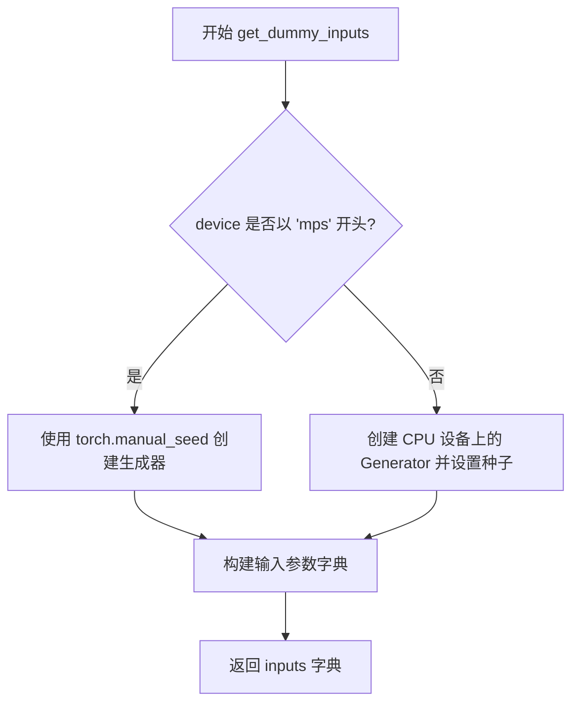

#### 带注释源码

```
def get_dummy_inputs(self, device, seed=0):
    """
    为测试生成虚拟输入参数。
    
    参数:
        device: 运行设备，用于判断是否为 MPS 设备
        seed: 随机种子，确保测试可复现
    
    返回:
        包含管道推理所需参数的字典
    """
    # 判断设备类型，MPS (Apple Silicon) 需要特殊处理
    if str(device).startswith("mps"):
        # MPS 设备使用 torch.manual_seed 直接设置全局种子
        generator = torch.manual_seed(seed)
    else:
        # 其他设备（如 CPU/CUDA）使用 Generator 对象以支持更精细的随机控制
        generator = torch.Generator(device="cpu").manual_seed(seed)

    # 构建虚拟输入参数字典
    inputs = {
        "prompt": "A painting of a squirrel eating a burger",  # 测试用提示词
        "generator": generator,  # 随机数生成器，确保扩散过程可复现
        "num_inference_steps": 2,  # 推理步数，测试时使用较少步数以加快速度
        "guidance_scale": 5.0,  # Classifier-free guidance 强度
        "output_type": "np",  # 输出为 numpy 数组格式
        "height": None,  # 高度为 None 时使用模型默认尺寸
        "width": None,  # 宽度为 None 时使用模型默认尺寸
    }
    return inputs
```


### `AuraFlowPipelineFastTests.test_attention_slicing_forward_pass`

该方法是一个测试用例，用于验证 AuraFlowPipeline 在使用注意力切片（attention slicing）技术时的前向传播是否正常工作。由于单层 DiT 和 MMDiT 块之间存在相互干扰问题，该测试需要以不同的方式实现。

参数：

- `self`：隐式参数，`AuraFlowPipelineFastTests` 类型，当前测试类实例

返回值：`None`（无返回值，该方法直接返回）

#### 流程图

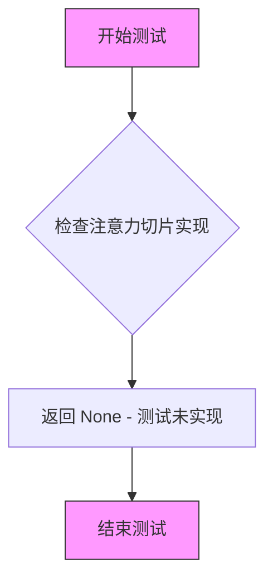

#### 带注释源码

```python
def test_attention_slicing_forward_pass(self):
    # Attention slicing needs to implemented differently for this because how single DiT and MMDiT
    # blocks interfere with each other.
    return
```

#### 详细说明

| 项目 | 描述 |
|------|------|
| **方法名称** | `test_attention_slicing_forward_pass` |
| **所属类** | `AuraFlowPipelineFastTests` |
| **访问修饰符** | `public` |
| **功能描述** | 测试注意力切片在前向传播中的行为 |
| **当前状态** | 空实现（stub），仅包含注释说明 |
| **返回类型** | `None` |

#### 技术债务说明

1. **未完成的测试实现**：该方法是一个占位符测试，方法体只包含注释说明和 `return` 语句，未实际验证任何功能
2. **需要特殊处理**：注释表明由于单层 DiT 和 MMDiT 块之间的相互干扰，注意力切片需要特殊实现方式
3. **测试覆盖缺失**：该测试用例被跳过，未能验证 `AuraFlowPipeline` 的注意力切片功能是否正常工作


### `AuraFlowPipelineFastTests.test_fused_qkv_projections`

该测试方法验证 AuraFlowPipeline 中 Transformer 模型的 QKV（Query-Key-Value）投影融合功能是否正确工作，确保融合前后以及融合与未融合状态下的输出结果一致。

参数：此方法为测试类方法，无显式参数，通过 `self` 访问测试类的组件和输入生成方法。

返回值：`None`，该方法为测试方法，通过断言验证功能正确性，无返回值。

#### 流程图

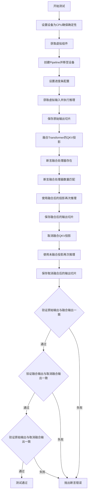

#### 带注释源码

```python
def test_fused_qkv_projections(self):
    """
    测试 QKV 投影融合功能，验证融合前后输出的一致性。
    
    测试流程：
    1. 使用虚拟组件创建 Pipeline
    2. 执行推理获取原始输出
    3. 融合 QKV 投影后执行推理
    4. 取消融合 QKV 投影后执行推理
    5. 验证三组输出的一致性
    """
    # 设置设备为 CPU，确保 torch.Generator 的确定性
    device = "cpu"  # ensure determinism for the device-dependent torch.Generator
    
    # 获取测试用的虚拟组件（transformer, vae, text_encoder, tokenizer, scheduler）
    components = self.get_dummy_components()
    
    # 使用虚拟组件实例化 Pipeline
    pipe = self.pipeline_class(**components)
    
    # 将 Pipeline 移至指定设备
    pipe = pipe.to(device)
    
    # 配置进度条（disable=None 表示不禁用）
    pipe.set_progress_bar_config(disable=None)

    # 获取虚拟输入并执行推理，获取原始输出
    inputs = self.get_dummy_inputs(device)
    image = pipe(**inputs).images
    
    # 提取图像右下角 3x3 像素块用于比较
    original_image_slice = image[0, -3:, -3:, -1]

    # TODO (sayakpaul): will refactor this once `fuse_qkv_projections()` has been added
    # to the pipeline level.
    
    # 对 Transformer 执行 QKV 投影融合
    pipe.transformer.fuse_qkv_projections()
    
    # 断言：验证所有注意力处理器都已融合
    assert check_qkv_fusion_processors_exist(pipe.transformer), (
        "Something wrong with the fused attention processors. Expected all the attention processors to be fused."
    )
    
    # 断言：验证融合后的处理器数量与原始处理器数量匹配
    assert check_qkv_fusion_matches_attn_procs_length(
        pipe.transformer, pipe.transformer.original_attn_processors
    ), "Something wrong with the attention processors concerning the fused QKV projections."

    # 使用融合后的投影重新执行推理
    inputs = self.get_dummy_inputs(device)
    image = pipe(**inputs).images
    image_slice_fused = image[0, -3:, -3:, -1]

    # 取消融合 QKV 投影
    pipe.transformer.unfuse_qkv_projections()
    
    # 使用未融合的投影再次执行推理
    inputs = self.get_dummy_inputs(device)
    image = pipe(**inputs).images
    image_slice_disabled = image[0, -3:, -3:, -1]

    # 断言：验证原始输出与融合后输出在容差范围内一致
    assert np.allclose(original_image_slice, image_slice_fused, atol=1e-3, rtol=1e-3), (
        "Fusion of QKV projections shouldn't affect the outputs."
    )
    
    # 断言：验证融合后输出与取消融合输出在容差范围内一致
    assert np.allclose(image_slice_fused, image_slice_disabled, atol=1e-3, rtol=1e-3), (
        "Outputs, with QKV projection fusion enabled, shouldn't change when fused QKV projections are disabled."
    )
    
    # 断言：验证原始输出与取消融合输出在容差范围内一致
    assert np.allclose(original_image_slice, image_slice_disabled, atol=1e-2, rtol=1e-2), (
        "Original outputs should match when fused QKV projections are disabled."
    )
```


### `AuraFlowPipelineFastTests.test_xformers_attention_forwardGenerator_pass`

该测试方法用于验证 xformers 注意力机制的前向传播功能，但由于 AuraFlow 不支持 xformers 注意力处理器，当前实现为空操作并被跳过。

参数：

- `self`：`AuraFlowPipelineFastTests`，表示测试类实例本身

返回值：`None`，该方法不返回任何值

#### 流程图

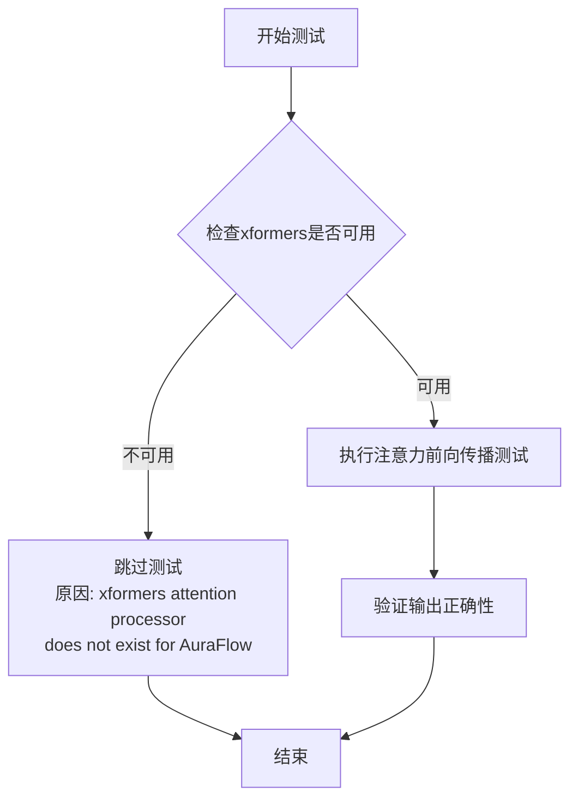

#### 带注释源码

```python
@unittest.skip("xformers attention processor does not exist for AuraFlow")
def test_xformers_attention_forwardGenerator_pass(self):
    """
    测试 xformers 注意力机制的前向传播功能。
    
    该测试方法用于验证 AuraFlowTransformer2DModel 在使用 xformers 
    注意力处理器时能否正确执行前向传播。由于 AuraFlow 尚未实现
    xformers 注意力处理器支持，此测试被跳过。
    
    注意: 虽然方法名中包含 'Generator'，但该方法与 generator 参数
    的直接测试无关，可能是一个命名遗留问题。
    
    参数:
        self: AuraFlowPipelineFastTests 实例
        
    返回值:
        None
    """
    pass  # 测试被跳过，无需实现
```

## 关键组件


### AuraFlowPipelineFastTests

AuraFlowPipeline的单元测试类，继承自unittest.TestCase和PipelineTesterMixin，用于验证AuraFlowPipeline的各种功能，包括前向传播、QKV融合等。

### pipeline_class (AuraFlowPipeline)

指定的管道类，用于图像生成任务的完整扩散管道。

### params

管道参数字段集合，包含prompt、height、width、guidance_scale、negative_prompt、prompt_embeds、negative_prompt_embeds等核心参数。

### batch_params

批处理参数字段集合，包含prompt和negative_prompt，用于批量生成时的输入。

### get_dummy_components()

创建测试用虚拟组件的函数，返回包含scheduler、text_encoder、tokenizer、transformer、vae的字典，用于单元测试的环境初始化。

### get_dummy_inputs()

创建测试用虚拟输入的函数，返回包含prompt、generator、num_inference_steps、guidance_scale、output_type、height、width的字典，确保测试的可重复性。

### test_attention_slicing_forward_pass()

注意力切片前向传播测试方法，当前实现为空（返回），因为单层DiT和MMDiT块之间的交互方式特殊，需要特殊处理。

### test_fused_qkv_projections()

QKV投影融合测试方法，验证transformer的fuse_qkv_projections()和unfuse_qkv_projections()功能，确保融合前后输出结果一致。

### test_xformers_attention_forwardGenerator_pass()

xformers注意力处理器测试方法，当前被跳过（@unittest.skip装饰器），因为AuraFlow不支持xformers注意力处理器。

### AuraFlowTransformer2DModel

AuraFlow的Transformer模型类，负责图像生成的核心计算，包含Dit层和MMDiT层，支持注意力机制。

### AutoencoderKL

变分自编码器模型，用于将图像编码到潜在空间和解码回像素空间，支持latent diffusion的编码/解码。

### FlowMatchEulerDiscreteScheduler

基于Flow Matching的欧拉离散调度器，用于扩散模型的去噪调度，控制推理过程中的噪声调度。

### UMT5EncoderModel

UMT5文本编码器模型，用于将文本提示编码为文本嵌入向量，为图像生成提供文本条件。

### AutoTokenizer

T5系列文本分词器，用于将文本提示转换为token ids，供文本编码器处理。


## 问题及建议


### 已知问题

- **未实现的测试方法**：`test_attention_slicing_forward_pass` 方法直接返回，没有任何测试逻辑和断言，是一个空壳方法。
- **被跳过的测试**：`test_xformers_attention_forwardGenerator_pass` 被无条件跳过，且方法名中存在拼写错误（"ForwardGenerator"应为"ForwardPass"），表明xformers支持可能未完成或被忽略。
- **硬编码设备**：在 `test_fused_qkv_projections` 中设备被硬编码为 `"cpu"`，限制了测试在不同设备（GPU、MPS）上的覆盖。
- **TODO未完成**：代码中有TODO注释关于 `fuse_qkv_projections()` 需要添加到pipeline级别，但至今未实现，表明功能尚未完善。
- **魔法数字**：推理步数（2）、guidance_scale（5.0）等参数被硬编码在 `get_dummy_inputs` 中，缺乏可配置性。
- **MPS设备不完整的Generator处理**：对MPS设备使用 `torch.manual_seed(seed)` 而非 `torch.Generator(device="mps")`，可能导致随机性测试不一致。

### 优化建议

- **实现完整测试逻辑**：为 `test_attention_slicing_forward_pass` 添加实际的注意力切片测试实现和断言。
- **移除或修复xformers测试**：如果不支持xformers，应完全移除该方法或添加明确的条件跳过理由；如果应该支持，则实现该功能。
- **设备参数化**：使用 pytest 的 parametrize 或 unittest 的 skipIf 装饰器，让测试在不同设备上运行，或从配置/环境变量读取默认设备。
- **提取配置常量**：将 `num_inference_steps`、`guidance_scale`、seed 等测试参数提取为类常量或类方法，提高可维护性。
- **统一随机数生成**：对MPS设备使用 `torch.Generator(device=device)` 以保持与其他设备一致的随机数生成行为。
- **完善TODO项**：优先实现pipeline级别的 `fuse_qkv_projections()` 方法，移除代码中的TODO注释。

## 其它


### 设计目标与约束

本测试套件旨在验证AuraFlowPipeline在CPU设备上的功能正确性，特别是针对QKV投影融合特性的测试。测试采用确定性随机种子(0)确保可重复性，设备限制为CPU以保证测试一致性，测试用例仅覆盖基本的前向传递和融合特性，跳过了xformers等可选依赖的测试。

### 错误处理与异常设计

测试类通过assert语句进行显式断言验证，包括：QKV融合处理器存在性检查、融合前后输出的一致性验证、数值容差检查(atol=1e-3/1e-2)。当融合操作影响输出结果或处理器状态异常时，测试将失败并提供详细的错误信息描述。

### 数据流与状态机

测试数据流遵循以下路径：get_dummy_components()创建虚拟模型组件→get_dummy_inputs()生成测试输入→pipeline前向传递→输出图像验证。状态转换包括：初始状态→融合启用状态→融合禁用状态，用于验证状态切换对输出无影响。

### 外部依赖与接口契约

本测试依赖于以下外部组件：transformers库的UMT5EncoderModel和AutoTokenizer、diffusers库的AuraFlowPipeline、AuraFlowTransformer2DModel、AutoencoderKL和FlowMatchEulerDiscreteScheduler、numpy用于数值比较、torch用于张量操作。pipeline_class属性定义了被测管道类，params和batch_params定义了可测试的参数集合。

### 测试策略与覆盖范围

采用白盒测试策略，通过直接调用pipeline的__call__方法进行端到端验证。测试覆盖范围包括：管道基本功能、QKV投影融合特性、虚拟组件的集成。测试设计遵循PipelineTesterMixin规范，确保与diffusers测试框架的一致性。

### 性能基准与约束

由于使用虚拟(dummy)组件和极少的推理步数(num_inference_steps=2)，测试性能开销较小。测试明确指定device="cpu"以确保可重复性和CI友好性，不包含性能基准测试。

### 版本兼容性

测试代码依赖于diffusers库的最新API(AuraFlowPipeline、FlowMatchEulerDiscreteScheduler)，需要transformers库支持UMT5模型。测试使用hf-internal-testing组织下的虚拟模型进行验证，确保不依赖外部大型模型下载。

### 配置与参数管理

测试参数通过params和batch_params类属性集中定义，支持参数化测试。guidance_scale固定为5.0，num_inference_steps固定为2，output_type固定为"np"，这种硬编码配置确保测试的一致性和可预测性。

### 资源清理与生命周期管理

pipeline对象在测试方法内创建，使用完成后由Python垃圾回收机制自动清理。未显式调用release()或cleanup()方法，存在潜在的GPU显存泄漏风险(虽然在CPU模式下影响较小)。建议在tearDown方法中添加显式资源释放逻辑。

    