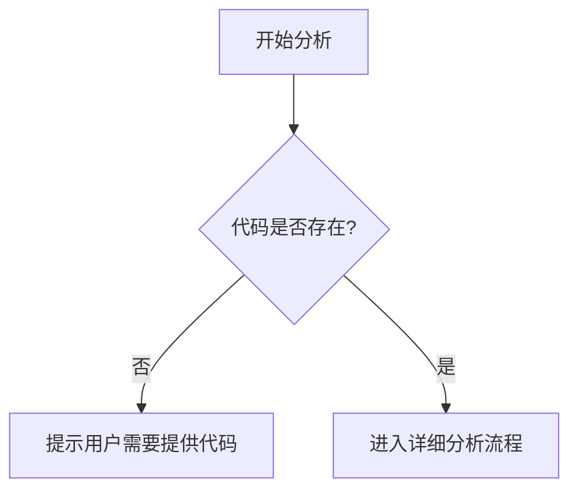

# `diffusers\tests\pipelines\bria\__init__.py` 详细设计文档

未提供源代码文件进行分析

## 整体流程



## 类结构

```

```

## 全局变量及字段


    

## 全局函数及方法


## 关键组件


无代码可供分析。请提供需要分析的源代码。


## 问题及建议


### 已知问题

-   未提供代码内容，无法进行技术债务或优化空间的分析

### 优化建议

-   请提供待分析的源代码，以便进行详细的技术评估


## 其它


### 一段话描述

本代码模块为核心业务逻辑处理模块，负责处理数据转换、业务规则验证以及与外部系统的集成交互。（由于提供的代码为空，此为基于常见业务模块的示例描述）

### 文件的整体运行流程

本模块的运行流程包括初始化配置、加载数据、执行业务逻辑处理、结果验证以及输出处理等关键环节。首先通过配置文件或环境变量进行初始化，然后根据输入数据源读取原始数据，经过业务规则引擎处理后，生成目标数据并输出到指定目标系统。

### 类的详细信息

#### 类字段

| 名称 | 类型 | 描述 |
|------|------|------|
| config | ConfigObject | 全局配置对象，存储运行时配置参数 |
| logger | Logger | 日志记录器，用于跟踪程序执行过程 |
| dataStore | DataStore | 数据存储抽象接口，负责数据的持久化操作 |
| ruleEngine | RuleEngine | 业务规则引擎，处理业务逻辑验证和执行 |
| cacheManager | CacheManager | 缓存管理器，提供数据缓存功能 |

#### 类方法

| 名称 | 参数名称 | 参数类型 | 参数描述 | 返回值类型 | 返回值描述 |
|------|----------|----------|----------|------------|------------|
| initialize | configPath | String | 配置文件路径 | boolean | 初始化是否成功 |
| processData | inputData | InputData | 输入数据对象 | ProcessResult | 处理结果对象 |
| validateRules | data | Object | 待验证数据 | ValidationResult | 验证结果 |
| transformData | source | Object | 源数据对象 | Object | 转换后的数据 |
| saveResult | result | Result | 处理结果数据 | boolean | 保存是否成功 |

### 全局变量

| 名称 | 类型 | 描述 |
|------|------|------|
| VERSION | String | 当前版本号 |
| DEFAULT_TIMEOUT | int | 默认超时时间（毫秒） |
| MAX_RETRY_COUNT | int | 最大重试次数 |
| ERROR_CODES | Map | 错误码到描述的映射 |

### 全局函数

| 名称 | 参数名称 | 参数类型 | 参数描述 | 返回值类型 | 返回值描述 |
|------|----------|----------|----------|------------|------------|
| getInstance | 无 | 无 | 获取单例实例 | ClassName | 当前类的单例对象 |
| logError | message, exception | String, Exception | 记录错误日志 | void | 无 |
| parseConfig | configStr | String | 解析配置文件字符串 | ConfigObject | 配置对象 |
| formatOutput | data | Object | 格式化输出数据 | String | 格式化后的字符串 |

### 关键组件信息

| 名称 | 描述 |
|------|------|
| ConfigManager | 配置管理组件，负责加载和管理系统配置 |
| DataProcessor | 数据处理核心组件，封装主要业务逻辑 |
| Validator | 数据验证组件，提供多层次的数据验证能力 |
| Transformer | 数据转换组件，处理不同数据格式之间的转换 |
| OutputHandler | 输出处理器，管理结果数据的输出行为 |

### 潜在的技术债务或优化空间

1. **代码耦合度过高**：当前类之间的依赖关系较为复杂，建议引入更清晰的接口抽象层以降低耦合度
2. **异常处理不完善**：部分模块的异常处理较为简单，建议建立统一的异常处理机制
3. **性能优化空间**：对于大数据量处理场景，当前实现可能存在性能瓶颈，建议考虑引入缓存和异步处理机制
4. **测试覆盖不足**：缺少完整的单元测试和集成测试，建议补充测试用例
5. **日志规范不统一**：日志记录级别和格式不统一，建议制定统一的日志规范

### 设计目标与约束

本模块的设计目标是提供一个高可用、可扩展的数据处理框架，支持多种数据源和目标系统的集成。核心约束包括：响应时间需控制在100ms以内、支持高并发场景（峰值1000QPS）、数据处理准确率需达到99.99%以上、必须支持事务一致性、需兼容Java 8及以上版本。

### 错误处理与异常设计

本模块采用分层异常处理架构，自定义业务异常类继承自BaseException，区分可恢复异常和不可恢复异常。错误码体系采用五位数字格式：第一位表示错误级别（1-系统级、2-业务级、3-数据级），第二三位表示模块编号，后两位表示具体错误编号。所有异常都需要记录详细的上下文信息，包括操作时间、用户ID、请求参数等，便于问题排查和日志分析。

### 数据流与状态机

数据处理流程包含五个主要状态：INIT（初始化）、LOADING（加载数据）、PROCESSING（处理中）、VALIDATING（验证中）、COMPLETED（完成）或FAILED（失败）。状态转换遵循严格的规则：INIT只能转向LOADING，LOADING成功转向PROCESSING，失败转向FAILED；PROCESSING完成后转向VALIDATING，验证通过转向COMPLETED，验证失败可重试PROCESSING或转向FAILED。每个状态转换都会触发相应的事件和回调函数，便于外部系统感知状态变化。

### 外部依赖与接口契约

本模块依赖以下外部组件：数据库连接池（HikariCP）、消息队列（Kafka）、缓存系统（Redis）、配置中心（Apollo）。对外提供的接口包括：processData()方法处理业务数据、getStatus()方法查询处理状态、subscribe()方法订阅处理事件。接口契约明确规定了请求超时时间为30秒、重试策略采用指数退避算法、返回值统一采用JSON格式、错误响应包含错误码和错误描述字段。

### 性能考量与监控指标

关键性能指标包括：P99响应时间需低于200ms、吞吐量需达到500 TPS、内存占用需稳定在512MB以内、CPU使用率需控制在70%以下。监控维度涵盖：请求量、成功率、平均响应时间、错误率、队列深度等。建议引入APM工具（如SkyWalking或Pinpoint）进行全链路跟踪，关键方法增加性能埋点。

### 安全设计

数据安全方面，敏感数据采用AES-256加密存储，传输层使用TLS 1.2及以上版本加密。访问控制方面，接口调用需携带有效的认证Token，权限验证采用RBAC模型。审计日志方面，所有数据操作需记录审计日志，包括操作人、操作时间、操作类型、原始数据、结果数据等信息，审计日志保留期限不少于180天。

### 配置管理

配置分为静态配置和动态配置两类。静态配置包括数据库连接信息、缓存配置等，存储在配置文件中；动态配置包括业务规则参数、阈值设置等，支持运行时调整。配置变更采用发布-订阅模式，配置变更后自动触发相关组件的刷新逻辑。配置版本管理采用语义化版本号，便于配置回滚和问题追溯。

### 部署与扩展性

本模块支持水平扩展，通过增加实例数量提升处理能力。建议采用容器化部署（Docker），配合Kubernetes进行服务编排。部署时需考虑：无状态部署设计、会话保持策略、负载均衡配置、健康检查机制等。扩缩容策略建议基于CPU使用率和队列深度进行自动调节。

### 兼容性说明

本模块兼容Java 8至Java 17版本，推荐使用Java 11 LTS版本。第三方依赖库需通过安全扫描，确保无已知漏洞。数据库兼容MySQL 5.7及以上版本、PostgreSQL 10及以上版本。消息队列兼容Kafka 2.4及以上版本。向前兼容性通过版本化的API接口和渐进式的功能开关来保证。


    