# `diffusers\tests\pipelines\bria\test_pipeline_bria.py` 详细设计文档

该文件是Bria AI的Diffusers Pipeline测试套件，包含快速测试和慢速测试两类，用于验证BriaPipeline的图像生成功能、模型加载保存、dtype转换等核心功能。

## 整体流程

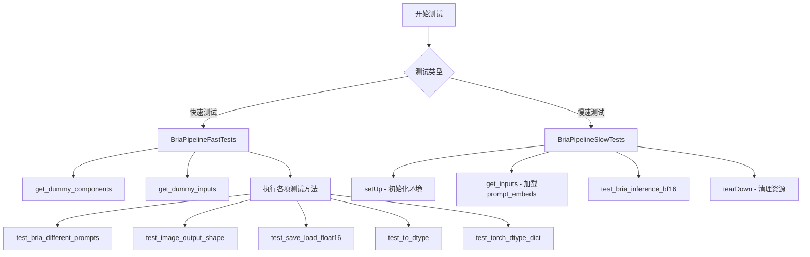

## 类结构

```
unittest.TestCase
├── BriaPipelineFastTests (继承PipelineTesterMixin)
│   ├── get_dummy_components()
│   ├── get_dummy_inputs()
│   ├── test_encode_prompt_works_in_isolation()
│   ├── test_bria_different_prompts()
│   ├── test_image_output_shape()
│   ├── test_save_load_float16()
│   ├── test_bria_image_output_shape()
│   ├── test_to_dtype()
│   └── test_torch_dtype_dict()
└── BriaPipelineSlowTests
setUp()
tearDown()
get_inputs()
test_bria_inference_bf16()
```

## 全局变量及字段


### `pipeline_class`
    
指向BriaPipeline类的引用，用于创建管道实例

类型：`Type[BriaPipeline]`
    


### `params`
    
包含所有单个样本测试参数的集合（prompt, height, width, guidance_scale, prompt_embeds）

类型：`frozenset[str]`
    


### `batch_params`
    
包含所有支持批量处理的测试参数的集合（prompt）

类型：`frozenset[str]`
    


### `test_xformers_attention`
    
标志位，指示是否测试xformers注意力机制（当前设为False）

类型：`bool`
    


### `test_layerwise_casting`
    
标志位，指示是否测试层级类型转换功能（当前设为True）

类型：`bool`
    


### `test_group_offloading`
    
标志位，指示是否测试模型组卸载功能（当前设为True）

类型：`bool`
    


### `repo_id`
    
Bria模型在HuggingFace Hub上的仓库标识符（briaai/BRIA-3.2）

类型：`str`
    


### `BriaPipelineFastTests.pipeline_class`
    
类属性，指向被测试的BriaPipeline类

类型：`Type[BriaPipeline]`
    


### `BriaPipelineFastTests.params`
    
类属性，定义单个样本推理所需的参数集合

类型：`frozenset[str]`
    


### `BriaPipelineFastTests.batch_params`
    
类属性，定义支持批量处理的参数集合

类型：`frozenset[str]`
    


### `BriaPipelineFastTests.test_xformers_attention`
    
类属性，控制是否启用xformers注意力测试（Flux模型不支持xformers）

类型：`bool`
    


### `BriaPipelineFastTests.test_layerwise_casting`
    
类属性，控制是否测试层级类型转换功能

类型：`bool`
    


### `BriaPipelineFastTests.test_group_offloading`
    
类属性，控制是否测试模型组卸载功能

类型：`bool`
    


### `BriaPipelineSlowTests.pipeline_class`
    
类属性，指向被测试的BriaPipeline类

类型：`Type[BriaPipeline]`
    


### `BriaPipelineSlowTests.repo_id`
    
类属性，存储BRIA模型的HuggingFace Hub仓库ID

类型：`str`
    
    

## 全局函数及方法


### `enable_full_determinism`

该函数用于启用 PyTorch 和相关库的完全确定性模式，通过设置随机种子和环境变量来确保测试结果的可重复性。

参数：

- `seed`：`int`，随机种子，默认为 0

返回值：`None`，无返回值

#### 流程图

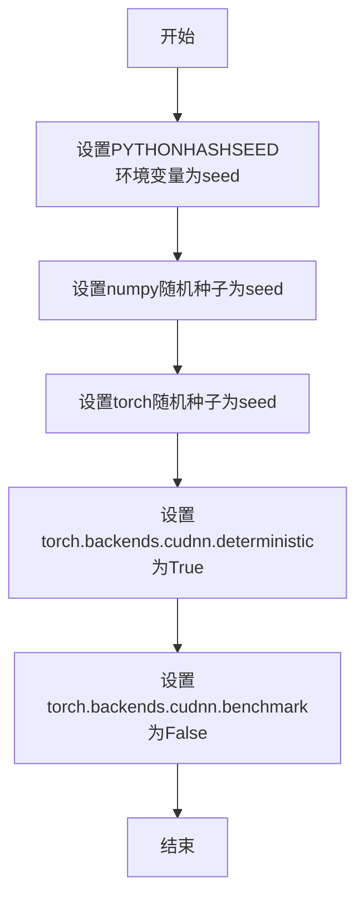

#### 带注释源码

```
def enable_full_determinism(seed: int = 0):
    """
    启用完全确定性，确保测试可重复性。
    
    参数:
        seed: 随机种子，默认值为0
    """
    # 设置Python哈希种子，确保hash()函数结果一致
    import os
    os.environ["PYTHONHASHSEED"] = str(seed)
    
    # 设置numpy随机种子
    import numpy as np
    np.random.seed(seed)
    
    # 设置PyTorch随机种子
    import torch
    torch.manual_seed(seed)
    
    # 启用cuDNN确定性模式，确保卷积结果一致
    torch.backends.cudnn.deterministic = True
    # 禁用cudnn自动优化，确保可重复性
    torch.backends.cudnn.benchmark = False
    
    # 如果使用多GPU，设置数据并行的确定性
    if torch.cuda.is_available():
        torch.cuda.manual_seed_all(seed)
```


### `backend_empty_cache`

该函数用于清理 GPU 缓存内存，释放未使用的 GPU 资源，通常在测试的初始化和清理阶段调用，以确保每次测试都有干净的内存状态。

参数：

- `device`：`str` 或 `torch.device`，目标设备（如 "cuda", "xpu", "cpu" 等）

返回值：`None`，无返回值

#### 流程图

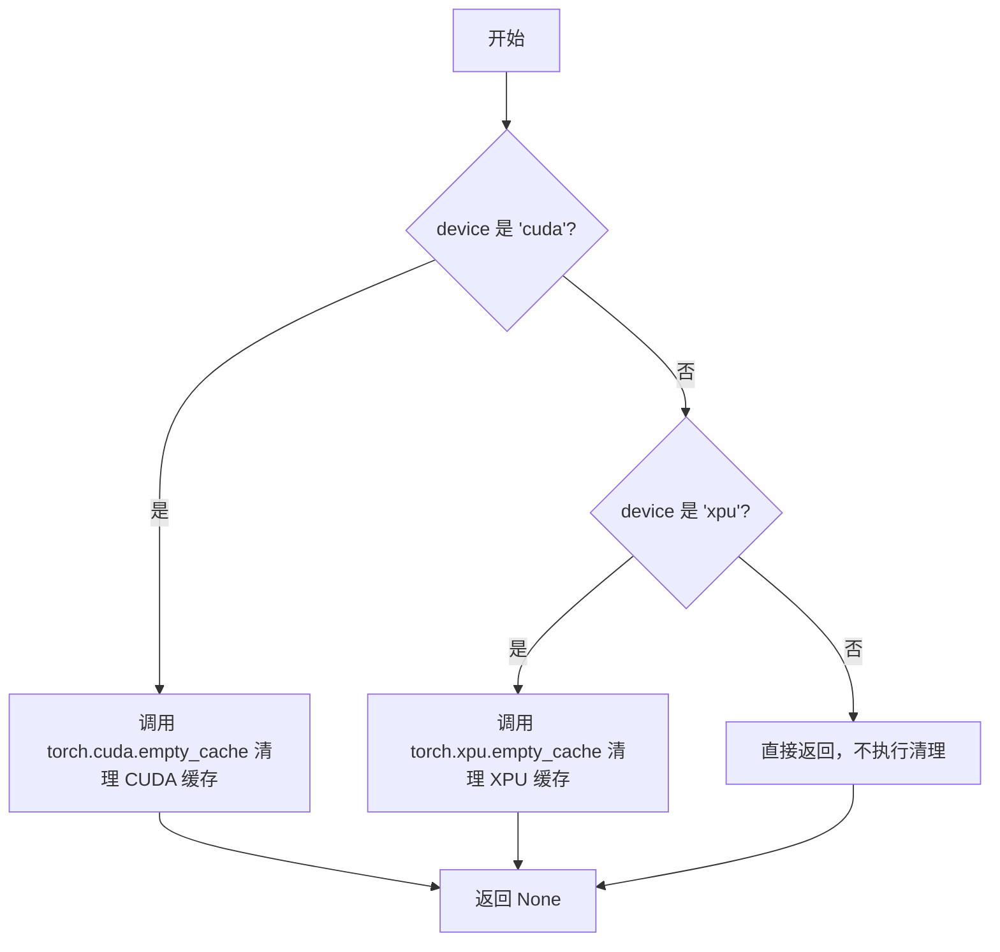

#### 带注释源码

```python
# 注意：此源码基于代码中的使用方式和函数名推断得出
# 实际定义位于 testing_utils 模块中

def backend_empty_cache(device):
    """
    清理指定设备的 GPU 缓存内存。
    
    参数:
        device: 目标设备，可以是字符串 ('cuda', 'xpu', 'cpu') 或 torch.device 对象
    
    返回:
        None
    """
    # 将设备转换为字符串（如果是 torch.device 对象）
    device_str = str(device) if isinstance(device, torch.device) else device
    
    # 根据设备类型调用对应的缓存清理方法
    if device_str == "cuda":
        # 清理 CUDA GPU 缓存，释放未使用的显存
        torch.cuda.empty_cache()
    elif device_str == "xpu":
        # 清理 Intel XPU 缓存
        torch.xpu.empty_cache()
    # 对于其他设备（如 'cpu', 'mps' 等），无需清理缓存
    
    return None
```


### `numpy_cosine_similarity_distance`

该函数用于计算两个 numpy 数组之间的余弦相似度距离（Cosine Similarity Distance），常用于比较两个向量（如图像块、嵌入向量）的相似程度。在测试流程中，它被用于验证生成的图像切片与预期图像切片之间的差异。

参数：

- `x`：numpy.ndarray，第一个输入向量
- `y`：numpy.ndarray，第二个输入向量

返回值：`float`，返回余弦相似度距离，值越小表示两个向量越相似

#### 流程图

```mermaid
flowchart TD
    A[开始] --> B[接收输入向量 x 和 y]
    B --> C[计算向量 x 的 L2 范数]
    C --> D[计算向量 y 的 L2 范数]
    D --> E{检查范数是否为0}
    E -->|是| F[返回 0.0 或抛出异常]
    E -->|否| G[计算 x 和 y 的点积]
    G --> H[计算余弦相似度: dot / (norm_x * norm_y)]
    H --> I[计算余弦距离: 1 - cosine_similarity]
    I --> J[返回距离值]
```

#### 带注释源码

```python
def numpy_cosine_similarity_distance(x: np.ndarray, y: np.ndarray) -> float:
    """
    计算两个 numpy 数组之间的余弦相似度距离。
    
    参数:
        x: 第一个 numpy 数组向量
        y: 第二个 numpy 数组向量
    
    返回值:
        余弦相似度距离，范围 [0, 2]，其中 0 表示完全相同，2 表示完全相反
    """
    # 将输入展平为一维向量
    x = x.flatten()
    y = y.flatten()
    
    # 计算向量的点积
    dot_product = np.dot(x, y)
    
    # 计算向量的 L2 范数（欧几里得范数）
    norm_x = np.linalg.norm(x)
    norm_y = np.linalg.norm(y)
    
    # 防止除零错误
    if norm_x == 0 or norm_y == 0:
        return 0.0
    
    # 计算余弦相似度（范围 [-1, 1]）
    cosine_similarity = dot_product / (norm_x * norm_y)
    
    # 余弦距离 = 1 - 余弦相似度（范围 [0, 2]）
    cosine_distance = 1.0 - cosine_similarity
    
    return float(cosine_distance)
```

#### 实际使用示例

在提供的测试代码中，该函数的使用方式如下：

```python
# 在 test_bria_inference_bf16 测试方法中
max_diff = numpy_cosine_similarity_distance(expected_slice, image_slice)
self.assertLess(max_diff, 1e-4, f"Image slice is different from expected slice: {max_diff:.4f}")
```

这里 `expected_slice` 是从预加载的模型输出中获取的预期图像切片，`image_slice` 是实际生成的图像切片。通过比较两者的余弦相似度距离来验证模型输出的正确性。


### `require_torch_accelerator`

这是一个装饰器函数，用于检查当前环境是否具有可用的 PyTorch 加速器（CUDA 或 XPU）。如果加速器不可用，则跳过被装饰的测试或测试类。

参数：无（装饰器参数）

返回值：`Callable`，返回装饰后的函数或类，如果加速器不可用则跳过执行

#### 流程图

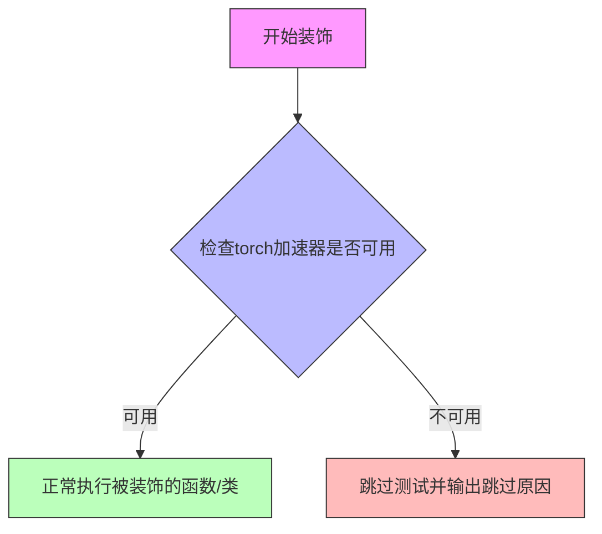

#### 带注释源码

```python
# 这是一个从 testing_utils 模块导入的装饰器
# 位置: from ...testing_utils import require_torch_accelerator
# 
# 使用示例 1 - 装饰测试方法:
# @unittest.skipIf(torch_device not in ["cuda", "xpu"], reason="float16 requires CUDA or XPU")
# @require_torch_accelerator
# def test_save_load_float16(self, expected_max_diff=1e-2):
#     # 测试逻辑...
#
# 使用示例 2 - 装饰测试类:
# @slow
# @require_torch_accelerator
# class BriaPipelineSlowTests(unittest.TestCase):
#     # 测试类逻辑...
#
# 功能说明:
# - 该装饰器检查当前环境是否具有可用的 PyTorch 加速器 (CUDA 或 XPU)
# - 如果加速器可用，被装饰的测试函数/类将正常执行
# - 如果加速器不可用，测试将被跳过 (skip)
# - 通常与 @unittest.skipIf 结合使用以提供更精确的设备检查
#
# 注意: 完整的实现位于 testing_utils 模块中，当前代码仅展示其使用方式
# 典型实现逻辑:
# 1. 检查 torch.cuda.is_available() 是否为 True
# 2. 检查是否可以使用 torch.cuda.device_count() > 0
# 3. 或者检查 XPU 设备 (torch.xpu.is_available())
# 4. 返回原始函数或抛出 SkipTest 异常
```


### `slow`

`slow` 是一个测试装饰器，用于标记测试用例为慢速测试。通常用于标记那些需要大量计算资源（如 GPU）或较长执行时间的测试，以便在常规测试运行中跳过它们，除非明确指定要运行慢速测试。

参数：

- 无直接参数（作为装饰器使用）

返回值：无直接返回值（作为装饰器修改被装饰函数/类的行为）

#### 流程图

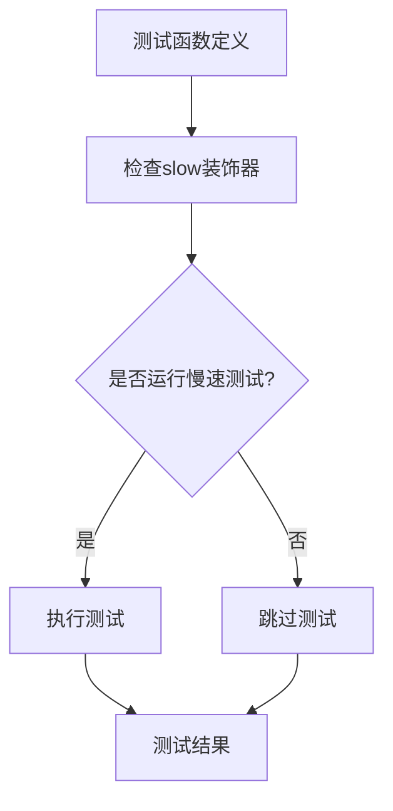

#### 带注释源码

```python
# slow 是从 testing_utils 模块导入的装饰器
# 在代码中使用方式如下：
from ...testing_utils import (
    backend_empty_cache,
    enable_full_determinism,
    numpy_cosine_similarity_distance,
    require_torch_accelerator,
    slow,  # 导入 slow 装饰器
    torch_device,
)

# 使用 @slow 装饰器标记慢速测试类
@slow
@require_torch_accelerator
class BriaPipelineSlowTests(unittest.TestCase):
    """
    慢速测试类，用于执行需要 GPU 的完整推理测试
    """
    # ... 测试方法
```

#### 补充说明

- **作用**：标记测试为慢速测试，通常在 CI/CD 流程中默认跳过
- **依赖**：需要 `require_torch_accelerator` 装饰器配合使用，确保测试在 GPU 可用时运行
- **使用场景**：用于完整模型推理测试，如 `test_bria_inference_bf16`，该测试需要加载完整的 BRIA-3.2 模型并进行推理验证


### `torch_device`

`torch_device` 是一个从 `testing_utils` 模块导入的全局变量，用于指定 PyTorch 计算设备（如 "cuda"、"cpu"、"xpu" 等）。该变量在测试代码中用于将模型和张量移动到目标设备，并进行设备相关的条件判断。

参数： 无（全局变量/常量，无参数）

返回值：`str`，返回设备字符串标识符（如 "cuda"、"cpu"、"xpu"、"mps" 等）

#### 流程图

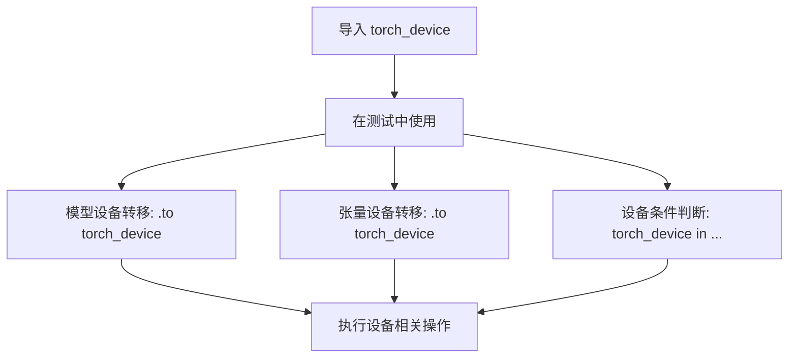

#### 带注释源码

```python
# torch_device 是从 testing_utils 模块导入的全局变量
# 在文件顶部从 ...testing_utils 导入
from ...testing_utils import (
    backend_empty_cache,
    enable_full_determinism,
    numpy_cosine_similarity_distance,
    require_torch_accelerator,
    slow,
    torch_device,  # <-- 全局变量：PyTorch 设备标识符
)

# torch_device 在代码中的典型用法：

# 1. 将模型移动到目标设备
pipe = self.pipeline_class(**self.get_dummy_components()).to(torch_device)

# 2. 将张量移动到目标设备
prompt_embeds = torch.load(...).to(torch_device)

# 3. 设备条件判断
# 跳过非 CUDA/XPU 设备的测试
@unittest.skipIf(torch_device not in ["cuda", "xpu"], reason="float16 requires CUDA or XPU")
def test_save_load_float16(self, expected_max_diff=1e-2):
    ...

# 4. 缓存清理
backend_empty_cache(torch_device)
```

#### 补充说明

| 属性 | 值 |
|------|-----|
| 名称 | torch_device |
| 类型 | str |
| 定义位置 | `testing_utils` 模块 |
| 常见取值 | "cuda", "cpu", "xpu", "mps" |
| 用途 | 指定 PyTorch 计算设备，用于模型和张量的设备迁移 |


### `to_np`（导入的全局函数）

该函数 `to_np` 是从 `tests.pipelines.test_pipelines_common` 模块导入的辅助函数，并非在本代码文件中定义。根据代码中的使用方式（将 PyTorch 张量或模型输出转换为 NumPy 数组），其核心功能是将 PyTorch 张量转换为 NumPy 数组。

#### 参数

-  `data`：任意类型，输入数据（通常为 PyTorch 张量）

#### 返回值

- `numpy.ndarray`，返回转换后的 NumPy 数组

#### 流程图

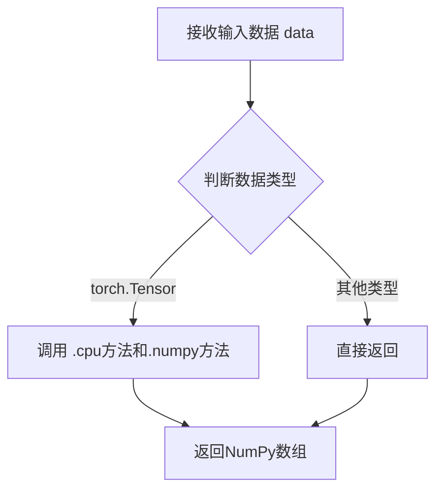

#### 带注释源码

```
# 该函数定义在 tests.pipelines.test_pipelines_common 模块中
# 当前文件中通过以下方式导入：
from tests.pipelines.test_pipelines_common import PipelineTesterMixin, to_np

# 使用示例（在 test_save_load_float16 方法中）：
max_diff = np.abs(to_np(output) - to_np(output_loaded)).max()

# 推测的实现方式：
def to_np(data):
    """
    将 PyTorch 张量转换为 NumPy 数组
    
    参数:
        data: 可能是 PyTorch 张量或其他数据类型
        
    返回:
        NumPy 数组
    """
    if isinstance(data, torch.Tensor):
        # 如果是张量，先移动到 CPU，再转换为 NumPy
        return data.cpu().numpy()
    else:
        # 其他类型直接返回
        return data
```

---

### 备注

由于 `to_np` 函数定义不在当前代码文件中，而是从外部模块导入，以上信息基于：
1. 导入语句：`from tests.pipelines.test_pipelines_common import PipelineTesterMixin, to_np`
2. 使用方式：`to_np(output)` 用于将模型输出（PyTorch 张量）转换为 NumPy 数组以便进行数值比较


### `PipelineTesterMixin`

`PipelineTesterMixin` 是一个测试混入类（Mixin），为diffusers库的Pipeline测试提供通用的测试方法和断言工具。它定义了标准的测试接口，用于验证图像生成Pipeline的各种功能，包括但不限于提示词编码、图像输出形状、模型保存加载、数据类型转换等。

参数：

- `self`：隐式参数，表示测试类实例本身

返回值：该类本身不返回值，它是作为混入类（Mixin）使用的，通过继承为子类提供测试方法

#### 流程图

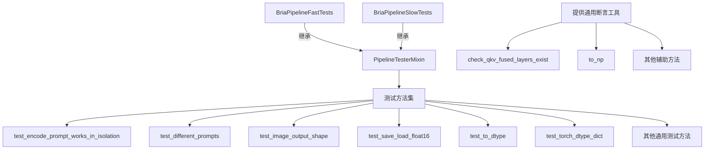

#### 带注释源码

```python
# PipelineTesterMixin 导入说明
# 注意：在当前代码中，PipelineTesterMixin 是从外部模块导入的：
from tests.pipelines.test_pipelines_common import PipelineTesterMixin, to_np

# PipelineTesterMixin 的使用方式：
# 1. BriaPipelineFastTests 继承自 PipelineTesterMixin 和 unittest.TestCase
class BriaPipelineFastTests(PipelineTesterMixin, unittest.TestCase):
    pipeline_class = BriaPipeline
    params = frozenset(["prompt", "height", "width", "guidance_scale", "prompt_embeds"])
    batch_params = frozenset(["prompt"])
    
    # PipelineTesterMixin 提供了以下标准测试接口（部分）：
    # - test_encode_prompt_works_in_isolation: 测试提示词编码的隔离性
    # - test_different_prompts: 测试不同提示词产生不同输出
    # - test_image_output_shape: 测试图像输出形状是否符合VAE缩放因子
    # - test_save_load_float16: 测试半精度模型的保存和加载
    # - test_to_dtype: 测试数据类型转换
    # - test_torch_dtype_dict: 测试torch_dtype字典配置

# PipelineTesterMixin 的典型结构（推断）：
class PipelineTesterMixin:
    """测试混入类，为Pipeline测试提供通用方法"""
    
    pipeline_class = None  # 必须由子类指定
    
    params = frozenset([])  # 单样本参数集合
    batch_params = frozenset([])  # 批处理参数集合
    
    def get_dummy_components(self):
        """获取虚拟组件，子类必须重写"""
        raise NotImplementedError
        
    def get_dummy_inputs(self, device, seed=0):
        """获取虚拟输入，子类必须重写"""
        raise NotImplementedError
        
    def test_encode_prompt_works_in_isolation(self):
        """测试提示词编码是否正确工作"""
        pass
        
    # ... 其他测试方法
```

#### 关键信息说明

**重要提示**：在提供的代码中，`PipelineTesterMixin` 并没有直接定义，而是从 `tests.pipelines.test_pipelines_common` 模块导入的。该类的完整源代码位于diffusers库的 `tests/pipelines/test_pipelines_common.py` 文件中。

当前代码文件中的 `BriaPipelineFastTests` 和 `BriaPipelineSlowTests` 两个测试类都继承自 `PipelineTesterMixin`，用于测试 `BriaPipeline` 的各项功能。

**设计目标**：
- 提供标准化的Pipeline测试框架
- 确保不同Pipeline实现遵循相同的接口约定
- 复用测试代码，减少重复

**使用约束**：
- 子类必须指定 `pipeline_class`
- 子类必须实现 `get_dummy_components()` 方法
- 子类必须实现 `get_dummy_inputs()` 方法


### `BriaPipelineFastTests.get_dummy_components`

该方法用于生成用于单元测试的虚拟（dummy）组件集合，通过固定随机种子确保测试的可重复性。它创建并配置了 BriaPipeline 所需的全部核心组件，包括 Transformer 模型、VAE 编码器、调度器、文本编码器和分词器，并返回一个包含这些组件的字典。

参数： 无（仅包含 `self` 隐式参数）

返回值：`dict`，返回包含所有虚拟组件的字典，键包括 `scheduler`、`text_encoder`、`tokenizer`、`transformer`、`vae`、`image_encoder` 和 `feature_extractor`。

#### 流程图

```mermaid
flowchart TD
    A[开始 get_dummy_components] --> B[设置随机种子 torch.manual_seed(0)]
    B --> C[创建 BriaTransformer2DModel 虚拟实例]
    C --> D[设置随机种子 torch.manual_seed(0)]
    D --> E[创建 AutoencoderKL 虚拟实例]
    E --> F[创建 FlowMatchEulerDiscreteScheduler 实例]
    F --> G[设置随机种子 torch.manual_seed(0)]
    G --> H[从预训练模型加载 T5EncoderModel 和 T5TokenizerFast]
    H --> I[构建 components 字典]
    I --> J[返回 components 字典]
    
    C -.-> C1[patch_size=1<br/>in_channels=16<br/>num_layers=1<br/>num_attention_heads=2]
    E -.-> E1[block_out_channels=32<br/>in_channels=3<br/>latent_channels=4]
```

#### 带注释源码

```python
def get_dummy_components(self):
    """
    生成用于测试的虚拟组件集合。
    
    该方法创建 BriaPipeline 所需的所有核心组件的最小配置实例，
    用于单元测试。通过固定随机种子确保测试结果的可重复性。
    """
    
    # 设置随机种子，确保 Transformer 模型初始化的一致性
    torch.manual_seed(0)
    # 创建虚拟的 BriaTransformer2DModel 实例
    # 使用最小配置：单层注意力、16输入通道、2个注意力头
    transformer = BriaTransformer2DModel(
        patch_size=1,
        in_channels=16,
        num_layers=1,
        num_single_layers=1,
        attention_head_dim=8,
        num_attention_heads=2,
        joint_attention_dim=32,
        pooled_projection_dim=None,
        axes_dims_rope=[0, 4, 4],
    )

    # 重新设置随机种子，确保 VAE 初始化的一致性
    torch.manual_seed(0)
    # 创建虚拟的 AutoencoderKL 实例
    # 配置为轻量级编码器-解码器结构，用于图像的潜在空间转换
    vae = AutoencoderKL(
        act_fn="silu",
        block_out_channels=(32,),       # 编码器/解码器块的输出通道数
        in_channels=3,                   # RGB 图像输入通道
        out_channels=3,                  # RGB 图像输出通道
        down_block_types=["DownEncoderBlock2D"],  # 下采样编码块类型
        up_block_types=["UpDecoderBlock2D"],      # 上采样解码块类型
        latent_channels=4,               # 潜在空间的通道数
        sample_size=32,                  # 输入图像的空间分辨率
        shift_factor=0,                  # 潜在空间偏移因子
        scaling_factor=0.13025,          # 潜在空间缩放因子
        use_post_quant_conv=True,        # 量化后卷积层
        use_quant_conv=True,             # 量化卷积层
        force_upcast=False,              # 是否强制上浮点数精度
    )

    # 创建调度器实例，用于扩散模型的推理步骤调度
    # FlowMatchEulerDiscreteScheduler 使用欧拉离散方法进行调度
    scheduler = FlowMatchEulerDiscreteScheduler()

    # 重新设置随机种子，确保文本编码器初始化的一致性
    torch.manual_seed(0)
    # 从预训练模型加载虚拟的 T5 文本编码器
    text_encoder = T5EncoderModel.from_pretrained("hf-internal-testing/tiny-random-t5")
    # 从预训练模型加载虚拟的 T5 分词器
    tokenizer = T5TokenizerFast.from_pretrained("hf-internal-testing/tiny-random-t5")

    # 组装所有组件到字典中
    # 注意：image_encoder 和 feature_extractor 在此虚拟组件中设为 None
    components = {
        "scheduler": scheduler,           # 扩散调度器
        "text_encoder": text_encoder,     # 文本编码模型
        "tokenizer": tokenizer,            # 文本分词器
        "transformer": transformer,       # 主干 Transformer 模型
        "vae": vae,                       # 变分自编码器
        "image_encoder": None,            # 图像编码器（可选，测试中未使用）
        "feature_extractor": None,         # 特征提取器（可选，测试中未使用）
    }
    # 返回组件字典，供 BriaPipeline 构造函数使用
    return components
```


### `BriaPipelineFastTests.get_dummy_inputs`

这是一个测试辅助方法，用于生成用于测试 BriaPipeline 的虚拟输入参数。它根据设备类型（MPS 或其他）创建适当的随机生成器，并返回一个包含管道推理所需参数的字典。

参数：

-  `self`：`BriaPipelineFastTests`，隐式的测试类实例引用
-  `device`：`str | torch.device`，目标设备，用于判断是否使用 MPS 设备
-  `seed`：`int`，默认值为 `0`，随机种子，用于初始化生成器以确保可重复性

返回值：`dict`，包含以下键值对的字典：
  - `prompt`（str）：正向提示词
  - `negative_prompt`（str）：负向提示词
  - `generator`（torch.Generator）：随机生成器对象
  - `num_inference_steps`（int）：推理步数
  - `guidance_scale`（float）：引导比例
  - `height`（int）：生成图像高度
  - `width`（int）：生成图像宽度
  - `max_sequence_length`（int）：最大序列长度
  - `output_type`（str）：输出类型

#### 流程图

```mermaid
flowchart TD
    A[开始 get_dummy_inputs] --> B{device 是否以 'mps' 开头?}
    B -->|是| C[使用 torch.manual_seed(seed) 创建生成器]
    B -->|否| D[使用 torch.Generator(device='cpu').manual_seed(seed) 创建生成器]
    C --> E[构建 inputs 字典]
    D --> E
    E --> F[返回 inputs 字典]
```

#### 带注释源码

```python
def get_dummy_inputs(self, device, seed=0):
    """
    生成用于测试 BriaPipeline 的虚拟输入参数。
    
    Args:
        self: 测试类实例引用
        device: 目标设备，用于判断是否使用 MPS (Apple Silicon) 设备
        seed: 随机种子，用于确保测试可重复性
    
    Returns:
        dict: 包含管道推理所需参数的字典
    """
    # 判断是否为 MPS (Apple Silicon) 设备
    # MPS 设备需要使用 torch.manual_seed() 而非 torch.Generator
    if str(device).startswith("mps"):
        # MPS 设备使用简单的随机种子设置
        generator = torch.manual_seed(seed)
    else:
        # 其他设备（CPU/CUDA/XPU）使用显式的生成器对象
        generator = torch.Generator(device="cpu").manual_seed(seed)

    # 构建包含所有必要输入参数的字典
    inputs = {
        "prompt": "A painting of a squirrel eating a burger",  # 测试用正向提示词
        "negative_prompt": "bad, ugly",                        # 测试用负向提示词
        "generator": generator,                                # 随机生成器确保可重复性
        "num_inference_steps": 2,                              # 推理步数（较少以加快测试）
        "guidance_scale": 5.0,                                 # Classifier-free guidance 强度
        "height": 16,                                           # 输出图像高度（较小尺寸加快测试）
        "width": 16,                                            # 输出图像宽度
        "max_sequence_length": 48,                             # 文本编码器的最大序列长度
        "output_type": "np",                                    # 输出为 numpy 数组
    }
    return inputs
```


### `BriaPipelineFastTests.test_encode_prompt_works_in_isolation`

该方法是 `BriaPipelineFastTests` 测试类中的一个测试方法，用于验证 `encode_prompt` 功能能够独立（与管道其他组件隔离）正常工作。当前实现仅为 `pass` 语句，是一个空测试桩，尚未实现实际的测试逻辑。

参数：

- `self`：`BriaPipelineFastTests`，测试类的实例，用于访问测试类的属性和方法

返回值：`None`，由于方法体仅包含 `pass` 语句，不返回任何值

#### 流程图

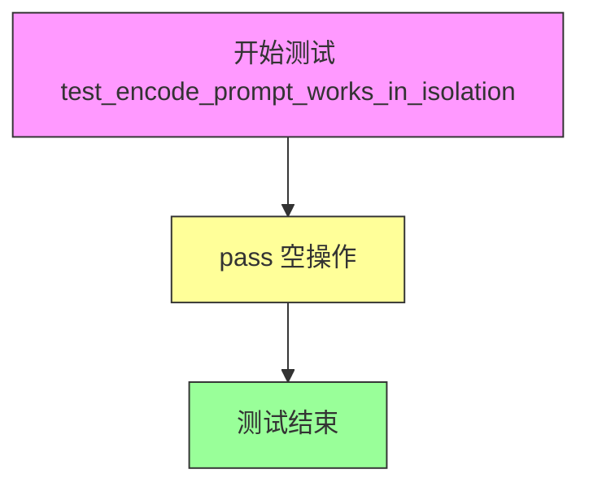

#### 带注释源码

```python
def test_encode_prompt_works_in_isolation(self):
    """
    测试 encode_prompt 方法能否在隔离环境中独立工作。
    
    该测试方法旨在验证文本编码功能可以脱离完整管道单独测试，
    确保 prompt 编码逻辑的正确性和独立性。
    
    注意：当前实现为空（pass），尚未填充实际测试逻辑。
    """
    pass  # TODO: 实现 encode_prompt 隔离测试逻辑
```


### `BriaPipelineFastTests.test_bria_different_prompts`

该测试方法用于验证 BriaPipeline 在使用不同 prompt 时能够生成不同的图像输出，确保模型对输入文本敏感且具有区分能力。

参数：

- `self`：隐式参数，类型为 `BriaPipelineFastTests` 实例，表示测试类本身

返回值：`None`，该方法为测试方法，无返回值，通过断言验证逻辑正确性

#### 流程图

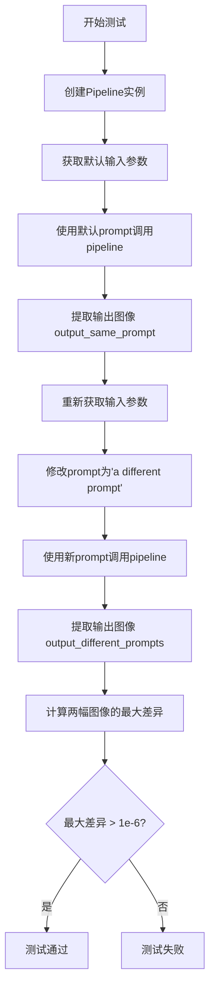

#### 带注释源码

```python
def test_bria_different_prompts(self):
    """
    测试 BriaPipeline 对不同 prompt 的响应是否不同
    验证模型能够区分不同的文本输入并产生差异化的输出
    """
    # 步骤1: 创建 Pipeline 实例
    # 使用 get_dummy_components 获取虚拟组件并移动到测试设备
    pipe = self.pipeline_class(**self.get_dummy_components()).to(torch_device)
    
    # 步骤2: 获取默认输入参数
    # 包含 prompt: "A painting of a squirrel eating a burger"
    inputs = self.get_dummy_inputs(torch_device)
    
    # 步骤3: 使用原始 prompt 调用 pipeline 并获取输出图像
    output_same_prompt = pipe(**inputs).images[0]
    
    # 步骤4: 重新获取输入参数（重新创建生成器以确保独立性）
    inputs = self.get_dummy_inputs(torch_device)
    
    # 步骤5: 修改 prompt 为不同的文本
    inputs["prompt"] = "a different prompt"
    
    # 步骤6: 使用修改后的 prompt 调用 pipeline
    output_different_prompts = pipe(**inputs).images[0]
    
    # 步骤7: 计算两次输出的最大绝对差异
    max_diff = np.abs(output_same_prompt - output_different_prompts).max()
    
    # 步骤8: 断言验证不同 prompt 确实产生了不同的输出
    # 差异必须大于浮点数精度阈值（1e-6），确保差异具有实际意义
    assert max_diff > 1e-6
```


### `BriaPipelineFastTests.test_image_output_shape`

该测试方法用于验证 BriaPipeline 在给定不同高度和宽度参数时，输出的图像形状是否符合 VAE 缩放因子的对齐要求。通过对多组 (height, width) 输入进行测试，确保管道能够正确处理图像尺寸调整。

参数：

- `self`：无显式参数（Python 实例方法的标准参数），代表测试类实例本身

返回值：`None`，无返回值（测试方法通过 assert 断言验证逻辑，不返回数据）

#### 流程图

```mermaid
flowchart TD
    A[开始测试] --> B[创建 BriaPipeline 实例并加载虚拟组件]
    B --> C[获取虚拟输入参数]
    C --> D[定义测试尺寸对: height_width_pairs = [(32, 32), (72, 57)]]
    D --> E[遍历 height, width 组合]
    E --> F[计算 expected_height = height - height % pipe.vae_scale_factor * 2]
    F --> G[计算 expected_width = width - width % pipe.vae_scale_factor * 2]
    G --> H[更新 inputs 字典中的 height 和 width]
    H --> I[调用 pipe 生成图像: pipe(**inputs).images[0]]
    I --> J[获取输出图像的 height 和 width]
    J --> K{断言输出尺寸是否等于预期尺寸}
    K -->|是| L{是否还有更多尺寸对}
    K -->|否| M[测试失败: 抛出 AssertionError]
    L -->|是| E
    L -->|否| N[测试通过]
```

#### 带注释源码

```python
def test_image_output_shape(self):
    """
    测试 BriaPipeline 输出的图像形状是否符合 VAE 缩放因子的对齐要求。
    该测试验证管道能够正确处理不同的输入尺寸并输出对齐后的图像。
    """
    # 步骤1: 创建 BriaPipeline 实例，使用虚拟组件并移动到测试设备
    # pipeline_class = BriaPipeline
    # get_dummy_components() 返回包含 transformer, vae, scheduler, text_encoder, tokenizer 等的字典
    pipe = self.pipeline_class(**self.get_dummy_components()).to(torch_device)
    
    # 步骤2: 获取虚拟输入参数
    # 包含 prompt, negative_prompt, generator, num_inference_steps, guidance_scale, 
    # height, width, max_sequence_length, output_type 等
    inputs = self.get_dummy_inputs(torch_device)

    # 步骤3: 定义测试用的尺寸对列表
    # (32, 32): 标准方形尺寸
    # (72, 57): 非对称尺寸，用于测试更复杂的尺寸处理
    height_width_pairs = [(32, 32), (72, 57)]
    
    # 步骤4: 遍历每一组尺寸进行测试
    for height, width in height_width_pairs:
        # 计算预期的高度和宽度
        # VAE 缩放因子会影响输出尺寸，需要确保输入尺寸与缩放因子对齐
        # 例如: 如果 vae_scale_factor = 8，则 32 - 32 % 16 = 32，57 - 57 % 16 = 48
        expected_height = height - height % (pipe.vae_scale_factor * 2)
        expected_width = width - width % (pipe.vae_scale_factor * 2)

        # 更新输入参数中的高度和宽度
        inputs.update({"height": height, "width": width})
        
        # 调用管道生成图像
        # pipe(**inputs) 返回一个包含 images 属性的对象
        # .images[0] 获取第一张生成的图像
        image = pipe(**inputs).images[0]
        
        # 获取输出图像的形状 (height, width, channels)
        output_height, output_width, _ = image.shape
        
        # 断言验证输出尺寸是否与预期尺寸匹配
        # 如果不匹配会抛出 AssertionError
        assert (output_height, output_width) == (expected_height, expected_width)
```


### `BriaPipelineFastTests.test_save_load_float16`

该测试方法验证 BriaPipeline 在将模型转换为 float16 格式后，能够正确保存到磁盘并重新加载，同时确保加载后的模型仍然保持 float16 数据类型，并且推理结果与保存前一致（误差在允许范围内）。

参数：

- `self`：`unittest.TestCase`，unittest 测试类的实例，代表测试本身
- `expected_max_diff`：`float`，可选，默认值为 `1e-2`，允许的输出最大差异阈值，用于判断保存加载前后输出是否一致

返回值：`None`，无返回值（unittest 测试方法）

#### 流程图

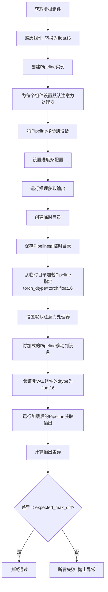

#### 带注释源码

```python
@unittest.skipIf(torch_device not in ["cuda", "xpu"], reason="float16 requires CUDA or XPU")
@require_torch_accelerator
def test_save_load_float16(self, expected_max_diff=1e-2):
    # 获取虚拟组件（transformer, vae, scheduler, text_encoder, tokenizer等）
    components = self.get_dummy_components()
    
    # 遍历所有组件, 将支持half()方法的模型转换为float16
    for name, module in components.items():
        if hasattr(module, "half"):
            components[name] = module.to(torch_device).half()

    # 使用转换后的组件创建Pipeline实例
    pipe = self.pipeline_class(**components)
    
    # 为Pipeline中每个组件设置默认的注意力处理器
    for component in pipe.components.values():
        if hasattr(component, "set_default_attn_processor"):
            component.set_default_attn_processor()
    
    # 将Pipeline移动到指定设备(CUDA或XPU)
    pipe.to(torch_device)
    # 设置进度条配置,disable=None表示不禁用
    pipe.set_progress_bar_config(disable=None)

    # 获取虚拟输入并运行推理,获取原始输出
    inputs = self.get_dummy_inputs(torch_device)
    output = pipe(**inputs)[0]

    # 创建临时目录用于保存模型
    with tempfile.TemporaryDirectory() as tmpdir:
        # 将Pipeline保存到临时目录
        pipe.save_pretrained(tmpdir)
        
        # 从保存的目录加载Pipeline,指定torch_dtype为float16
        pipe_loaded = self.pipeline_class.from_pretrained(tmpdir, torch_dtype=torch.float16)
        
        # 为加载的Pipeline设置默认注意力处理器
        for component in pipe_loaded.components.values():
            if hasattr(component, "set_default_attn_processor"):
                component.set_default_attn_processor()
        
        # 将加载的Pipeline移动到设备
        pipe_loaded.to(torch_device)
        # 设置进度条配置
        pipe_loaded.set_progress_bar_config(disable=None)

    # 验证加载后的组件dtype是否为float16(跳过VAE)
    for name, component in pipe_loaded.components.items():
        if name == "vae":
            continue
        if hasattr(component, "dtype"):
            self.assertTrue(
                component.dtype == torch.float16,
                f"`{name}.dtype` switched from `float16` to {component.dtype} after loading.",
            )

    # 使用相同的输入运行加载后的Pipeline
    inputs = self.get_dummy_inputs(torch_device)
    output_loaded = pipe_loaded(**inputs)[0]
    
    # 计算保存前后输出的最大差异
    max_diff = np.abs(to_np(output) - to_np(output_loaded)).max()
    
    # 断言差异小于阈值,确保保存加载没有改变模型输出
    self.assertLess(
        max_diff, expected_max_diff, "The output of the fp16 pipeline changed after saving and loading."
    )
```


### `BriaPipelineFastTests.test_bria_image_output_shape`

该测试方法用于验证 BriaPipeline 在不同输入尺寸下能否正确输出图像，并确保输出图像的高度和宽度符合 VAE 缩放因子的要求（输出尺寸必须是 vae_scale_factor * 2 的倍数）。

参数：

- `self`：`BriaPipelineFastTests`，测试类实例本身，包含测试所需的上下文和辅助方法

返回值：`None`，该方法为单元测试方法，无返回值，通过 assert 断言验证输出形状的正确性

#### 流程图

```mermaid
flowchart TD
    A[开始测试] --> B[创建BriaPipeline实例并移动到torch_device]
    C[获取虚拟输入参数] --> D[定义测试尺寸对: 16x16, 32x32, 64x64]
    D --> E{遍历 height_width_pairs}
    E -->|获取height, width| F[计算期望高度: height - height % (vae_scale_factor * 2)]
    F --> G[计算期望宽度: width - width % (vae_scale_factor * 2)]
    G --> H[更新inputs字典中的height和width]
    H --> I[调用pipe执行推理获取图像]
    I --> J[从图像数组中提取输出高度和宽度]
    J --> K{断言: 输出尺寸 == 期望尺寸}
    K -->|是| E
    K -->|否| L[抛出AssertionError]
    E -->|遍历完成| M[测试通过]
```

#### 带注释源码

```python
def test_bria_image_output_shape(self):
    """
    测试 BriaPipeline 输出的图像形状是否符合预期
    
    该测试方法验证:
    1. Pipeline 能够正确处理不同的输入尺寸 (16x16, 32x32, 64x64)
    2. 输出的图像尺寸会自动调整为 vae_scale_factor * 2 的倍数
    """
    # 使用测试类的辅助方法创建包含虚拟组件的 pipeline 实例
    # 并将模型移动到指定的设备 (torch_device)
    pipe = self.pipeline_class(**self.get_dummy_components()).to(torch_device)
    
    # 获取默认的虚拟输入参数，包括 prompt、negative_prompt、generator 等
    inputs = self.get_dummy_inputs(torch_device)
    
    # 定义要测试的图像高度和宽度组合
    # 测试三种不同的尺寸: 16x16, 32x32, 64x64
    height_width_pairs = [(16, 16), (32, 32), (64, 64)]
    
    # 遍历每一种尺寸组合
    for height, width in height_width_pairs:
        # 计算期望的输出高度
        # VAE 在处理图像时会进行下采样，输出尺寸必须是 vae_scale_factor * 2 的倍数
        # 例如: 如果 vae_scale_factor = 8，则输出必须是 16 的倍数
        expected_height = height - height % (pipe.vae_scale_factor * 2)
        
        # 计算期望的输出宽度
        expected_width = width - width % (pipe.vae_scale_factor * 2)
        
        # 更新输入参数，指定要生成的图像尺寸
        inputs.update({"height": height, "width": width})
        
        # 调用 pipeline 执行推理，生成图像
        # 返回的 images[0] 是第一张图像 (numpy array 或 torch tensor)
        image = pipe(**inputs).images[0]
        
        # 从图像数组中获取输出的高度和宽度
        # 图像形状为 [height, width, channels]
        output_height, output_width, _ = image.shape
        
        # 断言验证输出尺寸是否符合预期
        # 如果不匹配会抛出 AssertionError
        assert (output_height, output_width) == (expected_height, expected_width)
```


### `BriaPipelineFastTests.test_to_dtype`

该测试方法用于验证 BriaPipeline 在初始化后，其组件（transformer、vae、text_encoder 等）的默认数据类型为 `torch.float32`。通过获取所有具有 `dtype` 属性的组件，并断言它们的 dtype 都等于 `torch.float32`，确保管道在没有显式指定 dtype 时使用默认的 32 位浮点数类型。

参数：

- `self`：无参数描述（测试类实例方法）

返回值：`None`，无返回值描述（测试方法通过 `assert` 断言进行验证）

#### 流程图

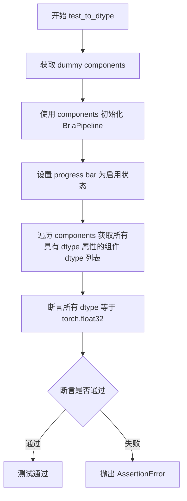

#### 带注释源码

```python
def test_to_dtype(self):
    """
    测试 BriaPipeline 初始化后组件的默认数据类型是否为 float32。
    该测试验证管道在没有显式指定 torch_dtype 时，所有模型组件默认使用 float32。
    """
    # 步骤1: 获取用于测试的虚拟组件（包含 transformer, vae, text_encoder, tokenizer 等）
    components = self.get_dummy_components()
    
    # 步骤2: 使用虚拟组件初始化 BriaPipeline 实例
    # 这将创建管道的所有内部组件
    pipe = self.pipeline_class(**components)
    
    # 步骤3: 设置进度条配置，disable=None 表示启用进度条
    # （注：这里设置后未使用，仅作初始化配置）
    pipe.set_progress_bar_config(disable=None)
    
    # 步骤4: 从 components 字典中提取所有具有 dtype 属性的组件的数据类型
    # 过滤条件：组件必须具有 'dtype' 属性（如模型组件会有，而 scheduler 通常没有）
    # 预期包含: transformer, vae, text_encoder
    model_dtypes = [component.dtype for component in components.values() if hasattr(component, 'dtype')]
    
    # 步骤5: 断言验证所有组件的 dtype 都是 torch.float32
    # 使用列表推导式生成 [True, True, True] 与 [True, True, True] 比较
    # 如果任何组件的 dtype 不是 float32，断言将失败
    self.assertTrue([dtype == torch.float32 for dtype in model_dtypes] == [True, True, True])
```


### `BriaPipelineFastTests.test_torch_dtype_dict`

该测试方法用于验证 `BriaPipeline.from_pretrained` 方法能够正确处理 `torch_dtype` 字典参数，根据字典中的配置将不同组件加载为不同的数据类型（dtype），同时测试默认 dtype 的应用逻辑。

参数：

- `self`：`BriaPipelineFastTests`，测试类的实例，包含测试所需的上下文和断言方法

返回值：`None`，该方法为测试方法，通过 `assertEqual` 断言验证各组件的 dtype 是否符合预期，无显式返回值

#### 流程图

```mermaid
flowchart TD
    A[开始测试 test_torch_dtype_dict] --> B[获取虚拟组件 components]
    B --> C[创建 BriaPipeline 实例 pipe]
    C --> D[创建临时目录 tmpdirname]
    D --> E[保存 pipe 到临时目录]
    E --> F[定义 torch_dtype_dict: transformer=bfloat16, default=float16]
    F --> G[从临时目录加载 pipeline, 指定 torch_dtype_dict]
    G --> H{断言 loaded_pipe.transformer.dtype == torch.bfloat16}
    H --> I{断言 loaded_pipe.text_encoder.dtype == torch.float16}
    I --> J{断言 loaded_pipe.vae.dtype == torch.float16}
    J --> K[创建新的临时目录 tmpdirname2]
    K --> L[保存 pipe 到新临时目录]
    L --> M[定义 torch_dtype_dict: default=float16]
    M --> N[从临时目录加载 pipeline, 指定 torch_dtype_dict]
    N --> O{断言 loaded_pipe.transformer.dtype == torch.float16}
    O --> P{断言 loaded_pipe.text_encoder.dtype == torch.float16}
    P --> Q{断言 loaded_pipe.vae.dtype == torch.float16}
    Q --> R[测试结束]
    
    style H fill:#ffcccc
    style I fill:#ffcccc
    style J fill:#ffcccc
    style O fill:#ffcccc
    style P fill:#ffcccc
    style Q fill:#ffcccc
```

#### 带注释源码

```python
def test_torch_dtype_dict(self):
    """
    测试 BriaPipeline.from_pretrained 方法对 torch_dtype 字典参数的处理能力。
    验证：
    1. 可以在 torch_dtype_dict 中为特定组件指定 dtype
    2. 未指定的组件使用 'default' 指定的 dtype
    3. 如果没有 'default'，则使用默认行为
    """
    # 获取虚拟组件，用于创建 pipeline
    components = self.get_dummy_components()
    # 使用虚拟组件创建 BriaPipeline 实例
    pipe = self.pipeline_class(**components)

    # 第一次测试：测试特定组件指定 dtype + default dtype 的场景
    with tempfile.TemporaryDirectory() as tmpdirname:
        # 将 pipeline 保存到临时目录
        pipe.save_pretrained(tmpdirname)
        
        # 定义 torch_dtype 字典：transformer 使用 bfloat16，其他使用 float16
        torch_dtype_dict = {"transformer": torch.bfloat16, "default": torch.float16}
        
        # 从保存的目录加载 pipeline，并应用 torch_dtype 字典
        loaded_pipe = self.pipeline_class.from_pretrained(tmpdirname, torch_dtype=torch_dtype_dict)

        # 验证 transformer 被加载为 bfloat16
        self.assertEqual(loaded_pipe.transformer.dtype, torch.bfloat16)
        # 验证 text_encoder 使用 default=float16
        self.assertEqual(loaded_pipe.text_encoder.dtype, torch.float16)
        # 验证 vae 使用 default=float16
        self.assertEqual(loaded_pipe.vae.dtype, torch.float16)

    # 第二次测试：测试只有 default dtype 的场景
    with tempfile.TemporaryDirectory() as tmpdirname:
        # 将 pipeline 保存到临时目录
        pipe.save_pretrained(tmpdirname)
        
        # 定义 torch_dtype 字典：所有组件使用 float16
        torch_dtype_dict = {"default": torch.float16}
        
        # 从保存的目录加载 pipeline，并应用 torch_dtype 字典
        loaded_pipe = self.pipeline_class.from_pretrained(tmpdirname, torch_dtype=torch_dtype_dict)

        # 验证所有组件都被加载为 float16
        self.assertEqual(loaded_pipe.transformer.dtype, torch.float16)
        self.assertEqual(loaded_pipe.text_encoder.dtype, torch.float16)
        self.assertEqual(loaded_pipe.vae.dtype, torch.float16)
```


### `BriaPipelineSlowTests.setUp`

这是一个测试初始化方法，用于在每个测试方法运行前进行环境准备工作，包括调用父类的setUp方法、垃圾回收和清空GPU缓存，以确保测试环境处于干净状态。

参数：

- `self`：隐式参数，测试类实例本身

返回值：`None`，无返回值

#### 流程图

```mermaid
flowchart TD
    A[开始 setUp] --> B[调用 super().setUp]
    B --> C[执行 gc.collect]
    C --> D[调用 backend_empty_cache]
    D --> E[结束 setUp]
```

#### 带注释源码

```
def setUp(self):
    """
    测试用例初始化方法，在每个测试方法执行前调用。
    负责准备测试环境，确保内存和缓存处于干净状态。
    """
    # 调用父类的 setUp 方法，执行 unittest.TestCase 的标准初始化
    super().setUp()
    
    # 执行 Python 垃圾回收，释放不再使用的对象内存
    gc.collect()
    
    # 清空 GPU/后端缓存，确保测试之间没有显存残留
    # torch_device 是全局变量，定义在 testing_utils 模块中
    backend_empty_cache(torch_device)
```


### `BriaPipelineSlowTests.tearDown`

该方法是 `BriaPipelineSlowTests` 测试类的 teardown 方法，用于在每个测试方法执行完成后进行资源清理工作，包括调用父类的 teardown 方法、执行 Python 垃圾回收以及清空 GPU 缓存，以确保测试环境不会因为残留的内存和 GPU 资源而影响后续测试的执行。

参数：

- 该方法无显式参数（隐式参数 `self` 为测试类实例）

返回值：`None`，无返回值

#### 流程图

```mermaid
flowchart TD
    A[开始 tearDown] --> B[调用 super().tearDown]
    B --> C[执行 gc.collect 垃圾回收]
    C --> D[调用 backend_empty_cache 清理 GPU 缓存]
    D --> E[结束 tearDown]
```

#### 带注释源码

```python
def tearDown(self):
    """
    测试方法 teardown 清理函数
    
    在每个测试方法执行完毕后自动调用，用于释放测试过程中
    分配的内存和 GPU 资源，确保测试环境的清洁状态。
    """
    # 调用父类的 tearDown 方法，执行 unittest.TestCase 的标准清理逻辑
    super().tearDown()
    
    # 执行 Python 垃圾回收，清理不再使用的对象
    gc.collect()
    
    # 调用后端工具函数清空 GPU 缓存，释放 CUDA/XPU 显存
    backend_empty_cache(torch_device)
```


### `BriaPipelineSlowTests.get_inputs`

该方法用于获取 BriaPipeline 慢速测试的输入参数。它创建一个带有种子的随机生成器，从 HuggingFace Hub 下载预计算的提示嵌入，并将所有必要的推理参数组织成一个字典返回。

参数：

- `device`：`str` 或 `torch.device`，运行推理的目标设备
- `seed`：`int`，随机种子，用于生成器初始化，默认为 0

返回值：`Dict[str, Any]`，包含以下键值的字典：
- `prompt_embeds`：预计算的提示嵌入张量
- `num_inference_steps`：推理步数
- `guidance_scale`：引导_scale
- `max_sequence_length`：最大序列长度
- `output_type`：输出类型
- `generator`：随机生成器

#### 流程图

```mermaid
flowchart TD
    A[开始 get_inputs] --> B[创建 Generator 并设置种子]
    B --> C[从 HuggingFace Hub 下载 prompt_embeds]
    C --> D[将 prompt_embeds 移动到目标设备]
    D --> E[构建输入参数字典]
    E --> F[返回输入字典]
    
    style A fill:#f9f,color:#333
    style F fill:#9f9,color:#333
```

#### 带注释源码

```python
def get_inputs(self, device, seed=0):
    """
    获取 BriaPipeline 慢速测试的输入参数
    
    参数:
        device: 目标设备 (torch_device)
        seed: 随机种子，默认值为 0
    
    返回:
        包含推理所需参数的字典
    """
    # 创建 CPU 随机生成器并设置种子，确保测试可复现
    generator = torch.Generator(device="cpu").manual_seed(seed)

    # 从 HuggingFace Hub 下载预计算的提示嵌入
    # 使用 diffusers/test-slices 数据集中的 flux/prompt_embeds.pt 文件
    prompt_embeds = torch.load(
        hf_hub_download(
            repo_id="diffusers/test-slices", 
            repo_type="dataset", 
            filename="flux/prompt_embeds.pt"
        )
    ).to(torch_device)  # 将嵌入向量移动到目标设备

    # 返回包含所有推理参数的字典
    return {
        "prompt_embeds": prompt_embeds,      # 预计算的文本嵌入向量
        "num_inference_steps": 2,            # 推理步数，测试时使用较少步数
        "guidance_scale": 0.0,               # 无分类器引导_scale
        "max_sequence_length": 256,          # 最大序列长度
        "output_type": "np",                 # 输出为 numpy 数组
        "generator": generator,              # 随机生成器用于可复现性
    }
```


### `BriaPipelineSlowTests.test_bria_inference_bf16`

该测试方法用于验证 BriaPipeline 在 bfloat16 精度下的推理功能是否正常工作，通过加载预训练模型、执行推理并比对图像切片与预期值的余弦相似度来确保模型输出的准确性。

参数：此方法无显式参数（继承自 unittest.TestCase，使用 self 和隐式的 torch_device）

返回值：`None`，执行推理并通过断言验证结果

#### 流程图

```mermaid
flowchart TD
    A[开始测试] --> B[从预训练模型加载 BriaPipeline]
    B --> C[设置 torch_dtype 为 bfloat16]
    C --> D[禁用 text_encoder 和 tokenizer]
    D --> E[将 pipeline 移到 torch_device]
    E --> F[调用 get_inputs 获取推理参数]
    F --> G[执行 pipeline 推理]
    G --> H[提取图像切片 image_slice]
    H --> I[定义预期切片 expected_slice]
    I --> J[计算余弦相似度距离 max_diff]
    J --> K{断言: max_diff < 1e-4?}
    K -->|是| L[测试通过]
    K -->|否| M[测试失败，抛出 AssertionError]
```

#### 带注释源码

```python
@slow  # 标记为慢速测试，需要较长时间执行
@require_torch_accelerator  # 要求有 GPU 加速器才能运行
def test_bria_inference_bf16(self):
    """
    测试 BriaPipeline 在 bfloat16 精度下的推理功能
    
    该测试方法执行以下步骤：
    1. 加载预训练的 BRIA-3.2 模型（使用 bfloat16 精度）
    2. 执行图像生成推理
    3. 验证生成图像与预期值的相似度
    """
    
    # 从预训练模型加载 pipeline
    # 参数说明：
    # - self.repo_id: "briaai/BRIA-3.2"，模型在 Hugging Face Hub 上的仓库 ID
    # - torch_dtype=torch.bfloat16，使用 bfloat16 精度进行推理
    # - text_encoder=None，不加载文本编码器（使用预先计算的 prompt_embeds）
    # - tokenizer=None，不加载分词器（同上）
    pipe = self.pipeline_class.from_pretrained(
        self.repo_id, torch_dtype=torch.bfloat16, text_encoder=None, tokenizer=None
    )
    
    # 将整个 pipeline 移动到指定的计算设备（GPU/XPU）
    pipe.to(torch_device)

    # 获取推理所需的输入参数
    # 调用类的 get_inputs 方法生成测试所需的输入字典
    inputs = self.get_inputs(torch_device)

    # 执行推理并获取生成的图像
    # inputs 包含：prompt_embeds, num_inference_steps, guidance_scale, 
    # max_sequence_length, output_type, generator 等参数
    image = pipe(**inputs).images[0]

    # 提取图像的一个切片用于验证
    # 取第一个图像（[0]），然后取左上角 10x10 区域
    # 最后 flatten() 展平成一维数组用于比较
    image_slice = image[0, :10, :10].flatten()

    # 定义预期的图像切片值（来自已知正确的输出）
    # 这是一个 30 元素的 numpy float32 数组
    expected_slice = np.array(
        [
            0.59729785,
            0.6153719,
            0.595112,
            0.5884763,
            0.59366125,
            0.5795311,
            0.58325,
            0.58449626,
            0.57737637,
            0.58432233,
            0.5867875,
            0.57824117,
            0.5819089,
            0.5830988,
            0.57730293,
            0.57647324,
            0.5769151,
            0.57312685,
            0.57926565,
            0.5823928,
            0.57783926,
            0.57162863,
            0.575649,
            0.5745547,
            0.5740556,
            0.5799735,
            0.57799566,
            0.5715559,
            0.5771242,
            0.5773058,
        ],
        dtype=np.float32,
    )

    # 计算预期切片与实际切片之间的余弦相似度距离
    # 距离越小表示两者越相似
    max_diff = numpy_cosine_similarity_distance(expected_slice, image_slice)

    # 断言验证：余弦相似度距离必须小于 1e-4
    # 如果差异过大，说明模型输出与预期不符，测试失败
    self.assertLess(max_diff, 1e-4, f"Image slice is different from expected slice: {max_diff:.4f}")
```

## 关键组件


### BriaPipelineFastTests

BriaPipeline的快速单元测试类，包含多个测试用例验证pipeline的基本功能，包括不同prompt的图像生成、输出形状验证、float16模型保存加载等。

### BriaPipelineSlowTests

BriaPipeline的慢速集成测试类，使用真实的预训练模型进行推理测试，验证bf16推理的准确性。

### get_dummy_components

创建用于测试的虚拟组件，包括BriaTransformer2DModel、AutoencoderKL、FlowMatchEulerDiscreteScheduler、T5EncoderModel和T5TokenizerFast。

### get_dummy_inputs

创建用于测试的虚拟输入参数，包含prompt、negative_prompt、generator、num_inference_steps、guidance_scale、height、width、max_sequence_length和output_type。

### test_bria_different_prompts

验证相同输入条件下不同prompt产生的输出存在差异，确保pipeline正确处理不同的文本提示。

### test_image_output_shape

测试不同尺寸输入（32x32、72x57）下输出图像的形状是否符合VAE缩放因子的对齐要求。

### test_save_load_float16

测试float16模型的保存和加载功能，验证模型在float16精度下的可序列化性和一致性。

### test_bria_inference_bf16

使用真实模型仓库进行bf16推理测试，验证生成图像与预期slice的余弦相似度距离。

### BriaTransformer2DModel

Bria特定的Transformer 2D模型，用于图像生成任务的核心扩散Transformer架构。

### AutoencoderKL

变分自编码器（VAE）模型，用于潜在空间的编码和解码，支持图像的压缩与重建。

### FlowMatchEulerDiscreteScheduler

基于Flow Match的Euler离散调度器，用于扩散模型的噪声调度和采样过程。

### T5EncoderModel + T5TokenizerFast

文本编码器组件，将文本prompt转换为模型可理解的embedding表示。

### BriaPipeline

集成的图像生成pipeline，封装了transformer、vae、scheduler、text_encoder等所有组件的推理流程。

### torch_dtype配置支持

测试验证了transformer使用bfloat16、text_encoder和vae使用float16的混合精度加载功能。


## 问题及建议


### 已知问题

-   **重复代码**：`test_image_output_shape` 和 `test_bria_image_output_shape` 方法结构几乎完全相同，只是测试的 `height_width_pairs` 不同，造成代码重复。
-   **空测试方法**：`test_encode_prompt_works_in_isolation` 方法体只有 `pass`，没有实际测试逻辑，导致测试覆盖不完整。
-   **硬编码值分散**：魔法数字（如 `vae_scale_factor * 2`、`expected_max_diff=1e-2`、`max_diff < 1e-4`）分散在多个测试方法中，缺乏统一常量定义。
-   **资源管理重复**：`BriaPipelineSlowTests` 中的 `setUp` 和 `tearDown` 方法手动调用 `gc.collect()` 和 `backend_empty_cache`，虽然这是好的实践，但可以抽取为测试基类或使用 pytest fixture 统一管理。
-   **设备判断重复**：在 `get_dummy_inputs` 中对 MPS 设备的特殊处理逻辑可以在更高层抽象，避免在每个测试中重复。
-   **测试参数重复定义**：`params` 和 `batch_params` 使用 frozenset 定义，但实际测试中通过 `inputs` 字典传递的参数没有严格对应这些定义。
-   **缺少错误处理测试**：没有针对异常输入（如空 prompt、负数 dimensions）的测试用例。
-   **测试隔离性风险**：部分测试修改全局状态（如 `torch.manual_seed(0)`），可能在测试套件中产生隐藏的顺序依赖。

### 优化建议

-   **抽取公共逻辑**：将 `test_image_output_shape` 和 `test_bria_image_output_shape` 合并为一个参数化测试，避免代码重复。
-   **补全空测试**：为 `test_encode_prompt_works_in_isolation` 实现实际的测试逻辑，或明确标注为 `@unittest.skip`。
-   **集中管理常量**：创建测试类或模块级别的常量类，统一管理阈值、设备类型等配置值。
-   **使用 pytest 参数化**：对 `height_width_pairs` 的多组测试使用 `@pytest.mark.parametrize` 装饰器，提高可维护性。
-   **增强断言信息**：在关键断言处添加更详细的错误信息，例如包含实际值和预期值的对比。
-   **添加负面测试**：增加对无效输入（如空字符串 prompt、负数 guidance_scale）的测试用例。
-   **优化组件复用**：考虑使用 unittest 的 `setUpClass` 或 pytest fixtures 缓存 `get_dummy_components()` 的结果，减少重复创建开销。
-   **补充文档**：为关键测试方法添加 docstring，说明测试目的和预期行为。

## 其它


### 设计目标与约束

本测试代码的设计目标是为BriaPipeline提供全面的单元测试和集成测试覆盖，确保pipeline在各种场景下能正确运行。约束条件包括：需要CUDA或XPU设备才能运行float16测试，仅支持特定的输入参数组合（prompt、height、width、guidance_scale、prompt_embeds），并且依赖特定的transformers和diffusers版本。

### 错误处理与异常设计

代码主要依赖unittest框架进行错误处理。关键测试方法使用`assert`语句验证输出形状、数值差异和dtype转换。对于可能失败的测试使用`@unittest.skipIf`装饰器跳过不兼容环境（如MPS设备）。测试中的异常通过unittest的`assertLess`、`assertEqual`等方法进行断言，未捕获的异常会导致测试失败。

### 数据流与状态机

数据流主要分为两个阶段：快速测试阶段和慢速测试阶段。快速测试使用虚拟组件（get_dummy_components）生成随机初始化的模型；慢速测试从HuggingFace Hub下载真实预训练模型（briaai/BRIA-3.2）。输入数据通过get_dummy_inputs或get_inputs方法构建，包含prompt、generator、num_inference_steps、guidance_scale、height、width、max_sequence_length、output_type等参数。

### 外部依赖与接口契约

主要外部依赖包括：torch、numpy、transformers（T5EncoderModel、T5TokenizerFast）、diffusers（AutoencoderKL、BriaTransformer2DModel、FlowMatchEulerDiscreteScheduler、BriaPipeline）、huggingface_hub。接口契约方面，pipeline_class固定为BriaPipeline，组件字典必须包含scheduler、text_encoder、tokenizer、transformer、vae、image_encoder、feature_extractor等键。

### 性能考虑

测试代码考虑了内存管理，在setUp和tearDown方法中使用gc.collect()和backend_empty_cache清理GPU内存。快速测试使用最小化配置（1层transformer、2个attention heads）以加快执行速度。慢速测试标记为@slow，默认不执行。

### 安全性考虑

代码遵循Apache License 2.0许可。测试使用随机种子（torch.manual_seed）确保可重复性。下载模型时使用hf_hub_download从可信的HuggingFace Hub获取。

### 测试策略

采用分层测试策略：快速测试验证基本功能（不同prompt输出、图像形状、dtype转换、保存加载）；慢速测试验证实际推理结果与预期值的一致性。测试覆盖了float16/bfloat16精度、模型序列化/反序列化、组件dtype转换等关键场景。

### 配置管理

测试配置通过get_dummy_components方法集中管理虚拟组件参数，通过get_dummy_inputs/get_inputs方法管理输入参数。torch_dtype_dict支持灵活的dtype配置，可为单个组件或全部组件指定默认dtype。

### 资源管理

使用tempfile.TemporaryDirectory()管理临时目录用于模型保存/加载测试。GPU内存通过backend_empty_cache显式释放。Generator使用CPU设备创建以确保跨平台兼容性。

    