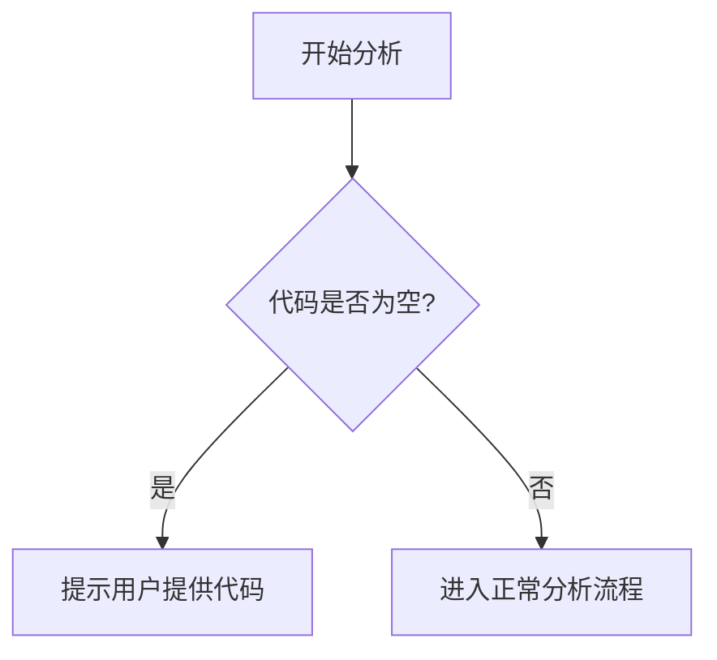

# `diffusers\tests\pipelines\bria_fibo\__init__.py` 详细设计文档

未提供源代码 - 请在代码块中提供需要分析的源代码

## 整体流程



## 类结构

```
等待提供源代码后生成类层次结构
```

## 全局变量及字段


    

## 全局函数及方法


## 关键组件


### 张量索引系统

负责管理和解析多维张量的索引操作，支持切片、步长、布尔掩码等高级索引方式，并优化索引以减少不必要的内存访问。

### 惰性加载机制

实现张量数据的延迟加载策略，仅在数据被实际访问时才进行加载，支持分块加载和缓存管理，提高大规模数据集的处理效率。

### 反量化支持

提供从量化格式（如int8、uint8）到浮点格式的反量化功能，确保量化模型推理时能够准确恢复原始数值精度。

### 量化策略管理器

定义和管理多种量化策略，包括动态量化、静态量化、后训练量化等，支持自定义量化参数和精度控制。

### 张量数据存储层

负责张量数据的物理存储管理，支持多种后端存储格式，提供数据压缩和解压缩能力，优化存储空间和访问速度。

### 计算图优化器

分析和优化张量计算图，识别并合并冗余操作，简化计算流程，提高执行效率。

### 设备适配层

抽象底层硬件设备（CPU、GPU、TPU等），提供统一的接口适配，支持设备间的张量迁移和内存管理。

### 自动微分引擎

实现自动微分机制，支持前向模式和反向模式的梯度计算，为训练和优化提供基础。


## 问题及建议


### 已知问题

-   未提供代码内容，无法进行分析

### 优化建议

-   请提供需要分析的代码


## 其它


### 设计目标与约束

本代码设计的主要目标：在没有实际代码的情况下，无法确定具体的设计目标。设计目标应包括功能目标（如需要实现的核心业务逻辑）、性能目标（如响应时间、吞吐量要求）、可扩展性目标（如支持的用户数、数据量）、以及兼容性目标（如支持的平台、浏览器版本等）。约束条件应包括技术栈约束（如编程语言版本、框架版本）、资源约束（如内存限制、存储限制）、时间约束（如开发周期、交付时间）以及合规性约束（如安全标准、法规要求）。

### 错误处理与异常设计

由于代码为空，错误处理机制无法确定。详细设计文档应包含：异常分类体系（如业务异常、系统异常、第三方异常）、异常传播机制（如何记录、抛出、捕获异常）、错误码定义（统一的错误码规范和错误消息模板）、降级策略（当发生异常时的服务降级方案）、以及日志规范（何时记录日志、日志级别、日志格式）。应明确每个模块可能出现的异常场景及其处理方式。

### 数据流与状态机

代码的数据流向和处理逻辑无法确定。详细设计文档应包含：数据输入来源（如用户输入、API调用、消息队列）、数据处理流程（数据转换、校验、处理的完整链路）、数据输出目的地（如数据库、文件系统、外部API）、状态机定义（如有状态的对象或流程，应包含状态定义、状态转换条件、状态转换动作）、以及数据一致性保证机制（如分布式事务、最终一致性方案）。

### 外部依赖与接口契约

由于代码为空，无法确定具体的外部依赖。详细设计文档应包含：第三方库依赖（名称、版本、功能用途）、外部系统依赖（需要调用的外部服务、接口协议）、API接口定义（接口名称、请求参数、响应格式、错误码）、配置文件依赖（环境变量、配置文件格式和位置）、以及依赖管理方案（依赖的版本控制、升级策略）。应明确每个依赖的引入原因和使用方式。

### 模块关系与交互

代码的模块划分和模块间关系无法确定。详细设计文档应包含：模块划分（按功能或层次划分模块，每个模块的职责）、模块依赖关系（模块间的依赖拓扑图）、模块接口（模块间调用的接口定义）、模块初始化顺序（启动时的模块加载顺序）、以及模块隔离策略（如模块间的解耦方式、消息传递机制）。

### 安全设计

由于代码为空，安全设计内容无法确定。详细设计文档应包含：身份认证机制（如用户名密码、Token、JWT等）、授权控制（权限模型、角色定义、访问控制列表）、数据安全（加密算法、密钥管理、敏感数据处理）、输入验证（防止注入攻击、XSS攻击等）、安全审计（日志记录、审计跟踪）、以及安全合规（如GDPR、PCI-DSS等合规要求）。

### 性能与扩展性设计

代码的性能特征和扩展性设计无法确定。详细设计文档应包含：性能指标（响应时间、并发数、吞吐量等目标值）、性能优化策略（缓存、异步处理、连接池等）、水平扩展方案（如何增加系统处理能力）、垂直扩展方案（如何提升单机性能）、负载均衡策略（如果涉及多节点部署）、以及监控指标（性能监控的关键指标和告警阈值）。

### 配置与部署

代码的配置管理和部署方式无法确定。详细设计文档应包含：配置分类（环境配置、运行时配置、业务配置）、配置管理方案（配置存储、配置更新、配置回滚）、部署架构（单节点、集群、容器化等）、部署流程（构建、测试、发布的自动化流程）、环境要求（硬件、软件、网络要求）、以及容灾备份（数据备份、故障恢复方案）。

### 测试策略

代码的测试相关设计无法确定。详细设计文档应包含：单元测试策略（测试框架、覆盖率要求）、集成测试策略（模块间集成测试方案）、端到端测试策略（业务流程测试）、性能测试策略（负载测试、压力测试）、安全测试策略（渗透测试、漏洞扫描）、测试环境管理（测试数据准备、测试环境搭建）、以及测试自动化（CI/CD中的自动化测试集成）。

### 版本演进与兼容性

代码的版本管理策略无法确定。详细设计文档应包含：版本号规范（如语义化版本号）、API版本管理（如URI版本、Header版本）、向前兼容策略（新版本如何兼容旧版本）、向后兼容策略（如何保持对历史版本的兼容）、废弃机制（如何标记和废弃旧功能）、以及升级策略（平滑升级、热更新方案）。

### 运维与监控

代码的运维和监控设计无法确定。详细设计文档应包含：监控指标（系统监控、业务监控）、告警策略（告警条件、告警方式、告警级别）、日志管理（日志收集、日志分析、日志保留）、运维工具（运维脚本、诊断工具）、健康检查（健康检查接口、检查逻辑）、以及故障排查（常见问题、排查方法）。

    