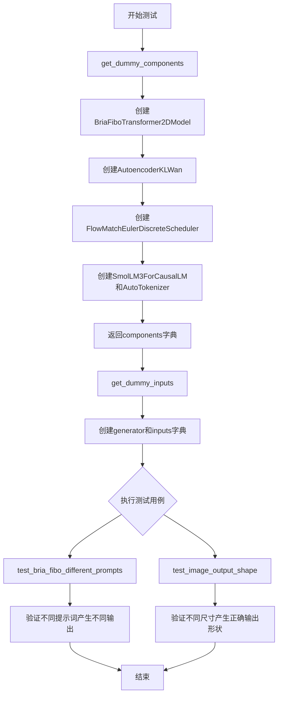
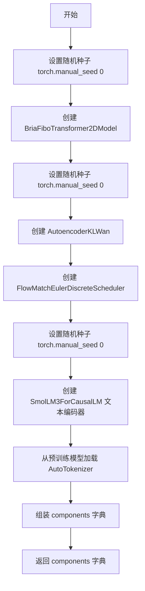
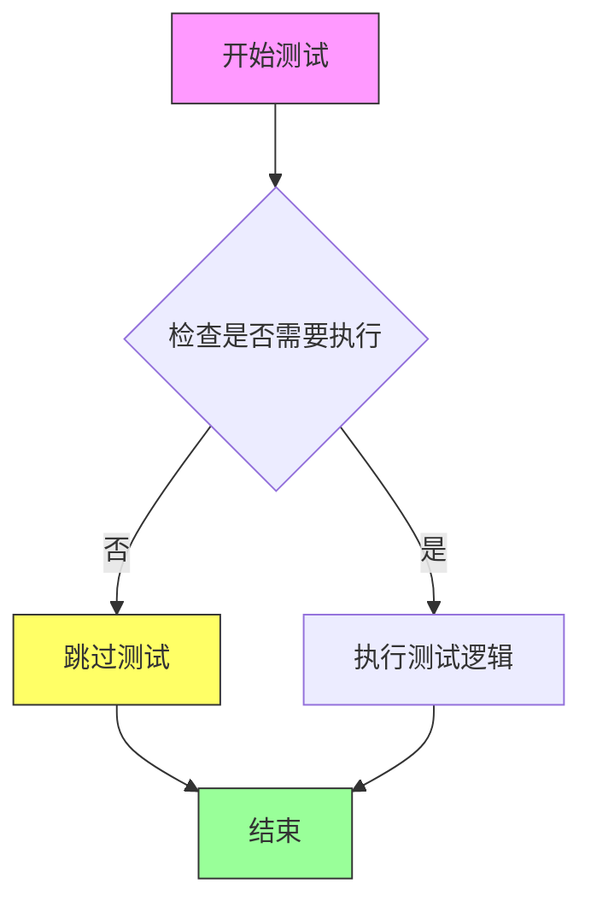
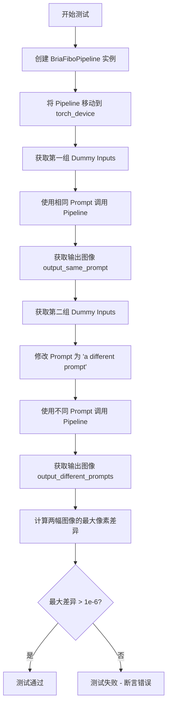
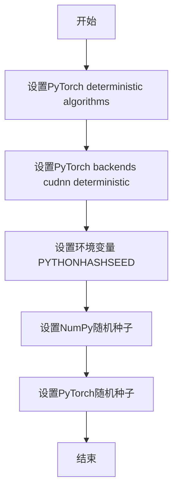
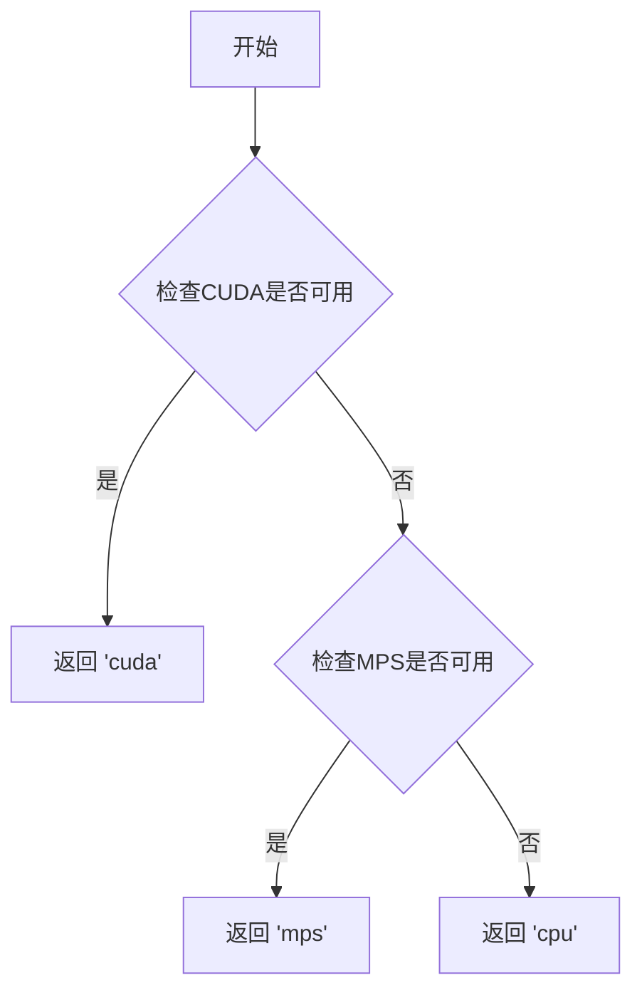
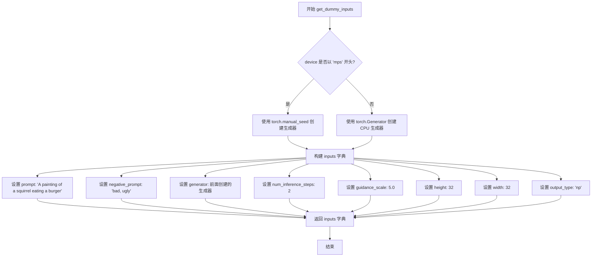
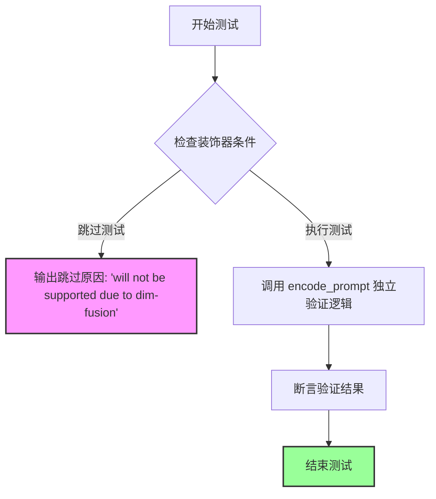
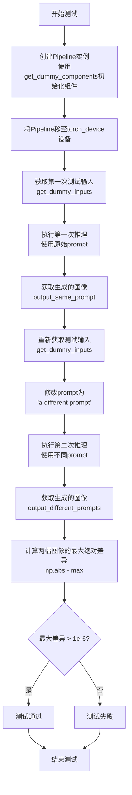

# `diffusers\tests\pipelines\bria_fibo\test_pipeline_bria_fibo.py` 详细设计文档

这是一个用于BriaFiboPipeline扩散流水线的单元测试文件，测试了图像生成功能在不同提示词和输出尺寸下的正确性，包括提示词隔离、图像输出形状验证等测试用例。

## 整体流程



## 类结构

```
unittest.TestCase
└── BriaFiboPipelineFastTests (继承PipelineTesterMixin)
    ├── get_dummy_components() - 创建测试用虚拟组件
    ├── get_dummy_inputs() - 创建测试用虚拟输入
    ├── test_encode_prompt_works_in_isolation() - 跳过测试
    ├── test_bria_fibo_different_prompts() - 测试不同提示词
    └── test_image_output_shape() - 测试图像输出形状
```

## 全局变量及字段


### `enable_full_determinism`
    
一个测试辅助函数，用于启用完全确定性以确保测试结果可复现

类型：`function`
    


### `BriaFiboPipelineFastTests.pipeline_class`
    
指定要测试的管道类为 BriaFiboPipeline

类型：`type[BriaFiboPipeline]`
    


### `BriaFiboPipelineFastTests.params`
    
管道参数集合，包含 prompt、height、width、guidance_scale

类型：`frozenset[str]`
    


### `BriaFiboPipelineFastTests.batch_params`
    
批处理参数集合，仅包含 prompt

类型：`frozenset[str]`
    


### `BriaFiboPipelineFastTests.test_xformers_attention`
    
标识是否测试 xformers 注意力机制，禁用

类型：`bool`
    


### `BriaFiboPipelineFastTests.test_layerwise_casting`
    
标识是否测试逐层类型转换，禁用

类型：`bool`
    


### `BriaFiboPipelineFastTests.test_group_offloading`
    
标识是否测试分组卸载功能，禁用

类型：`bool`
    


### `BriaFiboPipelineFastTests.supports_dduf`
    
标识管道是否支持 DDUF（Decoder-only Diffusion Upscaling Feature），不支持

类型：`bool`
    
    

## 全局函数及方法


### `BriaFiboPipelineFastTests.get_dummy_components`

该方法用于创建并返回虚拟（dummy）组件字典，包含 BriaFiboPipeline 所需的全部核心组件（transformer、vae、scheduler、text_encoder、tokenizer），以支持单元测试。

参数：
- （无，仅包含隐式 `self` 参数）

返回值：`dict`，返回包含 scheduler、text_encoder、tokenizer、transformer、vae 五个组件的字典，用于初始化 BriaFiboPipeline 进行测试。

#### 流程图



#### 带注释源码

```
def get_dummy_components(self):
    """
    创建并返回虚拟组件字典，用于测试 BriaFiboPipeline。
    所有组件使用固定随机种子确保测试可重复性。
    """
    # 设置随机种子，确保 transformer 初始化可重现
    torch.manual_seed(0)
    # 初始化 BriaFiboTransformer2DModel 变换器模型
    # 参数: patch_size=1, 通道数=16, 1层Transformer, 1层单层, 注意力头维度=8
    transformer = BriaFiboTransformer2DModel(
        patch_size=1,
        in_channels=16,
        num_layers=1,
        num_single_layers=1,
        attention_head_dim=8,
        num_attention_heads=2,
        joint_attention_dim=64,
        text_encoder_dim=32,
        pooled_projection_dim=None,
        axes_dims_rope=[0, 4, 4],
    )

    # 设置随机种子，确保 VAE 初始化可重现
    torch.manual_seed(0)
    # 初始化 AutoencoderKLWan 变分自编码器
    # 参数: base_dim=160, 解码器基础维度=256, 2个残差块, 输出通道=12
    vae = AutoencoderKLWan(
        base_dim=160,
        decoder_base_dim=256,
        num_res_blocks=2,
        out_channels=12,
        patch_size=2,
        scale_factor_spatial=16,
        scale_factor_temporal=4,
        temperal_downsample=[False, True, True],
        z_dim=16,
    )

    # 创建 FlowMatchEulerDiscreteScheduler 调度器
    scheduler = FlowMatchEulerDiscreteScheduler()

    # 设置随机种子，确保文本编码器初始化可重现
    torch.manual_seed(0)
    # 初始化 SmolLM3ForCausalLM 文本编码器
    # 使用 SmolLM3Config 配置，hidden_size=32
    text_encoder = SmolLM3ForCausalLM(SmolLM3Config(hidden_size=32))
    # 从预训练模型加载 T5 类型的分词器
    tokenizer = AutoTokenizer.from_pretrained("hf-internal-testing/tiny-random-t5")

    # 组装组件字典
    components = {
        "scheduler": scheduler,           # 调度器
        "text_encoder": text_encoder,      # 文本编码器
        "tokenizer": tokenizer,            # 分词器
        "transformer": transformer,       # 变换器模型
        "vae": vae,                        # VAE 模型
    }
    return components
```


### `BriaFiboPipelineFastTests.get_dummy_inputs`

该方法用于生成虚拟输入参数，为测试 BriaFiboPipeline 提供必要的输入数据，包括提示词、负提示词、生成器、推理步数、引导系数、图像尺寸和输出类型。

参数：

- `self`：类实例本身（隐式参数），BriaFiboPipelineFastTests，表示调用该方法的类实例
- `device`：`str` 或 `torch.device`，指定计算设备，用于判断是否为 MPS 设备以决定生成器的创建方式
- `seed`：`int`（默认值：0），随机种子，用于生成器的初始化，确保测试的可重复性

返回值：`dict`，返回包含虚拟输入参数的字典，包括 prompt、negative_prompt、generator、num_inference_steps、guidance_scale、height、width 和 output_type，用于传递给 pipeline 的调用

#### 流程图

```mermaid
flowchart TD
    A[开始] --> B{device 是否以 'mps' 开头?}
    B -->|是| C[使用 torch.manual_seed(seed) 创建生成器]
    B -->|否| D[创建 CPU 生成器 torch.Generator(device='cpu').manual_seed(seed)]
    C --> E[构建输入字典 inputs]
    D --> E
    E --> F[返回 inputs 字典]
    F --> G[结束]
```

#### 带注释源码

```python
def get_dummy_inputs(self, device, seed=0):
    """
    生成用于测试的虚拟输入参数。
    
    参数:
        device: 计算设备，用于判断是否为 MPS 设备
        seed: 随机种子，确保测试结果可重复
    
    返回:
        包含虚拟输入的字典，用于 pipeline 调用
    """
    # 判断设备是否为 Apple MPS (Metal Performance Shaders)
    if str(device).startswith("mps"):
        # MPS 设备使用 torch.manual_seed 直接设置种子
        generator = torch.manual_seed(seed)
    else:
        # 其他设备（如 CPU、CUDA）使用 CPU 生成器并设置种子
        generator = torch.Generator(device="cpu").manual_seed(seed)

    # 构建虚拟输入字典，包含 pipeline 所需的各种参数
    inputs = {
        "prompt": "{'text': 'A painting of a squirrel eating a burger'}",  # 输入提示词
        "negative_prompt": "bad, ugly",  # 负向提示词，指定不希望出现的特征
        "generator": generator,  # 随机生成器，用于控制输出随机性
        "num_inference_steps": 2,  # 推理步数，扩散模型的迭代次数
        "guidance_scale": 5.0,  # 引导系数，控制文本提示对生成的影响程度
        "height": 32,  # 输出图像高度（像素）
        "width": 32,  # 输出图像宽度（像素）
        "output_type": "np",  # 输出类型，np 表示返回 NumPy 数组
    }
    return inputs
```


### `BriaFiboPipelineFastTests.test_encode_prompt_works_in_isolation`

该方法是一个测试用例，用于验证 `encode_prompt` 方法能否在隔离环境中正常工作。由于维度融合（dim-fusion）相关功能不被支持，该测试被跳过。

参数：

- 无

返回值：`None`，无返回值（方法体为空，只有 `pass` 语句）

#### 流程图



#### 带注释源码

```python
@unittest.skip(reason="will not be supported due to dim-fusion")
def test_encode_prompt_works_in_isolation(self):
    """
    测试 encode_prompt 方法是否能在隔离环境中正常工作。
    
    该测试用例被跳过，原因是该功能与 dim-fusion（维度融合）特性相关，
    而该特性目前不被支持。
    
    参数:
        self: BriaFiboPipelineFastTests 实例
        
    返回值:
        None
    """
    pass  # 测试被跳过，不执行任何逻辑
```


### `BriaFiboPipelineFastTests.test_bria_fibo_different_prompts`

该测试方法验证 BriaFiboPipeline 能够针对不同的文本提示（prompt）生成具有显著差异的图像输出，确保模型对输入提示的响应具有区分度，而非生成相同的图像。

参数：

- `self`：`BriaFiboPipelineFastTests`，测试类实例本身，包含测试所需的上下文和辅助方法

返回值：`None`，该方法为单元测试方法，无返回值，通过断言验证逻辑正确性

#### 流程图



#### 带注释源码

```python
def test_bria_fibo_different_prompts(self):
    """
    测试 BriaFiboPipeline 对不同 prompt 的响应能力
    
    验证当输入不同的文本提示时，模型生成的图像应有显著差异，
    确保模型能够正确理解和响应不同的文本条件。
    """
    # 步骤1: 使用 get_dummy_components() 获取虚拟组件配置
    # 包括: transformer, vae, scheduler, text_encoder, tokenizer
    pipe = self.pipeline_class(**self.get_dummy_components())
    
    # 步骤2: 将 Pipeline 移动到指定的计算设备 (torch_device)
    pipe = pipe.to(torch_device)
    
    # 步骤3: 获取第一组虚拟输入，包含默认的 squirrel 绘画提示
    inputs = self.get_dummy_inputs(torch_device)
    
    # 步骤4: 使用相同 prompt 调用 Pipeline 生成第一幅图像
    # prompt 内容为: "{'text': 'A painting of a squirrel eating a burger'}"
    output_same_prompt = pipe(**inputs).images[0]
    
    # 步骤5: 重新获取新的虚拟输入对象（重置随机种子等）
    inputs = self.get_dummy_inputs(torch_device)
    
    # 步骤6: 修改 prompt 为完全不同的内容
    inputs["prompt"] = "a different prompt"
    
    # 步骤7: 使用不同 prompt 调用 Pipeline 生成第二幅图像
    output_different_prompts = pipe(**inputs).images[0]
    
    # 步骤8: 使用 NumPy 计算两幅图像之间的最大绝对像素差值
    max_diff = np.abs(output_same_prompt - output_different_prompts).max()
    
    # 步骤9: 断言验证 - 确保不同 prompt 产生的图像存在显著差异
    # 阈值 1e-6 用于过滤浮点数精度误差，确保差异具有实际意义
    assert max_diff > 1e-6
```


### `BriaFiboPipelineFastTests.test_image_output_shape`

该测试方法用于验证BriaFiboPipeline在不同高度和宽度参数下输出的图像形状是否符合预期，通过遍历(32,32)、(64,64)、(32,64)三组尺寸组合来确保管道正确处理各种分辨率的图像输出。

参数：

- `self`：`unittest.TestCase`，隐含的测试类实例，表示当前的测试用例对象

返回值：`None`，该方法为测试函数，通过assert断言验证图像形状，不返回任何值

#### 流程图

```mermaid
flowchart TD
    A[开始测试 test_image_output_shape] --> B[创建Pipeline实例并加载虚拟组件]
    B --> C[将Pipeline移至 torch_device]
    C --> D[获取虚拟输入参数]
    D --> E[定义测试尺寸列表: [(32,32), (64,64), (32,64)]]
    E --> F{遍历 height_width_pairs}
    F -->|取出 height, width| G[更新 inputs 中的 height 和 width 参数]
    G --> H[调用 pipeline 生成图像]
    H --> I[获取输出图像的形状]
    I --> J{断言输出尺寸是否匹配预期}
    J -->|是| K{是否还有更多尺寸}
    J -->|否| L[测试失败: 抛出 AssertionError]
    K -->|是| F
    K -->|否| M[测试通过]
    M --> N[结束]
```

#### 带注释源码

```python
def test_image_output_shape(self):
    """
    测试BriaFiboPipeline在不同高度和宽度参数下输出的图像形状是否符合预期
    """
    # 使用虚拟组件创建Pipeline实例
    pipe = self.pipeline_class(**self.get_dummy_components())
    
    # 将Pipeline移动到指定的计算设备（如CPU/CUDA）
    pipe = pipe.to(torch_device)
    
    # 获取虚拟输入参数，包括提示词、生成器、推理步数等
    inputs = self.get_dummy_inputs(torch_device)
    
    # 定义要测试的height-width尺寸对列表
    height_width_pairs = [(32, 32), (64, 64), (32, 64)]
    
    # 遍历每组尺寸进行测试
    for height, width in height_width_pairs:
        # 设置预期的输出高度和宽度
        expected_height = height
        expected_width = width
        
        # 更新输入参数中的height和width
        inputs.update({"height": height, "width": width})
        
        # 调用pipeline生成图像，获取第一张图像
        image = pipe(**inputs).images[0]
        
        # 从图像数组中提取高度和宽度维度
        output_height, output_width, _ = image.shape
        
        # 断言输出图像的尺寸是否与预期尺寸匹配
        assert (output_height, output_width) == (expected_height, expected_width)
```


### `enable_full_determinism`

该函数用于启用PyTorch和NumPy的完全确定性模式，通过设置随机种子和环境变量来确保测试和实验结果的可重复性。

参数：

- 无参数

返回值：`None`，无返回值（该函数执行副作用操作，不返回任何值）

#### 流程图



#### 带注释源码

```python
def enable_full_determinism(seed: int = 0, extra_seed: int = 42):
    """
    启用完全确定性模式，确保每次运行结果完全一致。
    
    参数:
        seed: PyTorch和NumPy的主要随机种子，默认为0
        extra_seed: 额外的随机种子，用于需要多个随机源的场景，默认为42
    
    返回值:
        无返回值
    """
    import os
    import random
    import numpy as np
    import torch
    
    # 1. 设置环境变量确保Python哈希种子确定性
    os.environ["PYTHONHASHSEED"] = str(seed)
    
    # 2. 设置Python内置random模块的随机种子
    random.seed(seed)
    
    # 3. 设置NumPy的随机种子
    np.random.seed(seed)
    
    # 4. 设置PyTorch的随机种子
    torch.manual_seed(seed)
    
    # 5. 如果使用CUDA，设置所有GPU的种子
    if torch.cuda.is_available():
        torch.cuda.manual_seed(seed)
        torch.cuda.manual_seed_all(seed)
    
    # 6. 强制PyTorch使用确定性算法（可能影响性能）
    torch.backends.cudnn.deterministic = True
    torch.backends.cudnn.benchmark = False
    
    # 7. 启用PyTorch的完全确定性模式
    torch.use_deterministic_algorithms(True, warn_only=True)
    
    # 8. 设置Dataloader的worker种子
    # （如果使用DataLoader，需要设置 worker_init_fn）
```


### `torch_device`

获取当前测试环境可用的设备（cuda、mps 或 cpu），用于将模型和数据移动到正确的计算设备上进行测试。

参数： 无

返回值：`str`，返回可用的设备字符串，如 `"cuda"`、`"mps"` 或 `"cpu"`

#### 流程图



#### 带注释源码

```
# 注意：torch_device 是从 testing_utils 模块导入的全局变量/函数
# 其实现大致如下（基于使用方式推断）：

def get_torch_device():
    """
    返回当前测试环境可用的设备。
    
    优先级：cuda > mps > cpu
    
    Returns:
        str: 可用的设备字符串
    """
    import torch
    
    if torch.cuda.is_available():
        return "cuda"
    elif torch.backends.mps.is_available():
        return "mps"
    else:
        return "cpu"

# 在测试文件中的使用方式：
from ...testing_utils import torch_device

# 示例调用
pipe = pipe.to(torch_device)  # 将模型移动到可用设备
inputs = self.get_dummy_inputs(torch_device)  # 使用设备生成测试输入
```


### `BriaFiboPipelineFastTests.get_dummy_components`

该方法用于生成虚拟（测试用）组件字典，为图像生成管道测试提供所需的模型组件，包括变换器、VAE、调度器、文本编码器和分词器。

参数：

- 该方法无显式参数（仅包含隐式参数 `self`）

返回值：`Dict[str, Any]`，返回包含调度器、文本编码器、分词器、变换器和 VAE 的组件字典，用于实例化 `BriaFiboPipeline` 进行单元测试。

#### 流程图

```mermaid
flowchart TD
    A[开始] --> B[设置随机种子 torch.manual_seed(0)]
    B --> C[创建 BriaFiboTransformer2DModel]
    C --> D[设置随机种子 torch.manual_seed(0)]
    D --> E[创建 AutoencoderKLWan]
    E --> F[创建 FlowMatchEulerDiscreteScheduler]
    F --> G[设置随机种子 torch.manual_seed(0)]
    G --> H[创建 SmolLM3ForCausalLM]
    H --> I[从预训练模型加载 AutoTokenizer]
    I --> J[组装 components 字典]
    J --> K[返回 components]
```

#### 带注释源码

```python
def get_dummy_components(self):
    """
    生成用于测试的虚拟组件字典。
    包含图像生成管道所需的所有模型组件。
    """
    # 设置随机种子以确保测试可复现性
    torch.manual_seed(0)
    
    # 创建 BriaFiboTransformer2DModel 变换器模型
    # 参数配置：
    # - patch_size: 1, 图像分块大小
    # - in_channels: 16, 输入通道数
    # - num_layers: 1, 层数
    # - num_single_layers: 1, 单独层数
    # - attention_head_dim: 8, 注意力头维度
    # - num_attention_heads: 2, 注意力头数量
    # - joint_attention_dim: 64, 联合注意力维度
    # - text_encoder_dim: 32, 文本编码器维度
    # - pooled_projection_dim: None, 池化投影维度
    # - axes_dims_rope: [0, 4, 4], RoPE 轴维度
    transformer = BriaFiboTransformer2DModel(
        patch_size=1,
        in_channels=16,
        num_layers=1,
        num_single_layers=1,
        attention_head_dim=8,
        num_attention_heads=2,
        joint_attention_dim=64,
        text_encoder_dim=32,
        pooled_projection_dim=None,
        axes_dims_rope=[0, 4, 4],
    )

    # 重新设置随机种子以确保 VAE 模型的可复现性
    torch.manual_seed(0)
    
    # 创建 AutoencoderKLWan VAE 模型
    # 参数配置：
    # - base_dim: 160, 基础维度
    # - decoder_base_dim: 256, 解码器基础维度
    # - num_res_blocks: 2, 残差块数量
    # - out_channels: 12, 输出通道数
    # - patch_size: 2, 分块大小
    # - scale_factor_spatial: 16, 空间缩放因子
    # - scale_factor_temporal: 4, 时间缩放因子
    # - temperal_downsample: [False, True, True], 时间下采样配置
    # - z_dim: 16, 潜在空间维度
    vae = AutoencoderKLWan(
        base_dim=160,
        decoder_base_dim=256,
        num_res_blocks=2,
        out_channels=12,
        patch_size=2,
        scale_factor_spatial=16,
        scale_factor_temporal=4,
        temperal_downsample=[False, True, True],
        z_dim=16,
    )

    # 创建 FlowMatchEulerDiscreteScheduler 调度器
    # 用于图像生成过程中的噪声调度
    scheduler = FlowMatchEulerDiscreteScheduler()

    # 重新设置随机种子以确保文本编码器的可复现性
    torch.manual_seed(0)
    
    # 创建 SmolLM3ForCausalLM 文本编码器
    # 使用 SmolLM3Config 配置隐藏层大小为 32
    text_encoder = SmolLM3ForCausalLM(SmolLM3Config(hidden_size=32))
    
    # 从预训练模型加载小型随机 T5 分词器
    # 用于将文本提示转换为模型输入 token
    tokenizer = AutoTokenizer.from_pretrained("hf-internal-testing/tiny-random-t5")

    # 组装组件字典，包含管道所需的所有模型和配置
    components = {
        "scheduler": scheduler,
        "text_encoder": text_encoder,
        "tokenizer": tokenizer,
        "transformer": transformer,
        "vae": vae,
    }
    
    # 返回完整的组件字典
    return components
```


### `BriaFiboPipelineFastTests.get_dummy_inputs`

该方法为 BriaFiboPipeline 单元测试生成虚拟输入参数字典，根据设备类型（MPS 或其他）创建随机数生成器，并配置推理所需的各项参数（提示词、负提示词、推理步数、引导系数、输出尺寸等），用于验证图像生成管道的功能正确性。

参数：

- `self`：`BriaFiboPipelineFastTests`，TestCase 实例，隐式参数，用于访问测试类的其他方法
- `device`：`Union[str, torch.device]`，目标设备，用于判断是否为 MPS 设备以采用不同的随机数生成策略
- `seed`：`int`，随机种子，默认为 0，用于确保测试结果的可复现性

返回值：`Dict[str, Any]`，返回包含以下键的字典：
- `prompt`：提示词文本
- `negative_prompt`：负提示词文本
- `generator`：PyTorch 随机数生成器
- `num_inference_steps`：推理步数
- `guidance_scale`：引导系数
- `height`：输出图像高度
- `width`：输出图像宽度
- `output_type`：输出类型

#### 流程图



#### 带注释源码

```python
def get_dummy_inputs(self, device, seed=0):
    """
    生成用于测试 BriaFiboPipeline 的虚拟输入参数。
    
    参数:
        device: 目标设备，用于判断是否为 MPS 设备
        seed: 随机种子，确保测试可复现
    
    返回:
        包含所有推理所需参数的字典
    """
    
    # 判断设备类型，MPS 设备需要使用不同的随机数生成方式
    if str(device).startswith("mps"):
        # MPS 设备使用 torch.manual_seed 直接设置种子
        generator = torch.manual_seed(seed)
    else:
        # 其他设备创建 CPU 上的 Generator 对象并设置种子
        generator = torch.Generator(device="cpu").manual_seed(seed)

    # 构建输入参数字典，包含图像生成所需的所有配置
    inputs = {
        "prompt": "{'text': 'A painting of a squirrel eating a burger'}",  # 正向提示词
        "negative_prompt": "bad, ugly",  # 负向提示词，用于引导模型避免生成不良特征
        "generator": generator,  # 随机数生成器，确保输出可复现
        "num_inference_steps": 2,  # 推理步数，较小的值用于快速测试
        "guidance_scale": 5.0,  # Classifier-free guidance 强度
        "height": 32,  # 输出图像高度（测试用小尺寸）
        "width": 32,  # 输出图像宽度（测试用小尺寸）
        "output_type": "np",  # 输出格式为 NumPy 数组
    }
    
    # 返回完整的输入参数字典供 pipeline 调用
    return inputs
```


### `BriaFiboPipelineFastTests.test_encode_prompt_works_in_isolation`

该测试方法用于验证 `encode_prompt` 方法能够独立工作，不受其他因素干扰。由于实现被标记为跳过（dim-fusion 不支持），该测试目前不执行任何验证逻辑。

参数：

- `self`：`BriaFiboPipelineFastTests`，隐式参数，表示测试类实例本身

返回值：`None`，该方法为空实现，不返回任何值

#### 流程图



#### 带注释源码

```python
@unittest.skip(reason="will not be supported due to dim-fusion")
def test_encode_prompt_works_in_isolation(self):
    """
    测试 encode_prompt 方法能够独立工作。
    
    该测试原本用于验证 BriaFiboPipeline 的 prompt 编码功能可以
    在隔离环境中正常运行，不依赖其他管道组件的副作用。
    
    注意：由于 dim-fusion 功能不被支持，此测试已被跳过。
    """
    pass  # 测试逻辑未实现，方法体为空
```


### `BriaFiboPipelineFastTests.test_bria_fibo_different_prompts`

这是一个单元测试方法，用于验证 BriaFiboPipeline 图像生成管道在接收不同 prompt 时能够产生不同的输出结果。测试通过比较两个不同 prompt 生成的图像差异，断言最大差异大于设定的阈值（1e-6），从而确保管道对输入文本的敏感性。

参数：

- `self`：隐式参数，类型为 `BriaFiboPipelineFastTests`，代表测试类实例本身

返回值：`None`，无返回值（测试方法）

#### 流程图



#### 带注释源码

```python
def test_bria_fibo_different_prompts(self):
    """测试不同prompt是否产生不同的图像输出"""
    
    # 步骤1: 创建Pipeline实例
    # 使用get_dummy_components方法获取虚拟组件（transformer, vae, scheduler, text_encoder, tokenizer）
    pipe = self.pipeline_class(**self.get_dummy_components())
    
    # 步骤2: 将Pipeline移至指定的计算设备（torch_device）
    pipe = pipe.to(torch_device)
    
    # 步骤3: 获取第一次测试的虚拟输入参数
    # 包括: prompt, negative_prompt, generator, num_inference_steps, guidance_scale, height, width, output_type
    inputs = self.get_dummy_inputs(torch_device)
    
    # 步骤4: 使用原始prompt执行推理
    # prompt = "{'text': 'A painting of a squirrel eating a burger'}"
    # 返回结果包含images数组，取第一张图像
    output_same_prompt = pipe(**inputs).images[0]
    
    # 步骤5: 重新获取虚拟输入（重置generator seed）
    inputs = self.get_dummy_inputs(torch_device)
    
    # 步骤6: 修改prompt为不同的内容
    inputs["prompt"] = "a different prompt"
    
    # 步骤7: 使用不同的prompt执行推理
    output_different_prompts = pipe(**inputs).images[0]
    
    # 步骤8: 计算两次输出图像的最大绝对差异
    max_diff = np.abs(output_same_prompt - output_different_prompts).max()
    
    # 步骤9: 断言最大差异大于阈值（确保不同prompt产生不同输出）
    assert max_diff > 1e-6
```


### `BriaFiboPipelineFastTests.test_image_output_shape`

该测试方法用于验证 BriaFiboPipeline 图像生成管线在不同输入高度和宽度组合下能否正确输出对应尺寸的图像结果。

参数：

- `self`：实例方法隐式参数，类型为 `BriaFiboPipelineFastTests`，表示测试类实例本身

返回值：`None`，该方法通过断言验证图像输出形状，不返回任何值

#### 流程图

```mermaid
flowchart TD
    A[开始测试] --> B[创建Pipeline实例]
    B --> C[将Pipeline移至torch_device设备]
    C --> D[获取虚拟输入参数]
    D --> E[定义测试尺寸对: [(32,32), (64,64), (32,64)]]
    E --> F{遍历尺寸对}
    F -->|当前尺寸对| G[更新inputs中的height和width]
    G --> H[执行Pipeline生成图像]
    H --> I[从结果中获取图像]
    I --> J[提取图像的height和width维度]
    J --> K{断言输出尺寸是否匹配}
    K -->|匹配| L{是否还有更多尺寸对}
    K -->|不匹配| M[抛出断言错误]
    L -->|是| F
    L -->|否| N[测试通过]
    M --> O[测试失败]
```

#### 带注释源码

```python
def test_image_output_shape(self):
    """
    测试图像输出形状验证
    验证 Pipeline 能否根据不同高度和宽度参数生成正确尺寸的图像
    """
    # 步骤1: 使用虚拟组件创建 Pipeline 实例
    # 通过 get_dummy_components() 获取测试所需的虚拟组件配置
    pipe = self.pipeline_class(**self.get_dummy_components())
    
    # 步骤2: 将 Pipeline 移至指定的计算设备 (如 CUDA 或 CPU)
    pipe = pipe.to(torch_device)
    
    # 步骤3: 获取用于测试的虚拟输入参数
    # 包含 prompt, negative_prompt, generator, num_inference_steps 等
    inputs = self.get_dummy_inputs(torch_device)
    
    # 步骤4: 定义测试用的高度-宽度组合列表
    # 测试三种不同的尺寸: 32x32, 64x64, 32x64
    height_width_pairs = [(32, 32), (64, 64), (32, 64)]
    
    # 步骤5: 遍历每一种尺寸组合进行测试
    for height, width in height_width_pairs:
        # 设置期望的输出高度和宽度
        expected_height = height
        expected_width = width
        
        # 更新输入参数中的高度和宽度
        inputs.update({"height": height, "width": width})
        
        # 执行 Pipeline 生成图像
        # **inputs 将字典解包为关键字参数传递给 Pipeline
        image = pipe(**inputs).images[0]
        
        # 从生成的图像中提取高度和宽度维度
        # 图像形状为 [height, width, channels]，取前两个维度
        output_height, output_width, _ = image.shape
        
        # 断言验证输出图像的尺寸是否与预期相符
        assert (output_height, output_width) == (expected_height, expected_width)
```

## 关键组件


### BriaFiboPipeline

BriaFiboPipeline 是一个图像生成扩散管道，用于根据文本提示生成图像，集成了Transformer模型、VAE解码器、文本编码器和流匹配调度器。

### BriaFiboTransformer2DModel

BriaFiboTransformer2DModel 是基于Transformer的2D图像生成模型，支持patch嵌入、ROPE位置编码和联合注意力机制，用于在潜在空间中进行图像生成。

### AutoencoderKLWan

AutoencoderKLWan 是基于KL散度的Wan VAE模型，用于将图像编码到潜在空间并从潜在空间解码恢复图像，支持时空下采样。

### FlowMatchEulerDiscreteScheduler

FlowMatchEulerDiscreteScheduler 是基于欧拉离散方法的流匹配调度器，用于控制扩散过程中的噪声调度和图像生成步骤。

### SmolLM3ForCausalLM

SmolLM3ForCausalLM 是用于文本编码的因果语言模型，将输入文本转换为语言表示向量，供扩散模型使用。

### PipelineTesterMixin

PipelineTesterMixin 是管道测试的混入类，提供了通用的测试方法和接口，用于验证扩散管道的功能和输出正确性。

### test_bria_fibo_different_prompts

测试方法，验证管道对不同文本提示产生不同的图像输出，确保文本到图像的生成具有语义区分性。

### test_image_output_shape

测试方法，验证管道在不同高度和宽度组合下输出的图像形状是否符合预期，确保图像尺寸控制正确。


## 问题及建议


### 已知问题

- **测试数据不一致风险**：`get_dummy_components` 中 `text_encoder` 使用 `SmolLM3ForCausalLM`，但 `tokenizer` 却加载的是 T5 模型的 "hf-internal-testing/tiny-random-t5"，存在模型架构不匹配问题，可能导致文本编码时出现潜在错误
- **被跳过的测试**：`test_encode_prompt_works_in_isolation` 被 `@unittest.skip` 装饰器永久跳过，理由是"will not be supported due to dim-fusion"，表明该功能未实现但可能是预期行为
- **测试用例不完整**：`test_image_output_shape` 仅验证输出图像的形状（height x width），未验证图像内容是否为有效数据（如检查是否为 NaN 或全零）
- **随机种子管理分散**：多处使用 `torch.manual_seed(0)` 硬编码，缺乏统一的随机种子管理机制，不利于问题复现
- **设备兼容性特殊处理**：`get_dummy_inputs` 中对 MPS 设备有特殊逻辑（使用 `torch.manual_seed` 而非 `Generator`），增加了代码复杂度且可能导致行为不一致
- **参数化测试缺失**：`height_width_pairs` 使用硬编码列表而非参数化测试框架，扩展性差

### 优化建议

- 统一文本编码器和分词器的模型架构，使用匹配的 SmolLM3 tokenizer 或调整 text_encoder 为对应的 T5 模型
- 为跳过的测试添加明确的文档说明，如果未来需要支持则创建对应的 issue 跟踪
- 增加输出图像的有效性验证，如添加 `assert not np.isnan(image).any()` 和 `assert image.max() > 0` 等检查
- 抽取随机种子为类级别或模块级别的常量，在测试类中统一管理
- 移除设备特殊处理逻辑，统一使用 `Generator` 或在类级别处理设备差异
- 考虑使用 `@pytest.mark.parametrize` 替代硬编码的测试用例列表，提高测试可维护性

## 其它


### 设计目标与约束

本测试文件的设计目标是为BriaFiboPipeline提供快速单元测试验证，确保管道在不同prompt和图像尺寸下的正确性。约束条件包括：不支持xformers注意力、层wise casting和group offloading，不支持DDUF功能，且某些测试因维度融合问题被跳过。

### 错误处理与异常设计

测试用例使用assert语句验证输出结果，当图像尺寸不匹配或prompt相同时输出差异过小时会抛出AssertionError。对于设备相关问题（如MPS设备），测试代码进行了特殊处理，使用torch.manual_seed代替torch.Generator。测试中被跳过的功能通过@unittest.skip装饰器明确标记。

### 数据流与状态机

测试数据流：get_dummy_components()创建虚拟组件→get_dummy_inputs()生成测试输入→测试方法执行pipeline调用→验证输出。状态转换：组件初始化(组件创建)→管道实例化(pipe = pipeline_class(**components))→设备转移(pipe.to(device))→推理执行(pipe(**inputs))→结果验证(assert检查)。

### 外部依赖与接口契约

主要外部依赖包括：transformers库(AutoTokenizer, SmolLM3Config, SmolLM3ForCausalLM)、diffusers库(AutoencoderKLWan, BriaFiboPipeline, FlowMatchEulerDiscreteScheduler, BriaFiboTransformer2DModel)、numpy、torch、unittest。接口契约方面，pipeline_class必须支持prompt、height、width、guidance_scale参数，batch_params支持prompt参数，get_dummy_components返回包含scheduler、text_encoder、tokenizer、transformer、vae的字典，get_dummy_inputs返回包含prompt、negative_prompt、generator、num_inference_steps、guidance_scale、height、width、output_type的字典。

### 性能考量

测试使用最小的虚拟组件配置(num_layers=1, num_attention_heads=2)以加快测试速度。num_inference_steps设置为2以减少推理时间。测试_seed固定为0确保可重复性。

### 安全性考虑

测试代码本身为开源Apache 2.0许可，不涉及敏感数据处理。虚拟组件和输入确保测试环境隔离，不依赖外部真实模型或数据。

### 配置管理

测试配置通过类属性定义：pipeline_class指定被测管道类，params和batch_params定义接口参数集合，test_xformers_attention、test_layerwise_casting、test_group_offloading、supports_dduf标记功能支持状态。虚拟组件通过get_dummy_components方法集中管理。

### 版本兼容性

代码注释表明版权归属2024年，需与transformers和diffusers库的特定版本配合使用。enable_full_determinism()调用确保测试结果的可重复性，与torch版本相关。

### 测试策略

采用PipelineTesterMixin提供通用管道测试接口。使用虚拟组件隔离测试，避免依赖真实模型权重。测试覆盖：不同prompt处理、图像输出尺寸验证。测试方法命名遵循test_开头的unittest规范。

### 部署考虑

此测试文件为开发测试用途，不涉及生产部署。测试环境要求Python、PyTorch、transformers、diffusers、numpy等依赖库。


    