# `diffusers\tests\pipelines\bria_fibo_edit\test_pipeline_bria_fibo_edit.py` 详细设计文档

这是一个单元测试文件，用于测试 Bria AI 的图像编辑管道 BriaFiboEditPipeline 的功能，包括不同提示词处理、输出图像尺寸验证、编辑遮罩功能以及错误处理等核心功能。

## 整体流程

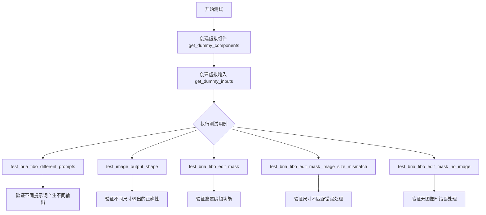

## 类结构

```
unittest.TestCase
└── BriaFiboPipelineFastTests (继承 PipelineTesterMixin)
    ├── get_dummy_components() - 创建虚拟组件
    ├── get_dummy_inputs() - 创建虚拟输入
    ├── test_bria_fibo_different_prompts() - 测试不同提示词
    ├── test_image_output_shape() - 测试输出尺寸
    ├── test_bria_fibo_edit_mask() - 测试遮罩编辑
    ├── test_bria_fibo_edit_mask_image_size_mismatch() - 测试尺寸不匹配
    └── test_bria_fibo_edit_mask_no_image() - 测试无图像错误
```

## 全局变量及字段


### `torch_device`
    
测试设备标识，从testing_utils导入

类型：`str`
    


### `enable_full_determinism`
    
启用完全确定性测试的全局函数，从testing_utils导入

类型：`function`
    


### `BriaFiboPipelineFastTests.pipeline_class`
    
被测试的管道类BriaFiboEditPipeline

类型：`type`
    


### `BriaFiboPipelineFastTests.params`
    
管道参数集合，包含prompt、height、width、guidance_scale

类型：`frozenset`
    


### `BriaFiboPipelineFastTests.batch_params`
    
批处理参数集合，仅包含prompt

类型：`frozenset`
    


### `BriaFiboPipelineFastTests.test_xformers_attention`
    
是否测试xformers注意力，默认为False

类型：`bool`
    


### `BriaFiboPipelineFastTests.test_layerwise_casting`
    
是否测试层-wise类型转换，默认为False

类型：`bool`
    


### `BriaFiboPipelineFastTests.test_group_offloading`
    
是否测试组卸载，默认为False

类型：`bool`
    


### `BriaFiboPipelineFastTests.supports_dduf`
    
是否支持DDUF，默认为False

类型：`bool`
    
    

## 全局函数及方法


### `BriaFiboPipelineFastTests.get_dummy_components`

这是一个虚拟组件生成函数，用于在测试中生成模拟的模型组件，包括变换器（transformer）、变分自编码器（VAE）、调度器（scheduler）、文本编码器（tokenizer）和分词器（tokenizer），以便进行管道测试。

参数：

- 该方法无参数

返回值：`dict`，包含虚拟组件的字典，键为 `"scheduler"`、`"text_encoder"`、`"tokenizer"`、`"transformer"` 和 `"vae"`，值分别为对应的组件实例。

#### 流程图

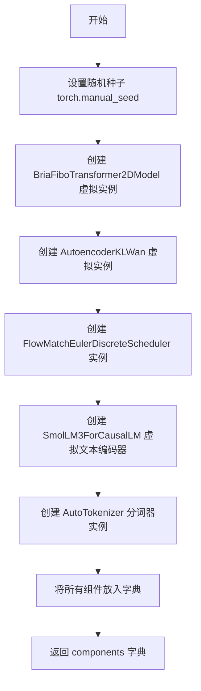

#### 带注释源码

```python
def get_dummy_components(self):
    """生成用于测试的虚拟组件字典"""
    
    # 设置随机种子以确保可重复性
    torch.manual_seed(0)
    
    # 创建虚拟Transformer模型
    # 参数：patch_size=1, in_channels=16, num_layers=1, num_single_layers=1
    # attention_head_dim=8, num_attention_heads=2, joint_attention_dim=64
    # text_encoder_dim=32, pooled_projection_dim=None, axes_dims_rope=[0, 4, 4]
    transformer = BriaFiboTransformer2DModel(
        patch_size=1,
        in_channels=16,
        num_layers=1,
        num_single_layers=1,
        attention_head_dim=8,
        num_attention_heads=2,
        joint_attention_dim=64,
        text_encoder_dim=32,
        pooled_projection_dim=None,
        axes_dims_rope=[0, 4, 4],
    )

    # 创建虚拟VAE（变分自编码器）模型
    # 参数：base_dim=80, decoder_base_dim=128, dim_mult=[1, 2, 4, 4]
    # dropout=0.0, in_channels=12, latents_mean和latents_std用于标准化
    # is_residual=True表示残差连接, num_res_blocks=2, out_channels=12
    # patch_size=2, scale_factor_spatial=16, scale_factor_temporal=4
    # temperal_downsample=[False, True, True], z_dim=16
    vae = AutoencoderKLWan(
        base_dim=80,
        decoder_base_dim=128,
        dim_mult=[1, 2, 4, 4],
        dropout=0.0,
        in_channels=12,
        latents_mean=[0.0] * 16,
        latents_std=[1.0] * 16,
        is_residual=True,
        num_res_blocks=2,
        out_channels=12,
        patch_size=2,
        scale_factor_spatial=16,
        scale_factor_temporal=4,
        temperal_downsample=[False, True, True],
        z_dim=16,
    )
    
    # 创建欧拉离散流匹配调度器
    scheduler = FlowMatchEulerDiscreteScheduler()
    
    # 创建虚拟文本编码器（使用SmolLM3模型）
    # hidden_size=32表示隐藏层维度
    text_encoder = SmolLM3ForCausalLM(SmolLM3Config(hidden_size=32))
    
    # 从预训练模型加载虚拟分词器
    # 使用huggingface测试用的小型随机T5模型
    tokenizer = AutoTokenizer.from_pretrained("hf-internal-testing/tiny-random-t5")

    # 将所有组件封装到字典中返回
    components = {
        "scheduler": scheduler,           # 调度器组件
        "text_encoder": text_encoder,     # 文本编码器组件
        "tokenizer": tokenizer,           # 分词器组件
        "transformer": transformer,       # Transformer模型组件
        "vae": vae,                       # VAE模型组件
    }
    return components
```


### `BriaFiboPipelineFastTests.get_dummy_inputs`

该方法是一个测试辅助函数，用于生成虚拟输入数据（dummy inputs），为 BriaFiboEditPipeline 图像编辑模型的单元测试提供必要的输入参数。该函数根据设备类型创建随机数生成器，并构建包含提示词、负提示词、生成器、推理步数、引导系数、图像尺寸、输出类型和示例图像的完整输入字典。

参数：

- `self`：`BriaFiboPipelineFastTests`，类实例本身
- `device`：`str` 或 `torch.device`，目标设备，用于判断是否为 MPS 设备以选择合适的随机数生成方式
- `seed`：`int`，随机种子，默认值为 `0`，用于确保测试的可重复性

返回值：`Dict[str, Any]`，包含以下键值对的字典：
- `prompt`：提示词字符串
- `negative_prompt`：负提示词字符串
- `generator`：PyTorch 随机数生成器
- `num_inference_steps`：推理步数整数
- `guidance_scale`：引导系数浮点数
- `height`：输出图像高度整数
- `width`：输出图像宽度整数
- `output_type`：输出类型字符串
- `image`：PIL Image 对象

#### 流程图

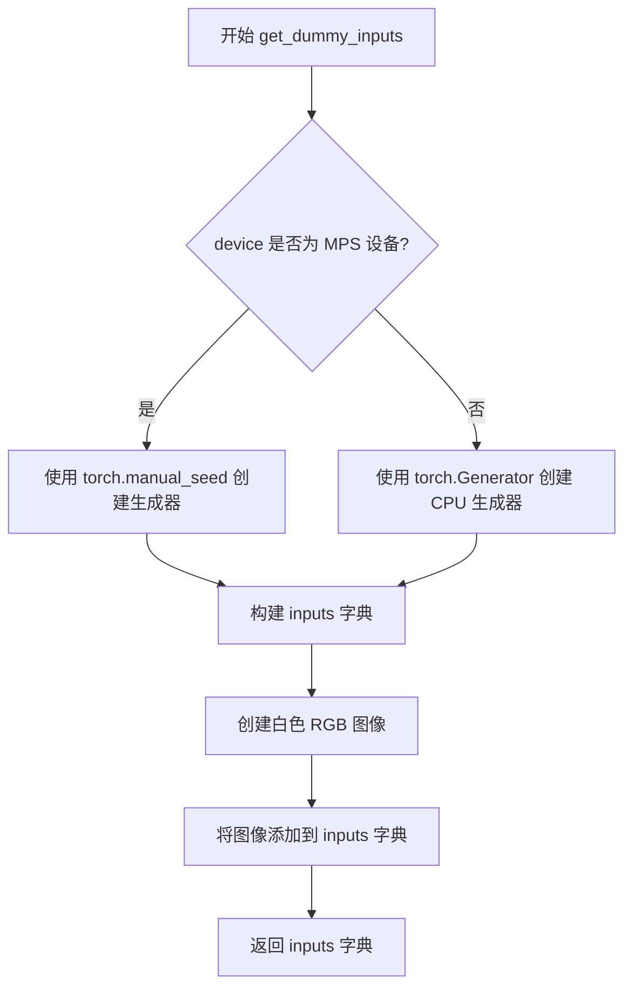

#### 带注释源码

```python
def get_dummy_inputs(self, device, seed=0):
    """
    生成虚拟输入数据，用于 BriaFiboEditPipeline 的单元测试
    
    参数:
        device: 目标设备，用于判断是否为 MPS 设备
        seed: 随机种子，确保测试可重复性
    
    返回:
        包含测试所需所有输入参数的字典
    """
    # 判断设备类型，MPS (Apple Silicon) 需要特殊处理
    if str(device).startswith("mps"):
        # MPS 设备使用 torch.manual_seed 创建生成器
        generator = torch.manual_seed(seed)
    else:
        # 其他设备（包括 CPU 和 CUDA）使用 CPU 生成器
        generator = torch.Generator(device="cpu").manual_seed(seed)
    
    # 构建输入参数字典，包含图像编辑所需的核心参数
    inputs = {
        "prompt": '{"text": "A painting of a squirrel eating a burger","edit_instruction": "A painting of a squirrel eating a burger"}',
        "negative_prompt": "bad, ugly",
        "generator": generator,
        "num_inference_steps": 2,
        "guidance_scale": 5.0,
        "height": 192,
        "width": 336,
        "output_type": "np",
    }
    
    # 创建一个白色背景的示例图像，用于测试图像编辑功能
    # 图像尺寸与 height x width 对应（注意：PIL Image 尺寸为 width x height）
    image = Image.new("RGB", (336, 192), (255, 255, 255))
    
    # 将图像添加到输入字典中
    inputs["image"] = image
    
    return inputs
```


### `BriaFiboPipelineFastTests.test_bria_fibo_different_prompts`

该测试方法用于验证 BriaFibo 编辑管道对不同提示词的敏感性，通过比较相同输入条件下不同提示词产生的输出差异，确保模型能够区分并响应不同的编辑指令。

参数：

- `self`：`BriaFiboPipelineFastTests` 类型，测试类实例本身，用于访问类方法如 `get_dummy_components()` 和 `get_dummy_inputs()`

返回值：`None`，该方法通过断言验证输出差异，不返回任何值

#### 流程图

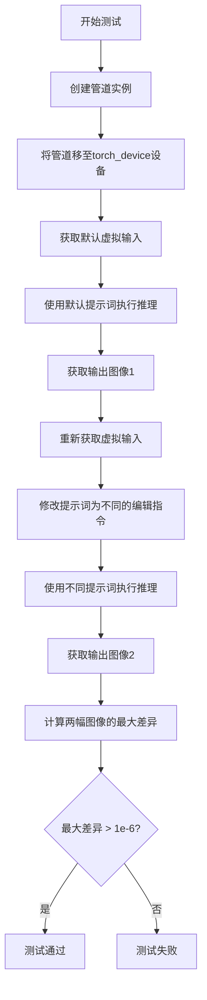

#### 带注释源码

```python
def test_bria_fibo_different_prompts(self):
    """
    测试 BriaFibo 编辑管道对不同提示词的响应差异。
    验证模型能够区分不同的编辑指令并产生不同的输出。
    """
    # 步骤1: 使用虚拟组件创建 BriaFibo 编辑管道实例
    # get_dummy_components() 返回包含 scheduler, text_encoder, tokenizer, 
    # transformer, vae 等组件的字典
    pipe = self.pipeline_class(**self.get_dummy_components())
    
    # 步骤2: 将管道移至指定的计算设备（CPU/GPU）
    pipe = pipe.to(torch_device)
    
    # 步骤3: 获取默认的虚拟输入参数
    # 包含 prompt, negative_prompt, generator, num_inference_steps,
    # guidance_scale, height, width, output_type, image 等
    inputs = self.get_dummy_inputs(torch_device)
    
    # 步骤4: 使用默认提示词执行管道推理
    # 默认 prompt 为 '{"text": "A painting of a squirrel eating a burger",
    #                 "edit_instruction": "A painting of a squirrel eating a burger"}'
    # 返回结果包含 images 数组，取第一张图像
    output_same_prompt = pipe(**inputs).images[0]
    
    # 步骤5: 重新获取虚拟输入（重置 generator 状态）
    inputs = self.get_dummy_inputs(torch_device)
    
    # 步骤6: 修改提示词为不同的编辑指令
    # 这里只修改 edit_instruction 字段，内容为 "a different prompt"
    inputs["prompt"] = {"edit_instruction": "a different prompt"}
    
    # 步骤7: 使用不同的提示词再次执行管道推理
    output_different_prompts = pipe(**inputs).images[0]
    
    # 步骤8: 计算两个输出图像之间的最大绝对差异
    max_diff = np.abs(output_same_prompt - output_different_prompts).max()
    
    # 步骤9: 断言最大差异大于设定阈值
    # 如果差异很小（≤1e-6），说明模型对不同提示词不敏感，测试失败
    assert max_diff > 1e-6
```


### `BriaFiboPipelineFastTests.test_image_output_shape`

该测试方法用于验证图像编辑管道在不同输入高度和宽度组合下，输出图像的形状是否与预期一致，确保管道正确处理图像尺寸参数。

参数：

- `self`：隐式参数，类型为 `BriaFiboPipelineFastTests`，表示测试类实例本身

返回值：`None`，测试方法无返回值，通过断言验证输出形状的正确性

#### 流程图

```mermaid
flowchart TD
    A[开始测试] --> B[创建管道实例并加载虚拟组件]
    B --> C[将管道移至 torch_device]
    C --> D[获取虚拟输入参数]
    D --> E[定义测试尺寸对列表: (32,32), (64,64), (32,64)]
    E --> F{遍历 height_width_pairs}
    F -->|取出 height, width| G[更新输入参数中的 height 和 width]
    G --> H[调用管道生成图像: pipe\*\*inputs]
    H --> I[获取输出图像的第一个结果]
    I --> J[解构图像形状为 output_height, output_width, _]
    J --> K{断言 (output_height, output_width) == (expected_height, expected_width)}
    K -->|通过| F
    K -->|失败| L[抛出 AssertionError]
    F -->|所有尺寸测试完成| M[测试通过]
```

#### 带注释源码

```python
def test_image_output_shape(self):
    """
    测试图像输出形状是否与输入的高度和宽度匹配
    
    该测试方法验证 BriaFiboEditPipeline 管道在处理不同尺寸的
    高度和宽度参数时，能够正确输出对应形状的图像。
    """
    # 使用虚拟组件创建管道实例
    # 这些虚拟组件由 get_dummy_components() 方法生成，用于测试
    pipe = self.pipeline_class(**self.get_dummy_components())
    
    # 将管道移至指定的计算设备（如 CUDA 或 CPU）
    pipe = pipe.to(torch_device)
    
    # 获取用于测试的虚拟输入参数
    inputs = self.get_dummy_inputs(torch_device)

    # 定义要测试的高度和宽度组合列表
    # 包含正方形尺寸和矩形尺寸，以全面测试管道的形状处理能力
    height_width_pairs = [(32, 32), (64, 64), (32, 64)]
    
    # 遍历每一组高度和宽度
    for height, width in height_width_pairs:
        # 设置期望的输出高度和宽度
        expected_height = height
        expected_width = width

        # 更新输入参数字典中的高度和宽度
        inputs.update({"height": height, "width": width})
        
        # 调用管道进行推理，获取生成的图像
        # images[0] 取得第一张生成的图像
        image = pipe(**inputs).images[0]
        
        # 解构图像的形状
        # 图像形状格式为 (height, width, channels)
        output_height, output_width, _ = image.shape
        
        # 断言输出图像的尺寸与期望的尺寸一致
        assert (output_height, output_width) == (expected_height, expected_width)
```


### `test_bria_fibo_edit_mask`

该测试函数用于验证 BriaFiboEditPipeline 的遮罩编辑功能，创建一个全白遮罩并验证管道能够正确处理遮罩输入并生成指定尺寸的图像输出。

参数：

- `self`：隐式参数，测试类实例本身

返回值：无返回值（`None`），作为测试函数通过断言验证结果

#### 流程图

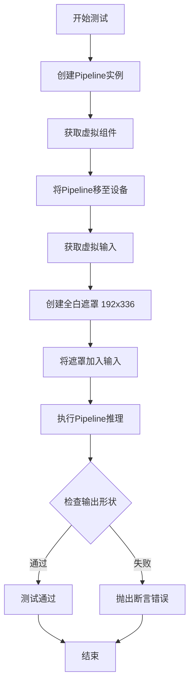

#### 带注释源码

```python
def test_bria_fibo_edit_mask(self):
    """
    测试 BriaFiboEditPipeline 的遮罩编辑功能。
    验证管道能够接受遮罩参数并生成正确尺寸的输出图像。
    """
    # 步骤1: 使用虚拟组件创建 Pipeline 实例
    # get_dummy_components() 返回包含 transformer, vae, scheduler 等的字典
    pipe = self.pipeline_class(**self.get_dummy_components())
    
    # 步骤2: 将 Pipeline 移至计算设备 (如 CUDA 或 CPU)
    pipe = pipe.to(torch_device)
    
    # 步骤3: 获取虚拟输入参数
    # 包含 prompt, negative_prompt, generator, num_inference_steps,
    # guidance_scale, height, width, output_type, image 等
    inputs = self.get_dummy_inputs(torch_device)
    
    # 步骤4: 创建测试用遮罩
    # 生成 192x336 尺寸的全白 (255) 灰度图像作为遮罩
    # np.ones((192, 336)) * 255 创建全白数组
    # Image.fromarray 将其转换为 PIL 图像
    # mode="L" 表示灰度图像
    mask = Image.fromarray((np.ones((192, 336)) * 255).astype(np.uint8), mode="L")
    
    # 步骤5: 将遮罩添加到输入参数字典
    inputs.update({"mask": mask})
    
    # 步骤6: 执行管道推理，生成图像
    # 传入所有输入参数包括遮罩
    output = pipe(**inputs).images[0]
    
    # 步骤7: 验证输出图像形状
    # 期望输出为 RGB 图像，尺寸 192x336，3 通道
    assert output.shape == (192, 336, 3)
```


### `test_bria_fibo_edit_mask_image_size_mismatch`

该测试函数用于验证 BriaFiboEditPipeline 在 mask 图像尺寸与输入图像尺寸不匹配时是否能正确抛出 ValueError 异常。

参数：

- `self`：`unittest.TestCase`，测试类的实例隐式参数

返回值：`None`，该测试函数通过 `assertRaisesRegex` 断言验证是否抛出预期异常，无显式返回值

#### 流程图

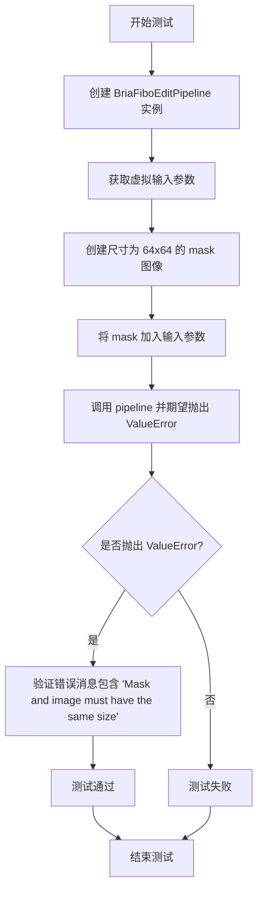

#### 带注释源码

```python
def test_bria_fibo_edit_mask_image_size_mismatch(self):
    """
    测试当 mask 图像尺寸与输入图像尺寸不匹配时，pipeline 是否正确抛出 ValueError。
    
    该测试验证了 BriaFiboEditPipeline 对 mask 尺寸的校验逻辑，确保运行时
    能够捕获尺寸不匹配的错误并给出清晰的错误提示。
    """
    # 步骤1: 使用虚拟组件创建 BriaFiboEditPipeline 实例
    # get_dummy_components() 返回包含 transformer、vae、scheduler 等的虚拟组件字典
    pipe = self.pipeline_class(**self.get_dummy_components())
    
    # 步骤2: 将 pipeline 移动到测试设备（CPU 或 CUDA）
    pipe = pipe.to(torch_device)
    
    # 步骤3: 获取虚拟输入参数
    # 默认图像尺寸为 height=192, width=336
    inputs = self.get_dummy_inputs(torch_device)
    
    # 步骤4: 创建一个尺寸为 64x64 的 mask 图像
    # 使用 numpy 创建全白（255）mask，然后转换为 PIL Image
    # 注意: 此尺寸与输入图像 192x336 不匹配
    mask = Image.fromarray((np.ones((64, 64)) * 255).astype(np.uint8), mode="L")
    
    # 步骤5: 将 mask 添加到输入参数中
    inputs.update({"mask": mask})
    
    # 步骤6: 调用 pipeline 并期望抛出 ValueError
    # 使用 assertRaisesRegex 验证:
    # 1. 确实抛出了 ValueError
    # 2. 错误消息包含 'Mask and image must have the same size'
    with self.assertRaisesRegex(ValueError, "Mask and image must have the same size"):
        pipe(**inputs)
```


### `BriaFiboPipelineFastTests.test_bria_fibo_edit_mask_no_image`

该测试方法用于验证当用户提供了 `mask`（遮罩）但未提供 `image`（图像）时，`BriaFiboEditPipeline` 是否能正确抛出 `ValueError` 异常。这确保了管道的参数验证逻辑正确，防止因缺少必要参数而导致后续处理失败。

参数：

- `self`：`unittest.TestCase`，测试类的实例本身，用于访问测试类的属性和方法

返回值：`None`，该方法为单元测试，不返回任何值，仅通过 `assertRaisesRegex` 验证异常抛出

#### 流程图

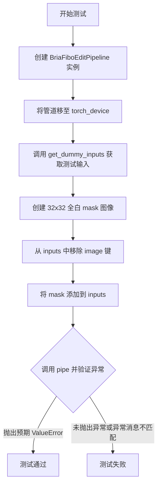

#### 带注释源码

```python
def test_bria_fibo_edit_mask_no_image(self):
    """
    测试当提供 mask 但不提供 image 时，管道是否正确抛出 ValueError。
    这是一个负面测试用例，验证参数验证逻辑。
    """
    # 步骤1: 创建 BriaFiboEditPipeline 管道实例
    # 使用 get_dummy_components 获取虚拟组件（transformer, vae, scheduler 等）
    pipe = self.pipeline_class(**self.get_dummy_components())
    
    # 步骤2: 将管道移至指定的计算设备（如 CUDA 或 CPU）
    pipe = pipe.to(torch_device)
    
    # 步骤3: 获取虚拟输入参数
    # 包含 prompt, negative_prompt, generator, num_inference_steps 等
    inputs = self.get_dummy_inputs(torch_device)
    
    # 步骤4: 创建 32x32 的全白 mask 图像
    # 使用 numpy 创建全 255 值的数组，转换为 PIL Image（模式 L 表示灰度）
    mask = Image.fromarray((np.ones((32, 32)) * 255).astype(np.uint8), mode="L")
    
    # 步骤5: 从 inputs 字典中移除 image 键
    # 确保测试时没有提供 image 参数
    inputs.pop("image", None)
    
    # 步骤6: 将 mask 添加到输入参数中
    # 此时 inputs 包含 mask 但不包含 image
    inputs.update({"mask": mask})
    
    # 步骤7: 验证管道是否抛出预期的 ValueError
    # 期望的错误消息为 "If mask is provided, image must also be provided"
    with self.assertRaisesRegex(ValueError, "If mask is provided, image must also be provided"):
        # 执行管道调用，预期在此处抛出异常
        pipe(**inputs)
```


### `BriaFiboPipelineFastTests.get_dummy_components`

该方法用于创建虚拟（dummy）组件，初始化BriaFibo编辑管道所需的所有模型组件（Transformer、VAE、Scheduler、Text Encoder、Tokenizer），以便进行单元测试。

参数：该方法无显式参数（隐含self参数为类实例本身）

返回值：`Dict[str, Any]`，返回包含scheduler、text_encoder、tokenizer、transformer、vae五个组件的字典，用于初始化管道类

#### 流程图

```mermaid
flowchart TD
    A[开始 get_dummy_components] --> B[设置随机种子 torch.manual_seed(0)]
    B --> C[创建 BriaFiboTransformer2DModel]
    C --> D[创建 AutoencoderKLWan]
    D --> E[创建 FlowMatchEulerDiscreteScheduler]
    E --> F[创建 SmolLM3ForCausalLM]
    F --> G[创建 AutoTokenizer]
    G --> H[组装 components 字典]
    H --> I[返回 components]
```

#### 带注释源码

```python
def get_dummy_components(self):
    """
    创建虚拟组件用于测试BriaFibo编辑管道
    
    该方法初始化所有必需的模型组件，包括：
    - Transformer: BriaFiboTransformer2DModel
    - VAE: AutoencoderKLWan  
    - Scheduler: FlowMatchEulerDiscreteScheduler
    - Text Encoder: SmolLM3ForCausalLM
    - Tokenizer: AutoTokenizer
    
    Returns:
        Dict[str, Any]: 包含所有组件的字典，用于传递给管道类构造函数
    """
    # 设置随机种子以确保测试可重复性
    torch.manual_seed(0)
    
    # 1. 创建Transformer模型 - 用于图像生成的核心变换器
    transformer = BriaFiboTransformer2DModel(
        patch_size=1,
        in_channels=16,
        num_layers=1,
        num_single_layers=1,
        attention_head_dim=8,
        num_attention_heads=2,
        joint_attention_dim=64,
        text_encoder_dim=32,
        pooled_projection_dim=None,
        axes_dims_rope=[0, 4, 4],
    )

    # 2. 创建VAE模型 - 用于编码/解码图像潜空间表示
    vae = AutoencoderKLWan(
        base_dim=80,
        decoder_base_dim=128,
        dim_mult=[1, 2, 4, 4],
        dropout=0.0,
        in_channels=12,
        latents_mean=[0.0] * 16,
        latents_std=[1.0] * 16,
        is_residual=True,
        num_res_blocks=2,
        out_channels=12,
        patch_size=2,
        scale_factor_spatial=16,
        scale_factor_temporal=4,
        temperal_downsample=[False, True, True],
        z_dim=16,
    )
    
    # 3. 创建调度器 - 控制扩散过程的噪声调度
    scheduler = FlowMatchEulerDiscreteScheduler()
    
    # 4. 创建文本编码器 - 将文本提示编码为向量表示
    text_encoder = SmolLM3ForCausalLM(SmolLM3Config(hidden_size=32))
    
    # 5. 创建分词器 - 将文本转换为token id序列
    tokenizer = AutoTokenizer.from_pretrained("hf-internal-testing/tiny-random-t5")

    # 组装组件字典
    components = {
        "scheduler": scheduler,
        "text_encoder": text_encoder,
        "tokenizer": tokenizer,
        "transformer": transformer,
        "vae": vae,
    }
    
    # 返回组件字典，供管道类构造函数使用
    return components
```


### `BriaFiboPipelineFastTests.get_dummy_inputs`

该方法用于创建虚拟输入数据，模拟 BriaFiboEditPipeline 推理所需的测试输入，包括提示词、负提示词、生成器、推理步数、引导系数、图像尺寸和输出类型等参数。

参数：

- `self`：隐式参数，测试类实例
- `device`：`str` 或设备对象，执行推理的目标设备（如 "cpu"、"cuda"、"mps"）
- `seed`：`int`，默认值为 0，用于随机数生成器的种子，确保测试可复现

返回值：`dict`，包含以下键值对的字典：
  - `prompt`：提示词字符串
  - `negative_prompt`：负提示词字符串
  - `generator`：PyTorch 随机数生成器
  - `num_inference_steps`：推理步数
  - `guidance_scale`：引导系数
  - `height`：输出图像高度
  - `width`：输出图像宽度
  - `output_type`：输出类型
  - `image`：PIL Image 对象

#### 流程图

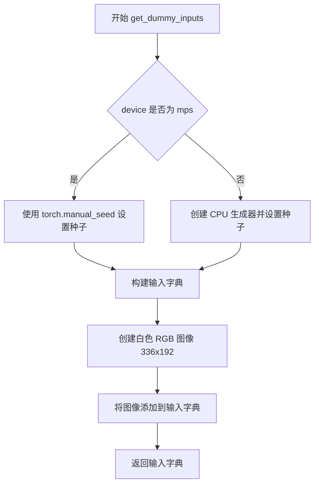

#### 带注释源码

```python
def get_dummy_inputs(self, device, seed=0):
    """
    创建虚拟输入数据用于测试 BriaFiboEditPipeline 推理
    
    参数:
        device: 目标设备字符串或设备对象
        seed: 随机种子，默认为 0
    
    返回:
        包含所有推理所需参数的字典
    """
    # 针对 mps 设备使用不同的随机数生成方式
    if str(device).startswith("mps"):
        # MPS 设备直接使用 torch.manual_seed
        generator = torch.manual_seed(seed)
    else:
        # 其他设备创建 CPU 上的生成器并设置种子
        generator = torch.Generator(device="cpu").manual_seed(seed)
    
    # 构建基础输入参数字典
    inputs = {
        "prompt": '{"text": "A painting of a squirrel eating a burger","edit_instruction": "A painting of a squirrel eating a burger"}',  # 提示词，包含文本和编辑指令
        "negative_prompt": "bad, ugly",  # 负提示词，用于排除不良风格
        "generator": generator,  # 随机数生成器，确保可复现性
        "num_inference_steps": 2,  # 推理步数，测试时使用较小值加快速度
        "guidance_scale": 5.0,  # 引导系数，控制提示词影响程度
        "height": 192,  # 输出图像高度
        "width": 336,  # 输出图像宽度
        "output_type": "np",  # 输出类型为 numpy 数组
    }
    
    # 创建纯白色测试图像，尺寸为 336x192
    image = Image.new("RGB", (336, 192), (255, 255, 255))
    
    # 将图像添加到输入字典
    inputs["image"] = image
    
    return inputs
```


### `BriaFiboPipelineFastTests.test_encode_prompt_works_in_isolation`

该测试方法用于验证提示词编码的隔离功能，但由于维度融合（dim-fusion）的限制，该测试已被跳过且无实际实现。

参数：

- `self`：`unittest.TestCase`，隐式参数，表示测试类实例本身

返回值：`None`，由于测试被跳过且函数体为 `pass`，不执行任何操作

#### 流程图

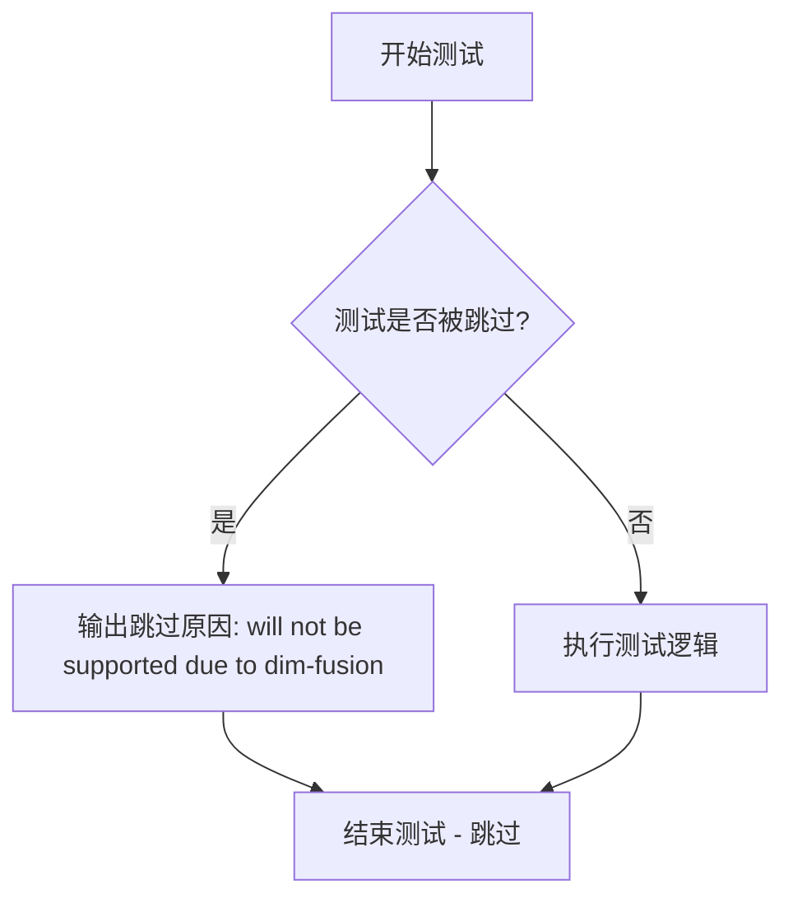

#### 带注释源码

```python
@unittest.skip(reason="will not be supported due to dim-fusion")
def test_encode_prompt_works_in_isolation(self):
    """
    测试提示词编码隔离功能
    
    该测试方法原本用于验证 prompt 编码是否能在隔离环境中正常工作，
    但由于 BriaFibo 模型不支持维度融合（dim-fusion），该测试被跳过。
    
    参数:
        self: 测试类实例，继承自 unittest.TestCase
    
    返回值:
        None: 测试被跳过，不返回任何值
    """
    pass  # 测试实现为空，仅用于标记跳过原因
```


### `BriaFiboPipelineFastTests.test_num_images_per_prompt`

该方法用于测试每提示词（per-prompt）生成的图像数量是否正确，但由于Batching功能尚未支持，该测试已被跳过。

参数：

- `self`：`BriaFiboPipelineFastTests`，表示类的实例本身

返回值：`None`，该方法被跳过，无实际执行

#### 流程图

```mermaid
flowchart TD
    A[开始执行 test_num_images_per_prompt] --> B{检查装饰器}
    B --> C[因@unittest.skip装饰器跳过测试]
    C --> D[结束 - 测试被标记为跳过]
    
    style A fill:#f9f,color:#000
    style C fill:#ff6,color:#000
    style D fill:#9f9,color:#000
```

#### 带注释源码

```python
@unittest.skip(reason="Batching is not supported yet")
def test_num_images_per_prompt(self):
    """
    测试每提示词图像数量
    
    该测试方法原本用于验证pipeline能否根据num_images_per_prompt参数
    生成正确数量的图像。由于当前Batching功能尚未支持，因此该测试
    被永久跳过。
    
    参数:
        self: BriaFiboPipelineFastTests的实例
        
    返回值:
        None: 方法被@unittest.skip装饰器跳过，无实际执行
    """
    pass  # 方法体为空，测试被跳过
```


### `BriaFiboPipelineFastTests.test_inference_batch_consistent`

测试批处理一致性的测试方法，目前因"Batching is not supported yet"（尚未支持批处理）而被跳过。

参数：

- `self`：`unittest.TestCase`，测试类的实例方法本身

返回值：`None`，该方法被 `@unittest.skip` 装饰器跳过，且方法体仅包含 `pass` 语句，无实际执行逻辑。

#### 流程图

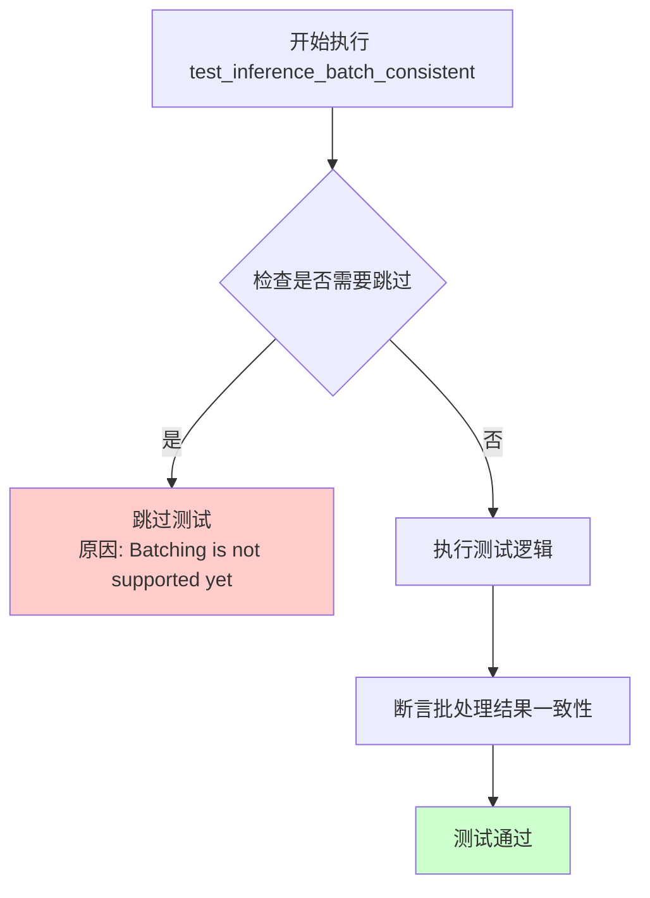

#### 带注释源码

```python
@unittest.skip(reason="Batching is not supported yet")  # 跳过该测试，原因是尚未支持批处理功能
def test_inference_batch_consistent(self):
    """
    测试批处理一致性。
    
    该测试方法用于验证管道在处理批量输入时，
    多次调用同一批输入应产生一致的结果。
    目前该功能尚未实现，因此测试被跳过。
    """
    pass  # 方法体为空，测试被跳过时不执行任何操作
```


### `BriaFiboPipelineFastTests.test_inference_batch_single_identical`

测试单批处理相同性，验证在批量推理时单个样本的输出与单独推理时的输出一致性（该测试已被跳过，原因是当前不支持批处理功能）。

参数：

- `self`：`BriaFiboPipelineFastTests`，隐式参数，表示测试类实例本身

返回值：`None`，由于测试被跳过且方法体为空，不返回任何值

#### 流程图

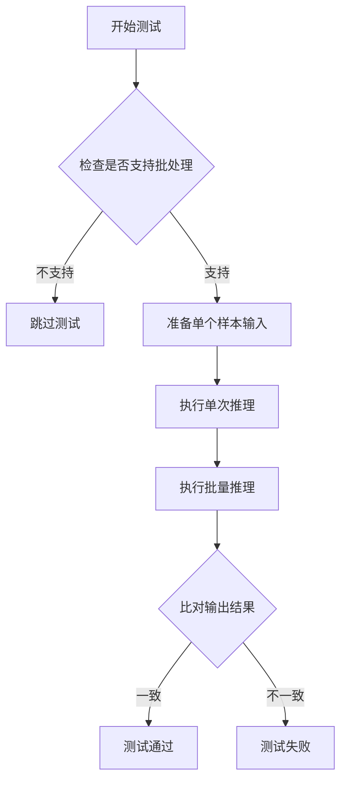

#### 带注释源码

```python
@unittest.skip(reason="Batching is not supported yet")
def test_inference_batch_single_identical(self):
    """
    测试单批处理相同性
    
    该测试用于验证：
    1. 批量推理时，单个样本的输出应与单独推理时的输出一致
    2. 确保批处理不会引入随机性或副作用
    
    当前状态：已跳过
    原因：Batching is not supported yet
    """
    pass
```

---

#### 补充信息

由于该测试方法已被跳过且为空实现，以下是相关的类信息和上下文：

**所属类：** `BriaFiboPipelineFastTests`

**类字段：**

| 字段名 | 类型 | 描述 |
|--------|------|------|
| `pipeline_class` | `type` | 管道类，值为 `BriaFiboEditPipeline` |
| `params` | `frozenset` | 管道参数字段集合，包含 prompt, height, width, guidance_scale |
| `batch_params` | `frozenset` | 批量参数字段集合，仅包含 prompt |
| `test_xformers_attention` | `bool` | 是否测试 xformers 注意力机制，值为 False |
| `test_layerwise_casting` | `bool` | 是否测试分层类型转换，值为 False |
| `test_group_offloading` | `bool` | 是否测试组卸载，值为 False |
| `supports_dduf` | `bool` | 是否支持 DDUF，值为 False |

**相关方法：**

| 方法名 | 描述 |
|--------|------|
| `get_dummy_components()` | 创建用于测试的虚拟组件（transformer, VAE, scheduler, text_encoder, tokenizer） |
| `get_dummy_inputs()` | 创建用于测试的虚拟输入参数 |

**设计目标与约束：**
- 该测试旨在验证批量推理的一致性保证
- 当前版本不支持批处理功能，因此测试被跳过

**技术债务：**
- 批处理功能尚未实现，导致相关测试被跳过
- 需要在未来的版本中实现批处理支持并启用此测试


### `BriaFiboPipelineFastTests.test_bria_fibo_different_prompts`

该测试方法用于验证 BriaFibo 编辑管道在不同提示词下能够产生不同的输出结果，确保模型对提示词的变化有响应。

参数：

- `self`：隐式参数，测试类实例本身

返回值：`None`，该方法为测试方法，无显式返回值，通过断言验证结果

#### 流程图

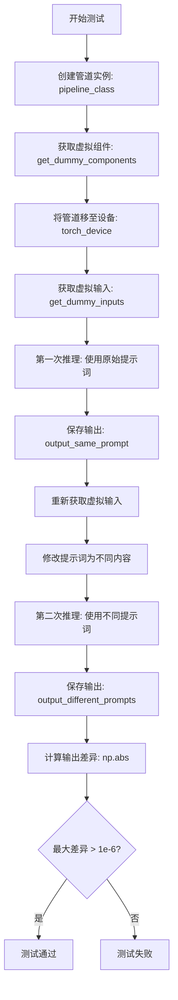

#### 带注释源码

```python
def test_bria_fibo_different_prompts(self):
    """
    测试不同提示词产生不同输出
    
    该测试验证管道能够根据不同的编辑指令生成不同的图像输出，
    确保模型对提示词变化有响应而非返回相同结果
    """
    # 步骤1: 使用虚拟组件创建管道实例
    # get_dummy_components() 返回包含 scheduler, text_encoder, tokenizer, 
    # transformer, vae 的字典，用于模拟真实推理环境
    pipe = self.pipeline_class(**self.get_dummy_components())
    
    # 步骤2: 将管道移至指定计算设备（CPU/GPU）
    pipe = pipe.to(torch_device)
    
    # 步骤3: 获取虚拟输入参数
    # 包含 prompt, negative_prompt, generator, num_inference_steps,
    # guidance_scale, height, width, output_type, image 等参数
    inputs = self.get_dummy_inputs(torch_device)
    
    # 步骤4: 第一次推理 - 使用原始提示词
    # prompt 格式: '{"text": "A painting of a squirrel eating a burger",
    #              "edit_instruction": "A painting of a squirrel eating a burger"}'
    output_same_prompt = pipe(**inputs).images[0]
    
    # 步骤5: 重新获取虚拟输入，准备第二次推理
    inputs = self.get_dummy_inputs(torch_device)
    
    # 步骤6: 修改提示词为不同的编辑指令
    # 将 edit_instruction 改为 "a different prompt"
    inputs["prompt"] = {"edit_instruction": "a different prompt"}
    
    # 步骤7: 第二次推理 - 使用不同的提示词
    output_different_prompts = pipe(**inputs).images[0]
    
    # 步骤8: 计算两次输出的最大差异
    # 使用 numpy 计算绝对差值的最大值
    max_diff = np.abs(output_same_prompt - output_different_prompts).max()
    
    # 步骤9: 断言验证
    # 确保不同提示词产生显著不同的输出（差异大于 1e-6）
    # 如果差异过小，说明模型对提示词不敏感，存在问题
    assert max_diff > 1e-6
```


### `BriaFiboPipelineFastTests.test_image_output_shape`

该测试方法用于验证 BriaFiboEditPipeline 在不同高度和宽度参数下输出的图像形状是否符合预期，确保管道正确处理各种分辨率的图像输出。

参数：

- `self`：隐式参数，`unittest.TestCase`，代表测试类实例本身

返回值：无（测试方法，通过断言验证，不返回数值）

#### 流程图

```mermaid
flowchart TD
    A[开始测试 test_image_output_shape] --> B[创建 Pipeline 实例并移至 torch_device]
    C[获取 Dummy 输入] --> B
    B --> D[定义测试尺寸列表: (32,32), (64,64), (32,64)]
    D --> E{遍历 height_width_pairs}
    E -->|是| F[设置 expected_height 和 expected_width]
    F --> G[更新 inputs 中的 height 和 width]
    G --> H[调用 pipe 执行推理: image = pipe\*\*inputs.images[0]]
    H --> I[获取输出图像形状: output_height, output_width, _ = image.shape]
    I --> J{断言 (output_height, output_width) == (expected_height, expected_width)}
    J -->|通过| E
    J -->|失败| K[抛出 AssertionError]
    E -->|遍历完成| L[测试通过]
```

#### 带注释源码

```python
def test_image_output_shape(self):
    """
    测试图像输出形状的正确性
    
    该测试验证管道在不同高度和宽度组合下输出的图像形状是否正确。
    测试三种尺寸：(32,32), (64,64), (32,64)
    """
    # 1. 创建 Pipeline 实例，使用虚拟组件
    pipe = self.pipeline_class(**self.get_dummy_components())
    
    # 2. 将 Pipeline 移至指定的计算设备（CPU/CUDA）
    pipe = pipe.to(torch_device)
    
    # 3. 获取虚拟输入参数
    inputs = self.get_dummy_inputs(torch_device)

    # 4. 定义要测试的 height-width 组合列表
    height_width_pairs = [(32, 32), (64, 64), (32, 64)]
    
    # 5. 遍历每种尺寸组合进行测试
    for height, width in height_width_pairs:
        # 设置预期的输出高度和宽度
        expected_height = height
        expected_width = width

        # 更新输入参数中的高度和宽度
        inputs.update({"height": height, "width": width})
        
        # 执行管道推理，获取输出图像
        # pipe(**inputs) 返回一个对象，包含 .images 属性
        image = pipe(**inputs).images[0]
        
        # 从输出图像中解包高度和宽度维度
        # 图像形状为 (height, width, channels)，这里取前两个维度
        output_height, output_width, _ = image.shape
        
        # 断言：验证输出图像的形状是否与预期一致
        assert (output_height, output_width) == (expected_height, expected_width)
```


### `BriaFiboPipelineFastTests.test_bria_fibo_edit_mask`

该测试方法用于验证 BriaFiboEditPipeline 的遮罩编辑功能，通过创建全白遮罩并调用管道生成图像，确保输出图像的形状正确。

参数：

- `self`：隐式参数，`unittest.TestCase`，测试类的实例本身

返回值：`None`，该方法为测试方法，通过断言验证功能，不返回具体值

#### 流程图

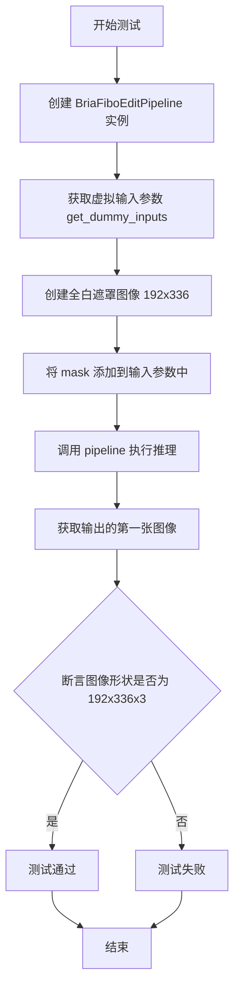

#### 带注释源码

```python
def test_bria_fibo_edit_mask(self):
    """
    测试遮罩编辑功能：验证 BriaFiboEditPipeline 能够接受遮罩参数并生成正确形状的图像
    """
    # 步骤1: 创建 BriaFiboEditPipeline 实例，使用虚拟组件配置
    pipe = self.pipeline_class(**self.get_dummy_components())
    # 步骤2: 将管道移至测试设备（CPU 或 CUDA）
    pipe = pipe.to(torch_device)
    # 步骤3: 获取虚拟输入参数（包含 prompt、negative_prompt、generator 等）
    inputs = self.get_dummy_inputs(torch_device)

    # 步骤4: 创建全白遮罩图像（192x256 像素，灰度模式）
    # 使用 numpy 创建全 255 值的数组，并转换为 PIL Image
    mask = Image.fromarray((np.ones((192, 336)) * 255).astype(np.uint8), mode="L")

    # 步骤5: 将遮罩添加到输入参数字典中
    inputs.update({"mask": mask})
    
    # 步骤6: 调用管道执行推理，返回结果并获取第一张图像
    output = pipe(**inputs).images[0]

    # 步骤7: 断言验证输出图像的形状为 (192, 336, 3)，即 RGB 三通道
    assert output.shape == (192, 336, 3)
```


### `BriaFiboPipelineFastTests.test_bria_fibo_edit_mask_image_size_mismatch`

该测试方法用于验证当用户提供的遮罩（mask）尺寸与输入图像尺寸不匹配时，`BriaFiboEditPipeline` 是否能正确抛出包含 "Mask and image must have the same size" 信息的 ValueError 异常，从而确保数据一致性并防止潜在的运行时错误。

参数：
- `self`：隐式参数，`unittest.TestCase` 实例，表示测试类本身

返回值：`None`，该方法为单元测试方法，无返回值，通过 `assertRaisesRegex` 验证异常抛出

#### 流程图

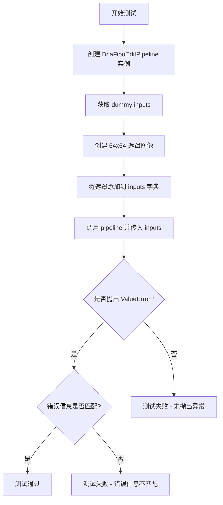

#### 带注释源码

```python
def test_bria_fibo_edit_mask_image_size_mismatch(self):
    """
    测试遮罩与图像尺寸不匹配错误
    
    该测试验证当提供的mask尺寸（64x64）与输入图像尺寸（336x192）不匹配时，
    pipeline是否正确抛出ValueError异常，错误信息应包含'Mask and image must have the same size'
    """
    # 步骤1: 创建 BriaFiboEditPipeline 实例
    # 使用 get_dummy_components 获取虚拟组件（transformer, vae, scheduler等）
    pipe = self.pipeline_class(**self.get_dummy_components())
    
    # 步骤2: 将 pipeline 移动到测试设备（CPU 或 CUDA）
    pipe = pipe.to(torch_device)
    
    # 步骤3: 获取虚拟输入参数
    # 包含 prompt, negative_prompt, generator, num_inference_steps,
    # guidance_scale, height=192, width=336, output_type='np'
    inputs = self.get_dummy_inputs(torch_device)
    
    # 步骤4: 创建一个尺寸为 64x64 的遮罩
    # 使用 numpy 创建全白（255）遮罩，然后转换为 PIL Image
    # 注意：此尺寸与 inputs 中的图像尺寸（336x192）不匹配
    mask = Image.fromarray((np.ones((64, 64)) * 255).astype(np.uint8), mode="L")
    
    # 步骤5: 将遮罩添加到输入字典
    inputs.update({"mask": mask})
    
    # 步骤6: 执行 pipeline 并验证异常抛出
    # 预期行为：pipeline 应检测到 mask 和 image 尺寸不一致
    # 并抛出 ValueError，错误信息包含 'Mask and image must have the same size'
    with self.assertRaisesRegex(ValueError, "Mask and image must have the same size"):
        pipe(**inputs)
```


### `BriaFiboPipelineFastTests.test_bria_fibo_edit_mask_no_image`

该测试方法用于验证当用户提供了遮罩（mask）但未提供图像（image）时，编辑管道（BriaFiboEditPipeline）能够正确抛出 `ValueError` 异常，确保数据输入的完整性。

参数：

- `self`：隐式参数，测试类实例本身

返回值：`None`，该方法为测试方法，不返回任何值，通过 `assertRaisesRegex` 验证异常抛出

#### 流程图

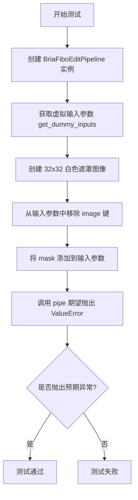

#### 带注释源码

```python
def test_bria_fibo_edit_mask_no_image(self):
    """
    测试用例：验证当提供遮罩但未提供图像时抛出 ValueError
    
    该测试确保 BriaFiboEditPipeline 在缺少必需输入时能够正确报错，
    防止因不完整的输入导致后续处理出错。
    """
    # 步骤1：创建 BriaFiboEditPipeline 实例并加载虚拟组件
    pipe = self.pipeline_class(**self.get_dummy_components())
    # 将管道移至测试设备（CPU 或 CUDA）
    pipe = pipe.to(torch_device)
    
    # 步骤2：获取虚拟输入参数
    inputs = self.get_dummy_inputs(torch_device)
    
    # 步骤3：创建一个 32x32 的全白色遮罩图像（RGB 转为 L 模式）
    mask = Image.fromarray(
        (np.ones((32, 32)) * 255).astype(np.uint8), 
        mode="L"
    )
    
    # 步骤4：从输入字典中移除 image 键（如果存在）
    # 确保测试环境中不包含 image 输入
    inputs.pop("image", None)
    
    # 步骤5：将遮罩添加到输入参数中
    inputs.update({"mask": mask})
    
    # 步骤6：执行管道并验证是否抛出预期的 ValueError
    # 预期错误信息应包含 "If mask is provided, image must also be provided"
    with self.assertRaisesRegex(
        ValueError, 
        "If mask is provided, image must also be provided"
    ):
        pipe(**inputs)
```

## 关键组件


### BriaFiboEditPipeline

主要的图像编辑管道类，继承自diffusers库，用于基于提示词和编辑指令对图像进行编辑处理，支持mask编辑功能。

### BriaFiboTransformer2DModel

Bria定制的2D Transformer模型，用于图像生成过程中的注意力计算和特征转换，支持joint_attention_dim进行文本-图像联合注意力处理。

### AutoencoderKLWan

基于Wan架构的变分自编码器(VAE)，用于图像的编码和解码，支持latents_mean和latents_std进行潜在空间标准化处理。

### FlowMatchEulerDiscreteScheduler

基于欧拉离散方法的Flow Match调度器，用于控制图像生成的去噪过程，支持num_inference_steps参数配置推理步数。

### SmolLM3ForCausalLM

SmolLM3因果语言模型作为文本编码器，将输入提示词转换为文本嵌入向量，供Transformer模型进行文本-图像联合处理。

### test_bria_fibo_different_prompts

测试函数，验证管道对不同提示词产生不同的输出结果，通过比较相同种子下不同提示词生成图像的差异来确认功能正确性。

### test_image_output_shape

测试函数，验证不同尺寸输入(height,width)时管道输出图像的尺寸正确性，支持多组高度宽度组合的测试用例。

### test_bria_fibo_edit_mask

测试函数，验证提供mask时管道能够正确执行局部编辑功能，检查输出图像形状是否与预期一致。

### test_bria_fibo_edit_mask_image_size_mismatch

测试函数，验证当mask尺寸与输入图像尺寸不匹配时管道能够抛出正确的ValueError异常。

### test_bria_fibo_edit_mask_no_image

测试函数，验证当只提供mask但未提供原图时管道能够抛出正确的ValueError异常，确保编辑功能的完整性。


## 问题及建议


### 已知问题

-   **Magic Number 遍布代码**：推理步数（num_inference_steps=2）、guidance_scale（5.0）、图像尺寸（192x336）等关键参数以硬编码形式散落在多个测试方法中，缺乏统一配置管理
-   **重复的组件初始化逻辑**：在每个测试方法中重复调用 `self.get_dummy_components()` 和 `pipe.to(torch_device)`，导致代码冗余且影响测试执行效率
-   **Prompt 格式不一致**：`test_bria_fibo_different_prompts` 中混用了 JSON 字符串格式 `{"text": "...", "edit_instruction": "..."}` 和纯字典格式 `{"edit_instruction": "..."}`，缺乏统一的输入契约
-   **设备处理逻辑不清晰**：`get_dummy_inputs` 中对 MPS 设备使用 `torch.manual_seed` 而其他设备使用 `Generator` 对象，这种差异处理可能导致某些设备上的随机性行为不一致
-   **资源清理机制缺失**：测试未显式管理 GPU 内存清理，长期运行可能导致内存泄漏风险
-   **被跳过的测试表明功能缺陷**：4 个测试方法被标记为 `@unittest.skip`，涉及批量处理和 prompt 编码隔离功能，表明核心功能尚未完全实现

### 优化建议

-   **提取测试配置为类常量**：将 `NUM_INFERENCE_STEPS`, `GUIDANCE_SCALE`, `DEFAULT_HEIGHT`, `DEFAULT_WIDTH` 等定义为类级别常量，便于批量修改
-   **封装通用的 pipeline 初始化逻辑**：创建 `_setup_pipeline` 辅助方法处理组件创建和设备迁移，减少重复代码
-   **统一 prompt 输入格式**：定义标准化的 prompt 结构模板，或在 pipeline 层面接受多种格式并自动规范化
-   **规范化随机数生成器策略**：对所有设备类型统一使用 `Generator` 对象，避免设备特定的条件分支
-   **添加资源清理钩子**：使用 `setUp`/`tearDown` 方法管理 pipeline 生命周期，必要时显式调用 `del` 和 `torch.cuda.empty_cache()`
-   **补全或移除被跳过的测试**：明确 batch 相关功能的时间表，或将这些测试移至单独的测试类并标注为 `@unittest.skipIf` 的条件跳过

## 其它


### 设计目标与约束

本测试模块的核心设计目标是为 `BriaFiboEditPipeline` 图像编辑管道提供全面、可靠的单元测试覆盖。约束条件包括：测试环境需要支持 PyTorch 和 NumPy；由于批次处理功能尚未实现，测试用例中明确跳过了与批次相关的测试；测试使用模拟组件而非真实模型以确保测试的独立性和可重复性。

### 错误处理与异常设计

测试用例覆盖了多种异常场景：1) `test_bria_fibo_edit_mask_image_size_mismatch` 验证当蒙版尺寸与图像尺寸不匹配时抛出 `ValueError` 异常，错误消息为 "Mask and image must have the same size"；2) `test_bria_fibo_edit_mask_no_image` 验证当提供蒙版但未提供图像时抛出 `ValueError` 异常，错误消息为 "If mask is provided, image must also be provided"。这些测试确保管道在接收无效输入时能够正确地进行错误处理和异常报告。

### 外部依赖与接口契约

本测试模块依赖以下外部组件和接口契约：1) `transformers` 库中的 `AutoTokenizer`、`SmolLM3Config` 和 `SmolLM3ForCausalLM` 用于文本编码；2) `diffusers` 库中的 `AutoencoderKLWan`、`BriaFiboEditPipeline`、`FlowMatchEulerDiscreteScheduler` 和 `BriaFiboTransformer2DModel` 是核心被测组件；3) `PIL` 库用于图像处理；4) `numpy` 和 `torch` 用于数值计算。测试使用 `PipelineTesterMixin` 提供的一致性接口，确保与 diffusers 框架中其他管道的测试方法兼容。

### 性能考量与测试效率

测试设计考虑了性能优化：1) 使用 `torch.manual_seed(0)` 和 `generator.manual_seed(seed)` 确保测试的可重复性；2) 推理步数设置为最小值 `num_inference_steps=2` 以加快测试执行速度；3) 图像尺寸使用较小的分辨率（如 192x336、32x32、64x64）以减少计算开销；4) 通过跳过来自 xFormers注意力、层-wise类型转换和组卸载的测试，避免引入额外的可选依赖。

### 测试数据管理

测试使用以下数据管理策略：1) 虚拟组件通过 `get_dummy_components` 方法创建，使用最小的模型配置（如单层transformer、单层attention head）以降低内存占用；2) 虚拟输入通过 `get_dummy_inputs` 方法生成，包含标准prompt、负向prompt、生成器、推理步数、引导 scale 和输出尺寸等参数；3) 测试图像使用 `PIL.Image.new` 创建纯色图像，避免加载外部资源。

### 平台兼容性处理

代码包含针对特定平台的兼容性处理：在 `get_dummy_inputs` 方法中检测设备类型，对于 MPS (Apple Silicon) 设备使用 `torch.manual_seed(seed)` 而非 `torch.Generator`，这是因为某些 MPS 设备可能不支持 `torch.Generator` 的所有功能。测试通过 `torch_device` 常量实现跨平台设备适配。

### 测试覆盖范围与边界条件

测试覆盖了以下关键场景和边界条件：1) 相同提示词与不同提示词的处理差异验证；2) 多种输出尺寸组合（32x32、64x64、32x64）的正确性；3) 蒙版编辑功能的有效性；4) 蒙版与图像尺寸匹配的验证；5) 必需参数（图像与蒙版）的依赖关系验证。当前跳过的测试（批次处理、提示词编码隔离）表明存在功能未完全实现的区域。

### 版本兼容性与依赖管理

测试文件指定了版权声明（Apache License 2.0），并依赖于特定版本的 `diffusers`、`transformers`、`torch`、`numpy` 和 `Pillow`。由于某些功能（如维度融合、批次处理）尚未支持，测试通过 `@unittest.skip` 装饰器进行了标记，这种方式允许在后续版本中轻松启用这些测试用例。

### 资源清理与测试隔离

每个测试方法独立创建管道实例并调用 `pipe.to(torch_device)` 确保设备转移，这种设计保证了测试之间的独立性。测试使用 `unittest.TestCase` 框架提供了标准的 `setUp` 和 `tearDown` 生命周期管理机制，确保测试环境的清洁和可重复性。

### 配置参数化与测试矩阵

测试框架使用以下参数化策略：1) `params` 定义了单样本参数集合（prompt、height、width、guidance_scale）；2) `batch_params` 定义了批处理参数集合（prompt）；3) `height_width_pairs` 列表提供了多尺寸测试矩阵。这种参数化设计便于扩展新的测试场景，同时保持测试代码的简洁性。


    