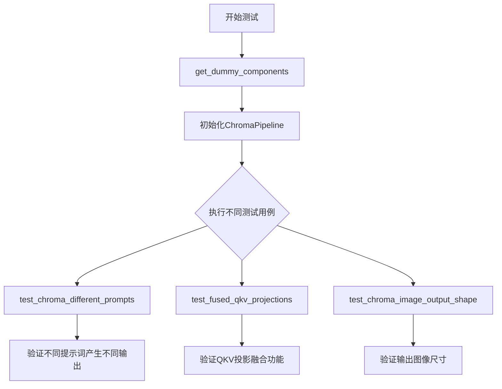
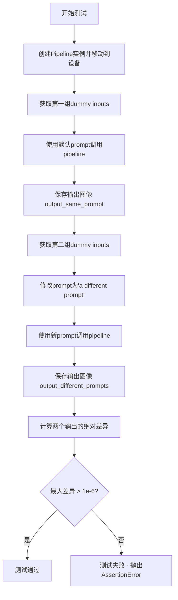
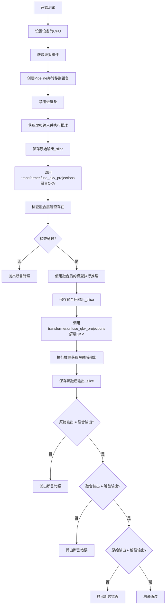
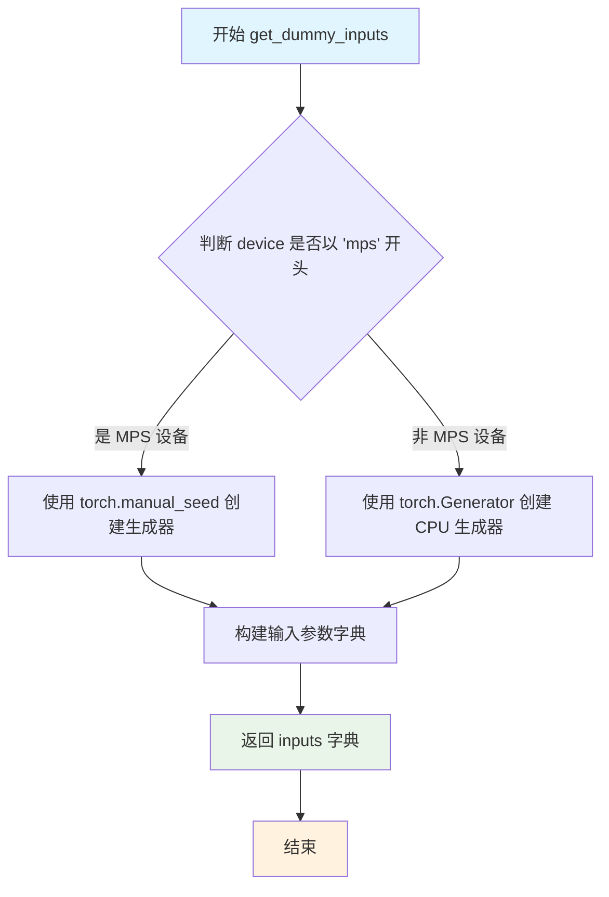
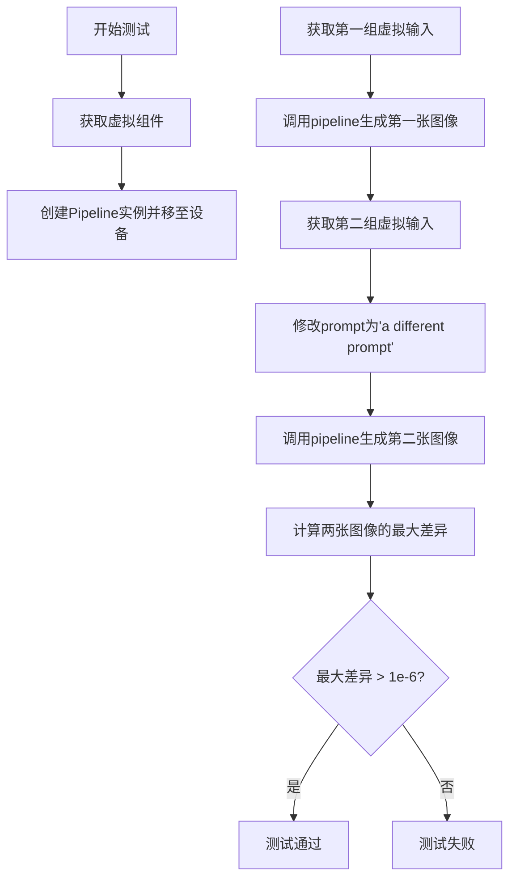
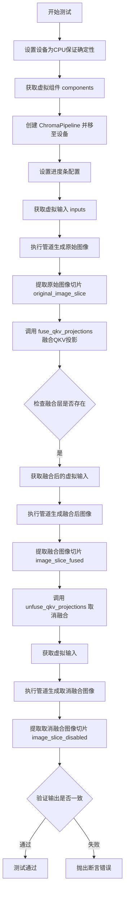

# `diffusers\tests\pipelines\chroma\test_pipeline_chroma.py` 详细设计文档

这是一个针对ChromaPipeline的单元测试文件，用于验证Chroma图像生成pipeline的不同提示词处理、QKV投影融合以及图像输出形状等功能。

## 整体流程



## 类结构

```
unittest.TestCase
├── ChromaPipelineFastTests (主测试类)
│   ├── PipelineTesterMixin (混入)
│   └── FluxIPAdapterTesterMixin (混入)
```

## 全局变量及字段


### `unittest`
    
Python标准库中的单元测试框架，用于编写和运行测试用例

类型：`module`
    


### `np`
    
NumPy库，提供高性能数值计算和数组操作功能

类型：`module`
    


### `torch`
    
PyTorch深度学习库，提供张量计算和神经网络构建功能

类型：`module`
    


### `AutoTokenizer`
    
Hugging Face Transformers库的分词器基类，用于将文本转换为模型输入 token

类型：`class`
    


### `T5EncoderModel`
    
T5文本编码器模型，用于将文本编码为向量表示

类型：`class`
    


### `AutoencoderKL`
    
变分自编码器KL散度实现，用于图像的编码和解码

类型：`class`
    


### `ChromaPipeline`
    
Chroma图像生成管道，封装了完整的文本到图像生成流程

类型：`class`
    


### `ChromaTransformer2DModel`
    
2D变换器模型，用于图像特征的提取和变换

类型：`class`
    


### `FlowMatchEulerDiscreteScheduler`
    
基于欧拉离散方法的流匹配调度器，用于控制扩散模型的采样过程

类型：`class`
    


### `torch_device`
    
测试设备标识符，指定在CPU或CUDA设备上运行测试

类型：`str`
    


### `FluxIPAdapterTesterMixin`
    
Flux IP适配器测试混入类，提供IP适配器相关的测试辅助方法

类型：`class`
    


### `PipelineTesterMixin`
    
管道测试混入类，提供通用的管道测试验证方法

类型：`class`
    


### `check_qkv_fused_layers_exist`
    
检查变换器中是否存在融合的QKV投影层

类型：`function`
    


### `ChromaPipelineFastTests.pipeline_class`
    
指定要测试的管道类为ChromaPipeline

类型：`type`
    


### `ChromaPipelineFastTests.params`
    
管道可接受的参数集合，包含prompt、height、width等

类型：`frozenset`
    


### `ChromaPipelineFastTests.batch_params`
    
支持批处理的参数集合，当前仅包含prompt

类型：`frozenset`
    


### `ChromaPipelineFastTests.test_xformers_attention`
    
标志位，指示是否测试xformers注意力机制，Flux架构不支持xformers

类型：`bool`
    


### `ChromaPipelineFastTests.test_layerwise_casting`
    
标志位，指示是否测试层级类型转换功能

类型：`bool`
    


### `ChromaPipelineFastTests.test_group_offloading`
    
标志位，指示是否测试组卸载功能

类型：`bool`
    
    

## 全局函数及方法


### `ChromaPipelineFastTests.get_dummy_components`

该函数用于生成虚拟（dummy）组件字典，为ChromaPipeline的单元测试提供必要的模型组件，包括transformer、文本编码器、分词器、VAE、调度器等，用于确保测试环境的一致性和可重复性。

参数：

- `num_layers`：`int`，设置transformer模型的层数，默认为1
- `num_single_layers`：`int`，设置transformer模型的单层数量，默认为1

返回值：`dict`，返回包含调度器、文本编码器、分词器、transformer、VAE、图像编码器和特征提取器的组件字典

#### 流程图

```mermaid
flowchart TD
    A[开始 get_dummy_components] --> B[设置随机种子 torch.manual_seed(0)]
    B --> C[创建 ChromaTransformer2DModel 组件]
    C --> D[创建 T5EncoderModel 文本编码器]
    D --> E[创建 AutoTokenizer 分词器]
    E --> F[创建 AutoencoderKL VAE]
    F --> G[创建 FlowMatchEulerDiscreteScheduler 调度器]
    G --> H[组装组件字典并返回]
```

#### 带注释源码

```python
def get_dummy_components(self, num_layers: int = 1, num_single_layers: int = 1):
    """
    生成用于测试的虚拟组件字典
    
    参数:
        num_layers: int - 设置transformer的层数
        num_single_layers: int - 设置transformer的单层数量
    
    返回:
        dict - 包含所有测试所需组件的字典
    """
    # 设置随机种子确保测试可重复性
    torch.manual_seed(0)
    
    # 创建ChromaTransformer2DModel变换器模型
    transformer = ChromaTransformer2DModel(
        patch_size=1,
        in_channels=4,
        num_layers=num_layers,
        num_single_layers=num_single_layers,
        attention_head_dim=16,
        num_attention_heads=2,
        joint_attention_dim=32,
        axes_dims_rope=[4, 4, 8],
        approximator_hidden_dim=32,
        approximator_layers=1,
        approximator_num_channels=16,
    )

    # 重新设置随机种子
    torch.manual_seed(0)
    # 从预训练模型加载T5文本编码器
    text_encoder = T5EncoderModel.from_pretrained("hf-internal-testing/tiny-random-t5")

    # 加载对应的分词器
    tokenizer = AutoTokenizer.from_pretrained("hf-internal-testing/tiny-random-t5")

    # 重新设置随机种子
    torch.manual_seed(0)
    # 创建AutoencoderKL变分自编码器
    vae = AutoencoderKL(
        sample_size=32,
        in_channels=3,
        out_channels=3,
        block_out_channels=(4,),
        layers_per_block=1,
        latent_channels=1,
        norm_num_groups=1,
        use_quant_conv=False,
        use_post_quant_conv=False,
        shift_factor=0.0609,
        scaling_factor=1.5035,
    )

    # 创建FlowMatchEulerDiscreteScheduler调度器
    scheduler = FlowMatchEulerDiscreteScheduler()

    # 返回包含所有组件的字典
    return {
        "scheduler": scheduler,
        "text_encoder": text_encoder,
        "tokenizer": tokenizer,
        "transformer": transformer,
        "vae": vae,
        "image_encoder": None,  # 图像编码器设为None
        "feature_extractor": None,  # 特征提取器设为None
    }
```

### 类的详细信息

**类名：** `ChromaPipelineFastTests`

**类描述：** ChromaPipeline的快速测试类，继承自unittest.TestCase、PipelineTesterMixin和FluxIPAdapterTesterMixin，用于测试ChromaPipeline的各种功能和性能。

**类字段：**

- `pipeline_class`：`type`，指定测试的管道类为ChromaPipeline
- `params`：`frozenset`，包含管道参数集合
- `batch_params`：`frozenset`，包含批处理参数集合
- `test_xformers_attention`：`bool`，表示Flux不支持xformers处理器
- `test_layerwise_casting`：`bool`，表示启用层级别类型转换测试
- `test_group_offloading`：`bool`，表示启用组卸载测试

### 关键组件信息

| 组件名称 | 描述 |
|---------|------|
| ChromaTransformer2DModel | Chroma变换器2D模型，用于图像生成的核心transformer组件 |
| T5EncoderModel | T5文本编码器，用于将文本提示编码为嵌入向量 |
| AutoTokenizer | 自动分词器，用于将文本分割为token |
| AutoencoderKL | 变分自编码器，用于潜在空间的编码和解码 |
| FlowMatchEulerDiscreteScheduler | Flow Match欧拉离散调度器，用于 diffusion 过程 |

### 潜在的技术债务或优化空间

1. **硬编码的随机种子**：多处使用`torch.manual_seed(0)`，可能导致测试结果确定性过强，建议使用参数化随机种子
2. **重复的随机种子设置**：在创建不同组件前多次设置相同种子，可以考虑优化为一次性设置
3. **魔数参数**：VAE和transformer的许多参数（如shift_factor、scaling_factor等）使用硬编码值，缺乏配置化
4. **None值处理**：image_encoder和feature_extractor直接返回None，可能需要更明确的处理逻辑

### 其它项目

**设计目标与约束：**

- 目标：为ChromaPipeline单元测试提供可靠的虚拟组件
- 约束：使用轻量级的预训练模型（tiny-random-t5）以加快测试速度

**错误处理与异常设计：**

- 未包含显式的错误处理机制
- 依赖transformers和diffusers库的默认异常传播

**数据流与状态机：**

- 该函数是测试数据的准备阶段
- 返回的组件字典将被传递给pipeline_class用于创建测试实例

**外部依赖与接口契约：**

- 依赖：transformers库（T5EncoderModel, AutoTokenizer）、diffusers库（AutoencoderKL, ChromaPipeline, ChromaTransformer2DModel, FlowMatchEulerDiscreteScheduler）
- 接口契约：返回符合ChromaPipeline构造函数要求的组件字典格式


### `ChromaPipelineFastTests.get_dummy_inputs`

该方法用于生成用于测试 ChromaPipeline 的虚拟输入参数字典。根据设备类型（MPS 或其他）创建不同类型的随机数生成器，并返回包含提示词、负提示词、生成器、推理步数、引导系数、图像尺寸等参数的字典，供pipeline测试使用。

参数：

- `device`：设备类型（str 或 torch.device），用于确定使用哪种随机数生成器
- `seed`：int，默认值为 0，用于设置随机种子以确保可重复性

返回值：`dict`，包含以下键值对：
- `prompt`：str，正向提示词
- `negative_prompt`：str，负向提示词
- `generator`：torch.Generator 或 None，用于控制随机性
- `num_inference_steps`：int，推理步数
- `guidance_scale`：float，引导系数
- `height`：int，生成图像高度
- `width`：int，生成图像宽度
- `max_sequence_length`：int，最大序列长度
- `output_type`：str，输出类型

#### 流程图

```mermaid
flowchart TD
    A[开始] --> B{device 是否以 'mps' 开头?}
    B -->|是| C[使用 torch.manual_seed(seed) 创建生成器]
    B -->|否| D[使用 torch.Generator device='cpu' 创建生成器]
    C --> E[构建 inputs 字典]
    D --> E
    E --> F[包含 prompt, negative_prompt, generator 等参数]
    F --> G[返回 inputs 字典]
    G --> H[结束]
```

#### 带注释源码

```
def get_dummy_inputs(self, device, seed=0):
    """
    生成用于测试的虚拟输入参数。
    
    参数:
        device: 目标设备，用于判断是否使用 MPS 设备
        seed: 随机种子，默认值为 0
    
    返回:
        包含pipeline推理所需参数的字典
    """
    # 判断设备类型，MPS 设备需要特殊处理
    if str(device).startswith("mps"):
        # MPS 设备直接使用 torch.manual_seed
        generator = torch.manual_seed(seed)
    else:
        # 其他设备创建 CPU 上的生成器
        generator = torch.Generator(device="cpu").manual_seed(seed)

    # 构建虚拟输入字典，包含pipeline所需的所有参数
    inputs = {
        "prompt": "A painting of a squirrel eating a burger",  # 正向提示词
        "negative_prompt": "bad, ugly",  # 负向提示词
        "generator": generator,  # 随机生成器，确保可重复性
        "num_inference_steps": 2,  # 推理步数，测试时使用较少步数
        "guidance_scale": 5.0,  # Classifier-free guidance 引导系数
        "height": 8,  # 生成图像高度
        "width": 8,  # 生成图像宽度
        "max_sequence_length": 48,  # 文本编码器的最大序列长度
        "output_type": "np",  # 输出类型为 numpy 数组
    }
    return inputs
```


### `ChromaPipelineFastTests.test_chroma_different_prompts`

该测试方法用于验证 ChromaPipeline 在使用不同 prompt 时能够生成不同的图像输出。它通过先后使用两个不同的 prompt 调用 pipeline，然后比较输出的差异，确保模型对不同的文本提示产生语义上不同的图像。

参数：

- 无显式参数（隐式参数 `self` 表示实例方法）

返回值：`None`，测试方法通过 `assert` 语句进行断言验证，不返回具体值

#### 流程图



#### 带注释源码

```python
def test_chroma_different_prompts(self):
    """
    测试 ChromaPipeline 对不同 prompt 生成不同输出的能力。
    
    该测试验证当使用不同的文本提示时，pipeline 应该产生明显不同的图像结果。
    这确保了模型能够对输入的文本提示做出响应，而不是忽略提示内容。
    """
    # 使用虚拟组件创建 ChromaPipeline 实例，并将其移动到指定的计算设备
    # torch_device 是从 testing_utils 导入的设备标识符
    pipe = self.pipeline_class(**self.get_dummy_components()).to(torch_device)

    # 获取第一组虚拟输入，使用默认的 prompt "A painting of a squirrel eating a burger"
    inputs = self.get_dummy_inputs(torch_device)
    
    # 调用 pipeline 生成图像，并获取第一张图像
    # .images[0] 提取批次中的第一张图像
    output_same_prompt = pipe(**inputs).images[0]

    # 获取第二组虚拟输入（重新初始化以确保生成器状态一致）
    inputs = self.get_dummy_inputs(torch_device)
    
    # 修改 prompt 为不同的内容，这应该导致生成不同的图像
    inputs["prompt"] = "a different prompt"
    
    # 使用修改后的 prompt 再次调用 pipeline
    output_different_prompts = pipe(**inputs).images[0]

    # 使用 NumPy 计算两个输出图像之间的最大绝对差异
    max_diff = np.abs(output_same_prompt - output_different_prompts).max()

    # 断言：不同 prompt 产生的输出差异应该大于数值精度阈值
    # 阈值设为 1e-6 以确保差异是有意义的（而非浮点数误差）
    # 注意：注释指出 "For some reasons, they don't show large differences"
    # 表明实际上差异可能比预期要小
    assert max_diff > 1e-6
```


### `ChromaPipelineFastTests.test_fused_qkv_projections`

该测试方法用于验证 ChromaPipeline 中 Transformer 的 QKV（Query、Key、Value）投影融合功能是否正常工作。测试通过比较融合前后的输出图像_slice，确保 QKV 投影融合不会影响模型的推理结果，同时验证融合与解融合同样能产生一致的输出。

参数：
- `self`：`ChromaPipelineFastTests`，当前测试类实例

返回值：`None`，该方法为单元测试方法，没有返回值

#### 流程图



#### 带注释源码

```python
def test_fused_qkv_projections(self):
    """
    测试QKV投影融合功能是否正常工作。
    
    该测试验证以下场景：
    1. 融合QKV投影后输出应与原始输出一致
    2. 融合后再解融合输出应与融合输出一致
    3. 解融合后输出应与原始输出一致
    """
    # 设置设备为CPU以确保随机数生成器的一致性
    device = "cpu"  # ensure determinism for the device-dependent torch.Generator
    
    # 获取用于测试的虚拟组件（transformer, vae, text_encoder等）
    components = self.get_dummy_components()
    
    # 使用虚拟组件创建Pipeline实例
    pipe = self.pipeline_class(**components)
    
    # 将Pipeline移动到指定设备
    pipe = pipe.to(device)
    
    # 设置进度条配置（disable=None表示启用进度条）
    pipe.set_progress_bar_config(disable=None)

    # 获取虚拟输入参数（包含prompt、guidance_scale等）
    inputs = self.get_dummy_inputs(device)
    
    # 执行推理并获取图像输出
    image = pipe(**inputs).images
    
    # 提取图像最后3x3像素区域用于后续比较
    original_image_slice = image[0, -3:, -3:, -1]

    # 对transformer的QKV投影进行融合
    # TODO (sayakpaul): will refactor this once `fuse_qkv_projections()` has been added
    # to the pipeline level.
    pipe.transformer.fuse_qkv_projections()
    
    # 验证融合层是否存在（检查是否存在名为"to_qkv"的融合层）
    self.assertTrue(
        check_qkv_fused_layers_exist(pipe.transformer, ["to_qkv"]),
        ("Something wrong with the fused attention layers. Expected all the attention projections to be fused."),
    )

    # 使用融合后的模型再次执行推理
    inputs = self.get_dummy_inputs(device)
    image = pipe(**inputs).images
    
    # 获取融合后的输出_slice
    image_slice_fused = image[0, -3:, -3:, -1]

    # 解除QKV投影融合
    pipe.transformer.unfuse_qkv_projections()
    
    # 使用解融合后的模型执行推理
    inputs = self.get_dummy_inputs(device)
    image = pipe(**inputs).images
    
    # 获取解融合后的输出_slice
    image_slice_disabled = image[0, -3:, -3:, -1]

    # 断言1：融合QKV投影不应影响输出结果
    # 允许1e-3的绝对误差和1e-3的相对误差
    assert np.allclose(original_image_slice, image_slice_fused, atol=1e-3, rtol=1e-3), (
        "Fusion of QKV projections shouldn't affect the outputs."
    )
    
    # 断言2：融合后解融合的输出应与融合时一致
    assert np.allclose(image_slice_fused, image_slice_disabled, atol=1e-3, rtol=1e-3), (
        "Outputs, with QKV projection fusion enabled, shouldn't change when fused QKV projections are disabled."
    )
    
    # 断言3：解融合后的输出应与原始输出一致（允许更大误差）
    assert np.allclose(original_image_slice, image_slice_disabled, atol=1e-2, rtol=1e-2), (
        "Original outputs should match when fused QKV projections are disabled."
    )
```


### `ChromaPipelineFastTests.test_chroma_image_output_shape`

该函数用于测试 ChromaPipeline 在给定不同高度和宽度输入时，输出图像的形状是否符合预期（考虑了 VAE 缩放因子的影响）。

参数：

- `self`：`ChromaPipelineFastTests`，测试类的实例，隐式参数

返回值：`None`，该函数无返回值，通过断言验证输出形状是否正确

#### 流程图

```mermaid
flowchart TD
    A[开始] --> B[创建 ChromaPipeline 实例并移至 torch_device]
    C[获取虚拟输入] --> D[定义测试尺寸列表: [(32, 32), (72, 57)]]
    B --> C
    D --> E[遍历 height_width_pairs]
    E --> F[计算期望高度: height - height % (vae_scale_factor * 2)]
    G[计算期望宽度: width - width % (vae_scale_factor * 2)]
    F --> H[更新输入的 height 和 width]
    H --> I[调用 pipe 获取图像输出]
    I --> J[获取输出图像的 height, width]
    J --> K{断言: (output_height, output_width) == (expected_height, expected_width)?}
    K -->|是| L[继续下一个尺寸]
    K -->|否| M[抛出 AssertionError]
    L --> E
    E --> N[结束]
```

#### 带注释源码

```python
def test_chroma_image_output_shape(self):
    """
    测试 ChromaPipeline 输出图像形状是否符合预期
    
    该测试验证管道在给定不同高度和宽度时，输出图像的形状会根据
    VAE 缩放因子自动调整，确保输出尺寸是 VAE 下采样倍数的整数倍。
    """
    # 创建 ChromaPipeline 实例，使用虚拟组件并移至指定设备
    pipe = self.pipeline_class(**self.get_dummy_components()).to(torch_device)
    
    # 获取虚拟输入参数（包含 prompt, generator, num_inference_steps 等）
    inputs = self.get_dummy_inputs(torch_device)

    # 定义测试用的 (height, width) 组合列表
    # 32x32: 标准小尺寸
    # 72x57: 非标准尺寸，用于测试尺寸调整逻辑
    height_width_pairs = [(32, 32), (72, 57)]
    
    # 遍历每组高度宽度进行测试
    for height, width in height_width_pairs:
        # 计算期望的输出高度：
        # 输出高度 = 输入高度 - (输入高度 % (VAE缩放因子 * 2))
        # 乘以2是因为VAE的下采样和后续可能的处理
        expected_height = height - height % (pipe.vae_scale_factor * 2)
        
        # 计算期望的输出宽度（同上）
        expected_width = width - width % (pipe.vae_scale_factor * 2)

        # 更新输入参数中的高度和宽度
        inputs.update({"height": height, "width": width})
        
        # 调用管道生成图像
        # 返回的 images 是一个数组，取第一个元素得到生成的图像
        image = pipe(**inputs).images[0]
        
        # 获取输出图像的形状 (height, width, channels)
        output_height, output_width, _ = image.shape
        
        # 断言输出形状与期望形状一致
        # 如果不一致会抛出 AssertionError
        assert (output_height, output_width) == (expected_height, expected_width)
```


### `ChromaPipelineFastTests.get_dummy_components`

该方法是一个测试辅助方法，用于生成虚拟（dummy）组件字典，以便在单元测试中实例化 `ChromaPipeline`。它创建了文本编码器、分词器、Transformer 模型、VAE、解调度器等核心组件，所有组件均使用预定义的配置和随机初始化，用于测试 ChromaPipeline 的基本功能。

参数：

- `num_layers`：`int`，可选，默认值为 `1`，表示 Transformer 模型的总层数。
- `num_single_layers`：`int`，可选，默认值为 `1`，表示 Transformer 模型的单层数量。

返回值：`Dict[str, Any]`，返回一个包含以下键的字典：`scheduler`（调度器）、`text_encoder`（文本编码器）、`tokenizer`（分词器）、`transformer`（Transformer 模型）、`vae`（VAE 模型）、`image_encoder`（图像编码器，值为 `None`）、`feature_extractor`（特征提取器，值为 `None`）。

#### 流程图

```mermaid
flowchart TD
    A[开始] --> B[设置随机种子 torch.manual_seed(0)]
    B --> C[创建 ChromaTransformer2DModel]
    C --> D[设置随机种子 torch.manual_seed(0)]
    D --> E[加载 T5EncoderModel]
    E --> F[加载 AutoTokenizer]
    F --> G[设置随机种子 torch.manual_seed(0)]
    G --> H[创建 AutoencoderKL]
    H --> I[创建 FlowMatchEulerDiscreteScheduler]
    I --> J[构建组件字典]
    J --> K[返回组件字典]
    K --> L[结束]
```

#### 带注释源码

```python
def get_dummy_components(self, num_layers: int = 1, num_single_layers: int = 1):
    """
    生成用于测试的虚拟组件字典。
    
    参数:
        num_layers: Transformer模型的层数，默认值为1
        num_single_layers: Transformer模型的单层数量，默认值为1
    
    返回:
        包含所有Pipeline组件的字典
    """
    # 设置随机种子以确保可重复性
    torch.manual_seed(0)
    
    # 创建ChromaTransformer2DModel实例
    # 这是一个专为ChromaPipeline设计的Transformer模型
    transformer = ChromaTransformer2DModel(
        patch_size=1,                # 补丁大小
        in_channels=4,               # 输入通道数
        num_layers=num_layers,       # Transformer层数
        num_single_layers=num_single_layers,  # 单层数量
        attention_head_dim=16,       # 注意力头维度
        num_attention_heads=2,       # 注意力头数量
        joint_attention_dim=32,       # 联合注意力维度
        axes_dims_rope=[4, 4, 8],    # RoPE轴维度
        approximator_hidden_dim=32,   # 近似器隐藏层维度
        approximator_layers=1,        # 近似器层数
        approximator_num_channels=16,# 近似器通道数
    )

    # 重新设置随机种子以确保文本编码器初始化的一致性
    torch.manual_seed(0)
    
    # 加载预训练的T5文本编码器（tiny-random版本用于测试）
    text_encoder = T5EncoderModel.from_pretrained("hf-internal-testing/tiny-random-t5")

    # 加载对应的T5分词器
    tokenizer = AutoTokenizer.from_pretrained("hf-internal-testing/tiny-random-t5")

    # 再次设置随机种子以确保VAE初始化的一致性
    torch.manual_seed(0)
    
    # 创建AutoencoderKL实例（VAE模型）
    vae = AutoencoderKL(
        sample_size=32,              # 样本大小
        in_channels=3,               # 输入通道数
        out_channels=3,              # 输出通道数
        block_out_channels=(4,),     # 块输出通道数
        layers_per_block=1,          # 每块的层数
        latent_channels=1,          # 潜在空间通道数
        norm_num_groups=1,           # 归一化组数
        use_quant_conv=False,        # 是否使用量化卷积
        use_post_quant_conv=False,   # 是否使用后量化卷积
        shift_factor=0.0609,         # 移位因子
        scaling_factor=1.5035,       # 缩放因子
    )

    # 创建Flow Match Euler离散调度器
    scheduler = FlowMatchEulerDiscreteScheduler()

    # 返回包含所有组件的字典
    # image_encoder和feature_extractor设置为None（可选组件）
    return {
        "scheduler": scheduler,
        "text_encoder": text_encoder,
        "tokenizer": tokenizer,
        "transformer": transformer,
        "vae": vae,
        "image_encoder": None,
        "feature_extractor": None,
    }
```


### `ChromaPipelineFastTests.get_dummy_inputs`

该方法用于生成 ChromaPipeline 的虚拟输入参数字典，为单元测试提供标准的推理配置。根据传入的 device 类型（MPS 或其他）创建不同类型的随机生成器，并返回一个包含提示词、生成器、推理步数、引导比例、图像尺寸等完整推理参数的字典。

参数：

- `device`：`str` 或 `torch.device`，目标设备字符串，用于判断是否为 MPS 设备以决定生成器的创建方式
- `seed`：`int`，随机种子，默认为 0，用于控制生成器的随机性

返回值：`Dict[str, Any]`，返回包含 ChromaPipeline 推理所需完整参数的字典，包括 prompt、negative_prompt、generator、num_inference_steps、guidance_scale、height、width、max_sequence_length 和 output_type

#### 流程图



#### 带注释源码

```python
def get_dummy_inputs(self, device, seed=0):
    """
    生成用于 ChromaPipeline 推理的虚拟输入参数字典。
    
    参数:
        device: 目标设备字符串，用于判断是否为 MPS 设备
        seed: 随机种子，用于控制生成器的随机性
    
    返回:
        包含完整推理参数的字典
    """
    # 判断是否为 MPS 设备（MPS 是 Apple Silicon 的 GPU 加速后端）
    if str(device).startswith("mps"):
        # MPS 设备使用 torch.manual_seed 直接设置随机种子
        generator = torch.manual_seed(seed)
    else:
        # 其他设备（如 CPU、CUDA）使用 CPU 上的 Generator 对象
        generator = torch.Generator(device="cpu").manual_seed(seed)

    # 构建完整的推理输入参数字典
    inputs = {
        "prompt": "A painting of a squirrel eating a burger",  # 正向提示词
        "negative_prompt": "bad, ugly",  # 负向提示词，用于引导模型避免生成不良特征
        "generator": generator,  # 随机生成器，控制推理过程的随机性
        "num_inference_steps": 2,  # 推理步数，测试时使用较小值以加快速度
        "guidance_scale": 5.0,  # 引导比例，控制提示词对生成结果的影响程度
        "height": 8,  # 生成图像的高度（像素）
        "width": 8,  # 生成图像的宽度（像素）
        "max_sequence_length": 48,  # 文本提示词的最大序列长度
        "output_type": "np",  # 输出类型，np 表示返回 NumPy 数组
    }
    return inputs
```


### `ChromaPipelineFastTests.test_chroma_different_prompts`

该测试方法用于验证 ChromaPipeline 在使用不同提示词（prompts）时能够生成具有明显差异的图像输出。测试通过比较相同种子下不同提示词生成的图像矩阵的最大差异值，断言差异大于设定的阈值（1e-6），从而确保管道对输入提示词的敏感性。

参数：该方法无显式参数，使用来自类实例的 `get_dummy_inputs()` 方法获取测试输入。

返回值：`None`，该方法为测试用例，通过断言验证逻辑，不返回实际数据。

#### 流程图



#### 带注释源码

```python
def test_chroma_different_prompts(self):
    """
    测试Chromapipeline在不同提示词下生成不同输出的能力
    
    验证逻辑：
    1. 使用相同的随机种子生成两组输入，仅提示词不同
    2. 比较两组输出的差异
    3. 断言差异大于阈值，确保模型对提示词敏感
    """
    # 使用虚拟组件创建pipeline并移至测试设备
    pipe = self.pipeline_class(**self.get_dummy_components()).to(torch_device)

    # 获取第一组虚拟输入（包含默认提示词"A painting of a squirrel eating a burger"）
    inputs = self.get_dummy_inputs(torch_device)
    # 执行推理并获取第一张输出图像
    output_same_prompt = pipe(**inputs).images[0]

    # 获取第二组虚拟输入（重置随机数生成器）
    inputs = self.get_dummy_inputs(torch_device)
    # 修改提示词为不同的内容
    inputs["prompt"] = "a different prompt"
    # 执行推理并获取第二张输出图像
    output_different_prompts = pipe(**inputs).images[0]

    # 计算两张图像对应像素点差值的绝对值的最大值
    max_diff = np.abs(output_same_prompt - output_different_prompts).max()

    # 断言：不同提示词产生的输出差异应该大于机器精度阈值
    # 注意：代码注释指出由于某些原因，差异值并未显示很大
    assert max_diff > 1e-6
```


### `ChromaPipelineFastTests.test_fused_qkv_projections`

该测试方法用于验证 ChromaPipeline 中 Transformer 的 QKV（Query、Key、Value）投影融合功能是否正常工作，确保融合 QKV 投影不会影响最终的输出结果。

参数：

- `self`：隐式参数，测试类实例本身

返回值：`None`，该方法为测试方法，使用断言进行验证，无返回值

#### 流程图



#### 带注释源码

```python
def test_fused_qkv_projections(self):
    """
    测试 QKV 投影融合功能是否正确工作
    
    该测试验证以下场景:
    1. 融合 QKV 投影后的输出应与原始输出一致
    2. 融合后再取消融合的输出应与融合后一致
    3. 取消融合后的输出应与原始输出一致（允许更大误差）
    """
    # 设置设备为 CPU，确保随机数生成器的确定性
    device = "cpu"
    
    # 获取虚拟组件（transformer, text_encoder, vae, scheduler 等）
    components = self.get_dummy_components()
    
    # 使用虚拟组件创建 ChromaPipeline 实例
    pipe = self.pipeline_class(**components)
    
    # 将管道移至指定设备
    pipe = pipe.to(device)
    
    # 设置进度条配置，disable=None 表示不禁用进度条
    pipe.set_progress_bar_config(disable=None)

    # 获取虚拟输入（包含 prompt, negative_prompt, generator 等）
    inputs = self.get_dummy_inputs(device)
    
    # 执行管道生成图像
    image = pipe(**inputs).images
    
    # 提取图像右下角 3x3 区域的所有通道作为比较切片
    original_image_slice = image[0, -3:, -3:, -1]

    # TODO: 未来将重构此部分, fuse_qkv_projections() 方法添加到管道级别后
    # 调用 transformer 的 fuse_qkv_projections 方法融合 QKV 投影
    pipe.transformer.fuse_qkv_projections()
    
    # 验证融合层是否正确存在
    self.assertTrue(
        check_qkv_fused_layers_exist(pipe.transformer, ["to_qkv"]),
        ("Something wrong with the fused attention layers. Expected all the attention projections to be fused."),
    )

    # 重新获取虚拟输入并执行管道
    inputs = self.get_dummy_inputs(device)
    image = pipe(**inputs).images
    image_slice_fused = image[0, -3:, -3:, -1]

    # 取消 QKV 投影融合
    pipe.transformer.unfuse_qkv_projections()
    
    # 再次获取虚拟输入并执行管道
    inputs = self.get_dummy_inputs(device)
    image = pipe(**inputs).images
    image_slice_disabled = image[0, -3:, -3:, -1]

    # 断言: 融合 QKV 投影不应影响输出
    assert np.allclose(original_image_slice, image_slice_fused, atol=1e-3, rtol=1e-3), (
        "Fusion of QKV projections shouldn't affect the outputs."
    )
    
    # 断言: 融合后取消融合的输出应与融合时一致
    assert np.allclose(image_slice_fused, image_slice_disabled, atol=1e-3, rtol=1e-3), (
        "Outputs, with QKV projection fusion enabled, shouldn't change when fused QKV projections are disabled."
    )
    
    # 断言: 原始输出应与取消融合后一致（允许更大误差）
    assert np.allclose(original_image_slice, image_slice_disabled, atol=1e-2, rtol=1e-2), (
        "Original outputs should match when fused QKV projections are disabled."
    )
```

#### 关键组件信息

- **ChromaPipeline**：被测试的管道类，负责协调 VAE、Transformer 和文本编码器生成图像
- **ChromaTransformer2DModel**：Transformer 模型，包含 `fuse_qkv_projections()` 和 `unfuse_qkv_projections()` 方法
- **check_qkv_fused_layers_exist**：工具函数，用于验证 QKV 融合层是否正确存在
- **get_dummy_components()**：辅助方法，创建测试用的虚拟组件
- **get_dummy_inputs()**：辅助方法，创建测试用的虚拟输入参数

#### 潜在技术债务或优化空间

1. **TODO 注释**：代码中已有 TODO 注释，表明 `fuse_qkv_projections()` 方法未来应添加到管道级别，而非直接在 transformer 上调用
2. **硬编码设备**：设备被硬编码为 "cpu"，可以考虑参数化以支持更多设备测试
3. **测试重复代码**：`get_dummy_inputs(device)` 被多次调用，可以提取为辅助方法减少重复
4. **魔法数字**：图像切片选择 `-3:` 是硬编码的 Magic Number，应定义为常量

#### 其他项目

- **设计目标**：验证 QKV 投影融合功能不影响模型输出的正确性，同时测试融合/取消融合的切换机制
- **约束条件**：使用 CPU 设备确保确定性，使用小尺寸图像（8x8）减少测试时间
- **错误处理**：使用 `self.assertTrue` 和 `np.allclose` 进行断言，确保测试失败时提供清晰的错误信息
- **外部依赖**：依赖 `transformers` 库的 T5EncoderModel、`diffusers` 库的 ChromaPipeline 和 ChromaTransformer2DModel


### `ChromaPipelineFastTests.test_chroma_image_output_shape`

该测试方法用于验证 ChromaPipeline 在不同高度和宽度输入下，输出图像的形状是否符合预期的 VAE 缩放因子调整后的尺寸。测试会遍历多组高度宽度组合，确保管道输出的图像尺寸被正确调整为 2 倍 VAE 缩放因子的倍数。

参数：此方法无显式参数（继承自 unittest.TestCase，使用 self）。

返回值：`None`，该方法为单元测试，使用 assert 语句进行断言验证，不返回任何值。

#### 流程图

```mermaid
flowchart TD
    A[开始测试] --> B[创建 ChromaPipeline 实例]
    B --> C[获取虚拟输入参数]
    C --> D[定义测试用例高度宽度对: 32x32, 72x57]
    D --> E{遍历 height_width_pairs}
    E -->|当前 pair| F[计算期望高度: height - height % (vae_scale_factor * 2)]
    F --> G[计算期望宽度: width - width % (vae_scale_factor * 2)]
    G --> H[更新输入参数: height 和 width]
    H --> I[调用 pipeline 生成图像]
    I --> J[获取输出图像的形状]
    J --> K{断言输出尺寸 == 期望尺寸}
    K -->|是| L{继续下一个 pair?}
    K -->|否| M[抛出 AssertionError]
    L -->|是| E
    L -->|否| N[测试结束]
    M --> N
```

#### 带注释源码

```python
def test_chroma_image_output_shape(self):
    """
    测试 ChromaPipeline 输出图像的形状是否符合预期
    验证 VAE 缩放因子对输出尺寸的影响
    """
    # 1. 使用虚拟组件创建 ChromaPipeline 实例并移动到测试设备
    pipe = self.pipeline_class(**self.get_dummy_components()).to(torch_device)
    
    # 2. 获取虚拟输入参数（包含 prompt, generator, num_inference_steps 等）
    inputs = self.get_dummy_inputs(torch_device)

    # 3. 定义测试用例：多种高度宽度组合
    # 用于验证管道对不同尺寸输入的处理
    height_width_pairs = [(32, 32), (72, 57)]
    
    # 4. 遍历每组高度宽度
    for height, width in height_width_pairs:
        # 5. 计算期望的输出高度
        # 公式：height - height % (vae_scale_factor * 2)
        # 确保输出高度是 VAE 缩放因子*2 的倍数
        expected_height = height - height % (pipe.vae_scale_factor * 2)
        
        # 6. 计算期望的输出宽度
        # 公式：width - width % (vae_scale_factor * 2)
        # 确保输出宽度是 VAE 缩放因子*2 的倍数
        expected_width = width - width % (pipe.vae_scale_factor * 2)

        # 7. 更新输入参数，指定当前测试的高度和宽度
        inputs.update({"height": height, "width": width})
        
        # 8. 调用 pipeline 生成图像
        # 获取返回的图像数组的第一个元素
        image = pipe(**inputs).images[0]
        
        # 9. 解析输出图像的形状
        # 图像形状为 [height, width, channels]
        output_height, output_width, _ = image.shape
        
        # 10. 断言验证输出尺寸是否符合预期
        # 如果不匹配会抛出 AssertionError
        assert (output_height, output_width) == (expected_height, expected_width)
```

#### 技术债务与潜在问题

1. **断言语句潜在笔误**：在部分代码版本中，断言语句被错误写为 `(expected_height, expected_height)` 而非 `(expected_height, expected_width)`，这会导致宽度验证失效。
2. **硬编码测试用例**：高度宽度对 `[(32, 32), (72, 57)]` 硬编码在方法内，若需扩展测试用例需修改源码，建议使用参数化测试。
3. **缺少边界条件测试**：未测试极端小尺寸（如 1x1）或极大尺寸的输入，可能遗漏边界情况下的 bug。
4. **设备依赖**：虽然使用了 `torch_device`，但部分初始化使用 CPU Generator（如 MPS 设备处理），可能存在跨设备测试不一致风险。

#### 其它说明

- **设计目标**：验证 ChromaPipeline 能够正确处理不同分辨率的输入，并按照 VAE 缩放因子调整输出尺寸。
- **依赖组件**：依赖 `get_dummy_components()` 创建虚拟 transformer、VAE 等组件，以及 `get_dummy_inputs()` 获取标准输入参数。
- **断言逻辑**：输出尺寸必须能被 `pipe.vae_scale_factor * 2` 整除，这是扩散模型中常见的图像尺寸对齐要求，用于确保后续上采样和注意力机制的正确工作。


## 关键组件


### ChromaPipeline

ChromaPipeline 是基于扩散模型的核心推理管道，集成文本编码器、Transformer 模型、VAE 解码器和调度器，用于根据文本提示生成图像。

### ChromaTransformer2DModel

ChromaTransformer2DModel 是 Chroma 专用的 2D 变换器模型，支持多头注意力机制、RoPE 位置编码和近似器，用于处理图像特征的潜在表示。

### T5EncoderModel

T5EncoderModel 是基于 T5 架构的文本编码器，将输入文本转换为文本嵌入向量，供扩散模型生成图像。

### AutoTokenizer

AutoTokenizer 用于将文本提示分词为 token ID 序列，配合 T5EncoderModel 生成文本嵌入。

### AutoencoderKL

AutoencoderKL 是变分自编码器（VAE），负责将图像编码为潜在表示并在生成后将潜在表示解码回图像。

### FlowMatchEulerDiscreteScheduler

FlowMatchEulerDiscreteScheduler 是基于欧拉离散方法的流匹配调度器，控制扩散模型的去噪推理过程。

### get_dummy_components 方法

get_dummy_components 方法创建测试用的虚拟组件（Transformer、文本编码器、VAE、调度器等），配置少量层数和注意力头用于快速单元测试。

### get_dummy_inputs 方法

get_dummy_inputs 方法生成测试用的虚拟输入参数，包括提示词、负提示词、随机数生成器、推理步数、引导系数、图像尺寸等。

### test_chroma_different_prompts 测试

test_chroma_different_prompts 测试验证相同提示词应产生相同输出，不同提示词应产生不同输出，确保管道正确响应文本输入变化。

### test_fused_qkv_projections 测试

test_fused_qkv_projections 测试验证 QKV 投影融合功能，融合后输出应与融合前一致，且支持动态融合与解融合。

### test_chroma_image_output_shape 测试

test_chroma_image_output_shape 测试验证输出图像尺寸符合 VAE 缩放因子约束，确保输出尺寸为指定尺寸减去模因子后的有效尺寸。

### PipelineTesterMixin

PipelineTesterMixin 是管道测试混入类，提供通用的扩散管道测试方法，验证管道基本功能正确性。

### FluxIPAdapterTesterMixin

FluxIPAdapterTesterMixin 是 Flux 模型 IP Adapter 测试混入类，提供 Flux 架构特定的测试用例。


## 问题及建议


### 已知问题

- **测试断言过于宽松**：`test_chroma_different_prompts`中的断言`assert max_diff > 1e-6`阈值过低，几乎无法有效验证不同prompt产生不同输出，注释中甚至提到"For some reasons, they don't show large differences"，说明测试本身对预期行为缺乏信心
- **重复代码**：`get_dummy_components`方法中多次重复调用`torch.manual_seed(0)`，应该只调用一次后统一设置所有组件
- **TODO未完成**：存在TODO注释表明`fuse_qkv_projections()`功能尚未在pipeline级别实现，但测试已经编写，属于未完成的功能测试
- **硬编码magic number**：代码中多处使用硬编码数值如`num_layers=1`、`num_single_layers=1`、`num_inference_steps=2`等，缺乏配置化管理
- **设备处理不一致**：`get_dummy_inputs`中对MPS设备特殊处理但未在所有测试方法中保持一致，部分测试直接使用`torch_device`而未考虑设备差异性
- **测试隔离性不足**：测试方法之间可能存在状态共享，未看到`setUp`或`tearDown`方法来确保每个测试的独立性
- **缺少资源清理**：测试完成后未显式释放GPU内存或清理模型资源

### 优化建议

- 将`torch.manual_seed(0)`提取到方法开头一次性调用，或创建独立的随机种子管理函数
- 加强`test_chroma_different_prompts`的断言条件，或添加注释解释为何使用如此宽松的阈值
- 将硬编码参数提取为类常量或配置属性，提高测试可配置性
- 添加`setUp`方法统一管理设备创建和组件初始化，确保测试隔离性
- 实现TODO中提到的pipeline级别的`fuse_qkv_projections()`功能，或标记该测试为`@unittest.skip`待实现
- 考虑添加设备参数化测试（使用`@parameterized`装饰器）来覆盖不同设备场景
- 添加模型资源清理逻辑，使用`del`显式删除不再需要的对象

## 其它


### 设计目标与约束

本测试文件旨在验证ChromaPipeline的核心功能，包括多提示词处理、QKV投影融合、图像输出形状正确性等。测试设计遵循最小化依赖原则，使用dummy components避免外部模型加载，确保测试的快速执行和可重复性。约束条件包括：仅支持CPU设备以保证确定性，不使用xformers处理器（因Flux架构无对应实现），测试批处理仅支持prompt参数。

### 错误处理与异常设计

测试中主要验证正常流程的正确性，异常情况通过assert语句处理。当输出结果不符合预期时（如max_diff小于等于1e-6），测试会抛出AssertionError。设备兼容性方面，对MPS设备使用torch.manual_seed而其他设备使用CPU Generator，确保随机数生成的一致性。QKV融合测试中包含三重验证：融合前后输出应一致、融合后禁用应恢复原状、原始输出应在容差范围内匹配。

### 数据流与状态机

测试数据流遵循以下路径：get_dummy_components()创建完整组件字典 → get_dummy_inputs()生成输入参数字典 → pipeline(**inputs)执行推理。状态转换包括：pipeline创建（加载组件）、推理执行（多次forward）、可选的QKV融合/解融状态切换。每个测试方法独立创建新的pipeline实例，确保状态隔离。

### 外部依赖与接口契约

核心依赖包括：numpy（数值比较）、torch（张量操作）、transformers（T5EncoderModel、AutoTokenizer）、diffusers（AutoencoderKL、ChromaPipeline、ChromaTransformer2DModel、FlowMatchEulerDiscreteScheduler）、内部测试工具（torch_device、FluxIPAdapterTesterMixin、PipelineTesterMixin、check_qkv_fused_layers_exist）。pipeline_class必须实现__call__方法接受prompt、height、width、guidance_scale、prompt_embeds等参数并返回包含images属性的对象。

### 性能考虑与基准测试

测试采用最小化配置（num_layers=1, num_single_layers=1）以加快执行速度。num_inference_steps设为2以减少计算量。性能验证主要关注确定性输出（通过固定随机种子），确保融合/解融操作不改变输出结果。图像尺寸使用小尺寸（8x8、32x32、72x57）降低内存占用。

### 兼容性说明

本测试针对ChromaPipeline设计，依赖特定的组件架构。测试类继承FluxIPAdapterTesterMixin表明支持IP-Adapter功能。vae_scale_factor用于计算输出尺寸时需要pipeline具备该属性。设备支持包括CPU和MPS，需根据设备类型选择随机数生成器。Python版本需支持unittest框架，依赖PyTorch和diffusers库。

### 测试覆盖范围

当前测试覆盖：多提示词差异性验证（test_chroma_different_prompts）、QKV投影融合功能（test_fused_qkv_projections）、图像输出形状正确性（test_chroma_image_output_shape）。潜在覆盖缺口包括：极端尺寸测试、guidance_scale参数影响验证、negative_prompt效果测试、batch推理性能、模型量化兼容性、调度器参数敏感性、跨设备结果一致性等。

### 配置管理

测试配置通过类变量和实例方法管理：pipeline_class指定待测pipeline类，params定义必需参数集，batch_params定义批处理参数集。get_dummy_components()中硬编码配置用于生成确定性的测试组件，所有随机操作使用固定种子(0)确保可重复性。调度器使用FlowMatchEulerDiscreteScheduler默认配置。

### 资源清理与生命周期管理

每个测试方法独立创建pipeline实例并通过.to(torch_device)移动到目标设备。测试方法执行完毕后pipeline对象由Python垃圾回收机制释放。Generator对象在get_dummy_inputs()中创建并随inputs字典传递给pipeline，无需显式释放。测试未显式调用torch.cuda.empty_cache()，但在CPU模式下运行通常不需要。

### 监控与日志

测试通过unittest框架的标准输出机制展示结果。使用set_progress_bar_config(disable=None)确保进度条不影响测试输出。assert失败时unittest会自动捕获并报告详细的差异信息。numpy的allclose比较支持自定义atol和rtol参数，便于精确诊断数值差异。

### 并发与线程安全

测试类设计为顺序执行，未使用多线程或并行测试。每个测试方法独立创建组件和pipeline实例，避免共享状态冲突。随机数生成器在get_dummy_inputs()中为每次调用创建新实例，确保测试间独立性。测试间通过unittest的setup机制无共享可变状态。


    