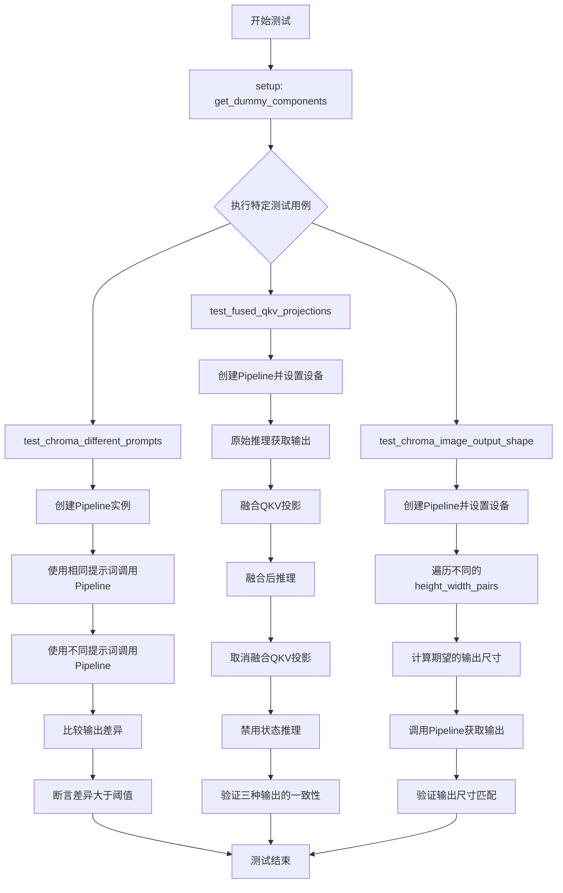
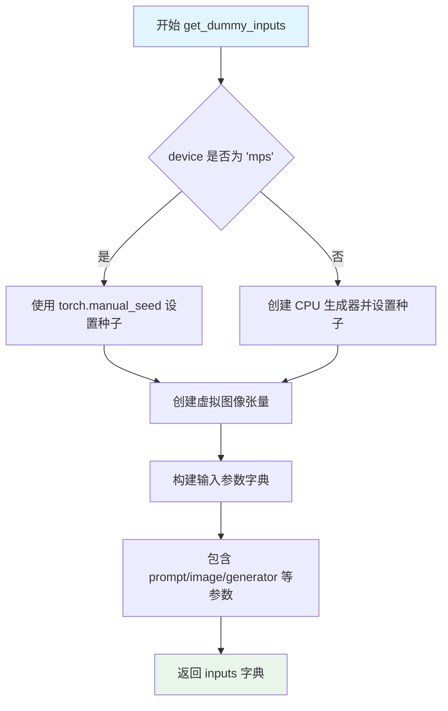
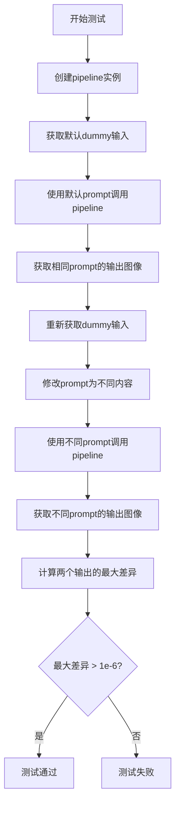
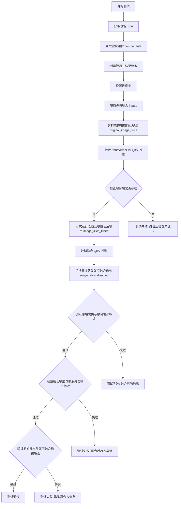
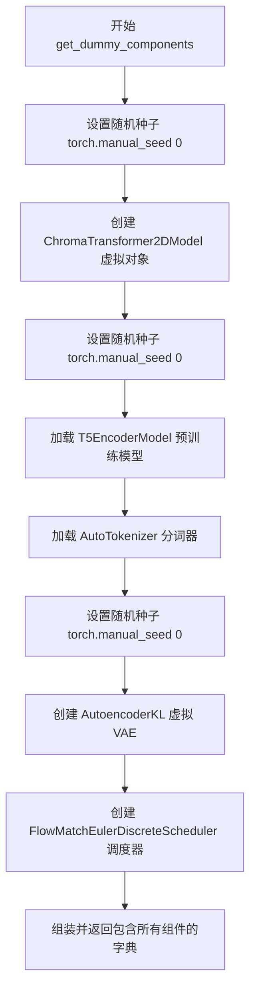
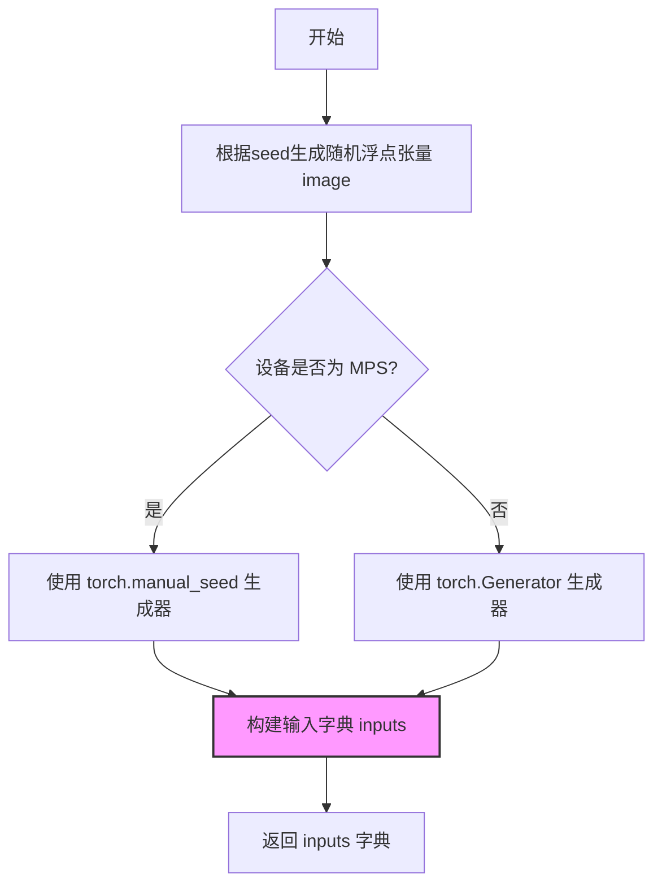
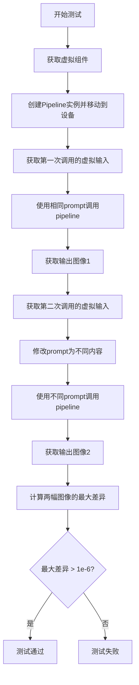
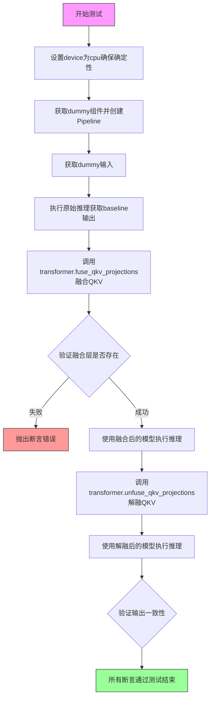

# `diffusers\tests\pipelines\chroma\test_pipeline_chroma_img2img.py` 详细设计文档

这是一个针对ChromaImg2ImgPipeline的单元测试文件，用于验证图像到图像转换Pipeline的功能正确性，包括不同提示词的处理、QKV投影融合以及输出图像尺寸验证等关键功能。

## 整体流程



## 类结构

```
ChromaImg2ImgPipelineFastTests (测试类)
├── 继承自 unittest.TestCase
├── 继承自 PipelineTesterMixin
└── 继承自 FluxIPAdapterTesterMixin
```

## 全局变量及字段


### `ChromaImg2ImgPipelineFastTests.pipeline_class`
    
待测试的图像到图像管道类

类型：`type`
    


### `ChromaImg2ImgPipelineFastTests.params`
    
管道参数集合，包含提示词、高度、宽度、引导比例和提示词嵌入

类型：`frozenset`
    


### `ChromaImg2ImgPipelineFastTests.batch_params`
    
批处理参数集合，仅包含提示词

类型：`frozenset`
    


### `ChromaImg2ImgPipelineFastTests.test_xformers_attention`
    
标志位，指示是否测试xformers注意力机制，Flux模型无xformers处理器

类型：`bool`
    


### `ChromaImg2ImgPipelineFastTests.test_layerwise_casting`
    
标志位，指示是否测试逐层类型转换功能

类型：`bool`
    


### `ChromaImg2ImgPipelineFastTests.test_group_offloading`
    
标志位，指示是否测试组卸载功能

类型：`bool`
    
    

## 全局函数及方法


### `ChromaImg2ImgPipelineFastTests.get_dummy_components`

该方法用于创建用于测试的虚拟（dummy）组件字典，初始化ChromaTransformer2DModel、T5EncoderModel、AutoTokenizer、AutoencoderKL和FlowMatchEulerDiscreteScheduler等扩散模型组件，确保测试的可重复性和确定性。

参数：

- `self`：隐式参数，测试类实例本身
- `num_layers`：`int`，可选，默认为1，控制Transformer模型的层数
- `num_single_layers`：`int`，可选，默认为1，控制Transformer模型的单层数量

返回值：`Dict[str, Any]`，返回包含scheduler、text_encoder、tokenizer、transformer、vae、image_encoder和feature_extractor的字典，用于初始化管道

#### 流程图

```mermaid
flowchart TD
    A[开始 get_dummy_components] --> B[设置随机种子 torch.manual_seed(0)]
    B --> C[创建 ChromaTransformer2DModel]
    C --> D[设置随机种子 torch.manual_seed(0)]
    D --> E[加载预训练 T5EncoderModel]
    E --> F[加载预训练 AutoTokenizer]
    F --> G[设置随机种子 torch.manual_seed(0)]
    G --> H[创建 AutoencoderKL]
    H --> I[创建 FlowMatchEulerDiscreteScheduler]
    I --> J[构建返回字典]
    J --> K[返回组件字典]
    
    C -.->|配置参数| C1[patch_size=1, in_channels=4, num_layers, num_single_layers, attention_head_dim=16, num_attention_heads=2, joint_attention_dim=32, axes_dims_rope=[4,4,8], approximator_hidden_dim=32, approximator_layers=1, approximator_num_channels=16]
    
    H -.->|配置参数| H1[sample_size=32, in_channels=3, out_channels=3, block_out_channels=(4,), layers_per_block=1, latent_channels=1, norm_num_groups=1, shift_factor=0.0609, scaling_factor=1.5035]
```

#### 带注释源码

```python
def get_dummy_components(self, num_layers: int = 1, num_single_layers: int = 1):
    """
    生成用于单元测试的虚拟组件字典。
    
    该方法创建完整的扩散模型所需的所有组件，包括：
    - Transformer模型（ChromaTransformer2DModel）
    - 文本编码器（T5EncoderModel）
    - 分词器（AutoTokenizer）
    - VAE模型（AutoencoderKL）
    - 调度器（FlowMatchEulerDiscreteScheduler）
    
    Args:
        num_layers: int, Transformer模型的层数，默认值为1
        num_single_layers: int, Transformer模型的单层数量，默认值为1
    
    Returns:
        Dict[str, Any]: 包含所有模型组件的字典
    """
    
    # 设置随机种子以确保测试的可重复性
    torch.manual_seed(0)
    
    # 创建ChromaTransformer2DModel实例
    # 参数说明：
    # - patch_size: 图像分块大小
    # - in_channels: 输入通道数
    # - num_layers: 变压器层数
    # - num_single_layers: 单层数量
    # - attention_head_dim: 注意力头维度
    # - num_attention_heads: 注意力头数量
    # - joint_attention_dim: 联合注意力维度
    # - axes_dims_rope: RoPE轴维度
    # - approximator_hidden_dim: 近似器隐藏层维度
    # - approximator_layers: 近似器层数
    # - approximator_num_channels: 近似器通道数
    transformer = ChromaTransformer2DModel(
        patch_size=1,
        in_channels=4,
        num_layers=num_layers,
        num_single_layers=num_single_layers,
        attention_head_dim=16,
        num_attention_heads=2,
        joint_attention_dim=32,
        axes_dims_rope=[4, 4, 8],
        approximator_hidden_dim=32,
        approximator_layers=1,
        approximator_num_channels=16,
    )

    # 重置随机种子以确保文本编码器初始化的一致性
    torch.manual_seed(0)
    
    # 加载预训练的T5文本编码器（用于测试的小型随机模型）
    text_encoder = T5EncoderModel.from_pretrained("hf-internal-testing/tiny-random-t5")

    # 加载对应的分词器
    tokenizer = AutoTokenizer.from_pretrained("hf-internal-testing/tiny-random-t5")

    # 重置随机种子以确保VAE初始化的一致性
    torch.manual_seed(0)
    
    # 创建AutoencoderKL（VAE）实例
    # 参数说明：
    # - sample_size: 样本空间大小
    # - in_channels/out_channels: 输入输出通道数
    # - block_out_channels: 块输出通道数
    # - layers_per_block: 每块层数
    # - latent_channels: 潜在空间通道数
    # - norm_num_groups: 归一化组数
    # - use_quant_conv/use_post_quant_conv: 量化卷积开关
    # - shift_factor/scaling_factor: 缩放因子
    vae = AutoencoderKL(
        sample_size=32,
        in_channels=3,
        out_channels=3,
        block_out_channels=(4,),
        layers_per_block=1,
        latent_channels=1,
        norm_num_groups=1,
        use_quant_conv=False,
        use_post_quant_conv=False,
        shift_factor=0.0609,
        scaling_factor=1.5035,
    )

    # 创建FlowMatchEulerDiscreteScheduler调度器
    # 用于扩散模型的噪声调度
    scheduler = FlowMatchEulerDiscreteScheduler()

    # 返回包含所有组件的字典
    # image_encoder和feature_extractor设为None（此管道未使用）
    return {
        "scheduler": scheduler,
        "text_encoder": text_encoder,
        "tokenizer": tokenizer,
        "transformer": transformer,
        "vae": vae,
        "image_encoder": None,
        "feature_extractor": None,
    }
```


### `ChromaImg2ImgPipelineFastTests.get_dummy_inputs`

该方法用于生成图像到图像转换管道的虚拟测试输入数据，创建一个包含提示词、图像、生成器及各种推理参数的字典，用于测试ChromaImg2ImgPipeline管道的功能和输出。

参数：

- `self`：隐式的`ChromaImg2ImgPipelineFastTests`测试类实例，代表当前测试用例对象
- `device`：`torch.device` 或 `str`，指定计算设备（如"cpu"、"cuda"等），用于将生成的虚拟图像移动到指定设备
- `seed`：`int`，随机种子，默认为0，用于确保测试的可重复性，控制图像和生成器的随机初始化

返回值：`Dict[str, Any]`，返回一个包含管道推理所需全部输入参数的字典，包括提示词、图像张量、随机生成器、推理步数、引导系数、输出尺寸、序列长度、转换强度和输出类型等关键配置。

#### 流程图



#### 带注释源码

```
def get_dummy_inputs(self, device, seed=0):
    """
    生成用于测试 ChromaImg2ImgPipeline 的虚拟输入参数
    
    参数:
        device: torch 设备对象或字符串，表示运行设备
        seed: 随机种子，用于确保测试结果的可重复性
    
    返回:
        包含管道推理所需参数的字典
    """
    
    # 使用 floats_tensor 辅助函数生成随机浮点图像张量
    # 形状为 (1, 3, 32, 32)：1张图像，3通道，32x32分辨率
    # 使用指定 seed 的随机数生成器确保可重复性
    image = floats_tensor((1, 3, 32, 32), rng=random.Random(seed)).to(device)
    
    # 根据设备类型处理随机生成器
    # MPS (Apple Silicon) 设备需要特殊处理，使用 torch.manual_seed
    if str(device).startswith("mps"):
        generator = torch.manual_seed(seed)
    else:
        # 其他设备（如 CPU/CUDA）使用 torch.Generator 并设置种子
        generator = torch.Generator(device="cpu").manual_seed(seed)

    # 构建完整的输入参数字典，包含管道推理所需的所有配置
    inputs = {
        "prompt": "A painting of a squirrel eating a burger",  # 文本提示词
        "image": image,                                         # 输入图像张量
        "generator": generator,                                  # 随机生成器用于确定性推理
        "num_inference_steps": 2,                               # 推理步数
        "guidance_scale": 5.0,                                  # CFG 引导系数
        "height": 8,                                             # 输出图像高度
        "width": 8,                                              # 输出图像宽度
        "max_sequence_length": 48,                              # 文本序列最大长度
        "strength": 0.8,                                        # 图像转换强度
        "output_type": "np",                                    # 输出类型为 numpy 数组
    }
    return inputs
```


### `ChromaImg2ImgPipelineFastTests.test_chroma_different_prompts`

该测试方法验证 ChromaImg2ImgPipeline 在使用不同文本提示（prompt）时能够产生明显不同的图像输出，确保模型对输入提示具有敏感性。

参数：无（仅包含 `self` 参数）

返回值：`None`，该方法为测试方法，通过 `assert` 语句进行断言验证，不返回实际数据

#### 流程图



#### 带注释源码

```python
def test_chroma_different_prompts(self):
    """
    测试 ChromaImg2ImgPipeline 对不同 prompt 的响应差异。
    
    该测试验证当使用不同的文本提示时，pipeline 生成的图像输出应该存在明显差异。
    这确保了文本编码器能够区分不同的输入提示并影响最终的图像生成结果。
    """
    # 步骤1: 使用虚拟组件创建 pipeline 实例并移至指定设备
    pipe = self.pipeline_class(**self.get_dummy_components()).to(torch_device)

    # 步骤2: 获取标准的虚拟输入参数
    inputs = self.get_dummy_inputs(torch_device)
    
    # 步骤3: 使用原始默认 prompt 调用 pipeline 并获取输出图像
    # 使用相同的输入参数确保其他变量（种子、图像等）保持一致
    output_same_prompt = pipe(**inputs).images[0]

    # 步骤4: 重新获取虚拟输入（重置随机种子等状态）
    inputs = self.get_dummy_inputs(torch_device)
    
    # 步骤5: 修改 prompt 为不同的内容
    inputs["prompt"] = "a different prompt"
    
    # 步骤6: 使用修改后的不同 prompt 调用 pipeline
    output_different_prompts = pipe(**inputs).images[0]

    # 步骤7: 计算两个输出图像之间的最大绝对差异
    max_diff = np.abs(output_same_prompt - output_different_prompts).max()

    # 步骤8: 断言验证 - 输出应该存在可检测的差异
    # 注释说明: 由于某些原因，差异可能不会很大，但应该超过最小阈值
    assert max_diff > 1e-6
```


### `ChromaImg2ImgPipelineFastTests.test_fused_qkv_projections`

该测试方法用于验证 ChromaImg2ImgPipeline 中 Transformer 模型的 QKV（Query, Key, Value）投影融合功能。测试流程包括：获取原始输出、融合 QKV 投影后获取输出、取消融合后获取输出，最后通过断言验证三种情况下的输出应保持一致（允许一定的数值误差）。

参数：

- `self`：`ChromaImg2ImgPipelineFastTests`，测试类实例本身

返回值：`None`，该方法为单元测试方法，无返回值，通过断言验证逻辑正确性

#### 流程图



#### 带注释源码

```python
def test_fused_qkv_projections(self):
    """
    测试 QKV 投影融合功能是否正确工作。
    该测试验证融合 QKV 投影不会影响模型的输出结果。
    """
    # 使用 cpu 设备以确保随机数生成器的确定性
    device = "cpu"  # ensure determinism for the device-dependent torch.Generator
    
    # 获取虚拟组件配置（包含 transformer, vae, text_encoder 等）
    components = self.get_dummy_components()
    
    # 使用虚拟组件创建管道实例
    pipe = self.pipeline_class(**components)
    
    # 将管道移至指定设备
    pipe = pipe.to(device)
    
    # 配置进度条（传入 None 表示使用默认配置）
    pipe.set_progress_bar_config(disable=None)

    # 获取测试用的虚拟输入参数
    inputs = self.get_dummy_inputs(device)
    
    # 首次运行管道，获取原始（未融合）输出
    # 取图像最后 3x3 像素区域用于比较
    image = pipe(**inputs).images
    original_image_slice = image[0, -3:, -3:, -1]

    # TODO (sayakpaul): will refactor this once `fuse_qkv_projections()` has been added
    # to the pipeline level.
    # 融合 transformer 中的 QKV 投影层
    pipe.transformer.fuse_qkv_projections()
    
    # 验证融合操作是否成功，检查是否存在 'to_qkv' 融合层
    self.assertTrue(
        check_qkv_fused_layers_exist(pipe.transformer, ["to_qkv"]),
        ("Something wrong with the fused attention layers. Expected all the attention projections to be fused."),
    )

    # 使用融合后的 QKV 投影再次运行管道
    inputs = self.get_dummy_inputs(device)
    image = pipe(**inputs).images
    image_slice_fused = image[0, -3:, -3:, -1]

    # 取消融合 QKV 投影，恢复原始状态
    pipe.transformer.unfuse_qkv_projections()
    
    # 使用取消融合状态的管道再次运行
    inputs = self.get_dummy_inputs(device)
    image = pipe(**inputs).images
    image_slice_disabled = image[0, -3:, -3:, -1]

    # 断言验证：融合 QKV 投影不应影响输出结果
    # 原始输出与融合后输出的差异应在容差范围内
    assert np.allclose(original_image_slice, image_slice_fused, atol=1e-3, rtol=1e-3), (
        "Fusion of QKV projections shouldn't affect the outputs."
    )
    
    # 断言验证：融合后取消融合，输出应恢复到原始状态
    # 融合输出与取消融合输出的差异应在容差范围内
    assert np.allclose(image_slice_fused, image_slice_disabled, atol=1e-3, rtol=1e-3), (
        "Outputs, with QKV projection fusion enabled, shouldn't change when fused QKV projections are disabled."
    )
    
    # 断言验证：原始输出与取消融合后的输出应一致
    # 使用稍大的容差（1e-2）因为可能存在累积误差
    assert np.allclose(original_image_slice, image_slice_disabled, atol=1e-2, rtol=1e-2), (
        "Original outputs should match when fused QKV projections are disabled."
    )
```


### `ChromaImg2ImgPipelineFastTests.test_chroma_image_output_shape`

这是一个测试方法，用于验证ChromaImg2ImgPipeline在不同输入尺寸下的输出图像形状是否符合预期（高度和宽度会向下调整到能被VAE缩放因子整除的值）。

参数：

- `self`：`ChromaImg2ImgPipelineFastTests`，代表测试类实例本身的隐式参数

返回值：`None`，无返回值（测试方法，通过assert语句进行验证）

#### 流程图

```mermaid
flowchart TD
    A[开始测试] --> B[创建Pipeline实例]
    B --> C[获取dummy输入]
    C --> D[定义测试尺寸对: (32, 32) 和 (72, 57)]
    D --> E{遍历尺寸对}
    E -->|当前尺寸| F[计算预期高度: height - height % (vae_scale_factor * 2)]
    F --> G[计算预期宽度: width - width % (vae_scale_factor * 2)]
    G --> H[更新输入的height和width]
    H --> I[执行Pipeline推理]
    I --> J[获取输出图像]
    J --> K[提取输出图像的高度和宽度]
    K --> L{验证输出尺寸 == 预期尺寸}
    L -->|是| M{是否还有更多尺寸}
    L -->|否| N[抛出断言错误]
    M -->|是| E
    M -->|否| O[测试通过]
```

#### 带注释源码

```python
def test_chroma_image_output_shape(self):
    """
    测试ChromaImg2ImgPipeline的图像输出形状
    验证输出图像的尺寸会根据VAE缩放因子进行调整
    """
    # 使用虚拟组件创建Pipeline实例，并移至测试设备
    pipe = self.pipeline_class(**self.get_dummy_components()).to(torch_device)
    
    # 获取虚拟输入参数
    inputs = self.get_dummy_inputs(torch_device)

    # 定义测试用的 height-width 尺寸对列表
    height_width_pairs = [(32, 32), (72, 57)]
    
    # 遍历每一组尺寸
    for height, width in height_width_pairs:
        # 计算预期的输出高度：向下调整到能被 vae_scale_factor * 2 整除的值
        # 这样可以确保输出尺寸与VAE的缩放要求相匹配
        expected_height = height - height % (pipe.vae_scale_factor * 2)
        
        # 计算预期的输出宽度：同样的调整逻辑
        expected_width = width - width % (pipe.vae_scale_factor * 2)

        # 更新输入参数字典中的高度和宽度
        inputs.update({"height": height, "width": width})
        
        # 执行Pipeline推理，获取生成的图像
        image = pipe(**inputs).images[0]
        
        # 从输出图像中提取高度和宽度（图像为CHW格式，第三个维度为通道数）
        output_height, output_width, _ = image.shape
        
        # 断言验证输出尺寸是否与预期尺寸匹配
        assert (output_height, output_width) == (expected_height, expected_width)
```


### `ChromaImg2ImgPipelineFastTests.get_dummy_components`

该方法用于创建测试用的虚拟组件（dummy components），初始化并返回一个包含 ChromaImg2ImgPipeline 所需的所有模型组件的字典，包括 transformer、text_encoder、tokenizer、vae 和 scheduler 等。

参数：

- `num_layers`：`int`，可选，默认值为 `1`，表示 Transformer 模型的总层数
- `num_single_layers`：`int`，可选，默认值为 `1`，表示 Transformer 模型的单独层数

返回值：`Dict`，返回包含所有虚拟组件的字典，包括 scheduler、text_encoder、tokenizer、transformer、vae、image_encoder 和 feature_extractor

#### 流程图



#### 带注释源码

```python
def get_dummy_components(self, num_layers: int = 1, num_single_layers: int = 1):
    """
    创建并返回用于测试的虚拟组件
    
    参数:
        num_layers: Transformer 模型的总层数，默认 1
        num_single_layers: Transformer 模型的单独层数，默认 1
    
    返回:
        包含所有虚拟组件的字典
    """
    
    # 设置随机种子以确保可重复性
    torch.manual_seed(0)
    
    # 创建虚拟的 ChromaTransformer2DModel
    # 用于图像处理的 Transformer 模型
    transformer = ChromaTransformer2DModel(
        patch_size=1,                    # 图像分块大小
        in_channels=4,                   # 输入通道数
        num_layers=num_layers,           # Transformer 层数（可配置）
        num_single_layers=num_single_layers,  # 单独层数（可配置）
        attention_head_dim=16,           # 注意力头维度
        num_attention_heads=2,           # 注意力头数量
        joint_attention_dim=32,          # 联合注意力维度
        axes_dims_rope=[4, 4, 8],        # RoPE 轴维度
        approximator_hidden_dim=32,      # 近似器隐藏层维度
        approximator_layers=1,           # 近似器层数
        approximator_num_channels=16,    # 近似器通道数
    )

    # 重新设置随机种子
    torch.manual_seed(0)
    
    # 加载预训练的 T5 文本编码器（测试用小型模型）
    text_encoder = T5EncoderModel.from_pretrained("hf-internal-testing/tiny-random-t5")

    # 加载对应的分词器
    tokenizer = AutoTokenizer.from_pretrained("hf-internal-testing/tiny-random-t5")

    # 重新设置随机种子
    torch.manual_seed(0)
    
    # 创建虚拟的 VAE（变分自编码器）
    vae = AutoencoderKL(
        sample_size=32,                  # 样本大小
        in_channels=3,                   # 输入通道数（RGB图像）
        out_channels=3,                   # 输出通道数
        block_out_channels=(4,),         # 块输出通道数
        layers_per_block=1,              # 每块层数
        latent_channels=1,               # 潜在空间通道数
        norm_num_groups=1,               # 归一化组数
        use_quant_conv=False,            # 不使用量化卷积
        use_post_quant_conv=False,       # 不使用后量化卷积
        shift_factor=0.0609,             # 偏移因子
        scaling_factor=1.5035,           # 缩放因子
    )

    # 创建 Euler 离散调度器（用于 Flow Match 采样）
    scheduler = FlowMatchEulerDiscreteScheduler()

    # 返回包含所有组件的字典
    return {
        "scheduler": scheduler,           # 调度器
        "text_encoder": text_encoder,     # 文本编码器
        "tokenizer": tokenizer,           # 分词器
        "transformer": transformer,       # 图像 Transformer
        "vae": vae,                       # VAE 模型
        "image_encoder": None,           # 图像编码器（未使用）
        "feature_extractor": None,       # 特征提取器（未使用）
    }
```


### `ChromaImg2ImgPipelineFastTests.get_dummy_inputs`

该方法用于生成虚拟输入数据，为图像到图像的 Chroma 管道测试准备必要的参数，包括随机图像张量、生成器以及推理配置。

参数：

- `self`：隐式参数，TestCase 实例本身
- `device`：`str` 或 `torch.device`，指定张量存放的目标设备（如 "cpu"、"cuda" 等）
- `seed`：`int`，随机数生成器的种子，默认为 0，用于确保测试的可重复性

返回值：`Dict`，返回包含以下键的字典：
- `prompt`：提示词字符串
- `image`：形状为 (1, 3, 32, 32) 的随机浮点张量
- `generator`：PyTorch 随机数生成器
- `num_inference_steps`：推理步数（值为 2）
- `guidance_scale`：引导尺度（值为 5.0）
- `height`：生成图像高度（值为 8）
- `width`：生成图像宽度（值为 8）
- `max_sequence_length`：最大序列长度（值为 48）
- `strength`：图像变换强度（值为 0.8）
- `output_type`：输出类型（值为 "np"，即 NumPy 数组）

#### 流程图



#### 带注释源码

```python
def get_dummy_inputs(self, device, seed=0):
    """
    生成用于测试的虚拟输入数据。
    
    参数:
        device: 目标设备，用于存放生成的张量
        seed: 随机种子，确保测试的可重复性
    
    返回:
        包含管道推理所需参数的字典
    """
    # 使用 floats_tensor 生成形状为 (1, 3, 32, 32) 的随机浮点数张量
    # rng=random.Random(seed) 确保生成的图像是可重现的
    image = floats_tensor((1, 3, 32, 32), rng=random.Random(seed)).to(device)
    
    # 针对 Apple MPS 设备特殊处理，因为 torch.Generator 在 MPS 上可能有兼容性问题
    if str(device).startswith("mps"):
        # MPS 设备使用 torch.manual_seed
        generator = torch.manual_seed(seed)
    else:
        # 其他设备（CPU/CUDA）使用 torch.Generator
        generator = torch.Generator(device="cpu").manual_seed(seed)
    
    # 构建完整的输入参数字典，包含推理所需的全部配置
    inputs = {
        "prompt": "A painting of a squirrel eating a burger",  # 测试用提示词
        "image": image,                                        # 输入图像张量
        "generator": generator,                                # 随机生成器用于确定性推理
        "num_inference_steps": 2,                             # 扩散推理步数
        "guidance_scale": 5.0,                                # CFG 引导强度
        "height": 8,                                          # 输出图像高度
        "width": 8,                                           # 输出图像宽度
        "max_sequence_length": 48,                            # 文本编码最大序列长度
        "strength": 0.8,                                      # 图像变换强度 (0-1)
        "output_type": "np",                                  # 输出格式为 NumPy 数组
    }
    return inputs
```


### `ChromaImg2ImgPipelineFastTests.test_chroma_different_prompts`

该测试方法用于验证 ChromaImg2ImgPipeline 在使用不同 prompt 时能否生成不同的图像输出，确保模型对文本提示的响应能力。

参数：

- `self`：`ChromaImg2ImgPipelineFastTests`，测试类实例本身，包含 pipeline_class 等属性

返回值：`None`，该方法为测试方法，通过 assert 断言验证结果，不返回具体数据

#### 流程图



#### 带注释源码

```python
def test_chroma_different_prompts(self):
    """
    测试 ChromaImg2ImgPipeline 在使用不同 prompt 时能否产生不同的输出
    
    测试流程：
    1. 创建 pipeline 实例
    2. 使用相同 prompt 调用一次
    3. 修改 prompt 为不同内容再次调用
    4. 验证两次输出的差异大于阈值
    """
    # 获取虚拟组件用于测试（transformer, text_encoder, vae, scheduler等）
    components = self.get_dummy_components()
    
    # 使用虚拟组件创建 pipeline 并移动到测试设备
    # self.pipeline_class 指向 ChromaImg2ImgPipeline
    pipe = self.pipeline_class(**components).to(torch_device)

    # 获取第一次调用的虚拟输入参数
    # 包含 prompt: "A painting of a squirrel eating a burger"
    inputs = self.get_dummy_inputs(torch_device)
    
    # 第一次调用 pipeline，使用原始 prompt
    # 返回 PipelineOutput 对象，包含 images 属性
    output_same_prompt = pipe(**inputs).images[0]

    # 重新获取输入参数（确保独立性）
    inputs = self.get_dummy_inputs(torch_device)
    
    # 修改 prompt 为不同的内容
    inputs["prompt"] = "a different prompt"
    
    # 第二次调用 pipeline，使用不同的 prompt
    output_different_prompts = pipe(**inputs).images[0]

    # 计算两幅输出图像的绝对差异，并取最大值
    max_diff = np.abs(output_same_prompt - output_different_prompts).max()

    # 验证输出应该不同（因为使用了不同的 prompt）
    # 注：由于某些原因，差异可能不大，所以阈值设为 1e-6
    assert max_diff > 1e-6
```


### `ChromaImg2ImgPipelineFastTests.test_fused_qkv_projections`

该测试方法用于验证 ChromaImg2ImgPipeline 中变换器(Transformer)的 QKV（Query-Key-Value）投影融合功能是否正确工作。测试通过比较融合前后的输出来确保融合操作不会影响模型的推理结果，同时验证融合与解融操作的可逆性。

参数：无（仅包含 self 隐式参数）

返回值：`None`，该方法为测试方法，通过断言验证逻辑，不返回任何值

#### 流程图



#### 带注释源码

```python
def test_fused_qkv_projections(self):
    """
    测试变换器中QKV投影的融合功能。
    验证融合QKV投影后，模型的输出应该与融合前保持一致，
    同时验证融合/解融操作的可逆性。
    """
    # 设置设备为CPU，确保torch.Generator的确定性
    device = "cpu"  # ensure determinism for the device-dependent torch.Generator
    
    # 获取测试用的虚拟组件（transformer, vae, text_encoder等）
    components = self.get_dummy_components()
    
    # 使用虚拟组件创建ChromaImg2ImgPipeline实例
    pipe = self.pipeline_class(**components)
    
    # 将Pipeline移至指定设备
    pipe = pipe.to(device)
    
    # 配置进度条（disable=None表示使用默认设置）
    pipe.set_progress_bar_config(disable=None)

    # 获取虚拟输入数据（包含prompt、image、generator等）
    inputs = self.get_dummy_inputs(device)
    
    # 执行推理并获取输出图像
    image = pipe(**inputs).images
    
    # 提取图像右下角3x3区域用于后续比较（取最后一个通道）
    original_image_slice = image[0, -3:, -3:, -1]

    # 调用transformer的fuse_qkv_projections方法融合QKV投影
    # TODO: 未来会在pipeline级别添加此功能，届时将进行重构
    pipe.transformer.fuse_qkv_projections()
    
    # 断言验证融合是否成功，检查是否存在融合后的to_qkv层
    self.assertTrue(
        check_qkv_fused_layers_exist(pipe.transformer, ["to_qkv"]),
        ("Something wrong with the fused attention layers. Expected all the attention projections to be fused."),
    )

    # 重新获取输入并使用融合后的模型执行推理
    inputs = self.get_dummy_inputs(device)
    image = pipe(**inputs).images
    image_slice_fused = image[0, -3:, -3:, -1]

    # 调用unfuse_qkv_projections解融QKV投影
    pipe.transformer.unfuse_qkv_projections()
    
    # 使用解融后的模型再次执行推理
    inputs = self.get_dummy_inputs(device)
    image = pipe(**inputs).images
    image_slice_disabled = image[0, -3:, -3:, -1]

    # 断言1: 融合QKV投影不应改变输出
    # 允许1e-3的绝对误差和1e-3的相对误差
    assert np.allclose(original_image_slice, image_slice_fused, atol=1e-3, rtol=1e-3), (
        "Fusion of QKV projections shouldn't affect the outputs."
    )
    
    # 断言2: 融合后再解融，输出应该与融合状态下一致
    assert np.allclose(image_slice_fused, image_slice_disabled, atol=1e-3, rtol=1e-3), (
        "Outputs, with QKV projection fusion enabled, shouldn't change when fused QKV projections are disabled."
    )
    
    # 断言3: 最终解融后的输出应该与原始输出匹配
    # 此处使用更大的容差(1e-2)因为经过了融合-解融操作
    assert np.allclose(original_image_slice, image_slice_disabled, atol=1e-2, rtol=1e-2), (
        "Original outputs should match when fused QKV projections are disabled."
    )
```

### 关键组件信息

| 组件名称 | 描述 |
|---------|------|
| `ChromaImg2ImgPipeline` | Chroma图像到图像生成的Pipeline类 |
| `ChromaTransformer2DModel` | Chroma变换器模型，支持QKV投影融合 |
| `check_qkv_fused_layers_exist` | 工具函数，用于检查融合层是否存在 |
| `FlowMatchEulerDiscreteScheduler` | 流匹配欧拉离散调度器 |

### 潜在技术债务与优化空间

1. **测试断言容差不一致**: 最后一个断言使用 `atol=1e-2` 而前两个使用 `atol=1e-3`，这种不一致可能导致潜在的精度问题被忽略
2. **TODO待办事项**: 代码中存在TODO注释，表明`fuse_qkv_projections()`未来需要在Pipeline级别实现，目前仅在Transformer级别可用
3. **测试覆盖度**: 仅测试了单次融合/解融操作，未测试多次融合解融的稳定性
4. **设备依赖**: 强制使用CPU设备进行测试，未覆盖GPU/CUDA设备场景

### 其它设计说明

- **设计目标**: 确保QKV投影融合优化不会影响模型输出的正确性
- **约束条件**: 测试必须在CPU设备上运行以保证确定性
- **错误处理**: 使用`assertTrue`和`np.allclose`进行验证，任何不匹配都会抛出详细的错误信息
- **数据流**: 测试数据流为 Baseline输出 → 融合 → 融合输出 → 解融 → 解融输出，通过三次输出比较验证一致性


### `ChromaImg2ImgPipelineFastTests.test_chroma_image_output_shape`

该测试方法用于验证 ChromaImg2ImgPipeline 图像到图像管道在不同输入尺寸下的输出形状是否符合预期，通过计算 VAE 缩放因子后的期望尺寸与实际输出尺寸进行比对断言。

参数：无（仅使用 `self` 实例属性）

返回值：`None`（测试方法无返回值，通过 `assert` 断言进行验证）

#### 流程图

```mermaid
flowchart TD
    A[开始测试] --> B[创建管道实例并加载到设备]
    B --> C[获取虚拟输入参数]
    C --> D[定义测试尺寸对: 32x32 和 72x57]
    D --> E{遍历尺寸对}
    E -->|当前尺寸: height, width| F[计算期望高度: height - height % (vae_scale_factor * 2)]
    F --> G[计算期望宽度: width - width % (vae_scale_factor * 2)]
    G --> H[更新输入参数: height 和 width]
    H --> I[调用管道生成图像]
    I --> J[获取输出图像的形状]
    J --> K[提取 output_height, output_width]
    K --> L{断言输出尺寸 == 期望尺寸}
    L -->|通过| E
    L -->|失败| M[抛出 AssertionError]
    E --> N[所有尺寸测试完成]
    N --> O[结束测试]
```

#### 带注释源码

```python
def test_chroma_image_output_shape(self):
    """
    测试 ChromaImg2ImgPipeline 的输出图像形状是否正确。
    
    该测试验证管道能够根据输入的 height 和 width 参数，
    以及 VAE 缩放因子，计算并输出正确尺寸的图像。
    """
    # 步骤1: 创建管道实例
    # 使用 get_dummy_components() 获取虚拟组件配置
    # 并将管道移动到 torch_device 指定设备上
    pipe = self.pipeline_class(**self.get_dummy_components()).to(torch_device)
    
    # 步骤2: 获取虚拟输入参数
    # 包含 prompt、image、generator、num_inference_steps 等参数
    inputs = self.get_dummy_inputs(torch_device)
    
    # 步骤3: 定义要测试的 height-width 尺寸对列表
    # 测试 (32, 32) 和 (72, 57) 两种尺寸组合
    height_width_pairs = [(32, 32), (72, 57)]
    
    # 步骤4: 遍历每一组尺寸进行测试
    for height, width in height_width_pairs:
        # 计算期望的输出高度
        # 公式: height - height % (vae_scale_factor * 2)
        # 这确保输出高度是 vae_scale_factor * 2 的整数倍
        expected_height = height - height % (pipe.vae_scale_factor * 2)
        
        # 计算期望的输出宽度
        # 同样确保输出宽度是 vae_scale_factor * 2 的整数倍
        expected_width = width - width % (pipe.vae_scale_factor * 2)
        
        # 步骤5: 更新输入参数中的 height 和 width
        inputs.update({"height": height, "width": width})
        
        # 步骤6: 调用管道进行推理
        # 传入更新后的输入参数，获取生成的图像
        # pipe() 返回一个对象，其 .images 属性包含生成的图像列表
        image = pipe(**inputs).images[0]
        
        # 步骤7: 获取输出图像的形状
        # 图像形状为 [C, H, W]，获取高度和宽度维度
        output_height, output_width, _ = image.shape
        
        # 步骤8: 断言验证
        # 检查实际输出尺寸是否与期望尺寸匹配
        assert (output_height, output_width) == (expected_height, expected_width)
```

## 关键组件


### ChromaImg2ImgPipeline

核心图像到图像转换的Pipeline类，整合了Transformer模型、VAE和文本编码器，实现基于文本提示的图像编辑功能。

### ChromaTransformer2DModel

Chroma专用的2D变换器模型，支持patch处理、注意力机制和RoPE位置编码，用于处理图像特征的关键组件。

### T5EncoderModel

基于T5架构的文本编码器，将文本提示转换为embedding向量，为图像生成提供文本条件信息。

### AutoencoderKL

变分自编码器(VAE)模型，负责图像的编码和解码，支持潜在空间的压缩与重建，包含量化卷积和后量化卷积的开关配置。

### FlowMatchEulerDiscreteScheduler

基于Flow Matching的欧拉离散调度器，控制去噪过程中的噪声调度和采样步数。

### QKV投影融合机制

通过fuse_qkv_projections()和unfuse_qkv_projections()方法实现注意力机制的QKV投影融合与解融合，用于优化推理性能。

### 图像尺寸对齐逻辑

自动计算VAE缩放因子并将输出尺寸对齐到合适的边界，确保不同输入尺寸下的输出一致性。


## 问题及建议


### 已知问题

-   **硬编码随机种子**：多次使用 `torch.manual_seed(0)` 导致测试结果确定性过强，可能隐藏潜在的随机性问题，且无法有效测试随机场景
-   **TODO 技术债务**：存在 TODO 注释标记 `fuse_qkv_projections()` 需要重构，但长期未处理
-   **不可靠的测试断言**：`test_chroma_different_prompts` 中的注释显示输出差异小于预期，测试本身可能存在设计问题
-   **设备兼容性问题**：仅针对 MPS 设备有特殊处理逻辑，其他设备（如 CUDA）的边界情况未覆盖
-   **缺少资源清理**：测试中未显式释放 GPU 内存（如 `del pipe`, `torch.cuda.empty_cache()`），可能导致测试资源泄漏
-   **魔法数字和硬编码**：大量配置参数（如 `attention_head_dim=16`, `num_attention_heads=2`, `shift_factor=0.0609` 等）硬编码在代码中，缺乏配置管理
-   **测试参数覆盖不足**：参数集定义了 `prompt_embeds` 但测试中未验证相关功能
-   **异常处理缺失**：未对模型加载失败、推理超时等异常情况进行测试

### 优化建议

-   **随机化测试**：使用动态随机种子或在类级别提供种子配置选项，增加测试覆盖率
-   **清理 TODO**：尽快实现或移除 TODO 注释标记的功能
-   **增强设备测试**：添加跨设备测试（CPU/CUDA/MPS）的统一处理逻辑
-   **资源管理**：使用 `setUp` 和 `tearDown` 方法管理测试资源，确保内存释放
-   **配置外部化**：将硬编码参数提取为配置文件或 fixture，提高可维护性
-   **完善测试覆盖**：添加负向提示词、回调函数、错误处理等场景的测试用例
-   **断言改进**：重新审视 `test_chroma_different_prompts` 的断言逻辑，确保测试有效性

## 其它


### 设计目标与约束

本测试套件的设计目标是为ChromaImg2ImgPipeline（基于Flux架构的图像到图像转换pipeline）提供全面而高效的单元测试和集成测试。核心约束包括：1）使用轻量级的虚拟模型（tiny-random-t5、虚拟VAE和Transformer）以确保测试执行速度；2）支持CPU和GPU（torch_device）环境测试；3）覆盖pipeline的核心功能（推理、QKV融合、输出形状验证）；4）遵循diffusers库的测试模式（PipelineTesterMixin、FluxIPAdapterTesterMixin）。

### 错误处理与异常设计

测试中的错误处理主要体现在：1）使用np.allclose进行浮点数近似比较（atol和rtol参数），允许数值计算的微小误差；2）对于mps设备特殊处理generator初始化方式；3）预期输出差异较小时（max_diff > 1e-6）仍判定为不同prompt产生不同结果。潜在的异常场景未在测试中显式覆盖，如：模型加载失败、tokenizer配置错误、invalid图像尺寸、NaN输出等。

### 数据流与状态机

测试数据的流动路径为：get_dummy_components()创建组件字典 → get_dummy_inputs()生成带随机图像的输入参数 → pipeline(**inputs)执行推理 → 验证输出图像的形状和数值。状态转换包括：pipeline创建态 → 推理态 → QKV融合态 → 卸载融合态。测试通过set_progress_bar_config(disable=None)控制进度条显示。

### 外部依赖与接口契约

核心依赖包括：1）transformers库（T5EncoderModel、AutoTokenizer）；2）diffusers库（AutoencoderKL、ChromaImg2ImgPipeline、ChromaTransformer2DModel、FlowMatchEulerDiscreteScheduler）；3）PyTorch和NumPy计算库。接口契约：pipeline接受prompt、image、generator、num_inference_steps、guidance_scale、height、width、max_sequence_length、strength、output_type等参数，返回包含images属性的对象。

### 版本兼容性与平台适配

测试需要适配的平台包括：1）CPU设备（用于确定性的torch.Generator初始化）；2）CUDA/GPU设备（torch_device）；3）Apple MPS设备（special case处理）。FlowMatchEulerDiscreteScheduler是较新的调度器，测试验证了与ChromaTransformer2DModel的兼容性。test_layerwise_casting和test_group_offloading测试反映了与diffusers新特性的集成。

### 性能基准与优化空间

测试未包含明确的性能基准测试（如推理时间、内存占用）。优化建议：1）可添加推理速度测试（@torch.no_grad装饰器）；2）可添加内存峰值监控；3）get_dummy_components中多次调用torch.manual_seed(0)可重构为单次调用；4）重复的pipeline实例化可考虑fixture共享。

### 测试覆盖度分析

当前覆盖度：✓ 不同prompt推理 ✓ QKV融合/卸载 ✓ 输出形状验证 ✗ 错误输入处理 ✗ 并发/多线程 ✗ 大尺寸图像 ✗ 极端参数值（guidance_scale=0/∞） ✗ 模型量化/剪枝兼容。建议补充边界条件和负向测试用例。

### 配置管理与超参数

关键超参数通过成员变量和get_dummy_inputs暴露：params（必填参数集）、batch_params（批处理参数集）、num_inference_steps=2（简化测试）、guidance_scale=5.0、height=8、width=8、strength=0.8、max_sequence_length=48。这些值经过优化以平衡测试覆盖和执行速度。

    