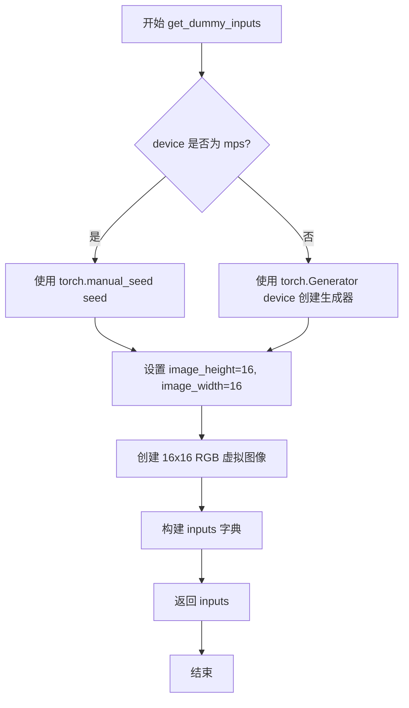
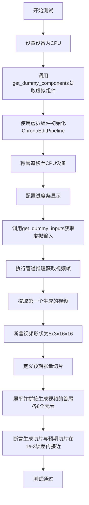
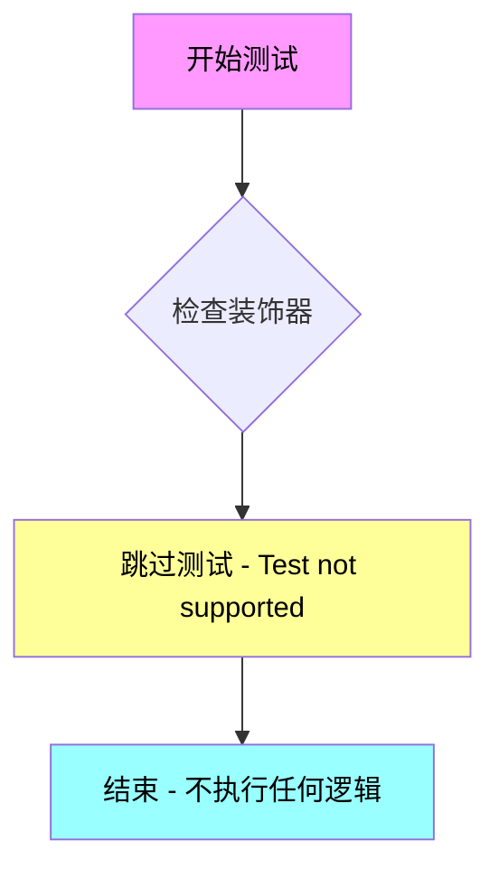
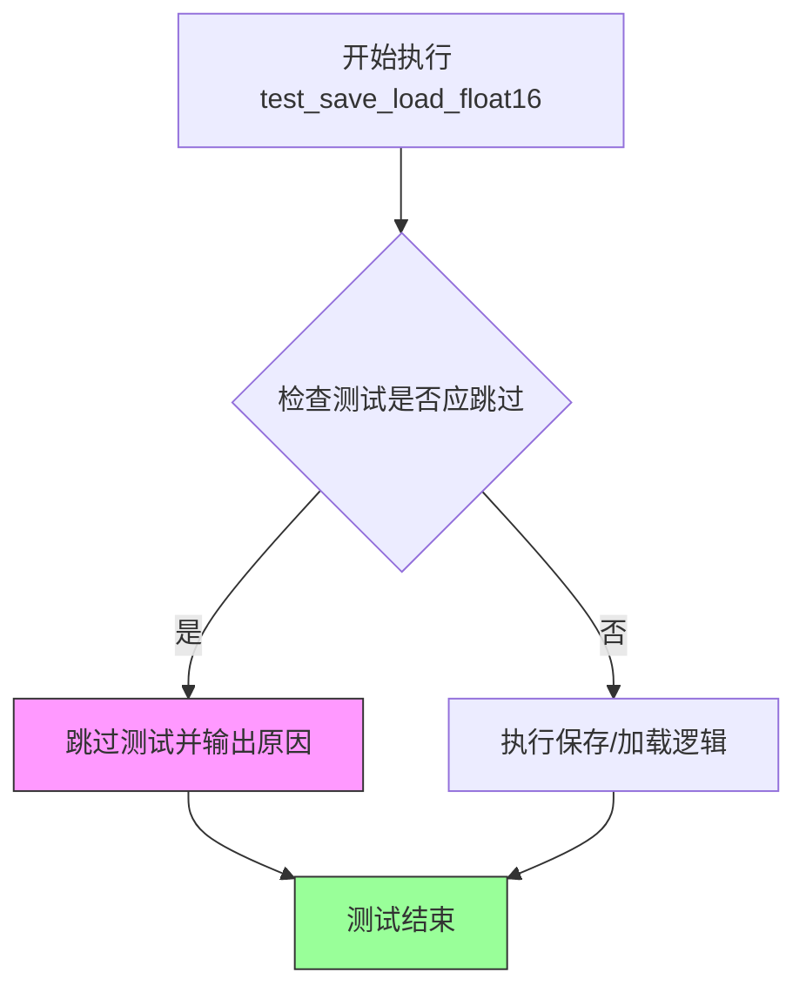

# `diffusers\tests\pipelines\chronoedit\test_chronoedit.py` 详细设计文档

这是一个针对ChronoEditPipeline的单元测试文件，用于验证视频生成模型的推理功能是否正确，通过创建虚拟组件和输入，执行推理并验证输出视频的形状和内容是否符合预期。

## 整体流程

```mermaid
graph TD
    A[开始测试] --> B[创建虚拟组件 get_dummy_components]
B --> C[初始化管道 ChronoEditPipeline]
C --> D[创建虚拟输入 get_dummy_inputs]
D --> E[执行推理 pipe(**inputs)]
E --> F{推理成功?}
F -- 否 --> G[测试失败]
F -- 是 --> H[验证视频形状 (5,3,16,16)]
H --> I[验证视频内容 slice]
I --> J[测试通过]
```

## 类结构

```
PipelineTesterMixin (测试混入类)
└── ChronoEditPipelineFastTests (具体测试类)
    └── unittest.TestCase
```

## 全局变量及字段


### `torch`
    
PyTorch深度学习库，提供张量运算和神经网络构建功能

类型：`module`
    


### `Image`
    
PIL图像库，用于图像创建和处理

类型：`module`
    


### `AutoTokenizer`
    
HuggingFace Transformers的自动tokenizer加载器

类型：`class`
    


### `CLIPImageProcessor`
    
CLIP模型的图像预处理器

类型：`class`
    


### `CLIPVisionConfig`
    
CLIP视觉模型的配置类

类型：`class`
    


### `CLIPVisionModelWithProjection`
    
带投影的CLIP视觉模型

类型：`class`
    


### `T5EncoderModel`
    
T5文本编码器模型

类型：`class`
    


### `AutoencoderKLWan`
    
Wan VAE自编码器模型

类型：`class`
    


### `ChronoEditPipeline`
    
ChronoEdit视频编辑扩散管道

类型：`class`
    


### `ChronoEditTransformer3DModel`
    
ChronoEdit的3D变换器模型

类型：`class`
    


### `FlowMatchEulerDiscreteScheduler`
    
Flow Match欧拉离散调度器

类型：`class`
    


### `enable_full_determinism`
    
启用测试完全确定性功能的函数

类型：`function`
    


### `TEXT_TO_IMAGE_BATCH_PARAMS`
    
文本到图像批处理参数集合

类型：`set`
    


### `TEXT_TO_IMAGE_IMAGE_PARAMS`
    
文本到图像图像参数集合

类型：`set`
    


### `TEXT_TO_IMAGE_PARAMS`
    
文本到图像基础参数集合

类型：`set`
    


### `PipelineTesterMixin`
    
管道测试的通用测试用例混入类

类型：`class`
    


### `ChronoEditPipelineFastTests.pipeline_class`
    
指定要测试的管道类ChronoEditPipeline

类型：`type`
    


### `ChronoEditPipelineFastTests.params`
    
管道推理参数集合，包含prompt、num_inference_steps等

类型：`frozenset`
    


### `ChronoEditPipelineFastTests.batch_params`
    
批处理参数集合，用于批量推理测试

类型：`set`
    


### `ChronoEditPipelineFastTests.image_params`
    
图像参数集合，用于图像相关测试

类型：`set`
    


### `ChronoEditPipelineFastTests.image_latents_params`
    
图像潜在向量参数集合

类型：`set`
    


### `ChronoEditPipelineFastTests.required_optional_params`
    
必需的可选参数集合，包含return_dict、generator等

类型：`frozenset`
    


### `ChronoEditPipelineFastTests.test_xformers_attention`
    
标志位，指示是否测试xformers注意力机制

类型：`bool`
    


### `ChronoEditPipelineFastTests.supports_dduf`
    
标志位，指示管道是否支持DDUF功能

类型：`bool`
    
    

## 全局函数及方法


### `ChronoEditPipelineFastTests.get_dummy_components`

该方法是一个测试辅助函数，用于为 ChronoEditPipeline 单元测试创建虚拟（dummy）组件。它初始化了 VAE（变分自编码器）、调度器、文本编码器、分词器、变换器、图像编码器和图像处理器等所有测试所需的组件，并返回一个包含这些组件的字典，以供后续的推理测试使用。

参数：该方法无显式参数（隐式参数 `self` 为 unittest.TestCase 实例）

返回值：`Dict[str, Any]`，返回一个包含虚拟组件的字典，键包括 "transformer"、"vae"、"scheduler"、"text_encoder"、"tokenizer"、"image_encoder" 和 "image_processor"

#### 流程图

```mermaid
flowchart TD
    A[开始 get_dummy_components] --> B[设置随机种子 torch.manual_seed(0)]
    B --> C[创建 AutoencoderKLWan 虚拟 VAE]
    C --> D[创建 FlowMatchEulerDiscreteScheduler 虚拟调度器]
    D --> E[创建 T5EncoderModel 虚拟文本编码器]
    E --> F[创建 AutoTokenizer 虚拟分词器]
    F --> G[创建 ChronoEditTransformer3DModel 虚拟变换器]
    G --> H[创建 CLIPVisionConfig 虚拟图像编码器配置]
    H --> I[创建 CLIPVisionModelWithProjection 虚拟图像编码器]
    I --> J[创建 CLIPImageProcessor 虚拟图像处理器]
    J --> K[组装 components 字典]
    K --> L[返回 components 字典]
```

#### 带注释源码

```python
def get_dummy_components(self):
    """创建用于测试的虚拟组件集合"""
    # 设置随机种子以确保测试可重复性
    torch.manual_seed(0)
    # 创建虚拟 VAE（变分自编码器），用于图像的编码和解码
    vae = AutoencoderKLWan(
        base_dim=3,
        z_dim=16,
        dim_mult=[1, 1, 1, 1],
        num_res_blocks=1,
        temperal_downsample=[False, True, True],
    )

    # 再次设置随机种子，确保各组件初始化一致性
    torch.manual_seed(0)
    # 创建调度器（虽然注释提到 TODO: impl FlowDPMSolverMultistepScheduler）
    scheduler = FlowMatchEulerDiscreteScheduler(shift=7.0)
    # 从预训练模型加载虚拟 T5 文本编码器
    text_encoder = T5EncoderModel.from_pretrained("hf-internal-testing/tiny-random-t5")
    # 加载对应的分词器
    tokenizer = AutoTokenizer.from_pretrained("hf-internal-testing/tiny-random-t5")

    # 再次设置随机种子，确保变换器初始化一致性
    torch.manual_seed(0)
    # 创建 ChronoEdit 专用的 3D 变换器模型
    transformer = ChronoEditTransformer3DModel(
        patch_size=(1, 2, 2),
        num_attention_heads=2,
        attention_head_dim=12,
        in_channels=36,
        out_channels=16,
        text_dim=32,
        freq_dim=256,
        ffn_dim=32,
        num_layers=2,
        cross_attn_norm=True,
        qk_norm="rms_norm_across_heads",
        rope_max_seq_len=32,
        image_dim=4,
    )

    # 配置 CLIP 图像编码器
    torch.manual_seed(0)
    image_encoder_config = CLIPVisionConfig(
        hidden_size=4,
        projection_dim=4,
        num_hidden_layers=2,
        num_attention_heads=2,
        image_size=32,
        intermediate_size=16,
        patch_size=1,
    )
    # 创建虚拟 CLIP 图像编码器
    image_encoder = CLIPVisionModelWithProjection(image_encoder_config)

    # 创建图像预处理器
    torch.manual_seed(0)
    image_processor = CLIPImageProcessor(crop_size=32, size=32)

    # 组装所有组件到字典中返回
    components = {
        "transformer": transformer,
        "vae": vae,
        "scheduler": scheduler,
        "text_encoder": text_encoder,
        "tokenizer": tokenizer,
        "image_encoder": image_encoder,
        "image_processor": image_processor,
    }
    return components
```


### `ChronoEditPipelineFastTests.get_dummy_inputs`

该方法为 ChronoEditPipeline 图像/视频生成测试生成虚拟输入参数（Dummy Inputs），包括图像、提示词、生成器、推理步数等配置，用于单元测试中的推理验证。

参数：

- `device`：`str` 或 `torch.device`，目标设备，用于创建随机数生成器
- `seed`：`int`，随机种子，默认值为 0，用于确保测试可重复性

返回值：`Dict`，包含以下键值对的字典：
  - `image`：PIL.Image.Image，虚拟输入图像
  - `prompt`：`str`，输入提示词
  - `negative_prompt`：`str`，负向提示词
  - `height`：`int`，图像高度
  - `width`：`int`，图像宽度
  - `generator`：`torch.Generator`，随机数生成器
  - `num_inference_steps`：`int`，推理步数
  - `guidance_scale`：`float`，引导强度
  - `num_frames`：`int`，生成帧数
  - `max_sequence_length`：`int`，最大序列长度
  - `output_type`：`str`，输出类型

#### 流程图



#### 带注释源码

```python
def get_dummy_inputs(self, device, seed=0):
    """
    生成用于测试的虚拟输入参数
    
    参数:
        device: 目标设备 (如 'cpu', 'cuda', 'mps')
        seed: 随机种子，用于确保测试可重复性
    
    返回:
        包含测试所需所有输入参数的字典
    """
    # 判断设备类型，MPS 设备使用不同的随机数生成方式
    if str(device).startswith("mps"):
        # MPS 设备直接使用 manual_seed
        generator = torch.manual_seed(seed)
    else:
        # 其他设备创建 Generator 对象并设置种子
        generator = torch.Generator(device=device).manual_seed(seed)
    
    # 设置虚拟图像的尺寸
    image_height = 16
    image_width = 16
    
    # 创建一个虚拟的 RGB 图像用于测试
    image = Image.new("RGB", (image_width, image_height))
    
    # 构建完整的输入参数字典
    inputs = {
        "image": image,                      # 输入图像
        "prompt": "dance monkey",             # 文本提示词
        "negative_prompt": "negative",        # 负向提示词 (TODO: 待完善)
        "height": image_height,              # 输出高度
        "width": image_width,                # 输出宽度
        "generator": generator,              # 随机数生成器
        "num_inference_steps": 2,            # 推理步数 (减少以加快测试)
        "guidance_scale": 6.0,               # Classifier-free guidance 强度
        "num_frames": 5,                     # 生成帧数 (视频)
        "max_sequence_length": 16,           # T5 文本编码器最大序列长度
        "output_type": "pt",                 # 输出类型: PyTorch tensor
    }
    
    # 返回构建好的输入参数字典，供 pipeline 调用
    return inputs
```


### `ChronoEditPipelineFastTests.test_inference`

该方法是一个单元测试，用于验证ChronoEditPipeline在CPU设备上的推理功能是否正常。测试通过创建虚拟组件和输入，执行管道推理，验证生成的视频帧形状是否符合预期（5帧，3通道，16x16像素），并检查生成的像素值是否与预期值在给定误差范围内接近。

参数：

- `self`：隐式参数，测试类实例本身

返回值：无（测试方法，返回None）

#### 流程图



#### 带注释源码

```python
def test_inference(self):
    """
    测试ChronoEditPipeline的基本推理功能
    
    该测试方法验证管道能够:
    1. 正确初始化并加载虚拟组件
    2. 在CPU设备上执行推理
    3. 生成符合预期形状的视频帧
    4. 产生数值上可重复的输出结果
    """
    # 设置测试设备为CPU
    device = "cpu"

    # 获取预配置的虚拟组件字典
    # 包含: transformer, vae, scheduler, text_encoder, tokenizer, image_encoder, image_processor
    components = self.get_dummy_components()
    
    # 使用虚拟组件实例化管道
    pipe = self.pipeline_class(**components)
    
    # 将管道移至指定设备(CPU)
    pipe.to(device)
    
    # 配置进度条:disable=None表示显示进度条
    pipe.set_progress_bar_config(disable=None)

    # 获取虚拟输入参数
    # 包含: image, prompt, negative_prompt, height, width, generator, 
    #       num_inference_steps, guidance_scale, num_frames, max_sequence_length, output_type
    inputs = self.get_dummy_inputs(device)
    
    # 执行管道推理,返回结果对象
    # 调用__call__方法,参数解包inputs字典
    result = pipe(**inputs)
    
    # 从结果中获取生成的视频帧列表
    video = result.frames
    
    # 提取第一个(通常也是唯一的)生成的视频
    generated_video = video[0]
    
    # 断言验证:视频形状应为(帧数, 通道数, 高度, 宽度)
    # 预期: 5帧, RGB 3通道, 16x16分辨率
    self.assertEqual(generated_video.shape, (5, 3, 16, 16))

    # 预期输出的张量切片(用于数值验证)
    # 包含16个浮点数值
    # fmt: off
    expected_slice = torch.tensor([0.4525, 0.4520, 0.4485, 0.4534, 0.4523, 0.4522, 0.4529, 0.4528, 0.5022, 0.5064, 0.5011, 0.5061, 0.5028, 0.4979, 0.5117, 0.5192])
    # fmt: on

    # 将生成视频展平为一维张量
    generated_slice = generated_video.flatten()
    
    # 提取首尾各8个元素,共16个元素进行对比
    # 这样可以验证生成结果的前部和后部像素值
    generated_slice = torch.cat([generated_slice[:8], generated_slice[-8:]])
    
    # 断言验证:生成切片与预期切片数值接近
    # 允许绝对误差为1e-3
    self.assertTrue(torch.allclose(generated_slice, expected_slice, atol=1e-3))
```


### `ChronoEditPipelineFastTests.test_attention_slicing_forward_pass`

该函数是一个被跳过的单元测试方法，用于测试 ChronoEditPipeline 的注意力切片前向传播功能。由于当前实现不支持该测试，方法体为空，直接跳过执行。

参数：

- `self`：隐式参数，类型为 `ChronoEditPipelineFastTests`，表示测试类实例本身

返回值：`None`，该方法为测试方法，不返回任何值

#### 流程图



#### 带注释源码

```python
@unittest.skip("Test not supported")
def test_attention_slicing_forward_pass(self):
    """
    测试 ChronoEditPipeline 的注意力切片（attention slicing）前向传播功能。
    
    注意：此测试当前被标记为不支持，跳过执行。该测试原本用于验证
    注意力切片优化是否能正确工作，但目前尚未实现相关功能。
    
    参数:
        self: ChronoEditPipelineFastTests 实例
        
    返回值:
        None
        
    异常:
        无（测试被跳过）
    """
    pass
```


### `ChronoEditPipelineFastTests.test_inference_batch_single_identical`

该测试方法用于验证批量推理时，单个样本生成的输出与批量推理中相同样本的输出是否一致，以确保批处理逻辑的正确性。

参数：

- `self`：`ChronoEditPipelineFastTests` 类型，当前测试类的实例对象

返回值：`None`，该方法无返回值（测试方法）

#### 流程图

```mermaid
flowchart TD
    A[开始] --> B[被@unittest.skip装饰器跳过]
    B --> C[直接返回,不执行任何测试逻辑]
    C --> D[结束]
    
    style B fill:#ffcccc
    style C fill:#ffffcc
```

#### 带注释源码

```python
@unittest.skip("TODO: revisit failing as it requires a very high threshold to pass")
def test_inference_batch_single_identical(self):
    """
    测试批量推理时单个样本的一致性。
    
    该测试方法旨在验证：
    1. 单个样本推理的结果
    2. 批量推理中相同样本的结果
    两者应当完全一致，以确保批处理逻辑没有引入额外的随机性或错误。
    
    当前状态：
    - 使用 @unittest.skip 装饰器跳过执行
    - 跳过原因：需要非常高的阈值才能通过测试，需要重新审视
    - 方法体仅包含 pass 语句，不执行任何实际测试逻辑
    """
    pass  # 测试逻辑未实现，当前被跳过
```

#### 附加信息

| 项目 | 说明 |
|------|------|
| 所属类 | `ChronoEditPipelineFastTests` |
| 装饰器 | `@unittest.skip("TODO: revisit failing as it requires a very high threshold to pass")` |
| 测试目的 | 验证批量推理与单样本推理的结果一致性 |
| 当前状态 | 已跳过（Skip），测试逻辑未实现 |
| 技术债务 | 该测试方法为占位符实现，需要后续实现真实的批量一致性测试逻辑 |


### `ChronoEditPipelineFastTests.test_save_load_float16`

该测试方法用于验证 ChronoEditPipeline 在 float16（FP16）精度下的保存和加载功能。由于 ChronoEditPipeline 需要在混合精度模式下运行，保存和加载整个管道在 FP16 精度下会导致错误，因此该测试被跳过。

参数：

- `self`：`ChronoEditPipelineFastTests`，测试类实例，隐式参数，代表当前测试用例对象

返回值：`None`，该方法不返回任何值（pass 语句）

#### 流程图



#### 带注释源码

```python
@unittest.skip(
    "ChronoEditPipeline has to run in mixed precision. Save/Load the entire pipeline in FP16 will result in errors"
)
def test_save_load_float16(self):
    """
    测试 ChronoEditPipeline 在 FP16 精度下的保存和加载功能。
    
    该测试被跳过的原因：
    1. ChronoEditPipeline 需要在混合精度模式下运行
    2. 在 FP16 精度下保存/加载整个管道会导致错误
    3. 需要进一步调查如何正确处理 FP16 的保存/加载
    
    参数:
        self: 测试类实例
        
    返回值:
        None
    """
    pass
```

## 关键组件


### ChronoEditPipeline

核心视频生成管道，集成VAE、文本编码器、图像编码器和Transformer模型，用于根据文本提示和参考图像生成视频。

### AutoencoderKLWan

基于Wan模型的变分自编码器(VAE)，负责潜在空间的编码和解码，支持视频帧的压缩与重建，具有时序下采样能力。

### ChronoEditTransformer3DModel

3D变换器模型，处理时空维度的注意力机制，支持RoPE位置编码、跨注意力归一化和QK归一化，是视频生成的核心神经网络架构。

### FlowMatchEulerDiscreteScheduler

基于流匹配(Flow Matching)的欧拉离散调度器，使用shift=7.0的参数控制扩散过程的噪声调度，负责生成过程中的时间步调度。

### T5EncoderModel

Google T5文本编码器，将文本提示转换为文本嵌入向量，为Transformer模型提供文本条件信息。

### CLIPVisionModelWithProjection

CLIP视觉编码器，带投影层，将输入图像编码为视觉嵌入向量，提供图像条件特征表示。

### CLIPImageProcessor

CLIP图像预处理器，负责图像的裁剪和大小调整，将PIL图像转换为模型所需的标准格式。

### PipelineTesterMixin

测试混合类，提供管道测试的通用框架和参数定义，包括推理参数、批处理参数和图像参数的标准化配置。

### get_dummy_components

工厂方法，创建用于测试的虚拟组件集合，配置所有模型和处理器为最小化参数以便快速测试。

### get_dummy_inputs

工厂方法，生成测试用的虚拟输入参数，包括图像、提示词、生成器配置和推理步数等。

### test_inference

核心推理测试方法，验证管道端到端生成能力，检查输出视频的形状和像素值是否符合预期。


## 问题及建议


### 已知问题

- **硬编码的魔法数字**：多处使用硬编码值（如 `image_height=16`, `image_width=16`, `num_frames=5`, `num_inference_steps=2`, `guidance_scale=6.0`, `max_sequence_length=16`），缺乏可配置性和可读性
- **TODO 占位符未完成**：代码中存在多个 TODO 注释，包括 "TODO: impl FlowDPMSolverMultistepScheduler" 和 `negative_prompt` 标记为 "TODO"，表明功能未完全实现
- **测试覆盖不完整**：3个测试方法被跳过（`test_attention_slicing_forward_pass`, `test_inference_batch_single_identical`, `test_save_load_float16`），导致关键功能（注意力切片、批处理一致性、float16保存加载）未被验证
- **重复的随机种子设置**：多处重复调用 `torch.manual_seed(0)`，可能导致测试之间的隐式依赖，且未使用 pytest 的 fixture 管理
- **设备兼容性处理不完善**：对 MPS 设备有特殊处理但不够全面，仅测试 CPU 设备
- **阈值精度问题**：使用较高的容差值 `atol=1e-3` 进行断言，表明可能存在数值不稳定或结果一致性问题的隐患
- **缺乏参数化测试**：所有测试参数固定，未使用 pytest 参数化方式测试不同配置组合

### 优化建议

- 将硬编码值提取为类常量或配置变量，提高可维护性
- 完成 TODO 标记的功能实现，或使用 `pytest.skip` 明确说明原因
- 补充被跳过的测试或添加集成测试覆盖这些场景
- 使用 pytest fixture 管理随机种子，确保测试隔离性
- 添加多设备测试支持（CUDA, MPS 等）
- 调查并降低容差值以提高测试严格性
- 使用 `@pytest.mark.parametrize` 实现参数化测试，覆盖边界情况

## 其它


### 设计目标与约束

本测试文件旨在验证 ChronoEditPipeline 视频生成管道的基本功能正确性，确保管道能够正确处理文本提示、图像条件输入并生成预期尺寸的 video frames。测试设计遵循最小化原则，使用 dummy components 避免外部模型依赖，同时通过固定随机种子确保测试可复现性。测试覆盖单次推理流程，验证输出形状为 (5, 3, 16, 16) 的视频帧，并检查关键像素值与预期值的近似程度（ atol=1e-3 ）。部分测试被标记为跳过，反映了当前实现与测试框架之间的兼容性限制，例如混合精度运行要求、xformers 注意力支持缺失等。

### 错误处理与异常设计

测试文件中未显式包含错误处理与异常捕获逻辑，错误传播依赖于 pytest/unittest 框架的标准断言机制。get_dummy_components 方法在构建组件时使用 torch.manual_seed(0) 确保确定性，但未对组件构建失败情况进行异常捕获。get_dummy_inputs 方法对 MPS 设备进行了特殊处理，使用 torch.manual_seed 而非 torch.Generator，以兼容 Apple Silicon 平台。test_inference 方法使用 torch.allclose 进行数值近似比较，允许浮点误差而非严格相等，这对于生成模型测试是合理的设计选择。

### 数据流与状态机

测试的数据流遵循以下路径：首先通过 get_dummy_components 创建完整的管道组件字典，然后实例化 ChronoEditPipeline 并移至 CPU 设备，接着调用 set_progress_bar_config 配置进度条显示，最后通过 pipe(**inputs) 执行推理并获取生成的视频帧。输入数据结构包含图像对象、提示词、负提示词、尺寸参数、随机生成器、推理步数、引导_scale、帧数和最大序列长度。输出通过 frames 属性获取，返回类型为列表，第一元素为生成的视频张量。状态转换主要体现在 pipeline 的加载、配置和推理三个阶段，未涉及复杂的状态机设计。

### 外部依赖与接口契约

本测试文件依赖以下核心外部包：torch（张量计算）、PIL.Image（图像处理）、transformers 库（CLIPImageProcessor、CLIPVisionConfig、CLIPVisionModelWithProjection、T5EncoderModel、AutoTokenizer）以及 diffusers 库（AutoencoderKLWan、ChronoEditPipeline、ChronoEditTransformer3DModel、FlowMatchEulerDiscreteScheduler）。内部依赖包括 testing_utils.enable_full_determinism 函数和 pipeline_params、test_pipelines_common 模块。组件字典的接口契约要求包含 transformer、vae、scheduler、text_encoder、tokenizer、image_encoder、image_processor 七个键，类型需匹配对应类的实例。输入参数接口遵循 TEXT_TO_IMAGE_PARAMS 定义的约束，排除 cross_attention_kwargs、height、width 字段。

### 测试策略与覆盖范围

测试采用单元测试框架 unittest.TestCase，覆盖范围聚焦于管道的基本推理功能。test_inference 作为核心测试用例，验证端到端的视频生成流程，包括组件初始化、管道调用、输出形状验证和数值正确性检查。测试覆盖的边界情况包括：MPS 设备的特殊处理、不同输出类型（pt）的支持、多帧生成（num_frames=5）、引导生成（guidance_scale=6.0）和有限推理步数（num_inference_steps=2）。未覆盖的测试场景包括：批处理一致性验证（test_inference_batch_single_identical 已跳过）、注意力切片优化（test_attention_slicing_forward_pass 已跳过）、float16 序列化（test_save_load_float16 已跳过）、xformers 注意力优化等高级功能。

### 性能基准与优化目标

测试未包含显式的性能基准测试或计时逻辑，但通过固定推理步数（2 步）和小尺寸输出（16x16）实现了快速执行目标。测试设计反映了轻量级验证优先的理念，未对内存占用、推理延迟或吞吐量设置明确约束。潜在的性能优化方向包括：启用 attention slicing 减少显存峰值、集成 xformers 加速注意力计算、启用 VAE tiling 处理高分辨率输入、实现分布式推理支持等，但当前测试文件未涉及这些优化路径的验证。

### 版本兼容性考虑

测试文件中的跳过标记反映了版本兼容性约束：test_save_load_float16 因 ChronoEditPipeline 需要混合精度运行而跳过，提示 float16 序列化和反序列化可能引入精度损失或设备不匹配问题。test_attention_slicing_forward_pass 被跳过而未说明原因，可能与 xformers 库的可选依赖或版本兼容性相关。test_inference_batch_single_identical 标记为"需要很高阈值才能通过"，表明数值稳定性在批处理场景下存在问题，需要进一步调查 T5EncoderModel、CLIPVisionModelWithProjection 等组件的随机性控制机制。

### 安全与隐私考量

测试代码本身不涉及用户数据处理或敏感信息，使用硬编码的示例提示词（"dance monkey"）和负提示词（"negative"）。组件使用 hf-internal-testing/tiny-random-t5 等测试用预训练模型，不涉及真实用户数据或受版权保护的内容。测试环境通过 enable_full_determinism 启用完全确定性，确保测试结果可复现且不受外部状态影响，符合安全测试的基本要求。

### 部署与集成注意事项

本测试文件作为 ChronoEditPipeline 的功能验证组件，应在 CI/CD 流程中作为回归测试运行。测试依赖 diffusers 库的最新版本和 transformers 库的兼容性版本，部署时需确保这些依赖已正确安装。测试使用 CPU 设备执行，适合在无 GPU 环境下进行基础功能验证，但完整的管道测试应包含 GPU/CUDA 环境下的验证以确保性能符合预期。测试文件位置（tests 目录）表明其作为集成测试的定位，应在发布前执行以确保管道功能完整。

### 维护与扩展性

当前测试结构具有良好的扩展性，PipelineTesterMixin 提供了标准化的测试接口，便于添加新的测试用例。组件构建方法 get_dummy_inputs 和 get_dummy_components 的分离设计支持独立修改输入参数或组件配置。潜在的维护关注点包括：TODO 注释标记的未完成功能（FlowDPMSolverMultistepScheduler、negative prompt 实现）、跳过测试的重新评估（随着库版本更新，某些限制可能不再适用）、数值阈值（expected_slice）的可维护性（硬编码值难以理解且易随模型更新失效）。建议将硬编码的数值阈值迁移至独立的基准数据文件，并增加测试文档说明预期结果的来源和验证逻辑。

    