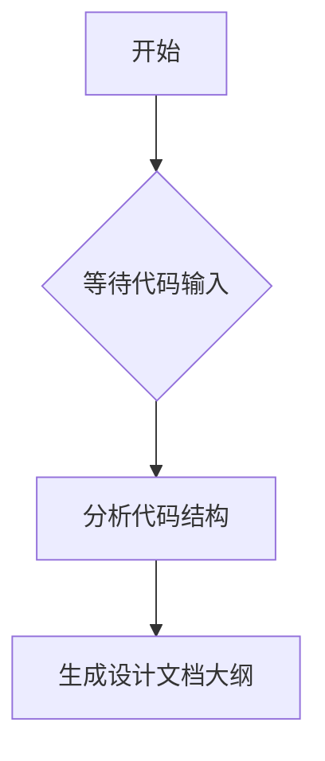

# `diffusers\tests\pipelines\cogvideo\__init__.py` 详细设计文档

未提供源代码，无法进行分析。请提供需要分析的代码文件内容。

## 整体流程



## 类结构

```
无法分析 - 未提供代码
```

## 全局变量及字段


    

## 全局函数及方法


## 关键组件


## 问题及建议


### 已知问题

- 未提供代码内容，无法进行具体的技术债务和优化空间分析

### 优化建议

- 请提供待分析的源代码，以便进行详细的技术债务识别和优化建议


## 其它


### 一段话描述
未提供代码，无法生成概述。

### 文件的整体运行流程
未提供代码，无法描述整体运行流程。

### 类的详细信息
未提供代码，无法提供类的详细信息。

### 类字段和类方法
未提供代码，无法提供字段和方法细节。

### 全局变量和全局函数
未提供代码，无法提供全局变量和全局函数信息。

### 关键组件信息
未提供代码，无法提供关键组件信息。

### 潜在的技术债务或优化空间
未提供代码，无法评估技术债务。

### 设计目标与约束
未提供代码，无法明确设计目标与约束。

### 错误处理与异常设计
未提供代码，无法描述错误处理与异常设计。

### 数据流与状态机
未提供代码，无法描述数据流与状态机。

### 外部依赖与接口契约
未提供代码，无法描述外部依赖与接口契约。

### 性能要求
未提供代码，无法明确性能要求。

### 安全性考虑
未提供代码，无法描述安全性考虑。

### 可维护性与扩展性
未提供代码，无法描述可维护性与扩展性。

### 测试策略
未提供代码，无法描述测试策略。

### 部署架构
未提供代码，无法描述部署架构。

    