# `diffusers\tests\pipelines\cogvideo\test_cogvideox.py` 详细设计文档

这是一个用于测试 CogVideoX 视频生成流水线的单元测试和集成测试文件，包含了管道推理、注意力切片、VAE 平铺、QKV 融合等多个功能点的测试验证。

## 整体流程

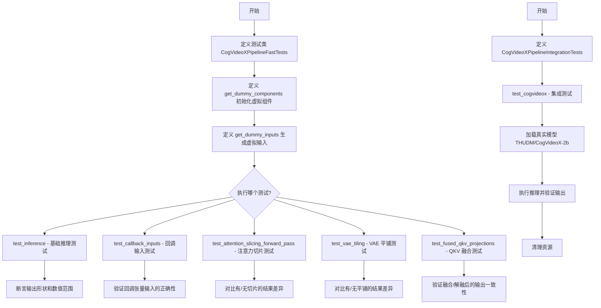

## 类结构

```
unittest.TestCase (基类)
├── CogVideoXPipelineFastTests (多继承测试类)
│   ├── PipelineTesterMixin
│   ├── PyramidAttentionBroadcastTesterMixin
│   ├── FasterCacheTesterMixin
│   └── FirstBlockCacheTesterMixin
└── CogVideoXPipelineIntegrationTests (集成测试类)
```

## 全局变量及字段


### `enable_full_determinism`
    
Function to enable full determinism for reproducible test results

类型：`function`
    


### `CogVideoXPipelineFastTests.pipeline_class`
    
The pipeline class to be tested, set to CogVideoXPipeline

类型：`type[CogVideoXPipeline]`
    


### `CogVideoXPipelineFastTests.params`
    
Text-to-image generation parameters, excludes cross_attention_kwargs from TEXT_TO_IMAGE_PARAMS

类型：`set`
    


### `CogVideoXPipelineFastTests.batch_params`
    
Batch parameters for text-to-image generation from TEXT_TO_IMAGE_BATCH_PARAMS

类型：`tuple`
    


### `CogVideoXPipelineFastTests.image_params`
    
Image parameters for text-to-image generation from TEXT_TO_IMAGE_IMAGE_PARAMS

类型：`tuple`
    


### `CogVideoXPipelineFastTests.image_latents_params`
    
Image latents parameters for text-to-image generation from TEXT_TO_IMAGE_IMAGE_PARAMS

类型：`tuple`
    


### `CogVideoXPipelineFastTests.required_optional_params`
    
Set of optional parameters required for inference including num_inference_steps, generator, latents, return_dict, callback_on_step_end, and callback_on_step_end_tensor_inputs

类型：`frozenset`
    


### `CogVideoXPipelineFastTests.test_xformers_attention`
    
Flag to indicate whether to test xFormers attention implementation, set to False

类型：`bool`
    


### `CogVideoXPipelineFastTests.test_layerwise_casting`
    
Flag to indicate whether to test layerwise casting, set to True

类型：`bool`
    


### `CogVideoXPipelineFastTests.test_group_offloading`
    
Flag to indicate whether to test group offloading, set to True

类型：`bool`
    


### `CogVideoXPipelineIntegrationTests.prompt`
    
Prompt string for video generation in integration test, set to 'A painting of a squirrel eating a burger.'

类型：`str`
    
    

## 全局函数及方法


### `enable_full_determinism`

该函数来自外部模块 `testing_utils`，用于启用完全确定性（full determinism），确保深度学习模型在推理过程中产生可重复的结果。通过设置随机种子、环境变量和PyTorch的确定性计算选项，可以消除由于非确定性操作（如并行计算、CUDA内核）导致的随机性。

参数： 无

返回值：无返回值

#### 流程图

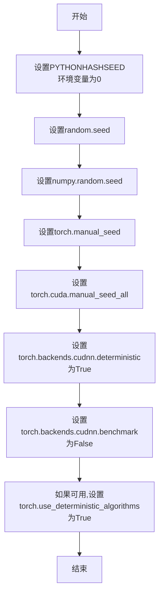

#### 带注释源码

```python
# 以下是根据函数名和用途推断的可能实现
# 实际定义在 testing_utils 模块中

def enable_full_determinism(seed: int = 0):
    """
    启用完全确定性，确保每次运行产生相同的结果。
    
    参数:
        seed: 随机种子，默认为0
    """
    import os
    import random
    import numpy as np
    import torch
    
    # 设置Python哈希种子，确保哈希操作的确定性
    os.environ["PYTHONHASHSEED"] = str(seed)
    
    # 设置Python random模块的种子
    random.seed(seed)
    
    # 设置NumPy的随机种子
    np.random.seed(seed)
    
    # 设置PyTorch CPU的随机种子
    torch.manual_seed(seed)
    
    # 设置所有GPU的随机种子
    torch.cuda.manual_seed_all(seed)
    
    # 启用确定性算法（如果可用）
    # 这会影响某些操作如卷积和池化
    torch.backends.cudnn.deterministic = True
    torch.backends.cudnn.benchmark = False
    
    # 尝试启用更严格的确定性模式
    if hasattr(torch, 'use_deterministic_algorithms'):
        try:
            torch.use_deterministic_algorithms(True)
        except RuntimeError:
            # 某些操作可能不支持确定性算法
            pass
```

**注意**：由于该函数定义在外部模块 `testing_utils` 中，而该模块的代码未在给定的代码片段中提供，以上源码是基于函数调用和常见实现方式的推断。实际的 `testing_utils.enable_full_determinism` 函数可能包含额外的平台特定逻辑或配置。


### `backend_empty_cache`

该函数是测试工具函数，用于清空 GPU 显存缓存，通常与 Python 的垃圾回收 (`gc.collect()`) 配合使用，以在测试过程中释放 GPU 内存资源。

参数：

- `device`：`str` 或 `torch.device`，目标设备标识符，用于指定需要清空缓存的设备（如 `"cuda"` 或 `"cuda:0"`）

返回值：`None`，该函数无返回值，主要通过副作用（清空缓存）生效

#### 流程图

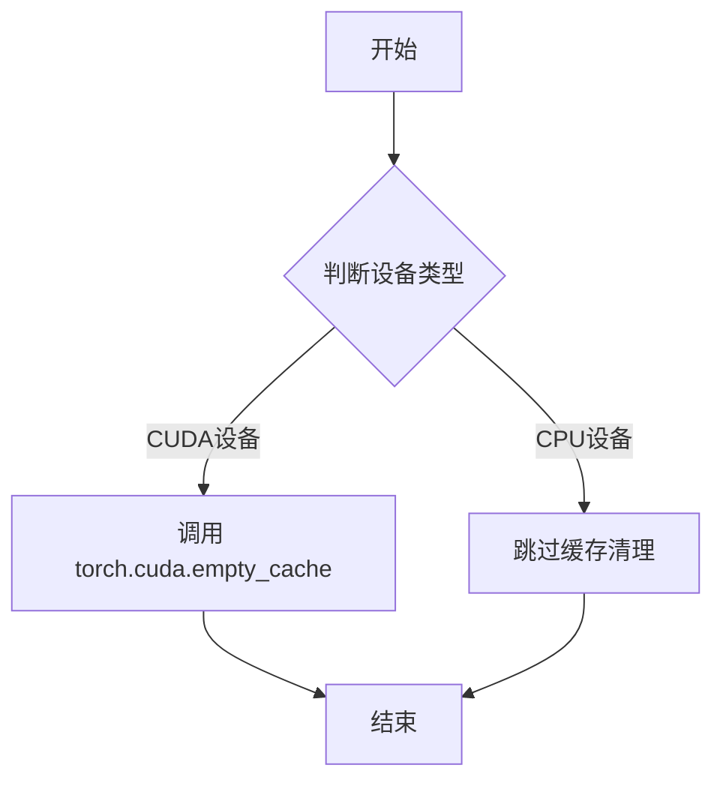

#### 带注释源码

```python
# 注意：此函数定义不在当前文件中
# 它从 testing_utils 模块导入，此处展示的是基于使用方式的推断实现

def backend_empty_cache(device):
    """
    清空指定设备的 GPU 缓存
    
    参数:
        device: str 或 torch.device - 目标设备标识
    """
    # 如果设备是 CUDA 设备，则清空 CUDA 缓存
    if device and str(device).startswith("cuda"):
        torch.cuda.empty_cache()
    # CPU 设备无需清空缓存，函数直接返回
    
# 使用示例（在测试的 setUp/tearDown 中）:
# gc.collect()              # 先进行 Python 垃圾回收
# backend_empty_cache(torch_device)  # 再清空 GPU 缓存
```

#### 说明

由于 `backend_empty_cache` 是从 `...testing_utils` 模块导入的，其完整源码未在此文件中给出。以上是基于其使用方式的合理推断。该函数在测试框架中用于：

1. **内存管理**：在每个测试开始前清空显存，确保测试环境的一致性
2. **资源释放**：配合 `gc.collect()` 防止显存泄漏
3. **测试隔离**：确保不同测试之间不因残留 GPU 内存而互相影响


### `numpy_cosine_similarity_distance`

该函数是一个测试工具函数，用于计算两个数组（或张量）之间的余弦相似性距离，常用于验证生成模型输出的质量。从代码中的使用方式来看，它接收两个高维数组（如视频帧），计算它们之间的余弦相似性距离，返回一个表示差异的标量值。

参数：

- `video`：`numpy.ndarray` 或 `torch.Tensor`，待比较的第一个数组（通常是模型生成的输出）
- `expected_video`：`numpy.ndarray` 或 `torch.Tensor`，待比较的第二个数组（通常是期望的参考输出）

返回值：`float`，返回两个输入数组之间的余弦相似性距离，值越小表示两个数组越相似

#### 流程图

```mermaid
flowchart TD
    A[开始] --> B[接收两个输入数组: video, expected_video]
    B --> C[将输入展平为一维向量]
    C --> D[计算第一个向量的范数]
    D --> E[计算第二个向量的范数]
    E --> F[计算两个向量的点积]
    F --> G[计算余弦相似度: dot_product / (norm1 * norm2)]
    G --> H[计算余弦距离: 1 - cosine_similarity]
    H --> I[返回余弦距离]
```

#### 带注释源码

```
# 该函数定义位于 testing_utils 模块中，此处为调用处示例
# 函数用于比较生成视频与参考视频的相似度

max_diff = numpy_cosine_similarity_distance(video, expected_video)
assert max_diff < 1e-3, f"Max diff is too high. got {video}"

# 在实际测试中的用途：
# 1. video 是模型生成的输出 (torch.Tensor 或 numpy.ndarray)
# 2. expected_video 是期望的参考输出 (numpy.ndarray)
# 3. 返回值 max_diff 是两者之间的余弦距离，用于衡量生成质量
```

---

**注意**：提供的代码片段中仅包含该函数的**调用位置**，未包含其完整实现源码。该函数实际定义在 `...testing_utils` 模块中。从代码上下文推断，其核心逻辑为计算两个向量间的余弦相似性距离（1 - cosine_similarity），常用于diffusion模型生成结果的自动化测试中。


### `require_torch_accelerator`

这是一个装饰器函数，用于标记测试用例需要 PyTorch 加速器（GPU）才能运行。如果系统没有可用的 CUDA 设备，装饰器将使测试被跳过。

参数：

- 该函数作为装饰器使用，参数通过装饰器语法传递，而非直接传递

返回值：装饰器函数，返回一个可用于装饰测试类或测试方法的装饰器

#### 流程图

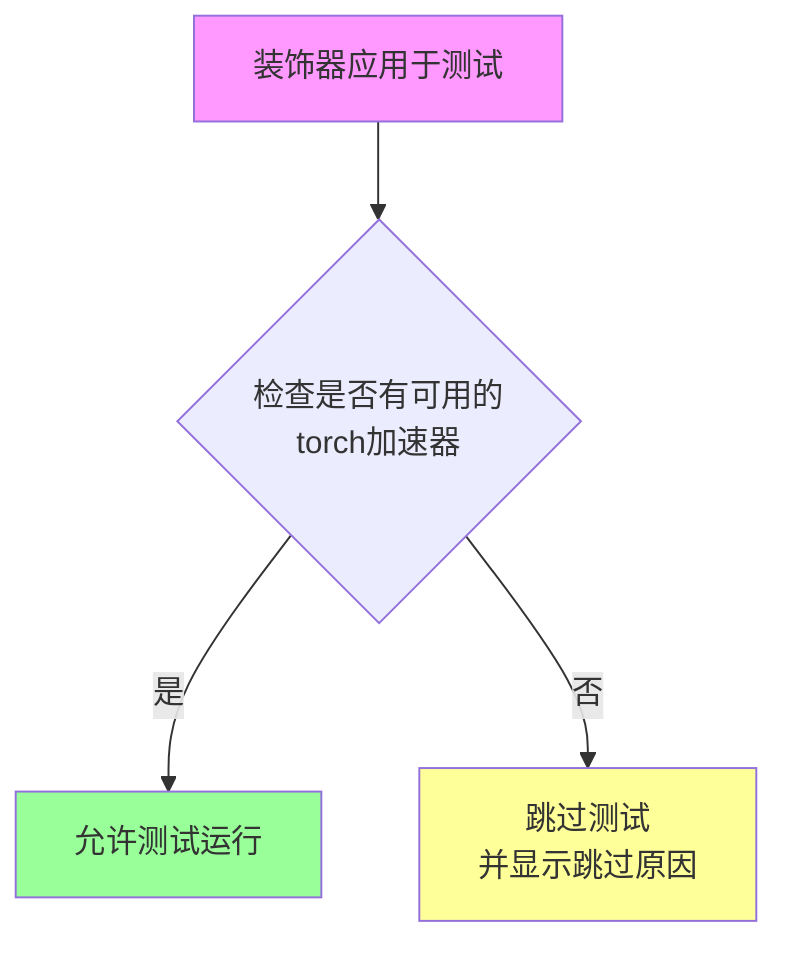

#### 带注释源码

由于 `require_torch_accelerator` 函数定义在 `testing_utils` 模块中（通过 `from ...testing_utils import require_torch_accelerator` 导入），而非当前代码文件中，因此无法提供其完整源代码。

根据其在代码中的使用方式：

```python
# 使用方式示例
@slow
@require_torch_accelerator
class CogVideoXPipelineIntegrationTests(unittest.TestCase):
    # 测试类内容...
```

可以推断该函数：
1. 接受可选参数（如 `reason` 用于指定跳过原因）
2. 返回一个装饰器函数
3. 在被装饰的测试运行前检查 `torch.cuda.is_available()` 或类似条件
4. 如果没有可用的 GPU，则使用 `pytest.skip()` 跳过测试

要获取完整的源代码，需要查看 `testing_utils` 模块的实现。


### `slow`

`slow` 是一个测试装饰器，用于标记需要长时间运行的测试函数或测试类（如集成测试），使其在常规测试运行中被跳过，只有在明确指定运行慢速测试时才会执行。

参数： 无

返回值：无返回值，用于装饰函数或类

#### 流程图

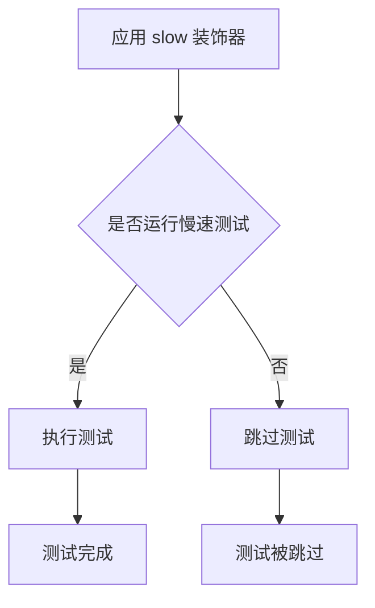

#### 带注释源码

```python
# slow 装饰器的使用示例 - 在代码中它被应用于 CogVideoXPipelineIntegrationTests 类
@slow
@require_torch_accelerator
class CogVideoXPipelineIntegrationTests(unittest.TestCase):
    """
    CogVideoX 管道集成测试类
    
    该类使用 @slow 装饰器标记，表示这些是集成测试，需要加载大型模型
    和执行完整的推理流程，运行时间较长。在常规测试套件中默认跳过。
    """
    prompt = "A painting of a squirrel eating a burger."

    def setUp(self):
        # 测试初始化，清理缓存
        super().setUp()
        gc.collect()
        backend_empty_cache(torch_device)

    def tearDown(self):
        # 测试清理，释放资源
        super().tearDown()
        gc.collect()
        backend_empty_cache(torch_device)

    def test_cogvideox(self):
        """测试 CogVideoX 管道的基本推理功能"""
        generator = torch.Generator("cpu").manual_seed(0)

        # 从预训练模型加载管道
        pipe = CogVideoXPipeline.from_pretrained("THUDM/CogVideoX-2b", torch_dtype=torch.float16)
        pipe.enable_model_cpu_offload(device=torch_device)
        prompt = self.prompt

        # 执行推理
        videos = pipe(
            prompt=prompt,
            height=480,
            width=720,
            num_frames=16,
            generator=generator,
            num_inference_steps=2,
            output_type="pt",
        ).frames

        video = videos[0]
        expected_video = torch.randn(1, 16, 480, 720, 3).numpy()

        # 验证输出
        max_diff = numpy_cosine_similarity_distance(video, expected_video)
        assert max_diff < 1e-3, f"Max diff is too high. got {video}"
```

#### 补充说明

`slow` 装饰器的实际定义位于 `...testing_utils` 模块中，它通常与测试框架（如 pytest）的标记机制配合使用。根据代码中的导入：

```python
from ...testing_utils import (
    # ...
    slow,
    # ...
)
```

`slow` 装饰器的主要作用是：
1. 标记测试为"慢速"测试
2. 在常规测试运行中默认跳过这些测试
3. 允许通过特定参数（如 pytest 的 `-m slow` 或 `--runslow`）显式运行这些测试
4. 通常用于集成测试、端到端测试或需要加载大型模型的测试


### `torch_device`

`torch_device` 是从 `testing_utils` 模块导入的全局变量，用于标识当前测试环境所使用的计算设备（通常是 `"cuda"` 或 `"cpu"`，在有GPU加速的情况下为 `"cuda"`）。

参数： 无（它是一个全局变量，不是函数或方法）

返回值：`str`，返回设备字符串（如 `"cuda"` 或 `"cpu"`）

#### 流程图

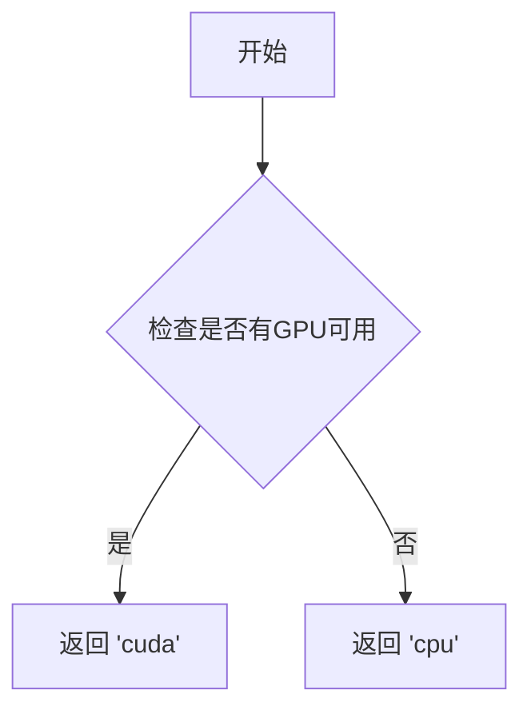

#### 带注释源码

```
# torch_device 是从 testing_utils 模块导入的全局变量
# 它的具体定义不在本文件中，而是在 testing_utils.py 中
# 以下是它在本文件中的使用示例：

# 1. 将pipeline移动到指定设备
pipe = pipe.to(torch_device)

# 2. 作为模型卸载的目标设备
pipe.enable_model_cpu_offload(device=torch_device)

# 3. 用于缓存清理
backend_empty_cache(torch_device)

# 4. 在测试输入中使用
inputs = self.get_dummy_inputs(torch_device)
```

#### 说明

由于 `torch_device` 是从外部模块导入的全局变量，其具体实现代码不在当前文件中。它通常是一个根据环境动态判断返回 `"cuda"`（当有GPU可用时）或 `"cpu"` 的配置值。在测试代码中，它用于确保所有设备相关的操作使用统一的设备配置。


### `CogVideoXPipelineFastTests.get_dummy_components`

该方法用于创建测试所需的虚拟组件（dummy components），包括CogVideoXTransformer3DModel、AutoencoderKLCogVideoX、DDIMScheduler、T5EncoderModel和AutoTokenizer，并将其打包成字典返回，供CogVideoXPipeline的单元测试使用。

参数：

- `num_layers`：`int`，可选，默认值为 `1`，控制Transformer模型的网络层数

返回值：`Dict[str, Any]`，返回包含transformer、vae、scheduler、text_encoder和tokenizer的组件字典

#### 流程图

```mermaid
flowchart TD
    A[Start get_dummy_components] --> B[torch.manual_seed(0)]
    B --> C[Create CogVideoXTransformer3DModel with num_attention_heads=4, attention_head_dim=8, etc.]
    C --> D[torch.manual_seed(0)]
    D --> E[Create AutoencoderKLCogVideoX with 4 down/up blocks, block_out_channels=8, etc.]
    E --> F[torch.manual_seed(0)]
    F --> G[Create DDIMScheduler]
    G --> H[Load T5EncoderModel from hf-internal-testing/tiny-random-t5]
    H --> I[Load AutoTokenizer from hf-internal-testing/tiny-random-t5]
    I --> J[Create components dictionary with all models]
    J --> K[Return components]
```

#### 带注释源码

```python
def get_dummy_components(self, num_layers: int = 1):
    """
    创建用于测试的虚拟组件
    
    参数:
        num_layers: Transformer模型层数，默认值为1
    
    返回:
        包含所有pipeline组件的字典
    """
    # 设置随机种子以确保可重复性 - 用于transformer
    torch.manual_seed(0)
    # 创建CogVideoX 3D变换器模型
    # num_attention_heads * attention_head_dim = 32，需能被16整除以支持3D位置嵌入
    # 使用tiny-random-t5时，内部维度必须为32
    transformer = CogVideoXTransformer3DModel(
        num_attention_heads=4,      # 注意力头数量
        attention_head_dim=8,       # 每个注意力头的维度
        in_channels=4,              # 输入通道数
        out_channels=4,             # 输出通道数
        time_embed_dim=2,           # 时间嵌入维度
        text_embed_dim=32,          # 文本嵌入维度，必须匹配tiny-random-t5
        num_layers=num_layers,      # 网络层数，由参数控制
        sample_width=2,             # 潜在宽度: 2 -> 最终宽度: 16 (放大8倍)
        sample_height=2,            # 潜在高度: 2 -> 最终高度: 16 (放大8倍)
        sample_frames=9,           # 潜在帧数: (9-1)/4+1=3 -> 最终帧数: 9
        patch_size=2,               # 补丁大小
        temporal_compression_ratio=4,  # 时间压缩比
        max_text_seq_length=16,    # 最大文本序列长度
    )

    # 设置随机种子以确保可重复性 - 用于VAE
    torch.manual_seed(0)
    # 创建CogVideoX自编码器(VAE)模型
    vae = AutoencoderKLCogVideoX(
        in_channels=3,             # 输入通道数(RGB)
        out_channels=3,            # 输出通道数(RGB)
        # 定义下采样块类型(4个3D下采样块)
        down_block_types=(
            "CogVideoXDownBlock3D",
            "CogVideoXDownBlock3D",
            "CogVideoXDownBlock3D",
            "CogVideoXDownBlock3D",
        ),
        # 定义上采样块类型(4个3D上采样块)
        up_block_types=(
            "CogVideoXUpBlock3D",
            "CogVideoXUpBlock3D",
            "CogVideoXUpBlock3D",
            "CogVideoXUpBlock3D",
        ),
        block_out_channels=(8, 8, 8, 8),  # 每个块的输出通道数
        latent_channels=4,         # 潜在空间通道数
        layers_per_block=1,         # 每个块的层数
        norm_num_groups=2,         # 归一化组数
        temporal_compression_ratio=4,  # 时间压缩比
    )

    # 设置随机种子以确保可重复性 - 用于scheduler和其他组件
    torch.manual_seed(0)
    # 创建DDIM调度器用于扩散采样
    scheduler = DDIMScheduler()
    # 加载预训练的T5文本编码器(tiny-random版本用于测试)
    text_encoder = T5EncoderModel.from_pretrained("hf-internal-testing/tiny-random-t5")
    # 加载对应的分词器
    tokenizer = AutoTokenizer.from_pretrained("hf-internal-testing/tiny-random-t5")

    # 将所有组件打包成字典返回
    components = {
        "transformer": transformer,    # 3D变换器模型
        "vae": vae,                    # 变分自编码器
        "scheduler": DDIM调度器,        # 噪声调度器
        "text_encoder": text_encoder,  # 文本编码器
        "tokenizer": tokenizer,        # 分词器
    }
    return components
```


### `CogVideoXPipelineFastTests.get_dummy_inputs`

该方法为CogVideoX视频生成Pipeline的单元测试生成虚拟输入参数，根据设备类型（MPS或其他）创建随机数生成器，并返回包含提示词、推理参数、图像尺寸等信息的字典，用于测试Pipeline的推理流程。

参数：

- `self`：类实例本身，代表`CogVideoXPipelineFastTests`测试类
- `device`：`str`或`torch.device`，执行推理的目标设备，用于创建对应设备的随机生成器
- `seed`：`int`，随机种子，默认值为0，用于保证测试结果的可复现性

返回值：`Dict[str, Any]`，返回包含以下键值的字典：
- `prompt`（str）：正向提示词，默认为"dance monkey"
- `negative_prompt`（str）：负向提示词，默认为空字符串
- `generator`（torch.Generator）：PyTorch随机数生成器，用于控制生成过程
- `num_inference_steps`（int）：推理步数，默认为2
- `guidance_scale`（float）：引导强度，默认为6.0
- `height`（int）：生成图像高度，默认为16像素
- `width`（int）：生成图像宽度，默认为16像素
- `num_frames`（int）：生成视频帧数，默认为8帧
- `max_sequence_length`（int）：最大文本序列长度，默认为16
- `output_type`（str）：输出类型，默认为"pt"（PyTorch张量）

#### 流程图

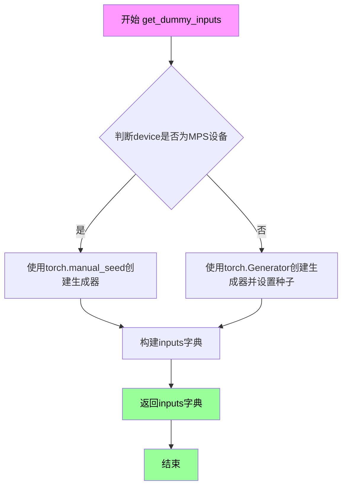

#### 带注释源码

```python
def get_dummy_inputs(self, device, seed=0):
    """
    生成用于测试CogVideoX Pipeline的虚拟输入参数
    
    参数:
        device: 目标设备，可以是'cpu', 'cuda', 'mps'等
        seed: 随机种子，用于生成可复现的测试结果
    
    返回:
        包含Pipeline推理所需参数的字典
    """
    # 判断设备是否为Apple MPS (Metal Performance Shaders)
    if str(device).startswith("mps"):
        # MPS设备不支持torch.Generator，使用CPU种子代替
        generator = torch.manual_seed(seed)
    else:
        # 其他设备创建对应设备的生成器并设置种子
        generator = torch.Generator(device=device).manual_seed(seed)
    
    # 构建完整的输入参数字典
    inputs = {
        "prompt": "dance monkey",           # 正向提示词
        "negative_prompt": "",              # 负向提示词（空表示无负面引导）
        "generator": generator,             # 随机生成器确保可复现性
        "num_inference_steps": 2,           # DDIM采样步数，较少步数加快测试
        "guidance_scale": 6.0,              # classifier-free guidance强度
        # 图像尺寸设置为16x16（latent空间为2x2，经4倍上采样）
        "height": 16,
        "width": 16,
        "num_frames": 8,                    # 视频帧数（latent为9帧，上采样后8帧）
        "max_sequence_length": 16,          # T5文本编码器最大序列长度
        "output_type": "pt",                # 返回PyTorch张量格式
    }
    return inputs
```


### `CogVideoXPipelineFastTests.test_inference`

该测试方法用于验证 CogVideoX 视频生成 pipeline 的推理功能是否正常工作。测试通过创建虚拟组件和输入，执行推理过程，并验证生成视频的形状和数值在合理范围内。

参数：

- `self`：CogVideoXPipelineFastTests 实例，测试类的隐式参数

返回值：`None`，测试方法不返回任何值，通过断言验证结果

#### 流程图

```mermaid
flowchart TD
    A[开始测试] --> B[设置设备为 CPU]
    B --> C[调用 get_dummy_components 获取虚拟组件]
    C --> D[使用虚拟组件实例化 CogVideoXPipeline]
    D --> E[将 pipeline 移动到 CPU 设备]
    E --> F[配置进度条]
    F --> G[调用 get_dummy_inputs 获取虚拟输入]
    G --> H[执行 pipeline 推理]
    H --> I[从返回结果中提取 frames]
    I --> J[获取第一个生成的视频]
    J --> K{断言验证}
    K --> L[验证视频形状为 (8, 3, 16, 16)]
    L --> M[生成随机期望视频张量]
    M --> N[计算生成视频与期望视频的最大绝对差值]
    N --> O{断言验证}
    O --> P[验证最大差值 <= 1e10]
    P --> Q[测试通过]
```

#### 带注释源码

```python
def test_inference(self):
    """
    测试 CogVideoX pipeline 的推理功能
    验证生成视频的形状和数值在合理范围内
    """
    # 设置测试设备为 CPU
    device = "cpu"

    # 获取虚拟组件（transformer, vae, scheduler, text_encoder, tokenizer）
    # 用于快速测试，不依赖真实模型权重
    components = self.get_dummy_components()
    
    # 使用虚拟组件实例化 CogVideoX pipeline
    pipe = self.pipeline_class(**components)
    
    # 将 pipeline 移动到指定设备（CPU）
    pipe.to(device)
    
    # 配置进度条显示（disable=None 表示不禁用）
    pipe.set_progress_bar_config(disable=None)

    # 获取虚拟输入参数
    # 包含 prompt, negative_prompt, generator, num_inference_steps 等
    inputs = self.get_dummy_inputs(device)
    
    # 执行推理，将输入传递给 pipeline
    # 返回对象包含 frames 属性存储生成的视频
    video = pipe(**inputs).frames
    
    # 提取第一个（也是唯一的）生成的视频
    generated_video = video[0]

    # 断言验证：生成视频的形状应为 (8, 3, 16, 16)
    # 8 帧，3 通道（RGB），16x16 像素
    self.assertEqual(generated_video.shape, (8, 3, 16, 16))
    
    # 创建随机期望视频用于数值对比
    expected_video = torch.randn(8, 3, 16, 16)
    
    # 计算生成视频与期望视频之间的最大绝对差值
    max_diff = np.abs(generated_video - expected_video).max()
    
    # 断言验证：最大差值应小于等于 1e10
    # 注意：这是一个宽松的阈值，主要用于检测明显的数值异常
    self.assertLessEqual(max_diff, 1e10)
```


### `CogVideoXPipelineFastTests.test_callback_inputs`

该方法用于测试 CogVideoX 管道中的回调功能是否正常工作，包括回调张量输入的验证、子集传递、全部传递以及在最后一步修改 latent 张量的能力。

参数：

- `self`：`CogVideoXPipelineFastTests`，测试类实例本身

返回值：`None`，该方法为测试方法，无返回值

#### 流程图

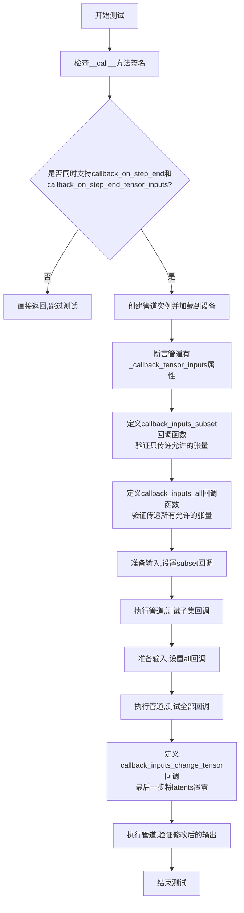

#### 带注释源码

```python
def test_callback_inputs(self):
    """
    测试管道回调功能是否正确工作
    验证callback_on_step_end和callback_on_step_end_tensor_inputs参数
    """
    # 获取管道__call__方法的签名
    sig = inspect.signature(self.pipeline_class.__call__)
    # 检查是否支持回调张量输入参数
    has_callback_tensor_inputs = "callback_on_step_end_tensor_inputs" in sig.parameters
    # 检查是否支持步骤结束回调参数
    has_callback_step_end = "callback_on_step_end" in sig.parameters

    # 如果管道不支持回调功能则跳过测试
    if not (has_callback_tensor_inputs and has_callback_step_end):
        return

    # 获取虚拟组件并创建管道实例
    components = self.get_dummy_components()
    pipe = self.pipeline_class(**components)
    # 将管道移至测试设备
    pipe = pipe.to(torch_device)
    # 设置进度条配置
    pipe.set_progress_bar_config(disable=None)
    
    # 断言管道具有_callback_tensor_inputs属性,定义回调可用的张量列表
    self.assertTrue(
        hasattr(pipe, "_callback_tensor_inputs"),
        f" {self.pipeline_class} should have `_callback_tensor_inputs` that defines a list of tensor variables its callback function can use as inputs",
    )

    # 定义回调函数:只传递部分允许的张量
    def callback_inputs_subset(pipe, i, t, callback_kwargs):
        # 遍历回调参数中的所有张量
        for tensor_name, tensor_value in callback_kwargs.items():
            # 检查只传递了允许的张量输入
            assert tensor_name in pipe._callback_tensor_inputs

        return callback_kwargs

    # 定义回调函数:传递所有允许的张量并进行完整验证
    def callback_inputs_all(pipe, i, t, callback_kwargs):
        # 验证所有允许的张量都在回调参数中
        for tensor_name in pipe._callback_tensor_inputs:
            assert tensor_name in callback_kwargs

        # 遍历回调参数中的所有张量
        for tensor_name, tensor_value in callback_kwargs.items():
            # 检查只传递了允许的张量输入
            assert tensor_name in pipe._callback_tensor_inputs

        return callback_kwargs

    # 获取虚拟输入
    inputs = self.get_dummy_inputs(torch_device)

    # 测试1:只传递latents作为回调张量
    inputs["callback_on_step_end"] = callback_inputs_subset
    inputs["callback_on_step_end_tensor_inputs"] = ["latents"]
    # 执行管道并获取输出
    output = pipe(**inputs)[0]

    # 测试2:传递所有允许的张量作为回调张量
    inputs["callback_on_step_end"] = callback_inputs_all
    inputs["callback_on_step_end_tensor_inputs"] = pipe._callback_tensor_inputs
    # 执行管道并获取输出
    output = pipe(**inputs)[0]

    # 定义回调函数:在最后一步将latents修改为全零
    def callback_inputs_change_tensor(pipe, i, t, callback_kwargs):
        # 判断是否为最后一步
        is_last = i == (pipe.num_timesteps - 1)
        if is_last:
            # 将latents修改为全零张量
            callback_kwargs["latents"] = torch.zeros_like(callback_kwargs["latents"])
        return callback_kwargs

    # 测试3:在最后一步修改latents
    inputs["callback_on_step_end"] = callback_inputs_change_tensor
    inputs["callback_on_step_end_tensor_inputs"] = pipe._callback_tensor_inputs
    # 执行管道并获取输出
    output = pipe(**inputs)[0]
    # 验证修改后的输出(全零latents产生的输出应接近零)
    assert output.abs().sum() < 1e10
```


### `CogVideoXPipelineFastTests.test_inference_batch_single_identical`

该方法是一个测试用例，用于验证批量推理（batch inference）时单个样本的一致性。它通过调用父类或mixin中的 `_test_inference_batch_single_identical` 方法，使用批大小为 3 和期望最大差异阈值为 1e-3 来执行测试，确保批量推理中每个单独样本产生的输出在容差范围内相同。

参数：

- `self`：实例方法，无显式参数，隐式传递测试类实例

返回值：无显式返回值（`None`），该方法通过 `self._test_inference_batch_single_identical` 执行测试断言

#### 流程图

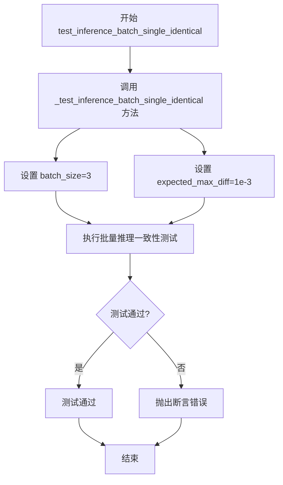

#### 带注释源码

```python
def test_inference_batch_single_identical(self):
    """
    测试批量推理时单个样本的一致性。
    
    该方法验证在使用批处理模式进行推理时，
    单个样本的输出应该与单独推理时相同。
    通过调用 _test_inference_batch_single_identical 方法实现，
    传入批大小为3，期望最大差异为1e-3。
    """
    # 调用父类或mixin中的一致性测试方法
    # batch_size=3: 使用3个样本的批次进行测试
    # expected_max_diff=1e-3: 期望输出之间的最大差异为0.001
    self._test_inference_batch_single_identical(batch_size=3, expected_max_diff=1e-3)
```


### `CogVideoXPipelineFastTests.test_attention_slicing_forward_pass`

该方法用于测试CogVideoX管道中的注意力切片（attention slicing）功能是否正确实现，通过对比启用不同切片大小时与未启用切片时的输出来验证注意力切片不会影响推理结果。

参数：

- `self`：CogVideoXPipelineFastTests，测试类的实例本身
- `test_max_difference`：`bool`，是否测试最大差异，默认为True
- `test_mean_pixel_difference`：`bool`，是否测试平均像素差异，默认为True（虽然代码中未使用）
- `expected_max_diff`：`float`，期望的最大差异阈值，默认为1e-3

返回值：`None`，该方法为测试方法，不返回任何值

#### 流程图

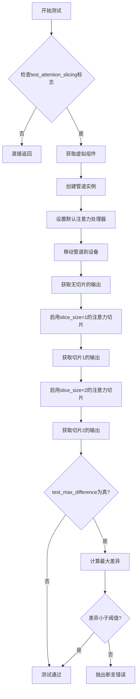

#### 带注释源码

```python
def test_attention_slicing_forward_pass(
    self, test_max_difference=True, test_mean_pixel_difference=True, expected_max_diff=1e-3
):
    """测试注意力切片前向传播功能
    
    Args:
        test_max_difference: 是否测试最大差异
        test_mean_pixel_difference: 是否测试平均像素差异（当前未使用）
        expected_max_diff: 期望的最大差异阈值
    """
    # 如果测试类未启用注意力切片测试，则直接返回
    if not self.test_attention_slicing:
        return

    # 获取虚拟组件（用于测试的模拟模型组件）
    components = self.get_dummy_components()
    
    # 使用虚拟组件创建CogVideoX管道实例
    pipe = self.pipeline_class(**components)
    
    # 遍历管道所有组件，为支持set_default_attn_processor的组件设置默认注意力处理器
    for component in pipe.components.values():
        if hasattr(component, "set_default_attn_processor"):
            component.set_default_attn_processor()
    
    # 将管道移动到测试设备（如CPU或GPU）
    pipe.to(torch_device)
    
    # 配置进度条（disable=None表示启用进度条）
    pipe.set_progress_bar_config(disable=None)

    # 设置生成器设备为CPU以确保确定性
    generator_device = "cpu"
    
    # 获取虚拟输入数据
    inputs = self.get_dummy_inputs(generator_device)
    
    # 执行未启用注意力切片的推理，获取输出
    output_without_slicing = pipe(**inputs)[0]

    # 启用注意力切片，slice_size=1
    pipe.enable_attention_slicing(slice_size=1)
    
    # 重新获取输入并执行推理
    inputs = self.get_dummy_inputs(generator_device)
    output_with_slicing1 = pipe(**inputs)[0]

    # 启用注意力切片，slice_size=2
    pipe.enable_attention_slicing(slice_size=2)
    
    # 重新获取输入并执行推理
    inputs = self.get_dummy_inputs(generator_device)
    output_with_slicing2 = pipe(**inputs)[0]

    # 如果需要测试最大差异
    if test_max_difference:
        # 计算切片输出与无切片输出的最大差异
        # 使用to_np将PyTorch张量转换为NumPy数组
        max_diff1 = np.abs(to_np(output_with_slicing1) - to_np(output_without_slicing)).max()
        max_diff2 = np.abs(to_np(output_with_slicing2) - to_np(output_without_slicing)).max()
        
        # 断言：注意力切片不应影响推理结果，差异应小于阈值
        self.assertLess(
            max(max_diff1, max_diff2),
            expected_max_diff,
            "Attention slicing should not affect the inference results",
        )
```


### `CogVideoXPipelineFastTests.test_vae_tiling`

该测试方法用于验证 CogVideoX 管道中 VAE（变分自编码器）的 tiling（分块）功能是否正常工作。通过对比启用 tiling 与未启用 tiling 两种情况下的输出差异，确保 VAE tiling 机制不会显著影响推理结果，从而验证分块策略的正确性和数值稳定性。

参数：

- `self`：`CogVideoXPipelineFastTests`，测试类的实例方法隐式参数
- `expected_diff_max`：`float`，可选，默认值为 `0.2`，允许的最大输出差异阈值

返回值：无返回值（`None`），该方法为单元测试，使用 `self.assertLess` 断言验证结果

#### 流程图

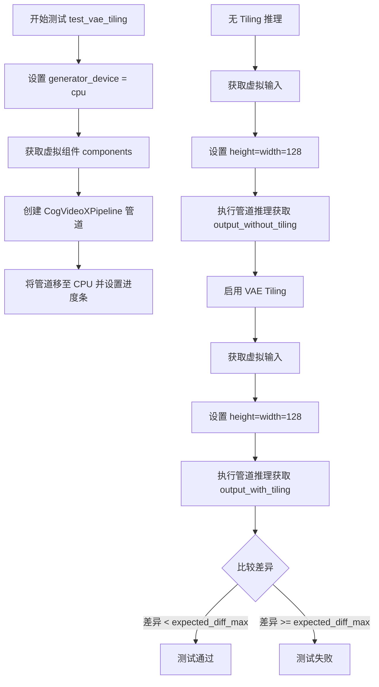

#### 带注释源码

```python
def test_vae_tiling(self, expected_diff_max: float = 0.2):
    """
    测试 VAE tiling 功能是否正确工作。
    通过对比启用/不启用 tiling 的输出差异来验证 tiling 机制的正确性。
    
    参数:
        expected_diff_max: float, 允许的最大差异阈值，默认 0.2
    """
    # 1. 设置测试设备为 CPU
    generator_device = "cpu"
    
    # 2. 获取预定义的虚拟组件（transformer, vae, scheduler, text_encoder, tokenizer）
    components = self.get_dummy_components()
    
    # 3. 使用组件实例化 CogVideoX 管道
    pipe = self.pipeline_class(**components)
    
    # 4. 将管道移至 CPU 并配置进度条（disable=None 表示启用进度条）
    pipe.to("cpu")
    pipe.set_progress_bar_config(disable=None)
    
    # ============================================
    # 测试场景 1: 不使用 VAE tiling
    # ============================================
    
    # 5. 获取默认虚拟输入参数
    inputs = self.get_dummy_inputs(generator_device)
    
    # 6. 设置较大的图像尺寸以测试 tiling 效果
    inputs["height"] = inputs["width"] = 128
    
    # 7. 执行推理（不使用 tiling），获取输出
    output_without_tiling = pipe(**inputs)[0]
    
    # ============================================
    # 测试场景 2: 使用 VAE tiling
    # ============================================
    
    # 8. 启用 VAE tiling，配置分块参数
    # tile_sample_min_height/width: 最小分块高度/宽度
    # tile_overlap_factor_height/width: 分块重叠因子
    pipe.vae.enable_tiling(
        tile_sample_min_height=96,
        tile_sample_min_width=96,
        tile_overlap_factor_height=1 / 12,
        tile_overlap_factor_width=1 / 12,
    )
    
    # 9. 重新获取输入参数（因为上次的输入可能被管道修改）
    inputs = self.get_dummy_inputs(generator_device)
    
    # 10. 同样设置较大的图像尺寸
    inputs["height"] = inputs["width"] = 128
    
    # 11. 执行推理（使用 tiling），获取输出
    output_with_tiling = pipe(**inputs)[0]
    
    # ============================================
    # 验证: 对比两种输出的差异
    # ============================================
    
    # 12. 断言：tiling 和非 tiling 输出的最大差异应在阈值内
    # 这确保了 tiling 机制不会显著改变输出结果
    self.assertLess(
        (to_np(output_without_tiling) - to_np(output_with_tiling)).max(),
        expected_diff_max,
        "VAE tiling should not affect the inference results",
    )
```


### `CogVideoXPipelineFastTests.test_fused_qkv_projections`

该测试方法验证CogVideoX管道中QKV投影融合功能的正确性，通过比较融合前后的输出结果，确保融合操作不会影响模型的推理输出质量。

参数：

- `self`：`CogVideoXPipelineFastTests`，测试类实例本身，用于访问类方法和属性

返回值：`None`，测试方法不返回任何值

#### 流程图

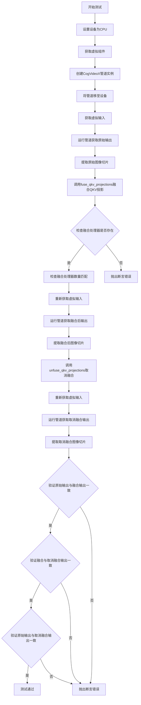

#### 带注释源码

```python
def test_fused_qkv_projections(self):
    """
    测试CogVideoX管道中QKV投影融合功能的正确性
    
    该测试验证以下场景：
    1. QKV融合前后输出应该一致
    2. 融合后取消融合的输出应该与融合时一致
    3. 原始输出与取消融合后的输出应该匹配
    """
    # 设置设备为CPU以确保确定性（对于依赖torch.Generator的设备相关测试）
    device = "cpu"  # ensure determinism for the device-dependent torch.Generator
    
    # 获取虚拟组件用于测试（包含transformer、vae、scheduler等）
    components = self.get_dummy_components()
    
    # 使用虚拟组件创建CogVideoX管道实例
    pipe = self.pipeline_class(**components)
    
    # 将管道移至指定设备（CPU）
    pipe = pipe.to(device)
    
    # 设置进度条配置（disable=None表示不禁用进度条）
    pipe.set_progress_bar_config(disable=None)

    # 获取虚拟输入（包含prompt、negative_prompt、generator等参数）
    inputs = self.get_dummy_inputs(device)
    
    # 运行管道获取输出 - 输出格式为[B, F, C, H, W]
    # B: batch, F: frames, C: channels, H: height, W: width
    frames = pipe(**inputs).frames  # [B, F, C, H, W]
    
    # 提取原始图像切片用于后续比较
    # 取batch 0，最后2帧，最后1个通道，最后3x3像素区域
    original_image_slice = frames[0, -2:, -1, -3:, -3:]

    # 融合QKV投影（将query、key、value的投影合并以优化推理）
    pipe.fuse_qkv_projections()
    
    # 验证融合后的注意力处理器是否存在
    # 确保所有注意力处理器都已成功融合
    assert check_qkv_fusion_processors_exist(pipe.transformer), (
        "Something wrong with the fused attention processors. Expected all the attention processors to be fused."
    )
    
    # 验证融合后的处理器数量是否与原始处理器数量匹配
    # 确保融合过程没有改变处理器的数量结构
    assert check_qkv_fusion_matches_attn_procs_length(
        pipe.transformer, pipe.transformer.original_attn_processors
    ), "Something wrong with the attention processors concerning the fused QKV projections."

    # 重新获取虚拟输入（确保使用相同的随机种子）
    inputs = self.get_dummy_inputs(device)
    
    # 使用融合后的管道运行推理
    frames = pipe(**inputs).frames
    
    # 提取融合后的图像切片
    image_slice_fused = frames[0, -2:, -1, -3:, -3:]

    # 取消QKV投影融合（恢复原始状态）
    pipe.transformer.unfuse_qkv_projections()
    
    # 重新获取虚拟输入
    inputs = self.get_dummy_inputs(device)
    
    # 使用取消融合的管道运行推理
    frames = pipe(**inputs).frames
    
    # 提取取消融合后的图像切片
    image_slice_disabled = frames[0, -2:, -1, -3:, -3:]

    # 验证融合操作不影响输出结果（容差1e-3）
    assert np.allclose(original_image_slice, image_slice_fused, atol=1e-3, rtol=1e-3), (
        "Fusion of QKV projections shouldn't affect the outputs."
    )
    
    # 验证融合和取消融合的输出应该一致（容差1e-3）
    assert np.allclose(image_slice_fused, image_slice_disabled, atol=1e-3, rtol=1e-3), (
        "Outputs, with QKV projection fusion enabled, shouldn't change when fused QKV projections are disabled."
    )
    
    # 验证原始输出与取消融合后的输出应该匹配（容差1e-2，较宽松）
    assert np.allclose(original_image_slice, image_slice_disabled, atol=1e-2, rtol=1e-2), (
        "Original outputs should match when fused QKV projections are disabled."
    )
```


### `CogVideoXPipelineIntegrationTests.setUp`

该方法是一个测试 fixture 的初始化方法，在每个测试方法运行前被调用，用于执行内存回收和后端缓存清理操作，以确保测试环境的干净状态。

参数：

- `self`：无类型（隐式参数），代表当前测试类实例本身

返回值：`None`，无返回值描述

#### 流程图

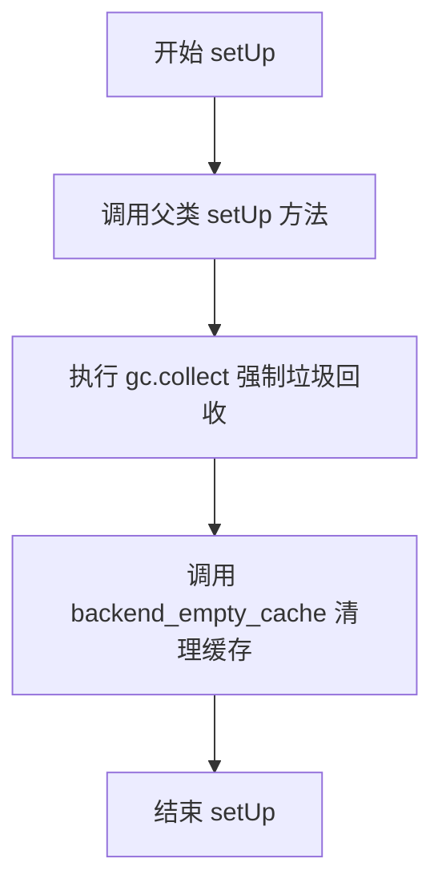

#### 带注释源码

```python
def setUp(self):
    """
    测试初始化方法，在每个测试方法执行前调用。
    负责清理内存和GPU缓存，确保测试环境干净。
    """
    # 调用父类的 setUp 方法，完成 unittest.TestCase 的标准初始化
    super().setUp()
    
    # 手动触发 Python 垃圾回收，释放不再使用的对象内存
    gc.collect()
    
    # 清理 GPU/CUDA 缓存，释放显卡内存资源
    # torch_device 是全局变量，指向测试使用的设备
    backend_empty_cache(torch_device)
```


### `CogVideoXPipelineIntegrationTests.tearDown`

该方法为集成测试的清理方法，在每个测试用例执行完毕后被调用，用于回收测试过程中产生的 Python 垃圾对象和释放 GPU 显存缓存，确保测试环境保持干净状态，避免测试间的资源泄漏和相互影响。

参数：

- 该方法无显式参数（继承自 unittest.TestCase 的 tearDown 方法，self 为隐式参数）

返回值：`None`，不返回任何值

#### 流程图

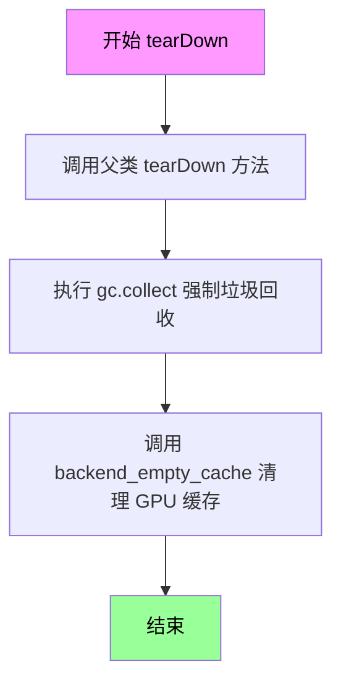

#### 带注释源码

```python
def tearDown(self):
    """
    测试用例完成后的清理方法。
    继承自 unittest.TestCase，用于在每个测试方法执行完毕后执行清理操作。
    """
    # 调用父类的 tearDown 方法，确保父类定义的清理逻辑也被执行
    super().tearDown()
    
    # 强制进行 Python 垃圾回收，释放测试过程中创建的 Python 对象
    # 这对于处理循环引用和大型对象尤为重要
    gc.collect()
    
    # 清理 GPU/CUDA 显存缓存
    # backend_empty_cache 是测试工具函数，用于释放 GPU 内存
    # 避免测试之间残留显存，影响后续测试的执行
    backend_empty_cache(torch_device)
```


### `CogVideoXPipelineIntegrationTests.test_cogvideox`

该方法是一个集成测试，用于测试 CogVideoX 视频生成管道从预训练模型加载并进行推理的完整流程，验证生成的视频是否符合预期。

参数：

- `self`：`CogVideoXPipelineIntegrationTests`，测试类的实例本身

返回值：`None`，该方法为测试方法，通过断言验证结果，不返回任何值

#### 流程图

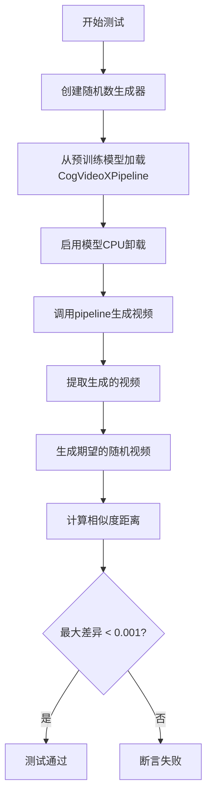

#### 带注释源码

```python
def test_cogvideox(self):
    # 创建一个CPU上的随机数生成器，种子为0，确保测试可复现
    generator = torch.Generator("cpu").manual_seed(0)

    # 从预训练模型加载CogVideoX-2b管道，使用float16精度
    pipe = CogVideoXPipeline.from_pretrained("THUDM/CogVideoX-2b", torch_dtype=torch.float16)
    
    # 启用模型CPU卸载功能，将模型移至GPU处理后再移回CPU，节省GPU内存
    pipe.enable_model_cpu_offload(device=torch_device)
    
    # 定义生成视频的文本提示
    prompt = self.prompt  # "A painting of a squirrel eating a burger."

    # 调用pipeline生成视频
    videos = pipe(
        prompt=prompt,           # 文本提示
        height=480,              # 视频高度
        width=720,              # 视频宽度
        num_frames=16,          # 视频帧数
        generator=generator,    # 随机数生成器
        num_inference_steps=2,  # 推理步数
        output_type="pt",       # 输出类型为PyTorch张量
    ).frames

    # 提取第一个（也是唯一的）生成的视频
    video = videos[0]
    
    # 创建期望的随机视频用于比较
    expected_video = torch.randn(1, 16, 480, 720, 3).numpy()

    # 计算生成视频与期望视频之间的余弦相似度距离
    max_diff = numpy_cosine_similarity_distance(video, expected_video)
    
    # 断言最大差异小于0.001，确保生成结果符合预期
    assert max_diff < 1e-3, f"Max diff is too high. got {video}"
```

## 关键组件


### CogVideoXPipeline

核心视频生成管道，整合了Transformer、VAE、文本编码器和调度器，实现文本到视频的生成能力

### CogVideoXTransformer3DModel

3D变换器模型，负责视频潜在表示的处理和去噪过程，包含时空注意力机制

### AutoencoderKLCogVideoX

变分自编码器模型，负责视频潜在空间与像素空间之间的转换，支持tiling功能进行高分辨率生成

### DDIMScheduler

调度器，负责管理去噪过程中的噪声调度策略，控制推理步骤和噪声衰减

### T5EncoderModel

文本编码器，将文本提示转换为模型可理解的嵌入表示

### AutoTokenizer

分词器，负责将文本提示转换为token序列

### 注意力切片(Attention Slicing)

通过将注意力计算分片处理，降低显存占用的优化技术

### VAE平铺(VAE Tiling)

将VAE编码/解码过程分块处理，支持高分辨率视频生成的优化策略

### QKV融合(Fused QKV Projections)

将Query、Key、Value的投影计算融合，提升注意力计算效率的技术

### 模型CPU卸载(Model CPU Offload)

将模型权重在CPU和GPU之间动态调度，降低显存峰值占用的技术

### 回调机制(Callback Mechanism)

支持在推理过程中通过callback_on_step_end和callback_on_step_end_tensor_inputs介入和修改中间结果

### 张量索引(Tensor Indexing)

在测试中通过张量切片(如frames[0, -2:, -1, -3:, -3:])提取特定帧和区域进行结果验证

### 惰性加载(Lazy Loading)

通过from_pretrained实现模型的按需加载，避免一次性加载所有权重到内存

### 反量化支持(FP16 Support)

使用torch.float16进行推理加速，减少显存使用和计算时间

### 批处理一致性测试(Batch Inference Consistency)

验证批处理生成结果与单样本生成结果的一致性，确保模型的确定性行为

## 问题及建议


### 已知问题

- **test_inference 测试断言过于宽松**：`self.assertLessEqual(max_diff, 1e10)` 的阈值设置过大（1e10），基本无法有效验证输出正确性，属于无效测试
- **test_attention_slicing_forward_pass 参数未使用**：方法接收 `test_max_difference` 和 `test_mean_pixel_difference` 参数，但方法内未使用这些参数进行条件判断
- **test_vae_tiling 参数使用不一致**：方法签名包含 `expected_diff_max: float = 0.2` 参数，但实际断言中使用硬编码值而非该参数
- **test_cogvideox 集成测试验证不充分**：使用 `torch.randn` 生成预期视频，仅验证程序不崩溃而非输出正确性，无法有效检测回归
- **设备管理不一致**：部分测试硬编码使用 `"cpu"`，部分使用 `torch_device`，可能导致在不同硬件环境下行为不一致
- **test_callback_inputs 变量赋值未使用**：部分测试分支的 `output` 变量赋值后未进行进一步验证
- **缺少资源清理**：虽然 `setUp` 和 `tearDown` 中有 gc.collect 和 empty_cache，但未显式删除大型模型对象

### 优化建议

- **加强 test_inference 断言**：使用更严格的阈值（如 1e-3）或使用固定随机种子确保输出可复现并精确匹配
- **统一设备管理**：所有测试统一使用 `torch_device` 或通过配置统一管理测试设备
- **修复 test_vae_tiling 参数使用**：将 `expected_diff_max` 参数应用到实际断言中
- **改进集成测试验证**：使用固定的预期输出或至少验证输出的一些基本属性（如形状、数值范围）而非仅检查不崩溃
- **添加测试参数条件逻辑**：在 test_attention_slicing_forward_pass 中根据参数条件执行不同的验证逻辑
- **增加测试隔离性**：每个测试后显式删除 pipeline 和模型对象，确保测试间无状态污染


## 其它


### 设计目标与约束

本测试文件旨在验证CogVideoXPipeline的核心功能正确性，包括文本到视频生成推理、注意力切片、VAE平铺、QKV融合等关键特性。测试采用dummy components进行单元测试，使用真实预训练模型进行集成测试，确保pipeline在CPU和GPU环境下均能正确运行。约束条件包括：测试必须在有torch accelerator的环境中运行（部分测试），不使用cross_attention_kwargs参数，输出类型必须为"pt"。

### 错误处理与异常设计

测试中的错误处理主要体现在三个方面：1) 回调函数验证：test_callback_inputs测试确保回调函数仅能访问允许的tensor inputs，防止非法内存访问；2) QKV融合验证：test_fused_qkv_projections通过np.allclose比较融合前后的输出，确保融合操作不影响推理结果；3) 差异阈值控制：各测试使用expected_max_diff参数控制数值误差容忍度，如test_inference允许1e10误差（dummy数据），test_vae_tiling允许0.2误差。

### 数据流与状态机

测试数据流遵循以下路径：get_dummy_components()创建transformer、vae、scheduler、text_encoder、tokenizer等组件 → get_dummy_inputs()生成包含prompt、negative_prompt、generator、num_inference_steps等参数的字典 → pipe(**inputs)执行推理 → 返回frames属性获取视频结果。状态转换包括：pipeline初始化 → 组件配置 → 推理执行 → 结果验证。test_callback_inputs测试中包含callback_on_step_end状态回调，可在每个推理步骤结束时修改latents等中间状态。

### 外部依赖与接口契约

本测试依赖以下外部组件：1) transformers库提供T5EncoderModel和AutoTokenizer，用于文本编码；2) diffusers库提供CogVideoXPipeline、AutoencoderKLCogVideoX、CogVideoXTransformer3DModel、DDIMScheduler等核心组件；3) testing_utils模块提供backend_empty_cache、enable_full_determinism、numpy_cosine_similarity_distance、require_torch_accelerator等测试工具；4) test_pipelines_common模块提供PipelineTesterMixin等测试基类。接口契约要求pipeline必须实现__call__方法，返回包含frames属性的对象，且支持callback_on_step_end和callback_on_step_end_tensor_inputs参数。

### 性能基准与测试覆盖

性能测试涵盖：1) 注意力切片性能：test_attention_slicing_forward_pass对比不同slice_size（1和2）下的推理结果差异；2) VAE平铺性能：test_vae_tiling对比128x128分辨率下平铺与非平铺的输出差异，验证平铺不会显著影响生成质量；3) QKV融合性能：test_fused_qkv_projections验证融合后推理正确性。集成测试test_cogvideox使用THUDM/CogVideoX-2b模型，在480x720分辨率下生成16帧视频，验证真实场景下的pipeline可用性。

### 测试用例设计原则

本测试文件遵循以下设计原则：1) 单元测试与集成测试分离：FastTests使用dummy components快速验证逻辑，IntegrationTests使用真实模型验证端到端功能；2) 参数化设计：get_dummy_components和get_dummy_inputs支持传入num_layers等参数，增强测试灵活性；3) 可重复性：所有随机操作均使用固定seed（0），enable_full_determinism()确保跨平台一致性；4) 混合验证：同时使用确定性断言（self.assertEqual）和数值近似断言（np.allclose），平衡严格性与鲁棒性。

### 资源清理与管理

测试中的资源管理体现在：1) gc.collect()调用：在setUp和tearDown中显式触发垃圾回收，防止内存泄漏；2) backend_empty_cache(torch_device)：清空GPU缓存，确保测试间资源隔离；3) model_cpu_offload：test_cogvideox中使用enable_model_cpu_offload，将模型在CPU和GPU间动态迁移以节省显存；4) Generator管理：get_dummy_inputs根据设备类型（MPS vs 其他）选择合适的随机数生成器，确保跨设备兼容性。

### 配置参数详解

关键配置参数说明：1) num_inference_steps=2：低步数用于快速测试，集成测试保持相同值以平衡速度与质量；2) guidance_scale=6.0：中等引导强度，平衡prompt遵循与生成多样性；3) height/width=16：dummy测试使用16x16小分辨率以加快推理，集成测试使用480x720真实分辨率；4) num_frames=8：dummy测试生成8帧，集成测试生成16帧；5) max_sequence_length=16：限制文本序列长度，与tiny-random-t5模型容量匹配；6) patch_size=2和temporal_compression_ratio=4：视频时空压缩参数，影响latent空间大小。

### 已知限制与兼容性考量

测试文件存在以下限制：1) MPS设备特殊处理：get_dummy_inputs中对mps设备使用torch.manual_seed而非Generator对象，因MPS后端对Generator支持有限；2) test_xformers_attention = False：xformers注意力因依赖问题被禁用，相关测试不执行；3) cross_attention_kwargs排除：params中移除该参数，因CogVideoX不支持此特性；4) 高度/宽度约束：test_inference中height/width必须为16，不能更小，因卷积核大小限制；5) 平台特定条件：@slow和@require_torch_accelerator装饰器标记的测试仅在GPU环境执行。

### 测试覆盖矩阵

| 测试方法 | 测试目标 | 验证方式 | 覆盖场景 |
|---------|---------|---------|---------|
| test_inference | 基础推理功能 | 输出shape验证 | 文本到视频生成 |
| test_callback_inputs | 回调机制正确性 | tensor白名单验证 | 中间状态修改 |
| test_inference_batch_single_identical | 批处理一致性 | 批量vs单样本差异 | 批处理逻辑 |
| test_attention_slicing_forward_pass | 注意力切片 | 数值差异阈值 | 内存优化 |
| test_vae_tiling | VAE平铺 | 平铺vs非平铺差异 | 大分辨率生成 |
| test_fused_qkv_projections | QKV融合 | 融合前后输出对比 | 推理加速 |
| test_cogvideox | 端到端集成 | 真实模型推理 | 生产环境验证 |


    