# `diffusers\tests\pipelines\cogvideo\test_cogvideox_fun_control.py` 详细设计文档

这是一个针对CogVideoXFunControlPipeline的单元测试文件，用于测试视频生成控制管道的各项功能，包括推理、批处理、注意力切片、VAE平铺和QKV投影融合等。

## 整体流程

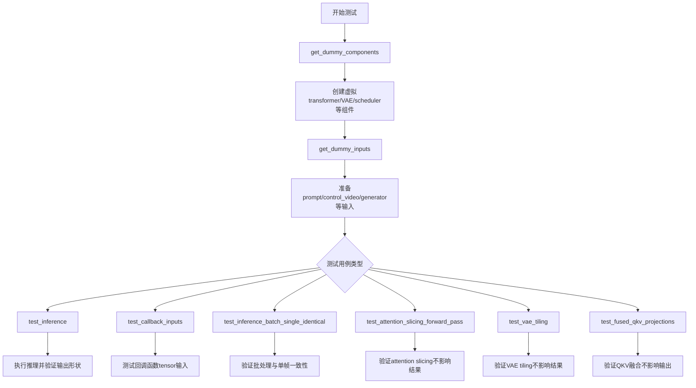

## 类结构

```
CogVideoXFunControlPipelineFastTests (测试类)
├── 继承自 PipelineTesterMixin
└── 继承自 unittest.TestCase
```

## 全局变量及字段


### `enable_full_determinism`
    
启用完整确定性以确保测试可重复性

类型：`function`
    


### `torch_device`
    
PyTorch设备标识符，通常为'cuda'或'cpu'

类型：`str`
    


### `TEXT_TO_IMAGE_BATCH_PARAMS`
    
文本到图像批量推理参数集合

类型：`set`
    


### `TEXT_TO_IMAGE_IMAGE_PARAMS`
    
文本到图像图像参数集合

类型：`set`
    


### `TEXT_TO_IMAGE_PARAMS`
    
文本到图像推理参数集合

类型：`set`
    


### `PipelineTesterMixin`
    
管道测试混合类，提供通用测试方法

类型：`class`
    


### `check_qkv_fusion_matches_attn_procs_length`
    
验证融合的QKV投影与注意力处理器长度匹配

类型：`function`
    


### `check_qkv_fusion_processors_exist`
    
检查融合的注意力处理器是否存在

类型：`function`
    


### `to_np`
    
将张量转换为NumPy数组

类型：`function`
    


### `CogVideoXFunControlPipelineFastTests.pipeline_class`
    
待测试的CogVideoXFunControlPipeline管道类

类型：`type`
    


### `CogVideoXFunControlPipelineFastTests.params`
    
管道推理参数集合

类型：`frozenset`
    


### `CogVideoXFunControlPipelineFastTests.batch_params`
    
批量推理参数集合，包含control_video

类型：`set`
    


### `CogVideoXFunControlPipelineFastTests.image_params`
    
图像参数集合

类型：`set`
    


### `CogVideoXFunControlPipelineFastTests.image_latents_params`
    
图像潜在向量参数集合

类型：`set`
    


### `CogVideoXFunControlPipelineFastTests.required_optional_params`
    
必需的可选参数集合

类型：`frozenset`
    


### `CogVideoXFunControlPipelineFastTests.test_xformers_attention`
    
是否测试xFormers注意力机制

类型：`bool`
    


### `CogVideoXFunControlPipelineFastTests.test_layerwise_casting`
    
是否测试逐层类型转换

类型：`bool`
    


### `CogVideoXFunControlPipelineFastTests.test_group_offloading`
    
是否测试组卸载功能

类型：`bool`
    
    

## 全局函数及方法


### `enable_full_determinism`

该函数用于启用PyTorch的完全确定性模式，通过设置随机种子、配置`torch.use_deterministic_algorithms`和`torch.backends.cudnn.deterministic`等，确保深度学习模型在运行时能够产生可重复的结果，主要用于测试和调试场景以保证测试的确定性。

参数：该函数无参数

返回值：`None`，无返回值

#### 流程图

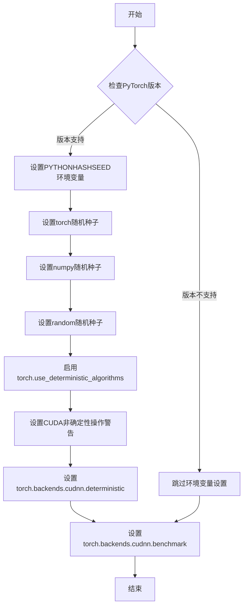

#### 带注释源码

```
# 注意：此函数的实际定义不在当前代码文件中
# 它是从 testing_utils 模块导入的
# 以下是基于其用途的推断实现

def enable_full_determinism(seed: int = 0, additional_seed: bool = True):
    """
    启用完全确定性模式，确保深度学习模型运行结果可重复
    
    参数:
        seed: 随机种子，默认为0
        additional_seed: 是否设置额外的随机种子
    
    返回值:
        None
    """
    # 1. 设置Python内置random模块的随机种子
    import random
    random.seed(seed)
    
    # 2. 设置numpy的随机种子
    import numpy as np
    np.random.seed(seed)
    
    # 3. 设置PyTorch的随机种子
    import torch
    torch.manual_seed(seed)
    
    # 4. 如果使用CUDA，设置GPU随机种子
    if torch.cuda.is_available():
        torch.cuda.manual_seed_all(seed)
    
    # 5. 启用确定性算法模式
    # 这会导致某些非确定性操作使用确定性版本（可能更慢）
    torch.use_deterministic_algorithms(True)
    
    # 6. 设置CuDNN为确定性模式
    # 禁用自动调优，强制使用确定性算法
    torch.backends.cudnn.deterministic = True
    torch.backends.cudnn.benchmark = False
    
    # 7. 如果CUDA可用，设置CUDA非确定性操作警告
    if torch.cuda.is_available():
        torch.cuda.set_per_process_memory_fraction(0.5)
        # 强制使用确定性算法
        torch.use_deterministic_algorithms(True, warn_only=True)
    
    # 8. 设置环境变量确保hash随机化的一致性
    import os
    os.environ["PYTHONHASHSEED"] = str(seed)
    
    # 9. 设置additional_seed如果需要
    if additional_seed:
        # 可能的额外种子设置
        pass

# 在给定代码中的调用位置
enable_full_determinism()  # 模块级别调用，确保后续所有测试的确定性
```

> **注意**：该函数的实际源码定义位于 `testing_utils` 模块中，当前代码文件仅导入并调用了该函数。从函数名的使用方式（模块级别调用，无参数）来看，其主要目的是在测试运行前设置全局随机种子和确定性算法，确保所有测试用例的可重复性。


### `CogVideoXFunControlPipelineFastTests.get_dummy_components`

该方法用于创建和初始化 CogVideoXFunControlPipeline 测试所需的虚拟（dummy）组件，包括 Transformer 模型、VAE、调度器、文本编码器和分词器，并返回一个包含所有组件的字典。

参数：
- 该方法无显式参数（隐式参数 `self` 为测试类实例）

返回值：`Dict[str, Any]`，返回包含以下键的字典：
- `transformer`：CogVideoXTransformer3DModel 实例
- `vae`：AutoencoderKLCogVideoX 实例
- `scheduler`：DDIMScheduler 实例
- `text_encoder`：T5EncoderModel 实例
- `tokenizer`：AutoTokenizer 实例

#### 流程图

```mermaid
flowchart TD
    A[开始] --> B[设置随机种子 torch.manual_seed(0)]
    B --> C[创建 CogVideoXTransformer3DModel]
    C --> D[设置随机种子 torch.manual_seed(0)]
    D --> E[创建 AutoencoderKLCogVideoX]
    E --> F[设置随机种子 torch.manual_seed(0)]
    F --> G[创建 DDIMScheduler]
    G --> H[从预训练模型加载 T5EncoderModel]
    H --> I[从预训练模型加载 AutoTokenizer]
    I --> J[构建 components 字典]
    J --> K[返回 components]
```

#### 带注释源码

```python
def get_dummy_components(self):
    """
    创建用于测试的虚拟组件。
    
    该方法初始化 CogVideoXFunControlPipeline 所需的所有模型组件，
    包括 transformer、vae、scheduler、text_encoder 和 tokenizer。
    为了确保测试的可重复性，每次创建组件前都设置相同的随机种子。
    """
    # 设置随机种子，确保 transformer 初始化的可重复性
    torch.manual_seed(0)
    # 创建 3D Transformer 模型，用于视频生成
    # 参数配置：4 个注意力头，每个头维度为 8
    # 输入通道 8，输出通道 4，时间嵌入维度 2，文本嵌入维度 32
    # 采样宽度 2->16，高度 2->16，帧数 9->9
    transformer = CogVideoXTransformer3DModel(
        # num_attention_heads * attention_head_dim 必须能被 16 整除以支持 3D 位置嵌入
        # 由于使用 tiny-random-t5，内部维度需要为 32
        num_attention_heads=4,
        attention_head_dim=8,
        in_channels=8,
        out_channels=4,
        time_embed_dim=2,
        text_embed_dim=32,  # 必须与 tiny-random-t5 匹配
        num_layers=1,
        sample_width=2,  # 潜在宽度: 2 -> 最终宽度: 16
        sample_height=2,  # 潜在高度: 2 -> 最终高度: 16
        sample_frames=9,  # 潜在帧: (9 - 1) / 4 + 1 = 3 -> 最终帧: 9
        patch_size=2,
        temporal_compression_ratio=4,
        max_text_seq_length=16,
    )

    # 重新设置随机种子，确保 VAE 初始化的可重复性
    torch.manual_seed(0)
    # 创建视频 VAE 模型，用于潜在空间编码/解码
    vae = AutoencoderKLCogVideoX(
        in_channels=3,
        out_channels=3,
        # 定义下采样和上采样块的类型
        down_block_types=(
            "CogVideoXDownBlock3D",
            "CogVideoXDownBlock3D",
            "CogVideoXDownBlock3D",
            "CogVideoXDownBlock3D",
        ),
        up_block_types=(
            "CogVideoXUpBlock3D",
            "CogVideoXUpBlock3D",
            "CogVideoXUpBlock3D",
            "CogVideoXUpBlock3D",
        ),
        block_out_channels=(8, 8, 8, 8),
        latent_channels=4,
        layers_per_block=1,
        norm_num_groups=2,
        temporal_compression_ratio=4,
    )

    # 重新设置随机种子，确保 scheduler 初始化的可重复性
    torch.manual_seed(0)
    # 创建 DDIM 调度器，用于去噪过程的调度
    scheduler = DDIMScheduler()
    # 从预训练模型加载 T5 文本编码器
    text_encoder = T5EncoderModel.from_pretrained("hf-internal-testing/tiny-random-t5")
    # 从预训练模型加载 T5 分词器
    tokenizer = AutoTokenizer.from_pretrained("hf-internal-testing/tiny-random-t5")

    # 组装所有组件到字典中
    components = {
        "transformer": transformer,
        "vae": vae,
        "scheduler": scheduler,
        "text_encoder": text_encoder,
        "tokenizer": tokenizer,
    }
    # 返回组件字典，供 pipeline 初始化使用
    return components
```


### `CogVideoXFunControlPipelineFastTests.get_dummy_inputs`

该方法用于生成测试所需的虚拟输入参数，初始化随机数生成器并构建包含提示词、控制视频、推理步数等配置项的字典，以供后续管道推理调用。

参数：

- `device`：`torch.device` 或 `str`，用于指定生成随机数的设备
- `seed`：`int`，默认值 0，控制随机数生成的种子值
- `num_frames`：`int`，默认值 8，控制生成的视频帧数

返回值：`dict`，包含管道推理所需的所有输入参数（如提示词、负提示词、控制视频、生成器、推理步数、引导系数、图像尺寸等）

#### 流程图

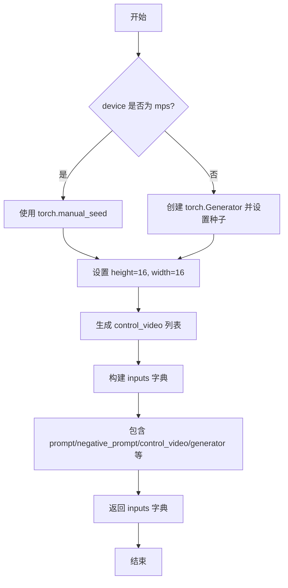

#### 带注释源码

```python
def get_dummy_inputs(self, device, seed: int = 0, num_frames: int = 8):
    """
    生成虚拟输入参数，用于测试 CogVideoXFunControlPipeline 推理流程。

    参数:
        device: 目标设备，用于创建随机数生成器
        seed: 随机种子，确保测试可复现
        num_frames: 生成的视频帧数量

    返回:
        包含管道推理所需参数的字典
    """
    # 根据设备类型选择合适的随机数生成方式
    # MPS 设备使用 torch.manual_seed，其他设备使用 torch.Generator
    if str(device).startswith("mps"):
        generator = torch.manual_seed(seed)
    else:
        generator = torch.Generator(device=device).manual_seed(seed)

    # 设置输出图像的高度和宽度
    # 注意：不能减小尺寸，因为卷积核会大于采样尺寸
    height = 16
    width = 16

    # 创建控制视频帧列表，每帧为 RGB 图像
    # 使用 PIL Image.new 创建指定尺寸的空白 RGB 图像
    control_video = [Image.new("RGB", (width, height))] * num_frames

    # 构建完整的输入参数字典，包含：
    # - prompt: 文本提示词
    # - negative_prompt: 负提示词
    # - control_video: 控制视频帧序列
    # - generator: 随机数生成器
    # - num_inference_steps: 推理步数
    # - guidance_scale: 引导系数
    # - height/width: 输出图像尺寸
    # - max_sequence_length: 最大序列长度
    # - output_type: 输出类型（PyTorch 张量）
    inputs = {
        "prompt": "dance monkey",
        "negative_prompt": "",
        "control_video": control_video,
        "generator": generator,
        "num_inference_steps": 2,
        "guidance_scale": 6.0,
        "height": height,
        "width": width,
        "max_sequence_length": 16,
        "output_type": "pt",
    }
    return inputs
```


### `CogVideoXFunControlPipelineFastTests.test_inference`

该方法是 CogVideoXFunControlPipeline 流水线的集成测试，用于验证视频生成功能的正确性。测试通过创建虚拟组件和输入，执行推理流程，并验证输出视频的形状和数值范围是否符合预期。

参数：
- 无（仅包含 self 参数）

返回值：`None`，该方法为测试方法，无返回值，通过断言验证结果

#### 流程图

```mermaid
flowchart TD
    A[开始测试] --> B[设置设备为 CPU]
    B --> C[获取虚拟组件: get_dummy_components]
    C --> D[创建Pipeline实例]
    D --> E[将Pipeline移至设备]
    E --> F[设置进度条配置: set_progress_bar_config]
    F --> G[获取虚拟输入: get_dummy_inputs]
    G --> H[执行推理: pipe(**inputs)]
    H --> I[获取生成的视频: frames]
    I --> J[验证视频形状: (8, 3, 16, 16)]
    J --> K[生成期望的随机视频张量]
    K --> L[计算最大差异]
    L --> M{最大差异 <= 1e10?}
    M -->|是| N[测试通过]
    M -->|否| O[测试失败]
```

#### 带注释源码

```python
def test_inference(self):
    """测试 CogVideoXFunControlPipeline 的推理功能"""
    # 1. 设置测试设备为 CPU
    device = "cpu"

    # 2. 获取虚拟组件（用于测试的模拟模型组件）
    # 包含: transformer, vae, scheduler, text_encoder, tokenizer
    components = self.get_dummy_components()
    
    # 3. 使用虚拟组件实例化 Pipeline
    pipe = self.pipeline_class(**components)
    
    # 4. 将 Pipeline 移至指定设备（CPU）
    pipe.to(device)
    
    # 5. 配置进度条（disable=None 表示启用进度条）
    pipe.set_progress_bar_config(disable=None)

    # 6. 获取虚拟输入参数
    # 包含: prompt, negative_prompt, control_video, generator 等
    inputs = self.get_dummy_inputs(device)
    
    # 7. 执行推理，调用 Pipeline 的 __call__ 方法
    # 返回结果包含 frames 属性，即生成的视频
    video = pipe(**inputs).frames
    
    # 8. 获取第一个视频结果（批次中的第一个）
    generated_video = video[0]

    # 9. 断言验证：生成的视频形状应为 (8, 3, 16, 16)
    # 8: 帧数, 3: 通道数(RGB), 16: 高度, 16: 宽度
    self.assertEqual(generated_video.shape, (8, 3, 16, 16))
    
    # 10. 创建期望的随机视频张量用于对比
    expected_video = torch.randn(8, 3, 16, 16)
    
    # 11. 计算生成视频与期望视频之间的最大绝对差异
    max_diff = np.abs(generated_video - expected_video).max()
    
    # 12. 断言验证：最大差异应在允许范围内（<= 1e10）
    # 注意：这里使用较大的阈值1e10，可能是为了确保数值稳定性
    self.assertLessEqual(max_diff, 1e10)
```


### `CogVideoXFunControlPipelineFastTests.test_callback_inputs`

该测试方法用于验证 CogVideoXFunControlPipeline 的回调机制是否正确实现，特别是检查 `callback_on_step_end` 和 `callback_on_step_end_tensor_inputs` 参数是否被正确支持，以及回调函数能否正确接收和操作张量输入。

参数：

- `self`：隐式参数，测试类实例本身

返回值：`None`，该方法为测试方法，不返回任何值

#### 流程图

```mermaid
flowchart TD
    A[开始 test_callback_inputs] --> B{检查 pipeline_class.__call__ 是否支持回调参数}
    B --> C{has_callback_tensor_inputs && has_callback_step_end?}
    C -->|否| D[直接返回]
    C -->|是| E[获取虚拟组件并创建 Pipeline]
    E --> F[将 Pipeline 移动到 torch_device]
    F --> G[断言 pipe 拥有 _callback_tensor_inputs 属性]
    G --> H[定义 callback_inputs_subset 回调函数 - 仅检查传入的 tensor 在允许列表中]
    H --> I[定义 callback_inputs_all 回调函数 - 检查所有允许的 tensor 都被传入且仅传入允许的 tensor]
    I --> J[使用 subset 回调测试: callback_on_step_end=callback_inputs_subset, tensor_inputs=['latents']]
    J --> K[使用 all 回调测试: callback_on_step_end=callback_inputs_all, tensor_inputs=pipe._callback_tensor_inputs]
    K --> L[定义 callback_inputs_change_tensor 回调 - 在最后一步将 latents 置零]
    L --> M[测试修改 tensor 的回调: callback_on_step_end=callback_inputs_change_tensor]
    M --> N{检查输出 abs().sum() < 1e10}
    N -->|是| O[测试通过]
    N -->|否| P[抛出断言错误]
    O --> Q[结束]
    D --> Q
    P --> Q
```

#### 带注释源码

```python
def test_callback_inputs(self):
    """
    测试 pipeline 的回调输入功能。
    验证 callback_on_step_end 和 callback_on_step_end_tensor_inputs 参数是否正确工作。
    """
    # 获取 pipeline __call__ 方法的签名
    sig = inspect.signature(self.pipeline_class.__call__)
    # 检查签名中是否包含回调张量输入参数
    has_callback_tensor_inputs = "callback_on_step_end_tensor_inputs" in sig.parameters
    # 检查签名中是否包含回调结束步骤参数
    has_callback_step_end = "callback_on_step_end" in sig.parameters

    # 如果 pipeline 不支持这些回调参数，则直接返回，不执行测试
    if not (has_callback_tensor_inputs and has_callback_step_end):
        return

    # 获取虚拟组件并创建 pipeline 实例
    components = self.get_dummy_components()
    pipe = self.pipeline_class(**components)
    # 将 pipeline 移动到测试设备
    pipe = pipe.to(torch_device)
    # 设置进度条配置
    pipe.set_progress_bar_config(disable=None)
    
    # 断言 pipeline 必须有 _callback_tensor_inputs 属性
    # 该属性定义了回调函数可以使用的张量变量列表
    self.assertTrue(
        hasattr(pipe, "_callback_tensor_inputs"),
        f" {self.pipeline_class} should have `_callback_tensor_inputs` that defines a list of tensor variables its callback function can use as inputs",
    )

    # 定义回调函数：仅检查传入的 tensor 在允许的列表中
    def callback_inputs_subset(pipe, i, t, callback_kwargs):
        # 遍历回调参数
        for tensor_name, tensor_value in callback_kwargs.items():
            # 检查我们只传入允许的张量输入
            assert tensor_name in pipe._callback_tensor_inputs
        return callback_kwargs

    # 定义回调函数：检查所有允许的 tensor 都被传入，且只传入了允许的 tensor
    def callback_inputs_all(pipe, i, t, callback_kwargs):
        # 检查所有允许的 tensor 都在回调参数中
        for tensor_name in pipe._callback_tensor_inputs:
            assert tensor_name in callback_kwargs
        # 遍历回调参数
        for tensor_name, tensor_value in callback_kwargs.items():
            # 检查我们只传入允许的张量输入
            assert tensor_name in pipe._callback_tensor_inputs
        return callback_kwargs

    # 获取虚拟输入
    inputs = self.get_dummy_inputs(torch_device)

    # 测试 1：传入回调参数的子集
    inputs["callback_on_step_end"] = callback_inputs_subset
    inputs["callback_on_step_end_tensor_inputs"] = ["latents"]
    output = pipe(**inputs)[0]

    # 测试 2：传入所有允许的回调参数
    inputs["callback_on_step_end"] = callback_inputs_all
    inputs["callback_on_step_end_tensor_inputs"] = pipe._callback_tensor_inputs
    output = pipe(**inputs)[0]

    # 定义回调函数：在最后一步将 latents 修改为零张量
    def callback_inputs_change_tensor(pipe, i, t, callback_kwargs):
        is_last = i == (pipe.num_timesteps - 1)
        if is_last:
            # 将 latents 修改为零张量
            callback_kwargs["latents"] = torch.zeros_like(callback_kwargs["latents"])
        return callback_kwargs

    # 测试 3：修改 tensor 的回调
    inputs["callback_on_step_end"] = callback_inputs_change_tensor
    inputs["callback_on_step_end_tensor_inputs"] = pipe._callback_tensor_inputs
    output = pipe(**inputs)[0]
    # 验证修改后的输出（由于 latents 被置零，输出应该接近零）
    assert output.abs().sum() < 1e10
```


### `CogVideoXFunControlPipelineFastTests.test_inference_batch_single_identical`

这是一个单元测试方法，用于验证在使用批量推理时，单个样本的输出与单独推理时的输出一致性。

参数：

- `self`：`CogVideoXFunControlPipelineFastTests`，测试类实例

返回值：`None`，该方法为测试用例，无返回值

#### 流程图

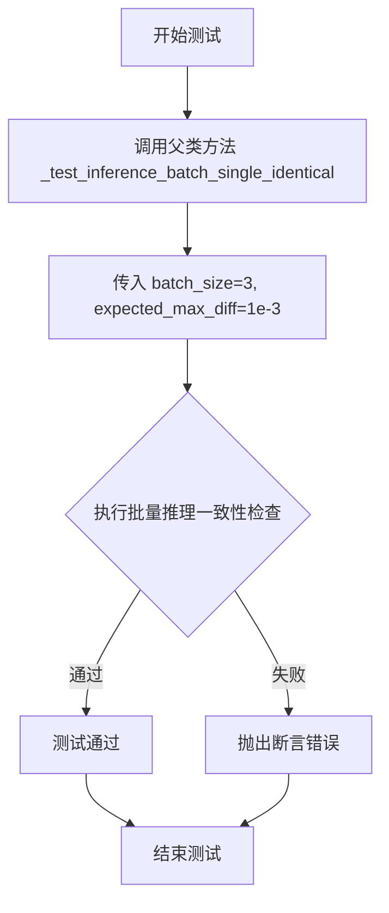

#### 带注释源码

```python
def test_inference_batch_single_identical(self):
    """
    测试批量推理时单个样本的一致性。
    
    该测试方法调用父类的 _test_inference_batch_single_identical 方法，
    用于验证在使用批量推理时，每个样本的输出应该与单独推理时完全一致。
    
    参数:
        self: CogVideoXFunControlPipelineFastTests 实例
    
    返回:
        None: 测试方法无返回值，通过断言验证一致性
    """
    # 调用父类 PipelineTesterMixin 的 _test_inference_batch_single_identical 方法
    # batch_size=3: 测试使用3个样本的批量推理
    # expected_max_diff=1e-3: 允许的最大差异阈值为 0.001
    self._test_inference_batch_single_identical(batch_size=3, expected_max_diff=1e-3)
```


### `CogVideoXFunControlPipelineFastTests.test_attention_slicing_forward_pass`

该方法用于测试 CogVideoX 管道中注意力切片（Attention Slicing）功能是否正确实现。通过比较启用不同切片大小时生成的视频帧与未启用切片时的差异，验证注意力切片不会影响推理结果的正确性。

参数：

- `self`：`CogVideoXFunControlPipelineFastTests`，测试类实例本身
- `test_max_difference`：`bool`，是否测试最大像素差异，默认为 `True`
- `test_mean_pixel_difference`：`bool`，是否测试平均像素差异（当前未使用），默认为 `True`
- `expected_max_diff`：`float`，允许的最大差异阈值，默认为 `1e-3`

返回值：`None`，该方法为单元测试方法，通过断言验证结果，无返回值

#### 流程图

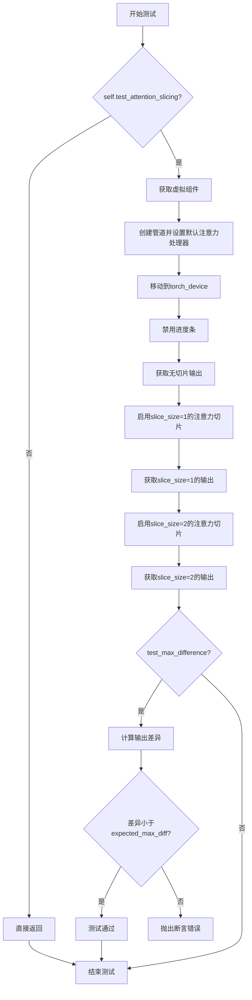

#### 带注释源码

```python
def test_attention_slicing_forward_pass(
    self, test_max_difference=True, test_mean_pixel_difference=True, expected_max_diff=1e-3
):
    """
    测试注意力切片功能对推理结果的影响。
    
    参数:
        test_max_difference: 是否测试最大像素差异
        test_mean_pixel_difference: 是否测试平均像素差异（保留参数，当前未使用）
        expected_max_diff: 允许的最大差异阈值
    """
    # 如果测试未启用注意力切片测试，则直接返回
    if not self.test_attention_slicing:
        return

    # 获取虚拟组件（包含 transformer, vae, scheduler, text_encoder, tokenizer）
    components = self.get_dummy_components()
    # 使用组件创建 CogVideoXFunControlPipeline 管道实例
    pipe = self.pipeline_class(**components)
    # 遍历所有组件，为支持 set_default_attn_processor 的组件设置默认注意力处理器
    for component in pipe.components.values():
        if hasattr(component, "set_default_attn_processor"):
            component.set_default_attn_processor()
    # 将管道移动到测试设备（torch_device）
    pipe.to(torch_device)
    # 配置进度条为禁用状态
    pipe.set_progress_bar_config(disable=None)

    # 设置生成器设备为 CPU
    generator_device = "cpu"
    # 获取虚拟输入参数（包含 prompt, negative_prompt, control_video, generator 等）
    inputs = self.get_dummy_inputs(generator_device)
    # 执行无注意力切片的推理，获取输出帧
    output_without_slicing = pipe(**inputs)[0]

    # 启用注意力切片，slice_size=1（最小切片）
    pipe.enable_attention_slicing(slice_size=1)
    # 重新获取输入并执行推理
    inputs = self.get_dummy_inputs(generator_device)
    output_with_slicing1 = pipe(**inputs)[0]

    # 启用注意力切片，slice_size=2（较大切片）
    pipe.enable_attention_slicing(slice_size=2)
    # 重新获取输入并执行推理
    inputs = self.get_dummy_inputs(generator_device)
    output_with_slicing2 = pipe(**inputs)[0]

    # 如果需要测试最大差异
    if test_max_difference:
        # 计算 slice_size=1 与无切片的输出之间的最大绝对差异
        max_diff1 = np.abs(to_np(output_with_slicing1) - to_np(output_without_slicing)).max()
        # 计算 slice_size=2 与无切片的输出之间的最大绝对差异
        max_diff2 = np.abs(to_np(output_with_slicing2) - to_np(output_without_slicing)).max()
        # 断言：注意力切片不应影响推理结果
        self.assertLess(
            max(max_diff1, max_diff2),
            expected_max_diff,
            "Attention slicing should not affect the inference results",
        )
```


### `CogVideoXFunControlPipelineFastTests.test_vae_tiling`

该测试方法用于验证 CogVideoXFunControlPipeline 的 VAE（变分自编码器）平铺（Tiling）功能是否正常工作。通过对比启用平铺与未启用平铺两种模式下的输出差异，确保 VAE 平铺功能不会对推理结果产生显著影响（差异应小于预期最大值）。

参数：

- `self`：`CogVideoXFunControlPipelineFastTests`，测试类的实例本身
- `expected_diff_max`：`float`，期望的最大差异阈值，默认为 0.5（由于 CogVideoX 管道的特殊性，需要比其他管道更高的阈值）

返回值：无（`None`），该方法为单元测试方法，通过断言验证结果

#### 流程图

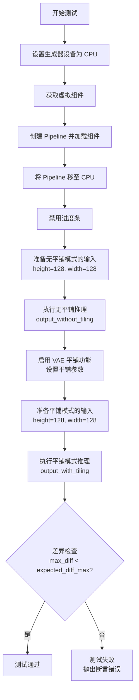

#### 带注释源码

```python
def test_vae_tiling(self, expected_diff_max: float = 0.5):
    # NOTE(aryan): This requires a higher expected_max_diff than other CogVideoX pipelines
    # 注释说明：CogVideoX 管道需要比其他管道设置更高的最大差异阈值
    
    # 1. 设置生成器设备为 CPU
    generator_device = "cpu"
    
    # 2. 获取预定义的虚拟组件（transformer, vae, scheduler, text_encoder, tokenizer）
    components = self.get_dummy_components()

    # 3. 使用虚拟组件实例化 CogVideoXFunControlPipeline
    pipe = self.pipeline_class(**components)
    
    # 4. 将管道移至 CPU 设备
    pipe.to("cpu")
    
    # 5. 配置进度条（disable=None 表示不禁用进度条）
    pipe.set_progress_bar_config(disable=None)

    # ==================== 无平铺模式推理 ====================
    
    # 6. 获取虚拟输入数据
    inputs = self.get_dummy_inputs(generator_device)
    
    # 7. 设置输入图像尺寸为 128x128（较大的尺寸会触发 VAE 平铺需求）
    inputs["height"] = inputs["width"] = 128
    
    # 8. 执行不带平铺的推理，获取输出
    output_without_tiling = pipe(**inputs)[0]

    # ==================== 启用平铺模式 ====================
    
    # 9. 启用 VAE 平铺功能，并设置平铺参数
    pipe.vae.enable_tiling(
        tile_sample_min_height=96,           # 最小平铺高度
        tile_sample_min_width=96,            # 最小平铺宽度
        tile_overlap_factor_height=1 / 12,   # 高度方向重叠因子（约 8.33%）
        tile_overlap_factor_width=1 / 12,    # 宽度方向重叠因子（约 8.33%）
    )
    
    # 10. 重新获取虚拟输入（重置输入状态）
    inputs = self.get_dummy_inputs(generator_device)
    
    # 11. 同样设置输入图像尺寸为 128x128
    inputs["height"] = inputs["width"] = 128
    
    # 12. 执行带平铺的推理，获取输出
    output_with_tiling = pipe(**inputs)[0]

    # ==================== 差异验证 ====================
    
    # 13. 断言：平铺模式与无平铺模式的输出差异应小于预期最大值
    # 将 PyTorch 张量转换为 NumPy 数组后计算最大差异
    self.assertLess(
        (to_np(output_without_tiling) - to_np(output_with_tiling)).max(),
        expected_diff_max,
        "VAE tiling should not affect the inference results",
    )
```


### `CogVideoXFunControlPipelineFastTests.test_fused_qkv_projections`

该测试方法用于验证 CogVideoXFunControlPipeline 中的 QKV（Query-Key-Value）投影融合功能是否正常工作。测试通过比较融合前、融合后和解融后的输出，验证 QKV 投影融合/解融操作不会影响模型的最终输出结果，确保融合机制的正确性和可逆性。

参数：

- `self`：`CogVideoXFunControlPipelineFastTests`，测试类实例本身

返回值：`None`，该方法为测试方法，不返回任何值，通过断言验证正确性

#### 流程图

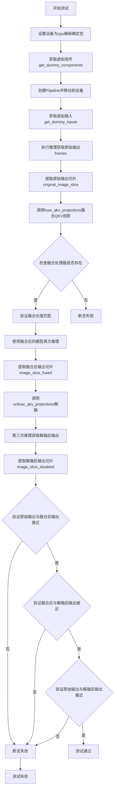

#### 带注释源码

```python
def test_fused_qkv_projections(self):
    """
    测试 QKV 投影融合功能是否正常工作
    验证融合/解融操作不会改变模型输出
    """
    # 设置设备为 cpu，确保随机数生成器的确定性
    device = "cpu"
    
    # 获取虚拟组件（transformer, vae, scheduler, text_encoder, tokenizer）
    components = self.get_dummy_components()
    
    # 使用虚拟组件创建 pipeline
    pipe = self.pipeline_class(**components)
    
    # 将 pipeline 移动到指定设备
    pipe = pipe.to(device)
    
    # 禁用进度条配置
    pipe.set_progress_bar_config(disable=None)

    # 获取虚拟输入（包含 prompt, negative_prompt, control_video 等）
    inputs = self.get_dummy_inputs(device)
    
    # 执行推理获取原始输出 [B, F, C, H, W]
    frames = pipe(**inputs).frames
    
    # 提取原始输出的一部分用于后续比较（最后2帧，最后1帧的最后3x3像素）
    original_image_slice = frames[0, -2:, -1, -3:, -3:]

    # 调用 fuse_qkv_projections 融合 QKV 投影
    # 这会将多个注意力处理器合并为一个融合的处理器
    pipe.fuse_qkv_projections()
    
    # 断言：检查融合后的注意力处理器是否存在
    assert check_qkv_fusion_processors_exist(pipe.transformer), (
        "Something wrong with the fused attention processors. "
        "Expected all the attention processors to be fused."
    )
    
    # 断言：检查融合后的 QKV 投影是否与原始注意力处理器长度匹配
    assert check_qkv_fusion_matches_attn_procs_length(
        pipe.transformer, pipe.transformer.original_attn_processors
    ), "Something wrong with the attention processors concerning the fused QKV projections."

    # 使用相同的虚拟输入再次推理（这次使用融合后的处理器）
    inputs = self.get_dummy_inputs(device)
    frames = pipe(**inputs).frames
    
    # 提取融合后的输出切片
    image_slice_fused = frames[0, -2:, -1, -3:, -3:]

    # 调用 unfuse_qkv_projections 解除 QKV 投影融合
    pipe.transformer.unfuse_qkv_projections()
    
    # 第三次推理（解融后）
    inputs = self.get_dummy_inputs(device)
    frames = pipe(**inputs).frames
    
    # 提取解融后的输出切片
    image_slice_disabled = frames[0, -2:, -1, -3:, -3:]

    # 断言：验证融合后的输出与原始输出接近（容差 1e-3）
    assert np.allclose(original_image_slice, image_slice_fused, atol=1e-3, rtol=1e-3), (
        "Fusion of QKV projections shouldn't affect the outputs."
    )
    
    # 断言：验证融合后与解融后的输出接近（容差 1e-3）
    assert np.allclose(image_slice_fused, image_slice_disabled, atol=1e-3, rtol=1e-3), (
        "Outputs, with QKV projection fusion enabled, shouldn't change when fused QKV projections are disabled."
    )
    
    # 断言：验证原始输出与解融后的输出接近（容差 1e-2，稍大）
    assert np.allclose(original_image_slice, image_slice_disabled, atol=1e-2, rtol=1e-2), (
        "Original outputs should match when fused QKV projections are disabled."
    )
```


### `CogVideoXFunControlPipelineFastTests.get_dummy_components`

该方法用于创建测试所需的虚拟（dummy）组件，返回一个包含CogVideoXFunControlPipeline所需的核心组件字典，包括transformer、vae、scheduler、text_encoder和tokenizer，这些组件均使用随机初始化的模型权重，以便进行快速测试而不需要加载预训练模型。

参数：
- 无（仅包含self隐式参数）

返回值：`Dict[str, Any]`，返回包含管道组件的字典，包括transformer（CogVideoXTransformer3DModel）、vae（AutoencoderKLCogVideoX）、scheduler（DDIMScheduler）、text_encoder（T5EncoderModel）和tokenizer（AutoTokenizer）

#### 流程图

```mermaid
flowchart TD
    A[开始 get_dummy_components] --> B[设置随机种子 torch.manual_seed(0)]
    B --> C[创建 CogVideoXTransformer3DModel]
    C --> D[设置随机种子 torch.manual_seed(0)]
    D --> E[创建 AutoencoderKLCogVideoX]
    E --> F[设置随机种子 torch.manual_seed(0)]
    F --> G[创建 DDIMScheduler]
    G --> H[加载 T5EncoderModel tiny-random-t5]
    H --> I[加载 AutoTokenizer tiny-random-t5]
    I --> J[构建 components 字典]
    J --> K[返回 components]
```

#### 带注释源码

```python
def get_dummy_components(self):
    """
    创建用于测试的虚拟组件。
    
    该方法初始化所有必需的管道组件，使用随机权重而非预训练权重，
    以便进行快速单元测试。
    """
    # 设置随机种子确保可重复性
    torch.manual_seed(0)
    
    # 创建Transformer模型 - 用于视频生成的潜在空间处理
    # 参数配置:
    # - num_attention_heads=4: 注意力头数量
    # - attention_head_dim=8: 每个注意力头的维度
    # - in_channels=8: 输入通道数
    # - out_channels=4: 输出通道数
    # - time_embed_dim=2: 时间嵌入维度
    # - text_embed_dim=32: 文本嵌入维度(必须匹配text_encoder)
    # - num_layers=1: 层数(使用1以加快测试)
    # - sample_width/height=2: 潜在空间宽高(最终输出16x16)
    # - sample_frames=9: 潜在空间帧数(最终输出9帧)
    # - patch_size=2: 补丁大小
    # - temporal_compression_ratio=4: 时间压缩比
    # - max_text_seq_length=16: 最大文本序列长度
    transformer = CogVideoXTransformer3DModel(
        num_attention_heads=4,
        attention_head_dim=8,
        in_channels=8,
        out_channels=4,
        time_embed_dim=2,
        text_embed_dim=32,  # Must match with tiny-random-t5
        num_layers=1,
        sample_width=2,  # latent width: 2 -> final width: 16
        sample_height=2,  # latent height: 2 -> final height: 16
        sample_frames=9,  # latent frames: (9 - 1) / 4 + 1 = 3 -> final frames: 9
        patch_size=2,
        temporal_compression_ratio=4,
        max_text_seq_length=16,
    )

    # 重新设置随机种子确保VAE的可重复性
    torch.manual_seed(0)
    
    # 创建VAE模型 - 用于潜在空间与像素空间的编码解码
    # 使用3D卷积块处理视频数据
    vae = AutoencoderKLCogVideoX(
        in_channels=3,
        out_channels=3,
        down_block_types=(
            "CogVideoXDownBlock3D",
            "CogVideoXDownBlock3D",
            "CogVideoXDownBlock3D",
            "CogVideoXDownBlock3D",
        ),
        up_block_types=(
            "CogVideoXUpBlock3D",
            "CogVideoXUpBlock3D",
            "CogVideoXUpBlock3D",
            "CogVideoXUpBlock3D",
        ),
        block_out_channels=(8, 8, 8, 8),
        latent_channels=4,
        layers_per_block=1,
        norm_num_groups=2,
        temporal_compression_ratio=4,
    )

    # 重新设置随机种子确保scheduler的可重复性
    torch.manual_seed(0)
    
    # 创建调度器 - 用于控制去噪过程的采样策略
    scheduler = DDIMScheduler()
    
    # 加载文本编码器 - 使用T5模型将文本提示编码为嵌入
    # 使用huggingface测试用的小型随机T5模型
    text_encoder = T5EncoderModel.from_pretrained("hf-internal-testing/tiny-random-t5")
    
    # 加载分词器 - 用于将文本转换为token
    tokenizer = AutoTokenizer.from_pretrained("hf-internal-testing/tiny-random-t5")

    # 组装所有组件到字典中
    components = {
        "transformer": transformer,
        "vae": vae,
        "scheduler": scheduler,
        "text_encoder": text_encoder,
        "tokenizer": tokenizer,
    }
    
    # 返回组件字典，供pipeline_class实例化使用
    return components
```


### `CogVideoXFunControlPipelineFastTests.get_dummy_inputs`

该方法为 CogVideoXFunControlPipeline 单元测试生成虚拟输入参数，包括文本提示、控制视频、随机数生成器、推理步数等关键参数，用于验证视频生成管道的功能正确性。

参数：

- `device`：`str` 或 `torch.device`，指定计算设备（如 "cpu"、"cuda" 等）
- `seed`：`int`，默认值为 0，用于控制随机数生成的种子值，确保测试可复现
- `num_frames`：`int`，默认值为 8，控制生成视频的帧数

返回值：`Dict[str, Any]`，返回包含管道推理所需全部参数的字典，包括提示词、负提示词、控制视频、生成器、推理步数、引导 scale、图像尺寸、序列长度和输出类型等。

#### 流程图

```mermaid
flowchart TD
    A[开始 get_dummy_inputs] --> B{device 是否为 mps?}
    B -->|是| C[使用 torch.manual_seed(seed)]
    B -->|否| D[创建 torch.Generator device=device 并设置种子]
    C --> E[设置 height=16, width=16]
    D --> E
    E --> F[创建 num_frames 个 RGB 图像]
    F --> G[构建 inputs 字典]
    G --> H[返回 inputs 字典]
    
    style A fill:#f9f,stroke:#333
    style H fill:#9f9,stroke:#333
```

#### 带注释源码

```python
def get_dummy_inputs(self, device, seed: int = 0, num_frames: int = 8):
    """
    生成用于测试的虚拟输入参数。
    
    参数:
        device: 计算设备
        seed: 随机种子
        num_frames: 视频帧数
    返回:
        包含管道推理所需参数的字典
    """
    # 判断设备类型，MPS 设备使用特殊的随机数生成方式
    if str(device).startswith("mps"):
        # MPS 设备不支持 torch.Generator，使用 torch.manual_seed
        generator = torch.manual_seed(seed)
    else:
        # 其他设备使用 torch.Generator 以支持更精确的随机控制
        generator = torch.Generator(device=device).manual_seed(seed)

    # 设置输出图像尺寸（潜在空间 2x2 -> 16x16）
    # 注意：不能减小尺寸，因为卷积核会大于样本
    height = 16
    width = 16

    # 创建控制视频帧列表，每帧为 RGB 图像
    control_video = [Image.new("RGB", (width, height))] * num_frames

    # 构建完整的输入参数字典
    inputs = {
        "prompt": "dance monkey",              # 文本提示词
        "negative_prompt": "",                 # 负提示词（空字符串）
        "control_video": control_video,        # 控制视频帧列表
        "generator": generator,                # 随机数生成器
        "num_inference_steps": 2,              # 推理步数（最小值）
        "guidance_scale": 6.0,                 #引导强度
        "height": height,                      # 输出高度
        "width": width,                        # 输出宽度
        "max_sequence_length": 16,             # 最大文本序列长度
        "output_type": "pt",                  # 输出类型（PyTorch 张量）
    }
    return inputs
```


### `CogVideoXFunControlPipelineFastTests.test_inference`

该方法是一个单元测试，用于验证 CogVideoXFunControlPipeline 推理流程的正确性。它通过创建虚拟组件和输入，执行推理，然后验证生成的视频形状和数值是否在预期范围内。

参数：

- `self`：隐式参数，测试类实例本身，无额外描述

返回值：无返回值（`None`），该方法为测试方法，通过断言验证结果而非返回值

#### 流程图

```mermaid
flowchart TD
    A[开始测试] --> B[设置设备为 CPU]
    B --> C[获取虚拟组件: get_dummy_components]
    C --> D[使用虚拟组件实例化管道: pipeline_class]
    D --> E[将管道移至设备: pipe.to]
    E --> F[设置进度条配置: set_progress_bar_config]
    F --> G[获取虚拟输入: get_dummy_inputs]
    G --> H[执行推理: pipe(**inputs)]
    H --> I[提取生成的视频: video[0]]
    I --> J[断言视频形状: (8, 3, 16, 16)]
    J --> K[生成随机期望视频]
    K --> L[计算最大差异]
    L --> M{最大差异 <= 1e10?}
    M -->|是| N[测试通过]
    M -->|否| O[测试失败]
```

#### 带注释源码

```python
def test_inference(self):
    """
    测试推理功能，验证管道能够正确生成视频帧
    """
    # 1. 设置测试设备为 CPU（确保测试的确定性）
    device = "cpu"

    # 2. 获取虚拟组件（transformer, vae, scheduler, text_encoder, tokenizer）
    # 这些是用于测试的轻量级虚拟模型
    components = self.get_dummy_components()
    
    # 3. 使用虚拟组件实例化 CogVideoXFunControlPipeline 管道
    pipe = self.pipeline_class(**components)
    
    # 4. 将管道移至指定设备（CPU）
    pipe.to(device)
    
    # 5. 配置进度条（disable=None 表示不禁用进度条）
    pipe.set_progress_bar_config(disable=None)

    # 6. 获取虚拟输入参数（包含 prompt、control_video、generator 等）
    inputs = self.get_dummy_inputs(device)
    
    # 7. 执行推理调用，解包输入参数传递给管道
    # 返回结果包含 frames 属性（生成的视频帧）
    video = pipe(**inputs).frames
    
    # 8. 从返回结果中提取第一个生成的视频（batch size 为 1）
    generated_video = video[0]

    # 9. 断言验证生成的视频形状是否符合预期
    # 预期形状: (8 frames, 3 channels, 16 height, 16 width)
    self.assertEqual(generated_video.shape, (8, 3, 16, 16))
    
    # 10. 生成随机期望视频用于差异比较
    expected_video = torch.randn(8, 3, 16, 16)
    
    # 11. 计算生成视频与期望视频之间的最大绝对差异
    max_diff = np.abs(generated_video - expected_video).max()
    
    # 12. 断言验证最大差异在允许范围内（允许较大的误差因为使用随机模型）
    self.assertLessEqual(max_diff, 1e10)
```


### `CogVideoXFunControlPipelineFastTests.test_callback_inputs`

该方法是一个单元测试函数，用于验证 CogVideoXFunControlPipeline 管道是否正确支持回调功能。它通过检查管道是否实现了 `callback_on_step_end` 和 `callback_on_step_end_tensor_inputs` 参数，然后测试三种不同的回调场景：仅传递部分 tensor 输入、传递所有 tensor 输入，以及在回调中修改 latents 以验证回调可以正确影响输出。

参数：

- `self`：CogVideoXFunControlPipelineFastTests，测试类实例

返回值：`None`，该方法为测试方法，不返回任何值，仅通过断言验证回调功能的正确性

#### 流程图

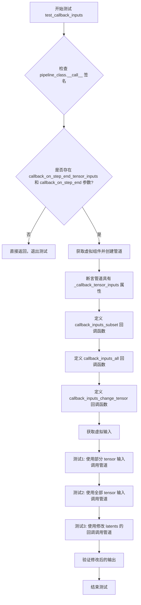

#### 带注释源码

```python
def test_callback_inputs(self):
    """
    测试管道的回调输入功能。
    验证 callback_on_step_end 和 callback_on_step_end_tensor_inputs 参数是否正确工作。
    """
    # 获取管道类的 __call__ 方法签名
    sig = inspect.signature(self.pipeline_class.__call__)
    
    # 检查管道是否支持回调张量输入功能
    has_callback_tensor_inputs = "callback_on_step_end_tensor_inputs" in sig.parameters
    has_callback_step_end = "callback_on_step_end" in sig.parameters

    # 如果管道不支持这些参数，则跳过测试
    if not (has_callback_tensor_inputs and has_callback_step_end):
        return

    # 创建虚拟组件和管道实例
    components = self.get_dummy_components()
    pipe = self.pipeline_class(**components)
    pipe = pipe.to(torch_device)
    pipe.set_progress_bar_config(disable=None)
    
    # 验证管道具有 _callback_tensor_inputs 属性，用于定义回调函数可用的张量变量列表
    self.assertTrue(
        hasattr(pipe, "_callback_tensor_inputs"),
        f" {self.pipeline_class} should have `_callback_tensor_inputs` that defines a list of tensor variables its callback function can use as inputs",
    )

    # 定义回调函数：只验证传递的张量是允许的子集
    def callback_inputs_subset(pipe, i, t, callback_kwargs):
        # 遍历回调参数
        for tensor_name, tensor_value in callback_kwargs.items():
            # 检查只传递了允许的张量输入
            assert tensor_name in pipe._callback_tensor_inputs
        return callback_kwargs

    # 定义回调函数：验证所有允许的张量都被传递
    def callback_inputs_all(pipe, i, t, callback_kwargs):
        # 检查所有允许的张量都在回调参数中
        for tensor_name in pipe._callback_tensor_inputs:
            assert tensor_name in callback_kwargs

        # 遍历回调参数，验证只传递了允许的张量
        for tensor_name, tensor_value in callback_kwargs.items():
            assert tensor_name in pipe._callback_tensor_inputs

        return callback_kwargs

    # 获取虚拟输入数据
    inputs = self.get_dummy_inputs(torch_device)

    # 测试1: 只传递部分允许的张量输入 (仅 latents)
    inputs["callback_on_step_end"] = callback_inputs_subset
    inputs["callback_on_step_end_tensor_inputs"] = ["latents"]
    output = pipe(**inputs)[0]

    # 测试2: 传递所有允许的张量输入
    inputs["callback_on_step_end"] = callback_inputs_all
    inputs["callback_on_step_end_tensor_inputs"] = pipe._callback_tensor_inputs
    output = pipe(**inputs)[0]

    # 定义回调函数: 在最后一步将 latents 修改为零张量
    def callback_inputs_change_tensor(pipe, i, t, callback_kwargs):
        is_last = i == (pipe.num_timesteps - 1)
        if is_last:
            # 将 latents 修改为零张量
            callback_kwargs["latents"] = torch.zeros_like(callback_kwargs["latents"])
        return callback_kwargs

    # 测试3: 使用会修改 latents 的回调函数
    inputs["callback_on_step_end"] = callback_inputs_change_tensor
    inputs["callback_on_step_end_tensor_inputs"] = pipe._callback_tensor_inputs
    output = pipe(**inputs)[0]
    
    # 验证修改后的输出确实是零（或接近零）
    assert output.abs().sum() < 1e10
```


### `CogVideoXFunControlPipelineFastTests.test_inference_batch_single_identical`

该方法是CogVideoXFunControlPipeline管道的批处理推理一致性测试，用于验证在批量推理时单个样本的输出是否与单独推理时保持一致，确保批处理实现不会引入不确定的误差。

参数：

- `self`：隐含参数，`CogVideoXFunControlPipelineFastTests`实例本身

返回值：`None`，该方法为单元测试方法，通过断言验证推理结果一致性，不返回具体数值

#### 流程图

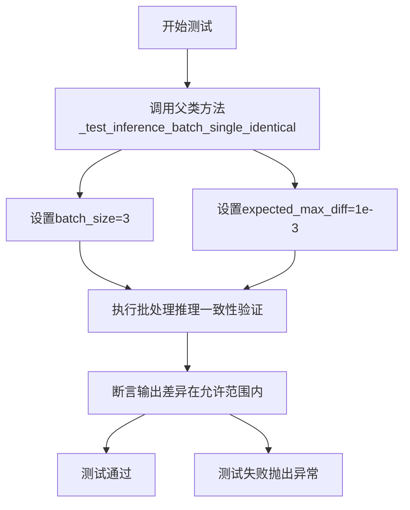

#### 带注释源码

```python
def test_inference_batch_single_identical(self):
    """
    测试批处理推理时单个样本的输出是否与单独推理时一致。
    
    该测试方法验证CogVideoXFunControlPipeline在批处理模式下，
    批量中每个单独样本的输出是否与单独推理时的输出保持一致，
    确保批处理实现不会引入额外误差。
    
    参数:
        self: CogVideoXFunControlPipelineFastTests实例
        
    返回值:
        None: 通过assert语句进行验证
        
    异常:
        AssertionError: 当批处理输出与单独推理输出差异超过expected_max_diff时抛出
    """
    # 调用父类/混合类中实现的具体测试逻辑
    # batch_size=3: 测试3个样本的批处理
    # expected_max_diff=1e-3: 允许的最大差异阈值为0.001
    self._test_inference_batch_single_identical(batch_size=3, expected_max_diff=1e-3)
```


### `CogVideoXFunControlPipelineFastTests.test_attention_slicing_forward_pass`

该测试方法用于验证 CogVideoXFunControlPipeline 的注意力切片（Attention Slicing）功能是否正常工作。通过对比启用不同切片大小时与未启用切片时的推理输出差异，确保注意力切片机制不会影响最终的推理结果。

参数：

- `test_max_difference`：`bool` 类型，默认为 `True`，是否测试最大像素差异
- `test_mean_pixel_difference`：`bool` 类型，默认为 `True`，是否测试平均像素差异
- `expected_max_diff`：`float` 类型，默认为 `1e-3`，允许的最大差异阈值

返回值：`None`，该方法通过断言验证结果，不返回任何值

#### 流程图

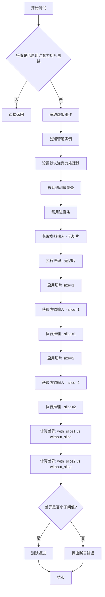

#### 带注释源码

```python
def test_attention_slicing_forward_pass(
    self, test_max_difference=True, test_mean_pixel_difference=True, expected_max_diff=1e-3
):
    """
    测试注意力切片功能是否正常工作，确保切片不影响推理结果
    
    参数:
        test_max_difference: 是否测试最大差异
        test_mean_pixel_difference: 是否测试平均像素差异
        expected_max_diff: 允许的最大差异阈值
    """
    # 检查是否启用了注意力切片测试
    # 如果未启用则直接返回，不执行测试
    if not self.test_attention_slicing:
        return

    # 获取虚拟组件（transformer, vae, scheduler等）
    components = self.get_dummy_components()
    
    # 使用虚拟组件创建管道实例
    pipe = self.pipeline_class(**components)
    
    # 为所有支持注意力处理器的组件设置默认注意力处理器
    for component in pipe.components.values():
        if hasattr(component, "set_default_attn_processor"):
            component.set_default_attn_processor()
    
    # 将管道移动到测试设备
    pipe.to(torch_device)
    
    # 设置进度条配置（disable=None 表示启用进度条）
    pipe.set_progress_bar_config(disable=None)

    # 获取生成器设备
    generator_device = "cpu"
    
    # 获取虚拟输入（不启用注意力切片）
    inputs = self.get_dummy_inputs(generator_device)
    
    # 执行无切片推理，获取基准输出
    output_without_slicing = pipe(**inputs)[0]

    # 启用注意力切片，slice_size=1
    pipe.enable_attention_slicing(slice_size=1)
    
    # 获取新的虚拟输入
    inputs = self.get_dummy_inputs(generator_device)
    
    # 执行slice_size=1的推理
    output_with_slicing1 = pipe(**inputs)[0]

    # 启用注意力切片，slice_size=2
    pipe.enable_attention_slicing(slice_size=2)
    
    # 获取新的虚拟输入
    inputs = self.get_dummy_inputs(generator_device)
    
    # 执行slice_size=2的推理
    output_with_slicing2 = pipe(**inputs)[0]

    # 如果需要测试最大差异
    if test_max_difference:
        # 将输出转换为numpy数组并计算最大差异
        max_diff1 = np.abs(to_np(output_with_slicing1) - to_np(output_without_slicing)).max()
        max_diff2 = np.abs(to_np(output_with_slicing2) - to_np(output_without_slicing)).max()
        
        # 断言：注意力切片不应影响推理结果
        # 比较两种切片大小与无切片的差异，取最大值与阈值比较
        self.assertLess(
            max(max_diff1, max_diff2),
            expected_max_diff,
            "Attention slicing should not affect the inference results"
        )
```


### `CogVideoXFunControlPipelineFastTests.test_vae_tiling`

这是一个测试 VAE (Variational Autoencoder) tiling 功能的单元测试方法。该方法通过比较启用 tiling 和未启用 tiling 两种情况下的输出差异，验证 VAE tiling 功能是否正常工作，确保 tiling 不会影响推理结果。

参数：

- `expected_diff_max`：`float` 类型，默认为 0.5，允许的最大差异阈值（需要比其它 CogVideoX pipeline 更高的阈值）

返回值：`None`（测试方法，无返回值，通过断言验证）

#### 流程图

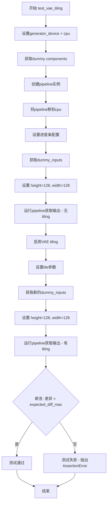

#### 带注释源码

```python
def test_vae_tiling(self, expected_diff_max: float = 0.5):
    # NOTE(aryan): This requires a higher expected_max_diff than other CogVideoX pipelines
    # 说明：与其他CogVideoX pipeline相比，此测试需要更高的expected_max_diff阈值
    
    # 1. 设置测试设备为CPU
    generator_device = "cpu"
    
    # 2. 获取虚拟（dummy）组件
    components = self.get_dummy_components()

    # 3. 使用组件创建pipeline实例
    pipe = self.pipeline_class(**components)
    
    # 4. 将pipeline移到CPU设备
    pipe.to("cpu")
    
    # 5. 配置进度条（disable=None 表示不禁用进度条）
    pipe.set_progress_bar_config(disable=None)

    # ==================== 不使用 tiling 的测试 ====================
    # 6. 获取虚拟输入
    inputs = self.get_dummy_inputs(generator_device)
    
    # 7. 设置较大的图像尺寸（128x128）以触发 tiling 逻辑
    inputs["height"] = inputs["width"] = 128
    
    # 8. 运行pipeline获取不使用tiling的输出
    # 返回的frames是一个列表，取第一个元素得到视频帧
    output_without_tiling = pipe(**inputs)[0]

    # ==================== 使用 tiling 的测试 ====================
    # 9. 启用VAE tiling，配置分块参数
    pipe.vae.enable_tiling(
        tile_sample_min_height=96,           # 分块最小高度
        tile_sample_min_width=96,            # 分块最小宽度
        tile_overlap_factor_height=1 / 12,   # 高度方向重叠因子（约8.33%）
        tile_overlap_factor_width=1 / 12,    # 宽度方向重叠因子（约8.33%）
    )
    
    # 10. 获取新的虚拟输入（相同的设置）
    inputs = self.get_dummy_inputs(generator_device)
    
    # 11. 同样设置较大的图像尺寸
    inputs["height"] = inputs["width"] = 128
    
    # 12. 运行pipeline获取使用tiling的输出
    output_with_tiling = pipe(**inputs)[0]

    # ==================== 验证结果 ====================
    # 13. 断言：tiling前后的输出差异应该小于阈值
    # 将输出转换为numpy数组进行数值比较
    self.assertLess(
        (to_np(output_without_tiling) - to_np(output_with_tiling)).max(),
        expected_diff_max,  # 阈值0.5，比其他pipeline要求更宽松
        "VAE tiling should not affect the inference results",
    )
```


### `CogVideoXFunControlPipelineFastTests.test_fused_qkv_projections`

该测试方法用于验证 CogVideoXFunControlPipeline 中的 QKV（Query-Key-Value）投影融合功能是否正常工作。测试通过对比融合前、融合后以及解融后的输出图像切片，确保 QKV 投影融合不会影响模型的输出结果。

参数：

- `self`：`CogVideoXFunControlPipelineFastTests`，测试类实例本身，包含测试所需的组件和配置

返回值：`None`，该方法为单元测试方法，无返回值，通过断言验证功能正确性

#### 流程图

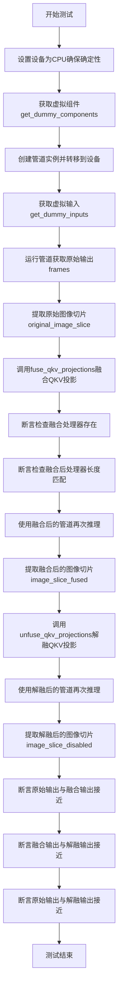

#### 带注释源码

```python
def test_fused_qkv_projections(self):
    """测试QKV投影融合功能，验证融合/解融不会改变输出结果"""
    
    # 设置设备为CPU，确保使用torch.Generator时的确定性
    device = "cpu"  # ensure determinism for the device-dependent torch.Generator
    
    # 获取虚拟组件（transformer、vae、scheduler、text_encoder、tokenizer等）
    components = self.get_dummy_components()
    
    # 使用虚拟组件创建管道实例
    pipe = self.pipeline_class(**components)
    
    # 将管道移动到指定设备
    pipe = pipe.to(device)
    
    # 配置进度条（disable=None表示不禁用）
    pipe.set_progress_bar_config(disable=None)

    # 获取虚拟输入（包含prompt、control_video、generator等）
    inputs = self.get_dummy_inputs(device)
    
    # 运行管道获取视频帧 [B, F, C, H, W]
    # B=batch, F=frames, C=channels, H=height, W=width
    frames = pipe(**inputs).frames  # [B, F, C, H, W]
    
    # 提取原始输出切片：取最后2帧、最后1通道、最后3x3像素区域
    original_image_slice = frames[0, -2:, -1, -3:, -3:]

    # 调用fuse_qkv_projections将QKV投影融合为一个联合投影
    # 这是一种注意力机制优化，将分离的Q、K、V计算合并
    pipe.fuse_qkv_projections()
    
    # 断言：检查融合后的注意力处理器是否存在
    assert check_qkv_fusion_processors_exist(pipe.transformer), (
        "Something wrong with the fused attention processors. Expected all the attention processors to be fused."
    )
    
    # 断言：检查融合后的处理器数量是否与原始处理器数量匹配
    assert check_qkv_fusion_matches_attn_procs_length(
        pipe.transformer, pipe.transformer.original_attn_processors
    ), "Something wrong with the attention processors concerning the fused QKV projections."

    # 使用融合后的管道重新进行推理
    inputs = self.get_dummy_inputs(device)
    frames = pipe(**inputs).frames
    # 提取融合后的输出切片
    image_slice_fused = frames[0, -2:, -1, -3:, -3:]

    # 调用unfuse_qkv_projections将QKV投影解融回独立投影
    pipe.transformer.unfuse_qkv_projections()
    
    # 使用解融后的管道进行推理
    inputs = self.get_dummy_inputs(device)
    frames = pipe(**inputs).frames
    # 提取解融后的输出切片
    image_slice_disabled = frames[0, -2:, -1, -3:, -3:]

    # 断言：融合后的输出应与原始输出相近（容差1e-3）
    assert np.allclose(original_image_slice, image_slice_fused, atol=1e-3, rtol=1e-3), (
        "Fusion of QKV projections shouldn't affect the outputs."
    )
    
    # 断言：融合输出与解融输出应相近（容差1e-3）
    assert np.allclose(image_slice_fused, image_slice_disabled, atol=1e-3, rtol=1e-3), (
        "Outputs, with QKV projection fusion enabled, shouldn't change when fused QKV projections are disabled."
    )
    
    # 断言：原始输出与解融输出应相近（容差1e-2，容差稍大）
    assert np.allclose(original_image_slice, image_slice_disabled, atol=1e-2, rtol=1e-2), (
        "Original outputs should match when fused QKV projections are disabled."
    )
```

## 关键组件


### CogVideoXFunControlPipeline

主管道类，集成了Transformer、VAE、调度器和文本编码器，实现基于控制视频的视频生成功能，支持注意力切片、VAE平铺和QKV投影融合等优化特性。

### CogVideoXTransformer3DModel

3D变换器模型，负责视频生成的去噪过程，接受时间步嵌入和文本嵌入作为条件输入，支持3D位置编码和时空注意力机制。

### AutoencoderKLCogVideoX

变分自编码器(VAE)模型，负责将视频从像素空间压缩到潜在空间以及从潜在空间解码回像素空间，支持时间维度压缩。

### DDIMScheduler

调度器类，实现DDIM (Denoising Diffusion Implicit Models) 采样策略，控制去噪过程中的噪声调度和时间步长安排。

### T5EncoderModel

文本编码器，将输入提示词编码为文本嵌入向量，为生成过程提供文本条件信息。

### AutoTokenizer

分词器，将文本提示词转换为token序列，供文本编码器处理。

### 注意力切片 (Attention Slicing)

内存优化技术，将注意力计算分片处理以降低显存占用，通过 `enable_attention_slicing` 方法启用。

### VAE平铺 (VAE Tiling)

处理高分辨率视频的优化技术，将VAE编码/解码过程分块处理，通过 `enable_tiling` 方法配置，支持设置分块大小和重叠因子。

### QKV融合 (QKV Fusion)

将查询、键、值的投影合并为单一矩阵运算以提升推理速度的技术，通过 `fuse_qkv_projections` 和 `unfuse_qkv_projections` 方法控制。

### 回调机制 (Callback Mechanism)

支持在推理过程中嵌入自定义逻辑，通过 `callback_on_step_end` 和 `callback_on_step_end_tensor_inputs` 参数实现，支持在每个去噪步骤结束后修改中间结果。


## 问题及建议


### 已知问题

-   `test_inference` 中的阈值设置过大（`self.assertLessEqual(max_diff, 1e10)`），1e10 的差异阈值几乎无法捕捉任何实际错误，导致测试几乎无意义
-   多个测试方法（如 `test_attention_slicing_forward_pass`、`test_vae_tiling`）每次都重新创建 pipeline 组件，导致重复初始化，增加测试时间
-   `get_dummy_components` 方法包含大量硬编码参数，配置分散在不同位置，维护困难
-   `test_callback_inputs` 中的 `callback_inputs_change_tensor` 测试逻辑存在风险：在最后一步将 latents 置零后断言 `output.abs().sum() < 1e10`，但阈值同样过大
-   `params` 和 `batch_params` 使用集合操作（`-` 和 `.union`）定义参数，容易在参数变更时引入隐式错误
-   `test_fused_qkv_projections` 中多次调用 `get_dummy_inputs(device)` 生成新的随机输入，每次输入不同会导致结果比较不严谨
-   `test_attention_slicing_forward_pass` 接收参数 `test_max_difference` 和 `test_mean_pixel_difference` 但未实际使用，仅依赖类属性 `self.test_attention_slicing` 控制是否运行

### 优化建议

-   调整关键测试的阈值：将 `test_inference` 中的 1e10 改为合理的数值（如 1.0 或 0.5），确保测试真正验证输出一致性
-   提取公共的 pipeline 初始化逻辑到 `setUp` 方法中，使用 `unittest.TestCase.setUp` 缓存组件，避免重复创建
-   将 `get_dummy_components` 中的配置参数提取为常量或配置类，提高可维护性
-   使用 `torch.manual_seed` 确保 `test_fused_qkv_projections` 中所有 `get_dummy_inputs` 调用生成相同的随机输入，使结果比较更严格
-   移除 `test_attention_slicing_forward_pass` 中未使用的参数，或使用 `unittest.skipIf` 装饰器替代类属性检查
-   添加测试用例说明文档或注释，解释关键参数（如 `expected_diff_max: float = 0.5`）的设计意图

## 其它


### 设计目标与约束

本测试文件旨在验证 CogVideoXFunControlPipeline 的核心功能正确性，包括视频生成、注意力切片、VAE 平铺、QKV 融合等关键特性。测试约束包括：仅支持 CPU 设备进行确定性测试，使用固定的随机种子确保可重复性，跳过 xformers 注意力测试但启用分层类型转换和组卸载测试。

### 错误处理与异常设计

测试中未显式捕获异常，主要依赖 unittest 框架的断言机制。关键断言包括：验证生成视频的形状为 (8, 3, 16, 16)，验证输出与期望值的最大差异在容忍范围内（普通测试为 1e-3，VAE 平铺测试为 0.5），验证 QKV 融合前后输出应保持一致（容忍度 1e-3）。

### 数据流与状态机

测试数据流：get_dummy_components() 创建虚拟模型组件 → get_dummy_inputs() 生成测试输入（包括 prompt、control_video、generator 等）→ pipeline 执行推理 → 验证输出 frames。pipeline 状态转换：初始化（加载组件）→ 设置设备 → 设置进度条配置 → 执行推理 → 返回结果。

### 外部依赖与接口契约

主要依赖包括：transformers 库的 AutoTokenizer 和 T5EncoderModel，diffusers 库的 AutoencoderKLCogVideoX、CogVideoXFunControlPipeline、CogVideoXTransformer3DModel、DDIMScheduler，以及 PIL、numpy、torch、unittest、inspect 等基础库。pipeline_class 必须实现 __call__ 方法，支持指定的 params（排除 cross_attention_kwargs）和 batch_params（包含 control_video）。

### 性能要求与基准

测试性能基准：inference 测试使用 2 个推理步骤，batch_single_identical 测试批量大小为 3 expected_max_diff 为 1e-3，attention_slicing 测试 expected_max_diff 为 1e-3，VAE_tiling 测试 expected_diff_max 为 0.5，fused_qkv 测试使用 np.allclose 验证精度（主要精度 1e-3，次要精度 1e-2）。

### 安全与权限设计

测试文件遵循 Apache License 2.0，使用 hf-internal-testing/tiny-random-t5 预训练模型进行测试，不涉及真实用户数据或敏感信息。

### 配置与参数设计

关键配置参数：num_inference_steps=2，guidance_scale=6.0，height=16，width=16，max_sequence_length=16，output_type="pt"。虚拟组件配置：transformer 使用 num_attention_heads=4, attention_head_dim=8, in_channels=8, out_channels=4, time_embed_dim=2, text_embed_dim=32, num_layers=1；vae 使用 block_out_channels=(8,8,8,8), latent_channels=4, layers_per_block=1, norm_num_groups=2。

### 并发与线程安全

测试主要针对单线程执行，未涉及并发场景。torch.manual_seed(0) 确保各组件初始化的确定性，generator 使用固定种子保证可重复性。

### 版本兼容性设计

测试通过检查 pipeline 签名验证兼容性：检查 callback_on_step_end_tensor_inputs 和 callback_on_step_end 参数是否存在，确保测试可适配不同版本的 pipeline 实现。

### 测试覆盖度与测试策略

测试覆盖：基础推理测试、回调输入测试、批量推理一致性测试、注意力切片测试、VAE 平铺测试、QKV 融合投影测试。测试策略：使用虚拟组件避免真实模型开销，使用固定种子确保可重复性，使用多层次断言验证不同精度要求。

### 日志与监控设计

使用 pipe.set_progress_bar_config(disable=None) 配置进度条显示，便于监控长时间推理过程。测试输出主要通过 unittest 框架的断言结果进行监控。

### 部署与运维考虑

本测试文件为开发测试代码，不涉及生产部署。运维人员需注意：测试环境需要安装指定版本的 diffusers、transformers、torch、numpy、PIL 等依赖，测试时间受 num_inference_steps 影响，内存占用受视频分辨率和帧数影响。


    