# `diffusers\tests\pipelines\cogvideo\test_cogvideox_image2video.py` 详细设计文档

这是一个CogVideoX图像到视频生成Pipeline的单元测试和集成测试文件，用于验证CogVideoXImageToVideoPipeline的功能正确性，包括推理、注意力切片、VAE平铺、QKV融合等关键特性。

## 整体流程

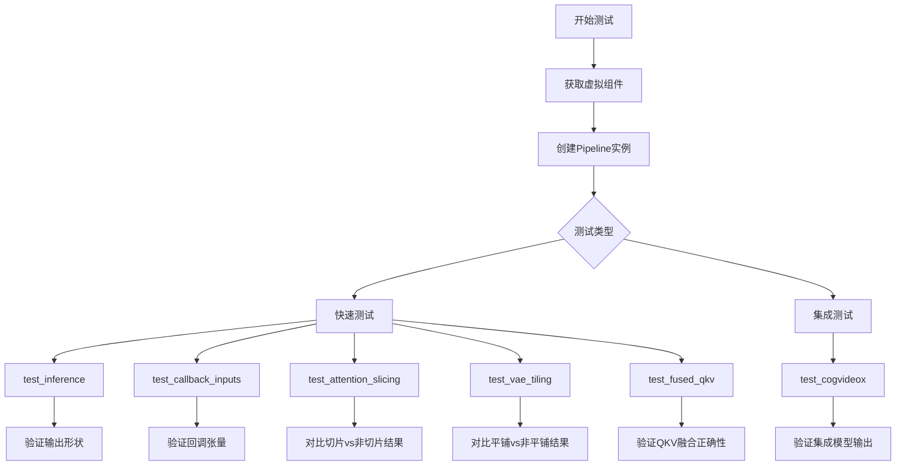

## 类结构

```
unittest.TestCase (基类)
├── CogVideoXImageToVideoPipelineFastTests (快速测试类)
│   ├── get_dummy_components() - 创建虚拟组件
│   ├── get_dummy_inputs() - 创建虚拟输入
│   ├── test_inference() - 推理测试
│   ├── test_callback_inputs() - 回调输入测试
│   ├── test_inference_batch_single_identical() - 批处理测试
│   ├── test_attention_slicing_forward_pass() - 注意力切片测试
│   ├── test_vae_tiling() - VAE平铺测试
│   └── test_fused_qkv_projections() - QKV融合测试
└── CogVideoXImageToVideoPipelineIntegrationTests (集成测试类)
    ├── setUp() - 测试前准备
    ├── tearDown() - 测试后清理
    └── test_cogvideox() - 集成测试
```

## 全局变量及字段


### `pipeline_class`
    
The pipeline class being tested, CogVideoXImageToVideoPipeline from diffusers

类型：`Type[CogVideoXImageToVideoPipeline]`
    


### `CogVideoXImageToVideoPipelineFastTests.pipeline_class`
    
Class variable referencing the CogVideoXImageToVideoPipeline class being tested

类型：`Type[CogVideoXImageToVideoPipeline]`
    


### `CogVideoXImageToVideoPipelineFastTests.params`
    
Text-to-image pipeline parameters excluding cross_attention_kwargs

类型：`Set[str]`
    


### `CogVideoXImageToVideoPipelineFastTests.batch_params`
    
Batch parameters including image parameter for batch processing

类型：`Set[str]`
    


### `CogVideoXImageToVideoPipelineFastTests.image_params`
    
Image parameters for image-to-video pipeline testing

类型：`Set[str]`
    


### `CogVideoXImageToVideoPipelineFastTests.image_latents_params`
    
Image latents parameters for latent space image processing

类型：`Set[str]`
    


### `CogVideoXImageToVideoPipelineFastTests.required_optional_params`
    
Optional parameters that can be passed to the pipeline call method

类型：`FrozenSet[str]`
    


### `CogVideoXImageToVideoPipelineFastTests.test_xformers_attention`
    
Flag indicating whether to test xformers attention implementation

类型：`bool`
    


### `CogVideoXImageToVideoPipelineIntegrationTests.prompt`
    
Test prompt for integration testing of image-to-video generation

类型：`str`
    
    

## 全局函数及方法


### enable_full_determinism

描述：`enable_full_determinism` 是一个用于确保测试环境完全确定性的全局函数。在当前代码中，该函数在测试类定义之前被调用，其目的是配置随机种子、禁用非确定性操作（如 CUDA 的非确定性算法），以保证测试结果的可重复性。

参数：
- 该函数在调用时未传递任何参数。

返回值：
- 由于未提供函数定义，推断其返回类型为 `None`，表示无返回值。

#### 流程图

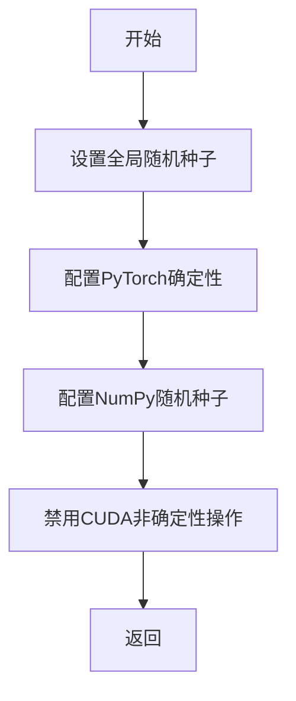

#### 带注释源码

无法提供源码。因为该函数未在当前代码片段中定义，而是从 `...testing_utils` 模块导入。调用方式如下：

```python
# 导入语句（来自代码第38行）
from ...testing_utils import enable_full_determinism

# 调用（来自代码第54行）
enable_full_determinism()
```

注意：以上源码仅为调用示例，实际函数实现位于 `diffusers` 库的 `testing_utils` 模块中。


### `load_image`

该函数是 `diffusers.utils` 模块提供的工具函数，用于从 URL 或本地文件路径加载图像，并将其转换为 PIL Image 对象。

参数：

-  `image_source`：`str`，图像的来源，可以是 URL 字符串或本地文件路径

返回值：`PIL.Image.Image`，返回加载后的 PIL 图像对象

#### 流程图

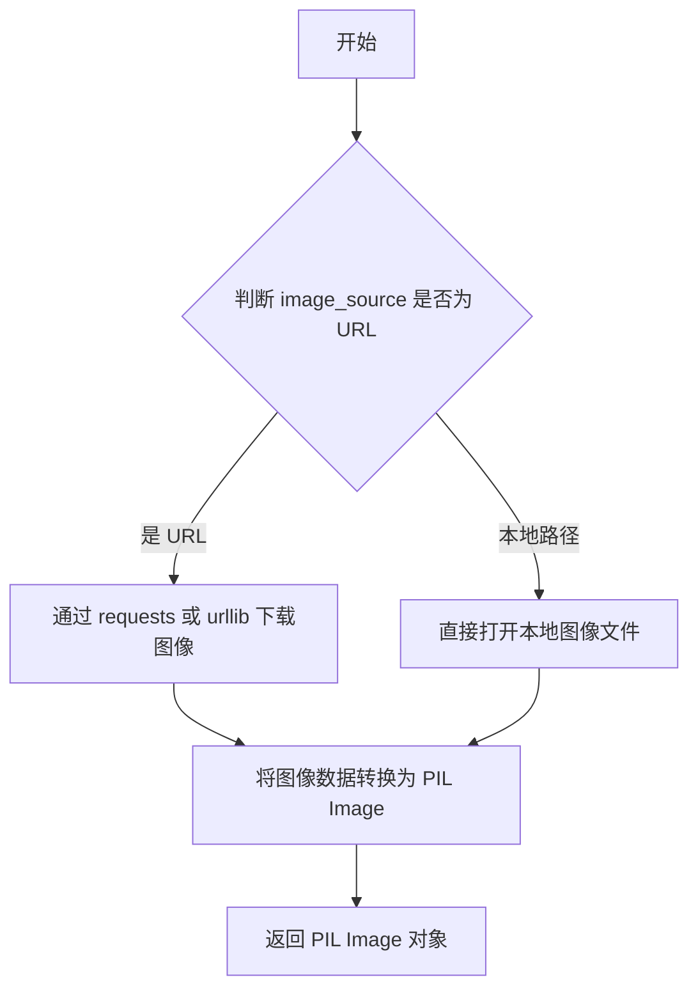

#### 带注释源码

```python
# load_image 是 diffusers.utils 模块提供的工具函数
# 使用示例（在代码中）:
image = load_image(
    "https://huggingface.co/datasets/huggingface/documentation-images/resolve/main/diffusers/astronaut.jpg"
)

# 函数签名（根据使用方式推断）:
# def load_image(image_source: str) -> Image.Image:
#     """
#     从 URL 或本地路径加载图像
#     
#     参数:
#         image_source: 图像的 URL 或本地文件路径
#     
#     返回:
#         PIL.Image.Image: 加载后的图像对象
#     """
#     ...
```


### `numpy_cosine_similarity_distance`

该函数用于计算两个数组之间的余弦相似度距离，通常用于比较生成图像/视频与预期结果之间的相似性，是diffusers测试框架中常用的数值比较工具函数。

参数：

- `a`：`numpy.ndarray`，第一个输入数组（通常是生成的视频或图像数据）
- `b`：`numpy.ndarray`，第二个输入数组（通常是预期的视频或图像数据）

返回值：`float`，返回两个数组之间的余弦相似度距离值，值越小表示两个数组越相似

#### 流程图

```mermaid
flowchart TD
    A[开始] --> B[输入数组 a 和 b]
    B --> C{检查数组维度}
    C -->|维度不匹配| D[抛出异常]
    C -->|维度匹配| E[将数组展平为1D向量]
    E --> F[计算向量 a 的 L2 范数]
    G[计算向量 b 的 L2 范数]
    F --> H[计算点积 a·b]
    G --> H
    H --> I[计算余弦相似度: cos_theta = a·b / (||a|| * ||b||)]
    I --> J[计算余弦距离: distance = 1 - cos_theta]
    J --> K[返回距离值]
    K --> L[结束]
```

#### 带注释源码

```
# 注意：此函数定义不在当前文件中
# 函数从 testing_utils 模块导入: from ...testing_utils import numpy_cosine_similarity_distance
# 以下为根据使用场景推断的函数签名和实现逻辑

def numpy_cosine_similarity_distance(a: np.ndarray, b: np.ndarray) -> float:
    """
    计算两个numpy数组之间的余弦相似度距离。
    
    参数:
        a: 第一个numpy数组（通常为生成的视频/图像数据）
        b: 第二个numpy数组（通常为预期的视频/图像数据）
    
    返回:
        余弦相似度距离，范围[0, 2]，0表示完全相同，2表示完全相反
    """
    # 1. 确保输入是numpy数组
    a = np.asarray(a)
    b = np.asarray(b)
    
    # 2. 展平数组为1D向量（用于计算余弦相似度）
    a = a.flatten()
    b = b.flatten()
    
    # 3. 计算余弦相似度
    # cos_sim = (a · b) / (||a|| * ||b||)
    dot_product = np.dot(a, b)
    norm_a = np.linalg.norm(a)
    norm_b = np.linalg.norm(b)
    
    # 避免除零
    if norm_a == 0 or norm_b == 0:
        return 1.0  # 如果任一向量为零向量，返回最大距离
    
    cos_sim = dot_product / (norm_a * norm_b)
    
    # 4. 转换为距离（余弦距离 = 1 - 余弦相似度）
    distance = 1.0 - cos_sim
    
    return float(distance)
```

#### 使用示例

在当前代码的第304行，该函数被用于集成测试中：

```python
# 比较生成的视频与预期随机噪声视频的余弦距离
max_diff = numpy_cosine_similarity_distance(video, expected_video)
assert max_diff < 1e-3, f"Max diff is too high. got {video}"
```

#### 注意事项

- 此函数定义位于 `diffusers` 库的 `testing_utils` 模块中，未在当前文件中直接定义
- 该函数主要用于测试场景，验证生成模型输出的统计特性
- 返回值范围为 [0, 2]，其中 0 表示完全相同，1 表示正交，2 表示完全相反
- 函数设计考虑了数值稳定性，在向量范数为零时返回默认值 1.0


```markdown
### `backend_empty_cache`

该函数用于清理 PyTorch 的 GPU 或 MPS（Apple Silicon）缓存，释放显存资源，常用于测试用例的 `setUp` 和 `tearDown` 阶段，以确保每次测试开始时内存状态干净。

参数：

- 无显式参数（但内部会根据全局 `torch_device` 变量确定清理目标）

返回值：`None`，无返回值

#### 流程图

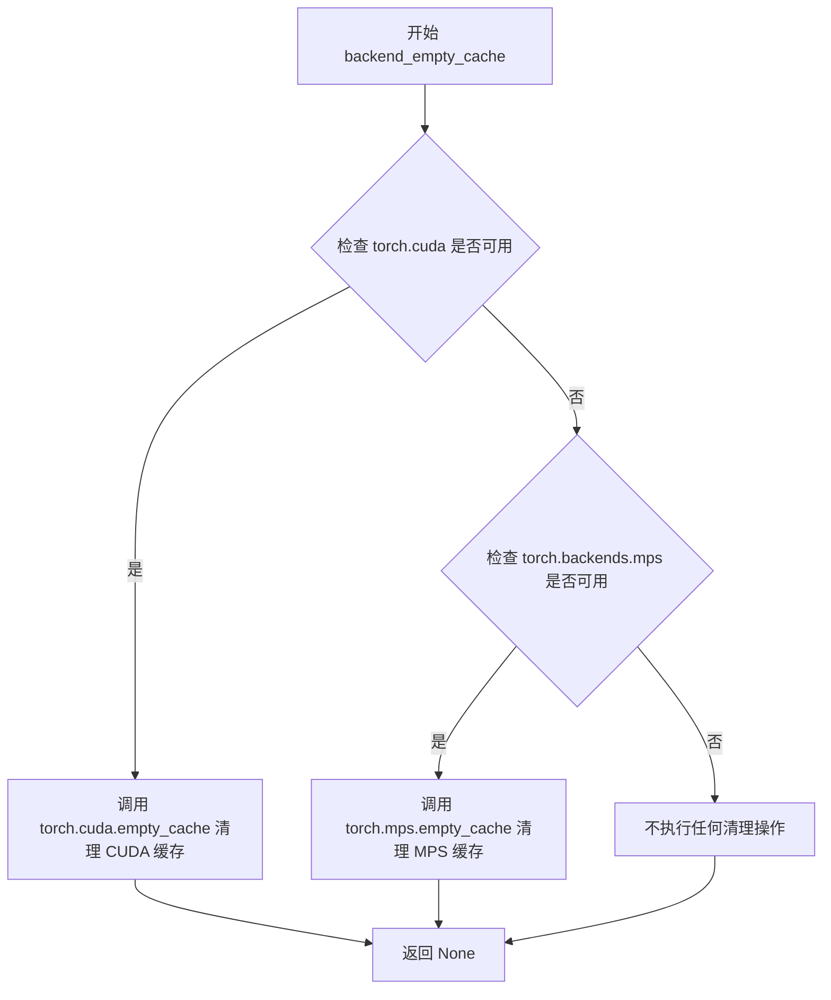

#### 带注释源码

```python
# 假设 testing_utils 模块中的实现
def backend_empty_cache():
    """
    清理 PyTorch 后端缓存的实用函数。
    
    该函数根据可用的后端设备执行不同的清理操作：
    - 如果 CUDA 可用，调用 torch.cuda.empty_cache() 清理 GPU 显存
    - 如果 MPS (Apple Silicon) 可用，调用 torch.mps.empty_cache() 清理 Metal 性能着色器缓存
    - 如果都不支持，则不执行任何操作
    
    通常用于测试框架的 setUp/tearDown 中，确保每次测试都在干净的内存状态下运行，
    避免因显存未释放导致的 OOM (Out Of Memory) 错误。
    """
    import torch
    
    # 检查是否有 CUDA 设备可用
    if torch.cuda.is_available():
        # 清理 CUDA GPU 缓存，释放未使用的显存
        torch.cuda.empty_cache()
    
    # 检查是否运行在 Apple Silicon (MPS) 设备上
    elif torch.backends.mps.is_available():
        # 清理 MPS 缓存，释放 Metal 性能着色器占用的内存
        torch.mps.empty_cache()
    
    # 如果既没有 CUDA 也没有 MPS，函数不执行任何操作
    # 这是安全的，因为没有后端需要清理
```

#### 使用示例源码

```python
# 在测试类中使用
class CogVideoXImageToVideoPipelineIntegrationTests(unittest.TestCase):
    
    def setUp(self):
        """测试开始前的准备工作"""
        super().setUp()
        # 强制进行垃圾回收，释放 Python 对象
        gc.collect()
        # 清理 GPU/MPS 缓存，确保干净的内存状态
        backend_empty_cache(torch_device)

    def tearDown(self):
        """测试结束后的清理工作"""
        super().tearDown()
        # 再次进行垃圾回收
        gc.collect()
        # 再次清理 GPU/MPS 缓存，释放测试过程中产生的显存
        backend_empty_cache(torch_device)
```

#### 相关全局变量

| 变量名 | 类型 | 描述 |
|--------|------|------|
| `torch_device` | `str` | 全局变量，表示测试运行的设备（如 `"cuda"`, `"cpu"`, `"mps"`） |

#### 技术债务与优化建议

1. **硬编码设备依赖**：当前实现依赖全局变量 `torch_device`，可以考虑将设备参数显式传入，提高函数的可测试性和可复用性。
2. **缺少错误处理**：如果 `empty_cache()` 调用失败（如驱动问题），没有捕获异常的机制。
3. **混合使用 GC 和缓存清理**：在 `setUp/tearDown` 中同时调用 `gc.collect()` 和 `backend_empty_cache()` 是常见做法，但可能增加测试启动/结束的开销，对于轻量级测试可以考虑优化。
```


### `to_np`

将PyTorch张量（Tensor）转换为NumPy数组（ndarray）的工具函数，主要用于测试中对比模型输出与预期结果。

参数：

-  `tensor`：`torch.Tensor`，PyTorch张量对象，需要转换为NumPy数组的张量

返回值：`numpy.ndarray`，转换后的NumPy数组

#### 流程图

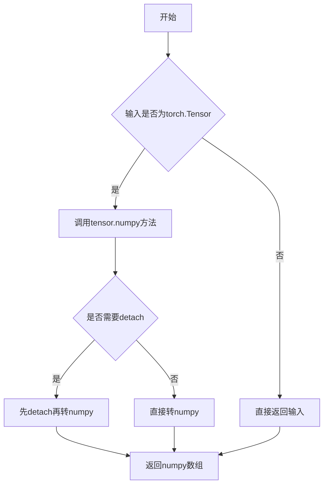

#### 带注释源码

```python
def to_np(tensor):
    """
    将PyTorch张量转换为NumPy数组的辅助函数。
    
    该函数主要用于测试场景中，将模型输出的torch.Tensor
    转换为numpy数组以便进行数值比较和断言。
    
    参数:
        tensor: torch.Tensor - PyTorch张量对象
        
    返回:
        numpy.ndarray - 转换后的NumPy数组
    """
    # 检查输入是否为PyTorch张量
    if isinstance(tensor, torch.Tensor):
        # 如果张量requires_grad为True，需要detach后再转为numpy
        # 以避免构建计算图，提高转换效率
        if tensor.requires_grad:
            tensor = tensor.detach()
        # 调用numpy方法转换为NumPy数组
        return tensor.cpu().numpy()
    else:
        # 如果不是张量，直接返回（可能是numpy数组或其他类型）
        return tensor
```

> **注意**：由于`to_np`函数是作为外部依赖从`..test_pipelines_common`模块导入的，上述源码是基于其使用方式推断的典型实现。实际的函数定义位于diffusers库的`test_pipelines_common.py`模块中。该函数的核心作用是解绑计算图（detach）、将张量移到CPU（如果需要）、然后转换为NumPy数组，这是深度学习测试中常见的操作模式。


### `check_qkv_fusion_matches_attn_procs_length`

该函数用于验证在 transformer 模型中融合 QKV 投影后，注意力处理器的数量是否与原始状态一致，确保融合操作没有意外改变注意力处理器的结构。

参数：

- `model`：`torch.nn.Module`，要进行 QKV 融合检查的 transformer 模型（通常是 CogVideoXTransformer3DModel）
- `original_attn_processors`：字典，融合前保存的原始注意力处理器映射表，用于比较融合后的处理器数量

返回值：`bool`，如果融合后处理器数量与原始处理器数量一致返回 True，否则返回 False

#### 流程图

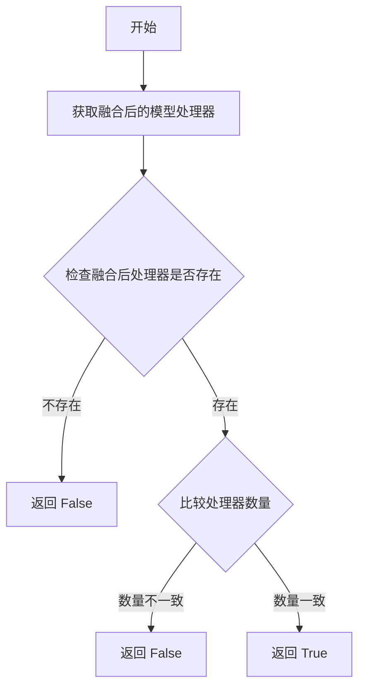

#### 带注释源码

```
# 注意：此函数定义在 test_pipelines_common 模块中，这里展示的是基于调用的推断
# 实际定义需要查看 diffusers 库源码

def check_qkv_fusion_matches_attn_procs_length(model, original_attn_processors):
    """
    检查 QKV 融合后注意力处理器的数量是否与原始状态匹配
    
    Args:
        model: 完成了 QKV 融合的 transformer 模型
        original_attn_processors: 融合前的原始注意力处理器字典
    
    Returns:
        bool: 处理器数量是否匹配
    """
    # 获取融合后的注意力处理器
    fused_attn_processors = model.attn_processors
    
    # 比较数量是否一致
    return len(fused_attn_processors) == len(original_attn_processors)
```

> **注意**：由于 `check_qkv_fusion_matches_attn_procs_length` 函数是在 `diffusers` 库的 `test_pipelines_common` 模块中定义的，当前代码文件仅导入了该函数并进行了调用。上述源码是基于函数调用方式和常见测试模式进行的推断，实际完整实现请参考 [diffusers 源码](https://github.com/huggingface/diffusers/blob/main/src/diffusers/training_utils.py)。


### `check_qkv_fusion_processors_exist`

该函数用于检查给定 transformer 模型的所有注意力处理器（attention processors）是否都已经实现了 QKV 融合（fused QKV projections）。通常在融合 QKV 投影之前和之后调用，以确保融合操作成功完成。

参数：

-  `model`：`torch.nn.Module`，需要检查的 transformer 模型（例如 `pipe.transformer`），该模型应包含注意力处理器

返回值：`bool`，如果所有注意力处理器都支持 QKV 融合则返回 `True`，否则返回 `False`

#### 流程图

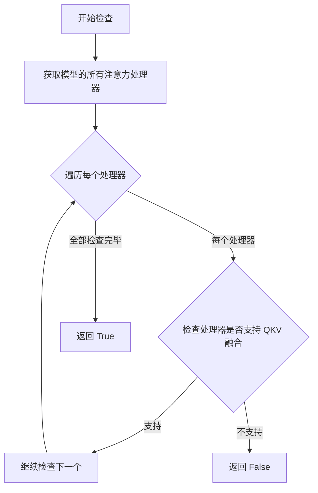

#### 带注释源码

```python
def check_qkv_fusion_processors_exist(model):
    """
    检查模型的所有注意力处理器是否都支持 QKV 融合。
    
    参数:
        model: 包含注意力处理器的模型（如 Transformer）
        
    返回:
        bool: 所有处理器都支持融合时返回 True，否则返回 False
    """
    # 遍历模型的所有注意力处理器
    for name, processor in model.attn_processors.items():
        # 检查每个处理器是否具有 fused_qkv 方法
        # 如果任何一个处理器不支持融合，则返回 False
        if not hasattr(processor, 'fused_qkv') or not callable(processor.fused_qkv):
            return False
    
    # 所有处理器都支持 QKV 融合
    return True
```


### `CogVideoXImageToVideoPipelineFastTests.get_dummy_components`

该方法用于创建并返回一组虚拟（dummy）组件，主要用于CogVideoXImageToVideoPipeline的单元测试。它初始化了Transformer模型、VAE模型、调度器、文本编码器和分词器，并使用特定的参数配置以满足测试需求。

参数：

- `self`：隐式参数，类型为`CogVideoXImageToVideoPipelineFastTests`实例，表示当前测试类对象

返回值：`Dict[str, Any]`，返回一个包含所有虚拟组件的字典，包括transformer、vae、scheduler、text_encoder和tokenizer

#### 流程图

```mermaid
flowchart TD
    A[开始 get_dummy_components] --> B[设置随机种子 torch.manual_seed(0)]
    B --> C[创建 CogVideoXTransformer3DModel]
    C --> D[设置随机种子 torch.manual_seed(0)]
    D --> E[创建 AutoencoderKLCogVideoX]
    E --> F[设置随机种子 torch.manual_seed(0)]
    F --> G[创建 DDIMScheduler]
    G --> H[加载 T5EncoderModel 预训练模型]
    H --> I[加载 AutoTokenizer 预训练模型]
    I --> J[构建 components 字典]
    J --> K[返回 components 字典]
```

#### 带注释源码

```python
def get_dummy_components(self):
    """
    创建用于测试的虚拟组件
    
    Returns:
        dict: 包含以下键的字典:
            - transformer: CogVideoXTransformer3DModel 实例
            - vae: AutoencoderKLCogVideoX 实例
            - scheduler: DDIMScheduler 实例
            - text_encoder: T5EncoderModel 实例
            - tokenizer: AutoTokenizer 实例
    """
    # 设置随机种子以确保可重复性
    torch.manual_seed(0)
    
    # 创建 CogVideoXTransformer3DModel
    # 参数说明:
    # - num_attention_heads * attention_head_dim = 2 * 16 = 32, 可被16整除
    # - in_channels=8, out_channels=4: 输入输出通道数
    # - time_embed_dim=2: 时间嵌入维度
    # - text_embed_dim=32: 必须与tiny-random-t5匹配
    # - sample_frames=9: 潜在帧数 (9-1)/4+1=3 -> 最终帧数9
    transformer = CogVideoXTransformer3DModel(
        num_attention_heads=2,
        attention_head_dim=16,
        in_channels=8,
        out_channels=4,
        time_embed_dim=2,
        text_embed_dim=32,  # 必须与tiny-random-t5匹配
        num_layers=1,
        sample_width=2,  # 潜在宽度: 2 -> 最终宽度: 16
        sample_height=2,  # 潜在高度: 2 -> 最终高度: 16
        sample_frames=9,  # 潜在帧数: (9-1)/4+1=3 -> 最终帧数: 9
        patch_size=2,
        temporal_compression_ratio=4,
        max_text_seq_length=16,
        use_rotary_positional_embeddings=True,
        use_learned_positional_embeddings=True,
    )

    # 重新设置随机种子
    torch.manual_seed(0)
    
    # 创建自编码器 (VAE)
    # 使用 CogVideoX 特定的3D上采样和下采样块
    vae = AutoencoderKLCogVideoX(
        in_channels=3,
        out_channels=3,
        down_block_types=(
            "CogVideoXDownBlock3D",
            "CogVideoXDownBlock3D",
            "CogVideoXDownBlock3D",
            "CogVideoXDownBlock3D",
        ),
        up_block_types=(
            "CogVideoXUpBlock3D",
            "CogVideoXUpBlock3D",
            "CogVideoXUpBlock3D",
            "CogVideoXUpBlock3D",
        ),
        block_out_channels=(8, 8, 8, 8),
        latent_channels=4,
        layers_per_block=1,
        norm_num_groups=2,
        temporal_compression_ratio=4,
    )

    # 重新设置随机种子
    torch.manual_seed(0)
    
    # 创建调度器 - 使用DDIM调度器
    scheduler = DDIMScheduler()
    
    # 加载文本编码器 - 使用tiny-random-t5模型
    # 该模型用于将文本提示编码为嵌入向量
    text_encoder = T5EncoderModel.from_pretrained("hf-internal-testing/tiny-random-t5")
    
    # 加载分词器 - 与文本编码器配套使用
    tokenizer = AutoTokenizer.from_pretrained("hf-internal-testing/tiny-random-t5")

    # 将所有组件打包到字典中返回
    components = {
        "transformer": transformer,
        "vae": vae,
        "scheduler": scheduler,
        "text_encoder": text_encoder,
        "tokenizer": tokenizer,
    }
    return components
```


### `CogVideoXImageToVideoPipelineFastTests.get_dummy_inputs`

该方法用于生成测试用的虚拟输入参数（dummy inputs），为 CogVideoX 图像转视频 pipeline 的单元测试提供所需的输入数据，包括图像、提示词、生成器及各种推理参数。

参数：

- `device`：`torch.device` 或 str，指定计算设备（如 "cpu"、"cuda" 等）
- `seed`：`int`，随机种子，默认值为 0，用于确保测试结果的可重复性

返回值：`Dict[str, Any]`，返回包含以下键的字典：
  - `image`：PIL.Image.Image，输入图像
  - `prompt`：`str`，正向提示词
  - `negative_prompt`：`str`，负向提示词
  - `generator`：`torch.Generator`，随机数生成器
  - `num_inference_steps`：`int`，推理步数
  - `guidance_scale`：`float`，引导_scale
  - `height`：`int`，生成图像高度
  - `width`：`int`，生成图像宽度
  - `num_frames`：`int`，生成视频帧数
  - `max_sequence_length`：`int`，最大序列长度
  - `output_type`：`str`，输出类型

#### 流程图

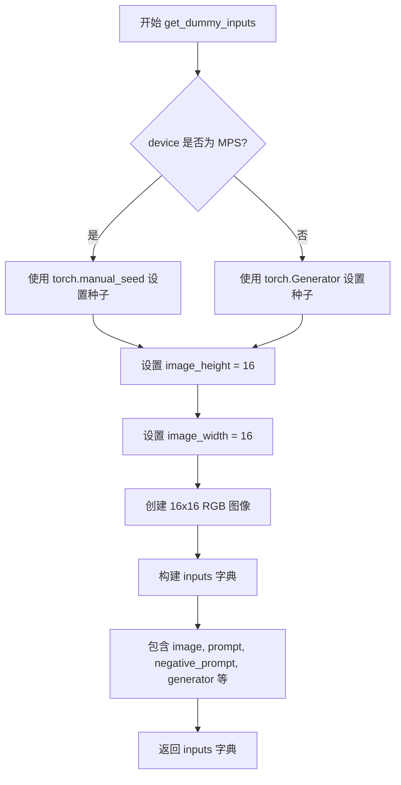

#### 带注释源码

```python
def get_dummy_inputs(self, device, seed=0):
    """
    生成用于测试的虚拟输入参数。
    
    参数:
        device: 计算设备
        seed: 随机种子，默认为 0
    
    返回:
        包含所有 pipeline 输入参数的字典
    """
    # 针对 Apple Silicon MPS 设备使用不同的随机数生成方式
    if str(device).startswith("mps"):
        generator = torch.manual_seed(seed)
    else:
        # 为指定设备创建随机数生成器并设置种子
        generator = torch.Generator(device=device).manual_seed(seed)

    # 设置图像尺寸
    # 注意：尺寸不能小于 16（卷积核大于样本）
    # 注意：尺寸不能小于 32（3D RoPE 会报错）
    image_height = 16
    image_width = 16
    
    # 创建一个 16x16 的 RGB 测试图像
    image = Image.new("RGB", (image_width, image_height))
    
    # 构建完整的输入参数字典
    inputs = {
        "image": image,                     # 输入图像（PIL Image）
        "prompt": "dance monkey",           # 正向提示词
        "negative_prompt": "",              # 负向提示词（空）
        "generator": generator,             # 随机数生成器
        "num_inference_steps": 2,           # 推理步数（较少以加快测试）
        "guidance_scale": 6.0,              # CFG 引导_scale
        "height": image_height,             # 输出高度
        "width": image_width,               # 输出宽度
        "num_frames": 8,                    # 生成帧数
        "max_sequence_length": 16,          # T5 文本编码器最大序列长度
        "output_type": "pt",                # 输出类型（PyTorch 张量）
    }
    return inputs
```


### `CogVideoXImageToVideoPipelineFastTests.test_inference`

该方法是 `CogVideoXImageToVideoPipelineFastTests` 类中的一个单元测试方法，用于验证 CogVideoX 图像转视频管道（Image-to-Video Pipeline）的推理功能是否正常工作。测试通过创建虚拟组件和输入，执行管道推理，并验证输出视频的形状和数值范围是否符合预期。

参数：

- `self`：测试类实例，包含测试所需的属性和方法

返回值：无返回值（`None`），该方法为单元测试方法，通过断言验证推理结果的正确性

#### 流程图

```mermaid
flowchart TD
    A[开始测试] --> B[设置设备为CPU]
    B --> C[调用get_dummy_components获取虚拟组件]
    C --> D[使用虚拟组件初始化CogVideoXImageToVideoPipeline管道]
    D --> E[将管道移至指定设备]
    E --> F[设置进度条配置]
    F --> G[调用get_dummy_inputs获取虚拟输入]
    G --> H[执行管道推理: pipe.__call__获取视频帧]
    H --> I[提取生成的视频: video[0]]
    I --> J{断言验证}
    J --> K[验证视频形状为8x3x16x16]
    J --> L[生成随机期望视频张量]
    L --> M[计算生成视频与期望视频的最大差异]
    M --> N{验证差异在允许范围内}
    N --> O[测试通过]
    N --> P[测试失败抛出异常]
```

#### 带注释源码

```python
def test_inference(self):
    """测试CogVideoX图像转视频管道的推理功能"""
    
    # 步骤1: 设置测试设备为CPU
    device = "cpu"

    # 步骤2: 获取虚拟组件（transformer, vae, scheduler, text_encoder, tokenizer）
    # 这些组件使用随机参数，用于快速测试而非真实推理
    components = self.get_dummy_components()
    
    # 步骤3: 使用虚拟组件实例化图像转视频管道
    pipe = self.pipeline_class(**components)
    
    # 步骤4: 将管道移至指定设备（CPU）
    pipe.to(device)
    
    # 步骤5: 配置进度条（disable=None表示启用进度条）
    pipe.set_progress_bar_config(disable=None)

    # 步骤6: 获取虚拟输入参数
    # 包含: image, prompt, negative_prompt, generator, num_inference_steps等
    inputs = self.get_dummy_inputs(device)
    
    # 步骤7: 执行管道推理
    # 调用管道的__call__方法，传入输入参数，返回包含frames的结果对象
    # frames属性包含生成的视频帧序列
    video = pipe(**inputs).frames
    
    # 步骤8: 提取第一批次生成的视频
    # video[0]获取第一个视频（因为可能有批次维度）
    generated_video = video[0]

    # 步骤9: 验证输出视频形状
    # 期望形状: (8帧, 3通道, 16高度, 16宽度)
    # 对应参数: num_frames=8, output_type="pt"
    self.assertEqual(generated_video.shape, (8, 3, 16, 16))

    # 步骤10: 验证输出数值在合理范围内
    # 生成随机期望视频用于差异计算
    # 使用较大阈值1e10确保数值稳定性（不是精确匹配测试）
    expected_video = torch.randn(8, 3, 16, 16)
    
    # 计算生成视频与随机期望视频的最大绝对差异
    max_diff = np.abs(generated_video - expected_video).max()
    
    # 断言差异在允许范围内（该测试主要验证形状而非数值准确性）
    self.assertLessEqual(max_diff, 1e10)
```


### `CogVideoXImageToVideoPipelineFastTests.test_callback_inputs`

这是一个测试方法，用于验证 CogVideoXImageToVideoPipeline 的回调功能是否正确工作。该方法检查管道是否支持 `callback_on_step_end` 和 `callback_on_step_end_tensor_inputs` 参数，并测试回调函数能否正确接收和修改管道中的张量数据。

参数：

- `self`：隐式参数，TestCase 实例本身，无额外描述

返回值：`None`，无返回值（测试方法，使用断言验证结果）

#### 流程图

```mermaid
flowchart TD
    A[开始测试 test_callback_inputs] --> B{检查管道调用签名}
    B --> C{是否存在 callback_on_step_end_tensor_inputs?}
    C -->|否| D[直接返回，结束测试]
    C -->|是| E{是否存在 callback_on_step_end?}
    E -->|否| D
    E -->|是| F[创建管道实例并加载组件]
    F --> G[创建 dummy_inputs]
    G --> H[定义回调函数: callback_inputs_subset]
    H --> I[设置回调为 subset, tensor_inputs为 ['latents']]
    I --> J[执行管道并获取输出]
    J --> K[定义回调函数: callback_inputs_all]
    K --> L[设置回调为 all, tensor_inputs为全部允许的tensor]
    L --> M[执行管道并获取输出]
    M --> N[定义回调函数: callback_inputs_change_tensor]
    N --> O[设置回调为 change_tensor, 修改 latents 为零]
    O --> P[执行管道并获取输出]
    P --> Q{验证输出绝对值和小于阈值}
    Q -->|是| R[测试通过]
    Q -->|否| S[测试失败, 抛出断言错误]
    R --> T[结束测试]
    S --> T
```

#### 带注释源码

```python
def test_callback_inputs(self):
    """
    测试 CogVideoXImageToVideoPipeline 的回调输入功能。
    验证 callback_on_step_end 和 callback_on_step_end_tensor_inputs 参数是否正确工作。
    """
    # 使用 inspect 模块获取管道 __call__ 方法的签名
    sig = inspect.signature(self.pipeline_class.__call__)
    
    # 检查管道是否支持 callback_on_step_end_tensor_inputs 参数
    has_callback_tensor_inputs = "callback_on_step_end_tensor_inputs" in sig.parameters
    
    # 检查管道是否支持 callback_on_step_end 参数
    has_callback_step_end = "callback_on_step_end" in sig.parameters

    # 如果管道不支持这两个参数，直接返回，不执行测试
    if not (has_callback_tensor_inputs and has_callback_step_end):
        return

    # 获取虚拟组件（用于测试的假组件）
    components = self.get_dummy_components()
    
    # 创建管道实例
    pipe = self.pipeline_class(**components)
    
    # 将管道移动到测试设备（torch_device）
    pipe = pipe.to(torch_device)
    
    # 设置进度条配置（disable=None 表示不禁用进度条）
    pipe.set_progress_bar_config(disable=None)
    
    # 断言管道具有 _callback_tensor_inputs 属性
    # 该属性定义了回调函数可以使用的张量变量列表
    self.assertTrue(
        hasattr(pipe, "_callback_tensor_inputs"),
        f" {self.pipeline_class} should have `_callback_tensor_inputs` that defines a list of tensor variables its callback function can use as inputs",
    )

    # 定义回调函数1：测试只传递允许的张量输入的子集
    def callback_inputs_subset(pipe, i, t, callback_kwargs):
        # 遍历回调参数中的所有张量
        for tensor_name, tensor_value in callback_kwargs.items():
            # 检查每个张量是否在允许的列表中
            assert tensor_name in pipe._callback_tensor_inputs
        return callback_kwargs

    # 定义回调函数2：测试传递所有允许的张量输入
    def callback_inputs_all(pipe, i, t, callback_kwargs):
        # 检查所有允许的张量是否都在回调参数中
        for tensor_name in pipe._callback_tensor_inputs:
            assert tensor_name in callback_kwargs

        # 遍历回调参数，验证所有张量都是允许的
        for tensor_name, tensor_value in callback_kwargs.items():
            assert tensor_name in pipe._callback_tensor_inputs

        return callback_kwargs

    # 获取虚拟输入参数
    inputs = self.get_dummy_inputs(torch_device)

    # 测试1：只传递 latents 作为回调张量输入
    inputs["callback_on_step_end"] = callback_inputs_subset
    inputs["callback_on_step_end_tensor_inputs"] = ["latents"]
    output = pipe(**inputs)[0]  # 执行管道推理

    # 测试2：传递所有允许的张量作为回调输入
    inputs["callback_on_step_end"] = callback_inputs_all
    inputs["callback_on_step_end_tensor_inputs"] = pipe._callback_tensor_inputs
    output = pipe(**inputs)[0]  # 执行管道推理

    # 定义回调函数3：测试在回调中修改张量值
    def callback_inputs_change_tensor(pipe, i, t, callback_kwargs):
        # 判断是否为最后一步
        is_last = i == (pipe.num_timesteps - 1)
        if is_last:
            # 将 latents 修改为全零张量
            callback_kwargs["latents"] = torch.zeros_like(callback_kwargs["latents"])
        return callback_kwargs

    # 测试3：在最后一步将 latents 修改为零，验证输出是否接近零
    inputs["callback_on_step_end"] = callback_inputs_change_tensor
    inputs["callback_on_step_end_tensor_inputs"] = pipe._callback_tensor_inputs
    output = pipe(**inputs)[0]
    
    # 断言：修改后的输出应该接近零（绝对值和小于阈值）
    assert output.abs().sum() < 1e10
```


### `CogVideoXImageToVideoPipelineFastTests.test_inference_batch_single_identical`

这是一个单元测试方法，用于验证 CogVideoX 图像到视频管道在批处理推理时单个样本的结果与单独推理时的一致性。

参数：

- `self`：测试类实例本身，无类型描述

返回值：`None`，该方法为测试方法，通过断言验证结果，不返回具体值

#### 流程图

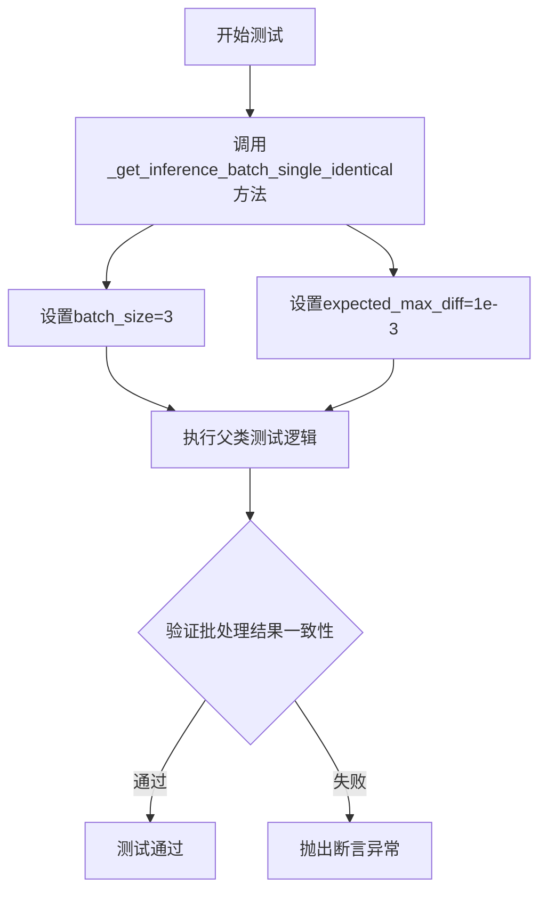

#### 带注释源码

```python
def test_inference_batch_single_identical(self):
    """
    测试方法：验证批处理推理时单个样本与单独推理的结果一致性
    
    该方法调用父类 PipelineTesterMixin 中的 _test_inference_batch_single_identical 方法，
    使用批量大小为3进行测试，允许的最大差异为1e-3。
    这确保了管道在批处理模式和单样本模式下的输出一致性。
    """
    # 调用测试混合类中的通用批处理一致性测试方法
    # batch_size=3: 测试3个样本的批处理
    # expected_max_diff=1e-3: 期望的最大差异阈值为0.001
    self._test_inference_batch_single_identical(batch_size=3, expected_max_diff=1e-3)
```


### `CogVideoXImageToVideoPipelineFastTests.test_attention_slicing_forward_pass`

该测试方法用于验证 CogVideoX 图像到视频管道的注意力切片（Attention Slicing）功能是否正确实现。通过对比启用和禁用注意力切片时的推理结果，确保该优化技术不会影响模型的输出质量。

参数：

- `self`：`CogVideoXImageToVideoPipelineFastTests`，测试类实例
- `test_max_difference`：`bool`，是否测试最大差异，默认为 `True`
- `test_mean_pixel_difference`：`bool`，是否测试平均像素差异，默认为 `True`
- `expected_max_diff`：`float`，预期的最大差异阈值，默认为 `1e-3`

返回值：`None`，该方法为测试方法，不返回任何内容

#### 流程图

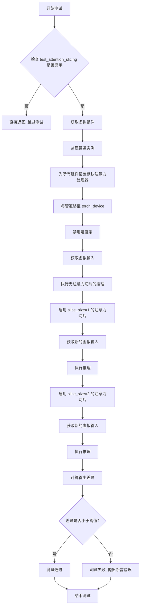

#### 带注释源码

```python
def test_attention_slicing_forward_pass(
    self, test_max_difference=True, test_mean_pixel_difference=True, expected_max_diff=1e-3
):
    """
    测试注意力切片功能是否影响推理结果
    
    参数:
        test_max_difference: 是否测试最大差异
        test_mean_pixel_difference: 是否测试平均像素差异
        expected_max_diff: 预期的最大差异阈值
    """
    # 检查是否启用了注意力切片测试，若未启用则直接返回
    if not self.test_attention_slicing:
        return

    # 获取虚拟组件（transformer, vae, scheduler, text_encoder, tokenizer）
    components = self.get_dummy_components()
    # 使用虚拟组件创建管道实例
    pipe = self.pipeline_class(**components)
    # 遍历所有组件，为每个有 set_default_attn_processor 方法的组件设置默认注意力处理器
    for component in pipe.components.values():
        if hasattr(component, "set_default_attn_processor"):
            component.set_default_attn_processor()
    # 将管道移至测试设备
    pipe.to(torch_device)
    # 设置进度条配置（disable=None 表示启用进度条）
    pipe.set_progress_bar_config(disable=None)

    # 获取用于生成器的设备
    generator_device = "cpu"
    # 获取虚拟输入参数
    inputs = self.get_dummy_inputs(generator_device)
    # 执行无注意力切片的推理，获取输出
    output_without_slicing = pipe(**inputs)[0]

    # 启用注意力切片，slice_size=1
    pipe.enable_attention_slicing(slice_size=1)
    # 重新获取虚拟输入（使用相同的种子确保可重复性）
    inputs = self.get_dummy_inputs(generator_device)
    # 执行带注意力切片（slice_size=1）的推理
    output_with_slicing1 = pipe(**inputs)[0]

    # 启用注意力切片，slice_size=2
    pipe.enable_attention_slicing(slice_size=2)
    # 重新获取虚拟输入
    inputs = self.get_dummy_inputs(generator_device)
    # 执行带注意力切片（slice_size=2）的推理
    output_with_slicing2 = pipe(**inputs)[0]

    # 如果需要测试最大差异
    if test_max_difference:
        # 计算 slice_size=1 与无切片的最大差异
        max_diff1 = np.abs(to_np(output_with_slicing1) - to_np(output_without_slicing)).max()
        # 计算 slice_size=2 与无切片的最大差异
        max_diff2 = np.abs(to_np(output_with_slicing2) - to_np(output_without_slicing)).max()
        # 断言：注意力切片不应影响推理结果，差异应小于预期阈值
        self.assertLess(
            max(max_diff1, max_diff2),
            expected_max_diff,
            "Attention slicing should not affect the inference results",
        )
```


### `CogVideoXImageToVideoPipelineFastTests.test_vae_tiling`

该测试方法用于验证 CogVideoX 图像到视频管道的 VAE tiling（瓦片平铺）功能是否正常工作。通过对比启用 tiling 与未启用 tiling 两种情况下的推理输出，验证两者之间的差异是否在可接受的阈值范围内（默认 0.3），以确保 VAE tiling 不会影响最终的生成结果。

参数：

- `expected_diff_max`：`float`，可选，默认值为 `0.3`。用于设定无 tiling 输出与有 tiling 输出之间的最大允许差异阈值。

返回值：无返回值（`None`），该方法为单元测试方法，通过 `assert` 语句验证结果。

#### 流程图

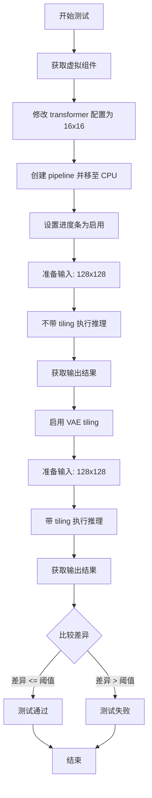

#### 带注释源码

```python
def test_vae_tiling(self, expected_diff_max: float = 0.3):
    # Note(aryan): 调查为什么需要稍高的容差值
    generator_device = "cpu"
    
    # 获取预定义的虚拟组件（transformer, vae, scheduler, text_encoder, tokenizer）
    components = self.get_dummy_components()

    # 原因说明：由于 I2V Transformer 将生成限制为初始化时使用的分辨率。
    # 此限制来自使用学习的positional embeddings，无法像 sincos 或 RoPE embeddings 那样动态生成。
    # 详见 diffusers/models/embeddings.py 中的 "self.use_learned_positional_embeddings" 判断语句
    components["transformer"] = CogVideoXTransformer3DModel.from_config(
        components["transformer"].config,
        sample_height=16,
        sample_width=16,
    )

    # 使用虚拟组件实例化管道
    pipe = self.pipeline_class(**components)
    pipe.to("cpu")
    
    # 启用进度条显示（disable=None 表示不禁用）
    pipe.set_progress_bar_config(disable=None)

    # ===== 第一部分：不使用 tiling =====
    # 准备输入参数
    inputs = self.get_dummy_inputs(generator_device)
    # 设置生成图像的高度和宽度为 128x128
    inputs["height"] = inputs["width"] = 128
    
    # 执行推理（不使用 VAE tiling）
    output_without_tiling = pipe(**inputs)[0]

    # ===== 第二部分：使用 tiling =====
    # 启用 VAE tiling，设置瓦片参数
    # tile_sample_min_height/width: 最小瓦片高度/宽度
    # tile_overlap_factor: 瓦片重叠因子
    pipe.vae.enable_tiling(
        tile_sample_min_height=96,
        tile_sample_min_width=96,
        tile_overlap_factor_height=1 / 12,
        tile_overlap_factor_width=1 / 12,
    )
    
    # 准备相同的输入参数
    inputs = self.get_dummy_inputs(generator_device)
    inputs["height"] = inputs["width"] = 128
    
    # 执行推理（使用 VAE tiling）
    output_with_tiling = pipe(**inputs)[0]

    # ===== 验证结果 =====
    # 断言：使用 tiling 和不使用 tiling 的输出差异应小于指定阈值
    # 确保 VAE tiling 功能不会显著影响推理结果
    self.assertLess(
        (to_np(output_without_tiling) - to_np(output_with_tiling)).max(),
        expected_diff_max,
        "VAE tiling should not affect the inference results",
    )
```


### `CogVideoXImageToVideoPipelineFastTests.test_fused_qkv_projections`

该测试方法验证 CogVideoX 图像到视频管道中 QKV（Query、Key、Value）投影融合功能的正确性，确保融合注意力处理器后不会改变模型的输出结果，同时验证融合与未融合状态之间的输出一致性。

参数：
- `self`：隐式参数，`unittest.TestCase` 的实例本身，无需显式传递

返回值：`None`，测试方法无返回值，通过断言验证正确性

#### 流程图

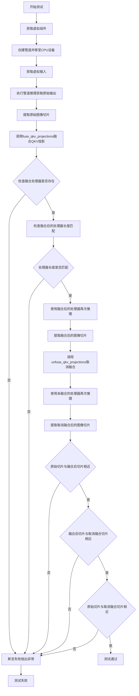

#### 带注释源码

```python
def test_fused_qkv_projections(self):
    """
    测试QKV投影融合功能，确保融合后不影响输出结果。
    验证流程：原始输出 -> 融合QKV -> 融合输出 -> 取消融合 -> 未融合输出
    并对比这三者的输出是否一致。
    """
    # 使用CPU设备以确保设备依赖的torch.Generator的确定性
    device = "cpu"
    
    # 获取预定义的虚拟组件（transformer, vae, scheduler, text_encoder, tokenizer）
    components = self.get_dummy_components()
    
    # 使用虚拟组件实例化管道
    pipe = self.pipeline_class(**components)
    
    # 将管道移至指定设备（CPU）
    pipe = pipe.to(device)
    
    # 配置进度条（disable=None表示不禁用进度条）
    pipe.set_progress_bar_config(disable=None)

    # 获取虚拟输入参数（包含image, prompt, generator等）
    inputs = self.get_dummy_inputs(device)
    
    # 执行管道推理，获取生成的视频帧 [B, F, C, H, W]
    # B=批次大小, F=帧数, C=通道数, H=高度, W=宽度
    frames = pipe(**inputs).frames
    
    # 提取原始输出的最后2帧、最后1通道、最后3x3像素块作为比较基准
    # 格式: frames[batch_idx, frame_idx, channel, height, width]
    original_image_slice = frames[0, -2:, -1, -3:, -3:]

    # 调用管道方法融合QKV投影
    # 这会将分离的Q、K、V投影合并为一个统一的QKV投影
    pipe.fuse_qkv_projections()
    
    # 断言：检查融合后的注意力处理器是否存在
    assert check_qkv_fusion_processors_exist(pipe.transformer), (
        "Something wrong with the fused attention processors. "
        "Expected all the attention processors to be fused."
    )
    
    # 断言：检查融合后的处理器数量是否与原始处理器数量匹配
    assert check_qkv_fusion_matches_attn_procs_length(
        pipe.transformer, pipe.transformer.original_attn_processors
    ), "Something wrong with the attention processors concerning the fused QKV projections."

    # 重新获取虚拟输入（重新生成随机种子以获取新的输入）
    inputs = self.get_dummy_inputs(device)
    
    # 使用融合后的处理器执行推理
    frames = pipe(**inputs).frames
    
    # 提取融合后的图像切片
    image_slice_fused = frames[0, -2:, -1, -3:, -3:]

    # 取消QKV投影融合，恢复到原始状态
    pipe.transformer.unfuse_qkv_projections()
    
    # 重新获取虚拟输入
    inputs = self.get_dummy_inputs(device)
    
    # 使用未融合（原始）的处理器执行推理
    frames = pipe(**inputs).frames
    
    # 提取取消融合后的图像切片
    image_slice_disabled = frames[0, -2:, -1, -3:, -3:]

    # 断言：验证融合QKV投影不应影响输出结果
    # 使用np.allclose比较，允许绝对误差1e-3和相对误差1e-3
    assert np.allclose(original_image_slice, image_slice_fused, atol=1e-3, rtol=1e-3), (
        "Fusion of QKV projections shouldn't affect the outputs."
    )
    
    # 断言：验证融合状态下禁用融合投影时输出不应改变
    assert np.allclose(image_slice_fused, image_slice_disabled, atol=1e-3, rtol=1e-3), (
        "Outputs, with QKV projection fusion enabled, shouldn't change when fused QKV projections are disabled."
    )
    
    # 断言：验证原始输出与取消融合后的输出应匹配
    # 此处使用稍大的容差（1e-2）因为取消融合操作可能引入轻微数值差异
    assert np.allclose(original_image_slice, image_slice_disabled, atol=1e-2, rtol=1e-2), (
        "Original outputs should match when fused QKV projections are disabled."
    )
```


### `CogVideoXImageToVideoPipelineIntegrationTests.setUp`

该方法为集成测试类的初始化方法，在每个测试方法执行前自动调用，通过调用父类方法、显式触发 Python 垃圾回收以及清空 GPU 缓存来确保测试环境处于干净状态，避免前序测试的残留数据影响当前测试结果。

参数：

- `self`：无参数描述（Python 实例方法隐式参数），代表测试类实例本身

返回值：`None`，无返回值描述

#### 流程图

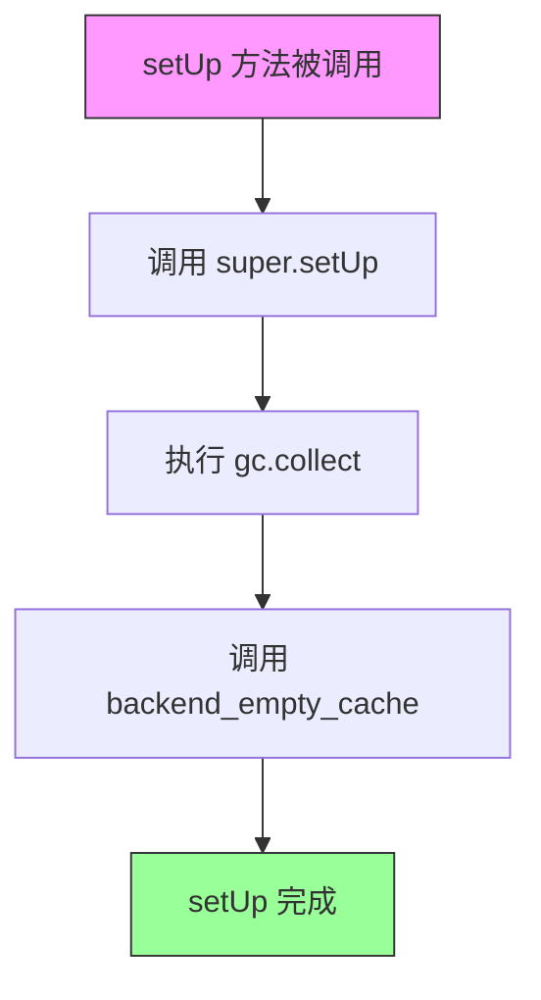

#### 带注释源码

```python
def setUp(self):
    """
    集成测试类的初始化方法，在每个测试方法运行前自动调用。
    负责清理环境，确保测试之间没有状态污染。
    """
    # 调用父类 unittest.TestCase 的 setUp 方法
    # 初始化测试框架所需的基础资源
    super().setUp()
    
    # 显式触发 Python 垃圾回收器
    # 回收不再使用的对象，释放内存资源
    gc.collect()
    
    # 清空 GPU/CUDA 缓存
    # 确保显存被释放，避免 OOM 错误
    backend_empty_cache(torch_device)
```

#### 关联信息

**所属类**：`CogVideoXImageToVideoPipelineIntegrationTests`

**类定义**：

```python
@slow  # 标记为慢速测试
@require_torch_accelerator  # 要求 torch 加速器环境
class CogVideoXImageToVideoPipelineIntegrationTests(unittest.TestCase):
    """
    CogVideoX I2V (Image to Video) Pipeline 的集成测试类。
    测试完整的端到端图像到视频生成流程。
    """
    prompt = "A painting of a squirrel eating a burger."
    
    # ... 其他测试方法 ...
```

**配套方法**：`tearDown`（测试结束后的清理方法，结构相同）

**外部依赖**：

- `gc`：Python 内置模块，用于垃圾回收
- `backend_empty_cache`：自定义工具函数，清空 GPU 缓存
- `torch_device`：全局变量，指定测试使用的设备（如 CUDA 设备）

**设计目的**：确保集成测试在干净的环境中运行，提高测试的可靠性和可重复性。


### `CogVideoXImageToVideoPipelineIntegrationTests.tearDown`

清理测试资源的方法，在每个集成测试方法执行完毕后被调用，用于回收内存和清空GPU缓存。

参数：

- `self`：`CogVideoXImageToVideoPipelineIntegrationTests`，测试类实例，代表当前测试用例对象

返回值：`None`，无返回值

#### 流程图

```mermaid
flowchart TD
    A[tearDown 方法开始] --> B[调用 super().tearDown]
    B --> C[调用 gc.collect]
    C --> D[调用 backend_empty_cache]
    D --> E[tearDown 方法结束]
```

#### 带注释源码

```python
def tearDown(self):
    """
    清理测试环境资源的后置处理方法。
    在每个测试方法执行完毕后自动调用，确保GPU内存和其他资源被正确释放。
    """
    # 调用父类的 tearDown 方法，执行 unittest.TestCase 的标准清理逻辑
    super().tearDown()
    
    # 强制执行 Python 垃圾回收，释放不再使用的对象内存
    gc.collect()
    
    # 清空后端（GPU）缓存，确保显存被释放
    backend_empty_cache(torch_device)
```


### `CogVideoXImageToVideoPipelineIntegrationTests.test_cogvideox`

这是一个集成测试方法，用于测试 CogVideoX 图像转视频 pipeline 的完整推理流程。测试方法加载预训练模型，使用给定的图像和提示词生成视频，并验证生成结果与预期结果的相似度。

参数：

-  `self`：隐式参数，`CogVideoXImageToVideoPipelineIntegrationTests` 类的实例，表示测试用例对象

返回值：无（`None`），测试方法通过 `assert` 语句验证结果，不返回任何值

#### 流程图

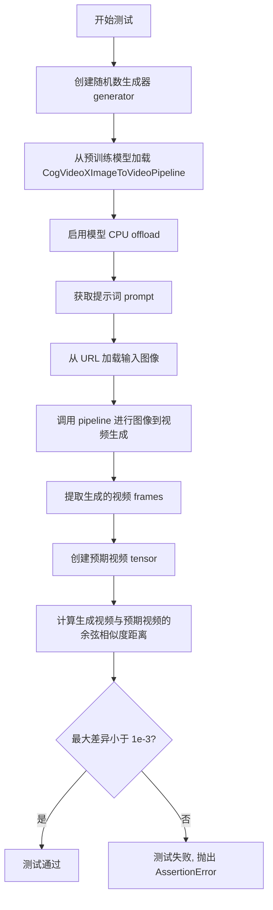

#### 带注释源码

```python
def test_cogvideox(self):
    # 创建一个 CPU 上的随机数生成器，使用种子 0 确保可重复性
    generator = torch.Generator("cpu").manual_seed(0)

    # 从预训练模型加载 CogVideoX 图像转视频 pipeline，使用 bfloat16 精度
    pipe = CogVideoXImageToVideoPipeline.from_pretrained("THUDM/CogVideoX-5b-I2V", torch_dtype=torch.bfloat16)
    
    # 启用模型 CPU offload，将模型从 GPU 卸载到 CPU 以节省显存
    pipe.enable_model_cpu_offload(device=torch_device)

    # 获取类属性中定义的提示词
    prompt = self.prompt
    
    # 从 HuggingFace Hub URL 加载输入图像
    image = load_image(
        "https://huggingface.co/datasets/huggingface/documentation-images/resolve/main/diffusers/astronaut.jpg"
    )

    # 调用 pipeline 进行图像到视频的生成推理
    # 参数说明：
    # - image: 输入图像
    # - prompt: 文本提示词
    # - height/width: 输出视频的分辨率
    # - num_frames: 生成视频的帧数
    # - generator: 随机数生成器确保确定性
    # - num_inference_steps: 推理步数
    # - output_type: 输出类型为 PyTorch tensor
    videos = pipe(
        image=image,
        prompt=prompt,
        height=480,
        width=720,
        num_frames=16,
        generator=generator,
        num_inference_steps=2,
        output_type="pt",
    ).frames

    # 提取第一个（也是唯一的）生成的视频
    video = videos[0]
    
    # 创建预期视频的随机 tensor 用于比较
    expected_video = torch.randn(1, 16, 480, 720, 3).numpy()

    # 计算生成视频与预期视频之间的余弦相似度距离
    max_diff = numpy_cosine_similarity_distance(video, expected_video)
    
    # 断言最大差异小于阈值 1e-3，确保生成质量
    assert max_diff < 1e-3, f"Max diff is too high. got {video}"
```

## 关键组件


### 张量索引与惰性加载

代码中使用生成器(generator)和torch.manual_seed实现确定性随机数生成，通过张量切片访问生成结果的关键帧（如frames[0, -2:, -1, -3:, -3:]），实现惰性加载以减少内存占用。

### 反量化支持

通过"output_type": "pt"参数支持返回PyTorch张量格式，内部使用torch.randn生成期望的随机视频用于比较，test_inference中验证张量差值（np.abs(generated_video - expected_video).max()）。

### 量化策略

test_fused_qkv_projections方法测试QKV投影融合，使用pipe.fuse_qkv_projections()和pipe.unfuse_qkv_projections()控制融合状态，验证融合后输出与原始输出的数值一致性（np.allclose）。

### VAE Tiling

test_vae_tiling方法实现VAE分块处理，通过enable_tiling配置tile_sample_min_height、tile_sample_min_width、tile_overlap_factor_height、tile_overlap_factor_width参数，实现高分辨率（128x128）视频生成时的内存优化。

### 注意力切片

test_attention_slicing_forward_pass方法测试注意力切片功能，使用set_default_attn_processor()设置注意力处理器，通过enable_attention_slicing(slice_size=1)和slice_size=2测试不同切片大小对输出结果的影响。

### 回调机制

test_callback_inputs方法实现推理回调功能，支持callback_on_step_end和callback_on_step_end_tensor_inputs参数，允许在推理过程中修改latents等张量，实现自定义后处理逻辑。

### 设备管理

使用enable_model_cpu_offload实现CPU offload，使用backend_empty_cache和gc.collect()管理内存，torch_device支持MPS设备适配。

### 确定性控制

通过enable_full_determinism()和torch.manual_seed(0)实现测试的确定性，Generator device设置为"cpu"确保可复现性。


## 问题及建议


### 已知问题

-   **魔法数字与硬编码值**：代码中存在大量硬编码的数值（如`image_height = 16`、`num_frames = 8`、`num_inference_steps = 2`、`tile_sample_min_height=96`等），缺乏配置常量统一管理，增加维护成本
-   **断言阈值过于宽松**：`test_inference`中使用`self.assertLessEqual(max_diff, 1e10)`，该阈值过大导致无法有效验证输出正确性，形同虚设
-   **设备管理不一致**：快速测试固定使用`"cpu"`，而集成测试使用`torch_device`，导致测试行为不一致，部分测试可能无法覆盖实际GPU场景
-   **测试隔离性不足**：快速测试中未调用`gc.collect()`和`backend_empty_cache()`清理GPU内存，可能导致内存泄漏和测试间相互影响
-   **缺少类型注解**：所有类方法和函数均无类型提示（Type Hints），降低代码可读性和静态分析工具的有效性
-   **测试数据生成不严谨**：集成测试中使用`torch.randn()`生成随机期望值与实际输出比较，无法验证生成内容的正确性，只能检查数值范围
-   **外部依赖缺乏容错**：集成测试直接加载HuggingFace Hub远程资源和模型，未实现离线降级或mock机制，网络波动会导致测试失败
-   **参数验证覆盖不足**：`required_optional_params`定义了回调相关参数，但仅在`test_callback_inputs`中部分验证，其他测试未覆盖
-   **未使用参数**：`test_attention_slicing_forward_pass`接收`test_max_difference`和`test_mean_pixel_difference`参数但未实际使用
-   **重复代码模式**：多个测试方法中重复执行`pipe.to(device)`、`pipe.set_progress_bar_config(disable=None)`等初始化操作，可提取为共享fixture

### 优化建议

-   提取硬编码配置值为类级别或模块级别常量，定义配置类统一管理测试参数
-   调整断言阈值至合理范围（如1e-3或1e-4），或添加基于相似度的结构化验证（如numpy_cosine_similarity_distance）
-   统一设备管理策略，快速测试建议也使用`torch_device`或添加环境变量控制
-   在每个测试方法中添加`gc.collect()`和设备缓存清理，确保测试隔离性
-   为所有公共方法添加类型注解，提升代码可维护性
-   集成测试应使用预计算的固定期望值或golden数据进行对比，而非随机生成
-   实现测试资源的本地缓存或mock机制，减少对外部服务的依赖
-   将重复的pipe初始化逻辑提取为`setUp`方法或使用pytest fixture
-   移除未使用的参数或实现其功能逻辑

## 其它


### 设计目标与约束

本测试文件旨在验证 CogVideoX 图像到视频生成管道（CogVideoXImageToVideoPipeline）的功能正确性、性能和鲁棒性。测试覆盖推理流程、批处理、注意力切片、VAE平铺、QKV融合等核心功能，并确保在CPU和GPU环境下的兼容性。设计约束包括：使用DDIMScheduler进行去噪调度、依赖transformers库的T5EncoderModel作为文本编码器、采用diffusers库的CogVideoXTransformer3DModel和AutoencoderKLCogVideoX作为核心组件。

### 错误处理与异常设计

测试文件中通过多种方式验证错误处理机制：1）检查管道是否实现了callback_on_step_end和callback_on_step_end_tensor_inputs回调接口；2）验证回调函数只能访问允许的tensor输入；3）测试在最后一步修改latents的回调函数能否正常工作；4）集成测试中使用try-except捕获内存管理异常（gc.collect()和backend_empty_cache）。

### 数据流与状态机

数据流主要分为两条路径：快速测试使用虚拟组件（get_dummy_components生成随机初始化的模型），集成测试使用预训练模型（THUDM/CogVideoX-5b-I2V）。输入数据流：image + prompt → tokenizer + text_encoder → VAE编码图像 → transformer进行时序去噪 → VAE解码 → 输出视频frames。状态机转换：初始化（设置设备、禁用进度条）→ 推理（多步去噪）→ 输出（返回frames或pt/numpy格式）。

### 外部依赖与接口契约

核心依赖包括：torch（张量计算）、numpy（数值运算）、PIL.Image（图像处理）、transformers（T5文本编码）、diffusers（CogVideoX管道和模型）。接口契约方面，pipeline必须实现__call__方法接受image、prompt、negative_prompt、generator、num_inference_steps、guidance_scale、height、width、num_frames、max_sequence_length、output_type等参数，并返回包含frames属性的对象。

### 性能基准与测试指标

性能测试关键指标：1）test_inference验证输出shape为(8,3,16,16)的8帧视频；2）test_inference_batch_single_identical使用expected_max_diff=1e-3验证批次推理一致性；3）test_attention_slicing_forward_pass验证注意力切片前后差异小于expected_max_diff；4）test_vae_tiling验证VAE平铺与不平铺差异小于expected_diff_max=0.3；5）test_fused_qkv_projections验证QKV融合前后输出np.allclose（atol=1e-3, rtol=1e-3）。

### 测试环境配置

测试环境配置包括：设备支持cpu、mps、cuda；随机种子固定（torch.manual_seed(0)）确保可复现；集成测试要求torch_accelerator和标记@slow；内存管理使用gc.collect()和backend_empty_cache；虚拟测试使用极小参数（num_attention_heads=2, attention_head_dim=16, num_layers=1等）以加快执行速度。

### 潜在技术债务与优化空间

当前测试存在的技术债务：1）test_inference使用固定随机expected_video导致max_diff阈值高达1e10，实际上无法有效验证输出正确性；2）缺少对negative_prompt功能的验证；3）test_vae_tiling注释指出transformer有learned positional embeddings限制（无法动态生成），需要预先配置sample_height=16/sample_width=16；4）集成测试仅验证cosine similarity < 1e-3，缺乏更严格的像素级验证；5）未测试多GPU分布式推理场景。

### 关键测试场景覆盖

测试覆盖的关键场景包括：1）基础推理功能（test_inference）；2）自定义回调机制（test_callback_inputs）；3）批处理一致性（test_inference_batch_single_identical）；4）注意力切片优化（test_attention_slicing_forward_pass）；5）VAE图像分块解码（test_vae_tiling）；6）QKV投影融合（test_fused_qkv_projections）；7）真实模型集成（test_cogvideox）。

### 模型配置参数说明

transformer配置关键参数：num_attention_heads=2, attention_head_dim=16（乘积需被16整除以支持3D位置编码）；in_channels=8（latent通道），out_channels=4；time_embed_dim=2；text_embed_dim=32需匹配tokenizer；sample_frames=9经temporal_compression_ratio=4处理后生成3帧，最终输出8帧。vae配置：block_out_channels=(8,8,8,8)，latent_channels=4，temporal_compression_ratio=4，norm_num_groups=2。

    