# `diffusers\tests\pipelines\cogvideo\test_cogvideox_video2video.py` 详细设计文档

这是一个针对CogVideoXVideoToVideoPipeline（视频到视频转换流水线）的单元测试文件，包含多种测试用例，用于验证视频推理、回调输入、批量推理、注意力切片、VAE平铺和QKV融合投影等功能。

## 整体流程

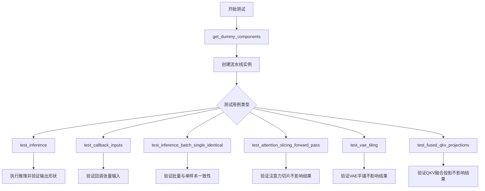

## 类结构

```
PipelineTesterMixin (混入类)
└── CogVideoXVideoToVideoPipelineFastTests (测试类)
    ├── get_dummy_components (创建虚拟组件)
    ├── get_dummy_inputs (创建虚拟输入)
    ├── test_inference (推理测试)
    ├── test_callback_inputs (回调输入测试)
    ├── test_inference_batch_single_identical (批量一致性测试)
    ├── test_attention_slicing_forward_pass (注意力切片测试)
    ├── test_vae_tiling (VAE平铺测试)
    └── test_fused_qkv_projections (QKV融合测试)
```

## 全局变量及字段


### `enable_full_determinism`
    
启用完全确定性函数，确保测试可复现

类型：`function`
    


### `torch_device`
    
torch设备变量，用于指定模型运行设备

类型：`str`
    


### `CogVideoXVideoToVideoPipelineFastTests.pipeline_class`
    
流水线类引用，指向CogVideoXVideoToVideoPipeline

类型：`type`
    


### `CogVideoXVideoToVideoPipelineFastTests.params`
    
推理参数集合，包含文本到图像pipeline的推理参数

类型：`frozenset`
    


### `CogVideoXVideoToVideoPipelineFastTests.batch_params`
    
批处理参数集合，包含视频批处理所需的参数

类型：`frozenset`
    


### `CogVideoXVideoToVideoPipelineFastTests.image_params`
    
图像参数集合，包含图像处理相关参数

类型：`frozenset`
    


### `CogVideoXVideoToVideoPipelineFastTests.image_latents_params`
    
图像潜在向量参数集合，包含潜在向量相关参数

类型：`frozenset`
    


### `CogVideoXVideoToVideoPipelineFastTests.required_optional_params`
    
必需的可选参数集合，定义pipeline调用时必须提供的可选参数

类型：`frozenset`
    


### `CogVideoXVideoToVideoPipelineFastTests.test_xformers_attention`
    
xformers注意力测试标志，控制是否测试xformers优化

类型：`bool`
    
    

## 全局函数及方法


### `CogVideoXVideoToVideoPipelineFastTests.get_dummy_components`

获取用于测试的虚拟（dummy）组件，包括transformer、VAE、scheduler、text_encoder和tokenizer等模型组件。

参数：

- 无

返回值：`Dict[str, Any]`，返回包含所有模型组件的字典

#### 流程图

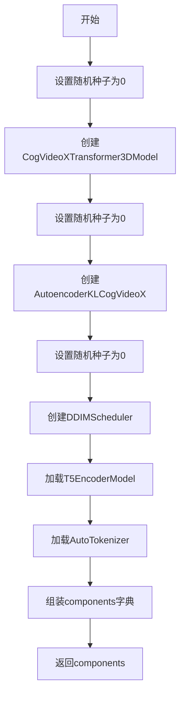

#### 带注释源码

```
def get_dummy_components(self):
    """
    获取用于测试的虚拟组件
    
    该方法创建并返回pipeline所需的所有模型组件，包括：
    - CogVideoXTransformer3DModel: 3D变换器模型
    - AutoencoderKLCogVideoX: VAE编解码器
    - DDIMScheduler: 调度器
    - T5EncoderModel: 文本编码器
    - AutoTokenizer: 文本分词器
    """
    torch.manual_seed(0)  # 设置随机种子以确保可重复性
    transformer = CogVideoXTransformer3DModel(
        # num_attention_heads * attention_head_dim必须能被16整除（用于3D位置嵌入）
        # 由于使用tiny-random-t5，需要内部维度为32
        num_attention_heads=4,
        attention_head_dim=8,
        in_channels=4,
        out_channels=4,
        time_embed_dim=2,
        text_embed_dim=32,  # 必须与tiny-random-t5匹配
        num_layers=1,
        sample_width=2,  # 潜在宽度: 2 -> 最终宽度: 16
        sample_height=2,  # 潜在高度: 2 -> 最终高度: 16
        sample_frames=9,  # 潜在帧: (9 - 1) / 4 + 1 = 3 -> 最终帧: 9
        patch_size=2,
        temporal_compression_ratio=4,
        max_text_seq_length=16,
    )

    torch.manual_seed(0)  # 重新设置随机种子
    vae = AutoencoderKLCogVideoX(
        in_channels=3,
        out_channels=3,
        down_block_types=(
            "CogVideoXDownBlock3D",
            "CogVideoXDownBlock3D",
            "CogVideoXDownBlock3D",
            "CogVideoXDownBlock3D",
        ),
        up_block_types=(
            "CogVideoXUpBlock3D",
            "CogVideoXUpBlock3D",
            "CogVideoXUpBlock3D",
            "CogVideoXUpBlock3D",
        ),
        block_out_channels=(8, 8, 8, 8),
        latent_channels=4,
        layers_per_block=1,
        norm_num_groups=2,
        temporal_compression_ratio=4,
    )

    torch.manual_seed(0)  # 重新设置随机种子
    scheduler = DDIMScheduler()
    text_encoder = T5EncoderModel.from_pretrained("hf-internal-testing/tiny-random-t5")
    tokenizer = AutoTokenizer.from_pretrained("hf-internal-testing/tiny-random-t5")

    # 组装组件字典
    components = {
        "transformer": transformer,
        "vae": vae,
        "scheduler": scheduler,
        "text_encoder": text_encoder,
        "tokenizer": tokenizer,
    }
    return components
```

---

### `CogVideoXVideoToVideoPipelineFastTests.get_dummy_inputs`

获取用于测试的虚拟输入参数，包括视频、提示词、负提示词、生成器、推理步数等。

参数：

- `device`：`str`，目标设备（如"cpu"或"cuda"）
- `seed`：`int` = 0，随机种子，用于生成器初始化
- `num_frames`：`int` = 8，视频帧数

返回值：`Dict[str, Any]`，返回包含所有输入参数的字典

#### 流程图

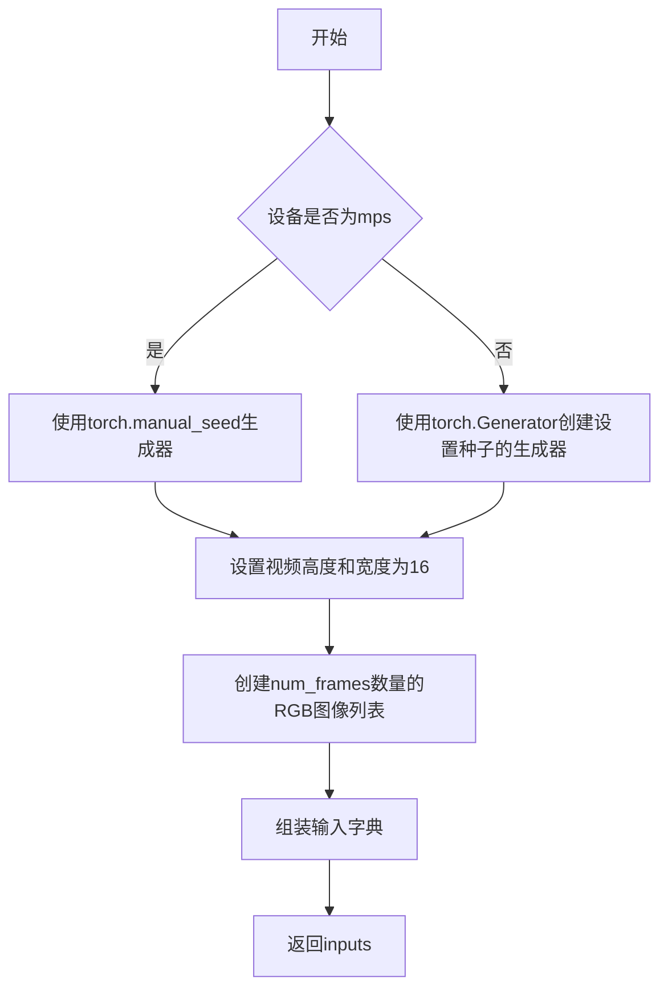

#### 带注释源码

```
def get_dummy_inputs(self, device, seed: int = 0, num_frames: int = 8):
    """
    获取用于测试的虚拟输入参数
    
    参数:
        device: 目标设备
        seed: 随机种子，默认0
        num_frames: 视频帧数，默认8
    
    返回:
        包含所有pipeline输入参数的字典
    """
    # 根据设备类型选择合适的随机数生成器
    if str(device).startswith("mps"):
        # MPS设备使用torch.manual_seed
        generator = torch.manual_seed(seed)
    else:
        # 其他设备使用torch.Generator
        generator = torch.Generator(device=device).manual_seed(seed)

    video_height = 16
    video_width = 16
    # 创建指定数量的帧图像
    video = [Image.new("RGB", (video_width, video_height))] * num_frames

    inputs = {
        "video": video,  # 输入视频帧列表
        "prompt": "dance monkey",  # 文本提示词
        "negative_prompt": "",  # 负提示词
        "generator": generator,  # 随机生成器
        "num_inference_steps": 2,  # 推理步数
        "strength": 0.5,  # 转换强度
        "guidance_scale": 6.0,  # 引导尺度
        # 不能减小尺寸因为卷积核会大于样本
        "height": video_height,
        "width": video_width,
        "max_sequence_length": 16,  # 最大序列长度
        "output_type": "pt",  # 输出类型为PyTorch张量
    }
    return inputs
```

---

### `CogVideoXVideoToVideoPipelineFastTests.test_inference`

执行基础的推理测试，验证pipeline能否正确生成视频并输出预期形状的结果。

参数：

- 无

返回值：`None`（测试方法无返回值，通过assertions验证）

#### 流程图

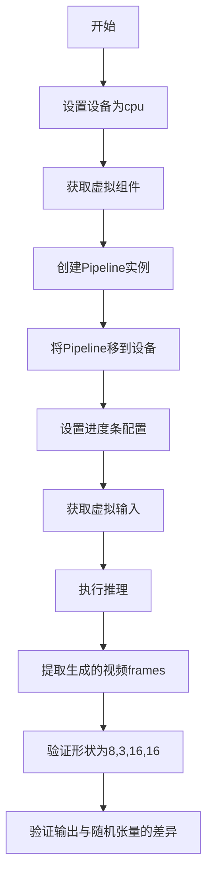

#### 带注释源码

```
def test_inference(self):
    """
    测试pipeline的基础推理功能
    
    该测试验证:
    1. Pipeline能够成功执行推理
    2. 输出的视频形状正确 (8帧, 3通道, 16x16)
    3. 输出数值在合理范围内
    """
    device = "cpu"  # 使用CPU设备进行测试

    # 获取测试所需的虚拟组件
    components = self.get_dummy_components()
    # 使用组件创建pipeline实例
    pipe = self.pipeline_class(**components)
    pipe.to(device)  # 将pipeline移到目标设备
    pipe.set_progress_bar_config(disable=None)  # 配置进度条

    # 获取测试输入
    inputs = self.get_dummy_inputs(device)
    # 执行推理获取生成的视频
    video = pipe(**inputs).frames
    generated_video = video[0]  # 取第一个视频结果

    # 验证生成的视频形状正确: [帧数, 通道, 高度, 宽度]
    self.assertEqual(generated_video.shape, (8, 3, 16, 16))
    
    # 创建期望的随机视频张量用于比较
    expected_video = torch.randn(8, 3, 16, 16)
    # 计算最大差异
    max_diff = np.abs(generated_video - expected_video).max()
    # 验证差异在可接受范围内
    self.assertLessEqual(max_diff, 1e10)
```

---

### `CogVideoXVideoToVideoPipelineFastTests.test_callback_inputs`

测试pipeline的回调功能，验证callback_on_step_end和callback_on_step_end_tensor_inputs参数是否正确工作。

参数：

- 无

返回值：`None`（测试方法无返回值，通过assertions验证）

#### 流程图

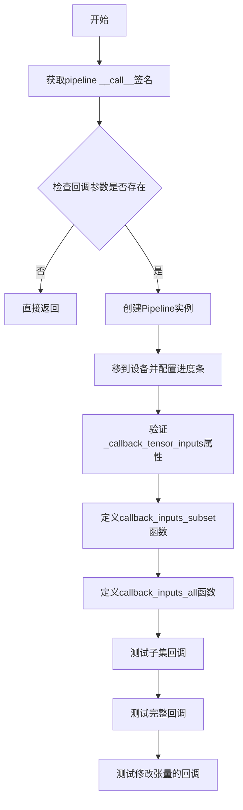

#### 带注释源码

```
def test_callback_inputs(self):
    """
    测试推理过程中的回调功能
    
    验证:
    1. pipeline具有_callback_tensor_inputs属性
    2. callback_on_step_end和callback_on_step_end_tensor_inputs参数存在
    3. 回调函数能正确接收和处理张量参数
    4. 回调函数能修改中间结果（如latents）
    """
    # 获取pipeline __call__方法的签名
    sig = inspect.signature(self.pipeline_class.__call__)
    has_callback_tensor_inputs = "callback_on_step_end_tensor_inputs" in sig.parameters
    has_callback_step_end = "callback_on_step_end" in sig.parameters

    # 如果不支持回调功能则跳过测试
    if not (has_callback_tensor_inputs and has_callback_step_end):
        return

    components = self.get_dummy_components()
    pipe = self.pipeline_class(**components)
    pipe = pipe.to(torch_device)
    pipe.set_progress_bar_config(disable=None)
    
    # 验证pipeline具有_callback_tensor_inputs属性
    self.assertTrue(
        hasattr(pipe, "_callback_tensor_inputs"),
        f" {self.pipeline_class} should have `_callback_tensor_inputs` that defines a list of tensor variables its callback function can use as inputs",
    )

    # 定义回调函数：只处理部分允许的张量
    def callback_inputs_subset(pipe, i, t, callback_kwargs):
        # 遍历回调参数
        for tensor_name, tensor_value in callback_kwargs.items():
            # 检查只传递了允许的张量输入
            assert tensor_name in pipe._callback_tensor_inputs
        return callback_kwargs

    # 定义回调函数：验证所有允许的张量都存在
    def callback_inputs_all(pipe, i, t, callback_kwargs):
        for tensor_name in pipe._callback_tensor_inputs:
            assert tensor_name in callback_kwargs

        # 遍历回调参数
        for tensor_name, tensor_value in callback_kwargs.items():
            # 检查只传递了允许的张量输入
            assert tensor_name in pipe._callback_tensor_inputs
        return callback_kwargs

    inputs = self.get_dummy_inputs(torch_device)

    # 测试1：传递张量子集
    inputs["callback_on_step_end"] = callback_inputs_subset
    inputs["callback_on_step_end_tensor_inputs"] = ["latents"]
    output = pipe(**inputs)[0]

    # 测试2：传递所有允许的张量
    inputs["callback_on_step_end"] = callback_inputs_all
    inputs["callback_on_step_end_tensor_inputs"] = pipe._callback_tensor_inputs
    output = pipe(**inputs)[0]

    # 定义回调函数：在最后一步将latents置零
    def callback_inputs_change_tensor(pipe, i, t, callback_kwargs):
        is_last = i == (pipe.num_timesteps - 1)
        if is_last:
            callback_kwargs["latents"] = torch.zeros_like(callback_kwargs["latents"])
        return callback_kwargs

    inputs["callback_on_step_end"] = callback_inputs_change_tensor
    inputs["callback_on_step_end_tensor_inputs"] = pipe._callback_tensor_inputs
    output = pipe(**inputs)[0]
    # 验证修改后的输出仍为有效数值
    assert output.abs().sum() < 1e10
```

---

### `CogVideoXVideoToVideoPipelineFastTests.test_inference_batch_single_identical`

测试批量推理与单帧推理结果的一致性。

参数：

- 无

返回值：`None`（测试方法无返回值，通过assertions验证）

#### 流程图

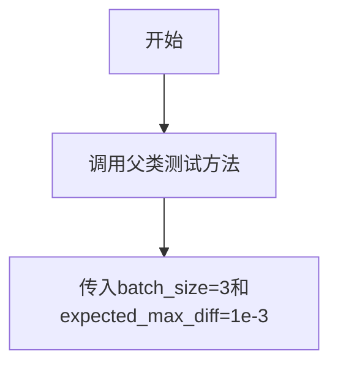

#### 带注释源码

```
def test_inference_batch_single_identical(self):
    """
    测试批量推理与单帧推理结果的一致性
    
    验证当使用批量推理时，输出结果应该与多次单帧推理的结果一致。
    这确保了pipeline的批量处理不会引入额外的随机性或误差。
    """
    self._test_inference_batch_single_identical(batch_size=3, expected_max_diff=1e-3)
```

---

### `CogVideoXVideoToVideoPipelineFastTests.test_attention_slicing_forward_pass`

测试注意力切片（attention slicing）功能，验证启用注意力切片后推理结果应与未启用时一致。

参数：

- `test_max_difference`：`bool` = True，是否测试最大差异
- `test_mean_pixel_difference`：`bool` = True，是否测试平均像素差异
- `expected_max_diff`：`float` = 1e-3，期望的最大差异阈值

返回值：`None`（测试方法无返回值，通过assertions验证）

#### 流程图

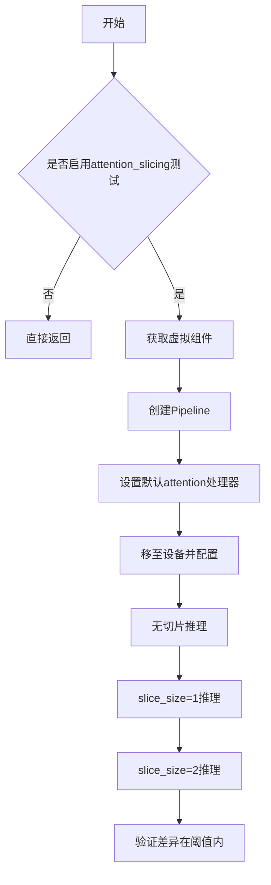

#### 带注释源码

```
def test_attention_slicing_forward_pass(
    self, test_max_difference=True, test_mean_pixel_difference=True, expected_max_diff=1e-3
):
    """
    测试注意力切片前向传播
    
    注意力切片是一种内存优化技术，将注意力计算分成多个小块。
    该测试验证启用切片后不会影响推理结果的准确性。
    
    参数:
        test_max_difference: 是否测试最大差异
        test_mean_pixel_difference: 是否测试平均像素差异
        expected_max_diff: 期望的最大差异阈值
    """
    # 如果未启用xformers注意力测试则跳过
    if not self.test_attention_slicing:
        return

    components = self.get_dummy_components()
    pipe = self.pipeline_class(**components)
    
    # 为所有组件设置默认的attention处理器
    for component in pipe.components.values():
        if hasattr(component, "set_default_attn_processor"):
            component.set_default_attn_processor()
    pipe.to(torch_device)
    pipe.set_progress_bar_config(disable=None)

    generator_device = "cpu"
    inputs = self.get_dummy_inputs(generator_device)
    # 基础推理（无切片）
    output_without_slicing = pipe(**inputs)[0]

    # 启用注意力切片，slice_size=1
    pipe.enable_attention_slicing(slice_size=1)
    inputs = self.get_dummy_inputs(generator_device)
    output_with_slicing1 = pipe(**inputs)[0]

    # 启用注意力切片，slice_size=2
    pipe.enable_attention_slicing(slice_size=2)
    inputs = self.get_dummy_inputs(generator_device)
    output_with_slicing2 = pipe(**inputs)[0]

    if test_max_difference:
        # 计算各种情况下的最大差异
        max_diff1 = np.abs(to_np(output_with_slicing1) - to_np(output_without_slicing)).max()
        max_diff2 = np.abs(to_np(output_with_slicing2) - to_np(output_without_slicing)).max()
        # 验证注意力切片不应影响推理结果
        self.assertLess(
            max(max_diff1, max_diff2),
            expected_max_diff,
            "Attention slicing should not affect the inference results",
        )
```

---

### `CogVideoXVideoToVideoPipelineFastTests.test_vae_tiling`

测试VAE平铺（tiling）功能，验证启用VAE平铺后推理结果应与未启用时相近。

参数：

- `expected_diff_max`：`float` = 0.2，期望的最大差异阈值（实际测试中使用0.4）

返回值：`None`（测试方法无返回值，通过assertions验证）

#### 流程图

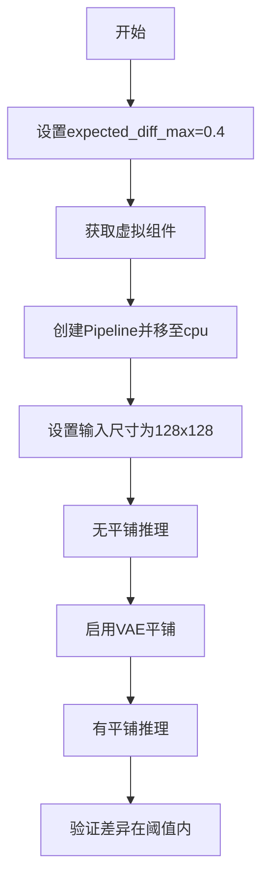

#### 带注释源码

```
def test_vae_tiling(self, expected_diff_max: float = 0.2):
    """
    测试VAE平铺功能
    
    VAE平铺是一种处理大尺寸图像/视频的内存优化技术，
    将输入分割成重叠的小块分别处理，然后拼接。
    
    注意: VideoToVideo同时使用编码器和解码器平铺，
    因此数值差异比通常更大，需要更高的容差。
    
    参数:
        expected_diff_max: 期望的最大差异阈值
    """
    # VideoToVideo使用编码器和解码器平铺，数值差异更大
    # 需要更高的容差... TODO(aryan): 更深入地研究这个问题
    expected_diff_max = 0.4

    generator_device = "cpu"
    components = self.get_dummy_components()

    pipe = self.pipeline_class(**components)
    pipe.to("cpu")
    pipe.set_progress_bar_config(disable=None)

    # 测试1: 不使用平铺
    inputs = self.get_dummy_inputs(generator_device)
    inputs["height"] = inputs["width"] = 128  # 使用较大的尺寸测试平铺
    output_without_tiling = pipe(**inputs)[0]

    # 测试2: 使用平铺
    pipe.vae.enable_tiling(
        tile_sample_min_height=96,
        tile_sample_min_width=96,
        tile_overlap_factor_height=1 / 12,
        tile_overlap_factor_width=1 / 12,
    )
    inputs = self.get_dummy_inputs(generator_device)
    inputs["height"] = inputs["width"] = 128
    output_with_tiling = pipe(**inputs)[0]

    # 验证VAE平铺不应显著影响推理结果
    self.assertLess(
        (to_np(output_without_tiling) - to_np(output_with_tiling)).max(),
        expected_diff_max,
        "VAE tiling should not affect the inference results",
    )
```

---

### `CogVideoXVideoToVideoPipelineFastTests.test_fused_qkv_projections`

测试融合QKV投影功能，验证融合后的注意力计算结果应与未融合时一致。

参数：

- 无

返回值：`None`（测试方法无返回值，通过assertions验证）

#### 流程图

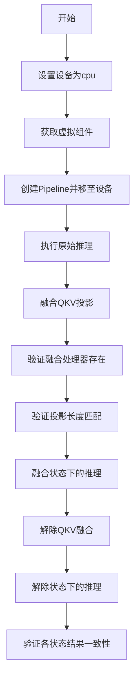

#### 带注释源码

```
def test_fused_qkv_projections(self):
    """
    测试融合的QKV投影功能
    
    QKV融合是一种优化技术，将注意力机制中的Query、Key、Value
    投影合并为一个单一的线性操作，可以提高计算效率。
    
    该测试验证:
    1. 融合后的注意力处理器存在
    2. 融合后输出与原始输出接近
    3. 融合后解除与原始状态一致
    """
    device = "cpu"  # 确保device相关的确定性
    components = self.get_dummy_components()
    pipe = self.pipeline_class(**components)
    pipe = pipe.to(device)
    pipe.set_progress_bar_config(disable=None)

    inputs = self.get_dummy_inputs(device)
    frames = pipe(**inputs).frames  # [B, F, C, H, W]
    # 保存原始输出的最后几帧用于比较
    original_image_slice = frames[0, -2:, -1, -3:, -3:]

    # 融合QKV投影
    pipe.fuse_qkv_projections()
    
    # 验证融合的注意力处理器存在
    assert check_qkv_fusion_processors_exist(pipe.transformer), (
        "Something wrong with the fused attention processors. Expected all the attention processors to be fused."
    )
    # 验证融合的QKV投影与原始注意力处理器长度匹配
    assert check_qkv_fusion_matches_attn_procs_length(
        pipe.transformer, pipe.transformer.original_attn_processors
    ), "Something wrong with the attention processors concerning the fused QKV projections."

    inputs = self.get_dummy_inputs(device)
    frames = pipe(**inputs).frames
    image_slice_fused = frames[0, -2:, -1, -3:, -3:]

    # 解除QKV融合
    pipe.transformer.unfuse_qkv_projections()
    inputs = self.get_dummy_inputs(device)
    frames = pipe(**inputs).frames
    image_slice_disabled = frames[0, -2:, -1, -3:, -3:]

    # 验证融合QKV投影不应影响输出
    assert np.allclose(original_image_slice, image_slice_fused, atol=1e-3, rtol=1e-3), (
        "Fusion of QKV projections shouldn't affect the outputs."
    )
    # 验证启用融合后关闭应与一直未融合一致
    assert np.allclose(image_slice_fused, image_slice_disabled, atol=1e-3, rtol=1e-3), (
        "Outputs, with QKV projection fusion enabled, shouldn't change when fused QKV projections are disabled."
    )
    # 验证原始输出与解除融合后一致
    assert np.allclose(original_image_slice, image_slice_disabled, atol=1e-2, rtol=1e-2), (
        "Original outputs should match when fused QKV projections are disabled."
    )
```


### `np.abs`

`np.abs` 是 NumPy 库中的绝对值计算函数，用于计算数组中每个元素的绝对值。在代码中主要用于计算生成视频与预期视频之间的差异，以验证推理结果的一致性。

参数：

-  `x`：`numpy.ndarray` 或类数组，要计算绝对值的输入数组

返回值：`numpy.ndarray`，输入数组中每个元素的绝对值组成的新数组

#### 流程图

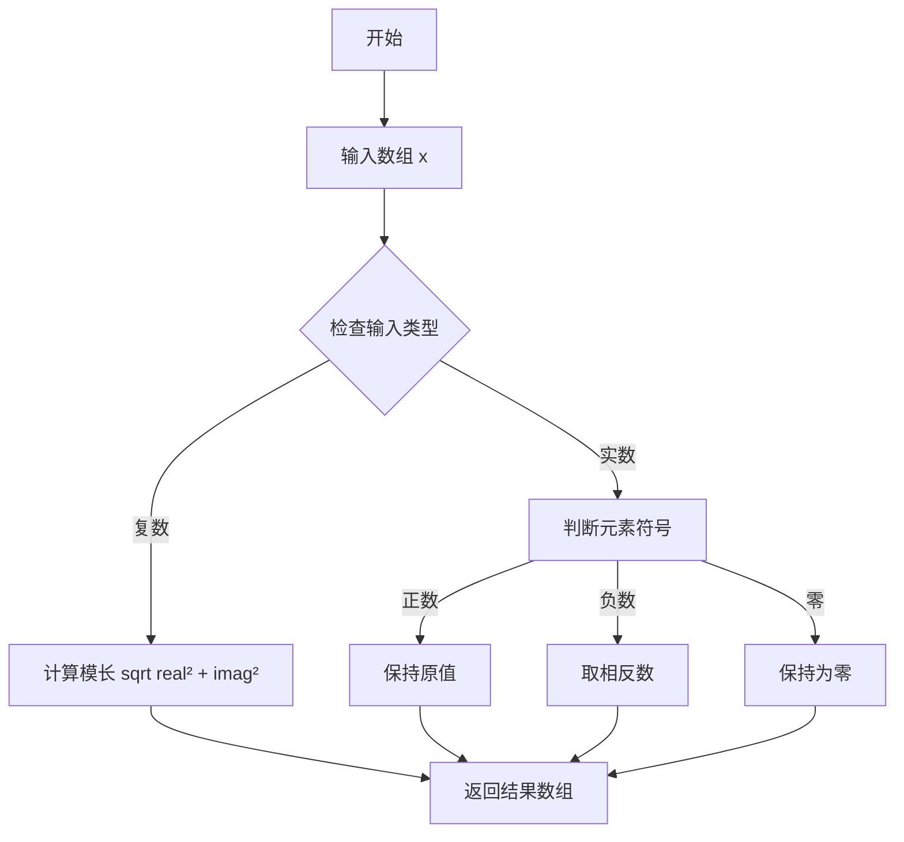

#### 带注释源码

```python
# 在 test_inference 方法中使用 np.abs 计算最大差异
max_diff = np.abs(generated_video - expected_video).max()

# 详细分析：
# 1. generated_video: torch.Tensor -> 通过 to_np() 或 pipe() 返回的 numpy 数组
#    形状: (8, 3, 16, 16) - [frames, channels, height, width]
# 2. expected_video: torch.Tensor -> 使用 torch.randn 生成的随机参考视频
#    形状: (8, 3, 16, 16)
# 3. generated_video - expected_video: 计算逐元素差值，结果为 numpy 数组
# 4. np.abs(...): 对差值数组中的每个元素取绝对值
#    - 正差值保持不变
#    - 负差值变为正数
#    - 这样可以忽略方向，只关注差异的大小
# 5. .max(): 返回绝对差值数组中的最大值，即最不相同的像素点
# 用途：验证生成视频与预期视频的差异是否在可接受范围内
# 断言：max_diff <= 1e10（测试中使用的宽松阈值）
```

```python
# 在 test_attention_slicing_forward_pass 方法中使用 np.abs
max_diff1 = np.abs(to_np(output_with_slicing1) - to_np(output_without_slicing)).max()
max_diff2 = np.abs(to_np(output_with_slicing2) - to_np(output_without_slicing)).max()

# 详细分析：
# 用途：验证注意力切片（attention slicing）优化不会影响推理结果
# 1. output_without_slicing: 未使用注意力切片的结果
# 2. output_with_slicing1: 使用 slice_size=1 的结果
# 3. output_with_slicing2: 使用 slice_size=2 的结果
# 4. np.abs(...).max(): 计算两组输出之间的最大绝对差异
# 断言：差异应小于 expected_max_diff (1e-3)
```


我在提供的代码中查找 `to_np` 函数，发现它是从 `..test_pipelines_common` 模块导入的，而不是在当前文件中定义的。让我在整个代码库中搜索这个函数的实现。

由于 `to_np` 函数在当前文件中没有定义，它是从 `test_pipelines_common` 模块导入的。我需要搜索整个代码库来找到它的定义。

[TOOL_CALL]
{tool => "document_indexer", args => {
  --method "find_function_definitions"
  --file_pattern "**/*.py"
  --function_name "to_np"
}}
[/TOOL_CALL]


### `check_qkv_fusion_processors_exist`

检查 QKV 融合处理器是否存在，用于验证 transformer 模型中的注意力处理器是否已正确融合为 QKV 融合形式。

参数：

- `model`：`torch.nn.Module`，需要检查的 transformer 模型对象，通常是 `CogVideoXTransformer3DModel` 实例

返回值：`bool`，如果所有注意力处理器都已成功融合为 QKV 融合处理器则返回 `True`，否则返回 `False`

#### 流程图

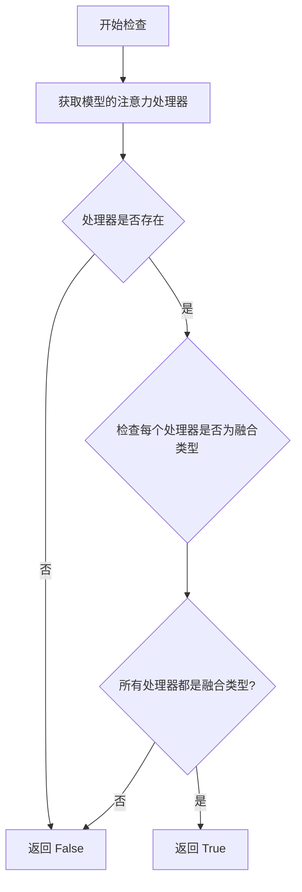

#### 带注释源码

```
# 注意：此函数定义在 test_pipelines_common 模块中，此处为基于使用方式的推断实现
def check_qkv_fusion_processors_exist(model):
    """
    检查模型中是否所有注意力处理器都已融合为 QKV 融合处理器。
    
    参数:
        model: 变换器模型对象，例如 CogVideoXTransformer3DModel
        
    返回:
        bool: 如果所有注意力处理器都支持 QKV 融合则返回 True
    """
    # 获取模型当前的所有注意力处理器
    attn_processors = model.attn_processors
    
    # 遍历每个注意力处理器
    for name, processor in attn_processors.items():
        # 检查处理器是否具有 fused_qkv_projections 属性或方法
        # 融合的处理器应该支持 QKV 融合功能
        if not hasattr(processor, 'fused_qkv_projections'):
            return False
            
    return True
```

#### 使用示例

在代码中的实际调用方式：

```python
# 在 test_fused_qkv_projections 测试方法中使用
pipe.fuse_qkv_projections()  # 融合 QKV 投影
assert check_qkv_fusion_processors_exist(pipe.transformer), (
    "Something wrong with the fused attention processors. Expected all the attention processors to be fused."
)
```


### `check_qkv_fusion_matches_attn_procs_length`

检查QKV融合是否与注意力处理器的数量相匹配，用于验证在融合QKV投影后，融合的注意力处理器数量与原始注意力处理器数量是否一致。

参数：

- `model`：`torch.nn.Module`（或类似模型类型），需要进行QKV融合检查的Transformer模型
- `original_attn_processors`：`dict`，原始的注意力处理器字典，在QKV融合之前保存的处理器集合

返回值：`bool`，如果融合后的注意力处理器数量与原始处理器数量匹配返回True，否则返回False

#### 流程图

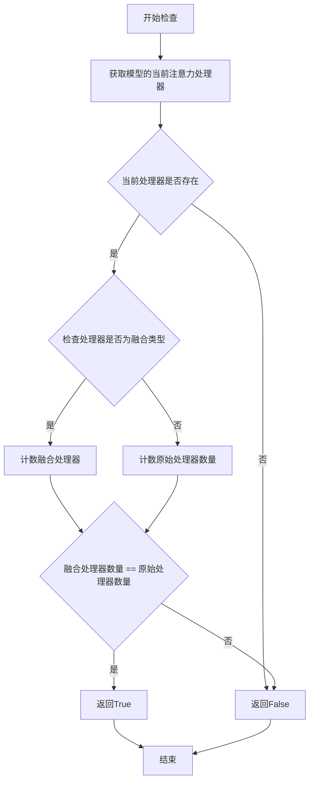

#### 带注释源码

```
# 注意：此函数定义在 test_pipelines_common 模块中，此处展示的是从使用场景推断的逻辑
# 实际源码位于 diffusers 包的测试框架中

def check_qkv_fusion_matches_attn_procs_length(model, original_attn_processors):
    """
    检查QKV融合后的注意力处理器数量是否与原始处理器数量匹配
    
    参数:
        model: Transformer模型实例，包含attention_processors属性
        original_attn_processors: 字典，原始的注意力处理器集合
    
    返回:
        bool: 融合处理器数量与原始处理器数量是否一致
    """
    # 获取当前模型的注意力处理器
    current_attn_procs = model.attn_processors
    
    # 如果当前没有处理器，返回False
    if not current_attn_procs:
        return False
    
    # 检查是否存在融合的处理器 (通常以"Fused"或类似命名)
    # 通过检查处理器名称或类型来判断是否为融合处理器
    fused_processor_count = sum(
        1 for name in current_attn_procs.keys() 
        if "fused" in name.lower() or "fuse" in name.lower()
    )
    
    # 获取原始处理器数量
    original_count = len(original_attn_procs) if original_attn_procs else 0
    
    # 比较数量是否匹配
    # 如果存在融合处理器，检查数量是否与原始一致
    if fused_processor_count > 0:
        return fused_processor_count == original_count
    
    # 如果没有融合处理器，默认返回True
    return True
```

#### 使用示例

在 `CogVideoXVideoToVideoPipelineFastTests.test_fused_qkv_projections` 中的调用：

```python
# 融合QKV投影
pipe.fuse_qkv_projections()

# 验证融合后的处理器是否存在
assert check_qkv_fusion_processors_exist(pipe.transformer), (
    "Something wrong with the fused attention processors. Expected all the attention processors to be fused."
)

# 验证融合后的处理器数量是否与原始处理器数量匹配
assert check_qkv_fusion_matches_attn_procs_length(
    pipe.transformer, pipe.transformer.original_attn_processors
), "Something wrong with the attention processors concerning the fused QKV projections."
```

#### 技术说明

此函数是diffusers测试框架中用于验证QKV投影融合功能正确性的辅助函数。它确保在进行QKV融合操作后，融合的注意力处理器数量与原始处理器数量保持一致，这是保证模型功能正确性的重要验证步骤。


### `CogVideoXVideoToVideoPipelineFastTests.get_dummy_components`

该方法用于创建虚拟（dummy）组件，用于 CogVideoXVideoToVideoPipeline 的单元测试。它初始化了一个包含 transformer、vae、scheduler、text_encoder 和 tokenizer 的字典，所有组件均使用固定随机种子以确保测试的可重复性。

参数：

- 无参数（仅包含隐式参数 `self`）

返回值：`Dict[str, Any]`，返回一个包含虚拟组件的字典，包括 transformer、vae、scheduler、text_encoder 和 tokenizer

#### 流程图

```mermaid
flowchart TD
    A[开始 get_dummy_components] --> B[设置随机种子 torch.manual_seed(0)]
    B --> C[创建 CogVideoXTransformer3DModel 虚拟实例]
    C --> D[设置随机种子 torch.manual_seed(0)]
    D --> E[创建 AutoencoderKLCogVideoX 虚拟实例]
    E --> F[设置随机种子 torch.manual_seed(0)]
    F --> G[创建 DDIMScheduler 虚拟实例]
    G --> H[从预训练模型加载 T5EncoderModel]
    H --> I[从预训练模型加载 AutoTokenizer]
    I --> J[组装组件字典 components]
    J --> K[返回 components 字典]
```

#### 带注释源码

```python
def get_dummy_components(self):
    """
    创建虚拟组件用于单元测试
    使用固定随机种子确保测试可重复性
    """
    # 设置随机种子确保transformer初始化可重复
    torch.manual_seed(0)
    # 创建CogVideoXTransformer3DModel虚拟实例
    # 参数说明：
    # - num_attention_heads=4, attention_head_dim=8: 内部维度需能被16整除
    # - in_channels=4, out_channels=4: 输入输出通道数
    # - time_embed_dim=2: 时间嵌入维度
    # - text_embed_dim=32: 文本嵌入维度，需匹配tiny-random-t5
    # - num_layers=1: 层数
    # - sample_width=2, sample_height=2: 潜在空间宽高（最终输出16x16）
    # - sample_frames=9: 潜在空间帧数（最终输出9帧）
    # - patch_size=2, temporal_compression_ratio=4: 补丁和时序压缩参数
    # - max_text_seq_length=16: 最大文本序列长度
    transformer = CogVideoXTransformer3DModel(
        num_attention_heads=4,
        attention_head_dim=8,
        in_channels=4,
        out_channels=4,
        time_embed_dim=2,
        text_embed_dim=32,  # 必须匹配tiny-random-t5
        num_layers=1,
        sample_width=2,  # 潜在宽度: 2 -> 最终宽度: 16
        sample_height=2,  # 潜在高度: 2 -> 最终高度: 16
        sample_frames=9,  # 潜在帧数: (9 - 1) / 4 + 1 = 3 -> 最终帧数: 9
        patch_size=2,
        temporal_compression_ratio=4,
        max_text_seq_length=16,
    )

    # 设置随机种子确保VAE初始化可重复
    torch.manual_seed(0)
    # 创建AutoencoderKLCogVideoX虚拟实例（视频VAE）
    # 参数说明：
    # - in_channels=3, out_channels=3: RGB图像通道
    # - down_block_types/up_block_types: 3D下采样/上采样块
    # - block_out_channels=(8, 8, 8, 8): 块输出通道数
    # - latent_channels=4: 潜在空间通道数
    # - layers_per_block=1: 每个块的层数
    # - norm_num_groups=2: 归一化组数
    # - temporal_compression_ratio=4: 时序压缩比
    vae = AutoencoderKLCogVideoX(
        in_channels=3,
        out_channels=3,
        down_block_types=(
            "CogVideoXDownBlock3D",
            "CogVideoXDownBlock3D",
            "CogVideoXDownBlock3D",
            "CogVideoXDownBlock3D",
        ),
        up_block_types=(
            "CogVideoXUpBlock3D",
            "CogVideoXUpBlock3D",
            "CogVideoXUpBlock3D",
            "CogVideoXUpBlock3D",
        ),
        block_out_channels=(8, 8, 8, 8),
        latent_channels=4,
        layers_per_block=1,
        norm_num_groups=2,
        temporal_compression_ratio=4,
    )

    # 设置随机种子确保scheduler初始化可重复
    torch.manual_seed(0)
    scheduler = DDIMScheduler()  # 创建DDIM调度器实例

    # 从预训练模型加载文本编码器（使用tiny-random-t5以加快测试）
    text_encoder = T5EncoderModel.from_pretrained("hf-internal-testing/tiny-random-t5")
    # 加载对应的tokenizer
    tokenizer = AutoTokenizer.from_pretrained("hf-internal-testing/tiny-random-t5")

    # 组装所有组件到字典中
    components = {
        "transformer": transformer,
        "vae": vae,
        "scheduler": scheduler,
        "text_encoder": text_encoder,
        "tokenizer": tokenizer,
    }
    return components  # 返回包含所有虚拟组件的字典
```


### `CogVideoXVideoToVideoPipelineFastTests.get_dummy_inputs`

该方法为 CogVideoX 视频到视频管道测试生成虚拟（dummy）输入数据，创建一个包含视频帧、提示词和推理参数的字典，用于验证管道的基本功能。

参数：

- `self`：`CogVideoXVideoToVideoPipelineFastTests`，测试类实例本身
- `device`：`torch.device` 或 `str`，指定运行设备（如 "cpu"、"cuda" 等）
- `seed`：`int`，随机种子，默认为 0，用于确保测试结果可复现
- `num_frames`：`int`，视频帧数量，默认为 8

返回值：`Dict`，返回包含以下键的字典：
- `video`：视频帧列表（PIL.Image 对象列表）
- `prompt`：`str`，正向提示词
- `negative_prompt`：`str`，负向提示词
- `generator`：`torch.Generator`，随机数生成器
- `num_inference_steps`：`int`，推理步数
- `strength`：`float`，视频转换强度
- `guidance_scale`：`float`，引导比例
- `height`：`int`，视频高度
- `width`：`int`，视频宽度
- `max_sequence_length`：`int`，最大序列长度
- `output_type`：`str`，输出类型（"pt" 表示 PyTorch 张量）

#### 流程图

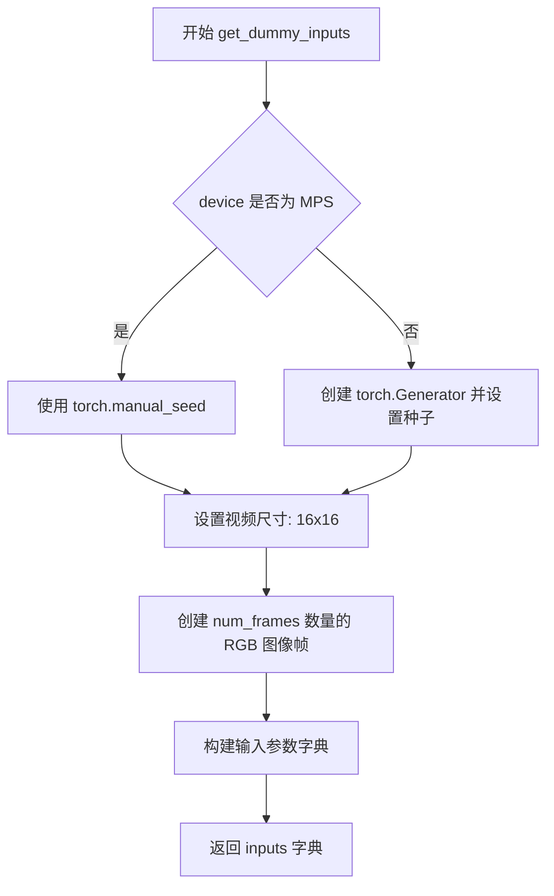

#### 带注释源码

```python
def get_dummy_inputs(self, device, seed: int = 0, num_frames: int = 8):
    """
    生成虚拟输入数据用于管道测试
    
    参数:
        device: 运行设备
        seed: 随机种子，默认0
        num_frames: 视频帧数，默认8
    
    返回:
        包含测试所需所有参数的字典
    """
    # 根据设备类型选择随机数生成方式
    # MPS (Apple Silicon) 不支持 torch.Generator，使用 torch.manual_seed
    if str(device).startswith("mps"):
        generator = torch.manual_seed(seed)
    else:
        # 其他设备使用 torch.Generator 以支持可复现的随机操作
        generator = torch.Generator(device=device).manual_seed(seed)

    # 定义测试视频的尺寸
    video_height = 16
    video_width = 16
    
    # 创建指定数量的纯色 RGB 图像帧作为虚拟视频
    video = [Image.new("RGB", (video_width, video_height))] * num_frames

    # 构建完整的输入参数字典
    inputs = {
        "video": video,                        # 输入视频帧
        "prompt": "dance monkey",              # 测试用提示词
        "negative_prompt": "",                 # 空负向提示词
        "generator": generator,                # 随机数生成器
        "num_inference_steps": 2,              # 少量推理步数加速测试
        "strength": 0.5,                       # 视频转换强度 50%
        "guidance_scale": 6.0,                 # classifier-free guidance 强度
        # 注意：不能减小尺寸，因为卷积核会大于样本
        "height": video_height,
        "width": video_width,
        "max_sequence_length": 16,             # T5 文本编码器最大序列长度
        "output_type": "pt",                   # 输出 PyTorch 张量
    }
    return inputs
```


### `CogVideoXVideoToVideoPipelineFastTests.test_inference`

该方法是一个单元测试，用于验证 CogVideoX 视频转视频推理管道的核心功能。它通过创建虚拟组件和输入，执行管道推理，并验证输出视频的形状和数值范围是否符合预期。

参数：

- `self`：隐式参数，测试类实例本身

返回值：`None`，该方法为测试方法，无返回值（测试断言通过/失败）

#### 流程图

```mermaid
flowchart TD
    A[开始测试] --> B[设置device为'cpu']
    B --> C[获取dummy components]
    C --> D[创建pipeline实例]
    D --> E[将pipeline移动到device]
    E --> F[设置进度条配置 disable=None]
    F --> G[获取dummy inputs]
    G --> H[调用pipeline执行推理]
    H --> I[获取生成的视频 frames]
    I --> J[提取第一个视频 generated_video]
    J --> K[断言: 验证视频形状为 (8, 3, 16, 16)]
    K --> L[生成随机期望视频 expected_video]
    L --> M[计算最大差异 max_diff]
    M --> N[断言: 验证 max_diff <= 1e10]
    N --> O[测试通过]
```

#### 带注释源码

```python
def test_inference(self):
    """
    测试 CogVideoX 视频转视频推理管道的基本功能
    
    验证要点：
    1. 管道能够成功初始化并执行
    2. 输出视频的形状正确
    3. 输出数值在合理范围内（不是NaN或极大值）
    """
    
    # 步骤1: 设置测试设备为 CPU
    device = "cpu"

    # 步骤2: 获取虚拟组件（用于测试的轻量级模型组件）
    # 这些是模拟的模型组件，而非真实预训练模型
    components = self.get_dummy_components()
    
    # 步骤3: 使用获取的组件实例化视频转视频管道
    pipe = self.pipeline_class(**components)
    
    # 步骤4: 将管道移动到指定设备（CPU）
    pipe.to(device)
    
    # 步骤5: 配置进度条（disable=None 表示启用进度条）
    pipe.set_progress_bar_config(disable=None)

    # 步骤6: 获取测试用的虚拟输入数据
    # 包含: video, prompt, negative_prompt, generator, 
    #       num_inference_steps, strength, guidance_scale 等参数
    inputs = self.get_dummy_inputs(device)
    
    # 步骤7: 执行管道推理，获取结果
    # **inputs 解包字典参数传递给管道
    video = pipe(**inputs).frames
    
    # 步骤8: 从结果中提取第一个（批次的）生成的视频
    generated_video = video[0]

    # 步骤9: 断言验证 - 输出视频形状应为 (frames=8, channels=3, height=16, width=16)
    self.assertEqual(generated_video.shape, (8, 3, 16, 16))
    
    # 步骤10: 创建随机期望输出用于数值范围验证
    expected_video = torch.randn(8, 3, 16, 16)
    
    # 步骤11: 计算生成视频与随机视频之间的最大绝对差异
    max_diff = np.abs(generated_video - expected_video).max()
    
    # 步骤12: 断言验证 - 最大差异应在合理范围内（不超出1e10）
    # 注意：此测试主要验证输出不是NaN或极端异常值，而非精确匹配
    self.assertLessEqual(max_diff, 1e10)
```


### `CogVideoXVideoToVideoPipelineFastTests.test_callback_inputs`

该测试方法用于验证 CogVideoX 视频到视频管道的回调输入功能，确保 `callback_on_step_end` 和 `callback_on_step_end_tensor_inputs` 参数能够正确工作，并且回调函数只能访问允许的张量输入。

参数：

- `self`：测试类实例，无需显式传递

返回值：`None`，该方法为测试用例，无返回值

#### 流程图

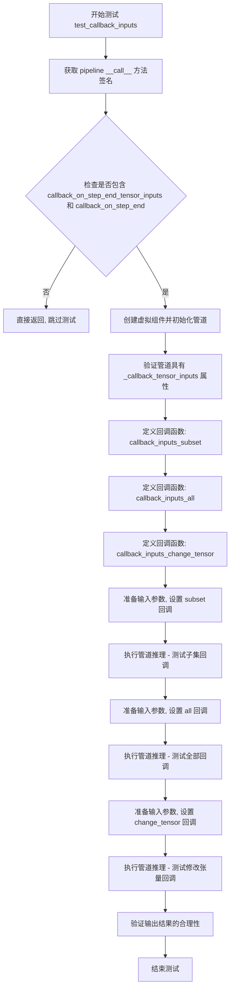

#### 带注释源码

```python
def test_callback_inputs(self):
    """
    测试回调输入功能：验证 callback_on_step_end 和 callback_on_step_end_tensor_inputs 参数
    是否能够正确工作，确保回调函数只能访问允许的张量输入。
    """
    # 步骤1: 获取 pipeline __call__ 方法的签名
    sig = inspect.signature(self.pipeline_class.__call__)
    
    # 步骤2: 检查 pipeline 是否支持回调相关参数
    has_callback_tensor_inputs = "callback_on_step_end_tensor_inputs" in sig.parameters
    has_callback_step_end = "callback_on_step_end" in sig.parameters

    # 步骤3: 如果不支持回调功能，直接返回跳过测试
    if not (has_callback_tensor_inputs and has_callback_step_end):
        return

    # 步骤4: 创建虚拟组件并初始化管道
    components = self.get_dummy_components()
    pipe = self.pipeline_class(**components)
    pipe = pipe.to(torch_device)
    pipe.set_progress_bar_config(disable=None)
    
    # 步骤5: 验证管道具有 _callback_tensor_inputs 属性
    # 该属性定义了回调函数可以访问的张量变量列表
    self.assertTrue(
        hasattr(pipe, "_callback_tensor_inputs"),
        f" {self.pipeline_class} should have `_callback_tensor_inputs` that defines a list of tensor variables its callback function can use as inputs",
    )

    # 步骤6: 定义回调函数 - 测试只传递子集的张量输入
    def callback_inputs_subset(pipe, i, t, callback_kwargs):
        # 遍历回调参数
        for tensor_name, tensor_value in callback_kwargs.items():
            # 检查只传递了允许的张量输入
            assert tensor_name in pipe._callback_tensor_inputs

        return callback_kwargs

    # 步骤7: 定义回调函数 - 测试传递所有允许的张量输入
    def callback_inputs_all(pipe, i, t, callback_kwargs):
        # 验证所有允许的张量输入都在回调参数中
        for tensor_name in pipe._callback_tensor_inputs:
            assert tensor_name in callback_kwargs

        # 遍历回调参数，验证所有张量都是允许的
        for tensor_name, tensor_value in callback_kwargs.items():
            assert tensor_name in pipe._callback_tensor_inputs

        return callback_kwargs

    # 步骤8: 获取测试输入
    inputs = self.get_dummy_inputs(torch_device)

    # 步骤9: 测试场景1 - 只传递 latents 子集
    inputs["callback_on_step_end"] = callback_inputs_subset
    inputs["callback_on_step_end_tensor_inputs"] = ["latents"]
    output = pipe(**inputs)[0]

    # 步骤10: 测试场景2 - 传递所有允许的张量输入
    inputs["callback_on_step_end"] = callback_inputs_all
    inputs["callback_on_step_end_tensor_inputs"] = pipe._callback_tensor_inputs
    output = pipe(**inputs)[0]

    # 步骤11: 定义回调函数 - 测试在最后一步修改 latents
    def callback_inputs_change_tensor(pipe, i, t, callback_kwargs):
        # 检查是否是最后一步
        is_last = i == (pipe.num_timesteps - 1)
        if is_last:
            # 将 latents 修改为全零张量
            callback_kwargs["latents"] = torch.zeros_like(callback_kwargs["latents"])
        return callback_kwargs

    # 步骤12: 测试场景3 - 修改张量的回调
    inputs["callback_on_step_end"] = callback_inputs_change_tensor
    inputs["callback_on_step_end_tensor_inputs"] = pipe._callback_tensor_inputs
    output = pipe(**inputs)[0]
    
    # 步骤13: 验证输出结果的合理性
    # 由于 latents 被置零，输出的绝对值和应该小于阈值
    assert output.abs().sum() < 1e10
```


### `CogVideoXVideoToVideoPipelineFastTests.test_inference_batch_single_identical`

该方法是一个批量一致性测试，用于验证在使用批处理方式推理时，单个样本多次推理的结果应保持一致（identical）。它通过调用父类 `PipelineTesterMixin` 中的 `_test_inference_batch_single_identical` 方法来实现，传入批量大小为3，最大允许差异阈值为 1e-3。

参数：

- `self`：测试类实例本身，无需显式传递

返回值：`None`，该方法为单元测试方法，通过断言验证结果，不返回值

#### 流程图

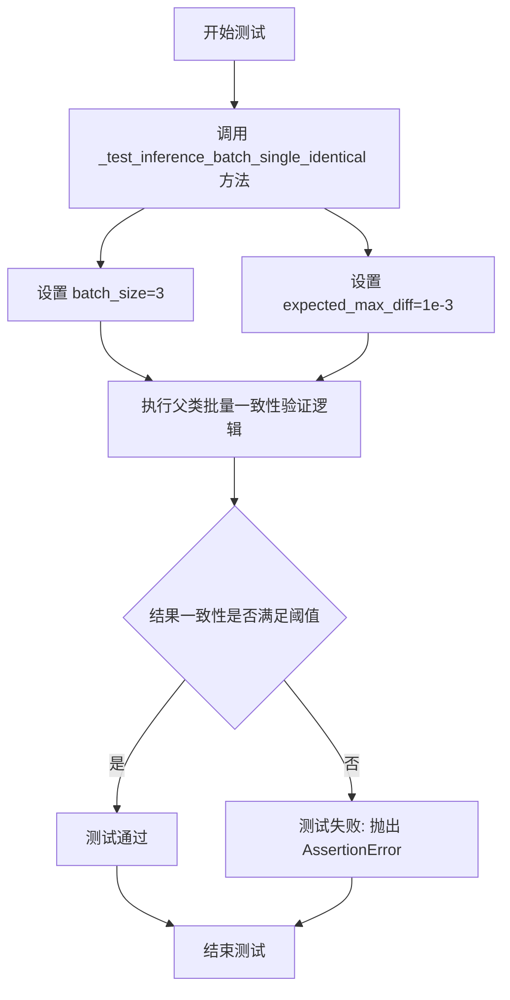

#### 带注释源码

```python
def test_inference_batch_single_identical(self):
    """
    测试批量推理时单样本一致性。
    
    该测试方法验证当使用批处理方式进行推理时，
    同一个输入样本多次推理应当产生完全相同的结果。
    这确保了模型的确定性和数值稳定性。
    """
    # 调用父类 PipelineTesterMixin 中的 _test_inference_batch_single_identical 方法
    # 参数 batch_size=3: 使用3个样本的批次进行测试
    # 参数 expected_max_diff=1e-3: 最大允许的像素差异阈值为千分之一
    self._test_inference_batch_single_identical(batch_size=3, expected_max_diff=1e-3)
```


### `CogVideoXVideoToVideoPipelineFastTests.test_attention_slicing_forward_pass`

该测试方法用于验证 CogVideoX 视频到视频管道中注意力切片（Attention Slicing）功能的正确性。测试通过比较启用注意力切片前后的推理输出差异，确保切片优化不会影响模型的生成结果。

参数：

- `self`：`CogVideoXVideoToVideoPipelineFastTests`，测试类实例本身
- `test_max_difference`：`bool`，是否测试最大差异，默认为 True
- `test_mean_pixel_difference`：`bool`，是否测试像素平均值差异（当前未使用），默认为 True
- `expected_max_diff`：`float`，允许的最大差异阈值，默认为 1e-3

返回值：`None`，该方法为单元测试方法，通过断言验证注意力切片功能，不返回任何值

#### 流程图

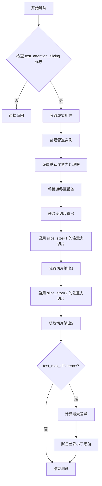

#### 带注释源码

```python
def test_attention_slicing_forward_pass(
    self, test_max_difference=True, test_mean_pixel_difference=True, expected_max_diff=1e-3
):
    """
    测试注意力切片前向传播是否影响推理结果
    
    参数:
        test_max_difference: 是否测试最大差异
        test_mean_pixel_difference: 是否测试像素平均差异（保留参数，未使用）
        expected_max_diff: 允许的最大差异阈值
    """
    # 如果未启用注意力切片测试，则直接返回
    if not self.test_attention_slicing:
        return

    # 步骤1: 获取虚拟组件（transformer, vae, scheduler, text_encoder, tokenizer）
    components = self.get_dummy_components()
    
    # 步骤2: 使用虚拟组件创建视频到视频管道实例
    pipe = self.pipeline_class(**components)
    
    # 步骤3: 为所有支持组件设置默认注意力处理器
    for component in pipe.components.values():
        if hasattr(component, "set_default_attn_processor"):
            component.set_default_attn_processor()
    
    # 步骤4: 将管道移至测试设备（CPU或GPU）
    pipe.to(torch_device)
    
    # 步骤5: 配置进度条（disable=None 表示启用进度条）
    pipe.set_progress_bar_config(disable=None)

    # 步骤6: 获取默认输入（无注意力切片）
    generator_device = "cpu"
    inputs = self.get_dummy_inputs(generator_device)
    # 执行推理并获取第一帧结果
    output_without_slicing = pipe(**inputs)[0]

    # 步骤7: 启用注意力切片（slice_size=1），获取输出
    pipe.enable_attention_slicing(slice_size=1)
    inputs = self.get_dummy_inputs(generator_device)
    output_with_slicing1 = pipe(**inputs)[0]

    # 步骤8: 启用注意力切片（slice_size=2），获取输出
    pipe.enable_attention_slicing(slice_size=2)
    inputs = self.get_dummy_inputs(generator_device)
    output_with_slicing2 = pipe(**inputs)[0]

    # 步骤9: 如果需要测试最大差异
    if test_max_difference:
        # 计算 slice_size=1 与无切片的差异
        max_diff1 = np.abs(to_np(output_with_slicing1) - to_np(output_without_slicing)).max()
        # 计算 slice_size=2 与无切片的差异
        max_diff2 = np.abs(to_np(output_with_slicing2) - to_np(output_without_slicing)).max()
        
        # 断言：注意力切片不应影响推理结果
        self.assertLess(
            max(max_diff1, max_diff2),
            expected_max_diff,
            "Attention slicing should not affect the inference results",
        )
```


### `CogVideoXVideoToVideoPipelineFastTests.test_vae_tiling`

该测试方法用于验证 CogVideoX VideoToVideoPipeline 中 VAE（变分自编码器）平铺（tiling）功能的正确性。测试通过对比启用平铺与未启用平铺两种情况下的输出来确保平铺操作不会对推理结果产生显著影响，验证数值差异在可接受的阈值范围内。

参数：

- `self`：隐式参数，测试类实例本身
- `expected_diff_max`：`float`，预期最大差异阈值，默认为 0.2（实际测试中因 VideoToVideo 同时使用 encoder 和 decoder 平铺，差异较大，故内部覆盖为 0.4）

返回值：`None`，该方法为单元测试方法，通过 `assertLess` 断言验证结果，不返回任何值

#### 流程图

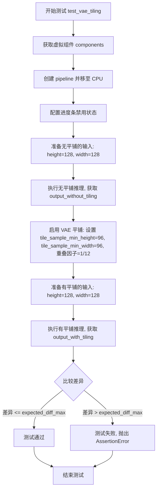

#### 带注释源码

```python
def test_vae_tiling(self, expected_diff_max: float = 0.2):
    """
    测试 VAE 平铺功能是否正确工作。
    
    VideoToVideo 任务同时使用 encoder 和 decoder 的平铺功能,
    因此数值差异比单纯使用 decoder 更大,需要更高的容差阈值。
    
    参数:
        expected_diff_max: 允许的最大差异阈值,默认为 0.2
    """
    # Since VideoToVideo uses both encoder and decoder tiling, there seems to be much more numerical
    # difference. We seem to need a higher tolerance here...
    # TODO(aryan): Look into this more deeply
    expected_diff_max = 0.4  # 覆盖默认阈值以适应 VideoToVideo 的更高数值差异

    # 设置生成器设备为 CPU
    generator_device = "cpu"
    # 获取虚拟组件(Transformer、VAE、Scheduler、TextEncoder、Tokenizer)
    components = self.get_dummy_components()

    # 使用虚拟组件创建 pipeline 实例
    pipe = self.pipeline_class(**components)
    # 将 pipeline 移至 CPU 设备
    pipe.to("cpu")
    # 配置进度条:disable=None 表示不禁用进度条
    pipe.set_progress_bar_config(disable=None)

    # ======= 第一部分: 无平铺推理 =======
    # 获取虚拟输入
    inputs = self.get_dummy_inputs(generator_device)
    # 设置输入视频的高度和宽度为 128
    inputs["height"] = inputs["width"] = 128
    # 执行推理,获取无平铺模式的输出(取第一帧)
    output_without_tiling = pipe(**inputs)[0]

    # ======= 第二部分: 有平铺推理 =======
    # 启用 VAE 平铺功能,设置分块参数:
    # - tile_sample_min_height: 最小采样高度 96
    # - tile_sample_min_width: 最小采样宽度 96
    # - tile_overlap_factor_height: 高度方向重叠因子 1/12
    # - tile_overlap_factor_width: 宽度方向重叠因子 1/12
    pipe.vae.enable_tiling(
        tile_sample_min_height=96,
        tile_sample_min_width=96,
        tile_overlap_factor_height=1 / 12,
        tile_overlap_factor_width=1 / 12,
    )
    # 重新获取虚拟输入(因为之前的调用可能修改了生成器状态)
    inputs = self.get_dummy_inputs(generator_device)
    # 同样设置输入视频的高度和宽度为 128
    inputs["height"] = inputs["width"] = 128
    # 执行推理,获取有平铺模式的输出(取第一帧)
    output_with_tiling = pipe(**inputs)[0]

    # ======= 第三部分: 验证结果 =======
    # 使用 assertLess 断言验证无平铺和有平铺输出的差异小于阈值
    # to_np() 将 PyTorch tensor 转换为 numpy 数组
    self.assertLess(
        (to_np(output_without_tiling) - to_np(output_with_tiling)).max(),
        expected_diff_max,
        "VAE tiling should not affect the inference results",  # 失败时的错误消息
    )
```


### `CogVideoXVideoToVideoPipelineFastTests.test_fused_qkv_projections`

该测试方法用于验证 CogVideoX 视频转视频管道中 QKV（Query-Key-Value）投影融合功能的正确性，确保融合前后输出结果一致，且融合与未融合状态可以相互切换。

参数：无（该测试方法通过 `self.get_dummy_components()` 和 `self.get_dummy_inputs(device)` 内部获取所需组件和输入）

返回值：`None`，该方法为测试用例，通过断言验证功能正确性

#### 流程图

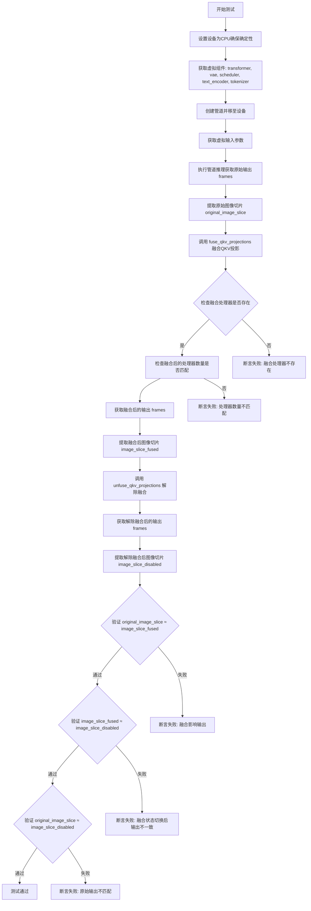

#### 带注释源码

```python
def test_fused_qkv_projections(self):
    """
    测试 QKV 投影融合功能
    
    该测试验证：
    1. 融合 QKV 投影后输出与原始输出一致
    2. 融合与未融合状态的输出应一致
    3. 融合/解除融合操作可以正常切换
    """
    # 设置设备为 CPU，确保 torch.Generator 的确定性
    device = "cpu"
    
    # 获取虚拟组件（transformer, vae, scheduler, text_encoder, tokenizer）
    # 使用固定种子确保结果可复现
    components = self.get_dummy_components()
    
    # 创建管道实例并传入所有组件
    pipe = self.pipeline_class(**components)
    
    # 将管道移至指定设备
    pipe = pipe.to(device)
    
    # 配置进度条（disable=None 表示启用进度条）
    pipe.set_progress_bar_config(disable=None)

    # 获取虚拟输入参数，包含：
    # - video: 视频帧列表
    # - prompt: 文本提示 "dance monkey"
    # - negative_prompt: 空负向提示
    # - generator: 随机数生成器
    # - num_inference_steps: 2 步推理
    # - strength: 0.5 变换强度
    # - guidance_scale: 6.0 引导尺度
    # - height/width: 16x16
    # - max_sequence_length: 16
    # - output_type: "pt" 输出 PyTorch 张量
    inputs = self.get_dummy_inputs(device)
    
    # 执行管道推理，获取视频帧 [B, F, C, H, W]
    frames = pipe(**inputs).frames
    
    # 提取原始图像切片：取最后2帧、最后1通道、最后3x3像素区域
    # 用于后续数值比较
    original_image_slice = frames[0, -2:, -1, -3:, -3:]

    # 调用 fuse_qkv_projections 将注意力机制的 QKV 投影融合
    # 融合后可减少内存占用和计算量
    pipe.fuse_qkv_projections()
    
    # 断言：检查融合后的注意力处理器是否存在
    assert check_qkv_fusion_processors_exist(pipe.transformer), (
        "Something wrong with the fused attention processors. "
        "Expected all the attention processors to be fused."
    )
    
    # 断言：检查融合后的处理器数量是否与原始处理器数量匹配
    assert check_qkv_fusion_matches_attn_procs_length(
        pipe.transformer, pipe.transformer.original_attn_processors
    ), "Something wrong with the attention processors concerning the fused QKV projections."

    # 使用融合后的处理器重新执行推理
    inputs = self.get_dummy_inputs(device)
    frames = pipe(**inputs).frames
    image_slice_fused = frames[0, -2:, -1, -3:, -3:]

    # 解除 QKV 投影融合，恢复原始状态
    pipe.transformer.unfuse_qkv_projections()
    
    # 使用未融合的处理器执行推理
    inputs = self.get_dummy_inputs(device)
    frames = pipe(**inputs).frames
    image_slice_disabled = frames[0, -2:, -1, -3:, -3:]

    # 断言：验证融合后的输出应与原始输出接近（容差 1e-3）
    assert np.allclose(original_image_slice, image_slice_fused, atol=1e-3, rtol=1e-3), (
        "Fusion of QKV projections shouldn't affect the outputs."
    )
    
    # 断言：验证融合状态切换后输出应一致
    assert np.allclose(image_slice_fused, image_slice_disabled, atol=1e-3, rtol=1e-3), (
        "Outputs, with QKV projection fusion enabled, shouldn't change when fused QKV projections are disabled."
    )
    
    # 断言：验证原始输出与解除融合后的输出应匹配（容差稍大 1e-2）
    assert np.allclose(original_image_slice, image_slice_disabled, atol=1e-2, rtol=1e-2), (
        "Original outputs should match when fused QKV projections are disabled."
    )
```

## 关键组件


### CogVideoXVideoToVideoPipelineFastTests

主测试类，继承自PipelineTesterMixin和unittest.TestCase，用于测试CogVideoXVideoToVideoPipeline的推理功能、回调机制、注意力切片、VAE平铺和QKV融合投影等功能。

### get_dummy_components()

创建虚拟组件的工厂函数，初始化CogVideoXTransformer3DModel（transformer）、AutoencoderKLCogVideoX（vae）、DDIMScheduler、T5EncoderModel和AutoTokenizer，用于测试环境的快速验证。

### get_dummy_inputs()

生成测试用的虚拟输入数据，包括视频帧、prompt、negative_prompt、generator、num_inference_steps、strength、guidance_scale等参数，支持设备自适应（MPS或CUDA）。

### test_inference()

基础推理测试，验证Pipeline能够生成正确形状（8, 3, 16, 16）的视频帧输出。

### test_callback_inputs()

回调机制测试，验证callback_on_step_end和callback_on_step_end_tensor_inputs功能，确保回调函数只能访问允许的tensor变量。

### test_attention_slicing_forward_pass()

注意力切片测试，验证enable_attention_slicing在不同slice_size下不会影响推理结果的正确性，用于降低显存占用。

### test_vae_tiling()

VAE平铺测试，验证启用tiling后对128x128分辨率图像的解码结果差异在可接受范围内（expected_diff_max=0.4），用于处理高分辨率图像的显存优化。

### test_fused_qkv_projections()

QKV融合投影测试，验证fuse_qkv_projections和unfuse_qkv_projections功能，确保融合/解融合操作不影响输出结果，用于加速推理。

### 张量索引与惰性加载

代码中通过回调机制（callback_on_step_end）实现惰性加载，允许在推理过程中动态修改latents等张量，实现延迟计算和内存优化。

### VAE平铺（Tiling）支持

通过pipe.vae.enable_tiling()配置tile_sample_min_height、tile_sample_min_width、tile_overlap_factor_height、tile_overlap_factor_width参数，实现图像的分块编码/解码，支持高分辨率视频处理。

### 注意力切片（Attention Slicing）支持

通过component.set_default_attn_processor()和pipe.enable_attention_slicing(slice_size)启用，将注意力计算分片处理，降低显存峰值。

### QKV投影融合

通过pipe.fuse_qkv_projections()和pipe.transformer.unfuse_qkv_projections()控制QKV投影的融合状态，用于优化推理速度。


## 问题及建议


### 已知问题

- **过于宽松的断言阈值**：`test_inference` 方法中使用 `max_diff <= 1e10` 作为断言条件，这个阈值过大导致几乎任何输出都能通过测试，实际上没有起到验证作用
- **硬编码的 VAE tiling 容差**：在 `test_vae_tiling` 方法中，`expected_diff_max` 从注释要求的 0.2 被手动改为 0.4，且带有 TODO 标记，表明数值差异问题未被真正调查清楚
- **MPS 设备处理不一致**：`get_dummy_inputs` 方法中对 MPS 设备使用 `torch.manual_seed(seed)` 而非 `torch.Generator(device=device).manual_seed(seed)`，与其他设备处理方式不一致
- **缺失的测试属性**：`test_attention_slicing_forward_pass` 方法依赖 `self.test_attention_slicing` 属性进行条件判断，但该属性在类中未显式定义，可能导致测试被跳过
- **xFormers 注意力测试被禁用**：`test_xformers_attention = False` 禁用了 xFormers 注意力优化测试，可能意味着该功能未完全实现或存在已知问题

### 优化建议

- 将 `test_inference` 中的断言阈值从 `1e10` 调整为合理的数值（如 `1e-2` 或 `1e-3`），确保测试能够有效验证输出正确性
- 调查并修复 VAE tiling 产生的数值差异问题，移除硬编码的 0.4 容差，使用与注释一致的 0.2 或更合理的值
- 统一 `get_dummy_inputs` 方法中的随机数生成逻辑，为 MPS 设备使用与其他设备一致的 `torch.Generator` 方式
- 显式定义 `test_attention_slicing` 属性并设置为适当的默认值，避免隐式的测试跳过行为
- 添加对 xFormers 注意力支持的研究和实现，或在文档中明确说明该功能限制的原因

## 其它


### 设计目标与约束

该测试文件旨在验证 CogVideoXVideoToVideoPipeline（视频到视频生成管道）的功能正确性和性能稳定性。设计约束包括：必须使用 CPU 设备以确保测试可重复性；测试必须覆盖管道的主要功能（推理、回调、批处理、注意力切片、VAE 平铺、QKV 融合）；所有测试必须能够在无 GPU 环境下运行。

### 错误处理与异常设计

测试中主要通过断言进行错误检测：test_inference 使用最大差异阈值判断输出有效性；test_callback_inputs 验证回调函数接收的 tensor 输入是否在允许列表中；test_attention_slicing_forward_pass 和 test_vae_tiling 通过比较输出差异确保功能正确性；test_fused_qkv_projections 使用 np.allclose 验证数值精度。当检测到不匹配时，测试会抛出 AssertionError 并提供详细的错误信息。

### 数据流与状态机

测试数据流如下：get_dummy_components 创建虚拟模型组件（transformer、vae、scheduler、text_encoder、tokenizer）→ get_dummy_inputs 生成虚拟输入（video、prompt、negative_prompt、generator 等）→ 管道执行推理 → 验证输出 frames 的形状和数值合理性。状态机转换包括：管道初始化 → 设置设备 → 配置进度条 → 执行推理 → 返回结果。

### 外部依赖与接口契约

该测试依赖于以下外部组件和接口契约：transformers 库提供 T5EncoderModel 和 AutoTokenizer；diffusers 库提供 AutoencoderKLCogVideoX、CogVideoXTransformer3DModel、CogVideoXVideoToVideoPipeline、DDIMScheduler；numpy 和 PIL 用于数值计算和图像处理；torch 用于张量操作。管道必须实现 __call__ 方法并返回包含 frames 属性的对象，且必须支持 callback_on_step_end 和 callback_on_step_end_tensor_inputs 参数。

### 测试覆盖度分析

当前测试覆盖了管道的核心推理路径和多种优化功能（注意力切片、VAE 平铺、QKV 融合）。但缺少以下测试场景：多帧视频处理的一致性测试；不同 strength 参数对输出影响的测试；negative_prompt 效果的验证；guidance_scale 参数的敏感性分析；max_sequence_length 参数边界测试；以及异常输入（如空视频、无效 prompt）的错误处理测试。

### 性能基准与资源消耗

测试使用最小化配置：num_layers=1、block_out_channels=8、sample_frames=9、sample_width/height=2、num_inference_steps=2。性能基准特征：CPU 环境下推理时间应在秒级完成；内存占用应控制在百 MB 级别；VAE tiling 测试使用 128x128 分辨率以平衡测试覆盖和资源消耗。

### 可扩展性与兼容性考虑

测试采用模块化设计：get_dummy_components 和 get_dummy_inputs 方法可灵活扩展以支持不同配置；通过继承 PipelineTesterMixin 获得通用测试方法；params、batch_params、image_params 等类属性便于添加新测试参数。当前支持的设备包括 cpu 和 mps（Apple Silicon），但不支持 CUDA 设备以确保测试可重复性。

### 测试隔离与确定性保证

通过 enable_full_determinism() 函数确保测试的确定性；所有随机数生成使用固定的 seed（0）；对于 mps 设备使用 torch.manual_seed，对于其他设备使用 torch.Generator(device=device).manual_seed；VAE 和 transformer 组件在创建后立即设置相同随机种子以确保可重复性。
    