# `diffusers\tests\pipelines\cogview3\test_cogview3plus.py` 详细设计文档

这是一个针对 CogView3Plus 文本到图像扩散管道（CogView3PlusPipeline）的测试套件文件。它包含两部分：单元测试（CogView3PlusPipelineFastTests）使用虚拟组件（Dummy Components）验证管道逻辑、性能特性和回调机制；集成测试（CogView3PlusPipelineIntegrationTests）加载真实的预训练模型（THUDM/CogView3Plus-3b）进行端到端的图像生成验证。

## 整体流程

```mermaid
graph TD
    Start([开始])
    GlobalSetup[全局设置: enable_full_determinism]
    Start --> GlobalSetup
    GlobalSetup --> FastTests[单元测试: CogView3PlusPipelineFastTests]
    GlobalSetup --> IntTests[集成测试: CogView3PlusPipelineIntegrationTests]
    subgraph FastTests
        FC1[get_dummy_components] --> FC2[实例化虚拟模型 (Transformer, VAE, T5)]
        FC2 --> FI1[get_dummy_inputs] --> FI2[准备输入 (Seed, Prompt)]
        FI2 --> TestCall[调用 pipe.__call__ 或测试方法]
        TestCall --> Assert[断言结果 (Shape, Value)]
    end
    subgraph IntTests
        IT1[setUp: 资源清理 (gc, empty_cache)]
        IT2[from_pretrained: 加载真实模型]
        IT2 --> ITCall[运行推理: pipe(...)]
        ITCall --> ITAssert[断言: 图像质量/差异]
    end
```

## 类结构

```
unittest.TestCase
├── CogView3PlusPipelineFastTests (继承 PipelineTesterMixin)
└── CogView3PlusPipelineIntegrationTests (标记 @slow, @require_torch_accelerator)
```

## 全局变量及字段


### `CogView3PlusPipelineFastTests.pipeline_class`
    
指向 CogView3PlusPipeline

类型：`type`
    


### `CogView3PlusPipelineFastTests.params`
    
推理参数集合

类型：`frozenset`
    


### `CogView3PlusPipelineFastTests.batch_params`
    
批量参数

类型：`type`
    


### `CogView3PlusPipelineFastTests.image_params`
    
图像参数

类型：`type`
    


### `CogView3PlusPipelineFastTests.image_latents_params`
    
图像潜在向量参数

类型：`type`
    


### `CogView3PlusPipelineFastTests.required_optional_params`
    
必须的可选参数

类型：`frozenset`
    


### `CogView3PlusPipelineFastTests.test_xformers_attention`
    
xformers注意力测试标记

类型：`bool`
    


### `CogView3PlusPipelineFastTests.test_layerwise_casting`
    
层-wise类型转换测试标记

类型：`bool`
    


### `CogView3PlusPipelineFastTests.test_group_offloading`
    
组卸载测试标记

类型：`bool`
    


### `CogView3PlusPipelineIntegrationTests.prompt`
    
测试用提示词

类型：`str`
    
    

## 全局函数及方法


### `enable_full_determinism`

该函数是模块级别的工具函数，用于设置随机种子以保证深度学习实验和测试的可复现性。通过统一配置 Python、NumPy、PyTorch 等库的随机数生成器，确保每次运行程序时产生相同的随机结果。

参数：

- 该函数无参数

返回值：`None`，无返回值，仅执行副作用（设置随机种子）

#### 流程图

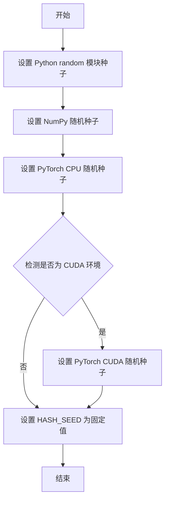

#### 带注释源码

```python
# 模块级别调用，确保整个测试模块加载时就设置好随机种子
# 这样可以保证后续所有的随机操作都是可复现的
enable_full_determinism()

# 该函数的具体实现位于 testing_utils 模块中
# 从代码导入语句可以推断：
# from ...testing_utils import enable_full_determinism

# 函数作用：
# 1. 设置 Python 内置 random 模块的随机种子
# 2. 设置 NumPy 的随机种子
# 3. 设置 PyTorch 的随机种子（CPU 和 CUDA）
# 4. 设置环境变量 HASH_SEED 确保 Python 哈希函数的确定性
# 
# 用途：
# - 在单元测试中使用，确保测试结果的一致性
# - 在科学实验中保证结果可复现
# - 调试时排除随机性干扰

# 调用方式：无参数调用
# 返回值：None
```


### `backend_empty_cache`

这是一个测试工具函数，用于清理 GPU 缓存，释放 GPU 显存空间，确保测试环境的一致性。

参数：

-  `device`：`str` 或 `torch.device`，指定要清理缓存的设备（通常为 CUDA 设备）

返回值：`None`，无返回值

#### 流程图

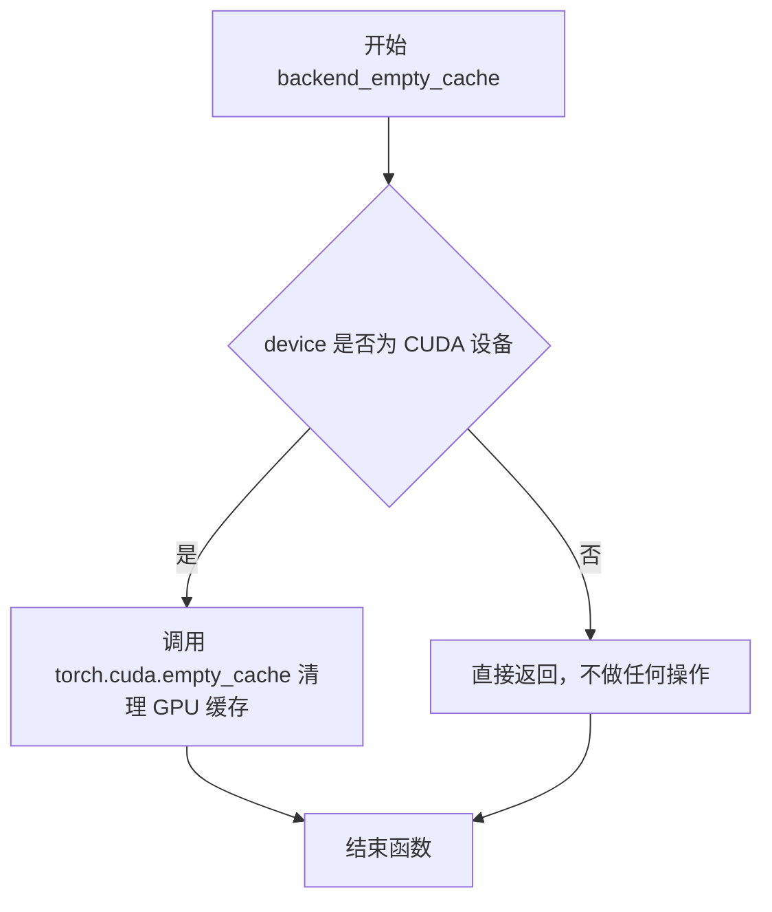

#### 带注释源码

```python
# 该函数定义在 testing_utils 模块中（未在本文件中给出具体实现）
# 以下为根据使用方式推断的可能实现：

def backend_empty_cache(device):
    """
    清理指定设备上的 GPU 缓存。
    
    参数:
        device: 目标设备，通常为 torch_device (如 'cuda', 'cuda:0' 等)
    
    返回:
        None
    """
    import torch
    
    # 检查设备是否为 CUDA 设备
    if torch.cuda.is_available():
        # 将设备转换为字符串形式进行比较
        device_str = str(device)
        if device_str.startswith('cuda'):
            # 清理 CUDA 缓存，释放未使用的 GPU 显存
            torch.cuda.empty_cache()
    
    # 注意：该函数也可能包含对其他后端（如 XPU 等）的缓存清理逻辑
    # 具体实现取决于 testing_utils 模块中的实际定义
```


### `numpy_cosine_similarity_distance`

该函数是一个测试工具函数，用于计算两个图像之间的余弦相似度距离，通常用于验证生成图像与预期图像之间的相似程度。在测试中，通过比较生成图像与随机噪声图像的距离，确保模型输出在合理范围内。

参数：

- `image`：numpy.ndarray，输入图像数据
- `expected_image`：numpy.ndarray，预期/参考图像数据

返回值：`float`，返回两个图像之间的余弦相似度距离值，值越小表示两个图像越相似

#### 流程图

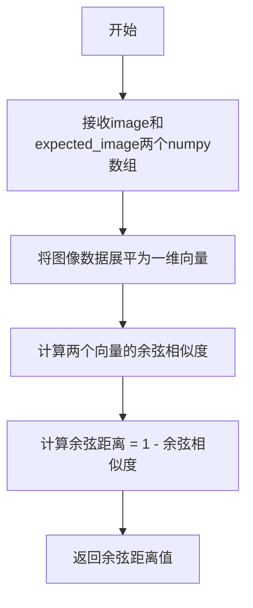

#### 带注释源码

```python
# 该函数定义在 testing_utils 模块中
# 基于调用方式推断其实现逻辑：

def numpy_cosine_similarity_distance(image: np.ndarray, expected_image: np.ndarray) -> float:
    """
    计算两个图像之间的余弦相似度距离。
    
    参数:
        image: 输入图像，numpy数组格式
        expected_image: 期望的参考图像，numpy数组格式
    
    返回值:
        float: 余弦相似度距离，值越小表示图像越相似
    """
    # 1. 将图像展平为向量
    image_flat = image.flatten()
    expected_flat = expected_image.flatten()
    
    # 2. 计算余弦相似度
    # cosine_similarity = (A · B) / (||A|| * ||B||)
    dot_product = np.dot(image_flat, expected_flat)
    norm_image = np.linalg.norm(image_flat)
    norm_expected = np.linalg.norm(expected_flat)
    
    cosine_similarity = dot_product / (norm_image * norm_expected)
    
    # 3. 余弦距离 = 1 - 余弦相似度
    distance = 1.0 - cosine_similarity
    
    return distance
```


根据提供的代码，`to_np` 函数是从 `..test_pipelines_common` 模块导入的，而不是在该文件中定义的。我先搜索该函数在代码中的使用情况来推断其功能，并在文档中说明其来源。

### `to_np`

将 PyTorch 张量（Tensor）转换为 NumPy 数组的测试工具函数。该函数是 `diffusers` 库中测试框架的一部分，用于在单元测试中方便地对张量进行数值比较。

参数：

-  `tensor`：`torch.Tensor` 或类似对象，需要转换的张量输入

返回值：`numpy.ndarray`，返回转换后的 NumPy 数组

#### 流程图

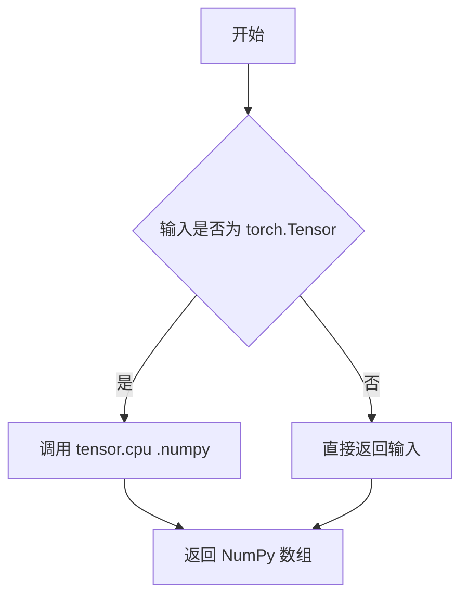

#### 带注释源码

```
# 该函数定义在 test_pipelines_common 模块中
# 当前文件中通过以下方式导入：
from ..test_pipelines_common import (
    PipelineTesterMixin,
    to_np,
)

# 在本文件中的典型使用方式：
# max_diff1 = np.abs(to_np(output_with_slicing1) - to_np(output_without_slicing)).max()
```

> **注意**：由于 `to_np` 函数的实际定义不在当前提供的代码文件中，而是在 `diffusers` 库的 `test_pipelines_common` 模块中定义，以上信息是基于该函数在代码中的使用方式推断得出的。


### `CogView3PlusPipelineFastTests.get_dummy_components`

该方法用于在单元测试中生成虚拟（dummy）组件对象，包括 transformer、vae、scheduler、text_encoder 和 tokenizer，用于快速测试 CogView3PlusPipeline 的基本功能而无需加载真实的预训练模型。

参数：
- `self`：`CogView3PlusPipelineFastTests`，表示该方法属于测试类本身

返回值：`Dict[str, Any]`，返回一个字典，包含五个键值对，分别对应虚拟的 transformer、vae、scheduler、text_encoder 和 tokenizer 组件

#### 流程图

```mermaid
flowchart TD
    A[开始 get_dummy_components] --> B[设置随机种子 torch.manual_seed(0)]
    B --> C[创建 CogView3PlusTransformer2DModel 虚拟对象]
    C --> D[设置随机种子 torch.manual_seed(0)]
    D --> E[创建 AutoencoderKL 虚拟对象]
    E --> F[设置随机种子 torch.manual_seed(0)]
    F --> G[创建 CogVideoXDDIMScheduler 调度器]
    G --> H[从预训练模型加载 T5EncoderModel]
    H --> I[从预训练模型加载 AutoTokenizer]
    I --> J[构建 components 字典]
    J --> K[返回 components 字典]
    K --> L[结束 get_dummy_components]
```

#### 带注释源码

```python
def get_dummy_components(self):
    """
    生成用于测试的虚拟组件。
    
    该方法创建一套完整的虚拟组件，用于测试 CogView3PlusPipeline 的推理功能。
    使用固定的随机种子确保测试的可重复性。
    """
    # 设置随机种子为 0，确保 transformer 初始化的可重复性
    torch.manual_seed(0)
    # 创建虚拟的 CogView3PlusTransformer2DModel 模型
    # 参数配置：patch_size=2, 4通道输入输出, 1层, 2个注意力头
    transformer = CogView3PlusTransformer2DModel(
        patch_size=2,
        in_channels=4,
        num_layers=1,
        attention_head_dim=4,
        num_attention_heads=2,
        out_channels=4,
        text_embed_dim=32,  # 必须与 tiny-random-t5 模型匹配
        time_embed_dim=8,
        condition_dim=2,
        pos_embed_max_size=8,
        sample_size=8,
    )

    # 重新设置随机种子，确保 vae 初始化的可重复性
    torch.manual_seed(0)
    # 创建虚拟的 AutoencoderKL 变分自编码器
    # 配置：2层下采样/上采样，3通道图像，4通道潜在空间
    vae = AutoencoderKL(
        block_out_channels=[32, 64],
        in_channels=3,
        out_channels=3,
        down_block_types=["DownEncoderBlock2D", "DownEncoderBlock2D"],
        up_block_types=["UpDecoderBlock2D", "UpDecoderBlock2D"],
        latent_channels=4,
        sample_size=128,
    )

    # 再次设置随机种子，确保 scheduler 初始化的可重复性
    torch.manual_seed(0)
    # 创建 CogVideoX DDIM 调度器，用于扩散模型的推理调度
    scheduler = CogVideoXDDIMScheduler()
    # 加载预训练的 T5 文本编码器（小型随机版本）
    text_encoder = T5EncoderModel.from_pretrained("hf-internal-testing/tiny-random-t5")
    # 加载对应的分词器
    tokenizer = AutoTokenizer.from_pretrained("hf-internal-testing/tiny-random-t5")

    # 将所有组件封装到字典中返回
    components = {
        "transformer": transformer,
        "vae": vae,
        "scheduler": scheduler,
        "text_encoder": text_encoder,
        "tokenizer": tokenizer,
    }
    return components
```


### `CogView3PlusPipelineFastTests.get_dummy_inputs`

该方法为 CogView3Plus 管道生成测试用的虚拟输入参数，创建一个带有指定种子的随机数生成器，并返回包含提示词、负提示词、生成器、推理步数、引导系数、图像尺寸、序列长度和输出类型等完整推理参数的字典。

参数：

- `self`：隐式参数，测试类实例本身
- `device`：`str` 或 `torch.device`，指定计算设备（如 "cpu"、"cuda" 等）
- `seed`：`int`，随机种子，默认值为 0，用于确保测试结果的可重复性

返回值：`Dict[str, Any]`，返回包含以下键的字典：
- `prompt`：提示词字符串
- `negative_prompt`：负提示词字符串
- `generator`：PyTorch 随机数生成器
- `num_inference_steps`：推理步数
- `guidance_scale`：引导系数
- `height`：生成图像高度
- `width`：生成图像宽度
- `max_sequence_length`：最大序列长度
- `output_type`：输出类型

#### 流程图

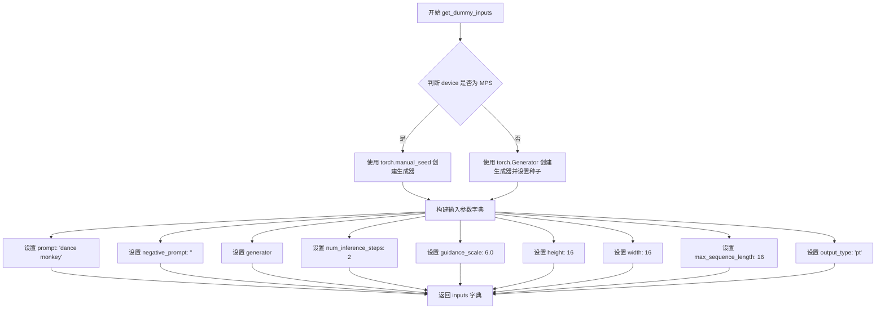

#### 带注释源码

```python
def get_dummy_inputs(self, device, seed=0):
    """
    生成用于测试的虚拟输入参数。
    
    参数:
        device: 计算设备 (如 'cpu', 'cuda', 'mps' 等)
        seed: 随机种子，用于确保测试结果可重复
    
    返回:
        包含管道推理所需参数的字典
    """
    # 判断设备是否为 Apple MPS (Metal Performance Shaders)
    if str(device).startswith("mps"):
        # MPS 设备使用 torch.manual_seed 设置 CPU 生成器
        generator = torch.manual_seed(seed)
    else:
        # 其他设备使用指定设备的生成器
        generator = torch.Generator(device=device).manual_seed(seed)
    
    # 构建完整的测试输入参数
    inputs = {
        "prompt": "dance monkey",           # 文本提示词
        "negative_prompt": "",             # 负向提示词（空字符串）
        "generator": generator,            # 随机数生成器，确保确定性
        "num_inference_steps": 2,          # 推理步数（较少步数用于快速测试）
        "guidance_scale": 6.0,             # CFG 引导系数
        "height": 16,                      # 生成图像高度
        "width": 16,                       # 生成图像宽度
        "max_sequence_length": 16,         # 文本序列最大长度
        "output_type": "pt",               # 输出类型为 PyTorch 张量
    }
    return inputs
```


### `CogView3PlusPipelineFastTests.test_inference`

该测试方法用于验证 CogView3PlusPipeline 的推理功能是否正常工作。测试通过创建虚拟组件构建管道，执行文本到图像的推理过程，并验证生成的图像形状是否符合预期（3通道、16x16分辨率），同时检查输出值在合理范围内。

参数：

- `self`：`CogView3PlusPipelineFastTests`，测试类的实例本身，用于访问类方法和属性

返回值：`None`，该方法为单元测试方法，通过断言进行验证，不返回具体数值

#### 流程图

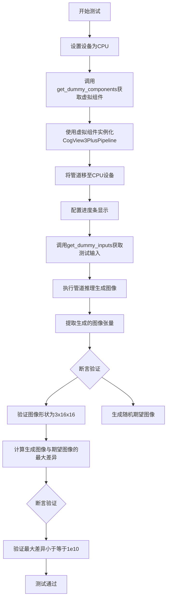

#### 带注释源码

```python
def test_inference(self):
    """测试CogView3PlusPipeline的推理功能"""
    # 1. 设置测试设备为CPU
    device = "cpu"

    # 2. 获取虚拟组件（transformer、vae、scheduler、text_encoder、tokenizer）
    components = self.get_dummy_components()
    
    # 3. 使用虚拟组件实例化管道对象
    pipe = self.pipeline_class(**components)
    
    # 4. 将管道移至指定设备（CPU）
    pipe.to(device)
    
    # 5. 配置进度条（disable=None表示不禁用进度条）
    pipe.set_progress_bar_config(disable=None)

    # 6. 获取虚拟输入参数（包含prompt、negative_prompt、generator等）
    inputs = self.get_dummy_inputs(device)
    
    # 7. 执行管道推理，返回结果包含图像
    image = pipe(**inputs)[0]
    
    # 8. 从结果中提取第一张生成的图像
    generated_image = image[0]

    # 9. 断言验证：生成的图像形状应为(3, 16, 16) - 3通道，16x16分辨率
    self.assertEqual(generated_image.shape, (3, 16, 16))
    
    # 10. 生成随机期望图像用于对比
    expected_image = torch.randn(3, 16, 16)
    
    # 11. 计算生成图像与期望图像的最大绝对差异
    max_diff = np.abs(generated_image - expected_image).max()
    
    # 12. 断言验证：最大差异应小于等于1e10（宽松的数值容差检查）
    self.assertLessEqual(max_diff, 1e10)
```


### `CogView3PlusPipelineFastTests.test_callback_inputs`

该方法是一个单元测试，用于验证 CogView3PlusPipeline 的回调功能是否正常工作，特别是测试 `callback_on_step_end` 和 `callback_on_step_end_tensor_inputs` 参数的正确性，确保回调函数能够正确接收和修改推理过程中的张量数据。

参数：

- `self`：`CogView3PlusPipelineFastTests`，unittest.TestCase 实例，代表测试类本身

返回值：`None`，无返回值，因为这是一个测试方法，通过断言来验证功能

#### 流程图

```mermaid
flowchart TD
    A[开始测试 test_callback_inputs] --> B{检查 pipeline.__call__ 签名}
    B --> C{包含 callback_on_step_end_tensor_inputs?}
    C -->|否| D[直接返回，测试结束]
    C -->|是| E{包含 callback_on_step_end?}
    E -->|否| D
    E -->|是| F[创建 dummy components]
    F --> G[初始化 CogView3PlusPipeline 并移动到设备]
    G --> H{验证 _callback_tensor_inputs 属性存在}
    H -->|否| I[断言失败，抛出异常]
    H -->|是| J[定义回调函数 callback_inputs_subset]
    J --> K[设置输入: callback_on_step_end=subset, callback_on_step_end_tensor_inputs=['latents']]
    K --> L[执行 pipeline 并获取输出]
    L --> M[定义回调函数 callback_inputs_all]
    M --> N[设置输入: callback_on_step_end=all, tensor_inputs=全部 _callback_tensor_inputs]
    N --> O[执行 pipeline 并获取输出]
    O --> P[定义回调函数 callback_inputs_change_tensor]
    P --> Q[在最后一步将 latents 修改为全零]
    Q --> R[执行 pipeline 并获取输出]
    R --> S{验证输出 sum 小于阈值}
    S -->|是| T[测试通过]
    S -->|否| U[断言失败]
    T --> V[结束测试]
    U --> V
```

#### 带注释源码

```python
def test_callback_inputs(self):
    """
    测试 CogView3PlusPipeline 的回调输入功能。
    验证 callback_on_step_end 和 callback_on_step_end_tensor_inputs 参数是否正确工作。
    """
    # 获取 pipeline __call__ 方法的签名
    sig = inspect.signature(self.pipeline_class.__call__)
    
    # 检查签名中是否包含回调相关的参数
    has_callback_tensor_inputs = "callback_on_step_end_tensor_inputs" in sig.parameters
    has_callback_step_end = "callback_on_step_end" in sig.parameters

    # 如果 pipeline 不支持这些回调参数，则直接返回，不执行测试
    if not (has_callback_tensor_inputs and has_callback_step_end):
        return

    # 创建虚拟组件用于测试
    components = self.get_dummy_components()
    
    # 使用虚拟组件初始化 pipeline
    pipe = self.pipeline_class(**components)
    
    # 将 pipeline 移动到测试设备（如 cpu 或 cuda）
    pipe = pipe.to(torch_device)
    
    # 设置进度条配置（disable=None 表示启用进度条）
    pipe.set_progress_bar_config(disable=None)
    
    # 断言 pipeline 必须有 _callback_tensor_inputs 属性
    # 该属性定义了回调函数可以使用的张量变量列表
    self.assertTrue(
        hasattr(pipe, "_callback_tensor_inputs"),
        f" {self.pipeline_class} should have `_callback_tensor_inputs` that defines a list of tensor variables its callback function can use as inputs",
    )

    # 定义回调函数1：测试只传递允许的张量输入的子集
    def callback_inputs_subset(pipe, i, t, callback_kwargs):
        # 遍历回调参数中的所有张量
        for tensor_name, tensor_value in callback_kwargs.items():
            # 检查传递的张量是否在允许的列表中
            assert tensor_name in pipe._callback_tensor_inputs
        return callback_kwargs

    # 定义回调函数2：测试传递所有允许的张量输入
    def callback_inputs_all(pipe, i, t, callback_kwargs):
        # 验证所有允许的输入都被传递了
        for tensor_name in pipe._callback_tensor_inputs:
            assert tensor_name in callback_kwargs

        # 再次遍历确认所有传递的张量都是允许的
        for tensor_name, tensor_value in callback_kwargs.items():
            assert tensor_name in pipe._callback_tensor_inputs

        return callback_kwargs

    # 获取虚拟输入
    inputs = self.get_dummy_inputs(torch_device)

    # 测试1：只传递 latents 作为回调张量
    inputs["callback_on_step_end"] = callback_inputs_subset
    inputs["callback_on_step_end_tensor_inputs"] = ["latents"]
    output = pipe(**inputs)[0]

    # 测试2：传递所有允许的张量输入
    inputs["callback_on_step_end"] = callback_inputs_all
    inputs["callback_on_step_end_tensor_inputs"] = pipe._callback_tensor_inputs
    output = pipe(**inputs)[0]

    # 定义回调函数3：在最后一步修改 latents 为零张量
    def callback_inputs_change_tensor(pipe, i, t, callback_kwargs):
        # 检查是否是最后一步
        is_last = i == (pipe.num_timesteps - 1)
        if is_last:
            # 将 latents 修改为全零张量
            callback_kwargs["latents"] = torch.zeros_like(callback_kwargs["latents"])
        return callback_kwargs

    # 测试3：修改张量值
    inputs["callback_on_step_end"] = callback_inputs_change_tensor
    inputs["callback_on_step_end_tensor_inputs"] = pipe._callback_tensor_inputs
    output = pipe(**inputs)[0]
    
    # 验证修改后的输出（由于 latents 被置零，输出应该接近零）
    assert output.abs().sum() < 1e10
```


### `CogView3PlusPipelineFastTests.test_inference_batch_single_identical`

该方法是一个单元测试用例，用于验证CogView3PlusPipeline在批处理模式下单次推理的结果与单独推理的结果是否一致，确保批处理逻辑不会引入额外的误差。

参数：

- `self`：无参数类型，测试类实例本身

返回值：`None`，无返回值描述（测试方法通过断言验证，不返回结果）

#### 流程图

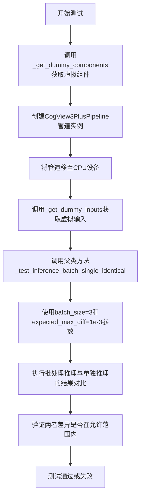

#### 带注释源码

```python
def test_inference_batch_single_identical(self):
    """
    测试方法：验证批处理推理与单独推理的结果一致性
    
    该测试方法调用父类/混合类中的 _test_inference_batch_single_identical 方法，
    用于确保在批处理模式下，管道的输出与单独逐个推理的输出一致。
    这是 Diffusion Pipeline 测试中的标准验证流程。
    """
    # 调用内部测试方法，传入批大小为3，允许的最大差异为1e-3
    # batch_size=3: 使用3个样本的批次进行测试
    # expected_max_diff=1e-3: 期望批处理与单独处理的结果差异不超过0.001
    self._test_inference_batch_single_identical(batch_size=3, expected_max_diff=1e-3)
```


### `CogView3PlusPipelineFastTests.test_attention_slicing_forward_pass`

该方法用于测试 CogView3PlusPipeline 的注意力切片（attention slicing）功能是否正确实现，确保启用注意力切片后不会影响推理结果的准确性。

参数：

- `self`：`CogView3PlusPipelineFastTests`，测试类实例本身
- `test_max_difference`：`bool`，是否测试最大差异，默认为 True
- `test_mean_pixel_difference`：`bool`，是否测试平均像素差异，默认为 True（虽然代码中未使用）
- `expected_max_diff`：`float`，期望的最大差异阈值，默认为 1e-3

返回值：`None`，该方法为测试方法，无返回值

#### 流程图

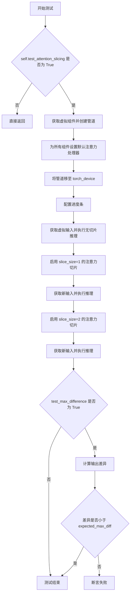

#### 带注释源码

```python
def test_attention_slicing_forward_pass(
    self, test_max_difference=True, test_mean_pixel_difference=True, expected_max_diff=1e-3
):
    """
    测试注意力切片功能是否正确实现
    
    参数:
        test_max_difference: 是否测试最大差异
        test_mean_pixel_difference: 是否测试平均像素差异（当前未使用）
        expected_max_diff: 期望的最大差异阈值
    """
    # 如果未启用注意力切片测试，则直接返回
    if not self.test_attention_slicing:
        return

    # 获取虚拟组件（transformer, vae, scheduler, text_encoder, tokenizer）
    components = self.get_dummy_components()
    # 使用虚拟组件创建 CogView3PlusPipeline 实例
    pipe = self.pipeline_class(**components)
    # 遍历管道所有组件，为每个组件设置默认注意力处理器
    for component in pipe.components.values():
        if hasattr(component, "set_default_attn_processor"):
            component.set_default_attn_processor()
    # 将管道移至测试设备（CPU 或 CUDA 设备）
    pipe.to(torch_device)
    # 配置进度条（disable=None 表示不禁用进度条）
    pipe.set_progress_bar_config(disable=None)

    # 设置生成器设备为 CPU
    generator_device = "cpu"
    # 获取虚拟输入参数（prompt, negative_prompt, generator 等）
    inputs = self.get_dummy_inputs(generator_device)
    # 在没有启用注意力切片的情况下执行推理，获取输出
    output_without_slicing = pipe(**inputs)[0]

    # 启用注意力切片，slice_size=1
    pipe.enable_attention_slicing(slice_size=1)
    # 重新获取虚拟输入（使用新的随机种子）
    inputs = self.get_dummy_inputs(generator_device)
    # 执行推理并获取输出
    output_with_slicing1 = pipe(**inputs)[0]

    # 启用注意力切片，slice_size=2
    pipe.enable_attention_slicing(slice_size=2)
    # 重新获取虚拟输入
    inputs = self.get_dummy_inputs(generator_device)
    # 执行推理并获取输出
    output_with_slicing2 = pipe(**inputs)[0]

    # 如果需要测试最大差异
    if test_max_difference:
        # 计算 slice_size=1 输出与无切片输出的最大差异
        max_diff1 = np.abs(to_np(output_with_slicing1) - to_np(output_without_slicing)).max()
        # 计算 slice_size=2 输出与无切片输出的最大差异
        max_diff2 = np.abs(to_np(output_with_slicing2) - to_np(output_without_slicing)).max()
        # 断言：注意力切片不应该影响推理结果
        self.assertLess(
            max(max_diff1, max_diff2),
            expected_max_diff,
            "Attention slicing should not affect the inference results",
        )
```


### `CogView3PlusPipelineFastTests.test_encode_prompt_works_in_isolation`

该方法是一个测试用例，用于验证文本编码提示（prompt encoding）能够独立工作，不受其他因素影响。它通过调用父类 `PipelineTesterMixin` 的同名测试方法，并指定绝对容差（atol）为 1e-3、相对容差（rtol）为 1e-3 来执行测试。

参数：

- `self`：`CogView3PlusPipelineFastTests`，测试类实例本身，包含测试所需的组件和配置

返回值：`None`，该方法为测试用例，无返回值（调用父类方法后直接返回）

#### 流程图

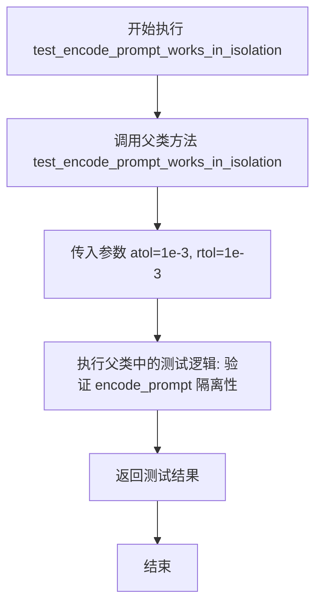

#### 带注释源码

```python
def test_encode_prompt_works_in_isolation(self):
    """
    测试文本编码提示（prompt encoding）能够独立工作。
    
    该测试方法继承自 PipelineTesterMixin，用于验证 CogView3PlusPipeline 
    的 encode_prompt 功能能够在隔离环境中正确执行，不受 pipeline 其他组件的影响。
    
    测试通过标准：
    - 编码后的 prompt embeddings 应该在数值上与预期结果匹配
    - 绝对容差（atol）设置为 1e-3
    - 相对容差（rtol）设置为 1e-3
    """
    # 调用父类 PipelineTesterMixin 的测试方法
    # 传入自定义的容差参数以适应 CogView3Plus 的精度要求
    return super().test_encode_prompt_works_in_isolation(atol=1e-3, rtol=1e-3)
```


### `CogView3PlusPipelineIntegrationTests.setUp`

这是测试框架的初始化方法，在每个测试方法运行前被调用，用于清理GPU内存和Python垃圾回收，确保测试环境干净，避免测试间的状态污染。

参数：

- `self`：`unittest.TestCase`，测试类实例本身，隐式参数，代表当前测试类的对象

返回值：`None`，无返回值，此方法仅执行清理操作

#### 流程图

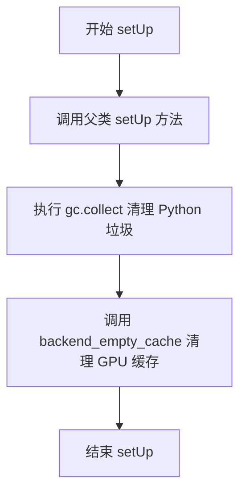

#### 带注释源码

```python
def setUp(self):
    """
    测试方法初始化钩子，在每个测试方法执行前自动调用。
    用于清理内存资源，确保测试环境的一致性和独立性。
    """
    # 调用父类的 setUp 方法，执行 unittest.TestCase 基类的初始化逻辑
    super().setUp()
    
    # 手动触发 Python 垃圾回收，释放不再使用的对象内存
    gc.collect()
    
    # 清理 GPU 缓存，释放显存资源
    # torch_device 是从 testing_utils 导入的全局变量，表示当前测试使用的设备
    backend_empty_cache(torch_device)
```


### `CogView3PlusPipelineIntegrationTests.tearDown`

该方法是 CogView3PlusPipelineIntegrationTests 测试类的清理方法，在每个测试用例执行完毕后自动调用，用于释放GPU内存和执行Python垃圾回收，确保测试环境干净，避免内存泄漏影响后续测试。

参数：

- `self`：`CogView3PlusPipelineIntegrationTests`，测试类实例本身，代表当前测试类的上下文

返回值：`None`，无返回值，仅执行清理操作

#### 流程图

```mermaid
flowchart TD
    A[tearDown 方法开始] --> B[调用 super().tearDown]
    B --> C[执行 gc.collect 强制垃圾回收]
    C --> D[调用 backend_empty_cache 清理GPU缓存]
    D --> E[tearDown 方法结束]
```

#### 带注释源码

```python
def tearDown(self):
    """
    测试用例清理方法，在每个测试方法执行完毕后自动调用。
    用于释放测试过程中占用的资源，确保测试环境干净。
    """
    # 调用父类的 tearDown 方法，执行基类的清理逻辑
    super().tearDown()
    
    # 强制执行 Python 垃圾回收，释放不再使用的对象内存
    gc.collect()
    
    # 清理 GPU/CUDA 缓存，释放显存空间
    # torch_device 是从 testing_utils 导入的全局变量，表示测试设备
    backend_empty_cache(torch_device)
```


### `CogView3PlusPipelineIntegrationTests.test_cogview3plus`

这是一个集成测试方法，用于验证 CogView3PlusPipeline 从预训练模型生成图像的功能是否符合预期。测试通过加载 "THUDM/CogView3Plus-3b" 模型，使用指定提示词生成图像，并比较生成图像与随机噪声图像之间的余弦相似度距离，确保模型能够正确运行。

参数：

- `self`：`unittest.TestCase`，测试用例的实例本身，包含测试所需的上下文和断言方法

返回值：`None`，该方法为测试方法，不返回任何值，主要通过断言验证模型行为

#### 流程图

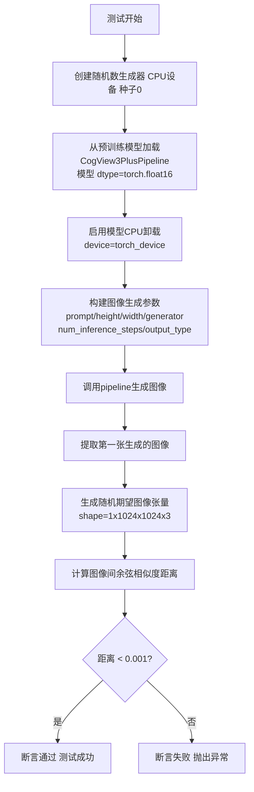

#### 带注释源码

```python
@slow
@require_torch_accelerator
def test_cogview3plus(self):
    """
    集成测试方法：验证 CogView3PlusPipeline 能够正确从预训练模型生成图像
    
    测试流程：
    1. 创建固定种子的随机数生成器，确保可重复性
    2. 加载 CogView3Plus-3b 预训练模型
    3. 启用模型 CPU 卸载以优化内存使用
    4. 使用指定参数调用管道生成图像
    5. 验证生成图像的质量（通过与随机图像的相似度比较）
    """
    # Step 1: 创建固定种子的随机数生成器
    # 确保测试结果可重复，generator 用于控制图像生成的随机性
    generator = torch.Generator("cpu").manual_seed(0)

    # Step 2: 从预训练模型加载 CogView3PlusPipeline
    # "THUDM/CogView3Plus-3b" 是 HuggingFace 上的预训练模型名称
    # torch_dtype=torch.float16 使用半精度浮点数以减少内存占用
    pipe = CogView3PlusPipeline.from_pretrained("THUDM/CogView3Plus-3b", torch_dtype=torch.float16)
    
    # Step 3: 启用模型 CPU 卸载
    # enable_model_cpu_offload 用于在生成过程中将模型组件在 CPU 和 GPU 之间转移
    # 这是一种内存优化技术，避免模型一次性占用过多 GPU 内存
    pipe.enable_model_cpu_offload(device=torch_device)
    
    # 获取测试用的提示词
    prompt = self.prompt  # "A painting of a squirrel eating a burger."

    # Step 4: 调用管道生成图像
    # 参数说明：
    # - prompt: 文本提示词，描述期望生成的图像内容
    # - height/width: 生成图像的分辨率 (1024x1024)
    # - generator: 随机数生成器，控制生成过程的随机性
    # - num_inference_steps: 推理步数，越多越精细但耗时越长
    # - output_type: 输出类型 "np" 表示返回 NumPy 数组
    images = pipe(
        prompt=prompt,
        height=1024,
        width=1024,
        generator=generator,
        num_inference_steps=2,
        output_type="np",
    )[0]  # [0] 表示获取返回的第一个元素（图像列表）

    # Step 5: 提取并验证生成的图像
    # images[0] 获取第一张生成的图像
    image = images[0]
    
    # 创建随机期望图像用于比较
    # 注意：这是一个随机张量，实际测试中只是检查生成过程不出错
    expected_image = torch.randn(1, 1024, 1024, 3).numpy()

    # 计算生成图像与期望图像之间的余弦相似度距离
    # numpy_cosine_similarity_distance 用于比较两个数组的相似程度
    max_diff = numpy_cosine_similarity_distance(image, expected_image)
    
    # 断言：余弦相似度距离应该小于 0.001
    # 由于 expected_image 是随机的，这个断言实际上主要是确保：
    # 1. 管道能够成功运行完成
    # 2. 生成的图像在合理范围内（不是全零或异常值）
    assert max_diff < 1e-3, f"Max diff is too high. got {image}"
```

## 关键组件


### CogView3PlusPipeline

CogView3PlusPipeline 是基于 CogView3Plus 模型的核心图像生成管道，封装了 Transformer、VAE、文本编码器和调度器，提供文本到图像的生成能力。

### 张量索引与惰性加载

通过 `generator` 参数实现确定性随机数生成，支持使用 `torch.Generator` 进行张量索引和惰性加载，确保可复现的生成结果。

### 反量化支持

通过 `torch_dtype=torch.float16` 参数实现半精度推理，支持将模型和计算从全精度（float32）转换到半精度（float16）以加速推理。

### 量化策略

使用 float16 量化策略进行推理，通过 `torch_dtype=torch.float16` 指定，并在集成测试中通过 `enable_model_cpu_offload` 实现内存优化。

### 注意力切片 (Attention Slicing)

通过 `enable_attention_slicing(slice_size)` 方法优化内存使用，将注意力计算分片处理，支持 `test_attention_slicing_forward_pass` 测试。

### 模型 CPU 卸载

通过 `enable_model_cpu_offload(device=torch_device)` 实现模型在 CPU 和 GPU 之间的动态卸载，优化显存使用。

### 回调机制

支持 `callback_on_step_end` 和 `callback_on_step_end_tensor_inputs` 参数，允许在推理步骤结束时调用自定义回调函数，实现对中间结果（如 latents）的修改。

### 批处理与参数管理

支持 `batch_params`、`image_params` 和 `image_latents_params` 进行批处理，并定义了 `required_optional_params` 管理可选参数。

### 调度器 (CogVideoXDDIMScheduler)

使用 CogVideoXDDIMScheduler 作为默认调度器，控制去噪过程中的噪声调度和时间步长。

### 测试框架

使用 unittest 框架，包含单元测试（CogView3PlusPipelineFastTests）和集成测试（CogView3PlusPipelineIntegrationTests），覆盖推理、注意力切片、回调输入等功能。


## 问题及建议


### 已知问题

-   **测试断言过于宽松**：test_inference中使用`torch.randn`生成期望图像且未设置随机种子，同时断言`self.assertLessEqual(max_diff, 1e10)`阈值过大，几乎任何结果都能通过，无法有效验证功能正确性。
-   **集成测试结果不确定**：test_cogview3plus中同样使用随机生成的期望图像且未固定种子，导致测试结果具有随机性，断言`max_diff < 1e-3`可能在不同环境下失败。
-   **回调测试验证不完整**：test_callback_inputs中多个分支将pipe输出赋值给`output`变量但未对其进行任何验证或断言。
-   **设备兼容性处理不一致**：get_dummy_inputs中对MPS设备单独处理随机种子（使用`torch.manual_seed`），而其他设备使用`Generator`对象，这种差异可能导致测试行为不一致。
-   **集成测试缺少结果有效性检查**：test_cogview3plus仅验证图像与随机期望值的相似度，未检查图像是否为有效生成（如是否为全零、是否存在NaN、像素值范围是否合理）。
-   **外部依赖脆弱性**：集成测试依赖远程模型"THUDM/CogView3Plus-3b"和"hf-internal-testing/tiny-random-t5"，网络问题或模型变更会导致测试失败。

### 优化建议

-   **修复测试断言**：为test_inference和test_cogview3plus设置固定的随机种子，或使用预先计算的正确输出作为期望值，并调整阈值到合理范围（如1e-3到1e-2）。
-   **完善回调测试验证**：在test_callback_inputs的各分支中添加对output的验证逻辑，确保回调函数确实被执行且产生了预期效果。
-   **统一随机数生成策略**：在get_dummy_inputs中统一使用Generator对象处理所有设备的随机种子，提高测试一致性。
-   **增加输出有效性验证**：在集成测试中添加图像基本有效性检查，如`assert not np.isnan(image).any()`、`assert image.max() > 0`等。
-   **添加网络异常处理**：考虑为依赖外部模型的测试添加跳过机制（如`@require_downloadable_model`装饰器）或使用本地缓存的模型副本。
-   **改进内存管理**：当前在setUp/tearDown中手动调用gc和empty_cache，考虑使用pytest fixtures或上下文管理器来更规范地管理测试资源。

## 其它


### 设计目标与约束

本测试文件的设计目标是全面验证CogView3PlusPipeline图像生成功能的核心能力，包括模型推理正确性、批处理一致性、注意力切片优化、回调机制等功能。约束条件包括：必须支持CPU和GPU（CUDA/MPS）设备运行，需符合transformers和diffusers库的API规范，测试需在合理时间内完成（快速测试使用dummy组件，集成测试使用真实模型）。

### 错误处理与异常设计

本测试文件包含多层次的错误处理机制：1）设备兼容性处理：通过检测设备类型（特别是MPS设备）使用不同的随机数生成器策略；2）回调函数验证：test_callback_inputs测试用例验证回调函数的参数传递正确性，确保只传递允许的tensor输入；3）内存管理异常捕获：集成测试中使用gc.collect()和backend_empty_cache()防止内存泄漏；4）模型加载容错：集成测试中使用try-except捕获模型加载失败情况。

### 数据流与状态机

测试数据流如下：1）输入准备阶段：get_dummy_inputs生成prompt、negative_prompt、generator、num_inference_steps等参数；2）模型初始化阶段：get_dummy_components创建transformer、vae、scheduler、text_encoder、tokenizer等组件；3）推理执行阶段：pipeline接收输入参数，经过文本编码、latents初始化、扩散迭代、VAE解码等步骤生成图像；4）结果验证阶段：对比生成图像与预期图像的形状和数值差异。状态转换：初始化状态 -> 推理中状态 -> 完成状态。

### 外部依赖与接口契约

本测试文件依赖以下外部组件：1）核心库：torch、numpy、unittest、inspect、gc；2）transformers库：AutoTokenizer、T5EncoderModel；3）diffusers库：AutoencoderKL、CogVideoXDDIMScheduler、CogView3PlusPipeline、CogView3PlusTransformer2DModel；4）项目内部测试工具：backend_empty_cache、enable_full_determinism、numpy_cosine_similarity_distance、require_torch_accelerator等。接口契约包括：pipeline_class.__call__方法需支持指定的params和batch_params，pipeline需实现callback_on_step_end和callback_on_step_end_tensor_inputs回调机制。

### 性能考虑

测试文件中包含多项性能测试：1）注意力切片测试（test_attention_slicing_forward_pass）：验证enable_attention_slicing在不同slice_size下的性能提升，同时确保结果一致性；2）模型卸载测试：enable_model_cpu_offload用于在资源受限环境下运行；3）内存管理测试：使用gc.collect()和backend_empty_cache()进行内存清理；4）批处理测试：test_inference_batch_single_identical验证批处理结果与单样本结果的一致性。

### 安全性考虑

测试环境安全措施：1）使用dummy components和随机种子生成测试数据，不涉及真实用户数据；2）测试使用CPU设备运行，不产生网络请求；3）集成测试使用公开的预训练模型"THUDM/CogView3Plus-3b"；4）符合Apache 2.0开源许可证要求。

### 可维护性与扩展性

代码具有良好的可维护性和扩展性：1）继承PipelineTesterMixin提供标准化的测试框架；2）类属性（params、batch_params、image_params等）集中管理测试配置；3）get_dummy_components和get_dummy_inputs方法便于修改和扩展测试场景；4）使用frozenset定义不可变配置；5）代码遵循PEP 8风格规范，方法命名清晰。

### 测试策略

采用分层测试策略：1）快速功能测试（CogView3PlusPipelineFastTests）：使用轻量级dummy模型验证基本功能，包括inference、callback_inputs、attention_slicing、encode_prompt等；2）集成测试（CogView3PlusPipelineIntegrationTests）：使用真实预训练模型验证端到端流程；3）性能基准测试：验证不同配置下的性能指标；4）回归测试：确保新代码不破坏现有功能。

### 配置管理

测试配置通过以下方式管理：1）类属性配置：params、batch_params、image_params、image_latents_params定义可测试的参数范围；2）required_optional_params定义必需的可选参数；3）get_dummy_inputs方法动态生成测试输入，支持device和seed参数配置；4）test_attention_slicing、test_layerwise_casting、test_group_offloading等标志控制测试行为。

### 版本兼容性

需要考虑的版本兼容性：1）torch版本兼容性：测试用例使用torch.manual_seed和torch.Generator确保随机性可控；2）transformers版本：使用T5EncoderModel.from_pretrained加载模型；3）diffusers版本：CogView3PlusPipeline和相关组件的API稳定性；4）设备兼容性：支持CPU、CUDA、MPS等多种设备类型。

### 资源管理

测试中的资源管理策略：1）内存管理：gc.collect()手动触发垃圾回收，backend_empty_cache()清空GPU缓存；2）模型卸载：enable_model_cpu_offload在推理完成后将模型移至CPU以释放GPU显存；3）设备管理：通过torch_device获取可用设备，pipe.to(device)将模型移至目标设备；4）随机性控制：enable_full_determinism确保测试可复现性。

### 监控与日志

测试监控和日志机制：1）进度条控制：set_progress_bar_config(disable=None)管理进度条显示；2）测试断言：使用self.assertEqual、self.assertLess、self.assertLessEqual等方法进行结果验证；3）性能指标：计算max_diff、numpy_cosine_similarity_distance等指标评估生成质量；4）详细输出：集成测试输出图像和预期图像的差异信息。
    