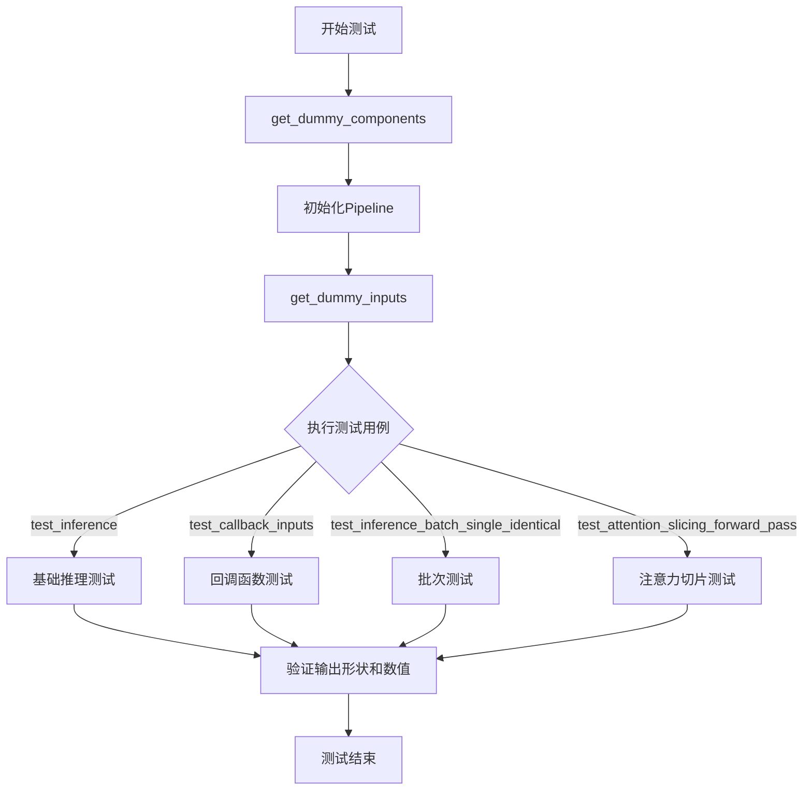
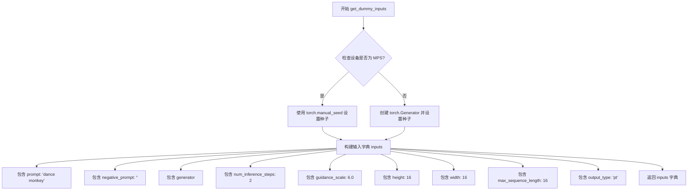
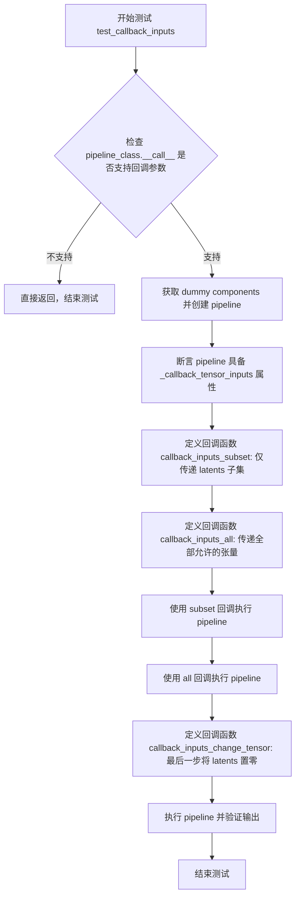
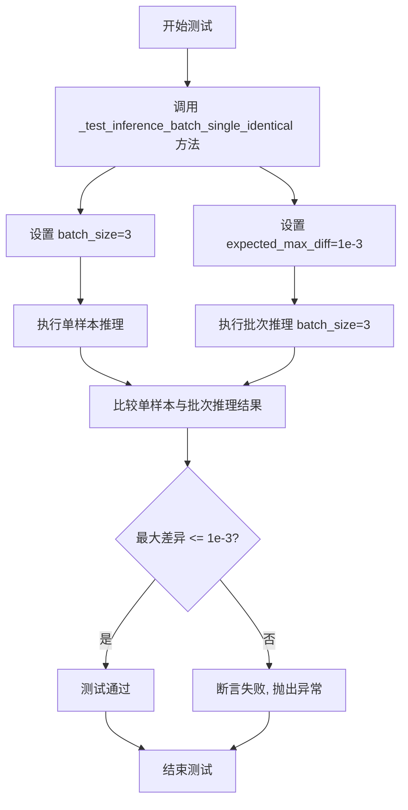
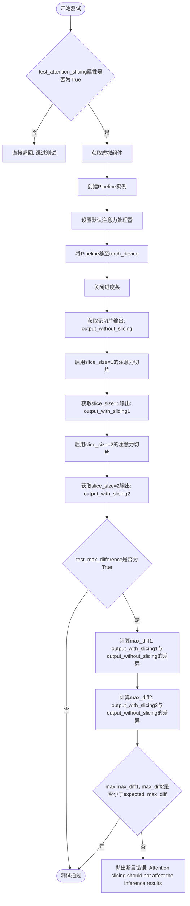
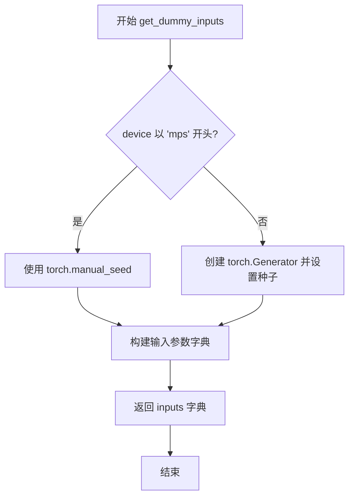
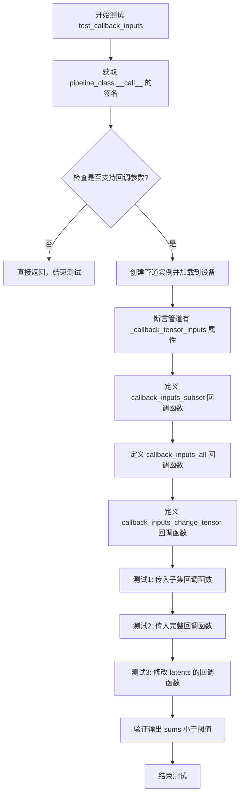
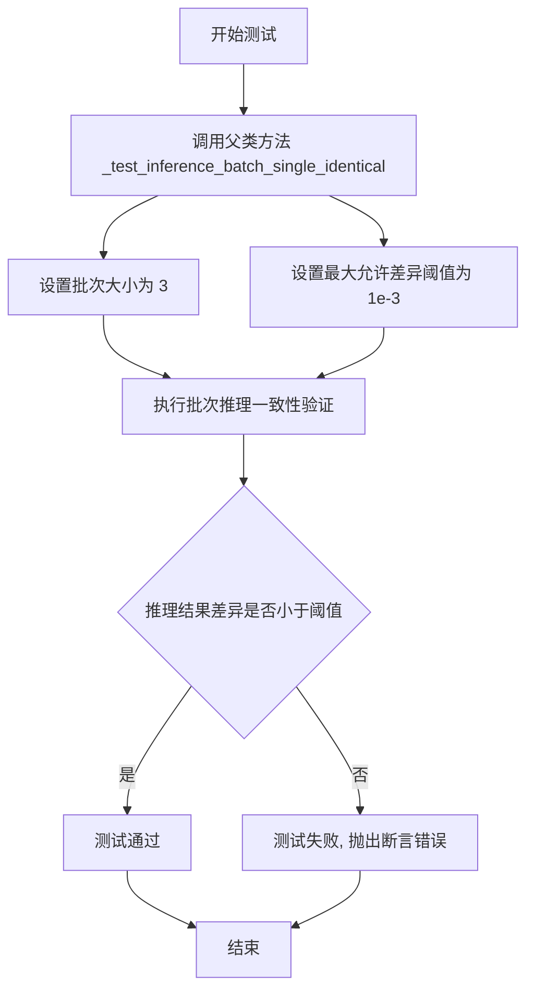
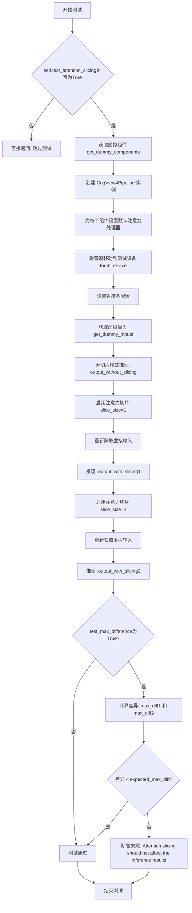

# `diffusers\tests\pipelines\cogview4\test_cogview4.py` 详细设计文档

这是一个CogView4Pipeline的单元测试文件，隶属于diffusers库，用于测试CogView4文本到图像生成pipeline的各种功能，包括基础推理、回调函数、批次处理和注意力切片等。

## 整体流程



## 类结构

```
unittest.TestCase
└── CogView4PipelineFastTests (继承PipelineTesterMixin)
    ├── get_dummy_components - 创建虚拟组件
    ├── get_dummy_inputs - 创建虚拟输入
    ├── test_inference - 推理测试
    ├── test_callback_inputs - 回调测试
    ├── test_inference_batch_single_identical - 批次测试
    └── test_attention_slicing_forward_pass - 注意力切片测试
```

## 全局变量及字段


### `enable_full_determinism`
    
启用完全确定性测试

类型：`function`
    


### `torch_device`
    
导入的测试设备

类型：`str`
    


### `to_np`
    
导入的numpy转换函数

类型：`function`
    


### `CogView4PipelineFastTests.pipeline_class`
    
测试的pipeline类

类型：`type[CogView4Pipeline]`
    


### `CogView4PipelineFastTests.params`
    
TEXT_TO_IMAGE_PARAMS排除cross_attention_kwargs

类型：`frozenset`
    


### `CogView4PipelineFastTests.batch_params`
    
TEXT_TO_IMAGE_BATCH_PARAMS

类型：`set`
    


### `CogView4PipelineFastTests.image_params`
    
TEXT_TO_IMAGE_IMAGE_PARAMS

类型：`set`
    


### `CogView4PipelineFastTests.image_latents_params`
    
TEXT_TO_IMAGE_IMAGE_PARAMS

类型：`set`
    


### `CogView4PipelineFastTests.required_optional_params`
    
必需的可选参数集合

类型：`frozenset`
    


### `CogView4PipelineFastTests.supports_dduf`
    
是否支持DDUF

类型：`bool`
    


### `CogView4PipelineFastTests.test_xformers_attention`
    
是否测试xformers

类型：`bool`
    


### `CogView4PipelineFastTests.test_layerwise_casting`
    
是否测试分层转换

类型：`bool`
    
    

## 全局函数及方法


### `CogView4PipelineFastTests.get_dummy_components`

该函数用于创建虚拟的CogView4Pipeline测试组件，包括变换器、VAE、调度器、文本编码器和分词器，以便进行单元测试。

参数：该函数没有显式参数（除隐式 `self`）

返回值：`Dict[str, Any]`，返回包含 transformer、vae、scheduler、text_encoder 和 tokenizer 的组件字典

#### 流程图

```mermaid
flowchart TD
    A[开始 get_dummy_components] --> B[设置随机种子 torch.manual_seed(0)]
    B --> C[创建 CogView4Transformer2DModel]
    C --> D[创建 AutoencoderKL]
    D --> E[创建 FlowMatchEulerDiscreteScheduler]
    E --> F[创建 GlmConfig 和 GlmForCausalLM]
    F --> G[从预训练模型加载 AutoTokenizer]
    G --> H[组装组件到字典]
    H --> I[返回 components 字典]
```

#### 带注释源码

```python
def get_dummy_components(self):
    """
    创建虚拟的CogView4Pipeline测试组件
    
    该方法初始化所有必需的组件用于CogView4Pipeline的单元测试，
    包括变换器、VAE、调度器、文本编码器和分词器。
    """
    
    # 设置随机种子以确保测试可重复性
    torch.manual_seed(0)
    
    # 创建虚拟CogView4Transformer2DModel变换器
    # 参数: patch_size=2, in_channels=4, num_layers=2, 
    #       attention_head_dim=4, num_attention_heads=4, 
    #       out_channels=4, text_embed_dim=32, 
    #       time_embed_dim=8, condition_dim=4
    transformer = CogView4Transformer2DModel(
        patch_size=2,
        in_channels=4,
        num_layers=2,
        attention_head_dim=4,
        num_attention_heads=4,
        out_channels=4,
        text_embed_dim=32,
        time_embed_dim=8,
        condition_dim=4,
    )

    # 设置随机种子
    torch.manual_seed(0)
    
    # 创建虚拟AutoencoderKL (VAE)
    # 参数: block_out_channels=[32, 64], in_channels=3, 
    #       out_channels=3, down_block_types, up_block_types,
    #       latent_channels=4, sample_size=128
    vae = AutoencoderKL(
        block_out_channels=[32, 64],
        in_channels=3,
        out_channels=3,
        down_block_types=["DownEncoderBlock2D", "DownEncoderBlock2D"],
        up_block_types=["UpDecoderBlock2D", "UpDecoderBlock2D"],
        latent_channels=4,
        sample_size=128,
    )

    # 设置随机种子
    torch.manual_seed(0)
    
    # 创建虚拟FlowMatchEulerDiscreteScheduler调度器
    # 参数: base_shift=0.25, max_shift=0.75, base_image_seq_len=256,
    #       use_dynamic_shifting=True, time_shift_type="linear"
    scheduler = FlowMatchEulerDiscreteScheduler(
        base_shift=0.25,
        max_shift=0.75,
        base_image_seq_len=256,
        use_dynamic_shifting=True,
        time_shift_type="linear",
    )

    # 设置随机种子
    torch.manual_seed(0)
    
    # 创建虚拟GLM文本编码器配置
    # 参数: hidden_size=32, intermediate_size=8, 
    #       num_hidden_layers=2, num_attention_heads=4, head_dim=8
    text_encoder_config = GlmConfig(
        hidden_size=32, intermediate_size=8, num_hidden_layers=2, 
        num_attention_heads=4, head_dim=8
    )
    
    # 创建虚拟GLM文本编码器模型
    text_encoder = GlmForCausalLM(text_encoder_config)
    
    # 从预训练模型加载分词器
    # 注意: 计划使用THUDM/CogView4，但尚未发布
    tokenizer = AutoTokenizer.from_pretrained("THUDM/glm-4-9b-chat", trust_remote_code=True)

    # 组装所有组件到字典
    components = {
        "transformer": transformer,
        "vae": vae,
        "scheduler": scheduler,
        "text_encoder": text_encoder,
        "tokenizer": tokenizer,
    }
    
    # 返回组件字典
    return components
```


### `CogView4PipelineFastTests.get_dummy_inputs`

该方法用于创建包含prompt、negative_prompt、generator等参数的测试输入字典，以便对CogView4Pipeline进行单元测试。

参数：

- `device`：设备类型，目标执行设备（如"cpu"、"cuda"等）
- `seed`：整数（可选，默认值为0），用于设置随机种子以确保测试可复现

返回值：`dict`，包含以下键值对的字典：
- `prompt`：字符串，待生成的文本提示
- `negative_prompt`：字符串，不希望出现的文本内容
- `generator`：torch.Generator，随机数生成器
- `num_inference_steps`：整数，推理步数
- `guidance_scale`：浮点数，引导强度
- `height`：整数，生成图像高度
- `width`：整数，生成图像宽度
- `max_sequence_length`：整数，最大序列长度
- `output_type`：字符串，输出类型

#### 流程图



#### 带注释源码

```python
def get_dummy_inputs(self, device, seed=0):
    """
    创建用于测试 CogView4Pipeline 的虚拟输入参数字典
    
    参数:
        device: str - 目标设备（如 "cpu", "cuda", "mps"）
        seed: int - 随机种子，默认值为 0
    
    返回:
        dict: 包含管道调用所需参数的字典
    """
    # 判断设备是否为 Apple MPS (Metal Performance Shaders)
    # MPS 不支持 torch.Generator，需要使用 torch.manual_seed 替代
    if str(device).startswith("mps"):
        # 对于 MPS 设备，直接使用 torch.manual_seed 设置全局随机种子
        generator = torch.manual_seed(seed)
    else:
        # 对于其他设备（CPU/CUDA），创建特定设备的生成器并设置种子
        generator = torch.Generator(device=device).manual_seed(seed)
    
    # 构建包含所有测试参数的字典
    inputs = {
        "prompt": "dance monkey",           # 文本提示词
        "negative_prompt": "",              # 负面提示词（空字符串表示无负面引导）
        "generator": generator,             # 随机数生成器，确保可复现性
        "num_inference_steps": 2,           # 推理步数，测试时使用较少步数加速
        "guidance_scale": 6.0,              # Classifier-free guidance 强度
        "height": 16,                       # 生成图像高度（像素）
        "width": 16,                        # 生成图像宽度（像素）
        "max_sequence_length": 16,          # 文本序列最大长度
        "output_type": "pt",                # 输出类型："pt" 表示 PyTorch 张量
    }
    return inputs  # 返回包含所有参数的字典
```


### `CogView4PipelineFastTests.test_inference`

该方法验证 CogView4Pipeline 推理输出的形状和数值范围是否符合预期，确保生成的图像具有正确的维度 (3, 16, 16) 且数值在合理范围内。

参数：

- `self`：`CogView4PipelineFastTests` 类实例，隐式参数，表示当前测试类对象

返回值：`None`，该方法为测试用例，通过 `self.assertEqual` 和 `self.assertLessEqual` 断言验证推理结果，不返回具体值

#### 流程图

```mermaid
flowchart TD
    A[开始测试] --> B[设置设备为 CPU]
    B --> C[调用 get_dummy_components 获取虚拟组件]
    C --> D[使用虚拟组件初始化 CogView4Pipeline]
    D --> E[将 Pipeline 移至 CPU 设备]
    E --> F[设置进度条配置为启用]
    F --> G[调用 get_dummy_inputs 获取虚拟输入]
    G --> H[执行 Pipeline 推理: pipe\*\*inputs]
    H --> I[提取生成的图像: image[0]]
    I --> J{验证图像形状}
    J --> |等于 (3, 16, 16)| K[生成期望图像]
    J --> |不等于| L[测试失败]
    K --> M[计算最大差值]
    M --> N{验证数值范围}
    N --> |小于等于 1e10| O[测试通过]
    N --> |大于| P[测试失败]
```

#### 带注释源码

```python
def test_inference(self):
    """验证 pipeline 推理输出的形状和数值范围"""
    device = "cpu"  # 设置测试设备为 CPU

    # 获取虚拟组件（transformer, vae, scheduler, text_encoder, tokenizer）
    components = self.get_dummy_components()
    # 使用虚拟组件实例化 CogView4Pipeline
    pipe = self.pipeline_class(**components)
    # 将 Pipeline 移至指定设备（CPU）
    pipe.to(device)
    # 设置进度条配置，disable=None 表示启用进度条
    pipe.set_progress_bar_config(disable=None)

    # 获取虚拟输入参数（prompt, negative_prompt, generator 等）
    inputs = self.get_dummy_inputs(device)
    # 执行推理并获取输出，pipe(**inputs) 返回元组，第一个元素为图像
    image = pipe(**inputs)[0]
    # 提取第一张生成的图像
    generated_image = image[0]

    # 断言验证：生成的图像形状必须为 (3, 16, 16)
    # 3 表示 RGB 通道数，16x16 表示图像高度和宽度
    self.assertEqual(generated_image.shape, (3, 16, 16))
    # 生成期望的随机图像用于比较
    expected_image = torch.randn(3, 16, 16)
    # 计算生成图像与期望图像之间的最大绝对差值
    max_diff = np.abs(generated_image - expected_image).max()
    # 断言验证：最大差值应小于等于 1e10（数值范围验证）
    self.assertLessEqual(max_diff, 1e10)
```


### `CogView4PipelineFastTests.test_callback_inputs`

该测试方法用于验证 CogView4Pipeline 推理管道中的 `callback_on_step_end` 和 `callback_on_step_end_tensor_inputs` 回调功能是否正常工作，包括回调张量输入的合法性检查、子集传递、完整传递以及回调修改张量数据的能力。

参数：

- `self`：`CogView4PipelineFastTests`，测试类实例本身，包含测试所需的配置和辅助方法

返回值：`None`，该方法为单元测试方法，通过断言验证功能，不返回具体数值

#### 流程图



#### 带注释源码

```
def test_callback_inputs(self):
    """
    测试 CogView4Pipeline 的 callback_on_step_end 和 callback_on_step_end_tensor_inputs 功能。
    验证内容：
    1. pipeline_class.__call__ 方法是否支持回调参数
    2. pipeline 是否具有 _callback_tensor_inputs 属性定义允许回调访问的张量
    3. 回调函数是否只能访问在 _callback_tensor_inputs 中声明的张量
    4. 回调函数是否可以修改张量数据（如将 latents 置零）
    """
    
    # 获取 pipeline __call__ 方法的签名
    sig = inspect.signature(self.pipeline_class.__call__)
    
    # 检查方法签名中是否包含回调相关参数
    has_callback_tensor_inputs = "callback_on_step_end_tensor_inputs" in sig.parameters
    has_callback_step_end = "callback_on_step_end" in sig.parameters

    # 如果 pipeline 不支持回调功能，则跳过测试
    if not (has_callback_tensor_inputs and has_callback_step_end):
        return

    # 创建测试用的虚拟组件
    components = self.get_dummy_components()
    
    # 初始化 pipeline 并移动到测试设备
    pipe = self.pipeline_class(**components)
    pipe = pipe.to(torch_device)
    pipe.set_progress_bar_config(disable=None)
    
    # 断言 pipeline 必须定义 _callback_tensor_inputs 属性
    # 该属性列出了回调函数可以访问的张量变量名称
    self.assertTrue(
        hasattr(pipe, "_callback_tensor_inputs"),
        f" {self.pipeline_class} should have `_callback_tensor_inputs` that defines a list of tensor variables its callback function can use as inputs",
    )

    # 定义回调函数：仅传递 latents 子集
    def callback_inputs_subset(pipe, i, t, callback_kwargs):
        """
        回调函数：验证只传递了 latents 子集
        pipe: pipeline 实例
        i: 当前推理步数
        t: 当前时间步/噪声调度参数
        callback_kwargs: 回调可访问的张量字典
        """
        # 遍历回调参数中的所有张量
        for tensor_name, tensor_value in callback_kwargs.items():
            # 检查传递的张量是否在允许列表中
            assert tensor_name in pipe._callback_tensor_inputs

        return callback_kwargs

    # 定义回调函数：传递所有允许的张量
    def callback_inputs_all(pipe, i, t, callback_kwargs):
        """
        回调函数：验证传递了全部允许的张量
        """
        # 检查所有允许的张量都已被传递
        for tensor_name in pipe._callback_tensor_inputs:
            assert tensor_name in callback_kwargs

        # 遍历回调参数，验证每个张量都在允许列表中
        for tensor_name, tensor_value in callback_kwargs.items():
            assert tensor_name in pipe._callback_tensor_inputs

        return callback_kwargs

    # 获取测试输入
    inputs = self.get_dummy_inputs(torch_device)

    # 测试场景1：仅传递 latents 作为回调张量子集
    inputs["callback_on_step_end"] = callback_inputs_subset
    inputs["callback_on_step_end_tensor_inputs"] = ["latents"]
    output = pipe(**inputs)[0]

    # 测试场景2：传递所有允许的张量
    inputs["callback_on_step_end"] = callback_inputs_all
    inputs["callback_on_step_end_tensor_inputs"] = pipe._callback_tensor_inputs
    output = pipe(**inputs)[0]

    # 定义回调函数：在最后一步将 latents 修改为零张量
    def callback_inputs_change_tensor(pipe, i, t, callback_kwargs):
        """
        回调函数：验证回调可以修改张量数据
        在最后一步将 latents 替换为零张量
        """
        # 判断是否为最后一步
        is_last = i == (pipe.num_timesteps - 1)
        if is_last:
            # 将 latents 替换为零张量
            callback_kwargs["latents"] = torch.zeros_like(callback_kwargs["latents"])
        return callback_kwargs

    # 测试场景3：回调修改张量并验证结果
    inputs["callback_on_step_end"] = callback_inputs_change_tensor
    inputs["callback_on_step_end_tensor_inputs"] = pipe._callback_tensor_inputs
    output = pipe(**inputs)[0]
    
    # 验证修改后的输出：输出张量的绝对值之和应小于阈值
    # 因为 latents 被置零，输出图像应接近零
    assert output.abs().sum() < 1e10
```


### `CogView4PipelineFastTests.test_inference_batch_single_identical`

该函数用于验证 CogView4Pipeline 在单样本推理与批次推理（batch_size=3）模式下输出结果的一致性，通过比较两者之间的最大差异是否在预期阈值（1e-3）范围内，确保管道在批处理模式下产生与单样本处理相同的输出。

参数：无（该方法继承自测试框架，无显式参数）

返回值：`None`，该方法通过 unittest 断言进行验证，不返回任何值

#### 流程图



#### 带注释源码

```python
def test_inference_batch_single_identical(self):
    """
    测试函数: 验证单样本和批次推理结果一致性
    
    该测试方法继承自 PipelineTesterMixin 基类，内部调用 _test_inference_batch_single_identical 方法。
    测试目标：
    - 验证管道在处理单个样本时的输出与处理批次样本时的输出一致
    - 确保批处理实现不会引入额外的数值误差
    
    参数（通过方法调用传递）:
    - batch_size: int = 3, 测试使用的批次大小
    - expected_max_diff: float = 1e-3, 允许的最大差异阈值
    
    返回值: None (通过 unittest 断言验证)
    """
    # 调用父类测试方法，验证推理一致性
    # 参数说明:
    #   batch_size=3: 使用3个样本的批次进行测试
    #   expected_max_diff=1e-3: 单样本与批次输出的最大允许差异
    self._test_inference_batch_single_identical(batch_size=3, expected_max_diff=1e-3)
```

---

### 补充说明

#### 关键组件信息

| 组件名称 | 说明 |
|---------|------|
| `CogView4PipelineFastTests` | 测试类，继承自 `PipelineTesterMixin` 和 `unittest.TestCase`，用于 CogView4 Pipeline 的快速功能测试 |
| `PipelineTesterMixin` | 混合类，提供管道通用测试方法，包括 `_test_inference_batch_single_identical` |
| `_test_inference_batch_single_identical` | 核心验证方法，实际执行单样本与批次推理一致性检查（定义在父类中） |

#### 潜在技术债务与优化空间

1. **测试参数硬编码**: `batch_size=3` 和 `expected_max_diff=1e-3` 硬编码在方法中，建议提取为类或实例属性以提高灵活性
2. **缺少对多种 batch_size 的覆盖**: 当前仅测试 batch_size=3，建议增加不同批次大小的测试用例
3. **未测试设备兼容性**: 测试仅在 CPU 设备上运行，未覆盖 CUDA/MPS 设备的一致性验证

#### 其它项目

- **设计目标**: 确保 CogView4Pipeline 在批处理模式下与单样本处理模式产生数学上等价的输出
- **约束条件**: 使用相同的随机种子（generator）确保可复现性
- **错误处理**: 通过 unittest 断言验证一致性，若差异超过阈值则抛出 `AssertionError`
- **数据流**: 测试通过 `get_dummy_components()` 获取组件，通过 `get_dummy_inputs()` 生成测试输入


### `CogView4PipelineFastTests.test_attention_slicing_forward_pass`

该方法用于验证 CogView4Pipeline 在启用注意力切片（attention slicing）功能后，推理结果应与未启用时保持一致（即注意力切片不影响模型的推理结果）。测试通过比较无切片、slice_size=1、slice_size=2 三种情况下的输出差异，确保差异值在允许的阈值范围内。

参数：

- `self`：`CogView4PipelineFastTests`，测试类的实例本身
- `test_max_difference`：`bool`，是否测试最大差异，默认为 `True`
- `test_mean_pixel_difference`：`bool`，是否测试平均像素差异（当前未使用，保留用于未来扩展），默认为 `True`
- `expected_max_diff`：`float`，允许的最大差异阈值，默认为 `1e-3`

返回值：`None`，该方法为 `unittest.TestCase` 的测试方法，通过断言验证注意力切片对推理结果无影响。

#### 流程图



#### 带注释源码

```python
def test_attention_slicing_forward_pass(
    self, test_max_difference=True, test_mean_pixel_difference=True, expected_max_diff=1e-3
):
    """
    验证注意力切片（attention slicing）不影响推理结果。
    
    参数:
        test_max_difference: 是否测试最大差异
        test_mean_pixel_difference: 是否测试平均像素差异（当前未使用）
        expected_max_diff: 允许的最大差异阈值
    """
    # 检查测试类是否启用了注意力切片测试功能
    if not self.test_attention_slicing:
        return

    # 获取虚拟组件（transformer, vae, scheduler, text_encoder, tokenizer）
    components = self.get_dummy_components()
    # 使用虚拟组件创建CogView4Pipeline实例
    pipe = self.pipeline_class(**components)
    
    # 遍历所有组件,为每个支持set_default_attn_processor的组件设置默认注意力处理器
    for component in pipe.components.values():
        if hasattr(component, "set_default_attn_processor"):
            component.set_default_attn_processor()
    
    # 将Pipeline移至测试设备（torch_device）
    pipe.to(torch_device)
    # 设置进度条配置为禁用
    pipe.set_progress_bar_config(disable=None)

    # 使用CPU作为生成器设备
    generator_device = "cpu"
    # 获取虚拟输入参数
    inputs = self.get_dummy_inputs(generator_device)
    # 执行无注意力切片的推理,获取输出
    output_without_slicing = pipe(**inputs)[0]

    # 启用注意力切片,slice_size=1
    pipe.enable_attention_slicing(slice_size=1)
    # 重新获取虚拟输入（需要新生成器以保证随机一致性）
    inputs = self.get_dummy_inputs(generator_device)
    # 执行带注意力切片（slice_size=1）的推理
    output_with_slicing1 = pipe(**inputs)[0]

    # 启用注意力切片,slice_size=2
    pipe.enable_attention_slicing(slice_size=2)
    # 重新获取虚拟输入
    inputs = self.get_dummy_inputs(generator_device)
    # 执行带注意力切片（slice_size=2）的推理
    output_with_slicing2 = pipe(**inputs)[0]

    # 如果需要测试最大差异
    if test_max_difference:
        # 计算slice_size=1输出与无切片输出的最大差异
        max_diff1 = np.abs(to_np(output_with_slicing1) - to_np(output_without_slicing)).max()
        # 计算slice_size=2输出与无切片输出的最大差异
        max_diff2 = np.abs(to_np(output_with_slicing2) - to_np(output_without_slicing)).max()
        # 断言:最大差异应小于期望阈值,否则抛出注意力切片影响推理结果的错误
        self.assertLess(
            max(max_diff1, max_diff2),
            expected_max_diff,
            "Attention slicing should not affect the inference results",
        )
```


### `CogView4PipelineFastTests.get_dummy_components`

该方法用于创建虚拟（dummy）组件字典，包含CogView4Pipeline所需的transformer、vae、scheduler、text_encoder和tokenizer等核心组件，以便进行单元测试。每次创建组件前都会设置随机种子确保可重复性。

参数：
- 该方法无显式参数（除隐式 `self`）

返回值：`Dict[str, Any]`，返回包含虚拟组件的字典，键为组件名称，值为对应的模型实例

#### 流程图

```mermaid
flowchart TD
    A[开始 get_dummy_components] --> B[设置随机种子 torch.manual_seed(0)]
    B --> C[创建 CogView4Transformer2DModel 虚拟实例]
    C --> D[设置随机种子 torch.manual_seed(0)]
    D --> E[创建 AutoencoderKL 虚拟实例]
    E --> F[设置随机种子 torch.manual_seed(0)]
    F --> G[创建 FlowMatchEulerDiscreteScheduler 虚拟实例]
    G --> H[设置随机种子 torch.manual_seed(0)]
    H --> I[创建 GlmConfig 配置对象]
    I --> J[使用配置创建 GlmForCausalLM 文本编码器]
    J --> K[从预训练模型加载 tokenizer]
    K --> L[将所有组件放入字典 components]
    L --> M[返回 components 字典]
```

#### 带注释源码

```python
def get_dummy_components(self):
    """
    创建虚拟组件用于测试
    
    该方法初始化CogView4Pipeline所需的所有模型组件：
    - transformer: CogView4Transformer2DModel
    - vae: AutoencoderKL
    - scheduler: FlowMatchEulerDiscreteScheduler
    - text_encoder: GlmForCausalLM
    - tokenizer: AutoTokenizer
    
    所有组件使用相同的随机种子(0)确保测试可重复性
    """
    # 设置随机种子，确保transformer初始化的可重复性
    torch.manual_seed(0)
    # 创建虚拟的CogView4Transformer2DModel实例
    # 参数: patch_size=2, 2层, 4个注意力头, 隐藏维度32等
    transformer = CogView4Transformer2DModel(
        patch_size=2,
        in_channels=4,
        num_layers=2,
        attention_head_dim=4,
        num_attention_heads=4,
        out_channels=4,
        text_embed_dim=32,
        time_embed_dim=8,
        condition_dim=4,
    )

    # 重置随机种子，确保VAE初始化的可重复性
    torch.manual_seed(0)
    # 创建虚拟的AutoencoderKL实例（变分自编码器）
    # 用于将图像编码到潜在空间及从潜在空间解码
    vae = AutoencoderKL(
        block_out_channels=[32, 64],  # 编码器/解码器通道数
        in_channels=3,                # RGB图像输入通道
        out_channels=3,              # RGB图像输出通道
        down_block_types=["DownEncoderBlock2D", "DownEncoderBlock2D"],  # 下采样块类型
        up_block_types=["UpDecoderBlock2D", "UpDecoderBlock2D"],      # 上采样块类型
        latent_channels=4,           # 潜在空间通道数
        sample_size=128,             # 样本分辨率
    )

    # 重置随机种子，确保scheduler初始化的可重复性
    torch.manual_seed(0)
    # 创建FlowMatchEulerDiscreteScheduler调度器实例
    # 用于扩散模型的噪声调度
    scheduler = FlowMatchEulerDiscreteScheduler(
        base_shift=0.25,             # 基础偏移参数
        max_shift=0.75,              # 最大偏移参数
        base_image_seq_len=256,      # 基础图像序列长度
        use_dynamic_shifting=True,  # 启用动态偏移
        time_shift_type="linear",    # 线性时间偏移类型
    )

    # 重置随机种子，确保文本编码器初始化的可重复性
    torch.manual_seed(0)
    # 创建GLM文本编码器配置
    text_encoder_config = GlmConfig(
        hidden_size=32,              # 隐藏层维度
        intermediate_size=8,        # 中间层维度
        num_hidden_layers=2,        # 隐藏层数量
        num_attention_heads=4,      # 注意力头数量
        head_dim=8,                 # 注意力头维度
    )
    # 使用配置创建GLM因果语言模型作为文本编码器
    text_encoder = GlmForCausalLM(text_encoder_config)
    # 从预训练模型加载tokenizer
    # 注意：此处使用THUDM/glm-4-9b-chat作为临时替代
    tokenizer = AutoTokenizer.from_pretrained("THUDM/glm-4-9b-chat", trust_remote_code=True)

    # 将所有组件打包到字典中返回
    components = {
        "transformer": transformer,      # 主变换器模型
        "vae": vae,                       # 变分自编码器
        "scheduler": scheduler,          # 噪声调度器
        "text_encoder": text_encoder,    # 文本编码器
        "tokenizer": tokenizer,           # 分词器
    }
    return components
```


### `CogView4PipelineFastTests.get_dummy_inputs`

该方法用于生成虚拟输入参数字典，模拟文本到图像生成 pipeline 的输入场景，为单元测试提供可复现的随机种子和标准化的测试参数配置。

参数：

- `device`：`torch.device` 或 `str`，目标计算设备，用于创建随机数生成器
- `seed`：`int`（默认值：0），随机数种子，确保测试结果的可复现性

返回值：`Dict[str, Any]`，包含以下键的字典：
- `prompt`（str）：正向提示词
- `negative_prompt`（str）：负向提示词
- `generator`（torch.Generator）：随机数生成器
- `num_inference_steps`（int）：推理步数
- `guidance_scale`（float）：引导系数
- `height`（int）：生成图像高度
- `width`（int）：生成图像宽度
- `max_sequence_length`（int）：最大序列长度
- `output_type`（str）：输出类型

#### 流程图



#### 带注释源码

```python
def get_dummy_inputs(self, device, seed=0):
    """
    生成虚拟输入参数，用于测试 CogView4Pipeline 的推理功能。
    
    Args:
        device: 目标设备，字符串或 torch.device 对象
        seed: 随机种子，默认值为 0，确保测试可复现
    
    Returns:
        包含推理所需参数的字典
    """
    # 针对 Apple Silicon M1/M2/M3 设备的特殊处理
    if str(device).startswith("mps"):
        # MPS 设备不支持 torch.Generator，使用 torch.manual_seed 替代
        generator = torch.manual_seed(seed)
    else:
        # 为其他设备（CPU/CUDA）创建随机数生成器并设置种子
        generator = torch.Generator(device=device).manual_seed(seed)
    
    # 构建完整的输入参数字典
    inputs = {
        "prompt": "dance monkey",           # 测试用正向提示词
        "negative_prompt": "",             # 空负向提示词
        "generator": generator,            # 随机数生成器对象
        "num_inference_steps": 2,          # 减少步数加速测试
        "guidance_scale": 6.0,              # 典型引导系数
        "height": 16,                      # 小尺寸用于快速测试
        "width": 16,
        "max_sequence_length": 16,         # 文本序列最大长度
        "output_type": "pt",                # 返回 PyTorch 张量
    }
    return inputs
```


### CogView4PipelineFastTests.test_inference

这是 `CogView4PipelineFastTests` 类中的一个测试方法，用于验证 CogView4Pipeline 的基础推理功能是否正常工作。该测试创建虚拟组件和测试输入，执行推理流程，并验证输出图像的形状和数值是否符合预期。

参数：

- `self`：`unittest.TestCase`，测试类实例本身

返回值：`None`，无返回值（测试方法，仅通过断言验证）

#### 流程图

```mermaid
flowchart TD
    A[开始测试 test_inference] --> B[设置设备为 CPU]
    B --> C[调用 get_dummy_components 获取虚拟组件]
    C --> D[使用虚拟组件实例化 CogView4Pipeline]
    D --> E[将 Pipeline 移到 CPU 设备]
    E --> F[设置进度条配置 disable=None]
    F --> G[调用 get_dummy_inputs 获取测试输入]
    G --> H[执行 Pipeline 推理: pipe(**inputs)]
    H --> I[从结果中提取生成的图像: image[0]]
    I --> J[断言验证图像形状为 (3, 16, 16)]
    J --> K[生成随机期望图像用于对比]
    K --> L[计算生成图像与期望图像的最大差异]
    L --> M{最大差异 <= 1e10?}
    M -->|是| N[测试通过]
    M -->|否| O[测试失败]
    N --> P[结束测试]
    O --> P
```

#### 带注释源码

```python
def test_inference(self):
    """测试 CogView4Pipeline 的基础推理功能"""
    
    # 步骤1: 设置测试设备为 CPU
    device = "cpu"

    # 步骤2: 获取虚拟组件（transformer, vae, scheduler, text_encoder, tokenizer）
    components = self.get_dummy_components()
    
    # 步骤3: 使用虚拟组件实例化 CogView4Pipeline
    pipe = self.pipeline_class(**components)
    
    # 步骤4: 将 Pipeline 移到指定设备（CPU）
    pipe.to(device)
    
    # 步骤5: 设置进度条配置，disable=None 表示启用进度条
    pipe.set_progress_bar_config(disable=None)

    # 步骤6: 获取测试输入（包含 prompt, negative_prompt, generator 等参数）
    inputs = self.get_dummy_inputs(device)
    
    # 步骤7: 执行 Pipeline 推理，返回结果元组
    # pipe(**inputs) 返回 (image, ...)
    image = pipe(**inputs)[0]  # 取第一个元素得到图像
    
    # 步骤8: 从图像批次中提取第一张生成的图像
    generated_image = image[0]

    # 步骤9: 断言验证生成的图像形状是否为 (3, 16, 16)
    # 3 表示 RGB 通道数，16x16 表示图像高度和宽度
    self.assertEqual(generated_image.shape, (3, 16, 16))
    
    # 步骤10: 生成随机期望图像用于对比测试
    expected_image = torch.randn(3, 16, 16)
    
    # 步骤11: 计算生成图像与期望图像的最大绝对差异
    max_diff = np.abs(generated_image - expected_image).max()
    
    # 步骤12: 断言验证最大差异是否在合理范围内（<= 1e10）
    # 这是一个宽松的上界检查，用于检测明显的数值异常
    self.assertLessEqual(max_diff, 1e10)
```

#### 相关依赖方法信息

| 方法名称 | 所属类 | 功能描述 |
|---------|--------|----------|
| `get_dummy_components` | CogView4PipelineFastTests | 创建虚拟的模型组件（transformer、vae、scheduler、text_encoder、tokenizer）用于测试 |
| `get_dummy_inputs` | CogView4PipelineFastTests | 创建测试输入字典，包含 prompt、negative_prompt、generator、num_inference_steps 等参数 |
| `pipeline_class` | CogView4PipelineFastTests | 类属性，指定为 CogView4Pipeline |


### CogView4PipelineFastTests.test_callback_inputs

该测试方法用于验证 CogView4Pipeline 的回调函数输入功能，测试 `callback_on_step_end` 和 `callback_on_step_end_tensor_inputs` 参数的正确性，确保回调函数只能访问白名单中的张量变量，并能在最后一步修改 latents。

参数：无（测试方法使用 self 和 unittest.TestCase 的标准参数）

返回值：无（测试方法返回 None，通过 assert 断言进行验证）

#### 流程图



#### 带注释源码

```python
def test_callback_inputs(self):
    """
    测试回调函数输入功能
    
    验证 pipeline 支持 callback_on_step_end 和 callback_on_step_end_tensor_inputs 参数，
    并确保回调函数只能访问白名单中的张量变量。
    """
    # 1. 获取 pipeline __call__ 方法的签名
    sig = inspect.signature(self.pipeline_class.__call__)
    
    # 2. 检查 pipeline 是否支持回调相关参数
    has_callback_tensor_inputs = "callback_on_step_end_tensor_inputs" in sig.parameters
    has_callback_step_end = "callback_on_step_end" in sig.parameters

    # 3. 如果不支持回调参数，直接返回（跳过测试）
    if not (has_callback_tensor_inputs and has_callback_step_end):
        return

    # 4. 创建管道组件和实例
    components = self.get_dummy_components()
    pipe = self.pipeline_class(**components)
    pipe = pipe.to(torch_device)
    pipe.set_progress_bar_config(disable=None)
    
    # 5. 断言管道必须定义 _callback_tensor_inputs 属性（白名单）
    self.assertTrue(
        hasattr(pipe, "_callback_tensor_inputs"),
        f" {self.pipeline_class} should have `_callback_tensor_inputs` that defines a list of tensor variables its callback function can use as inputs",
    )

    # 6. 定义回调函数：只验证传入的张量在白名单中
    def callback_inputs_subset(pipe, i, t, callback_kwargs):
        # 遍历回调参数
        for tensor_name, tensor_value in callback_kwargs.items():
            # 检查只传入允许的张量输入
            assert tensor_name in pipe._callback_tensor_inputs
        return callback_kwargs

    # 7. 定义回调函数：验证所有白名单张量都被传入
    def callback_inputs_all(pipe, i, t, callback_kwargs):
        # 验证所有白名单张量都存在于回调参数中
        for tensor_name in pipe._callback_tensor_inputs:
            assert tensor_name in callback_kwargs

        # 遍历回调参数，再次验证
        for tensor_name, tensor_value in callback_kwargs.items():
            assert tensor_name in pipe._callback_tensor_inputs

        return callback_kwargs

    # 8. 获取测试输入
    inputs = self.get_dummy_inputs(torch_device)

    # 9. 测试1：只传入 latents 子集
    inputs["callback_on_step_end"] = callback_inputs_subset
    inputs["callback_on_step_end_tensor_inputs"] = ["latents"]
    output = pipe(**inputs)[0]

    # 10. 测试2：传入所有白名单张量
    inputs["callback_on_step_end"] = callback_inputs_all
    inputs["callback_on_step_end_tensor_inputs"] = pipe._callback_tensor_inputs
    output = pipe(**inputs)[0]

    # 11. 定义回调函数：在最后一步将 latents 修改为零
    def callback_inputs_change_tensor(pipe, i, t, callback_kwargs):
        is_last = i == (pipe.num_timesteps - 1)
        if is_last:
            # 将 latents 修改为全零张量
            callback_kwargs["latents"] = torch.zeros_like(callback_kwargs["latents"])
        return callback_kwargs

    # 12. 测试3：修改 latents 的回调
    inputs["callback_on_step_end"] = callback_inputs_change_tensor
    inputs["callback_on_step_end_tensor_inputs"] = pipe._callback_tensor_inputs
    output = pipe(**inputs)[0]
    
    # 13. 验证修改后的输出 sums 小于阈值
    assert output.abs().sum() < 1e10
```


### `CogView4PipelineFastTests.test_inference_batch_single_identical`

该测试方法用于验证CogView4Pipeline在批次推理模式下与单样本推理模式下的一致性，确保批量推理结果与逐个推理的结果相同，从而保证推理过程的正确性和可重复性。

参数：

- `self`：`CogView4PipelineFastTests`，测试类实例，隐式参数，用于访问测试类的属性和方法

返回值：`None`，该方法为测试方法，无返回值，通过断言验证推理一致性

#### 流程图



#### 带注释源码

```python
def test_inference_batch_single_identical(self):
    """
    测试批次推理一致性。
    
    该测试方法验证CogView4Pipeline在批次推理模式下与单样本推理模式下
    产生的结果是否一致。这是确保扩散模型推理过程正确性的重要测试用例，
    可以捕获由于批处理实现问题导致的数值差异。
    
    参数:
        self: CogView4PipelineFastTests的实例,包含测试所需的配置和辅助方法
    
    返回值:
        None: 测试方法无返回值,通过unittest的断言来验证结果
    
    内部逻辑:
        调用父类/混入类的_test_inference_batch_single_identical方法,
        传入batch_size=3和expected_max_diff=1e-3参数
    """
    self._test_inference_batch_single_identical(batch_size=3, expected_max_diff=1e-3)
```


### `CogView4PipelineFastTests.test_attention_slicing_forward_pass`

该测试方法用于验证 CogView4 管道中注意力切片（Attention Slicing）功能的正确性，确保启用注意力切片后不会影响推理结果的质量。测试通过比较无切片、不同切片大小（slice_size=1 和 slice_size=2）下的输出差异来进行验证。

参数：

- `test_max_difference`：`bool`，默认为 `True`，是否测试最大像素差异
- `test_mean_pixel_difference`：`bool`，默认为 `True`，是否测试平均像素差异（当前未使用）
- `expected_max_diff`：`float`，默认为 `1e-3`，允许的最大差异阈值

返回值：`None`，无返回值（测试方法，通过断言验证）

#### 流程图



#### 带注释源码

```python
def test_attention_slicing_forward_pass(
    self, test_max_difference=True, test_mean_pixel_difference=True, expected_max_diff=1e-3
):
    """
    测试注意力切片前向传播功能
    
    参数:
        test_max_difference: bool, 是否测试最大差异
        test_mean_pixel_difference: bool, 是否测试平均像素差异（当前未使用）
        expected_max_diff: float, 允许的最大差异阈值
    """
    
    # 检查是否启用了注意力切片测试
    # 如果未启用则直接返回，跳过此测试
    if not self.test_attention_slicing:
        return

    # 获取虚拟组件（用于测试的dummy模型组件）
    # 包含: transformer, vae, scheduler, text_encoder, tokenizer
    components = self.get_dummy_components()
    
    # 使用虚拟组件创建 CogView4Pipeline 实例
    pipe = self.pipeline_class(**components)
    
    # 遍历所有组件，为每个组件设置默认的注意力处理器
    # 确保使用标准的注意力机制而非 xformers 等优化版本
    for component in pipe.components.values():
        if hasattr(component, "set_default_attn_processor"):
            component.set_default_attn_processor()
    
    # 将管道移动到测试设备（通常是 CPU 或 CUDA）
    pipe.to(torch_device)
    
    # 配置进度条，disable=None 表示不禁用进度条
    pipe.set_progress_bar_config(disable=None)

    # 获取虚拟输入数据
    # 包含: prompt, negative_prompt, generator, num_inference_steps 等
    generator_device = "cpu"
    inputs = self.get_dummy_inputs(generator_device)
    
    # 第一次推理：不使用注意力切片
    # 获取基准输出用于后续对比
    output_without_slicing = pipe(**inputs)[0]

    # 启用注意力切片，slice_size=1 表示每个切片处理1个attention head
    # 这是一种内存优化技术，可以减少显存使用
    pipe.enable_attention_slicing(slice_size=1)
    
    # 重新获取输入（因为 generator 需要重新设置以保证可重复性）
    inputs = self.get_dummy_inputs(generator_device)
    
    # 第二次推理：使用 slice_size=1 的注意力切片
    output_with_slicing1 = pipe(**inputs)[0]

    # 修改切片大小为 2，每个切片处理2个 attention heads
    pipe.enable_attention_slicing(slice_size=2)
    
    # 重新获取输入
    inputs = self.get_dummy_inputs(generator_device)
    
    # 第三次推理：使用 slice_size=2 的注意力切片
    output_with_slicing2 = pipe(**inputs)[0]

    # 如果需要测试最大差异
    if test_max_difference:
        # 将 PyTorch 张量转换为 NumPy 数组并计算差异
        # 计算无切片与 slice_size=1 之间的最大差异
        max_diff1 = np.abs(to_np(output_with_slicing1) - to_np(output_without_slicing)).max()
        
        # 计算无切片与 slice_size=2 之间的最大差异
        max_diff2 = np.abs(to_np(output_with_slicing2) - to_np(output_without_slicing)).max()
        
        # 断言：注意力切片不应该影响推理结果
        # 如果差异超过预期阈值，测试失败
        self.assertLess(
            max(max_diff1, max_diff2),
            expected_max_diff,
            "Attention slicing should not affect the inference results",
        )
```

## 关键组件


### CogView4PipelineFastTests

测试类，用于验证 CogView4Pipeline 的核心功能，包括推理、回调输入、批处理和注意力切片。

### get_dummy_components

创建虚拟组件的工厂方法，生成用于测试的 CogView4Transformer2DModel、AutoencoderKL、FlowMatchEulerDiscreteScheduler、GlmForCausalLM 和 tokenizer。

### get_dummy_inputs

生成虚拟输入参数的函数，包含 prompt、negative_prompt、generator、num_inference_steps、guidance_scale、height、width、max_sequence_length 和 output_type。

### test_inference

基础推理测试，验证管道能够生成正确形状(3, 16, 16)的图像输出。

### test_callback_inputs

回调函数测试，验证 callback_on_step_end 和 callback_on_step_end_tensor_inputs 功能，确保张量输入的正确传递和修改能力。

### test_attention_slicing_forward_pass

注意力切片测试，验证 enable_attention_slicing 在不同 slice_size 下不会影响推理结果的一致性。

### 注意力切片机制

代码中通过 set_default_attn_processor 和 enable_attention_slicing(slice_size) 来启用注意力切片，用于减少显存占用的同时保持推理精度。

### 虚拟组件配置

包含 transformer (patch_size=2, 2层, 4头)、vae (3通道, 128x128)、scheduler (FlowMatchEulerDiscreteScheduler)、text_encoder (GlmForCausalLM, 32维) 的完整配置。


## 问题及建议


### 已知问题

- **硬编码模型名称**：tokenizer 使用了硬编码的模型名 `"THUDM/glm-4-9b-chat"`，且有 TODO 注释表明未来需要改为 `"THUDM/CogView4"`，但 TODO 尚未完成
- **测试设备不一致**：部分测试使用 `"cpu"`，部分使用 `torch_device`，可能导致测试结果在不同环境下不一致
- **魔法数字和硬编码值**：多处使用硬编码的数值如 `1e10`、`1e3`、`16`（图像尺寸）等，缺乏常量定义，影响可维护性
- **MPS 设备特殊处理**：对 MPS 设备使用不同的 generator 创建方式，这种条件分支可能导致代码覆盖盲区
- **重复代码**：多次调用 `torch.manual_seed(0)`，虽然可以提取为辅助方法，但当前实现重复度高
- **未使用的参数**：`test_attention_slicing_forward_pass` 方法的 `test_max_difference` 和 `test_mean_pixel_difference` 参数未被使用
- **测试隔离性问题**：依赖全局随机种子 `torch.manual_seed(0)` 可能导致测试之间存在隐式依赖
- **断言逻辑问题**：test_inference 中使用 `max_diff <= 1e10` 作为断言条件，阈值过大导致测试几乎无意义

### 优化建议

- 将所有硬编码的配置值（阈值、设备类型、图像尺寸等）提取为类常量或配置文件
- 统一使用 `torch_device` 替代部分硬编码的 `"cpu"`，或通过 fixture/类属性统一管理测试设备
- 将 tokenizer 模型名称的 TODO 转化为实际任务，或使用配置驱动的模型加载方式
- 移除 `test_attention_slicing_forward_pass` 中未使用的参数，或添加 `@unittest.skip` 条件装饰器
- 将 `torch.manual_seed(0)` 调用封装为测试 fixture 的 `setUp` 方法，确保测试隔离
- 修正 test_inference 中的断言阈值，使用更合理的数值（如 `1e-2` 或 `1e-3`）以真正验证输出正确性
- 考虑为 MPS 设备的特殊处理添加显式的条件注释，说明为何需要这种差异，并考虑添加跨设备测试覆盖

## 其它


### 设计目标与约束

本测试文件旨在验证CogView4Pipeline在CPU设备上的推理功能正确性，包括单次推理、批处理一致性、注意力切片机制以及回调输入处理。测试通过虚拟组件(dummy components)实现，无需真实模型权重，确保测试的快速执行和隔离性。约束条件包括：仅支持CPU设备运行，测试图像尺寸限制为16x16，推理步数设置为2以加快测试速度，且排除了xformers注意力优化和DDUF支持。

### 错误处理与异常设计

测试文件本身未实现显式的错误处理机制，依赖unittest框架的断言机制进行错误检测。关键断言包括：生成的图像shape必须为(3, 16, 16)；注意力切片前后的输出差异应小于阈值(1e-3)；回调函数中的tensor输入必须存在于`_callback_tensor_inputs`列表中。潜在问题：test_inference中的max_diff阈值(1e10)设置过大，几乎无法捕获实际错误，应调整为更合理的数值(如1e-3或1e-4)。

### 外部依赖与接口契约

本测试依赖于以下外部组件和接口契约：1) CogView4Pipeline类需实现`__call__`方法，接受prompt、negative_prompt、generator、num_inference_steps、guidance_scale、height、width、max_sequence_length、output_type等参数；2) Pipeline需具备`set_progress_bar_config`和`enable_attention_slicing`方法；3) 组件需包含transformer、vae、scheduler、text_encoder、tokenizer五个子组件；4) 文本编码器需支持THUDM/glm-4-9b-chat tokenizer；5) 回调机制需支持`callback_on_step_end`和`callback_on_step_end_tensor_inputs`参数。内部依赖包括：PipelineTesterMixin基类提供的`_test_inference_batch_single_identical`方法；to_np转换工具函数；TEXT_TO_IMAGE_PARAMS等参数集合定义。

### 配置与环境要求

测试环境要求Python 3.8+，PyTorch 2.0+，transformers库，diffusers库及numpy。设备支持：优先使用torch_device（通常为CUDA设备），若设备为MPS则使用特殊的随机种子生成方式。依赖版本约束：transformers需支持GlmConfig和GlmForCausalLM；diffusers需支持CogView4Pipeline、CogView4Transformer2DModel、FlowMatchEulerDiscreteScheduler、AutoencoderKL。tokenizer加载需要网络访问THUDM/glm-4-9b-chat模型（尽管实际测试使用虚拟组件，但tokenizer对象仍需从预训练模型加载）。

### 测试覆盖范围与边界条件

测试覆盖了以下场景：1) 基础推理功能(image shape验证)；2) 批处理一致性(相同prompt不同seed的输出一致性)；3) 注意力切片机制(关闭/开启切片/不同切片大小的输出等价性)；4) 回调输入验证(回调函数参数的正确性和tensor输入限制)。边界条件包括：MPS设备的特殊处理；max_sequence_length设置为16；num_inference_steps设置为最小值2；output_type为"pt"(PyTorch tensor)。未覆盖的场景包括：多GPU分布式测试；FP16/FP32精度测试；CFG(Classifier-Free Guidance)强度变化测试；极端分辨率测试(如1024x1024)。


    