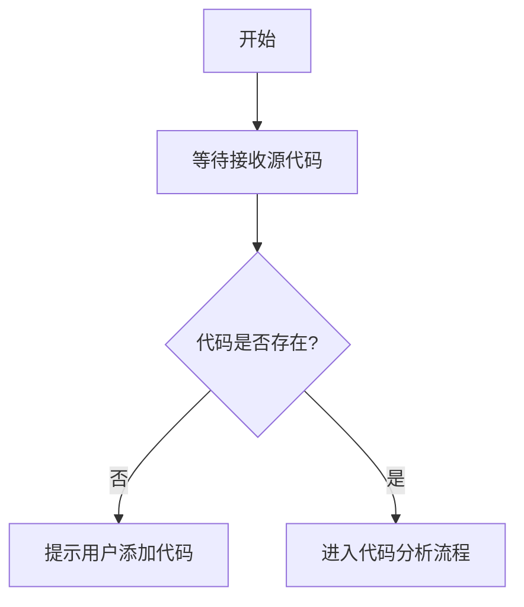

# `diffusers\tests\pipelines\consisid\__init__.py` 详细设计文档

未提供源代码，无法进行分析。请提供需要分析的代码文件。

## 整体流程



## 类结构

```

```

## 全局变量及字段


    

## 全局函数及方法


## 关键组件


## 问题及建议


### 已知问题

-   未提供代码：代码部分为空，无法进行技术债务分析

### 优化建议

-   请提供需要分析的源代码，以便进行详细的技术债务和优化空间分析


## 其它


### 设计目标与约束
- **设计目标**：明确系统或模块需要实现的核心业务功能、性能指标和品质要求（如响应时间、吞吐量、可用性）。  
- **约束条件**：列出技术约束（支持的运行平台、编程语言版本、依赖库版本）、业务约束（预算、交付时间）以及法规合规要求（数据隐私、行业标准）。

### 错误处理与异常设计
- **异常分类**：定义系统可能抛出的异常类型（如业务异常、系统异常、网络异常），并为每类异常分配唯一错误码。  
- **传播机制**：说明异常的捕获、向上抛出的层级以及统一处理的入口（如全局异常处理器）。  
- **日志与告警**：规定异常日志的记录级别、格式、堆栈信息保留策略以及触发告警的条件。  
- **降级策略**：描述在发生关键异常时的业务降级方案或回滚机制。

### 数据流与状态机
- **数据流概述**：使用流程图描述数据从输入到输出的完整流转路径，包括各处理阶段的输入、输出以及数据格式。  
- **状态机模型**：若模块涉及状态转换（如订单、任务、工作流），给出状态机图（mermaid 示例）并说明每个状态的含义及合法转移条件。  
- **关键节点**：标注数据流中的关键节点（如校验、计算、持久化）及其对应的业务规则。

### 外部依赖与接口契约
- **依赖清单**：列出所有外部依赖（第三方库、服务、SDK），注明版本号、许可证及获取方式。  
- **接口定义**：详细描述对外提供的 API 或事件接口，包括请求/响应结构、参数说明、返回值类型、错误码以及调用示例。  
- **版本兼容性**：说明接口的演进策略（向后兼容/重大变更）以及版本协商机制。  

### 安全性考虑
- **身份认证与授权**：阐述使用的认证机制（如 JWT、OAuth）和授权模型（角色、权限）。  
- **数据加密**：规定敏感数据在传输（HTTPS、TLS）和存储（对称/非对称加密）中的加密方案。  
- **输入校验**：定义统一的输入校验规则，防止注入、跨站脚本等安全漏洞。  
- **审计日志**：记录关键操作的审计日志，满足合规和溯源需求。

### 性能与可伸缩性
- **性能指标**：明确关键性能指标（RT、QPS、CPU/内存使用率）及其目标值。  
- **瓶颈分析**：识别可能的性能瓶颈（如数据库查询、外部服务调用）并提供优化思路（缓存、批处理、异步）。  
- **扩展策略**：说明水平/垂直扩展的方案、负载均衡以及弹性伸缩的触发条件。

### 部署与运维
- **部署平台**：指定部署目标（云容器、物理机、Serverless）及对应环境。  
- **容器化**：提供 Dockerfile、docker‑compose 或 Kubernetes Deployment 配置。  
- **监控与告警**：定义关键监控指标（CPU、内存、请求错误率）、采集方式及告警阈值。  
- **运维流程**：描述启动、停止、滚动升级、回滚的标准化流程。

### 测试策略
- **单元测试**：覆盖率目标、测试框架（JUnit、pytest）以及关键单元的测试用例示例。  
- **集成测试**：服务间调用、数据库交互的集成测试方案及测试数据管理。  
- **系统测试**：端到端业务场景、性能/压力测试和安全渗透测试计划。  
- **自动化**：CI/CD 流水线中的自动化测试环节、测试报告生成与质量门槛。

### 可维护性与可扩展性
- **代码组织**：说明模块划分、包结构以及遵循的编码规范。  
- **插件/扩展点**：列出预留的扩展接口或插件机制，便于后续功能增加。  
- **技术债务**：标注已知的技术债务（如硬编码、重复逻辑）以及整改计划。  

### 监控与日志
- **日志规范**：统一日志级别、格式（JSON）、输出目标（文件、ELK、Stdout）以及保留周期。  
- **关键指标**：定义业务关键指标（如订单成功率、响应延迟）并配置相应的监控仪表盘。  
- **告警策略**：设定告警阈值、通知渠道（邮件、短信、钉钉）以及升级路径。  

### 配置管理
- **配置文件结构**：说明配置文件层次（环境、模块、局部）以及加载顺序。  
- **敏感信息**：对密钥、密码等敏感信息使用加密或外部密钥管理服务（KMS、Vault）。  
- **动态配置**：支持运行时配置变更（热更新）的方式与限制。

### 版本控制与变更管理
- **分支策略**：规定 Git Flow、Trunk Based Development 等分支模型及合并规则。  
- **发布流程**：定义版本号命名规则、变更日志（Changelog）编写要求以及发布审批流程。  
- **回滚方案**：说明在发布后发现严重问题时的快速回滚步骤及验证方式。

### 国际化与本地化
- **多语言支持**：描述资源文件（i18n）的组织方式、支持的语言列表以及切换机制。  
- **字符编码**：统一使用 UTF-8，避免因编码导致的乱码或安全漏洞。  
- **地区化**：针对日期、时间、货币等地区化数据进行格式转换与展示。

### 许可证与合规
- **开源组件**：列出所有开源依赖及其对应的许可证，确保兼容性和合规性。  
- **合规检查**：说明代码审计、第三方组件安全扫描以及合规报告的生成流程。  
- **法律风险**：标注可能涉及的法律风险（如专利、出口管制）并给出对应的规避措施。

    