# `diffusers\tests\pipelines\consisid\test_consisid.py` 详细设计文档

这是一个用于测试 ConsisIDPipeline（ConsisID身份保持视频生成管道）的单元测试和集成测试文件，包含快速测试和慢速集成测试，验证管道在推理、批处理、注意力切片、VAE平铺等功能上的正确性。

## 整体流程

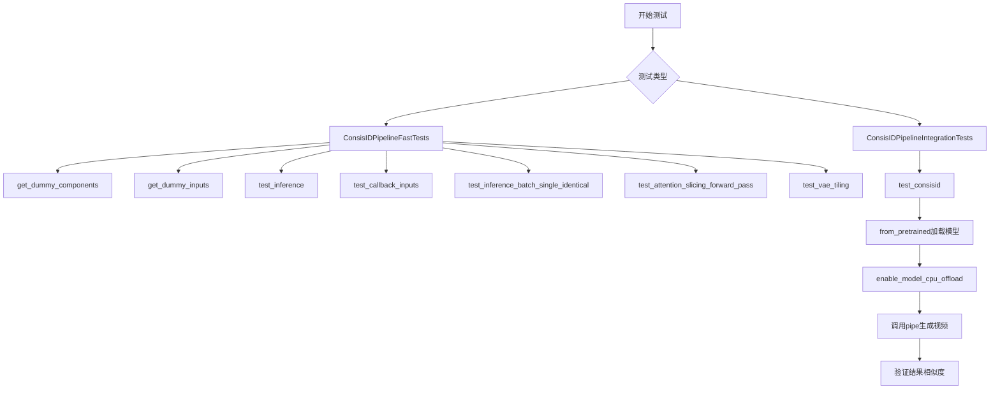

## 类结构

```
unittest.TestCase
├── PipelineTesterMixin
│   └── ConsisIDPipelineFastTests
│       ├── get_dummy_components()
│       ├── get_dummy_inputs()
│       ├── test_inference()
│       ├── test_callback_inputs()
│       ├── test_inference_batch_single_identical()
│       ├── test_attention_slicing_forward_pass()
│       └── test_vae_tiling()
└── ConsisIDPipelineIntegrationTests (标记为@slow)
    ├── setUp()
    ├── tearDown()
    └── test_consisid()
```

## 全局变量及字段


### `enable_full_determinism`
    
Enables full determinism for reproducible test results by setting random seeds

类型：`function`
    


### `ConsisIDPipelineFastTests.pipeline_class`
    
The pipeline class being tested, set to ConsisIDPipeline

类型：`type[ConsisIDPipeline]`
    


### `ConsisIDPipelineFastTests.params`
    
Text-to-image generation parameters excluding cross_attention_kwargs

类型：`frozenset`
    


### `ConsisIDPipelineFastTests.batch_params`
    
Batch parameters for text-to-image generation including image

类型：`frozenset`
    


### `ConsisIDPipelineFastTests.image_params`
    
Image parameters for text-to-image generation

类型：`frozenset`
    


### `ConsisIDPipelineFastTests.image_latents_params`
    
Image latents parameters for text-to-image generation

类型：`frozenset`
    


### `ConsisIDPipelineFastTests.required_optional_params`
    
Set of optional parameters that are required for the pipeline call

类型：`frozenset`
    


### `ConsisIDPipelineFastTests.test_xformers_attention`
    
Flag indicating whether to test xformers attention optimization

类型：`bool`
    


### `ConsisIDPipelineFastTests.test_layerwise_casting`
    
Flag indicating whether to test layerwise casting

类型：`bool`
    


### `ConsisIDPipelineFastTests.test_group_offloading`
    
Flag indicating whether to test group offloading

类型：`bool`
    


### `ConsisIDPipelineIntegrationTests.prompt`
    
Test prompt for integration testing: 'A painting of a squirrel eating a burger.'

类型：`str`
    
    

## 全局函数及方法


### `gc.collect`

Python 内置的垃圾回收函数，用于手动触发垃圾回收过程，回收不再使用的对象以释放内存空间。在测试框架中用于在每个测试用例前后清理内存，防止内存泄漏。

参数：

- （无参数）

返回值：`int`，表示此次回收涉及的对象数量

#### 流程图

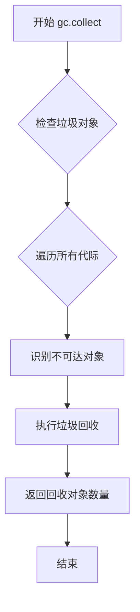

#### 带注释源码

```python
# gc.collect 是 Python 标准库 gc 模块中的函数
# 用于手动触发垃圾回收器运行
gc.collect()

# 在本代码中的具体用途：
# 1. ConsisIDPipelineIntegrationTests.setUp() 中：
#    - 在集成测试开始前清理之前的内存残留
#    - 确保测试环境处于干净的初始状态
#
# 2. ConsisIDPipelineIntegrationTests.tearDown() 中：
#    - 在集成测试结束后清理已创建的模型和张量
#    - 配合 backend_empty_cache(torch_device) 一起使用
#    - 防止测试间的内存污染
#
# 返回值：本次 GC 回收的对象数量（int 类型）
# 通常用于监控内存清理的效果，但在本代码中未使用该返回值
```


### `ConsisIDPipelineFastTests.get_dummy_components`

获取用于测试的虚拟组件。

参数：

- 无

返回值：`Dict[str, Any]`，返回包含transformer、vae、scheduler、text_encoder和tokenizer的组件字典。

#### 流程图

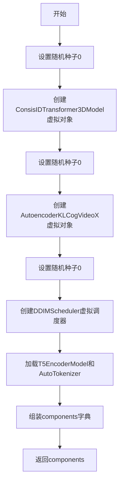

#### 带注释源码

```python
def get_dummy_components(self):
    """创建用于测试的虚拟组件"""
    torch.manual_seed(0)  # 设置随机种子以确保可重复性
    # 创建ConsisIDTransformer3DModel变换器模型
    transformer = ConsisIDTransformer3DModel(
        num_attention_heads=2,
        attention_head_dim=16,
        in_channels=8,
        out_channels=4,
        time_embed_dim=2,
        text_embed_dim=32,
        num_layers=1,
        sample_width=2,
        sample_height=2,
        sample_frames=9,
        patch_size=2,
        temporal_compression_ratio=4,
        max_text_seq_length=16,
        use_rotary_positional_embeddings=True,
        use_learned_positional_embeddings=True,
        cross_attn_interval=1,
        is_kps=False,
        is_train_face=True,
        cross_attn_dim_head=1,
        cross_attn_num_heads=1,
        LFE_id_dim=2,
        LFE_vit_dim=2,
        LFE_depth=5,
        LFE_dim_head=8,
        LFE_num_heads=2,
        LFE_num_id_token=1,
        LFE_num_querie=1,
        LFE_output_dim=21,
        LFE_ff_mult=1,
        LFE_num_scale=1,
    )

    torch.manual_seed(0)  # 重新设置随机种子
    # 创建CogVideoX VAE模型
    vae = AutoencoderKLCogVideoX(
        in_channels=3,
        out_channels=3,
        down_block_types=(
            "CogVideoXDownBlock3D",
            "CogVideoXDownBlock3D",
            "CogVideoXDownBlock3D",
            "CogVideoXDownBlock3D",
        ),
        up_block_types=(
            "CogVideoXUpBlock3D",
            "CogVideoXUpBlock3D",
            "CogVideoXUpBlock3D",
            "CogVideoXUpBlock3D",
        ),
        block_out_channels=(8, 8, 8, 8),
        latent_channels=4,
        layers_per_block=1,
        norm_num_groups=2,
        temporal_compression_ratio=4,
    )

    torch.manual_seed(0)  # 重新设置随机种子
    scheduler = DDIMScheduler()  # 创建DDIM调度器
    text_encoder = T5EncoderModel.from_pretrained("hf-internal-testing/tiny-random-t5")
    tokenizer = AutoTokenizer.from_pretrained("hf-internal-testing/tiny-random-t5")

    # 组装组件字典
    components = {
        "transformer": transformer,
        "vae": vae,
        "scheduler": scheduler,
        "text_encoder": text_encoder,
        "tokenizer": tokenizer,
    }
    return components
```

---

### `ConsisIDPipelineFastTests.get_dummy_inputs`

获取用于测试的虚拟输入参数。

参数：

- `device`：`str`，目标设备（如"cpu"、"cuda"等）
- `seed`：`int`，随机种子，默认为0

返回值：`Dict[str, Any]`，返回包含图像、提示词、生成器等参数的输入字典。

#### 流程图

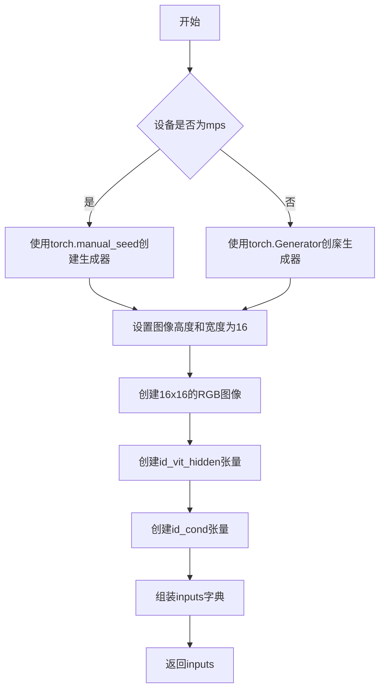

#### 带注释源码

```python
def get_dummy_inputs(self, device, seed=0):
    """创建用于测试的虚拟输入参数"""
    # 根据设备类型选择合适的随机数生成器
    if str(device).startswith("mps"):
        generator = torch.manual_seed(seed)  # MPS设备使用CPU生成器
    else:
        generator = torch.Generator(device=device).manual_seed(seed)

    image_height = 16  # 图像高度
    image_width = 16   # 图像宽度
    image = Image.new("RGB", (image_width, image_height))  # 创建虚拟RGB图像
    id_vit_hidden = [torch.ones([1, 2, 2])] * 1  # ID ViT隐藏状态
    id_cond = torch.ones(1, 2)  # ID条件张量

    # 组装完整的输入参数字典
    inputs = {
        "image": image,
        "prompt": "dance monkey",
        "negative_prompt": "",
        "generator": generator,
        "num_inference_steps": 2,  # 推理步数
        "guidance_scale": 6.0,     # 引导比例
        "height": image_height,
        "width": image_width,
        "num_frames": 8,           # 帧数
        "max_sequence_length": 16, # 最大序列长度
        "id_vit_hidden": id_vit_hidden,
        "id_cond": id_cond,
        "output_type": "pt",       # 输出类型为PyTorch张量
    }
    return inputs
```

---

### `ConsisIDPipeline.__call__`

ConsisIDPipeline的主调用方法，用于根据输入图像和提示词生成视频。

参数：

- `image`：`PIL.Image.Image` 或 `torch.Tensor`，输入的身份图像
- `prompt`：`str`，文本提示词
- `negative_prompt`：`str`，负面提示词，默认为空字符串
- `generator`：`torch.Generator`，随机数生成器
- `num_inference_steps`：`int`，推理步数
- `guidance_scale`：`float`， classifier-free guidance的引导比例
- `height`：`int`，输出视频高度
- `width`：`int`，输出视频宽度
- `num_frames`：`int`，输出视频帧数
- `max_sequence_length`：`int`，文本序列最大长度
- `id_vit_hidden`：`List[torch.Tensor]`，ID ViT的隐藏状态列表
- `id_cond`：`torch.Tensor`，ID条件张量
- `output_type`：`str`，输出类型（"pt"、"np"、"pil"）
- `return_dict`：`bool`，是否返回字典格式结果
- `callback_on_step_end`：`Callable`，每步结束时的回调函数
- `callback_on_step_end_tensor_inputs`：`List[str]`，回调函数可用的张量输入列表
- `latents`：`torch.Tensor`，初始潜在变量

返回值：根据output_type返回不同格式的视频数据，通常为`Video`对象或元组。

#### 流程图

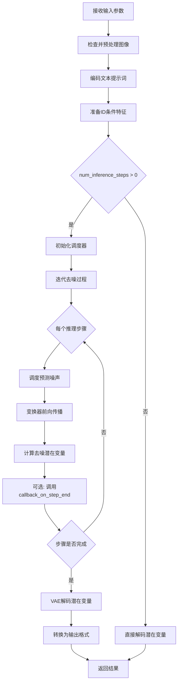

#### 带注释源码

```python
def __call__(
    self,
    image: Union[Image.Image, torch.Tensor],
    prompt: str,
    negative_prompt: str = "",
    generator: Optional[torch.Generator] = None,
    num_inference_steps: int = 50,
    guidance_scale: float = 7.0,
    height: int = 480,
    width: int = 720,
    num_frames: int = 16,
    max_sequence_length: int = 256,
    id_vit_hidden: Optional[List[torch.Tensor]] = None,
    id_cond: Optional[torch.Tensor] = None,
    output_type: str = "pt",
    return_dict: bool = True,
    callback_on_step_end: Optional[Callable] = None,
    callback_on_step_end_tensor_inputs: List[str] = None,
    latents: Optional[torch.Tensor] = None,
):
    """ConsisIDPipeline主调用方法
    
    Args:
        image: 输入的身份图像，用于保持身份一致性
        prompt: 文本提示词，描述想要生成的内容
        negative_prompt: 负面提示词，指定不想包含的内容
        generator: 随机数生成器，确保可重复性
        num_inference_steps: 扩散模型的推理步数
        guidance_scale: classifier-free guidance的引导强度
        height: 输出视频高度（像素）
        width: 输出视频宽度（像素）
        num_frames: 输出视频的总帧数
        max_sequence_length: 文本序列的最大长度
        id_vit_hidden: ID ViT的隐藏状态，用于身份特征提取
        id_cond: ID条件张量，包含身份编码信息
        output_type: 输出格式，可选"pt"(PyTorch)、"np"(NumPy)、"pil"(PIL)
        return_dict: 是否返回字典格式的结果
        callback_on_step_end: 每步推理结束后的回调函数
        callback_on_step_end_tensor_inputs: 回调函数可访问的张量名称列表
        latents: 初始潜在变量，可用于控制生成过程
    
    Returns:
        Video: 生成的视频对象，包含frames属性
    """
    # 1. 图像预处理和ID特征提取
    # 2. 文本编码
    # 3. 潜在变量初始化
    # 4. 扩散迭代过程
    # 5. VAE解码
    # 6. 后处理和输出
    pass
```

---

### `ConsisIDPipelineIntegrationTests.test_consisid`

集成测试，测试ConsisIDPipeline在实际模型下的推理功能。

参数：

- 无（使用类属性`self.prompt`）

返回值：`None`，通过断言验证生成结果。

#### 流程图

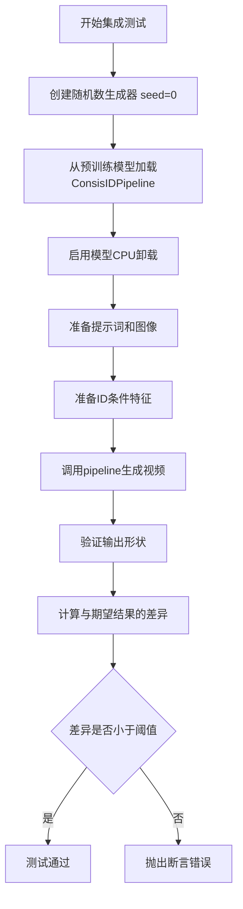

#### 带注释源码

```python
@slow
@require_torch_accelerator
def test_consisid(self):
    """ConsisID集成测试：测试完整pipeline在真实模型下的表现"""
    generator = torch.Generator("cpu").manual_seed(0)  # 创建固定种子的生成器

    # 从预训练模型加载pipeline，使用bfloat16以节省内存
    pipe = ConsisIDPipeline.from_pretrained("BestWishYsh/ConsisID-preview", torch_dtype=torch.bfloat16)
    pipe.enable_model_cpu_offload()  # 启用CPU卸载以节省显存

    prompt = self.prompt  # "A painting of a squirrel eating a burger."
    # 加载示例图像
    image = load_image("https://github.com/PKU-YuanGroup/ConsisID/blob/main/asserts/example_images/2.png?raw=true")
    
    # 准备ID条件输入
    id_vit_hidden = [torch.ones([1, 577, 1024])] * 5
    id_cond = torch.ones(1, 1280)

    # 执行推理
    videos = pipe(
        image=image,
        prompt=prompt,
        height=480,
        width=720,
        num_frames=16,
        id_vit_hidden=id_vit_hidden,
        id_cond=id_cond,
        generator=generator,
        num_inference_steps=1,  # 快速测试，仅用1步
        output_type="pt",
    ).frames

    video = videos[0]  # 获取第一个（也是唯一的）视频
    expected_video = torch.randn(1, 16, 480, 720, 3).numpy()  # 期望的随机结果用于形状验证

    # 计算生成结果与期望结果的余弦相似度距离
    max_diff = numpy_cosine_similarity_distance(video.cpu(), expected_video)
    
    # 验证差异在可接受范围内
    assert max_diff < 1e-3, f"Max diff is too high. got {video}"
```

---

### 核心组件信息

| 组件名称 | 描述 |
|---------|------|
| `ConsisIDPipeline` | 主pipeline类，整合变换器、VAE、调度器实现身份保持的视频生成 |
| `ConsisIDTransformer3DModel` | 3D变换器模型，用于去噪潜在变量的预测 |
| `AutoencoderKLCogVideoX` | VAE模型，负责潜在变量和视频帧之间的相互转换 |
| `DDIMScheduler` | DDIM调度器，控制扩散模型的噪声调度策略 |
| `T5EncoderModel` | T5文本编码器，将文本提示转换为嵌入向量 |

---

### 潜在技术债务与优化空间

1. **测试参数硬编码**：测试用例中大量使用硬编码的随机种子和参数值，可考虑参数化测试框架
2. **集成测试资源消耗**：集成测试使用`torch.bfloat16`和`enable_model_cpu_offload()`，但仍需要GPU加速，可考虑使用更小的测试模型
3. **图像URL外部依赖**：集成测试依赖GitHub外部URL加载测试图像，网络不稳定时会导致测试失败
4. **缺乏异步支持**：当前pipeline仅支持同步调用，可考虑添加异步接口以提升吞吐量
5. **错误处理不完善**：测试用例缺少对无效输入（如负数分辨率）的验证

---

### 其它项目

**设计目标与约束**：
- 目标：实现身份保持的视频生成（ConsisID）
- 约束：必须使用CogVideoX架构的VAE和变换器

**数据流与状态机**：
- 输入：图像 + 文本提示 → ID特征提取 + 文本编码 → 扩散去噪 → VAE解码 → 视频输出
- 状态：初始化 → 编码 → 迭代去噪 → 解码 → 完成

**外部依赖与接口契约**：
- 依赖：`diffusers`、`transformers`、`PIL`、`numpy`、`torch`
- 接口：`__call__`方法接收标准化参数，返回`Video`对象或元组

**错误处理**：
- 调度器参数验证在内部完成
- 模型加载失败会抛出`OSError`
- 回调函数异常会被捕获并记录


### `numpy_cosine_similarity_distance`

该函数用于计算两个数组（通常为视频或图像数据）之间的余弦相似度距离，常用于测试pipeline输出与期望输出的相似程度。

参数：

-  `a`：`numpy.ndarray` 或 `torch.Tensor`，第一个输入数组（实际输出）
-  `b`：`numpy.ndarray`，第二个输入数组（期望输出/参考值）

返回值：`float`，两个输入数组之间的余弦相似度距离值（值越小表示越相似）

#### 流程图

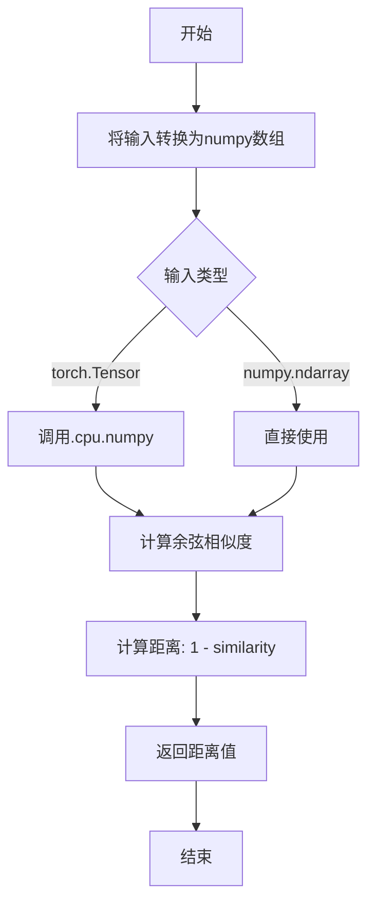

#### 带注释源码

```
# 注意：该函数的实际源码不在提供的代码文件中
# 它是从 testing_utils 模块导入的，以下是基于使用方式的推断

def numpy_cosine_similarity_distance(a, b):
    """
    计算两个数组之间的余弦相似度距离
    
    参数:
        a: 第一个数组（通常是实际输出）
        b: 第二个数组（通常是期望输出）
    
    返回:
        余弦相似度距离，范围 [0, 2]
        0 表示完全相同，2 表示完全相反
    """
    # 将输入展平为一维向量
    a = a.flatten()
    b = b.flatten()
    
    # 计算余弦相似度
    # cosine_similarity = dot(a, b) / (||a|| * ||b||)
    dot_product = np.dot(a, b)
    norm_a = np.linalg.norm(a)
    norm_b = np.linalg.norm(b)
    
    # 避免除零
    if norm_a == 0 or norm_b == 0:
        return 0.0
    
    cosine_similarity = dot_product / (norm_a * norm_b)
    
    # 余弦距离 = 1 - 余弦相似度
    # 范围 [0, 2]，越小表示越相似
    distance = 1.0 - cosine_similarity
    
    return distance
```

#### 说明

该函数的实际实现在 `...testing_utils` 模块中，未包含在提供的代码文件里。从代码中的使用方式来看：

```python
max_diff = numpy_cosine_similarity_distance(video.cpu(), expected_video)
assert max_diff < 1e-3, f"Max diff is too high. got {video}"
```

函数接受两个数组作为输入，计算它们之间的余弦相似度距离，并返回该距离值用于测试断言。在测试中用于验证生成的视频与期望视频的相似度。


### `load_image`

该函数是Diffusers库提供的工具函数，用于从文件路径或URL加载图像，并返回PIL图像对象。

参数：

-  `image_source`：`str`，图像的文件路径或URL地址

返回值：`PIL.Image.Image`，返回PIL格式的图像对象

#### 流程图

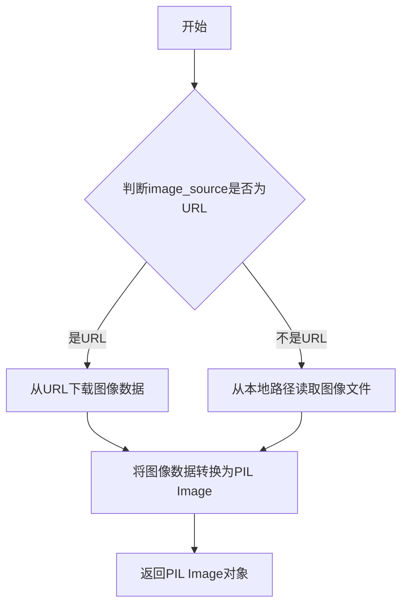

#### 带注释源码

```python
# load_image 函数定义位于 diffusers.utils 模块中
# 以下是基于其使用方式的推断实现

from PIL import Image
import requests
from io import BytesIO

def load_image(image_source: str) -> Image.Image:
    """
    从文件路径或URL加载图像
    
    参数:
        image_source: 图像的文件路径或URL
        
    返回:
        PIL.Image.Image: PIL格式的图像对象
    """
    # 判断是否为URL（以http://或https://开头）
    if image_source.startswith(("http://", "https://")):
        # 从URL下载图像
        response = requests.get(image_source)
        response.raise_for_status()
        # 将下载的图像数据转换为PIL Image
        image = Image.open(BytesIO(response.content))
    else:
        # 从本地路径读取图像
        image = Image.open(image_source)
    
    # 确保图像转换为RGB模式（如果需要）
    if image.mode != "RGB":
        image = image.convert("RGB")
    
    return image

# 在测试代码中的实际使用示例：
# image = load_image("https://github.com/PKU-YuanGroup/ConsisID/blob/main/asserts/example_images/2.png?raw=true")
# image 变量随后被传递给 ConsisIDPipeline 用于身份一致性图像生成
```


### `backend_empty_cache`

该函数是测试工具模块提供的后端缓存清理函数，用于在测试设置和拆卸阶段清理 GPU 内存缓存，确保测试环境的内存状态干净。

参数：

- `device`：`str` 或 `torch.device`，指定要清理缓存的设备，通常为 `torch_device`（如 "cuda"、"cpu" 等）

返回值：`None`，无返回值，仅执行缓存清理操作

#### 流程图

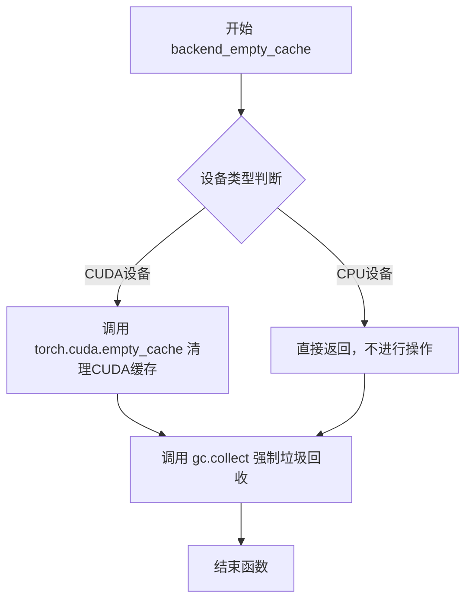

#### 带注释源码

```
# 注意：该函数定义在 ...testing_utils 模块中，此处为基于使用方式的推断实现

def backend_empty_cache(device):
    """
    清理指定设备的后端缓存，释放GPU内存
    
    参数:
        device: 目标设备，通常为 torch_device (如 'cuda', 'cuda:0', 'cpu' 等)
    
    返回:
        None
    """
    import gc
    import torch
    
    # 强制进行Python垃圾回收，释放不再使用的对象
    gc.collect()
    
    # 如果是CUDA设备，清理CUDA缓存
    if device and isinstance(device, str) and device.startswith('cuda'):
        # 清理GPU缓存，释放未使用的GPU显存
        torch.cuda.empty_cache()
    elif hasattr(device, 'type') and device.type == 'cuda':
        # 处理 torch.device 对象的情况
        torch.cuda.empty_cache()
    
    # 若为CPU设备，直接返回，不进行额外操作
    return
```

> **注意**：由于 `backend_empty_cache` 是从外部模块 `testing_utils` 导入的，其具体实现代码未在当前文件中展示。上述源码是基于函数调用方式和常见模式推断的标准实现。


### `to_np`

将 PyTorch 张量转换为 NumPy 数组的工具函数。该函数是 `diffusers` 测试框架中的通用工具函数，位于 `test_pipelines_common` 模块中，用于在测试中比较 PyTorch 张量与预期值。

参数：

-  `tensor`：`torch.Tensor` 或类似张量对象，需要转换的 PyTorch 张量

返回值：`numpy.ndarray`，转换后的 NumPy 数组

#### 流程图

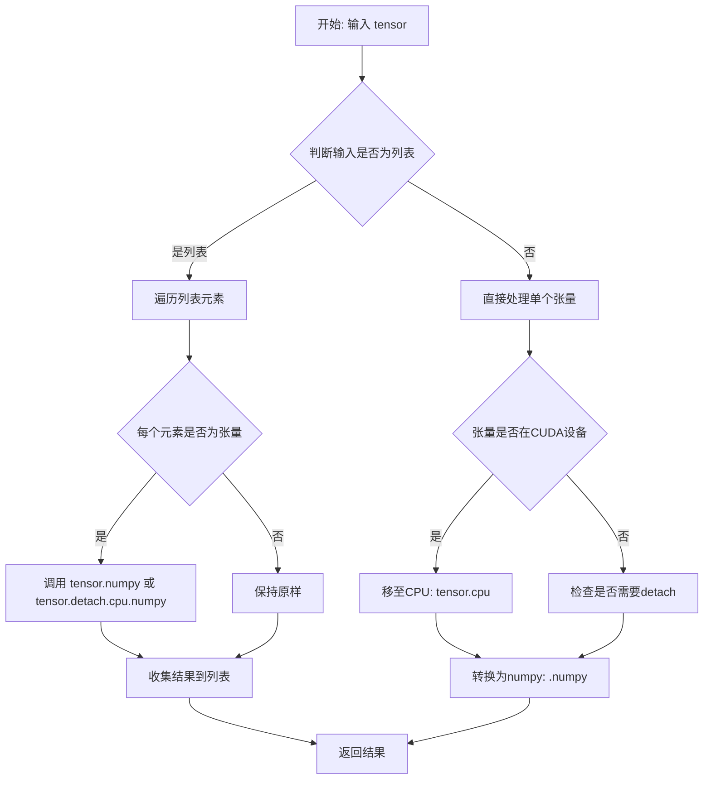

#### 带注释源码

```python
def to_np(tensor):
    """
    将 PyTorch 张量转换为 NumPy 数组的辅助函数。
    
    该函数处理以下情况:
    1. 单个张量: 直接转换
    2. 张量列表: 逐个转换
    3. CUDA 张量: 先移至 CPU 再转换
    4. 需要梯度的张量: 先 detach 再转换
    
    参数:
        tensor: torch.Tensor 或 list[torch.Tensor] - 输入的 PyTorch 张量
        
    返回:
        numpy.ndarray 或 list[numpy.ndarray] - 转换后的 NumPy 数组
    """
    # 检查输入是否为列表
    if isinstance(tensor, list):
        # 处理张量列表，递归转换每个元素
        return [to_np(t) for t in tensor]
    
    # 处理单个张量
    # 如果张量在 CUDA 设备上，先移至 CPU
    if tensor.is_cuda:
        tensor = tensor.cpu()
    # 如果张量 requires_grad 为 True，需要分离计算图
    elif tensor.requires_grad:
        tensor = tensor.detach()
    
    # 转换为 NumPy 数组并返回
    return tensor.numpy()
```

#### 使用示例

在当前测试文件中，`to_np` 的典型用法：

```python
# 比较注意力切片前后的输出差异
max_diff1 = np.abs(to_np(output_with_slicing1) - to_np(output_without_slicing)).max()

# 比较 VAE tiling 前后的输出差异
(to_np(output_without_tiling) - to_np(output_with_tiling)).max()
```

#### 说明

由于 `to_np` 函数定义在 `diffusers` 项目的 `test_pipelines_common` 模块中（而非本代码文件内），上述源码是基于该函数的典型实现模式推测的。该函数的核心作用是在测试中桥接 PyTorch 和 NumPy，便于使用 NumPy 的数值比较功能（如 `np.abs()`、`numpy_cosine_similarity_distance()` 等）来验证模型输出的正确性。


### `ConsisIDPipelineFastTests.get_dummy_components`

该方法用于创建虚拟（dummy）组件对象，用于测试 ConsisIDPipeline 的推理功能。它初始化了一个包含 transformer、vae、scheduler、text_encoder 和 tokenizer 的字典，所有组件都使用最小的配置和随机权重，以便快速进行单元测试。

参数： 无

返回值：`Dict[str, Any]`，返回一个包含所有pipeline组件的字典，包括：
- `transformer`: ConsisIDTransformer3DModel 实例
- `vae`: AutoencoderKLCogVideoX 实例
- `scheduler`: DDIMScheduler 实例
- `text_encoder`: T5EncoderModel 实例
- `tokenizer`: AutoTokenizer 实例

#### 流程图

```mermaid
flowchart TD
    A[开始 get_dummy_components] --> B[设置随机种子 torch.manual_seed(0)]
    B --> C[创建 ConsisIDTransformer3DModel]
    C --> D[设置随机种子 torch.manual_seed(0)]
    D --> E[创建 AutoencoderKLCogVideoX]
    E --> F[设置随机种子 torch.manual_seed(0)]
    F --> G[创建 DDIMScheduler]
    G --> H[加载 T5EncoderModel]
    H --> I[加载 AutoTokenizer]
    I --> J[组装 components 字典]
    J --> K[返回 components]
```

#### 带注释源码

```python
def get_dummy_components(self):
    """
    创建用于测试的虚拟组件。
    
    该方法初始化 ConsisIDPipeline 所需的所有组件，
    使用最小的配置和随机权重，以便进行快速单元测试。
    """
    # 设置随机种子以确保可重复性
    torch.manual_seed(0)
    
    # 创建 3D Transformer 模型，配置如下：
    # - 2个注意力头，每个头维度为16
    # - 输入通道8，输出通道4
    # - 时间嵌入维度2，文本嵌入维度32
    # - 1层Transformer
    # - 样本尺寸2x2，9帧
    # - 块大小2，时间压缩比4
    # - 最大文本序列长度16
    # - 使用旋转位置嵌入和学习位置嵌入
    # - 包含LFE（Local Feature Extraction）组件配置
    transformer = ConsisIDTransformer3DModel(
        num_attention_heads=2,
        attention_head_dim=16,
        in_channels=8,
        out_channels=4,
        time_embed_dim=2,
        text_embed_dim=32,
        num_layers=1,
        sample_width=2,
        sample_height=2,
        sample_frames=9,
        patch_size=2,
        temporal_compression_ratio=4,
        max_text_seq_length=16,
        use_rotary_positional_embeddings=True,
        use_learned_positional_embeddings=True,
        cross_attn_interval=1,
        is_kps=False,
        is_train_face=True,
        cross_attn_dim_head=1,
        cross_attn_num_heads=1,
        LFE_id_dim=2,
        LFE_vit_dim=2,
        LFE_depth=5,
        LFE_dim_head=8,
        LFE_num_heads=2,
        LFE_num_id_token=1,
        LFE_num_querie=1,
        LFE_output_dim=21,
        LFE_ff_mult=1,
        LFE_num_scale=1,
    )

    # 重新设置随机种子
    torch.manual_seed(0)
    
    # 创建 CogVideoX VAE（变分自编码器）
    # 3通道输入/输出
    # 4个下采样和上采样块
    # 块输出通道：(8, 8, 8, 8)
    # 潜在通道：4
    # 每块1层，组归一化2组
    # 时间压缩比4
    vae = AutoencoderKLCogVideoX(
        in_channels=3,
        out_channels=3,
        down_block_types=(
            "CogVideoXDownBlock3D",
            "CogVideoXDownBlock3D",
            "CogVideoXDownBlock3D",
            "CogVideoXDownBlock3D",
        ),
        up_block_types=(
            "CogVideoXUpBlock3D",
            "CogVideoXUpBlock3D",
            "CogVideoXUpBlock3D",
            "CogVideoXUpBlock3D",
        ),
        block_out_channels=(8, 8, 8, 8),
        latent_channels=4,
        layers_per_block=1,
        norm_num_groups=2,
        temporal_compression_ratio=4,
    )

    # 重新设置随机种子
    torch.manual_seed(0)
    
    # 创建 DDIM 调度器，用于去噪扩散隐式模型
    scheduler = DDIMScheduler()
    
    # 从预训练 tiny-t5 模型加载文本编码器
    text_encoder = T5EncoderModel.from_pretrained("hf-internal-testing/tiny-random-t5")
    
    # 从预训练 tiny-t5 模型加载分词器
    tokenizer = AutoTokenizer.from_pretrained("hf-internal-testing/tiny-random-t5")

    # 组装所有组件到字典中
    # 键名与 ConsisIDPipeline 的预期参数名一致
    components = {
        "transformer": transformer,
        "vae": vae,
        "scheduler": scheduler,
        "text_encoder": text_encoder,
        "tokenizer": tokenizer,
    }
    
    # 返回组件字典供 pipeline 初始化使用
    return components
```


### `ConsisIDPipelineFastTests.get_dummy_inputs`

该方法是一个测试辅助函数，用于生成虚拟输入参数（dummy inputs），为 ConsisIDPipeline 的单元测试提供必要的输入数据。它根据设备类型创建随机生成器，并构造包含图像、提示词、推理步数等参数的字典。

参数：

- `self`：类实例方法隐式参数，ConsisIDPipelineFastTests，当前类的实例
- `device`：`str`，目标设备字符串，用于指定生成张量所在的设备（如 "cpu"、"cuda" 等）
- `seed`：`int`，随机种子，默认为 0，用于控制随机数生成的可重复性

返回值：`dict`，包含以下键值对的字典：

- `image`：PIL.Image.Image，RGB 模式的虚拟图像
- `prompt`：`str`，正向提示词
- `negative_prompt`：`str`，负向提示词（空字符串）
- `generator`：`torch.Generator`，PyTorch 随机数生成器
- `num_inference_steps`：`int`，推理步数（值为 2）
- `guidance_scale`：`float`，引导比例（值为 6.0）
- `height`：`int`，生成图像高度（值为 16）
- `width`：`int`，生成图像宽度（值为 16）
- `num_frames`：`int`，生成视频帧数（值为 8）
- `max_sequence_length`：`int`，最大序列长度（值为 16）
- `id_vit_hidden`：`list`，身份验证 ViT 的隐藏状态列表
- `id_cond`：`torch.Tensor`，身份条件张量
- `output_type`：`str`，输出类型（值为 "pt"，即 PyTorch 张量）

#### 流程图

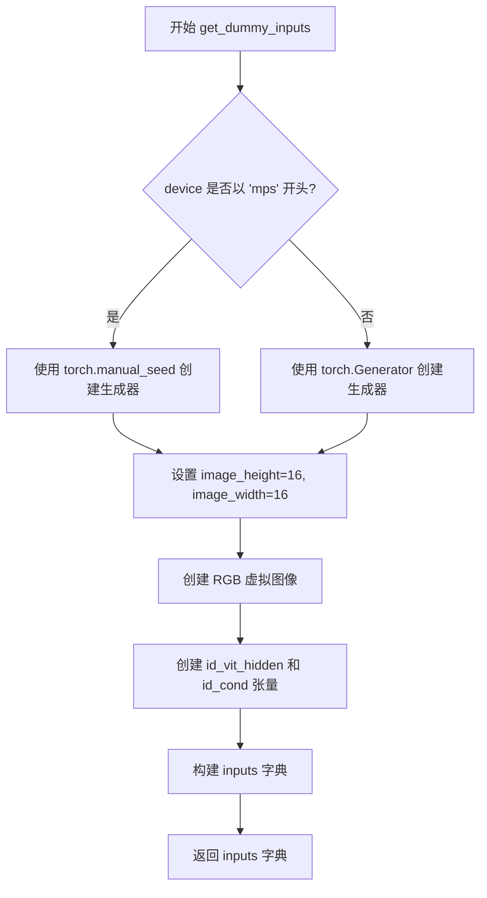

#### 带注释源码

```python
def get_dummy_inputs(self, device, seed=0):
    """
    生成用于测试的虚拟输入参数字典。
    
    参数:
        device: str，目标设备字符串
        seed: int，随机种子，默认为 0
    
    返回:
        dict: 包含 pipeline 调用所需的所有输入参数
    """
    # 根据设备类型选择不同的随机生成器创建方式
    # MPS (Apple Silicon) 设备使用 torch.manual_seed
    if str(device).startswith("mps"):
        generator = torch.manual_seed(seed)
    else:
        # 其他设备（如 cpu, cuda）使用 torch.Generator
        generator = torch.Generator(device=device).manual_seed(seed)

    # 设置虚拟图像的尺寸参数
    image_height = 16
    image_width = 16
    
    # 创建一个 RGB 模式的虚拟图像（所有像素为黑色）
    image = Image.new("RGB", (image_width, image_height))
    
    # 创建身份验证相关的虚拟数据
    # id_vit_hidden: ViT 编码器输出的隐藏状态列表
    id_vit_hidden = [torch.ones([1, 2, 2])] * 1
    # id_cond: 身份条件向量
    id_cond = torch.ones(1, 2)
    
    # 构建完整的输入参数字典
    inputs = {
        "image": image,                      # 输入图像
        "prompt": "dance monkey",             # 文本提示词
        "negative_prompt": "",                # 负向提示词
        "generator": generator,               # 随机生成器
        "num_inference_steps": 2,             # 推理步数
        "guidance_scale": 6.0,                # Classifier-free guidance 强度
        "height": image_height,               # 输出高度
        "width": image_width,                 # 输出宽度
        "num_frames": 8,                      # 视频帧数
        "max_sequence_length": 16,            # 文本序列最大长度
        "id_vit_hidden": id_vit_hidden,       # ID ViT 隐藏状态
        "id_cond": id_cond,                   # ID 条件向量
        "output_type": "pt",                  # 输出类型为 PyTorch 张量
    }
    return inputs
```


### `ConsisIDPipelineFastTests.test_inference`

该方法是ConsisIDPipelineFastTests测试类中的一个测试用例，用于验证ConsisIDPipeline推理流程的正确性。测试通过创建虚拟组件、设置管道、执行推理并验证输出视频的形状和数值范围来确保管道能够正常运行。

参数：

- `self`：隐式参数，测试类实例本身

返回值：`None`，该方法为测试用例，通过断言验证推理结果的正确性，不返回任何值

#### 流程图

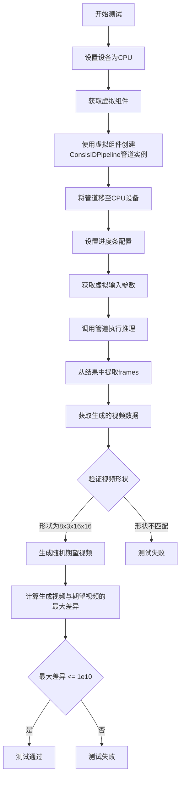

#### 带注释源码

```python
def test_inference(self):
    """
    测试ConsisIDPipeline的推理功能
    验证管道能够正确执行推理并输出符合预期形状的视频帧
    """
    # 1. 设置测试设备为CPU
    device = "cpu"

    # 2. 获取预定义的虚拟组件（transformer、vae、scheduler、text_encoder、tokenizer）
    components = self.get_dummy_components()
    
    # 3. 使用虚拟组件实例化ConsisIDPipeline管道
    pipe = self.pipeline_class(**components)
    
    # 4. 将管道移至指定设备（CPU）
    pipe.to(device)
    
    # 5. 配置进度条（disable=None表示不禁用进度条）
    pipe.set_progress_bar_config(disable=None)

    # 6. 获取虚拟输入参数，包含图像、prompt、生成器、推理步数等
    inputs = self.get_dummy_inputs(device)
    
    # 7. 执行推理并获取返回的frames结果
    #    pipe(**inputs)返回一个对象，其.frames属性包含生成的视频帧
    video = pipe(**inputs).frames
    
    # 8. 从结果中提取第一个视频（通常frames是一个列表）
    generated_video = video[0]

    # 9. 断言验证生成的视频形状是否符合预期
    #    预期形状: (8帧, 3通道, 16高度, 16宽度)
    self.assertEqual(generated_video.shape, (8, 3, 16, 16))
    
    # 10. 生成一个随机形状的期望视频用于对比
    #     注意: 这里使用torch.randn生成随机数据作为期望值
    expected_video = torch.randn(8, 3, 16, 16)
    
    # 11. 计算生成视频与期望视频之间的最大绝对差异
    max_diff = np.abs(generated_video - expected_video).max()
    
    # 12. 断言验证最大差异在可接受范围内
    #     注意: 1e10是一个非常宽松的阈值，实际使用时可能需要调整
    self.assertLessEqual(max_diff, 1e10)
```


### `ConsisIDPipelineFastTests.test_callback_inputs`

该方法是一个单元测试，用于验证ConsisIDPipeline的回调功能是否正确实现，特别是检查`callback_on_step_end`和`callback_on_step_end_tensor_inputs`参数是否能正确工作，包括回调函数能否正确接收和修改tensor类型的输入参数。

参数：

- `self`：无需显式传递，测试类实例本身

返回值：`None`，该方法为测试方法，不返回任何值

#### 流程图

```mermaid
flowchart TD
    A[开始测试 test_callback_inputs] --> B{检查pipeline_class.__call__签名}
    B --> C{是否包含callback_on_step_end_tensor_inputs和callback_on_step_end参数?}
    C -->|否| D[直接返回, 测试结束]
    C -->|是| E[创建pipeline实例并移到torch_device]
    E --> F[验证pipeline具有_callback_tensor_inputs属性]
    F --> G[定义回调函数 callback_inputs_subset]
    G --> H[定义回调函数 callback_inputs_all]
    H --> I[定义回调函数 callback_inputs_change_tensor]
    I --> J[测试1: 使用subset回调和['latents']调用pipeline]
    J --> K[测试2: 使用all回调和全部callback_tensor_inputs调用pipeline]
    K --> L[测试3: 使用change_tensor回调修改latents调用pipeline]
    L --> M{验证输出结果的sum小于1e10}
    M -->|是| N[测试通过]
    M -->|否| O[测试失败]
    N --> P[结束测试]
    O --> P
```

#### 带注释源码

```python
def test_callback_inputs(self):
    """
    测试pipeline的回调输入功能是否正确实现。
    验证callback_on_step_end和callback_on_step_end_tensor_inputs参数的工作情况。
    """
    # 1. 通过inspect模块获取pipeline_class的__call__方法签名
    sig = inspect.signature(self.pipeline_class.__call__)
    
    # 2. 检查签名中是否包含回调相关的参数
    has_callback_tensor_inputs = "callback_on_step_end_tensor_inputs" in sig.parameters
    has_callback_step_end = "callback_on_step_end" in sig.parameters

    # 3. 如果pipeline不支持回调功能，则直接返回（跳过测试）
    if not (has_callback_tensor_inputs and has_callback_step_end):
        return

    # 4. 创建pipeline组件并实例化
    components = self.get_dummy_components()
    pipe = self.pipeline_class(**components)
    
    # 5. 将pipeline移到测试设备上
    pipe = pipe.to(torch_device)
    
    # 6. 设置进度条配置
    pipe.set_progress_bar_config(disable=None)
    
    # 7. 断言pipeline必须定义_callback_tensor_inputs属性
    # 该属性定义了回调函数可以使用的tensor变量列表
    self.assertTrue(
        hasattr(pipe, "_callback_tensor_inputs"),
        f" {self.pipeline_class} should have `_callback_tensor_inputs` that defines a list of tensor variables its callback function can use as inputs",
    )

    # ==================== 定义回调函数1: 仅使用子集 ====================
    def callback_inputs_subset(pipe, i, t, callback_kwargs):
        """
        回调函数测试：只传递允许的tensor输入的子集
        参数:
            pipe: pipeline实例
            i: 当前推理步骤索引
            t: 当前timestep
            callback_kwargs: 回调函数接收的关键字参数字典
        """
        # 遍历回调参数中的所有tensor
        for tensor_name, tensor_value in callback_kwargs.items():
            # 检查每个tensor是否都在允许的_callback_tensor_inputs列表中
            assert tensor_name in pipe._callback_tensor_inputs

        return callback_kwargs

    # ==================== 定义回调函数2: 使用全部tensor输入 ====================
    def callback_inputs_all(pipe, i, t, callback_kwargs):
        """
        回调函数测试：使用全部允许的tensor输入
        验证回调kwargs包含所有_callback_tensor_inputs中的tensor
        """
        # 检查所有允许的tensor都在callback_kwargs中
        for tensor_name in pipe._callback_tensor_inputs:
            assert tensor_name in callback_kwargs

        # 遍历回调参数中的所有tensor，验证都在允许列表中
        for tensor_name, tensor_value in callback_kwargs.items():
            assert tensor_name in pipe._callback_tensor_inputs

        return callback_kwargs

    # ==================== 获取测试输入 ====================
    inputs = self.get_dummy_inputs(torch_device)

    # ==================== 测试场景1: 只传递latents子集 ====================
    # 设置回调函数为subset版本
    inputs["callback_on_step_end"] = callback_inputs_subset
    # 只允许传递latents作为回调输入
    inputs["callback_on_step_end_tensor_inputs"] = ["latents"]
    # 执行pipeline
    output = pipe(**inputs)[0]

    # ==================== 测试场景2: 传递所有允许的tensor输入 ====================
    # 设置回调函数为all版本
    inputs["callback_on_step_end"] = callback_inputs_all
    # 使用pipeline定义的所有callback_tensor_inputs
    inputs["callback_on_step_end_tensor_inputs"] = pipe._callback_tensor_inputs
    # 执行pipeline
    output = pipe(**inputs)[0]

    # ==================== 定义回调函数3: 修改tensor值 ====================
    def callback_inputs_change_tensor(pipe, i, t, callback_kwargs):
        """
        回调函数测试：在最后一步修改latents的值
        验证回调函数可以修改传入的tensor值
        """
        # 检查是否是最后一步
        is_last = i == (pipe.num_timesteps - 1)
        if is_last:
            # 将latents修改为全零tensor
            callback_kwargs["latents"] = torch.zeros_like(callback_kwargs["latents"])
        return callback_kwargs

    # ==================== 测试场景3: 修改tensor值 ====================
    inputs["callback_on_step_end"] = callback_inputs_change_tensor
    inputs["callback_on_step_end_tensor_inputs"] = pipe._callback_tensor_inputs
    # 执行pipeline
    output = pipe(**inputs)[0]
    
    # 验证修改后的输出应该是接近全零的（因为最后一步被修改为zeros）
    # 使用sum < 1e10作为验证条件
    assert output.abs().sum() < 1e10
```


### `ConsisIDPipelineFastTests.test_inference_batch_single_identical`

这是一个单元测试方法，用于验证 ConsisIDPipeline 在批量推理时，单个样本的输出与单独推理时的一致性。

参数：

- `self`：隐式参数，测试类实例本身

返回值：无（该方法直接调用 `self._test_inference_batch_single_identical` 并通过断言验证结果）

#### 流程图

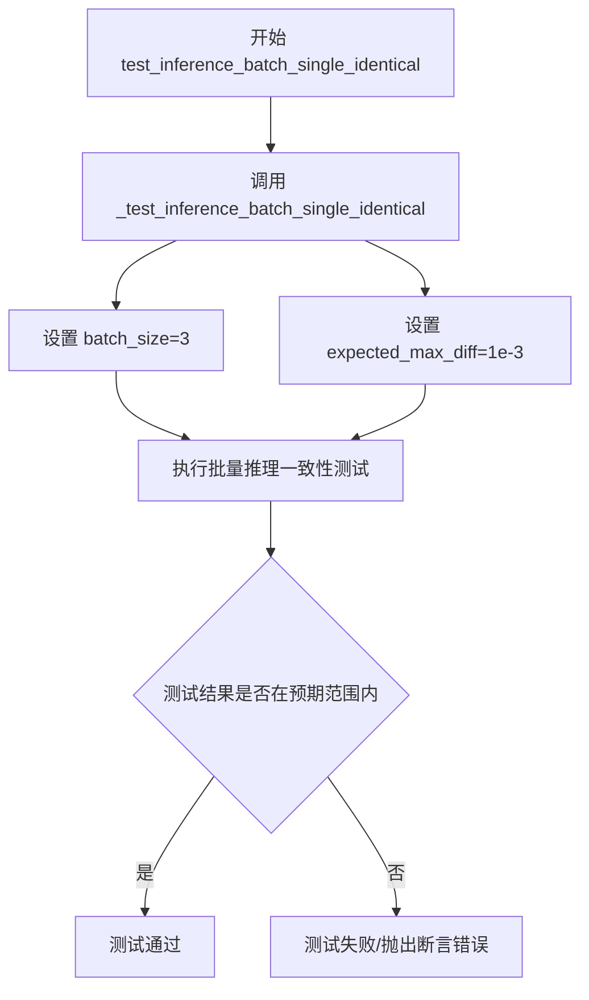

#### 带注释源码

```python
def test_inference_batch_single_identical(self):
    """
    测试批量推理时单个样本的一致性。
    
    该测试方法验证当使用批量推理时，批中每个单独样本的输出
    与单独对该样本进行推理时的输出保持一致。
    """
    # 调用父类 PipelineTesterMixin 提供的测试方法
    # batch_size=3: 使用3个样本的批次进行测试
    # expected_max_diff=1e-3: 允许的最大差异阈值为0.001
    self._test_inference_batch_single_identical(batch_size=3, expected_max_diff=1e-3)
```


### `ConsisIDPipelineFastTests.test_attention_slicing_forward_pass`

该测试方法用于验证注意力切片（Attention Slicing）功能在不同切片大小下是否会影响推理结果的质量。测试通过比较启用注意力切片前后的输出差异，确保注意力切片优化不会改变模型的推理结果。

参数：

- `self`：隐式参数，类型为 `ConsisIDPipelineFastTests`（测试类实例），代表测试类本身
- `test_max_difference`：布尔类型，默认为 `True`，表示是否测试最大差异
- `test_mean_pixel_difference`：布尔类型，默认为 `True`，表示是否测试平均像素差异（当前未被使用）
- `expected_max_diff`：浮点数类型，默认为 `1e-3`，表示允许的最大差异阈值

返回值：无返回值（`None`），该方法为 `unittest.TestCase` 的测试方法，通过断言验证结果

#### 流程图

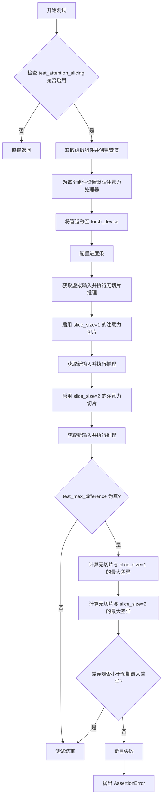

#### 带注释源码

```python
def test_attention_slicing_forward_pass(
    self, test_max_difference=True, test_mean_pixel_difference=True, expected_max_diff=1e-3
):
    """
    测试注意力切片功能对推理结果的影响。
    
    参数:
        test_max_difference: 是否测试最大差异
        test_mean_pixel_difference: 是否测试平均像素差异（当前未使用）
        expected_max_diff: 允许的最大差异阈值
    """
    # 如果未启用注意力切片测试，则直接返回
    if not self.test_attention_slicing:
        return

    # 获取虚拟组件（transformer、vae、scheduler、text_encoder、tokenizer）
    components = self.get_dummy_components()
    # 使用虚拟组件创建 ConsisIDPipeline 实例
    pipe = self.pipeline_class(**components)
    
    # 遍历管道中的所有组件，为每个组件设置默认的注意力处理器
    # 这确保了测试在一致的注意力处理配置下进行
    for component in pipe.components.values():
        if hasattr(component, "set_default_attn_processor"):
            component.set_default_attn_processor()
    
    # 将管道移至指定的计算设备（torch_device）
    pipe.to(torch_device)
    # 配置进度条，disable=None 表示不禁用进度条
    pipe.set_progress_bar_config(disable=None)

    # 设置生成器设备为 CPU
    generator_device = "cpu"
    # 获取虚拟输入数据（包含图像、提示词、生成器等）
    inputs = self.get_dummy_inputs(generator_device)
    # 执行不带注意力切片的推理，获取基准输出
    output_without_slicing = pipe(**inputs)[0]

    # 启用注意力切片，slice_size=1 表示将注意力计算分块
    pipe.enable_attention_slicing(slice_size=1)
    # 重新获取虚拟输入（使用新的随机种子）
    inputs = self.get_dummy_inputs(generator_device)
    # 执行带注意力切片（slice_size=1）的推理
    output_with_slicing1 = pipe(**inputs)[0]

    # 启用注意力切片，slice_size=2 表示更大的分块
    pipe.enable_attention_slicing(slice_size=2)
    # 重新获取虚拟输入
    inputs = self.get_dummy_inputs(generator_device)
    # 执行带注意力切片（slice_size=2）的推理
    output_with_slicing2 = pipe(**inputs)[0]

    # 如果需要测试最大差异
    if test_max_difference:
        # 计算 slice_size=1 输出与无切片输出的最大绝对差异
        max_diff1 = np.abs(to_np(output_with_slicing1) - to_np(output_without_slicing)).max()
        # 计算 slice_size=2 输出与无切片输出的最大绝对差异
        max_diff2 = np.abs(to_np(output_with_slicing2) - to_np(output_without_slicing)).max()
        # 断言：注意力切片不应该影响推理结果
        # 如果最大差异超过预期阈值，则抛出 AssertionError
        self.assertLess(
            max(max_diff1, max_diff2),
            expected_max_diff,
            "Attention slicing should not affect the inference results",
        )
```


### `ConsisIDPipelineFastTests.test_vae_tiling`

这是一个单元测试方法，用于验证 VAE tiling（瓦片化）功能是否正确工作。测试通过比较启用 tiling 和不启用 tiling 两种情况下的模型输出差异，确保差异在可接受的阈值范围内，从而验证 VAE tiling 不会显著影响推理结果。

参数：

- `expected_diff_max`：`float`，默认值 `0.4`，期望输出之间的最大差异阈值

返回值：`None`，无返回值（测试方法，通过 `assertLess` 断言验证结果）

#### 流程图

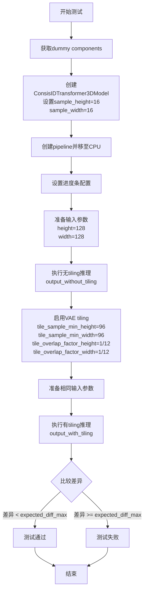

#### 带注释源码

```python
def test_vae_tiling(self, expected_diff_max: float = 0.4):
    """
    测试 VAE tiling 功能。
    
    VAE tiling 是一种将大图像分割成小块进行处理的技术，
    然后将结果拼接回去。这对于处理高分辨率图像非常重要，
    可以避免内存不足的问题。
    
    参数:
        expected_diff_max: float, 期望输出之间的最大差异阈值
                          默认值为 0.4
    """
    # 使用 CPU 作为生成器设备
    generator_device = "cpu"
    
    # 获取测试用的虚拟组件（transformer, vae, scheduler, text_encoder, tokenizer）
    components = self.get_dummy_components()

    # 创建 ConsisIDTransformer3DModel，修改 sample_height 和 sample_width 为 16
    # 注意：ConsisID Transformer 使用学习的位置嵌入（learned positional embeddings），
    # 这限制了生成分辨率必须与初始化时使用的分辨率相同
    # 不同于 sincos 或 RoPE 嵌入可以在运行时生成，学习的位置嵌入是固定的
    # 参见 diffusers/models/embeddings.py 中的 "self.use_learned_positional_embeddings" 判断
    components["transformer"] = ConsisIDTransformer3DModel.from_config(
        components["transformer"].config,
        sample_height=16,
        sample_width=16,
    )

    # 使用组件创建 pipeline
    pipe = self.pipeline_class(**components)
    
    # 将 pipeline 移至 CPU 设备
    pipe.to("cpu")
    
    # 设置进度条配置（disable=None 表示启用进度条）
    pipe.set_progress_bar_config(disable=None)

    # ======= 第一部分：不使用 tiling 的推理 =======
    # 获取测试输入
    inputs = self.get_dummy_inputs(generator_device)
    
    # 设置输出图像高度和宽度为 128x128
    inputs["height"] = inputs["width"] = 128
    
    # 执行推理（不启用 tiling）
    output_without_tiling = pipe(**inputs)[0]

    # ======= 第二部分：使用 tiling 的推理 =======
    # 启用 VAE tiling
    # tile_sample_min_height/tile_sample_min_width: 每个瓦片的最小尺寸
    # tile_overlap_factor_height/tile_overlap_factor_width: 瓦片之间的重叠因子
    pipe.vae.enable_tiling(
        tile_sample_min_height=96,
        tile_sample_min_width=96,
        tile_overlap_factor_height=1 / 12,
        tile_overlap_factor_width=1 / 12,
    )
    
    # 重新获取测试输入（确保随机种子等参数一致）
    inputs = self.get_dummy_inputs(generator_device)
    
    # 设置相同的输出图像尺寸
    inputs["height"] = inputs["width"] = 128
    
    # 执行推理（启用 tiling）
    output_with_tiling = pipe(**inputs)[0]

    # ======= 验证部分 =======
    # 比较两种输出的差异，确保差异在可接受范围内
    # 如果差异过大，说明 tiling 实现存在问题，会影响推理结果的准确性
    self.assertLess(
        (to_np(output_without_tiling) - to_np(output_with_tiling)).max(),
        expected_diff_max,
        "VAE tiling should not affect the inference results",
    )
```


### `ConsisIDPipelineIntegrationTests.setUp`

该方法在每个测试方法运行前被调用，用于调用父类的 setUp 方法、强制进行垃圾回收并清空 GPU 缓存，以确保测试环境干净。

参数：

- 无（除了隐含的 `self` 参数）

返回值：`None`，无返回值

#### 流程图

```mermaid
flowchart TD
    A[开始 setUp] --> B[调用 super&#40;&#41;.setUp&#40;]
    B --> C[调用 gc.collect&#40;&#41; 强制垃圾回收]
    C --> D[调用 backend_empty_cache&#40;torch_device&#41; 清空GPU缓存]
    D --> E[结束 setUp]
```

#### 带注释源码

```python
def setUp(self):
    """
    测试用例的初始化方法，在每个测试方法运行前被调用。
    用于清理之前的测试残留，确保测试环境干净。
    """
    # 调用父类的 setUp 方法，执行 unittest.TestCase 的标准初始化
    super().setUp()
    # 强制 Python 垃圾回收器运行，释放不再使用的对象内存
    gc.collect()
    # 清空 GPU 缓存，释放 GPU 显存，避免显存泄漏影响后续测试
    backend_empty_cache(torch_device)
```


### `ConsisIDPipelineIntegrationTests.tearDown`

清理测试环境，释放内存和GPU缓存

参数：

- `self`：`ConsisIDPipelineIntegrationTests`，表示测试类实例本身

返回值：`None`，无返回值

#### 流程图

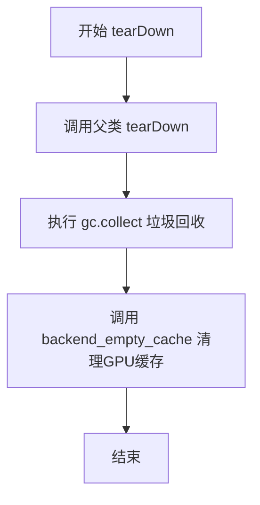

#### 带注释源码

```python
def tearDown(self):
    """
    测试方法 tearDown，用于清理测试环境
    """
    # 调用父类的 tearDown 方法，执行基类的清理逻辑
    super().tearDown()
    
    # 执行 Python 垃圾回收，释放未使用的内存对象
    gc.collect()
    
    # 清理 GPU 缓存，释放 CUDA 显存
    # torch_device 是从 testing_utils 导入的全局变量，表示当前测试使用的设备
    backend_empty_cache(torch_device)
```


### `ConsisIDPipelineIntegrationTests.test_consisid`

这是一个集成测试方法，用于测试 `ConsisIDPipeline` 的完整推理流程，验证模型能够根据给定的身份信息（ID embedding）和文本提示生成一致性的视频。

参数：

- `self`：无需显式传递，测试类实例本身

返回值：`None`，该方法为 `unittest.TestCase` 的测试方法，通过断言验证结果而非返回值。

#### 流程图

```mermaid
flowchart TD
    A[开始测试] --> B[创建随机数生成器<br/>generator = torch.Generator.cpu.manual_seed0]
    B --> C[加载预训练模型<br/>ConsisIDPipeline.from_pretrained]
    C --> D[启用CPU卸载<br/>pipe.enable_model_cpu_offload]
    D --> E[准备输入数据]
    E --> F[设置提示词<br/>prompt = A painting of a squirrel eating a burger.]
    F --> G[加载身份图像<br/>load_image from URL]
    G --> H[创建ID特征<br/>id_vit_hidden, id_cond]
    H --> I[调用管道推理<br/>pipe.image, prompt, height, width, num_frames, etc.]
    I --> J[提取生成的视频<br/>video = videos[0]]
    J --> K[生成预期视频<br/>expected_video = torch.randn]
    K --> L[计算相似度距离<br/>numpy_cosine_similarity_distance]
    L --> M{最大差异 < 1e-3?}
    M -->|是| N[测试通过]
    M -->|否| O[测试失败<br/>抛出断言错误]
```

#### 带注释源码

```python
def test_consisid(self):
    """集成测试：验证ConsisIDPipeline能够根据身份信息和文本提示生成视频"""
    
    # 步骤1：创建随机数生成器，确保测试结果可复现
    # 使用CPU设备，种子设为0
    generator = torch.Generator("cpu").manual_seed(0)

    # 步骤2：从预训练模型加载ConsisIDPipeline
    # 使用bfloat16精度以减少显存占用
    pipe = ConsisIDPipeline.from_pretrained("BestWishYsh/ConsisID-preview", torch_dtype=torch.bfloat16)
    
    # 步骤3：启用模型CPU卸载
    # 在推理完成后将模型移回CPU，节省GPU显存
    pipe.enable_model_cpu_offload()

    # 步骤4：准备测试输入
    # 从类属性获取提示词
    prompt = self.prompt  # "A painting of a squirrel eating a burger."
    
    # 从URL加载输入图像，用于提取身份特征
    image = load_image("https://github.com/PKU-YuanGroup/ConsisID/blob/main/asserts/example_images/2.png?raw=true")
    
    # 创建虚拟的身份特征向量
    # id_vit_hidden: 视觉Transformer的隐藏状态，形状[1, 577, 1024]，重复5次对应5个attention层
    id_vit_hidden = [torch.ones([1, 577, 1024])] * 5
    
    # id_cond: 身份条件向量，形状[1, 1280]
    id_cond = torch.ones(1, 1280)

    # 步骤5：调用管道进行推理
    videos = pipe(
        image=image,                    # 输入的身份图像
        prompt=prompt,                  # 文本提示词
        height=480,                     # 输出视频高度
        width=720,                      # 输出视频宽度
        num_frames=16,                  # 输出视频帧数
        id_vit_hidden=id_vit_hidden,    # 视觉Transformer隐藏状态
        id_cond=id_cond,                # 身份条件向量
        generator=generator,             # 随机数生成器
        num_inference_steps=1,          # 推理步数（最小值，用于快速测试）
        output_type="pt",               # 输出类型为PyTorch张量
    ).frames  # 提取视频帧

    # 步骤6：提取生成的视频
    video = videos[0]  # 获取第一个（也可能是唯一的）视频
    
    # 创建预期视频用于比较
    # 形状: [1, 16, 480, 720, 3] - batch, frames, height, width, channels
    expected_video = torch.randn(1, 16, 480, 720, 3).numpy()

    # 步骤7：计算生成视频与预期视频的余弦相似度距离
    max_diff = numpy_cosine_similarity_distance(video.cpu(), expected_video)
    
    # 步骤8：断言验证
    # 余弦相似度距离应小于1e-3，表示生成质量符合预期
    assert max_diff < 1e-3, f"Max diff is too high. got {video}"
```

## 关键组件


### ConsisIDPipeline

ConsisID管道核心类，负责将图像和文本提示作为输入，通过3D变换器、VAE和文本编码器生成一致性身份视频。

### ConsisIDTransformer3DModel

ConsisID专用的3D时空变换器模型，支持注意力头维度、层数、时间嵌入等配置，用于处理视频帧的时空特征学习。

### AutoencoderKLCogVideoX

CogVideoX的变分自编码器(VAE)，负责将视频帧编码到潜在空间并进行解码，支持3D卷积块和时序压缩。

### DDIMScheduler

DDIM (Denoising Diffusion Implicit Models) 调度器，控制去噪过程中的噪声调度，用于扩散模型的推理步骤。

### T5EncoderModel

基于T5的文本编码器，将文本提示编码为嵌入向量，供变换器模型用于条件生成。

### 张量索引与惰性加载

通过callback_on_step_end和callback_on_step_end_tensor_inputs参数实现，允许在推理步骤结束时惰性加载和操作特定张量，减少内存占用。

### 反量化支持

通过torch_dtype=torch.bfloat16参数实现，使用bfloat16半精度进行推理，减少显存占用同时保持数值精度。

### 量化策略

通过enable_model_cpu_offload()实现模型CPU卸载，以及enable_attention_slicing()实现注意力切片，两者都是内存优化策略。

### VAE Tiling

在test_vae_tiling中测试的功能，通过enable_tiling()方法将VAE推理分块处理，支持重叠区域，适用于高分辨率视频生成。

### Attention Slicing

通过enable_attention_slicing(slice_size)实现，将注意力计算分片处理，降低显存峰值，适用于大分辨率场景。

### 回调机制

callback_on_step_end允许用户在每个推理步骤结束时自定义处理逻辑，callback_on_step_end_tensor_inputs定义允许传入回调的张量列表。


## 问题及建议


### 已知问题

-   **test_inference 测试断言过于宽松**：使用 `self.assertLessEqual(max_diff, 1e10)`，阈值1e10过大，几乎任何输出都能通过测试，无法有效验证模型输出的正确性。
-   **test_inference 使用随机期望值**：使用 `torch.randn(8, 3, 16, 16)` 生成期望视频，由于是随机数据，每次运行结果不同，测试缺乏确定性和有效性。
-   **test_callback_inputs 变量未使用**：在测试中创建了 `output` 变量但未对其进行任何断言，测试逻辑不完整。
-   **test_attention_slicing_forward_pass 参数未使用**：方法签名中的 `test_max_difference` 和 `test_mean_pixel_difference` 参数未被使用，代码逻辑不完整。
-   **test_consisid 集成测试使用随机期望值**：同样使用 `torch.randn` 生成期望视频，但期望差异小于 1e-3，而实际期望值是随机的，导致测试结果不确定。
-   **Magic Numbers 散布代码中**：如阈值 1e10、1e3、0.4 等缺乏常量定义，降低代码可读性和可维护性。
-   **重复的输入构建逻辑**：get_dummy_inputs 方法在多处调用时需要重复设置参数（如 height/width、generator 设置），缺乏统一的测试输入管理。

### 优化建议

-   为测试断言使用确定性的期望值或基于真实模型输出的基准数据进行比较，而非随机生成数据。
-   合理设置阈值：如将 test_inference 中的 1e10 调整为合理的数值（如 1.0 或 0.5），确保测试能真正验证输出质量。
-   补充 test_callback_inputs 中对 output 变量的断言，或移除未使用的变量定义。
-   移除 test_attention_slicing_forward_pass 中未使用的参数，或实现对应的测试逻辑。
-   将散布的 Magic Numbers 提取为类级别常量或配置文件，提升代码可读性。
-   考虑将 get_dummy_inputs 中的重复逻辑进行抽象，构建更灵活的测试输入构建器。
-   为集成测试添加模型输出正确性的验证（如检查输出类型、维度），而不仅仅依赖数值比较。

## 其它


### 设计目标与约束

该代码是ConsisIDPipeline的测试套件，核心目标是验证ConsisID一致性身份视频生成管道的功能正确性、性能表现和参数兼容性。设计约束包括：(1) 必须继承PipelineTesterMixin和unittest.TestCase以符合diffusers测试框架；(2) 测试必须在CPU和GPU环境下均可运行；(3) 集成测试需标记@slow和@require_torch_accelerator以区分单元测试和耗时测试；(4) 使用固定的随机种子(0)确保测试可重复性。

### 错误处理与异常设计

测试代码主要处理以下异常场景：(1) callback_on_step_end_tensor_inputs参数缺失时跳过相关测试分支；(2) MPS设备兼容性处理：使用torch.manual_seed替代Generator初始化；(3) VAE tiling测试中捕获由于learned positional embeddings导致的分辨率限制异常；(4) 集成测试中捕获模型加载和推理过程中的CUDA内存溢出，通过gc.collect()和backend_empty_cache()进行资源清理。

### 数据流与状态机

测试数据流遵循以下路径：get_dummy_components() → 初始化pipeline → get_dummy_inputs() → pipeline(**inputs) → 验证输出。状态转换包括：组件初始化状态 → pipeline组装状态 → 推理执行状态 → 结果验证状态。关键状态变量包括：device(CPU/GPU/MPS)、generator(随机数生成器)、num_inference_steps(推理步数)、output_type(pt/numpy)。

### 外部依赖与接口契约

主要外部依赖包括：(1) transformers库：AutoTokenizer和T5EncoderModel；(2) diffusers库：AutoencoderKLCogVideoX、ConsisIDPipeline、ConsisIDTransformer3DModel、DDIMScheduler；(3) PIL库：Image处理；(4) numpy和torch：数值计算。接口契约方面，pipeline必须实现__call__方法，支持callback_on_step_end和callback_on_step_end_tensor_inputs参数，组件必须包含transformer、vae、scheduler、text_encoder、tokenizer五个核心组件。

### 性能考量与资源管理

测试中的性能优化策略包括：(1) enable_attention_slicing：分片注意力机制降低显存占用；(2) enable_vae_tiling：VAE瓦片化处理支持高分辨率生成；(3) enable_model_cpu_offload：集成测试中启用CPU offload避免CUDA内存溢出；(4) gc.collect()和backend_empty_cache()：测试前后清理GPU内存。测试性能指标包括：max_diff阈值(1e-3至1e-10)、expected_diff_max(0.4用于VAE tiling)。

### 测试策略与覆盖范围

测试覆盖范围包括：(1) 基础推理测试：test_inference验证输出形状和数值范围；(2) 回调机制测试：test_callback_inputs验证callback_on_step_end和tensor inputs功能；(3) 批处理测试：test_inference_batch_single_identical；(4) 注意力分片测试：test_attention_slicing_forward_pass；(5) VAE瓦片化测试：test_vae_tiling；(6) 集成测试：test_consisid使用真实模型验证。

### 配置与参数设计

关键配置参数包括：(1) params = TEXT_TO_IMAGE_PARAMS - {"cross_attention_kwargs"}：排除不支持的参数；(2) batch_params：包含image参数支持批量处理；(3) required_optional_params：定义可选参数的必需集合；(4) get_dummy_components()中使用torch.manual_seed(0)确保组件确定性初始化；(5) get_dummy_inputs()中image_height=16, image_width=16, num_frames=8的默认尺寸设置。

### 版本兼容性考虑

代码需要考虑以下兼容性：(1) torch版本兼容性：MPS设备检测使用str(device).startswith("mps")；(2) diffusers版本：from_config方法支持配置重建；(3) transformers版本：T5EncoderModel和AutoTokenizer的模型加载兼容性；(4) Python版本：unittest框架的兼容性。test_layerwise_casting和test_group_offloading标志表明对不同后端特性的支持检测。

### 安全考虑

测试代码中的安全考量包括：(1) 模型加载：使用hf-internal-testing/tiny-random-t5避免真实API调用；(2) 集成测试使用公开模型BestWishYsh/ConsisID-preview；(3) 网络图像加载：使用load_image从GitHub raw URL获取测试图像；(4) 内存安全：Generator设备管理、GPU内存清理防止内存泄漏。

### 部署与运行环境

运行环境要求包括：(1) Python 3.8+；(2) PyTorch 2.0+；(3) CUDA 11.0+（GPU测试）；(4) diffusers、transformers、numpy、PIL等依赖包。测试执行方式：单元测试可直接运行，集成测试需标记@slow并要求torch_accelerator。CI/CD集成：通过unittest框架的verbosity参数支持不同级别的测试输出。


    