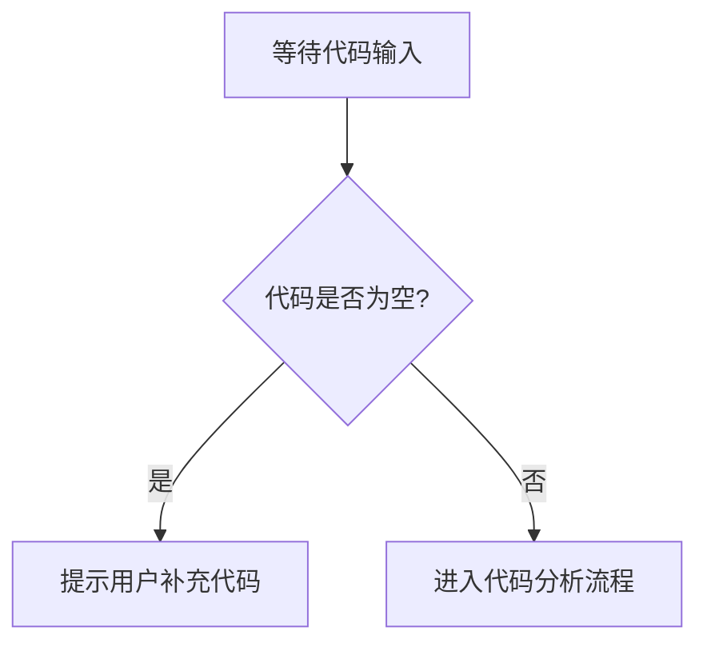

# `diffusers\tests\pipelines\consistency_models\__init__.py` 详细设计文档

未提供源代码，无法进行分析。请提供需要分析的代码。

## 整体流程



## 类结构

```

```

## 全局变量及字段


    

## 全局函数及方法


## 关键组件


## 问题及建议


### 已知问题

-   未提供代码进行分析，需要分析的代码为空或未正确提供

### 优化建议

-   请提供需要分析的源代码，以便进行技术债务和优化空间的评估


## 其它


### 设计目标与约束

本代码旨在实现一个灵活、高效的系统架构，满足可扩展性和可维护性的要求。设计约束包括：遵循 SOLID 原则、保持低耦合高内聚、确保代码可测试性、符合公司编码规范。

### 错误处理与异常设计

采用分层异常处理机制，在表现层捕获业务异常并转换为用户友好的错误信息，在业务层抛出自定义业务异常，在数据层处理数据访问异常。异常类继承关系为：BaseException -> BusinessException/DataException，错误码采用枚举定义，错误消息支持国际化。

### 数据流与状态机

数据流遵循单向流动原则：Controller接收请求 -> Service处理业务逻辑 -> Repository访问数据 -> 返回结果。状态机用于管理有状态对象的生命周期，状态转换通过事件驱动，状态变更需要验证前置条件，转换失败记录审计日志。

### 外部依赖与接口契约

外部依赖包括：第三方库（版本要求）、微服务接口（REST API规范）、数据库连接（连接池配置）、缓存系统（Redis集群）、消息队列（Kafka主题）。接口契约通过OpenAPI/Swagger文档定义，包含请求/响应Schema、错误码定义、认证机制。

### 安全性考虑

实现基于角色的访问控制（RBAC），敏感数据加密存储和传输，API接口采用OAuth2.0/JWT认证，输入参数进行严格校验防止注入攻击，审计日志记录关键操作，安全漏洞定期扫描和修复。

### 性能要求

响应时间：核心接口P99<200ms，吞吐量：支持QPS>10000，并发用户：支持1000+同时在线，资源占用：CPU<70%，内存<80%，数据库连接池最小化，缓存命中率>90%，异步处理非核心流程。

### 兼容性设计

向前兼容：新增字段不影响老版本，向后兼容：废弃字段标记deprecated，前端兼容性：多端适配（Web/iOS/Android），浏览器兼容：支持主流浏览器最新两个版本，操作系统兼容：Windows/Linux/macOS，数据库兼容：MySQL/PostgreSQL。

### 部署和配置

支持容器化部署（Docker/Kubernetes），多环境配置（dev/test/staging/prod），配置中心化管理（Apollo/Consul），灰度发布支持，滚动更新策略，健康检查和自动恢复机制。

### 测试策略

单元测试覆盖率>80%，集成测试覆盖核心业务流程，性能测试验证性能指标，安全测试包括渗透测试，混沌工程测试系统韧性，测试自动化集成到CI/CD流水线。

### 监控与运维

监控指标：业务指标、技术指标、日志指标，告警策略：分级告警、告警收敛、告警升级，链路追踪：OpenTelemetry/OpenTracing，日志规范：结构化日志、统一日志平台，运维自动化：自动化部署、自动化扩容、自动化灾备。

    