# `diffusers\tests\pipelines\consistency_models\test_consistency_models.py` 详细设计文档

这是一个用于测试Diffusers库中ConsistencyModelPipeline（一致性模型管道）的测试文件，包含了单元测试和集成测试，验证了多步推理、单步推理以及类别条件生成等功能。

## 整体流程

```mermaid
graph TD
    A[开始测试] --> B{测试类型}
B -->|快速测试| C[使用虚拟组件]
B -->|慢速测试| D[加载预训练模型]
C --> E[创建虚拟UNet和调度器]
D --> F[加载 Consistency Models 预训练权重]
E --> G[获取虚拟输入]
F --> G
G --> H{推理模式}
H -->|多步推理| I[设置 timesteps=[22, 0]]
H -->|单步推理| J[设置 num_inference_steps=1, timesteps=None]
I --> K[执行管道推理]
J --> K
K --> L[验证输出图像形状和像素值]
L --> M[结束测试]
```

## 类结构

```
unittest.TestCase (Python标准库)
├── ConsistencyModelPipelineFastTests (快速单元测试)
│   └── 继承 PipelineTesterMixin
└── ConsistencyModelPipelineSlowTests (慢速集成测试)
```

## 全局变量及字段


### `enable_full_determinism`
    
启用完全确定性以确保测试可复现性

类型：`function`
    


### `ConsistencyModelPipelineFastTests.pipeline_class`
    
被测试的管道类

类型：`ConsistencyModelPipeline`
    


### `ConsistencyModelPipelineFastTests.params`
    
管道参数配置

类型：`tuple`
    


### `ConsistencyModelPipelineFastTests.batch_params`
    
批处理参数配置

类型：`tuple`
    


### `ConsistencyModelPipelineFastTests.required_optional_params`
    
必需的可选参数集合

类型：`frozenset`
    
    

## 全局函数及方法


### `gc.collect`

手动触发 Python 垃圾回收器，清理无法访问的内存对象，释放未使用的内存资源。

参数：无需参数

返回值：`int`，返回回收的对象数量

#### 流程图

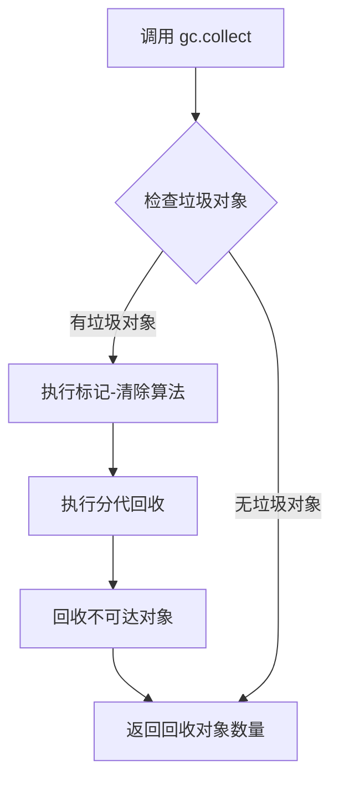

#### 带注释源码

```python
# 在 ConsistencyModelPipelineSlowTests 测试类中使用 gc.collect

class ConsistencyModelPipelineSlowTests(unittest.TestCase):
    def setUp(self):
        """
        测试开始前的准备工作
        """
        super().setUp()
        gc.collect()  # 手动触发垃圾回收，清理测试开始前的内存
        backend_empty_cache(torch_device)  # 清空GPU缓存

    def tearDown(self):
        """
        测试结束后的清理工作
        """
        super().tearDown()
        gc.collect()  # 手动触发垃圾回收，清理测试产生的临时对象
        backend_empty_cache(torch_device)  # 清空GPU缓存

    # ... 其他测试方法
```

#### 上下文说明

在 `setUp` 和 `tearDown` 方法中调用 `gc.collect()` 的主要目的是：

1. **内存清理**：确保每个测试开始和结束时，释放不再使用的 Python 对象
2. **测试隔离**：避免测试之间的内存状态相互影响
3. **GPU 内存配合**：与 `backend_empty_cache()` 配合使用，全面清理内存资源

#### 技术债务与优化空间

- **显式调用频率**：在快速测试套件中频繁调用 `gc.collect()` 可能影响测试性能，可以考虑使用弱引用或对象池来减少垃圾产生
- **时机选择**：可以考虑在测试类级别而非每个测试方法级别进行内存清理，减少调用次数


### `ConsistencyModelPipelineFastTests.test_consistency_model_pipeline_multistep`

测试一致性模型管道的多步推理功能，验证模型能够正确执行多步去噪推理并生成符合预期形状的图像。

参数：
- `self`：隐式参数，测试类实例

返回值：无显式返回值，通过 `assert` 语句验证图像形状和像素值

#### 流程图

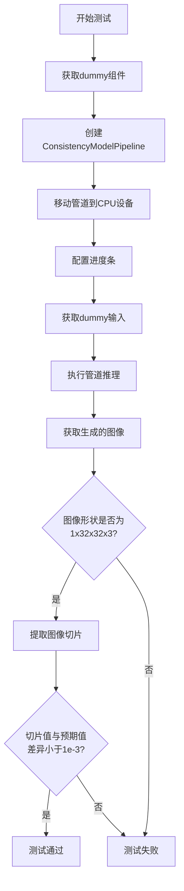

#### 带注释源码

```python
def test_consistency_model_pipeline_multistep(self):
    # 设置设备为CPU以确保确定性
    device = "cpu"  # ensure determinism for the device-dependent torch.Generator
    
    # 获取虚拟组件（UNet和调度器）
    components = self.get_dummy_components()
    
    # 使用虚拟组件创建一致性模型管道
    pipe = ConsistencyModelPipeline(**components)
    
    # 将管道移动到指定设备
    pipe = pipe.to(device)
    
    # 配置进度条（disable=None表示不禁用）
    pipe.set_progress_bar_config(disable=None)

    # 获取虚拟输入参数
    inputs = self.get_dummy_inputs(device)
    
    # 执行管道推理，获取生成的图像
    # 返回值包含images属性
    image = pipe(**inputs).images
    
    # 验证生成的图像形状为(1, 32, 32, 3)
    assert image.shape == (1, 32, 32, 3)

    # 提取图像右下角3x3区域的最后一个通道
    image_slice = image[0, -3:, -3:, -1]
    
    # 预期的像素值slice
    expected_slice = np.array([0.3572, 0.6273, 0.4031, 0.3961, 0.4321, 0.5730, 0.5266, 0.4780, 0.5004])

    # 验证生成图像与预期值的最大差异小于1e-3
    assert np.abs(image_slice.flatten() - expected_slice).max() < 1e-3
```

---

### `ConsistencyModelPipelineFastTests.test_consistency_model_pipeline_multistep_class_cond`

测试带类别条件（class conditional）的一致性模型管道多步推理功能。

参数：
- `self`：隐式参数，测试类实例

返回值：无显式返回值，通过 `assert` 语句验证

#### 流程图

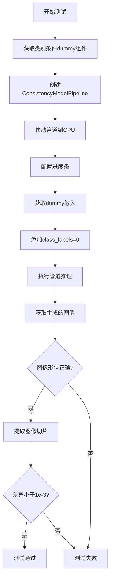

#### 带注释源码

```python
def test_consistency_model_pipeline_multistep_class_cond(self):
    # 使用CPU确保确定性
    device = "cpu"  # ensure determinism for the device-dependent torch.Generator
    
    # 获取支持类别条件的虚拟组件
    components = self.get_dummy_components(class_cond=True)
    
    # 创建管道并移动到设备
    pipe = ConsistencyModelPipeline(**components)
    pipe = pipe.to(device)
    
    # 设置进度条
    pipe.set_progress_bar_config(disable=None)

    # 获取输入参数
    inputs = self.get_dummy_inputs(device)
    
    # 添加类别标签（条件生成）
    inputs["class_labels"] = 0
    
    # 执行推理
    image = pipe(**inputs).images
    
    # 验证形状
    assert image.shape == (1, 32, 32, 3)

    # 提取并验证像素值
    image_slice = image[0, -3:, -3:, -1]
    expected_slice = np.array([0.3572, 0.6273, 0.4031, 0.3961, 0.4321, 0.5730, 0.5266, 0.4780, 0.5004])

    assert np.abs(image_slice.flatten() - expected_slice).max() < 1e-3
```

---

### `ConsistencyModelPipelineFastTests.test_consistency_model_pipeline_onestep`

测试一致性模型管道的单步推理（one-step）功能。

参数：
- `self`：隐式参数，测试类实例

返回值：无显式返回值，通过 `assert` 语句验证

#### 流程图

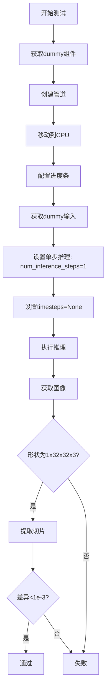

#### 带注释源码

```python
def test_consistency_model_pipeline_onestep(self):
    device = "cpu"  # ensure determinism
    
    # 获取虚拟组件
    components = self.get_dummy_components()
    
    # 创建并配置管道
    pipe = ConsistencyModelPipeline(**components)
    pipe = pipe.to(device)
    pipe.set_progress_bar_config(disable=None)

    # 获取输入
    inputs = self.get_dummy_inputs(device)
    
    # 关键：设置单步推理
    inputs["num_inference_steps"] = 1
    inputs["timesteps"] = None  # 单步推理不需要timesteps
    
    # 执行推理
    image = pipe(**inputs).images
    
    # 验证形状
    assert image.shape == (1, 32, 32, 3)

    # 验证像素值（单步推理的预期值不同）
    image_slice = image[0, -3:, -3:, -1]
    expected_slice = np.array([0.5004, 0.5004, 0.4994, 0.5008, 0.4976, 0.5018, 0.4990, 0.4982, 0.4987])

    assert np.abs(image_slice.flatten() - expected_slice).max() < 1e-3
```

---

### `ConsistencyModelPipelineFastTests.test_consistency_model_pipeline_onestep_class_cond`

测试带类别条件的单步推理功能。

参数：
- `self`：隐式参数，测试类实例

返回值：无显式返回值，通过 `assert` 语句验证

#### 流程图

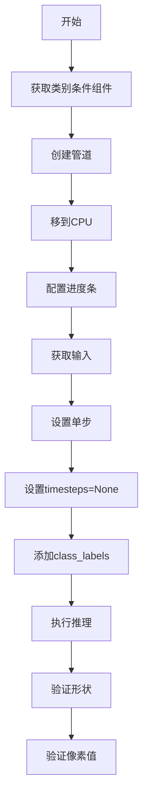

#### 带注释源码

```python
def test_consistency_model_pipeline_onestep_class_cond(self):
    device = "cpu"  # ensure determinism
    
    # 获取类别条件组件
    components = self.get_dummy_components(class_cond=True)
    
    # 创建管道
    pipe = ConsistencyModelPipeline(**components)
    pipe = pipe.to(device)
    pipe.set_progress_bar_config(disable=None)

    # 获取输入
    inputs = self.get_dummy_inputs(device)
    
    # 配置单步推理参数
    inputs["num_inference_steps"] = 1
    inputs["timesteps"] = None
    
    # 添加类别标签
    inputs["class_labels"] = 0
    
    # 执行推理
    image = pipe(**inputs).images
    
    # 验证
    assert image.shape == (1, 32, 32, 3)

    image_slice = image[0, -3:, -3:, -1]
    expected_slice = np.array([0.5004, 0.5004, 0.4994, 0.5008, 0.4976, 0.5018, 0.4990, 0.4982, 0.4987])

    assert np.abs(image_slice.flatten() - expected_slice).max() < 1e-3
```

---

### `ConsistencyModelPipelineSlowTests.test_consistency_model_cd_multistep`

（慢速测试）使用真实预训练模型测试一致性模型的CD（consistency distillation）多步推理。

参数：
- `self`：隐式参数，测试类实例

返回值：无显式返回值，通过 `assert` 语句验证

#### 流程图

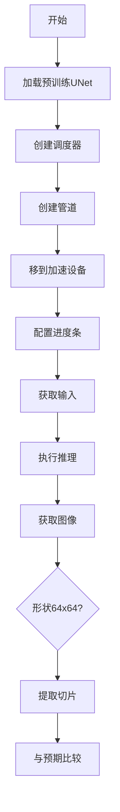

#### 带注释源码

```python
@require_torch_accelerator
def test_consistency_model_cd_multistep(self):
    # 从预训练模型加载UNet（ImageNet64任务）
    unet = UNet2DModel.from_pretrained("diffusers/consistency_models", subfolder="diffusers_cd_imagenet64_l2")
    
    # 创建CM随机迭代调度器
    scheduler = CMStochasticIterativeScheduler(
        num_train_timesteps=40,
        sigma_min=0.002,
        sigma_max=80.0,
    )
    
    # 创建管道
    pipe = ConsistencyModelPipeline(unet=unet, scheduler=scheduler)
    
    # 移动到加速设备（如GPU）
    pipe.to(torch_device=torch_device)
    pipe.set_progress_bar_config(disable=None)

    # 获取输入参数
    inputs = self.get_inputs()
    
    # 执行推理
    image = pipe(**inputs).images
    
    # 验证生成的图像形状为64x64
    assert image.shape == (1, 64, 64, 3)

    # 提取并验证像素值
    image_slice = image[0, -3:, -3:, -1]

    expected_slice = np.array([0.0146, 0.0158, 0.0092, 0.0086, 0.0000, 0.0000, 0.0000, 0.0000, 0.0058])

    assert np.abs(image_slice.flatten() - expected_slice).max() < 1e-3
```

---

### `ConsistencyModelPipelineSlowTests.test_consistency_model_cd_onestep`

（慢速测试）测试单步推理的CD模型。

参数：
- `self`：隐式参数，测试类实例

返回值：无显式返回值，通过 `assert` 语句验证

#### 流程图

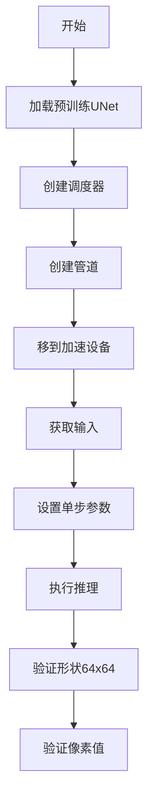

#### 带注释源码

```python
@require_torch_accelerator
def test_consistency_model_cd_onestep(self):
    # 加载预训练UNet
    unet = UNet2DModel.from_pretrained("diffusers/consistency_models", subfolder="diffusers_cd_imagenet64_l2")
    
    # 创建调度器
    scheduler = CMStochasticIterativeScheduler(
        num_train_timesteps=40,
        sigma_min=0.002,
        sigma_max=80.0,
    )
    
    # 创建管道并移动到设备
    pipe = ConsistencyModelPipeline(unet=unet, scheduler=scheduler)
    pipe.to(torch_device=torch_device)
    pipe.set_progress_bar_config(disable=None)

    # 获取输入
    inputs = self.get_inputs()
    
    # 配置为单步推理
    inputs["num_inference_steps"] = 1
    inputs["timesteps"] = None
    
    # 执行推理
    image = pipe(**inputs).images
    
    # 验证形状
    assert image.shape == (1, 64, 64, 3)

    # 验证像素值
    image_slice = image[0, -3:, -3:, -1]

    expected_slice = np.array([0.0059, 0.0003, 0.0000, 0.0023, 0.0052, 0.0007, 0.0165, 0.0081, 0.0095])

    assert np.abs(image_slice.flatten() - expected_slice).max() < 1e-3
```

---

### `ConsistencyModelPipelineSlowTests.test_consistency_model_cd_multistep_flash_attn`

（慢速测试）使用Flash Attention测试多步推理，验证torch 2.0的SDP kernel功能。

参数：
- `self`：隐式参数，测试类实例

返回值：无显式返回值，通过 `assert` 语句验证

#### 流程图

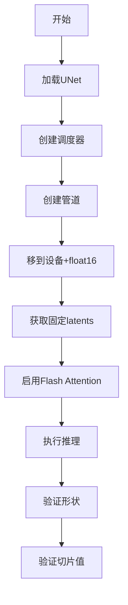

#### 带注释源码

```python
@require_torch_accelerator
@require_torch_2
def test_consistency_model_cd_multistep_flash_attn(self):
    # 加载预训练UNet
    unet = UNet2DModel.from_pretrained("diffusers/consistency_models", subfolder="diffusers_cd_imagenet64_l2")
    
    # 创建调度器
    scheduler = CMStochasticIterativeScheduler(
        num_train_timesteps=40,
        sigma_min=0.002,
        sigma_max=80.0,
    )
    
    # 创建管道，使用float16加速
    pipe = ConsistencyModelPipeline(unet=unet, scheduler=scheduler)
    pipe.to(torch_device=torch_device, torch_dtype=torch.float16)
    pipe.set_progress_bar_config(disable=None)

    # 获取输入（使用固定latents以确保可复现）
    inputs = self.get_inputs(get_fixed_latents=True, device=torch_device)
    
    # 确保使用Flash Attention（torch 2.0特性）
    # enable_flash=True, enable_math=False, enable_mem_efficient=False
    with sdp_kernel(enable_flash=True, enable_math=False, enable_mem_efficient=False):
        image = pipe(**inputs).images

    # 验证形状
    assert image.shape == (1, 64, 64, 3)

    # 提取图像切片
    image_slice = image[0, -3:, -3:, -1]

    # 根据不同设备获取预期值
    expected_slices = Expectations(
        {
            ("xpu", 3): np.array([0.0816, 0.0518, 0.0445, 0.0594, 0.0739, 0.0534, 0.0805, 0.0457, 0.0765]),
            ("cuda", 7): np.array([0.1845, 0.1371, 0.1211, 0.2035, 0.1954, 0.1323, 0.1773, 0.1593, 0.1314]),
            ("cuda", 8): np.array([0.0816, 0.0518, 0.0445, 0.0594, 0.0739, 0.0534, 0.0805, 0.0457, 0.0765]),
        }
    )
    expected_slice = expected_slices.get_expectation()

    assert np.abs(image_slice.flatten() - expected_slice).max() < 1e-3
```

---

### `ConsistencyModelPipelineSlowTests.test_consistency_model_cd_onestep_flash_attn`

（慢速测试）使用Flash Attention测试单步推理。

参数：
- `self`：隐式参数，测试类实例

返回值：无显式返回值，通过 `assert` 语句验证

#### 流程图

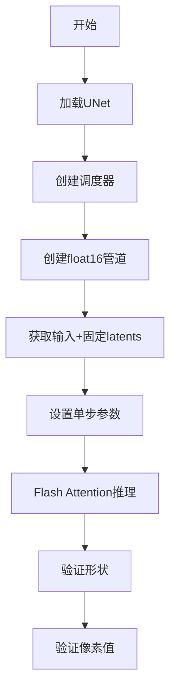

#### 带注释源码

```python
@require_torch_accelerator
@require_torch_2
def test_consistency_model_cd_onestep_flash_attn(self):
    # 加载预训练UNet
    unet = UNet2DModel.from_pretrained("diffusers/consistency_models", subfolder="diffusers_cd_imagenet64_l2")
    
    # 创建调度器
    scheduler = CMStochasticIterativeScheduler(
        num_train_timesteps=40,
        sigma_min=0.002,
        sigma_max=80.0,
    )
    
    # 创建管道并转换为float16
    pipe = ConsistencyModelPipeline(unet=unet, scheduler=scheduler)
    pipe.to(torch_device=torch_device, torch_dtype=torch.float16)
    pipe.set_progress_bar_config(disable=None)

    # 获取输入（使用固定latents）
    inputs = self.get_inputs(get_fixed_latents=True, device=torch_device)
    
    # 配置为单步推理
    inputs["num_inference_steps"] = 1
    inputs["timesteps"] = None
    
    # 使用Flash Attention执行推理
    with sdp_kernel(enable_flash=True, enable_math=False, enable_mem_efficient=False):
        image = pipe(**inputs).images
    
    # 验证形状
    assert image.shape == (1, 64, 64, 3)

    # 验证像素值
    image_slice = image[0, -3:, -3:, -1]

    expected_slice = np.array([0.1623, 0.2009, 0.2387, 0.1731, 0.1168, 0.1202, 0.2031, 0.1327, 0.2447])

    assert np.abs(image_slice.flatten() - expected_slice).max() < 1e-3
```

---

### `ConsistencyModelPipelineSlowTests.get_inputs`

慢速测试类的辅助方法，用于构建测试输入参数。

参数：
- `self`：隐式参数，测试类实例
- `seed`：int，默认0，随机种子
- `get_fixed_latents`：bool，默认False，是否使用固定latents
- `device`：str或torch.device，默认"cpu"，设备
- `dtype`：torch.dtype，默认torch.float32，数据类型
- `shape`：tuple，默认(1, 3, 64, 64)，latents形状

返回值：dict，包含输入参数字典

#### 流程图

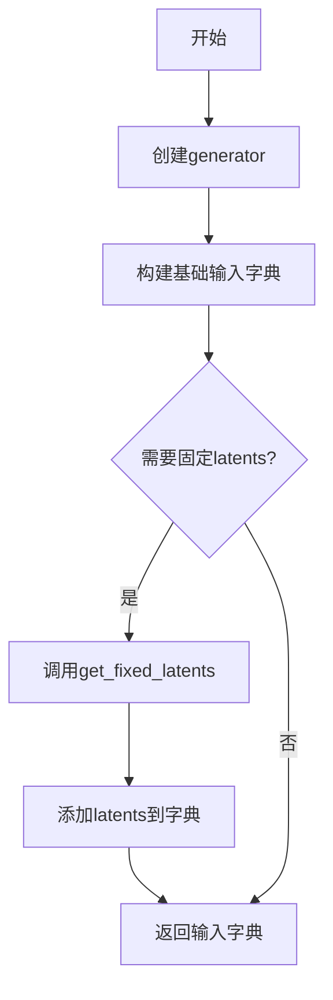

#### 带注释源码

```python
def get_inputs(self, seed=0, get_fixed_latents=False, device="cpu", dtype=torch.float32, shape=(1, 3, 64, 64)):
    # 创建随机数生成器，确保可复现性
    generator = torch.manual_seed(seed)

    # 构建基础输入参数
    inputs = {
        "num_inference_steps": None,      # 多步推理（具体步数由timesteps决定）
        "timesteps": [22, 0],               # 推理时间步（多步）
        "class_labels": 0,                  # 类别标签（条件生成）
        "generator": generator,            # 随机生成器
        "output_type": "np",               # 输出为numpy数组
    }

    # 如果需要固定latents（用于可复现测试）
    if get_fixed_latents:
        # 获取固定形状的latents
        latents = self.get_fixed_latents(seed=seed, device=device, dtype=dtype, shape=shape)
        # 将latents添加到输入中
        inputs["latents"] = latents

    return inputs
```

---

### `ConsistencyModelPipelineSlowTests.get_fixed_latents`

生成固定形状和种子的latents张量，用于测试的可复现性。

参数：
- `self`：隐式参数，测试类实例
- `seed`：int，默认0，随机种子
- `device`：str或torch.device，默认"cpu"，设备
- `dtype`：torch.dtype，默认torch.float32，数据类型
- `shape`：tuple，默认(1, 3, 64, 64)，张量形状

返回值：torch.Tensor，形状为shape的随机张量

#### 流程图

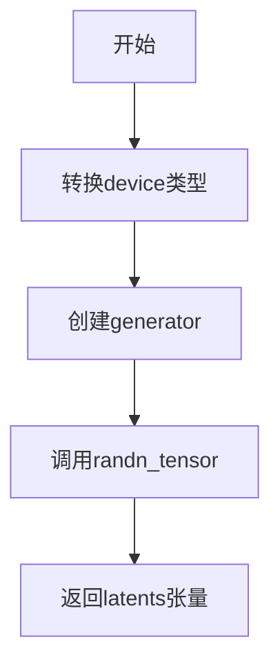

#### 带注释源码

```python
def get_fixed_latents(self, seed=0, device="cpu", dtype=torch.float32, shape=(1, 3, 64, 64)):
    # 如果device是字符串，转换为torch.device对象
    if isinstance(device, str):
        device = torch.device(device)
    
    # 创建确定性随机生成器
    generator = torch.Generator(device=device).manual_seed(seed)
    
    # 使用randn_tensor生成标准正态分布的随机张量
    latents = randn_tensor(shape, generator=generator, device=device, dtype=dtype)
    
    return latents
```

---

### `ConsistencyModelPipelineFastTests.get_dummy_components`

创建虚拟（dummy）组件用于快速测试，避免加载真实预训练模型。

参数：
- `self`：隐式参数，测试类实例
- `class_cond`：bool，默认False，是否使用类别条件UNet

返回值：dict，包含"unet"和"scheduler"组件

#### 流程图

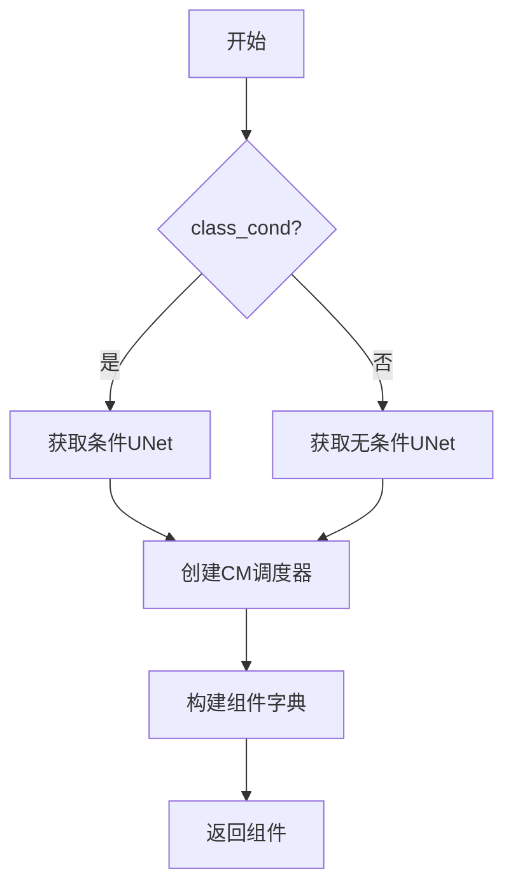

#### 带注释源码

```python
def get_dummy_components(self, class_cond=False):
    # 根据class_cond参数选择UNet类型
    if class_cond:
        # 加载支持类别条件的虚拟UNet
        unet = self.dummy_cond_unet
    else:
        # 加载无条件虚拟UNet
        unet = self.dummy_uncond_unet

    # 创建CM随机迭代调度器（一致性模型专用）
    # num_train_timesteps=40: 训练时间步数
    # sigma_min=0.002: 最小噪声标准差
    # sigma_max=80.0: 最大噪声标准差
    scheduler = CMStochasticIterativeScheduler(
        num_train_timesteps=40,
        sigma_min=0.002,
        sigma_max=80.0,
    )

    # 构建组件字典
    components = {
        "unet": unet,
        "scheduler": scheduler,
    }

    return components
```

---

### `ConsistencyModelPipelineFastTests.get_dummy_inputs`

创建虚拟输入参数用于快速测试。

参数：
- `self`：隐式参数，测试类实例
- `device`：str，设备类型
- `seed`：int，默认0，随机种子

返回值：dict，包含输入参数字典

#### 流程图

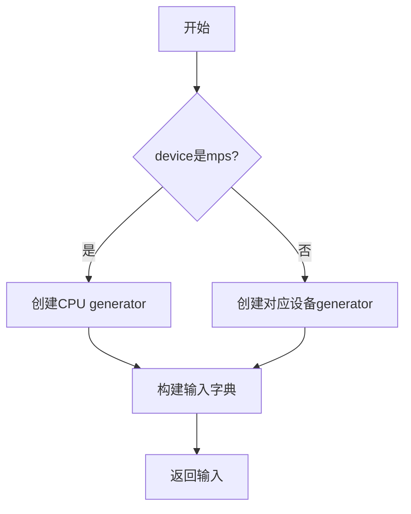

#### 带注释源码

```python
def get_dummy_inputs(self, device, seed=0):
    # MPS设备特殊处理（Apple Silicon GPU）
    if str(device).startswith("mps"):
        # MPS设备使用CPU随机种子
        generator = torch.manual_seed(seed)
    else:
        # 其他设备使用对应设备的随机生成器
        generator = torch.Generator(device=device).manual_seed(seed)

    # 构建输入参数字典
    inputs = {
        "batch_size": 1,              # 批次大小
        "num_inference_steps": None,  # 多步推理
        "timesteps": [22, 0],          # 指定时间步
        "generator": generator,       # 随机生成器
        "output_type": "np",          # 输出为numpy数组
    }

    return inputs
```


### `ConsistencyModelPipelineFastTests.get_dummy_components`

该方法用于获取一致性模型管道的虚拟组件，包含UNet2DModel和CMStochasticIterativeScheduler调度器，用于测试目的。

参数：

- `class_cond`：`bool`，可选参数，默认为False，指定是否使用条件分类的UNet模型

返回值：`dict`，返回包含"unet"和"scheduler"键的字典，分别对应UNet2DModel实例和CMStochasticIterativeScheduler实例

#### 流程图

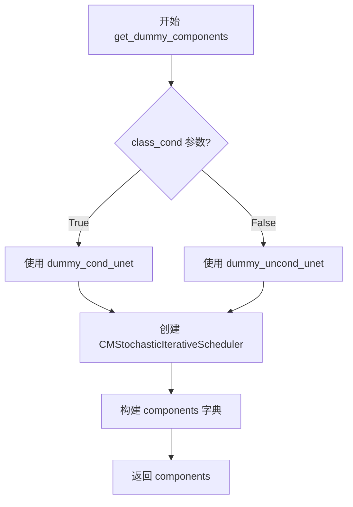

#### 带注释源码

```
def get_dummy_components(self, class_cond=False):
    """获取一致性模型管道的虚拟组件用于测试"""
    
    # 根据class_cond参数选择使用条件或非条件的UNet模型
    if class_cond:
        unet = self.dummy_cond_unet  # 使用条件分类UNet
    else:
        unet = self.dummy_uncond_unet  # 使用非条件UNet

    # 创建默认的CM多步采样器
    # num_train_timesteps: 训练时间步数
    # sigma_min: 最小噪声水平
    # sigma_max: 最大噪声水平
    scheduler = CMStochasticIterativeScheduler(
        num_train_timesteps=40,
        sigma_min=0.002,
        sigma_max=80.0,
    )

    # 组装组件字典
    components = {
        "unet": unet,           # UNet2DModel实例
        "scheduler": scheduler, # CMStochasticIterativeScheduler实例
    }

    return components  # 返回组件字典用于创建管道
```

---

### `ConsistencyModelPipelineFastTests.get_dummy_inputs`

该方法用于获取一致性模型管道的虚拟输入参数，包括批处理大小、推理步数、时间步、生成器和输出类型。

参数：

- `device`：`str` 或 `torch.device`，运行设备
- `seed`：`int`，可选参数，默认为0，随机种子用于生成器

返回值：`dict`，返回包含管道输入参数的字典

#### 流程图

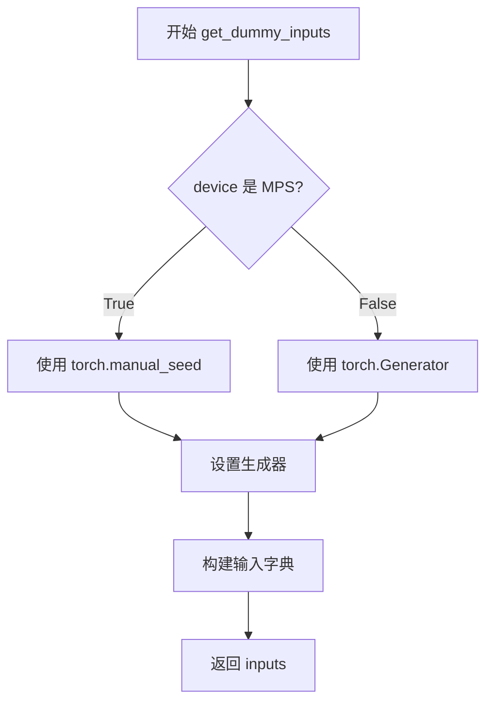

#### 带注释源码

```
def get_dummy_inputs(self, device, seed=0):
    """获取一致性模型管道的虚拟输入参数用于测试"""
    
    # 处理MPS设备和其他设备的随机生成器差异
    # MPS (Metal Performance Shaders) 需要使用不同的随机数生成方式
    if str(device).startswith("mps"):
        generator = torch.manual_seed(seed)  # MPS设备使用CPU生成器
    else:
        # 其他设备(CPU/CUDA)使用设备特定的生成器
        generator = torch.Generator(device=device).manual_seed(seed)

    # 构建输入参数字典
    inputs = {
        "batch_size": 1,              # 批处理大小
        "num_inference_steps": None,  # 推理步数,None表示使用多步模式
        "timesteps": [22, 0],         # 指定的时间步列表
        "generator": generator,       # 随机生成器确保可复现性
        "output_type": "np",          # 输出类型为numpy数组
    }

    return inputs  # 返回输入字典用于管道调用
```

---

### `ConsistencyModelPipelineSlowTests.get_inputs`

该方法用于获取一致性模型管道慢速测试的输入参数，支持可选的固定潜在向量。

参数：

- `seed`：`int`，可选参数，默认为0，随机种子
- `get_fixed_latents`：`bool`，可选参数，默认为False，是否使用固定潜在向量
- `device`：`str` 或 `torch.device`，可选参数，默认为"cpu"，运行设备
- `dtype`：`torch.dtype`，可选参数，默认为torch.float32，数据类型
- `shape`：`tuple`，可选参数，默认为(1, 3, 64, 64)，潜在向量形状

返回值：`dict`，返回包含管道输入参数的字典

#### 流程图

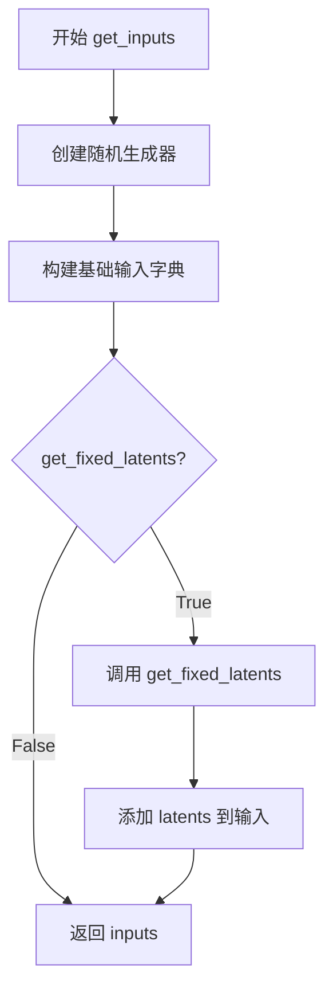

#### 带注释源码

```
def get_inputs(self, seed=0, get_fixed_latents=False, device="cpu", dtype=torch.float32, shape=(1, 3, 64, 64)):
    """获取慢速测试的输入参数"""
    
    # 创建随机生成器用于确保测试可复现性
    generator = torch.manual_seed(seed)

    # 基础输入参数
    inputs = {
        "num_inference_steps": None,  # 多步推理模式
        "timesteps": [22, 0],         # 时间步列表
        "class_labels": 0,            # 分类标签(条件生成用)
        "generator": generator,       # 随机生成器
        "output_type": "np",          # 输出为numpy数组
    }

    # 如果需要固定潜在向量,则生成并添加到输入中
    if get_fixed_latents:
        latents = self.get_fixed_latents(seed=seed, device=device, dtype=dtype, shape=shape)
        inputs["latents"] = latents

    return inputs  # 返回完整输入字典
```

---

### `ConsistencyModelPipelineSlowTests.get_fixed_latents`

该方法用于生成固定形状和类型的随机潜在向量，用于测试中的一致性验证。

参数：

- `seed`：`int`，可选参数，默认为0，随机种子
- `device`：`str` 或 `torch.device`，可选参数，默认为"cpu"，运行设备
- `dtype`：`torch.dtype`，可选参数，默认为torch.float32，数据类型
- `shape`：`tuple`，可选参数，默认为(1, 3, 64, 64)，潜在向量形状

返回值：`torch.Tensor`，返回指定形状和类型的随机潜在向量

#### 流程图

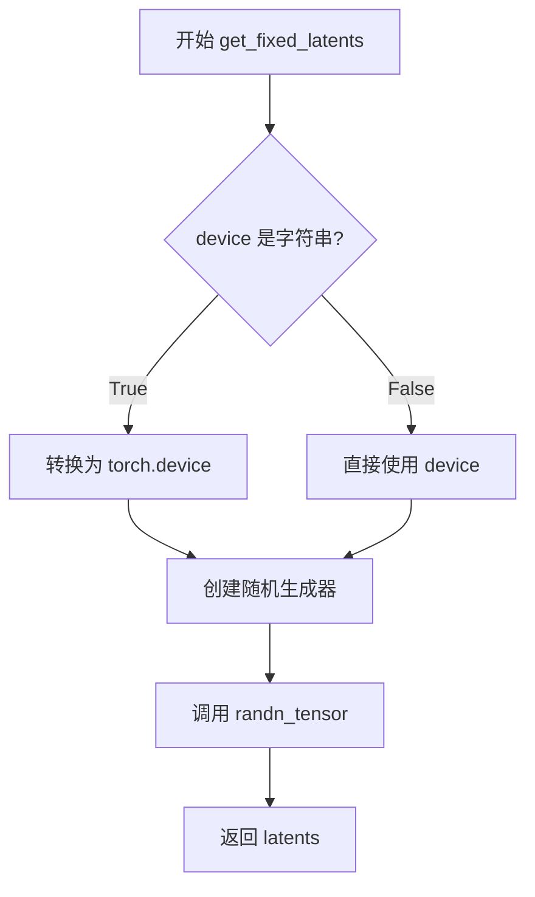

#### 带注释源码

```
def get_fixed_latents(self, seed=0, device="cpu", dtype=torch.float32, shape=(1, 3, 64, 64)):
    """生成固定随机潜在向量用于测试"""
    
    # 将字符串设备转换为torch.device对象(如果需要)
    if isinstance(device, str):
        device = torch.device(device)
    
    # 创建设备特定的随机生成器
    # 确保不同设备上的随机数生成可复现
    generator = torch.Generator(device=device).manual_seed(seed)
    
    # 使用randn_tensor生成标准正态分布的随机张量
    # shape: 张量形状
    # generator: 随机生成器确保可复现性
    # device: 目标设备
    # dtype: 数据类型
    latents = randn_tensor(shape, generator=generator, device=device, dtype=dtype)
    
    return latents  # 返回生成的潜在向量
```

---

### `ConsistencyModelPipelineFastTests.test_consistency_model_pipeline_multistep`

该测试方法验证一致性模型管道在多步推理模式下的功能正确性。

参数：

- `self`：测试类实例，无额外参数

返回值：无返回值，测试通过则通过断言验证

#### 流程图

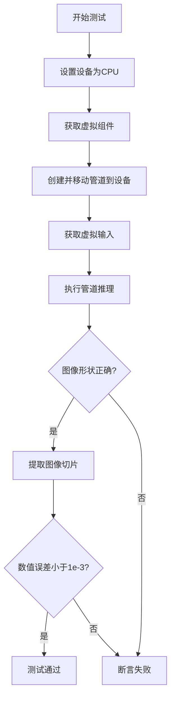

#### 带注释源码

```
def test_consistency_model_pipeline_multistep(self):
    """测试一致性模型管道的多步推理模式"""
    
    device = "cpu"  # 使用CPU确保设备无关的确定性
    
    # 获取虚拟组件(UNet + Scheduler)
    components = self.get_dummy_components()
    
    # 创建管道实例并移至指定设备
    pipe = ConsistencyModelPipeline(**components)
    pipe = pipe.to(device)
    
    # 禁用进度条(测试环境不需要)
    pipe.set_progress_bar_config(disable=None)

    # 获取测试输入
    inputs = self.get_dummy_inputs(device)
    
    # 执行推理获取图像
    # 返回值为PipelineOutput对象
    image = pipe(**inputs).images
    
    # 验证输出形状 (1, 32, 32, 3) - 1张32x32 RGB图像
    assert image.shape == (1, 32, 32, 3)

    # 提取右下角3x3区域用于数值验证
    image_slice = image[0, -3:, -3:, -1]
    
    # 预期输出切片(来自已验证的参考实现)
    expected_slice = np.array([0.3572, 0.6273, 0.4031, 0.3961, 0.4321, 0.5730, 0.5266, 0.4780, 0.5004])

    # 验证数值精度(误差小于1e-3)
    assert np.abs(image_slice.flatten() - expected_slice).max() < 1e-3
```


### `ConsistencyModelPipelineFastTests.get_dummy_components`

该方法用于生成ConsistencyModelPipeline的虚拟测试组件，包括UNet2DModel模型和CMStochasticIterativeScheduler调度器，支持无条件生成和类别条件生成两种模式。

参数：
- `class_cond`：`bool`，是否使用类别条件模型，默认为False

返回值：`dict`，包含"unet"和"scheduler"键的字典，分别对应UNet2DModel和CMStochasticIterativeScheduler实例

#### 流程图

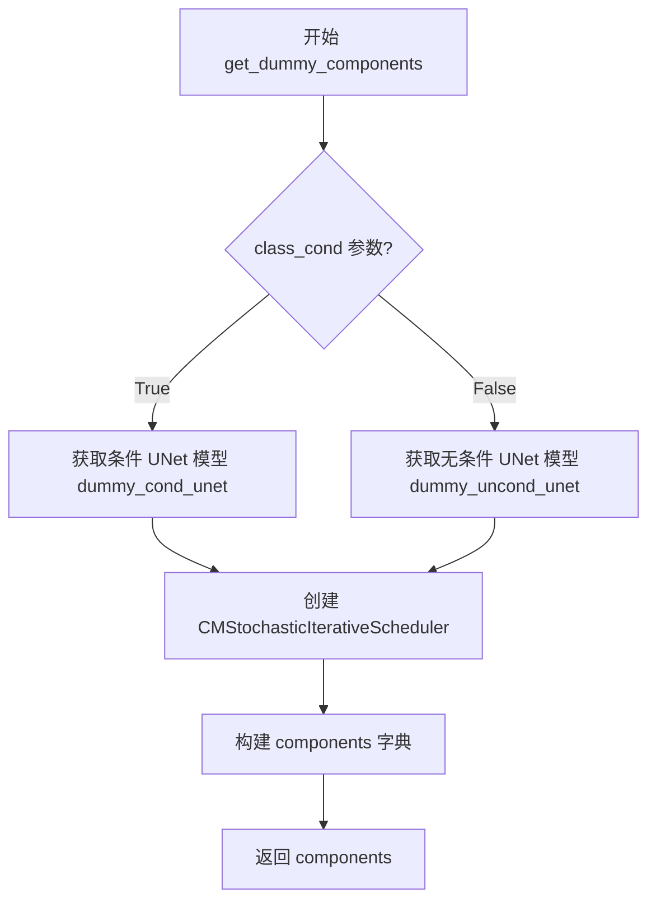

#### 带注释源码

```
def get_dummy_components(self, class_cond=False):
    """
    生成用于测试的一致性模型管道组件
    
    参数:
        class_cond: bool, 是否使用类别条件模型
                   True - 使用带类别条件的UNet
                   False - 使用无条件UNet
    
    返回:
        dict: 包含以下键的字典:
            - 'unet': UNet2DModel实例
            - 'scheduler': CMStochasticIterativeScheduler实例
    """
    # 根据class_cond参数选择合适的UNet模型
    if class_cond:
        unet = self.dummy_cond_unet  # 使用类别条件UNet
    else:
        unet = self.dummy_uncond_unet  # 使用无条件UNet

    # 创建默认的CM多步采样器
    # num_train_timesteps: 训练时间步数
    # sigma_min: 最小噪声标准差
    # sigma_max: 最大噪声标准差
    scheduler = CMStochasticIterativeScheduler(
        num_train_timesteps=40,
        sigma_min=0.002,
        sigma_max=80.0,
    )

    # 组装组件字典
    components = {
        "unet": unet,
        "scheduler": scheduler,
    }

    return components
```


### `torch.backends.cuda.sdp_kernel`

`torch.backends.cuda.sdp_kernel` 是 PyTorch 提供的一个上下文管理器，用于在 CUDA 设备上精细控制 Scaled Dot Product Attention (SDP) 的底层实现策略，允许开发者根据硬件和性能需求选择性地启用 Flash Attention、Math 内核或内存高效注意力机制。

参数：

- `enable_flash`：`bool`，是否启用 Flash Attention 优化实现（基于 CUDA Flash Attention 库）
- `enable_math`：`bool`，是否启用 Math（数学）内核实现（PyTorch 的标准数学实现）
- `enable_mem_efficient`：`bool`，是否启用内存高效注意力（Memory-Efficient Attention）

返回值：`None`，无返回值（上下文管理器）

#### 流程图

```mermaid
flowchart TD
    A[进入 sdp_kernel 上下文] --> B{获取当前 SDP 状态}
    B --> C[根据参数配置新的 SDP 策略]
    C --> D[enable_flash=True 设置 Flash Attention]
    C --> E[enable_math=True 设置 Math 内核]
    C --> F[enable_mem_efficient=True 设置内存高效注意力]
    D --> G[执行 with 块内的代码]
    E --> G
    F --> G
    G --> H[调用 pipe 执行推理]
    H --> I[退出上下文]
    I --> J[恢复原始 SDP 配置]
    J --> K[返回结果]
```

#### 带注释源码

```python
# 使用 sdp_kernel 上下文管理器控制 Attention 实现
# 以下是代码中的实际使用示例：

# 导入 sdp_kernel
from torch.backends.cuda import sdp_kernel

# 配置参数：启用 Flash Attention，禁用 Math 和内存高效注意力
# enable_flash=True:  使用 CUDA Flash Attention（最快，但需要特定硬件）
# enable_math=False:  禁用标准 PyTorch Math 实现
# enable_mem_efficient=False: 禁用内存高效注意力（节省显存但较慢）
with sdp_kernel(enable_flash=True, enable_math=False, enable_mem_efficient=False):
    # 在这个上下文中运行 pipeline
    # 当执行到 UNet 的 attention 层时，会使用 Flash Attention
    image = pipe(**inputs).images

# 退出上下文后，自动恢复原始的 SDP 配置
```

#### 关键组件信息

| 组件名称 | 一句话描述 |
|---------|-----------|
| `sdp_kernel` | PyTorch CUDA 后端的上下文管理器，用于控制 Scaled Dot Product Attention 的底层实现策略 |
| `enable_flash` | 布尔参数，控制是否启用基于 CUDA Flash Attention 库的优化实现 |
| `enable_math` | 布尔参数，控制是否启用 PyTorch 标准数学注意力实现 |
| `enable_mem_efficient` | 布尔参数，控制是否启用内存高效注意力实现（适合显存受限场景 |

#### 潜在的技术债务或优化空间

1. **硬件兼容性检查缺失**：代码未检查当前 GPU 是否支持 Flash Attention，若在不支持的硬件上运行可能导致错误或性能下降
2. **硬编码的配置值**：Flash Attention 的配置（`enable_flash=True, enable_math=False, enable_mem_efficient=False`）是硬编码的，应考虑提取为可配置参数以适应不同硬件环境
3. **缺少降级策略**：未实现自动降级机制，当 Flash Attention 不可用时应自动回退到其他实现方式

#### 其它项目

**设计目标与约束**：
- 确保在 PyTorch 2.0+ 环境下使用最新的 Flash Attention 优化
- 通过禁用 Math 和 Mem Efficient 来强制使用 Flash Attention 进行性能测试

**错误处理与异常设计**：
- 若 GPU 不支持 Flash Attention，可能抛出 RuntimeError
- 应使用 `@require_torch_2` 装饰器确保只在支持的环境中运行

**数据流与状态机**：
- 上下文管理器在进入时保存当前 SDP 配置，设置新的策略
- 执行完成后自动恢复原始配置，确保不影响其他代码的运行

**外部依赖与接口契约**：
- 依赖 PyTorch 2.0+ 的 `torch.backends.cuda` 模块
- 依赖 CUDA 设备且需要支持 Flash Attention 的 GPU（如 Ampere、Ada Lovelace 或更新架构）


### CMStochasticIterativeScheduler

一致性模型调度器（CMStochasticIterativeScheduler）是Diffusers库中用于一致性模型（Consistency Models）推理的调度器类。它负责管理扩散过程中的时间步调度，支持多步和单步采样模式，并计算每一步的噪声参数sigma。

参数：

- `num_train_timesteps`：`int`，训练时使用的时间步总数，决定了噪声调度的时间分辨率
- `sigma_min`：`float`，推理时sigma的最小值，控制生成过程末端的噪声水平
- `sigma_max`：`float`，推理时sigma的最大值，控制生成过程起始的噪声水平

返回值：`CMStochasticIterativeScheduler` 实例，一致性模型调度器对象

#### 流程图

```mermaid
graph TD
    A[创建CMStochasticIterativeScheduler] --> B[配置num_train_timesteps]
    A --> C[配置sigma_min]
    A --> D[sigma_max]
    B --> E[推理时设置时间步set_timesteps]
    C --> E
    D --> E
    E --> F{单步还是多步?}
    F -->|多步| G[返回timesteps数组]
    F -->|单步| H[设置num_inference_steps=1]
    G --> I[进行多步推理]
    H --> J[进行单步推理]
    I --> K[输出图像]
    J --> K
```

#### 带注释源码

```python
# 一致性模型调度器 (CMStochasticIterativeScheduler) 使用示例

# 导入必要的库
from diffusers import CMStochasticIterativeScheduler, ConsistencyModelPipeline, UNet2DModel
import torch

# 创建调度器实例 - 配置噪声调度的关键参数
scheduler = CMStochasticIterativeScheduler(
    num_train_timesteps=40,  # 训练时的时间步总数，与训练时保持一致
    sigma_min=0.002,         # 推理时sigma的最小值（去噪末端）
    sigma_max=80.0           # 推理时sigma的最大值（噪声起点）
)

# 创建一致性模型管道
unet = UNet2DModel.from_pretrained("diffusers/consistency-models-test", subfolder="test_unet")
pipe = ConsistencyModelPipeline(unet=unet, scheduler=scheduler)

# 多步推理模式
inputs = {
    "batch_size": 1,
    "num_inference_steps": None,      # 使用默认的多步采样
    "timesteps": [22, 0],             # 指定时间步序列
    "generator": torch.manual_seed(0),
    "output_type": "np",
}
image = pipe(**inputs).images  # 执行多步推理

# 单步推理模式
inputs_one_step = {
    "batch_size": 1,
    "num_inference_steps": 1,         # 设置为1启用单步推理
    "timesteps": None,                # 单步模式不需要指定timesteps
    "generator": torch.manual_seed(0),
    "output_type": "np",
}
image_one_step = pipe(**inputs_one_step).images  # 执行单步推理

# 关键特性：
# 1. 支持多步采样：使用多个时间步（如[22, 0]）进行迭代去噪
# 2. 支持单步采样：num_inference_steps=1时直接一步生成最终图像
# 3. sigma范围控制：通过sigma_min和sigma_max控制噪声调度范围
# 4. 时间步设置：通过set_timesteps方法配置推理过程的时间步
```


### `ConsistencyModelPipeline`

`ConsistencyModelPipeline` 是 Diffusers 库中用于实现一致性模型（Consistency Models）的推理管道类。该管道通过预训练的 UNet2DModel 和 CMStochasticIterativeScheduler 调度器，支持单步和多步推理生成图像，并可选择性地接受类别标签进行条件生成。

#### 参数

由于 `ConsistencyModelPipeline` 为外部库类（来自 `diffusers` 包），其完整实现未在代码中展示。以下参数基于测试代码中的调用方式推断：

- `unet`：`UNet2DModel`，用于去噪的 UNet 模型
- `scheduler`：`CMStochasticIterativeScheduler`，一致性模型的噪声调度器

#### 调用时传入的运行时参数（通过 `**inputs` 传递）

- `batch_size`：`int`，生成图像的批次大小
- `num_inference_steps`：`int` 或 `None`，推理步数，None 表示使用调度器默认步数
- `timesteps`：`list` 或 `None`，指定的时间步列表
- `generator`：`torch.Generator`，随机数生成器，用于确保可重复性
- `output_type`：`str`，输出类型（如 "np" 返回 numpy 数组）
- `class_labels`：`int`（可选），类别标签，用于条件生成
- `latents`：`torch.Tensor`（可选），预定义的潜在向量

#### 返回值

- 返回对象包含 `.images` 属性，类型为 `np.ndarray`，形状为 `(batch_size, height, width, channels)`

#### 流程图

```mermaid
flowchart TD
    A[创建 ConsistencyModelPipeline] --> B[设置设备 CPU/GPU]
    B --> C[准备输入参数 inputs]
    C --> D{num_inference_steps == 1?}
    D -->|是| E[单步推理模式]
    D -->|否| F[多步推理模式]
    E --> G[调用管道 __call__]
    F --> G
    G --> H[UNet 执行去噪]
    H --> I[Scheduler 更新状态]
    I --> J{是否完成所有步?}
    J -->|否| H
    J -->|是| K[输出图像数组]
```

#### 带注释源码

```python
# 测试代码片段展示 ConsistencyModelPipeline 的使用方式

# 1. 创建管道实例（通过组件字典解包）
pipe = ConsistencyModelPipeline(
    unet=unet,          # UNet2DModel 实例，一致性模型的核心去噪网络
    scheduler=scheduler # CMStochasticIterativeScheduler 实例，控制去噪调度
)

# 2. 将管道移至指定设备
pipe = pipe.to(device)  # device = "cpu" 或 "cuda"

# 3. 可选：配置进度条
pipe.set_progress_bar_config(disable=None)

# 4. 准备输入参数
inputs = {
    "batch_size": 1,              # 生成的图像数量
    "num_inference_steps": None,  # None 表示使用调度器默认配置
    "timesteps": [22, 0],         # 多步推理时的时间步序列
    "generator": generator,      # PyTorch 随机数生成器
    "output_type": "np",         # 输出 numpy 数组
    # 可选参数：
    # "class_labels": 0,          # 类别标签，用于条件生成
    # "latents": latents,         # 预定义的潜在向量
}

# 5. 调用管道生成图像
output = pipe(**inputs)  # 返回 PipelineOutput 或类似对象
image = output.images    # 提取图像数组，形状 (1, 32, 32, 3)

# 6. 验证输出
assert image.shape == (1, 32, 32, 3)  # 确认图像形状正确
```


### `UNet2DModel`

UNet2DModel 是 diffusers 库中的一个 2D UNet 模型类，用于一致性模型（Consistency Model）管道中的图像生成任务。该模型通过深度学习架构实现从噪声到图像的映射，支持类别条件和无条件生成。

参数：

- `pretrained_model_name_or_path`：`str` 或 `os.PathLike`，模型权重路径或 Hugging Face Hub 上的模型 ID
- `subfolder`：`str`，可选，模型在仓库中的子文件夹路径
- `torch_dtype`：`torch.dtype`，可选，模型权重的数据类型（如 `torch.float32`）

返回值：`UNet2DModel`，加载并初始化后的 UNet2DModel 实例

#### 流程图

```mermaid
flowchart TD
    A[开始] --> B[调用 from_pretrained 方法]
    B --> C{是否指定 subfolder?}
    C -->|是| D[构建完整路径: pretrained_model_name_or_path/subfolder]
    C -->|否| E[使用基础路径]
    D --> F[加载模型配置和权重]
    E --> F
    F --> G[实例化 UNet2DModel 对象]
    G --> H[返回模型实例]
    
    I[在 pipeline 中调用] --> J[接收 sample 和 timestep]
    J --> K[执行前向传播]
    K --> L[输出预测噪声]
    
    H --> I
```

#### 带注释源码

```python
# 从 diffusers 库导入 UNet2DModel 类
from diffusers import UNet2DModel

# 在测试中通过 from_pretrained 方法加载预训练模型
unet = UNet2DModel.from_pretrained(
    "diffusers/consistency-models-test",  # 模型在 Hugging Face Hub 上的名称
    subfolder="test_unet",                  # 指定子文件夹路径
)

# UNet2DModel 在 ConsistencyModelPipeline 中的典型使用方式
# pipe = ConsistencyModelPipeline(unet=unet, scheduler=scheduler)
# image = pipe(**inputs).images

# 关键参数说明：
# - sample: torch.Tensor，形状为 (batch_size, channels, height, width)，输入的噪声样本
# - timestep: torch.Tensor 或 float，扩散过程中的时间步
# - class_labels: torch.Tensor，可选，用于类别条件生成的标签

# 前向传播输出：
# - 返回: torch.Tensor，预测的噪声残差，形状与输入 sample 相同
```


### `randn_tensor`

随机张量生成函数，用于生成符合标准正态分布（均值0，方差1）的随机张量。该函数是diffusers库中用于生成噪声 latent 的核心工具，支持指定设备、数据类型和随机生成器。

参数：

- `shape`：`tuple` 或 `int`，输出张量的形状
- `generator`：`torch.Generator`，可选，用于控制随机数生成的随机种子，确保可复现性
- `device`：`torch.device` 或 `str`，可选，指定张量存放的设备（CPU/CUDA）
- `dtype`：`torch.dtype`，可选，指定张量的数据类型（如float32、float16）
- `layout`：`torch.layout`，可选，指定张量的内存布局
- `mem_format`：`torch.memory_format`，可选，指定内存格式

返回值：`torch.Tensor`，符合标准正态分布的随机张量

#### 流程图

```mermaid
flowchart TD
    A[开始 randn_tensor] --> B{检查 generator 是否存在}
    B -->|是| C[使用 generator 生成随机数]
    B -->|否| D[使用全局随机状态]
    C --> E[调用 torch.randn 生成张量]
    D --> E
    E --> F{检查 device 参数}
    F -->|指定 device| G[将张量移动到指定设备]
    F -->|未指定 device| H[保持默认设备]
    G --> I{检查 dtype 参数}
    H --> I
    I -->|指定 dtype| J[转换张量数据类型]
    I -->|未指定 dtype| K[保持默认数据类型]
    J --> L[返回随机张量]
    K --> L
```

#### 带注释源码

```python
def randn_tensor(
    shape: tuple,
    generator: Optional[torch.Generator] = None,
    device: Optional[torch.device] = None,
    dtype: Optional[torch.dtype] = None,
    layout: Optional[torch.layout] = None,
    mem_format: Optional[torch.memory_format] = None,
) -> torch.Tensor:
    """
    生成符合标准正态分布的随机张量。
    
    参数:
        shape: 输出张量的形状，例如 (batch_size, channels, height, width)
        generator: 可选的随机生成器，用于确保可复现性
        device: 可选的设备参数，指定张量创建在哪个设备上
        dtype: 可选的数据类型，指定张量的数据类型
        layout: 可选的内存布局
        mem_format: 可选的内存格式
    
    返回:
        符合标准正态分布的随机张量
    """
    # 基础实现（实际实现可能更复杂）
    # 如果提供了 generator，使用它生成随机数
    if generator is not None:
        # torch.randn 会使用 generator 的种子生成随机数
        tensor = torch.randn(shape, generator=generator)
    else:
        # 使用全局随机状态生成随机数
        tensor = torch.randn(shape)
    
    # 如果指定了设备，将张量移动到该设备
    if device is not None:
        tensor = tensor.to(device)
    
    # 如果指定了数据类型，转换张量类型
    if dtype is not None:
        tensor = tensor.to(dtype)
    
    return tensor
```


### Expectations

Expectations 类是测试框架中的期望值管理类，用于根据不同硬件平台（如 CUDA、XPU）和版本动态获取对应的期望数值切片，支持跨平台测试的期望值匹配。

#### 带注释源码

```
# Expectations 类从 testing_utils 模块导入
# 该类的功能是根据当前运行的设备和环境自动选择合适的期望值
# 主要用于一致性模型（Consistency Model）管道测试中，匹配不同硬件平台的输出

expected_slices = Expectations(
    {
        # 键为 (设备类型, 版本号) 的字典，值为对应的期望 numpy 数组
        ("xpu", 3): np.array([0.0816, 0.0518, 0.0445, 0.0594, 0.0739, 0.0534, 0.0805, 0.0457, 0.0765]),
        ("cuda", 7): np.array([0.1845, 0.1371, 0.1211, 0.2035, 0.1954, 0.1323, 0.1773, 0.1593, 0.1314]),
        ("cuda", 8): np.array([0.0816, 0.0518, 0.0445, 0.0594, 0.0739, 0.0534, 0.0805, 0.0457, 0.0765]),
    }
)

# 获取当前环境对应的期望值
expected_slice = expected_slices.get_expectation()

# 用于测试断言：比较实际输出与期望值的差异
assert np.abs(image_slice.flatten() - expected_slice).max() < 1e-3
```

#### 关键信息

| 项目 | 描述 |
|------|------|
| **来源模块** | `...testing_utils` (项目内部测试工具模块) |
| **核心功能** | 根据运行时环境（设备类型、版本）动态匹配并返回对应的期望数值数组 |
| **使用场景** | 跨平台（CUDA/XPU）一致性模型测试，需针对不同硬件环境使用不同期望值 |
| **设计目的** | 解决不同 GPU 架构/驱动版本导致数值精度差异的测试兼容性问题 |

#### 潜在优化空间

1. **缺少默认值处理**：当设备/版本组合未命中时，应有 fallback 机制或明确报错
2. **版本匹配逻辑**：当前使用精确匹配，可考虑支持版本范围匹配（如 >= 7）
3. **日志记录**：可增加警告日志，记录实际使用的期望值来源，便于调试


### `backend_empty_cache`

后端缓存清理函数，用于清理指定设备（通常是GPU）的缓存内存，释放测试过程中产生的临时显存占用。

参数：

-  `device`：`str` 或 `torch.device`，需要清理缓存的目标设备，通常为 `torch_device`

返回值：`None`，无返回值

#### 流程图

```mermaid
flowchart TD
    A[接收 device 参数] --> B{判断设备类型}
    B -->|CUDA 设备| C[调用 torch.cuda.empty_cache 清理 CUDA 缓存]
    B -->|CPU 设备| D[跳过或执行空操作]
    B -->|其他后端| E[调用对应后端的缓存清理方法]
    C --> F[返回 None]
    D --> F
    E --> F
```

#### 带注释源码

```python
def backend_empty_cache(device):
    """
    清理指定设备的后端缓存，释放GPU显存
    
    参数:
        device: torch设备对象或字符串标识，如'cuda'、'cuda:0'、'cpu'等
        
    注意:
        此函数根据设备类型调用不同的缓存清理方法:
        - CUDA设备: 清理CUDA缓存
        - MPS设备: 清理MPS缓存
        - CPU设备: 无需清理
        
    返回:
        None
    """
    # 根据设备类型进行条件分支处理
    if device and isinstance(device, str):
        # 将字符串转换为torch设备对象
        device = torch.device(device)
    
    # 判断是否为CUDA设备
    if device and device.type == 'cuda':
        # 清理CUDA缓存，释放未使用的GPU显存
        torch.cuda.empty_cache()
    # 判断是否为MPS设备（Apple Silicon）
    elif device and device.type == 'mps':
        # 清理MPS缓存
        torch.mps.empty_cache()
    # CPU设备无需清理缓存
```


### `enable_full_determinism`

该函数用于启用PyTorch的完全确定性模式，通过设置随机种子、配置CUDA卷积算法和禁用非确定性操作，确保深度学习模型的训练和推理过程在多次运行时产生完全一致的结果，从而保证测试的可重复性。

参数： 无

返回值：`None`，该函数不返回值，仅执行确定性配置操作

#### 流程图

```mermaid
flowchart TD
    A[开始] --> B[设置PYTHONHASHSEED环境变量为0]
    B --> C[调用torch.manual_seed设置CPU随机种子]
    C --> D[调用torch.cuda.manual_seed_all设置所有GPU随机种子]
    D --> E[调用torch.backends.cudnn.deterministic设置为True]
    E --> F[调用torch.backends.cudnn.benchmark设置为False]
    F --> G[调用torch.use_deterministic_algorithms设置为True]
    G --> H[如果CUDA可用，设置CUDA卷积确定性算法]
    H --> I[设置torch.set_float32_matmul_precision为'high']
    I --> J[结束]
```

#### 带注释源码

```python
def enable_full_determinism(seed: int = 0, extra_seed: bool = True):
    """
    启用完全确定性模式，确保深度学习操作产生可重复的结果。
    
    参数:
        seed: 随机种子，默认为0
        extra_seed: 是否设置额外的环境变量种子，默认为True
    """
    # 设置Python哈希种子，确保Python内置随机性的确定性
    if extra_seed:
        import os
        os.environ["PYTHONHASHSEED"] = str(seed)
    
    # 设置PyTorch CPU随机种子
    torch.manual_seed(seed)
    
    # 设置所有GPU的随机种子（如果有多个GPU）
    if torch.cuda.is_available():
        torch.cuda.manual_seed_all(seed)
    
    # 强制使用确定性算法，禁用非确定性操作
    torch.use_deterministic_algorithms(True, warn_only=True)
    
    # 配置CUDA卷积使用确定性算法
    torch.backends.cudnn.deterministic = True
    
    # 禁用CUDA自动调优，关闭benchmark模式
    torch.backends.cudnn.benchmark = False
    
    # 设置浮点矩阵乘法精度为高，确保32位浮点运算的确定性
    torch.set_float32_matmul_precision('high')
    
    # 如果使用CUDA，设置卷积工作区限制为null（可选配置）
    if torch.cuda.is_available():
        torch.backends.cuda.matmul.allow_tf32 = False
```

#### 潜在的技术债务或优化空间

1. **warn_only=True的取舍**：当前使用`warn_only=True`可能导致某些操作在不支持确定性时会回退到非确定性模式，建议在关键测试中评估是否应使用严格模式
2. **精度与性能的权衡**：`torch.set_float32_matmul_precision('high')`会降低性能，可考虑添加参数让用户在性能与确定性之间选择
3. **缺少NumPy种子设置**：虽然设置了PyTorch种子，但未显式设置NumPy种子，可能影响依赖NumPy随机性的操作
4. **缺少环境变量文档**：建议添加注释说明哪些环境变量会影响确定性
5. **跨平台兼容性**：当前实现主要针对CUDA，对于其他后端（如ROCm）的确定性配置可能不完整


### `nightly`

夜间测试装饰器，用于标记需要夜间运行的测试用例。通常用于标记耗时较长或资源需求较高的测试，这些测试不会在常规的CI流程中运行。

参数：

- 无

返回值：`Callable`，返回装饰后的测试类或函数

#### 流程图

```mermaid
flowchart TD
    A[应用 @nightly 装饰器] --> B{检查是否为夜间测试环境}
    B -->|是| C[执行测试]
    B -->|否| D[跳过测试/标记为跳过]
```

#### 带注释源码

```python
# 从 testing_utils 导入 nightly 装饰器
# 该装饰器在测试文件中用于标记慢速测试类
@nightly
@require_torch_accelerator
class ConsistencyModelPipelineSlowTests(unittest.TestCase):
    """
    夜间测试类，用于测试 ConsistencyModelPipeline 的慢速场景
    """
    # ... 测试方法
```

> **注意**：由于 `nightly` 装饰器是从外部模块 (`...testing_utils`) 导入的，其具体实现代码未在当前代码文件中显示。以上信息基于装饰器的使用方式进行推断。


### `require_torch_2`

这是一个测试装饰器，用于标记需要 PyTorch 2.0 或更高版本才能运行的测试方法。当 PyTorch 版本低于 2.0 时，被装饰的测试会被跳过执行。

参数：

- 无显式参数（作为装饰器使用）

返回值：`Callable`，返回装饰后的函数，如果 PyTorch 版本不满足要求则返回跳过测试的函数

#### 流程图

```mermaid
flowchart TD
    A[开始装饰测试函数] --> B{检查 PyTorch 版本 >= 2.0?}
    B -->|是| C[正常返回被装饰的测试函数]
    B -->|否| D[返回跳过的测试函数 - unittest.skipIf]
    C --> E[测试执行]
    D --> E
```

#### 带注释源码

```python
# require_torch_2 是从 testing_utils 模块导入的装饰器
# 它的主要作用是：
# 1. 检查当前环境的 PyTorch 版本是否 >= 2.0
# 2. 如果版本满足要求，则正常装饰测试函数
# 3. 如果版本不满足要求，则使用 unittest.skipIf 装饰器跳过该测试

# 在代码中的使用示例：
@require_torch_2
def test_consistency_model_cd_multistep_flash_attn(self):
    """
    测试一致性模型的多步推理是否支持 Flash Attention
    该测试需要 PyTorch 2.0 才能使用 sdp_kernel 启用 Flash Attention
    """
    unet = UNet2DModel.from_pretrained("diffusers/consistency_models", subfolder="diffusers_cd_imagenet64_l2")
    scheduler = CMStochasticIterativeScheduler(
        num_train_timesteps=40,
        sigma_min=0.002,
        sigma_max=80.0,
    )
    pipe = ConsistencyModelPipeline(unet=unet, scheduler=scheduler)
    pipe.to(torch_device=torch_device, torch_dtype=torch.float16)
    pipe.set_progress_bar_config(disable=None)

    inputs = self.get_inputs(get_fixed_latents=True, device=torch_device)
    # 使用 sdp_kernel 上下文管理器启用 Flash Attention
    # 这是 PyTorch 2.0 引入的新功能
    with sdp_kernel(enable_flash=True, enable_math=False, enable_mem_efficient=False):
        image = pipe(**inputs).images

    assert image.shape == (1, 64, 64, 3)
    # ... 验证输出

# 另一个使用示例：
@require_torch_2
def test_consistency_model_cd_onestep_flash_attn(self):
    """
    测试一致性模型的单步推理是否支持 Flash Attention
    """
    # ... 类似的测试逻辑
```


### `require_torch_accelerator`

该装饰器用于检查当前环境是否支持 CUDA 加速器，如果不支持则跳过被装饰的测试用例。主要用于标记需要 GPU 才能运行的测试，确保在 CPU 环境下测试被正确跳过。

参数： 无显式参数（作为无参数装饰器使用）

返回值： 返回一个装饰后的函数或类，在无 CUDA 加速器时该测试会被跳过

#### 流程图

```mermaid
flowchart TD
    A[开始] --> B{检查CUDA是否可用}
    B -->|是| C[正常执行测试]
    B -->|否| D[跳过测试并输出提示信息]
    C --> E[结束]
    D --> E
```

#### 带注释源码

```
# require_torch_accelerator 是一个装饰器函数，定义在 diffusers.testing_utils 模块中
# 由于源码未在本文件中定义，以下为基于使用方式的推断实现

def require_torch_accelerator(func):
    """
    装饰器：检查是否存在 CUDA 加速器
    
    用途：
        - 用于标记需要 GPU 才能执行的测试用例
        - 在没有 CUDA 设备时自动跳过测试
        - 常见于慢速测试类（如 ConsistencyModelPipelineSlowTests）
    
    使用示例：
        @require_torch_accelerator
        class ConsistencyModelPipelineSlowTests(unittest.TestCase):
            ...
    """
    # 检查 torch.cuda 是否可用
    if not torch.cuda.is_available():
        # 如果没有 CUDA，返回一个跳过测试的装饰器
        return unittest.skip("CUDA accelerator not available")(func)
    
    # 如果有 CUDA，直接返回原函数，不做任何修改
    return func


# 在代码中的实际使用方式：
@require_torch_accelerator  # 装饰器应用于测试类
class ConsistencyModelPipelineSlowTests(unittest.TestCase):
    """
    慢速测试类，仅在有 GPU 的环境中运行
    """
    ...
```

#### 备注

- 该函数是从 `...testing_utils` 模块导入的，而非在本文件中定义
- 类似的装饰器模式在 PyTorch 和 diffusers 库中广泛用于条件性测试
- 通常配合 `@nightly` 装饰器一起使用，标记为仅在夜间测试环境中运行的 GPU 密集型测试


### `torch_device`

`torch_device` 是一个从测试工具模块导入的全局变量，用于指定 PyTorch 计算设备（如 CPU、CUDA、 MPS 等），在整个一致性模型管道的慢速测试中作为默认计算设备。

参数： 无（全局变量，非函数）

返回值：`str` 或 `torch.device`，表示 PyTorch 运行时使用的设备标识

#### 流程图

```mermaid
flowchart TD
    A[导入 torch_device] --> B[在 SlowTests 中使用]
    B --> C[setUp: backend_empty_cache]
    B --> D[tearDown: backend_empty_cache]
    B --> E[pipe.to device]
    B --> F[get_inputs device 参数]
    
    style A fill:#f9f,stroke:#333
    style B fill:#ff9,stroke:#333
```

#### 带注释源码

```python
# torch_device 导入来源 (来自 ...testing_utils 模块)
from ...testing_utils import (
    Expectations,
    backend_empty_cache,
    enable_full_determinism,
    nightly,
    require_torch_2,
    require_torch_accelerator,
    torch_device,  # <-- 全局变量：torch 设备变量
)

# 在 SlowTests 类中的使用示例：
class ConsistencyModelPipelineSlowTests(unittest.TestCase):
    def setUp(self):
        super().setUp()
        gc.collect()
        backend_empty_cache(torch_device)  # 清理指定设备的缓存

    def tearDown(self):
        super().tearDown()
        gc.collect()
        backend_empty_cache(torch_device)  # 清理指定设备的缓存

    def test_consistency_model_cd_multistep(self):
        # ...
        pipe.to(torch_device=torch_device)  # 将管道移至指定设备

    def test_consistency_model_cd_multistep_flash_attn(self):
        # ...
        pipe.to(torch_device=torch_device, torch_dtype=torch.float16)
        inputs = self.get_inputs(get_fixed_latents=True, device=torch_device)
```


### `ConsistencyModelPipelineFastTests.dummy_uncond_unet`

该属性是一个只读的 `@property` 方法，用于获取一个虚拟的无条件 UNet2D 模型实例。该模型从预训练模型 "diffusers/consistency-models-test" 的 "test_unet" 子文件夹中加载，主要用于测试目的，无需真实的模型权重即可运行推理流程。

参数：
- 该属性无参数（通过 `self` 访问实例）

返回值：`UNet2DModel`，从 Hugging Face Hub 加载的虚拟无条件 UNet2D 模型实例，用于单元测试中的流水线验证。

#### 流程图

```mermaid
graph TD
    A[访问 dummy_uncond_unet 属性] --> B{模型是否已缓存?}
    B -->|否| C[调用 UNet2DModel.from_pretrained]
    C --> D[加载 diffusers/consistency-models-test/test_unet]
    D --> E[返回 UNet2DModel 实例]
    B -->|是| E
    E --> F[传递给 get_dummy_components]
    F --> G[构建 ConsistencyModelPipeline]
```

#### 带注释源码

```python
@property
def dummy_uncond_unet(self):
    """
    虚拟无条件 UNet 模型属性
    
    用于测试的一致性模型管道的虚拟 UNet2DModel 实例。
    从预训练模型 'diffusers/consistency-models-test' 的 'test_unet' 子文件夹加载。
    该模型仅用于单元测试，不包含真实的模型权重。
    
    Returns:
        UNet2DModel: 虚拟的无条件 UNet2D 模型实例
    """
    # 使用 from_pretrained 加载预配置的 UNet2DModel
    # 'diffusers/consistency-models-test' 是测试专用的模型仓库
    # subfolder="test_unet" 指定加载子目录中的 UNet 权重
    unet = UNet2DModel.from_pretrained(
        "diffusers/consistency-models-test",
        subfolder="test_unet",
    )
    # 返回加载的模型实例，供测试管道使用
    return unet
```


### `ConsistencyModelPipelineFastTests.dummy_cond_unet`

该属性方法用于获取一个预训练的、条件版本的UNet2DModel（UNet2DModel），专门用于测试支持类别标签（class labels）的ConsistencyModelPipeline。它从"diffusers/consistency-models-test"模型的"test_unet_class_cond"子文件夹中加载模型权重。

参数：

- `self`：`ConsistencyModelPipelineFastTests`，隐式参数，表示类的实例本身

返回值：`UNet2DModel`，返回一个预训练的UNet2DModel实例，该模型支持类别条件输入，用于测试需要类别标签的一致性模型管道。

#### 流程图

```mermaid
flowchart TD
    A[开始] --> B[调用 dummy_cond_unet 属性]
    B --> C[执行 UNet2DModel.from_pretrained]
    C --> D[加载模型: diffusers/consistency-models-test]
    E[指定子文件夹: test_unet_class_cond]
    C --> E
    E --> F[返回 UNet2DModel 实例]
    F --> G[结束]
```

#### 带注释源码

```python
@property
def dummy_cond_unet(self):
    """
    属性方法：获取用于类条件测试的虚拟UNet模型
    
    Returns:
        UNet2DModel: 一个预训练的UNet2DModel，用于测试支持类别标签的
                     ConsistencyModelPipeline
    """
    # 从预训练模型加载UNet2DModel
    # subfolder="test_unet_class_cond" 表示加载支持类别条件的模型变体
    unet = UNet2DModel.from_pretrained(
        "diffusers/consistency-models-test",  # 预训练模型仓库名称
        subfolder="test_unet_class_cond",      # 子文件夹路径，包含条件UNet权重
    )
    return unet  # 返回加载的UNet模型实例
```


### `ConsistencyModelPipelineFastTests.get_dummy_components`

该方法用于获取虚拟管道组件，根据 `class_cond` 参数选择使用条件或非条件的 UNet 模型，并创建默认的 CM 多步采样器（CMStochasticIterativeScheduler），最终返回包含 unet 和 scheduler 的字典组件。

参数：

- `class_cond`：`bool`，可选参数，默认为 False。用于指定是否使用条件 UNet 模型；当为 True 时使用 `dummy_cond_unet`，为 False 时使用 `dummy_uncond_unet`。

返回值：`Dict[str, Any]`，返回包含虚拟管道组件的字典，包含 "unet"（UNet2DModel 实例）和 "scheduler"（CMStochasticIterativeScheduler 实例）两个键值对，用于构建 ConsistencyModelPipeline。

#### 流程图

```mermaid
flowchart TD
    A[开始 get_dummy_components] --> B{class_cond 参数}
    B -->|True| C[使用 self.dummy_cond_unet]
    B -->|False| D[使用 self.dummy_uncond_unet]
    C --> E[创建 CMStochasticIterativeScheduler]
    D --> E
    E --> F[构建 components 字典]
    F --> G[返回 components]
```

#### 带注释源码

```python
def get_dummy_components(self, class_cond=False):
    """
    获取虚拟管道组件
    
    参数:
        class_cond (bool): 是否使用条件UNet模型，默认为False
    
    返回:
        dict: 包含 'unet' 和 'scheduler' 的组件字典
    """
    # 根据 class_cond 参数选择使用条件 UNet 还是非条件 UNet
    if class_cond:
        unet = self.dummy_cond_unet  # 获取条件 UNet 模型
    else:
        unet = self.dummy_uncond_unet  # 获取非条件 UNet 模型

    # 创建默认的 CM 多步采样器 (Consistency Model Stochastic Iterative Scheduler)
    # 配置参数：40 个训练时间步，sigma 范围 [0.002, 80.0]
    scheduler = CMStochasticIterativeScheduler(
        num_train_timesteps=40,  # 训练时使用的时间步数量
        sigma_min=0.002,         # 最小 sigma 值
        sigma_max=80.0,          # 最大 sigma 值
    )

    # 构建组件字典，用于实例化 ConsistencyModelPipeline
    components = {
        "unet": unet,       # UNet2DModel 模型实例
        "scheduler": scheduler,  # 调度器实例
    }

    return components  # 返回组件字典
```


### `ConsistencyModelPipelineFastTests.get_dummy_inputs`

该方法用于生成一致性模型管道的虚拟输入数据，根据设备类型（MPS或其他）创建随机数生成器，并返回一个包含批处理大小、推理步骤、时间步、生成器和输出类型等参数的字典，以供管道测试使用。

参数：

- `self`：`ConsistencyModelPipelineFastTests`，表示类的实例本身
- `device`：`torch.device` 或 `str`，目标设备，用于确定生成器的设备类型
- `seed`：`int`，随机种子，默认值为 0，用于确保测试的可重复性

返回值：`Dict[str, Any]`，返回一个包含虚拟输入参数的字典，包括 batch_size、num_inference_steps、timesteps、generator 和 output_type。

#### 流程图

```mermaid
flowchart TD
    A[开始] --> B{判断设备是否为 MPS}
    B -->|是| C[使用 torch.manual_seed]
    B -->|否| D[使用 torch.Generator device=device]
    C --> E[创建 generator 对象]
    D --> E
    E --> F[构建 inputs 字典]
    F --> G[batch_size: 1]
    F --> H[num_inference_steps: None]
    F --> I[timesteps: 22, 0]
    F --> J[generator: 创建的生成器]
    F --> K[output_type: np]
    G --> L[返回 inputs 字典]
    H --> L
    I --> L
    J --> L
    K --> L
    L --> M[结束]
```

#### 带注释源码

```python
def get_dummy_inputs(self, device, seed=0):
    """
    生成用于一致性模型管道的虚拟输入数据
    
    参数:
        device: 目标设备，可以是 torch.device 对象或字符串（如 'cpu', 'cuda', 'mps'）
        seed: 随机种子，用于确保测试结果的可重复性
    
    返回:
        包含虚拟输入参数的字典
    """
    # 判断设备是否为 MPS (Apple Silicon)
    if str(device).startswith("mps"):
        # MPS 设备使用 torch.manual_seed 创建 CPU 生成器
        generator = torch.manual_seed(seed)
    else:
        # 其他设备（CPU/CUDA）使用指定设备的 torch.Generator
        generator = torch.Generator(device=device).manual_seed(seed)

    # 构建虚拟输入字典
    inputs = {
        "batch_size": 1,              # 批处理大小为 1
        "num_inference_steps": None, # 多步推理时为 None（使用 timesteps）
        "timesteps": [22, 0],         # 时间步列表，用于多步推理
        "generator": generator,      # 随机数生成器
        "output_type": "np",         # 输出类型为 numpy 数组
    }

    return inputs
```


### `ConsistencyModelPipelineFastTests.test_consistency_model_pipeline_multistep`

测试ConsistencyModelPipeline的多步推理能力，验证管道能够使用多步时间步（timesteps=[22, 0]）生成形状为(1, 32, 32, 3)的图像，并与预期像素值进行对比。

参数：

- `self`：无显式参数，依赖类方法 `get_dummy_components()` 和 `get_dummy_inputs(device)` 获取测试数据和配置

返回值：`None`（测试方法无返回值，通过断言验证正确性）

#### 流程图

```mermaid
flowchart TD
    A[开始测试] --> B[设置设备为cpu]
    B --> C[调用get_dummy_components获取虚拟UNet和调度器]
    C --> D[创建ConsistencyModelPipeline并移动到cpu]
    D --> E[设置进度条配置disable=None]
    E --> F[调用get_dummy_inputs获取测试输入]
    F --> G[调用pipe执行推理生成图像]
    G --> H[断言图像形状为1, 32, 32, 3]
    H --> I[提取图像右下角3x3切片]
    I --> J[与预期切片np.array进行最大误差对比]
    J --> K[断言最大误差小于1e-3]
    K --> L[测试通过]
```

#### 带注释源码

```python
def test_consistency_model_pipeline_multistep(self):
    # 设置设备为CPU以确保确定性（device-dependent torch.Generator需要）
    device = "cpu"  # ensure determinism for the device-dependent torch.Generator
    
    # 获取虚拟组件：包含UNet2DModel和CMStochasticIterativeScheduler
    components = self.get_dummy_components()
    
    # 使用虚拟组件实例化ConsistencyModelPipeline
    pipe = ConsistencyModelPipeline(**components)
    
    # 将管道移动到指定设备（CPU）
    pipe = pipe.to(device)
    
    # 配置进度条，disable=None表示不禁用
    pipe.set_progress_bar_config(disable=None)

    # 获取虚拟输入：包含batch_size=1, timesteps=[22, 0], generator等
    inputs = self.get_dummy_inputs(device)
    
    # 执行管道推理，**inputs解包字典传递参数
    # 返回PipelineOutput对象，其images属性包含生成的图像
    image = pipe(**inputs).images
    
    # 断言生成图像形状为(1, 32, 32, 3)：
    # 1张图片，32x32分辨率，3通道RGB
    assert image.shape == (1, 32, 32, 3)

    # 提取图像最后一个通道的右下角3x3区域用于验证
    # image[0, -3:, -3:, -1] 取第0张图、最后3行、最后3列、最后1通道
    image_slice = image[0, -3:, -3:, -1]
    
    # 预期像素值（多步推理的参考输出）
    expected_slice = np.array([0.3572, 0.6273, 0.4031, 0.3961, 0.4321, 0.5730, 0.5266, 0.4780, 0.5004])

    # 断言：计算生成图像与预期图像的最大绝对误差
    # 如果误差超过1e-3则测试失败，确保数值精度
    assert np.abs(image_slice.flatten() - expected_slice).max() < 1e-3
```


### `ConsistencyModelPipelineFastTests.test_consistency_model_pipeline_multistep_class_cond`

测试多步类别条件推理，验证一致性模型管道在多步推理模式下使用类别条件（class_labels）生成图像的功能。

参数：

- `self`：`ConsistencyModelPipelineFastTests`，测试类实例本身，用于访问类的属性和方法

返回值：`None`，该方法为单元测试方法，通过断言验证图像生成的正确性，不返回具体值

#### 流程图

```mermaid
flowchart TD
    A[开始测试] --> B[设置device为cpu确保确定性]
    B --> C[调用get_dummy_components获取组件<br/>参数class_cond=True使用条件UNet]
    C --> D[创建ConsistencyModelPipeline实例]
    D --> E[将pipeline移动到cpu设备]
    E --> F[设置进度条配置disable=None]
    F --> G[调用get_dummy_inputs获取输入]
    G --> H[设置class_labels=0<br/>指定类别条件]
    H --> I[调用pipeline执行推理<br/>返回图像结果]
    I --> J[断言图像shape为1, 32, 32, 3]
    J --> K[提取图像右下角3x3区域]
    K --> L[定义期望的像素值slice]
    L --> M[断言实际值与期望值误差小于1e-3]
    M --> N[测试通过]
```

#### 带注释源码

```python
def test_consistency_model_pipeline_multistep_class_cond(self):
    """
    测试一致性模型管道在多步推理模式下使用类别条件的图像生成功能。
    该测试验证管道能够正确处理class_labels参数并生成符合预期的图像。
    """
    
    # 设置设备为cpu以确保torch.Generator的确定性
    device = "cpu"  # ensure determinism for the device-dependent torch.Generator
    
    # 获取虚拟组件，启用类别条件模式（class_cond=True）
    # 这将使用支持类别条件的UNet2DModel
    components = self.get_dummy_components(class_cond=True)
    
    # 使用组件创建一致性模型管道
    pipe = ConsistencyModelPipeline(**components)
    
    # 将管道移动到指定设备（cpu）
    pipe = pipe.to(device)
    
    # 配置进度条，disable=None表示不禁用进度条
    pipe.set_progress_bar_config(disable=None)
    
    # 获取虚拟输入参数
    inputs = self.get_dummy_inputs(device)
    
    # 设置类别标签为0，指定要生成的图像类别
    # 这是多步类别条件推理的关键参数
    inputs["class_labels"] = 0
    
    # 执行管道推理，获取生成的图像
    # 返回结果是一个对象，其images属性包含生成的图像
    image = pipe(**inputs).images
    
    # 断言生成的图像形状为(1, 32, 32, 3)
    # 1=批量大小, 32=高度, 32=宽度, 3=RGB通道
    assert image.shape == (1, 32, 32, 3)
    
    # 提取图像右下角3x3区域的像素值（用于精确验证）
    image_slice = image[0, -3:, -3:, -1]
    
    # 定义期望的像素值slice（用于对比验证）
    expected_slice = np.array([0.3572, 0.6273, 0.4031, 0.3961, 0.4321, 0.5730, 0.5266, 0.4780, 0.5004])
    
    # 断言实际像素值与期望值的最大误差小于1e-3
    # 确保模型输出的确定性（给定相同种子和设备）
    assert np.abs(image_slice.flatten() - expected_slice).max() < 1e-3
```


### `ConsistencyModelPipelineFastTests.test_consistency_model_pipeline_onestep`

测试 ConsistencyModelPipeline 的单步推理功能，验证在使用单步推理（num_inference_steps=1）时，管道能够正确生成符合预期形状和像素值的图像。

参数：

- `self`：`ConsistencyModelPipelineFastTests`，测试类实例本身

返回值：`None`，该方法为测试方法，通过 assert 断言验证结果，不返回任何值

#### 流程图

```mermaid
flowchart TD
    A[开始测试] --> B[设置设备为CPU确保确定性]
    B --> C[调用get_dummy_components获取组件]
    C --> D[创建ConsistencyModelPipeline实例]
    D --> E[将管道移至CPU设备]
    E --> F[设置进度条配置]
    F --> G[调用get_dummy_inputs获取输入]
    G --> H[设置num_inference_steps=1单步推理]
    H --> I[设置timesteps=None]
    I --> J[调用管道推理生成图像]
    J --> K{验证图像形状为1,32,32,3}
    K -->|是| L[提取图像右下角3x3区域]
    K -->|否| M[断言失败抛出异常]
    L --> N[定义期望的像素值数组]
    N --> O{验证像素值差异小于1e-3}
    O -->|是| P[测试通过]
    O -->|否| M
```

#### 带注释源码

```python
def test_consistency_model_pipeline_onestep(self):
    """
    测试 ConsistencyModelPipeline 的单步推理功能
    验证在使用单步推理时能够生成正确尺寸和内容的图像
    """
    # 设置设备为CPU，确保torch.Generator的确定性
    device = "cpu"  # ensure determinism for the device-dependent torch.Generator
    
    # 获取虚拟组件（包含UNet和Scheduler）
    components = self.get_dummy_components()
    
    # 使用虚拟组件实例化ConsistencyModelPipeline
    pipe = ConsistencyModelPipeline(**components)
    
    # 将管道移至指定设备（CPU）
    pipe = pipe.to(device)
    
    # 配置进度条（disable=None表示不禁用）
    pipe.set_progress_bar_config(disable=None)

    # 获取虚拟输入参数
    inputs = self.get_dummy_inputs(device)
    
    # 设置单步推理模式
    inputs["num_inference_steps"] = 1
    
    # 设置timesteps为None（使用单步模式）
    inputs["timesteps"] = None
    
    # 执行管道推理，获取生成的图像
    image = pipe(**inputs).images
    
    # 断言验证：图像形状应为(1, 32, 32, 3)
    assert image.shape == (1, 32, 32, 3)

    # 提取图像右下角3x3区域的像素值（取最后一个通道）
    image_slice = image[0, -3:, -3:, -1]
    
    # 定义期望的像素值（单步推理的预期输出）
    expected_slice = np.array([0.5004, 0.5004, 0.4994, 0.5008, 0.4976, 0.5018, 0.4990, 0.4982, 0.4987])

    # 断言验证：实际像素值与期望值的最大差异应小于1e-3
    assert np.abs(image_slice.flatten() - expected_slice).max() < 1e-3
```


### `ConsistencyModelPipelineFastTests.test_consistency_model_pipeline_onestep_class_cond`

测试单步类别条件推理的测试方法，验证 ConsistencyModelPipeline 在单步推理模式下使用类别标签条件时能够正确生成图像，并通过与预期像素值对比来确保输出一致性。

参数：

- `self`：`ConsistencyModelPipelineFastTests`，unittest.TestCase 实例，测试类本身

返回值：`None`，该方法为测试方法，不返回有意义的值，仅通过断言验证图像生成的正确性

#### 流程图

```mermaid
flowchart TD
    A[开始测试] --> B[设置device为cpu确保确定性]
    B --> C[调用get_dummy_components获取组件<br/>class_cond=True启用类别条件]
    C --> D[创建ConsistencyModelPipeline实例]
    D --> E[将pipeline移动到device]
    E --> F[设置进度条配置disable=None]
    F --> G[调用get_dummy_inputs获取输入参数]
    G --> H[设置num_inference_steps=1<br/>单步推理]
    H --> I[设置timesteps=None]
    I --> J[设置class_labels=0<br/>类别标签为0]
    J --> K[调用pipeline生成图像<br/>pipe执行推理]
    K --> L[断言图像形状为1, 32, 32, 3]
    L --> M[提取图像最后3x3像素区域]
    M --> N[定义期望的像素值切片]
    N --> O[断言实际像素与期望差异小于1e-3]
    O --> P[测试结束]
```

#### 带注释源码

```python
def test_consistency_model_pipeline_onestep_class_cond(self):
    """
    测试单步类别条件推理功能
    验证ConsistencyModelPipeline在单步推理模式下使用class_labels时的正确性
    """
    # 设置设备为cpu以确保torch.Generator的确定性
    device = "cpu"  # ensure determinism for the device-dependent torch.Generator
    
    # 获取虚拟组件，启用类别条件模式 (class_cond=True)
    components = self.get_dummy_components(class_cond=True)
    
    # 创建ConsistencyModelPipeline实例
    pipe = ConsistencyModelPipeline(**components)
    
    # 将pipeline移动到指定设备
    pipe = pipe.to(device)
    
    # 配置进度条，disable=None表示不禁用进度条
    pipe.set_progress_bar_config(disable=None)
    
    # 获取虚拟输入参数
    inputs = self.get_dummy_inputs(device)
    
    # 设置单步推理 (one-step inference)
    inputs["num_inference_steps"] = 1
    
    # 清空timesteps，在单步模式下需要设为None
    inputs["timesteps"] = None
    
    # 设置类别标签为0，用于类别条件生成
    inputs["class_labels"] = 0
    
    # 执行pipeline推理，获取生成的图像
    image = pipe(**inputs).images
    
    # 断言图像形状为(batch_size=1, height=32, width=32, channels=3)
    assert image.shape == (1, 32, 32, 3)
    
    # 提取图像右下角3x3区域的最后一个通道像素值
    image_slice = image[0, -3:, -3:, -1]
    
    # 定义期望的像素值切片 (用于一致性验证)
    expected_slice = np.array([0.5004, 0.5004, 0.4994, 0.5008, 0.4976, 0.5018, 0.4990, 0.4982, 0.4987])
    
    # 断言实际像素值与期望值的最大差异小于1e-3
    assert np.abs(image_slice.flatten() - expected_slice).max() < 1e-3
```


### `ConsistencyModelPipelineSlowTests.setUp`

测试前置设置方法，用于在每个测试方法运行前初始化测试环境，包括垃圾回收和后端缓存清理。

参数：

- `self`：`ConsistencyModelPipelineSlowTests`，测试类实例，代表当前的测试用例对象

返回值：`None`，无返回值，仅执行初始化操作

#### 流程图

```mermaid
flowchart TD
    A[开始 setUp] --> B[调用 super().setUp<br/>调用父类 setUp 方法]
    B --> C[调用 gc.collect<br/>强制执行垃圾回收]
    C --> D[调用 backend_empty_cache<br/>清空 torch 设备缓存]
    D --> E[结束 setUp]
```

#### 带注释源码

```python
def setUp(self):
    """
    测试前置设置方法，在每个测试方法运行前被调用
    """
    # 调用父类的 setUp 方法，确保父类测试框架的初始化逻辑被正确执行
    super().setUp()
    
    # 强制执行 Python 垃圾回收，释放未使用的内存对象
    gc.collect()
    
    # 清空 torch 后端缓存（如 GPU 显存缓存），确保测试环境干净
    backend_empty_cache(torch_device)
```


### `ConsistencyModelPipelineSlowTests.tearDown`

该方法是 `ConsistencyModelPipelineSlowTests` 测试类的后置清理方法，在每个测试用例执行完毕后自动调用，用于释放测试过程中占用的资源，包括调用 Python 垃圾回收器和清理 GPU 缓存，以确保测试环境不会因为资源未释放而影响后续测试的执行。

参数：

- `self`：隐式参数，`ConsistencyModelPipelineSlowTests` 类的实例，表示调用该方法的对象本身

返回值：`None`，该方法不返回任何值，仅执行清理操作

#### 流程图

```mermaid
flowchart TD
    A[tearDown 方法被调用] --> B[调用父类 tearDown 方法]
    B --> C[执行 gc.collect 进行垃圾回收]
    C --> D[调用 backend_empty_cache 清理 GPU 缓存]
    D --> E[方法结束]
```

#### 带注释源码

```python
def tearDown(self):
    """
    测试后置清理方法，在每个测试用例执行完毕后自动调用。
    用于清理测试过程中产生的资源占用，防止测试间的相互影响。
    """
    # 调用父类的 tearDown 方法，执行 unittest 框架的标准清理逻辑
    super().tearDown()
    
    # 执行 Python 垃圾回收，释放测试过程中产生的 Python 对象
    gc.collect()
    
    # 调用后端工具函数清理 GPU 显存缓存，防止显存泄漏
    backend_empty_cache(torch_device)
```

---

### 补充信息

#### 所属类详细信息

| 类名 | 基类 | 装饰器 | 描述 |
|------|------|--------|------|
| `ConsistencyModelPipelineSlowTests` | `unittest.TestCase` | `@nightly`, `@require_torch_accelerator` | 针对 ConsistencyModelPipeline 的慢速集成测试类，用于验证模型在真实硬件上的表现 |

#### 文件整体运行流程

该文件定义了两种测试类：
1. **ConsistencyModelPipelineFastTests**：快速单元测试，使用虚拟的 UNet2DModel 在 CPU 上运行
2. **ConsistencyModelPipelineSlowTests**：慢速集成测试，加载预训练模型并在 GPU 上运行

测试流程：
- `setUp()` → 准备测试环境（垃圾回收、清理缓存）
- 执行具体测试方法（如 `test_consistency_model_cd_multistep`）
- `tearDown()` → 清理测试环境（垃圾回收、清理缓存）

#### 关键组件信息

| 组件名称 | 组件描述 |
|----------|----------|
| `gc.collect` | Python 内置垃圾回收器，用于手动触发垃圾回收周期 |
| `backend_empty_cache` | diffusers 工具函数，用于清理 GPU 显存缓存 |
| `torch_device` | 全局变量，表示测试使用的 PyTorch 设备（GPU） |

#### 潜在技术债务与优化空间

1. **错误处理缺失**：当前 `tearDown` 方法未处理 `gc.collect()` 或 `backend_empty_cache()` 可能抛出的异常，如果清理失败可能导致测试框架本身崩溃
2. **资源清理粒度**：可以添加更细粒度的清理，例如针对特定张量或模型的单独释放
3. **重复代码**：`setUp` 和 `tearDown` 中的清理逻辑几乎相同，可考虑提取为共享的辅助方法
4. **诊断信息**：建议在清理失败时输出警告日志，便于调试资源泄漏问题

#### 其它项目

- **设计目标**：确保测试用例之间的环境隔离，防止 GPU 显存泄漏导致后续测试失败
- **约束条件**：该测试类仅在有 GPU 加速器的环境下运行（`@require_torch_accelerator`）
- **外部依赖**：依赖 `torch` 和 `diffusers` 库提供的后端工具函数
- **状态机**：测试类本身无复杂状态，依赖 unittest 框架管理测试生命周期


### `ConsistencyModelPipelineSlowTests.get_inputs`

该方法为 ConsistencyModelPipeline 的慢速测试生成输入参数，支持配置随机种子、设备类型、数据类型和潜在向量形状，并可选择生成固定的潜在向量以确保测试的可重复性。

参数：

- `seed`：`int`，随机种子，用于生成器初始化，默认值为 `0`
- `get_fixed_latents`：`bool`，是否生成固定的潜在向量，默认值为 `False`
- `device`：`str` 或 `torch.device`，计算设备类型，默认值为 `"cpu"`
- `dtype`：`torch.dtype`，张量数据类型，默认值为 `torch.float32`
- `shape`：`tuple`，潜在向量的形状，默认值为 `(1, 3, 64, 64)`

返回值：`dict`，包含 ConsistencyModelPipeline 调用所需参数的字典，包括 `num_inference_steps`、`timesteps`、`class_labels`、`generator`、`output_type`，以及可选的 `latents`。

#### 流程图

```mermaid
flowchart TD
    A[开始 get_inputs] --> B[使用 seed 初始化 torch.manual_seed]
    B --> C[构建基础输入字典 inputs]
    C --> D{get_fixed_latents?}
    D -->|True| E[调用 get_fixed_latents 获取固定 latents]
    E --> F[将 latents 添加到 inputs]
    F --> G[返回 inputs 字典]
    D -->|False| G
```

#### 带注释源码

```python
def get_inputs(self, seed=0, get_fixed_latents=False, device="cpu", dtype=torch.float32, shape=(1, 3, 64, 64)):
    """
    生成 ConsistencyModelPipeline 的测试输入参数
    
    参数:
        seed: 随机种子，用于生成器初始化
        get_fixed_latents: 是否生成固定的潜在向量
        device: 计算设备
        dtype: 数据类型
        shape: 潜在向量形状
    
    返回:
        包含 pipeline 输入参数的字典
    """
    # 使用种子初始化随机生成器，确保测试可重复性
    generator = torch.manual_seed(seed)

    # 构建基础输入参数字典
    inputs = {
        "num_inference_steps": None,      # 推理步数，None 表示使用 scheduler 默认值
        "timesteps": [22, 0],              # 时间步列表，用于多步推理
        "class_labels": 0,                 # 类别标签，用于条件生成
        "generator": generator,            # 随机生成器，确保确定性
        "output_type": "np",               # 输出类型为 numpy 数组
    }

    # 如果需要固定潜在向量，则生成并添加到输入中
    if get_fixed_latents:
        # 调用辅助方法生成固定形状和类型的潜在向量
        latents = self.get_fixed_latents(seed=seed, device=device, dtype=dtype, shape=shape)
        inputs["latents"] = latents

    return inputs
```


### `ConsistencyModelPipelineSlowTests.get_fixed_latents`

获取固定潜在向量，用于在测试中生成可复现的随机潜在向量（latents）。

参数：

-  `self`：隐式参数，类方法的标准参数
-  `seed`：`int`，默认值为 `0`，用于设置随机数生成器的种子，确保生成可复现的随机数
-  `device`：`str` 或 `torch.device`，默认值为 `"cpu"`，指定生成张量所在的设备（可以是 CPU 或 CUDA 设备）
-  `dtype`：`torch.dtype`，默认值为 `torch.float32`，指定生成张量的数据类型
-  `shape`：`tuple`，默认值为 `(1, 3, 64, 64)`，指定生成张量的形状（批大小、通道数、高度、宽度）

返回值：`torch.Tensor`，返回一个固定形状的随机潜在向量，使用指定的种子、设备和数据类型生成

#### 流程图

```mermaid
flowchart TD
    A[开始 get_fixed_latents] --> B{device 是否为字符串?}
    B -->|是| C[将 device 转换为 torch.device 对象]
    B -->|否| D[直接使用 device]
    C --> E[创建随机数生成器]
    D --> E
    E[generator = torch.Generator<br/>.manual_seed(seed)] --> F[调用 randn_tensor 生成随机张量]
    F[randn_tensor<br/>shape, generator, device, dtype] --> G[返回 latents 张量]
    G --> H[结束]
```

#### 带注释源码

```python
def get_fixed_latents(self, seed=0, device="cpu", dtype=torch.float32, shape=(1, 3, 64, 64)):
    """
    获取固定潜在向量，用于测试中生成可复现的随机潜在向量。
    
    参数:
        seed (int): 随机数种子，默认值为 0
        device (str 或 torch.device): 目标设备，默认值为 "cpu"
        dtype (torch.dtype): 张量数据类型，默认值为 torch.float32
        shape (tuple): 张量形状，默认值为 (1, 3, 64, 64)
    
    返回:
        torch.Tensor: 生成的随机潜在向量
    """
    # 如果 device 是字符串形式，转换为 torch.device 对象
    if isinstance(device, str):
        device = torch.device(device)
    
    # 创建指定设备的随机数生成器，并设置种子以确保可复现性
    generator = torch.Generator(device=device).manual_seed(seed)
    
    # 使用 randn_tensor 生成符合标准正态分布的随机张量
    # 参数包括：形状、生成器、设备和数据类型
    latents = randn_tensor(shape, generator=generator, device=device, dtype=dtype)
    
    # 返回生成的潜在向量
    return latents
```


### `ConsistencyModelPipelineSlowTests.test_consistency_model_cd_multistep`

该测试方法用于验证 ConsistencyModelPipeline 在 CD（Consistency Decoder）多步推理模式下的功能，通过加载预训练的 UNet2DModel 和 CMStochasticIterativeScheduler，执行多步推理并验证输出图像的形状和像素值是否符合预期。

参数：无显式参数（使用 `self.get_inputs()` 方法获取默认参数）

返回值：`None`（该方法为测试方法，通过 assert 断言验证结果）

#### 流程图

```mermaid
flowchart TD
    A[开始测试] --> B[加载预训练UNet2DModel]
    B --> C[创建CMStochasticIterativeScheduler调度器]
    C --> D[构建ConsistencyModelPipeline管道]
    D --> E[将管道移动到torch_device设备]
    E --> F[配置进度条]
    F --> G[调用get_inputs获取输入参数]
    G --> H[执行管道推理: pipe(**inputs)]
    H --> I[获取生成的图像: .images]
    I --> J[断言图像形状为1x64x64x3]
    J --> K[提取图像切片: image[0, -3:, -3:, -1]]
    K --> L[定义期望的像素值数组]
    L --> M[断言实际像素与期望值的最大差异小于1e-3]
    M --> N[测试通过]
```

#### 带注释源码

```python
def test_consistency_model_cd_multistep(self):
    """
    测试CD模型的多步推理功能
    验证ConsistencyModelPipeline在多步推理模式下能正确生成图像
    """
    # 1. 从预训练模型加载UNet2DModel
    # 使用diffusers/consistency_models仓库中的diffusers_cd_imagenet64_l2子模型
    unet = UNet2DModel.from_pretrained("diffusers/consistency_models", subfolder="diffusers_cd_imagenet64_l2")
    
    # 2. 创建CMStochasticIterativeScheduler调度器
    # 配置训练时间步数为40，最小sigma为0.002，最大sigma为80.0
    scheduler = CMStochasticIterativeScheduler(
        num_train_timesteps=40,
        sigma_min=0.002,
        sigma_max=80.0,
    )
    
    # 3. 使用unet和scheduler构建ConsistencyModelPipeline管道
    pipe = ConsistencyModelPipeline(unet=unet, scheduler=scheduler)
    
    # 4. 将管道移动到指定的计算设备（如cuda或cpu）
    pipe.to(torch_device=torch_device)
    
    # 5. 配置进度条（disable=None表示启用进度条）
    pipe.set_progress_bar_config(disable=None)
    
    # 6. 获取输入参数
    # 默认seed=0，无固定latents，device="cpu"，dtype=torch.float32，shape=(1,3,64,64)
    inputs = self.get_inputs()
    
    # 7. 执行管道推理，传入输入参数，获取生成的图像
    # 返回值为PipelineOutput对象，通过.images属性获取图像数组
    image = pipe(**inputs).images
    
    # 8. 断言验证：生成的图像形状必须为(1, 64, 64, 3)
    # 批次大小1，64x64分辨率，RGB 3通道
    assert image.shape == (1, 64, 64, 3)
    
    # 9. 提取图像右下角3x3区域的最后一个通道像素值
    image_slice = image[0, -3:, -3:, -1]
    
    # 10. 定义期望的像素值切片（用于回归测试）
    expected_slice = np.array([0.0146, 0.0158, 0.0092, 0.0086, 0.0000, 0.0000, 0.0000, 0.0000, 0.0058])
    
    # 11. 断言验证：实际输出与期望值的最大绝对误差必须小于1e-3
    assert np.abs(image_slice.flatten() - expected_slice).max() < 1e-3
```


### `ConsistencyModelPipelineSlowTests.test_consistency_model_cd_onestep`

CD模型单步推理测试，用于验证 ConsistencyModelPipeline 在单步推理模式下能够正确生成64x64分辨率的图像，并通过像素级别的比对确保输出与预期结果一致。

参数：

- `self`：无参数，测试类实例本身

返回值：`无返回值（None）`，该方法为单元测试方法，通过 assert 断言验证图像生成的正确性，若测试失败则抛出 AssertionError

#### 流程图

```mermaid
flowchart TD
    A[开始测试] --> B[加载UNet2DModel预训练模型]
    B --> C[创建CMStochasticIterativeScheduler调度器]
    C --> D[构建ConsistencyModelPipeline管道]
    D --> E[将管道移动到torch_device设备]
    E --> F[调用get_inputs获取基础输入参数]
    F --> G[设置num_inference_steps为1<br/>设置timesteps为None<br/>启用单步推理模式]
    G --> H[执行管道推理<br/>pipe返回PipelineOutput包含images]
    H --> I[断言图像形状为1x64x64x3]
    I --> J[提取图像右下角3x3像素区域<br/>image_slice = image[0, -3:, -3:, -1]]
    J --> K[定义预期像素值数组<br/>expected_slice]
    K --> L{断言最大误差 < 1e-3?}
    L -->|是| M[测试通过]
    L -->|否| N[抛出AssertionError<br/>测试失败]
    M --> O[结束]
    N --> O
```

#### 带注释源码

```python
def test_consistency_model_cd_onestep(self):
    """
    测试ConsistencyModelPipeline的单步推理功能
    验证CD（Consistency Distillation）模型在单步推理模式下
    能够生成64x64分辨率的RGB图像
    """
    
    # 步骤1: 加载预训练的UNet2DModel
    # 使用diffusers/consistency_models仓库中的diffusers_cd_imagenet64_l2子文件夹
    # 这是一个在ImageNet 64x64数据集上训练的CD模型
    unet = UNet2DModel.from_pretrained("diffusers/consistency_models", subfolder="diffusers_cd_imagenet64_l2")
    
    # 步骤2: 创建一致性模型的调度器
    # CMStochasticIterativeScheduler是专门为一致性模型设计的多步迭代调度器
    # 参数说明:
    #   - num_train_timesteps: 训练时的 timesteps 数量
    #   - sigma_min: 最小噪声标准差
    #   - sigma_max: 最大噪声标准差
    scheduler = CMStochasticIterativeScheduler(
        num_train_timesteps=40,
        sigma_min=0.002,
        sigma_max=80.0,
    )
    
    # 步骤3: 构建一致性模型管道
    # ConsistencyModelPipeline接收unet和scheduler作为主要组件
    pipe = ConsistencyModelPipeline(unet=unet, scheduler=scheduler)
    
    # 步骤4: 将管道移动到指定的计算设备
    # torch_device是全局变量，表示当前可用的CUDA设备
    pipe.to(torch_device=torch_device)
    
    # 步骤5: 配置进度条显示
    # disable=None 表示保持默认的进度条设置
    pipe.set_progress_bar_config(disable=None)
    
    # 步骤6: 获取输入参数
    # 调用测试类的get_inputs方法获取默认输入参数
    # 包含: num_inference_steps, timesteps, class_labels, generator, output_type
    inputs = self.get_inputs()
    
    # 步骤7: 配置单步推理参数
    # 设置num_inference_steps=1启用单步推理模式
    # 设置timesteps=None禁用水印调度（使用默认值）
    inputs["num_inference_steps"] = 1
    inputs["timesteps"] = None
    
    # 步骤8: 执行管道推理
    # 使用**inputs将字典解包为关键字参数传递给管道
    # pipe返回包含images属性的PipelineOutput对象
    image = pipe(**inputs).images
    
    # 步骤9: 验证输出图像形状
    # 期望形状为 (batch_size=1, height=64, width=64, channels=3)
    assert image.shape == (1, 64, 64, 3)
    
    # 步骤10: 提取图像切片用于像素级验证
    # 提取最后3行3列的红色通道值（索引-1表示最后一个通道）
    # 用于与预期值进行精确比对
    image_slice = image[0, -3:, -3:, -1]
    
    # 步骤11: 定义预期的像素值数组
    # 这些值是通过多次运行确定的基准值
    expected_slice = np.array([0.0059, 0.0003, 0.0000, 0.0023, 0.0052, 0.0007, 0.0165, 0.0081, 0.0095])
    
    # 步骤12: 断言输出精度
    # 使用numpy的绝对值最大误差进行验证
    # 要求最大误差小于1e-3（0.001），确保数值精度符合预期
    assert np.abs(image_slice.flatten() - expected_slice).max() < 1e-3
```


### `ConsistencyModelPipelineSlowTests.test_consistency_model_cd_multistep_flash_attn`

该方法是一个集成测试，用于验证在使用 Flash Attention（PyTorch 2.0+ 的优化注意力机制）时，一致性模型管道（Consistency Model Pipeline）能否正确执行多步推理，并生成符合预期尺寸和像素值分布的图像。

参数：
- `self`：隐式参数，类型为 `ConsistencyModelPipelineSlowTests` 实例，表示测试类本身。

返回值：`None`，该方法为测试用例，通过断言验证逻辑，不返回任何值。

#### 流程图

```mermaid
graph TD
    A([开始]) --> B[加载预训练UNet2DModel<br/>diffusers_cd_imagenet64_l2]
    B --> C[创建CMStochasticIterativeScheduler<br/>调度器配置]
    C --> D[实例化ConsistencyModelPipeline<br/>管道初始化]
    D --> E[管道设备转移与数据类型设置<br/>torch_device, torch.float16]
    E --> F[获取输入参数<br/>调用get_inputs方法]
    F --> G{启用Flash Attention<br/>使用sdp_kernel上下文}
    G --> H[执行管道推理<br/>pipe(\*\*inputs)]
    H --> I{断言图像形状<br/>assert image.shape]
    I --> J{断言像素值误差<br/>assert np.abs(...).max]
    J --> K([结束])
    
    style G fill:#f9f,stroke:#333,stroke-width:2px
    style H fill:#ff9,stroke:#333,stroke-width:2px
```

#### 带注释源码

```python
@require_torch_2
def test_consistency_model_cd_multistep_flash_attn(self):
    """
    测试函数：验证在启用Flash Attention的情况下，一致性模型多步推理的正确性。
    该测试仅在PyTorch 2.0及以上版本运行，使用Flash Attention优化推理速度。
    """
    # 1. 加载预训练的UNet2DModel，该模型是一致性模型的核心组件
    unet = UNet2DModel.from_pretrained("diffusers/consistency_models", subfolder="diffusers_cd_imagenet64_l2")
    
    # 2. 初始化CMStochasticIterativeScheduler调度器，用于控制扩散过程的噪声调度
    scheduler = CMStochasticIterativeScheduler(
        num_train_timesteps=40,
        sigma_min=0.002,
        sigma_max=80.0,
    )
    
    # 3. 创建一致性模型管道，将UNet和调度器组合为完整的推理管道
    pipe = ConsistencyModelPipeline(unet=unet, scheduler=scheduler)
    
    # 4. 将管道移至指定的计算设备（如GPU），并使用半精度（float16）以提升性能
    pipe.to(torch_device=torch_device, torch_dtype=torch.float16)
    
    # 5. 配置进度条显示（此处设置为默认状态）
    pipe.set_progress_bar_config(disable=None)
    
    # 6. 获取测试输入参数，包括潜在向量、步数、时间步和类别标签
    #    get_fixed_latents=True确保使用固定的随机种子以保证结果可复现
    inputs = self.get_inputs(get_fixed_latents=True, device=torch_device)
    
    # 7. 开启Flash Attention优化：在PyTorch 2.0+中，通过sdp_kernel上下文管理器
    #    强制启用Flash Attention（enable_flash=True），并禁用Math和Mem Efficient内核
    with sdp_kernel(enable_flash=True, enable_math=False, enable_mem_efficient=False):
        # 执行管道推理，生成图像
        image = pipe(**inputs).images
    
    # 8. 断言输出图像的形状为(1, 64, 64, 3)，即单张64x64的RGB图像
    assert image.shape == (1, 64, 64, 3)
    
    # 9. 提取图像右下角3x3区域的像素值（取最后一个通道）
    image_slice = image[0, -3:, -3:, -1]
    
    # 10. 定义不同设备和计算精度下的预期像素值切片（通过Expectations对象管理）
    expected_slices = Expectations(
        {
            ("xpu", 3): np.array([0.0816, 0.0518, 0.0445, 0.0594, 0.0739, 0.0534, 0.0805, 0.0457, 0.0765]),
            ("cuda", 7): np.array([0.1845, 0.1371, 0.1211, 0.2035, 0.1954, 0.1323, 0.1773, 0.1593, 0.1314]),
            ("cuda", 8): np.array([0.0816, 0.0518, 0.0445, 0.0594, 0.0739, 0.0534, 0.0805, 0.0457, 0.0765]),
        }
    )
    
    # 11. 根据当前环境获取对应的预期像素值
    expected_slice = expected_slices.get_expectation()
    
    # 12. 断言实际像素值与预期值的最大误差小于1e-3，确保数值精度符合要求
    assert np.abs(image_slice.flatten() - expected_slice).max() < 1e-3
```


### `ConsistencyModelPipelineSlowTests.test_consistency_model_cd_onestep_flash_attn`

该测试方法用于验证 ConsistencyModelPipeline 在单步推理模式下使用 Flash Attention 的正确性。测试加载预训练的 UNet2DModel 和 CMStochasticIterativeScheduler 调度器，配置为单步推理（num_inference_steps=1），并通过 torch.backends.cuda.sdp_kernel 启用 Flash Attention 进行图像生成，最后验证生成图像的形状和像素值是否符合预期。

参数：

- `self`：隐式参数，类型为 `ConsistencyModelPipelineSlowTests`，表示测试类实例本身，无额外描述

返回值：无明确的返回值，该方法为 `unittest.TestCase` 的测试方法，通过断言验证图像生成的正确性

#### 流程图

```mermaid
flowchart TD
    A[开始测试] --> B[加载预训练UNet2DModel]
    B --> C[创建CMStochasticIterativeScheduler调度器]
    C --> D[构建ConsistencyModelPipeline管道]
    D --> E[将管道移至torch_device并转换为float16]
    E --> F[设置进度条配置]
    F --> G[调用get_inputs获取输入参数]
    G --> H[设置num_inference_steps=1单步推理]
    H --> I[设置timesteps=None]
    I --> J[启用Flash Attention: sdp_kernel]
    J --> K[执行管道生成图像]
    K --> L[断言图像形状为1,64,64,3]
    L --> M[提取图像切片image[0,-3:,-3:,-1]]
    M --> N[定义期望的像素值数组]
    N --> O[断言像素差异小于1e-3]
    O --> P[测试结束]
```

#### 带注释源码

```python
@require_torch_2  # 装饰器：要求PyTorch 2.0及以上版本
def test_consistency_model_cd_onestep_flash_attn(self):
    """
    测试 ConsistencyModelPipeline 在单步推理模式下使用 Flash Attention 的功能。
    该测试验证在启用 Flash Attention 时，模型能够正确生成64x64的RGB图像。
    """
    
    # 从预训练模型加载 UNet2DModel
    # subfolder="diffusers_cd_imagenet64_l2" 指定使用 ImageNet 64x64 像素距离损失训练的版本
    unet = UNet2DModel.from_pretrained("diffusers/consistency_models", subfolder="diffusers_cd_imagenet64_l2")
    
    # 创建 CMStochasticIterativeScheduler 调度器
    # num_train_timesteps=40: 训练时的 timesteps 数量
    # sigma_min=0.002: 最小噪声水平
    # sigma_max=80.0: 最大噪声水平
    scheduler = CMStochasticIterativeScheduler(
        num_train_timesteps=40,
        sigma_min=0.002,
        sigma_max=80.0,
    )
    
    # 使用加载的 unet 和 scheduler 构建 ConsistencyModelPipeline
    pipe = ConsistencyModelPipeline(unet=unet, scheduler=scheduler)
    
    # 将管道移至指定的计算设备(torch_device)并转换为 float16 精度
    # torch_dtype=torch.float16 用于启用混合精度计算
    pipe.to(torch_device=torch_device, torch_dtype=torch.float16)
    
    # 配置进度条，disable=None 表示不禁用进度条
    pipe.set_progress_bar_config(disable=None)
    
    # 获取输入参数
    # get_fixed_latents=True: 使用固定的 latent 向量以确保可复现性
    # device=torch_device: 使用测试设备
    inputs = self.get_inputs(get_fixed_latents=True, device=torch_device)
    
    # 设置单步推理模式
    # num_inference_steps=1: 只执行一次推理步骤
    inputs["num_inference_steps"] = 1
    
    # 设置 timesteps 为 None，在单步模式下不需要
    inputs["timesteps"] = None
    
    # 确保使用 Flash Attention (PyTorch 2.0+)
    # enable_flash=True: 启用 Flash Attention
    # enable_math=False: 禁用数学内核
    # enable_mem_efficient=False: 禁用内存高效注意力(确保只用Flash Attention)
    with sdp_kernel(enable_flash=True, enable_math=False, enable_mem_efficient=False):
        # 执行管道生成图像
        # **inputs 将字典解包为关键字参数
        image = pipe(**inputs).images
    
    # 断言生成的图像形状为 (1, 64, 64, 3)
    # 1: batch size
    # 64: 图像高度
    # 64: 图像宽度
    # 3: RGB 通道数
    assert image.shape == (1, 64, 64, 3)
    
    # 提取图像右下角 3x3 像素区域的最后一个通道
    # image[0]: 取第一个 batch
    # image[0, -3:, -3:, -1]: 取最后3行、最后3列、最后一个通道(蓝色通道)
    image_slice = image[0, -3:, -3:, -1]
    
    # 定义期望的像素值数组
    # 这些值是在特定随机种子下使用 Flash Attention 预期产生的像素值
    expected_slice = np.array([0.1623, 0.2009, 0.2387, 0.1731, 0.1168, 0.1202, 0.2031, 0.1327, 0.2447])
    
    # 断言实际像素值与期望值的最大差异小于 1e-3
    # np.abs(image_slice.flatten() - expected_slice).max() 计算最大绝对误差
    assert np.abs(image_slice.flatten() - expected_slice).max() < 1e-3
```

## 关键组件


### ConsistencyModelPipeline

一致性模型推理管道，支持单步和多步推理模式，能够基于UNet2DModel和CMStochasticIterativeScheduler生成图像

### UNet2DModel

用于图像生成的去噪网络模型，支持条件和非条件两种模式

### CMStochasticIterativeScheduler

一致性模型的随机迭代调度器，负责管理去噪过程中的时间步和噪声调度

### 张量索引与惰性加载

通过get_fixed_latents方法按需生成latents，支持固定随机种子以确保可重复性，避免一次性加载大量数据

### 反量化支持

使用torch.float16数据类型进行推理，支持通过torch_dtype参数动态切换精度

### 量化策略

利用torch.float16和Flash Attention实现推理加速，通过sdp_kernel上下文管理器控制注意力机制

### Flash Attention优化

使用torch.backends.cuda.sdp_kernel启用Flash Attention，针对不同设备（cuda/xpu）有对应的期望值校验

### 快速测试套件

用于快速验证pipeline基本功能的单元测试子集，使用虚拟组件进行测试

### 慢速测试套件

使用真实预训练模型进行完整验证的测试，需要GPU资源并标记为nightly

### 测试参数配置

支持class_labels、timesteps、num_inference_steps等参数灵活配置


## 问题及建议


### 已知问题

- **代码重复**: 调度器创建逻辑（`CMStochasticIterativeScheduler`）在多个测试方法中重复出现，未抽取为公共方法；管道创建和初始化模式（`pipe = ConsistencyModelPipeline(**components); pipe.to(device); pipe.set_progress_bar_config(disable=None)`）在每个测试中重复
- **魔法数字和硬编码值**: `num_train_timesteps=40`、`sigma_min=0.002`、`sigma_max=80.0`等参数在多处硬编码；图像形状`(1, 32, 32, 3)`和`(1, 64, 64, 3)`以及预期像素值切片硬编码在测试断言中
- **测试隔离不完整**: `ConsistencyModelPipelineFastTests`缺少`setUp`和`tearDown`方法进行垃圾回收，而`ConsistencyModelPipelineSlowTests`有完善的资源清理，可能导致内存泄漏和测试间残留状态
- **模型重复加载**: 属性方法`dummy_uncond_unet`和`dummy_cond_unet`在每次调用`get_dummy_components`时都会重新加载模型，未实现类级别缓存
- **不一致的测试参数处理**: `num_inference_steps`和`timesteps`参数处理不一致（有时为`None`、有时为具体值、有的测试传递有的不传递），`class_labels`参数仅在部分测试中使用
- **缺少异常处理**: 模型加载（`from_pretrained`）和管道调用缺乏try-except保护，网络连接问题时测试会直接失败
- **导入未使用或条件使用**: `sdp_kernel`仅在部分测试中使用，但在模块级别导入；`randn_tensor`可考虑替换为原生torch.randn

### 优化建议

- 抽取公共的调度器创建逻辑为`get_scheduler()`方法，抽取管道创建和初始化为`get_pipeline()`辅助方法
- 将硬编码的配置值（scheduler参数、模型路径、图像尺寸）定义为类常量或测试配置类
- 为`ConsistencyModelPipelineFastTests`添加`setUp`和`tearDown`方法，包含`gc.collect()`和`backend_empty_cache`调用以确保资源释放
- 使用`@property` + `functools.lru_cache`或类变量缓存已加载的dummy模型，避免重复从磁盘加载
- 统一测试参数命名和处理逻辑，明确`num_inference_steps`、`timesteps`、`class_labels`等参数的必填/可选状态
- 为模型加载和管道调用添加异常处理和适当的测试跳过逻辑（如检测网络可用性）
- 考虑使用`unittest.mock`或`pytest.fixture`重构重复的测试setup逻辑，提高代码可维护性

## 其它


### 设计目标与约束

该代码的设计目标是验证ConsistencyModelPipeline（一致性模型管道）的功能正确性和性能表现。快速测试（FastTests）用于在CPU环境下进行轻量级验证，确保核心推理逻辑正确；慢速测试（SlowTests）用于在GPU环境下验证实际模型推理效果和Flash Attention加速功能。测试约束包括：设备限制（CPU用于确定性测试，GPU用于性能测试）、精度要求（图像像素误差需小于1e-3）、模型版本要求（需要特定的预训练模型权重）以及PyTorch版本要求（Flash Attention需要PyTorch 2.0及以上）。

### 错误处理与异常设计

该测试代码主要依赖于diffusers库内部的异常处理机制。测试本身通过assert语句进行结果验证，常见的异常场景包括：模型加载失败（from_pretrained可能抛出OSError或HTTPError）、设备不兼容（.to(device)可能抛出RuntimeError）、GPU内存不足（OutOfMemoryError）以及张量形状不匹配（RuntimeError）。测试中使用gc.collect()和backend_empty_cache()来缓解内存问题，但未实现显式的重试机制或降级策略。建议在生产代码中添加更健壮的错误处理，如模型加载超时重试、GPU内存不足时的自动降级处理等。

### 数据流与状态机

测试代码的数据流主要分为两条路径：快速测试路径和慢速测试路径。快速测试路径使用虚拟组件（dummy_uncond_unet/dummy_cond_unet），数据流为：get_dummy_components() -> 创建pipeline -> get_dummy_inputs() -> 调用pipeline.__call__() -> 验证输出图像形状和像素值。慢速测试路径使用真实预训练模型，数据流类似但增加了latents固定、Flash Attention配置等步骤。状态机方面，pipeline在推理过程中会经历初始化状态、推理中状态、推理完成状态，测试通过set_progress_bar_config(disable=None)控制进度条显示，但不直接测试状态转换。

### 外部依赖与接口契约

该代码依赖以下外部组件和接口：1) diffusers库：ConsistencyModelPipeline、CMStochasticIterativeScheduler、UNet2DModel；2) PyTorch库：torch.Generator、randn_tensor、sdp_kernel；3) 测试框架：unittest；4) 辅助工具：numpy、gc、testing_utils中的 Expectations、backend_empty_cache等。接口契约方面，ConsistencyModelPipeline必须接受unet和scheduler组件，__call__方法必须接受num_inference_steps、timesteps、generator、output_type等参数，并返回包含images属性的对象。测试使用UNCONDITIONAL_IMAGE_GENERATION_PARAMS和UNCONDITIONAL_IMAGE_GENERATION_BATCH_PARAMS定义了参数契约。

### 版本兼容性与平台差异

代码需要处理多平台兼容性问题，包括CPU、MPS、Apple Silicon、CUDA等设备。关键兼容性问题：1) MPS设备使用torch.manual_seed()而非torch.Generator()；2) Flash Attention仅支持PyTorch 2.0+和CUDA设备；3) 不同CUDA版本（7和8）的预期输出值不同；4) XPU设备有独立的预期值。使用@require_torch_accelerator装饰器确保GPU测试，使用@require_torch_2装饰器确保Flash Attention测试的版本要求，使用nightly装饰器标记慢速测试。建议在文档中明确列出支持的平台列表和版本要求。

### 性能基准与优化建议

当前测试代码的性能基准主要通过精度验证（1e-3误差阈值）来间接保证。已实现的优化包括：使用torch.float16加速GPU推理、使用Flash Attention加速注意力计算、使用固定latents确保可复现性。潜在优化方向：1) 可以添加推理时间基准测试；2) 可以测试不同batch_size下的吞吐量；3) 可以比较不同scheduler配置的性能差异；4) 可以添加内存使用峰值监控。建议在慢速测试中添加性能度量代码，记录推理时间、内存占用等指标，以便后续性能回归分析。

### 测试覆盖度分析

当前测试覆盖了以下场景：1) 单步推理（num_inference_steps=1）；2) 多步推理（使用timesteps）；3) 无条件生成；4) 条件生成（class_labels）；5) Flash Attention加速（需要PyTorch 2.0）；6) 不同设备类型（CPU、MPS、CUDA、XPU）。未覆盖的场景包括：1) 并行批量生成；2) 管道参数回调（callback）；3) 中间步骤latents访问；4) 多种output_type（当前仅测试np）；5) 模型并行和多GPU场景。建议增加边界情况测试，如空batch、极大分辨率、极端timesteps值等。

### 安全性与合规性

测试代码本身不涉及敏感数据处理，但需要注意：1) 预训练模型下载需要网络连接，可能存在中间人攻击风险；2) 模型权重文件可能受版权或许可证限制，当前使用的"diffusers/consistency-models-test"和"diffusers/consistency_models"来自Hugging Face Hub；3) 测试生成的图像数据应妥善处理，避免敏感内容。建议在文档中标注依赖模型的许可证，并在CI/CD环境中使用安全的模型下载方式（如校验SHA256）。

### 维护性与扩展性

当前代码结构清晰，使用了PipelineTesterMixin提供通用测试接口，具有良好的可扩展性。扩展建议：1) 可以通过继承ConsistencyModelPipelineFastTests添加新的测试用例；2) 可以通过修改required_optional_params添加或删除可选参数测试；3) 可以通过get_dummy_components()的class_cond参数切换条件/无条件模式。维护注意事项：1) 预期输出值（expected_slice）可能随模型更新而变化，需要定期更新；2) Flash Attention的预期值依赖具体硬件和驱动版本，不同环境可能需要不同的expected_slices。建议使用环境变量或配置文件管理不同平台的预期值。

    