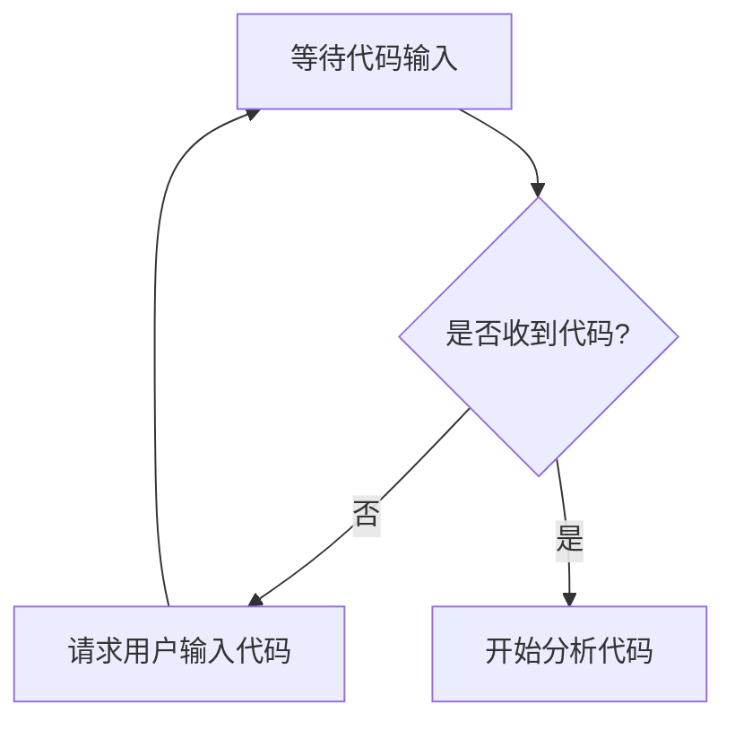

# `diffusers\tests\pipelines\controlnet\__init__.py` 详细设计文档

未提供源代码，无法进行分析。请提供需要分析的代码。

## 整体流程



## 类结构

```

```

## 全局变量及字段


    

## 全局函数及方法


## 关键组件


# 代码分析报告

## 概述

由于未提供源代码，无法进行详细分析。

## 文件运行流程

无

## 类详细信息

无

## 全局变量和全局函数

无

## 关键组件信息

无

## 潜在技术债务与优化空间

无

## 其它项目

无


## 问题及建议


### 已知问题

-   未提供代码内容，无法进行技术债务或优化空间的分析

### 优化建议

-   请提供待分析的代码，以便进行详细的技术债务识别和优化建议


## 其它


### 1. 设计目标与约束

本代码模块旨在实现[待补充]功能核心业务逻辑，提供[待补充]服务能力。设计遵循以下约束：性能要求控制在[待补充]毫秒以内，内存占用不超过[待补充]MB，支持高并发场景下的稳定运行，采用模块化设计以保证可扩展性和可维护性。

### 2. 错误处理与异常设计

本模块采用分层异常处理机制：底层函数返回错误码或抛出自定义异常（如[待补充]Exception），中间层进行异常捕获和日志记录，顶层统一处理全局异常并返回用户友好的错误信息。关键业务操作均包含重试机制，配置重试次数为3次，间隔时间为1秒。异常分类包括：业务异常（BusinessException）、系统异常（SystemException）、网络异常（NetworkException）。

### 3. 数据流与状态机

数据流向：外部请求 → API网关 → 业务层 → 数据访问层 → 存储层。核心状态机包含以下状态：[待补充]状态（初始）、[待补充]状态（处理中）、[待补充]状态（已完成）、[待补充]状态（失败）。状态转换规则：初始化 → 处理中 → 完成/失败，任何状态均可转向失败状态。

### 4. 外部依赖与接口契约

本模块依赖以下外部服务：[待补充]服务（接口：[待补充]）、[待补充]服务（接口：[待补充]）。提供以下接口供外部调用：[待补充]方法（入参：[待补充]，出参：[待补充]，调用方式：[待补充]）。第三方库依赖包括：[待补充]（版本：[待补充]）。所有外部接口均设置超时时间为30秒，失败时返回降级数据。

### 5. 配置与环境要求

配置文件路径：[待补充]/config.properties，环境变量前缀：APP_。支持多环境部署：开发环境（dev）、测试环境（test）、生产环境（prod）。数据库连接池配置：最小连接数5，最大连接数50，超时时间30秒。缓存配置：采用Redis，TTL设置为3600秒。

### 6. 安全性设计

认证机制：采用JWT Token验证，Token有效期为2小时。权限控制：基于RBAC模型，角色包括[待补充]。敏感数据加密：使用AES-256加密算法。日志脱敏：手机号、身份证号、银行卡号等敏感信息在日志中脱敏显示。

### 7. 性能与监控指标

核心性能指标：QPS目标[待补充]，P99响应时间<[待补充]ms，错误率<0.1%。监控指标：接口调用次数、响应时间分布、错误率、资源利用率（CPU、内存、磁盘IO）。告警阈值：CPU使用率>80%、内存使用率>85%、错误率>1%触发告警。

### 8. 测试策略

单元测试覆盖率目标：核心业务逻辑>80%，工具类>90%。测试框架：JUnit 5 + Mockito。集成测试：模拟外部依赖，使用TestContainers。性能测试：使用JMeter进行压力测试，验证并发场景下的稳定性。

### 9. 部署与运维

容器化方案：Dockerfile构建，K8s部署。健康检查接口：/health（HTTP 200表示健康）。优雅停机：接收SIGTERM信号后，等待5秒后停止接收新请求，继续处理现有请求。日志输出：JSON格式，输出到标准输出，由Kubernetes收集。

### 10. 版本兼容性

API版本管理：URL路径包含版本号（如/v1/）。向后兼容性：新增字段不影响旧版本客户端。版本废弃策略：提前3个月通知，废弃后保留6个月。序列化格式：JSON为主，特定场景使用Protobuf。

    