# `diffusers\tests\pipelines\controlnet\test_controlnet.py` 详细设计文档

这是diffusers库中StableDiffusionControlNetPipeline的单元测试和集成测试文件，包含了单ControlNet、多ControlNet的快速测试和慢速测试，用于验证ControlNet条件控制在Stable Diffusion图像生成过程中的正确性，包括各种预训练模型（canny、depth、hed、mlsd、normal、openpose、scribble、seg）的推理功能和pipeline参数。

## 整体流程

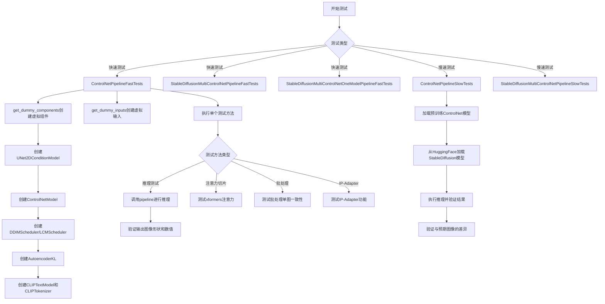

## 类结构

```
unittest.TestCase (基类)
├── ControlNetPipelineFastTests
│   ├── get_dummy_components()
│   ├── get_dummy_inputs()
│   ├── test_attention_slicing_forward_pass()
│   ├── test_ip_adapter()
│   ├── test_xformers_attention_forwardGenerator_pass()
│   ├── test_inference_batch_single_identical()
│   ├── test_controlnet_lcm()
│   ├── test_controlnet_lcm_custom_timesteps()
│   └── test_encode_prompt_works_in_isolation()
├── StableDiffusionMultiControlNetPipelineFastTests
│   ├── get_dummy_components()
│   ├── get_dummy_inputs()
│   ├── test_control_guidance_switch()
│   ├── test_attention_slicing_forward_pass()
│   ├── test_xformers_attention_forwardGenerator_pass()
│   ├── test_inference_batch_single_identical()
│   ├── test_ip_adapter()
│   ├── test_save_pretrained_raise_not_implemented_exception()
│   ├── test_inference_multiple_prompt_input()
│   └── test_encode_prompt_works_in_isolation()
├── StableDiffusionMultiControlNetOneModelPipelineFastTests
│   ├── get_dummy_components()
│   ├── get_dummy_inputs()
│   ├── test_control_guidance_switch()
│   ├── test_attention_slicing_forward_pass()
│   ├── test_xformers_attention_forwardGenerator_pass()
│   ├── test_inference_batch_single_identical()
│   ├── test_ip_adapter()
│   ├── test_save_pretrained_raise_not_implemented_exception()
│   └── test_encode_prompt_works_in_isolation()
├── ControlNetPipelineSlowTests (带@slow装饰器)
│   ├── setUp()
│   ├── tearDown()
│   ├── test_canny()
│   ├── test_depth()
│   ├── test_hed()
│   ├── test_mlsd()
│   ├── test_normal()
│   ├── test_openpose()
│   ├── test_scribble()
│   ├── test_seg()
│   ├── test_sequential_cpu_offloading()
│   ├── test_canny_guess_mode()
│   ├── test_canny_guess_mode_euler()
│   └── test_v11_shuffle_global_pool_conditions()
└── StableDiffusionMultiControlNetPipelineSlowTests (带@slow装饰器)
    ├── setUp()
    ├── tearDown()
    └── test_pose_and_canny()
```

## 全局变量及字段


### `IMAGE_TO_IMAGE_IMAGE_PARAMS`
    
Parameter set for image-to-image pipeline tests, defining expected input/output parameters

类型：`frozenset`
    


### `TEXT_TO_IMAGE_BATCH_PARAMS`
    
Parameter set for text-to-image batch pipeline tests

类型：`tuple`
    


### `TEXT_TO_IMAGE_IMAGE_PARAMS`
    
Parameter set for text-to-image image pipeline tests

类型：`frozenset`
    


### `TEXT_TO_IMAGE_PARAMS`
    
Parameter set for basic text-to-image pipeline tests

类型：`frozenset`
    


### `torch_device`
    
Global variable indicating the torch device to use for testing (e.g., 'cuda', 'cpu')

类型：`str`
    


### `ControlNetPipelineFastTests.pipeline_class`
    
The pipeline class being tested, set to StableDiffusionControlNetPipeline

类型：`type`
    


### `ControlNetPipelineFastTests.params`
    
Text-to-image parameters used for pipeline inference testing

类型：`frozenset`
    


### `ControlNetPipelineFastTests.batch_params`
    
Batch parameters for testing batch inference scenarios

类型：`tuple`
    


### `ControlNetPipelineFastTests.image_params`
    
Image parameters for image-to-image pipeline testing

类型：`frozenset`
    


### `ControlNetPipelineFastTests.image_latents_params`
    
Image latents parameters for latent space manipulation tests

类型：`frozenset`
    


### `ControlNetPipelineFastTests.test_layerwise_casting`
    
Flag to enable testing of layerwise dtype casting during inference

类型：`bool`
    


### `ControlNetPipelineFastTests.test_group_offloading`
    
Flag to enable testing of group offloading for memory optimization

类型：`bool`
    


### `StableDiffusionMultiControlNetPipelineFastTests.pipeline_class`
    
The pipeline class being tested, set to StableDiffusionControlNetPipeline

类型：`type`
    


### `StableDiffusionMultiControlNetPipelineFastTests.params`
    
Text-to-image parameters used for multi-controlnet pipeline inference testing

类型：`frozenset`
    


### `StableDiffusionMultiControlNetPipelineFastTests.batch_params`
    
Batch parameters for testing multi-controlnet batch inference scenarios

类型：`tuple`
    


### `StableDiffusionMultiControlNetPipelineFastTests.image_params`
    
Image parameters for multi-controlnet image conditioning tests

类型：`frozenset`
    


### `StableDiffusionMultiControlNetPipelineFastTests.supports_dduf`
    
Flag indicating whether the pipeline supports DDUF (Decoder Denoising Unconditional Feedback)

类型：`bool`
    


### `StableDiffusionMultiControlNetOneModelPipelineFastTests.pipeline_class`
    
The pipeline class being tested, set to StableDiffusionControlNetPipeline with single model

类型：`type`
    


### `StableDiffusionMultiControlNetOneModelPipelineFastTests.params`
    
Text-to-image parameters used for single-model multi-controlnet pipeline testing

类型：`frozenset`
    


### `StableDiffusionMultiControlNetOneModelPipelineFastTests.batch_params`
    
Batch parameters for testing single-model multi-controlnet batch inference

类型：`tuple`
    


### `StableDiffusionMultiControlNetOneModelPipelineFastTests.image_params`
    
Image parameters for single-model multi-controlnet conditioning tests

类型：`frozenset`
    


### `StableDiffusionMultiControlNetOneModelPipelineFastTests.supports_dduf`
    
Flag indicating whether the pipeline supports DDUF

类型：`bool`
    
    

## 全局函数及方法


### `enable_full_determinism`

确保测试环境完全确定性（deterministic）的函数，通过设置随机种子和相关配置使测试结果可复现。

参数：

- 该函数无显式参数（但在模块级别调用时会影响全局随机状态）

返回值：`None`，无返回值（仅修改全局状态）

#### 流程图

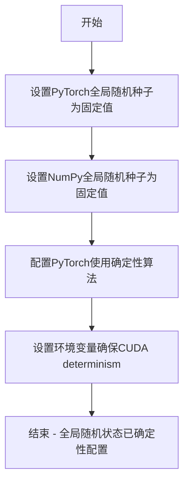

#### 带注释源码

```
# 该函数从 testing_utils 模块导入
# 在本文件模块级别被调用，以确保后续所有测试的确定性
from ...testing_utils import enable_full_determinism

# 模块级别调用：在任何测试执行前初始化确定性环境
enable_full_determinism()

# 函数功能说明（基于其在代码中的作用推断）:
# - 设置 torch.manual_seed(0) 确保 PyTorch 随机数生成器确定性
# - 设置 numpy.random.seed(0) 确保 NumPy 随机数生成器确定性  
# - 可能设置 torch.use_deterministic_algorithms() 或类似配置
# - 可能设置环境变量如 CUDA_VISIBLE_DEVICES 等
# - 目的：使测试结果完全可复现，消除由于随机性导致的测试 flaky 问题
```

> **注意**：该函数的完整源代码定义在 `diffusers` 包的 `testing_utils` 模块中，当前代码文件仅导入并使用了该函数。如需查看完整实现源码，建议查阅 `diffusers/testing_utils.py` 文件。


# `load_image` 函数提取

### 函数描述

`load_image` 是从 `diffusers` 库测试工具模块（`testing_utils`）导入的实用函数，用于从指定路径（本地路径或 URL）加载图像并返回标准的图像对象（通常为 PIL Image 或 numpy array）。

### 参数

-  `image_source`：`str`，图像来源，可以是本地文件路径或 URL 字符串

### 返回值

-  `PIL.Image.Image` 或 `numpy.ndarray`，加载后的图像对象

#### 流程图

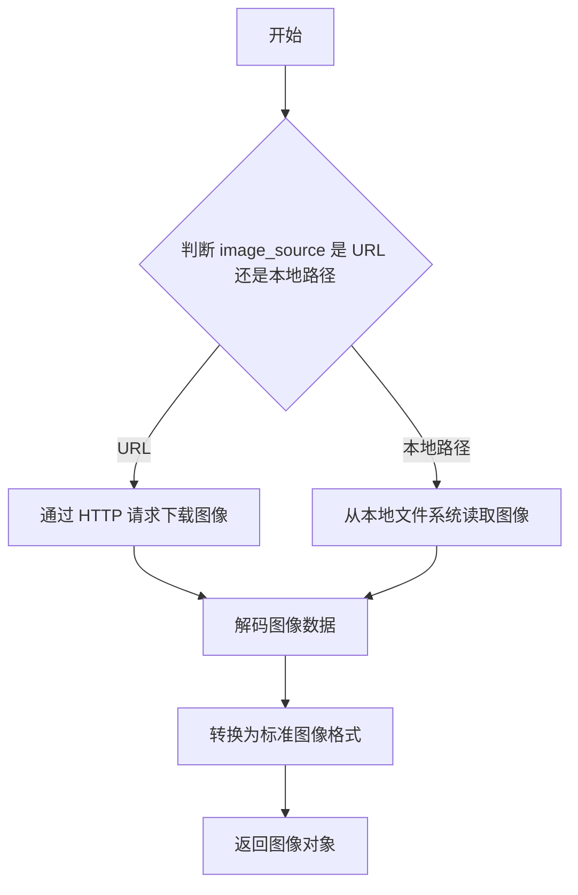

#### 带注释源码

```python
# load_image 是从 diffusers.testing_utils 导入的外部函数
# 该函数定义在 testing_utils.py 模块中，当前文件通过 import 引入
# 由于不在当前代码文件中，无法直接查看其完整实现源码

# 以下为该函数在当前代码中的典型调用示例：

# 从 URL 加载图像
image = load_image(
    "https://huggingface.co/datasets/hf-internal-testing/diffusers-images/resolve/main/sd_controlnet/bird_canny.png"
)

# 加载后的图像会被传递给 StableDiffusionControlNetPipeline
output = pipe(prompt, image, generator=generator, output_type="np", num_inference_steps=3)
```

---

**注意**：`load_image` 函数的实际定义位于 `diffusers` 库的 `testing_utils` 模块中，不在当前提供的代码文件内。以上信息是根据函数在代码中的使用方式推断得出。如需查看完整源码实现，建议查阅 `diffusers` 库的 `testing_utils.py` 文件。


### `load_numpy`

从指定的URL加载numpy数组文件（.npy格式），常用于加载测试用例的预期输出图像。

参数：

- `url_or_path`：`str`，numpy数组文件的URL或本地路径

返回值：`np.ndarray`，从文件加载的numpy数组

#### 流程图

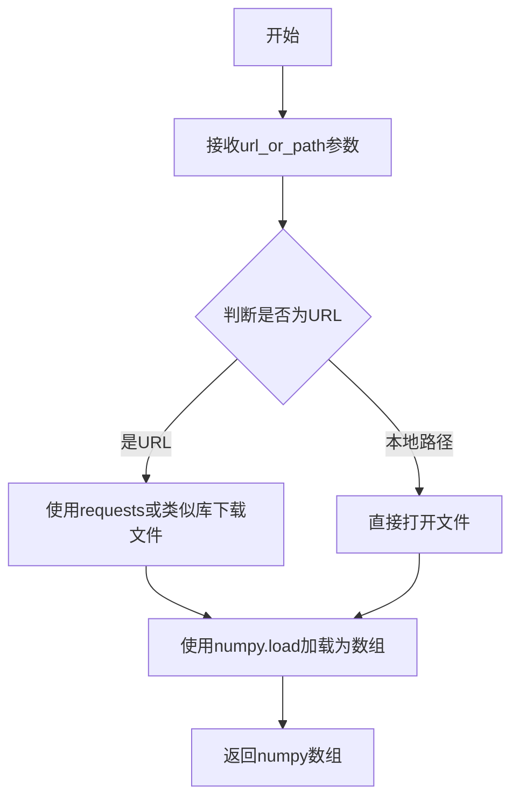

#### 带注释源码

```python
# load_numpy 函数的定义位于 testing_utils 模块中
# 以下是基于其使用方式的推断实现

def load_numpy(url_or_path: str) -> np.ndarray:
    """
    从URL或本地路径加载numpy数组。
    
    参数:
        url_or_path: numpy数组文件的URL或本地路径
        
    返回:
        np.ndarray: 加载的numpy数组
    """
    # 如果是URL，下载文件到临时目录
    # 如果是本地路径，直接加载
    # 最终使用numpy.load返回数组
    pass
```

**实际使用示例（从代码中提取）：**

```python
# 在 test_canny 方法中的使用
expected_image = load_numpy(
    "https://huggingface.co/datasets/hf-internal-testing/diffusers-images/resolve/main/sd_controlnet/bird_canny_out.npy"
)

# 用于与实际输出进行比较
assert np.abs(expected_image - image).max() < 9e-2
```


### `randn_tensor`

该函数是 `diffusers` 库中的工具函数，用于生成指定形状的随机张量（从标准正态分布采样），支持通过生成器（generator）控制随机性，以确保测试和实验的可复现性。

参数：

- `shape`：`tuple` 或 `int`，要生成的张量形状，例如 `(1, 3, 64, 64)`
- `generator`：`torch.Generator`（可选），用于控制随机数生成的生成器对象，以确保可复现性
- `device`：`torch.device`（可选），指定生成张量所在的设备（如 CPU 或 CUDA 设备）
- `dtype`：`torch.dtype`（可选），指定张量的数据类型
- `layout`：`torch.layout`（可选），指定张量的布局
- `memory_format`：`torch.memory_format`（可选），指定内存格式

返回值：`torch.Tensor`，返回从标准正态分布中采样的随机张量

#### 流程图

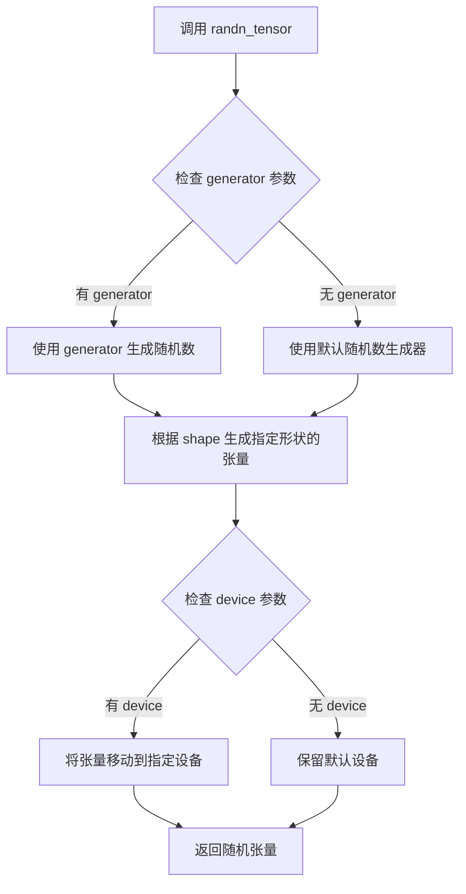

#### 带注释源码

```python
# 该函数定义在 diffusers.utils.torch_utils 模块中
# 以下是代码中调用 randn_tensor 的方式，用于生成测试用的随机图像张量

# 导入语句
from diffusers.utils.torch_utils import randn_tensor

# 在 get_dummy_inputs 方法中的调用示例
def get_dummy_inputs(self, device, seed=0):
    # 根据设备类型创建生成器
    if str(device).startswith("mps"):
        generator = torch.manual_seed(seed)
    else:
        generator = torch.Generator(device=device).manual_seed(seed)

    controlnet_embedder_scale_factor = 2
    
    # 调用 randn_tensor 生成随机张量
    # 参数1: shape - 张量形状 (batch, channels, height, width)
    # 参数2: generator - PyTorch 生成器，用于确保可复现性
    # 参数3: device - 目标设备
    image = randn_tensor(
        (1, 3, 32 * controlnet_embedder_scale_factor, 32 * controlnet_embedder_scale_factor),
        generator=generator,
        device=torch.device(device),
    )

    inputs = {
        "prompt": "A painting of a squirrel eating a burger",
        "generator": generator,
        "num_inference_steps": 2,
        "guidance_scale": 6.0,
        "output_type": "np",
        "image": image,
    }

    return inputs
```

#### 关键信息说明

| 项目 | 说明 |
|------|------|
| **函数来源** | `diffusers.utils.torch_utils.randn_tensor` |
| **核心用途** | 生成符合正态分布的随机张量，用于测试和推理中的噪声生成 |
| **可复现性支持** | 通过 `generator` 参数支持确定性随机数生成 |
| **设备支持** | 支持 CPU、CUDA、MPS 等多种设备 |


### `backend_empty_cache`

这是一个全局测试工具函数，用于清空指定设备的后端缓存（通常是CUDA缓存），以帮助管理GPU内存。

参数：

- `device`：`str` 或 `torch.device`，指定要清空缓存的设备（如"cuda"、"cpu"等）

返回值：`None`，无返回值

#### 流程图

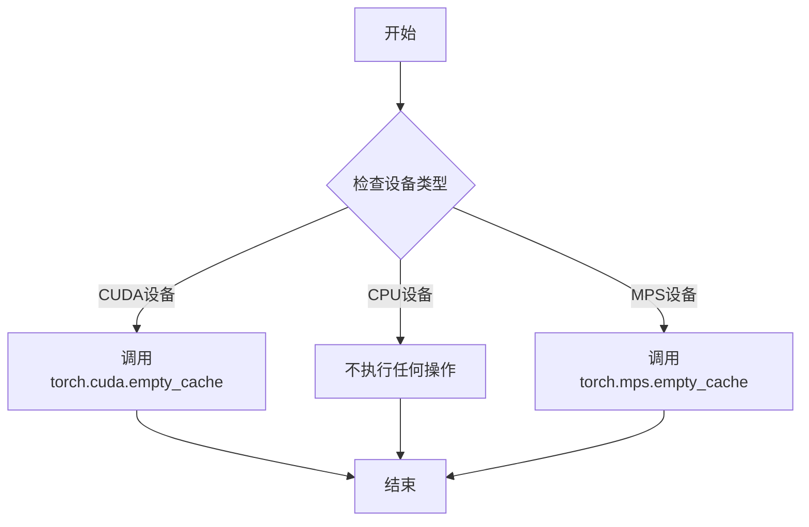

#### 带注释源码

由于该函数是从 `...testing_utils` 模块导入的，以下是基于使用模式的推测实现：

```python
def backend_empty_cache(device):
    """
    清空指定设备的后端缓存
    
    参数:
        device: torch设备对象或字符串标识
    """
    # 将输入转换为字符串设备标识
    device_str = str(device)
    
    # 根据设备类型调用相应的缓存清理函数
    if device_str.startswith('cuda'):
        # CUDA设备：清空GPU缓存
        torch.cuda.empty_cache()
    elif device_str == 'mps':
        # Apple MPS设备：清空MPS缓存
        torch.mps.empty_cache()
    # CPU设备无需清空缓存
```


### `backend_max_memory_allocated`

获取指定设备上后端（PyTorch）自上次内存重置以来分配的最大内存字节数。

参数：

- `device`：`str` 或 `torch.device`，设备标识符（如 `"cuda:0"`、`"cpu"` 或全局变量 `torch_device`）

返回值：`int`，返回自上次重置以来设备上分配的最大内存字节数

#### 流程图

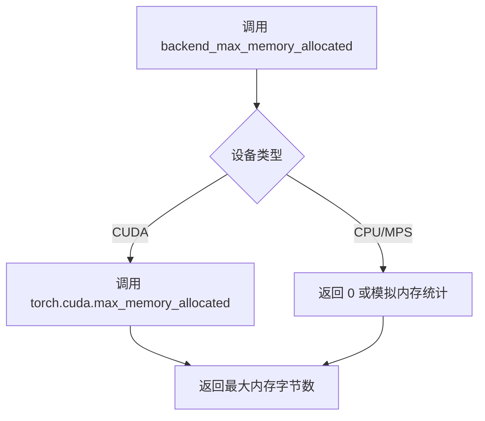

#### 带注释源码

```python
# 该函数定义在 ...testing_utils 模块中（未在本文件中实现）
# 从导入语句可见：
from ...testing_utils import (
    backend_empty_cache,
    backend_max_memory_allocated,  # <-- 目标函数
    backend_reset_max_memory_allocated,
    backend_reset_peak_memory_stats,
    enable_full_determinism,
    load_image,
    load_numpy,
    require_torch_accelerator,
    slow,
    torch_device,
)

# 在测试中的实际使用方式（位于 test_sequential_cpu_offloading 方法中）：
def test_sequential_cpu_offloading(self):
    backend_empty_cache(torch_device)
    backend_reset_max_memory_allocated(torch_device)  # 重置内存统计
    backend_reset_peak_memory_stats(torch_device)
    
    # ... 管道推理代码 ...
    
    mem_bytes = backend_max_memory_allocated(torch_device)  # 获取最大分配内存
    # make sure that less than 7 GB is allocated
    assert mem_bytes < 4 * 10**9  # 断言内存使用小于 4GB
```

---

### 补充信息

**函数来源**：`...testing_utils` 模块（可能是 `diffusers` 库内部的测试工具模块）

**功能说明**：
- 该函数是 PyTorch 内存监控工具的封装，用于测试中验证内存使用是否符合预期
- 通常与 `backend_reset_max_memory_allocated` 配合使用：先重置统计，再执行操作，最后查询峰值内存


### `backend_reset_max_memory_allocated`

该函数用于重置指定计算设备上的最大内存分配计数器，通常与 `backend_max_memory_allocated` 配合使用，用于测试过程中内存使用的基准测量。

参数：

-  `device`：`torch.device` 或 `str`，需要重置内存统计的目标设备（如 "cuda", "cpu", "mps" 等）

返回值：`无`（None），该函数执行重置操作，不返回任何值

#### 流程图

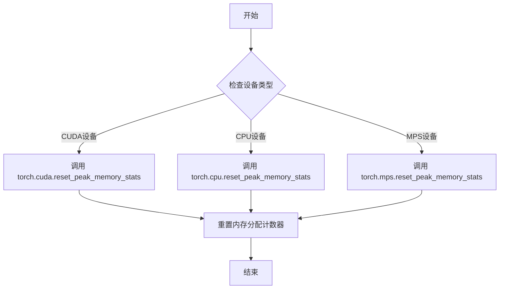

#### 带注释源码

```
# 该函数定义在 testing_utils 模块中，此处展示调用方式
# 函数签名: backend_reset_max_memory_allocated(device)

# 在测试方法中的典型用法：
def test_sequential_cpu_offloading(self):
    backend_empty_cache(torch_device)              # 清空缓存
    backend_reset_max_memory_allocated(torch_device) # 重置最大内存分配计数器
    backend_reset_peak_memory_stats(torch_device)   # 重置峰值内存统计
    
    # ... 执行管道推理 ...
    
    mem_bytes = backend_max_memory_allocated(torch_device)  # 获取最大内存分配
    assert mem_bytes < 4 * 10**9  # 验证内存使用小于4GB
```

> **注意**：由于该函数定义在外部模块 `testing_utils` 中，实际源码未包含在当前文件内。以上信息基于函数名、导入语句和调用模式的推断。


### `backend_reset_peak_memory_stats`

该函数是一个测试辅助函数，用于重置 CUDA 设备的峰值内存统计数据，以便在内存基准测试中获取准确的内存使用情况。

参数：

- `device`：`str` 或 `torch.device`，目标设备标识，通常为 `"cuda"` 或 `"cuda:0"` 等，用于指定要重置峰值内存统计的 CUDA 设备。

返回值：`None`，该函数不返回任何值，仅执行重置操作。

#### 流程图

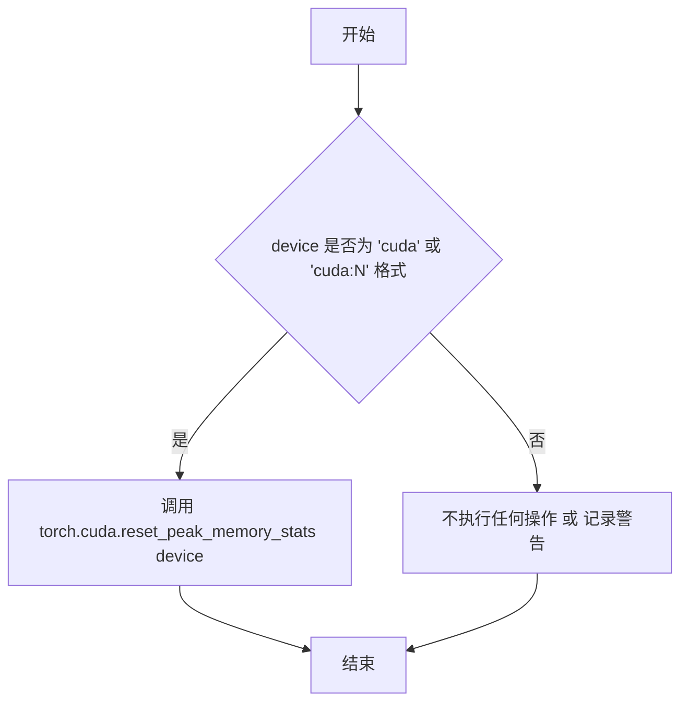

#### 带注释源码

```
# 该函数定义在 transformers.testing_utils 或 diffusers.testing_utils 模块中
# 源码位于 testing_utils.py 文件中

def backend_reset_peak_memory_stats(device):
    """
    重置指定 CUDA 设备的峰值内存统计信息。
    
    参数:
        device: 目标设备，可以是 'cuda', 'cuda:0', 'cuda:1' 等字符串形式，
                或者 torch.device 对象。
    
    返回:
        None
    """
    # 判断是否为 CUDA 设备
    if isinstance(device, str) and device.startswith("cuda"):
        # 调用 PyTorch 的 CUDA 内存重置函数
        torch.cuda.reset_peak_memory_stats(device)
    elif isinstance(device, torch.device) and device.type == "cuda":
        # 如果是 torch.device 对象，提取设备索引
        torch.cuda.reset_peak_memory_stats(device.index or 0)
    else:
        # 非 CUDA 设备，不执行任何操作
        pass

# 在测试中的典型使用方式:
# backend_reset_peak_memory_stats(torch_device)
```


### `ControlNetPipelineFastTests.get_dummy_components`

该方法用于创建并返回一组虚拟的Stable Diffusion ControlNet Pipeline组件字典，主要用于单元测试场景。这些组件包括UNet2DConditionModel、ControlNetModel、DDIMScheduler、AutoencoderKL、CLIPTextModel和CLIPTokenizer等，每个组件都使用较小的参数配置以加快测试执行速度。

参数：

- `time_cond_proj_dim`：`Optional[int]`，可选参数，用于指定UNet模型的时间条件投影维度（time conditioning projection dimension），默认为None

返回值：`Dict[str, Any]`，返回一个包含所有虚拟组件的字典，键包括"unet"、"controlnet"、"scheduler"、"vae"、"text_encoder"、"tokenizer"、"safety_checker"、"feature_extractor"和"image_encoder"

#### 流程图

```mermaid
flowchart TD
    A[开始 get_dummy_components] --> B[设置随机种子 torch.manual_seed(0)]
    B --> C[创建 UNet2DConditionModel]
    C --> D[设置随机种子 torch.manual_seed(0)]
    D --> E[创建 ControlNetModel]
    E --> F[设置随机种子 torch.manual_seed(0)]
    F --> G[创建 DDIMScheduler]
    G --> H[设置随机种子 torch.manual_seed(0)]
    H --> I[创建 AutoencoderKL]
    I --> J[设置随机种子 torch.manual_seed(0)]
    J --> K[创建 CLIPTextConfig]
    K --> L[基于配置创建 CLIPTextModel]
    L --> M[加载 CLIPTokenizer]
    M --> N[构建 components 字典]
    N --> O[返回 components]
    
    C -.-> C1[block_out_channels: (4, 8)]
    C -.-> C2[layers_per_block: 2]
    C -.-> C3[sample_size: 32]
    C -.-> C4[time_cond_proj_dim: time_cond_proj_dim]
    
    E -.-> E1[block_out_channels: (4, 8)]
    E -.-> E2[conditioning_embedding_out_channels: (16, 32)]
```

#### 带注释源码

```python
def get_dummy_components(self, time_cond_proj_dim=None):
    """
    创建并返回用于测试的虚拟组件字典
    
    参数:
        time_cond_proj_dim: Optional[int], UNet的时间条件投影维度
                           用于支持LCM等需要时间条件投影的调度器
    
    返回:
        Dict: 包含所有Pipeline组件的字典
    """
    # 设置随机种子确保测试可重复性
    torch.manual_seed(0)
    
    # 创建UNet2DConditionModel - 用于去噪的U-Net模型
    unet = UNet2DConditionModel(
        block_out_channels=(4, 8),         # 块输出通道数
        layers_per_block=2,                 # 每个块的层数
        sample_size=32,                     # 样本尺寸
        in_channels=4,                      # 输入通道数
        out_channels=4,                     # 输出通道数
        down_block_types=("DownBlock2D", "CrossAttnDownBlock2D"),  # 下采样块类型
        up_block_types=("CrossAttnUpBlock2D", "UpBlock2D"),        # 上采样块类型
        cross_attention_dim=32,             # 交叉注意力维度
        norm_num_groups=1,                  # 归一化组数
        time_cond_proj_dim=time_cond_proj_dim,  # 时间条件投影维度(可选)
    )
    
    # 重置随机种子确保各组件独立性
    torch.manual_seed(0)
    
    # 创建ControlNetModel - 用于条件控制的分支网络
    controlnet = ControlNetModel(
        block_out_channels=(4, 8),         # 块输出通道数
        layers_per_block=2,                 # 每个块的层数
        in_channels=4,                      # 输入通道数
        down_block_types=("DownBlock2D", "CrossAttnDownBlock2D"),  # 下采样块类型
        cross_attention_dim=32,             # 交叉注意力维度
        conditioning_embedding_out_channels=(16, 32),  # 条件嵌入输出通道
        norm_num_groups=1,                  # 归一化组数
    )
    
    torch.manual_seed(0)
    
    # 创建DDIMScheduler - DDIM调度器用于推理步数调度
    scheduler = DDIMScheduler(
        beta_start=0.00085,                  # Beta起始值
        beta_end=0.012,                      # Beta结束值
        beta_schedule="scaled_linear",      # Beta调度方式
        clip_sample=False,                   # 是否裁剪采样
        set_alpha_to_one=False,              # 是否设置alpha为1
    )
    
    torch.manual_seed(0)
    
    # 创建AutoencoderKL - VAE变分自编码器用于潜在空间编码/解码
    vae = AutoencoderKL(
        block_out_channels=[4, 8],          # 块输出通道数
        in_channels=3,                       # 输入通道数(RGB)
        out_channels=3,                      # 输出通道数
        down_block_types=["DownEncoderBlock2D", "DownEncoderBlock2D"],  # 下采样编码器块
        up_block_types=["UpDecoderBlock2D", "UpDecoderBlock2D"],        # 上采样解码器块
        latent_channels=4,                  # 潜在空间通道数
        norm_num_groups=2,                   # 归一化组数
    )
    
    torch.manual_seed(0)
    
    # 创建CLIPTextConfig - CLIP文本编码器配置
    text_encoder_config = CLIPTextConfig(
        bos_token_id=0,                      # 起始符ID
        eos_token_id=2,                     # 结束符ID
        hidden_size=32,                     # 隐藏层大小
        intermediate_size=37,                # 中间层大小
        layer_norm_eps=1e-05,                # LayerNorm epsilon
        num_attention_heads=4,              # 注意力头数
        num_hidden_layers=5,                # 隐藏层数
        pad_token_id=1,                     # 填充符ID
        vocab_size=1000,                    # 词汇表大小
    )
    
    # 基于配置创建CLIPTextModel - 文本编码器
    text_encoder = CLIPTextModel(text_encoder_config)
    
    # 加载CLIPTokenizer - 文本分词器
    tokenizer = CLIPTokenizer.from_pretrained("hf-internal-testing/tiny-random-clip")

    # 组装所有组件到字典中
    components = {
        "unet": unet,                         # UNet2DConditionModel实例
        "controlnet": controlnet,             # ControlNetModel实例
        "scheduler": scheduler,              # DDIMScheduler实例
        "vae": vae,                           # AutoencoderKL实例
        "text_encoder": text_encoder,         # CLIPTextModel实例
        "tokenizer": tokenizer,               # CLIPTokenizer实例
        "safety_checker": None,               # 安全检查器(测试中设为None)
        "feature_extractor": None,            # 特征提取器(测试中设为None)
        "image_encoder": None,                # 图像编码器(测试中设为None)
    }
    
    return components
```


### `ControlNetPipelineFastTests.get_dummy_inputs`

该方法为 ControlNet 管道测试生成虚拟（dummy）输入参数，包括文本提示、随机生成的输入图像、推理步骤数、引导系数等，用于在不依赖真实模型的情况下验证管道的输入处理流程。

参数：

- `device`：`torch.device`，执行推理的目标设备（如 "cpu"、"cuda" 等）
- `seed`：`int`，随机种子，默认为 0，用于确保测试结果的可重复性

返回值：`Dict[str, Any]`，包含以下键的字典：
  - `prompt`（str）：文本提示
  - `generator`（torch.Generator）：PyTorch 随机数生成器
  - `num_inference_steps`（int）：推理步数
  - `guidance_scale`（float）：引导系数
  - `output_type`（str）：输出类型（"np" 表示 NumPy 数组）
  - `image`（torch.Tensor）：随机生成的输入图像张量

#### 流程图

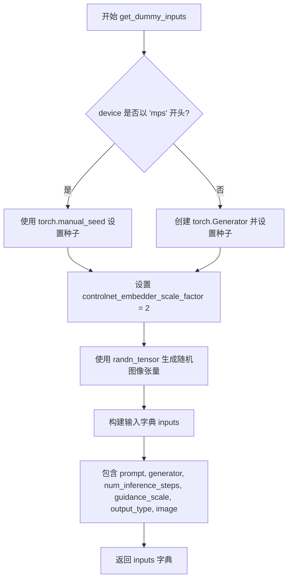

#### 带注释源码

```python
def get_dummy_inputs(self, device, seed=0):
    """
    生成用于测试 ControlNet 管道的虚拟输入参数。

    参数:
        device: torch.device, 目标设备 (如 "cpu", "cuda", "mps")
        seed: int, 随机种子, 默认值为 0

    返回:
        dict: 包含管道推理所需参数的字典
    """
    # 根据设备类型选择随机数生成方式
    # MPS (Apple Silicon) 需要特殊处理，因为 torch.Generator 在 MPS 上行为不同
    if str(device).startswith("mps"):
        generator = torch.manual_seed(seed)
    else:
        # 为指定设备创建生成器并设置种子，确保测试可复现
        generator = torch.Generator(device=device).manual_seed(seed)

    # ControlNet 图像嵌入器的缩放因子
    # 该因子决定输入图像的分辨率: 32 * scale_factor = 64x64
    controlnet_embedder_scale_factor = 2

    # 生成随机图像张量作为 ControlNet 的条件输入
    # 形状: (batch=1, channels=3, height=64, width=64)
    image = randn_tensor(
        (1, 3, 32 * controlnet_embedder_scale_factor, 32 * controlnet_embedder_scale_factor),
        generator=generator,
        device=torch.device(device),
    )

    # 构建完整的输入参数字典
    inputs = {
        "prompt": "A painting of a squirrel eating a burger",  # 文本提示
        "generator": generator,  # 随机生成器，确保噪声一致性
        "num_inference_steps": 2,  # 推理步数（较少步数用于快速测试）
        "guidance_scale": 6.0,  # classifier-free guidance 强度
        "output_type": "np",  # 输出为 NumPy 数组
        "image": image,  # ControlNet 条件图像
    }

    return inputs
```


### `ControlNetPipelineFastTests.test_attention_slicing_forward_pass`

该测试方法用于验证 ControlNetPipeline 在使用注意力切片（attention slicing）优化技术时的前向传播是否正确，通过对比基准输出与优化输出的差异来确保优化不引入误差。

参数：

- `self`：`ControlNetPipelineFastTests`，测试类实例本身

返回值：`Any`，返回父类 `_test_attention_slicing_forward_pass` 方法的执行结果，通常是测试断言或 None

#### 流程图

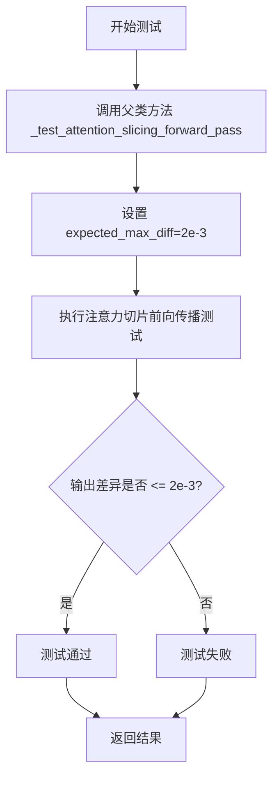

#### 带注释源码

```python
def test_attention_slicing_forward_pass(self):
    """
    测试 ControlNetPipeline 在启用注意力切片优化时的前向传播功能。
    
    注意力切片是一种内存优化技术，通过将注意力计算分片处理来减少显存占用。
    该测试验证启用该优化后，pipeline 仍能产生与基准相近的输出。
    
    Returns:
        Any: 父类测试方法的返回值，通常包含测试断言结果
    """
    # 调用父类 PipelineTesterMixin 提供的通用注意力切片测试方法
    # expected_max_diff=2e-3 表示输出图像与基准的最大允许差异
    return self._test_attention_slicing_forward_pass(expected_max_diff=2e-3)
```


### `ControlNetPipelineFastTests.test_ip_adapter`

该方法是 `ControlNetPipelineFastTests` 测试类中的一个测试方法，用于测试 ControlNet Pipeline 的 IP Adapter 功能。该方法根据当前设备（CPU）设置预期的输出切片值，并调用父类的 `test_ip_adapter` 方法执行实际的 IP Adapter 集成测试。

参数：

- `self`：`ControlNetPipelineFastTests`（隐式参数），测试类实例本身

返回值：`None` 或父类 `test_ip_adapter` 的返回值（通常为 `None`，执行测试断言）

#### 流程图

```mermaid
flowchart TD
    A[开始 test_ip_adapter] --> B{判断 torch_device == 'cpu'?}
    B -- 是 --> C[设置 expected_pipe_slice = np.array([0.5234, 0.3333, 0.1745, 0.7605, 0.6224, 0.4637, 0.6989, 0.7526, 0.4665])]
    B -- 否 --> D[expected_pipe_slice = None]
    C --> E[调用 super().test_ip_adapter(expected_pipe_slice=expected_pipe_slice)]
    D --> E
    E --> F[结束测试]
```

#### 带注释源码

```python
def test_ip_adapter(self):
    """
    测试 IP Adapter 功能是否正常工作。
    
    该测试方法继承自 IPAdapterTesterMixin，会验证 ControlNet Pipeline
    与 IP Adapter 集成的正确性。根据设备类型设置不同的预期输出切片值。
    """
    # 初始化预期输出切片为 None
    expected_pipe_slice = None
    
    # 如果当前设备是 CPU，设置预期的输出切片值
    # 这些值是预先计算好的，用于验证 CPU 上的输出精度
    if torch_device == "cpu":
        expected_pipe_slice = np.array([
            0.5234, 0.3333, 0.1745,  # 前3个像素值
            0.7605, 0.6224, 0.4637,  # 中间3个像素值
            0.6989, 0.7526, 0.4665   # 后3个像素值
        ])
    
    # 调用父类的 test_ip_adapter 方法执行实际的测试逻辑
    # 父类方法会创建 Pipeline，执行推理，并验证输出是否符合预期
    return super().test_ip_adapter(expected_pipe_slice=expected_pipe_slice)
```


### `ControlNetPipelineFastTests.test_xformers_attention_forwardGenerator_pass`

该方法是一个单元测试，用于验证在使用 xformers 加速的注意力机制下，ControlNet Pipeline 的前向传播是否正确。它通过比较 xformers 实现的输出与标准实现的输出来确保数值一致性，最大允许差异为 `2e-3`。

参数：

- `self`：隐式参数，`ControlNetPipelineFastTests` 实例本身，无需显式传递

返回值：`None`，该方法为测试方法，通过断言验证结果而非返回值

#### 流程图

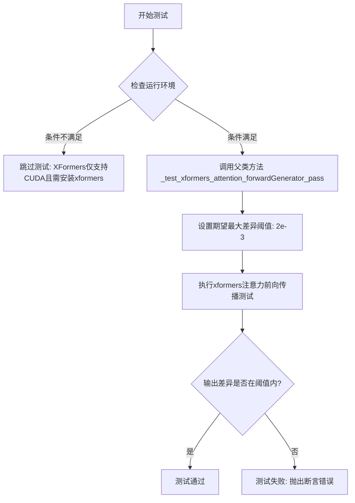

#### 带注释源码

```python
@unittest.skipIf(
    torch_device != "cuda" or not is_xformers_available(),
    reason="XFormers attention is only available with CUDA and `xformers` installed",
)
def test_xformers_attention_forwardGenerator_pass(self):
    """
    测试使用 xformers 实现的注意力机制的前向传播是否正确。
    
    该测试方法验证在启用 xformers 加速注意力计算时，
    ControlNetPipeline 的输出与标准实现的输出一致性。
    只有在 CUDA 环境中且安装了 xformers 库时才会执行此测试。
    
    参数:
        self: ControlNetPipelineFastTests 实例
        
    返回值:
        None: 测试通过时无返回值，失败时抛出 AssertionError
        
    异常:
        unittest.SkipTest: 当运行环境不满足 CUDA 和 xformers 条件时跳过
        AssertionError: 当输出差异超过 expected_max_diff 时抛出
    """
    # 调用父类（Mixin）中的实际测试实现
    # 传递 expected_max_diff=2e-3 作为允许的最大数值差异阈值
    self._test_xformers_attention_forwardGenerator_pass(expected_max_diff=2e-3)
```


### `ControlNetPipelineFastTests.test_inference_batch_single_identical`

该方法是一个测试用例，用于验证在批量推理（batch inference）与单样本推理（single inference）时，模型产生的输出是否一致，确保管道在处理批量数据时保持确定性和一致性。

参数：

- `self`：`ControlNetPipelineFastTests`，测试类实例本身，包含测试所需的管道和辅助方法

返回值：`None`，该方法为测试用例，通过断言验证结果，不返回具体数值

#### 流程图

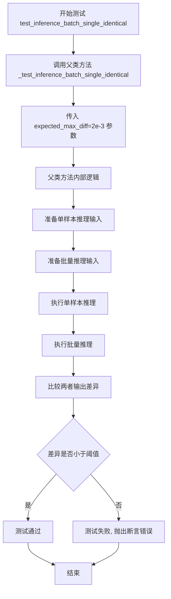

#### 带注释源码

```python
def test_inference_batch_single_identical(self):
    """
    测试方法：验证批量推理与单样本推理的输出结果是否一致
    
    该测试方法继承自测试混合类（PipelineTesterMixin等），
    用于确保在使用ControlNet的Stable Diffusion管道时，
    批量处理图片时能够产生与单独处理每张图片相同的结果。
    
    测试逻辑概述：
    1. 使用相同的随机种子生成器确保可重复性
    2. 分别进行单样本推理和批量推理（批量大小>1）
    3. 比较两者的输出差异
    4. 验证差异小于指定的阈值（2e-3）
    """
    # 调用父类/混合类中实现的通用测试逻辑
    # expected_max_diff=2e-3 表示期望的最大差异值为 0.002
    # 这是一个相对宽松的阈值，用于处理浮点数运算的精度误差
    self._test_inference_batch_single_identical(expected_max_diff=2e-3)
```

---

### 补充说明

**设计目标**：确保 ControlNetPipeline 在批量推理场景下具有确定性行为，输出结果与逐个推理一致，这对于生产环境中的批量图像生成任务至关重要。

**继承关系**：该方法继承自 `PipelineTesterMixin` 或类似的测试混合类，实际的测试逻辑在父类中实现。`ControlNetPipelineFastTests` 类同时继承了多个混合类：

- `IPAdapterTesterMixin`
- `PipelineLatentTesterMixin`
- `PipelineKarrasSchedulerTesterMixin`
- `PipelineTesterMixin`

**阈值选择**：`expected_max_diff=2e-3`（0.002）是一个相对宽松的阈值，主要考虑到：

1. 浮点数运算的累积误差
2. 不同批量大小可能导致的数值精度差异
3. PyTorch 在不同计算路径上的优化差异


### `ControlNetPipelineFastTests.test_controlnet_lcm`

该方法是一个单元测试，用于验证 ControlNet 配合 LCM（Latent Consistency Model）调度器的推理流程是否正常工作。测试通过使用虚拟组件构建管道、执行推理，并验证输出图像的形状和像素值是否符合预期，从而确保 ControlNet 与 LCM 调度的兼容性。

参数：

- `self`：`ControlNetPipelineFastTests` 类型，测试类实例本身，包含测试所需的上下文和辅助方法

返回值：`None`，该方法为单元测试，通过断言验证结果，不返回任何值

#### 流程图

```mermaid
flowchart TD
    A[开始测试] --> B[设置device为cpu以保证确定性]
    B --> C[调用get_dummy_components获取虚拟组件<br/>参数time_cond_proj_dim=256]
    C --> D[使用虚拟组件初始化StableDiffusionControlNetPipeline]
    D --> E[从当前scheduler配置创建LCMScheduler]
    E --> F[将pipeline移至torch_device设备]
    F --> G[设置进度条配置disable=None]
    G --> H[调用get_dummy_inputs获取虚拟输入<br/>包含prompt generator num_inference_steps等]
    H --> I[调用pipeline执行推理生成图像]
    I --> J[从输出中提取images]
    J --> K[提取图像切片image[0, -3:, -3:, -1]]
    K --> L{断言验证}
    L -->|通过| M[测试通过]
    L -->|失败| N[抛出AssertionError]
    
    subgraph 断言验证
        L1[验证image.shape == (1, 64, 64, 3)]
        L2[定义expected_slice预期像素值]
        L3[验证np.abs(image_slice.flatten - expected_slice).max &lt; 1e-2]
    end
```

#### 带注释源码

```python
def test_controlnet_lcm(self):
    """
    测试 ControlNet 配合 LCM 调度器的推理功能
    
    该测试验证:
    1. ControlNet 模型可以与 LCMScheduler 正常配合工作
    2. 推理输出图像的形状正确 (1, 64, 64, 3)
    3. 输出像素值在允许的误差范围内与预期值匹配
    """
    # 设置设备为 cpu，以确保 torch.Generator 的确定性
    # 避免不同设备间的随机性差异导致测试不稳定
    device = "cpu"

    # 获取虚拟组件，包含:
    # - UNet2DConditionModel: 条件 UNet 模型
    # - ControlNetModel: ControlNet 模型
    # - DDIMScheduler: 初始调度器（后续会被替换为 LCM）
    # - AutoencoderKL: VAE 编解码器
    # - CLIPTextModel + CLIPTokenizer: 文本编码器
    # 传入 time_cond_proj_dim=256 以支持 LCM 的时间条件投影
    components = self.get_dummy_components(time_cond_proj_dim=256)

    # 使用虚拟组件实例化 StableDiffusionControlNetPipeline
    # 这是 HuggingFace Diffusers 库中用于条件图像生成的管道
    sd_pipe = StableDiffusionControlNetPipeline(**components)

    # 从当前调度器配置创建 LCMScheduler
    # LCMScheduler 是 Latent Consistency Model 的专用调度器
    # 可以实现更快的推理速度
    sd_pipe.scheduler = LCMScheduler.from_config(sd_pipe.scheduler.config)

    # 将管道移至目标设备（通常是 CUDA 设备）
    sd_pipe = sd_pipe.to(torch_device)

    # 配置进度条，disable=None 表示启用进度条
    sd_pipe.set_progress_bar_config(disable=None)

    # 获取虚拟输入，包含:
    # - prompt: 文本提示 "A painting of a squirrel eating a burger"
    # - generator: 随机数生成器，用于保证可复现性
    # - num_inference_steps: 推理步数 = 2
    # - guidance_scale: 引导强度 = 6.0
    # - output_type: 输出类型 = "np" (numpy 数组)
    # - image: 控制图像（随机噪声张量）
    inputs = self.get_dummy_inputs(device)

    # 执行推理，传入所有输入参数
    # 管道内部会: 编码文本 → 处理 ControlNet 条件 → UNet 推理 → VAE 解码
    output = sd_pipe(**inputs)

    # 从输出中提取生成的图像
    image = output.images

    # 提取图像右下角 3x3 区域的最后一个通道
    # 用于与预期值进行比对验证
    image_slice = image[0, -3:, -3:, -1]

    # 断言验证图像形状
    # 期望形状为 (1, 64, 64, 3)：
    # - 1: batch size
    # - 64: 图像高度
    # - 64: 图像宽度
    # - 3: RGB 通道数
    assert image.shape == (1, 64, 64, 3)

    # 定义预期的像素值切片
    # 这些值是通过确定性测试运行得到的参考值
    expected_slice = np.array(
        [0.52700454, 0.3930534, 0.25509018, 0.7132304, 0.53696585, 0.46568912, 0.7095368, 0.7059624, 0.4744786]
    )

    # 断言验证像素值在允许误差范围内
    # 使用 L-infinity 范数（最大绝对误差），阈值为 1e-2 (0.01)
    # 这种验证方式确保数值精度在可接受范围内
    assert np.abs(image_slice.flatten() - expected_slice).max() < 1e-2
```


### `ControlNetPipelineFastTests.test_controlnet_lcm_custom_timesteps`

该测试方法用于验证 StableDiffusionControlNetPipeline 在使用 LCMScheduler 和自定义时间步长（timesteps）时的功能是否正常。测试通过比较输出图像与预期图像切片的最大差异是否在容忍范围内（1e-2）来断言 pipeline 的正确性。

参数：
- 该方法无显式参数（隐式参数 `self` 为 unittest.TestCase 实例）

返回值：无显式返回值（None），通过断言验证测试结果

#### 流程图

```mermaid
flowchart TD
    A[开始测试] --> B[设置设备为 CPU 以确保确定性]
    B --> C[获取带 time_cond_proj_dim=256 的虚拟组件]
    C --> D[创建 StableDiffusionControlNetPipeline 实例]
    D --> E[将调度器替换为 LCMScheduler]
    E --> F[将 pipeline 移动到 torch_device]
    F --> G[设置进度条配置]
    G --> H[获取虚拟输入]
    H --> I[删除 num_inference_steps 字段]
    I --> J[设置自定义 timesteps=[999, 499]]
    J --> K[执行 pipeline 推理]
    K --> L[提取输出图像]
    L --> M[获取图像右下角 3x3 切片]
    M --> N{断言图像形状为 (1, 64, 64, 3)}
    N --> O{断言切片与预期值的最大差异 < 1e-2}
    O --> |通过| P[测试通过]
    O --> |失败| Q[测试失败]
```

#### 带注释源码

```python
def test_controlnet_lcm_custom_timesteps(self):
    """
    测试 ControlNet Pipeline 使用 LCMScheduler 和自定义时间步长时的功能。
    该测试验证 pipeline 能够正确处理用户自定义的 timesteps 参数，
    而不依赖于默认的 num_inference_steps 参数。
    """
    # 设置设备为 CPU，以确保设备相关的 torch.Generator 的确定性
    device = "cpu"

    # 获取虚拟组件，传入 time_cond_proj_dim=256 以支持 LCM 调度器的时间条件投影
    components = self.get_dummy_components(time_cond_proj_dim=256)
    
    # 使用虚拟组件实例化 StableDiffusionControlNetPipeline
    sd_pipe = StableDiffusionControlNetPipeline(**components)
    
    # 将默认的 DDIMScheduler 替换为 LCMScheduler
    # LCMScheduler 支持更快的推理步骤（少步推理）
    sd_pipe.scheduler = LCMScheduler.from_config(sd_pipe.scheduler.config)
    
    # 将 pipeline 移动到指定的计算设备（如 CUDA 或 CPU）
    sd_pipe = sd_pipe.to(torch_device)
    
    # 配置进度条，disable=None 表示不禁用进度条
    sd_pipe.set_progress_bar_config(disable=None)

    # 获取虚拟输入参数
    inputs = self.get_dummy_inputs(device)
    
    # 删除 num_inference_steps 参数，强制使用自定义 timesteps
    del inputs["num_inference_steps"]
    
    # 设置自定义时间步长列表 [999, 499]
    # 这将覆盖默认的推理步骤，使用户能够精确控制推理过程
    inputs["timesteps"] = [999, 499]
    
    # 执行 pipeline 推理，传入修改后的输入参数
    output = sd_pipe(**inputs)
    
    # 从输出中提取生成的图像
    image = output.images

    # 提取图像右下角的 3x3 像素切片（最后一个通道）
    # 用于与预期值进行精确比较
    image_slice = image[0, -3:, -3:, -1]

    # 断言生成的图像形状为 (1, 64, 64, 3)
    # 1 表示批量大小，64x64 是图像分辨率，3 是 RGB 通道数
    assert image.shape == (1, 64, 64, 3)
    
    # 定义预期的图像切片数值（来自已知正确的输出）
    expected_slice = np.array(
        [0.52700454, 0.3930534, 0.25509018, 0.7132304, 0.53696585, 0.46568912, 0.7095368, 0.7059624, 0.4744786]
    )

    # 断言实际输出与预期值的最大绝对差异小于 1e-2（0.01）
    # 这确保了自定义时间步长功能在不同运行中的一致性
    assert np.abs(image_slice.flatten() - expected_slice).max() < 1e-2
```


### `ControlNetPipelineFastTests.test_encode_prompt_works_in_isolation`

该方法是一个测试用例，用于验证 `encode_prompt` 方法能够独立正常工作。它构建了额外的必需参数字典（包含设备和 classifier-free guidance 标志），然后调用父类的同名测试方法进行实际验证。

参数：

- `self`：`ControlNetPipelineFastTests`（测试类实例），表示调用此方法的测试类实例本身

返回值：`Any`（父类测试方法的返回值，通常为 `None` 或测试结果对象），返回父类 `test_encode_prompt_works_in_isolation` 方法的执行结果

#### 流程图

```mermaid
flowchart TD
    A[开始执行 test_encode_prompt_works_in_isolation] --> B[构建 extra_required_param_value_dict]
    B --> C{获取 torch_device 类型}
    C --> D["设置 device: torch.device(torch_device).type"]
    C --> E["获取 guidance_scale 并判断是否 > 1.0"]
    E --> F["设置 do_classifier_free_guidance: True/False"]
    D --> G[组装 extra_required_param_value_dict 字典]
    G --> H[调用父类方法: super().test_encode_prompt_works_in_isolation]
    H --> I[返回父类方法执行结果]
    I --> J[结束]
```

#### 带注释源码

```python
def test_encode_prompt_works_in_isolation(self):
    """
    测试 encode_prompt 方法能够独立正常工作。
    
    该测试方法验证文本编码功能在隔离环境中的正确性，
    通过构建特定的参数字典并委托给父类测试方法执行。
    """
    # 构建额外的必需参数字典，用于父类测试方法
    extra_required_param_value_dict = {
        # 获取当前计算设备的类型（如 'cuda', 'cpu', 'mps' 等）
        "device": torch.device(torch_device).type,
        # 判断是否启用了 classifier-free guidance
        # 通过检查 guidance_scale 是否大于 1.0 来确定
        "do_classifier_free_guidance": self.get_dummy_inputs(device=torch_device).get("guidance_scale", 1.0) > 1.0,
    }
    # 调用父类的测试方法，传递额外的参数字典
    # 父类方法负责实际的测试逻辑验证
    return super().test_encode_prompt_works_in_isolation(extra_required_param_value_dict)
```


### `StableDiffusionMultiControlNetPipelineFastTests.get_dummy_components`

该方法用于创建用于单元测试的虚拟（dummy）组件字典，包含 Stable Diffusion ControlNet Pipeline 所需的所有模型组件（如 UNet、多个 ControlNet、VAE、文本编码器等），并使用 `MultiControlNetModel` 组合多个 ControlNet 模型以支持多条件控制生成。

参数：

- 无参数

返回值：`Dict[str, Any]`，返回一个包含所有虚拟组件的字典，包括 unet、controlnet（MultiControlNetModel 实例）、scheduler、vae、text_encoder、tokenizer、safety_checker、feature_extractor 和 image_encoder。

#### 流程图

```mermaid
flowchart TD
    A[开始 get_dummy_components] --> B[设置随机种子 torch.manual_seed(0)]
    B --> C[创建 UNet2DConditionModel]
    C --> D[设置随机种子 torch.manual_seed(0)]
    D --> E[定义 init_weights 内部函数]
    E --> F[创建第一个 ControlNetModel controlnet1]
    F --> G[对 controlnet1 应用 init_weights]
    G --> H[设置随机种子 torch.manual_seed(0)]
    H --> I[创建第二个 ControlNetModel controlnet2]
    I --> J[对 controlnet2 应用 init_weights]
    J --> K[设置随机种子 torch.manual_seed(0)]
    K --> L[创建 DDIMScheduler]
    L --> M[设置随机种子 torch.manual_seed(0)]
    M --> N[创建 AutoencoderKL VAE]
    N --> O[设置随机种子 torch.manual_seed(0)]
    O --> P[创建 CLIPTextConfig 配置]
    P --> Q[创建 CLIPTextModel 文本编码器]
    Q --> R[创建 CLIPTokenizer 分词器]
    R --> S[创建 MultiControlNetModel 组合多个 ControlNet]
    S --> T[构建 components 字典]
    T --> U[返回 components]
```

#### 带注释源码

```python
def get_dummy_components(self):
    """
    创建用于测试的虚拟组件字典，包含多ControlNet Pipeline所需的所有模型组件。
    
    Returns:
        dict: 包含以下键的字典:
            - unet: UNet2DConditionModel 实例
            - controlnet: MultiControlNetModel 实例（包含两个ControlNet）
            - scheduler: DDIMScheduler 实例
            - vae: AutoencoderKL 实例
            - text_encoder: CLIPTextModel 实例
            - tokenizer: CLIPTokenizer 实例
            - safety_checker: None
            - feature_extractor: None
            - image_encoder: None
    """
    # 设置随机种子以确保测试可重复性
    torch.manual_seed(0)
    # 创建虚拟 UNet 模型，用于条件图像生成
    unet = UNet2DConditionModel(
        block_out_channels=(4, 8),      # UNet 块的输出通道数
        layers_per_block=2,             # 每个块的层数
        sample_size=32,                 # 样本空间尺寸
        in_channels=4,                  # 输入通道数（latent space）
        out_channels=4,                 # 输出通道数
        down_block_types=("DownBlock2D", "CrossAttnDownBlock2D"),  # 下采样块类型
        up_block_types=("CrossAttnUpBlock2D", "UpBlock2D"),        # 上采样块类型
        cross_attention_dim=32,         # 交叉注意力维度
        norm_num_groups=1,              # 归一化组数
    )
    
    # 重新设置随机种子
    torch.manual_seed(0)
    
    # 定义权重初始化函数，用于ControlNet的卷积层
    def init_weights(m):
        if isinstance(m, torch.nn.Conv2d):
            # 使用正态分布初始化权重
            torch.nn.init.normal_(m.weight)
            # 将偏置填充为1.0
            m.bias.data.fill_(1.0)
    
    # 创建第一个ControlNet模型（ControlNet 1）
    controlnet1 = ControlNetModel(
        block_out_channels=(4, 8),
        layers_per_block=2,
        in_channels=4,
        down_block_types=("DownBlock2D", "CrossAttnDownBlock2D"),
        cross_attention_dim=32,
        conditioning_embedding_out_channels=(16, 32),  # 条件嵌入输出通道
        norm_num_groups=1,
    )
    # 对ControlNet1的所有下块应用权重初始化
    controlnet1.controlnet_down_blocks.apply(init_weights)

    # 重新设置随机种子
    torch.manual_seed(0)
    
    # 创建第二个ControlNet模型（ControlNet 2）
    controlnet2 = ControlNetModel(
        block_out_channels=(4, 8),
        layers_per_block=2,
        in_channels=4,
        down_block_types=("DownBlock2D", "CrossAttnDownBlock2D"),
        cross_attention_dim=32,
        conditioning_embedding_out_channels=(16, 32),
        norm_num_groups=1,
    )
    # 对ControlNet2的所有下块应用权重初始化
    controlnet2.controlnet_down_blocks.apply(init_weights)

    # 重新设置随机种子
    torch.manual_seed(0)
    
    # 创建DDIM调度器，用于扩散模型的去噪调度
    scheduler = DDIMScheduler(
        beta_start=0.00085,              # Beta 起始值
        beta_end=0.012,                  # Beta 结束值
        beta_schedule="scaled_linear",  # Beta 调度策略
        clip_sample=False,               # 是否裁剪样本
        set_alpha_to_one=False,          # 是否将alpha设为1
    )

    # 重新设置随机种子
    torch.manual_seed(0)
    
    # 创建变分自编码器（VAE）用于潜在空间编码/解码
    vae = AutoencoderKL(
        block_out_channels=[4, 8],       # VAE 块的输出通道
        in_channels=3,                  # 输入图像通道（RGB）
        out_channels=3,                 # 输出图像通道
        down_block_types=["DownEncoderBlock2D", "DownEncoderBlock2D"],  # 下采样编码块
        up_block_types=["UpDecoderBlock2D", "UpDecoderBlock2D"],        # 上采样解码块
        latent_channels=4,              # 潜在空间通道数
        norm_num_groups=2,              # 归一化组数
    )

    # 重新设置随机种子
    torch.manual_seed(0)
    
    # 创建CLIP文本编码器配置
    text_encoder_config = CLIPTextConfig(
        bos_token_id=0,                 # 句子开始token ID
        eos_token_id=2,                 # 句子结束token ID
        hidden_size=32,                # 隐藏层维度
        intermediate_size=37,           # 中间层维度
        layer_norm_eps=1e-05,           # LayerNorm epsilon
        num_attention_heads=4,          # 注意力头数
        num_hidden_layers=5,            # 隐藏层数量
        pad_token_id=1,                 # 填充token ID
        vocab_size=1000,                # 词汇表大小
    )
    
    # 根据配置创建CLIP文本编码器模型
    text_encoder = CLIPTextModel(text_encoder_config)
    
    # 从预训练模型加载CLIP分词器
    tokenizer = CLIPTokenizer.from_pretrained("hf-internal-testing/tiny-random-clip")

    # 使用MultiControlNetModel组合两个ControlNet，实现多条件控制
    controlnet = MultiControlNetModel([controlnet1, controlnet2])

    # 构建组件字典，整合所有模型组件
    components = {
        "unet": unet,
        "controlnet": controlnet,
        "scheduler": scheduler,
        "vae": vae,
        "text_encoder": text_encoder,
        "tokenizer": tokenizer,
        "safety_checker": None,         # 安全检查器（测试中禁用）
        "feature_extractor": None,      # 特征提取器（测试中禁用）
        "image_encoder": None,          # 图像编码器（测试中禁用）
    }
    
    # 返回包含所有虚拟组件的字典
    return components
```


### `StableDiffusionMultiControlNetPipelineFastTests.get_dummy_inputs`

该方法用于为多ControlNet（Multi-ControlNet）Stable Diffusion管道生成虚拟输入参数，创建一个包含提示词、随机生成器、推理步数、引导系数和多个控制图像的字典，以支持管道测试。

参数：

- `self`：隐式参数，测试类的实例
- `device`：`str` 或 `torch.device`，目标设备，用于创建张量和生成器
- `seed`：`int`，随机种子，用于生成器的初始化，默认值为 0

返回值：`Dict[str, Any]`，包含以下键的字典：
- `prompt`：提示词文本
- `generator`：随机生成器
- `num_inference_steps`：推理步数
- `guidance_scale`：引导系数
- `output_type`：输出类型
- `image`：多个控制图像张量组成的列表

#### 流程图

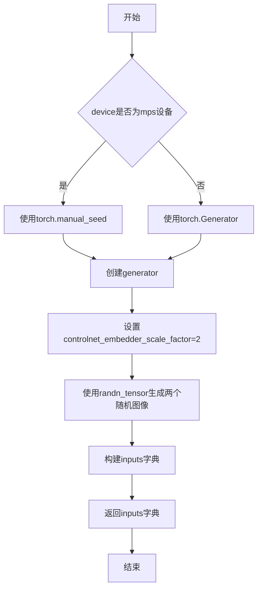

#### 带注释源码

```python
def get_dummy_inputs(self, device, seed=0):
    # 判断是否为MPS设备（Apple Silicon）
    if str(device).startswith("mps"):
        # MPS设备使用torch.manual_seed进行随机种子设置
        generator = torch.manual_seed(seed)
    else:
        # 其他设备（CPU/CUDA）使用torch.Generator进行随机种子设置
        generator = torch.Generator(device=device).manual_seed(seed)

    # 设置ControlNet嵌入器的缩放因子，用于确定输入图像尺寸
    controlnet_embedder_scale_factor = 2

    # 生成两个随机图像张量，用于多ControlNet输入
    # 每个图像尺寸为 (1, 3, 32*2, 32*2) = (1, 3, 64, 64)
    images = [
        randn_tensor(
            (1, 3, 32 * controlnet_embedder_scale_factor, 32 * controlnet_embedder_scale_factor),
            generator=generator,
            device=torch.device(device),
        ),
        randn_tensor(
            (1, 3, 32 * controlnet_embedder_scale_factor, 32 * controlnet_embedder_scale_factor),
            generator=generator,
            device=torch.device(device),
        ),
    ]

    # 构建输入参数字典
    inputs = {
        "prompt": "A painting of a squirrel eating a burger",  # 测试用提示词
        "generator": generator,  # 随机生成器，确保可重复性
        "num_inference_steps": 2,  # 推理步数，测试时使用较少步数
        "guidance_scale": 6.0,  # Classifier-free guidance 引导系数
        "output_type": "np",  # 输出类型为numpy数组
        "image": images,  # 多个控制图像列表
    }

    return inputs
```


### `StableDiffusionMultiControlNetPipelineFastTests.test_control_guidance_switch`

该测试方法用于验证 Multi-ControlNet pipeline 中 guidance 切换功能是否正常工作，通过在不同的时间步应用不同的 guidance 范围来确保生成的图像存在差异。

参数：无（测试类方法，仅包含隐式参数 `self`）

返回值：`None`，该方法为测试函数，通过断言验证功能，不返回具体数值

#### 流程图

```mermaid
flowchart TD
    A[开始测试] --> B[获取虚拟组件]
    B --> C[创建 StableDiffusionControlNetPipeline 实例]
    C --> D[设置 scale=10.0, steps=4]
    D --> E[第一次推理: 无 guidance 范围限制]
    E --> F[第二次推理: control_guidance_start=0.1, control_guidance_end=0.2]
    F --> G[第三次推理: control_guidance_start=[0.1, 0.3], control_guidance_end=[0.2, 0.7]]
    G --> H[第四次推理: control_guidance_start=0.4, control_guidance_end=[0.5, 0.8]]
    H --> I{验证所有输出互不相同}
    I -->|通过| J[测试通过]
    I -->|失败| K[抛出断言错误]
```

#### 带注释源码

```python
def test_control_guidance_switch(self):
    """
    测试 ControlNet pipeline 中 guidance 切换功能。
    验证在不同的时间步应用不同的 guidance 范围会产生不同的输出。
    """
    # 步骤1: 获取预定义的虚拟组件（UNet, ControlNet, Scheduler, VAE, TextEncoder, Tokenizer）
    components = self.get_dummy_components()
    
    # 步骤2: 使用虚拟组件实例化 StableDiffusionControlNetPipeline
    # 该 pipeline 支持多 ControlNet 模型
    pipe = self.pipeline_class(**components)
    
    # 步骤3: 将 pipeline 移动到测试设备（CPU/CUDA）
    pipe.to(torch_device)

    # 步骤4: 设置测试参数
    # scale: ControlNet 的条件强度缩放因子
    scale = 10.0
    # steps: 推理步数
    steps = 4

    # 步骤5: 第一次推理 - 不使用 guidance 范围限制
    # 使用默认的 guidance 范围（0 到 1）
    inputs = self.get_dummy_inputs(torch_device)
    inputs["num_inference_steps"] = steps
    inputs["controlnet_conditioning_scale"] = scale
    output_1 = pipe(**inputs)[0]  # 获取生成的图像

    # 步骤6: 第二次推理 - 使用单一数值的 guidance 范围
    # guidance 从 0.1 开始，在 0.2 处结束
    inputs = self.get_dummy_inputs(torch_device)
    inputs["num_inference_steps"] = steps
    inputs["controlnet_conditioning_scale"] = scale
    output_2 = pipe(**inputs, control_guidance_start=0.1, control_guidance_end=0.2)[0]

    # 步骤7: 第三次推理 - 使用列表形式的 guidance 范围（针对多个 ControlNet）
    # 第一个 ControlNet: 0.1-0.2, 第二个 ControlNet: 0.3-0.7
    inputs = self.get_dummy_inputs(torch_device)
    inputs["num_inference_steps"] = steps
    inputs["controlnet_conditioning_scale"] = scale
    output_3 = pipe(**inputs, control_guidance_start=[0.1, 0.3], control_guidance_end=[0.2, 0.7])[0]

    # 步骤8: 第四次推理 - 混合形式的 guidance 范围
    # 第一个 ControlNet: 0.4-0.5, 第二个 ControlNet: 0.4-0.8
    inputs = self.get_dummy_inputs(torch_device)
    inputs["num_inference_steps"] = steps
    inputs["controlnet_conditioning_scale"] = scale
    output_4 = pipe(**inputs, control_guidance_start=0.4, control_guidance_end=[0.5, 0.8])[0]

    # 步骤9: 验证所有输出都不同
    # 确保使用不同的 guidance 范围会产生显著不同的图像
    assert np.sum(np.abs(output_1 - output_2)) > 1e-3, "输出1和输出2应不同"
    assert np.sum(np.abs(output_1 - output_3)) > 1e-3, "输出1和输出3应不同"
    assert np.sum(np.abs(output_1 - output_4)) > 1e-3, "输出1和输出4应不同"
```


### `StableDiffusionMultiControlNetPipelineFastTests.test_attention_slicing_forward_pass`

该方法是 `StableDiffusionMultiControlNetPipelineFastTests` 测试类中的一个测试方法，用于验证在启用注意力切片（attention slicing）功能时，Stable Diffusion 多控制网管道的前向传播是否正确运行，并通过比较输出差异来确保精度在预期范围内。

参数：

- `self`：测试类实例本身，包含测试所需的组件和配置

返回值：`None` 或 delegated result，该方法调用父类方法 `_test_attention_slicing_forward_pass` 并返回其结果，用于验证注意力切片前向传播的正确性

#### 流程图

```mermaid
graph TD
    A[开始测试 test_attention_slicing_forward_pass] --> B[调用 _test_attention_slicing_forward_pass 方法]
    B --> C[设置 expected_max_diff=2e-3 允许的最大差异阈值]
    C --> D[执行带有注意力切片功能的前向传播]
    D --> E[比较输出结果与基准值的差异]
    E --> F{差异是否小于等于 2e-3?}
    F -->|是| G[测试通过 - 返回结果]
    F -->|否| H[测试失败 - 抛出断言错误]
    G --> I[结束测试]
    H --> I
```

#### 带注释源码

```python
def test_attention_slicing_forward_pass(self):
    """
    测试注意力切片（Attention Slicing）前向传播功能。
    
    该测试方法继承自 PipelineTesterMixin，通过调用 _test_attention_slicing_forward_pass
    方法来验证在启用注意力切片优化时，管道的前向传播输出与基准值的差异在允许范围内。
    
    Attention Slicing 是一种内存优化技术，通过将注意力计算分片处理来减少显存占用。
    
    参数:
        self: 测试类实例，包含 get_dummy_components 和 get_dummy_inputs 等方法
        
    返回值:
        返回父类 _test_attention_slicing_forward_pass 的执行结果，通常为 None
        
    允许的最大差异:
        expected_max_diff=2e-3 (0.002) - 用于验证数值精度
    """
    # 调用父类/混合类提供的注意力切片测试方法
    # expected_max_diff=2e-3 设置了输出图像与基准值之间的最大允许差异
    return self._test_attention_slicing_forward_pass(expected_max_diff=2e-3)
```


### `StableDiffusionMultiControlNetPipelineFastTests.test_xformers_attention_forwardGenerator_pass`

该方法是 `StableDiffusionMultiControlNetPipelineFastTests` 类的测试方法，用于验证在使用 xformers 注意力机制时，Stable Diffusion 多控制网管道的转发pass是否正确运行，并通过与基准值的最大差异来确保数值精度。

参数：

- `self`：隐式参数，测试类实例本身，无需显式传递

返回值：无返回值（`None`），该方法为单元测试方法，通过 `unittest` 框架的断言来验证功能正确性

#### 流程图

```mermaid
flowchart TD
    A[开始测试] --> B{检查环境条件}
    B -->|CUDA可用且xformers已安装| C[调用父类方法 _test_xformers_attention_forwardGenerator_pass]
    B -->|不满足条件| D[跳过测试]
    C --> E[设置 expected_max_diff=2e-3]
    E --> F[执行注意力机制测试]
    F --> G[验证输出与基准值的最大差异是否在允许范围内]
    G -->|通过| H[测试通过]
    G -->|失败| I[抛出断言错误]
    H --> J[结束测试]
    I --> J
```

#### 带注释源码

```python
@unittest.skipIf(
    torch_device != "cuda" or not is_xformers_available(),
    reason="XFormers attention is only available with CUDA and `xformers` installed",
)
def test_xformers_attention_forwardGenerator_pass(self):
    """
    测试 xformers 注意力机制的前向传播是否正确
    
    该测试方法验证在使用 xformers（Facebook开发的内存高效注意力实现）
    时，Stable Diffusion ControlNet Pipeline 的前向传播能否正确执行。
    测试通过与基准输出进行比较，确保数值精度在允许范围内（2e-3）。
    
    注意：
    - 仅在 CUDA 设备且安装了 xformers 时运行
    - 实际测试逻辑委托自父类 PipelineTesterMixin 的 _test_xformers_attention_forwardGenerator_pass 方法
    """
    self._test_xformers_attention_forwardGenerator_pass(expected_max_diff=2e-3)
```


### `StableDiffusionMultiControlNetPipelineFastTests.test_inference_batch_single_identical`

该方法用于测试 Stable Diffusion 多控制网管道在批量推理时，单张图像生成的一致性。它通过调用父类 `PipelineTesterMixin` 提供的 `_test_inference_batch_single_identical` 测试方法，验证批量推理与单张推理的输出是否在允许的误差范围内保持一致，确保管道的批量处理逻辑正确无误。

参数：

- `self`：`StableDiffusionMultiControlNetPipelineFastTests` 实例，隐式参数，表示测试类实例本身

返回值：无（`None`），该方法为测试方法，不返回任何值，主要通过断言进行验证

#### 流程图

```mermaid
flowchart TD
    A[开始执行 test_inference_batch_single_identical] --> B[调用父类方法 _test_inference_batch_single_identical]
    B --> C[设置 expected_max_diff=2e-3]
    C --> D[获取测试所需虚拟组件: get_dummy_components]
    C --> E[获取测试所需虚拟输入: get_dummy_inputs]
    D --> F[创建 StableDiffusionControlNetPipeline 实例]
    E --> F
    F --> G[执行单张图像推理]
    F --> H[执行批量图像推理]
    G --> I[比较单张与批量推理输出差异]
    H --> I
    I --> J{差异是否小于等于 expected_max_diff?}
    J -->|是| K[测试通过]
    J -->|否| L[测试失败，抛出 AssertionError]
```

#### 带注释源码

```python
def test_inference_batch_single_identical(self):
    """
    测试批量推理时单张图像的一致性
    验证批量推理与单独推理的输出是否在允许误差范围内一致
    """
    # 调用父类 PipelineTesterMixin 提供的测试方法
    # expected_max_diff=2e-3 表示期望的最大差异值为 0.002
    # 该测试会比较批量推理结果与单张推理结果的差异
    self._test_inference_batch_single_identical(expected_max_diff=2e-3)
```


### `StableDiffusionMultiControlNetPipelineFastTests.test_ip_adapter`

这是一个测试方法，用于验证 StableDiffusionControlNetPipeline 在集成 IP Adapter 时的功能正确性。方法根据设备类型设置不同的预期输出切片值，并调用父类的 test_ip_adapter 方法执行实际测试逻辑。

参数：

- `self`：隐含的 TestCase 实例，代表当前测试类的实例

返回值：`None`，调用父类 test_ip_adapter 方法的返回值（测试方法通常不返回值）

#### 流程图

```mermaid
flowchart TD
    A[开始 test_ip_adapter] --> B{检查 torch_device 是否为 'cpu'}
    B -->|是| C[设置 expected_pipe_slice 为 CPU 预期值数组]
    B -->|否| D[expected_pipe_slice 保持为 None]
    C --> E[调用 super().test_ip_adapter 传递 expected_pipe_slice]
    D --> E
    E --> F[执行父类 IP Adapter 测试逻辑]
    F --> G[结束]
    
    style A fill:#f9f,color:#333
    style F fill:#9f9,color:#333
    style G fill:#ff9,color:#333
```

#### 带注释源码

```python
def test_ip_adapter(self):
    """
    测试 IP Adapter 功能在 Multi-ControlNet Pipeline 中的集成
    
    该测试方法继承自 IPAdapterTesterMixin，用于验证：
    1. IP Adapter 能够正确加载和运行
    2. 生成的图像输出符合预期
    3. 在不同设备上的数值稳定性
    """
    # 初始化预期输出切片为 None
    expected_pipe_slice = None
    
    # 针对 CPU 设备设置特定的预期输出值
    # 这些数值是通过多次运行获得的参考值，用于验证输出一致性
    if torch_device == "cpu":
        expected_pipe_slice = np.array([
            0.2422, 0.3425, 0.4048,  # 第一行像素值
            0.5351, 0.3503, 0.2419,  # 第二行像素值
            0.4645, 0.4570, 0.3804   # 第三行像素值
        ])
    
    # 调用父类的 test_ip_adapter 方法执行实际的测试逻辑
    # 父类方法会进行以下操作：
    # 1. 设置 IP Adapter 相关配置
    # 2. 执行管道推理
    # 3. 验证输出图像的数值范围和内容
    # 4. 与 expected_pipe_slice 进行比对（如果提供）
    return super().test_ip_adapter(expected_pipe_slice=expected_pipe_slice)
```


### StableDiffusionMultiControlNetPipelineFastTests.test_save_pretrained_raise_not_implemented_exception

该测试方法用于验证当尝试对Multi-ControlNet模型保存预训练权重时是否会正确抛出`NotImplementedError`异常。该测试通过创建虚拟组件构建pipeline实例，然后在临时目录中调用`save_pretrained`方法，期望捕获到`NotImplementedError`异常，从而确认Multi-ControlNet场景下保存功能未被实现。

参数：

- `self`：隐式参数，`StableDiffusionMultiControlNetPipelineFastTests`实例本身

返回值：`None`，该方法为`unittest.TestCase`的测试方法，不返回任何值，仅通过异常捕获来验证行为

#### 流程图

```mermaid
flowchart TD
    A[开始测试] --> B[获取虚拟组件: get_dummy_components]
    B --> C[使用组件构造Pipeline实例]
    C --> D[将Pipeline移动到计算设备: pipe.to]
    D --> E[设置进度条配置: set_progress_bar_config]
    E --> F[创建临时目录]
    F --> G[调用pipe.save_pretrained保存到临时目录]
    G --> H{是否抛出NotImplementedError?}
    H -->|是| I[测试通过 - pass块捕获异常]
    H -->|否| J[测试失败 - 异常向上传播]
    I --> K[结束测试]
    J --> K
```

#### 带注释源码

```python
def test_save_pretrained_raise_not_implemented_exception(self):
    """
    测试Multi-ControlNet Pipeline的save_pretrained方法是否抛出NotImplementedError异常。
    Multi-ControlNet模式下的保存功能尚未实现，此测试确保调用时会抛出正确的异常类型。
    """
    # 步骤1: 获取虚拟组件（用于测试的模拟模型组件）
    # 包含unet、controlnet（MultiControlNetModel）、scheduler、vae、text_encoder、tokenizer等
    components = self.get_dummy_components()
    
    # 步骤2: 使用组件字典构造Pipeline实例
    # pipeline_class为StableDiffusionControlNetPipeline
    pipe = self.pipeline_class(**components)
    
    # 步骤3: 将Pipeline移动到指定设备（如cuda或cpu）
    pipe.to(torch_device)
    
    # 步骤4: 配置进度条（disable=None表示启用进度条）
    pipe.set_progress_bar_config(disable=None)
    
    # 步骤5: 使用临时目录上下文管理器，确保测试结束后自动清理
    with tempfile.TemporaryDirectory() as tmpdir:
        try:
            # 步骤6: 尝试调用save_pretrained方法保存模型
            # Multi-ControlNet场景下该功能未实现，预期会抛出NotImplementedError
            pipe.save_pretrained(tmpdir)
        except NotImplementedError:
            # 步骤7: 捕获NotImplementedError异常并忽略（pass）
            # 这表明save_pretrained确实未实现，测试按预期通过
            pass
```


### `StableDiffusionMultiControlNetPipelineFastTests.test_inference_multiple_prompt_input`

该方法是针对StableDiffusionControlNetPipeline的集成测试，验证多提示词输入功能是否正常工作。测试涵盖了单提示词到多提示词、多图像条件的各种场景，确保pipeline能正确处理批量推理并产生符合预期的图像输出。

参数：
- `self`：类实例方法的标准参数，类型为`StableDiffusionMultiControlNetPipelineFastTests`，表示当前测试类实例

返回值：`None`，该方法为测试方法，无返回值，通过断言验证功能正确性

#### 流程图

```mermaid
flowchart TD
    A[开始测试] --> B[获取虚拟组件 components]
    B --> C[创建StableDiffusionControlNetPipeline实例]
    C --> D[将pipeline移动到torch_device]
    D --> E[配置进度条为禁用]
    E --> F[获取虚拟输入 inputs]
    F --> G[设置prompt为重复两次的列表: prompt, prompt]
    G --> H[设置image为重复两次的列表: image, image]
    H --> I[执行pipeline推理]
    I --> J{断言: image.shape == (2, 64, 64, 3)}
    J -->|通过| K[分离image_1和image_2]
    K --> L{断言: image_1与image_2差异 > 1e-3}
    L -->|通过| M[重新获取虚拟输入]
    M --> N[设置prompt为双元素列表, 保持单一image]
    N --> O[执行pipeline推理 output_1]
    O --> P{断言: 两次输出差异 < 1e-3}
    P -->|通过| Q[再次获取虚拟输入]
    Q --> R[设置prompt为四元素列表]
    R --> S[设置image为四元素列表]
    S --> T[执行pipeline推理 output_2]
    T --> U{断言: image.shape == (4, 64, 64, 3)}
    U -->|通过| V[测试完成]
    J -->|失败| W[抛出AssertionError]
    L -->|失败| W
    P -->|失败| W
    U -->|失败| W
```

#### 带注释源码

```python
def test_inference_multiple_prompt_input(self):
    """
    测试多提示词输入功能，验证StableDiffusionControlNetPipeline
    能够正确处理批量提示词和批量图像条件输入
    """
    # 使用CPU设备确保确定性
    device = "cpu"

    # 步骤1: 获取虚拟组件（包含UNet、ControlNet、VAE、Scheduler等）
    components = self.get_dummy_components()
    
    # 步骤2: 使用虚拟组件实例化StableDiffusionControlNetPipeline
    sd_pipe = StableDiffusionControlNetPipeline(**components)
    
    # 步骤3: 将pipeline移至指定的torch设备（如CUDA或CPU）
    sd_pipe = sd_pipe.to(torch_device)
    
    # 步骤4: 禁用进度条（用于测试环境，避免输出干扰）
    sd_pipe.set_progress_bar_config(disable=None)

    # 步骤5: 获取默认虚拟输入参数
    inputs = self.get_dummy_inputs(device)
    
    # 步骤6: 修改prompt为列表形式，支持多提示词批量推理
    # 将单个prompt转换为包含两个相同prompt的列表
    inputs["prompt"] = [inputs["prompt"], inputs["prompt"]]
    
    # 步骤7: 修改image为列表形式，支持多图像条件输入
    # 将单个图像转换为包含两个相同图像的列表
    inputs["image"] = [inputs["image"], inputs["image"]]
    
    # 步骤8: 执行pipeline推理
    output = sd_pipe(**inputs)
    image = output.images

    # 断言1: 验证输出图像形状正确
    # 应输出2张64x64x3的图像（批次维度为2）
    assert image.shape == (2, 64, 64, 3)

    # 步骤9: 分离两个输出图像用于差异比较
    image_1, image_2 = image
    
    # 断言2: 验证相同输入条件下两个输出是不同的
    # 这是因为推理过程中的随机性（即使prompt相同）
    # 确保np.sum(np.abs(image_1 - image_2)) > 1e-3，表示两张图像有显著差异
    assert np.sum(np.abs(image_1 - image_2)) > 1e-3

    # 步骤10: 测试多提示词、单一图像条件
    # 重新获取虚拟输入
    inputs = self.get_dummy_inputs(device)
    
    # 设置多个prompt但保持单一image（单图像条件）
    inputs["prompt"] = [inputs["prompt"], inputs["prompt"]]
    
    # 执行推理
    output_1 = sd_pipe(**inputs)

    # 断言3: 验证多prompt单image条件下输出与之前的差异
    # 由于使用相同的随机种子，输出应该几乎相同
    # 确保np.abs(image - output_1.images).max() < 1e-3
    assert np.abs(image - output_1.images).max() < 1e-3

    # 步骤11: 测试多提示词、多图像条件（4个prompt + 4个image）
    # 重新获取虚拟输入
    inputs = self.get_dummy_inputs(device)
    
    # 设置4个prompt（重复4次）
    inputs["prompt"] = [inputs["prompt"], inputs["prompt"], inputs["prompt"], inputs["prompt"]]
    
    # 设置4个图像条件（重复4次）
    inputs["image"] = [inputs["image"], inputs["image"], inputs["image"], inputs["image"]]
    
    # 执行推理
    output_2 = sd_pipe(**inputs)
    image = output_2.images

    # 断言4: 验证4个输出的形状正确
    # 应输出4张64x64x3的图像
    assert image.shape == (4, 64, 64, 3)
```


### `StableDiffusionMultiControlNetPipelineFastTests.test_encode_prompt_works_in_isolation`

该方法是一个测试方法，用于验证 `encode_prompt` 在隔离环境下的工作状态。它通过构建额外的必需参数字典（包含设备和 classifier-free guidance 标志），调用父类 `PipelineTesterMixin` 中的同名测试方法来实现测试逻辑。

参数：

- `self`：隐式参数，测试类实例本身
- `extra_required_param_value_dict`：字典类型，由方法内部构建，包含 `device`（设备类型）和 `do_classifier_free_guidance`（是否启用 classifier-free guidance）两个键值对，作为调用父类测试方法时传递的额外参数

返回值：`Any`，返回父类 `test_encode_prompt_works_in_isolation` 方法的执行结果，通常是测试断言或 `None`

#### 流程图

```mermaid
flowchart TD
    A[开始 test_encode_prompt_works_in_isolation] --> B[构建 extra_required_param_value_dict]
    B --> C{获取 torch_device}
    C --> D[获取 device 类型: torch.device(torch_device).type]
    C --> E[调用 get_dummy_inputs 获取 guidance_scale]
    E --> F[计算 do_classifier_free_guidance: guidance_scale > 1.0]
    D --> G[组装 extra_required_param_value_dict 字典]
    F --> G
    G --> H[调用父类 test_encode_prompt_works_in_isolation 方法]
    H --> I[传入 extra_required_param_value_dict 参数]
    I --> J[返回父类测试结果]
    J --> K[结束]
```

#### 带注释源码

```python
def test_encode_prompt_works_in_isolation(self):
    """
    测试 encode_prompt 方法在隔离环境下的工作状态。
    该测试验证文本编码功能可以独立正常运行，不受其他 pipeline 组件的影响。
    """
    # 构建额外的必需参数字典，用于传递给父类测试方法
    extra_required_param_value_dict = {
        # 获取当前设备类型（如 'cuda', 'cpu', 'mps' 等）
        "device": torch.device(torch_device).type,
        # 判断是否启用 classifier-free guidance
        # 从 dummy_inputs 中获取 guidance_scale，如果不存在则默认为 1.0
        # 如果 guidance_scale > 1.0，则 do_classifier_free_guidance 为 True
        "do_classifier_free_guidance": self.get_dummy_inputs(device=torch_device).get("guidance_scale", 1.0) > 1.0,
    }
    # 调用父类 PipelineTesterMixin 中的同名测试方法
    # 父类方法会实际执行 encode_prompt 的隔离测试逻辑
    return super().test_encode_prompt_works_in_isolation(extra_required_param_value_dict)
```


### `StableDiffusionMultiControlNetOneModelPipelineFastTests.get_dummy_components`

该方法用于生成 Stable Diffusion 多控制网单模型管道的虚拟（dummy）组件，主要为单元测试提供确定性的、可复现的模型实例。

参数：无

返回值：`Dict[str, Any]`，返回包含 Stable Diffusion ControlNet Pipeline 所有必要组件的字典，包括 UNet、ControlNet、Scheduler、VAE、Text Encoder、Tokenizer 等，其中 safety_checker、feature_extractor 和 image_encoder 设置为 None。

#### 流程图

```mermaid
flowchart TD
    A[开始 get_dummy_components] --> B[设置随机种子 torch.manual_seed]
    B --> C[创建 UNet2DConditionModel]
    C --> D[设置随机种子并定义 init_weights 闭包]
    E[创建 ControlNetModel] --> F[应用 init_weights 到 controlnet_down_blocks]
    D --> E
    F --> G[创建 DDIMScheduler]
    G --> H[创建 AutoencoderKL]
    H --> I[创建 CLIPTextConfig 和 CLIPTextModel]
    I --> J[创建 CLIPTokenizer]
    J --> K[创建 MultiControlNetModel 包装单个 controlnet]
    K --> L[构建 components 字典]
    L --> M[返回 components]
```

#### 带注释源码

```python
def get_dummy_components(self):
    """
    生成用于测试的虚拟组件字典。
    包含 StableDiffusionControlNetPipeline 的所有必要模型和配置。
    """
    # 设置随机种子以确保测试可复现
    torch.manual_seed(0)
    # 创建 UNet2DConditionModel - 负责去噪过程的核心模型
    unet = UNet2DConditionModel(
        block_out_channels=(4, 8),        # UNet 块的输出通道数
        layers_per_block=2,               # 每个块中的层数
        sample_size=32,                   # 样本空间分辨率
        in_channels=4,                    # 输入通道数（latent space）
        out_channels=4,                  # 输出通道数
        down_block_types=("DownBlock2D", "CrossAttnDownBlock2D"),  # 下采样块类型
        up_block_types=("CrossAttnUpBlock2D", "UpBlock2D"),        # 上采样块类型
        cross_attention_dim=32,           # 交叉注意力维度
        norm_num_groups=1,                # 归一化组数
    )
    
    # 重置随机种子
    torch.manual_seed(0)
    
    # 定义权重初始化函数，用于 Conv2d 层
    def init_weights(m):
        if isinstance(m, torch.nn.Conv2d):
            torch.nn.init.normal_(m.weight)  # 使用正态分布初始化权重
            m.bias.data.fill_(1.0)            # 偏置填充为 1.0

    # 创建 ControlNetModel - 负责从条件图像提取控制特征
    torch.manual_seed(0)
    controlnet = ControlNetModel(
        block_out_channels=(4, 8),                       # 控制网块输出通道
        layers_per_block=2,                              # 每块层数
        in_channels=4,                                   # 输入通道
        down_block_types=("DownBlock2D", "CrossAttnDownBlock2D"),  # 下采样块类型
        cross_attention_dim=32,                          # 交叉注意力维度
        conditioning_embedding_out_channels=(16, 32),   # 条件嵌入输出通道
        norm_num_groups=1,                               # 归一化组数
    )
    # 将初始化函数应用到 controlnet 的下采样块
    controlnet.controlnet_down_blocks.apply(init_weights)

    # 创建调度器 - 控制去噪过程的噪声调度
    torch.manual_seed(0)
    scheduler = DDIMScheduler(
        beta_start=0.00085,           # beta 起始值
        beta_end=0.012,               # beta 结束值
        beta_schedule="scaled_linear",  # beta 调度策略
        clip_sample=False,            # 是否裁剪采样
        set_alpha_to_one=False,      # 是否将 alpha 设置为 1
    )
    
    # 创建 VAE - 负责图像与 latent space 之间的编码/解码
    torch.manual_seed(0)
    vae = AutoencoderKL(
        block_out_channels=[4, 8],    # VAE 块输出通道
        in_channels=3,               # 输入通道 (RGB)
        out_channels=3,              # 输出通道 (RGB)
        down_block_types=["DownEncoderBlock2D", "DownEncoderBlock2D"],  # 编码器下采样块
        up_block_types=["UpDecoderBlock2D", "UpDecoderBlock2D"],        # 解码器上采样块
        latent_channels=4,           # latent 空间通道数
        norm_num_groups=2,           # 归一化组数
    )
    
    # 创建文本编码器配置和模型
    torch.manual_seed(0)
    text_encoder_config = CLIPTextConfig(
        bos_token_id=0,               # 句子开始 token ID
        eos_token_id=2,               # 句子结束 token ID
        hidden_size=32,               # 隐藏层维度
        intermediate_size=37,         # 中间层维度
        layer_norm_eps=1e-05,         # LayerNorm epsilon
        num_attention_heads=4,        # 注意力头数
        num_hidden_layers=5,          # 隐藏层数量
        pad_token_id=1,               # 填充 token ID
        vocab_size=1000,              # 词汇表大小
    )
    text_encoder = CLIPTextModel(text_encoder_config)  # 创建 CLIP 文本编码器
    
    # 创建分词器 - 用于将文本转换为 token
    tokenizer = CLIPTokenizer.from_pretrained("hf-internal-testing/tiny-random-clip")

    # 使用 MultiControlNetModel 包装单个 ControlNet（支持多控制网接口）
    controlnet = MultiControlNetModel([controlnet])

    # 组装所有组件到字典中
    components = {
        "unet": unet,                     # UNet 去噪模型
        "controlnet": controlnet,        # ControlNet 条件模型
        "scheduler": scheduler,           # 噪声调度器
        "vae": vae,                       # 变分自编码器
        "text_encoder": text_encoder,    # 文本编码器
        "tokenizer": tokenizer,           # 分词器
        "safety_checker": None,          # 安全检查器（测试中禁用）
        "feature_extractor": None,        # 特征提取器（测试中禁用）
        "image_encoder": None,            # 图像编码器（测试中禁用）
    }
    return components
```


### `StableDiffusionMultiControlNetOneModelPipelineFastTests.get_dummy_inputs`

该方法用于为 Stable Diffusion 多控制网管道测试生成虚拟输入数据，通过创建随机张量作为控制网的条件图像，并配置推理所需的各类参数（如提示词、生成器、推理步数、引导比例等），以支持管道的前向传播测试。

参数：

- `self`：隐式参数，指向类实例本身
- `device`：`str` 或 `torch.device`，执行推理的目标设备（如 "cpu"、"cuda" 等）
- `seed`：`int`（默认值：0），随机种子，用于控制生成器的随机性，确保测试可复现

返回值：`Dict[str, Any]`，返回包含以下键的字典：
- `prompt`（str）：文本提示词
- `generator`（torch.Generator）：PyTorch 随机数生成器
- `num_inference_steps`（int）：推理步数
- `guidance_scale`（float）：分类器自由引导比例
- `output_type`（str）：输出类型（"np" 表示 numpy 数组）
- `image`（List[torch.Tensor]）：控制网条件图像列表

#### 流程图

```mermaid
flowchart TD
    A[开始 get_dummy_inputs] --> B{检查 device 是否为 MPS?}
    B -->|是| C[使用 torch.manual_seed 创建生成器]
    B -->|否| D[使用 torch.Generator 创建生成器]
    C --> E[设置 controlnet_embedder_scale_factor = 2]
    D --> E
    E --> F[使用 randn_tensor 生成随机图像张量]
    F --> G[构建 inputs 字典]
    G --> H[包含 prompt/generator/num_inference_steps/guidance_scale/output_type/image]
    H --> I[返回 inputs 字典]
```

#### 带注释源码

```python
def get_dummy_inputs(self, device, seed=0):
    """
    生成用于测试 StableDiffusionControlNetPipeline 的虚拟输入数据。
    
    参数:
        device: 目标设备字符串或 torch.device 对象
        seed: 随机种子，用于确保测试的可重复性
    
    返回:
        包含管道推理所需参数的字典
    """
    # 判断是否为 Apple MPS (Metal Performance Shaders) 设备
    # MPS 设备使用 CPU 生成器方式创建随机数
    if str(device).startswith("mps"):
        # MPS 设备使用 torch.manual_seed 而非 torch.Generator
        generator = torch.manual_seed(seed)
    else:
        # 其他设备（如 CPU、CUDA）使用设备特定的生成器
        generator = torch.Generator(device=device).manual_seed(seed)

    # 控制网图像嵌入器的缩放因子
    # 用于将基础分辨率（32）放大到控制网输入尺寸
    controlnet_embedder_scale_factor = 2

    # 生成随机张量作为控制网的条件图像
    # 图像尺寸: (1, 3, 32*2, 32*2) = (1, 3, 64, 64)
    # 1: batch size, 3: RGB 通道数, 64x64: 图像分辨率
    images = [
        randn_tensor(
            (1, 3, 32 * controlnet_embedder_scale_factor, 32 * controlnet_embedder_scale_factor),
            generator=generator,
            device=torch.device(device),
        ),
    ]

    # 构建完整的输入参数字典
    # 用于传递给 StableDiffusionControlNetPipeline 的 __call__ 方法
    inputs = {
        "prompt": "A painting of a squirrel eating a burger",  # 文本提示词
        "generator": generator,  # 随机生成器，确保噪声可控
        "num_inference_steps": 2,  # 扩散推理步数（测试用最小值）
        "guidance_scale": 6.0,  # CFG 引导强度
        "output_type": "np",  # 输出为 numpy 数组
        "image": images,  # 控制网条件图像列表
    }

    return inputs
```


### `StableDiffusionMultiControlNetOneModelPipelineFastTests.test_control_guidance_switch`

该方法是一个单元测试，用于验证Stable Diffusion ControlNet pipeline中控制引导切换功能（control_guidance_start和control_guidance_end参数）的正确性。测试通过比较不同引导参数组合产生的输出图像差异，确保引导切换逻辑正常工作。

参数：無（该方法为类成员方法，通过self隐式访问测试类属性）

返回值：`None`（无返回值，测试方法通过assert断言验证逻辑）

#### 流程图

```mermaid
flowchart TD
    A[开始测试] --> B[获取虚拟组件: get_dummy_components]
    B --> C[创建Pipeline并移至设备: pipe.to]
    C --> D[设置测试参数: scale=10.0, steps=4]
    D --> E1[第一次推理: 无特殊引导参数]
    E1 --> O1[获取输出1]
    O1 --> E2[第二次推理: control_guidance_start=0.1, control_guidance_end=0.2]
    E2 --> O2[获取输出2]
    O2 --> E3[第三次推理: control_guidance_start=[0.1], control_guidance_end=[0.2]]
    E3 --> O3[获取输出3]
    O3 --> E4[第四次推理: control_guidance_start=0.4, control_guidance_end=[0.5]]
    E4 --> O4[获取输出4]
    O4 --> V1[断言: output_1 != output_2]
    V1 --> V2[断言: output_1 != output_3]
    V2 --> V3[断言: output_1 != output_4]
    V3 --> E[结束测试]
```

#### 带注释源码

```python
def test_control_guidance_switch(self):
    """
    测试控制网络引导切换功能，验证不同的 control_guidance_start
    和 control_guidance_end 参数组合会产生不同的输出图像。
    """
    
    # 步骤1: 获取虚拟组件（用于测试的模拟模型组件）
    # 包含 UNet, ControlNet, Scheduler, VAE, TextEncoder, Tokenizer 等
    components = self.get_dummy_components()
    
    # 步骤2: 使用虚拟组件创建 StableDiffusionControlNetPipeline 实例
    # pipeline_class 在类定义中指定为 StableDiffusionControlNetPipeline
    pipe = self.pipeline_class(**components)
    
    # 步骤3: 将 pipeline 移至测试设备（CPU 或 CUDA）
    pipe.to(torch_device)

    # 步骤4: 设置测试参数
    scale = 10.0          # controlnet_conditioning_scale: 控制网络影响强度
    steps = 4            # num_inference_steps: 推理步数

    # 步骤5: 第一次推理 - 无引导切换（使用默认全程引导）
    inputs = self.get_dummy_inputs(torch_device)
    inputs["num_inference_steps"] = steps
    inputs["controlnet_conditioning_scale"] = scale
    output_1 = pipe(**inputs)[0]  # [0] 获取图像数组

    # 步骤6: 第二次推理 - 使用标量引导范围 [0.1, 0.2]
    # control_guidance_start=0.1: 从10%的推理步骤开始应用控制引导
    # control_guidance_end=0.2: 在20%的推理步骤时结束控制引导
    inputs = self.get_dummy_inputs(torch_device)
    inputs["num_inference_steps"] = steps
    inputs["controlnet_conditioning_scale"] = scale
    output_2 = pipe(**inputs, control_guidance_start=0.1, control_guidance_end=0.2)[0]

    # 步骤7: 第三次推理 - 使用单元素列表引导范围 [0.1]->[0.2]
    # 测试当使用列表参数（即使只有一个元素）时的行为
    inputs = self.get_dummy_inputs(torch_device)
    inputs["num_inference_steps"] = steps
    inputs["controlnet_conditioning_scale"] = scale
    output_3 = pipe(
        **inputs,
        control_guidance_start=[0.1],   # 列表形式，单ControlNet
        control_guidance_end=[0.2],
    )[0]

    # 步骤8: 第四次推理 - 混合标量和列表引导参数
    # control_guidance_start=0.4: 标量
    # control_guidance_end=[0.5]: 列表形式
    inputs = self.get_dummy_inputs(torch_device)
    inputs["num_inference_steps"] = steps
    inputs["controlnet_conditioning_scale"] = scale
    output_4 = pipe(**inputs, control_guidance_start=0.4, control_guidance_end=[0.5])[0]

    # 步骤9: 验证断言 - 确保所有输出都不同
    # 使用 np.sum(np.abs(output_1 - output_2)) > 1e-3 来比较图像差异
    # 如果差异太小（≤1e-3），则说明引导切换未生效，测试失败
    
    # 断言1: 默认全程引导 vs 短时引导 [0.1, 0.2] 应产生不同输出
    assert np.sum(np.abs(output_1 - output_2)) > 1e-3
    
    # 断言2: 默认全程引导 vs 列表参数引导应产生不同输出
    assert np.sum(np.abs(output_1 - output_3)) > 1e-3
    
    # 断言3: 默认全程引导 vs 不同时间点的引导应产生不同输出
    assert np.sum(np.abs(output_1 - output_4)) > 1e-3
```


### `StableDiffusionMultiControlNetOneModelPipelineFastTests.test_attention_slicing_forward_pass`

该方法是一个单元测试，用于验证 StableDiffusionControlNetPipeline 在使用注意力切片（attention slicing）技术进行前向传播时的正确性。通过比较默认实现与启用注意力切片后的输出差异，确保两种实现的结果在允许的误差范围内一致。

参数：
- `self`：隐式参数，类型为 `StableDiffusionMultiControlNetOneModelPipelineFastTests` 实例，表示测试类本身

返回值：`任意类型`，返回被调用方法 `_test_attention_slicing_forward_pass` 的返回值，通常为 `None` 或测试断言结果

#### 流程图

```mermaid
flowchart TD
    A[开始测试] --> B[调用父类方法 _test_attention_slicing_forward_pass]
    B --> C[设置 expected_max_diff=2e-3 允许最大误差]
    C --> D[初始化测试组件]
    D --> E[创建 StableDiffusionControlNetPipeline 实例]
    E --> F[启用注意力切片 enable_attention_slicing]
    F --> G[运行前向传播]
    G --> H[与基准输出比较]
    H --> I{差异是否小于阈值}
    I -->|是| J[测试通过]
    I -->|否| K[测试失败]
    J --> L[返回结果]
    K --> L
```

#### 带注释源码

```python
def test_attention_slicing_forward_pass(self):
    """
    测试方法：验证启用注意力切片后的前向传播正确性
    
    该测试方法继承自测试混合类，通过调用父类提供的
    _test_attention_slicing_forward_pass 方法来执行实际测试逻辑。
    注意力切片是一种内存优化技术，将注意力计算分片处理
    以减少显存占用。
    
    参数:
        self: 测试类实例，隐式参数
        
    返回值:
        返回父类方法 _test_attention_slicing_forward_pass 的执行结果
    """
    # 调用父类或混入类中实现的通用测试方法
    # expected_max_diff=2e-3 表示输出与基准值的最大允许差异
    return self._test_attention_slicing_forward_pass(expected_max_diff=2e-3)
```


### `StableDiffusionMultiControlNetOneModelPipelineFastTests.test_xformers_attention_forwardGenerator_pass`

该方法是一个单元测试，用于验证在使用 xformers 注意力机制时，StableDiffusionMultiControlNetOneModelPipeline 的前向传播是否能正确运行，并且与基准值的差异在可接受范围内（2e-3）。

参数： 无（除 self 外）

返回值：`None`，因为这是一个测试方法，不返回任何值

#### 流程图

```mermaid
graph TD
    A[开始测试] --> B{检查CUDA和xformers可用性}
    B -->|不满足条件| C[跳过测试]
    B -->|满足条件| D[调用_test_xformers_attention_forwardGenerator_pass方法]
    D --> E[expected_max_diff=2e-3]
    E --> F[执行注意力机制前向传播测试]
    F --> G[验证输出差异是否小于expected_max_diff]
    G --> H[通过测试]
    G --> I[失败测试]
    H --> J[结束]
    I --> J
    C --> J
```

#### 带注释源码

```python
@unittest.skipIf(
    torch_device != "cuda" or not is_xformers_available(),
    reason="XFormers attention is only available with CUDA and `xformers` installed",
)
def test_xformers_attention_forwardGenerator_pass(self):
    """
    测试 xformers 注意力机制的前向传播是否正确。
    
    该测试方法验证在使用 xformers 优化的注意力机制时，
    模型的输出与预期结果之间的差异是否在可接受范围内。
    
    使用装饰器 @unittest.skipIf 确保：
    1. 测试仅在 CUDA 设备上运行
    2. xformers 库已正确安装
    """
    # 调用父类或测试工具类中的通用测试方法
    # expected_max_diff=2e-3 表示允许的最大差异值为 0.002
    self._test_xformers_attention_forwardGenerator_pass(expected_max_diff=2e-3)
```


### `StableDiffusionMultiControlNetOneModelPipelineFastTests.test_inference_batch_single_identical`

该测试方法用于验证在使用MultiControlNet（单模型版本）进行推理时，批处理中单个样本的输出与单独推理该样本的输出是否一致，确保批处理逻辑不会引入数值差异。

参数：

- `self`：实例方法，属于 `StableDiffusionMultiControlNetOneModelPipelineFastTests` 类

返回值：无显式返回值（通过 `self._test_inference_batch_single_identical` 进行验证测试）

#### 流程图

```mermaid
graph TD
    A[开始测试 test_inference_batch_single_identical] --> B[调用父类方法 _test_inference_batch_single_identical]
    B --> C[传入 expected_max_diff=2e-3]
    C --> D[在父类中执行批处理一致性验证]
    D --> E{验证结果是否在误差范围内}
    E -->|是| F[测试通过]
    E -->|否| G[测试失败/抛出异常]
```

#### 带注释源码

```python
def test_inference_batch_single_identical(self):
    """
    测试方法：验证批处理推理时单个样本的输出与单独推理该样本的输出是否一致。
    
    该测试确保在使用MultiControlNet（单模型版本）进行批量推理时，
    每个样本的输出结果与单独推理该样本时的结果保持一致，
    验证批处理逻辑没有引入额外的数值差异。
    """
    # 调用父类/混合类中定义的通用测试方法
    # expected_max_diff=2e-3 表示期望的最大差异值为 0.002
    # 如果批处理输出与单独推理输出的差异超过此值，测试将失败
    self._test_inference_batch_single_identical(expected_max_diff=2e-3)
```


### `StableDiffusionMultiControlNetOneModelPipelineFastTests.test_ip_adapter`

该方法是单元测试方法，用于测试Stable Diffusion ControlNet管道中的IP-Adapter功能。它根据当前设备类型设置预期的输出切片值，然后调用父类的test_ip_adapter方法进行实际测试验证。

参数：

- `self`：类的实例，代表测试类的当前实例

返回值：`Any`，返回父类`test_ip_adapter`方法的执行结果，通常为`None`（测试方法无返回值）

#### 流程图

```mermaid
flowchart TD
    A[开始测试 test_ip_adapter] --> B{torch_device == 'cpu'?}
    B -->|是| C[设置 expected_pipe_slice = np.array<br/>[0.5264, 0.3203, 0.1602, 0.8235,<br/>0.6332, 0.4593, 0.7226,<br/>0.7777, 0.4780]]
    B -->|否| D[设置 expected_pipe_slice = None]
    C --> E[调用 super().test_ip_adapter<br/>expected_pipe_slice=expected_pipe_slice]
    D --> E
    E --> F[返回测试结果]
```

#### 带注释源码

```python
def test_ip_adapter(self):
    """
    测试IP-Adapter功能在多ControlNet单模型管道中的行为。
    
    此测试方法继承自IPAdapterTesterMixin，用于验证IP-Adapter
    在StableDiffusionMultiControlNetOneModelPipeline中的正确性。
    """
    # 初始化预期输出切片为None
    expected_pipe_slice = None
    
    # 如果当前设备是CPU，设置预期的管道输出切片值
    # 这些数值是预先计算好的参考值，用于验证输出正确性
    if torch_device == "cpu":
        expected_pipe_slice = np.array([
            0.5264, 0.3203, 0.1602,  # 第一行像素值
            0.8235, 0.6332, 0.4593,  # 第二行像素值
            0.7226, 0.7777, 0.4780   # 第三行像素值
        ])
    
    # 调用父类的test_ip_adapter方法进行实际测试
    # 传入预期输出切片用于结果验证
    return super().test_ip_adapter(expected_pipe_slice=expected_pipe_slice)
```


### `StableDiffusionMultiControlNetOneModelPipelineFastTests.test_save_pretrained_raise_not_implemented_exception`

该测试方法用于验证当尝试保存包含 Multi-ControlNet（多控制网）的 StableDiffusionControlNetPipeline 管道时是否会正确抛出 `NotImplementedError` 异常，因为 Multi-ControlNet 的 `save_pretrained` 功能尚未实现。

参数：

- `self`：测试类实例，无显式参数

返回值：`None`，测试方法无返回值

#### 流程图

```mermaid
flowchart TD
    A[开始测试] --> B[调用 get_dummy_components 获取虚拟组件]
    B --> C[使用虚拟组件创建 StableDiffusionControlNetPipeline 实例]
    C --> D[将管道移动到 torch_device 设备]
    D --> E[设置进度条配置为启用]
    E --> F[创建临时目录 tmpdir]
    F --> G[尝试调用 pipe.save_pretrained tmpdir]
    G --> H{是否抛出 NotImplementedError?}
    H -->|是| I[测试通过 - 异常被正确捕获]
    H -->|否| J[测试失败 - 未抛出预期异常]
    I --> K[结束测试]
    J --> K
```

#### 带注释源码

```python
def test_save_pretrained_raise_not_implemented_exception(self):
    """
    测试 save_pretrained 方法在 Multi-ControlNet 场景下是否抛出 NotImplementedError
    
    该测试验证了 Multi-ControlNet 模型的保存功能尚未实现，
    符合设计文档中提到的"save_pretrained is not implemented for Multi-ControlNet"约束
    """
    # Step 1: 获取虚拟组件（用于测试的轻量级模型配置）
    components = self.get_dummy_components()
    
    # Step 2: 使用虚拟组件创建 StableDiffusionControlNetPipeline 管道实例
    pipe = self.pipeline_class(**components)
    
    # Step 3: 将管道移动到指定的计算设备（如 CUDA 或 CPU）
    pipe.to(torch_device)
    
    # Step 4: 配置进度条（disable=None 表示启用进度条）
    pipe.set_progress_bar_config(disable=None)
    
    # Step 5: 创建临时目录用于测试文件保存
    with tempfile.TemporaryDirectory() as tmpdir:
        try:
            # Step 6: 尝试保存管道到指定目录
            # 对于 Multi-ControlNet，此操作应该抛出 NotImplementedError
            # save_pretrained is not implemented for Multi-ControlNet
            pipe.save_pretrained(tmpdir)
        except NotImplementedError:
            # Step 7: 捕获预期的 NotImplementedError 异常
            # 如果抛出该异常，说明功能未实现的预期行为被正确处理
            pass
```


### `StableDiffusionMultiControlNetOneModelPipelineFastTests.test_encode_prompt_works_in_isolation`

该方法是一个单元测试函数，用于测试 StableDiffusion 多控制网（Multi-ControlNet）单模型管道中 `encode_prompt` 方法是否能独立正常工作。它通过构建特定的参数字典传递给父类测试方法，验证文本编码在隔离环境下的正确性。

参数：
- `self`：隐式参数，`StableDiffusionMultiControlNetOneModelPipelineFastTests` 类型，代表测试类实例本身
- `extra_required_param_value_dict`：字典类型，包含额外的必需参数值，用于配置测试环境（由该方法内部构建后传递给父类）

返回值：无返回值（`None`），该方法直接调用父类的测试方法并返回其结果

#### 流程图

```mermaid
graph TD
    A[开始测试 test_encode_prompt_works_in_isolation] --> B[构建 extra_required_param_value_dict]
    B --> C[获取 torch_device 类型]
    B --> D[调用 get_dummy_inputs 获取 guidance_scale]
    B --> E[构建 device 参数: torch.device(torch_device).type]
    B --> F[构建 do_classifier_free_guidance 参数: guidance_scale > 1.0]
    C --> G{extra_required_param_value_dict 构建完成}
    D --> G
    E --> G
    F --> G
    G --> H[调用父类 test_encode_prompt_works_in_isolation]
    H --> I[返回测试结果]
    I --> J[结束测试]
```

#### 带注释源码

```python
def test_encode_prompt_works_in_isolation(self):
    """
    测试 encode_prompt 方法在隔离环境下是否能正常工作。
    该测试方法继承自 PipelineTesterMixin，用于验证文本编码功能的独立性。
    """
    # 构建额外的必需参数字典，用于配置测试环境
    extra_required_param_value_dict = {
        # 获取当前 PyTorch 设备的类型（如 'cuda' 或 'cpu'）
        "device": torch.device(torch_device).type,
        
        # 判断是否启用无分类器引导（Classifier-Free Guidance）
        # 根据 guidance_scale 是否大于 1.0 来决定
        "do_classifier_free_guidance": self.get_dummy_inputs(device=torch_device).get("guidance_scale", 1.0) > 1.0,
    }
    
    # 调用父类的测试方法，传入构建好的参数字典
    # 父类 test_encode_prompt_works_in_isolation 方法会实际执行测试逻辑
    return super().test_encode_prompt_works_in_isolation(extra_required_param_value_dict)
```


### `ControlNetPipelineSlowTests.setUp`

该方法是 `ControlNetPipelineSlowTests` 测试类的初始化方法（Fixture），在每个测试方法执行前被自动调用，主要用于完成垃圾回收和清空GPU缓存等资源清理工作，确保测试环境处于干净的初始状态。

参数：

- `self`：`unittest.TestCase`，隐式参数，表示测试类的实例本身

返回值：`None`，该方法不返回任何值

#### 流程图

```mermaid
flowchart TD
    A([开始 setUp]) --> B[调用 super().setUp]
    B --> C[执行 gc.collect 垃圾回收]
    C --> D[调用 backend_empty_cache 清理GPU缓存]
    D --> E([结束 setUp])
```

#### 带注释源码

```python
def setUp(self):
    """
    测试用例初始化方法，在每个测试方法运行前执行
    """
    # 调用父类 unittest.TestCase 的 setUp 方法
    # 确保测试框架的基础初始化工作完成
    super().setUp()
    
    # 执行 Python 垃圾回收，释放不再使用的对象内存
    # 有助于在测试开始前清理之前测试残留的对象
    gc.collect()
    
    # 调用后端工具函数清空 GPU 缓存
    # torch_device 是全局变量，表示当前使用的 PyTorch 设备
    # 这一步确保 GPU 内存被释放，防止内存泄漏影响测试结果
    backend_empty_cache(torch_device)
```


### `ControlNetPipelineSlowTests.tearDown`

这是 `ControlNetPipelineSlowTests` 测试类的 teardown 方法，在每个测试方法执行完毕后自动调用，用于清理测试过程中产生的资源，包括垃圾回收和 GPU 缓存清理。

参数：

- `self`：`unittest.TestCase`，测试类的实例隐式参数

返回值：`None`，无返回值

#### 流程图

```mermaid
flowchart TD
    A[开始 tearDown] --> B[调用 super.tearDown]
    B --> C[执行 gc.collect]
    C --> D[调用 backend_empty_cache]
    D --> E[结束]
```

#### 带注释源码

```python
def tearDown(self):
    """
    测试用例 tearDown 方法，在每个测试方法执行完毕后调用
    用于清理测试过程中产生的资源
    """
    # 调用父类的 tearDown 方法，执行 unittest.TestCase 基类的清理逻辑
    super().tearDown()
    
    # 主动触发 Python 垃圾回收，释放测试过程中不再使用的 Python 对象
    gc.collect()
    
    # 清空指定设备的后端缓存（通常是 GPU 显存），释放 GPU 内存
    backend_empty_cache(torch_device)
```


### `ControlNetPipelineSlowTests.test_canny`

该方法是一个慢速集成测试，用于测试 ControlNet 模型的 canny 边缘检测能力。它加载预训练的 canny 边缘检测 ControlNet 模型和 Stable Diffusion v1.5 管道，使用指定的 canny 边缘图像作为条件输入，生成与提示词 "bird" 对应的图像，并验证输出图像的形状和像素值是否与预期结果匹配。

参数：

- `self`：`unittest.TestCase`，测试类实例本身

返回值：`None`，该方法为测试方法，不返回任何值（通过断言验证结果）

#### 流程图

```mermaid
flowchart TD
    A[开始测试 test_canny] --> B[加载预训练 canny ControlNet 模型]
    B --> C[加载 Stable Diffusion v1.5 管道并配置 ControlNet]
    C --> D[启用 CPU 卸载并配置进度条]
    D --> E[创建随机数生成器并设置种子为 0]
    E --> F[定义提示词 'bird']
    F --> G[加载 canny 边缘条件图像]
    G --> H[调用管道生成图像]
    H --> I[获取生成的第一张图像]
    I --> J{断言图像形状是否为 (768, 512, 3)}
    J -->|是| K[加载预期输出图像]
    J -->|否| L[测试失败]
    K --> M{断言像素差异是否小于 0.09}
    M -->|是| N[测试通过]
    M -->|否| L
```

#### 带注释源码

```python
@slow                                          # 标记为慢速测试
@require_torch_accelerator                     # 需要 CUDA 或其他加速器
def test_canny(self):
    # 1. 从 HuggingFace Hub 加载预训练的 canny 边缘检测 ControlNet 模型
    controlnet = ControlNetModel.from_pretrained("lllyasviel/sd-controlnet-canny")

    # 2. 加载 Stable Diffusion v1.5 管道，并传入已加载的 ControlNet 模型
    #    safety_checker=None 禁用安全过滤器以加快测试速度
    pipe = StableDiffusionControlNetPipeline.from_pretrained(
        "stable-diffusion-v1-5/stable-diffusion-v1-5", safety_checker=None, controlnet=controlnet
    )
    
    # 3. 启用模型 CPU 卸载以节省 GPU 显存（对于大模型测试很重要）
    pipe.enable_model_cpu_offload(device=torch_device)
    
    # 4. 配置进度条（disable=None 表示启用进度条）
    pipe.set_progress_bar_config(disable=None)

    # 5. 创建 CPU 随机数生成器并设置固定种子以确保可重复性
    generator = torch.Generator(device="cpu").manual_seed(0)
    
    # 6. 定义文本提示词
    prompt = "bird"
    
    # 7. 从 HuggingFace Hub 加载 canny 边缘检测图像作为条件输入
    #    这是一个包含边缘信息的图像，用于引导生成过程
    image = load_image(
        "https://huggingface.co/datasets/hf-internal-testing/diffusers-images/resolve/main/sd_controlnet/bird_canny.png"
    )

    # 8. 调用管道进行推理
    #    - prompt: 文本提示
    #    - image: canny 边缘条件图像
    #    - generator: 随机数生成器确保确定性
    #    - output_type: "np" 返回 numpy 数组
    #    - num_inference_steps: 3 步（较少步数用于快速测试）
    output = pipe(prompt, image, generator=generator, output_type="np", num_inference_steps=3)

    # 9. 从输出中获取生成的图像
    image = output.images[0]

    # 10. 断言：验证生成的图像形状是否为 (768, 512, 3)
    assert image.shape == (768, 512, 3)

    # 11. 加载预期的输出图像（预先计算好的基准图像）
    expected_image = load_numpy(
        "https://huggingface.co/datasets/hf-internal-testing/diffusers-images/resolve/main/sd_controlnet/bird_canny_out.npy"
    )

    # 12. 断言：验证生成图像与预期图像的像素差异是否在允许范围内
    #     最大允许差异为 0.09（考虑到不同硬件和随机性）
    assert np.abs(expected_image - image).max() < 9e-2
```


### `ControlNetPipelineSlowTests.test_depth`

该方法是一个集成测试用例，用于验证 ControlNet 深度图（Depth）控制功能的正确性。测试通过加载预训练的深度图 ControlNet 模型，使用指定的深度图像作为条件输入，结合文本提示生成图像，并验证生成图像的尺寸和与预期图像的相似度是否在可接受范围内。

参数：

- `self`：隐式参数，类型为 `ControlNetPipelineSlowTests`，表示测试类实例本身，无额外描述

返回值：无显式返回值（`None`），该方法为单元测试方法，通过断言验证功能正确性

#### 流程图

```mermaid
flowchart TD
    A[开始测试] --> B[加载预训练深度图ControlNet模型]
    B --> C[创建StableDiffusionControlNetPipeline管道]
    C --> D[启用CPU模型卸载]
    D --> E[配置进度条显示]
    E --> F[创建确定性随机生成器<br/>device='cpu', seed=0]
    F --> G[定义文本提示<br/>'Stormtrooper lecture']
    G --> H[加载深度图输入图像<br/>从URL]
    H --> I[调用管道生成图像<br/>prompt, image, generator, output_type=np, num_inference_steps=3]
    I --> J[提取生成的图像<br/>output.images[0]]
    J --> K{验证图像形状<br/>assert shape == (512, 512, 3)}
    K -->|失败| L[抛出AssertionError]
    K -->|成功| M[加载预期输出图像<br/>从URL的numpy文件]
    M --> N{验证图像相似度<br/>assert max差异 < 0.8}
    N -->|失败| L
    N -->|成功| O[测试通过]
```

#### 带注释源码

```python
def test_depth(self):
    # 1. 从HuggingFace Hub加载预训练的深度图ControlNet模型
    # 该模型专门用于基于深度图条件的图像生成
    controlnet = ControlNetModel.from_pretrained("lllyasviel/sd-controlnet-depth")

    # 2. 创建StableDiffusionControlNetPipeline管道
    # 参数包括：基础SD模型路径、安全检查器设为None、ControlNet模型
    pipe = StableDiffusionControlNetPipeline.from_pretrained(
        "stable-diffusion-v1-5/stable-diffusion-v1-5", safety_checker=None, controlnet=controlnet
    )
    
    # 3. 启用CPU模型卸载，以管理GPU内存使用
    # 对于大型模型，这可以防止OOM错误
    pipe.enable_model_cpu_offload(device=torch_device)
    
    # 4. 配置进度条显示
    # disable=None 表示启用进度条显示
    pipe.set_progress_bar_config(disable=None)

    # 5. 创建确定性随机生成器
    # 使用固定种子0确保测试结果可复现
    generator = torch.Generator(device="cpu").manual_seed(0)
    
    # 6. 定义文本提示
    prompt = "Stormtrooper's lecture"

    # 7. 加载深度图输入图像
    # 从HuggingFace数据集加载预处理好的深度图
    image = load_image(
        "https://huggingface.co/datasets/hf-internal-testing/diffusers-images/resolve/main/sd_controlnet/stormtrooper_depth.png"
    )

    # 8. 调用管道执行推理
    # 参数：文本提示、深度图图像、随机生成器、输出类型为numpy数组、3步推理
    output = pipe(prompt, image, generator=generator, output_type="np", num_inference_steps=3)

    # 9. 提取生成的图像
    # output.images是一个数组，取第一个元素
    image = output.images[0]

    # 10. 断言验证生成图像的形状
    # 期望形状为 (512, 512, 3) 即 512x512 RGB图像
    assert image.shape == (512, 512, 3)

    # 11. 加载预期输出图像用于对比
    # 这是一个预先计算好的正确输出
    expected_image = load_numpy(
        "https://huggingface.co/datasets/hf-internal-testing/diffusers-images/resolve/main/sd_controlnet/stormtrooper_depth_out.npy"
    )

    # 12. 断言验证生成图像与预期图像的相似度
    # 使用最大绝对差值作为相似度度量，允许0.8的误差范围
    assert np.abs(expected_image - image).max() < 8e-1
```


### `ControlNetPipelineSlowTests.test_hed`

该方法是 `ControlNetPipelineSlowTests` 类的测试方法，用于测试 ControlNet 模型在 HED (Hough Edge Detector) 条件下的图像生成功能。测试加载 HED 预训练模型，使用指定的提示词和条件图像进行推理，并验证输出图像的形状和与预期图像的差异是否在可接受范围内。

参数：此方法无显式参数（除隐式 `self`）

返回值：`None`，该方法为单元测试方法，无返回值（测试断言失败则测试失败）

#### 流程图

```mermaid
flowchart TD
    A[开始测试 test_hed] --> B[从预训练加载 ControlNet 模型 hed]
    B --> C[加载 StableDiffusionControlNetPipeline]
    C --> D[启用模型 CPU 卸载]
    D --> E[创建随机数生成器并设置种子 0]
    E --> F[定义提示词: 'oil painting of handsome old man, masterpiece']
    F --> G[加载条件图像 man_hed.png]
    G --> H[调用 pipeline 进行推理]
    H --> I[获取生成的图像]
    I --> J{断言图像形状 == (704, 512, 3)}
    J -->|是| K[加载预期输出图像 man_hed_out.npy]
    K --> L{断言像素差异 < 8e-2}
    L -->|是| M[测试通过]
    L -->|否| N[测试失败]
    J -->|否| N
```

#### 带注释源码

```python
def test_hed(self):
    """
    测试 ControlNet HED (Hough Edge Detector) 功能的测试方法。
    该测试使用 HED 边缘检测作为条件，验证 StableDiffusionControlNetPipeline
    能否根据提示词和 HED 条件图生成符合预期的图像。
    """
    # 步骤1: 从 HuggingFace Hub 加载预训练的 HED ControlNet 模型
    # ControlNet 是一种条件图像生成模型，HED 版本使用 Hough Edge Detector
    # 作为条件输入，可以引导生成具有特定边缘结构的图像
    controlnet = ControlNetModel.from_pretrained("lllyasviel/sd-controlnet-hed")

    # 步骤2: 加载 Stable Diffusion ControlNet Pipeline
    # 使用 stable-diffusion-v1-5 作为基础模型，传入上面加载的 ControlNet
    # safety_checker 设置为 None 以避免不必要的审核过滤
    pipe = StableDiffusionControlNetPipeline.from_pretrained(
        "stable-diffusion-v1-5/stable-diffusion-v1-5", safety_checker=None, controlnet=controlnet
    )

    # 步骤3: 启用模型 CPU 卸载
    # 将模型的部分权重卸载到 CPU 以节省 GPU 显存，适用于大模型推理
    pipe.enable_model_cpu_offload(device=torch_device)

    # 步骤4: 配置进度条
    # disable=None 表示启用进度条显示
    pipe.set_progress_bar_config(disable=None)

    # 步骤5: 创建随机数生成器并设置固定种子
    # 使用 CPU 设备以确保确定性，种子 0 保证每次运行结果一致
    generator = torch.Generator(device="cpu").manual_seed(0)

    # 步骤6: 定义生成提示词
    # 描述期望生成的图像内容：一位英俊老人的油画，杰作
    prompt = "oil painting of handsome old man, masterpiece"

    # 步骤7: 加载条件图像
    # 从 HuggingFace Hub 加载 HED 边缘检测结果图像作为 ControlNet 的条件输入
    # 该图像包含了原图的边缘信息，用于引导生成
    image = load_image(
        "https://huggingface.co/datasets/hf-internal-testing/diffusers-images/resolve/main/sd_controlnet/man_hed.png"
    )

    # 步骤8: 调用 pipeline 进行推理
    # 参数说明:
    #   - prompt: 文本提示词
    #   - image: 条件图像 (HED 边缘图)
    #   - generator: 随机数生成器，确保可重复性
    #   - output_type: "np" 表示返回 NumPy 数组格式的图像
    #   - num_inference_steps: 推理步数，越多越精细但耗时越长
    output = pipe(prompt, image, generator=generator, output_type="np", num_inference_steps=3)

    # 步骤9: 获取生成的图像
    # output.images 是一个列表，取第一个元素得到生成的图像
    image = output.images[0]

    # 步骤10: 断言验证 - 检查输出图像形状
    # HED 条件生成的图像尺寸应为 (704, 512, 3)，即高度704，宽度512，RGB三通道
    assert image.shape == (704, 512, 3)

    # 步骤11: 加载预期输出图像
    # 用于与实际生成图像进行对比验证
    expected_image = load_numpy(
        "https://huggingface.co/datasets/hf-internal-testing/diffusers-images/resolve/main/sd_controlnet/man_hed_out.npy"
    )

    # 步骤12: 断言验证 - 检查像素差异
    # 计算预期图像与生成图像的最大像素差异，应小于 0.08
    # 这验证了模型生成的图像与参考图像的相似度
    assert np.abs(expected_image - image).max() < 8e-2
```


### `ControlNetPipelineSlowTests.test_mlsd`

该测试方法验证 ControlNet 管道在使用 MLSD（Multi-Level Super-Resolution Diffusion）控制模型时的功能正确性，通过加载预训练的 MLSD ControlNet 模型，对输入图像进行条件生成，并验证输出图像与预期结果的一致性。

#### 流程图

```mermaid
flowchart TD
    A[开始测试] --> B[加载预训练MLSD ControlNet模型]
    B --> C[创建StableDiffusionControlNetPipeline管道]
    C --> D[启用CPU卸载和进度条]
    D --> E[创建随机数生成器并设置种子]
    E --> F[加载MLSD条件图像]
    F --> G[调用管道进行推理]
    G --> H[获取生成的图像]
    H --> I{验证图像形状}
    I -->|通过| J[加载预期输出图像]
    I -->|失败| K[抛出断言错误]
    J --> L{比较图像差异}
    L -->|差异小于阈值| M[测试通过]
    L -->|差异大于阈值| N[抛出断言错误]
```

#### 带注释源码

```python
def test_mlsd(self):
    """
    测试 ControlNet 管道使用 MLSD（Multi-Level Line Segment Detection）控制模型的功能。
    该测试加载预训练的 MLSD ControlNet 模型，执行图像生成，并验证输出质量。
    """
    # 从 HuggingFace Hub 加载预训练的 MLSD ControlNet 模型
    # MLSD 是一种用于检测建筑室内外结构的控制网络
    controlnet = ControlNetModel.from_pretrained("lllyasviel/sd-controlnet-mlsd")

    # 创建 StableDiffusionControlNetPipeline 管道
    # 参数:
    #   - "stable-diffusion-v1-5/stable-diffusion-v1-5": 基础 Stable Diffusion 模型
    #   - safety_checker=None: 禁用安全检查器（用于测试）
    #   - controlnet=controlnet: 传入加载的 ControlNet 模型
    pipe = StableDiffusionControlNetPipeline.from_pretrained(
        "stable-diffusion-v1-5/stable-diffusion-v1-5", safety_checker=None, controlnet=controlnet
    )
    
    # 启用模型 CPU 卸载以节省 GPU 内存
    # 参数 device 指定目标设备
    pipe.enable_model_cpu_offload(device=torch_device)
    
    # 配置进度条显示
    pipe.set_progress_bar_config(disable=None)

    # 创建 CPU 设备上的随机数生成器，并设置固定种子以确保可重复性
    generator = torch.Generator(device="cpu").manual_seed(0)
    
    # 定义生成图像的文本提示
    prompt = "room"
    
    # 从 URL 加载 MLSD 条件图像（房间的线段检测结果）
    image = load_image(
        "https://huggingface.co/datasets/hf-internal-testing/diffusers-images/resolve/main/sd_controlnet/room_mlsd.png"
    )

    # 调用管道进行推理
    # 参数:
    #   - prompt: 文本提示
    #   - image: 条件图像（MLSD 边缘检测结果）
    #   - generator: 随机数生成器，确保确定性输出
    #   - output_type="np": 输出 numpy 数组格式
    #   - num_inference_steps=3: 推理步数（较少步数用于快速测试）
    output = pipe(prompt, image, generator=generator, output_type="np", num_inference_steps=3)

    # 从输出中获取生成的图像
    image = output.images[0]

    # 断言验证输出图像的形状为 (704, 512, 3)
    # 高度 704, 宽度 512, 3 通道（RGB）
    assert image.shape == (704, 512, 3)

    # 从 HuggingFace Hub 加载预期的输出图像（numpy 格式）
    expected_image = load_numpy(
        "https://huggingface.co/datasets/hf-internal-testing/diffusers-images/resolve/main/sd_controlnet/room_mlsd_out.npy"
    )

    # 断言验证生成图像与预期图像的差异在可接受范围内
    # 最大差异阈值设置为 5e-2（0.05）
    assert np.abs(expected_image - image).max() < 5e-2
```


### `ControlNetPipelineSlowTests.test_normal`

该方法是 ControlNetPipelineSlowTests 测试类中的一个测试用例，用于验证 ControlNet pipeline 在法线（normal）模式下的功能是否正常工作。测试通过加载预训练的 normal ControlNet 模型和 Stable Diffusion v1-5 模型，使用特定的提示词和法线图进行推理，并比对生成图像与预期图像的差异。

参数：

- `self`：测试类实例本身，无额外参数

返回值：`None`，该方法为 unittest 测试方法，执行断言验证，不返回实际数据

#### 流程图

```mermaid
flowchart TD
    A[开始测试 test_normal] --> B[从预训练模型加载 ControlNet normal 模型]
    B --> C[加载 StableDiffusionControlNetPipeline 并设置 safety_checker=None]
    C --> D[启用 CPU 卸载和配置进度条]
    D --> E[创建 CPU 随机数生成器并设置种子为 0]
    E --> F[定义提示词 'cute toy']
    F --> G[加载法线图图像]
    G --> H[调用 pipeline 执行推理: num_inference_steps=3]
    H --> I[获取生成的图像]
    I --> J{断言图像形状是否为 512x512x3}
    J -->|是| K[加载预期输出图像]
    K --> L{断言生成图像与预期图像差异 < 5e-2}
    L -->|是| M[测试通过]
    L -->|否| N[测试失败: 断言错误]
    J -->|否| N
```

#### 带注释源码

```python
def test_normal(self):
    """测试 ControlNet pipeline 的法线（normal）模式推理功能"""
    
    # 步骤 1: 加载预训练的 normal ControlNet 模型
    # 该模型专门用于从法线图提取图像特征
    controlnet = ControlNetModel.from_pretrained("lllyasviel/sd-controlnet-normal")

    # 步骤 2: 加载 Stable Diffusion pipeline 并配置 ControlNet
    # safety_checker=None 禁用安全检查器以加快推理速度
    pipe = StableDiffusionControlNetPipeline.from_pretrained(
        "stable-diffusion-v1-5/stable-diffusion-v1-5", safety_checker=None, controlnet=controlnet
    )
    
    # 步骤 3: 启用模型 CPU 卸载，优化内存使用
    # 将模型从 GPU 卸载到 CPU，以处理更大的图像或批处理
    pipe.enable_model_cpu_offload(device=torch_device)
    
    # 步骤 4: 配置进度条显示
    pipe.set_progress_bar_config(disable=None)

    # 步骤 5: 创建随机数生成器，确保测试可重复性
    # 使用 CPU 设备并设置固定种子 0
    generator = torch.Generator(device="cpu").manual_seed(0)
    
    # 步骤 6: 定义文本提示词
    prompt = "cute toy"
    
    # 步骤 7: 加载法线图作为 ControlNet 条件输入
    # 该图像包含物体的表面法线信息，用于引导生成
    image = load_image(
        "https://huggingface.co/datasets/hf-internal-testing/diffusers-images/resolve/main/sd_controlnet/cute_toy_normal.png"
    )

    # 步骤 8: 调用 pipeline 执行推理
    # 参数: prompt=文本提示, image=法线图条件, generator=随机种子,
    #       output_type=np=返回 numpy 数组, num_inference_steps=3=推理步数
    output = pipe(prompt, image, generator=generator, output_type="np", num_inference_steps=3)

    # 步骤 9: 获取生成的图像结果
    image = output.images[0]

    # 步骤 10: 断言验证生成图像的形状
    # 预期输出为 512x512 像素，3 通道 (RGB)
    assert image.shape == (512, 512, 3)

    # 步骤 11: 加载预期的参考输出图像
    expected_image = load_numpy(
        "https://huggingface.co/datasets/hf-internal-testing/diffusers-images/resolve/main/sd_controlnet/cute_toy_normal_out.npy"
    )

    # 步骤 12: 断言验证生成图像与预期图像的差异在可接受范围内
    # 使用最大绝对差值作为衡量标准，阈值为 0.05 (5e-2)
    assert np.abs(expected_image - image).max() < 5e-2
```


### `ControlNetPipelineSlowTests.test_openpose`

该方法是一个集成测试用例，用于验证StableDiffusionControlNetPipeline在使用OpenPose控制网络模型时的功能是否正常。测试通过加载预训练的OpenPose控制网络模型和Stable Diffusion v1.5模型，对指定的提示词"Chef in the kitchen"进行推理，并验证输出图像的形状和像素值与预期结果的一致性。

参数：

- `self`：隐式参数，测试类实例本身，无需显式传递

返回值：无返回值（`None`），该方法为`unittest.TestCase`的测试方法，通过断言验证功能正确性

#### 流程图

```mermaid
flowchart TD
    A[开始测试] --> B[从预训练模型加载OpenPose ControlNet]
    B --> C[加载Stable Diffusion Pipeline并配置ControlNet]
    C --> D[启用CPU卸载优化]
    D --> E[设置进度条配置]
    E --> F[创建固定随机种子生成器]
    F --> G[定义提示词 'Chef in the kitchen']
    G --> H[加载OpenPose姿态图像]
    H --> I[调用Pipeline进行推理]
    I --> J[获取生成的图像]
    J --> K[断言图像形状为 768x512x3]
    K --> L[加载预期输出图像]
    L --> M[断言生成图像与预期图像差异小于阈值]
    M --> N{验证结果}
    N -->|通过| O[测试通过]
    N -->|失败| P[测试失败]
```

#### 带注释源码

```python
def test_openpose(self):
    # 1. 从HuggingFace Hub加载预训练的OpenPose ControlNet模型
    # 该模型用于提取人体姿态关键点信息
    controlnet = ControlNetModel.from_pretrained("lllyasviel/sd-controlnet-openpose")

    # 2. 加载Stable Diffusion v1.5 Pipeline
    # 参数safety_checker=None禁用安全过滤器以支持测试
    # controlnet参数传入前面加载的OpenPose模型
    pipe = StableDiffusionControlNetPipeline.from_pretrained(
        "stable-diffusion-v1-5/stable-diffusion-v1-5", safety_checker=None, controlnet=controlnet
    )
    
    # 3. 启用模型CPU卸载，将模型从GPU卸载到CPU以节省显存
    pipe.enable_model_cpu_offload(device=torch_device)
    
    # 4. 配置进度条，disable=None表示不禁用进度条
    pipe.set_progress_bar_config(disable=None)

    # 5. 创建随机数生成器，使用固定种子(0)确保测试可复现
    generator = torch.Generator(device="cpu").manual_seed(0)
    
    # 6. 定义文本提示词，描述希望生成的图像内容
    prompt = "Chef in the kitchen"
    
    # 7. 从HuggingFace数据集加载OpenPose姿态图像作为控制条件
    image = load_image(
        "https://huggingface.co/datasets/hf-internal-testing/diffusers-images/resolve/main/sd_controlnet/pose.png"
    )

    # 8. 调用Pipeline执行推理
    # 参数说明：
    #   prompt: 文本提示词
    #   image: 控制网络的条件图像(OpenPose姿态图)
    #   generator: 随机数生成器确保可复现性
    #   output_type="np": 输出numpy数组格式
    #   num_inference_steps=3: 推理步数(较少步数用于快速测试)
    output = pipe(prompt, image, generator=generator, output_type="np", num_inference_steps=3)

    # 9. 获取生成的图像结果
    image = output.images[0]

    # 10. 断言验证输出图像形状为(768, 512, 3) - 高x宽x通道数
    assert image.shape == (768, 512, 3)

    # 11. 加载预期输出图像用于对比验证
    expected_image = load_numpy(
        "https://huggingface.co/datasets/hf-internal-testing/diffusers-images/resolve/main/sd_controlnet/chef_pose_out.npy"
    )

    # 12. 断言生成图像与预期图像的最大像素差异小于阈值(0.08)
    # 允许一定误差范围以应对不同硬件环境下的浮点运算差异
    assert np.abs(expected_image - image).max() < 8e-2
```


### `ControlNetPipelineSlowTests.test_scribble`

该函数是一个集成测试方法，用于测试 ControlNet 模型在 "scribble"（素描）模式下的图像生成能力。它通过加载预训练的 ControlNet scribble 模型和 Stable Diffusion v1.5 模型，使用指定的素描图像作为条件输入，验证 pipeline 能否正确生成与预期图像相符的结果。

参数：

- `self`：`unittest.TestCase`，测试类实例本身

返回值：`None`，该方法为测试用例，通过断言验证图像生成的正确性，无显式返回值

#### 流程图

```mermaid
flowchart TD
    A[开始测试 test_scribble] --> B[加载预训练 ControlNet 模型: lllyasviel/sd-controlnet-scribble]
    B --> C[从 HuggingFace 加载 StableDiffusionControlNetPipeline]
    C --> D[启用模型 CPU 卸载: enable_model_cpu_offload]
    D --> E[设置进度条配置: set_progress_bar_config]
    E --> F[创建随机数生成器: Generator device=cpu seed=5]
    F --> G[定义提示词: prompt='bag']
    G --> H[加载素描图像: bag_scribble.png]
    H --> I[调用 pipeline 进行推理: pipe]
    I --> J[获取生成图像: output.images[0]]
    J --> K{断言: image.shape == (640, 512, 3)}
    K -->|是| L[加载预期图像: bag_scribble_out.npy]
    K -->|否| M[测试失败]
    L --> N{断言: np.abs差异 < 8e-2}
    N -->|是| O[测试通过]
    N -->|否| M
```

#### 带注释源码

```python
def test_scribble(self):
    # 从 HuggingFace Hub 加载预训练的 Scribble ControlNet 模型
    # 该模型专门用于从手绘草图/素描生成图像
    controlnet = ControlNetModel.from_pretrained("lllyasviel/sd-controlnet-scribble")

    # 加载 Stable Diffusion v1.5 管道，并传入 ControlNet 模型
    # safety_checker 设置为 None 以避免不必要的审查
    pipe = StableDiffusionControlNetPipeline.from_pretrained(
        "stable-diffusion-v1-5/stable-diffusion-v1-5", safety_checker=None, controlnet=controlnet
    )
    
    # 启用模型 CPU 卸载以节省 GPU 内存
    pipe.enable_model_cpu_offload(device=torch_device)
    
    # 配置进度条显示（disable=None 表示启用进度条）
    pipe.set_progress_bar_config(disable=None)

    # 创建随机数生成器，固定种子以确保可重复性
    generator = torch.Generator(device="cpu").manual_seed(5)
    
    # 定义文本提示词
    prompt = "bag"
    
    # 从 HuggingFace 数据集加载素描图像作为 ControlNet 条件输入
    image = load_image(
        "https://huggingface.co/datasets/hf-internal-testing/diffusers-images/resolve/main/sd_controlnet/bag_scribble.png"
    )

    # 调用 pipeline 执行推理
    # 参数: 提示词、条件图像、随机生成器、输出类型、推理步数
    output = pipe(prompt, image, generator=generator, output_type="np", num_inference_steps=3)

    # 获取生成的第一张图像
    image = output.images[0]

    # 断言：验证生成图像的形状是否符合预期 (640, 512, 3)
    assert image.shape == (640, 512, 3)

    # 加载预先存储的预期输出图像（用于对比验证）
    expected_image = load_numpy(
        "https://huggingface.co/datasets/hf-internal-testing/diffusers-images/resolve/main/sd_controlnet/bag_scribble_out.npy"
    )

    # 断言：验证生成图像与预期图像的差异在可接受范围内（最大误差 < 0.08）
    assert np.abs(expected_image - image).max() < 8e-2
```


### `ControlNetPipelineSlowTests.test_seg`

该方法是一个集成测试用例，用于验证 ControlNet 模型在语义分割（Segmentation）任务上的功能。它通过加载预训练的 ControlNet 模型和 Stable Diffusion 管道，根据输入的分割图像生成对应的图像，并验证输出图像与预期结果的一致性。

参数：无（除 self 外）

返回值：`None`，该方法为测试用例，无返回值，通过断言验证正确性

#### 流程图

```mermaid
flowchart TD
    A[开始测试] --> B[加载预训练 ControlNet 模型 sd-controlnet-seg]
    B --> C[加载 StableDiffusionControlNetPipeline]
    C --> D[启用模型 CPU 卸载]
    D --> E[设置进度条]
    E --> F[创建随机生成器 seed=5]
    F --> G[设置提示词: 'house']
    G --> H[加载分割图像 house_seg.png]
    H --> I[调用管道生成图像]
    I --> J[获取生成的图像]
    J --> K{验证图像形状}
    K -->|形状为 512x512x3| L[加载预期输出图像]
    K -->|形状不符| M[断言失败]
    L --> N{计算图像差异}
    N -->|差异小于 0.08| O[测试通过]
    N -->|差异大于等于 0.08| M
```

#### 带注释源码

```python
@slow  # 标记为慢速测试，需要单独运行
@require_torch_accelerator  # 需要 CUDA 加速器
def test_seg(self):
    """
    测试 ControlNet 的语义分割（Segmentation）功能
    
    该测试验证使用语义分割图像作为条件输入时，
    ControlNet 能够正确引导 Stable Diffusion 生成符合分割结果的图像
    """
    # 1. 从 HuggingFace Hub 加载预训练的语义分割 ControlNet 模型
    controlnet = ControlNetModel.from_pretrained("lllyasviel/sd-controlnet-seg")

    # 2. 加载 Stable Diffusion 管道，并注入 ControlNet 模型
    #    safety_checker=None 禁用安全检查器以加速测试
    pipe = StableDiffusionControlNetPipeline.from_pretrained(
        "stable-diffusion-v1-5/stable-diffusion-v1-5", 
        safety_checker=None, 
        controlnet=controlnet
    )
    
    # 3. 启用模型 CPU 卸载，以减少 GPU 显存占用
    pipe.enable_model_cpu_offload(device=torch_device)
    
    # 4. 配置进度条（disable=None 表示不禁用进度条）
    pipe.set_progress_bar_config(disable=None)

    # 5. 创建随机生成器，确保测试可复现
    generator = torch.Generator(device="cpu").manual_seed(5)
    
    # 6. 定义文本提示词
    prompt = "house"
    
    # 7. 从 URL 加载分割条件图像（房屋的语义分割图）
    image = load_image(
        "https://huggingface.co/datasets/hf-internal-testing/diffusers-images/resolve/main/sd_controlnet/house_seg.png"
    )

    # 8. 调用管道进行推理生成
    #    - prompt: 文本提示
    #    - image: ControlNet 条件图像（分割图）
    #    - generator: 随机数生成器，确保可复现
    #    - output_type="np": 输出 NumPy 数组
    #    - num_inference_steps=3: 推理步数（较少步数以加快测试）
    output = pipe(prompt, image, generator=generator, output_type="np", num_inference_steps=3)

    # 9. 获取生成的图像
    image = output.images[0]

    # 10. 断言验证图像形状为 (512, 512, 3)
    assert image.shape == (512, 512, 3)

    # 11. 加载预先计算好的预期输出图像
    expected_image = load_numpy(
        "https://huggingface.co/datasets/hf-internal-testing/diffusers-images/resolve/main/sd_controlnet/house_seg_out.npy"
    )

    # 12. 断言生成的图像与预期图像的差异在允许范围内
    #     最大允许差异为 0.08（8%）
    assert np.abs(expected_image - image).max() < 8e-2
```


### `ControlNetPipelineSlowTests.test_sequential_cpu_offloading`

该测试方法验证了ControlNet管道在启用顺序CPU卸载（sequential CPU offloading）功能时的内存占用是否低于4GB，确保管道能够高效地管理GPU内存资源。

参数：

- `self`：无（实例方法隐式参数），表示测试类实例本身

返回值：无返回值（`None`），该方法为单元测试方法，通过断言验证内存占用是否符合预期

#### 流程图

```mermaid
flowchart TD
    A[测试开始] --> B[清空GPU缓存]
    B --> C[重置内存统计]
    C --> D[从预训练模型加载ControlNet: lllyasviel/sd-controlnet-seg]
    D --> E[加载Stable Diffusion ControlNet Pipeline]
    E --> F[配置Pipeline: 禁用进度条、启用注意力切片、启用顺序CPU卸载]
    F --> G[加载输入图像: house_seg.png]
    G --> H[执行推理: num_inference_steps=2]
    H --> I[获取最大内存占用]
    I --> J{内存占用 < 4GB?}
    J -->|是| K[测试通过]
    J -->|否| L[测试失败]
```

#### 带注释源码

```python
def test_sequential_cpu_offloading(self):
    """
    测试ControlNet Pipeline的顺序CPU卸载功能，验证内存占用是否在预期范围内。
    该测试确保启用enable_sequential_cpu_offload后，管道占用的GPU内存不超过4GB。
    """
    # 步骤1: 清空GPU缓存，释放之前的内存占用
    backend_empty_cache(torch_device)
    
    # 步骤2: 重置最大内存分配统计，确保从零开始测量
    backend_reset_max_memory_allocated(torch_device)
    
    # 步骤3: 重置峰值内存统计
    backend_reset_peak_memory_stats(torch_device)

    # 步骤4: 从HuggingFace Hub加载预训练的ControlNet模型（分割任务）
    controlnet = ControlNetModel.from_pretrained("lllyasviel/sd-controlnet-seg")

    # 步骤5: 加载Stable Diffusion ControlNet Pipeline
    # 参数:
    #   - "stable-diffusion-v1-5/stable-diffusion-v1-5": 基础Stable Diffusion模型
    #   - safety_checker=None: 禁用安全检查器以节省资源
    #   - controlnet=controlnet: 使用加载的ControlNet模型
    pipe = StableDiffusionControlNetPipeline.from_pretrained(
        "stable-diffusion-v1-5/stable-diffusion-v1-5", safety_checker=None, controlnet=controlnet
    )
    
    # 步骤6: 配置Pipeline
    pipe.set_progress_bar_config(disable=None)  # 启用进度条显示
    pipe.enable_attention_slicing()              # 启用注意力切片，进一步节省显存
    pipe.enable_sequential_cpu_offload(device=torch_device)  # 启用顺序CPU卸载

    # 步骤7: 准备输入
    prompt = "house"  # 文本提示词
    # 从URL加载分割图作为ControlNet的条件输入
    image = load_image(
        "https://huggingface.co/datasets/hf-internal-testing/diffusers-images/resolve/main/sd_controlnet/house_seg.png"
    )

    # 步骤8: 执行推理（不保存输出结果）
    # 参数:
    #   - prompt: 文本提示
    #   - image: ControlNet条件图像
    #   - num_inference_steps: 推理步数（较少步数用于测试）
    #   - output_type: 输出类型为numpy数组
    _ = pipe(
        prompt,
        image,
        num_inference_steps=2,
        output_type="np",
    )

    # 步骤9: 获取推理过程中GPU分配的最大内存字节数
    mem_bytes = backend_max_memory_allocated(torch_device)
    
    # 步骤10: 断言验证内存占用是否低于4GB
    # make sure that less than 7 GB is allocated
    # 注意: 注释写的是7GB，但实际断言检查的是4GB (4 * 10**9 字节)
    assert mem_bytes < 4 * 10**9
```


### `ControlNetPipelineSlowTests.test_canny_guess_mode`

这是一个集成测试方法，用于测试 ControlNet Pipeline 在 "guess mode"（猜测模式）下的 canny 边缘检测功能。该测试加载预训练的 canny ControlNet 模型和 Stable Diffusion v1-5 管道，使用 CPU 卸载和空提示符来验证 ControlNet 在无文本引导时的图像生成能力。

参数：

- `self`：隐式参数，表示测试类实例本身

返回值：无（`None`），这是一个单元测试方法，不返回任何值

#### 流程图

```mermaid
flowchart TD
    A[开始测试] --> B[加载预训练 ControlNet 模型<br/>lllyasviel/sd-controlnet-canny]
    B --> C[加载 StableDiffusionControlNetPipeline<br/>stable-diffusion-v1-5]
    C --> D[启用模型 CPU 卸载<br/>enable_model_cpu_offload]
    D --> E[配置进度条<br/>set_progress_bar_config]
    E --> F[创建随机数生成器<br/>manual_seed=0]
    F --> G[加载测试图像<br/>bird_canny.png]
    G --> H[调用 pipeline 进行推理<br/>prompt='', guess_mode=True]
    H --> I[获取生成的图像<br/>output.images[0]]
    I --> J{断言检查}
    J -->|通过| K[测试通过]
    J -->|失败| L[抛出断言错误]
```

#### 带注释源码

```python
@slow  # 标记为慢速测试，需要特殊标记才能运行
@require_torch_accelerator  # 需要 GPU 才能运行
def test_canny_guess_mode(self):
    """
    测试 ControlNet Pipeline 在 guess_mode 下的 canny 边缘检测功能
    
    Guess mode 是一种特殊模式，允许 ControlNet 在没有文本提示的情况下
    仅根据输入图像的条件生成图像，ControlNet 会自行猜测合适的条件向量
    """
    # 步骤1: 从 HuggingFace Hub 加载预训练的 canny ControlNet 模型
    # ControlNet 用于根据输入图像提取边缘、深度等条件信息
    controlnet = ControlNetModel.from_pretrained("lllyasviel/sd-controlnet-canny")

    # 步骤2: 加载 Stable Diffusion Pipeline
    # 参数:
    #   - "stable-diffusion-v1-5/stable-diffusion-v1-5": 基础 Stable Diffusion 模型
    #   - safety_checker=None: 禁用安全检查器（用于测试环境）
    #   - controlnet=controlnet: 传入加载的 ControlNet 模型
    pipe = StableDiffusionControlNetPipeline.from_pretrained(
        "stable-diffusion-v1-5/stable-diffusion-v1-5", safety_checker=None, controlnet=controlnet
    )
    
    # 步骤3: 启用模型 CPU 卸载，优化内存使用
    # 将模型从 GPU 卸载到 CPU，以节省 GPU 显存
    pipe.enable_model_cpu_offload(device=torch_device)
    
    # 步骤4: 配置进度条显示
    pipe.set_progress_bar_config(disable=None)

    # 步骤5: 创建随机数生成器，确保测试可复现
    # 使用 CPU 设备确保确定性
    generator = torch.Generator(device="cpu").manual_seed(0)
    
    # 步骤6: 设置空提示符
    # 在 guess_mode 中，提示符可以为空，ControlNet 会自动猜测条件
    prompt = ""
    
    # 步骤7: 从网络加载测试用的 canny 边缘图像
    # 这是一张鸟的边缘检测图像，用于作为 ControlNet 的条件输入
    image = load_image(
        "https://huggingface.co/datasets/hf-internal-testing/diffusers-images/resolve/main/sd_controlnet/bird_canny.png"
    )

    # 步骤8: 调用 pipeline 进行推理
    # 参数说明:
    #   - prompt: 文本提示（此处为空）
    #   - image: 控制图像（canny 边缘图）
    #   - generator: 随机数生成器
    #   - output_type="np": 输出 numpy 数组
    #   - num_inference_steps=3: 推理步数（较少用于快速测试）
    #   - guidance_scale=3.0: 引导强度
    #   - guess_mode=True: 启用 guess mode，让 ControlNet 自由猜测条件
    output = pipe(
        prompt,
        image,
        generator=generator,
        output_type="np",
        num_inference_steps=3,
        guidance_scale=3.0,
        guess_mode=True,
    )

    # 步骤9: 获取生成的图像
    image = output.images[0]
    
    # 步骤10: 断言验证图像形状
    # Canny 控制图像的预期形状为 768x512
    assert image.shape == (768, 512, 3)

    # 步骤11: 提取图像右下角 3x3 像素块进行数值验证
    image_slice = image[-3:, -3:, -1]
    
    # 预期像素值（用于回归测试）
    expected_slice = np.array([0.2724, 0.2846, 0.2724, 0.3843, 0.3682, 0.2736, 0.4675, 0.3862, 0.2887])
    
    # 步骤12: 断言像素值误差在可接受范围内
    # 允许最大误差为 0.01
    assert np.abs(image_slice.flatten() - expected_slice).max() < 1e-2
```


### `ControlNetPipelineSlowTests.test_canny_guess_mode_euler`

这是一个测试方法，用于验证 ControlNet 在使用 Euler Discrete Scheduler 的 "guess mode" 模式下处理 canny 边缘检测图像的能力。该测试加载预训练的 ControlNet 模型和 Stable Diffusion 管道，使用 Euler 调度器进行推理，并验证输出图像的形状和像素值是否符合预期。

参数：

- `self`：无需显式传递，Python 类方法的标准参数，表示实例本身

返回值：无（`None`），测试方法不返回任何值，仅通过断言验证结果

#### 流程图

```mermaid
flowchart TD
    A[开始测试] --> B[加载 ControlNet 模型: lllyasviel/sd-controlnet-canny]
    B --> C[加载 StableDiffusionControlNetPipeline: stable-diffusion-v1-5]
    C --> D[将调度器切换为 EulerDiscreteScheduler]
    D --> E[启用 CPU 卸载和进度条配置]
    E --> F[创建固定种子的生成器]
    F --> G[加载 canny 边缘检测图像]
    G --> H[调用 pipeline 进行推理]
    H --> I[提取输出图像]
    I --> J{验证图像形状}
    J -->|通过| K[提取图像切片并验证像素值]
    K --> L[结束测试]
    J -->|失败| M[抛出 AssertionError]
```

#### 带注释源码

```python
def test_canny_guess_mode_euler(self):
    # 1. 从 HuggingFace Hub 加载预训练的 ControlNet 模型（用于 canny 边缘检测）
    controlnet = ControlNetModel.from_pretrained("lllyasviel/sd-controlnet-canny")

    # 2. 加载 Stable Diffusion ControlNet Pipeline
    # safety_checker=None 禁用安全检查器以提高测试速度
    pipe = StableDiffusionControlNetPipeline.from_pretrained(
        "stable-diffusion-v1-5/stable-diffusion-v1-5", safety_checker=None, controlnet=controlnet
    )
    
    # 3. 将默认调度器替换为 EulerDiscreteScheduler
    # Euler 方法是一种更精确的采样方法，用于生成更高质量的图像
    pipe.scheduler = EulerDiscreteScheduler.from_config(pipe.scheduler.config)
    
    # 4. 启用 CPU 卸载以节省 GPU 内存
    pipe.enable_model_cpu_offload(device=torch_device)
    
    # 5. 配置进度条（disable=None 表示启用进度条）
    pipe.set_progress_bar_config(disable=None)

    # 6. 创建确定性随机生成器，确保测试结果可复现
    # 使用 CPU 设备以确保跨平台一致性
    generator = torch.Generator(device="cpu").manual_seed(0)
    
    # 7. 设置空提示词（guess_mode 下可以为空）
    prompt = ""
    
    # 8. 加载测试用的 canny 边缘检测图像
    image = load_image(
        "https://huggingface.co/datasets/hf-internal-testing/diffusers-images/resolve/main/sd_controlnet/bird_canny.png"
    )

    # 9. 调用管道进行推理
    # 参数说明：
    # - prompt: 文本提示（空字符串配合 guess_mode）
    # - image: 控制图像（canny 边缘图）
    # - generator: 随机生成器确保可复现性
    # - output_type: "np" 返回 numpy 数组
    # - num_inference_steps: 推理步数（较低以加快测试）
    # - guidance_scale: 引导 scale（控制文本影响力）
    # - guess_mode: True 表示让模型自行判断最佳的控制强度
    output = pipe(
        prompt,
        image,
        generator=generator,
        output_type="np",
        num_inference_steps=3,
        guidance_scale=3.0,
        guess_mode=True,
    )

    # 10. 从输出中提取生成的图像
    image = output.images[0]
    
    # 11. 断言验证：确保输出图像形状为 (768, 512, 3)
    assert image.shape == (768, 512, 3)

    # 12. 提取图像右下角 3x3 区域的像素值用于精确验证
    image_slice = image[-3:, -3:, -1]
    
    # 13. 定义预期的像素值切片（来自已知正确的结果）
    expected_slice = np.array([0.1655, 0.1721, 0.1623, 0.1685, 0.1711, 0.1646, 0.1651, 0.1631, 0.1494])
    
    # 14. 断言验证：确保生成的图像与预期值足够接近（容差 0.01）
    assert np.abs(image_slice.flatten() - expected_slice).max() < 1e-2
```


### `ControlNetPipelineSlowTests.test_v11_shuffle_global_pool_conditions`

该测试方法验证了 ControlNet Pipeline 使用 shuffle 预训练模型（control_v11e_sd15_shuffle）进行图像生成的功能，通过加载特定的控制图像和文本提示词，生成符合预期尺寸的图像，并验证输出图像的像素值与预期值的差异在可接受范围内。

参数：

- `self`：隐式参数，`ControlNetPipelineSlowTests` 类的实例，表示测试对象本身

返回值：`None`，测试方法无返回值，通过断言验证功能正确性

#### 流程图

```mermaid
flowchart TD
    A[开始测试] --> B[从预训练模型加载ControlNet: lllyasviel/control_v11e_sd15_shuffle]
    B --> C[加载Stable Diffusion Pipeline: stable-diffusion-v1-5]
    C --> D[启用CPU卸载: enable_model_cpu_offload]
    D --> E[设置进度条禁用: set_progress_bar_config]
    E --> F[创建随机数生成器: Generator device=cpu seed=0]
    F --> G[设置提示词: prompt='New York']
    G --> H[加载控制图像: 从HuggingFace URL]
    H --> I[调用Pipeline生成图像: pipe prompt, image, generator, output_type=np, num_inference_steps=3, guidance_scale=7.0]
    I --> J[获取生成的图像: output.images[0]]
    J --> K{断言: image.shape == (512, 640, 3)}
    K -->|通过| L[提取图像切片: image[-3:, -3:, -1]]
    L --> M{断言: np.abs差异 < 1e-2}
    M -->|通过| N[测试通过]
    M -->|失败| O[测试失败]
    K -->|失败| O
```

#### 带注释源码

```python
# 测试方法：验证 ControlNet Pipeline 的 shuffle 全局池条件功能
def test_v11_shuffle_global_pool_conditions(self):
    # 从 HuggingFace Hub 加载预训练的 shuffle 版本 ControlNet 模型
    # 该模型专门用于处理 shuffle 条件下的全局池化
    controlnet = ControlNetModel.from_pretrained("lllyasviel/control_v11e_sd15_shuffle")

    # 加载 Stable Diffusion ControlNet Pipeline
    # 参数:
    #   - "stable-diffusion-v1-5/stable-diffusion-v1-5": 基础 Stable Diffusion 模型
    #   - safety_checker=None: 禁用安全检查器（用于测试）
    #   - controlnet=controlnet: 使用加载的 ControlNet 模型
    pipe = StableDiffusionControlNetPipeline.from_pretrained(
        "stable-diffusion-v1-5/stable-diffusion-v1-5", safety_checker=None, controlnet=controlnet
    )
    
    # 启用模型 CPU 卸载以节省 GPU 显存
    pipe.enable_model_cpu_offload(device=torch_device)
    
    # 配置进度条为禁用状态（不显示推理进度）
    pipe.set_progress_bar_config(disable=None)

    # 创建随机数生成器，确保测试可复现
    # 使用 CPU 设备以确保确定性
    generator = torch.Generator(device="cpu").manual_seed(0)
    
    # 设置文本提示词
    prompt = "New York"
    
    # 从 HuggingFace 加载控制图像（Conditioning Image）
    # 该图像将作为 ControlNet 的输入条件
    image = load_image(
        "https://huggingface.co/lllyasviel/control_v11e_sd15_shuffle/resolve/main/images/control.png"
    )

    # 调用 Pipeline 进行推理生成
    # 参数说明:
    #   - prompt: 文本提示词
    #   - image: 控制图像（ControlNet 条件）
    #   - generator: 随机数生成器，确保可复现性
    #   - output_type="np": 输出 NumPy 数组格式
    #   - num_inference_steps=3: 推理步数（较少步数用于快速测试）
    #   - guidance_scale=7.0: Classifier-free guidance 强度
    output = pipe(
        prompt,
        image,
        generator=generator,
        output_type="np",
        num_inference_steps=3,
        guidance_scale=7.0,
    )

    # 获取生成的图像（第一张）
    image = output.images[0]

    # 断言验证：生成的图像形状必须为 (512, 640, 3)
    # 对应高度 512，宽度 640，RGB 3 通道
    assert image.shape == (512, 640, 3)

    # 提取图像右下角 3x3 区域的像素值（最后一个通道）
    image_slice = image[-3:, -3:, -1]
    
    # 定义预期的像素值切片（用于验证输出正确性）
    expected_slice = np.array([0.1338, 0.1597, 0.1202, 0.1687, 0.1377, 0.1017, 0.2070, 0.1574, 0.1348])
    
    # 断言验证：实际输出与预期值的最大差异必须小于 0.01
    # 确保模型输出在可接受的误差范围内
    assert np.abs(image_slice.flatten() - expected_slice).max() < 1e-2
```


### `StableDiffusionMultiControlNetPipelineSlowTests.setUp`

该方法是 `StableDiffusionMultiControlNetPipelineSlowTests` 测试类的初始化方法，在每个测试用例运行前被调用，用于执行垃圾回收和清空GPU缓存，以确保测试环境处于干净的初始状态。

参数：

- `self`：测试类实例本身，无显式参数

返回值：`None`，该方法不返回任何值，仅执行副作用操作

#### 流程图

```mermaid
flowchart TD
    A[开始 setUp] --> B[调用父类 setUp 方法]
    B --> C[执行 gc.collect 强制垃圾回收]
    C --> D[调用 backend_empty_cache 清理GPU缓存]
    D --> E[结束 setUp]
```

#### 带注释源码

```python
def setUp(self):
    """
    测试用例初始化方法，在每个测试方法运行前被调用。
    用于清理内存和GPU缓存，确保测试环境干净。
    """
    # 调用父类的 setUp 方法，执行 unittest.TestCase 的标准初始化
    super().setUp()
    
    # 手动触发 Python 垃圾回收，释放不再使用的对象内存
    gc.collect()
    
    # 调用后端工具函数清空 GPU 缓存
    # torch_device 是全局变量，表示当前使用的计算设备
    backend_empty_cache(torch_device)
```


### `StableDiffusionMultiControlNetPipelineSlowTests.tearDown`

清理测试后的资源，执行垃圾回收并清空 GPU 缓存。

参数：

- 无显式参数（self 为隐式参数）

返回值：`None`，无返回值描述

#### 流程图

```mermaid
flowchart TD
    A[开始 tearDown] --> B[调用 super().tearDown]
    B --> C[执行 gc.collect 垃圾回收]
    C --> D[调用 backend_empty_cache 清理GPU缓存]
    D --> E[结束 tearDown]
```

#### 带注释源码

```python
def tearDown(self):
    """
    测试结束后的清理方法，负责释放测试过程中占用的资源。
    """
    # 调用父类的 tearDown 方法，确保父类资源也被正确清理
    super().tearDown()
    
    # 执行 Python 垃圾回收，释放不再使用的对象内存
    gc.collect()
    
    # 清空 GPU 缓存，释放显存资源
    backend_empty_cache(torch_device)
```


### `StableDiffusionMultiControlNetPipelineSlowTests.test_pose_and_canny`

这是一个多控制网络（Multi-ControlNet）集成测试方法，用于验证同时使用姿势（Pose）和边缘检测（Canny）两种控制网络生成图像的功能是否符合预期。

参数：

- `self`：隐式参数，`unittest.TestCase`，测试类的实例自身

返回值：`None`，该方法为测试方法，无返回值，通过断言验证功能正确性

#### 流程图

```mermaid
flowchart TD
    A[开始测试] --> B[加载Canny控制网络模型]
    B --> C[加载Pose控制网络模型]
    C --> D[创建StableDiffusionControlNetPipeline<br/>传入两个ControlNet模型]
    D --> E[启用CPU卸载优化]
    E --> F[配置进度条]
    F --> G[创建随机数生成器<br/>设置种子为0]
    G --> H[定义提示词<br/>'bird and Chef']
    H --> I[加载Canny边缘检测图像]
    I --> J[加载Pose姿态图像]
    J --> K[调用pipeline生成图像<br/>传入提示词和两个控制图像]
    K --> L[获取生成的图像]
    L --> M[断言图像形状为<br/>768x512x3]
    M --> N[加载期望输出图像<br/>用于对比验证]
    N --> O{误差是否小于阈值<br/>5e-2}
    O -->|是| P[测试通过]
    O -->|否| Q[测试失败]
```

#### 带注释源码

```python
def test_pose_and_canny(self):
    """
    测试多控制网络功能：同时使用Pose（姿态）和Canny（边缘检测）控制网络
    验证StableDiffusionControlNetPipeline能够正确处理多个控制网络输入
    """
    # 从预训练模型加载Canny边缘检测控制网络
    controlnet_canny = ControlNetModel.from_pretrained("lllyasviel/sd-controlnet-canny")
    
    # 从预训练模型加载OpenPose姿态检测控制网络
    controlnet_pose = ControlNetModel.from_pretrained("lllyasviel/sd-controlnet-openpose")

    # 创建Stable Diffusion控制网络管道，传入多个控制网络
    # 控制网络列表顺序：[controlnet_pose, controlnet_canny]
    pipe = StableDiffusionControlNetPipeline.from_pretrained(
        "stable-diffusion-v1-5/stable-diffusion-v1-5",  # 基础Stable Diffusion模型
        safety_checker=None,  # 禁用安全检查器以加速测试
        controlnet=[controlnet_pose, controlnet_canny],  # 传入控制网络列表
    )
    
    # 启用模型CPU卸载，将模型从GPU卸载到CPU以节省显存
    pipe.enable_model_cpu_offload(device=torch_device)
    
    # 配置进度条，disable=None表示启用进度条
    pipe.set_progress_bar_config(disable=None)

    # 创建随机数生成器，device="cpu"确保可重现性
    # 设置种子为0以确保测试结果可重现
    generator = torch.Generator(device="cpu").manual_seed(0)
    
    # 定义文本提示词
    prompt = "bird and Chef"
    
    # 加载Canny边缘检测条件图像（从URL加载）
    image_canny = load_image(
        "https://huggingface.co/datasets/hf-internal-testing/diffusers-images/resolve/main/sd_controlnet/bird_canny.png"
    )
    
    # 加载Pose姿态条件图像（从URL加载）
    image_pose = load_image(
        "https://huggingface.co/datasets/hf-internal-testing/diffusers-images/resolve/main/sd_controlnet/pose.png"
    )

    # 调用管道生成图像
    # 传入提示词和两个控制图像（顺序需与controlnet列表对应）
    # generator确保可重现性
    # output_type="np"返回numpy数组
    # num_inference_steps=3使用3步推理加速测试
    output = pipe(prompt, [image_pose, image_canny], generator=generator, output_type="np", num_inference_steps=3)

    # 获取生成的图像（取第一张）
    image = output.images[0]

    # 断言生成的图像形状正确
    assert image.shape == (768, 512, 3)

    # 加载期望的输出图像（用于对比验证）
    expected_image = load_numpy(
        "https://huggingface.co/datasets/hf-internal-testing/diffusers-images/resolve/main/sd_controlnet/pose_canny_out.npy"
    )

    # 断言生成图像与期望图像的差异在可接受范围内
    # 使用最大绝对误差，阈值设为5e-2（0.05）
    assert np.abs(expected_image - image).max() < 5e-2
```

## 关键组件


### StableDiffusionControlNetPipeline

Stable Diffusion ControlNet Pipeline是核心推理管道，组合了UNet、ControlNet、VAE、文本编码器等组件，实现基于文本提示和条件图像（如canny边缘、深度图、姿态等）生成对应图像的功能。

### ControlNetModel

ControlNet模型，用于从条件图像中提取结构化特征（如边缘、深度、姿态等），并将条件信息注入到UNet的去噪过程中，实现对生成图像的精确控制。

### MultiControlNetModel

多ControlNet模型封装类，支持同时使用多个ControlNet（如openpose+canny组合），允许用户对生成图像进行多条件控制。

### UNet2DConditionModel

条件UNet模型，负责扩散过程中的去噪任务，接收带噪声的latent、time step和文本/条件嵌入，预测噪声残差。

### AutoencoderKL

变分自编码器（VAE），负责将图像编码到latent空间以及从latent空间解码回图像，实现图像的压缩与重建。

### CLIPTextModel + CLIPTokenizer

CLIP文本编码器组合，将文本提示转换为模型可理解的嵌入向量，为UNet提供语义指导。

### 调度器组（DDIMScheduler/LCMScheduler/EulerDiscreteScheduler）

不同的噪声调度策略，控制扩散模型从噪声到清晰图像的采样过程，LCMScheduler支持少步骤快速推理。

### 注意力切片（Attention Slicing）

通过将注意力计算分片执行来降低显存占用的优化技术，在test_attention_slicing_forward_pass中验证。

### XFormers注意力

使用xformers库实现的高效注意力机制，在test_xformers_attention_forwardGenerator_pass中测试，需CUDA环境。

### 模型CPU卸载（Model CPU Offload）

通过enable_model_cpu_offload将模型权重在推理过程中在CPU和GPU间动态迁移，在慢速测试中广泛使用以控制显存。

### Control Guidance（Classifier-Free Guidance）

在test_control_guidance_switch中验证的条件引导机制，支持control_guidance_start/end参数控制条件影响的起止时间点。

### IP Adapter

IP-Adapter支持，通过test_ip_adapter测试，允许使用额外的图像提示增强生成效果。

### 批处理一致性

test_inference_batch_single_identical验证批处理与单样本推理结果的一致性，确保模型在批处理场景下的正确性。


## 问题及建议


### 已知问题

- **代码重复严重**：三个测试类（`ControlNetPipelineFastTests`、`StableDiffusionMultiControlNetPipelineFastTests`、`StableDiffusionMultiControlNetOneModelPipelineFastTests`）中存在大量重复的 `get_dummy_components()` 和 `get_dummy_inputs()` 方法，可通过抽取公共基类或 fixture 减少冗余
- **魔法数字和硬编码值**：多处使用硬编码的数值如 `expected_max_diff=2e-3`、`expected_slice` 数组等，缺乏常量定义，可维护性差
- **TODO 未完成**：`image_params = frozenset([])  # TO_DO: add image_params once refactored VaeImageProcessor.preprocess` 标记的优化项长期未实现
- **测试覆盖不完整**：部分测试方法使用 `@unittest.skipIf` 跳过，或在 `test_ip_adapter` 中根据设备条件返回不同的 `expected_pipe_slice`，测试逻辑不一致
- **资源未复用**：每个测试方法都重新创建 `components` 和 `pipeline`，未使用 pytest fixture 或类级别的 setup 复用，测试执行效率低
- **错误处理不当**：`test_save_pretrained_raise_not_implemented_exception` 使用 `try...except pass` 静默吞异常，不符合最佳实践
- **随机性控制不足**：大量使用 `torch.manual_seed(0)` 强制固定种子，可能掩盖真实随机环境下的潜在问题

### 优化建议

- **抽取公共基类**：将 `get_dummy_components()` 和 `get_dummy_inputs()` 等通用方法提取到公共基类中，减少约 60% 的重复代码
- **使用常量或配置文件**：将魔法数字提取为类常量或全局配置，如 `EXPECTED_MAX_DIFF = 2e-3`，提升可维护性
- **完善 TODO 项**：实现 `image_params` 的定义，或在代码中添加更明确的跟踪标记
- **统一测试条件判断**：将设备相关的 `expected_pipe_slice` 逻辑统一到测试框架的 parametrize 或 fixture 中
- **使用 pytest fixture**：通过 `@pytest.fixture(scope="class")` 共享 pipeline 和组件实例，减少资源创建开销
- **改进异常测试**：使用 `pytest.raises(NotImplementedError)` 明确验证异常类型，而非 try-except pass
- **增加随机性测试**：在部分测试中移除固定种子，或添加显式的随机性验证测试，确保代码在真实随机环境下的正确性

## 其它


### 设计目标与约束

本代码作为 Stable Diffusion ControlNet Pipeline 的测试套件，核心目标是验证 ControlNet 辅助条件生成功能的正确性和稳定性。设计约束包括：必须支持 CUDA 和 CPU 设备；部分测试需要 xformers 库支持；测试分为快速测试（使用虚拟组件）和慢速测试（加载真实预训练模型）两类；所有测试需确保确定性输出以支持回归测试。

### 错误处理与异常设计

代码主要通过 `unittest` 框架进行错误检测。使用 `assert` 语句验证输出形状、数值差异和异常抛出。例如 `test_save_pretrained_raise_not_implemented_exception` 验证 Multi-ControlNet 不支持保存时会抛出 `NotImplementedError`。对于外部模型加载失败，测试会被跳过（如 `@slow` 和 `@require_torch_accelerator` 装饰器）。设备兼容性通过 `skipIf` 条件判断处理。

### 数据流与状态机

测试数据流遵循以下路径：输入（prompt + control image）→ 文本编码器 → ControlNet 条件提取 → UNet 去噪循环 → VAE 解码 → 输出图像。状态转换主要体现在 Scheduler 的时间步迭代过程：初始化 → 逐步降噪 → 完成。`LCMScheduler` 支持自定义 `timesteps` 输入，提供了非线性的状态跳转能力。

### 外部依赖与接口契约

核心依赖包括：`diffusers` 库（StableDiffusionControlNetPipeline、ControlNetModel、UNet2DConditionModel、AutoencoderKL 等）；`transformers`（CLIPTextModel、CLIPTokenizer）；调度器（DDIMScheduler、LCMScheduler、EulerDiscreteScheduler）。外部模型通过 `from_pretrained` 加载，包括 lllyasviel 系列 ControlNet（canny/depth/hed/mlsd/normal/openpose/scribble/seg）和 stable-diffusion-v1-5 基础模型。测试使用 `hf-internal-testing/tiny-random-clip` 作为轻量级 tokenizer。

### 性能考虑与优化空间

测试涵盖多种性能优化手段的验证：注意力切片（`test_attention_slicing_forward_pass`）、xformers 加速（`test_xformers_attention_forwardGenerator_pass`）、CPU 卸载（`enable_sequential_cpu_offload`、`enable_model_cpu_offload`）、模型分片卸载（`test_group_offloading`）。内存检测通过 `backend_max_memory_allocated` 验证，目标是将显存占用控制在 4GB 以下。潜在优化方向包括：减少慢速测试中的推理步数（当前为 3 步）、增加混合精度支持。

### 安全性与合规性

代码遵循 Apache License 2.0 开源协议。测试中 `safety_checker=None` 显式禁用安全过滤器，表明该测试套件专注于功能验证而非内容安全审查。使用 `enable_full_determinism` 确保可复现性，避免因随机数导致的测试不确定性。

### 可测试性设计

代码采用多层次测试结构：单元测试（虚拟组件快速验证）、集成测试（真实模型加载）、回归测试（数值切片比较）。`get_dummy_components` 和 `get_dummy_inputs` 方法封装测试数据准备逻辑，支持参数化测试。Mixin 类（IPAdapterTesterMixin、PipelineKarrasSchedulerTesterMixin 等）实现测试代码复用。

### 并发与线程安全

主要并发考虑体现在 `enable_sequential_cpu_offload` 测试，验证顺序 CPU 卸载下的内存管理和状态一致性。`test_inference_batch_single_identical` 验证批处理与单样本推理的结果一致性。未发现显式的多线程并行处理代码，推理过程为顺序执行。

    