# `diffusers\tests\pipelines\controlnet\test_controlnet_img2img.py` 详细设计文档

这是一个用于测试 StableDiffusionControlNetImg2ImgPipeline 的单元测试和集成测试文件，包含了快速单元测试和慢速集成测试，验证了ControlNet图像到图像生成管道的各项功能，包括注意力切片、IP适配器、多ControlNet支持、xformers加速等。

## 整体流程

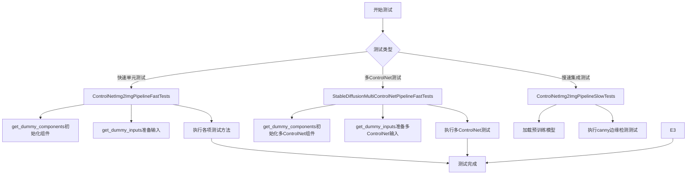

## 类结构

```
unittest.TestCase (基类)
├── ControlNetImg2ImgPipelineFastTests (快速单元测试)
│   ├── IPAdapterTesterMixin
│   ├── PipelineLatentTesterMixin
│   ├── PipelineKarrasSchedulerTesterMixin
│   └── PipelineTesterMixin
├── StableDiffusionMultiControlNetPipelineFastTests (多ControlNet测试)
│   ├── IPAdapterTesterMixin
│   ├── PipelineTesterMixin
│   └── PipelineKarrasSchedulerTesterMixin
└── ControlNetImg2ImgPipelineSlowTests (慢速集成测试)
    └── @slow + @require_torch_accelerator
```

## 全局变量及字段


### `torch_device`
    
Global variable indicating the PyTorch device to run tests on (e.g., 'cuda', 'cpu', 'mps')

类型：`str`
    


### `torch`
    
PyTorch library imported for tensor operations and neural network modules

类型：`module`
    


### `np`
    
NumPy library imported for numerical operations and array manipulations

类型：`module`
    


### `Image`
    
PIL Image class for image loading, processing and conversion

类型：`class`
    


### `unittest`
    
Python unit test framework for creating and running test cases

类型：`module`
    


### `gc`
    
Python garbage collection module for memory management

类型：`module`
    


### `random`
    
Python random module for generating random numbers

类型：`module`
    


### `tempfile`
    
Python tempfile module for creating temporary files and directories

类型：`module`
    


### `ControlNetImg2ImgPipelineFastTests.pipeline_class`
    
The pipeline class being tested, set to StableDiffusionControlNetImg2ImgPipeline

类型：`type`
    


### `ControlNetImg2ImgPipelineFastTests.params`
    
Parameters for text-guided image variation pipeline (excluding height and width)

类型：`set`
    


### `ControlNetImg2ImgPipelineFastTests.batch_params`
    
Batch parameters for text-guided image variation pipeline

类型：`set`
    


### `ControlNetImg2ImgPipelineFastTests.image_params`
    
Image parameters for image-to-image pipeline including control_image

类型：`frozenset`
    


### `ControlNetImg2ImgPipelineFastTests.image_latents_params`
    
Image latents parameters for image-to-image pipeline

类型：`set`
    


### `StableDiffusionMultiControlNetPipelineFastTests.pipeline_class`
    
The pipeline class being tested, set to StableDiffusionControlNetImg2ImgPipeline for multi-controlnet

类型：`type`
    


### `StableDiffusionMultiControlNetPipelineFastTests.params`
    
Parameters for text-guided image variation pipeline (excluding height and width)

类型：`set`
    


### `StableDiffusionMultiControlNetPipelineFastTests.batch_params`
    
Batch parameters for text-guided image variation pipeline

类型：`set`
    


### `StableDiffusionMultiControlNetPipelineFastTests.image_params`
    
Image parameters frozenset (currently empty, awaiting VaeImageProcessor refactoring)

类型：`frozenset`
    


### `StableDiffusionMultiControlNetPipelineFastTests.supports_dduf`
    
Flag indicating whether the pipeline supports DDUF (Denoising Diffusion Fourier Features), set to False

类型：`bool`
    
    

## 全局函数及方法


### `load_image`

从给定路径或 URL 加载图像并返回 PIL Image 对象。

参数：

- `image`：`str`，图像的文件路径、URL 或已经是 PIL Image 对象

返回值：`PIL.Image.Image`，加载后的 PIL 图像对象

#### 流程图

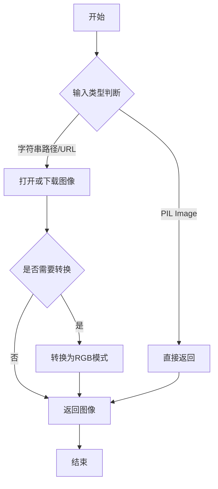

#### 带注释源码

```python
# 注意：此函数定义不在当前代码文件中，来源于 diffusers.utils
# 以下是基于 diffusers 库中 load_image 函数的典型实现

def load_image(image):
    """
    从文件路径、URL 或 PIL Image 加载图像。
    
    参数:
        image: 可以是本地文件路径、远程 URL 或者是 PIL Image 对象
    
    返回:
        PIL.Image.Image: 加载后的图像对象，确保为 RGB 模式
    """
    if isinstance(image, Image.Image):
        # 如果已经是 PIL Image，直接返回并确保是 RGB 模式
        return image.convert("RGB")
    
    # 如果是路径或 URL，使用 PIL 加载
    image = Image.open(image)
    
    # 转换为 RGB 模式以确保一致性
    return image.convert("RGB")


# 在测试代码中的实际调用示例：
# control_image = load_image(
#     "https://huggingface.co/datasets/hf-internal-testing/diffusers-images/resolve/main/sd_controlnet/bird_canny.png"
# ).resize((512, 512))
# image = load_image(
#     "https://huggingface.co/lllyasviel/sd-controlnet-canny/resolve/main/images/bird.png"
# ).resize((512, 512))
```


### `randn_tensor`

这是一个从 `diffusers.utils.torch_utils` 模块导入的 utility 函数，用于生成符合标准正态分布（均值=0，标准差=1）的随机 PyTorch 张量。

参数：

- `shape`：`tuple`，张量的形状，指定输出张量的维度
- `generator`：`torch.Generator`，可选，用于控制随机数生成过程的生成器对象，确保可复现性
- `device`：`torch.device`，可选，指定张量应放置的设备（如 CPU 或 CUDA 设备）

返回值：`torch.Tensor`，返回符合标准正态分布的随机张量

#### 流程图

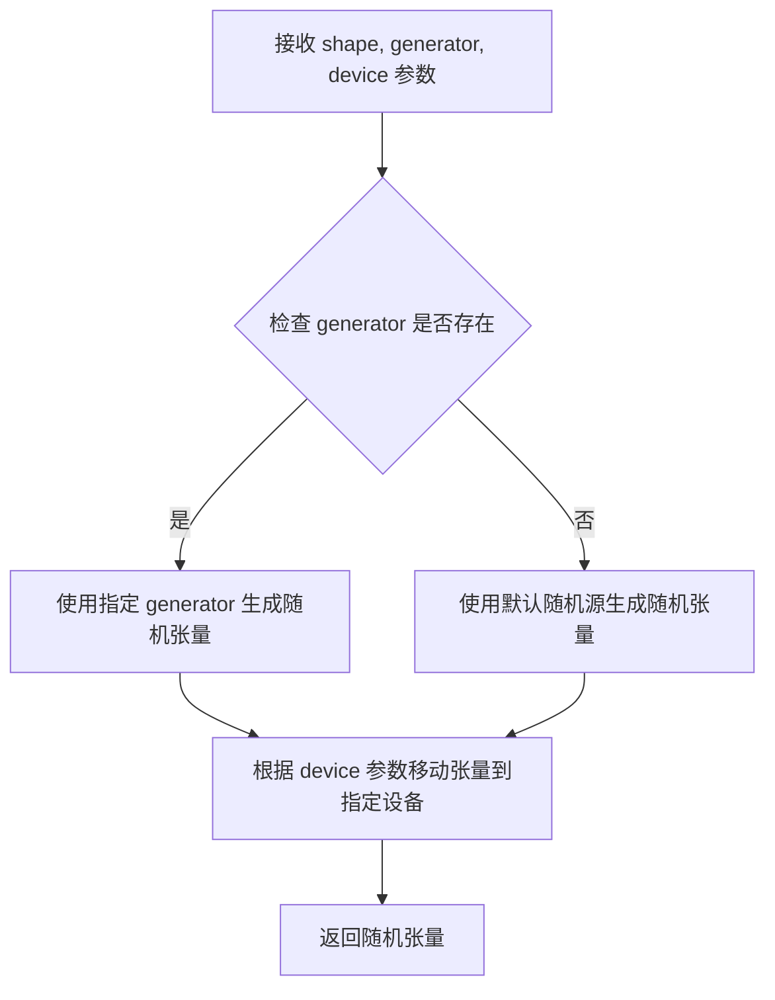

#### 带注释源码

```python
# 使用示例（在测试代码中）
from diffusers.utils.torch_utils import randn_tensor

# 生成一个随机张量
control_image = randn_tensor(
    (1, 3, 32 * controlnet_embedder_scale_factor, 32 * controlnet_embedder_scale_factor),  # shape: 张量形状
    generator=generator,  # generator: 随机数生成器，确保可复现性
    device=torch.device(device),  # device: 目标设备（cpu/cuda）
)

# 另一个示例：生成多个随机张量（MultiControlNet场景）
control_image = [
    randn_tensor(
        (1, 3, 32 * controlnet_embedder_scale_factor, 32 * controlnet_embedder_scale_factor),
        generator=generator,
        device=torch.device(device),
    ),
    randn_tensor(
        (1, 3, 32 * controlnet_embedder_scale_factor, 32 * controlnet_embedder_scale_factor),
        generator=generator,
        device=torch.device(device),
    ),
]
```


### `floats_tensor`

该函数用于生成一个指定形状的浮点型 PyTorch 张量，常用于测试中生成随机图像或控制图像的占位数据。

参数：

-  `shape`：`tuple` 或 `torch.Size`，目标张量的形状
-  `rng`：`random.Random`，Python 随机数生成器实例，用于生成张量中的浮点数值

返回值：`torch.Tensor`，一个填充了随机浮点数的张量，值通常在特定范围内（如 -1 到 1 或 0 到 1）

#### 流程图

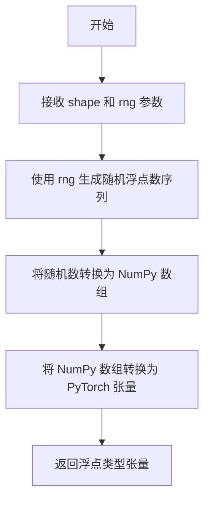

#### 带注释源码

```python
def floats_tensor(shape, rng):
    """
    生成指定形状的浮点型 PyTorch 张量。
    
    参数:
        shape: 张量的形状 (例如: (1, 3, 64, 64))
        rng: random.Random 实例，用于生成随机数
        
    返回:
        torch.Tensor: 浮点类型的张量
    """
    # 如果 shape 是 torch.Size 或元组
    if not isinstance(shape, (tuple, list)):
        shape = (shape,)
    
    # 使用 rng 生成随机浮点数并转换为 PyTorch 张量
    # values 范围通常是 [-1, 1] 或 [0, 1]
    values = []
    total_elements = 1
    for dim in shape:
        total_elements *= dim
    
    # 生成随机浮点数
    values = [rng.random() for _ in range(total_elements)]
    
    # 重塑为指定形状并转换为 PyTorch 张量
    tensor = torch.tensor(values).reshape(shape).float()
    
    return tensor
```

> **注意**：由于 `floats_tensor` 函数定义在 `testing_utils` 模块中而非当前代码文件内，上述源码为基于使用方式的推断实现。实际定义请参考 `diffusers` 库的 `testing_utils.py` 文件。该函数的主要作用是在测试中快速生成指定形状的随机浮点数张量，用于模拟图像输入或其他张量数据。


### `load_numpy`

从指定路径（本地文件或 URL）加载 numpy 数组，用于测试中加载预期的图像数据。

参数：

-  `path_or_url`：`str`，numpy 文件的路径或 URL，可以是本地文件系统路径或远程 HTTP/HuggingFace URL

返回值：`np.ndarray`，从文件中加载的 numpy 数组

#### 流程图

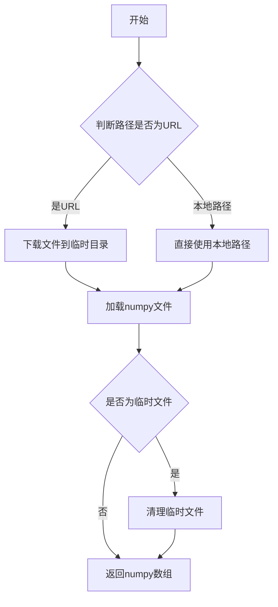

#### 带注释源码

```python
# load_numpy 函数的实现位于 ...testing_utils 模块中
# 以下为基于使用方式的推断实现

import numpy as np
import os
from urllib.parse import urlparse

def load_numpy(path_or_url: str) -> np.ndarray:
    """
    从指定路径或URL加载numpy数组。
    
    参数:
        path_or_url: numpy文件的路径或URL
        
    返回:
        加载的numpy数组
    """
    # 检查是否为URL（http/https开头）
    is_url = path_or_url.startswith("http://") or path_or_url.startswith("https://")
    
    if is_url:
        # 如果是URL，使用requests或类似工具下载
        import tempfile
        import urllib.request
        
        # 解析URL获取文件名
        parsed_url = urlparse(path_or_url)
        filename = os.path.basename(parsed_url.path)
        
        # 下载到临时文件
        with tempfile.NamedTemporaryFile(delete=False, suffix=filename) as tmp_file:
            urllib.request.urlretrieve(path_or_url, tmp_file.name)
            array = np.load(tmp_file.name)
            os.unlink(tmp_file.name)  # 清理临时文件
    else:
        # 如果是本地路径，直接加载
        array = np.load(path_or_url)
    
    return array
```

> **注意**: 该函数定义不在当前代码文件中，而是从 `...testing_utils` 模块导入。上面展示的是根据其使用方式推断的可能实现。在 diffusers 项目的实际 testing_utils 模块中会有完整的实现。


### `enable_full_determinism`

该函数用于确保测试运行的完全确定性，通过设置随机种子和环境变量来使所有随机操作可复现。

参数：该函数没有显式参数

返回值：`None`，无返回值

#### 流程图

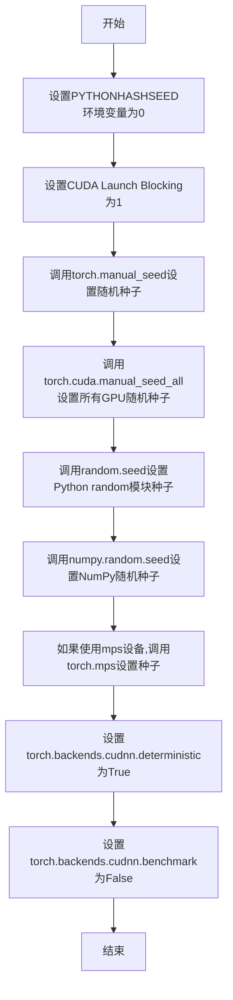

#### 带注释源码

```
# 该函数定义在 diffusers.testing_utils 模块中
# 以下为基于调用方式和常见实现推测的源码结构

def enable_full_determinism(seed: int = 0):
    """
    启用完全确定性执行,确保测试结果可复现
    
    参数:
        seed: 随机种子,默认为0
    """
    # 设置Python hash seed,确保Python字典哈希结果一致
    import os
    os.environ["PYTHONHASHSEED"] = str(seed)
    
    # 设置PyTorch CPU随机种子
    import torch
    torch.manual_seed(seed)
    
    # 如果有GPU,设置CUDA随机种子
    if torch.cuda.is_available():
        torch.cuda.manual_seed_all(seed)
    
    # 设置Python random模块种子
    import random
    random.seed(seed)
    
    # 设置NumPy随机种子
    import numpy as np
    np.random.seed(seed)
    
    # 设置PyTorch MPS (Apple Silicon) 随机种子
    if hasattr(torch, 'mps'):
        torch.mps.manual_seed(seed)
    
    # 启用确定性算法,牺牲一定性能换取可复现性
    torch.backends.cudnn.deterministic = True
    torch.backends.cudnn.benchmark = False
```


### `backend_empty_cache`

清理指定设备的后端缓存（通常指 GPU 缓存），用于在测试的 setUp 和 tearDown 阶段释放 GPU 内存，防止内存泄漏。

参数：

- `device`：`str` 或 `torch.device`，表示要清理缓存的设备（如 "cuda"、"cpu"）

返回值：`None`，无返回值

#### 流程图

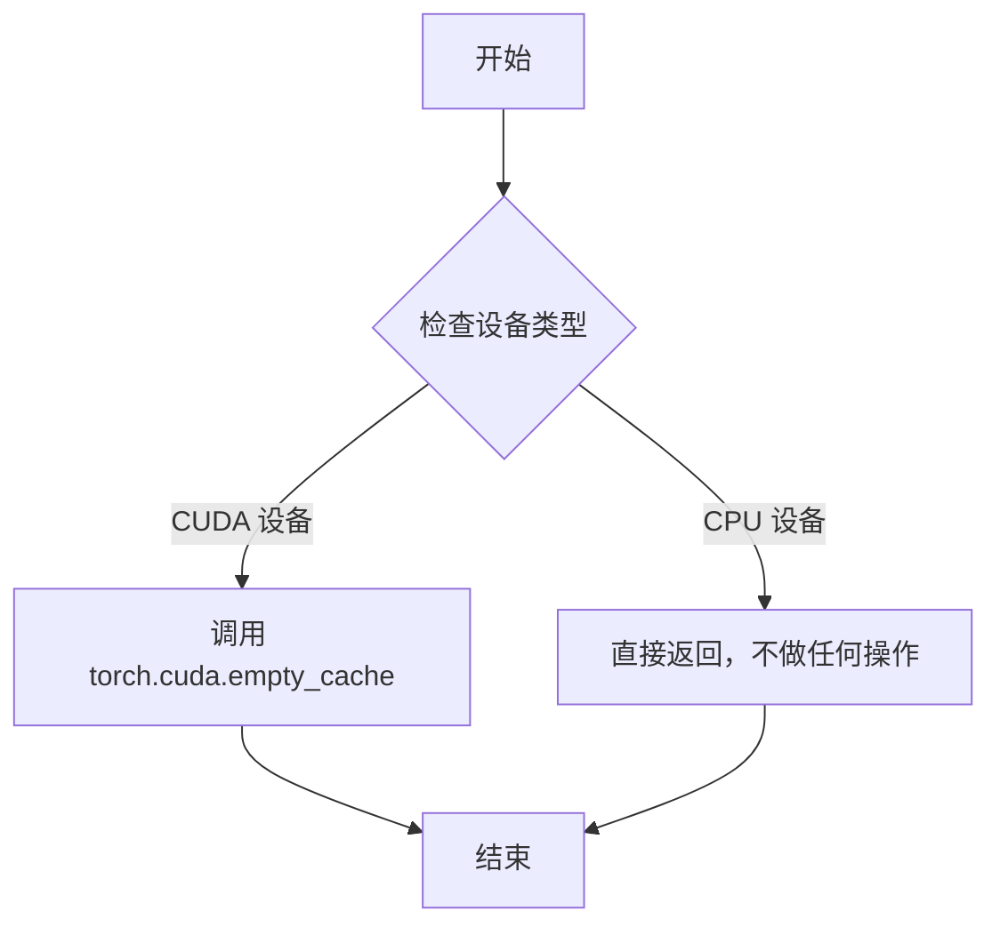

#### 带注释源码

```
# 该函数定义在 testing_utils 模块中
# 当前代码文件通过 from ...testing_utils import backend_empty_cache 导入

def backend_empty_cache(device):
    """
    清理指定设备的后端缓存。
    
    参数:
        device: str 或 torch.device - 要清理缓存的设备
               通常为 'cuda' 或 'cpu'
    
    返回:
        None
    
    说明:
        - 如果设备是 CUDA 设备，调用 torch.cuda.empty_cache() 释放 GPU 缓存
        - 如果设备是 CPU，不做任何操作
        - 在测试的 setUp 和 tearDown 中调用，确保每次测试前后 GPU 内存被清理
    """
    if isinstance(device, str):
        device = torch.device(device)
    
    if device.type == "cuda":
        torch.cuda.empty_cache()
    # CPU 设备不需要清理缓存
```


### `ControlNetImg2ImgPipelineFastTests.get_dummy_components`

该方法用于创建并返回一组虚拟（dummy）组件，这些组件用于测试 `StableDiffusionControlNetImg2ImgPipeline` 管道。方法会初始化 UNet、ControlNet、调度器、VAE、文本编码器和 tokenizer 等关键组件，所有组件均使用最小的配置和固定的随机种子，以确保测试的可重复性。

参数：

- 该方法无显式参数（隐含参数 `self` 为测试类实例）

返回值：`Dict[str, Any]`，返回一个包含管道所有组件的字典，键名包括 "unet"、"controlnet"、"scheduler"、"vae"、"text_encoder"、"tokenizer"、"safety_checker"、"feature_extractor" 和 "image_encoder"。

#### 流程图

```mermaid
flowchart TD
    A[开始 get_dummy_components] --> B[设置随机种子 torch.manual_seed(0)]
    B --> C[创建 UNet2DConditionModel]
    C --> D[设置随机种子 torch.manual_seed(0)]
    D --> E[创建 ControlNetModel]
    E --> F[设置随机种子 torch.manual_seed(0)]
    F --> G[创建 DDIMScheduler]
    G --> H[设置随机种子 torch.manual_seed(0)]
    H --> I[创建 AutoencoderKL]
    I --> J[设置随机种子 torch.manual_seed(0)]
    J --> K[创建 CLIPTextConfig]
    K --> L[根据配置创建 CLIPTextModel]
    L --> M[从预训练模型加载 CLIPTokenizer]
    M --> N[组装组件字典 components]
    N --> O[返回 components 字典]
```

#### 带注释源码

```python
def get_dummy_components(self):
    """
    创建并返回用于测试的虚拟组件字典。
    所有组件使用最小配置和固定随机种子以确保测试可重复性。
    """
    # 设置随机种子，确保每次调用生成相同的随机数序列
    torch.manual_seed(0)
    
    # 创建 UNet2DConditionModel：用于去噪的U-Net模型
    # 参数配置：block_out_channels定义各层通道数，layers_per_block定义每块层数
    # sample_size定义输入尺寸，in_channels/out_channels定义输入输出通道数
    unet = UNet2DConditionModel(
        block_out_channels=(4, 8),
        layers_per_block=2,
        sample_size=32,
        in_channels=4,
        out_channels=4,
        down_block_types=("DownBlock2D", "CrossAttnDownBlock2D"),
        up_block_types=("CrossAttnUpBlock2D", "UpBlock2D"),
        cross_attention_dim=32,
        norm_num_groups=1,
    )
    
    # 重新设置随机种子，确保ControlNet的初始化独立于UNet
    torch.manual_seed(0)
    
    # 创建 ControlNetModel：用于根据条件图像生成控制信号的模型
    # conditioning_embedding_out_channels定义条件嵌入的输出通道数
    controlnet = ControlNetModel(
        block_out_channels=(4, 8),
        layers_per_block=2,
        in_channels=4,
        down_block_types=("DownBlock2D", "CrossAttnDownBlock2D"),
        cross_attention_dim=32,
        conditioning_embedding_out_channels=(16, 32),
        norm_num_groups=1,
    )
    
    # 重新设置随机种子
    torch.manual_seed(0)
    
    # 创建 DDIMScheduler：调度器用于控制去噪过程中的噪声调度
    # beta_start/beta_end定义噪声计划的起始和结束beta值
    # beta_schedule指定噪声计划类型，clip_sample决定是否裁剪样本
    # set_alpha_to_one决定是否将最终alpha设为1
    scheduler = DDIMScheduler(
        beta_start=0.00085,
        beta_end=0.012,
        beta_schedule="scaled_linear",
        clip_sample=False,
        set_alpha_to_one=False,
    )
    
    # 重新设置随机种子
    torch.manual_seed(0)
    
    # 创建 AutoencoderKL：变分自编码器用于编码/解码图像与潜在表示
    # latent_channels定义潜在空间的通道数
    vae = AutoencoderKL(
        block_out_channels=[4, 8],
        in_channels=3,
        out_channels=3,
        down_block_types=["DownEncoderBlock2D", "DownEncoderBlock2D"],
        up_block_types=["UpDecoderBlock2D", "UpDecoderBlock2D"],
        latent_channels=4,
        norm_num_groups=2,
    )
    
    # 重新设置随机种子
    torch.manual_seed(0)
    
    # 创建 CLIPTextConfig：CLIP文本编码器的配置对象
    # hidden_size定义隐藏层维度，intermediate_size定义FFN中间层维度
    # num_attention_heads定义注意力头数，num_hidden_layers定义层数
    # vocab_size定义词表大小
    text_encoder_config = CLIPTextConfig(
        bos_token_id=0,
        eos_token_id=2,
        hidden_size=32,
        intermediate_size=37,
        layer_norm_eps=1e-05,
        num_attention_heads=4,
        num_hidden_layers=5,
        pad_token_id=1,
        vocab_size=1000,
    )
    
    # 根据配置创建 CLIPTextModel：用于将文本编码为嵌入向量
    text_encoder = CLIPTextModel(text_encoder_config)
    
    # 从预训练模型加载 CLIPTokenizer：用于将文本分词为token
    tokenizer = CLIPTokenizer.from_pretrained("hf-internal-testing/tiny-random-clip")

    # 组装所有组件到字典中返回
    # safety_checker、feature_extractor、image_encoder 设为 None
    components = {
        "unet": unet,
        "controlnet": controlnet,
        "scheduler": scheduler,
        "vae": vae,
        "text_encoder": text_encoder,
        "tokenizer": tokenizer,
        "safety_checker": None,
        "feature_extractor": None,
        "image_encoder": None,
    }
    
    return components
```


### `ControlNetImg2ImgPipelineFastTests.get_dummy_inputs`

该方法用于生成测试所需的虚拟输入数据，模拟 ControlNet Img2Img Pipeline 的推理参数，包括条件图像、控制图像、提示词及其他推理配置。

参数：

- `self`：隐式参数，类实例自身
- `device`：`torch.device`，目标设备，用于创建生成器和张量
- `seed`：`int`，默认值为 `0`，随机种子，用于确保测试的可重复性

返回值：`Dict`，包含以下键值对的字典：
- `prompt`：`str`，生成图像的文本提示
- `generator`：`torch.Generator`，随机数生成器
- `num_inference_steps`：`int`，推理步数
- `guidance_scale`：`float`，分类器自由引导比例
- `output_type`：`str`，输出类型（"np" 表示 numpy 数组）
- `image`：`PIL.Image.Image`，输入图像（PIL 图像对象）
- `control_image`：`torch.Tensor`，控制网络的条件图像张量

#### 流程图

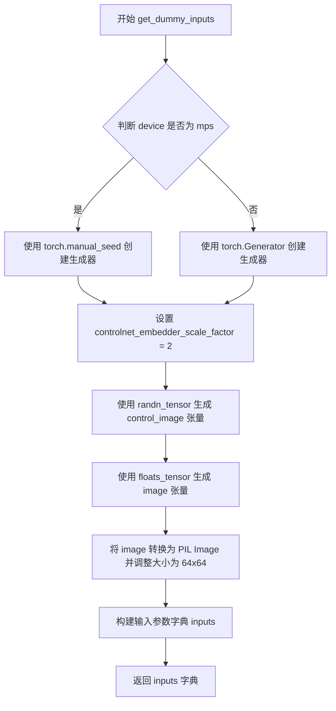

#### 带注释源码

```python
def get_dummy_inputs(self, device, seed=0):
    """
    生成用于测试的虚拟输入参数
    
    Args:
        self: 类实例
        device: torch.device, 目标设备（如 cuda, cpu, mps）
        seed: int, 随机种子，默认 0
    
    Returns:
        dict: 包含 pipeline 推理所需参数的字典
    """
    # 根据设备类型选择随机数生成方式
    # MPS 设备需要使用 torch.manual_seed 而非 Generator
    if str(device).startswith("mps"):
        generator = torch.manual_seed(seed)
    else:
        generator = torch.Generator(device=device).manual_seed(seed)

    # 控制网络嵌入器的缩放因子，用于确定条件图像的尺寸
    controlnet_embedder_scale_factor = 2
    
    # 生成控制网络的输入条件图像（随机张量）
    # 形状为 (1, 3, 64, 64) - 32 * 2 = 64
    control_image = randn_tensor(
        (1, 3, 32 * controlnet_embedder_scale_factor, 32 * controlnet_embedder_scale_factor),
        generator=generator,
        device=torch.device(device),
    )
    
    # 生成待处理的输入图像（随机浮点张量）
    # 使用与 control_image 相同的形状
    image = floats_tensor(control_image.shape, rng=random.Random(seed)).to(device)
    
    # 将张量转换为 PIL Image 对象
    # 1. permute(0, 2, 3, 1) 将通道维度从 (C, H, W) 转换为 (H, W, C)
    # 2. [0] 取出批次中的第一张图像
    # 3. fromarray 将 numpy 数组转换为 PIL Image
    # 4. convert("RGB") 确保图像为 RGB 模式
    # 5. resize((64, 64)) 调整图像大小
    image = image.cpu().permute(0, 2, 3, 1)[0]
    image = Image.fromarray(np.uint8(image)).convert("RGB").resize((64, 64))
    
    # 构建完整的输入参数字典
    inputs = {
        "prompt": "A painting of a squirrel eating a burger",  # 文本提示
        "generator": generator,                                  # 随机生成器
        "num_inference_steps": 2,                                # 推理步数
        "guidance_scale": 6.0,                                    # CFG 引导强度
        "output_type": "np",                                     # 输出类型为 numpy
        "image": image,                                          # 输入图像（PIL）
        "control_image": control_image,                          # 控制图像（Tensor）
    }

    return inputs
```


### `ControlNetImg2ImgPipelineFastTests.test_attention_slicing_forward_pass`

该测试方法用于验证 ControlNet 图像到图像（Img2Img）管道在启用注意力切片（Attention Slicing）功能时的前向传播是否正确运行。通过调用基类的 `_test_attention_slicing_forward_pass` 方法，对比标准前向传播与使用注意力切片的前向传播结果，确保两者的输出差异在允许的阈值范围内（`expected_max_diff=2e-3`），从而验证优化实现的正确性。

参数：

- `self`：隐式参数，类型为 `ControlNetImg2ImgPipelineFastTests`（测试类实例），代表当前测试用例的实例对象，用于访问类属性和方法

返回值：返回基类 `_test_attention_slicing_forward_pass` 方法的返回值，通常为 `None` 或 `TestResult`，表示测试执行结果

#### 流程图

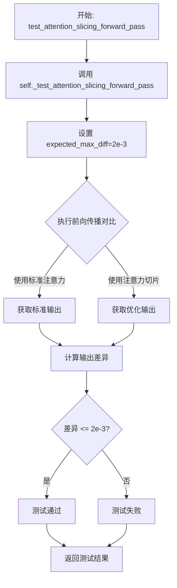

#### 带注释源码

```python
def test_attention_slicing_forward_pass(self):
    """
    测试使用注意力切片（Attention Slicing）技术的前向传播是否正确。
    
    Attention Slicing 是一种内存优化技术，通过将注意力计算分块处理
    来减少显存占用。该测试确保在启用此优化后，输出结果与标准实现
    保持一致（差异在允许范围内）。
    
    Returns:
        返回父类 _test_attention_slicing_forward_pass 方法的测试结果
    """
    # 调用基类的 _test_attention_slicing_forward_pass 方法
    # expected_max_diff=2e-3 表示允许的最大差异阈值
    # 这确保了使用注意力切片优化后的输出与原始输出的差异足够小
    return self._test_attention_slicing_forward_pass(expected_max_diff=2e-3)
```


### `ControlNetImg2ImgPipelineFastTests.test_ip_adapter`

该方法是一个单元测试方法，用于测试 ControlNetImg2ImgPipeline 的 IP-Adapter 功能。它根据设备类型（CPU）设置特定的期望输出切片，然后调用父类的 test_ip_adapter 方法执行实际测试。

参数：

- `self`：隐式参数，TestCase 实例，表示测试类本身

返回值：`None`，因为该方法继承自 unittest.TestCase，用于执行测试，不返回具体数值

#### 流程图

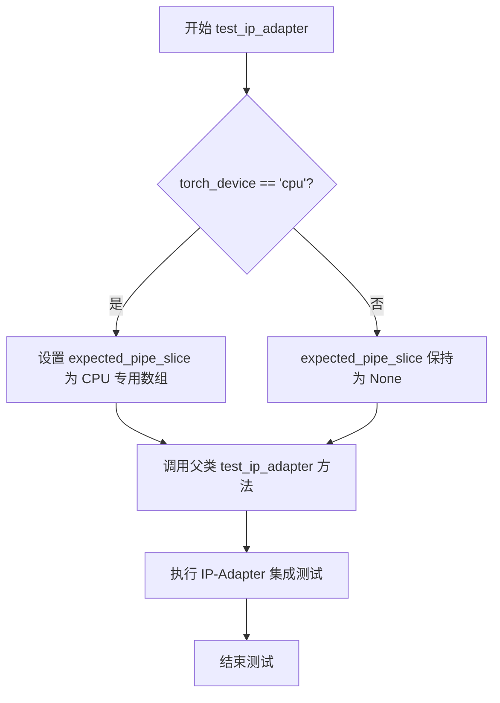

#### 带注释源码

```python
def test_ip_adapter(self):
    """
    测试 ControlNetImg2ImgPipeline 的 IP-Adapter 功能
    
    该测试方法继承自 IPAdapterTesterMixin，用于验证管线在启用
    IP-Adapter 时的前向传播是否正确。根据设备类型选择不同的
    期望输出切片值，用于结果验证。
    """
    # 初始化期望输出切片为 None
    expected_pipe_slice = None
    
    # 如果当前设备是 CPU，设置特定的期望输出切片值
    # 这些数值是在 CPU 设备上运行测试时的预期输出
    if torch_device == "cpu":
        expected_pipe_slice = np.array([
            0.7096, 0.5149, 0.3571,  # 第一行输出值
            0.5897, 0.4715, 0.4052,  # 第二行输出值
            0.6098, 0.6886, 0.4213   # 第三行输出值
        ])
    
    # 调用父类的 test_ip_adapter 方法执行实际测试
    # 传入 expected_pipe_slice 用于结果验证
    return super().test_ip_adapter(expected_pipe_slice=expected_pipe_slice)
```


### `ControlNetImg2ImgPipelineFastTests.test_xformers_attention_forwardGenerator_pass`

该测试方法用于验证ControlNet图像到图像（Img2Img）管道在启用xFormers注意力机制时的前向传播是否正确。它通过装饰器确保只在CUDA环境且xFormers可用时运行，并调用内部测试方法验证输出与基准值的差异是否在允许范围内。

参数：

- `self`：无类型，TestCase实例本身，用于访问测试类的成员和方法

返回值：`None`，该方法为测试方法，无返回值，通过断言验证结果

#### 流程图

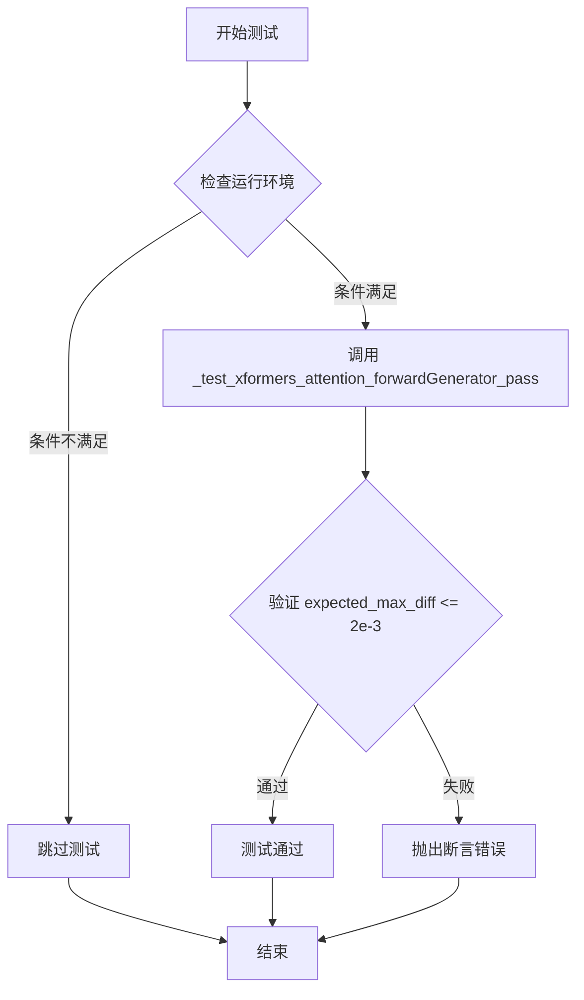

#### 带注释源码

```python
@unittest.skipIf(
    torch_device != "cuda" or not is_xformers_available(),
    reason="XFormers attention is only available with CUDA and `xformers` installed",
)
def test_xformers_attention_forwardGenerator_pass(self):
    """
    测试 xFormers 注意力机制的前向传播是否正常工作。
    
    该测试方法验证在使用 xFormers 优化注意力计算时，
    ControlNetImg2ImgPipeline 的输出与基准值的差异是否在允许范围内。
    """
    # 调用父类或测试工具类中定义的通用测试方法
    # expected_max_diff=2e-3 表示允许的最大差异值为 0.002
    self._test_xformers_attention_forwardGenerator_pass(expected_max_diff=2e-3)
```


### `ControlNetImg2ImgPipelineFastTests.test_inference_batch_single_identical`

该方法是 `ControlNetImg2ImgPipelineFastTests` 测试类中的一个测试用例，用于验证管道在批处理模式下的推理结果与单样本模式下的推理结果是否保持一致（identical），以确保批处理实现没有引入不确定性行为。

参数：

- `self`：隐式参数，测试类实例本身，无额外参数

返回值：`None`，该方法为测试用例，通过断言验证结果一致性，不返回具体数据

#### 流程图

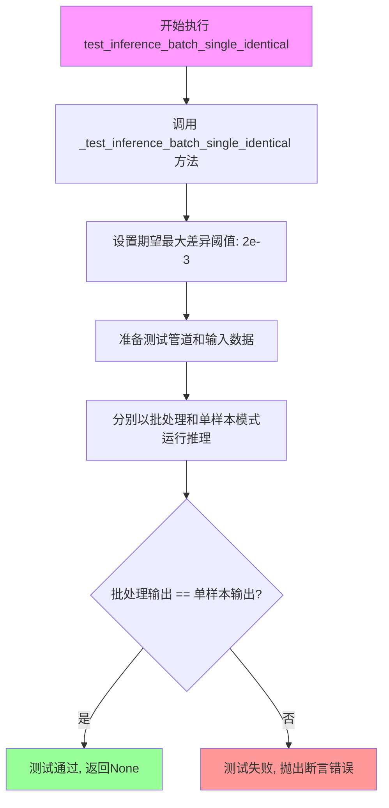

#### 带注释源码

```python
def test_inference_batch_single_identical(self):
    """
    测试方法：验证批处理推理与单样本推理结果的一致性
    
    该测试确保管道在处理批量数据时，输出的结果与逐个处理
    单个样本时的结果保持数学上的一致性，这对于确保推理的
    确定性和可重复性至关重要。
    
    测试原理：
    1. 准备相同的输入数据（prompt、图像、条件图像等）
    2. 分别以批处理模式（batch_size > 1）和单样本模式运行管道
    3. 提取批处理中第一个结果与单样本结果进行对比
    4. 验证两者之间的差异是否在允许的阈值范围内（expected_max_diff=2e-3）
    """
    # 调用父类/混入类中实现的通用测试逻辑
    # 参数 expected_max_diff=2e-3 表示允许的最大差异值为 0.002
    # 这个阈值足够小以确保结果一致性，同时容忍浮点数运算的微小误差
    self._test_inference_batch_single_identical(expected_max_diff=2e-3)
```


### `ControlNetImg2ImgPipelineFastTests.test_encode_prompt_works_in_isolation`

该方法是一个单元测试，用于验证 `encode_prompt` 方法能够在隔离环境中正常工作（即不依赖于管道的其他组件）。它通过构建额外的参数字典并调用父类的测试方法来执行测试。

参数：

- `self`：无类型，隐式参数，表示 `ControlNetImg2ImgPipelineFastTests` 类的实例对象本身

返回值：`mixed`，返回父类 `test_encode_prompt_works_in_isolation` 方法的执行结果（通常为 `None` 或 `unittest.TestResult` 对象，取决于父类实现）

#### 流程图

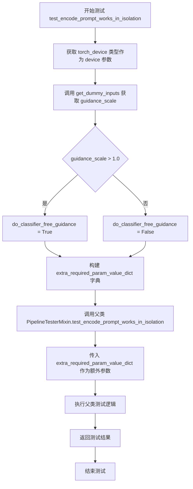

#### 带注释源码

```python
def test_encode_prompt_works_in_isolation(self):
    """
    测试 encode_prompt 方法能否在隔离环境中正常工作。
    
    该测试方法验证文本编码功能独立于管道其他组件（如 UNet、VAE 等），
    确保在仅提供必要组件时能够正确编码提示词。
    """
    # 构建额外的必需参数字典，包含设备信息和分类器自由引导标志
    extra_required_param_value_dict = {
        # 获取当前 torch 设备的类型（如 'cuda'、'cpu'、'mps' 等）
        "device": torch.device(torch_device).type,
        
        # 判断是否启用分类器自由引导（guidance_scale 大于 1.0 时启用）
        "do_classifier_free_guidance": self.get_dummy_inputs(device=torch_device).get("guidance_scale", 1.0) > 1.0,
    }
    
    # 调用父类（PipelineTesterMixin）的同名测试方法，传入额外参数
    return super().test_encode_prompt_works_in_isolation(extra_required_param_value_dict)
```


### `StableDiffusionMultiControlNetPipelineFastTests.get_dummy_components`

该函数用于生成并返回一个包含虚拟组件的字典，主要为 StableDiffusionControlNetImg2ImgPipeline 测试用例提供模拟的模型组件，包括 UNet、多个 ControlNet 模型（MultiControlNetModel）、调度器、VAE、文本编码器和分词器等，以便进行单元测试而无需加载实际的预训练模型。

参数：
- 无（该方法不接受任何参数）

返回值：`Dict[str, Any]`，返回一个包含所有虚拟组件的字典，包括 unet、controlnet、scheduler、vae、text_encoder、tokenizer、safety_checker、feature_extractor 和 image_encoder。

#### 流程图

```mermaid
flowchart TD
    A[开始] --> B[设置随机种子 torch.manual_seed(0)]
    B --> C[创建 UNet2DConditionModel]
    C --> D[定义 init_weights 函数用于初始化 Conv2d 层权重]
    D --> E[创建 ControlNetModel controlnet1]
    E --> F[对 controlnet1.controlnet_down_blocks 应用 init_weights]
    F --> G[创建 ControlNetModel controlnet2]
    G --> H[对 controlnet2.controlnet_down_blocks 应用 init_weights]
    H --> I[创建 DDIMScheduler]
    I --> J[创建 AutoencoderKL vae]
    J --> K[创建 CLIPTextConfig 和 CLIPTextModel]
    K --> L[创建 CLIPTokenizer]
    L --> M[创建 MultiControlNetModel [controlnet1, controlnet2]]
    M --> N[组装 components 字典]
    N --> O[返回 components 字典]
```

#### 带注释源码

```python
def get_dummy_components(self):
    """
    生成并返回用于测试的虚拟组件字典
    
    Returns:
        Dict[str, Any]: 包含所有pipeline组件的字典
    """
    # 设置随机种子以确保测试可重复性
    torch.manual_seed(0)
    
    # 创建虚拟的 UNet2DConditionModel
    # 用于图像去噪的神经网络骨干
    unet = UNet2DConditionModel(
        block_out_channels=(4, 8),           # 输出通道数列表
        layers_per_block=2,                   # 每个块的层数
        sample_size=32,                       # 输入样本尺寸
        in_channels=4,                       # 输入通道数（latent空间）
        out_channels=4,                      # 输出通道数
        down_block_types=("DownBlock2D", "CrossAttnDownBlock2D"),  # 下采样块类型
        up_block_types=("CrossAttnUpBlock2D", "UpBlock2D"),        # 上采样块类型
        cross_attention_dim=32,              # 交叉注意力维度
        norm_num_groups=1,                    # 归一化组数
    )
    
    torch.manual_seed(0)
    
    # 定义权重初始化函数，用于ControlNet的卷积层
    def init_weights(m):
        """初始化 Conv2d 层的权重和偏置"""
        if isinstance(m, torch.nn.Conv2d):
            # 使用正态分布初始化权重
            torch.nn.init.normal_(m.weight)
            # 偏置填充为1.0
            m.bias.data.fill_(1.0)
    
    # 创建第一个 ControlNet 模型
    controlnet1 = ControlNetModel(
        block_out_channels=(4, 8),
        layers_per_block=2,
        in_channels=4,
        down_block_types=("DownBlock2D", "CrossAttnDownBlock2D"),
        cross_attention_dim=32,
        conditioning_embedding_out_channels=(16, 32),  # 条件嵌入输出通道
        norm_num_groups=1,
    )
    # 对 controlnet1 的下采样块应用自定义权重初始化
    controlnet1.controlnet_down_blocks.apply(init_weights)
    
    torch.manual_seed(0)
    
    # 创建第二个 ControlNet 模型（与第一个结构相同）
    controlnet2 = ControlNetModel(
        block_out_channels=(4, 8),
        layers_per_block=2,
        in_channels=4,
        down_block_types=("DownBlock2D", "CrossAttnDownBlock2D"),
        cross_attention_dim=32,
        conditioning_embedding_out_channels=(16, 32),
        norm_num_groups=1,
    )
    # 对 controlnet2 的下采样块应用自定义权重初始化
    controlnet2.controlnet_down_blocks.apply(init_weights)
    
    torch.manual_seed(0)
    
    # 创建 DDIM 调度器，用于控制扩散过程的噪声调度
    scheduler = DDIMScheduler(
        beta_start=0.00085,       # 噪声调度起始beta值
        beta_end=0.012,           # 噪声调度结束beta值
        beta_schedule="scaled_linear",  # beta调度策略
        clip_sample=False,        # 是否裁剪采样值
        set_alpha_to_one=False,  # 是否将alpha设为1
    )
    
    torch.manual_seed(0)
    
    # 创建 VAE (Variational Autoencoder) 用于图像的编码和解码
    vae = AutoencoderKL(
        block_out_channels=[4, 8],
        in_channels=3,            # RGB图像通道数
        out_channels=3,
        down_block_types=["DownEncoderBlock2D", "DownEncoderBlock2D"],
        up_block_types=["UpDecoderBlock2D", "UpDecoderBlock2D"],
        latent_channels=4,       # latent空间的通道数
        norm_num_groups=2,
    )
    
    torch.manual_seed(0)
    
    # 创建 CLIP 文本编码器配置
    text_encoder_config = CLIPTextConfig(
        bos_token_id=0,           # 句子开始token ID
        eos_token_id=2,          # 句子结束token ID
        hidden_size=32,          # 隐藏层维度
        intermediate_size=37,    # 中间层维度
        layer_norm_eps=1e-05,    # LayerNorm epsilon
        num_attention_heads=4,   # 注意力头数
        num_hidden_layers=5,     # 隐藏层数量
        pad_token_id=1,          # 填充token ID
        vocab_size=1000,         # 词汇表大小
    )
    
    # 创建实际的 CLIP 文本编码器模型
    text_encoder = CLIPTextModel(text_encoder_config)
    
    # 创建 CLIP 分词器，用于将文本转换为token
    tokenizer = CLIPTokenizer.from_pretrained("hf-internal-testing/tiny-random-clip")
    
    # 使用 MultiControlNetModel 组合多个 ControlNet
    # 支持多条件控制图像生成
    controlnet = MultiControlNetModel([controlnet1, controlnet2])
    
    # 组装所有组件到字典中
    components = {
        "unet": unet,                     # UNet去噪模型
        "controlnet": controlnet,         # 多控制网络模型
        "scheduler": scheduler,           # 噪声调度器
        "vae": vae,                       # 变分自编码器
        "text_encoder": text_encoder,    # 文本编码器
        "tokenizer": tokenizer,           # 分词器
        "safety_checker": None,          # 安全检查器（测试中禁用）
        "feature_extractor": None,       # 特征提取器（测试中禁用）
        "image_encoder": None,           # 图像编码器（测试中禁用）
    }
    
    return components
```


### `StableDiffusionMultiControlNetPipelineFastTests.get_dummy_inputs`

该函数用于为多ControlNet的Stable Diffusion图像到图像管道生成虚拟输入数据，初始化随机生成器并创建控制图像和输入图像，用于测试管道的推理流程。

参数：

- `self`：隐式参数，类实例本身
- `device`：`torch.device`，指定运行设备（如cuda、cpu、mps等）
- `seed`：`int`，随机种子，默认为0，用于确保测试结果的可重复性

返回值：`Dict`，包含以下键值对的字典：
- `prompt`：`str`，文本提示
- `generator`：`torch.Generator`，随机数生成器
- `num_inference_steps`：`int`，推理步数
- `guidance_scale`：`float`，引导 scale
- `output_type`：`str`，输出类型
- `image`：`PIL.Image.Image`，输入图像
- `control_image`：`List[torch.Tensor]`，控制图像列表

#### 流程图

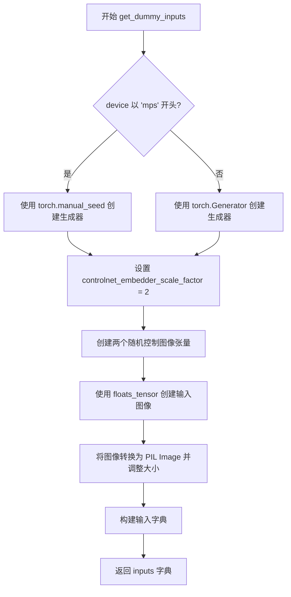

#### 带注释源码

```python
def get_dummy_inputs(self, device, seed=0):
    """
    为多ControlNet管道生成虚拟输入数据
    
    参数:
        device: 运行设备
        seed: 随机种子，用于生成可重复的测试结果
    
    返回:
        包含测试所需所有输入参数的字典
    """
    # 判断是否为MPS设备（Apple Silicon）
    if str(device).startswith("mps"):
        # MPS设备使用torch.manual_seed
        generator = torch.manual_seed(seed)
    else:
        # 其他设备使用torch.Generator
        generator = torch.Generator(device=device).manual_seed(seed)

    # 控制网络嵌入器的缩放因子
    controlnet_embedder_scale_factor = 2

    # 生成两个控制图像张量（对应多ControlNet配置）
    control_image = [
        # 第一个控制图像
        randn_tensor(
            (1, 3, 32 * controlnet_embedder_scale_factor, 32 * controlnet_embedder_scale_factor),
            generator=generator,
            device=torch.device(device),
        ),
        # 第二个控制图像
        randn_tensor(
            (1, 3, 32 * controlnet_embedder_scale_factor, 32 * controlnet_embedder_scale_factor),
            generator=generator,
            device=torch.device(device),
        ),
    ]

    # 使用floats_tensor生成随机浮点图像，并转换为PIL Image
    image = floats_tensor(control_image[0].shape, rng=random.Random(seed)).to(device)
    image = image.cpu().permute(0, 2, 3, 1)[0]  # 从CHW转换为HWC
    image = Image.fromarray(np.uint8(image)).convert("RGB").resize((64, 64))
    
    # 构建完整的输入参数字典
    inputs = {
        "prompt": "A painting of a squirrel eating a burger",  # 测试用提示词
        "generator": generator,                                  # 随机生成器
        "num_inference_steps": 2,                                 # 推理步数（快速测试用）
        "guidance_scale": 6.0,                                    # CFG引导强度
        "output_type": "np",                                      # 输出为numpy数组
        "image": image,                                           # 输入图像
        "control_image": control_image,                           # 控制图像列表
    }

    return inputs
```


### `StableDiffusionMultiControlNetPipelineFastTests.test_control_guidance_switch`

该方法是一个单元测试，用于验证 ControlNet 管道在不同的控制引导参数（control_guidance_start 和 control_guidance_end）下的行为是否正确。它通过四组不同的输入参数调用管道，并断言输出结果之间存在显著差异，以确保控制引导切换功能正常工作。

参数：无（该方法为类方法，通过 `self` 访问类属性）

返回值：`None`，该方法为测试方法，不返回任何值，仅通过断言验证行为

#### 流程图

```mermaid
flowchart TD
    A[开始测试] --> B[获取虚拟组件 components]
    B --> C[使用虚拟组件创建管道实例 pipe]
    C --> D[将管道移至 torch_device]
    D --> E[设置 scale=10.0, steps=4]
    E --> F[获取第一组输入, 调用管道 output_1]
    F --> G[获取第二组输入 + control_guidance_start=0.1, control_guidance_end=0.2]
    G --> H[调用管道 output_2]
    H --> I[获取第三组输入 + control_guidance_start=[0.1, 0.3], control_guidance_end=[0.2, 0.7]]
    I --> J[调用管道 output_3]
    J --> K[获取第四组输入 + control_guidance_start=0.4, control_guidance_end=[0.5, 0.8]]
    K --> L[调用管道 output_4]
    L --> M{断言输出差异}
    M -->|output_1 != output_2| N[断言通过]
    M -->|output_1 != output_3| N
    M -->|output_1 != output_4| N
    N --> O[测试结束]
```

#### 带注释源码

```python
def test_control_guidance_switch(self):
    """
    测试 ControlNet 管道在不同控制引导参数下的行为
    
    该测试验证:
    1. 默认无控制引导参数时的输出
    2. 标量控制引导参数 (control_guidance_start=0.1, control_guidance_end=0.2)
    3. 列表形式的控制引导参数用于多 ControlNet (start=[0.1, 0.3], end=[0.2, 0.7])
    4. 混合形式的控制引导参数 (start=0.4, end=[0.5, 0.8])
    
    所有输出的差异应大于阈值 1e-3
    """
    # 获取虚拟组件（用于测试的轻量级模型组件）
    components = self.get_dummy_components()
    
    # 使用虚拟组件创建管道实例
    pipe = self.pipeline_class(**components)
    
    # 将管道移至测试设备（CPU/CUDA）
    pipe.to(torch_device)

    # 设置测试参数
    scale = 10.0       # 控制网络条件缩放因子
    steps = 4          # 推理步数

    # ===== 第一次调用：默认参数，无 control_guidance_start/end =====
    inputs = self.get_dummy_inputs(torch_device)
    inputs["num_inference_steps"] = steps
    inputs["controlnet_conditioning_scale"] = scale
    output_1 = pipe(**inputs)[0]  # 获取第一张输出图像

    # ===== 第二次调用：标量形式的控制引导参数 =====
    inputs = self.get_dummy_inputs(torch_device)
    inputs["num_inference_steps"] = steps
    inputs["controlnet_conditioning_scale"] = scale
    # 设置控制引导开始和结束位置（0.1-0.2，即 10%-20% 的推理过程）
    output_2 = pipe(**inputs, control_guidance_start=0.1, control_guidance_end=0.2)[0]

    # ===== 第三次调用：列表形式的控制引导参数（用于多个 ControlNet）=====
    inputs = self.get_dummy_inputs(torch_device)
    inputs["num_inference_steps"] = steps
    inputs["controlnet_conditioning_scale"] = scale
    # 为两个 ControlNet 分别设置不同的引导区间
    # ControlNet1: 10%-20%, ControlNet2: 30%-70%
    output_3 = pipe(**inputs, control_guidance_start=[0.1, 0.3], control_guidance_end=[0.2, 0.7])[0]

    # ===== 第四次调用：混合形式的控制引导参数 =====
    inputs = self.get_dummy_inputs(torch_device)
    inputs["num_inference_steps"] = steps
    inputs["controlnet_conditioning_scale"] = scale
    # 标量 start + 列表 end 混合形式
    # ControlNet1: 40%-50%, ControlNet2: 40%-80%
    output_4 = pipe(**inputs, control_guidance_start=0.4, control_guidance_end=[0.5, 0.8])[0]

    # ===== 断言验证 =====
    # 验证不同控制引导参数产生的输出存在显著差异
    # np.sum(np.abs(output_1 - output_2)) > 1e-3 表示两张图像的像素差异总和大于阈值
    assert np.sum(np.abs(output_1 - output_2)) > 1e-3, "Output 1 and 2 should be different"
    assert np.sum(np.abs(output_1 - output_3)) > 1e-3, "Output 1 and 3 should be different"
    assert np.sum(np.abs(output_1 - output_4)) > 1e-3, "Output 1 and 4 should be different"
```


### `StableDiffusionMultiControlNetPipelineFastTests.test_attention_slicing_forward_pass`

该方法是 `StableDiffusionMultiControlNetPipelineFastTests` 类的测试方法，用于验证在多 ControlNet 条件下使用注意力切片（attention slicing）技术进行前向传播的正确性，通过调用父类混合方法 `_test_attention_slicing_forward_pass` 并指定最大允许差异阈值为 2e-3 来确保推理结果的精度。

参数：

- `self`：隐式参数，测试类实例本身，无额外参数

返回值：无明确的显式返回值（返回 `_test_attention_slicing_forward_pass` 的执行结果，该方法可能返回 `None` 或测试断言结果）

#### 流程图

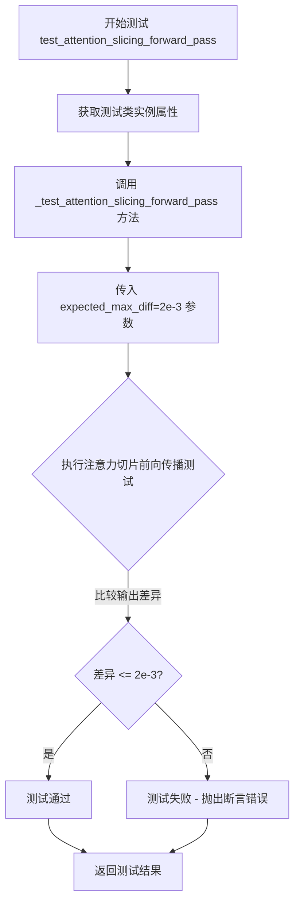

#### 带注释源码

```python
def test_attention_slicing_forward_pass(self):
    """
    测试方法：验证多ControlNet管道中注意力切片前向传播的正确性
    
    该测试方法继承自测试框架，调用混合类中的 _test_attention_slicing_forward_pass 方法
    来验证使用注意力切片技术时的推理结果精度。注意力切片是一种内存优化技术，
    通过将注意力计算分片处理来减少显存占用。
    
    参数:
        self: 测试类实例，隐式传入
    
    返回值:
        返回 _test_attention_slicing_forward_pass 的执行结果（通常为 None 或测试断言）
    
    注意:
        expected_max_diff=2e-3 是精度阈值，表示输出结果与基准值的最大允许差异
    """
    # 调用内部测试方法，验证注意力切片功能
    # 2e-3 的差异阈值确保推理结果的数值精度在可接受范围内
    return self._test_attention_slicing_forward_pass(expected_max_diff=2e-3)
```


### `StableDiffusionMultiControlNetPipelineFastTests.test_xformers_attention_forwardGenerator_pass`

该函数是 `StableDiffusionMultiControlNetPipelineFastTests` 测试类中的一个测试方法，用于验证在使用 xFormers 注意力机制时，ControlNet 多控制网管道的推理前向传播是否与预期结果一致（最大误差阈值设为 2e-3）。

参数：

- `self`：`unittest.TestCase`，测试类实例本身，包含测试所需的组件和断言方法

返回值：`None`，该方法为测试方法，不返回任何值，通过断言验证计算结果的正确性

#### 流程图

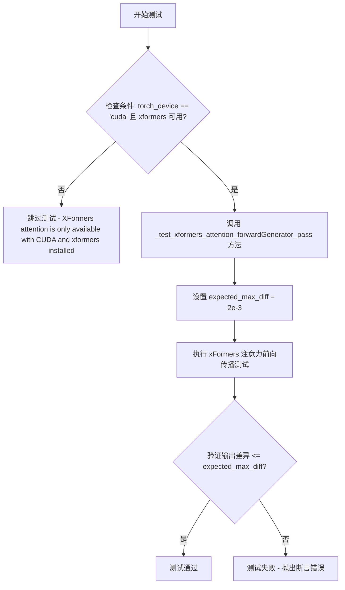

#### 带注释源码

```python
@unittest.skipIf(
    torch_device != "cuda" or not is_xformers_available(),
    reason="XFormers attention is only available with CUDA and `xformers` installed",
)
def test_xformers_attention_forwardGenerator_pass(self):
    """
    测试 xFormers 注意力机制的前向传播是否正确。
    
    该测试方法验证在使用 xFormers 优化的注意力机制时，
    StableDiffusionControlNetImg2ImgPipeline 的输出结果与
    基准值的差异在可接受范围内（2e-3）。
    
    仅在 CUDA 设备和 xFormers 库可用时执行。
    """
    # 调用父类或 mixin 提供的通用测试方法
    # expected_max_diff=2e-3 表示允许的最大误差为 0.002
    self._test_xformers_attention_forwardGenerator_pass(expected_max_diff=2e-3)
```


### `StableDiffusionMultiControlNetPipelineFastTests.test_inference_batch_single_identical`

该测试方法用于验证StableDiffusionControlNetImg2ImgPipeline在批量推理时，单个样本的输出与批量中相同输入的输出一致性，确保批处理逻辑不会引入数值误差。

参数：

- `self`：`StableDiffusionMultiControlNetPipelineFastTests`，隐式参数，测试类实例本身

返回值：`None`，该方法为测试函数，无返回值，通过断言验证推理结果的一致性

#### 流程图

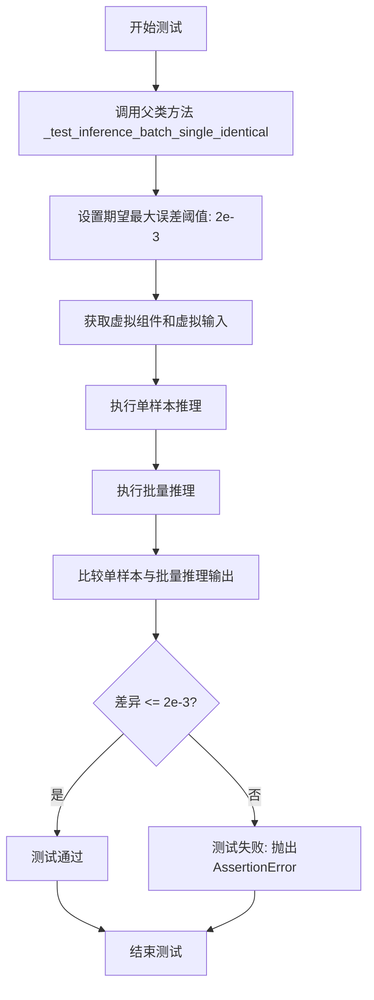

#### 带注释源码

```python
def test_inference_batch_single_identical(self):
    """
    测试批量推理时，单个样本的输出应与批量中相同输入的输出一致。
    该测试验证Pipeline的批处理逻辑没有引入数值误差或状态污染。
    
    测试流程：
    1. 使用相同的输入参数分别进行单样本推理和批量推理
    2. 提取批量推理结果中与单样本相同的索引位置
    3. 比较两者的输出差异是否在允许范围内（expected_max_diff=2e-3）
    """
    # 调用父类（PipelineTesterMixin）提供的通用测试方法
    # expected_max_diff=2e-3 表示允许的最大绝对误差为 0.002
    self._test_inference_batch_single_identical(expected_max_diff=2e-3)
```

---

### 补充信息

#### 1. 全局变量和依赖

| 名称 | 类型 | 描述 |
|------|------|------|
| `self.pipeline_class` | `type` | 管道类，值为`StableDiffusionControlNetImg2ImgPipeline` |
| `self.params` | `frozenset` | 管道参数字符集合（不含height和width） |
| `self.batch_params` | `type` | 批量参数字符集合 |
| `self.image_params` | `frozenset` | 图像参数字符集合（空集） |
| `self.supports_dduf` | `bool` | 是否支持DDUF，值为`False` |

#### 2. 关键组件信息

| 组件名称 | 一句话描述 |
|----------|------------|
| `StableDiffusionControlNetImg2ImgPipeline` | 支持ControlNet条件的Stable Diffusion图像到图像生成管道 |
| `MultiControlNetModel` | 多ControlNet模型封装，支持多个ControlNet加权组合 |
| `UNet2DConditionModel` | 带条件编码的U-Net模型，用于去噪过程 |
| `ControlNetModel` | ControlNet控制网络，提供额外的条件引导 |
| `DDIMScheduler` | DDIM调度器，控制扩散模型的采样步骤 |

#### 3. 潜在技术债务与优化空间

1. **测试覆盖不完整**：`image_params = frozenset([])` 注释标记TODO，表明图像参数测试待完善
2. **硬编码阈值**：`expected_max_diff=2e-3` 为硬编码值，建议提取为类级别常量或配置
3. **缺失文档**：测试方法缺少详细文档注释说明具体验证逻辑

#### 4. 外部依赖与接口契约

- **依赖父类**：`PipelineTesterMixin._test_inference_batch_single_identical()` 提供了核心测试逻辑
- **输入契约**：通过`get_dummy_components()`和`get_dummy_inputs()`获取标准化的测试数据和模型组件
- **输出验证**：返回的图像数组需满足形状和数值一致性要求


### `StableDiffusionMultiControlNetPipelineFastTests.test_ip_adapter`

该方法是用于测试 Stable Diffusion 多控制网（Multi-ControlNet）管道中 IP-Adapter 功能是否正常工作的单元测试方法。它根据当前设备（CPU 或 CUDA）设置预期的输出切片，然后调用父类的 `test_ip_adapter` 方法执行实际测试。

参数：

- `self`：隐式参数，类型为 `StableDiffusionMultiControlNetPipelineFastTests` 实例，表示测试类本身，无额外描述

返回值：`unittest.TestCase.test_ip_adapter` 的返回值类型，通常为 `None`，表示测试执行结果

#### 流程图

```mermaid
flowchart TD
    A[开始 test_ip_adapter] --> B{检查 torch_device == 'cpu'}
    B -->|是| C[设置 expected_pipe_slice = np.array([0.5293, 0.7339, 0.6642, 0.3950, 0.5212, 0.5175, 0.7002, 0.5907, 0.5182])]
    B -->|否| D[设置 expected_pipe_slice = None]
    C --> E[调用 super().test_ip_adapter expected_pipe_slice=expected_pipe_slice]
    D --> E
    E --> F[返回测试结果]
```

#### 带注释源码

```python
def test_ip_adapter(self):
    """
    测试 IP-Adapter 功能是否正常工作
    
    该方法继承自 IPAdapterTesterMixin，用于验证 Multi-ControlNet 管道
    与 IP-Adapter 的集成是否正确。IP-Adapter 是一种图像提示适配器，
    允许使用图像作为条件输入到 Stable Diffusion 模型中。
    
    Returns:
        unittest.TestCase.test_ip_adapter 的返回值，通常为 None
    """
    # 初始化预期输出切片为 None
    expected_pipe_slice = None
    
    # 如果当前设备是 CPU，设置特定的预期输出切片用于 CPU 设备上的断言验证
    # 这些数值是在 CPU 设备上运行测试时的预期输出值
    if torch_device == "cpu":
        expected_pipe_slice = np.array([
            0.5293, 0.7339, 0.6642,  # 第一行像素值
            0.3950, 0.5212, 0.5175,  # 第二行像素值
            0.7002, 0.5907, 0.5182   # 第三行像素值
        ])
    
    # 调用父类 IPAdapterTesterMixin 的 test_ip_adapter 方法执行实际测试
    # 传入 expected_pipe_slice 用于验证输出是否符合预期
    return super().test_ip_adapter(expected_pipe_slice=expected_pipe_slice)
```

#### 附加信息

**调用链说明**：

- 该方法调用 `super().test_ip_adapter()`，其父类为 `IPAdapterTesterMixin`
- `IPAdapterTesterMixin.test_ip_adapter` 方法（未在代码中显示）负责：
  1. 创建 `StableDiffusionControlNetImg2ImgPipeline` 实例
  2. 加载 IP-Adapter 所需的 `image_encoder` 组件
  3. 准备包含 IP-Adapter 条件的输入
  4. 执行管道推理
  5. 验证输出与 `expected_pipe_slice` 的匹配度

**相关配置**：

- 管道类：`StableDiffusionControlNetImg2ImgPipeline`
- 参数类：`TEXT_GUIDED_IMAGE_VARIATION_PARAMS`
- 批处理参数类：`TEXT_GUIDED_IMAGE_VARIATION_BATCH_PARAMS`

**测试依赖**：

- 需要 `image_encoder` 组件（当前在 `get_dummy_components` 中为 `None`，但测试时会从外部加载真实模型）
- 需要 IP-Adapter 权重文件（通常由测试框架在运行前下载）


### `StableDiffusionMultiControlNetPipelineFastTests.test_save_pretrained_raise_not_implemented_exception`

该测试方法用于验证 Multi-ControlNet 管道在调用 save_pretrained 方法时抛出 NotImplementedError 异常，确保该功能尚未实现。

参数：

- `self`：`StableDiffusionMultiControlNetPipelineFastTests`，测试类实例本身

返回值：`None`，该方法为测试方法，不返回任何值

#### 流程图

```mermaid
flowchart TD
    A[开始测试] --> B[调用 get_dummy_components 获取测试组件]
    B --> C[使用 pipeline_class 创建管道实例]
    C --> D[将管道移动到 torch_device 设备]
    D --> E[设置进度条配置 disable=None]
    E --> F[创建临时目录 tmpdir]
    F --> G[尝试调用 pipe.save_pretrained(tmpdir)]
    G --> H{是否抛出 NotImplementedError?}
    H -->|是| I[测试通过 - 捕获异常]
    H -->|否| J[测试失败 - 异常未抛出]
    I --> K[结束测试]
    J --> K
```

#### 带注释源码

```python
def test_save_pretrained_raise_not_implemented_exception(self):
    """
    测试 save_pretrained 方法对 Multi-ControlNet 管道是否抛出 NotImplementedError
    
    该测试验证了 Multi-ControlNet 管道不支持 save_pretrained 功能，
    因为 MultiControlNetModel 的 save_pretrained 方法尚未实现。
    """
    # 步骤1: 获取虚拟组件
    # 调用 get_dummy_components 方法创建测试所需的虚拟组件
    components = self.get_dummy_components()
    
    # 步骤2: 创建管道实例
    # 使用虚拟组件初始化管道类
    pipe = self.pipeline_class(**components)
    
    # 步骤3: 将管道移动到指定设备
    # torch_device 是全局变量，表示测试设备（cuda/cpu）
    pipe.to(torch_device)
    
    # 步骤4: 设置进度条配置
    # disable=None 表示不禁用进度条
    pipe.set_progress_bar_config(disable=None)
    
    # 步骤5: 使用临时目录进行测试
    # tempfile.TemporaryDirectory() 自动管理临时目录的生命周期
    with tempfile.TemporaryDirectory() as tmpdir:
        try:
            # 步骤6: 尝试保存预训练模型
            # save_pretrained 对于 Multi-ControlNet 尚未实现
            # 预期会抛出 NotImplementedError 异常
            pipe.save_pretrained(tmpdir)
        except NotImplementedError:
            # 步骤7: 捕获并忽略 NotImplementedError 异常
            # 如果成功捕获异常，说明测试通过
            pass
```


### `StableDiffusionMultiControlNetPipelineFastTests.test_encode_prompt_works_in_isolation`

该方法用于测试 `StableDiffusionMultiControlNetPipeline` 的 `encode_prompt` 方法是否能独立工作（即在隔离环境下正确编码提示词），同时传递额外的必需参数字典以确保测试环境的一致性。

参数：

- `self`：`StableDiffusionMultiControlNetPipelineFastTests` 实例，表示测试类本身
- `extra_required_param_value_dict`：`Dict`，包含额外的必需参数值字典，用于传递给父类测试方法，具体包含：
  - `device`：设备类型（字符串），如 `"cuda"` 或 `"cpu"`
  - `do_classifier_free_guidance`：布尔值，表示是否启用无分类器指导（classifier-free guidance）

返回值：`Any`，返回父类 `test_encode_prompt_works_in_isolation` 方法的执行结果，通常是测试通过/失败的状态。

#### 流程图

```mermaid
flowchart TD
    A[开始执行 test_encode_prompt_works_in_isolation] --> B[创建 extra_required_param_value_dict 字典]
    B --> C[获取 torch_device 的设备类型]
    B --> D[获取 do_classifier_free_guidance 值]
    C --> E[构造参数字典: device 和 do_classifier_free_guidance]
    D --> E
    E --> F[调用父类的 test_encode_prompt_works_in_isolation 方法]
    F --> G[传入 extra_required_param_value_dict 参数]
    G --> H[返回测试结果]
```

#### 带注释源码

```python
def test_encode_prompt_works_in_isolation(self):
    """
    测试 encode_prompt 方法是否能独立工作（隔离测试）
    该测试方法继承自父类，通过传递额外的必需参数确保测试环境的一致性
    """
    # 创建额外的必需参数字典，用于配置测试环境
    extra_required_param_value_dict = {
        # 获取当前设备类型（如 'cuda' 或 'cpu'）
        "device": torch.device(torch_device).type,
        # 判断是否启用无分类器指导（guidance_scale > 1.0 时启用）
        "do_classifier_free_guidance": self.get_dummy_inputs(device=torch_device).get("guidance_scale", 1.0) > 1.0,
    }
    # 调用父类的同名测试方法，传递额外参数
    return super().test_encode_prompt_works_in_isolation(extra_required_param_value_dict)
```


### `ControlNetImg2ImgPipelineSlowTests.setUp`

这是 `ControlNetImg2ImgPipelineSlowTests` 测试类的初始化方法，在每个测试方法执行前被调用，用于清理 GPU 缓存和垃圾回收，确保测试环境干净。

参数：

- `self`：`ControlNetImg2ImgPipelineSlowTests`，unittest.TestCase 的实例方法隐式参数，代表当前测试类实例

返回值：`None`，该方法不返回任何值，仅执行清理操作

#### 流程图

```mermaid
flowchart TD
    A[setUp 方法开始] --> B[调用 super().setUp]
    B --> C[执行 gc.collect 强制垃圾回收]
    C --> D[调用 backend_empty_cache 清理 GPU 缓存]
    D --> E[setUp 方法结束]
```

#### 带注释源码

```python
def setUp(self):
    """
    测试类初始化方法，在每个测试方法运行前调用。
    负责清理 GPU 缓存和内存，确保测试环境的一致性。
    """
    # 调用父类的 setUp 方法，执行 unittest.TestCase 的标准初始化
    super().setUp()
    
    # 强制进行 Python 垃圾回收，释放不再使用的内存对象
    gc.collect()
    
    # 清理 GPU/后端的缓存内存（例如 PyTorch 的 CUDA 缓存）
    backend_empty_cache(torch_device)
```


### `ControlNetImg2ImgPipelineSlowTests.tearDown`

这是 `ControlNetImg2ImgPipelineSlowTests` 测试类的析构方法（tearDown），用于在每个测试用例执行完成后进行资源清理，释放 GPU 内存和 Python 垃圾回收，确保测试环境保持干净状态，避免内存泄漏影响后续测试。

参数：

- `self`：`ControlNetImg2ImgPipelineSlowTests`，unittest.TestCase 的实例，表示测试类本身

返回值：`None`，该方法不返回任何值，仅执行清理操作

#### 流程图

```mermaid
flowchart TD
    A[tearDown 方法开始] --> B[调用 super.tearDown]
    B --> C[执行 gc.collect]
    C --> D[调用 backend_empty_cache]
    D --> E[方法结束]
    
    B -.->|释放父类资源| E
    C -.->|Python垃圾回收| E
    D -.->|清空GPU缓存| E
```

#### 带注释源码

```python
def tearDown(self):
    """
    测试用例执行完成后的清理方法
    
    该方法在每个测试方法运行结束后被调用，用于：
    1. 调用父类的 tearDown 方法，释放 unittest 框架分配的资源
    2. 强制进行 Python 垃圾回收，释放不再使用的对象
    3. 清空 GPU/后端缓存，确保显存得到释放
    """
    # 调用父类的 tearDown 方法，释放 unittest 框架相关资源
    super().tearDown()
    
    # 强制执行 Python 垃圾回收器，回收已失效的 Python 对象
    gc.collect()
    
    # 清空 GPU 显存/后端缓存，释放 GPU 内存资源
    # torch_device 是测试工具函数，指向当前测试设备（如 cuda 或 cpu）
    backend_empty_cache(torch_device)
```


### `ControlNetImg2ImgPipelineSlowTests.test_canny`

这是一个端到端集成测试方法，用于验证 ControlNet img2img pipeline 在 Canny 边缘检测引导下的图像生成功能是否正常工作。测试加载预训练的 ControlNet 模型和 Stable Diffusion v1.5 模型，使用 Canny 边缘图作为控制条件，将输入图像转换为符合提示词描述的输出图像，并验证生成结果与预期图像的相似度。

参数：

- `self`：隐式参数，`unittest.TestCase` 类型，代表测试类实例本身

返回值：无显式返回值（`None`），测试通过时无异常，失败时抛出断言错误

#### 流程图

```mermaid
flowchart TD
    A[开始测试] --> B[加载预训练ControlNet模型<br/>lllyasviel/sd-controlnet-canny]
    B --> C[加载StableDiffusionControlNetImg2ImgPipeline<br/>stable-diffusion-v1-5]
    C --> D[启用模型CPU卸载<br/>enable_model_cpu_offload]
    D --> E[设置进度条配置<br/>set_progress_bar_config]
    E --> F[创建随机数生成器<br/>device=cpu, seed=0]
    F --> G[设置提示词<br/>prompt: evil space-punk bird]
    G --> H[加载并调整控制图像尺寸<br/>Canny边缘图 512x512]
    H --> I[加载并调整输入图像尺寸<br/>bird原图 512x512]
    I --> J[调用pipeline进行推理<br/>num_inference_steps=50<br/>strength=0.6]
    J --> K[获取生成的图像<br/>output.images[0]]
    K --> L{验证图像尺寸<br/>assert shape == 512x512x3}
    L -->|通过| M[加载预期图像<br/>load_numpy]
    L -->|失败| N[抛出AssertionError]
    M --> O{验证图像相似度<br/>assert max_diff < 0.09}
    O -->|通过| P[测试通过]
    O -->|失败| N
```

#### 带注释源码

```python
@require_torch_accelerator  # 要求torch加速器（GPU）
@slow  # 标记为慢速测试
class ControlNetImg2ImgPipelineSlowTests(unittest.TestCase):
    """
    ControlNet图像到图像pipeline的慢速集成测试类
    用于验证完整的端到端图像生成流程
    """
    
    def setUp(self):
        """测试前准备：垃圾回收和清空缓存"""
        super().setUp()
        gc.collect()
        backend_empty_cache(torch_device)

    def tearDown(self):
        """测试后清理：垃圾回收和清空缓存"""
        super().tearDown()
        gc.collect()
        backend_empty_cache(torch_device)

    def test_canny(self):
        """
        测试Canny边缘检测引导的图像到图像转换
        验证ControlNet利用Canny边缘图作为控制条件进行图像生成
        """
        
        # 步骤1: 从预训练模型加载ControlNet
        # 使用lllyasviel提供的Canny边缘检测ControlNet模型
        controlnet = ControlNetModel.from_pretrained("lllyasviel/sd-controlnet-canny")

        # 步骤2: 加载Stable Diffusion ControlNet Img2Img Pipeline
        # 从stable-diffusion-v1-5基础模型加载，并传入ControlNet
        # safety_checker设为None以避免不必要的计算开销
        pipe = StableDiffusionControlNetImg2ImgPipeline.from_pretrained(
            "stable-diffusion-v1-5/stable-diffusion-v1-5", 
            safety_checker=None, 
            controlnet=controlnet
        )
        
        # 步骤3: 启用模型CPU卸载
        # 当GPU内存不足时，将模型部分卸载到CPU
        pipe.enable_model_cpu_offload(device=torch_device)
        
        # 步骤4: 配置进度条
        # disable=None表示启用进度条显示
        pipe.set_progress_bar_config(disable=None)

        # 步骤5: 创建确定性随机数生成器
        # 使用CPU设备，固定种子0确保测试可复现
        generator = torch.Generator(device="cpu").manual_seed(0)
        
        # 步骤6: 定义文本提示词
        # 描述期望生成的图像内容：邪恶的太空朋克鸟
        prompt = "evil space-punk bird"

        # 步骤7: 加载控制图像（Canny边缘检测结果）
        # 从HuggingFace数据集加载Canny边缘图并调整尺寸
        control_image = load_image(
            "https://huggingface.co/datasets/hf-internal-testing/diffusers-images/resolve/main/sd_controlnet/bird_canny.png"
        ).resize((512, 512))

        # 步骤8: 加载输入图像（待转换的原图）
        # 加载鸟的原图并调整尺寸
        image = load_image(
            "https://huggingface.co/lllyasviel/sd-controlnet-canny/resolve/main/images/bird.png"
        ).resize((512, 512))

        # 步骤9: 调用pipeline执行推理
        # 参数说明：
        # - prompt: 文本提示词
        # - image: 输入图像（将基于此图像进行转换）
        # - control_image: 控制图像（Canny边缘图）
        # - generator: 随机数生成器，确保可复现性
        # - output_type: np，返回numpy数组格式
        # - num_inference_steps: 50步推理
        # - strength: 0.6，转换强度（0-1之间）
        output = pipe(
            prompt,
            image,
            control_image=control_image,
            generator=generator,
            output_type="np",
            num_inference_steps=50,
            strength=0.6,
        )

        # 步骤10: 获取生成的图像
        # 从输出中提取第一张生成的图像
        image = output.images[0]

        # 步骤11: 验证输出图像尺寸
        # 确认生成的图像尺寸为512x512像素，3通道（RGB）
        assert image.shape == (512, 512, 3)

        # 步骤12: 加载预期图像用于对比
        # 从HuggingFace数据集加载预先计算好的期望输出
        expected_image = load_numpy(
            "https://huggingface.co/datasets/hf-internal-testing/diffusers-images/resolve/main/sd_controlnet/img2img.npy"
        )

        # 步骤13: 验证生成图像与预期图像的相似度
        # 使用最大绝对差值作为相似度度量，允许0.09的误差范围
        assert np.abs(expected_image - image).max() < 9e-2
```

## 关键组件


### ControlNetModel

控制网络模型，用于根据额外的控制图像（如边缘图、姿态等）来指导图像生成过程，实现对生成结果的精细控制。

### StableDiffusionControlNetImg2ImgPipeline

Stable Diffusion ControlNet图像到图像生成管道，结合了ControlNet控制能力与Img2Img重绘功能，支持基于文本提示和条件图像生成新图像。

### MultiControlNetModel

多控制网络模型容器，支持同时使用多个ControlNet模型，可以组合不同的控制条件（如边缘+深度+姿态等）进行更复杂的图像生成控制。

### UNet2DConditionModel

条件UNet2D模型，是Stable Diffusion的核心去噪网络，负责在潜在空间中逐步去除噪声，生成与文本提示和条件图像相符的图像。

### AutoencoderKL

变分自编码器(VAE)模型，负责将图像编码到潜在空间以及从潜在空间解码回图像，实现图像的压缩与重建。

### CLIPTextModel

CLIP文本编码器模型，将文本提示转换为高维特征向量，为图像生成提供语义指导。

### DDIMScheduler

DDIM调度器，实现了DDIM (Denoising Diffusion Implicit Models) 采样策略，控制去噪过程的步调和噪声调度。

### test_attention_slicing_forward_pass

注意力切片前向传播测试，验证使用注意力切片技术时可以减少显存占用并保持输出一致性。

### test_xformers_attention_forwardGenerator_pass

xFormers注意力机制测试，验证使用xFormers优化库可以加速注意力计算并保持结果正确性。

### test_inference_batch_single_identical

批处理推理一致性测试，验证批量推理时单个样本的输出与单独推理时完全一致。

### get_dummy_components

获取虚拟测试组件方法，构造用于单元测试的轻量级模型配置，包括UNet、ControlNet、VAE、文本编码器等核心组件的最小化实现。

### get_dummy_inputs

获取虚拟输入方法，构造测试用的虚拟输入数据，包括提示词、随机种子、生成图像和条件图像等。

### test_control_guidance_switch

控制引导切换测试，验证ControlNet的条件引导可以在不同的推理步骤区间内动态调整，实现更灵活的条件控制。


## 问题及建议


### 已知问题

- **重复代码**：`get_dummy_components` 和 `get_dummy_inputs` 方法在 `ControlNetImg2ImgPipelineFastTests` 和 `StableDiffusionMultiControlNetPipelineFastTests` 两个测试类中几乎完全相同，未提取为共享方法或工具函数。
- **测试断言不完整**：`test_save_pretrained_raise_not_implemented_exception` 方法中的 try-except 块没有使用 `fail` 机制确保异常被抛出，如果 `save_pretrained` 没有抛出 `NotImplementedError`，测试会错误地通过。
- **未完成的 TODO**：`StableDiffusionMultiControlNetPipelineFastTests` 类中 `image_params = frozenset([])` 标记为 TODO，表明功能未完成。
- **测试行为不一致**：`test_ip_adapter` 方法中 `expected_pipe_slice` 在 CPU 设备时有值但在其他设备（包括 GPU）时为 `None`，导致不同设备上的测试行为不一致。
- **命名不一致**：方法 `test_xformers_attention_forwardGenerator_pass` 名称中包含 "Generator" 但实际与 generator 参数无关，易造成误解。
- **Magic Numbers 散落**：多处使用硬编码数值如 `expected_max_diff=2e-3`、`beta_start=0.00085`、`beta_end=0.012`、`controlnet_embedder_scale_factor = 2` 等，缺乏常量定义。
- **资源清理可能不彻底**：虽然有 `gc.collect()` 和 `backend_empty_cache`，但 GPU 内存可能在某些测试失败时未被正确释放。

### 优化建议

- 将重复的 `get_dummy_components` 和 `get_dummy_inputs` 方法提取到测试基类或独立的工具模块中。
- 完善 `test_save_pretrained_raise_not_implemented_exception` 的异常验证逻辑，使用 `pytest.raises()` 或添加 `else: self.fail("Expected NotImplementedError was not raised")`。
- 完成 TODO 中标记的 `image_params` 实现。
- 统一 `expected_pipe_slice` 的处理逻辑，或在非 CPU 设备时明确跳过测试。
- 修正方法命名为 `test_xformers_attention_forward_pass` 以保持一致性。
- 将魔数值提取为类级别或模块级别的常量，赋予有意义的名称。
- 考虑使用 pytest fixture 管理测试资源，确保资源在测试间正确隔离和清理。

## 其它


### 设计目标与约束

验证StableDiffusionControlNetImg2ImgPipeline在单ControlNet和多ControlNet（MultiControlNetModel）场景下的功能正确性，包括前向传播、注意力切片、XFormers加速、批处理推理、IP-Adapter支持等核心功能。测试覆盖快速单元测试和慢速集成测试，需在CUDA环境下支持xformers加速，且对CPU和GPU设备有不同预期结果。

### 错误处理与异常设计

测试用例中test_save_pretrained_raise_not_implemented_exception明确验证MultiControlNet场景下save_pretrained方法应抛出NotImplementedError异常。@unittest.skipIf装饰器用于条件跳过不支持的测试场景（如xformers仅在CUDA可用）。使用try-except捕获异常并进行断言验证。

### 数据流与状态机

测试数据流程为：get_dummy_components()创建所有模型组件（UNet、ControlNet、VAE、TextEncoder等）→ get_dummy_inputs()生成包含prompt、generator、image、control_image等参数的输入字典 → 管道执行__call__方法进行推理。MultiControlNet场景支持control_guidance_start/end参数的时间步控制，实现ControlNet条件引导的动态启用/禁用。

### 外部依赖与接口契约

核心依赖包括：transformers(CLIPTextConfig/CLIPTextModel/CLIPTokenizer)、diffusers(AutoencoderKL/ControlNetModel/DDIMScheduler/UNet2DConditionModel/StableDiffusionControlNetImg2ImgPipeline/MultiControlNetModel)、torch、PIL、numpy。测试继承IPAdapterTesterMixin、PipelineLatentTesterMixin、PipelineKarrasSchedulerTesterMixin、PipelineTesterMixin等混合类，需实现get_dummy_components()和get_dummy_inputs()接口契约。

### 配置与参数说明

params定义为TEXT_GUIDED_IMAGE_VARIATION_PARAMS - {"height", "width"}，batch_params为TEXT_GUIDED_IMAGE_VARIATION_BATCH_PARAMS，image_params为IMAGE_TO_IMAGE_IMAGE_PARAMS.union({"control_image"})。关键参数包括：num_inference_steps(推理步数)、guidance_scale(引导系数)、output_type("np"/"pil")、controlnet_conditioning_scale(ControlNet引导强度)、control_guidance_start/end(条件引导起止时间步)。

### 测试覆盖范围

快速测试类：ControlNetImg2ImgPipelineFastTests覆盖7个测试方法（注意力切片、XFormers、批处理单identical、prompt编码隔离、IP-Adapter）。StableDiffusionMultiControlNetPipelineFastTests覆盖7个测试方法（ControlNet引导切换、注意力切片、XFormers、批处理、IP-Adapter、保存预训练异常、prompt编码隔离）。慢速测试类：ControlNetImg2ImgPipelineSlowTests使用真实模型验证canny边缘检测控制能力。

### 性能考量

测试使用torch.manual_seed(0)保证确定性，enable_full_determinism()确保可复现性。使用floats_tensor和randn_tensor生成确定性随机输入。backend_empty_cache(torch_device)和gc.collect()管理内存。enable_model_cpu_offload()支持CPU offload优化。expected_max_diff=2e-3作为数值精度容忍阈值。

### 版本兼容性

需安装torch、transformers、diffusers、numpy、PIL。xformers加速仅在CUDA环境可用。@slow装饰器标记慢速测试需单独运行。@require_torch_accelerator要求accelerator环境。MPS设备使用torch.manual_seed替代Generator初始化。

### 资源管理

setUp/tearDown方法中执行gc.collect()和backend_empty_cache()释放GPU内存。pipeline.set_progress_bar_config(disable=None)控制进度条显示。tempfile.TemporaryDirectory()用于临时文件存储并在测试结束后自动清理。

### 安全注意事项

safety_checker设置为None以避免内容过滤影响测试。测试使用虚拟模型和随机数据，不涉及真实敏感内容。from_pretrained加载预训练模型时显式设置safety_checker=None。


    