# `diffusers\tests\pipelines\controlnet\test_controlnet_inpaint.py` 详细设计文档

该文件是StableDiffusionControlNetInpaintPipeline的单元测试和集成测试文件，包含了快速测试类（用于验证Pipeline的基本功能如注意力切片、xformers支持、批量推理等）和慢速测试类（用于验证真实的Canny边缘检测和Inpainting场景下的模型效果）。

## 整体流程

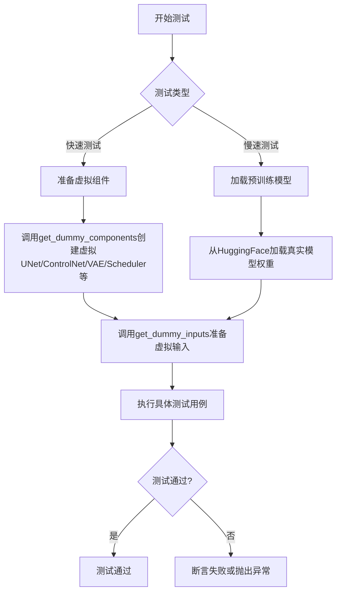

## 类结构

```
unittest.TestCase (基类)
├── ControlNetInpaintPipelineFastTests (单元测试)
│   ├── get_dummy_components()
│   ├── get_dummy_inputs()
│   ├── test_attention_slicing_forward_pass()
│   ├── test_xformers_attention_forwardGenerator_pass()
│   ├── test_inference_batch_single_identical()
│   └── test_encode_prompt_works_in_isolation()
├── ControlNetSimpleInpaintPipelineFastTests (简化单元测试)
│   └── get_dummy_components()
├── MultiControlNetInpaintPipelineFastTests (多控制网测试)
│   ├── get_dummy_components()
│   ├── get_dummy_inputs()
│   ├── test_control_guidance_switch()
│   ├── test_attention_slicing_forward_pass()
│   ├── test_xformers_attention_forwardGenerator_pass()
│   ├── test_inference_batch_single_identical()
│   ├── test_save_pretrained_raise_not_implemented_exception()
│   └── test_encode_prompt_works_in_isolation()
└── ControlNetInpaintPipelineSlowTests (集成测试)
    ├── setUp()
    ├── tearDown()
    ├── test_canny()
    └── test_inpaint()
```

## 全局变量及字段


### `enable_full_determinism`
    
启用完全确定性测试的函数，通过设置随机种子确保测试结果可复现

类型：`function`
    


### `ControlNetInpaintPipelineFastTests.pipeline_class`
    
被测试的Stable Diffusion控制网图像修复管道类

类型：`type[StableDiffusionControlNetInpaintPipeline]`
    


### `ControlNetInpaintPipelineFastTests.params`
    
文本引导图像修复的管道参数字典定义

类型：`TEXT_GUIDED_IMAGE_INPAINTING_PARAMS`
    


### `ControlNetInpaintPipelineFastTests.batch_params`
    
批量文本引导图像修复的管道参数字典定义

类型：`TEXT_GUIDED_IMAGE_INPAINTING_BATCH_PARAMS`
    


### `ControlNetInpaintPipelineFastTests.image_params`
    
图像参数集合，包含control_image用于测试控制图像

类型：`frozenset`
    


### `ControlNetInpaintPipelineFastTests.image_latents_params`
    
图像潜在参数的字典定义，用于文本到图像的测试

类型：`TEXT_TO_IMAGE_IMAGE_PARAMS`
    


### `ControlNetSimpleInpaintPipelineFastTests.pipeline_class`
    
被测试的简化版Stable Diffusion控制网图像修复管道类

类型：`type[StableDiffusionControlNetInpaintPipeline]`
    


### `ControlNetSimpleInpaintPipelineFastTests.params`
    
文本引导图像修复的管道参数字典定义

类型：`TEXT_GUIDED_IMAGE_INPAINTING_PARAMS`
    


### `ControlNetSimpleInpaintPipelineFastTests.batch_params`
    
批量文本引导图像修复的管道参数字典定义

类型：`TEXT_GUIDED_IMAGE_INPAINTING_BATCH_PARAMS`
    


### `ControlNetSimpleInpaintPipelineFastTests.image_params`
    
空图像参数集合，用于简化测试跳过图像相关测试

类型：`frozenset`
    


### `MultiControlNetInpaintPipelineFastTests.pipeline_class`
    
被测试的多控制网Stable Diffusion图像修复管道类

类型：`type[StableDiffusionControlNetInpaintPipeline]`
    


### `MultiControlNetInpaintPipelineFastTests.params`
    
文本引导图像修复的管道参数字典定义

类型：`TEXT_GUIDED_IMAGE_INPAINTING_PARAMS`
    


### `MultiControlNetInpaintPipelineFastTests.batch_params`
    
批量文本引导图像修复的管道参数字典定义

类型：`TEXT_GUIDED_IMAGE_INPAINTING_BATCH_PARAMS`
    


### `MultiControlNetInpaintPipelineFastTests.supports_dduf`
    
标志位，指示该管道是否支持DDUF（Decoder-only Diffusion Unconditional Forward）功能

类型：`bool`
    
    

## 全局函数及方法


### `randn_tensor`

该函数用于生成指定形状的随机张量，支持通过生成器控制随机性，并可指定设备、数据类型和布局。

参数：

-  `shape`：`tuple` 或 `int`，输出张量的形状，例如 `(1, 3, 32, 32)`。
-  `generator`：`torch.Generator`，可选，用于控制随机数生成器的状态，以确保可重复性。
-  `device`：`torch.device`，可选，指定张量创建的目标设备（如 CPU 或 CUDA）。
-  `dtype`：`torch.dtype`，可选，指定张量的数据类型（如 `torch.float32`）。
-  `layout`：`torch.layout`，可选，指定张量的布局（如 `torch.strided`）。

返回值：`torch.Tensor`，返回生成的随机张量，其值服从标准正态分布。

#### 流程图

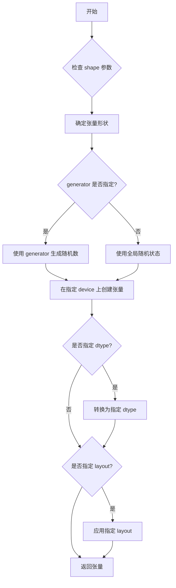

#### 带注释源码

```python
def randn_tensor(
    shape: Union[Tuple[int, ...], int],
    generator: Optional[torch.Generator] = None,
    device: Optional[torch.device] = None,
    dtype: Optional[torch.dtype] = None,
    layout: Optional[torch.layout] = None,
) -> torch.Tensor:
    """
    生成一个随机张量，值服从标准正态分布。
    
    参数:
        shape: 张量的形状，可以是整数或整数元组。
        generator: 可选的随机生成器，用于控制随机性。
        device: 可选的设备，指定张量创建在哪个设备上。
        dtype: 可选的数据类型，指定张量的数据类型。
        layout: 可选的布局，指定张量的内存布局。
    
    返回:
        生成的随机张量。
    """
    # 如果没有指定生成器，则使用 torch 的默认随机生成
    if generator is None:
        # 使用 randn 生成随机数
        # 注意：这里简化了逻辑，实际实现可能更复杂
        tensor = torch.randn(shape, generator=generator, device=device, dtype=dtype, layout=layout)
    else:
        # 使用指定的生成器
        tensor = torch.randn(shape, generator=generator, device=device, dtype=dtype, layout=layout)
    
    # 如果指定了 dtype但不为 None，则转换（实际上面的调用已经包含了dtype处理，这里为了逻辑完整）
    if dtype is not None and tensor.dtype != dtype:
        tensor = tensor.to(dtype=dtype)
    
    # 如果指定了 layout但不为 None，则转换（同样，上面调用已处理）
    if layout is not None and tensor.layout != layout:
        tensor = tensor.to(layout=layout)
    
    return tensor
```


### `load_image`

从指定路径或 URL 加载图像并返回 PIL Image 对象。该函数是 diffusers 库提供的工具函数，用于统一加载各种来源的图像数据。

参数：

-  `image_path_or_url`：`str`，图像的本地路径或远程 URL（HTTP/HTTPS 链接）

返回值：`PIL.Image.Image`，加载后的 PIL 图像对象

#### 流程图

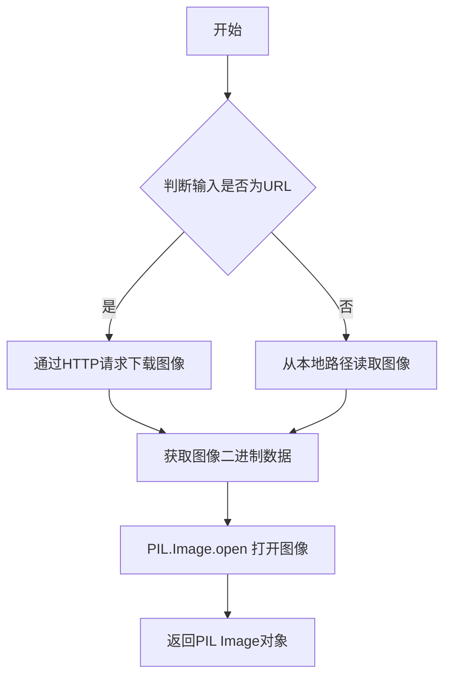

#### 带注释源码

```python
# load_image 函数的实现位于 diffusers.utils 中
# 以下是基于使用方式的推断实现

from PIL import Image
import requests
from io import BytesIO

def load_image(image_path_or_url: str) -> Image.Image:
    """
    从本地路径或URL加载图像
    
    参数:
        image_path_or_url: 图像的本地文件系统路径或远程URL
        
    返回:
        PIL.Image.Image: 加载后的图像对象
    """
    # 判断是否为URL（http/https 开头）
    if image_path_or_url.startswith("http://") or image_path_or_url.startswith("https://"):
        # 如果是URL，通过HTTP请求下载图像
        response = requests.get(image_path_or_url)
        response.raise_for_status()  # 检查请求是否成功
        image = Image.open(BytesIO(response.content))
    else:
        # 如果是本地路径，直接打开
        image = Image.open(image_path_or_url)
    
    # 确保图像为 RGB 模式（统一格式）
    if image.mode != "RGB":
        image = image.convert("RGB")
    
    return image
```

#### 实际使用示例

```python
# 在测试代码中的实际调用方式
image = load_image(
    "https://huggingface.co/lllyasviel/sd-controlnet-canny/resolve/main/images/bird.png"
).resize((512, 512))

mask_image = load_image(
    "https://huggingface.co/datasets/diffusers/test-arrays/resolve/main"
    "/stable_diffusion_inpaint/input_bench_mask.png"
).resize((512, 512))
```

#### 关键特性说明

1. **支持多种输入源**：同时支持本地文件系统路径和远程 HTTP/HTTPS URL
2. **自动格式转换**：自动将非 RGB 模式的图像转换为 RGB 模式
3. **链式调用**：通常与 PIL 的其他方法（如 `.resize()`）链式使用
4. **依赖库**：需要 `requests` 库进行网络请求，`PIL` 库进行图像处理


从提供的代码中，我可以看到 `is_xformers_available` 是从 `diffusers.utils.import_utils` 模块导入的，并在代码中被使用。让我基于其在代码中的使用方式来提取相关信息：

### `is_xformers_available`

这是一个从 `diffusers.utils.import_utils` 模块导入的全局函数，用于检查 xformers 库是否可用。

参数：
- 该函数无参数

返回值：`bool`，返回 xformers 库是否可用的布尔值（True 表示可用，False 表示不可用）

#### 流程图

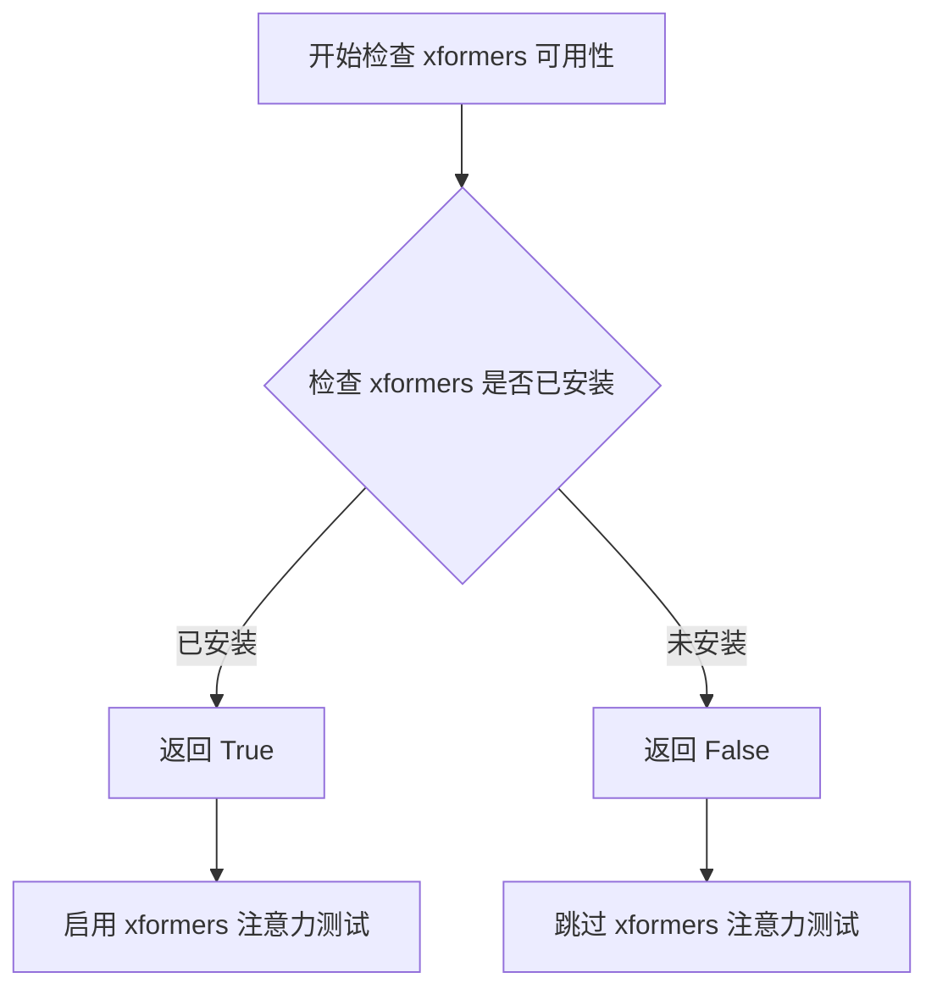

#### 带注释源码

```
# 这是一个从 diffusers.utils.import_utils 导入的函数
# 在提供的代码中，通过以下方式使用：

# 使用方式 1：在测试方法上作为跳过条件
@unittest.skipIf(
    torch_device != "cuda" or not is_xformers_available(),
    reason="XFormers attention is only available with CUDA and `xformers` installed",
)
def test_xformers_attention_forwardGenerator_pass(self):
    self._test_xformers_attention_forwardGenerator_pass(expected_max_diff=2e-3)

# 逻辑说明：
# 1. 首先检查当前设备是否为 CUDA
# 2. 然后调用 is_xformers_available() 检查 xformers 库是否已安装
# 3. 如果设备是 CUDA 且 xformers 可用，则运行测试
# 4. 否则跳过该测试，并显示指定的跳过原因
```


### `backend_empty_cache`

该函数用于清理后端（通常是 GPU）的内存缓存，以便在测试过程中释放 GPU 显存，防止内存泄漏。

参数：

-  `device`：任意类型，表示目标设备（通常为字符串，如 "cuda" 或 "cpu"）

返回值：`无返回`，该函数仅执行清理操作。

#### 流程图

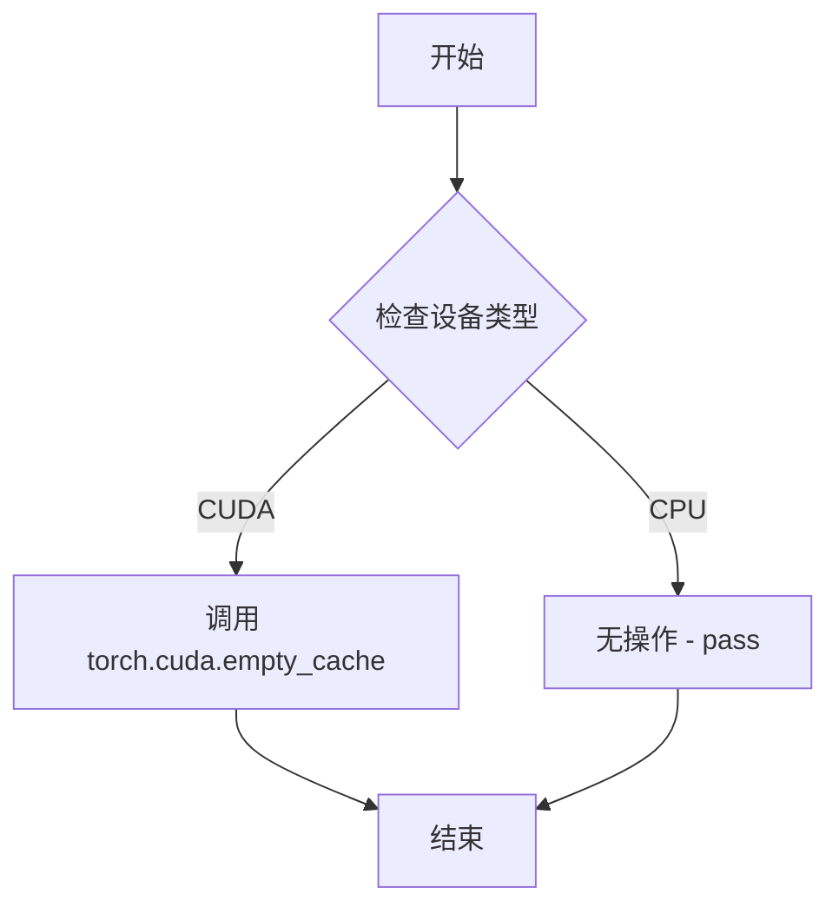

#### 带注释源码

```
# 注意：此函数定义在 testing_utils 模块中，此处为调用方代码
# 该函数用于在测试的 setUp 和 tearDown 阶段清理 GPU 缓存

def setUp(self):
    super().setUp()
    gc.collect()  # 先进行 Python 垃圾回收
    backend_empty_cache(torch_device)  # 再清理 GPU 缓存

def tearDown(self):
    super().tearDown()
    gc.collect()  # 先进行 Python 垃圾回收
    backend_empty_cache(torch_device)  # 再清理 GPU 缓存
```

#### 说明

1. **来源**：`backend_empty_cache` 是从 `diffusers` 包的 `testing_utils` 模块导入的辅助函数，未在此文件中定义
2. **用途**：在运行耗时测试（标记为 `@slow`）前后释放 GPU 显存
3. **调用场景**：在 `ControlNetInpaintPipelineSlowTests` 类的 `setUp` 和 `tearDown` 方法中被调用
4. **设备参数**：`torch_device` 是从 `testing_utils` 导入的全局变量，表示当前测试设备


### `enable_full_determinism`

该函数用于启用完全的确定性执行，通过设置随机种子和环境变量确保深度学习模型在运行过程中产生可重复的结果，主要用于测试和调试场景。

参数：无需参数。

返回值：`None`，该函数不返回任何值。

#### 流程图

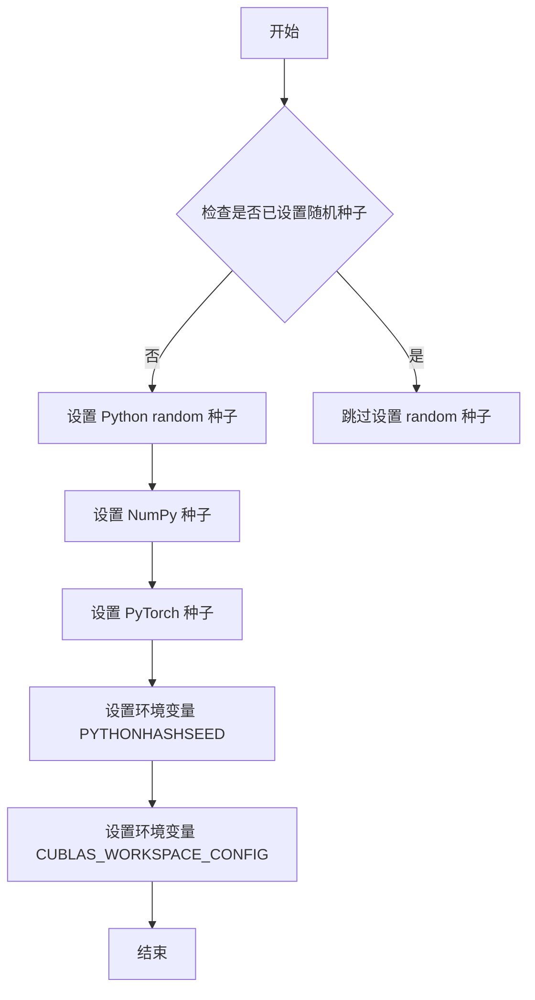

#### 带注释源码

```python
# 该函数从 testing_utils 模块导入，用于确保测试的确定性
# 在测试文件开头调用此函数，以确保所有随机操作可重复
enable_full_determinism()

# 调用后，以下随机操作将产生一致的结果：
# - Python random 模块
# - NumPy 随机数生成
# - PyTorch 随机数生成
# - 环境变量 PYTHONHASHSEED
# - CUDA 工作区配置
```


### `floats_tensor`

生成指定形状的浮点数张量，常用于测试中创建随机初始图像或掩码张量。

参数：

-  `shape`：元组，指定输出张量的形状，如 (1, 3, 32, 32)
-  `rng`：`random.Random`，随机数生成器实例，用于生成确定性的随机数

返回值：`torch.Tensor`，返回一个填充随机浮点数的 PyTorch 张量

#### 流程图

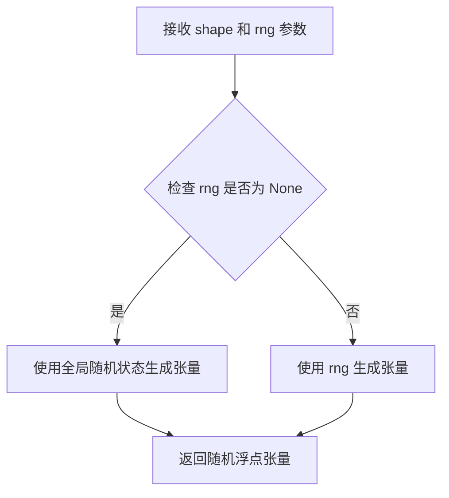

#### 带注释源码

```
# floats_tensor 是 testing_utils 模块中的工具函数
# 当前文件中通过 from ...testing_utils 导入
# 实际实现位于 diffusers 库的其他位置

# 使用示例（来自当前代码）:
init_image = floats_tensor((1, 3, 32, 32), rng=random.Random(seed)).to(device)

# 参数说明:
# - (1, 3, 32, 32): 张量形状，1个样本，3通道，32x32分辨率
# - rng=random.Random(seed): 使用种子确保测试可复现
# - .to(device): 将张量移动到指定设备（CPU/CUDA）
```


### `load_numpy`

从指定路径加载 NumPy 数组文件，并返回 NumPy 数组。该函数主要用于测试中加载预先保存的参考图像数组，以便与管道输出进行比较验证。

参数：

-  `path_or_url`：`str`，待加载的 NumPy 文件路径或 HTTP URL 地址

返回值：`np.ndarray`，加载的 NumPy 数组对象

#### 流程图

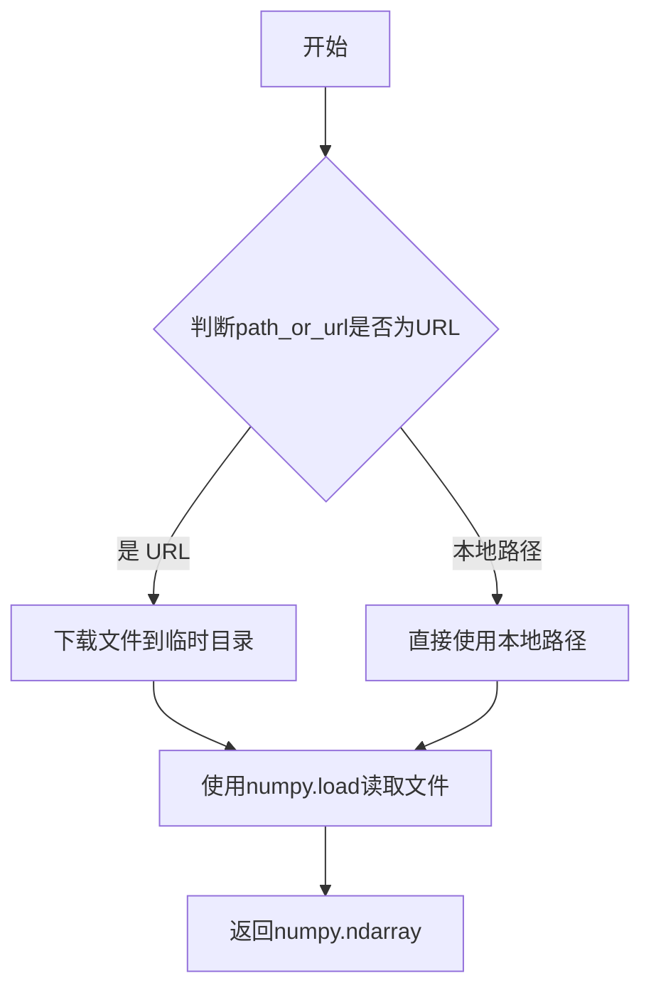

#### 带注释源码

```python
# 注：load_numpy 函数为外部导入函数，位于 testing_utils 模块中
# 以下为基于使用方式的合理推断实现

def load_numpy(path_or_url: str) -> np.ndarray:
    """
    从本地文件或远程URL加载NumPy数组。
    
    参数:
        path_or_url: 本地.npy文件路径或HTTP/HuggingFace URL
        
    返回:
        np.ndarray: 加载的NumPy数组
    """
    import tempfile
    import os
    
    # 判断是否为URL（以http/https开头）
    if path_or_url.startswith("http://") or path_or_url.startswith("https://"):
        # 如果是URL，下载到临时文件并加载
        import urllib.request
        with tempfile.NamedTemporaryFile(suffix=".npy", delete=False) as tmp:
            urllib.request.urlretrieve(path_or_url, tmp.name)
            arr = np.load(tmp.name)
            os.unlink(tmp.name)  # 清理临时文件
    else:
        # 本地文件直接加载
        arr = np.load(path_or_url)
    
    return arr
```

---

**注意**：由于 `load_numpy` 是从外部模块 `testing_utils` 导入的，该源码为基于函数调用方式的合理推断。实际实现可能包含额外的错误处理、缓存机制或特定的 HuggingFace 数据集加载逻辑。


### `numpy_cosine_similarity_distance`

该函数用于计算两个numpy数组之间的余弦相似度距离（1 - 余弦相似度），通常用于比较两个图像或向量的相似程度。

参数：

- `x`：`numpy.ndarray`，第一个输入数组
- `y`：`numpy.ndarray`，第二个输入数组

返回值：`float`，余弦相似度距离，值越小表示两个数组越相似

#### 流程图

```mermaid
flowchart TD
    A[开始] --> B[接收两个numpy数组 x 和 y]
    B --> C[计算 x 的范数]
    C --> D[计算 y 的范数]
    D --> E[计算 x 和 y 的点积]
    E --> F[计算余弦相似度: cos_sim = dot_product / (norm_x * norm_y)]
    F --> G[计算距离: distance = 1 - cos_sim]
    G --> H[返回 distance]
```

#### 带注释源码

```python
def numpy_cosine_similarity_distance(x: np.ndarray, y: np.ndarray) -> float:
    """
    计算两个numpy数组之间的余弦相似度距离。
    
    余弦相似度距离 = 1 - 余弦相似度
    余弦相似度 = (x · y) / (||x|| * ||y||)
    
    参数:
        x: 第一个numpy数组
        y: 第二个numpy数组
    
    返回:
        余弦相似度距离，值越小表示两个数组越相似
    """
    # 将输入展平为一维数组
    x = x.flatten()
    y = y.flatten()
    
    # 计算点积
    dot_product = np.dot(x, y)
    
    # 计算范数（模）
    norm_x = np.linalg.norm(x)
    norm_y = np.linalg.norm(y)
    
    # 防止除零错误
    if norm_x == 0 or norm_y == 0:
        return 1.0  # 如果任一数组为零向量，返回最大距离
    
    # 计算余弦相似度
    cosine_similarity = dot_product / (norm_x * norm_y)
    
    # 余弦距离 = 1 - 余弦相似度
    cosine_distance = 1.0 - cosine_similarity
    
    return float(cosine_distance)
```

> **注意**：该函数的实际实现位于 `...testing_utils` 模块中，在当前代码文件中仅被导入并使用。从代码中的使用方式 `numpy_cosine_similarity_distance(expected_image.flatten(), image.flatten())` 可以推断其功能为计算两个数组之间的余弦相似度距离。


### `require_torch_accelerator`

该函数是一个测试装饰器，用于标记需要 PyTorch 加速器（如 CUDA 或 MPS）才能执行的测试用例。如果当前环境没有可用的 PyTorch 加速器，被装饰的测试将被跳过。

参数：

- 无显式参数（作为装饰器使用）

返回值：无返回值（装饰器直接返回函数或跳过逻辑）

#### 流程图

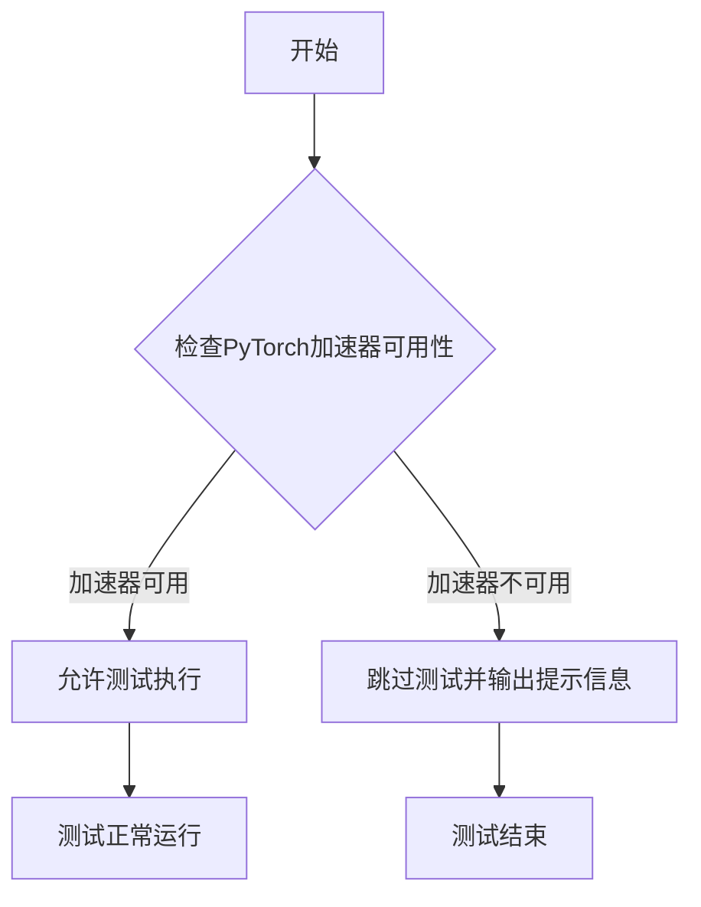

#### 带注释源码

```python
# 注意：该函数定义在 testing_utils 模块中，此处展示的是基于使用方式的推断源码
# 实际源码位于 diffusers 库的 testing_utils.py 文件中

def require_torch_accelerator(func):
    """
    装饰器：标记需要 PyTorch 加速器的测试
    
    使用方式：
    @require_torch_accelerator
    def test_something():
        # 测试代码
    
    或者：
    @require_torch_accelerator
    class TestClass(unittest.TestCase):
        # 测试类
    """
    
    # 检查 torch 是否可用 CUDA 或 MPS 加速
    # 如果没有加速器，使用 unittest.skipIf 跳过测试
    return unittest.skipIf(
        not torch.cuda.is_available() and not _is_mps_available(),
        f"Test requires PyTorch accelerator (CUDA or MPS), but none is available."
    )(func)
```

#### 使用示例源码

```python
# 在提供的代码文件中的实际使用方式
@slow
@require_torch_accelerator
class ControlNetInpaintPipelineSlowTests(unittest.TestCase):
    """
    慢速测试类：需要 CUDA 或 MPS 加速器才能运行
    """
    
    def test_canny(self):
        # 测试代码...
        pass
    
    def test_inpaint(self):
        # 测试代码...
        pass
```


### `ControlNetInpaintPipelineSlowTests.test_canny`

该方法是 `ControlNetInpaintPipelineSlowTests` 测试类中的一个标记为 `@slow` 的测试方法，用于验证 ControlNet 模型在处理 canny 边缘检测图像时的图像修复功能是否正常工作。

参数：

- 无显式参数（继承自 unittest.TestCase）

返回值：`None`，该方法为测试方法，通过断言验证输出图像的形状和与预期图像的差异

#### 流程图

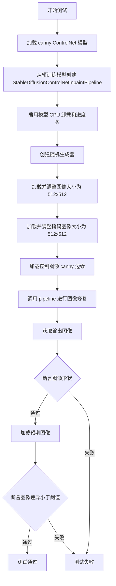

#### 带注释源码

```python
@slow  # 标记为慢速测试
@require_torch_accelerator  # 需要 CUDA 加速器
class ControlNetInpaintPipelineSlowTests(unittest.TestCase):
    def setUp(self):
        """测试前清理内存"""
        super().setUp()
        gc.collect()  # 垃圾回收
        backend_empty_cache(torch_device)  # 清空 GPU 缓存

    def tearDown(self):
        """测试后清理内存"""
        super().tearDown()
        gc.collect()
        backend_empty_cache(torch_device)

    def test_canny(self):
        """测试使用 canny 边缘检测 ControlNet 进行图像修复"""
        # 从预训练模型加载 canny 边缘检测 ControlNet
        controlnet = ControlNetModel.from_pretrained("lllyasviel/sd-controlnet-canny")

        # 创建图像修复 pipeline，禁用安全检查器
        pipe = StableDiffusionControlNetInpaintPipeline.from_pretrained(
            "botp/stable-diffusion-v1-5-inpainting", safety_checker=None, controlnet=controlnet
        )
        # 启用模型 CPU 卸载以节省显存
        pipe.enable_model_cpu_offload(device=torch_device)
        # 设置进度条配置
        pipe.set_progress_bar_config(disable=None)

        # 创建随机生成器，设置固定种子以保证可复现性
        generator = torch.Generator(device="cpu").manual_seed(0)
        
        # 加载输入图像并调整大小为 512x512
        image = load_image(
            "https://huggingface.co/lllyasviel/sd-controlnet-canny/resolve/main/images/bird.png"
        ).resize((512, 512))

        # 加载掩码图像并调整大小为 512x512
        mask_image = load_image(
            "https://huggingface.co/datasets/diffusers/test-arrays/resolve/main"
            "/stable_diffusion_inpaint/input_bench_mask.png"
        ).resize((512, 512))

        # 文本提示
        prompt = "pitch black hole"

        # 加载控制图像（canny 边缘）并调整大小
        control_image = load_image(
            "https://huggingface.co/datasets/hf-internal-testing/diffusers-images/resolve/main/sd_controlnet/bird_canny.png"
        ).resize((512, 512))

        # 调用 pipeline 进行推理
        output = pipe(
            prompt,
            image=image,
            mask_image=mask_image,
            control_image=control_image,
            generator=generator,
            output_type="np",
            num_inference_steps=3,
        )

        # 获取生成的图像
        image = output.images[0]

        # 断言输出图像形状为 (512, 512, 3)
        assert image.shape == (512, 512, 3)

        # 加载预期输出图像用于对比
        expected_image = load_numpy(
            "https://huggingface.co/datasets/hf-internal-testing/diffusers-images/resolve/main/sd_controlnet/inpaint.npy"
        )

        # 断言生成图像与预期图像的最大差异小于阈值 9e-2
        assert np.abs(expected_image - image).max() < 9e-2
```


### `torch_device`

全局变量，用于指定当前测试环境的默认 PyTorch 设备（如 "cuda"、"cpu" 或 "mps"），便于在测试中统一使用相同的计算设备。

参数： 无（全局变量，不接受函数参数）

返回值：`str`，返回设备名称字符串

#### 流程图

```mermaid
flowchart TD
    A[全局变量 torch_device] --> B[定义在 testing_utils 模块中]
    B --> C[被测试文件导入并使用]
    
    C --> D[作为条件判断依据]
    C --> E[创建 torch.device 对象]
    C --> F[作为张量/模型设备参数]
    
    D --> D1[判断是否 CUDA 设备]
    D --> D2[判断是否 MPS 设备]
    
    E --> E1[torch.device(torch_device)]
    E --> E2[torch.device(torch_device).type]
    
    F --> F1[device=torch.device(device)]
    F --> F2[to(device)]
```

#### 带注释源码

```
# torch_device 是从 testing_utils 模块导入的全局变量
# 它是一个字符串类型的值，表示默认的 PyTorch 设备

# 使用示例 1：条件判断（判断是否为 CUDA 设备）
@unittest.skipIf(
    torch_device != "cuda" or not is_xformers_available(),
    reason="XFormers attention is only available with CUDA and `xformers` installed",
)

# 使用示例 2：获取设备类型字符串
"device": torch.device(torch_device).type,

# 使用示例 3：创建生成器时指定设备
generator = torch.Generator(device=torch.device(device)).manual_seed(seed)

# 使用示例 4：作为模型/张量的目标设备
init_image = floats_tensor((1, 3, 32, 32), rng=random.Random(seed)).to(device)

# torch_device 的可能取值：
# - "cuda": NVIDIA GPU 设备
# - "cpu": 中央处理器
# - "mps": Apple Silicon (Metal Performance Shaders)
```


### `ControlNetInpaintPipelineFastTests.get_dummy_components`

该方法用于创建用于测试的虚拟（dummy）组件集合，初始化了Stable Diffusion ControlNet Inpaint Pipeline所需的所有模型组件（UNet、ControlNet、VAE、调度器、文本编码器和分词器），并设置相同的随机种子以确保测试的可重复性。

参数：

- `self`：隐式参数，类型为`ControlNetInpaintPipelineFastTests`（unittest.TestCase子类），代表测试类实例本身

返回值：`Dict[str, Any]`，返回一个包含以下键的字典：
- `unet`: UNet2DConditionModel 实例
- `controlnet`: ControlNetModel 实例
- `scheduler`: DDIMScheduler 实例
- `vae`: AutoencoderKL 实例
- `text_encoder`: CLIPTextModel 实例
- `tokenizer`: CLIPTokenizer 实例
- `safety_checker`: None
- `feature_extractor`: None
- `image_encoder`: None

这些组件用于实例化 `StableDiffusionControlNetInpaintPipeline` 进行单元测试。

#### 流程图

```mermaid
flowchart TD
    A[开始 get_dummy_components] --> B[设置随机种子 torch.manual_seed(0)]
    B --> C[创建 UNet2DConditionModel]
    C --> D[设置随机种子 torch.manual_seed(0)]
    D --> E[创建 ControlNetModel]
    E --> F[设置随机种子 torch.manual_seed(0)]
    F --> G[创建 DDIMScheduler]
    G --> H[设置随机种子 torch.manual_seed(0)]
    H --> I[创建 AutoencoderKL]
    I --> J[设置随机种子 torch.manual_seed(0)]
    J --> K[创建 CLIPTextConfig 和 CLIPTextModel]
    K --> L[创建 CLIPTokenizer]
    L --> M[组装 components 字典]
    M --> N[返回 components]
    N --> O[结束]
```

#### 带注释源码

```python
def get_dummy_components(self):
    """
    创建用于单元测试的虚拟组件集合。
    所有组件使用相同的随机种子(0)以确保测试的可重复性。
    """
    # 设置随机种子，确保UNet初始化可重复
    torch.manual_seed(0)
    # 创建UNet2DConditionModel实例，用于去噪过程
    # in_channels=9 表示输入包含: latents(4) + mask(1) + image_latents(4)
    unet = UNet2DConditionModel(
        block_out_channels=(32, 64),       # UNet各阶段的输出通道数
        layers_per_block=2,                  # 每个块中的层数
        sample_size=32,                     # 输入样本的空间尺寸
        in_channels=9,                       # 输入通道数 (latent+mask+image_latent)
        out_channels=4,                     # 输出通道数
        down_block_types=("DownBlock2D", "CrossAttnDownBlock2D"),  # 下采样块类型
        up_block_types=("CrossAttnUpBlock2D", "UpBlock2D"),        # 上采样块类型
        cross_attention_dim=32,             # 交叉注意力维度
    )
    
    # 重新设置随机种子，确保ControlNet初始化可重复
    torch.manual_seed(0)
    # 创建ControlNetModel实例，用于从控制图像提取条件特征
    controlnet = ControlNetModel(
        block_out_channels=(32, 64),       # ControlNet各阶段的输出通道数
        layers_per_block=2,                  # 每个块中的层数
        in_channels=4,                       # 输入通道数 (控制图像)
        down_block_types=("DownBlock2D", "CrossAttnDownBlock2D"),
        cross_attention_dim=32,             # 交叉注意力维度
        conditioning_embedding_out_channels=(16, 32),  # 条件嵌入输出通道
    )
    
    # 重新设置随机种子，确保调度器初始化可重复
    torch.manual_seed(0)
    # 创建DDIMScheduler实例，用于去噪调度
    scheduler = DDIMScheduler(
        beta_start=0.00085,                 # beta schedule 起始值
        beta_end=0.012,                     # beta schedule 结束值
        beta_schedule="scaled_linear",      # beta 调度方式
        clip_sample=False,                  # 是否裁剪采样
        set_alpha_to_one=False,             # 是否将alpha设置为1
    )
    
    # 重新设置随机种子，确保VAE初始化可重复
    torch.manual_seed(0)
    # 创建AutoencoderKL实例，用于图像的编码和解码
    vae = AutoencoderKL(
        block_out_channels=[32, 64],       # VAE各阶段的输出通道数
        in_channels=3,                      # 输入通道数 (RGB图像)
        out_channels=3,                     # 输出通道数
        down_block_types=["DownEncoderBlock2D", "DownEncoderBlock2D"],  # 下采样编码块
        up_block_types=["UpDecoderBlock2D", "UpDecoderBlock2D"],      # 上采样解码块
        latent_channels=4,                 # 潜在空间通道数
    )
    
    # 重新设置随机种子，确保文本编码器初始化可重复
    torch.manual_seed(0)
    # 创建CLIPTextConfig配置对象
    text_encoder_config = CLIPTextConfig(
        bos_token_id=0,                     # 句子开始token ID
        eos_token_id=2,                     # 句子结束token ID
        hidden_size=32,                     # 隐藏层维度
        intermediate_size=37,               # 中间层维度
        layer_norm_eps=1e-05,               # LayerNorm epsilon值
        num_attention_heads=4,              # 注意力头数
        num_hidden_layers=5,                # 隐藏层数量
        pad_token_id=1,                     # 填充token ID
        vocab_size=1000,                    # 词汇表大小
    )
    # 根据配置创建CLIPTextModel实例，用于将文本编码为嵌入
    text_encoder = CLIPTextModel(text_encoder_config)
    
    # 从预训练模型加载CLIPTokenizer实例，用于分词
    tokenizer = CLIPTokenizer.from_pretrained("hf-internal-testing/tiny-random-clip")
    
    # 组装所有组件到字典中
    components = {
        "unet": unet,                       # UNet去噪模型
        "controlnet": controlnet,           # ControlNet控制模型
        "scheduler": scheduler,            # 调度器
        "vae": vae,                         # VAE编码器/解码器
        "text_encoder": text_encoder,       # 文本编码器
        "tokenizer": tokenizer,             # 分词器
        "safety_checker": None,             # 安全检查器（测试中设为None）
        "feature_extractor": None,         # 特征提取器（测试中设为None）
        "image_encoder": None,              # 图像编码器（测试中设为None）
    }
    # 返回组件字典，用于实例化Pipeline
    return components
```


### `ControlNetInpaintPipelineFastTests.get_dummy_inputs`

该方法用于生成测试用的虚拟输入数据，包括控制图像、初始图像、掩码图像以及推理所需的各种参数，为 ControlNet 图像修复管道的单元测试提供必要的输入配置。

参数：

- `self`：`ControlNetInpaintPipelineFastTests`，测试类实例本身
- `device`：`torch.device`，目标设备，用于指定张量存放的设备（如 CPU 或 CUDA 设备）
- `seed`：`int`，随机种子，默认为 0，用于确保测试的可重复性

返回值：`Dict[str, Any]`，包含管道推理所需参数的字典，包括提示词、生成器、推理步数、引导尺度、输出类型、图像、掩码图像和控制图像

#### 流程图

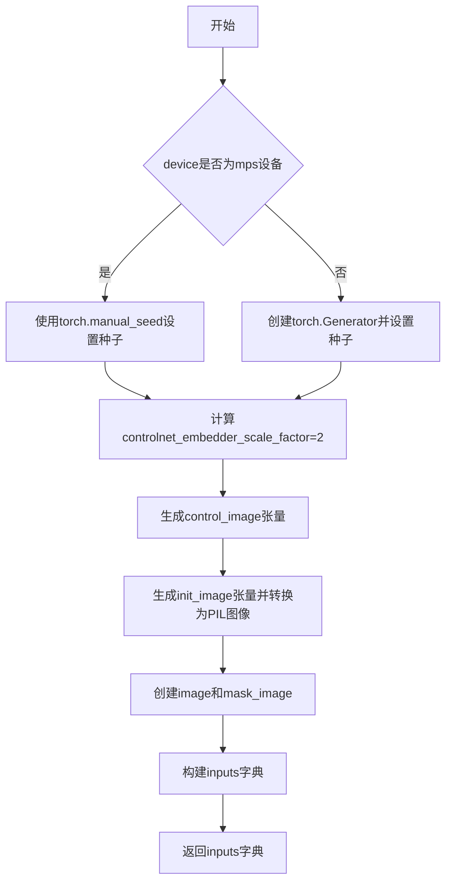

#### 带注释源码

```python
def get_dummy_inputs(self, device, seed=0):
    """
    生成用于测试的虚拟输入数据。
    
    参数:
        device: 目标设备 (torch.device)
        seed: 随机种子，用于确保测试可重复性
    
    返回:
        包含管道推理所需参数的字典
    """
    # 根据设备类型选择随机数生成方式
    # MPS (Apple Silicon) 需要特殊处理
    if str(device).startswith("mps"):
        # MPS 设备使用 torch.manual_seed
        generator = torch.manual_seed(seed)
    else:
        # 其他设备使用 torch.Generator
        generator = torch.Generator(device=device).manual_seed(seed)

    # 控制网嵌入器的缩放因子，用于确定控制图像的尺寸
    controlnet_embedder_scale_factor = 2
    
    # 生成随机控制图像张量 (1, 3, 64, 64)
    control_image = randn_tensor(
        (1, 3, 32 * controlnet_embedder_scale_factor, 32 * controlnet_embedder_scale_factor),
        generator=generator,
        device=torch.device(device),
    )
    
    # 生成初始图像张量 (1, 3, 32, 32) 并转换为 PIL 图像
    init_image = floats_tensor((1, 3, 32, 32), rng=random.Random(seed)).to(device)
    init_image = init_image.cpu().permute(0, 2, 3, 1)[0]

    # 将张量转换为 PIL 图像并调整大小为 64x64
    image = Image.fromarray(np.uint8(init_image)).convert("RGB").resize((64, 64))
    # 掩码图像在原始值基础上加 4，用于区分掩码区域
    mask_image = Image.fromarray(np.uint8(init_image + 4)).convert("RGB").resize((64, 64))

    # 构建输入参数字典
    inputs = {
        "prompt": "A painting of a squirrel eating a burger",  # 文本提示
        "generator": generator,                                  # 随机生成器
        "num_inference_steps": 2,                                 # 推理步数
        "guidance_scale": 6.0,                                    # 引导尺度
        "output_type": "np",                                      # 输出类型为 numpy
        "image": image,                                           # 输入图像
        "mask_image": mask_image,                                 # 掩码图像
        "control_image": control_image,                          # 控制图像
    }

    return inputs
```


### `ControlNetInpaintPipelineFastTests.test_attention_slicing_forward_pass`

该方法是 `ControlNetInpaintPipelineFastTests` 类中的单元测试方法，用于测试 ControlNet Inpaint Pipeline 在使用注意力切片（Attention Slicing）优化技术下的前向传播是否正常工作，通过对比标准前向传播和启用注意力切片后的前向传播结果的差异来验证功能的正确性。

参数：

- `self`：隐式参数，类型为 `ControlNetInpaintPipelineFastTests`（测试类实例），表示调用该方法的测试类实例本身

返回值：`bool`，返回父类 `_test_attention_slicing_forward_pass` 方法的返回值，通常表示测试是否通过（True 表示通过）

#### 流程图

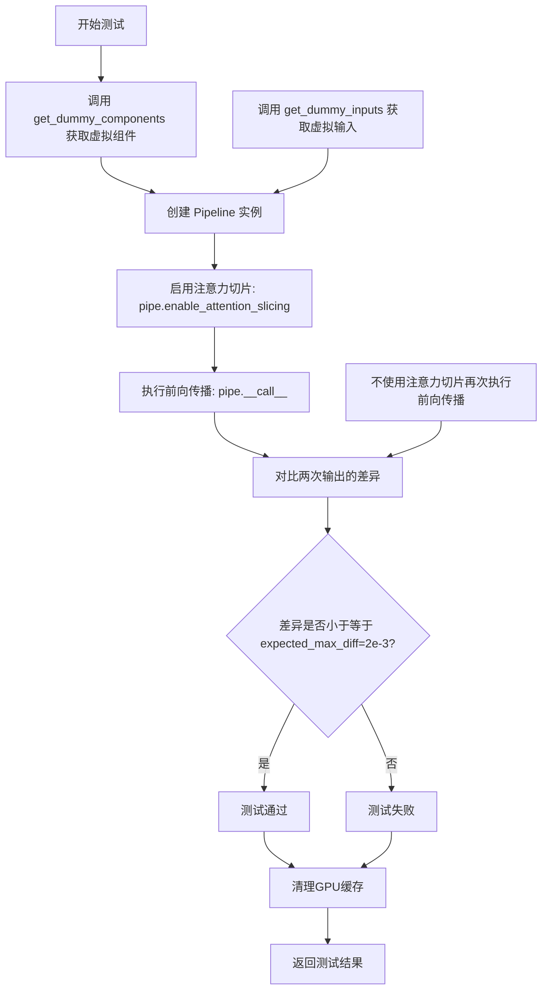

#### 带注释源码

```python
def test_attention_slicing_forward_pass(self):
    """
    测试使用注意力切片（Attention Slicing）技术的前向传播是否正常工作。
    
    注意力切片是一种内存优化技术，通过将注意力计算分片处理来减少显存占用。
    该测试方法验证启用该技术后，Pipeline仍能产生正确的结果。
    
    Returns:
        bool: 测试结果，由父类方法返回，通常为True表示测试通过
    """
    # 调用父类/混入类中的 _test_attention_slicing_forward_pass 方法
    # expected_max_diff=2e-3 表示允许的最大差异阈值
    return self._test_attention_slicing_forward_pass(expected_max_diff=2e-3)
```


### `ControlNetInpaintPipelineFastTests.test_xformers_attention_forwardGenerator_pass`

该测试方法用于验证 ControlNet 修复管道在使用 XFormers 注意力机制时的前向传播是否正确。它通过调用父类方法 `_test_xformers_attention_forwardGenerator_pass` 进行测试，并设置允许的最大差异阈值为 2e-3。

参数：

- `self`：`ControlNetInpaintPipelineFastTests`，测试类的实例，表示当前测试对象

返回值：`None`，该方法为 `unittest.TestCase` 的测试方法，不返回任何值，仅通过断言验证结果

#### 流程图

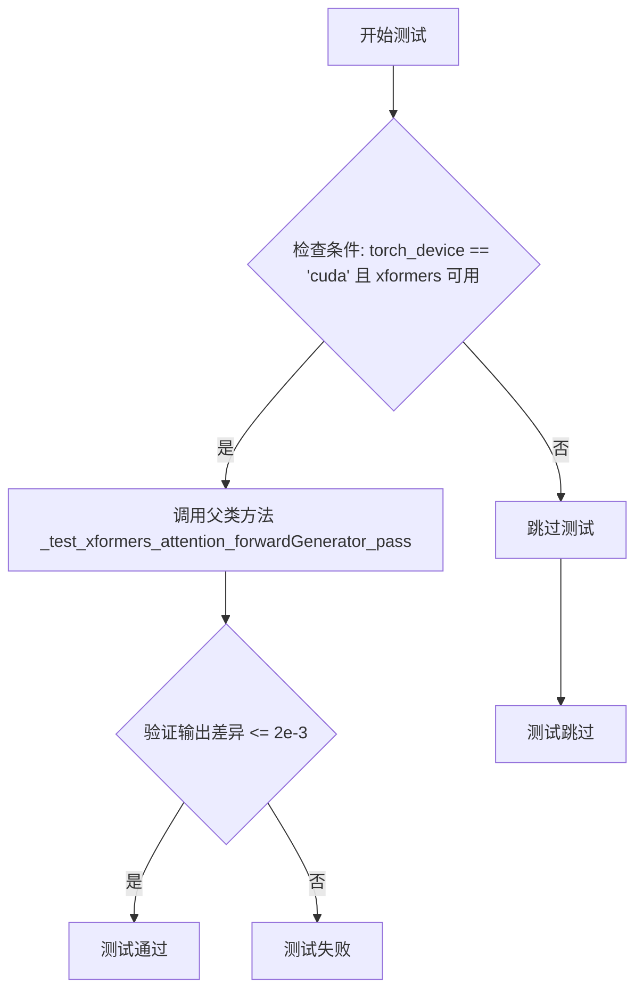

#### 带注释源码

```python
@unittest.skipIf(
    torch_device != "cuda" or not is_xformers_available(),
    reason="XFormers attention is only available with CUDA and `xformers` installed",
)
def test_xformers_attention_forwardGenerator_pass(self):
    """
    测试 XFormers 注意力机制的前向传播是否正确
    
    该测试方法仅在以下条件满足时执行：
    1. torch_device 为 'cuda'
    2. xformers 库可用
    
    测试通过调用父类方法 _test_xformers_attention_forwardGenerator_pass 来验证
    管道输出与预期值之间的差异是否在允许的范围内（expected_max_diff=2e-3）
    """
    # 调用父类的测试方法，验证 xformers 注意力机制的正确性
    # expected_max_diff=2e-3 表示允许的最大差异为 0.002
    self._test_xformers_attention_forwardGenerator_pass(expected_max_diff=2e-3)
```


### `ControlNetInpaintPipelineFastTests.test_inference_batch_single_identical`

该方法是 `ControlNetInpaintPipelineFastTests` 类的测试方法，用于验证 Stable Diffusion ControlNet Inpainting Pipeline 在批量推理（batch inference）与单样本推理（single inference）模式下产生的输出是否一致，确保模型的去噪过程在两种推理模式下具有确定性。

参数：

- `self`：`ControlNetInpaintPipelineFastTests` 类型，表示测试类实例本身，无需显式传递

返回值：`None`，该方法为测试方法，不返回任何值

#### 流程图

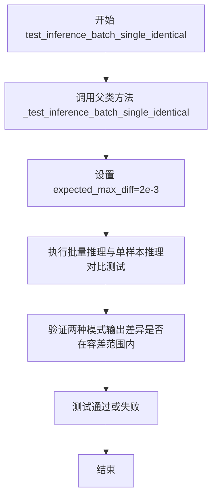

#### 带注释源码

```python
def test_inference_batch_single_identical(self):
    """
    测试方法：验证批量推理与单样本推理的输出一致性
    
    该方法继承自 PipelineTesterMixin 测试基类，通过调用父类的
    _test_inference_batch_single_identical 方法来执行测试。
    测试的核心思想是：
    1. 使用相同的随机种子和参数进行单样本推理
    2. 使用相同的随机种子和参数进行批量推理（batch_size=1）
    3. 验证两种推理方式的输出差异小于指定的容差阈值
    
    参数容差：expected_max_diff=2e-3，即最大允许差异为 0.002
    这确保了模型在两种推理模式下具有确定性行为。
    """
    # 调用父类的测试方法，expected_max_diff=2e-3 表示
    # 批量推理与单样本推理的输出差异应小于 0.002
    self._test_inference_batch_single_identical(expected_max_diff=2e-3)
```


### `ControlNetInpaintPipelineFastTests.test_encode_prompt_works_in_isolation`

该方法是一个测试用例，用于验证 `encode_prompt` 功能能否在隔离环境中正常工作。它通过构建额外的必需参数字典（包含设备和 classifier-free guidance 标志），并将其传递给父类的测试方法来实现这一目标。

参数：

- `self`：隐式参数，测试类的实例

返回值：`Any`，返回父类 `test_encode_prompt_works_in_isolation` 方法的执行结果（通常为测试通过/失败状态）

#### 流程图

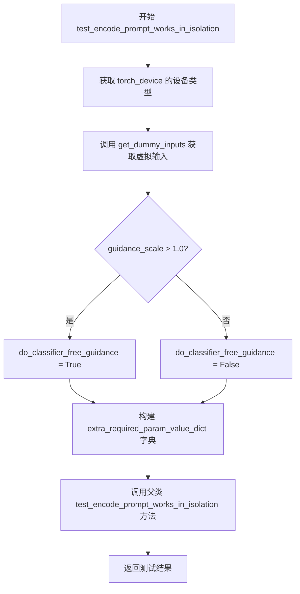

#### 带注释源码

```python
def test_encode_prompt_works_in_isolation(self):
    """
    测试 encode_prompt 在隔离环境中是否能正常工作
    
    该方法覆盖了父类的测试方法，添加了额外的必需参数：
    - device: 当前测试设备类型（如 'cuda' 或 'cpu'）
    - do_classifier_free_guidance: 是否启用 classifier-free guidance
    """
    # 构建包含额外必需参数的字典
    # 用于满足父类测试方法对特定参数的要求
    extra_required_param_value_dict = {
        # 获取当前设备类型（如 'cuda', 'cpu', 'mps' 等）
        "device": torch.device(torch_device).type,
        # 根据 guidance_scale 判断是否启用 classifier-free guidance
        # 默认阈值为 1.0，大于 1.0 时启用
        "do_classifier_free_guidance": self.get_dummy_inputs(device=torch_device).get("guidance_scale", 1.0) > 1.0,
    }
    # 调用父类的测试方法，传入额外参数
    # 父类方法继承自 PipelineTesterMixin 或类似的测试混入类
    return super().test_encode_prompt_works_in_isolation(extra_required_param_value_dict)
```


### `ControlNetSimpleInpaintPipelineFastTests.get_dummy_components`

该方法用于创建用于单元测试的虚拟（dummy）组件，包括 UNet、ControlNet、调度器、VAE、文本编码器和分词器等核心模型组件，并返回一个包含所有组件的字典，以供 `StableDiffusionControlNetInpaintPipeline` 初始化使用。

参数：

- 该方法无参数（`self` 为实例自身，不计入参数）

返回值：`Dict[str, Any]`，返回一个字典，包含以下键值对：
- `"unet"`：UNet2DConditionModel 实例，用于图像生成的去噪网络
- `"controlnet"`：ControlNetModel 实例，用于条件控制的神经网络
- `"scheduler"`：DDIMScheduler 实例，控制去噪采样调度
- `"vae"`：AutoencoderKL 实例，变分自编码器用于潜在空间编码
- `"text_encoder"`：CLIPTextModel 实例，文本编码器将文本转换为嵌入
- `"tokenizer"`：CLIPTokenizer 实例，分词器用于文本预处理
- `"safety_checker"`：None，安全检查器（测试中禁用）
- `"feature_extractor"`：None，特征提取器（测试中禁用）
- `"image_encoder"`：None，图像编码器（测试中禁用）

#### 流程图

```mermaid
flowchart TD
    A[开始 get_dummy_components] --> B[设置随机种子 torch.manual_seed(0)]
    B --> C[创建 UNet2DConditionModel]
    C --> D[设置随机种子 torch.manual_seed(0)]
    D --> E[创建 ControlNetModel]
    E --> F[设置随机种子 torch.manual_seed(0)]
    F --> G[创建 DDIMScheduler]
    G --> H[设置随机种子 torch.manual_seed(0)]
    H --> I[创建 AutoencoderKL]
    I --> J[设置随机种子 torch.manual_seed(0)]
    J --> K[创建 CLIPTextConfig 和 CLIPTextModel]
    K --> L[创建 CLIPTokenizer]
    L --> M[构建 components 字典]
    M --> N[返回 components 字典]
```

#### 带注释源码

```python
def get_dummy_components(self):
    """
    创建用于测试的虚拟组件，包括 UNet、ControlNet、调度器、VAE 等模型组件。
    所有组件使用固定的随机种子以确保测试可复现。
    """
    # 设置随机种子确保 UNet 创建的可复现性
    torch.manual_seed(0)
    # 创建 UNet2DConditionModel：用于图像去噪的条件扩散 UNet
    # in_channels=4：适配 ControlNet Inpainting 的输入（masked image + mask）
    unet = UNet2DConditionModel(
        block_out_channels=(32, 64),
        layers_per_block=2,
        sample_size=32,
        in_channels=4,  # 控制输入通道数（原版是9，这里简化为4）
        out_channels=4,
        down_block_types=("DownBlock2D", "CrossAttnDownBlock2D"),
        up_block_types=("CrossAttnUpBlock2D", "UpBlock2D"),
        cross_attention_dim=32,
    )
    
    # 设置随机种子确保 ControlNet 创建的可复现性
    torch.manual_seed(0)
    # 创建 ControlNetModel：用于从控制图像提取条件的控制网络
    controlnet = ControlNetModel(
        block_out_channels=(32, 64),
        layers_per_block=2,
        in_channels=4,  # 输入为 RGB 控制图像（3通道）+ 1通道 = 4
        down_block_types=("DownBlock2D", "CrossAttnDownBlock2D"),
        cross_attention_dim=32,
        conditioning_embedding_out_channels=(16, 32),
    )
    
    # 设置随机种子确保调度器创建的可复现性
    torch.manual_seed(0)
    # 创建 DDIMScheduler：DDIM 采样调度器，用于控制去噪过程
    scheduler = DDIMScheduler(
        beta_start=0.00085,
        beta_end=0.012,
        beta_schedule="scaled_linear",
        clip_sample=False,
        set_alpha_to_one=False,
    )
    
    # 设置随机种子确保 VAE 创建的可复现性
    torch.manual_seed(0)
    # 创建 AutoencoderKL：变分自编码器，用于图像与潜在表示之间的转换
    vae = AutoencoderKL(
        block_out_channels=[32, 64],
        in_channels=3,
        out_channels=3,
        down_block_types=["DownEncoderBlock2D", "DownEncoderBlock2D"],
        up_block_types=["UpDecoderBlock2D", "UpDecoderBlock2D"],
        latent_channels=4,
    )
    
    # 设置随机种子确保文本编码器创建的可复现性
    torch.manual_seed(0)
    # 创建 CLIPTextConfig：CLIP 文本编码器的配置参数
    text_encoder_config = CLIPTextConfig(
        bos_token_id=0,
        eos_token_id=2,
        hidden_size=32,
        intermediate_size=37,
        layer_norm_eps=1e-05,
        num_attention_heads=4,
        num_hidden_layers=5,
        pad_token_id=1,
        vocab_size=1000,
    )
    # 创建 CLIPTextModel：基于 CLIP 的文本编码器，将文本转换为嵌入向量
    text_encoder = CLIPTextModel(text_encoder_config)
    # 创建 CLIPTokenizer：用于将文本分词为 token 序列
    tokenizer = CLIPTokenizer.from_pretrained("hf-internal-testing/tiny-random-clip")

    # 组装所有组件为字典，用于管道初始化
    components = {
        "unet": unet,
        "controlnet": controlnet,
        "scheduler": scheduler,
        "vae": vae,
        "text_encoder": text_encoder,
        "tokenizer": tokenizer,
        "safety_checker": None,  # 测试中禁用安全检查器
        "feature_extractor": None,  # 测试中禁用特征提取器
        "image_encoder": None,  # 测试中禁用图像编码器
    }
    return components
```


### `MultiControlNetInpaintPipelineFastTests.get_dummy_components`

该方法用于创建并返回多控制网络（Multi-ControlNet）修复管道的虚拟测试组件，包括UNet模型、两个ControlNet模型、调度器、VAE、文本编码器和分词器等，用于单元测试。

参数： 无（仅包含隐式参数 `self`）

返回值：`dict`，返回一个包含以下键的字典：
- `unet`: UNet2DConditionModel 实例
- `controlnet`: MultiControlNetModel 实例（包含两个ControlNetModel）
- `scheduler`: DDIMScheduler 实例
- `vae`: AutoencoderKL 实例
- `text_encoder`: CLIPTextModel 实例
- `tokenizer`: CLIPTokenizer 实例
- `safety_checker`: None
- `feature_extractor`: None
- `image_encoder`: None

#### 流程图

```mermaid
flowchart TD
    A[开始 get_dummy_components] --> B[设置随机种子 torch.manual_seed(0)]
    B --> C[创建 UNet2DConditionModel]
    C --> D[定义 init_weights 函数]
    D --> E[创建 controlnet1]
    E --> F[对 controlnet1 应用权重初始化]
    F --> G[创建 controlnet2]
    G --> H[对 controlnet2 应用权重初始化]
    H --> I[创建 DDIMScheduler]
    I --> J[创建 AutoencoderKL VAE]
    J --> K[创建 CLIPTextConfig]
    K --> L[创建 CLIPTextModel]
    L --> M[创建 CLIPTokenizer]
    M --> N[创建 MultiControlNetModel 组合两个控制网络]
    N --> O[构建 components 字典]
    O --> P[返回 components]
```

#### 带注释源码

```python
def get_dummy_components(self):
    """创建并返回多控制网络修复管道的虚拟测试组件"""
    
    # 设置随机种子以确保结果可复现
    torch.manual_seed(0)
    
    # 创建 UNet2DConditionModel - 用于去噪的UNet模型
    # 参数说明：
    # - block_out_channels: 输出通道数列表 [32, 64]
    # - layers_per_block: 每个块的层数 2
    # - sample_size: 样本尺寸 32
    # - in_channels: 输入通道数 9 (4+4+1，用于控制网图像+mask+噪声)
    # - out_channels: 输出通道数 4
    # - down_block_types: 下采样块类型
    # - up_block_types: 上采样块类型
    # - cross_attention_dim: 交叉注意力维度 32
    unet = UNet2DConditionModel(
        block_out_channels=(32, 64),
        layers_per_block=2,
        sample_size=32,
        in_channels=9,
        out_channels=4,
        down_block_types=("DownBlock2D", "CrossAttnDownBlock2D"),
        up_block_types=("CrossAttnUpBlock2D", "UpBlock2D"),
        cross_attention_dim=32,
    )
    
    # 重新设置随机种子
    torch.manual_seed(0)

    # 定义权重初始化函数，用于初始化卷积层的权重
    # 参数 m: 神经网络模块
    def init_weights(m):
        if isinstance(m, torch.nn.Conv2d):
            # 使用正态分布初始化权重
            torch.nn.init.normal_(m.weight)
            # 将偏置填充为1.0
            m.bias.data.fill_(1.0)

    # 创建第一个 ControlNetModel
    # ControlNet 是用于生成控制图像条件的模型
    controlnet1 = ControlNetModel(
        block_out_channels=(32, 64),
        layers_per_block=2,
        in_channels=4,  # 输入通道数
        down_block_types=("DownBlock2D", "CrossAttnDownBlock2D"),
        cross_attention_dim=32,
        conditioning_embedding_out_channels=(16, 32),  # 条件嵌入输出通道
    )
    # 对第一个控制网的down blocks应用权重初始化
    controlnet1.controlnet_down_blocks.apply(init_weights)

    # 重新设置随机种子
    torch.manual_seed(0)
    
    # 创建第二个 ControlNetModel（与第一个结构相同）
    controlnet2 = ControlNetModel(
        block_out_channels=(32, 64),
        layers_per_block=2,
        in_channels=4,
        down_block_types=("DownBlock2D", "CrossAttnDownBlock2D"),
        cross_attention_dim=32,
        conditioning_embedding_out_channels=(16, 32),
    )
    # 对第二个控制网的down blocks应用权重初始化
    controlnet2.controlnet_down_blocks.apply(init_weights)

    # 重新设置随机种子
    torch.manual_seed(0)
    
    # 创建 DDIMScheduler - 用于扩散模型的调度器
    # 参数说明：
    # - beta_start: beta起始值
    # - beta_end: beta结束值
    # - beta_schedule: beta调度方式
    # - clip_sample: 是否裁剪样本
    # - set_alpha_to_one: 是否设置alpha为1
    scheduler = DDIMScheduler(
        beta_start=0.00085,
        beta_end=0.012,
        beta_schedule="scaled_linear",
        clip_sample=False,
        set_alpha_to_one=False,
    )
    
    # 重新设置随机种子
    torch.manual_seed(0)
    
    # 创建 AutoencoderKL - VAE模型用于编码/解码图像
    vae = AutoencoderKL(
        block_out_channels=[32, 64],
        in_channels=3,    # RGB图像3通道
        out_channels=3,
        down_block_types=["DownEncoderBlock2D", "DownEncoderBlock2D"],
        up_block_types=["UpDecoderBlock2D", "UpDecoderBlock2D"],
        latent_channels=4,  # 潜在空间通道数
    )
    
    # 重新设置随机种子
    torch.manual_seed(0)
    
    # 创建 CLIPTextConfig - 文本编码器的配置
    text_encoder_config = CLIPTextConfig(
        bos_token_id=0,        # 句子开始token id
        eos_token_id=2,        # 句子结束token id
        hidden_size=32,        # 隐藏层大小
        intermediate_size=37, # 中间层大小
        layer_norm_eps=1e-05,  # 层归一化epsilon
        num_attention_heads=4, # 注意力头数
        num_hidden_layers=5,   # 隐藏层数量
        pad_token_id=1,        # 填充token id
        vocab_size=1000,       # 词汇表大小
    )
    
    # 创建 CLIPTextModel - 文本编码器模型
    text_encoder = CLIPTextModel(text_encoder_config)
    
    # 创建 CLIPTokenizer - 文本分词器
    # 从预训练模型加载一个小型随机分词器用于测试
    tokenizer = CLIPTokenizer.from_pretrained("hf-internal-testing/tiny-random-clip")

    # 使用 MultiControlNetModel 将两个控制网络组合在一起
    # 这允许在推理时使用多个控制条件
    controlnet = MultiControlNetModel([controlnet1, controlnet2])

    # 构建组件字典，包含所有需要传递给管道的组件
    components = {
        "unet": unet,
        "controlnet": controlnet,  # MultiControlNetModel 实例
        "scheduler": scheduler,
        "vae": vae,
        "text_encoder": text_encoder,
        "tokenizer": tokenizer,
        "safety_checker": None,    # 安全检查器设置为None
        "feature_extractor": None, # 特征提取器设置为None
        "image_encoder": None,     # 图像编码器设置为None
    }
    
    # 返回包含所有虚拟组件的字典
    return components
```


### `MultiControlNetInpaintPipelineFastTests.get_dummy_inputs`

该方法用于为 Multi-ControlNet 图像修复管道生成虚拟输入数据，包括文本提示、图像、掩码图像和多个控制图像，用于测试管道的各项功能。

参数：

- `self`：隐式参数，表示类的实例本身
- `device`：`torch.device`，指定生成张量所在的设备（如 CPU 或 CUDA 设备）
- `seed`：`int`，随机种子，默认值为 0，用于确保测试的可重复性

返回值：`Dict[str, Any]`，返回一个包含所有管道输入参数的字典，包括 prompt、generator、num_inference_steps、guidance_scale、output_type、image、mask_image 和 control_image

#### 流程图

```mermaid
flowchart TD
    A[开始 get_dummy_inputs] --> B{设备是否为 MPS?}
    B -->|是| C[使用 torch.manual_seed]
    B -->|否| D[创建 torch.Generator 并设置种子]
    C --> E[设置 controlnet_embedder_scale_factor=2]
    D --> E
    E --> F[生成两个控制图像张量]
    F --> G[生成初始图像浮点张量]
    G --> H[转换为 PIL Image 并调整大小]
    I[创建掩码图像] --> J[构建输入字典]
    H --> I
    J --> K[返回输入字典]
```

#### 带注释源码

```python
def get_dummy_inputs(self, device, seed=0):
    """
    为 Multi-ControlNet 图像修复管道生成虚拟输入参数
    
    参数:
        device: torch.device - 计算设备
        seed: int - 随机种子，默认为 0
    
    返回:
        Dict[str, Any]: 包含管道推理所需的所有输入参数
    """
    
    # 根据设备类型选择随机数生成器
    # MPS (Metal Performance Shaders) 需要特殊处理
    if str(device).startswith("mps"):
        generator = torch.manual_seed(seed)
    else:
        # 为其他设备创建 Generator 对象
        generator = torch.Generator(device=device).manual_seed(seed)

    # 控制网络嵌入器的缩放因子，用于计算控制图像尺寸
    controlnet_embedder_scale_factor = 2

    # 生成两个控制图像（Multi-ControlNet 支持多个控制条件）
    # 每个控制图像的尺寸为 64x64 (32 * 2 = 64)
    control_image = [
        randn_tensor(
            (1, 3, 32 * controlnet_embedder_scale_factor, 32 * controlnet_embedder_scale_factor),
            generator=generator,
            device=torch.device(device),
        ),
        randn_tensor(
            (1, 3, 32 * controlnet_embedder_scale_factor, 32 * controlnet_embedder_scale_factor),
            generator=generator,
            device=torch.device(device),
        ),
    ]
    
    # 生成初始图像的浮点张量，形状为 (1, 3, 32, 32)
    init_image = floats_tensor((1, 3, 32, 32), rng=random.Random(seed)).to(device)
    
    # 将张量从 CHW 格式转换为 HWC 格式，并去除批次维度
    init_image = init_image.cpu().permute(0, 2, 3, 1)[0]

    # 将浮点图像转换为 PIL Image 对象并调整大小
    # 原始图像和掩码图像都调整为 64x64
    image = Image.fromarray(np.uint8(init_image)).convert("RGB").resize((64, 64))
    
    # 掩码图像通过在原始图像值上加 4 来创建，确保有不同的像素值
    mask_image = Image.fromarray(np.uint8(init_image + 4)).convert("RGB").resize((64, 64))

    # 构建完整的输入参数字典
    inputs = {
        "prompt": "A painting of a squirrel eating a burger",  # 文本提示
        "generator": generator,                                 # 随机数生成器
        "num_inference_steps": 2,                               # 推理步数
        "guidance_scale": 6.0,                                  # cfg 引导强度
        "output_type": "np",                                    # 输出类型为 numpy
        "image": image,                                         # 输入图像
        "mask_image": mask_image,                               # 掩码图像
        "control_image": control_image,                         # 控制图像列表
    }

    return inputs
```


### `MultiControlNetInpaintPipelineFastTests.test_control_guidance_switch`

该方法是一个单元测试，用于验证 Multi-ControlNet 管道中控制引导（Control Guidance）的切换功能是否正常工作。测试通过比较不同控制引导参数下的输出差异，确保控制引导的动态调整功能（control_guidance_start 和 control_guidance_end）能够正确影响图像生成过程。

参数：

- `self`：隐式参数，测试类实例本身

返回值：`None`，该方法为测试方法，通过断言验证功能，不返回具体值

#### 流程图

```mermaid
flowchart TD
    A[开始测试 test_control_guidance_switch] --> B[获取虚拟组件 components]
    B --> C[创建管道实例 pipe 并移至 torch_device]
    D[设置固定参数 scale=10.0, steps=4] --> E[获取虚拟输入 inputs]
    E --> F[调用管道生成 output_1: 无特殊控制引导参数]
    F --> G[再次获取虚拟输入]
    G --> H[调用管道生成 output_2: control_guidance_start=0.1, control_guidance_end=0.2]
    H --> I[再次获取虚拟输入]
    I --> J[调用管道生成 output_3: control_guidance_start=[0.1, 0.3], control_guidance_end=[0.2, 0.7]]
    J --> K[再次获取虚拟输入]
    K --> L[调用管道生成 output_4: control_guidance_start=0.4, control_guidance_end=[0.5, 0.8]]
    L --> M[断言验证 output_1 与 output_2 差异大于阈值]
    M --> N[断言验证 output_1 与 output_3 差异大于阈值]
    N --> O[断言验证 output_1 与 output_4 差异大于阈值]
    O --> P[测试结束]
```

#### 带注释源码

```python
def test_control_guidance_switch(self):
    """
    测试 Multi-ControlNet 管道中控制引导切换功能
    
    该测试验证以下场景：
    1. 无控制引导参数（使用默认值）
    2. 单一控制引导时间范围（start/end 为单个浮点数）
    3. 多控制引导时间范围（start/end 为列表，支持多个 ControlNet）
    4. 混合模式（单个 start，多个 end）
    """
    # 步骤1: 获取虚拟组件（UNet, ControlNet, Scheduler, VAE, TextEncoder, Tokenizer 等）
    components = self.get_dummy_components()
    
    # 步骤2: 使用虚拟组件创建 StableDiffusionControlNetInpaintPipeline 管道实例
    pipe = self.pipeline_class(**components)
    
    # 步骤3: 将管道移至测试设备（cuda 或 cpu）
    pipe.to(torch_device)

    # 步骤4: 设置测试参数
    scale = 10.0  # controlnet_conditioning_scale，控制引导强度
    steps = 4     # 推理步数

    # 场景1: 无控制引导参数（使用默认的 control_guidance_start=0, control_guidance_end=1）
    inputs = self.get_dummy_inputs(torch_device)
    inputs["num_inference_steps"] = steps
    inputs["controlnet_conditioning_scale"] = scale
    output_1 = pipe(**inputs)[0]  # 获取第一张生成的图像

    # 场景2: 使用单一控制引导时间范围 [0.1, 0.2]
    inputs = self.get_dummy_inputs(torch_device)
    inputs["num_inference_steps"] = steps
    inputs["controlnet_conditioning_scale"] = scale
    # control_guidance_start: 开始应用控制的推理步骤比例
    # control_guidance_end: 结束应用控制的推理步骤比例
    output_2 = pipe(**inputs, control_guidance_start=0.1, control_guidance_end=0.2)[0]

    # 场景3: 使用多 ControlNet 的控制引导时间范围
    inputs = self.get_dummy_inputs(torch_device)
    inputs["num_inference_steps"] = steps
    inputs["controlnet_conditioning_scale"] = scale
    # 为每个 ControlNet 设置不同的引导时间范围
    # ControlNet1: [0.1, 0.2], ControlNet2: [0.3, 0.7]
    output_3 = pipe(**inputs, control_guidance_start=[0.1, 0.3], control_guidance_end=[0.2, 0.7])[0]

    # 场景4: 混合模式（单个 start 值，多个 end 值）
    inputs = self.get_dummy_inputs(torch_device)
    inputs["num_inference_steps"] = steps
    inputs["controlnet_conditioning_scale"] = scale
    # start 为单个值 0.4，end 为多个值 [0.5, 0.8]
    output_4 = pipe(**inputs, control_guidance_start=0.4, control_guidance_end=[0.5, 0.8])[0]

    # 步骤5: 验证所有输出之间存在显著差异
    # 确保控制引导参数的改变确实影响了输出结果
    # 使用 L1 范数（绝对值之和）衡量差异，并设置最小阈值 1e-3
    assert np.sum(np.abs(output_1 - output_2)) > 1e-3, "Output 1 and 2 should be different"
    assert np.sum(np.abs(output_1 - output_3)) > 1e-3, "Output 1 and 3 should be different"
    assert np.sum(np.abs(output_1 - output_4)) > 1e-3, "Output 1 and 4 should be different"
```


### `MultiControlNetInpaintPipelineFastTests.test_attention_slicing_forward_pass`

这是一个测试方法，用于验证 MultiControlNet（多控制网络）图像修复管道的注意力切片前向传播是否正常工作。该方法通过调用父类混入的 `_test_attention_slicing_forward_pass` 方法来执行测试，并设置预期最大误差阈值为 2e-3，以确保注意力切片功能的数值精度符合要求。

参数：

- `self`：隐式参数，代表 `MultiControlNetInpaintPipelineFastTests` 类的实例对象，无显式类型描述

返回值：`None`，该方法为单元测试方法，通常不返回有意义的值，主要通过断言或内部逻辑验证测试是否通过

#### 流程图

```mermaid
flowchart TD
    A[开始测试 test_attention_slicing_forward_pass] --> B[调用父类方法 _test_attention_slicing_forward_pass]
    B --> C[设置 expected_max_diff=2e-3 参数]
    C --> D[执行注意力切片前向传播测试]
    D --> E{测试结果是否在预期误差范围内}
    E -->|是| F[测试通过]
    E -->|否| G[测试失败，抛出断言错误]
    F --> H[结束]
    G --> H
```

#### 带注释源码

```python
def test_attention_slicing_forward_pass(self):
    """
    测试 MultiControlNet 图像修复流水线的注意力切片前向传播功能。
    
    该测试方法继承自 PipelineTesterMixin，通过调用 _test_attention_slicing_forward_pass
    来验证在使用注意力切片优化时，管道能否正确执行前向传播并保持数值精度。
    注意力切片是一种内存优化技术，通过将注意力计算分块来减少显存占用。
    
    参数:
        self: MultiControlNetInpaintPipelineFastTests 实例
        
    返回:
        None: 测试方法不返回具体值，通过内部断言判断测试是否通过
        
    异常:
        AssertionError: 当输出结果与基准值的差异超过 expected_max_diff 时抛出
    """
    # 调用父类混入的测试方法，expected_max_diff=2e-3 表示允许的最大数值误差
    return self._test_attention_slicing_forward_pass(expected_max_diff=2e-3)
```


### `MultiControlNetInpaintPipelineFastTests.test_xformers_attention_forwardGenerator_pass`

该方法是一个单元测试用例，用于验证在 CUDA 环境下启用 xformers 注意力机制时，MultiControlNet 图像修复管道的正向传播是否正确。它通过调用测试工具类的通用测试方法 `_test_xformers_attention_forwardGenerator_pass` 来执行验证，并设置期望的最大误差阈值为 2e-3。

参数：无需显式参数（继承自 unittest.TestCase）

返回值：`None`，该方法为测试用例，执行后通过断言验证结果

#### 流程图

```mermaid
flowchart TD
    A[开始测试] --> B{检查条件: CUDA环境且xformers可用?}
    B -->|否| C[跳过测试]
    B -->|是| D[调用_test_xformers_attention_forwardGenerator_pass方法]
    D --> E[设置expected_max_diff=2e-3]
    E --> F[执行xformers注意力前向传播测试]
    F --> G{输出误差是否在阈值内?}
    G -->|是| H[测试通过]
    G -->|否| I[测试失败/抛出异常]
    H --> J[结束]
    I --> J
    C --> J
```

#### 带注释源码

```python
@unittest.skipIf(
    torch_device != "cuda" or not is_xformers_available(),
    reason="XFormers attention is only available with CUDA and `xformers` installed",
)
def test_xformers_attention_forwardGenerator_pass(self):
    """
    测试方法：验证 xformers 注意力机制的前向传播
    
    该测试方法有以下特点：
    1. 使用 @unittest.skipIf 装饰器进行条件跳过
       - 仅在 CUDA 环境下运行
       - 仅在 xformers 库已安装时运行
    2. 调用测试工具类的方法执行实际测试
    3. 期望最大误差为 2e-3
    """
    # 调用测试工具类中定义的实际测试实现
    # expected_max_diff=2e-3 表示期望输出与参考输出的最大差异为 2e-3
    self._test_xformers_attention_forwardGenerator_pass(expected_max_diff=2e-3)
```


### `MultiControlNetInpaintPipelineFastTests.test_inference_batch_single_identical`

该方法是 `MultiControlNetInpaintPipelineFastTests` 类的测试方法，用于验证 StableDiffusionControlNetInpaintPipeline 在单次推理和批量推理时输出结果的一致性，确保管道在两种模式下产生相同的图像结果。

参数：

- `self`：`MultiControlNetInpaintPipelineFastTests`，表示类的实例本身

返回值：`None`，该方法为测试方法，通过断言验证推理结果一致性，不返回具体值

#### 流程图

```mermaid
flowchart TD
    A[开始 test_inference_batch_single_identical] --> B[调用父类方法 _test_inference_batch_single_identical]
    B --> C[传入 expected_max_diff=2e-3 参数]
    C --> D[执行批处理推理一致性测试]
    D --> E{输出差异是否在阈值内}
    E -->|是| F[测试通过]
    E -->|否| G[测试失败, 抛出断言错误]
    F --> H[结束]
    G --> H
```

#### 带注释源码

```python
def test_inference_batch_single_identical(self):
    """
    测试方法：验证单次推理与批量推理的输出一致性
    
    该测试方法继承自 PipelineTesterMixin，通过调用父类的
    _test_inference_batch_single_identical 方法来验证：
    1. 管道在单样本推理时的输出
    2. 管道在批量推理时的输出
    3. 两者之间的差异是否在预期范围内 (2e-3)
    
    这种测试确保了管道在处理单个输入和多个输入时
    能够产生一致的结果，是推理管道正确性的重要验证。
    """
    # 调用父类/混入的测试方法进行批处理推理一致性检查
    # expected_max_diff=2e-3 表示期望的最大差异阈值
    self._test_inference_batch_single_identical(expected_max_diff=2e-3)
```


### `MultiControlNetInpaintPipelineFastTests.test_save_pretrained_raise_not_implemented_exception`

该测试方法用于验证 Multi-ControlNet 管道在调用 `save_pretrained` 方法时会抛出 `NotImplementedError` 异常，确保不支持保存多控制网预训练模型的功能得到正确测试。

参数：

- `self`：`MultiControlNetInpaintPipelineFastTests`，测试类的实例本身，包含测试所需的组件和配置

返回值：`None`，测试方法不返回任何值，仅通过异常捕获验证功能

#### 流程图

```mermaid
flowchart TD
    A[开始测试] --> B[获取虚拟组件: get_dummy_components]
    B --> C[使用组件初始化管道: pipeline_class]
    C --> D[将管道移至设备: pipe.to]
    D --> E[设置进度条配置: set_progress_bar_config]
    E --> F[创建临时目录]
    F --> G[调用 pipe.save_pretrained 保存模型]
    G --> H{是否抛出 NotImplementedError?}
    H -->|是| I[测试通过 - 捕获异常]
    H -->|否| J[测试失败 - 异常未被抛出]
    I --> K[结束测试]
    J --> K
```

#### 带注释源码

```python
def test_save_pretrained_raise_not_implemented_exception(self):
    """
    测试 save_pretrained 方法对 Multi-ControlNet 管道是否抛出 NotImplementedError
    
    该测试验证了 MultiControlNetModel 不支持 save_pretrained 功能，
    因为多控制网模型的结构较为复杂，当前版本尚未实现保存方法。
    """
    # 步骤1: 获取虚拟组件（用于测试的模拟组件）
    components = self.get_dummy_components()
    
    # 步骤2: 使用虚拟组件初始化 StableDiffusionControlNetInpaintPipeline 管道
    pipe = self.pipeline_class(**components)
    
    # 步骤3: 将管道移至测试设备（CPU/CUDA）
    pipe.to(torch_device)
    
    # 步骤4: 设置进度条配置，disable=None 表示启用进度条
    pipe.set_progress_bar_config(disable=None)
    
    # 步骤5: 创建临时目录用于保存模型
    with tempfile.TemporaryDirectory() as tmpdir:
        try:
            # 尝试调用 save_pretrained 方法保存模型
            # 根据测试注释，Multi-ControlNet 尚未实现此方法
            pipe.save_pretrained(tmpdir)
        except NotImplementedError:
            # 捕获 NotImplementedError 异常表示测试通过
            # 即确认该功能确实未实现
            pass
```


### `MultiControlNetInpaintPipelineFastTests.test_encode_prompt_works_in_isolation`

该测试方法用于验证 `encode_prompt` 功能在隔离环境下的工作情况，通过构建特定的参数字典并调用父类的测试方法来确保文本编码功能可以独立正确运行。

参数：

- `self`：隐式的 `MultiControlNetInpaintPipelineFastTests` 实例对象，代表当前测试类实例

返回值：`Any`（父类 `test_encode_prompt_works_in_isolation` 方法的返回值，通常是 `None` 或测试断言结果），返回父类测试方法的执行结果，用于验证文本编码在隔离条件下是否正常工作

#### 流程图

```mermaid
flowchart TD
    A[开始 test_encode_prompt_works_in_isolation] --> B[获取 torch_device 类型作为 device 参数]
    B --> C[从 get_dummy_inputs 获取 guidance_scale 值]
    C --> D{判断 guidance_scale > 1.0}
    D -->|是| E[do_classifier_free_guidance = True]
    D -->|否| F[do_classifier_free_guidance = False]
    E --> G[构建 extra_required_param_value_dict 字典]
    F --> G
    G --> H[调用父类 test_encode_prompt_works_in_isolation 方法]
    H --> I[返回父类测试结果]
    I --> J[结束]
```

#### 带注释源码

```python
def test_encode_prompt_works_in_isolation(self):
    """
    测试 encode_prompt 在隔离环境下是否能正确工作
    
    该测试方法继承自父类的 test_encode_prompt_works_in_isolation，
    用于验证文本编码功能可以独立运行而不依赖完整的推理流程
    """
    # 构建额外的必需参数字典，用于配置测试环境
    extra_required_param_value_dict = {
        # 获取当前设备的类型（如 'cuda', 'cpu', 'mps'）
        "device": torch.device(torch_device).type,
        # 根据 guidance_scale 是否大于 1.0 来决定是否启用 classifier-free guidance
        # 如果 guidance_scale > 1.0，则设置为 True，否则为 False
        "do_classifier_free_guidance": self.get_dummy_inputs(device=torch_device).get("guidance_scale", 1.0) > 1.0,
    }
    # 调用父类（PipelineTesterMixin）的测试方法，传入额外的参数字典
    # 父类方法会验证 encode_prompt 能够正确处理文本提示词
    return super().test_encode_prompt_works_in_isolation(extra_required_param_value_dict)
```


### `ControlNetInpaintPipelineSlowTests.setUp`

该方法是单元测试框架的初始化方法，在每个测试用例执行前被自动调用，用于执行垃圾回收和清空GPU缓存，以确保测试环境的干净状态。

参数：

- `self`：无类型（隐式参数），表示测试类实例本身

返回值：`None`，无返回值，仅执行清理操作

#### 流程图

```mermaid
flowchart TD
    A[setUp 方法开始] --> B[调用 super().setUp]
    B --> C[执行 gc.collect 垃圾回收]
    C --> D[调用 backend_empty_cache 清理GPU缓存]
    D --> E[setUp 方法结束]
```

#### 带注释源码

```python
def setUp(self):
    """
    测试用例初始化方法，在每个测试方法运行前被调用。
    负责清理GPU缓存和执行垃圾回收，确保测试环境干净。
    """
    # 调用父类的 setUp 方法，执行 unittest.TestCase 的标准初始化
    super().setUp()
    
    # 执行 Python 垃圾回收，释放不再使用的内存对象
    gc.collect()
    
    # 清空 GPU 缓存，释放 GPU 显存资源
    backend_empty_cache(torch_device)
```


### `ControlNetInpaintPipelineSlowTests.tearDown`

该方法是测试类的清理方法，在每个测试用例执行完毕后被调用，用于回收内存资源并清理GPU缓存，确保测试环境干净，避免内存泄漏和显存残留影响后续测试。

参数：

- `self`：`unittest.TestCase`，代表测试类实例本身

返回值：`None`，无返回值

#### 流程图

```mermaid
flowchart TD
    A[开始 tearDown] --> B[调用父类 tearDown]
    B --> C[执行 gc.collect]
    C --> D[调用 backend_empty_cache 清理后端缓存]
    D --> E[结束]
```

#### 带注释源码

```python
def tearDown(self):
    """
    测试用例清理方法
    在每个测试方法执行完毕后自动调用，用于资源清理
    """
    # 调用父类的tearDown方法，执行unittest框架的标准清理操作
    super().tearDown()
    
    # 手动触发Python垃圾回收，释放不再使用的对象内存
    gc.collect()
    
    # 清理torch后端（GPU）的缓存，释放显存资源
    # 使用testing_utils中定义的backend_empty_cache函数
    # torch_device是全局设备变量，指定当前使用的计算设备
    backend_empty_cache(torch_device)
```


### `ControlNetInpaintPipelineSlowTests.test_canny`

这是一个集成测试方法，用于测试 ControlNet 配合 Stable Diffusion 图像修复（inpainting）功能的端到端流程。该测试使用 canny 边缘检测作为控制条件，验证整个 pipeline 从加载模型到生成图像的完整链路是否正常工作。

参数：无（仅包含隐式参数 `self`）

返回值：无（测试方法无返回值，通过断言验证正确性）

#### 流程图

```mermaid
flowchart TD
    A[开始测试] --> B[加载预训练 ControlNet 模型<br/>lllyasviel/sd-controlnet-canny]
    B --> C[加载 StableDiffusionControlNetInpaintPipeline<br/>使用 botp/stable-diffusion-v1-5-inpainting]
    C --> D[启用 CPU 卸载<br/>enable_model_cpu_offload]
    D --> E[创建随机数生成器<br/>manual_seed=0]
    E --> F[加载输入图像<br/>bird.png 并resize到512x512]
    F --> G[加载遮罩图像<br/>input_bench_mask.png 并resize到512x512]
    G --> H[加载控制图像<br/>bird_canny.png canny边缘检测结果]
    H --> I[调用pipeline执行推理<br/>num_inference_steps=3]
    I --> J[获取生成图像<br/>output.images[0]]
    J --> K{断言验证}
    K -->|通过| L[加载期望图像<br/>inpaint.npy]
    L --> M{断言验证差异<br/>max < 9e-2}
    M -->|通过| N[测试通过]
    K -->|失败| O[测试失败]
    M -->|失败| O
```

#### 带注释源码

```python
def test_canny(self):
    """
    测试 ControlNet Inpainting Pipeline 的 canny 边缘控制功能
    
    该测试执行以下步骤:
    1. 加载 canny 边缘检测的 ControlNet 模型
    2. 加载 Stable Diffusion 图像修复 pipeline
    3. 准备输入图像、遮罩和 canny 边缘控制图像
    4. 执行推理生成修复后的图像
    5. 验证生成结果的形状和内容
    """
    
    # 步骤1: 从 HuggingFace Hub 加载预训练的 ControlNet 模型
    # 该模型专门用于 canny 边缘检测任务
    controlnet = ControlNetModel.from_pretrained("lllyasviel/sd-controlnet-canny")

    # 步骤2: 加载 Stable Diffusion ControlNet Inpainting Pipeline
    # 参数:
    #   - "botp/stable-diffusion-v1-5-inpainting": 基础模型
    #   - safety_checker=None: 禁用安全检查器用于测试
    #   - controlnet: 传入上一步加载的 ControlNet 模型
    pipe = StableDiffusionControlNetInpaintPipeline.from_pretrained(
        "botp/stable-diffusion-v1-5-inpainting", safety_checker=None, controlnet=controlnet
    )
    
    # 启用 CPU 卸载以节省 GPU 内存
    # 这对于在显存有限的设备上运行大型模型很有帮助
    pipe.enable_model_cpu_offload(device=torch_device)
    
    # 配置进度条: 禁用进度条显示
    pipe.set_progress_bar_config(disable=None)

    # 步骤3: 创建随机数生成器
    # 设置固定种子(0)以确保测试的可重复性
    generator = torch.Generator(device="cpu").manual_seed(0)
    
    # 加载原始输入图像(待修复的图像)
    # 图像来源: HuggingFace Hub 上的 bird 图片
    image = load_image(
        "https://huggingface.co/lllyasviel/sd-controlnet-canny/resolve/main/images/bird.png"
    ).resize((512, 512))

    # 加载遮罩图像
    # 遮罩指示了需要修复的区域(白色区域为需要修复的部分)
    mask_image = load_image(
        "https://huggingface.co/datasets/diffusers/test-arrays/resolve/main"
        "/stable_diffusion_inpaint/input_bench_mask.png"
    ).resize((512, 512))

    # 定义文本提示词
    # 描述期望生成的内容
    prompt = "pitch black hole"

    # 加载控制图像(Canny 边缘检测结果)
    # 这是 ControlNet 的条件输入,用于引导生成过程
    control_image = load_image(
        "https://huggingface.co/datasets/hf-internal-testing/diffusers-images/resolve/main/sd_controlnet/bird_canny.png"
    ).resize((512, 512))

    # 步骤4: 执行推理
    # 参数说明:
    #   - prompt: 文本提示
    #   - image: 输入图像
    #   - mask_image: 遮罩图像
    #   - control_image: ControlNet 控制图像
    #   - generator: 随机数生成器(确保可重复性)
    #   - output_type="np": 输出为 NumPy 数组
    #   - num_inference_steps=3: 推理步数(较少用于快速测试)
    output = pipe(
        prompt,
        image=image,
        mask_image=mask_image,
        control_image=control_image,
        generator=generator,
        output_type="np",
        num_inference_steps=3,
    )

    # 获取生成的第一张图像
    image = output.images[0]

    # 步骤5: 验证生成图像的形状
    # 期望形状为 (512, 512, 3) - 512x512 像素, RGB 3通道
    assert image.shape == (512, 512, 3)

    # 加载期望的参考图像(用于验证生成质量)
    # 来源: HuggingFace Hub 上的测试数据集
    expected_image = load_numpy(
        "https://huggingface.co/datasets/hf-internal-testing/diffusers-images/resolve/main/sd_controlnet/inpaint.npy"
    )

    # 验证生成图像与期望图像的差异
    # 使用最大绝对差值进行判断,阈值设为 9e-2 (0.09)
    # 这是一个相对宽松的阈值,允许一定的生成变化
    assert np.abs(expected_image - image).max() < 9e-2
```


### `ControlNetInpaintPipelineSlowTests.test_inpaint`

这是一个集成测试方法，用于验证 ControlNet Inpainting Pipeline 的完整功能。测试加载预训练的 ControlNet 和 Stable Diffusion 模型，使用给定的提示词、原始图像、遮罩图像和控制图像进行图像修复（inpainting），并通过比较输出图像与预期图像的余弦相似度来验证管道的正确性。

参数：

- `self`：隐式参数，TestCase 实例本身

返回值：`None`，该方法为测试方法，无返回值

#### 流程图

```mermaid
flowchart TD
    A[开始 test_inpaint] --> B[加载预训练 ControlNet 模型]
    B --> C[从预训练加载 StableDiffusionControlNetInpaintPipeline]
    C --> D[配置 DDIMScheduler]
    D --> E[启用模型 CPU 卸载]
    E --> F[创建随机生成器]
    F --> G[加载并调整初始图像大小到 512x512]
    G --> H[加载并调整遮罩图像大小到 512x512]
    H --> I[定义 make_inpaint_condition 函数]
    I --> J[使用 make_inpaint_condition 生成控制图像]
    J --> K[调用 pipeline 进行推理]
    K --> L[获取输出图像]
    L --> M{验证图像形状}
    M -->|是| N[加载预期图像]
    M -->|否| O[抛出断言错误]
    N --> P[计算余弦相似度距离]
    P --> Q{距离 < 1e-2}
    Q -->|是| R[测试通过]
    Q -->|否| S[抛出断言错误]
```

#### 带注释源码

```python
def test_inpaint(self):
    # 从预训练模型加载 ControlNet 模型（用于图像修复的 controlnet）
    controlnet = ControlNetModel.from_pretrained("lllyasviel/control_v11p_sd15_inpaint")

    # 加载 Stable Diffusion ControlNet Inpainting Pipeline
    # 参数:
    #   - "stable-diffusion-v1-5/stable-diffusion-v1-5": 基础模型ID
    #   - safety_checker=None: 禁用安全检查器
    #   - controlnet=controlnet: 传入加载的ControlNet模型
    pipe = StableDiffusionControlNetInpaintPipeline.from_pretrained(
        "stable-diffusion-v1-5/stable-diffusion-v1-5", safety_checker=None, controlnet=controlnet
    )

    # 使用 DDIMScheduler（从现有配置创建），用于扩散过程的噪声调度
    pipe.scheduler = DDIMScheduler.from_config(pipe.scheduler.config)

    # 启用模型CPU卸载，当GPU内存不足时自动将模型移至CPU
    pipe.enable_model_cpu_offload(device=torch_device)

    # 配置进度条（disable=None 表示启用进度条）
    pipe.set_progress_bar_config(disable=None)

    # 创建随机生成器，seed=33 用于结果可复现
    generator = torch.Generator(device="cpu").manual_seed(33)

    # 加载初始图像（待修复的图像）
    init_image = load_image(
        "https://huggingface.co/datasets/diffusers/test-arrays/resolve/main/stable_diffusion_inpaint/boy.png"
    )
    # 调整图像大小为 512x512
    init_image = init_image.resize((512, 512))

    # 加载遮罩图像（标记需要修复的区域）
    mask_image = load_image(
        "https://huggingface.co/datasets/diffusers/test-arrays/resolve/main/stable_diffusion_inpaint/boy_mask.png"
    )
    # 调整遮罩大小为 512x512
    mask_image = mask_image.resize((512, 512))

    # 提示词：描述期望的修复结果
    prompt = "a handsome man with ray-ban sunglasses"

    # 定义内部函数：根据图像和遮罩创建修复条件图像
    # 参数:
    #   - image: PIL Image 原始图像
    #   - image_mask: PIL Image 遮罩图像
    # 返回值: torch.Tensor 修复条件图像
    def make_inpaint_condition(image, image_mask):
        # 将图像转换为 numpy 数组并归一化到 [0, 1]
        image = np.array(image.convert("RGB")).astype(np.float32) / 255.0
        image_mask = np.array(image_mask.convert("L")).astype(np.float32) / 255.0

        # 断言图像和遮罩尺寸一致
        assert image.shape[0:1] == image_mask.shape[0:1], "image and image_mask must have the same image size"
        
        # 将遮罩区域像素值设为 -1.0（标记为需修复区域）
        image[image_mask > 0.5] = -1.0  # set as masked pixel
        
        # 调整维度顺序: (batch, height, width, channels) -> (batch, channels, height, width)
        image = np.expand_dims(image, 0).transpose(0, 3, 1, 2)
        
        # 转换为 PyTorch 张量
        image = torch.from_numpy(image)
        return image

    # 使用条件函数生成控制图像（包含修复引导信息）
    control_image = make_inpaint_condition(init_image, mask_image)

    # 调用 Pipeline 进行推理
    # 参数说明:
    #   - prompt: 文本提示
    #   - image: 原始图像
    #   - mask_image: 遮罩图像
    #   - control_image: 控制图像（修复条件）
    #   - guidance_scale=9.0: Classifier-free guidance 强度
    #   - eta=1.0: DDIM 采样参数
    #   - generator: 随机生成器（确保可复现）
    #   - num_inference_steps=20: 扩散步数
    #   - output_type="np": 输出 numpy 数组
    output = pipe(
        prompt,
        image=init_image,
        mask_image=mask_image,
        control_image=control_image,
        guidance_scale=9.0,
        eta=1.0,
        generator=generator,
        num_inference_steps=20,
        output_type="np",
    )
    
    # 获取生成的图像
    image = output.images[0]

    # 断言输出图像尺寸正确 (512, 512, 3) - RGB 图像
    assert image.shape == (512, 512, 3)

    # 从 HuggingFace Hub 加载预期输出图像（用于对比验证）
    expected_image = load_numpy(
        "https://huggingface.co/datasets/hf-internal-testing/diffusers-images/resolve/main/sd_controlnet/boy_ray_ban.npy"
    )

    # 计算预期图像与生成图像的余弦相似度距离
    # 断言距离小于阈值 1e-2
    assert numpy_cosine_similarity_distance(expected_image.flatten(), image.flatten()) < 1e-2
```

## 关键组件


### 张量索引与惰性加载

在测试中使用了多种张量生成和加载方法，包括`randn_tensor`用于生成随机张量、`floats_tensor`用于生成浮点张量，以及`load_image`和`load_numpy`函数用于惰性加载图像和数组数据，这些方法实现了按需加载和随机生成的测试数据准备机制。

### 反量化支持

代码实现了图像数据的反量化处理，通过`np.uint8(init_image)`将浮点数据转换为无符号整型，以及使用`np.float32() / 255.0`将0-255范围的uint8数据反量化为0-1范围的float32数据，支持pipeline的图像处理流程。

### 量化策略

使用`torch.manual_seed`设置随机种子确保可重复性，通过`DDIMScheduler`配置beta参数（beta_start=0.00085, beta_end=0.012）和`scaled_linear`调度策略，以及通过`guidance_scale`参数控制分类器自由引导强度，实现扩散模型的推理控制。

### 多ControlNet支持

实现了`MultiControlNetModel`用于组合多个ControlNet模型，支持单个和多个control_image的输入处理，通过`controlnet_conditioning_scale`参数控制各ControlNet的权重，支持`control_guidance_start`和`control_guidance_end`参数实现动态引导控制。

### Pipeline测试框架

基于`unittest`框架构建了完整的测试体系，包括`PipelineLatentTesterMixin`、`PipelineKarrasSchedulerTesterMixin`和`PipelineTesterMixin`等mixin类，提供了注意力切片、xformers注意力、批量推理等多种测试场景的标准化测试方法。

### 图像预处理

在慢速测试中实现了`make_inpaint_condition`函数，用于创建inpainting条件图像，将原始图像和mask图像转换为float32张量并归一化，将mask区域设置为-1.0作为特殊标记，支持ControlNet inpainting的特殊处理需求。


## 问题及建议


### 已知问题

-   **大量重复代码**：`get_dummy_components` 方法在 `ControlNetInpaintPipelineFastTests`、`ControlNetSimpleInpaintPipelineFastTests` 和 `MultiControlNetInpaintPipelineFastTests` 三个类中几乎完全相同，未进行抽象复用。
-   **测试方法逻辑不完整**：`test_encode_prompt_works_in_isolation` 方法只是返回 `super().test_encode_prompt_works_in_isolation(...)` 的结果，没有实际的测试逻辑，且未使用返回值。
-   **测试方法设计不当**：`test_attention_slicing_forward_pass` 和 `test_xformers_attention_forwardGenerator_pass` 等方法直接返回内部测试方法的结果，而不是执行真正的测试用例，导致测试框架无法正确捕获测试结果。
-   **方法名拼写错误**：`test_xformers_attention_forwardGenerator_pass` 中 "Generator" 首字母大写，与其他方法命名风格不一致。
-   **硬编码的随机种子**：大量使用 `torch.manual_seed(0)` 可能导致测试间的隐式依赖，降低测试的独立性和可靠性。
-   **Magic Number 遍布代码**：如 `num_inference_steps=2`、`guidance_scale=6.0`、`controlnet_embedder_scale_factor=2` 等未定义为常量。
-   **网络加载缺少健壮性**：慢速测试中直接从 HuggingFace Hub 加载模型和图片，未处理网络异常或超时情况。
-   **MultiControlNet 测试覆盖不足**：`MultiControlNetInpaintPipelineFastTests` 缺少对批量推理、attention slicing 等关键功能的测试。

### 优化建议

-   **提取公共基类**：将重复的 `get_dummy_components` 和 `get_dummy_inputs` 方法提取到公共基类中，通过参数化或重写方式实现差异化。
-   **修复测试方法逻辑**：将 `test_attention_slicing_forward_pass` 等方法改为直接调用内部测试方法而非返回其结果，确保测试框架能正确执行和报告。
-   **移除无效的测试方法**：对于 `test_encode_prompt_works_in_isolation`，要么实现真正的测试逻辑，要么移除该方法以避免混淆。
-   **统一随机种子管理**：考虑使用 fixture 或类级别的 seed 管理机制，减少全局随机状态污染。
-   **提取魔法数字**：将关键参数（如推理步数、guidance scale、embedder scale factor）提取为类常量或配置文件。
-   **增加网络请求容错**：为慢速测试中的模型和图片加载添加重试机制或使用本地缓存，并妥善处理 `EnvironmentError`、`HTTPError` 等异常。
-   **补充 MultiControlNet 测试**：为 `MultiControlNetInpaintPipelineFastTests` 添加 `test_inference_batch_single_identical`、`test_attention_slicing_forward_pass` 等测试方法，提升测试覆盖率。

## 其它


### 设计目标与约束

本测试文件旨在验证 StableDiffusionControlNetInpaintPipeline 的功能正确性和性能表现。设计目标包括：(1) 确保ControlNet与修复管道的集成正常工作；(2) 验证文本引导的图像修复功能；(3) 测试多ControlNet场景下的兼容性；(4) 提供快速单元测试和完整的慢速集成测试。约束条件包括：需要CUDA支持和xformers库才能运行部分测试，对内存和GPU有较高要求，且某些测试仅在特定硬件平台上可用。

### 错误处理与异常设计

测试文件中使用了多种错误处理机制：(1) 使用 unittest.skipIf 条件跳过不适用的测试（如CUDA和xformers依赖）；(2) 使用 try-except 捕获 NotImplementedError 异常验证Multi-ControlNet不支持保存预训练模型；(3) 慢速测试中使用 try-except-finally 确保资源清理（gc.collect 和 backend_empty_cache）；(4) 图像尺寸断言 (assert image.shape == (512, 512, 3)) 确保输出维度正确；(5) 数值相似度断言用于验证生成图像的质量。

### 数据流与状态机

测试数据流遵循以下流程：get_dummy_components() 创建所有必要组件（UNet、ControlNet、VAE、Scheduler、TextEncoder、Tokenizer）→ get_dummy_inputs() 准备输入参数（prompt、generator、image、mask_image、control_image）→ 调用 pipeline(**inputs) 执行推理 → 验证输出图像。状态转换包括：初始化状态（组件创建）→ 输入准备状态（数据格式化）→ 推理状态（模型前向传播）→ 验证状态（结果检查）。

### 外部依赖与接口契约

主要外部依赖包括：(1) diffusers 库：StableDiffusionControlNetInpaintPipeline、ControlNetModel、AutoencoderKL、DDIMScheduler、UNet2DConditionModel；(2) transformers 库：CLIPTextConfig、CLIPTextModel、CLIPTokenizer；(3) PyTorch：torch.nn、torch.Tensor、torch.Generator；(4) PIL：Image 处理；(5) NumPy：数组操作；(6) 测试工具：load_image、randn_tensor、floats_tensor、load_numpy。接口契约方面，pipeline 接受 prompt、image、mask_image、control_image、num_inference_steps、guidance_scale 等参数，返回包含 images 的对象。

### 性能考虑与基准测试

性能测试策略包括：(1) test_attention_slicing_forward_pass：验证注意力切片优化；(2) test_xformers_attention_forwardGenerator_pass：验证xformers优化的注意力计算；(3) test_inference_batch_single_identical：验证批量推理与单张推理的一致性；(4) test_control_guidance_switch：测试不同控制引导参数的效果。expected_max_diff=2e-3 作为数值精度基准，确保优化不会显著改变输出结果。

### 安全性考虑

测试中包含安全性相关的配置：(1) safety_checker=None：在测试环境中禁用安全检查器以避免误拦截；(2) feature_extractor=None：同样设为None以简化测试；(3) 图像内容检查仅验证数值相似度，不涉及实际图像内容的道德审查。生产环境中应启用完整的安全检查机制。

### 版本兼容性

代码需要兼容以下版本要求：(1) PyTorch：支持CPU和CUDA设备；(2) diffusers：支持StableDiffusionControlNetInpaintPipeline类；(3) xformers：可选依赖，用于加速注意力计算；(4) Python：3.x版本；(5) MPS设备支持：通过 str(device).startswith("mps") 判断。测试同时覆盖了不同配置（单ControlNet、多ControlNet、简单模式）的兼容性。

### 测试策略

测试分为三个层次：(1) 快速单元测试（FastTests）：使用虚拟组件进行功能验证，执行速度快；(2) 慢速集成测试（SlowTests）：使用真实预训练模型进行端到端验证；(3) 特殊场景测试：包括注意力切片、xformers加速、批量推理、模型保存等。测试覆盖了正向传播、参数隔离、图像一致性、guidance控制等关键功能点。

### 部署与运维注意事项

测试环境配置要点：(1) GPU内存管理：使用 enable_model_cpu_offload() 优化显存；(2) 资源清理：tearDown 中调用 gc.collect() 和 backend_empty_cache()；(3) 随机性控制：通过 enable_full_determinism() 和固定随机种子确保可复现性；(4) 进度条配置：set_progress_bar_config(disable=None) 用于日志控制。生产部署时需考虑模型缓存、并发请求处理和错误恢复机制。

### 附录与参考资料

相关资源链接：(1) HuggingFace diffusers 库：https://github.com/huggingface/diffusers；(2) ControlNet 模型：lllyasviel/sd-controlnet-canny、lllyasviel/control_v11p_sd15_inpaint；(3) 基础模型：botp/stable-diffusion-v1-5-inpainting、stable-diffusion-v1-5/stable-diffusion-v1-5；(4) 测试图像来源：HuggingFace datasets（diffusers/test-arrays、hf-internal-testing/diffusers-images）。PipelineKarrasSchedulerTesterMixin、PipelineLatentTesterMixin、PipelineTesterMixin 提供了通用的管道测试基类。

    