# `diffusers\tests\pipelines\controlnet\test_controlnet_inpaint_sdxl.py` 详细设计文档

该文件是 StableDiffusionXLControlNetInpaintPipeline 的单元测试文件，包含对 ControlNet 引导的 SDXL 图像修复功能的全面测试，涵盖注意力切片、xformers、批处理推理、模型卸载、多提示词、guess模式以及float16推理等多个方面。

## 整体流程

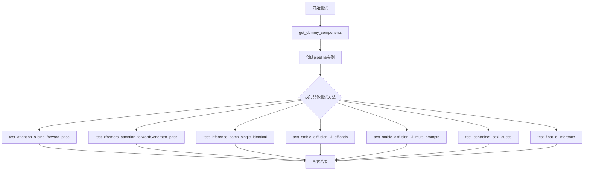

## 类结构

```
unittest.TestCase
├── PipelineLatentTesterMixin
├── PipelineKarrasSchedulerTesterMixin
└── PipelineTesterMixin
    └── ControlNetPipelineSDXLFastTests
```

## 全局变量及字段


### `ControlNetPipelineSDXLFastTests.pipeline_class`
    
被测试的Stable Diffusion XL ControlNet修复管道类

类型：`type`
    


### `ControlNetPipelineSDXLFastTests.params`
    
文本到图像生成的参数配置集合

类型：`TEXT_TO_IMAGE_PARAMS`
    


### `ControlNetPipelineSDXLFastTests.batch_params`
    
批处理参数配置集合

类型：`TEXT_TO_IMAGE_BATCH_PARAMS`
    


### `ControlNetPipelineSDXLFastTests.image_params`
    
图像参数配置，包含图像到图像参数加上mask_image和control_image

类型：`frozenset`
    


### `ControlNetPipelineSDXLFastTests.image_latents_params`
    
图像潜在变量的参数配置集合

类型：`TEXT_TO_IMAGE_IMAGE_PARAMS`
    


### `ControlNetPipelineSDXLFastTests.callback_cfg_params`
    
回调配置参数，包含文本嵌入、时间ID、掩码和掩码图像潜在变量

类型：`frozenset`
    


### `ControlNetPipelineSDXLFastTests.supports_dduf`
    
标记是否支持DDUF（Decoder Denoising Upsampling Fusion），当前设置为False

类型：`bool`
    
    

## 全局函数及方法


### `enable_full_determinism`

该函数用于启用完全确定性执行模式，通过设置全局随机种子确保测试和实验结果的可复现性。

参数：无

返回值：无返回值

#### 流程图

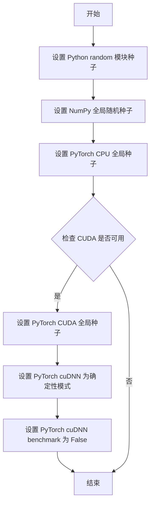

#### 带注释源码

```python
def enable_full_determinism(seed: int = 42, warn_only: bool = False):
    """
    启用完全确定性执行模式。
    
    参数：
        seed: int, 随机种子，默认为 42
        warn_only: bool, 是否仅警告而非抛出错误，默认为 False
    
    返回值：
        无返回值
    
    说明：
        该函数通过设置多个库的随机种子来确保测试结果的可复现性：
        1. Python 内置的 random 模块
        2. NumPy 的全局随机种子
        3. PyTorch 的 CPU 和 CUDA 随机种子
        4. 将 cuDNN 设置为确定性模式并关闭 benchmark
    """
    # 设置 Python random 模块的全局种子
    random.seed(seed)
    
    # 设置 NumPy 的全局随机种子
    np.random.seed(seed)
    
    # 设置 PyTorch CPU 的全局随机种子
    torch.manual_seed(seed)
    
    # 如果 CUDA 可用，设置 CUDA 的全局随机种子
    if torch.cuda.is_available():
        torch.cuda.manual_seed_all(seed)
    
    # 启用 cuDNN 的确定性模式，确保可复现性
    torch.backends.cudnn.deterministic = True
    
    # 关闭 cuDNN benchmark，禁用自动优化以确保确定性
    torch.backends.cudnn.benchmark = False
```


### `floats_tensor`

生成指定形状的随机浮点张量，用于测试目的。

参数：

- `shape`：`tuple`，张量的形状，例如 `(1, 3, 32, 32)`
- `rng`：`random.Random`，随机数生成器实例，用于生成确定性随机数

返回值：`torch.Tensor`，形状为 `shape` 的浮点数张量，值通常在 [0, 1] 范围内

#### 流程图

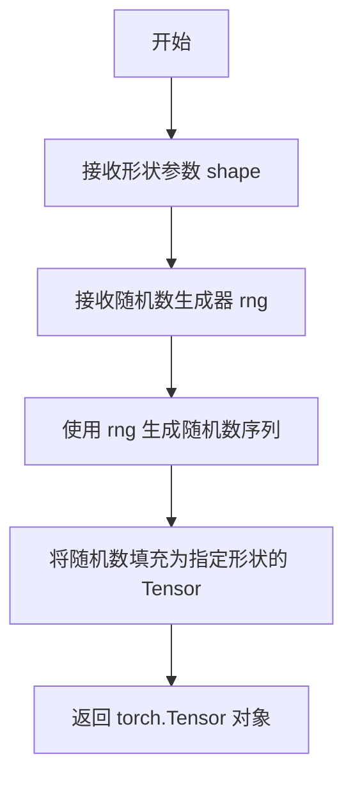

#### 带注释源码

```python
# 注意：floats_tensor 函数定义在 testing_utils 模块中，当前文件仅导入使用
# 以下为调用示例及推断的实现逻辑：

# 调用示例 1：生成图像张量
image = floats_tensor((1, 3, 32, 32), rng=random.Random(seed)).to(device)
# shape=(1, 3, 32, 32): 生成 1 个样本，3 通道，32x32 分辨率的图像
# rng=random.Random(seed): 使用确定性的随机种子确保测试可复现
# .to(device): 将张量移动到指定设备（CPU/CUDA）

# 调用示例 2：生成控制图像张量
control_image = (
    floats_tensor(
        (1, 3, 32 * controlnet_embedder_scale_factor, 32 * controlnet_embedder_scale_factor),
        rng=random.Random(seed),
    )
    .to(device)
    .cpu()
)
# 生成更大分辨率的控制图像（32 * 2 = 64）
# .cpu(): 移回 CPU 进行后续处理
```

#### 说明

`floats_tensor` 是 diffusers 测试框架中的工具函数，从 `...testing_utils` 模块导入。由于源代码不在当前文件中，无法提供完整的实现源码。该函数主要用于：

1. **生成测试数据**：在流水线测试中生成随机初始图像、控制图像等
2. **确保可复现性**：通过传入固定种子的随机数生成器，确保测试结果可复现
3. **统一接口**：为不同类型的测试提供统一的浮点数张量生成接口


由于 `require_torch_accelerator` 是从外部模块 `testing_utils` 导入的装饰器，未在当前代码文件中定义，我将基于其使用上下文和典型的 `diffusers` 测试框架实现来提供详细信息。

### `require_torch_accelerator`

这是一个测试装饰器，用于条件性地跳过需要 CUDA GPU（torch 加速器）的测试。如果系统没有可用的 CUDA 设备，则跳过该测试并显示相应消息。

参数：

- `device`：`str`，可选参数，指定要检查的设备类型，默认为 `"cuda"`。

返回值：`Callable`，返回一个装饰器函数，用于包装测试函数。

#### 流程图

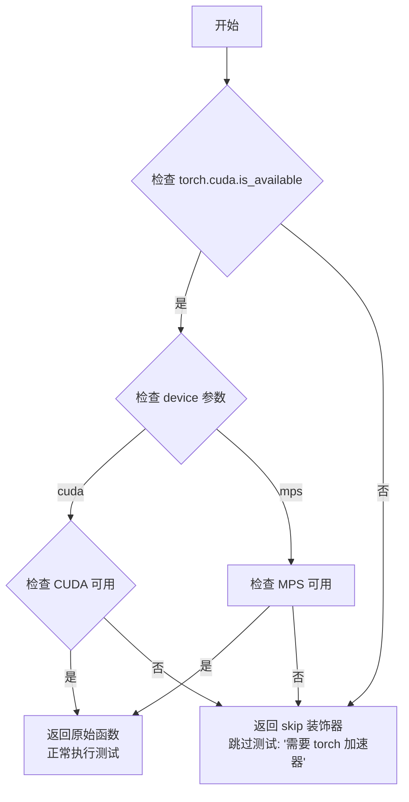

#### 带注释源码

（由于该函数定义在 `diffusers` 库的 `testing_utils` 模块中，以下为基于常见实现的推断源码）

```python
def require_torch_accelerator(device: str = "cuda"):
    """
    装饰器：要求 torch 加速器（CUDA 或 MPS）才能运行测试。
    
    参数:
        device: str, 要检查的设备类型，可选 "cuda" 或 "mps"，默认 "cuda"
    
    返回:
        装饰器函数，如果设备可用则返回原始函数，否则返回跳过测试的函数
    """
    def decorator(func):
        # 检查是否满足加速器条件
        if device == "cuda":
            # 检查 CUDA 是否可用
            skip_condition = not torch.cuda.is_available()
            reason = "test requires a CUDA GPU"
        elif device == "mps":
            # 检查 Apple Silicon MPS 是否可用
            skip_condition = not torch.backends.mps.is_available()
            reason = "test requires a MPS (Apple Silicon) GPU"
        else:
            # 默认检查 CUDA
            skip_condition = not torch.cuda.is_available()
            reason = f"test requires {device} accelerator"
        
        if skip_condition:
            # 返回一个跳过测试的函数
            return unittest.skip(reason)(func)
        
        # 如果设备可用，返回原始函数
        return func
    
    return decorator


# 使用示例（在代码中）
@require_torch_accelerator  # 等同于 @require_torch_accelerator(device="cuda")
def test_stable_diffusion_xl_offloads(self):
    """测试在有 CUDA 加速器时执行"""
    # 测试代码...
    pass
```

#### 备注

- 该装饰器来自 `diffusers` 库的 `testing_utils` 模块
- 在当前代码文件中，它被用于 `test_stable_diffusion_xl_offloads` 方法，确保该测试仅在有 CUDA GPU 的机器上运行
- 这是测试框架中常见的设计模式，用于在不同硬件环境下有条件地执行测试


### `torch_device`

获取当前测试环境的 PyTorch 设备（CPU/CUDA/MPS等），用于确保测试在正确的设备上运行。

参数： 无

返回值：`str`，返回当前 PyTorch 设备字符串（如 "cpu"、"cuda"、"mps" 等）

#### 流程图

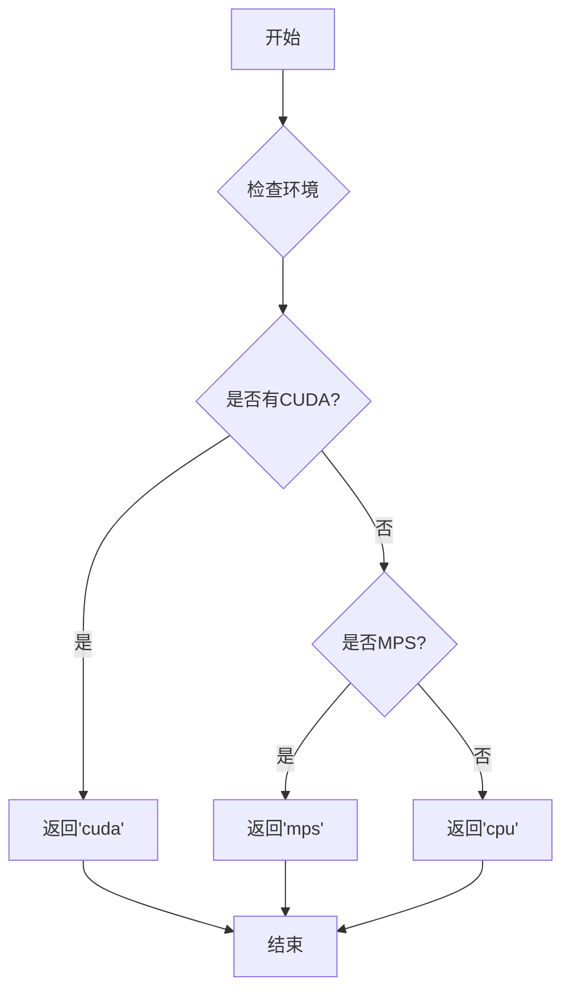

#### 带注释源码

```python
# torch_device 是从 testing_utils 模块导入的全局变量/函数
# 该变量在测试套件中用于动态获取当前可用的 PyTorch 设备
# 源代码位于 testing_utils.py 中，此处为引用使用示例：

# 导入声明（位于文件顶部）
from ...testing_utils import (
    enable_full_determinism,
    floats_tensor,
    require_torch_accelerator,
    torch_device,  # <-- 从 testing_utils 导入
)

# 使用示例 1：设备指定
sd_pipe = self.pipeline_class(**components).to(torch_device)

# 使用示例 2：作为测试参数
inputs = self.get_dummy_inputs(torch_device)

# 使用示例 3：条件检查
@unittest.skipIf(
    torch_device != "cuda" or not is_xformers_available(),
    reason="XFormers attention is only available with CUDA and `xformers` installed",
)
def test_xformers_attention_forwardGenerator_pass(self):
    ...
```

> **注意**：由于 `torch_device` 是从外部模块 `testing_utils` 导入的，其实际实现不在本代码文件中。根据 `diffusers` 库的设计，`torch_device` 通常是一个动态检测函数，会按优先级返回 `"cuda"`（如果有GPU）、`"mps"`（如果有Apple Silicon）或 `"cpu"`。


### `ControlNetPipelineSDXLFastTests.get_dummy_components`

该方法用于创建虚拟组件字典，初始化并返回一个包含 Stable Diffusion XL ControlNet Inpaint Pipeline 所有必要组件的字典，包括 UNet、ControlNet、调度器、VAE、文本编码器、分词器、图像编码器和特征提取器等，用于单元测试。

参数：

- 该方法无参数（仅包含 `self` 隐式参数）

返回值：`dict`，返回包含以下键值对的字典：
- `"unet"`：`UNet2DConditionModel`，UNet 条件模型
- `"controlnet"`：`ControlNetModel`，ControlNet 模型
- `"scheduler"`：`EulerDiscreteScheduler`，欧拉离散调度器
- `"vae"`：`AutoencoderKL`，变分自编码器
- `"text_encoder"`：`CLIPTextModel`，CLIP 文本编码器
- `"tokenizer"`：`CLIPTokenizer`，CLIP 分词器
- `"text_encoder_2"`：`CLIPTextModelWithProjection`，第二个 CLIP 文本编码器（带投影）
- `"tokenizer_2"`：`CLIPTokenizer`，第二个 CLIP 分词器
- `"image_encoder"`：`CLIPVisionModelWithProjection`，CLIP 视觉模型（带投影）
- `"feature_extractor"`：`CLIPImageProcessor`，CLIP 图像处理器

#### 流程图

```mermaid
flowchart TD
    A[开始 get_dummy_components] --> B[设置随机种子 torch.manual_seed(0)]
    B --> C[创建 UNet2DConditionModel]
    C --> D[创建 ControlNetModel]
    D --> E[创建 EulerDiscreteScheduler]
    E --> F[设置随机种子 torch.manual_seed(0)]
    F --> G[创建 AutoencoderKL VAE]
    G --> H[设置随机种子 torch.manual_seed(0)]
    H --> I[创建 CLIPTextConfig 和 CLIPTextModel]
    I --> J[创建 CLIPTokenizer]
    J --> K[设置随机种子 torch.manual_seed(0)]
    K --> L[创建 CLIPTextModelWithProjection 和第二个 CLIPTokenizer]
    L --> M[创建 CLIPVisionConfig 和 CLIPVisionModelWithProjection]
    M --> N[创建 CLIPImageProcessor]
    N --> O[构建 components 字典]
    O --> P[返回 components]
```

#### 带注释源码

```python
def get_dummy_components(self):
    """
    创建虚拟组件字典，用于测试 StableDiffusionXLControlNetInpaintPipeline
    """
    # 设置随机种子以确保可重复性
    torch.manual_seed(0)
    
    # 创建 UNet2DConditionModel - 用于去噪的 UNet 模型
    unet = UNet2DConditionModel(
        block_out_channels=(32, 64),           # 块输出通道数
        layers_per_block=2,                     # 每个块的层数
        sample_size=32,                         # 样本大小
        in_channels=4,                          # 输入通道数（latent space）
        out_channels=4,                         # 输出通道数
        down_block_types=("DownBlock2D", "CrossAttnDownBlock2D"),  # 下采样块类型
        up_block_types=("CrossAttnUpBlock2D", "UpBlock2D"),         # 上采样块类型
        attention_head_dim=(2, 4),             # 注意力头维度
        use_linear_projection=True,             # 使用线性投影
        addition_embed_type="text_time",        # 附加嵌入类型（文本+时间）
        addition_time_embed_dim=8,              # 时间嵌入维度
        transformer_layers_per_block=(1, 2),    # 每个块的 transformer 层数
        projection_class_embeddings_input_dim=80,  # 投影类嵌入输入维度
        cross_attention_dim=64,                 # 交叉注意力维度
    )
    
    # 设置随机种子
    torch.manual_seed(0)
    
    # 创建 ControlNetModel - 用于条件控制的 ControlNet
    controlnet = ControlNetModel(
        block_out_channels=(32, 64),            # 块输出通道数
        layers_per_block=2,                     # 每个块的层数
        in_channels=4,                          # 输入通道数
        down_block_types=("DownBlock2D", "CrossAttnDownBlock2D"),  # 下采样块类型
        conditioning_embedding_out_channels=(16, 32),  # 条件嵌入输出通道
        attention_head_dim=(2, 4),              # 注意力头维度
        use_linear_projection=True,             # 使用线性投影
        addition_embed_type="text_time",        # 附加嵌入类型
        addition_time_embed_dim=8,              # 时间嵌入维度
        transformer_layers_per_block=(1, 2),   # 每个块的 transformer 层数
        projection_class_embeddings_input_dim=80,  # 投影类嵌入输入维度
        cross_attention_dim=64,                 # 交叉注意力维度
    )
    
    # 创建 EulerDiscreteScheduler - 欧拉离散调度器
    scheduler = EulerDiscreteScheduler(
        beta_start=0.00085,                     # beta 起始值
        beta_end=0.012,                         # beta 结束值
        steps_offset=1,                        # 步骤偏移
        beta_schedule="scaled_linear",         # beta 调度策略
        timestep_spacing="leading",             # 时间步间距
    )
    
    # 设置随机种子
    torch.manual_seed(0)
    
    # 创建 AutoencoderKL - 用于 latent space 编码/解码的 VAE
    vae = AutoencoderKL(
        block_out_channels=[32, 64],           # 块输出通道数
        in_channels=3,                         # 输入通道数（RGB 图像）
        out_channels=3,                        # 输出通道数
        down_block_types=["DownEncoderBlock2D", "DownEncoderBlock2D"],  # 下采样编码块
        up_block_types=["UpDecoderBlock2D", "UpDecoderBlock2D"],       # 上采样解码块
        latent_channels=4,                     # latent 通道数
    )
    
    # 设置随机种子
    torch.manual_seed(0)
    
    # 创建 CLIPTextConfig - CLIP 文本编码器配置
    text_encoder_config = CLIPTextConfig(
        bos_token_id=0,                        # 起始 token ID
        eos_token_id=2,                        # 结束 token ID
        hidden_size=32,                       # 隐藏层大小
        intermediate_size=37,                  # 中间层大小
        layer_norm_eps=1e-05,                  # LayerNorm epsilon
        num_attention_heads=4,                 # 注意力头数
        num_hidden_layers=5,                   # 隐藏层数
        pad_token_id=1,                        # 填充 token ID
        vocab_size=1000,                       # 词汇表大小
        hidden_act="gelu",                     # 隐藏层激活函数
        projection_dim=32,                     # 投影维度
    )
    
    # 创建 CLIPTextModel - 第一个文本编码器
    text_encoder = CLIPTextModel(text_encoder_config)
    
    # 创建 CLIPTokenizer - 第一个分词器
    tokenizer = CLIPTokenizer.from_pretrained("hf-internal-testing/tiny-random-clip")
    
    # 设置随机种子
    torch.manual_seed(0)
    
    # 创建 CLIPTextModelWithProjection - 第二个文本编码器（带投影）
    text_encoder_2 = CLIPTextModelWithProjection(text_encoder_config)
    
    # 创建 CLIPTokenizer - 第二个分词器
    tokenizer_2 = CLIPTokenizer.from_pretrained("hf-internal-testing/tiny-random-clip")
    
    # 创建 CLIPVisionConfig - CLIP 视觉编码器配置
    image_encoder_config = CLIPVisionConfig(
        hidden_size=32,                         # 隐藏层大小
        image_size=224,                        # 图像大小
        projection_dim=32,                     # 投影维度
        intermediate_size=37,                  # 中间层大小
        num_attention_heads=4,                 # 注意力头数
        num_channels=3,                        # 通道数
        num_hidden_layers=5,                   # 隐藏层数
        patch_size=14,                         # 补丁大小
    )
    
    # 创建 CLIPVisionModelWithProjection - 视觉编码器（带投影）
    image_encoder = CLIPVisionModelWithProjection(image_encoder_config)
    
    # 创建 CLIPImageProcessor - 图像预处理器
    feature_extractor = CLIPImageProcessor(
        crop_size=224,                         # 裁剪大小
        do_center_crop=True,                   # 是否中心裁剪
        do_normalize=True,                     # 是否归一化
        do_resize=True,                        # 是否调整大小
        image_mean=[0.48145466, 0.4578275, 0.40821073],   # 图像均值
        image_std=[0.26862954, 0.26130258, 0.27577711],   # 图像标准差
        resample=3,                            # 重采样方法
        size=224,                              # 目标大小
    )
    
    # 组装所有组件到字典中
    components = {
        "unet": unet,                          # UNet 条件模型
        "controlnet": controlnet,             # ControlNet 模型
        "scheduler": scheduler,                # 调度器
        "vae": vae,                            # VAE 变分自编码器
        "text_encoder": text_encoder,          # 第一个文本编码器
        "tokenizer": tokenizer,                # 第一个分词器
        "text_encoder_2": text_encoder_2,      # 第二个文本编码器
        "tokenizer_2": tokenizer_2,            # 第二个分词器
        "image_encoder": image_encoder,        # 图像编码器
        "feature_extractor": feature_extractor, # 特征提取器
    }
    
    # 返回组件字典
    return components
```


### `ControlNetPipelineSDXLFastTests.get_dummy_inputs`

该方法用于生成虚拟输入数据（dummy inputs），为 Stable Diffusion XL ControlNet Inpainting Pipeline 的单元测试创建符合接口要求的输入参数，包括文本提示词、随机种子生成的图像、掩码图像和控制图像。

参数：

- `device`：`torch.device`，目标设备，用于创建随机数生成器
- `seed`：`int`，随机种子，默认值为 0，用于确保测试可复现
- `img_res`：`int`，图像分辨率，默认值为 64，用于调整生成图像的尺寸

返回值：`Dict[str, Any]`，包含以下键值的字典：
- `prompt` (str): 文本提示词
- `generator` (torch.Generator): 随机数生成器
- `num_inference_steps` (int): 推理步数
- `guidance_scale` (float): 引导 scale
- `output_type` (str): 输出类型
- `image` (PIL.Image.Image): 初始图像
- `mask_image` (PIL.Image.Image): 掩码图像
- `control_image` (PIL.Image.Image): 控制图像

#### 流程图

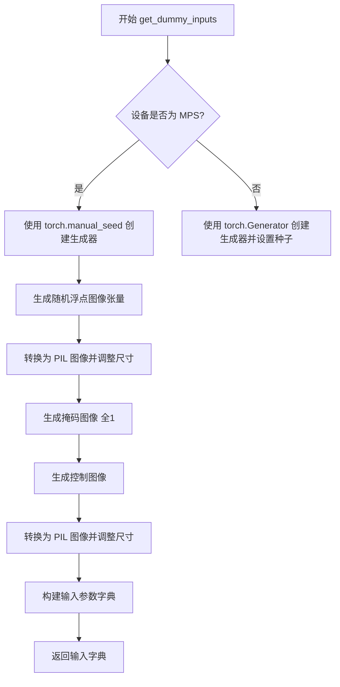

#### 带注释源码

```python
def get_dummy_inputs(self, device, seed=0, img_res=64):
    # 针对 Apple MPS 设备特殊处理，因为 torch.Generator 在 MPS 上行为不同
    if str(device).startswith("mps"):
        generator = torch.manual_seed(seed)
    else:
        # 为指定设备创建随机数生成器并设置种子，确保测试可复现
        generator = torch.Generator(device=device).manual_seed(seed)

    # 使用 floats_tensor 生成 [0, 1] 范围内的随机浮点数作为图像数据
    # 形状为 (1, 3, 32, 32)，使用 random.Random(seed) 确保确定性
    image = floats_tensor((1, 3, 32, 32), rng=random.Random(seed)).to(device)
    # 转换为 CPU 并调整维度顺序从 (B, C, H, W) 到 (B, H, W, C)
    image = image.cpu().permute(0, 2, 3, 1)[0]
    # 创建与图像形状相同的全1张量作为掩码图像
    mask_image = torch.ones_like(image)
    
    # 控制图像的缩放因子，用于生成更大的控制图像
    controlnet_embedder_scale_factor = 2
    # 生成控制图像，尺寸为原始尺寸的 2 倍
    control_image = (
        floats_tensor(
            (1, 3, 32 * controlnet_embedder_scale_factor, 32 * controlnet_embedder_scale_factor),
            rng=random.Random(seed),
        )
        .to(device)
        .cpu()
    )
    control_image = control_image.cpu().permute(0, 2, 3, 1)[0]
    
    # 将图像数据从 [0, 1] 范围转换到 [0, 255] 范围，用于 PIL 图像转换
    image = 255 * image
    mask_image = 255 * mask_image
    control_image = 255 * control_image
    
    # 将 numpy 数组转换为 PIL 图像，并调整为目标分辨率
    # init_image: RGB 格式，用于 inpainting 的初始图像
    init_image = Image.fromarray(np.uint8(image)).convert("RGB").resize((img_res, img_res))
    # mask_image: L 格式（灰度），用于标识需要修复的区域
    mask_image = Image.fromarray(np.uint8(mask_image)).convert("L").resize((img_res, img_res))
    # control_image: RGB 格式，用于 ControlNet 控制条件
    control_image = Image.fromarray(np.uint8(control_image)).convert("RGB").resize((img_res, img_res))

    # 构建符合 pipeline 调用要求的输入参数字典
    inputs = {
        "prompt": "A painting of a squirrel eating a burger",  # 测试用提示词
        "generator": generator,  # 随机数生成器，确保可复现性
        "num_inference_steps": 2,  # 较少的推理步数，加快测试速度
        "guidance_scale": 6.0,  # CFG 引导强度
        "output_type": "np",  # 输出为 numpy 数组
        "image": init_image,  # 初始图像（inpainting 用）
        "mask_image": mask_image,  # 掩码图像
        "control_image": control_image,  # ControlNet 控制图像
    }
    return inputs
```


### `ControlNetPipelineSDXLFastTests.test_attention_slicing_forward_pass`

该测试方法用于验证 ControlNet SDXL 修复管道在使用注意力切片（Attention Slicing）优化技术时的前向传播是否正确。注意力切片是一种内存优化技术，通过将注意力计算分片处理来减少显存占用。该方法调用内部测试方法 `_test_attention_slicing_forward_pass`，并设置预期最大差异阈值为 2e-3，以确保优化后的输出与基准输出的差异在可接受范围内。

参数：

- `self`：隐式参数，测试类实例

返回值：无显式返回值（返回 None），测试结果通过断言验证

#### 流程图

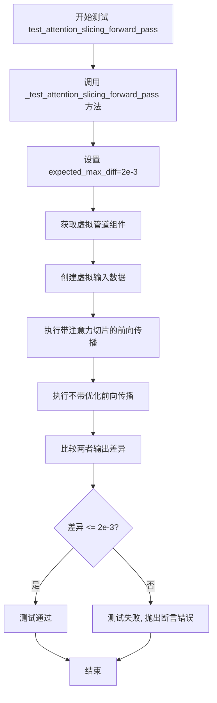

#### 带注释源码

```python
def test_attention_slicing_forward_pass(self):
    """
    测试注意力切片前向传播是否正确工作。
    
    注意力切片是一种内存优化技术，通过将注意力矩阵计算分片
    来减少显存占用。此测试验证使用该优化后管道的输出精度。
    
    返回:
        无返回值，测试结果通过断言验证
    """
    # 调用内部测试方法，expected_max_diff=2e-3 表示允许的最大差异
    return self._test_attention_slicing_forward_pass(expected_max_diff=2e-3)
```


### `ControlNetPipelineSDXLFastTests.test_xformers_attention_forwardGenerator_pass`

该测试方法用于验证 xFormers 注意力机制在前向传播过程中的正确性，通过调用内部测试方法 `_test_xformers_attention_forwardGenerator_pass` 并设定期望的最大误差阈值（2e-3）来确保实现的数值精度。该测试仅在 CUDA 设备和 xFormers 库可用时执行。

参数：

- `self`：`ControlNetPipelineSDXLFastTests`，测试类实例本身，包含测试所需的组件和辅助方法

返回值：`None`，无显式返回值（测试通过/失败状态由测试框架断言机制决定）

#### 流程图

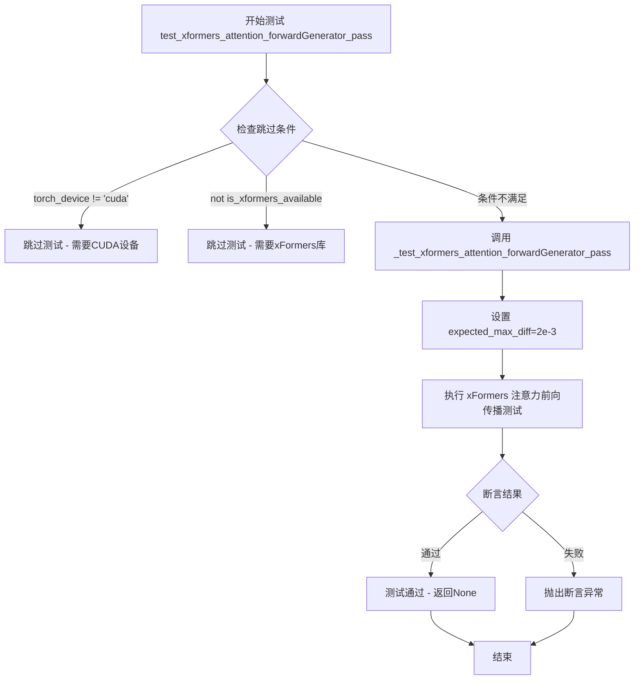

#### 带注释源码

```python
@unittest.skipIf(
    torch_device != "cuda" or not is_xformers_available(),
    reason="XFormers attention is only available with CUDA and `xformers` installed",
)
def test_xformers_attention_forwardGenerator_pass(self):
    """
    测试 xFormers 注意力机制的前向传播是否正确。
    
    该测试方法通过调用内部辅助方法 _test_xformers_attention_forwardGenerator_pass
    来验证 xFormers 实现的注意力模块在数值上与预期结果一致。
    
    注意：
    - 该测试仅在 CUDA 设备可用且 xFormers 库已安装时运行
    - 使用 expected_max_diff=2e-3 作为数值精度容差阈值
    """
    # 调用内部测试方法，传入期望的最大误差阈值
    # _test_xformers_attention_forwardGenerator_pass 方法定义在 PipelineTesterMixin 中
    # 用于执行实际的 xFormers 注意力前向传播验证逻辑
    self._test_xformers_attention_forwardGenerator_pass(expected_max_diff=2e-3)
```


### `ControlNetPipelineSDXLFastTests.test_inference_batch_single_identical`

该测试方法用于验证StableDiffusionXLControlNetInpaintPipeline在批处理推理（多条输入）与单张推理（单条输入）模式下的一致性，确保两种推理方式产生的图像结果在指定误差范围内相同。

参数：
- `self`：测试类实例本身，无需显式传递

返回值：`None`，该方法为测试方法，通过断言验证一致性，不返回具体数据

#### 流程图

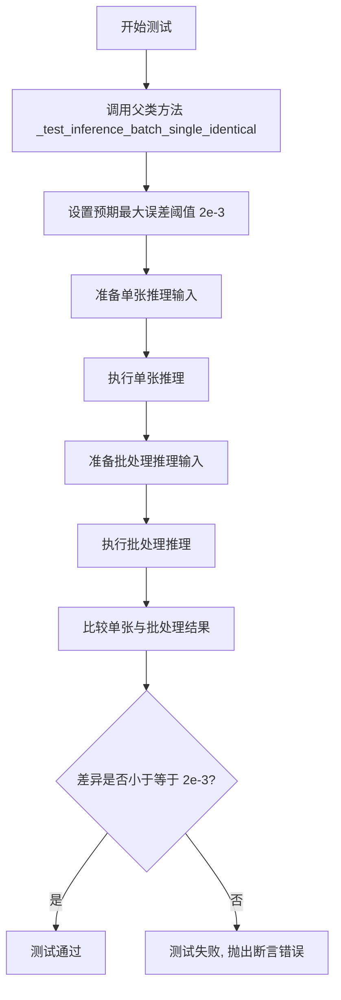

#### 带注释源码

```python
def test_inference_batch_single_identical(self):
    """
    测试批处理推理与单张推理的一致性。
    
    该测试方法验证pipeline在处理单条输入和多条（批处理）输入时，
    产生的第一张图像结果应该完全一致。这是确保推理逻辑正确性的
    重要测试用例，可以catch到由于批处理实现不当导致的结果差异。
    
    测试逻辑：
    1. 准备单张推理所需的dummy输入
    2. 准备包含相同输入的批处理输入
    3. 分别执行推理
    4. 比较两次推理结果的第一张图像
    5. 断言差异小于等于预期的最大差异阈值
    """
    # 调用父类（PipelineTesterMixin）的测试方法
    # expected_max_diff=2e-3 表示允许的最大误差为 0.002
    # 如果批处理结果与单张结果的差异超过此阈值，测试将失败
    self._test_inference_batch_single_identical(expected_max_diff=2e-3)
```


### `ControlNetPipelineSDXLFastTests.test_stable_diffusion_xl_offloads`

该测试方法用于验证 Stable Diffusion XL ControlNet Inpaint Pipeline 在三种不同 CPU 卸载模式下的功能正确性：默认执行模式、模型级 CPU 卸载模式（enable_model_cpu_offload）和顺序 CPU 卸载模式（enable_sequential_cpu_offload）。测试通过比较三种模式生成的图像像素差异来确保卸载功能不会影响生成结果的准确性。

参数：

- `self`：隐式参数，测试类实例本身，包含测试所需的组件和配置

返回值：`None`，该方法为测试方法，通过断言验证结果，无显式返回值

#### 流程图

```mermaid
flowchart TD
    A[开始测试 test_stable_diffusion_xl_offloads] --> B[创建空列表 pipes 存储管道实例]
    B --> C[获取虚拟组件 get_dummy_components]
    C --> D[创建管道1: 默认模式<br/>pipeline_class(**components).to(torch_device)]
    D --> E[将管道1添加到 pipes 列表]
    E --> F[获取虚拟组件 get_dummy_components]
    F --> G[创建管道2: 模型CPU卸载<br/>pipeline_class(**components)<br/>enable_model_cpu_offload]
    G --> H[将管道2添加到 pipes 列表]
    H --> I[获取虚拟组件 get_dummy_components]
    I --> J[创建管道3: 顺序CPU卸载<br/>pipeline_class(**components)<br/>enable_sequential_cpu_offload]
    J --> K[将管道3添加到 pipes 列表]
    K --> L[创建空列表 image_slices 存储图像切片]
    L --> M{遍历 pipes 中的每个管道}
    M -->|对于每个管道| N[设置默认注意力处理器<br/>pipe.unet.set_default_attn_processor]
    N --> O[获取虚拟输入 get_dummy_inputs]
    O --> P[执行管道生成图像<br/>pipe(**inputs).images]
    P --> Q[提取图像右下角3x3像素切片<br/>image[0, -3:, -3:, -1].flatten()]
    Q --> R[将切片添加到 image_slices]
    R --> M
    M -->|所有管道遍历完成| S{断言验证}
    S --> T[验证模式1与模式2差异<br/>np.abs(image_slices[0] - image_slices[1]).max() < 1e-3]
    T --> U[验证模式1与模式3差异<br/>np.abs(image_slices[0] - image_slices[2]).max() < 1e-3]
    U --> V[测试通过]
    
    style V fill:#90EE90
    style S fill:#FFE4B5
```

#### 带注释源码

```python
@require_torch_accelerator  # 仅在有GPU加速器时运行此测试
def test_stable_diffusion_xl_offloads(self):
    """
    测试 Stable Diffusion XL ControlNet Inpaint Pipeline 的 CPU 卸载功能。
    验证三种模式生成的图像结果一致性：
    1. 默认执行模式（无CPU卸载）
    2. 模型级CPU卸载（enable_model_cpu_offload）
    3. 顺序CPU卸载（enable_sequential_cpu_offload）
    """
    pipes = []  # 用于存储三个不同配置的管道实例
    components = self.get_dummy_components()  # 获取虚拟（测试用）模型组件
    
    # 模式1: 默认执行模式 - 管道直接在目标设备上运行
    sd_pipe = self.pipeline_class(**components).to(torch_device)
    pipes.append(sd_pipe)

    components = self.get_dummy_components()  # 重新获取新的虚拟组件
    # 模式2: 模型级CPU卸载 - 将模型模块在推理间隙卸载到CPU
    sd_pipe = self.pipeline_class(**components)
    sd_pipe.enable_model_cpu_offload(device=torch_device)
    pipes.append(sd_pipe)

    components = self.get_dummy_components()  # 重新获取新的虚拟组件
    # 模式3: 顺序CPU卸载 - 按顺序将每个模型模块依次卸载到CPU
    sd_pipe = self.pipeline_class(**components)
    sd_pipe.enable_sequential_cpu_offload(device=torch_device)
    pipes.append(sd_pipe)

    image_slices = []  # 存储每个管道生成的图像切片用于比较
    for pipe in pipes:
        # 确保使用默认的注意力处理器，排除xformers等自定义优化的干扰
        pipe.unet.set_default_attn_processor()

        # 获取测试用的虚拟输入（包含提示词、噪声种子等）
        inputs = self.get_dummy_inputs(torch_device)
        
        # 执行管道推理，获取生成的图像
        image = pipe(**inputs).images

        # 提取图像右下角3x3区域的像素值（最后一个通道）用于后续比较
        # image shape: [B, H, W, C] 或 [B, C, H, W]，这里取 -3: 表示最后3行/列
        image_slices.append(image[0, -3:, -3:, -1].flatten())

    # 断言1: 验证默认模式与模型级CPU卸载模式生成的图像差异小于阈值
    # 最大绝对误差小于 1e-3 确保数值精度在可接受范围内
    assert np.abs(image_slices[0] - image_slices[1]).max() < 1e-3
    
    # 断言2: 验证默认模式与顺序CPU卸载模式生成的图像差异小于阈值
    assert np.abs(image_slices[0] - image_slices[2]).max() < 1e-3
```


### `ControlNetPipelineSDXLFastTests.test_stable_diffusion_xl_multi_prompts`

该测试方法用于验证 `StableDiffusionXLControlNetInpaintPipeline` 在处理多提示词（prompt_2）和多负提示词（negative_prompt_2）时的功能正确性，确保相同的提示词产生相同的输出，不同的提示词产生不同的输出。

参数：无（使用 `self` 和内部方法 `get_dummy_inputs()` 获取测试数据）

返回值：无（通过断言验证功能，返回 void）

#### 流程图

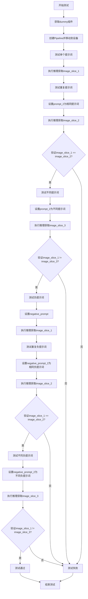

#### 带注释源码

```python
def test_stable_diffusion_xl_multi_prompts(self):
    """
    测试多提示词功能，包括：
    1. 单个提示词 vs 重复提示词 -> 结果应相同
    2. 单个提示词 vs 不同提示词 -> 结果应不同
    3. 单个负提示词 vs 重复负提示词 -> 结果应相同
    4. 单个负提示词 vs 不同负提示词 -> 结果应不同
    """
    # 步骤1: 获取预定义的虚拟组件（UNet, ControlNet, VAE, TextEncoder等）
    components = self.get_dummy_components()
    
    # 步骤2: 创建StableDiffusionXLControlNetInpaintPipeline实例并移至测试设备
    sd_pipe = self.pipeline_class(**components).to(torch_device)

    # ========== 测试正向提示词部分 ==========
    
    # 步骤3: 使用单个提示词进行推理
    inputs = self.get_dummy_inputs(torch_device)
    output = sd_pipe(**inputs)
    # 提取生成图像右下角3x3区域的像素值作为比对样本
    image_slice_1 = output.images[0, -3:, -3:, -1]

    # 步骤4: 使用重复的提示词（prompt + prompt_2相同）进行推理
    inputs = self.get_dummy_inputs(torch_device)
    inputs["prompt_2"] = inputs["prompt"]  # 设置第二个提示词与第一个相同
    output = sd_pipe(**inputs)
    image_slice_2 = output.images[0, -3:, -3:, -1]

    # 步骤5: 断言 - 相同提示词应产生相同结果（误差小于1e-4）
    assert np.abs(image_slice_1.flatten() - image_slice_2.flatten()).max() < 1e-4

    # 步骤6: 使用不同的提示词进行推理
    inputs = self.get_dummy_inputs(torch_device)
    inputs["prompt_2"] = "different prompt"  # 设置不同的第二个提示词
    output = sd_pipe(**inputs)
    image_slice_3 = output.images[0, -3:, -3:, -1]

    # 步骤7: 断言 - 不同提示词应产生不同结果（误差大于1e-4）
    assert np.abs(image_slice_1.flatten() - image_slice_3.flatten()).max() > 1e-4

    # ========== 测试负向提示词部分 ==========
    
    # 步骤8: 使用单个负提示词进行推理
    inputs = self.get_dummy_inputs(torch_device)
    inputs["negative_prompt"] = "negative prompt"  # 设置负提示词
    output = sd_pipe(**inputs)
    image_slice_1 = output.images[0, -3:, -3:, -1]

    # 步骤9: 使用重复的负提示词进行推理
    inputs = self.get_dummy_inputs(torch_device)
    inputs["negative_prompt"] = "negative prompt"
    inputs["negative_prompt_2"] = inputs["negative_prompt"]  # 设置第二个负提示词与第一个相同
    output = sd_pipe(**inputs)
    image_slice_2 = output.images[0, -3:, -3:, -1]

    # 步骤10: 断言 - 相同负提示词应产生相同结果
    assert np.abs(image_slice_1.flatten() - image_slice_2.flatten()).max() < 1e-4

    # 步骤11: 使用不同的负提示词进行推理
    inputs = self.get_dummy_inputs(torch_device)
    inputs["negative_prompt"] = "negative prompt"
    inputs["negative_prompt_2"] = "different negative prompt"  # 设置不同的负提示词
    output = sd_pipe(**inputs)
    image_slice_3 = output.images[0, -3:, -3:, -1]

    # 步骤12: 断言 - 不同负提示词应产生不同结果
    assert np.abs(image_slice_1.flatten() - image_slice_3.flatten()).max() > 1e-4
```


### `ControlNetPipelineSDXLFastTests.test_controlnet_sdxl_guess`

该测试方法用于验证 ControlNet 在 Stable Diffusion XL (SDXL) 图像修复 (Inpainting) Pipeline 中的 guess 模式。在 guess 模式下，ControlNet 生成的中间条件不会被缩放，而是直接用于引导去噪过程，这允许模型在无需精确控制强度的情况下自由探索生成空间。

参数：

- `self`：`ControlNetPipelineSDXLFastTests`，测试类实例本身

返回值：`None`，该方法为单元测试，通过断言验证生成图像与预期像素值的一致性，不返回显式值

#### 流程图

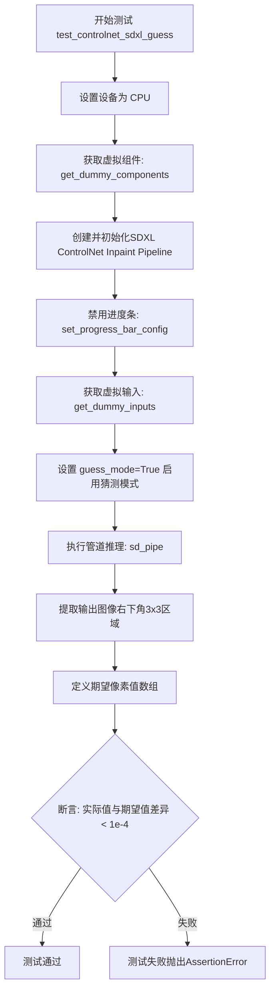

#### 带注释源码

```python
def test_controlnet_sdxl_guess(self):
    """测试 ControlNet 的 guess 模式功能"""
    # 设置测试设备为 CPU
    device = "cpu"

    # 获取虚拟组件（UNet, ControlNet, VAE, TextEncoder等）
    # 这些是用于测试的轻量级随机初始化模型
    components = self.get_dummy_components()

    # 使用虚拟组件创建 StableDiffusionXLControlNetInpaintPipeline 实例
    sd_pipe = self.pipeline_class(**components)
    # 将管道移动到指定设备
    sd_pipe = sd_pipe.to(device)

    # 配置进度条（disable=None 表示不禁用）
    sd_pipe.set_progress_bar_config(disable=None)

    # 获取虚拟输入参数
    # 包含: prompt, generator, num_inference_steps, guidance_scale,
    #       output_type, image, mask_image, control_image
    inputs = self.get_dummy_inputs(device)
    
    # 关键参数：启用 guess_mode
    # 在 guess 模式下，ControlNet 输出的条件向量不会被缩放
    # 而是直接使用，这允许更自由的图像生成
    inputs["guess_mode"] = True

    # 执行推理管道
    # 这里会调用 ControlNet 来处理 control_image
    # 并在 guess_mode 下生成图像
    output = sd_pipe(**inputs)
    
    # 提取生成图像的右下角 3x3 像素区域
    # 用于与期望值进行对比验证
    image_slice = output.images[0, -3:, -3:, -1]

    # 定义期望的像素值数组（9个值对应3x3区域）
    # 这些值是在已知正确配置下运行产生的基准值
    expected_slice = np.array([0.5460, 0.4943, 0.4635, 
                                0.5832, 0.5366, 0.4815, 
                                0.6034, 0.5741, 0.4341])

    # 断言验证：确保实际输出与期望值的最大差异小于 1e-4
    # 这样可以确保 guess_mode 功能正常工作
    assert np.abs(image_slice.flatten() - expected_slice).max() < 1e-4
```


### `ControlNetPipelineSDXLFastTests.test_save_load_optional_components`

该方法是一个测试用例，用于验证 StableDiffusionXLControlNetInpaintPipeline 的可选组件保存与加载功能。由于当前测试尚未完成（需要更多的refiner测试），该方法目前被跳过。

参数：

- `self`：`ControlNetPipelineSDXLFastTests`，表示类的实例对象本身，用于访问类的属性和方法

返回值：`None`，该方法没有返回值（方法体为 `pass`）

#### 流程图

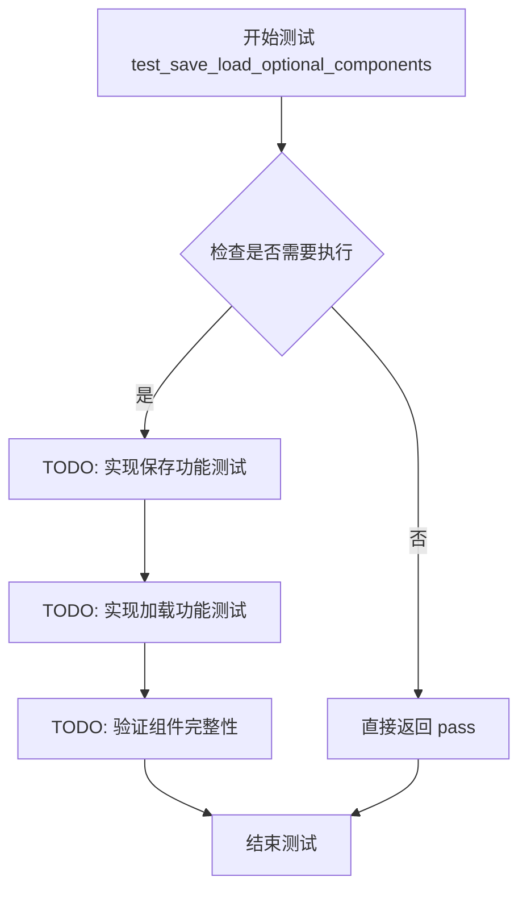

#### 带注释源码

```python
# TODO(Patrick, Sayak) - skip for now as this requires more refiner tests
def test_save_load_optional_components(self):
    """
    测试保存和加载可选组件的功能。
    
    该测试方法旨在验证 pipeline 的可选组件（如 refiner）是否能够
    正确地被序列化和反序列化。目前由于缺少完整的 refiner 测试支持，
    该测试被标记为 TODO 并暂时跳过。
    
    参数:
        self: ControlNetPipelineSDXLFastTests 的实例
        
    返回值:
        None: 测试方法不返回任何值
    """
    pass  # 测试内容暂未实现，等待后续补充
```


### `ControlNetPipelineSDXLFastTests.test_float16_inference`

该测试方法继承自父类 `PipelineTesterMixin`，用于验证模型在 float16（半精度）推理模式下的正确性，确保推理结果与全精度（float32）的差异在可接受范围内。

参数：

- `self`：实例本身，无显式参数

返回值：`None`，该方法为测试方法，通过断言验证推理结果，不返回具体数据。

#### 流程图

```mermaid
flowchart TD
    A[开始测试 test_float16_inference] --> B[调用父类方法 super().test_float16_inference]
    B --> C[传入参数 expected_max_diff=5e-1]
    C --> D[父类方法执行流程]
    D --> E1[将模型组件转换为 float16]
    E1 --> E2[准备测试输入数据]
    E2 --> E3[执行 float16 推理]
    E3 --> E4[执行 float32 基准推理]
    E4 --> E5[比较两者输出差异]
    E5 --> E6{差异是否小于 5e-1?}
    E6 -->|是| G[测试通过]
    E6 -->|否| H[测试失败, 抛出断言错误]
    G --> I[结束]
    H --> I
```

#### 带注释源码

```python
def test_float16_inference(self):
    """
    测试 float16（半精度）推理模式下的模型正确性。
    
    该测试方法继承自 PipelineTesterMixin 父类，用于验证：
    1. 模型能够正确加载并运行在 float16 精度下
    2. float16 推理结果与 float32 基准结果的差异在可接受范围内
    
    测试通过条件：输出的最大差异小于 expected_max_diff (5e-1 = 0.5)
    这是一个相对宽松的阈值，考虑了半精度计算可能引入的数值误差。
    """
    # 调用父类的 test_float16_inference 方法进行实际测试
    # expected_max_diff=5e-1 表示允许 float16 和 float32 输出之间的最大差异为 0.5
    # 这个阈值相对宽松，因为半精度浮点数在复杂计算中可能引入较大误差
    super().test_float16_inference(expected_max_diff=5e-1)
```

#### 额外说明

| 项目 | 说明 |
|------|------|
| **所属类** | `ControlNetPipelineSDXLFastTests` |
| **继承关系** | 继承自 `PipelineTesterMixin`，该类来自 `test_pipelines_common` 模块 |
| **测试目标** | 验证 StableDiffusionXLControlNetInpaintPipeline 在 float16 模式下的推理正确性 |
| **精度阈值** | 0.5（5e-1），相对于其他测试（如 2e-3）较为宽松，适应半精度计算特性 |
| **相关组件** | 测试涉及 `unet`、`controlnet`、`vae`、`text_encoder`、`text_encoder_2`、`image_encoder`、`feature_extractor` 等组件的 float16 转换 |

## 关键组件


### StableDiffusionXLControlNetInpaintPipeline

核心被测管道类，结合Stable Diffusion XL模型与ControlNet实现图像修复功能，支持基于文本提示、控制图像和掩码进行条件图像生成。

### UNet2DConditionModel

条件2D UNet模型，SDXL的去噪核心组件，负责在潜在空间中逐步去除噪声并根据文本嵌入和控制信号生成图像潜在表示。

### ControlNetModel

控制网络模型，接收控制图像（如边缘、深度、法线图等）并生成额外的条件特征，用于引导UNet在特定方向上生成图像。

### AutoencoderKL

变分自编码器（VAE），负责将图像编码到潜在空间以及从潜在空间解码回图像，支持图像的压缩和重建。

### CLIPTextModel / CLIPTextModelWithProjection

CLIP文本编码器，将文本提示转换为高维嵌入向量，为图像生成提供文本条件信号。

### CLIPVisionModelWithProjection

CLIP视觉编码器，编码输入图像生成视觉嵌入，用于处理控制图像或参考图像。

### EulerDiscreteScheduler

欧拉离散调度器，实现SDXL的噪声调度策略，控制去噪过程中的时间步长和噪声衰减。

### ControlNetPipelineSDXLFastTests

测试类，继承多个测试混入类（PipelineLatentTesterMixin、PipelineKarrasSchedulerTesterMixin、PipelineTesterMixin），提供针对ControlNet SDXL修复管道的全面测试覆盖。

### get_dummy_components

创建虚拟组件的工厂方法，初始化所有管道依赖的模型和调度器，使用固定随机种子确保可复现性，用于测试目的。

### get_dummy_inputs

构建测试输入的工厂方法，生成随机图像、掩码和控制图像作为PIL图像对象，并配置生成参数（推理步数、引导系数等）。

### CLIPTokenizer / CLIPTokenizer_2

文本分词器，将文本提示转换为token IDs，供CLIP文本编码器处理，支持双文本编码器架构。

### CLIPImageProcessor

图像预处理器，负责裁剪、缩放、归一化等图像预处理操作，将PIL图像转换为模型所需格式。

### 测试参数配置

定义管道参数（TEXT_TO_IMAGE_PARAMS）、批处理参数（TEXT_TO_IMAGE_BATCH_PARAMS）、图像参数和回调配置参数，用于标准化测试接口。


## 问题及建议


### 已知问题

-   **方法名拼写错误**：`test_xformers_attention_forwardGenerator_pass` 方法名中 `forwardGenerator` 应为 `forward_generator`，违反 Python 命名规范（应使用 snake_case）
-   **硬编码种子重复设置**：`get_dummy_components()` 方法中 6 次调用 `torch.manual_seed(0)`，每次调用会重置随机状态，导致后续组件使用相同种子，可能隐藏潜在的随机性问题
-   **魔法数字缺乏解释**：`projection_class_embeddings_input_dim=80` 虽有注释说明计算方式，但 `addition_time_embed_dim=8` 和 `6 * 8` 的关联未明确注释
-   **缺失测试实现**：`test_save_load_optional_components` 方法直接 `pass`，没有任何测试逻辑，属于 TODO 未完成状态
-   **设备检测不够健壮**：`skipIf` 装饰器使用 `torch_device != "cuda"` 判断，可能在非标准 CUDA 环境（如 ROCm）下误判
-   **测试精度阈值不一致**：`test_float16_inference` 使用 `expected_max_diff=5e-1`（0.5），相比其他测试的 `2e-3` 过于宽松，可能掩盖精度问题
-   **重复代码模式**：`test_stable_diffusion_xl_offloads` 中连续 3 次调用 `get_dummy_components()`，可提取为辅助方法
-   **float16 测试未覆盖 MPS**：`test_float16_inference` 使用 `super().test_float16_inference()` 但未考虑 MPS 设备的 float16 支持情况

### 优化建议

-   **修正方法命名**：将 `test_xformers_attention_forwardGenerator_pass` 重命名为 `test_xformers_attention_forward_generator_pass`
-   **优化随机种子管理**：在 `get_dummy_components()` 开头设置一次种子，或使用 `torch.Generator` 传递随机状态给各组件
-   **补充常量定义**：将魔法数字提取为类级别常量或配置变量，如 `TIME_EMBED_DIM = 8`, `PROJECTION_DIM = 32` 等
-   **实现缺失测试**：补充 `test_save_load_optional_components` 的测试逻辑，或使用 `@unittest.skip("Pending refiner tests")` 明确跳过原因
-   **改进设备检测**：使用 `torch.cuda.is_available()` 或检查 `torch_device` 是否在支持列表中
-   **统一精度阈值**：将 `test_float16_inference` 的阈值调整为更合理的值（如 `1e-2`），或添加注释说明为何需要宽松阈值
-   **提取公共逻辑**：创建 `_create_pipes_with_offload_strategies()` 方法复用组件创建逻辑
-   **添加设备兼容性检查**：在 float16 测试前检查设备是否支持 float16 类型


## 其它


### 设计目标与约束

该测试文件旨在验证 StableDiffusionXLControlNetInpaintPipeline 的核心功能正确性，包括图像修复、ControlNet条件控制、多提示词处理、模型卸载等功能。测试约束包括：仅支持CUDA和xformers的注意力机制测试、mps设备使用特定的随机种子生成方式、float16推理测试的预期最大差异阈值为5e-1。

### 错误处理与异常设计

测试采用unittest框架的标准断言机制进行错误检测。使用np.abs().max()比较图像切片差异，通过阈值判断功能正确性。对于CUDA和xformers不可用的情况使用@unittest.skipIf装饰器跳过相关测试。测试失败时抛出AssertionError异常。

### 数据流与状态机

测试数据流：get_dummy_components()创建所有模型组件 → get_dummy_inputs()生成随机图像、mask、control_image → 转换为PIL Image并resize到目标分辨率 → pipeline接收prompt和图像执行推理 → 返回output.images。状态机涉及：组件初始化状态、推理执行状态、结果验证状态。

### 外部依赖与接口契约

主要依赖包括：transformers(CLIPTextModel/Tokenizer/ImageProcessor等)、diffusers(StableDiffusionXLControlNetInpaintPipeline/AutoencoderKL/UNet2DConditionModel/ControlNetModel等)、numpy、PIL、torch。接口契约：pipeline接收prompt/generator/num_inference_steps/guidance_scale/output_type/image/mask_image/control_image等参数，返回包含images属性的对象。

### 测试覆盖率与测试策略

覆盖测试场景：注意力切片前向传播、xformers注意力前向传播、批量推理单张identical、XL模型卸载、多提示词处理、ControlNet猜测模式、float16推理、可选组件保存加载。测试使用虚拟(dummy)组件和固定随机种子确保可复现性。

### 性能基准与优化方向

性能测试指标：图像切片差异阈值(通常2e-3或1e-3)、卸载模式差异阈值(1e-3)、多提示词差异阈值(1e-4)。优化方向：支持DDUF(Denoising Diffusion Unified Framework)、优化mps设备的随机数生成、扩展xformers到更多设备。

### 兼容性考虑

设备兼容性：支持CUDA、CPU、mps(Metal Performance Shaders)。随机性兼容性：mps设备使用torch.manual_seed，其他设备使用Generator对象。依赖兼容性：通过is_xformers_available()检查xformers可用性，不可用时跳过相关测试。

### 资源管理与内存优化

测试验证三种CPU卸载策略：enable_model_cpu_offload、enable_sequential_cpu_offload、默认模式。使用torch.manual_seed(0)确保组件初始化的确定性。图像处理使用floats_tensor生成指定范围的随机值，避免内存溢出。

    