# `diffusers\tests\pipelines\controlnet\test_controlnet_sdxl.py` 详细设计文档

该文件包含StableDiffusionXLControlNetPipeline的单元测试，验证ControlNet引导的Stable Diffusion XL图像生成管道的各种功能，包括注意力切片、IP适配器、xformers加速、模型卸载、多提示词生成、LCM调度器等核心特性。

## 整体流程

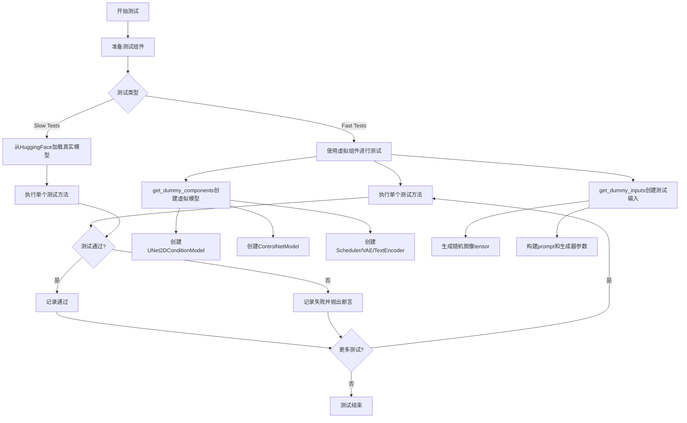

## 类结构

```
unittest.TestCase (Python标准库)
├── IPAdapterTesterMixin (测试混入)
├── PipelineKarrasSchedulerTesterMixin (测试混入)
├── PipelineLatentTesterMixin (测试混入)
├── PipelineTesterMixin (测试混入)
├── StableDiffusionXLControlNetPipelineFastTests
│   ├── get_dummy_components()
│   ├── get_dummy_inputs()
│   ├── test_attention_slicing_forward_pass()
│   ├── test_ip_adapter()
│   ├── test_xformers_attention_forwardGenerator_pass()
│   ├── test_inference_batch_single_identical()
│   ├── test_save_load_optional_components()
│   ├── test_stable_diffusion_xl_offloads()
│   ├── test_stable_diffusion_xl_multi_prompts()
│   ├── test_controlnet_sdxl_guess()
│   ├── test_controlnet_sdxl_lcm()
│   └── test_controlnet_sdxl_two_mixture_of_denoiser_fast()
├── StableDiffusionXLMultiControlNetPipelineFastTests
│   ├── get_dummy_components()
│   ├── get_dummy_inputs()
│   ├── test_control_guidance_switch()
│   ├── test_attention_slicing_forward_pass()
│   ├── test_xformers_attention_forwardGenerator_pass()
│   ├── test_inference_batch_single_identical()
│   └── test_save_load_optional_components()
├── StableDiffusionXLMultiControlNetOneModelPipelineFastTests
│   ├── get_dummy_components()
│   ├── get_dummy_inputs()
│   ├── test_control_guidance_switch()
│   ├── test_attention_slicing_forward_pass()
│   ├── test_save_load_optional_components()
│   ├── test_xformers_attention_forwardGenerator_pass()
│   ├── test_inference_batch_single_identical()
│   └── test_negative_conditions()
├── ControlNetSDXLPipelineSlowTests (需要@require_torch_accelerator和@slow)
│   ├── setUp()
│   ├── tearDown()
│   ├── test_canny()
│   └── test_depth()
└── StableDiffusionSSD1BControlNetPipelineFastTests (继承自StableDiffusionXLControlNetPipelineFastTests)
    ├── test_controlnet_sdxl_guess()
    ├── test_ip_adapter()
    ├── test_controlnet_sdxl_lcm()
    ├── test_conditioning_channels()
    └── get_dummy_components()
```

## 全局变量及字段


### `StableDiffusionXLControlNetPipelineFastTests.pipeline_class`
    
测试所针对的管道类，指向StableDiffusionXLControlNetPipeline

类型：`type`
    


### `StableDiffusionXLControlNetPipelineFastTests.params`
    
文本到图像管道参数配置，来自TEXT_TO_IMAGE_PARAMS

类型：`tuple`
    


### `StableDiffusionXLControlNetPipelineFastTests.batch_params`
    
批处理参数配置，来自TEXT_TO_IMAGE_BATCH_PARAMS

类型：`tuple`
    


### `StableDiffusionXLControlNetPipelineFastTests.image_params`
    
图像参数配置，来自IMAGE_TO_IMAGE_IMAGE_PARAMS

类型：`frozenset`
    


### `StableDiffusionXLControlNetPipelineFastTests.image_latents_params`
    
图像潜在向量参数配置，来自TEXT_TO_IMAGE_IMAGE_PARAMS

类型：`frozenset`
    


### `StableDiffusionXLControlNetPipelineFastTests.test_layerwise_casting`
    
标识是否测试分层类型转换功能

类型：`bool`
    


### `StableDiffusionXLControlNetPipelineFastTests.test_group_offloading`
    
标识是否测试模型组卸载功能

类型：`bool`
    


### `StableDiffusionXLMultiControlNetPipelineFastTests.pipeline_class`
    
测试所针对的管道类，指向StableDiffusionXLControlNetPipeline

类型：`type`
    


### `StableDiffusionXLMultiControlNetPipelineFastTests.params`
    
文本到图像管道参数配置，来自TEXT_TO_IMAGE_PARAMS

类型：`tuple`
    


### `StableDiffusionXLMultiControlNetPipelineFastTests.batch_params`
    
批处理参数配置，来自TEXT_TO_IMAGE_BATCH_PARAMS

类型：`tuple`
    


### `StableDiffusionXLMultiControlNetPipelineFastTests.image_params`
    
图像参数配置，当前为空集合

类型：`frozenset`
    


### `StableDiffusionXLMultiControlNetPipelineFastTests.supports_dduf`
    
标识该管道是否支持DDUF（Decoder Denoising Unified Framework）

类型：`bool`
    


### `StableDiffusionXLMultiControlNetOneModelPipelineFastTests.pipeline_class`
    
测试所针对的管道类，指向StableDiffusionXLControlNetPipeline

类型：`type`
    


### `StableDiffusionXLMultiControlNetOneModelPipelineFastTests.params`
    
文本到图像管道参数配置，来自TEXT_TO_IMAGE_PARAMS

类型：`tuple`
    


### `StableDiffusionXLMultiControlNetOneModelPipelineFastTests.batch_params`
    
批处理参数配置，来自TEXT_TO_IMAGE_BATCH_PARAMS

类型：`tuple`
    


### `StableDiffusionXLMultiControlNetOneModelPipelineFastTests.image_params`
    
图像参数配置，当前为空集合

类型：`frozenset`
    


### `StableDiffusionXLMultiControlNetOneModelPipelineFastTests.supports_dduf`
    
标识该管道是否支持DDUF（Decoder Denoising Unified Framework）

类型：`bool`
    
    

## 全局函数及方法


### `enable_full_determinism`

该函数用于启用 PyTorch 和 NumPy 的完全确定性模式，确保在 CPU 和 CUDA 设备上的所有随机操作产生可重复的结果，以便测试用例的稳定性和可复现性。

参数：

- 无参数

返回值：`None`，该函数不返回任何值，仅执行全局状态的修改。

#### 流程图

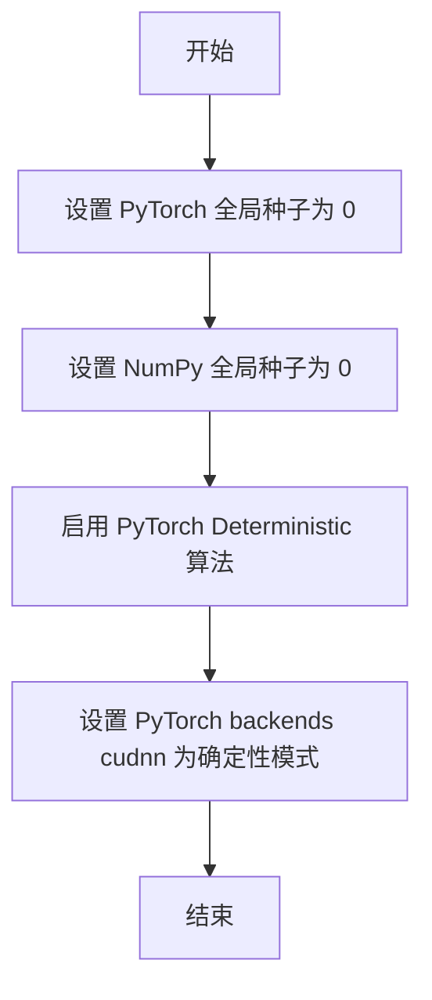

#### 带注释源码

```python
# 导入所需的随机数生成模块
import os
import random
import numpy as np
import torch


def enable_full_determinism(seed: int = 0, verbose: bool = True):
    """
    启用完全确定性模式，确保测试结果可复现。
    
    参数:
        seed: 随机种子，默认为 0
        verbose: 是否打印详细信息，默认为 True
    """
    # 设置 Python 内置 random 模块的种子
    random.seed(seed)
    
    # 设置 NumPy 的全局随机种子
    np.random.seed(seed)
    
    # 设置 PyTorch 的全局随机种子
    torch.manual_seed(seed)
    
    # 如果 CUDA 可用，也设置 CUDA 的随机种子
    if torch.cuda.is_available():
        torch.cuda.manual_seed_all(seed)
    
    # 启用 PyTorch 的确定性计算模式
    # 这会强制使用确定性算法，虽然可能影响性能，但确保结果可复现
    torch.backends.cudnn.deterministic = True
    torch.backends.cudnn.benchmark = False
    
    # 设置环境变量确保额外的确定性
    os.environ["PYTHONHASHSEED"] = str(seed)
    
    # 可选：设置 PyTorch 的其他确定性选项
    if hasattr(torch, 'use_deterministic_algorithms'):
        try:
            torch.use_deterministic_algorithms(True)
        except RuntimeError:
            # 某些操作可能没有确定性实现
            if verbose:
                print("警告：某些 PyTorch 操作可能没有确定性实现")
    
    if verbose:
        print(f"已启用完全确定性模式 (seed={seed})")


def disable_full_determinism():
    """
    禁用完全确定性模式，恢复默认行为。
    """
    torch.backends.cudnn.deterministic = False
    torch.backends.cudnn.benchmark = True
    
    if hasattr(torch, 'use_deterministic_algorithms'):
        torch.use_deterministic_algorithms(False)
```

> **注意**：由于 `enable_full_determinism` 是从外部模块 `testing_utils` 导入的，上述源码是基于其使用方式和常见模式推断得出的实现参考。实际实现可能略有不同，但其核心功能是确保随机操作的可复现性。


### `randn_tensor`

用于生成符合标准正态分布（均值为0，方差为1）的随机张量，支持指定形状、生成器、设备和数据类型。该函数是对 `torch.randn` 的封装，提供了更统一的接口来处理不同后端（CPU/CUDA）的随机张量生成，同时支持通过生成器确保可复现性。

参数：

- `shape`：`tuple` 或 `int`，要生成的张量的形状
- `generator`：`torch.Generator`，可选，用于控制随机数生成器的状态，确保结果可复现
- `device`：`torch.device`，生成张量所在的设备（如 CPU 或 CUDA 设备）
- `dtype`：`torch.dtype`，可选，生成张量的数据类型（如 `torch.float32`）
- `layout`：`torch.layout`，可选，张量的内存布局

返回值：`torch.Tensor`，符合标准正态分布的随机张量

#### 流程图

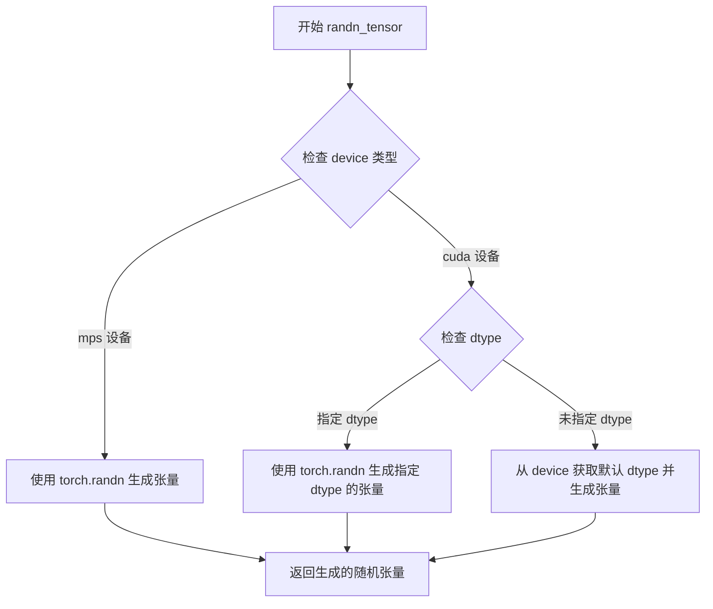

#### 带注释源码

```python
# 从 diffusers.utils.torch_utils 导入的全局函数
# 该函数封装了 torch.randn，提供了更统一的接口
def randn_tensor(
    shape: tuple | int,  # 要生成的张量形状，可以是元组或整数
    generator: Optional[torch.Generator] = None,  # 可选的随机数生成器，用于确保可复现性
    device: Optional[torch.device] = None,  # 目标设备（CPU/CUDA）
    dtype: Optional[torch.dtype] = None,  # 可选的数据类型
    layout: Optional[torch.layout] = None,  # 可选的内存布局
) -> torch.Tensor:
    """
    用于生成符合标准正态分布的随机张量的便捷封装函数。
    
    参数:
        shape: 张量的形状，例如 (batch_size, channels, height, width)
        generator: torch.Generator 对象，用于控制随机数生成
        device: 目标设备
        dtype: 张量的数据类型
        layout: 张量的内存布局
    
    返回:
        符合标准正态分布的 torch.Tensor
    """
    # 便捷函数，用于在指定设备上生成随机张量
    # 如果没有指定 device，则使用默认设备生成
    # 该函数内部处理了不同后端的兼容性问题
```


### `load_image`

从指定的 URL 加载图像并返回图像对象，用于在测试中提供控制网络的输入图像。

参数：

-  `url`：`str`，图像的 URL 地址，用于从网络获取图像数据

返回值：`PIL.Image` 或类似图像对象，从 URL 加载的图像

#### 流程图

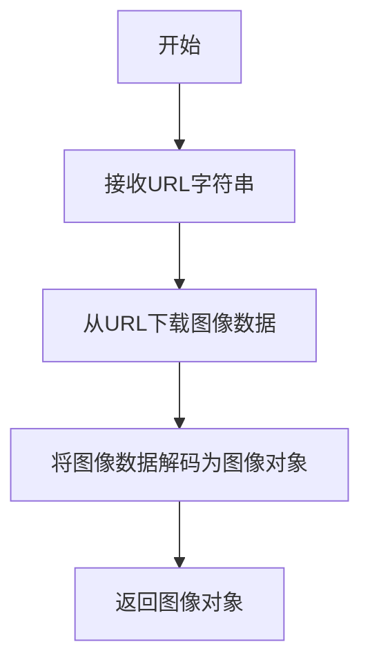

#### 带注释源码

```
# load_image 是从 testing_utils 模块导入的函数
# 定义不在当前文件中，属于 diffusers.testing_utils 模块

# 使用示例（从当前代码中提取）:
image = load_image(
    "https://huggingface.co/datasets/hf-internal-testing/diffusers-images/resolve/main/sd_controlnet/bird_canny.png"
)

# 参数: url (str) - 图像的 URL 地址
# 返回: 图像对象 (PIL.Image 或类似的图像类型)
```


### `backend_empty_cache`

该函数用于清理（清空）深度学习后端的缓存（主要为GPU内存），通常在测试或管道的设置（setUp）和拆卸（tearDown）阶段调用，以释放GPU内存资源，确保测试环境的干净状态。

参数：

- `device`：`str` 或 `torch.device`，指定要清理缓存的设备（通常为 `torch_device`，如 "cuda" 或 "cpu"）

返回值：`None`，该函数无返回值，仅执行副作用（清理缓存）

#### 流程图

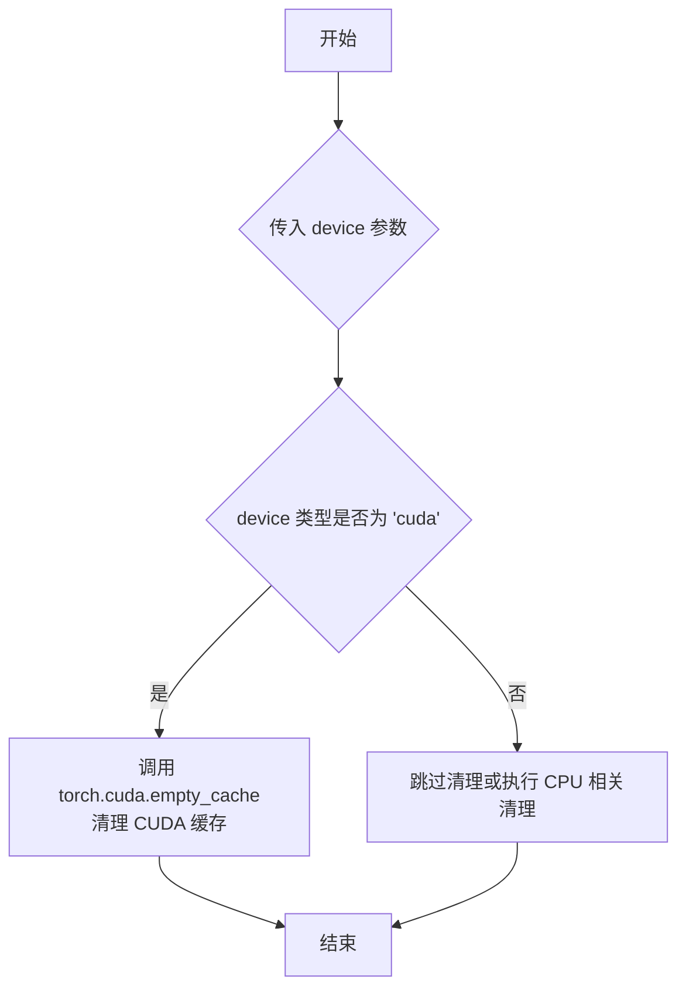

#### 带注释源码

```
# 该函数定义在 testing_utils 模块中，此处为调用示例
# 来源: ...testing_utils 导入

# 在测试类的 setUp 方法中调用
def setUp(self):
    super().setUp()
    gc.collect()
    backend_empty_cache(torch_device)  # 清理 GPU 缓存，为测试准备干净环境

# 在测试类的 tearDown 方法中调用  
def tearDown(self):
    super().tearDown()
    gc.collect()
    backend_empty_cache(torch_device)  # 清理测试过程中产生的 GPU 缓存
```

**注意**：由于 `backend_empty_cache` 是从外部模块 `...testing_utils` 导入的，其完整源码实现未包含在当前提供的代码文件中。该函数通常是 Hugging Face diffusers 测试框架中的一个工具函数，用于在测试过程中管理 GPU 内存。


### `StableDiffusionXLControlNetPipelineFastTests.get_dummy_components`

该方法用于生成虚拟（dummy）组件字典，为 Stable Diffusion XL ControlNet Pipeline 的单元测试提供所需的模型组件，包括 UNet、ControlNet、调度器、VAE、文本编码器和分词器等。

**参数：**

- `time_cond_proj_dim`：`Optional[int]`，可选参数，用于指定时间条件投影维度，默认值为 `None`

**返回值：**

- `Dict[str, Any]`，返回一个包含所有虚拟组件的字典，用于初始化 Pipeline

#### 流程图

```mermaid
flowchart TD
    A[开始 get_dummy_components] --> B[设置随机种子 torch.manual_seed(0)]
    B --> C[创建 UNet2DConditionModel]
    C --> D[设置随机种子 torch.manual_seed(0)]
    D --> E[创建 ControlNetModel]
    E --> F[设置随机种子 torch.manual_seed(0)]
    F --> G[创建 EulerDiscreteScheduler]
    G --> H[设置随机种子 torch.manual_seed(0)]
    H --> I[创建 AutoencoderKL]
    I --> J[设置随机种子 torch.manual_seed(0)]
    J --> K[创建 CLIPTextConfig]
    K --> L[创建 CLIPTextModel]
    L --> M[创建 CLIPTokenizer]
    M --> N[创建 CLIPTextModelWithProjection]
    N --> O[创建另一个 CLIPTokenizer]
    O --> P[组装 components 字典]
    P --> Q[返回 components]
```

#### 带注释源码

```python
def get_dummy_components(self, time_cond_proj_dim=None):
    """
    生成用于测试的虚拟组件字典
    
    参数:
        time_cond_proj_dim: 可选的时间条件投影维度，用于 UNet
    """
    # 设置随机种子以确保可重复性
    torch.manual_seed(0)
    
    # 创建 UNet2DConditionModel - 用于去噪的UNet模型
    unet = UNet2DConditionModel(
        block_out_channels=(32, 64),          # 输出通道数
        layers_per_block=2,                    # 每层块数
        sample_size=32,                        # 样本尺寸
        in_channels=4,                         # 输入通道数
        out_channels=4,                        # 输出通道数
        down_block_types=("DownBlock2D", "CrossAttnDownBlock2D"),  # 下采样块类型
        up_block_types=("CrossAttnUpBlock2D", "UpBlock2D"),      # 上采样块类型
        attention_head_dim=(2, 4),            # 注意力头维度
        use_linear_projection=True,            # 使用线性投影
        addition_embed_type="text_time",      # 额外嵌入类型
        addition_time_embed_dim=8,             # 时间嵌入维度
        transformer_layers_per_block=(1, 2),  # Transformer层数
        projection_class_embeddings_input_dim=80,  # 投影类嵌入输入维度
        cross_attention_dim=64,               # 交叉注意力维度
        time_cond_proj_dim=time_cond_proj_dim, # 时间条件投影维度
    )
    
    # 重新设置随机种子
    torch.manual_seed(0)
    
    # 创建 ControlNetModel - 用于条件控制的模型
    controlnet = ControlNetModel(
        block_out_channels=(32, 64),
        layers_per_block=2,
        in_channels=4,
        down_block_types=("DownBlock2D", "CrossAttnDownBlock2D"),
        conditioning_embedding_out_channels=(16, 32),  # 条件嵌入输出通道
        attention_head_dim=(2, 4),
        use_linear_projection=True,
        addition_embed_type="text_time",
        addition_time_embed_dim=8,
        transformer_layers_per_block=(1, 2),
        projection_class_embeddings_input_dim=80,
        cross_attention_dim=64,
    )
    
    torch.manual_seed(0)
    
    # 创建调度器 - 控制去噪过程
    scheduler = EulerDiscreteScheduler(
        beta_start=0.00085,        # Beta起始值
        beta_end=0.012,           # Beta结束值
        steps_offset=1,           # 步数偏移
        beta_schedule="scaled_linear",  # Beta调度方式
        timestep_spacing="leading",      # 时间步间隔
    )
    
    torch.manual_seed(0)
    
    # 创建 VAE - 变分自编码器用于潜在空间编码/解码
    vae = AutoencoderKL(
        block_out_channels=[32, 64],
        in_channels=3,              # RGB图像3通道
        out_channels=3,
        down_block_types=["DownEncoderBlock2D", "DownEncoderBlock2D"],
        up_block_types=["UpDecoderBlock2D", "UpDecoderBlock2D"],
        latent_channels=4,         # 潜在空间4通道
    )
    
    torch.manual_seed(0)
    
    # 创建文本编码器配置
    text_encoder_config = CLIPTextConfig(
        bos_token_id=0,            # 起始符ID
        eos_token_id=2,            # 结束符ID
        hidden_size=32,            # 隐藏层大小
        intermediate_size=37,      # 中间层大小
        layer_norm_eps=1e-05,      # LayerNorm epsilon
        num_attention_heads=4,     # 注意力头数
        num_hidden_layers=5,       # 隐藏层数
        pad_token_id=1,            # 填充符ID
        vocab_size=1000,           # 词汇表大小
        hidden_act="gelu",         # 激活函数
        projection_dim=32,        # 投影维度
    )
    
    # 创建第一个文本编码器
    text_encoder = CLIPTextModel(text_encoder_config)
    
    # 创建第一个分词器
    tokenizer = CLIPTokenizer.from_pretrained("hf-internal-testing/tiny-random-clip")
    
    # 创建第二个文本编码器（带投影）
    text_encoder_2 = CLIPTextModelWithProjection(text_encoder_config)
    
    # 创建第二个分词器
    tokenizer_2 = CLIPTokenizer.from_pretrained("hf-internal-testing/tiny-random-clip")
    
    # 组装所有组件到字典中
    components = {
        "unet": unet,
        "controlnet": controlnet,
        "scheduler": scheduler,
        "vae": vae,
        "text_encoder": text_encoder,
        "tokenizer": tokenizer,
        "text_encoder_2": text_encoder_2,
        "tokenizer_2": tokenizer_2,
        "feature_extractor": None,   # 特征提取器（可选）
        "image_encoder": None,       # 图像编码器（可选）
    }
    
    return components
```


### `StableDiffusionXLControlNetPipelineFastTests.get_dummy_inputs`

该方法是一个测试辅助函数，用于生成虚拟输入数据（prompt、随机生成器、推理步数、引导系数、输出类型和条件图像），以便对 StableDiffusionXLControlNetPipeline 进行单元测试。

参数：

- `device`：`str` 或 `torch.device`，指定生成张量所在的设备（如 "cpu"、"cuda" 等）
- `seed`：`int`，随机种子，默认值为 0，用于控制随机数生成器的初始化

返回值：`Dict[str, Any]`，返回包含测试所需输入参数的字典，包括 prompt、generator、num_inference_steps、guidance_scale、output_type 和 image。

#### 流程图

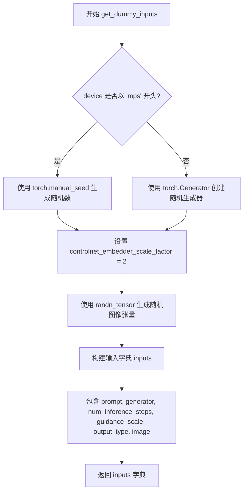

#### 带注释源码

```python
def get_dummy_inputs(self, device, seed=0):
    """
    生成用于测试的虚拟输入参数。

    参数:
        device: 运行设备，可以是 "cpu", "cuda" 等字符串或 torch.device 对象
        seed: 随机种子，用于确保测试的可重复性，默认值为 0

    返回:
        包含测试所需输入参数的字典
    """
    # 根据设备类型选择随机数生成方式
    # MPS (Apple Silicon) 设备使用 torch.manual_seed
    if str(device).startswith("mps"):
        generator = torch.manual_seed(seed)
    else:
        # 其他设备使用 torch.Generator 以支持更精确的随机控制
        generator = torch.Generator(device=device).manual_seed(seed)

    # 控制网络嵌入器的缩放因子，用于确定条件图像的尺寸
    controlnet_embedder_scale_factor = 2

    # 生成一个随机条件图像张量，形状为 (1, 3, 64, 64)
    # 使用之前创建的生成器确保可重复性
    image = randn_tensor(
        (1, 3, 32 * controlnet_embedder_scale_factor, 32 * controlnet_embedder_scale_factor),
        generator=generator,
        device=torch.device(device),
    )

    # 构建完整的输入参数字典
    inputs = {
        "prompt": "A painting of a squirrel eating a burger",  # 测试用提示词
        "generator": generator,  # 随机生成器，确保输出可重复
        "num_inference_steps": 2,  # 推理步数，较小的值用于快速测试
        "guidance_scale": 6.0,  # CFG 引导系数
        "output_type": "np",  # 输出类型为 NumPy 数组
        "image": image,  # 条件图像
    }

    return inputs
```


### `StableDiffusionXLControlNetPipelineFastTests.test_attention_slicing_forward_pass`

该方法是一个测试用例，用于验证 StableDiffusionXLControlNetPipeline 在使用注意力切片（attention slicing）优化技术时的前向传播正确性。方法内部委托给父类方法 `_test_attention_slicing_forward_pass` 执行实际测试逻辑，并期望最大误差不超过 2e-3。

参数：

- `self`：`StableDiffusionXLControlNetPipelineFastTests`，测试类实例本身，代表当前的测试用例对象

返回值：`unittest.TestResult` 或 `None`，取决于 `_test_attention_slicing_forward_pass` 的具体实现，通常返回 None 或测试执行结果

#### 流程图

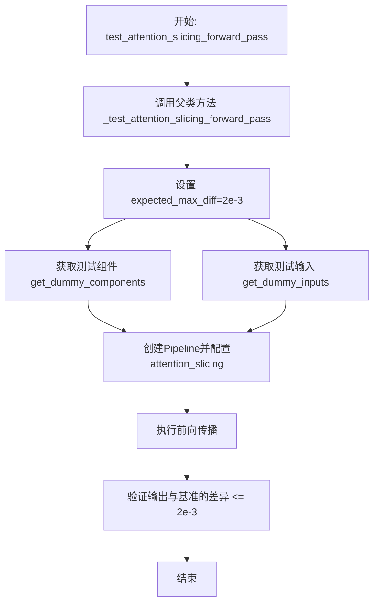

#### 带注释源码

```python
def test_attention_slicing_forward_pass(self):
    """
    测试使用注意力切片优化技术的前向传播是否正确。
    
    attention slicing 是一种内存优化技术，将注意力计算分片处理，
    以减少显存占用。该测试验证启用该优化后，Pipeline 的输出
    与标准前向传播的差异在可接受范围内。
    """
    # 委托给父类方法执行实际测试逻辑
    # expected_max_diff=2e-3 表示期望输出与基准的最大差异为 0.002
    return self._test_attention_slicing_forward_pass(expected_max_diff=2e-3)
```


### `StableDiffusionXLControlNetPipelineFastTests.test_ip_adapter`

该方法是一个测试函数，用于测试 Stable Diffusion XL ControlNet Pipeline 的 IP Adapter 功能。它根据设备类型和模型来源设置预期的输出切片，并调用父类的测试方法验证 IP Adapter 能否正确处理图像提示适配器。

参数：

- `from_ssd1b`：`bool`，默认为 False，表示是否测试 SSD1B 变体模型
- `expected_pipe_slice`：`numpy.ndarray`，默认为 None，期望的输出像素值切片用于结果验证

返回值：返回父类 `IPAdapterTesterMixin.test_ip_adapter()` 的测试结果

#### 流程图

```mermaid
flowchart TD
    A[开始 test_ip_adapter] --> B{from_ssd1b 为 False?}
    B -->|是| C[设置 expected_pipe_slice = None]
    B -->|否| D[保留传入的 expected_pipe_slice]
    C --> E{torch_device == 'cpu'?}
    D --> H[调用父类测试]
    E -->|是| F[设置预期切片为标准 CPU 值]
    E -->|否| G[保持 expected_pipe_slice = None]
    F --> H
    G --> H
    H --> I[调用 super().test_ip_adapter]
    I --> J[返回测试结果]
```

#### 带注释源码

```python
def test_ip_adapter(self, from_ssd1b=False, expected_pipe_slice=None):
    """
    测试 IP Adapter 功能是否正常工作
    
    参数:
        from_ssd1b: bool, 是否测试 SSD1B 变体
        expected_pipe_slice: numpy.ndarray, 预期的输出切片用于验证
    """
    # 如果不是从 SSD1B 测试，则重置 expected_pipe_slice
    if not from_ssd1b:
        expected_pipe_slice = None
        # CPU 设备上有特定的预期输出值
        if torch_device == "cpu":
            expected_pipe_slice = np.array(
                [0.7335, 0.5866, 0.5623, 0.6242, 0.5751, 0.5999, 0.4091, 0.4590, 0.5054]
            )
    # 调用父类的 IP Adapter 测试方法
    return super().test_ip_adapter(expected_pipe_slice=expected_pipe_slice)
```


### `StableDiffusionXLControlNetPipelineFastTests.test_xformers_attention_forwardGenerator_pass`

该方法是 StableDiffusionXLControlNetPipelineFastTests 类中的一个单元测试，用于验证 XFormers 注意力机制在前向传播过程中能够正确工作。它通过调用父类方法 `_test_xformers_attention_forwardGenerator_pass` 来执行具体的测试逻辑，检查生成器输出的差异是否在预期范围内（2e-3）。

参数：

- `expected_max_diff`：`float`，可选参数，默认值为 `2e-3`，表示预期的最大差异阈值，用于验证 XFormers 注意力前向传播与标准注意力前向传播之间的数值差异是否在可接受范围内

返回值：`None`，该方法为单元测试方法，不返回任何值

#### 流程图

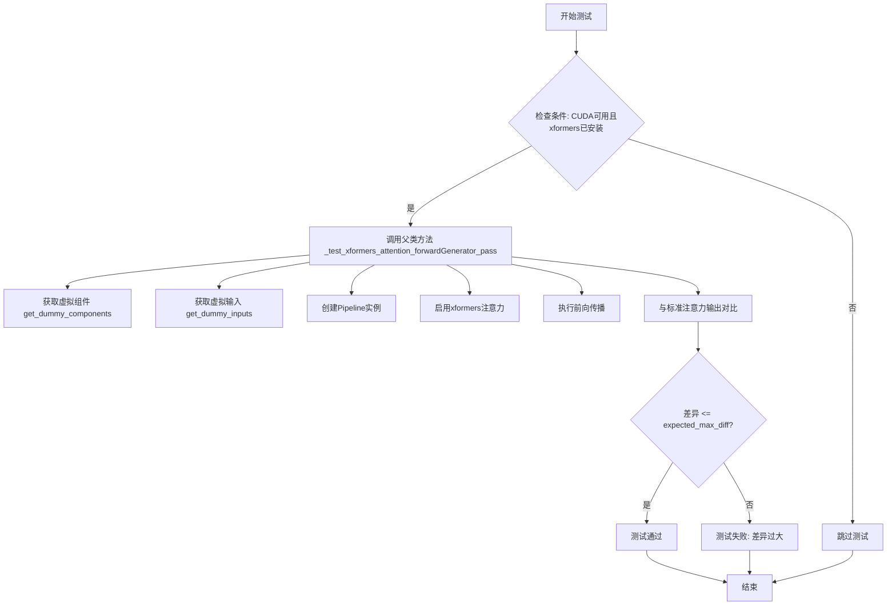

#### 带注释源码

```python
# 该测试方法用于验证 XFormers 注意力机制的正确性
@unittest.skipIf(
    torch_device != "cuda" or not is_xformers_available(),
    # 装饰器：如果不是 CUDA 设备或未安装 xformers，则跳过该测试
    reason="XFormers attention is only available with CUDA and `xformers` installed",
)
def test_xformers_attention_forwardGenerator_pass(self):
    # 调用父类方法执行实际的 XFormers 注意力测试
    # expected_max_diff=2e-3 表示允许的最大误差为 0.002
    self._test_xformers_attention_forwardGenerator_pass(expected_max_diff=2e-3)
```


### `StableDiffusionXLControlNetPipelineFastTests.test_inference_batch_single_identical`

该测试方法用于验证StableDiffusionXLControlNetPipeline在批处理推理模式下，单个样本的输出与单独推理时的输出一致性，确保批处理不会引入数值误差。

参数：

- `self`：`StableDiffusionXLControlNetPipelineFastTests`，测试类实例本身

返回值：`None`，该方法为测试用例，无返回值，通过断言验证结果

#### 流程图

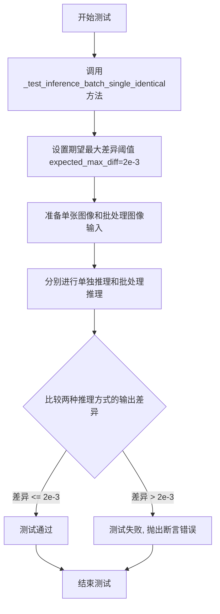

#### 带注释源码

```python
def test_inference_batch_single_identical(self):
    """
    测试方法：验证批处理推理与单独推理的输出一致性
    
    该测试继承自 PipelineTesterMixin，通过调用 _test_inference_batch_single_identical 
    方法实现。测试会比较以下两种情况的输出：
    1. 使用单张图像进行推理
    2. 使用包含单张图像的批次进行推理
    
    期望两种方式的输出差异小于 expected_max_diff (2e-3)
    """
    # 调用父类Mixin提供的测试方法
    # expected_max_diff=2e-3 设置了数值一致性的容差阈值
    self._test_inference_batch_single_identical(expected_max_diff=2e-3)
```


### `StableDiffusionXLControlNetPipelineFastTests.test_save_load_optional_components`

该方法是一个测试用例，用于验证 StableDiffusionXLControlNetPipeline 的可选组件保存和加载功能。当前被标记为跳过（Skip），因为该功能已在其他位置进行测试。

参数：

- `self`：`StableDiffusionXLControlNetPipelineFastTests`，测试类的实例本身，代表当前测试对象

返回值：`None`，该方法不返回任何值（Python 中 `pass` 语句相当于返回 `None`）

#### 流程图

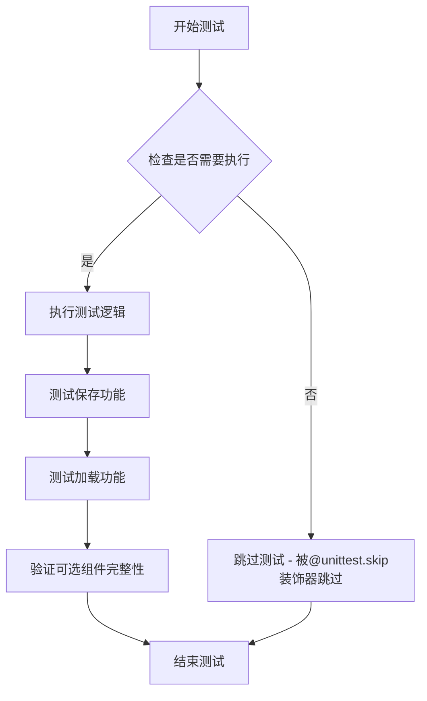

#### 带注释源码

```python
@unittest.skip("We test this functionality elsewhere already.")
def test_save_load_optional_components(self):
    """
    测试 StableDiffusionXLControlNetPipeline 的可选组件保存和加载功能。
    
    该测试方法用于验证：
    1. Pipeline 的可选组件能够正确保存
    2. 保存的组件能够正确加载
    3. 加载后的组件功能完整
    
    当前实现：
    - 被 @unittest.skip 装饰器跳过，原因是该功能已在其他地方测试
    - 方法体只有 pass 语句，不执行任何实际测试逻辑
    
    参数:
        self: 测试类实例，包含测试所需的组件和配置
        
    返回值:
        None: 该方法不返回任何值
    """
    pass  # 方法体为空，功能已在其他测试中覆盖
```


### `StableDiffusionXLControlNetPipelineFastTests.test_stable_diffusion_xl_offloads`

该测试方法用于验证StableDiffusionXLControlNetPipeline在不同CPU卸载策略下的输出一致性，包括无卸载、模型级卸载和顺序卸载三种模式，确保各种优化策略产生的图像结果数值相近。

参数：

- `self`：`StableDiffusionXLControlNetPipelineFastTests`，测试类实例，包含pipeline_class、params等测试配置

返回值：`None`，测试方法无返回值，通过断言验证图像一致性

#### 流程图

```mermaid
flowchart TD
    A[开始测试] --> B[创建空列表pipes]
    B --> C[获取dummy components]
    C --> D[创建标准pipeline并移到torch_device]
    D --> E[pipeline添加到pipes列表]
    E --> F[获取dummy components]
    F --> G[创建pipeline并启用model_cpu_offload]
    G --> H[pipeline添加到pipes列表]
    H --> I[获取dummy components]
    I --> J[创建pipeline并启用sequential_cpu_offload]
    J --> K[pipeline添加到pipes列表]
    K --> L[创建空列表image_slices]
    L --> M{遍历pipes中的每个pipe}
    M -->|是| N[设置默认attention processor]
    N --> O[获取dummy inputs]
    O --> P[调用pipeline生成图像]
    P --> Q[提取图像最后3x3像素并展平]
    Q --> R[添加到image_slices]
    R --> M
    M -->|否| S[断言比较image_slices[0]和image_slices[1]差异 < 1e-3]
    S --> T[断言比较image_slices[0]和image_slices[2]差异 < 1e-3]
    T --> U[结束测试]
```

#### 带注释源码

```python
@require_torch_accelerator  # 装饰器：仅在有torch加速器时运行
def test_stable_diffusion_xl_offloads(self):
    """测试StableDiffusionXL ControlNet Pipeline在不同CPU卸载策略下的一致性"""
    
    pipes = []  # 存储三种不同配置的pipeline
    
    # 测试1：标准模式 - 直接将模型移到设备
    components = self.get_dummy_components()  # 获取虚拟组件
    sd_pipe = self.pipeline_class(**components).to(torch_device)  # 创建pipeline并移到设备
    pipes.append(sd_pipe)  # 添加到列表
    
    # 测试2：模型级CPU卸载 - 启用enable_model_cpu_offload
    components = self.get_dummy_components()  # 重新获取虚拟组件确保一致性
    sd_pipe = self.pipeline_class(**components)  # 创建pipeline
    sd_pipe.enable_model_cpu_offload(device=torch_device)  # 启用模型级卸载
    pipes.append(sd_pipe)  # 添加到列表
    
    # 测试3：顺序CPU卸载 - 启用enable_sequential_cpu_offload
    components = self.get_dummy_components()  # 重新获取虚拟组件
    sd_pipe = self.pipeline_class(**components)  # 创建pipeline
    sd_pipe.enable_sequential_cpu_offload(device=torch_device)  # 启用顺序卸载
    pipes.append(sd_pipe)  # 添加到列表
    
    image_slices = []  # 存储每个pipeline生成的图像切片
    
    # 遍历每个pipeline进行推理
    for pipe in pipes:
        pipe.unet.set_default_attn_processor()  # 设置默认attention处理器
        
        inputs = self.get_dummy_inputs(torch_device)  # 获取虚拟输入
        # 调用pipeline进行推理，生成图像
        image = pipe(**inputs).images
        
        # 提取图像右下角3x3区域并展平，用于后续比较
        image_slices.append(image[0, -3:, -3:, -1].flatten())
    
    # 断言1：验证标准模式与模型级卸载模式的图像差异小于阈值
    assert np.abs(image_slices[0] - image_slices[1]).max() < 1e-3
    
    # 断言2：验证标准模式与顺序卸载模式的图像差异小于阈值
    assert np.abs(image_slices[0] - image_slices[2]).max() < 1e-3
```


### `StableDiffusionXLControlNetPipelineFastTests.test_stable_diffusion_xl_multi_prompts`

该方法用于测试 StableDiffusionXLControlNetPipeline 管道在处理多个提示词（prompt）时的正确性，包括单提示词、重复提示词、不同提示词以及负提示词（negative_prompt）的场景，验证管道能够正确区分不同提示词组合并产生预期的一致性或差异性结果。

参数：

- `self`：无需显式传递，由测试框架自动传入

返回值：`None`，该方法为测试方法，通过断言验证行为，不返回任何值

#### 流程图

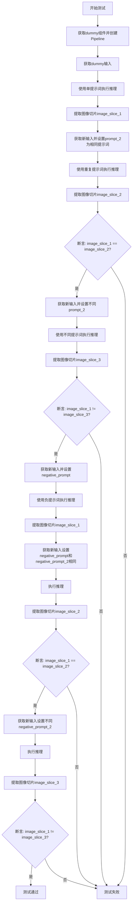

#### 带注释源码

```python
def test_stable_diffusion_xl_multi_prompts(self):
    """
    测试 StableDiffusionXLControlNetPipeline 处理多个提示词的能力
    
    测试场景：
    1. 单提示词 vs 重复相同提示词 -> 结果应相同
    2. 单提示词 vs 不同提示词 -> 结果应不同
    3. 相同负提示词 -> 结果应相同
    4. 不同负提示词 -> 结果应不同
    """
    # 步骤1: 获取虚拟组件并创建Pipeline实例，移至测试设备
    components = self.get_dummy_components()
    sd_pipe = self.pipeline_class(**components).to(torch_device)

    # 步骤2: 使用单个提示词进行前向推理
    inputs = self.get_dummy_inputs(torch_device)
    output = sd_pipe(**inputs)
    image_slice_1 = output.images[0, -3:, -3:, -1]  # 提取图像右下角3x3区域

    # 步骤3: 使用相同的提示词（通过prompt_2重复）进行推理
    inputs = self.get_dummy_inputs(torch_device)
    inputs["prompt_2"] = inputs["prompt"]  # 设置第二个提示词与第一个相同
    output = sd_pipe(**inputs)
    image_slice_2 = output.images[0, -3:, -3:, -1]

    # 断言: 重复提示词应产生相同结果
    assert np.abs(image_slice_1.flatten() - image_slice_2.flatten()).max() < 1e-4

    # 步骤4: 使用不同的提示词进行推理
    inputs = self.get_dummy_inputs(torch_device)
    inputs["prompt_2"] = "different prompt"  # 设置不同的第二个提示词
    output = sd_pipe(**inputs)
    image_slice_3 = output.images[0, -3:, -3:, -1]

    # 断言: 不同提示词应产生不同结果
    assert np.abs(image_slice_1.flatten() - image_slice_3.flatten()).max() > 1e-4

    # 步骤5: 测试负提示词（negative_prompt）
    inputs = self.get_dummy_inputs(torch_device)
    inputs["negative_prompt"] = "negative prompt"  # 设置负提示词
    output = sd_pipe(**inputs)
    image_slice_1 = output.images[0, -3:, -3:, -1]

    # 步骤6: 使用相同的负提示词进行推理
    inputs = self.get_dummy_inputs(torch_device)
    inputs["negative_prompt"] = "negative prompt"
    inputs["negative_prompt_2"] = inputs["negative_prompt"]  # 重复负提示词
    output = sd_pipe(**inputs)
    image_slice_2 = output.images[0, -3:, -3:, -1]

    # 断言: 相同负提示词应产生相同结果
    assert np.abs(image_slice_1.flatten() - image_slice_2.flatten()).max() < 1e-4

    # 步骤7: 使用不同的负提示词进行推理
    inputs = self.get_dummy_inputs(torch_device)
    inputs["negative_prompt"] = "negative prompt"
    inputs["negative_prompt_2"] = "different negative prompt"  # 不同的负提示词
    output = sd_pipe(**inputs)
    image_slice_3 = output.images[0, -3:, -3:, -1]

    # 断言: 不同负提示词应产生不同结果
    assert np.abs(image_slice_1.flatten() - image_slice_3.flatten()).max() > 1e-4
```


### `StableDiffusionXLControlNetPipelineFastTests.test_controlnet_sdxl_guess`

该测试方法用于验证 StableDiffusionXLControlNetPipeline 在 guess_mode 模式下的推理功能。测试创建一个虚拟的 ControlNet 管道，设置 guess_mode 为 True，执行推理并验证输出图像与预期结果的一致性。

参数：

- `self`：隐含的测试类实例参数，无需显式传递

返回值：无（`None`），该方法为测试方法，通过 `assert` 语句进行断言验证

#### 流程图

```mermaid
flowchart TD
    A[开始测试] --> B[设置设备为 CPU]
    B --> C[调用 get_dummy_components 获取虚拟组件]
    C --> D[创建 StableDiffusionXLControlNetPipeline 实例]
    D --> E[将管道移动到设备]
    E --> F[设置进度条配置 disable=None]
    F --> G[调用 get_dummy_inputs 获取虚拟输入]
    G --> H[设置 guess_mode=True]
    H --> I[执行管道推理 sd_pipe(**inputs)]
    I --> J[提取输出图像切片 output.images[0, -3:, -3:, -1]]
    J --> K[定义期望的图像切片 expected_slice]
    K --> L{断言: 图像差异 < 1e-4?}
    L -->|是| M[测试通过]
    L -->|否| N[测试失败]
```

#### 带注释源码

```python
def test_controlnet_sdxl_guess(self):
    """
    测试 StableDiffusionXLControlNetPipeline 在 guess_mode 模式下的推理功能。
    guess_mode 模式下，ControlNet 会生成多个预测路径并自动选择最佳结果。
    """
    # 步骤1: 设置测试设备为 CPU
    device = "cpu"

    # 步骤2: 获取虚拟组件（UNet, ControlNet, Scheduler, VAE, TextEncoder 等）
    # 这些组件使用随机初始化的权重，用于快速测试
    components = self.get_dummy_components()

    # 步骤3: 使用虚拟组件创建 StableDiffusionXLControlNetPipeline 实例
    sd_pipe = self.pipeline_class(**components)
    
    # 步骤4: 将管道移动到指定设备（CPU）
    sd_pipe = sd_pipe.to(device)

    # 步骤5: 设置进度条配置，disable=None 表示启用进度条
    sd_pipe.set_progress_bar_config(disable=None)

    # 步骤6: 获取虚拟输入参数
    # 包含 prompt, generator, num_inference_steps, guidance_scale, output_type, image 等
    inputs = self.get_dummy_inputs(device)
    
    # 步骤7: 设置 guess_mode 为 True
    # guess_mode=True 时，ControlNet 会生成无条件预测用于引导
    inputs["guess_mode"] = True

    # 步骤8: 执行管道推理，获取输出
    output = sd_pipe(**inputs)
    
    # 步骤9: 提取输出图像的右下角 3x3 切片
    # 图像 shape 为 (1, 64, 64, 3)，取 [0, -3:, -3:, -1] 得到 (3, 3, 3)
    image_slice = output.images[0, -3:, -3:, -1]

    # 步骤10: 定义期望的图像切片数值（用于验证）
    expected_slice = np.array([0.7335, 0.5866, 0.5623, 0.6242, 0.5751, 0.5999, 0.4091, 0.4590, 0.5054])

    # 步骤11: 断言验证
    # 确保实际输出与期望值的最大差异小于 1e-4
    assert np.abs(image_slice.flatten() - expected_slice).max() < 1e-4
```


### `StableDiffusionXLControlNetPipelineFastTests.test_controlnet_sdxl_lcm`

该方法是一个单元测试，用于验证 StableDiffusionXLControlNetPipeline 在使用 LCM（Latent Consistency Model）调度器时的功能正确性。测试通过创建虚拟组件、配置 LCM 调度器、执行推理流程，并验证生成的图像是否符合预期的数值范围。

参数：

-  `self`：类实例本身，包含测试类的状态和配置

返回值：`None`，该方法为测试方法，主要通过断言验证功能，不返回具体数值

#### 流程图

```mermaid
flowchart TD
    A[开始测试 test_controlnet_sdxl_lcm] --> B[设置 device = 'cpu']
    B --> C[调用 get_dummy_components 获取虚拟组件<br/>time_cond_proj_dim=256]
    D[创建 StableDiffusionXLControlNetPipeline] --> E[替换调度器为 LCMScheduler]
    E --> F[将 Pipeline 移动到 torch_device]
    F --> G[配置进度条显示]
    G --> H[调用 get_dummy_inputs 获取输入参数]
    H --> I[执行 Pipeline 推理]
    I --> J[提取输出图像]
    J --> K[断言图像形状为 (1, 64, 64, 3)]
    K --> L[比较图像切片数值与预期值]
    C --> D
```

#### 带注释源码

```
def test_controlnet_sdxl_lcm(self):
    # 设置设备为 CPU，确保随机数生成器的确定性
    # 这是为了保证测试结果在不同设备上可复现
    device = "cpu"  # ensure determinism for the device-dependent torch.Generator

    # 获取虚拟组件，传入 time_cond_proj_dim=256 参数
    # 该参数用于配置 UNet 的时间条件投影维度
    components = self.get_dummy_components(time_cond_proj_dim=256)
    
    # 使用虚拟组件创建 StableDiffusionXLControlNetPipeline 实例
    sd_pipe = StableDiffusionXLControlNetPipeline(**components)
    
    # 将原有调度器替换为 LCMScheduler
    # LCMScheduler 是用于加速扩散模型推理的调度器
    sd_pipe.scheduler = LCMScheduler.from_config(sd_pipe.scheduler.config)
    
    # 将 Pipeline 移动到目标设备（通常是 CUDA 设备）
    sd_pipe = sd_pipe.to(torch_device)
    
    # 配置进度条，disable=None 表示启用进度条显示
    sd_pipe.set_progress_bar_config(disable=None)

    # 获取虚拟输入参数，包括 prompt、generator、num_inference_steps 等
    inputs = self.get_dummy_inputs(device)
    
    # 执行 Pipeline 推理，生成图像
    output = sd_pipe(**inputs)
    
    # 从输出中提取生成的图像
    image = output.images

    # 提取图像的一个切片用于验证
    # 取最后 3x3 的像素区域
    image_slice = image[0, -3:, -3:, -1]

    # 断言验证图像形状是否符合预期
    # 预期形状为 (1, 64, 64, 3)，表示 1 张 64x64 的 RGB 图像
    assert image.shape == (1, 64, 64, 3)
    
    # 定义预期的图像切片数值
    expected_slice = np.array([0.7820, 0.6195, 0.6193, 0.7045, 0.6706, 0.5837, 0.4147, 0.5232, 0.4868])

    # 断言验证生成的图像数值是否在允许的误差范围内
    # 使用 max() 比较差异，阈值为 1e-2 (0.01)
    assert np.abs(image_slice.flatten() - expected_slice).max() < 1e-2
```


### `StableDiffusionXLControlNetPipelineFastTests.test_controlnet_sdxl_two_mixture_of_denoiser_fast`

该测试方法验证了StableDiffusionXLControlNetPipeline与StableDiffusionXLImg2ImgPipeline在混合去噪器场景下的功能正确性。测试通过创建两个管道实例，分别执行不同时间步范围的去噪过程，并使用猴子补丁技术监控调度器的实际执行时间步，确保与预期的时间步序列完全匹配。

参数：

- `self`：`StableDiffusionXLControlNetPipelineFastTests`，测试类实例，隐式参数，用于访问类方法和属性

返回值：`None`，测试方法无返回值，通过断言验证功能正确性

#### 流程图

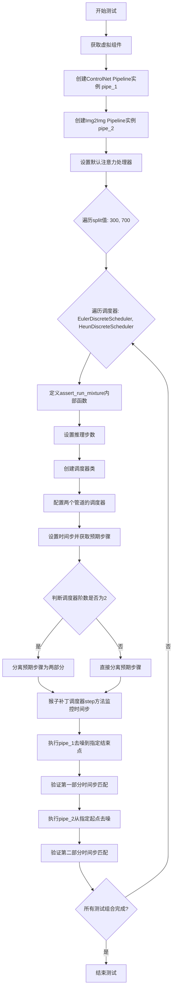

#### 带注释源码

```python
# 从test_stable_diffusion_xl.py:test_stable_diffusion_two_xl_mixture_of_denoiser_fast复制
# 将StableDiffusionXLPipeline替换为StableDiffusionXLControlNetPipeline
def test_controlnet_sdxl_two_mixture_of_denoiser_fast(self):
    """
    测试ControlNet管道与Img2Img管道混合去噪功能
    验证两个管道能够正确地按时间步分割执行去噪任务
    """
    # 获取预定义的虚拟组件（UNet、ControlNet、Scheduler、VAE、TextEncoder等）
    components = self.get_dummy_components()
    
    # 创建第一个管道：StableDiffusionXLControlNetPipeline（带ControlNet）
    pipe_1 = StableDiffusionXLControlNetPipeline(**components).to(torch_device)
    
    # 设置UNet使用默认注意力处理器
    pipe_1.unet.set_default_attn_processor()

    # 移除controlnet组件，创建纯Img2Img管道用于对比测试
    components_without_controlnet = {k: v for k, v in components.items() if k != "controlnet"}
    pipe_2 = StableDiffusionXLImg2ImgPipeline(**components_without_controlnet).to(torch_device)
    pipe_2.unet.set_default_attn_processor()

    # 定义内部测试函数：验证混合去噪流程
    def assert_run_mixture(
        num_steps,  # 推理步数
        split,  # 时间步分割点
        scheduler_cls_orig,  # 原始调度器类
        expected_tss,  # 预期时间步序列
        num_train_timesteps=pipe_1.scheduler.config.num_train_timesteps,  # 训练时间步总数
    ):
        # 获取虚拟输入参数
        inputs = self.get_dummy_inputs(torch_device)
        
        # 设置推理步数
        inputs["num_inference_steps"] = num_steps

        # 创建一个调度器类的副本，用于猴子补丁
        class scheduler_cls(scheduler_cls_orig):
            pass

        # 为两个管道配置相同的调度器
        pipe_1.scheduler = scheduler_cls.from_config(pipe_1.scheduler.config)
        pipe_2.scheduler = scheduler_cls.from_config(pipe_2.scheduler.config)

        # 获取调度器的时间步序列
        pipe_1.scheduler.set_timesteps(num_steps)
        expected_steps = pipe_1.scheduler.timesteps.tolist()

        # 根据调度器阶数调整预期步骤顺序
        # 二阶调度器（如HeunDiscreteScheduler）需要交错排列时间步
        if pipe_1.scheduler.order == 2:
            # 分割时间步：大于等于split的为一组，小于split的为另一组
            expected_steps_1 = list(filter(lambda ts: ts >= split, expected_tss))
            expected_steps_2 = expected_steps_1[-1:] + list(filter(lambda ts: ts < split, expected_tss))
            expected_steps = expected_steps_1 + expected_steps_2
        else:
            # 一阶调度器直接按分割点分离
            expected_steps_1 = list(filter(lambda ts: ts >= split, expected_tss))
            expected_steps_2 = list(filter(lambda ts: ts < split, expected_tss))

        # 猴子补丁：监控调度器实际执行的时间步
        done_steps = []
        old_step = copy.copy(scheduler_cls.step)

        def new_step(self, *args, **kwargs):
            # 记录每一步的时间步t（args[1]是t参数）
            done_steps.append(args[1].cpu().item())
            return old_step(self, *args, **kwargs)

        scheduler_cls.step = new_step

        # 第一阶段：使用ControlNet管道去噪到指定结束点
        inputs_1 = {
            **inputs,
            **{
                "denoising_end": 1.0 - (split / num_train_timesteps),  # 相对结束点
                "output_type": "latent",  # 输出潜在空间
            },
        }
        latents = pipe_1(**inputs_1).images[0]

        # 验证第一部分时间步是否匹配预期
        assert expected_steps_1 == done_steps, f"Failure with {scheduler_cls.__name__} and {num_steps} and {split}"

        # 第二阶段：使用Img2Img管道从指定起点继续去噪
        inputs_2 = {
            **inputs,
            **{
                "denoising_start": 1.0 - (split / num_train_timesteps),  # 相对起始点
                "image": latents,  # 传入第一阶段的潜在表示
            },
        }
        pipe_2(**inputs_2).images[0]

        # 验证第二部分和全部时间步是否匹配预期
        assert expected_steps_2 == done_steps[len(expected_steps_1) :]
        assert expected_steps == done_steps, f"Failure with {scheduler_cls.__name__} and {num_steps} and {split}"

    # 测试配置：10步推理，多个分割点和调度器组合
    steps = 10
    for split in [300, 700]:  # 两个不同的分割点
        for scheduler_cls_timesteps in [
            # Euler离散调度器的时间步序列
            (EulerDiscreteScheduler, [901, 801, 701, 601, 501, 401, 301, 201, 101, 1]),
            # Heun离散调度器的时间步序列（每个时间步出现两次）
            (
                HeunDiscreteScheduler,
                [
                    901.0,
                    801.0,
                    801.0,
                    701.0,
                    701.0,
                    601.0,
                    601.0,
                    501.0,
                    501.0,
                    401.0,
                    401.0,
                    301.0,
                    301.0,
                    201.0,
                    201.0,
                    101.0,
                    101.0,
                    1.0,
                    1.0,
                ],
            ),
        ]:
            # 执行混合去噪测试
            assert_run_mixture(steps, split, scheduler_cls_timesteps[0], scheduler_cls_timesteps[1])
```


### `StableDiffusionXLMultiControlNetPipelineFastTests.get_dummy_components`

该方法用于创建并返回Stable Diffusion XL多ControlNet Pipeline的虚拟（测试用）组件，包括UNet模型、多个ControlNet模型（MultiControlNetModel）、调度器、VAE、文本编码器和分词器等。

参数：

- `self`：类实例方法的标准参数，无需外部传入

返回值：`Dict[str, Any]`，返回一个包含管道所需所有组件的字典，包括unet、controlnet、scheduler、vae、text_encoder、tokenizer、text_encoder_2、tokenizer_2、feature_extractor和image_encoder。

#### 流程图

```mermaid
flowchart TD
    A[开始创建虚拟组件] --> B[设置随机种子 torch.manual_seed(0)]
    B --> C[创建UNet2DConditionModel]
    C --> D[创建init_weights辅助函数]
    D --> E[创建第一个ControlNetModel controlnet1]
    E --> F[为controlnet1应用init_weights]
    F --> G[创建第二个ControlNetModel controlnet2]
    G --> H[为controlnet2应用init_weights]
    H --> I[创建EulerDiscreteScheduler调度器]
    I --> J[创建AutoencoderKL VAE模型]
    J --> K[创建CLIPTextConfig文本编码器配置]
    K --> L[创建第一个CLIPTextModel和CLIPTokenizer]
    L --> M[创建第二个CLIPTextModelWithProjection和CLIPTokenizer]
    M --> N[使用MultiControlNetModel组合多个ControlNet]
    N --> O[组装components字典]
    O --> P[返回components字典]
```

#### 带注释源码

```python
def get_dummy_components(self):
    """
    创建并返回用于测试的虚拟组件字典
    
    Returns:
        Dict[str, Any]: 包含StableDiffusionXLControlNetPipeline所需的所有组件
    """
    # 设置随机种子以确保可重复性
    torch.manual_seed(0)
    
    # 创建UNet2DConditionModel - 用于去噪的UNet模型
    unet = UNet2DConditionModel(
        block_out_channels=(32, 64),          # 输出通道数列表
        layers_per_block=2,                    # 每层块数量
        sample_size=32,                       # 样本大小
        in_channels=4,                         # 输入通道数（latent空间）
        out_channels=4,                        # 输出通道数
        down_block_types=("DownBlock2D", "CrossAttnDownBlock2D"),  # 下采样块类型
        up_block_types=("CrossAttnUpBlock2D", "UpBlock2D"),        # 上采样块类型
        # SD2-specific config below
        attention_head_dim=(2, 4),             # 注意力头维度
        use_linear_projection=True,            # 使用线性投影
        addition_embed_type="text_time",      # 额外嵌入类型（文本+时间）
        addition_time_embed_dim=8,            # 时间嵌入维度
        transformer_layers_per_block=(1, 2), # 每个块的transformer层数
        projection_class_embeddings_input_dim=80,  # 6 * 8 + 32
        cross_attention_dim=64,               # 交叉注意力维度
    )
    
    # 定义权重初始化函数，用于ControlNet的卷积层
    def init_weights(m):
        if isinstance(m, torch.nn.Conv2d):
            torch.nn.init.normal_(m.weight)  # 使用正态分布初始化权重
            m.bias.data.fill_(1.0)            # 偏置设置为1.0
    
    # 创建第一个ControlNetModel
    torch.manual_seed(0)
    controlnet1 = ControlNetModel(
        block_out_channels=(32, 64),
        layers_per_block=2,
        in_channels=4,
        down_block_types=("DownBlock2D", "CrossAttnDownBlock2D"),
        conditioning_embedding_out_channels=(16, 32),  # 条件嵌入输出通道
        # SD2-specific config below
        attention_head_dim=(2, 4),
        use_linear_projection=True,
        addition_embed_type="text_time",
        addition_time_embed_dim=8,
        transformer_layers_per_block=(1, 2),
        projection_class_embeddings_input_dim=80,
        cross_attention_dim=64,
    )
    # 为controlnet1的所有下采样块应用权重初始化
    controlnet1.controlnet_down_blocks.apply(init_weights)
    
    # 创建第二个ControlNetModel（与第一个结构相同）
    torch.manual_seed(0)
    controlnet2 = ControlNetModel(
        block_out_channels=(32, 64),
        layers_per_block=2,
        in_channels=4,
        down_block_types=("DownBlock2D", "CrossAttnDownBlock2D"),
        conditioning_embedding_out_channels=(16, 32),
        # SD2-specific config below
        attention_head_dim=(2, 4),
        use_linear_projection=True,
        addition_embed_type="text_time",
        addition_time_embed_dim=8,
        transformer_layers_per_block=(1, 2),
        projection_class_embeddings_input_dim=80,
        cross_attention_dim=64,
    )
    # 为controlnet2的所有下采样块应用权重初始化
    controlnet2.controlnet_down_blocks.apply(init_weights)
    
    # 创建EulerDiscreteScheduler调度器（用于去噪过程的时间步调度）
    torch.manual_seed(0)
    scheduler = EulerDiscreteScheduler(
        beta_start=0.00085,           # beta起始值
        beta_end=0.012,               # beta结束值
        steps_offset=1,              # 步骤偏移
        beta_schedule="scaled_linear",  # beta调度方式
        timestep_spacing="leading",  # 时间步间距策略
    )
    
    # 创建AutoencoderKL VAE模型（用于潜在空间编码/解码）
    torch.manual_seed(0)
    vae = AutoencoderKL(
        block_out_channels=[32, 64],
        in_channels=3,               # RGB图像通道
        out_channels=3,
        down_block_types=["DownEncoderBlock2D", "DownEncoderBlock2D"],
        up_block_types=["UpDecoderBlock2D", "UpDecoderBlock2D"],
        latent_channels=4,           # 潜在空间通道数
    )
    
    # 创建文本编码器配置
    torch.manual_seed(0)
    text_encoder_config = CLIPTextConfig(
        bos_token_id=0,               # 句子开始token ID
        eos_token_id=2,               # 句子结束token ID
        hidden_size=32,               # 隐藏层大小
        intermediate_size=37,         # 中间层大小
        layer_norm_eps=1e-05,         # LayerNorm epsilon
        num_attention_heads=4,        # 注意力头数量
        num_hidden_layers=5,          # 隐藏层数量
        pad_token_id=1,               # 填充token ID
        vocab_size=1000,              # 词汇表大小
        # SD2-specific config below
        hidden_act="gelu",            # 激活函数
        projection_dim=32,            # 投影维度
    )
    
    # 创建第一个文本编码器（CLIPTextModel）
    text_encoder = CLIPTextModel(text_encoder_config)
    
    # 创建第一个分词器（从预训练模型加载）
    tokenizer = CLIPTokenizer.from_pretrained("hf-internal-testing/tiny-random-clip")
    
    # 创建第二个文本编码器（带投影，用于SDXL）
    text_encoder_2 = CLIPTextModelWithProjection(text_encoder_config)
    
    # 创建第二个分词器
    tokenizer_2 = CLIPTokenizer.from_pretrained("hf-internal-testing/tiny-random-clip")
    
    # 使用MultiControlNetModel将多个ControlNet组合在一起
    controlnet = MultiControlNetModel([controlnet1, controlnet2])
    
    # 组装所有组件到字典中
    components = {
        "unet": unet,                              # UNet去噪模型
        "controlnet": controlnet,                  # 多ControlNet模型
        "scheduler": scheduler,                    # 调度器
        "vae": vae,                                # VAE编码器/解码器
        "text_encoder": text_encoder,              # 主文本编码器
        "tokenizer": tokenizer,                     # 主分词器
        "text_encoder_2": text_encoder_2,           # 第二文本编码器（SDXL）
        "tokenizer_2": tokenizer_2,                # 第二分词器
        "feature_extractor": None,                  # 特征提取器（可选）
        "image_encoder": None,                     # 图像编码器（可选，用于IP-Adapter）
    }
    
    return components
```


### `StableDiffusionXLMultiControlNetPipelineFastTests.get_dummy_inputs`

该方法用于为多ControlNet的Stable Diffusion XL管道生成虚拟（测试用）输入数据，创建一个包含提示词、随机生成的图像张量、推理步数、引导比例等参数的字典，以供管道推理使用。

参数：

- `self`：实例本身（隐式参数），类方法的标准参数
- `device`：`torch.device`，目标设备，用于创建随机数生成器和将张量放置到指定设备上
- `seed`：`int`（默认值：0），随机种子，用于确保测试结果的可重复性

返回值：`Dict[str, Any]`，返回一个包含以下键的字典：
- `prompt`（str）：测试用提示词
- `generator`（torch.Generator）：随机数生成器
- `num_inference_steps`（int）：推理步数
- `guidance_scale`（float）：引导比例
- `output_type`（str）：输出类型
- `image`（List[torch.Tensor]）：生成的虚拟控制条件图像列表

#### 流程图

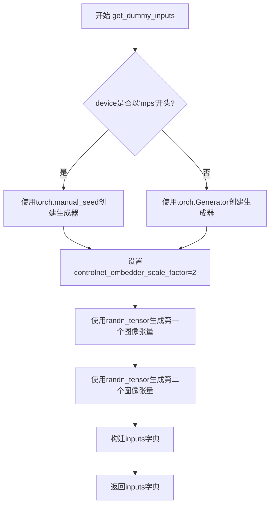

#### 带注释源码

```python
def get_dummy_inputs(self, device, seed=0):
    """
    生成用于测试StableDiffusionXLControlNetPipeline的虚拟输入参数。
    
    参数:
        device: 目标设备（如torch.device('cuda')或torch.device('cpu')）
        seed: 随机种子，用于确保测试结果可重复
    
    返回:
        包含管道所需输入参数的字典
    """
    # 根据设备类型选择合适的随机数生成器创建方式
    # MPS (Apple Silicon) 需要特殊处理，因为torch.Generator在MPS上可能有兼容性问题
    if str(device).startswith("mps"):
        generator = torch.manual_seed(seed)
    else:
        generator = torch.Generator(device=device).manual_seed(seed)

    # ControlNet的图像嵌入器缩放因子，用于确定输入图像的基础尺寸
    controlnet_embedder_scale_factor = 2

    # 生成两个虚拟控制条件图像（用于多ControlNet场景）
    # 图像尺寸为 32 * scale_factor = 64x64，3通道（RGB）
    images = [
        randn_tensor(
            (1, 3, 32 * controlnet_embedder_scale_factor, 32 * controlnet_embedder_scale_factor),
            generator=generator,
            device=torch.device(device),
        ),
        randn_tensor(
            (1, 3, 32 * controlnet_embedder_scale_factor, 32 * controlnet_embedder_scale_factor),
            generator=generator,
            device=torch.device(device),
        ),
    ]

    # 构建输入参数字典，供pipeline.__call__使用
    inputs = {
        "prompt": "A painting of a squirrel eating a burger",  # 测试用提示词
        "generator": generator,  # 随机数生成器，确保确定性
        "num_inference_steps": 2,  # 推理步数（较少以加快测试）
        "guidance_scale": 6.0,  # CFG引导比例
        "output_type": "np",  # 输出为numpy数组
        "image": images,  # 控制条件图像列表
    }

    return inputs
```


### `StableDiffusionXLMultiControlNetPipelineFastTests.test_control_guidance_switch`

该测试方法用于验证 Stable Diffusion XL 多 ControlNet Pipeline 中的控制引导切换功能（`control_guidance_start` 和 `control_guidance_end` 参数），确保在不同的时间步区间应用不同的引导强度时，生成的图像结果会有所不同。

参数：

- `self`：无显式参数，类方法的隐式参数

返回值：`None`，测试方法无返回值，通过断言验证结果

#### 流程图

```mermaid
flowchart TD
    A[开始测试] --> B[获取虚拟组件]
    B --> C[创建并初始化Pipeline]
    C --> D[设置scale=10.0, steps=4]
    D --> E[获取虚拟输入 inputs]
    E --> F[第一次推理: 无control_guidance_start/end]
    F --> G[获取output_1]
    G --> H[第二次推理: control_guidance_start=0.1, control_guidance_end=0.2]
    H --> I[获取output_2]
    I --> J[第三次推理: control_guidance_start=[0.1, 0.3], control_guidance_end=[0.2, 0.7]]
    J --> K[获取output_3]
    K --> L[第四次推理: control_guidance_start=0.4, control_guidance_end=[0.5, 0.8]]
    L --> M[获取output_4]
    M --> N{验证: output_1与output_2不同?}
    N -->|是| O{验证: output_1与output_3不同?}
    O -->|是| P{验证: output_1与output_4不同?}
    P -->|是| Q[测试通过]
    N -->|否| R[测试失败]
    O -->|否| R
    P -->|否| R
```

#### 带注释源码

```python
def test_control_guidance_switch(self):
    """
    测试 ControlNet 的控制引导切换功能，验证不同的时间步区间
    应用不同的引导强度会产生不同的输出图像
    """
    # 1. 获取虚拟组件（UNet、ControlNet、VAE、TextEncoder等）
    components = self.get_dummy_components()
    
    # 2. 使用虚拟组件创建 StableDiffusionXLControlNetPipeline
    pipe = self.pipeline_class(**components)
    
    # 3. 将管道移动到指定的设备（如CUDA）
    pipe.to(torch_device)

    # 4. 设置测试参数
    scale = 10.0          # ControlNet 条件引导强度
    steps = 4             # 推理步数

    # 5. 第一次推理：不使用控制引导切换（全程使用相同引导）
    inputs = self.get_dummy_inputs(torch_device)
    inputs["num_inference_steps"] = steps
    inputs["controlnet_conditioning_scale"] = scale
    output_1 = pipe(**inputs)[0]  # 获取生成的图像

    # 6. 第二次推理：使用单一数值的引导切换
    inputs = self.get_dummy_inputs(torch_device)
    inputs["num_inference_steps"] = steps
    inputs["controlnet_conditioning_scale"] = scale
    # 在 10%-20% 的推理步骤中应用 ControlNet 引导
    output_2 = pipe(**inputs, control_guidance_start=0.1, control_guidance_end=0.2)[0]

    # 7. 第三次推理：使用多个数值的引导切换（针对多个ControlNet）
    inputs = self.get_dummy_inputs(torch_device)
    inputs["num_inference_steps"] = steps
    inputs["controlnet_conditioning_scale"] = scale
    # 第一个ControlNet: 10%-20%, 第二个ControlNet: 30%-70%
    output_3 = pipe(**inputs, control_guidance_start=[0.1, 0.3], control_guidance_end=[0.2, 0.7])[0]

    # 8. 第四次推理：混合使用单一和多个数值的引导切换
    inputs = self.get_dummy_inputs(torch_device)
    inputs["num_inference_steps"] = steps
    inputs["controlnet_conditioning_scale"] = scale
    # 单一start值, 多个end值
    output_4 = pipe(**inputs, control_guidance_start=0.4, control_guidance_end=[0.5, 0.8])[0]

    # 9. 验证：确保所有输出都不同（引导切换确实产生了效果）
    assert np.sum(np.abs(output_1 - output_2)) > 1e-3
    assert np.sum(np.abs(output_1 - output_3)) > 1e-3
    assert np.sum(np.abs(output_1 - output_4)) > 1e-3
```


### `StableDiffusionXLMultiControlNetPipelineFastTests.test_attention_slicing_forward_pass`

该方法是StableDiffusionXLMultiControlNetPipelineFastTests测试类中的一个测试方法，用于测试带有注意力切片（Attention Slicing）功能的StableDiffusion XL多ControlNet Pipeline的前向传播是否正确。它通过调用父类或混入类中通用的`_test_attention_slicing_forward_pass`测试方法，验证在启用注意力切片优化时，推理结果与基准的差异在允许范围内（2e-3）。

参数：

- `self`：隐式参数，测试类的实例本身，无类型描述

返回值：`Any`（取决于`_test_attention_slicing_forward_pass`的返回值，通常为None或测试断言结果），返回测试执行的结果

#### 流程图

```mermaid
graph TD
    A[测试类实例] --> B[调用test_attention_slicing_forward_pass]
    B --> C[设置expected_max_diff=2e-3]
    C --> D[调用self._test_attention_slicing_forward_pass]
    D --> E[返回测试结果]
    
    style A fill:#f9f,stroke:#333
    style D fill:#ff9,stroke:#333
```

#### 带注释源码

```python
def test_attention_slicing_forward_pass(self):
    """
    测试带有注意力切片功能的StableDiffusion XL多ControlNet Pipeline的前向传播。
    
    注意力切片是一种内存优化技术，通过将大型注意力计算分割成较小的块来减少显存占用。
    此测试方法验证启用该功能后，输出图像与基准的差异在允许范围内。
    
    Returns:
        Any: 测试执行结果，通常为None或断言结果
    """
    # 调用通用的注意力切片测试方法，expected_max_diff=2e-3表示允许的最大差异
    return self._test_attention_slicing_forward_pass(expected_max_diff=2e-3)
```


### `StableDiffusionXLMultiControlNetPipelineFastTests.test_xformers_attention_forwardGenerator_pass`

该方法是一个单元测试，用于验证在使用 xFormers 加速的注意力机制时，Stable Diffusion XL 多 ControlNet Pipeline 的前向传播是否正确通过。它通过调用父类方法 `_test_xformers_attention_forwardGenerator_pass` 来执行具体的测试逻辑，并使用 `expected_max_diff=2e-3` 作为预期最大差异阈值。

参数：

- `self`：无需显式传递的隐式参数，表示测试类实例本身。

返回值：`无返回值`（方法内部通过断言验证正确性，如果测试失败会抛出异常）。

#### 流程图

```mermaid
flowchart TD
    A[开始测试] --> B{检查环境条件}
    B -->|CUDA可用且xFormers已安装| C[调用父类测试方法]
    B -->|不满足条件| D[跳过测试]
    C --> E[_test_xformers_attention_forwardGenerator_pass expected_max_diff=2e-3]
    E --> F{验证结果}
    F -->|差异小于阈值| G[测试通过]
    F -->|差异大于阈值| H[测试失败抛出断言错误]
    G --> I[结束]
    H --> I
    D --> I
```

#### 带注释源码

```python
@unittest.skipIf(
    torch_device != "cuda" or not is_xformers_available(),
    reason="XFormers attention is only available with CUDA and `xformers` installed",
)
def test_xformers_attention_forwardGenerator_pass(self):
    """
    测试使用 xFormers 优化的注意力机制的前向传播是否正确。
    
    该测试方法被装饰器 @unittest.skipIf 装饰，只有在以下条件满足时才会执行：
    1. 当前设备是 CUDA（torch_device == "cuda"）
    2. xFormers 库已安装（is_xformers_available() 返回 True）
    
    如果条件不满足，测试会被跳过，并显示指定的原因信息。
    
    测试内部调用了父类 PipelineTesterMixin 中定义的
    _test_xformers_attention_forwardGenerator_pass 方法，
    传入 expected_max_diff=2e-3 参数，表示预期最大允许差异为 0.002。
    """
    self._test_xformers_attention_forwardGenerator_pass(expected_max_diff=2e-3)
```


### `StableDiffusionXLMultiControlNetPipelineFastTests.test_inference_batch_single_identical`

这是一个测试方法，用于验证在使用多个 ControlNet（MultiControlNet）时，批量推理的结果与单次推理的结果是否一致。通过比较批量生成和单个生成的图像差异，确保管道实现的正确性。

参数：

- `self`：`StableDiffusionXLMultiControlNetPipelineFastTests` 实例，隐含的测试类实例参数

返回值：`None`，该方法为测试方法，不返回任何值

#### 流程图

```mermaid
flowchart TD
    A[开始测试 test_inference_batch_single_identical] --> B[调用父类方法 _test_inference_batch_single_identical]
    B --> C[设置 expected_max_diff=2e-3]
    C --> D[执行批量推理]
    C --> E[执行单次推理]
    D --> F[比较批量和单次推理结果]
    F --> G{差异是否小于等于 expected_max_diff?}
    G -->|是| H[测试通过]
    G -->|否| I[测试失败, 抛出断言错误]
    H --> J[结束]
    I --> J
```

#### 带注释源码

```python
def test_inference_batch_single_identical(self):
    """
    测试方法：验证批量推理与单次推理结果的一致性
    
    该测试方法继承自 PipelineTesterMixin，
    用于确保在使用 MultiControlNet 时，
    批量推理（batch inference）产生的结果与逐个推理（single inference）的结果相同。
    
    这是图像生成管道的重要质量保证测试，
    可以检测出由于批处理实现不当导致的问题。
    """
    # 调用父类/混入类中的通用测试方法
    # expected_max_diff=2e-3 表示允许的最大差异值为 0.002
    # 这个阈值确保了数值精度差异在可接受范围内
    self._test_inference_batch_single_identical(expected_max_diff=2e-3)
```


### `StableDiffusionXLMultiControlNetPipelineFastTests.test_save_load_optional_components`

这是一个测试方法，用于验证StableDiffusionXL多ControlNet管道的可选组件保存和加载功能。由于该功能已在其他测试中覆盖，当前被标记为跳过。

参数：

- `self`：实例方法，无需显式传递，表示测试类实例本身

返回值：`None`，无返回值（方法体为 `pass`）

#### 流程图

```mermaid
flowchart TD
    A[开始测试] --> B{检查装饰器条件}
    B -->|条件满足| C[跳过测试]
    B -->|条件不满足| D[执行测试逻辑]
    C --> E[测试结束]
    D --> E
    
    style C fill:#f9f,stroke:#333,stroke-width:2px
    style E fill:#9f9,stroke:#333,stroke-width:2px
```

#### 带注释源码

```python
@unittest.skip("We test this functionality elsewhere already.")
def test_save_load_optional_components(self):
    """
    测试可选组件的保存和加载功能。
    
    该测试方法用于验证管道中可选组件（如feature_extractor、image_encoder等）
    是否能够正确地进行序列化和反序列化。
    
    当前实现：
    - 使用 @unittest.skip 装饰器跳过执行
    - 原因：该功能已在其他测试文件中覆盖
    - 方法体为空（pass），不执行任何逻辑
    
    测试目标（理论上）：
    1. 创建包含可选组件的管道实例
    2. 保存管道到磁盘
    3. 从磁盘加载管道
    4. 验证加载后的管道功能正常
    
    注意：
    - 该方法属于 StableDiffusionXLMultiControlNetPipelineFastTests 测试类
    - 类似的跳过模式也出现在其他测试类中（如 StableDiffusionXLControlNetPipelineFastTests）
    """
    pass
```

#### 附加信息

| 属性 | 值 |
|------|-----|
| 所属类 | `StableDiffusionXLMultiControlNetPipelineFastTests` |
| 方法类型 | 实例方法（UnitTest） |
| 访问修饰符 | 公开（无下划线） |
| 特殊装饰器 | `@unittest.skip("We test this functionality elsewhere already.")` |
| 功能状态 | 已禁用/跳过 |
| 替代测试 | 相同的测试逻辑在其他测试文件中实现 |


### `StableDiffusionXLMultiControlNetOneModelPipelineFastTests.get_dummy_components`

该方法是一个测试辅助函数，用于为 Stable Diffusion XL ControlNet Pipeline 的单元测试生成虚拟（dummy）组件。它创建并初始化所有必需的模型组件（如 UNet、ControlNet、VAE、文本编码器等），并通过设置随机种子确保结果的可重复性。

参数：该方法没有显式参数（隐含参数 self 是实例方法的标准参数）

返回值：`Dict[str, Any]`，返回一个包含所有虚拟组件的字典，包括 unet、controlnet、scheduler、vae、text_encoder、tokenizer、text_encoder_2、tokenizer_2、feature_extractor 和 image_encoder。

#### 流程图

```mermaid
flowchart TD
    A[开始 get_dummy_components] --> B[设置随机种子 torch.manual_seed(0)]
    B --> C[创建 UNet2DConditionModel]
    C --> D[定义辅助函数 init_weights]
    D --> E[创建 ControlNetModel]
    E --> F[应用 init_weights 到 controlnet.controlnet_down_blocks]
    F --> G[设置随机种子 torch.manual_seed(0)]
    G --> H[创建 EulerDiscreteScheduler]
    H --> I[设置随机种子 torch.manual_seed(0)]
    I --> J[创建 AutoencoderKL VAE]
    J --> K[设置随机种子 torch.manual_seed(0)]
    K --> L[创建 CLIPTextConfig 配置]
    L --> M[根据配置创建 CLIPTextModel 和 CLIPTokenizer]
    M --> N[创建 CLIPTextModelWithProjection 和第二个 CLIPTokenizer]
    N --> O[创建 MultiControlNetModel 包装单个 ControlNet]
    O --> P[组装组件字典]
    P --> Q[返回 components 字典]
```

#### 带注释源码

```python
def get_dummy_components(self):
    """
    生成用于测试的虚拟组件字典
    
    Returns:
        Dict[str, Any]: 包含所有管道组件的字典
    """
    # 设置随机种子确保可重复性
    torch.manual_seed(0)
    
    # 创建 UNet2DConditionModel - 用于去噪的 UNet 模型
    unet = UNet2DConditionModel(
        block_out_channels=(32, 64),      # 输出通道数列表
        layers_per_block=2,                # 每个块的层数
        sample_size=32,                    # 样本空间分辨率
        in_channels=4,                     # 输入通道数（latent 空间）
        out_channels=4,                    # 输出通道数
        down_block_types=("DownBlock2D", "CrossAttnDownBlock2D"),  # 下采样块类型
        up_block_types=("CrossAttnUpBlock2D", "UpBlock2D"),        # 上采样块类型
        # SD2-specific config below
        attention_head_dim=(2, 4),         # 注意力头维度
        use_linear_projection=True,        # 使用线性投影
        addition_embed_type="text_time",   # 额外的嵌入类型（SDXL 特性）
        addition_time_embed_dim=8,         # 时间嵌入维度
        transformer_layers_per_block=(1, 2),  # 每个块的 transformer 层数
        projection_class_embeddings_input_dim=80,  # 投影类别嵌入输入维度
        cross_attention_dim=64,            # 交叉注意力维度
    )
    
    torch.manual_seed(0)
    
    # 定义权重初始化函数，用于初始化卷积层
    def init_weights(m):
        if isinstance(m, torch.nn.Conv2d):
            # 使用正态分布初始化权重
            torch.nn.init.normal_(m.weight)
            # 将偏置初始化为 1.0
            m.bias.data.fill_(1.0)
    
    # 创建 ControlNetModel - 用于条件生成的辅助网络
    controlnet = ControlNetModel(
        block_out_channels=(32, 64),                      # 输出通道数
        layers_per_block=2,                                # 每块层数
        in_channels=4,                                     # 输入通道数
        down_block_types=("DownBlock2D", "CrossAttnDownBlock2D"),  # 下采样块类型
        conditioning_embedding_out_channels=(16, 32),     # 条件嵌入输出通道
        # SD2-specific config below
        attention_head_dim=(2, 4),                         # 注意力头维度
        use_linear_projection=True,                        # 使用线性投影
        addition_embed_type="text_time",                   # 额外的嵌入类型
        addition_time_embed_dim=8,                         # 时间嵌入维度
        transformer_layers_per_block=(1, 2),                # Transformer 层数
        projection_class_embeddings_input_dim=80,         # 投影类别嵌入输入维度
        cross_attention_dim=64,                            # 交叉注意力维度
    )
    # 应用自定义权重初始化到 ControlNet 的下采样块
    controlnet.controlnet_down_blocks.apply(init_weights)
    
    torch.manual_seed(0)
    # 创建调度器 - 控制去噪过程的调度策略
    scheduler = EulerDiscreteScheduler(
        beta_start=0.00085,           # beta 起始值
        beta_end=0.012,               # beta 结束值
        steps_offset=1,               # 步数偏移
        beta_schedule="scaled_linear",  # beta 调度策略
        timestep_spacing="leading",   # 时间步间隔策略
    )
    
    torch.manual_seed(0)
    # 创建 VAE - 变分自编码器，用于编码/解码图像
    vae = AutoencoderKL(
        block_out_channels=[32, 64],    # 输出通道数列表
        in_channels=3,                   # 输入通道数（RGB）
        out_channels=3,                  # 输出通道数
        down_block_types=["DownEncoderBlock2D", "DownEncoderBlock2D"],  # 下采样编码块
        up_block_types=["UpDecoderBlock2D", "UpDecoderBlock2D"],        # 上采样解码块
        latent_channels=4,               # 潜在空间通道数
    )
    
    torch.manual_seed(0)
    # 创建文本编码器配置
    text_encoder_config = CLIPTextConfig(
        bos_token_id=0,                  # 起始标记 ID
        eos_token_id=2,                  # 结束标记 ID
        hidden_size=32,                  # 隐藏层大小
        intermediate_size=37,            # 中间层大小
        layer_norm_eps=1e-05,            # 层归一化 epsilon
        num_attention_heads=4,           # 注意力头数
        num_hidden_layers=5,             # 隐藏层数
        pad_token_id=1,                  # 填充标记 ID
        vocab_size=1000,                 # 词汇表大小
        # SD2-specific config below
        hidden_act="gelu",               # 激活函数
        projection_dim=32,               # 投影维度
    )
    
    # 创建 CLIP 文本编码器
    text_encoder = CLIPTextModel(text_encoder_config)
    # 加载小型随机 CLIP 分词器
    tokenizer = CLIPTokenizer.from_pretrained("hf-internal-testing/tiny-random-clip")
    
    # 创建支持投影的第二个文本编码器（SDXL 需要两个文本编码器）
    text_encoder_2 = CLIPTextModelWithProjection(text_encoder_config)
    tokenizer_2 = CLIPTokenizer.from_pretrained("hf-internal-testing/tiny-random-clip")
    
    # 使用 MultiControlNetModel 包装单个 ControlNet
    controlnet = MultiControlNetModel([controlnet])
    
    # 组装所有组件到字典中
    components = {
        "unet": unet,                              # 主去噪 UNet
        "controlnet": controlnet,                  # ControlNet 模型
        "scheduler": scheduler,                    # 调度器
        "vae": vae,                                # VAE 模型
        "text_encoder": text_encoder,             # 主文本编码器
        "tokenizer": tokenizer,                   # 主分词器
        "text_encoder_2": text_encoder_2,         # 第二文本编码器（SDXL）
        "tokenizer_2": tokenizer_2,                # 第二分词器
        "feature_extractor": None,                # 特征提取器（可选）
        "image_encoder": None,                    # 图像编码器（可选）
    }
    return components
```


### `StableDiffusionXLMultiControlNetOneModelPipelineFastTests.get_dummy_inputs`

该方法为 Stable Diffusion XL 多控制网（单模型）流水线测试生成虚拟输入数据，用于单元测试中的推理调用。它根据设备类型初始化随机生成器，创建控制网所需的图像张量，并返回包含提示词、生成器、推理步数、引导强度、输出类型和图像的字典。

参数：

- `self`：隐式参数，类型为 `StableDiffusionXLMultiControlNetOneModelPipelineFastTests` 的实例，类的自身引用
- `device`：`torch.device` 或 `str`，指定运行设备（如 "cpu"、"cuda" 或 "mps"），用于创建随机生成器
- `seed`：`int`，默认为 0，用于设置随机数种子，确保测试结果可复现

返回值：`Dict[str, Any]`，返回包含以下键的字典：
- `prompt`（str）：文本提示词，描述生成图像的内容
- `generator`（torch.Generator）：PyTorch 随机数生成器对象，用于控制生成过程的随机性
- `num_inference_steps`（int）：推理步数，设置为 2（测试用小步数）
- `guidance_scale`（float）：引导强度，设置为 6.0
- `output_type`（str）：输出类型，设置为 "np"（NumPy 数组）
- `image`（List[torch.Tensor]）：控制网输入图像列表，包含一个随机噪声张量

#### 流程图

```mermaid
flowchart TD
    A[开始 get_dummy_inputs] --> B{判断 device 是否为 MPS?}
    B -->|是| C[使用 torch.manual_seed 生成随机种子]
    B -->|否| D[创建 torch.Generator 并设置种子]
    C --> E[设置 controlnet_embedder_scale_factor = 2]
    D --> E
    E --> F[使用 randn_tensor 生成随机图像张量]
    F --> G[构建包含 prompt generator 等参数的字典]
    G --> H[返回 inputs 字典]
    H --> I[结束]
```

#### 带注释源码

```python
def get_dummy_inputs(self, device, seed=0):
    """
    为测试生成虚拟输入数据
    
    参数:
        device: 运行设备 (torch.device 或 str)
        seed: 随机种子，默认为 0
    
    返回:
        dict: 包含流水线推理所需输入的字典
    """
    # 判断是否为 Apple MPS 设备
    if str(device).startswith("mps"):
        # MPS 设备使用 torch.manual_seed
        generator = torch.manual_seed(seed)
    else:
        # 其他设备（CPU/CUDA）使用 torch.Generator
        generator = torch.Generator(device=device).manual_seed(seed)

    # 控制网图像缩放因子，用于生成更大尺寸的输入图像
    controlnet_embedder_scale_factor = 2
    
    # 生成一个随机图像张量作为控制网输入
    # 图像尺寸: (1, 3, 64, 64) = (batch, channels, height, width)
    images = [
        randn_tensor(
            (1, 3, 32 * controlnet_embedder_scale_factor, 32 * controlnet_embedder_scale_factor),
            generator=generator,
            device=torch.device(device),
        ),
    ]

    # 构建输入参数字典
    inputs = {
        "prompt": "A painting of a squirrel eating a burger",  # 文本提示词
        "generator": generator,                                  # 随机生成器
        "num_inference_steps": 2,                               # 推理步数（测试用）
        "guidance_scale": 6.0,                                   # CFG 引导强度
        "output_type": "np",                                     # 输出为 NumPy 数组
        "image": images,                                         # 控制网图像列表
    }

    return inputs
```


### `StableDiffusionXLMultiControlNetOneModelPipelineFastTests.test_control_guidance_switch`

该方法用于测试 Stable Diffusion XL 控制网络管道中控制引导（control guidance）的切换功能，验证在使用不同类型的 `control_guidance_start` 和 `control_guidance_end` 参数（包括标量、列表等）时，管道能够产生不同的输出结果。

参数：

- `self`：隐式参数，测试类实例本身，无类型描述

返回值：无返回值（`None`），该方法为单元测试方法，通过断言验证功能正确性

#### 流程图

```mermaid
flowchart TD
    A[开始测试] --> B[获取虚拟组件 components]
    B --> C[创建管道实例 pipe 并移至 torch_device]
    C --> D[设置 scale=10.0, steps=4]
    D --> E1[获取输入 inputs1, 执行推理 output_1]
    E1 --> E2[获取输入 inputs2, 带 control_guidance_start=0.1, control_guidance_end=0.2 执行推理 output_2]
    E2 --> E3[获取输入 inputs3, 带 control_guidance_start=[0.1], control_guidance_end=[0.2] 执行推理 output_3]
    E3 --> E4[获取输入 inputs4, 带 control_guidance_start=0.4, control_guidance_end=[0.5] 执行推理 output_4]
    E4 --> F[断言 output_1 与 output_2 差异大于阈值]
    F --> G[断言 output_1 与 output_3 差异大于阈值]
    G --> H[断言 output_1 与 output_4 差异大于阈值]
    H --> I[测试结束]
```

#### 带注释源码

```python
def test_control_guidance_switch(self):
    """
    测试控制引导切换功能，验证不同 control_guidance_start 和 control_guidance_end 参数
    组合能产生不同的输出结果。
    
    该测试方法验证以下几种场景：
    1. 不使用 control_guidance_start/end（默认行为）
    2. 使用标量值作为 control_guidance_start/end
    3. 使用单元素列表作为 control_guidance_start/end（针对单个控制网络）
    4. 混合使用标量和列表作为 control_guidance_start/end
    """
    # 步骤1: 获取虚拟组件（包含 UNet、ControlNet、Scheduler、VAE、文本编码器等）
    components = self.get_dummy_components()
    
    # 步骤2: 使用虚拟组件创建 StableDiffusionXLControlNetPipeline 实例
    pipe = self.pipeline_class(**components)
    
    # 步骤3: 将管道移至测试设备（torch_device）
    pipe.to(torch_device)

    # 步骤4: 设置测试参数
    scale = 10.0  # 控制网络条件缩放因子
    steps = 4     # 推理步数

    # 测试场景1: 不使用 control_guidance_start/end（使用默认值）
    inputs = self.get_dummy_inputs(torch_device)
    inputs["num_inference_steps"] = steps
    inputs["control_guidance_scale"] = scale
    # 执行推理并获取第一项（images）
    output_1 = pipe(**inputs)[0]

    # 测试场景2: 使用标量值指定控制引导范围
    inputs = self.get_dummy_inputs(torch_device)
    inputs["num_inference_steps"] = steps
    inputs["control_guidance_scale"] = scale
    # control_guidance_start=0.1 表示从 10% 的推理步骤开始应用控制引导
    # control_guidance_end=0.2 表示在 20% 的推理步骤结束控制引导
    output_2 = pipe(**inputs, control_guidance_start=0.1, control_guidance_end=0.2)[0]

    # 测试场景3: 使用列表（单元素）指定控制引导范围
    inputs = self.get_dummy_inputs(torch_device)
    inputs["num_inference_steps"] = steps
    inputs["control_guidance_scale"] = scale
    # 当使用列表时，每个元素对应一个控制网络
    # 这里使用单元素列表 [0.1] 和 [0.2]，因为只使用了一个控制网络
    output_3 = pipe(
        **inputs,
        control_guidance_start=[0.1],
        control_guidance_end=[0.2],
    )[0]

    # 测试场景4: 混合使用标量和列表
    inputs = self.get_dummy_inputs(torch_device)
    inputs["num_inference_steps"] = steps
    inputs["control_guidance_scale"] = scale
    # control_guidance_start 使用标量 0.4
    # control_guidance_end 使用列表 [0.5]（单元素列表对应单个控制网络）
    output_4 = pipe(**inputs, control_guidance_start=0.4, control_guidance_end=[0.5])[0]

    # 验证所有输出都不同（差异大于阈值 1e-3）
    # 使用 np.sum(np.abs(output_1 - output_2)) > 1e-3 确保输出之间存在显著差异
    
    # 断言1: 默认行为与标量参数行为的输出应不同
    assert np.sum(np.abs(output_1 - output_2)) > 1e-3
    
    # 断言2: 默认行为与列表参数行为的输出应不同
    assert np.sum(np.abs(output_1 - output_3)) > 1e-3
    
    # 断言3: 默认行为与混合参数行为的输出应不同
    assert np.sum(np.abs(output_1 - output_4)) > 1e-3
```


### `StableDiffusionXLMultiControlNetOneModelPipelineFastTests.test_attention_slicing_forward_pass`

该方法是一个单元测试函数，用于验证Stable Diffusion XL多控制网（Multi-ControlNet）管道在使用注意力切片（Attention Slicing）技术时的一致性和正确性。通过对比标准前向传播与启用注意力切片后的结果差异，确保该优化技术在保持输出质量的同时降低显存占用。

参数： 无（仅包含隐式参数 `self`，表示类实例本身）

返回值：`None` 或测试框架的断言结果（无显式返回值，通过内部断言判断测试是否通过）

#### 流程图

```mermaid
flowchart TD
    A[开始测试] --> B[获取虚拟组件 get_dummy_components]
    B --> C[创建管道实例 StableDiffusionXLControlNetPipeline]
    C --> D[获取虚拟输入 get_dummy_inputs]
    D --> E[调用父类方法 _test_attention_slicing_forward_pass]
    E --> F{检查输出差异}
    F -->|差异 <= 2e-3| G[测试通过]
    F -->|差异 > 2e-3| H[测试失败]
    G --> I[结束]
    H --> I
```

#### 带注释源码

```python
def test_attention_slicing_forward_pass(self):
    """
    测试使用注意力切片技术的前向传播是否产生一致的结果。
    
    该测试方法验证了以下场景：
    1. 标准前向传播（无注意力切片）
    2. 启用注意力切片的前向传播
    3. 两种方式的输出差异应在预期范围内（expected_max_diff=2e-3）
    
    注意：
    - 注意力切片是一种内存优化技术，通过将注意力计算分片处理
    - 允许一定的数值误差（2e-3），这是由于计算顺序和浮点精度导致的
    - 该测试确保优化不会显著改变模型输出
    """
    # 调用父类实现的通用测试逻辑
    # expected_max_diff=2e-3 表示允许的最大差异阈值
    return self._test_attention_slicing_forward_pass(expected_max_diff=2e-3)
```

#### 补充说明

**关键组件信息：**

| 组件名称 | 一句话描述 |
|---------|-----------|
| `StableDiffusionXLControlNetPipeline` | 支持SDXL模型的控制网管道，支持多条件输入 |
| `MultiControlNetModel` | 多控制网模型容器，支持同时使用多个控制条件 |
| `UNet2DConditionModel` | SDXL的条件UNet模型，负责去噪过程 |
| `ControlNetModel` | 控制网模型，从条件图像提取控制特征 |

**技术债务与优化空间：**

1. **测试覆盖不完整**：该测试依赖于父类`_test_attention_slicing_forward_pass`的实现，具体的测试逻辑对用户不可见，建议在测试类中包含完整的测试实现
2. **硬编码阈值**：差异阈值`2e-3`硬编码在方法中，建议提取为类常量或配置参数
3. **缺少边界测试**：未测试极端情况（如batch_size大于1、不同的guidance_scale等）

**外部依赖与接口契约：**

- 依赖`PipelineTesterMixin`基类提供的`_test_attention_slicing_forward_pass`方法
- 需要`torch`作为计算后端
- 使用`diffusers`库的`StableDiffusionXLControlNetPipeline`管道类


### `StableDiffusionXLMultiControlNetOneModelPipelineFastTests.test_save_load_optional_components`

该方法是一个测试用例，用于验证 StableDiffusionXL 多 ControlNet 模型管道的可选组件保存与加载功能。由于该功能已在其他位置进行测试，因此当前被跳过，仅包含一个空实现。

参数：

- `self`：`StableDiffusionXLMultiControlNetOneModelPipelineFastTests` 类型，表示测试类的实例本身，用于访问类属性和方法

返回值：`None`，该方法没有返回值（pass 语句）

#### 流程图

```mermaid
flowchart TD
    A[开始测试] --> B{检查装饰器}
    B --> C[跳过测试]
    C --> D[执行 pass 空操作]
    D --> E[结束测试]
```

#### 带注释源码

```python
@unittest.skip("We test this functionality elsewhere already.")
def test_save_load_optional_components(self):
    """
    测试可选组件的保存和加载功能。
    
    该测试用例用于验证 StableDiffusionXLMultiControlNetOneModelPipelineFastTests
    管道中可选组件（如 feature_extractor, image_encoder 等）的保存和加载逻辑。
    
    当前该测试被跳过，原因是该功能已在其他测试中覆盖。
    """
    pass  # 空实现，测试被跳过
```


### `StableDiffusionXLMultiControlNetOneModelPipelineFastTests.test_xformers_attention_forwardGenerator_pass`

该方法是 `StableDiffusionXLMultiControlNetOneModelPipelineFastTests` 类中的测试方法，用于测试 XFormers 注意力机制的前向传播是否正确。该测试方法会在 CUDA 环境下且 XFormers 可用时执行，验证使用 XFormers 注意力机制与标准注意力机制的结果差异是否在预期范围内（最大差异阈值为 2e-3）。

参数：

- `self`：隐式参数，类型为 `StableDiffusionXLMultiControlNetOneModelPipelineFastTests`，表示类的实例本身

返回值：`None`，该方法为测试方法，无返回值

#### 流程图

```mermaid
flowchart TD
    A[开始测试] --> B{检查测试条件}
    B --> C{CUDA 可用且 XFormers 已安装?}
    C -->|是| D[调用 _test_xformers_attention_forwardGenerator_pass 方法]
    C -->|否| E[跳过测试]
    D --> F[验证注意力机制输出差异 ≤ 2e-3]
    F --> G[测试通过]
    E --> H[测试结束]
    G --> H
```

#### 带注释源码

```python
@unittest.skipIf(
    torch_device != "cuda" or not is_xformers_available(),
    reason="XFormers attention is only available with CUDA and `xformers` installed",
)
def test_xformers_attention_forwardGenerator_pass(self):
    """
    测试 XFormers 注意力机制的前向传播是否正确。
    
    该测试方法使用 @unittest.skipIf 装饰器进行条件判断：
    - 仅在 CUDA 环境下运行
    - 仅在 xformers 库已安装时运行
    
    测试逻辑：
    - 调用父类方法 _test_xformers_attention_forwardGenerator_pass
    - 预期最大差异阈值为 2e-3，用于验证 XFormers 实现的正确性
    """
    # 调用父类/混入类中实现的测试方法，传入预期的最大差异阈值
    self._test_xformers_attention_forwardGenerator_pass(expected_max_diff=2e-3)
```


### `StableDiffusionXLMultiControlNetOneModelPipelineFastTests.test_inference_batch_single_identical`

该方法是一个单元测试函数，用于验证在批处理推理（batch inference）场景下，单个样本的输出与批处理中单个样本的输出是否一致，确保管线在批处理模式下能正确处理单个输入。

参数：
- `self`：测试类实例本身，由 unittest 框架自动传入，无显式参数

返回值：`None`，该方法为测试方法，不返回任何值，执行结束后通过断言验证推理一致性

#### 流程图

```mermaid
flowchart TD
    A[开始测试] --> B[调用父类方法 _test_inference_batch_single_identical]
    B --> C[设置 expected_max_diff=2e-3]
    C --> D[执行内部测试逻辑]
    D --> E{输出是否一致}
    E -->|是| F[测试通过]
    E -->|否| G[测试失败并抛出断言错误]
```

#### 带注释源码

```python
def test_inference_batch_single_identical(self):
    """
    测试方法：验证批处理推理时单个样本与批处理中对应样本的输出一致性
    
    该测试继承自 PipelineTesterMixin，通过比较以下两者的输出：
    1. 单独对一个样本进行推理的结果
    2. 在一个批次中对同一个样本进行推理的结果
    
    expected_max_diff=2e-3 表示允许的最大数值差异，用于处理浮点数运算的精度问题
    """
    # 调用父类/混入类中的通用测试方法
    # PipelineTesterMixin 提供了 _test_inference_batch_single_identical 的实现
    self._test_inference_batch_single_identical(expected_max_diff=2e-3)
```


### `StableDiffusionXLMultiControlNetOneModelPipelineFastTests.test_negative_conditions`

该测试方法用于验证 Stable Diffusion XL ControlNet Pipeline 中负面条件（negative conditions）参数（negative_original_size、negative_crops_coords_top_left、negative_target_size）对图像生成结果的影响，确保这些负面条件能够产生与默认条件不同的图像输出。

参数：

- `self`：类方法自身的引用

返回值：`None`，该方法为测试方法，通过断言验证结果而非返回数据

#### 流程图

```mermaid
flowchart TD
    A[开始测试] --> B[获取虚拟组件 components]
    B --> C[创建 Pipeline 实例并移至 torch_device]
    C --> D[获取虚拟输入 inputs]
    D --> E[调用 pipeline 生成图像 - 无负面条件]
    E --> F[提取图像切片 image_slice_without_neg_cond]
    F --> G[调用 pipeline 生成图像 - 带负面条件]
    G --> H[提取图像切片 image_slice_with_neg_cond]
    H --> I{断言: 两者差异 > 1e-2?}
    I -->|是| J[测试通过]
    I -->|否| K[测试失败]
```

#### 带注释源码

```python
def test_negative_conditions(self):
    """
    测试负面条件参数对 Stable Diffusion XL ControlNet Pipeline 的影响。
    
    负面条件包括:
    - negative_original_size: 负面条件的原始尺寸
    - negative_crops_coords_top_left: 负面条件的裁剪坐标起始点
    - negative_target_size: 负面条件的目标尺寸
    
    该测试验证这些参数能够改变生成图像的结果。
    """
    # 步骤1: 获取虚拟组件（UNet、ControlNet、VAE、TextEncoder等）
    components = self.get_dummy_components()
    
    # 步骤2: 使用虚拟组件创建 StableDiffusionXLControlNetPipeline 实例
    pipe = self.pipeline_class(**components)
    
    # 步骤3: 将 Pipeline 移至测试设备（CPU/CUDA）
    pipe.to(torch_device)

    # 步骤4: 获取默认的虚拟输入参数
    inputs = self.get_dummy_inputs(torch_device)
    
    # 步骤5: 不使用负面条件调用 Pipeline 生成图像
    image = pipe(**inputs).images
    
    # 步骤6: 提取生成图像的右下角 3x3 像素区域作为对比基准
    image_slice_without_neg_cond = image[0, -3:, -3:, -1]

    # 步骤7: 使用负面条件参数调用 Pipeline 生成另一幅图像
    image = pipe(
        **inputs,
        negative_original_size=(512, 512),      # 负面条件原始尺寸
        negative_crops_coords_top_left=(0, 0),  # 裁剪坐标起始点
        negative_target_size=(1024, 1024),      # 负面条件目标尺寸
    ).images
    
    # 步骤8: 提取带负面条件生成图像的对应切片
    image_slice_with_neg_cond = image[0, -3:, -3:, -1]

    # 步骤9: 断言验证 - 两种情况生成的图像必须有明显差异
    # 如果差异小于等于 1e-2，说明负面条件未生效或存在问题
    self.assertTrue(np.abs(image_slice_without_neg_cond - image_slice_with_neg_cond).max() > 1e-2)
```


### `ControlNetSDXLPipelineSlowTests.setUp`

该方法为 `ControlNetSDXLPipelineSlowTests` 测试类的初始化方法，在每个测试用例运行前被调用，用于执行内存垃圾回收和清空GPU缓存，确保测试环境处于干净状态，避免因前序测试残留数据导致的测试干扰。

参数： 无显式参数（`self` 为隐式实例参数）

返回值：`None`，无返回值

#### 流程图

```mermaid
flowchart TD
    A[开始 setUp] --> B[调用 super().setUp]
    B --> C[执行 gc.collect]
    C --> D[调用 backend_empty_cache]
    D --> E[结束 setUp]
    
    B -.->|确保父类初始化| C
    C -.->|释放Python循环垃圾| D
    D -.->|释放GPU显存| E
```

#### 带注释源码

```python
def setUp(self):
    """
    测试用例初始化方法，在每个测试方法执行前自动调用。
    负责清理内存和GPU缓存，确保测试环境的干净和独立性。
    """
    # 调用父类的 setUp 方法，完成 unittest.TestCase 的基础初始化
    super().setUp()
    
    # 执行 Python 垃圾回收，释放不再使用的对象内存
    gc.collect()
    
    # 调用后端工具函数清空 GPU 缓存
    # torch_device 是全局变量，表示当前使用的计算设备
    backend_empty_cache(torch_device)
```


### `ControlNetSDXLPipelineSlowTests.tearDown`

该方法是测试用例的清理方法，在每个测试方法执行完毕后被调用，用于释放GPU内存并清理缓存，确保测试环境干净，避免内存泄漏影响后续测试。

参数： 无显式参数（隐式参数 `self`：测试类实例，代表当前测试对象）

返回值：`None`，无返回值

#### 流程图

```mermaid
flowchart TD
    A[开始 tearDown] --> B[调用父类 tearDown]
    B --> C[执行 gc.collect 强制垃圾回收]
    C --> D[调用 backend_empty_cache 清理 GPU 缓存]
    D --> E[结束 tearDown]
```

#### 带注释源码

```python
def tearDown(self):
    """
    测试用例清理方法，在每个测试方法执行完毕后被调用。
    
    该方法执行以下清理操作：
    1. 调用父类的 tearDown 方法，确保父类的清理逻辑被执行
    2. 强制进行 Python 垃圾回收，释放不再使用的对象
    3. 调用后端特定的缓存清理函数，释放 GPU 显存
    """
    super().tearDown()          # 调用 unittest.TestCase 的 tearDown，清理测试环境
    gc.collect()                # 强制 Python 垃圾回收器运行，回收循环引用等无法自动释放的内存
    backend_empty_cache(torch_device)  # 调用后端缓存清理函数，清理 GPU 显存缓存
```


### `ControlNetSDXLPipelineSlowTests.test_canny`

这是一个带有 `@slow` 和 `@require_torch_accelerator` 装饰器的单元测试方法，用于测试 ControlNet SDXL Pipeline 的 Canny 边缘检测功能。该测试加载预训练的 ControlNet Canny 模型和 Stable Diffusion XL 基模型，使用给定的提示词和 Canny 边缘图像生成新图像，并验证生成图像的形状和像素值是否符合预期。

参数：

- `self`：隐式参数，类型为 `ControlNetSDXLPipelineSlowTests`（TestCase 实例），表示测试类实例本身

返回值：无返回值（`None`），该方法为测试用例，执行断言验证而非返回值

#### 流程图

```mermaid
flowchart TD
    A[开始测试 test_canny] --> B[加载 ControlNet Canny 模型]
    B --> C[加载 Stable Diffusion XL Pipeline 并传入 ControlNet]
    C --> D[启用顺序 CPU 卸载]
    D --> E[设置进度条配置]
    E --> F[创建随机数生成器并设置种子为 0]
    F --> G[定义提示词 'bird']
    G --> H[加载 Canny 边缘图像]
    H --> I[调用 Pipeline 生成图像]
    I --> J[断言图像形状为 768x512x3]
    J --> K[断言图像像素值与预期值接近]
    K --> L[结束测试]
```

#### 带注释源码

```python
@slow  # 标记为慢速测试，跳过快速测试套件
@require_torch_accelerator  # 需要 CUDA GPU 才能运行
class ControlNetSDXLPipelineSlowTests(unittest.TestCase):
    """用于测试 ControlNet SDXL Pipeline 的慢速测试类"""

    def setUp(self):
        """测试前置设置：清理内存和缓存"""
        super().setUp()
        gc.collect()  # 强制垃圾回收，释放内存
        backend_empty_cache(torch_device)  # 清空 GPU 缓存

    def tearDown(self):
        """测试后置清理：清理内存和缓存"""
        super().tearDown()
        gc.collect()  # 强制垃圾回收
        backend_empty_cache(torch_device)  # 清空 GPU 缓存

    def test_canny(self):
        """测试 ControlNet SDXL Pipeline 的 Canny 边缘检测功能"""
        # 从预训练模型加载 ControlNet Canny 模型
        controlnet = ControlNetModel.from_pretrained("diffusers/controlnet-canny-sdxl-1.0")

        # 加载 Stable Diffusion XL 基模型，并传入 ControlNet 作为条件控制器
        pipe = StableDiffusionXLControlNetPipeline.from_pretrained(
            "stabilityai/stable-diffusion-xl-base-1.0", controlnet=controlnet
        )
        
        # 启用顺序 CPU 卸载以节省 GPU 显存
        pipe.enable_sequential_cpu_offload(device=torch_device)
        
        # 设置进度条配置，disable=None 表示不禁用进度条
        pipe.set_progress_bar_config(disable=None)

        # 创建 CPU 设备上的随机数生成器，种子设为 0 以保证可复现性
        generator = torch.Generator(device="cpu").manual_seed(0)
        
        # 定义文本提示词
        prompt = "bird"
        
        # 从 HuggingFace Hub 加载 Canny 边缘检测后的图像作为条件输入
        image = load_image(
            "https://huggingface.co/datasets/hf-internal-testing/diffusers-images/resolve/main/sd_controlnet/bird_canny.png"
        )

        # 调用 Pipeline 进行推理：传入提示词、条件和生成器
        # output_type="np" 表示输出 NumPy 数组格式
        # num_inference_steps=3 表示使用 3 步推理（低步数用于快速测试）
        images = pipe(prompt, image=image, generator=generator, output_type="np", num_inference_steps=3).images

        # 断言生成图像的形状为 (768, 512, 3)，即高度 768、宽度 512、3 通道 RGB
        assert images[0].shape == (768, 512, 3)

        # 提取生成图像右下角 3x3 区域的像素值并展平
        original_image = images[0, -3:, -3:, -1].flatten()
        
        # 定义预期的像素值数组
        expected_image = np.array([0.4185, 0.4127, 0.4089, 0.4046, 0.4115, 0.4096, 0.4081, 0.4112, 0.3913])
        
        # 断言生成图像的像素值与预期值接近（容差为 1e-4）
        assert np.allclose(original_image, expected_image, atol=1e-04)
```


### `ControlNetSDXLPipelineSlowTests.test_depth`

该方法是针对 ControlNet SDXL (Stable Diffusion XL) Pipeline 的慢速集成测试，专门测试基于深度图 (Depth Map) 条件的图像生成功能。测试通过加载预训练的 ControlNet Depth 模型，验证能否根据文本提示和深度图生成符合预期的图像，并检查输出图像的尺寸和像素值是否与预期值匹配。

参数：

- `self`：隐式参数，测试类实例本身，无需显式传递

返回值：无返回值（`None`），该方法为 `unittest.TestCase` 的测试方法，通过断言验证功能正确性

#### 流程图

```mermaid
flowchart TD
    A[开始测试 test_depth] --> B[从预训练模型加载 ControlNet Depth]
    B --> C[创建 StableDiffusionXLControlNetPipeline]
    C --> D[启用顺序 CPU 卸载]
    D --> E[设置进度条配置]
    E --> F[创建随机数生成器 seed=0]
    F --> G[定义文本提示: 'Stormtrooper lecture']
    G --> H[加载深度图图像]
    H --> I[调用 Pipeline 生成图像]
    I --> J[断言图像形状为 512x512x3]
    J --> K[提取图像右下角 3x3 像素]
    K --> L[断言生成图像与预期值接近]
    L --> M[测试通过]
```

#### 带注释源码

```python
@slow
@require_torch_accelerator
class ControlNetSDXLPipelineSlowTests(unittest.TestCase):
    """针对 ControlNet SDXL Pipeline 的慢速集成测试类"""
    
    def setUp(self):
        """测试前准备工作：垃圾回收和清空缓存"""
        super().setUp()
        gc.collect()
        backend_empty_cache(torch_device)

    def tearDown(self):
        """测试后清理工作：垃圾回收和清空缓存"""
        super().tearDown()
        gc.collect()
        backend_empty_cache(torch_device)

    def test_depth(self):
        """测试基于深度图条件的 ControlNet SDXL 图像生成功能"""
        
        # 步骤1: 从预训练模型加载 ControlNet Depth 模型
        # 用于根据深度图进行图像到图像的条件生成
        controlnet = ControlNetModel.from_pretrained("diffusers/controlnet-depth-sdxl-1.0")

        # 步骤2: 创建 StableDiffusionXLControlNetPipeline
        # 加载 Stable Diffusion XL 基础模型，并关联 ControlNet
        pipe = StableDiffusionXLControlNetPipeline.from_pretrained(
            "stabilityai/stable-diffusion-xl-base-1.0", controlnet=controlnet
        )
        
        # 步骤3: 启用顺序 CPU 卸载以节省显存
        # 将模型各组件顺序移至 CPU 而非一次性全部移入
        pipe.enable_sequential_cpu_offload(device=torch_device)
        
        # 步骤4: 配置进度条（此处设为不禁用，显示进度）
        pipe.set_progress_bar_config(disable=None)

        # 步骤5: 创建确定性随机数生成器
        # 使用固定 seed=0 确保测试结果可复现
        generator = torch.Generator(device="cpu").manual_seed(0)
        
        # 步骤6: 定义文本提示词
        prompt = "Stormtrooper's lecture"
        
        # 步骤7: 加载深度图条件图像
        # 从 Hugging Face 数据集加载预处理好的深度图
        image = load_image(
            "https://huggingface.co/datasets/hf-internal-testing/diffusers-images/resolve/main/sd_controlnet/stormtrooper_depth.png"
        )

        # 步骤8: 执行图像生成推理
        # 参数: 文本提示、条件图像、随机生成器、输出类型、推理步数
        images = pipe(prompt, image=image, generator=generator, output_type="np", num_inference_steps=3).images

        # 步骤9: 验证输出图像尺寸
        # SDXL 标准输出尺寸为 512x512，3通道 RGB
        assert images[0].shape == (512, 512, 3)

        # 步骤10: 提取并验证图像像素值
        # 取图像右下角 3x3 区域，展平后与预期值比较
        original_image = images[0, -3:, -3:, -1].flatten()
        
        # 预期的像素值数组（用于回归测试）
        expected_image = np.array([0.4399, 0.5112, 0.5478, 0.4314, 0.472, 0.4823, 0.4647, 0.4957, 0.4853])
        
        # 断言生成图像与预期值的差异在容差范围内
        assert np.allclose(original_image, expected_image, atol=1e-04)
```


### `StableDiffusionSSD1BControlNetPipelineFastTests.test_controlnet_sdxl_guess`

该方法是一个单元测试函数，用于测试 StableDiffusionXLControlNetPipeline 在 SSD1B 配置下使用 guess_mode 模式时的推理功能。Guess mode 允许 ControlNet 在不强制使用条件图像的情况下生成图像，管道会自行预测合适的控制条件。

参数：

- `self`：测试类实例，代表当前的测试用例对象

返回值：`None`，该方法为测试函数，不返回任何值，仅通过断言验证结果

#### 流程图

```mermaid
flowchart TD
    A[开始测试 test_controlnet_sdxl_guess] --> B[设置设备为 CPU]
    B --> C[调用 get_dummy_components 获取虚拟组件]
    C --> D[使用虚拟组件初始化 StableDiffusionXLControlNetPipeline]
    D --> E[将管道移至 CPU 设备]
    E --> F[禁用进度条配置]
    F --> G[调用 get_dummy_inputs 获取虚拟输入]
    G --> H[设置 guess_mode=True 启用猜测模式]
    H --> I[执行管道推理 sd_pipe(**inputs)]
    I --> J[提取输出图像的右下角 3x3 区域]
    J --> K[定义期望的图像切片值]
    K --> L{断言验证}
    L -->|通过| M[测试通过]
    L -->|失败| N[测试失败抛出 AssertionError]
```

#### 带注释源码

```python
def test_controlnet_sdxl_guess(self):
    """
    测试 StableDiffusionXLControlNetPipeline 在 SSD1B 配置下使用 guess_mode 模式的推理功能。
    Guess mode 允许管道在没有明确控制条件的情况下自行预测控制信号。
    """
    # 1. 设置测试设备为 CPU，确保测试的可重复性
    device = "cpu"

    # 2. 获取虚拟组件（UNet、ControlNet、VAE、TextEncoder、Scheduler 等）
    # 这些是用于测试的轻量级虚拟模型
    components = self.get_dummy_components()

    # 3. 使用虚拟组件实例化 StableDiffusionXLControlNetPipeline 管道
    sd_pipe = self.pipeline_class(**components)
    
    # 4. 将管道移至指定设备（CPU）
    sd_pipe = sd_pipe.to(device)

    # 5. 禁用进度条配置（设为 None 表示不禁用，使用默认配置）
    sd_pipe.set_progress_bar_config(disable=None)

    # 6. 获取虚拟输入参数，包括提示词、随机种子、推理步数等
    inputs = self.get_dummy_inputs(device)
    
    # 7. 启用 guess_mode，启用后 ControlNet 将自行预测控制条件
    inputs["guess_mode"] = True

    # 8. 执行管道推理，生成图像
    output = sd_pipe(**inputs)
    
    # 9. 提取输出图像的右下角 3x3 像素区域（用于验证）
    image_slice = output.images[0, -3:, -3:, -1]

    # 10. 定义期望的图像像素值（预先计算的标准结果）
    expected_slice = np.array([0.7212, 0.5890, 0.5491, 0.6425, 0.5970, 0.6091, 0.4418, 0.4556, 0.5032])

    # 11. 断言验证：确保生成的图像与期望值匹配（误差小于 1e-4）
    # make sure that it's equal
    assert np.abs(image_slice.flatten() - expected_slice).max() < 1e-4
```


### `StableDiffusionSSD1BControlNetPipelineFastTests.test_ip_adapter`

该方法用于测试 IP Adapter 在 StableDiffusionSSD1BControlNetPipeline 中的功能，验证模型能否正确使用图像提示（image prompt）进行条件生成。它会根据设备类型设置特定的期望输出值，并调用父类的测试方法完成实际验证。

参数：

- `self`：隐式参数，测试类实例本身

返回值：无返回值（`None`），该方法直接调用父类的 `test_ip_adapter` 方法并返回其结果，父类方法会执行断言来验证 IP Adapter 的正确性。

#### 流程图

```mermaid
flowchart TD
    A[开始 test_ip_adapter] --> B{torch_device == 'cpu'?}
    B -->|是| C[设置 expected_pipe_slice 为特定数组]
    B -->|否| D[expected_pipe_slice 保持为 None]
    C --> E[调用 super().test_ip_adapter]
    D --> E
    E --> F[父类方法执行实际测试]
    F --> G[返回测试结果]
```

#### 带注释源码

```python
def test_ip_adapter(self):
    """
    测试 IP Adapter 在 StableDiffusionSSD1BControlNetPipeline 中的功能。
    该方法重写了父类的方法，为 SSD1B 模型设置了特定的期望输出值。
    """
    # 初始化期望输出为 None
    expected_pipe_slice = None
    
    # 如果在 CPU 上运行，设置特定的期望输出数组
    # 这些数值是 SSD1B 模型在 CPU 设备上的预期输出切片
    if torch_device == "cpu":
        expected_pipe_slice = np.array(
            [0.7212, 0.5890, 0.5491, 0.6425, 0.5970, 0.6091, 0.4418, 0.4556, 0.5032]
        )
    
    # 调用父类的 test_ip_adapter 方法
    # 传递 from_ssd1b=True 标志和 expected_pipe_slice 参数
    return super().test_ip_adapter(from_ssd1b=True, expected_pipe_slice=expected_pipe_slice)
```


### `StableDiffusionSSD1BControlNetPipelineFastTests.test_controlnet_sdxl_lcm`

该方法是针对StableDiffusionXLControlNetPipeline的LCM（Latent Consistency Model）调度器的集成测试，验证在使用LCM加速推理时，ControlNet条件下的SDXL模型能够正确生成图像，并确保输出图像的形状和像素值符合预期。

参数：

- `self`：测试类实例本身，无需显式传递

返回值：无返回值（`None`），该方法为单元测试，通过断言验证图像生成结果是否符合预期

#### 流程图

```mermaid
flowchart TD
    A[开始测试] --> B[设置device为cpu确保确定性]
    B --> C[调用get_dummy_components获取组件<br/>参数time_cond_proj_dim=256]
    C --> D[创建StableDiffusionXLControlNetPipeline实例]
    D --> E[从当前scheduler配置创建LCMScheduler]
    E --> F[将pipeline移动到torch_device]
    F --> G[设置进度条配置为disable=None]
    G --> H[调用get_dummy_inputs获取输入参数]
    H --> I[执行pipeline推理生成图像]
    I --> J[提取图像切片image[0, -3:, -3:, -1]]
    J --> K[断言图像形状为(1, 64, 64, 3)]
    K --> L[定义预期像素值expected_slice]
    L --> M[断言实际像素值与预期值的最大差异小于1e-2]
    M --> N[测试结束]
```

#### 带注释源码

```python
def test_controlnet_sdxl_lcm(self):
    """
    测试StableDiffusionXLControlNetPipeline使用LCMScheduler的推理功能
    
    该测试验证:
    1. LCM调度器能够正确加载和配置
    2. ControlNet条件下的SDXL模型能够生成图像
    3. 输出图像的形状和像素值符合预期
    """
    # 设置device为cpu以确保torch.Generator的确定性
    device = "cpu"  # ensure determinism for the device-dependent torch.Generator

    # 获取虚拟组件，传入time_cond_proj_dim=256以支持LCM
    components = self.get_dummy_components(time_cond_proj_dim=256)
    
    # 使用获取的组件创建StableDiffusionXLControlNetPipeline实例
    sd_pipe = StableDiffusionXLControlNetPipeline(**components)
    
    # 将默认的EulerDiscreteScheduler替换为LCMScheduler
    # LCM调度器支持少步骤推理加速
    sd_pipe.scheduler = LCMScheduler.from_config(sd_pipe.scheduler.config)
    
    # 将pipeline移动到指定的计算设备（cuda/cpu）
    sd_pipe = sd_pipe.to(torch_device)
    
    # 配置进度条，disable=None表示显示进度条
    sd_pipe.set_progress_bar_config(disable=None)

    # 获取虚拟输入参数，包括prompt、generator、num_inference_steps等
    inputs = self.get_dummy_inputs(device)
    
    # 执行推理，获取输出结果
    output = sd_pipe(**inputs)
    
    # 从输出中提取生成的图像
    image = output.images

    # 提取图像右下角3x3区域的切片用于验证
    image_slice = image[0, -3:, -3:, -1]

    # 断言验证图像形状为(1, 64, 64, 3)
    # 1=batch size, 64=高度, 64=宽度, 3=RGB通道
    assert image.shape == (1, 64, 64, 3)
    
    # 定义预期像素值数组（用于回归测试）
    expected_slice = np.array([0.6787, 0.5117, 0.5558, 0.6963, 0.6571, 0.5928, 0.4121, 0.5468, 0.5057])

    # 断言验证实际像素值与预期值的最大差异小于阈值1e-2
    # 确保LCM推理结果的一致性
    assert np.abs(image_slice.flatten() - expected_slice).max() < 1e-2
```


### `StableDiffusionSSD1BControlNetPipelineFastTests.test_conditioning_channels`

该方法是一个单元测试，用于验证 ControlNet 模型能否正确地从 UNet 模型构建，并正确设置 `conditioning_channels` 参数以及保持 `mid_block` 类型的一致性。

参数：
- `self`：隐式参数，类型为 `StableDiffusionSSD1BControlNetPipelineFastTests`，表示测试类实例本身。

返回值：无返回值（`None`），该方法为测试用例，通过断言验证内部逻辑的正确性。

#### 流程图

```mermaid
flowchart TD
    A[开始测试 test_conditioning_channels] --> B[创建 UNet2DConditionModel 实例]
    B --> C[调用 ControlNetModel.from_unet 从 UNet 创建 ControlNet]
    C --> D[设置 conditioning_channels=4]
    D --> E{断言 mid_block 类型}
    E -- 类型为 UNetMidBlock2D --> F{断言 conditioning_channels}
    F -- 值等于 4 --> G[测试通过]
    E -- 类型不匹配 --> H[测试失败]
    F -- 值不等于 4 --> H
```

#### 带注释源码

```python
def test_conditioning_channels(self):
    """
    测试 ControlNet 模型的条件通道（conditioning channels）配置。
    验证从 UNet 模型构造 ControlNet 时，能够正确保留 mid_block 类型
    并正确设置 conditioning_channels 参数。
    """
    # 步骤1：创建一个配置详尽的 UNet2DConditionModel 实例
    # 用于后续从中构建 ControlNet 模型
    unet = UNet2DConditionModel(
        block_out_channels=(32, 64),           # UNet 输出通道数配置
        layers_per_block=2,                     # 每个块的层数
        sample_size=32,                          # 样本尺寸
        in_channels=4,                           # 输入通道数
        out_channels=4,                          # 输出通道数
        down_block_types=("DownBlock2D", "CrossAttnDownBlock2D"),  # 下采样块类型
        up_block_types=("CrossAttnUpBlock2D", "UpBlock2D"),        # 上采样块类型
        mid_block_type="UNetMidBlock2D",        # 中间块类型
        # SD2-specific config below              # Stable Diffusion 2 特定配置
        attention_head_dim=(2, 4),              # 注意力头维度
        use_linear_projection=True,             # 使用线性投影
        addition_embed_type="text_time",        # 额外嵌入类型
        addition_time_embed_dim=8,              # 时间嵌入维度
        transformer_layers_per_block=(1, 2),    # 每块的 Transformer 层数
        projection_class_embeddings_input_dim=80,  # 类别嵌入输入维度 (6*8+32)
        cross_attention_dim=64,                 # 交叉注意力维度
        time_cond_proj_dim=None,                # 时间条件投影维度（无）
    )

    # 步骤2：使用 ControlNetModel.from_unet 从 UNet 创建 ControlNet
    # 并指定 conditioning_channels=4（即条件图像的通道数）
    controlnet = ControlNetModel.from_unet(unet, conditioning_channels=4)
    
    # 步骤3：断言验证 ControlNet 的 mid_block 类型是否为 UNetMidBlock2D
    # 确保从 UNet 复制时中间块结构被正确保留
    assert type(controlnet.mid_block) is UNetMidBlock2D
    
    # 步骤4：断言验证 ControlNet 的 conditioning_channels 属性是否等于 4
    # 确保条件通道数被正确设置
    assert controlnet.conditioning_channels == 4
```


### `StableDiffusionSSD1BControlNetPipelineFastTests.get_dummy_components`

该方法用于生成 Stable Diffusion XL ControlNet Pipeline 测试所需的虚拟（dummy）组件对象，包括 UNet、ControlNet、调度器、VAE、文本编码器和分词器等，以便进行单元测试。

参数：

- `time_cond_proj_dim`：`Optional[int]`，可选参数，用于指定 UNet 模型的时间条件投影维度，默认为 None。

返回值：`Dict[str, Any]`，返回一个包含所有虚拟组件的字典，键包括 "unet"、"controlnet"、"scheduler"、"vae"、"text_encoder"、"tokenizer"、"text_encoder_2"、"tokenizer_2"、"feature_extractor" 和 "image_encoder"。

#### 流程图

```mermaid
flowchart TD
    A[开始 get_dummy_components] --> B[设置随机种子 torch.manual_seed(0)]
    B --> C[创建 UNet2DConditionModel 组件]
    C --> D[设置随机种子 torch.manual_seed(0)]
    D --> E[创建 ControlNetModel 组件]
    E --> F[设置随机种子 torch.manual_seed(0)]
    F --> G[创建 EulerDiscreteScheduler 调度器]
    G --> H[设置随机种子 torch.manual_seed(0)]
    H --> I[创建 AutoencoderKL VAE 组件]
    I --> J[设置随机种子 torch.manual_seed(0)]
    J --> K[创建 CLIPTextConfig 配置]
    K --> L[根据配置创建 CLIPTextModel 文本编码器]
    L --> M[创建 CLIPTokenizer 分词器]
    M --> N[创建 CLIPTextModelWithProjection 第二个文本编码器]
    N --> O[创建第二个 CLIPTokenizer 分词器]
    O --> P[组装 components 字典]
    P --> Q[返回 components 字典]
```

#### 带注释源码

```python
def get_dummy_components(self, time_cond_proj_dim=None):
    """
    生成用于测试的虚拟组件字典
    
    参数:
        time_cond_proj_dim: 可选的时间条件投影维度参数，传递给 UNet 模型
    
    返回:
        包含所有虚拟组件的字典
    """
    # 设置随机种子以确保测试可重复性
    torch.manual_seed(0)
    
    # 创建 UNet2DConditionModel 模型
    # 用于 Stable Diffusion XL 的条件 UNet 模型
    unet = UNet2DConditionModel(
        block_out_channels=(32, 64),          # 块输出通道数
        layers_per_block=2,                   # 每个块的层数
        sample_size=32,                       # 样本尺寸
        in_channels=4,                         # 输入通道数
        out_channels=4,                        # 输出通道数
        down_block_types=("DownBlock2D", "CrossAttnDownBlock2D"),  # 下采样块类型
        up_block_types=("CrossAttnUpBlock2D", "UpBlock2D"),       # 上采样块类型
        mid_block_type="UNetMidBlock2D",      # 中间块类型
        # SD2-specific config below
        attention_head_dim=(2, 4),            # 注意力头维度
        use_linear_projection=True,           # 使用线性投影
        addition_embed_type="text_time",      # 额外的嵌入类型
        addition_time_embed_dim=8,            # 额外时间嵌入维度
        transformer_layers_per_block=(1, 2),  # 每个块的 Transformer 层数
        projection_class_embeddings_input_dim=80,  # 投影类嵌入输入维度
        cross_attention_dim=64,               # 交叉注意力维度
        time_cond_proj_dim=time_cond_proj_dim,# 时间条件投影维度（来自参数）
    )
    
    # 重新设置随机种子
    torch.manual_seed(0)
    
    # 创建 ControlNetModel
    # 用于条件图像生成的 ControlNet 模型
    controlnet = ControlNetModel(
        block_out_channels=(32, 64),          # 块输出通道数
        layers_per_block=2,                   # 每个块的层数
        in_channels=4,                        # 输入通道数
        down_block_types=("DownBlock2D", "CrossAttnDownBlock2D"),  # 下采样块类型
        conditioning_embedding_out_channels=(16, 32),  # 条件嵌入输出通道
        mid_block_type="UNetMidBlock2D",      # 中间块类型
        # SD2-specific config below
        attention_head_dim=(2, 4),            # 注意力头维度
        use_linear_projection=True,           # 使用线性投影
        addition_embed_type="text_time",      # 额外的嵌入类型
        addition_time_embed_dim=8,            # 额外时间嵌入维度
        transformer_layers_per_block=(1, 2),  # 每个块的 Transformer 层数
        projection_class_embeddings_input_dim=80,  # 投影类嵌入输入维度
        cross_attention_dim=64,               # 交叉注意力维度
    )
    
    # 重新设置随机种子
    torch.manual_seed(0)
    
    # 创建调度器
    # 使用 Euler 离散调度器
    scheduler = EulerDiscreteScheduler(
        beta_start=0.00085,                   # Beta 起始值
        beta_end=0.012,                       # Beta 结束值
        steps_offset=1,                       # 步数偏移
        beta_schedule="scaled_linear",        # Beta 调度方案
        timestep_spacing="leading",           # 时间步间距
    )
    
    # 重新设置随机种子
    torch.manual_seed(0)
    
    # 创建 VAE
    # 用于变分自编码器的编解码
    vae = AutoencoderKL(
        block_out_channels=[32, 64],          # 块输出通道数
        in_channels=3,                       # 输入通道数（RGB图像）
        out_channels=3,                      # 输出通道数
        down_block_types=["DownEncoderBlock2D", "DownEncoderBlock2D"],  # 下采样块类型
        up_block_types=["UpDecoderBlock2D", "UpDecoderBlock2D"],       # 上采样块类型
        latent_channels=4,                   # 潜在空间通道数
    )
    
    # 重新设置随机种子
    torch.manual_seed(0)
    
    # 创建 CLIP 文本编码器配置
    text_encoder_config = CLIPTextConfig(
        bos_token_id=0,                      # 起始 token ID
        eos_token_id=2,                      # 结束 token ID
        hidden_size=32,                      # 隐藏层大小
        intermediate_size=37,                # 中间层大小
        layer_norm_eps=1e-05,                # 层归一化 epsilon
        num_attention_heads=4,               # 注意力头数量
        num_hidden_layers=5,                 # 隐藏层数量
        pad_token_id=1,                      # 填充 token ID
        vocab_size=1000,                     # 词汇表大小
        # SD2-specific config below
        hidden_act="gelu",                   # 隐藏层激活函数
        projection_dim=32,                   # 投影维度
    )
    
    # 根据配置创建第一个文本编码器
    text_encoder = CLIPTextModel(text_encoder_config)
    
    # 创建第一个分词器
    # 从预训练模型加载小型随机 CLIP 分词器
    tokenizer = CLIPTokenizer.from_pretrained("hf-internal-testing/tiny-random-clip")
    
    # 创建第二个文本编码器（带投影）
    text_encoder_2 = CLIPTextModelWithProjection(text_encoder_config)
    
    # 创建第二个分词器
    tokenizer_2 = CLIPTokenizer.from_pretrained("hf-internal-testing/tiny-random-clip")
    
    # 组装所有组件到字典中
    components = {
        "unet": unet,                        # UNet2DConditionModel 实例
        "controlnet": controlnet,            # ControlNetModel 实例
        "scheduler": scheduler,              # EulerDiscreteScheduler 实例
        "vae": vae,                          # AutoencoderKL 实例
        "text_encoder": text_encoder,        # CLIPTextModel 实例
        "tokenizer": tokenizer,              # CLIPTokenizer 实例
        "text_encoder_2": text_encoder_2,     # CLIPTextModelWithProjection 实例
        "tokenizer_2": tokenizer_2,          # CLIPTokenizer 实例
        "feature_extractor": None,           # 特征提取器（测试中为 None）
        "image_encoder": None,               # 图像编码器（测试中为 None）
    }
    
    # 返回组件字典
    return components
```

## 关键组件


### StableDiffusionXLControlNetPipeline

Stable Diffusion XL (SDXL) 与 ControlNet 结合的图像生成 Pipeline，支持基于条件图像（如 Canny 边缘、深度图等）来控制生成过程。

### UNet2DConditionModel

SDXL 去噪网络，负责在潜在空间中对噪声图像进行多步去噪，是扩散模型的核心组件。

### ControlNetModel

条件控制网络，从输入的条件图像中提取特征，并将这些特征注入到主 UNet 中，实现对生成结果的空间控制。

### MultiControlNetModel

多 ControlNet 支持，允许同时使用多个 ControlNet 模型进行条件控制，通过列表管理多个 ControlNet 实例。

### AutoencoderKL

变分自编码器 (VAE)，负责将图像编码到潜在空间以及从潜在空间解码回图像。

### CLIPTextModel / CLIPTextModelWithProjection

文本编码器，将文本提示转换为文本嵌入向量，用于引导图像生成。

### EulerDiscreteScheduler / HeunDiscreteScheduler / LCMScheduler

扩散模型的时间步调度器，控制去噪过程中的时间步衰减策略。

### IPAdapterTesterMixin

IP Adapter 功能测试混入类，提供对图像提示适配器 (IP Adapter) 功能的测试支持。

### 张量生成与随机性控制

使用 randn_tensor 和 torch.Generator 生成确定性随机张量，确保测试的可重复性。

### 条件引导控制

通过 controlnet_conditioning_scale、control_guidance_start、control_guidance_end 等参数控制条件引导的强度和生效范围。

### 设备管理

支持 CPU、MPS、CUDA 等多种设备，使用 enable_model_cpu_offload 和 enable_sequential_cpu_offload 进行内存优化。


## 问题及建议


### 已知问题

- **重复代码过多**：`get_dummy_components` 和 `get_dummy_inputs` 方法在多个测试类中几乎完全重复，造成代码冗余，维护成本高
- **硬编码配置**：大量配置参数（如 `beta_start=0.00085`, `beta_end=0.012`, `attention_head_dim=(2, 4)` 等）硬编码在各个测试方法中，缺乏统一的配置管理
- **未完成的占位符**：`image_params = frozenset([])` 带有 "TO_DO" 注释，表明功能未完成
- **测试跳过过多**：多个测试使用 `@unittest.skip` 装饰器跳过，如 `test_save_load_optional_components`、`test_xformers_attention_forwardGenerator_pass` 等，降低了测试覆盖率
- **设备依赖性强**：大量使用全局变量 `torch_device`，导致测试在不同硬件环境下行为不一致，且部分测试使用 `device = "cpu"` 硬编码
- **魔法数字**：大量使用魔法数字和阈值（如 `expected_max_diff=2e-3`, `atol=1e-04`, `1e-3`, `1e-4` 等），缺乏统一常量定义
- **资源管理潜在问题**：测试中大量创建模型实例但未显式释放，可能导致显存泄漏（虽然在 `SlowTests` 中有 `gc.collect()` 但 fast tests 中没有）
- **继承关系复杂**：`StableDiffusionSSD1BControlNetPipelineFastTests` 继承自 `StableDiffusionXLControlNetPipelineFastTests` 并覆盖了部分方法，可能导致测试行为难以追踪

### 优化建议

- **提取公共基类**：将 `get_dummy_components` 和 `get_dummy_inputs` 提取到公共基类或工具类中，使用参数化配置减少重复
- **配置中心化**：创建测试配置文件或 fixture，统一管理所有测试参数和阈值
- **减少魔法数字**：定义常量类或使用 pytest 参数化，统一管理数值阈值
- **改进资源管理**：在所有测试类中添加 `tearDown` 方法显式释放显存，使用 `torch.cuda.empty_cache()`
- **条件跳过改进**：将 `@unittest.skipIf` 的条件提取为可配置的 fixture，而非硬编码判断
- **消除设备硬编码**：移除 `device = "cpu"` 硬编码，统一使用 `torch_device` 参数
- **补充 TO_DO**：完成 `image_params` 的实现或明确标记为已知限制
- **简化继承关系**：考虑使用组合而非继承，或明确文档化继承层次的行为差异

## 其它


### 设计目标与约束

本测试模块旨在验证StableDiffusionXLControlNetPipeline的功能正确性、性能和稳定性。核心设计目标包括：(1) 确保ControlNet与SDXL模型的集成正确工作；(2) 验证多ControlNet场景下的推理逻辑；(3) 测试各种调度器(EulerDiscreteScheduler、HeunDiscreteScheduler、LCMScheduler)的兼容性；(4) 确保模型在CPU/GPU上的行为一致性。约束条件包括：需要CUDA和xformers才能运行部分高性能测试；测试必须在transformers和diffusers库配合下运行；部分测试需要特定的硬件支持。

### 错误处理与异常设计

测试代码采用了多种错误处理机制：(1) 使用`@unittest.skipIf`和`@unittest.skip`装饰器跳过不适用的测试场景，如XFormers测试需要CUDA和xformers库；(2) 使用`@slow`标记慢速测试，在常规测试运行中跳过；(3) 使用`@require_torch_accelerator`确保测试在有加速器的设备上运行；(4) 使用`is_xformers_available()`检查xformers可用性。异常断言使用`assert`语句，配合numpy的`np.allclose`和`np.abs().max()`进行浮点数近似比较。

### 数据流与状态机

测试数据流遵循以下路径：首先通过`get_dummy_components()`创建虚拟的模型组件(UNet、ControlNet、VAE、TextEncoder等)，然后通过`get_dummy_inputs()`生成虚拟输入(prompt、图像、generator等)，最后调用pipeline进行推理并验证输出。状态机主要体现在：(1) 调度器的状态管理(timesteps设置)；(2) ControlNet的guidance控制(通过`control_guidance_start`和`control_guidance_end`参数)；(3) 模型卸载状态管理(enable_model_cpu_offload、enable_sequential_cpu_offload)。

### 外部依赖与接口契约

本测试代码依赖以下外部组件：(1) **transformers库**：CLIPTextConfig、CLIPTextModel、CLIPTextModelWithProjection、CLIPTokenizer；(2) **diffusers库**：AutoencoderKL、ControlNetModel、EulerDiscreteScheduler、HeunDiscreteScheduler、LCMScheduler、StableDiffusionXLControlNetPipeline、StableDiffusionXLImg2ImgPipeline、UNet2DConditionModel、MultiControlNetModel；(3) **numpy**：数值计算和数组比较；(4) **torch**：深度学习框架和随机数生成。接口契约包括pipeline的`__call__`方法接受特定参数(prompt、image、num_inference_steps、guidance_scale等)并返回包含images的输出对象。

### 性能优化策略

测试代码涵盖了多种性能优化策略的验证：(1) **注意力切片(Attention Slicing)**：通过`test_attention_slicing_forward_pass`验证；(2) **XFormers注意力**：通过`test_xformers_attention_forwardGenerator_pass`验证；(3) **模型卸载**：通过`test_stable_diffusion_xl_offloads`验证CPU卸载策略；(4) **批处理推理**：通过`test_inference_batch_single_identical`验证单样本批处理一致性；(5) **LCM调度器**：测试快速推理模式。性能基准使用`expected_max_diff`参数控制，允许2e-3到1e-2的数值差异。

### 测试策略与覆盖范围

测试策略采用分层设计：(1) **单元测试**：验证各个组件(get_dummy_components、get_dummy_inputs)的正确性；(2) **集成测试**：验证完整pipeline的推理流程；(3) **性能测试**：验证各种优化技术的有效性；(4) **回归测试**：通过固定随机种子确保结果可复现。测试覆盖包括：单ControlNet推理、多ControlNet推理、Guidance控制、IP-Adapter支持、Scheduler切换、LCM快速推理、条件通道(conditioning_channels)验证、负向条件(negative_conditions)处理等场景。

### 配置管理与参数化

配置管理通过以下方式实现：(1) **虚拟组件配置**：使用`get_dummy_components()`方法创建具有特定结构的模型配置；(2) **调度器配置**：通过`from_config`方法加载和切换调度器；(3) **随机种子控制**：使用`torch.manual_seed()`和`torch.Generator().manual_seed()`确保可重复性；(4) **设备管理**：通过`torch_device`全局变量管理测试设备。参数化体现在不同测试类可以继承和覆盖`get_dummy_components`和`get_dummy_inputs`方法以适应不同的测试场景。

### 并发与异步处理

虽然本测试文件主要关注功能正确性，但代码中体现了对并发场景的支持：(1) **多ControlNet并发推理**：StableDiffusionXLMultiControlNetPipelineFastTests验证多个ControlNet同时工作的场景；(2) **批处理并发**：`test_inference_batch_single_identical`测试批处理推理的正确性；(3) **设备异步**：使用`enable_model_cpu_offload`和`enable_sequential_cpu_offload`测试模型在不同设备间的异步迁移。测试通过`gc.collect()`和`backend_empty_cache()`管理内存资源，避免测试间的资源泄漏。

### 资源管理与内存优化

测试代码包含详细的资源管理策略：(1) **内存清理**：使用`gc.collect()`和`backend_empty_cache()`在测试前后清理内存；(2) **设备卸载**：测试各种CPU卸载策略对内存的影响；(3) **缓存管理**：通过`torch_device`全局变量管理设备缓存。SlowTests类重写了`setUp`和`tearDown`方法，在每个测试前后执行完整的资源清理流程，确保长时间运行测试的稳定性。

### 版本兼容性与迁移策略

测试代码考虑了多个层面的兼容性：(1) **库版本兼容**：通过条件检查(如`is_xformers_available()`)处理可选依赖；(2) **模型版本兼容**：测试覆盖SDXL 1.0和SSD1B变体；(3) **调度器兼容**：测试多种调度器(Euler、Heun、LCM)的配置兼容性；(4) **API兼容性**：使用`from_pretrained`方法加载预训练模型，确保与最新API的兼容性。迁移策略包括在测试中保留注释说明来源(如"# Copied from test_stable_diffusion_xl.py")，便于追踪代码变更历史。

### 安全与隐私保护

测试代码在安全方面有以下考虑：(1) **测试数据隔离**：使用虚拟(dummy)组件和随机种子，确保测试不依赖真实敏感数据；(2) **网络访问控制**：SlowTests中使用`@slow`标记，避免在常规测试中下载大型预训练模型；(3) **设备安全**：通过`require_torch_accelerator`确保测试在支持的设备上运行，避免硬件不兼容问题。测试主要使用本地生成的随机数据进行功能验证，不涉及真实用户数据的处理。

    