# `diffusers\tests\pipelines\controlnet\test_controlnet_sdxl_img2img.py` 详细设计文档

这是一个用于测试 Stable Diffusion XL ControlNet 图像到图像（Img2Img）流水线的单元测试文件，包含了多个测试用例以验证流水线的核心功能，包括模型加载、推理执行、注意力切片、XFormers 加速、多提示词处理等场景。

## 整体流程

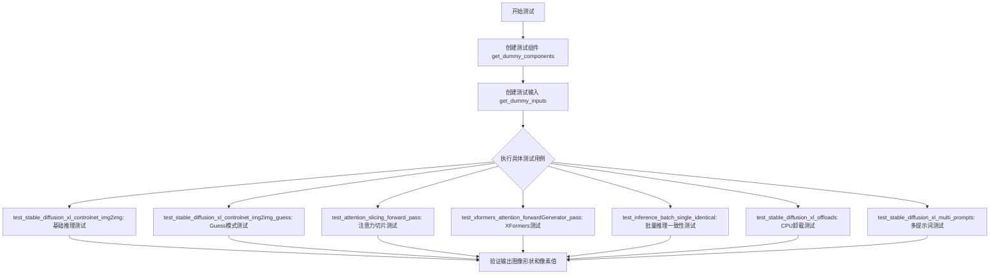

## 类结构

```
unittest.TestCase
└── ControlNetPipelineSDXLImg2ImgFastTests (继承多个Mixin)
    ├── IPAdapterTesterMixin
    ├── PipelineLatentTesterMixin
    ├── PipelineKarrasSchedulerTesterMixin
    └── PipelineTesterMixin
```

## 全局变量及字段


### `enable_full_determinism`
    
启用完全确定性以确保测试可复现

类型：`function`
    


### `ControlNetPipelineSDXLImg2ImgFastTests.pipeline_class`
    
被测试的Stable Diffusion XL ControlNet图像到图像管道类

类型：`Type[StableDiffusionXLControlNetImg2ImgPipeline]`
    


### `ControlNetPipelineSDXLImg2ImgFastTests.params`
    
文本引导图像变体的管道参数元组

类型：`Tuple[str, ...]`
    


### `ControlNetPipelineSDXLImg2ImgFastTests.required_optional_params`
    
必需的可选参数集合（已移除latents）

类型：`Set[str]`
    


### `ControlNetPipelineSDXLImg2ImgFastTests.batch_params`
    
文本引导图像变体的批处理参数元组

类型：`Tuple[str, ...]`
    


### `ControlNetPipelineSDXLImg2ImgFastTests.image_params`
    
图像到图像的图像参数元组

类型：`Tuple[str, ...]`
    


### `ControlNetPipelineSDXLImg2ImgFastTests.image_latents_params`
    
图像到图像的潜在向量参数元组

类型：`Tuple[str, ...]`
    


### `ControlNetPipelineSDXLImg2ImgFastTests.callback_cfg_params`
    
文本到图像回调配置参数集合（含add_text_embeds、add_time_ids等）

类型：`Set[str]`
    
    

## 全局函数及方法


### `ControlNetPipelineSDXLImg2ImgFastTests.get_dummy_components`

该方法用于创建 Stable Diffusion XL ControlNet Img2Img 管道测试所需的虚拟组件（dummy components），包括 UNet、ControlNet、VAE、调度器、文本编码器等，以便进行单元测试时不需要加载真实的预训练模型。

参数：

- `skip_first_text_encoder`：`bool`，可选参数（默认值为 `False`），当设为 `True` 时，第一个文本编码器和分词器将被设置为 `None`，用于测试某些特定场景

返回值：`Dict[str, Any]`，返回一个包含所有虚拟组件的字典，键包括 "unet"、"controlnet"、"scheduler"、"vae"、"text_encoder"、"tokenizer"、"text_encoder_2"、"tokenizer_2"、"image_encoder" 和 "feature_extractor"

#### 流程图

```mermaid
flowchart TD
    A[开始 get_dummy_components] --> B[设置随机种子 torch.manual_seed(0)]
    B --> C[创建 UNet2DConditionModel]
    C --> D[创建 ControlNetModel]
    D --> E[创建 EulerDiscreteScheduler]
    E --> F[创建 AutoencoderKL]
    F --> G[创建 CLIPTextConfig]
    G --> H[创建 CLIPTextModel]
    H --> I[创建 CLIPTokenizer]
    I --> J[创建 CLIPTextModelWithProjection]
    J --> K[创建第二个 CLIPTokenizer]
    K --> L{skip_first_text_encoder?}
    L -->|False| M[正常设置 text_encoder 和 tokenizer]
    L -->|True| N[设置 text_encoder 和 tokenizer 为 None]
    M --> O[组装 components 字典]
    N --> O
    O --> P[返回 components]
```

#### 带注释源码

```python
def get_dummy_components(self, skip_first_text_encoder=False):
    """
    创建用于测试的虚拟组件（dummy components）
    
    参数:
        skip_first_text_encoder: 是否跳过第一个文本编码器，默认为 False
    """
    # 设置随机种子以确保测试可重复性
    torch.manual_seed(0)
    
    # 创建 UNet2DConditionModel - 用于图像去噪的条件扩散模型
    unet = UNet2DConditionModel(
        block_out_channels=(32, 64),           # 块输出通道数
        layers_per_block=2,                    # 每个块的层数
        sample_size=32,                        # 样本大小
        in_channels=4,                         # 输入通道数（latent space）
        out_channels=4,                        # 输出通道数
        down_block_types=("DownBlock2D", "CrossAttnDownBlock2D"),  # 下采样块类型
        up_block_types=("CrossAttnUpBlock2D", "UpBlock2D"),        # 上采样块类型
        attention_head_dim=(2, 4),             # 注意力头维度
        use_linear_projection=True,            # 使用线性投影
        addition_embed_type="text_time",       # 额外的嵌入类型
        addition_time_embed_dim=8,             # 时间嵌入维度
        transformer_layers_per_block=(1, 2),   # 每块的 transformer 层数
        projection_class_embeddings_input_dim=80,  # 投影类嵌入输入维度
        cross_attention_dim=64 if not skip_first_text_encoder else 32,  # 交叉注意力维度
    )
    
    torch.manual_seed(0)
    
    # 创建 ControlNetModel - 用于条件图像生成的控制网络
    controlnet = ControlNetModel(
        block_out_channels=(32, 64),
        layers_per_block=2,
        in_channels=4,
        down_block_types=("DownBlock2D", "CrossAttnDownBlock2D"),
        conditioning_embedding_out_channels=(16, 32),  # 条件嵌入输出通道
        attention_head_dim=(2, 4),
        use_linear_projection=True,
        addition_embed_type="text_time",
        addition_time_embed_dim=8,
        transformer_layers_per_block=(1, 2),
        projection_class_embeddings_input_dim=80,
        cross_attention_dim=64,
    )
    
    torch.manual_seed(0)
    
    # 创建调度器 - 用于扩散过程的时间步调度
    scheduler = EulerDiscreteScheduler(
        beta_start=0.00085,         # beta 起始值
        beta_end=0.012,            # beta 结束值
        steps_offset=1,            # 步骤偏移
        beta_schedule="scaled_linear",  # beta 调度方案
        timestep_spacing="leading",     # 时间步间隔方式
    )
    
    torch.manual_seed(0)
    
    # 创建 VAE (Variational Autoencoder) - 用于编解码 latent 空间
    vae = AutoencoderKL(
        block_out_channels=[32, 64],
        in_channels=3,              # RGB 图像通道
        out_channels=3,
        down_block_types=["DownEncoderBlock2D", "DownEncoderBlock2D"],
        up_block_types=["UpDecoderBlock2D", "UpDecoderBlock2D"],
        latent_channels=4,         # latent 空间通道数
    )
    
    torch.manual_seed(0)
    
    # 创建 CLIP 文本编码器配置
    text_encoder_config = CLIPTextConfig(
        bos_token_id=0,             # 句子开始 token ID
        eos_token_id=2,             # 句子结束 token ID
        hidden_size=32,            # 隐藏层大小
        intermediate_size=37,      # 中间层大小
        layer_norm_eps=1e-05,      # LayerNorm epsilon
        num_attention_heads=4,     # 注意力头数
        num_hidden_layers=5,      # 隐藏层数
        pad_token_id=1,            # 填充 token ID
        vocab_size=1000,           # 词汇表大小
        hidden_act="gelu",         # 激活函数
        projection_dim=32,         # 投影维度
    )
    
    # 实例化第一个文本编码器（CLIP 文本编码器）
    text_encoder = CLIPTextModel(text_encoder_config)
    
    # 加载分词器（使用 tiny-random-clip 模型）
    tokenizer = CLIPTokenizer.from_pretrained("hf-internal-testing/tiny-random-clip")

    # 创建第二个文本编码器（带投影的 CLIP 模型）
    text_encoder_2 = CLIPTextModelWithProjection(text_encoder_config)
    
    # 加载第二个分词器
    tokenizer_2 = CLIPTokenizer.from_pretrained("hf-internal-testing/tiny-random-clip")

    # 组装所有组件到字典中
    components = {
        "unet": unet,                                        # UNet 条件扩散模型
        "controlnet": controlnet,                          # ControlNet 控制网络
        "scheduler": scheduler,                             # 调度器
        "vae": vae,                                         # VAE 编解码器
        "text_encoder": text_encoder if not skip_first_text_encoder else None,  # 第一个文本编码器
        "tokenizer": tokenizer if not skip_first_text_encoder else None,       # 第一个分词器
        "text_encoder_2": text_encoder_2,                   # 第二个文本编码器
        "tokenizer_2": tokenizer_2,                         # 第二个分词器
        "image_encoder": None,                              # 图像编码器（未使用）
        "feature_extractor": None,                         # 特征提取器（未使用）
    }
    
    return components  # 返回组件字典
```


### `ControlNetPipelineSDXLImg2ImgFastTests.get_dummy_inputs`

该方法用于生成用于测试 Stable Diffusion XL ControlNet Img2Img Pipeline 的虚拟输入参数。它创建包含随机图像、生成器和推理参数的字典，以支持确定性测试。

参数：

- `self`：隐式参数，`ControlNetPipelineSDXLImg2ImgFastTests` 测试类的实例
- `device`：`str` 或 `torch.device`，指定运行设备（如 "cpu"、"cuda" 等）
- `seed`：`int`，默认值为 `0`，用于控制随机数生成的种子，确保测试的可重复性

返回值：`dict`，包含以下键值对：

- `prompt`（`str`）：生成的提示词文本
- `generator`（`torch.Generator`）：PyTorch 随机数生成器
- `num_inference_steps`（`int`）：推理步数
- `guidance_scale`（`float`）：引导系数
- `output_type`（`str`）：输出类型（"np" 表示 NumPy 数组）
- `image`（`torch.Tensor`）：输入图像张量
- `control_image`（`torch.Tensor`）：ControlNet 控制图像张量

#### 流程图

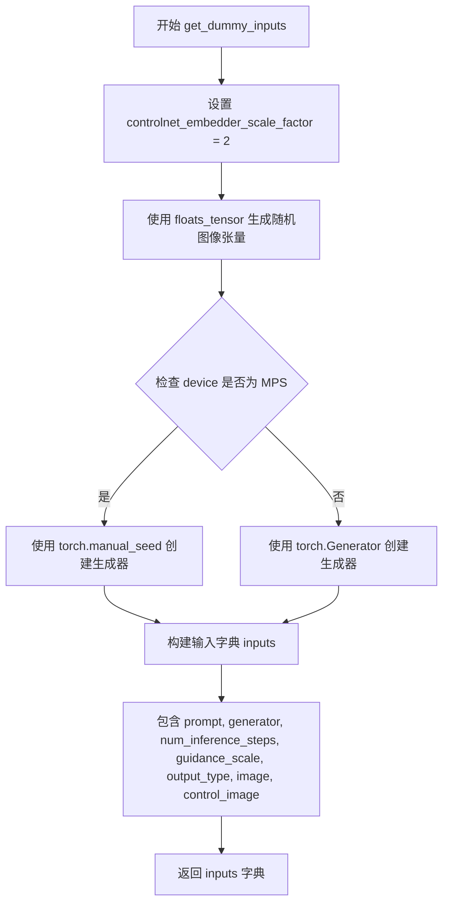

#### 带注释源码

```python
def get_dummy_inputs(self, device, seed=0):
    """
    生成用于测试 pipeline 的虚拟输入参数。
    
    参数:
        device: 运行设备（str 或 torch.device）
        seed: 随机种子，默认值为 0
    
    返回:
        包含 pipeline 所需输入参数的字典
    """
    # ControlNet 图像嵌入器的缩放因子，用于确定输入图像的尺寸
    controlnet_embedder_scale_factor = 2
    
    # 使用 floats_tensor 生成一个随机浮点图像张量
    # 形状为 (1, 3, 64, 64)，使用给定的随机种子确保可重复性
    image = floats_tensor(
        (1, 3, 32 * controlnet_embedder_scale_factor, 32 * controlnet_embedder_scale_factor),
        rng=random.Random(seed),
    ).to(device)

    # 根据设备类型创建随机数生成器
    # MPS (Apple Silicon) 设备使用 torch.manual_seed，其他设备使用 torch.Generator
    if str(device).startswith("mps"):
        generator = torch.manual_seed(seed)
    else:
        generator = torch.Generator(device=device).manual_seed(seed)

    # 构建包含所有推理参数的字典
    inputs = {
        "prompt": "A painting of a squirrel eating a burger",  # 测试用的提示词
        "generator": generator,  # 随机数生成器，确保确定性
        "num_inference_steps": 2,  # 推理步数，测试时使用较少步数
        "guidance_scale": 6.0,  # Classifier-free guidance 强度
        "output_type": "np",  # 输出为 NumPy 数组
        "image": image,  # 输入图像
        "control_image": image,  # ControlNet 条件图像
    }

    return inputs
```


### `ControlNetPipelineSDXLImg2ImgFastTests.test_ip_adapter`

该方法是一个测试IP Adapter功能的单元测试方法，属于`ControlNetPipelineSDXLImg2ImgFastTests`测试类。它根据当前设备类型设置特定的预期输出切片，如果是CPU设备则使用预定义的numpy数组，否则为None，最后调用父类的`test_ip_adapter`方法执行实际测试。

参数：

- `self`：`ControlNetPipelineSDXLImg2ImgFastTests`类型，测试类实例本身，无需显式传递

返回值：`unittest.TestResult`或`None`，调用父类`IPAdapterTesterMixin.test_ip_adapter()`的返回值

#### 流程图

```mermaid
flowchart TD
    A[开始 test_ip_adapter] --> B{torch_device == 'cpu'?}
    B -->|是| C[设置 expected_pipe_slice = numpy数组]
    B -->|否| D[设置 expected_pipe_slice = None]
    C --> E[调用 super().test_ip_adapter]
    D --> E
    E --> F[返回父类测试结果]
    F --> G[结束]
```

#### 带注释源码

```python
def test_ip_adapter(self):
    """
    测试IP Adapter功能的方法。
    根据设备类型设置不同的预期输出切片，并调用父类方法执行实际测试。
    """
    # 初始化预期管道切片为None
    expected_pipe_slice = None
    
    # 判断当前设备是否为CPU
    if torch_device == "cpu":
        # 如果是CPU设备，设定预期的输出切片值
        # 这些数值是用于验证输出正确性的参考值
        expected_pipe_slice = np.array([0.6276, 0.5271, 0.5205, 0.5393, 0.5774, 0.5872, 0.5456, 0.5415, 0.5354])
    
    # TODO: 更新在 slices.p 之后的处理（待办事项注释）
    
    # 调用父类IPAdapterTesterMixin的test_ip_adapter方法执行实际测试
    # 传入预期切片值用于结果验证
    return super().test_ip_adapter(expected_pipe_slice=expected_pipe_slice)
```


### `ControlNetPipelineSDXLImg2ImgFastTests.test_stable_diffusion_xl_controlnet_img2img`

该函数是 `StableDiffusionXLControlNetImg2ImgPipeline` 的集成测试用例，用于验证 ControlNet 引导的 SDXL 图像到图像（img2img）pipeline 在给定控制图像条件下生成图像的功能正确性，并确保输出图像的形状和像素值与预期值匹配。

参数：

- `self`：测试类实例本身，包含测试所需的配置和辅助方法

返回值：`None`，该函数通过断言验证图像生成结果，不返回任何值

#### 流程图

```mermaid
flowchart TD
    A[开始测试] --> B[设置设备为 CPU]
    B --> C[调用 get_dummy_components 获取虚拟组件]
    C --> D[使用虚拟组件实例化 StableDiffusionXLControlNetImg2ImgPipeline]
    D --> E[将 pipeline 移动到 CPU 设备]
    E --> F[配置进度条显示]
    F --> G[调用 get_dummy_inputs 获取测试输入]
    G --> H[执行 pipeline 推理: sd_pipe\*\*inputs]
    H --> I[提取输出图像的 slice: image[0, -3:, -3:, -1]]
    I --> J[断言图像形状为 (1, 64, 64, 3)]
    J --> K[定义预期像素值数组 expected_slice]
    K --> L[断言实际像素值与预期值的差异小于 1e-2]
    L --> M[测试结束]
```

#### 带注释源码

```python
def test_stable_diffusion_xl_controlnet_img2img(self):
    # 1. 设置测试设备为 CPU，确保随机数生成器的确定性
    device = "cpu"  # ensure determinism for the device-dependent torch.Generator
    
    # 2. 获取虚拟组件（UNet, ControlNet, VAE, Scheduler, TextEncoder 等）
    # 这些是用于测试的轻量级假模型
    components = self.get_dummy_components()
    
    # 3. 使用虚拟组件实例化 StableDiffusionXLControlNetImg2ImgPipeline
    # 这是一个结合了 SDXL 和 ControlNet 的图像到图像生成 pipeline
    sd_pipe = self.pipeline_class(**components)
    
    # 4. 将 pipeline 移动到指定设备（CPU）
    sd_pipe = sd_pipe.to(device)
    
    # 5. 配置进度条，disable=None 表示不禁用进度条
    sd_pipe.set_progress_bar_config(disable=None)
    
    # 6. 获取虚拟输入参数
    # 包含: prompt, generator, num_inference_steps, guidance_scale, 
    #       output_type, image, control_image
    inputs = self.get_dummy_inputs(device)
    
    # 7. 执行 pipeline 推理，生成图像
    # **inputs 将字典解包为关键字参数传递给 pipeline
    image = sd_pipe(**inputs).images
    
    # 8. 提取生成的图像的最后一个 patch (3x3x3)
    # image[0, -3:, -3:, -1] 提取第一张图像的右下角 3x3 区域
    # 最后一维是颜色通道
    image_slice = image[0, -3:, -3:, -1]
    
    # 9. 断言生成的图像形状符合预期
    # (1, 64, 64, 3) 表示: batch_size=1, 高度=64, 宽度=64, RGB通道=3
    assert image.shape == (1, 64, 64, 3)
    
    # 10. 定义预期的像素值 slice
    # 这是一个 numpy 数组，包含 9 个值（3x3）
    expected_slice = np.array(
        [0.5557202, 0.46418434, 0.46983826, 0.623529, 0.5557242, 0.49262643, 0.6070508, 0.5702978, 0.43777135]
    )
    
    # 11. 断言实际输出与预期值的差异在可接受范围内
    # np.abs(image_slice.flatten() - expected_slice).max() < 1e-2
    # 比较所有像素值的最大差异是否小于 0.01
    assert np.abs(image_slice.flatten() - expected_slice).max() < 1e-2
```


### `ControlNetPipelineSDXLImg2ImgFastTests.test_stable_diffusion_xl_controlnet_img2img_guess`

该测试方法用于验证 Stable Diffusion XL ControlNet img2img 管道在 guess_mode 模式下的功能正确性，通过传入虚拟组件和输入数据，验证管道输出的图像是否符合预期。

参数：

- `self`：`ControlNetPipelineSDXLImg2ImgFastTests`，测试类实例本身

返回值：`None`，该方法为单元测试，通过断言验证管道输出的图像形状和像素值是否符合预期

#### 流程图

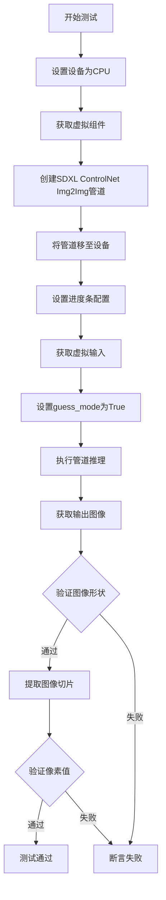

#### 带注释源码

```python
def test_stable_diffusion_xl_controlnet_img2img_guess(self):
    """
    测试 Stable Diffusion XL ControlNet Img2Img 管道在 guess_mode 模式下的功能
    guess_mode 是一种特殊模式，ControlNet 会生成多个预测并选择最佳结果
    """
    # 设置测试设备为 CPU，确保随机数生成的可确定性
    device = "cpu"

    # 获取虚拟组件（UNet、ControlNet、VAE、文本编码器等）
    # 这些是用于测试的轻量级假模型
    components = self.get_dummy_components()

    # 使用虚拟组件创建 StableDiffusionXLControlNetImg2ImgPipeline 实例
    sd_pipe = self.pipeline_class(**components)
    
    # 将管道移至指定设备（CPU）
    sd_pipe = sd_pipe.to(device)

    # 配置进度条（disable=None 表示不禁用进度条）
    sd_pipe.set_progress_bar_config(disable=None)

    # 获取虚拟输入数据（包含 prompt、图像、generator 等）
    inputs = self.get_dummy_inputs(device)
    
    # 启用 guess_mode，这是该测试的关键参数
    # guess_mode 使 ControlNet 以更保守的方式应用条件
    inputs["guess_mode"] = True

    # 执行管道推理，获取输出
    output = sd_pipe(**inputs)
    
    # 提取输出图像的右下角 3x3 区域用于验证
    image_slice = output.images[0, -3:, -3:, -1]
    
    # 断言输出图像形状为 (1, 64, 64, 3)
    assert output.images.shape == (1, 64, 64, 3)

    # 定义期望的图像切片值（用于回归测试）
    expected_slice = np.array(
        [0.5557202, 0.46418434, 0.46983826, 0.623529, 0.5557242, 0.49262643, 0.6070508, 0.5702978, 0.43777135]
    )

    # 验证实际输出与期望值的差异在可接受范围内（最大误差 1e-2）
    assert np.abs(image_slice.flatten() - expected_slice).max() < 1e-2
```


### `ControlNetPipelineSDXLImg2ImgFastTests.test_attention_slicing_forward_pass`

该方法是一个单元测试函数，用于测试 Stable Diffusion XL ControlNet Img2Img Pipeline 的注意力切片（Attention Slicing）功能是否正常工作。它通过调用父类方法验证在启用注意力切片优化时，模型前向传播的结果与基准值的差异是否在可接受范围内（2e-3）。

参数：

- `self`：`ControlNetPipelineSDXLImg2ImgFastTests`，测试类实例本身，无显式参数

返回值：`None`（unittest 测试方法返回值通常为 None，测试结果通过断言判定）

#### 流程图

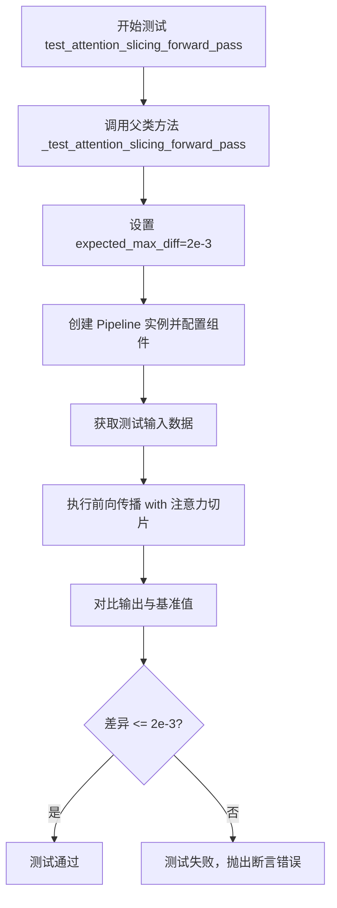

#### 带注释源码

```python
def test_attention_slicing_forward_pass(self):
    """
    测试注意力切片（Attention Slicing）功能的前向传播。
    
    Attention Slicing 是一种内存优化技术，通过将大型注意力矩阵
    分割成较小的块来减少显存占用。此测试验证该优化功能的正确性。
    
    该方法调用父类 PipelineTesterMixin 中定义的
    _test_attention_slicing_forward_pass 方法进行实际测试。
    """
    # 调用父类的测试方法，expected_max_diff=2e-3 表示
    # 启用注意力切片后的输出与基准输出的最大允许差异
    return self._test_attention_slicing_forward_pass(expected_max_diff=2e-3)
```


### `ControlNetPipelineSDXLImg2ImgFastTests.test_xformers_attention_forwardGenerator_pass`

该测试方法用于验证 XFormers 注意力机制在前向传播中的正确性，通过调用内部测试方法 `_test_xformers_attention_forwardGenerator_pass` 并设置预期最大差异阈值为 2e-3 来进行注意力计算的精度验证。该测试仅在 CUDA 设备且 xformers 库可用时执行。

参数：

- `self`：`ControlNetPipelineSDXLImg2ImgFastTests`，测试类的实例，隐式参数

返回值：`None`，无返回值（测试方法）

#### 流程图

```mermaid
flowchart TD
    A[开始测试 test_xformers_attention_forwardGenerator_pass] --> B{检查条件: torch_device == 'cuda' 且 is_xformers_available()}
    B -->|不满足| C[跳过测试]
    B -->|满足| D[调用 self._test_xformers_attention_forwardGenerator_pass expected_max_diff=2e-3]
    D --> E[内部执行 xformers 注意力前向传播测试]
    E --> F[验证输出与预期值的差异是否小于 2e-3]
    F --> G{差异是否在阈值内?}
    G -->|是| H[测试通过]
    G -->|否| I[测试失败]
    C --> J[结束]
    H --> J
    I --> J
```

#### 带注释源码

```python
@unittest.skipIf(
    torch_device != "cuda" or not is_xformers_available(),
    reason="XFormers attention is only available with CUDA and `xformers` installed",
)
def test_xformers_attention_forwardGenerator_pass(self):
    """
    测试 XFormers 注意力机制的前向传播。
    
    该测试方法仅在以下条件满足时执行：
    1. 当前设备为 CUDA (torch_device == "cuda")
    2. xformers 库已安装 (is_xformers_available() 返回 True)
    
    测试通过调用内部方法 _test_xformers_attention_forwardGenerator_pass 
    来验证注意力计算的正确性，预期最大差异为 2e-3。
    """
    # 调用内部测试方法，传入预期最大差异阈值
    self._test_xformers_attention_forwardGenerator_pass(expected_max_diff=2e-3)
```


### `ControlNetPipelineSDXLImg2ImgFastTests.test_inference_batch_single_identical`

这是一个测试方法，用于验证在批量推理场景下，单个样本的推理结果与单独推理时的一致性。

参数：

- `self`：`ControlNetPipelineSDXLImg2ImgFastTests`，测试类的实例方法
- `expected_max_diff`：`float`，期望的最大差异值，用于验证批量推理和单独推理结果之间的差异阈值，默认为 `2e-3`

返回值：`None`，无返回值，这是一个测试方法

#### 流程图

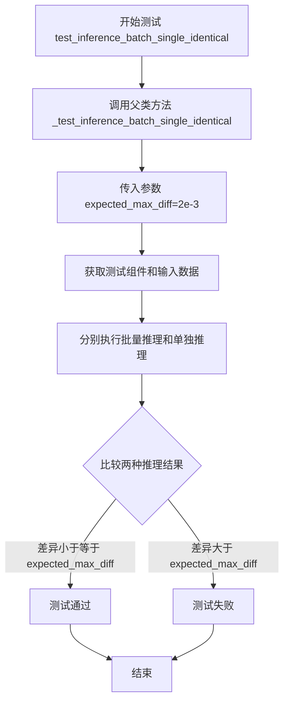

#### 带注释源码

```python
def test_inference_batch_single_identical(self):
    """
    测试方法：验证批量推理时单个样本的结果与单独推理时一致
    
    该方法继承自 PipelineTesterMixin，通过调用父类的 _test_inference_batch_single_identical
    来确保在使用 ControlNet 的 Stable Diffusion XL img2img pipeline 时，
    批量推理（batch_size > 1）中单个样本的输出与单独推理（batch_size = 1）的输出保持一致。
    这对于确保模型的确定性和可重复性非常重要。
    
    参数:
        expected_max_diff: float, 默认为 2e-3
            允许的最大差异阈值。如果批量推理和单独推理的结果差异超过此值，测试将失败。
    
    返回值:
        None: 这是一个测试方法，不返回任何值。通过断言来验证结果。
    """
    # 调用父类的测试方法，验证批量推理与单独推理的一致性
    # _test_inference_batch_single_identical 是 PipelineTesterMixin 中定义的方法
    # 它会:
    # 1. 获取测试所需的组件 (unet, controlnet, vae, text_encoder 等)
    # 2. 准备测试输入 (图像、prompt、guidance_scale 等)
    # 3. 执行单独推理 (batch_size=1)
    # 4. 执行批量推理 (batch_size=2)
    # 5. 比较两次推理中第一个样本的结果，确保差异在允许范围内
    self._test_inference_batch_single_identical(expected_max_diff=2e-3)
```


### `ControlNetPipelineSDXLImg2ImgFastTests.test_save_load_optional_components`

该方法是`ControlNetPipelineSDXLImg2ImgFastTests`测试类中的一个测试用例方法，用于测试保存和加载可选组件的功能，但目前实现为空（pass），是一个待完成的测试占位符。

参数：

- `self`：`ControlNetPipelineSDXLImg2ImgFastTests`类型，表示测试类实例本身，用于访问类的属性和方法

返回值：`None`，该方法没有返回值（方法体为`pass`语句）

#### 流程图

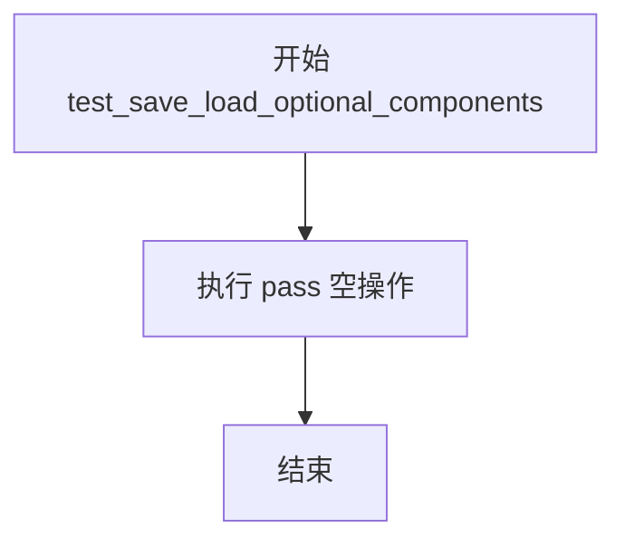

#### 带注释源码

```python
def test_save_load_optional_components(self):
    """
    测试保存和加载可选组件的功能。
    
    该测试方法用于验证 StableDiffusionXLControlNetImg2ImgPipeline 
    的可选组件（如 text_encoder、tokenizer 等）能否正确保存和加载。
    
    注意：当前实现为空（pass），是一个待完成的测试占位符。
    TODO(Patrick, Sayak) - skip for now as this requires more refiner tests
    """
    pass
```


### `ControlNetPipelineSDXLImg2ImgFastTests.test_stable_diffusion_xl_offloads`

该测试方法用于验证 Stable Diffusion XL ControlNet Image-to-Image Pipeline 在不同 CPU offload 策略（无 offload、模型级 offload、顺序 offload）下的输出结果一致性，确保启用 CPU offload 功能不会影响模型的推理结果。

参数：

- `self`：隐式参数，测试类实例本身

返回值：`None`，无返回值（测试方法）

#### 流程图

```mermaid
flowchart TD
    A[开始测试] --> B[创建空列表 pipes]
    B --> C[创建第1个 pipeline: 普通模式]
    C --> D[创建第2个 pipeline: enable_model_cpu_offload]
    D --> E[创建第3个 pipeline: enable_sequential_cpu_offload]
    E --> F[创建空列表 image_slices]
    F --> G[遍历 pipes 列表]
    G --> H[为当前 pipeline 设置默认 attention processor]
    H --> I[获取 dummy inputs]
    I --> J[调用 pipeline 执行推理]
    J --> K[提取图像切片并 flatten]
    K --> L[添加到 image_slices]
    L --> M{是否还有更多 pipeline?}
    M -->|是| G
    M -->|否| N[断言: image_slices[0] 与 image_slices[1] 差异 < 1e-3]
    N --> O[断言: image_slices[0] 与 image_slices[2] 差异 < 1e-3]
    O --> P[测试结束]
```

#### 带注释源码

```python
@require_torch_accelerator
def test_stable_diffusion_xl_offloads(self):
    """
    测试 Stable Diffusion XL ControlNet Img2Img Pipeline 在不同 CPU offload 模式下的行为。
    验证三种模式产生的图像结果应在数值误差范围内一致。
    """
    pipes = []  # 存储三个不同配置的 pipeline 实例
    components = self.get_dummy_components()  # 获取测试用dummy组件
    sd_pipe = self.pipeline_class(**components).to(torch_device)  # 创建普通 pipeline
    pipes.append(sd_pipe)

    components = self.get_dummy_components()  # 重新获取组件
    sd_pipe = self.pipeline_class(**components)  # 创建第二个 pipeline
    sd_pipe.enable_model_cpu_offload(device=torch_device)  # 启用模型级 CPU offload
    pipes.append(sd_pipe)

    components = self.get_dummy_components()  # 再次获取组件
    sd_pipe = self.pipeline_class(**components)  # 创建第三个 pipeline
    sd_pipe.enable_sequential_cpu_offload(device=torch_device)  # 启用顺序 CPU offload
    pipes.append(sd_pipe)

    image_slices = []  # 存储每个 pipeline 输出的图像切片
    for pipe in pipes:  # 遍历每个 pipeline
        pipe.unet.set_default_attn_processor()  # 设置默认 attention processor 确保一致性

        inputs = self.get_dummy_inputs(torch_device)  # 获取测试输入
        image = pipe(**inputs).images  # 执行推理获取图像

        # 提取图像右下角 3x3 区域并展平
        image_slices.append(image[0, -3:, -3:, -1].flatten())

    # 验证无 offload 与模型级 offload 的结果差异
    assert np.abs(image_slices[0] - image_slices[1]).max() < 1e-3
    # 验证无 offload 与顺序 offload 的结果差异
    assert np.abs(image_slices[0] - image_slices[2]).max() < 1e-3
```


### `ControlNetPipelineSDXLImg2ImgFastTests.test_stable_diffusion_xl_multi_prompts`

该测试方法用于验证 Stable Diffusion XL ControlNet 图像到图像管道在处理多个提示词（prompts）场景下的正确性，包括单个提示词、重复提示词、不同提示词以及负面提示词的组合，测试通过断言比较生成图像的像素差异来确保管道行为的正确性。

参数：
- `self`：隐式参数，测试类实例本身

返回值：`None`，该方法为测试方法，通过断言（assert）验证功能，不返回具体值

#### 流程图

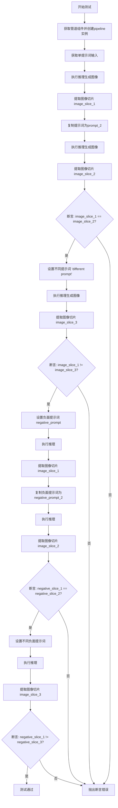

#### 带注释源码

```python
def test_stable_diffusion_xl_multi_prompts(self):
    """
    测试 Stable Diffusion XL ControlNet Img2Img 管道处理多个提示词的功能
    
    该测试验证以下场景：
    1. 相同提示词重复使用应产生相同结果
    2. 不同提示词应产生不同结果
    3. 负面提示词的相同/不同处理
    """
    # 步骤1: 获取虚拟组件并创建pipeline实例，移至测试设备
    components = self.get_dummy_components()
    sd_pipe = self.pipeline_class(**components).to(torch_device)

    # 步骤2: 测试场景1 - 单提示词基准测试
    # 获取单提示词的输入参数
    inputs = self.get_dummy_inputs(torch_device)
    # 执行推理生成图像
    output = sd_pipe(**inputs)
    # 提取图像右下角3x3区域作为比较切片
    image_slice_1 = output.images[0, -3:, -3:, -1]

    # 步骤3: 测试场景2 - 重复提示词
    # 重新获取输入参数
    inputs = self.get_dummy_inputs(torch_device)
    # 将原提示词复制给prompt_2参数
    inputs["prompt_2"] = inputs["prompt"]
    # 执行推理
    output = sd_pipe(**inputs)
    # 提取图像切片
    image_slice_2 = output.images[0, -3:, -3:, -1]

    # 断言1: 相同提示词应产生相同图像（误差小于1e-4）
    # ensure the results are equal
    assert np.abs(image_slice_1.flatten() - image_slice_2.flatten()).max() < 1e-4

    # 步骤4: 测试场景3 - 不同提示词
    # 重新获取输入参数
    inputs = self.get_dummy_inputs(torch_device)
    # 设置不同的提示词
    inputs["prompt_2"] = "different prompt"
    # 执行推理
    output = sd_pipe(**inputs)
    # 提取图像切片
    image_slice_3 = output.images[0, -3:, -3:, -1]

    # 断言2: 不同提示词应产生不同图像（误差大于1e-4）
    # ensure the results are not equal
    assert np.abs(image_slice_1.flatten() - image_slice_3.flatten()).max() > 1e-4

    # 步骤5: 测试场景4 - 负面提示词基准
    # 重新获取输入参数
    inputs = self.get_dummy_inputs(torch_device)
    # 设置负面提示词
    inputs["negative_prompt"] = "negative prompt"
    # 执行推理
    output = sd_pipe(**inputs)
    # 提取图像切片
    image_slice_1 = output.images[0, -3:, -3:, -1]

    # 步骤6: 测试场景5 - 重复负面提示词
    # 重新获取输入参数
    inputs = self.get_dummy_inputs(torch_device)
    inputs["negative_prompt"] = "negative prompt"
    # 复制负面提示词给negative_prompt_2
    inputs["negative_prompt_2"] = inputs["negative_prompt"]
    # 执行推理
    output = sd_pipe(**inputs)
    # 提取图像切片
    image_slice_2 = output.images[0, -3:, -3:, -1]

    # 断言3: 相同负面提示词应产生相同图像
    # ensure the results are equal
    assert np.abs(image_slice_1.flatten() - image_slice_2.flatten()).max() < 1e-4

    # 步骤7: 测试场景6 - 不同负面提示词
    # 重新获取输入参数
    inputs = self.get_dummy_inputs(torch_device)
    inputs["negative_prompt"] = "negative prompt"
    # 设置不同的负面提示词
    inputs["negative_prompt_2"] = "different negative prompt"
    # 执行推理
    output = sd_pipe(**inputs)
    # 提取图像切片
    image_slice_3 = output.images[0, -3:, -3:, -1]

    # 断言4: 不同负面提示词应产生不同图像
    # ensure the results are not equal
    assert np.abs(image_slice_1.flatten() - image_slice_3.flatten()).max() > 1e-4
```


### `ControlNetPipelineSDXLImg2ImgFastTests.get_dummy_components`

该方法是一个测试辅助函数，用于创建 Stable Diffusion XL ControlNet Img2Img Pipeline 所需的虚拟（dummy）组件。这些组件包括 UNet、ControlNet、VAE、调度器、文本编码器和分词器等，用于单元测试和集成测试，确保 Pipeline 在没有真实模型权重的情况下能够正常运行。

参数：

- `skip_first_text_encoder`：`bool`，可选参数，默认值为 `False`。当设置为 `True` 时，方法将返回 `None` 作为第一个文本编码器（`text_encoder`）和分词器（`tokenizer`），用于测试不包含第一个文本编码器的场景。

返回值：`Dict[str, Any]`，返回一个包含所有 Pipeline 组件的字典。字典的键包括 `"unet"`、`"controlnet"`、`"scheduler"`、`"vae"`、`"text_encoder"`、`"tokenizer"`、`"text_encoder_2"`、`"tokenizer_2"`、`"image_encoder"` 和 `"feature_extractor"`。这些组件可以用于实例化 `StableDiffusionXLControlNetImg2ImgPipeline`。

#### 流程图

```mermaid
flowchart TD
    A[开始 get_dummy_components] --> B[设置随机种子 torch.manual_seed(0)]
    B --> C[创建 UNet2DConditionModel 组件]
    C --> D[创建 ControlNetModel 组件]
    D --> E[创建 EulerDiscreteScheduler 调度器]
    E --> F[创建 AutoencoderKL VAE 组件]
    F --> G[创建 CLIPTextConfig 配置]
    G --> H[创建第一个 CLIPTextModel 文本编码器]
    H --> I[创建第一个 CLIPTokenizer 分词器]
    I --> J[创建第二个 CLIPTextModelWithProjection 文本编码器]
    J --> K[创建第二个 CLIPTokenizer 分词器]
    K --> L{skip_first_text_encoder?}
    L -->|True| M[设置 text_encoder=None, tokenizer=None]
    L -->|False| N[使用创建的 text_encoder 和 tokenizer]
    M --> O[构建组件字典]
    N --> O
    O --> P[返回 components 字典]
```

#### 带注释源码

```python
def get_dummy_components(self, skip_first_text_encoder=False):
    """
    创建并返回用于测试的虚拟组件字典。
    
    参数:
        skip_first_text_encoder: 布尔值，默认为 False。
                                设置为 True 时，text_encoder 和 tokenizer 将为 None。
    
    返回:
        包含所有 Pipeline 组件的字典。
    """
    # 设置随机种子以确保测试的可重复性
    torch.manual_seed(0)
    
    # 创建 UNet2DConditionModel：用于去噪的 UNet 模型
    # 参数配置为小规模测试配置：block_out_channels=(32, 64), layers_per_block=2
    unet = UNet2DConditionModel(
        block_out_channels=(32, 64),
        layers_per_block=2,
        sample_size=32,
        in_channels=4,
        out_channels=4,
        down_block_types=("DownBlock2D", "CrossAttnDownBlock2D"),
        up_block_types=("CrossAttnUpBlock2D", "UpBlock2D"),
        attention_head_dim=(2, 4),
        use_linear_projection=True,
        addition_embed_type="text_time",
        addition_time_embed_dim=8,
        transformer_layers_per_block=(1, 2),
        projection_class_embeddings_input_dim=80,
        cross_attention_dim=64 if not skip_first_text_encoder else 32,
    )
    
    # 重新设置随机种子，确保每个组件初始化的一致性
    torch.manual_seed(0)
    
    # 创建 ControlNetModel：用于生成条件控制的模型
    controlnet = ControlNetModel(
        block_out_channels=(32, 64),
        layers_per_block=2,
        in_channels=4,
        down_block_types=("DownBlock2D", "CrossAttnDownBlock2D"),
        conditioning_embedding_out_channels=(16, 32),
        attention_head_dim=(2, 4),
        use_linear_projection=True,
        addition_embed_type="text_time",
        addition_time_embed_dim=8,
        transformer_layers_per_block=(1, 2),
        projection_class_embeddings_input_dim=80,
        cross_attention_dim=64,
    )
    
    torch.manual_seed(0)
    
    # 创建 EulerDiscreteScheduler：离散时间的 Euler 调度器
    scheduler = EulerDiscreteScheduler(
        beta_start=0.00085,
        beta_end=0.012,
        steps_offset=1,
        beta_schedule="scaled_linear",
        timestep_spacing="leading",
    )
    
    torch.manual_seed(0)
    
    # 创建 AutoencoderKL：用于潜在空间编码和解码的 VAE
    vae = AutoencoderKL(
        block_out_channels=[32, 64],
        in_channels=3,
        out_channels=3,
        down_block_types=["DownEncoderBlock2D", "DownEncoderBlock2D"],
        up_block_types=["UpDecoderBlock2D", "UpDecoderBlock2D"],
        latent_channels=4,
    )
    
    torch.manual_seed(0)
    
    # 创建 CLIPTextConfig：CLIP 文本编码器的配置
    text_encoder_config = CLIPTextConfig(
        bos_token_id=0,
        eos_token_id=2,
        hidden_size=32,
        intermediate_size=37,
        layer_norm_eps=1e-05,
        num_attention_heads=4,
        num_hidden_layers=5,
        pad_token_id=1,
        vocab_size=1000,
        hidden_act="gelu",
        projection_dim=32,
    )
    
    # 创建第一个 CLIPTextModel 文本编码器
    text_encoder = CLIPTextModel(text_encoder_config)
    
    # 从预训练模型加载分词器（使用 tiny-random-clip 用于测试）
    tokenizer = CLIPTokenizer.from_pretrained("hf-internal-testing/tiny-random-clip")
    
    # 创建第二个 CLIP 文本编码器（带投影层）
    text_encoder_2 = CLIPTextModelWithProjection(text_encoder_config)
    
    # 加载第二个分词器
    tokenizer_2 = CLIPTokenizer.from_pretrained("hf-internal-testing/tiny-random-clip")
    
    # 组装所有组件到字典中
    components = {
        "unet": unet,
        "controlnet": controlnet,
        "scheduler": scheduler,
        "vae": vae,
        # 根据 skip_first_text_encoder 条件设置 text_encoder 和 tokenizer
        "text_encoder": text_encoder if not skip_first_text_encoder else None,
        "tokenizer": tokenizer if not skip_first_text_encoder else None,
        "text_encoder_2": text_encoder_2,
        "tokenizer_2": tokenizer_2,
        # 图像编码器和特征提取器在测试中不使用，设置为 None
        "image_encoder": None,
        "feature_extractor": None,
    }
    
    return components
```


### `ControlNetPipelineSDXLImg2ImgFastTests.get_dummy_inputs`

该方法用于生成 Stable Diffusion XL ControlNet Img2Img 管道测试所需的虚拟输入参数，创建一个包含提示词、图像、生成器及推理配置的字典，以支持管道的单元测试。

参数：

- `self`：隐式参数，测试类实例本身
- `device`：字符串或设备对象，指定用于推理的目标设备（如 "cpu"、"cuda" 等）
- `seed`：整数（默认值为 0），用于控制随机数生成的种子值，确保测试结果的可复现性

返回值：`Dict`，返回一个包含以下键的字典：
- `"prompt"`：字符串，生成图像的文本提示
- `generator`：`torch.Generator` 或 None，用于控制随机性的 PyTorch 生成器对象
- `num_inference_steps`：整数，推理步数
- `guidance_scale`：浮点数，分类器自由引导（CFG）比例
- `output_type`：字符串，输出类型（"np" 表示 NumPy 数组）
- `image`：张量，输入图像
- `control_image`：张量，控制网络使用的条件图像

#### 流程图

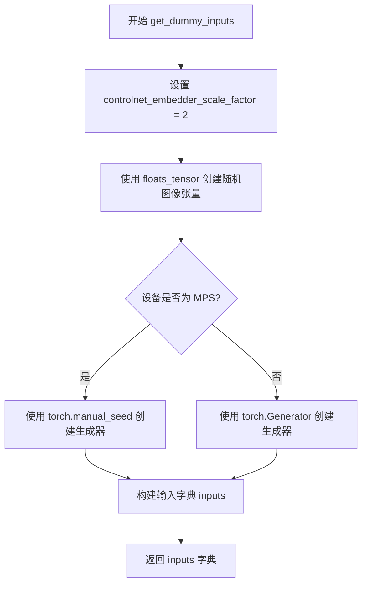

#### 带注释源码

```python
def get_dummy_inputs(self, device, seed=0):
    # 控制网络嵌入器的缩放因子，用于确定输入图像的尺寸
    # 32 * 2 = 64，最终图像尺寸为 64x64
    controlnet_embedder_scale_factor = 2
    
    # 使用 floats_tensor 生成一个随机浮点数张量作为测试图像
    # 形状: (1, 3, 64, 64) - 批量大小1，RGB 3通道，64x64像素
    # 使用随机种子确保可复现性
    image = floats_tensor(
        (1, 3, 32 * controlnet_embedder_scale_factor, 32 * controlnet_embedder_scale_factor),
        rng=random.Random(seed),
    ).to(device)

    # 针对 Apple Silicon (MPS) 设备进行特殊处理
    # MPS 设备不支持 torch.Generator，需要使用 torch.manual_seed 替代
    if str(device).startswith("mps"):
        generator = torch.manual_seed(seed)
    else:
        # 为其他设备创建 PyTorch 生成器并设置随机种子
        generator = torch.Generator(device=device).manual_seed(seed)

    # 构建测试所需的完整输入参数字典
    inputs = {
        "prompt": "A painting of a squirrel eating a burger",  # 文本提示
        "generator": generator,                                # 随机生成器
        "num_inference_steps": 2,                               # 推理步数（较少用于快速测试）
        "guidance_scale": 6.0,                                  # CFG 引导强度
        "output_type": "np",                                    # 输出为 NumPy 数组
        "image": image,                                         # 输入图像（Img2Img 用）
        "control_image": image,                                 # ControlNet 条件图像
    }

    return inputs
```


### `ControlNetPipelineSDXLImg2ImgFastTests.test_ip_adapter`

该方法是 `ControlNetPipelineSDXLImg2ImgFastTests` 测试类中的一个测试用例，用于验证 ControlNet 配合 SDXL Image-to-Image Pipeline 的 IP-Adapter 功能是否正常工作。测试根据设备类型设置不同的期望输出切片，并调用父类的 `test_ip_adapter` 方法执行实际测试逻辑。

参数：

- `self`：`ControlNetPipelineSDXLImg2ImgFastTests` 实例，测试类本身，包含测试所需的组件和配置

返回值：`any`，返回父类 `IPAdapterTesterMixin.test_ip_adapter` 方法的执行结果，通常为 `None` 或测试断言结果

#### 流程图

```mermaid
flowchart TD
    A[开始 test_ip_adapter] --> B{检查设备是否为 CPU?}
    B -->|是| C[设置 expected_pipe_slice 为 CPU 期望值数组]
    B -->|否| D[expected_pipe_slice 保持为 None]
    C --> E[调用父类 test_ip_adapter 方法]
    D --> E
    E --> F[返回测试结果]
    
    C --> G[(expected_pipe_slice =<br/>np.array([0.6276, 0.5271,<br/>0.5205, 0.5393, 0.5774,<br/>0.5872, 0.5456, 0.5415,<br/>0.5354]))]
```

#### 带注释源码

```python
def test_ip_adapter(self):
    """
    测试 ControlNet Pipeline SDXL Image-to-Image 的 IP-Adapter 功能。
    验证在不同设备上 IP-Adapter 是否能正确运行并产生预期结果。
    """
    # 初始化期望输出切片为 None
    expected_pipe_slice = None
    
    # 如果当前设备是 CPU，设置预期的输出切片值
    # 这些数值是预先计算好的，用于验证推理结果的正确性
    if torch_device == "cpu":
        expected_pipe_slice = np.array([
            0.6276, 0.5271, 0.5205,  # 第一行像素值
            0.5393, 0.5774, 0.5872,  # 第二行像素值
            0.5456, 0.5415, 0.5354   # 第三行像素值
        ])
    
    # TODO: 更新 slices.p 文件后移除此条件判断
    # 标记待办事项：需要更新参考切片数据文件
    
    # 调用父类 (IPAdapterTesterMixin) 的 test_ip_adapter 方法
    # 传入预期的输出切片进行比对验证
    return super().test_ip_adapter(expected_pipe_slice=expected_pipe_slice)
```


### `ControlNetPipelineSDXLImg2ImgFastTests.test_stable_diffusion_xl_controlnet_img2img`

该测试方法用于验证 StableDiffusionXLControlNetImg2ImgPipeline 在图像到图像（img2img）任务中集成了 ControlNet 后的核心功能是否正常。测试流程包括：创建虚拟组件、初始化管道、执行推理、验证输出图像的形状和像素值是否符合预期。

参数：无显式参数（使用 `self` 访问类属性）

返回值：`None`，该方法通过断言验证管道输出的正确性，不返回任何值

#### 流程图

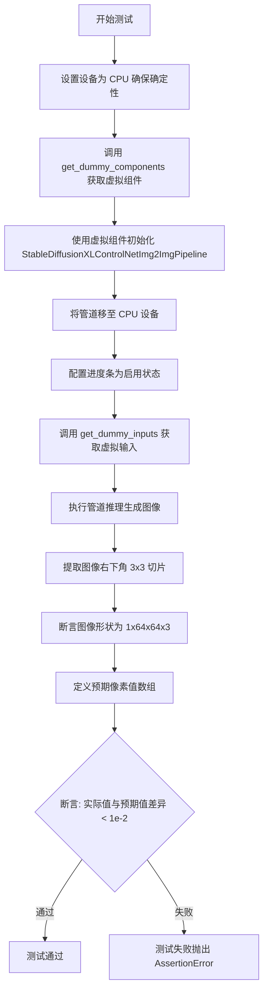

#### 带注释源码

```python
def test_stable_diffusion_xl_controlnet_img2img(self):
    """
    测试 StableDiffusionXLControlNetImg2ImgPipeline 的图像到图像功能
    验证 ControlNet 集成的图像生成管线是否能产生预期尺寸和数值的输出
    """
    # 1. 设置设备为 CPU，确保 torch.Generator 的确定性
    device = "cpu"  # ensure determinism for the device-dependent torch.Generator
    
    # 2. 获取预定义的虚拟组件（UNet、ControlNet、VAE、Scheduler、TextEncoder 等）
    components = self.get_dummy_components()
    
    # 3. 使用虚拟组件实例化管道类
    sd_pipe = self.pipeline_class(**components)
    
    # 4. 将管道移至指定设备（CPU）
    sd_pipe = sd_pipe.to(device)
    
    # 5. 配置进度条（disable=None 表示启用进度条）
    sd_pipe.set_progress_bar_config(disable=None)
    
    # 6. 获取虚拟输入参数（包含 prompt、generator、图像等）
    inputs = self.get_dummy_inputs(device)
    
    # 7. 执行管道推理，返回包含生成图像的结果对象
    #    然后获取图像数组
    image = sd_pipe(**inputs).images
    
    # 8. 提取图像的一个切片：取第一张图像的右下角 3x3 区域
    #    image shape: (batch, height, width, channels)
    image_slice = image[0, -3:, -3:, -1]
    
    # 9. 断言验证生成的图像形状是否符合预期
    #    期望: (1, 64, 64, 3) - 批次1张、64x64分辨率、3通道RGB
    assert image.shape == (1, 64, 64, 3)
    
    # 10. 定义预期的像素值数组（来自已知正确的基准输出）
    expected_slice = np.array(
        [0.5557202, 0.46418434, 0.46983826, 0.623529, 0.5557242, 0.49262643, 0.6070508, 0.5702978, 0.43777135]
    )
    
    # 11. 最终断言：验证实际输出与预期值的最大差异小于阈值 1e-2
    #     确保管线输出的数值稳定性
    assert np.abs(image_slice.flatten() - expected_slice).max() < 1e-2
```


### `ControlNetPipelineSDXLImg2ImgFastTests.test_stable_diffusion_xl_controlnet_img2img_guess`

这是一个单元测试方法，用于验证 Stable Diffusion XL ControlNet Img2Img pipeline 在 guess_mode 模式下的功能正确性。该测试创建虚拟组件和输入数据，执行 pipeline 推理，并验证输出图像与预期结果的一致性。

参数：

- `self`：`ControlNetPipelineSDXLImg2ImgFastTests`，测试类实例本身

返回值：`None`，测试方法无返回值，通过断言验证正确性

#### 流程图

```mermaid
flowchart TD
    A[开始测试] --> B[设置设备为CPU]
    B --> C[获取虚拟组件: get_dummy_components]
    C --> D[创建Pipeline实例]
    D --> E[将Pipeline移至CPU设备]
    E --> F[配置进度条: set_progress_bar_config]
    F --> G[获取虚拟输入: get_dummy_inputs]
    G --> H[设置guess_mode=True]
    H --> I[执行Pipeline推理: sd_pipe]
    I --> J[提取图像切片: output.images]
    J --> K{断言: 图像形状 == (1, 64, 64, 3)}
    K --> |通过| L[对比图像切片与预期值]
    L --> M{断言: 差异 < 1e-2}
    M --> |通过| N[测试通过]
    M --> |失败| O[测试失败]
    K --> |失败| O
```

#### 带注释源码

```python
def test_stable_diffusion_xl_controlnet_img2img_guess(self):
    """
    测试 Stable Diffusion XL ControlNet Img2Img pipeline 在 guess_mode 模式下的功能。
    guess_mode 是一种特殊模式，ControlNet 的影响权重会被动态调整。
    """
    # 1. 设置测试设备为 CPU，确保随机数生成的可确定性
    device = "cpu"

    # 2. 获取预定义的虚拟组件（UNet, ControlNet, VAE, Scheduler, TextEncoder等）
    # 这些组件使用随机权重，用于快速测试
    components = self.get_dummy_components()

    # 3. 使用虚拟组件实例化 StableDiffusionXLControlNetImg2ImgPipeline
    sd_pipe = self.pipeline_class(**components)

    # 4. 将整个 pipeline 移动到指定设备（CPU）
    sd_pipe = sd_pipe.to(device)

    # 5. 配置进度条（disable=None 表示不禁用进度条）
    sd_pipe.set_progress_bar_config(disable=None)

    # 6. 获取虚拟输入参数（包含 prompt, generator, num_inference_steps 等）
    inputs = self.get_dummy_inputs(device)

    # 7. 启用 guess_mode，这是该测试的关键参数
    # 在 guess_mode 下，pipeline 会自动调整 ControlNet 的影响权重
    inputs["guess_mode"] = True

    # 8. 执行 pipeline 推理，获取输出结果
    output = sd_pipe(**inputs)

    # 9. 提取输出图像的右下角 3x3 区域用于验证
    # output.images 形状为 (batch, height, width, channels)
    image_slice = output.images[0, -3:, -3:, -1]

    # 10. 断言验证输出图像形状是否为 (1, 64, 64, 3)
    assert output.images.shape == (1, 64, 64, 3)

    # 11. 定义预期的图像像素值切片（用于回归测试）
    expected_slice = np.array(
        [0.5557202, 0.46418434, 0.46983826, 0.623529, 0.5557242, 0.49262643, 0.6070508, 0.5702978, 0.43777135]
    )

    # 12. 验证实际输出与预期值的差异是否在可接受范围内（最大误差 < 0.01）
    # make sure that it's equal
    assert np.abs(image_slice.flatten() - expected_slice).max() < 1e-2
```


### `ControlNetPipelineSDXLImg2ImgFastTests.test_attention_slicing_forward_pass`

该测试方法用于验证在启用注意力切片（Attention Slicing）优化后，Stable Diffusion XL ControlNet img2img pipeline 的前向传播结果与基准结果的差异是否在可接受范围内（2e-3），确保优化不会影响输出质量。

参数：
- `self`：测试类实例本身，无需额外参数

返回值：`None` 或通过 `unittest` 断言验证差异（调用父类 `_test_attention_slicing_forward_pass` 方法进行验证）

#### 流程图

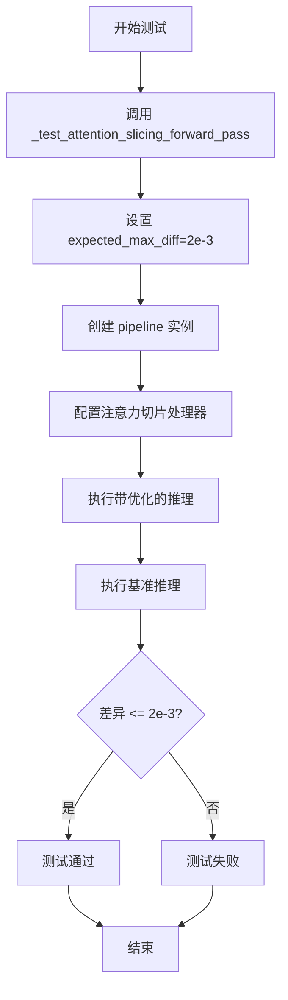

#### 带注释源码

```python
def test_attention_slicing_forward_pass(self):
    """
    测试注意力切片优化下的前向传播是否保持正确性
    
    该方法继承自 PipelineTesterMixin，通过对比普通推理和
    启用注意力切片后的推理结果，验证两者差异是否在允许范围内
    """
    # 调用父类方法进行注意力切片测试，设置允许的最大差异阈值为 2e-3
    # _test_attention_slicing_forward_pass 内部会：
    # 1. 创建 pipeline 并启用注意力切片 (set_attention_slice)
    # 2. 执行推理获取优化后的结果
    # 3. 执行基准推理获取原始结果
    # 4. 比较两者差异并通过断言验证
    return self._test_attention_slicing_forward_pass(expected_max_diff=2e-3)
```


### ControlNetPipelineSDXLImg2ImgFastTests.test_xformers_attention_forwardGenerator_pass

这是一个单元测试方法，用于验证在启用XFormers注意力机制时，ControlNet SDXL图像到图像生成管线的前向传播是否正确执行。该测试通过比较输出结果与基准值的差异来确保XFormers实现的正确性。

参数：
- 无显式参数（继承自unittest.TestCase的self参数为隐式参数）

返回值：无返回值（None），该方法为测试用例，通过断言验证正确性

#### 流程图

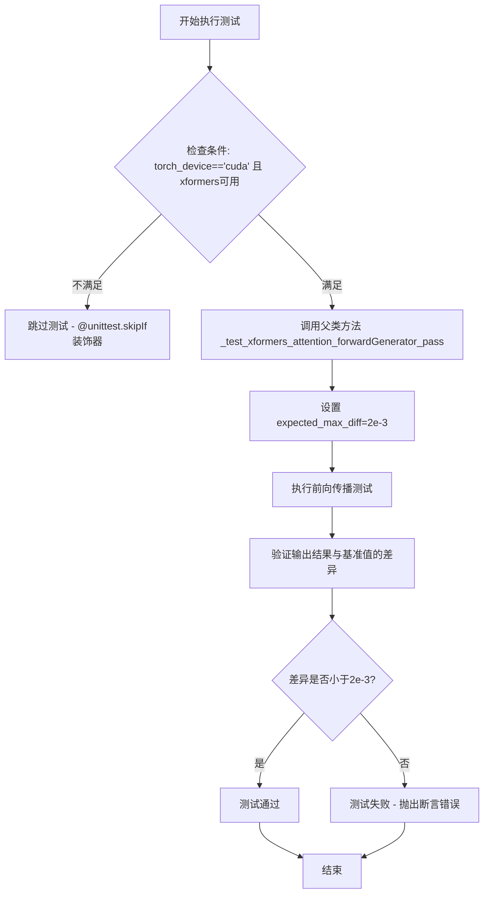

#### 带注释源码

```python
@unittest.skipIf(
    torch_device != "cuda" or not is_xformers_available(),
    reason="XFormers attention is only available with CUDA and `xformers` installed",
)
def test_xformers_attention_forwardGenerator_pass(self):
    """
    测试XFormers注意力机制的前向传播是否正确。
    
    该测试方法用于验证在CUDA设备上启用XFormers加速时，
    ControlNetPipelineSDXLImg2Img管线能够正确执行推理过程。
    测试通过比较XFormers实现与标准实现的输出来确保正确性。
    
    注意事项:
    - 仅在CUDA设备上运行
    - 需要安装xformers库
    - 使用2e-3作为最大允许差异的阈值
    """
    # 调用父类中定义的通用XFormers注意力测试方法
    # expected_max_diff=2e-3 表示输出与基准值的最大允许差异
    self._test_xformers_attention_forwardGenerator_pass(expected_max_diff=2e-3)
```

#### 关键信息说明

| 项目 | 说明 |
|------|------|
| **测试类** | `ControlNetPipelineSDXLImg2ImgFastTests` |
| **父类调用方法** | `_test_xformers_attention_forwardGenerator_pass` |
| **测试条件** | CUDA设备 + xformers库可用 |
| **差异阈值** | 2e-3 (0.002) |
| **装饰器** | `@unittest.skipIf` 用于条件跳过 |
| **依赖检查** | `is_xformers_available()` 检查xformers是否可用 |


### `ControlNetPipelineSDxlImg2ImgFastTests.test_inference_batch_single_identical`

该方法是 `ControlNetPipelineSDXLImg2ImgFastTests` 测试类中的一个测试方法，用于验证批量推理（batch inference）与单样本推理（single inference）产生一致的结果。它通过调用父类混入（mixin）方法 `_test_inference_batch_single_identical` 来执行验证，使用 2e-3 的最大差异阈值来确保数值一致性。

参数：

- `self`：`ControlNetPipelineSDXLImg2ImgFastTests`，隐式参数，表示测试类实例本身

返回值：`None`，该方法为测试方法，通过断言验证结果，不返回任何值

#### 流程图

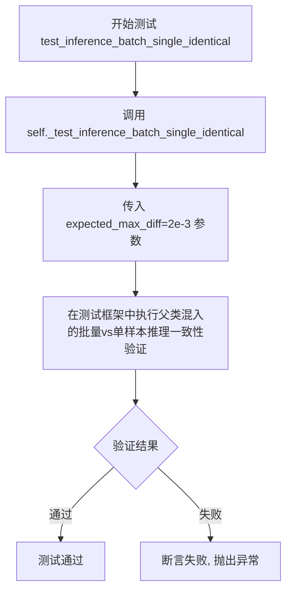

#### 带注释源码

```python
def test_inference_batch_single_identical(self):
    """
    测试方法：验证批量推理与单样本推理产生相同的结果
    
    该测试方法继承自 PipelineTesterMixin，通过调用父类的
    _test_inference_batch_single_identical 方法来验证：
    1. 批量输入（batch_size > 1）的推理结果
    2. 逐个单独推理的结果
    3. 两者数值差异应小于 expected_max_diff (2e-3)
    
    参数:
        self: ControlNetPipelineSDXLImg2ImgFastTests 实例
    
    返回:
        None: 测试方法，通过断言验证，不返回具体值
    
    注意:
        - expected_max_diff=2e-3 是一个相对宽松的容差阈值
        - 实际验证逻辑在父类 PipelineTesterMixin 中实现
    """
    # 调用父类混入的测试方法，传入期望的最大差异阈值
    # 该方法内部会：
    # 1. 准备批量输入和对应的单样本输入
    # 2. 执行批量推理和逐个推理
    # 3. 比较两者结果的差异
    # 4. 使用 assert 断言差异在允许范围内
    self._test_inference_batch_single_identical(expected_max_diff=2e-3)
```


### `ControlNetPipelineSDXLImg2ImgFastTests.test_save_load_optional_components`

该方法是一个测试用例，用于验证 StableDiffusionXLControlNetImg2ImgPipeline 管道在保存和加载可选组件时的正确性。目前该方法实现为空（pass），等待后续补充refiner相关测试。

参数：

- `self`：`ControlNetPipelineSDXLImg2ImgFastTests`，测试类实例本身，隐式参数

返回值：`None`，该方法为测试方法，无返回值（pass 语句）

#### 流程图

```mermaid
flowchart TD
    A[开始测试 test_save_load_optional_components] --> B{执行保存操作}
    B --> C[序列化管道组件]
    C --> D{执行加载操作}
    D --> E[反序列化管道组件]
    E --> F[验证可选组件完整性]
    F --> G{组件匹配?}
    G -->|是| H[测试通过]
    G -->|否| I[测试失败]
    H --> J[结束]
    I --> J
    
    style A fill:#f9f,stroke:#333
    style H fill:#9f9,stroke:#333
    style I fill:#f99,stroke:#333
```

*注：当前实现中该方法体为 `pass`，实际流程图表示的是预期功能，当前代码直接跳转到结束*

#### 带注释源码

```python
# TODO(Patrick, Sayak) - skip for now as this requires more refiner tests
def test_save_load_optional_components(self):
    """
    测试管道保存和加载可选组件的功能。
    
    该测试方法用于验证 StableDiffusionXLControlNetImg2ImgPipeline 
    在序列化（save）和反序列化（load）过程中对可选组件的处理能力。
    
    目前实现为空（pass），原因：
    - 需要额外的 refiner 测试支持
    - 属于待实现的功能
    """
    pass  # TODO: 实现保存/加载可选组件的测试逻辑
```


### `ControlNetPipelineSDXLImg2ImgFastTests.test_stable_diffusion_xl_offloads`

该测试方法用于验证 StableDiffusionXLControlNetImg2ImgPipeline 在三种不同 CPU offload 模式下的输出一致性：默认模式、模型级 CPU offload 和顺序 CPU offload。通过对比三种模式的推理结果，确保启用 CPU offload 功能后模型输出的数值精度仍在可接受范围内。

参数：此方法无显式参数（使用类实例的 `self` 和从 `testing_utils` 导入的全局 `torch_device`）

返回值：`None`，该方法为单元测试，通过断言验证结果，不返回任何值

#### 流程图

```mermaid
flowchart TD
    A[开始测试] --> B[创建空列表 pipes]
    B --> C[获取第一组 dummy components]
    C --> D[创建 pipeline 并移动到 torch_device]
    D --> E[将 pipeline 添加到 pipes 列表]
    E --> F[获取第二组 dummy components]
    F --> G[创建 pipeline 并启用 model_cpu_offload]
    G --> H[将 pipeline 添加到 pipes 列表]
    H --> I[获取第三组 dummy components]
    I --> J[创建 pipeline 并启用 sequential_cpu_offload]
    J --> K[将 pipeline 添加到 pipes 列表]
    K --> L[创建空列表 image_slices]
    L --> M{遍历 pipes 中的每个 pipeline}
    M -->|是| N[设置 unet 默认注意力处理器]
    N --> O[获取 dummy inputs]
    O --> P[执行 pipeline 推理]
    P --> Q[提取图像切片并展平]
    Q --> R[添加到 image_slices 列表]
    R --> M
    M -->|否| S{验证输出一致性}
    S --> T[断言: 默认模式 vs model_offload 差异 < 1e-3]
    T --> U[断言: 默认模式 vs sequential_offload 差异 < 1e-3]
    U --> V[测试结束]
```

#### 带注释源码

```python
@require_torch_accelerator  # 装饰器：仅在有 CUDA accelerator 时运行此测试
def test_stable_diffusion_xl_offloads(self):
    """
    测试 StableDiffusionXLControlNetImg2ImgPipeline 在不同 CPU offload 模式下的输出一致性。
    验证默认模式、enable_model_cpu_offload 和 enable_sequential_cpu_offload 三种模式
    产生的图像数值差异在允许范围内。
    """
    pipes = []  # 存储三个不同配置的 pipeline 实例
    components = self.get_dummy_components()  # 获取第一组虚拟组件（默认配置）
    sd_pipe = self.pipeline_class(**components).to(torch_device)  # 创建 pipeline 并移至设备
    pipes.append(sd_pipe)  # 添加到列表

    components = self.get_dummy_components()  # 获取第二组虚拟组件
    sd_pipe = self.pipeline_class(**components)  # 创建 pipeline
    sd_pipe.enable_model_cpu_offload(device=torch_device)  # 启用模型级 CPU offload
    pipes.append(sd_pipe)  # 添加到列表

    components = self.get_dummy_components()  # 获取第三组虚拟组件
    sd_pipe = self.pipeline_class(**components)  # 创建 pipeline
    sd_pipe.enable_sequential_cpu_offload(device=torch_device)  # 启用顺序 CPU offload
    pipes.append(sd_pipe)  # 添加到列表

    image_slices = []  # 存储每个 pipeline 输出的图像切片
    for pipe in pipes:  # 遍历三个 pipeline
        pipe.unet.set_default_attn_processor()  # 重置注意力处理器为默认实现

        inputs = self.get_dummy_inputs(torch_device)  # 获取虚拟输入参数
        image = pipe(**inputs).images  # 执行推理获取图像

        image_slices.append(image[0, -3:, -3:, -1].flatten())  # 提取图像右下角 3x3 区域并展平

    # 断言：验证不同 offload 模式的输出与默认模式一致（允许 1e-3 的数值误差）
    assert np.abs(image_slices[0] - image_slices[1]).max() < 1e-3
    assert np.abs(image_slices[0] - image_slices[2]).max() < 1e-3
```


### `ControlNetPipelineSDXLImg2ImgFastTests.test_stable_diffusion_xl_multi_prompts`

该函数是针对 StableDiffusionXLControlNetImg2ImgPipeline 的多提示词功能测试，验证单个提示词、重复提示词、不同提示词以及负提示词在不同组合下的图像生成行为是否符合预期（相同提示词应产生相同结果，不同提示词应产生不同结果）。

参数：

-  `self`：`ControlNetPipelineSDXLImg2ImgFastTests`，测试类实例本身

返回值：`None`，无返回值（该函数为测试用例，通过断言验证行为）

#### 流程图

```mermaid
flowchart TD
    A[开始测试 test_stable_diffusion_xl_multi_prompts] --> B[获取虚拟组件 components]
    B --> C[创建Pipeline并移动到torch_device]
    D[测试1: 单提示词] --> E[调用get_dummy_inputs获取输入]
    E --> F[执行pipeline获取图像]
    F --> G[提取图像切片image_slice_1]
    G --> H[测试2: 重复提示词prompt_2=prompt]
    H --> I[执行pipeline获取图像]
    I --> J[提取图像切片image_slice_2]
    J --> K{断言: image_slice_1 == image_slice_2}
    K -->|通过| L[测试3: 不同提示词prompt_2='different prompt']
    L --> M[执行pipeline获取图像]
    M --> N[提取图像切片image_slice_3]
    N --> O{断言: image_slice_1 != image_slice_3}
    O -->|通过| P[测试4: 负提示词single]
    P --> Q[设置negative_prompt]
    Q --> R[执行pipeline获取图像]
    R --> S[提取图像切片image_slice_1]
    S --> T[测试5: 重复负提示词]
    T --> U[设置negative_prompt和negative_prompt_2相同]
    U --> V[执行pipeline获取图像]
    V --> W[提取图像切片image_slice_2]
    W --> X{断言: image_slice_1 == image_slice_2}
    X -->|通过| Y[测试6: 不同负提示词]
    Y --> Z[设置不同的negative_prompt和negative_prompt_2]
    Z --> AA[执行pipeline获取图像]
    AA --> AB[提取图像切片image_slice_3]
    AB --> AC{断言: image_slice_1 != image_slice_3}
    AC -->|通过| AD[测试结束]
    
    K -->|失败| AE[抛出断言错误]
    O -->|失败| AE
    X -->|失败| AE
    AC -->|失败| AE
```

#### 带注释源码

```python
def test_stable_diffusion_xl_multi_prompts(self):
    """
    测试 StableDiffusionXLControlNetImg2ImgPipeline 的多提示词功能。
    验证：
    1. 相同提示词（包括重复提示词）产生相同结果
    2. 不同提示词产生不同结果
    3. 负提示词的相同/不同行为
    """
    # 获取虚拟组件，用于构建Pipeline
    components = self.get_dummy_components()
    
    # 创建Pipeline实例并移动到测试设备（CPU或CUDA）
    sd_pipe = self.pipeline_class(**components).to(torch_device)

    # ===== 测试1: 单提示词基础测试 =====
    # 获取默认的虚拟输入
    inputs = self.get_dummy_inputs(torch_device)
    
    # 执行Pipeline推理
    output = sd_pipe(**inputs)
    
    # 提取图像切片用于后续比较（取最后3x3像素）
    image_slice_1 = output.images[0, -3:, -3:, -1]

    # ===== 测试2: 重复提示词 =====
    # 获取新的虚拟输入
    inputs = self.get_dummy_inputs(torch_device)
    
    # 设置prompt_2为与prompt相同的值，测试重复提示词
    inputs["prompt_2"] = inputs["prompt"]
    
    # 执行Pipeline推理
    output = sd_pipe(**inputs)
    
    # 提取图像切片
    image_slice_2 = output.images[0, -3:, -3:, -1]

    # 断言：相同提示词（包括重复）应产生相同结果
    # 允许的最大差异为1e-4
    assert np.abs(image_slice_1.flatten() - image_slice_2.flatten()).max() < 1e-4

    # ===== 测试3: 不同提示词 =====
    # 获取新的虚拟输入
    inputs = self.get_dummy_inputs(torch_device)
    
    # 设置一个完全不同的提示词
    inputs["prompt_2"] = "different prompt"
    
    # 执行Pipeline推理
    output = sd_pipe(**inputs)
    
    # 提取图像切片
    image_slice_3 = output.images[0, -3:, -3:, -1]

    # 断言：不同提示词应产生不同的结果
    # 差异应大于1e-4
    assert np.abs(image_slice_1.flatten() - image_slice_3.flatten()).max() > 1e-4

    # ===== 测试4: 单独使用负提示词 =====
    # 获取新的虚拟输入
    inputs = self.get_dummy_inputs(torch_device)
    
    # 手动设置一个负提示词
    inputs["negative_prompt"] = "negative prompt"
    
    # 执行Pipeline推理
    output = sd_pipe(**inputs)
    
    # 提取图像切片
    image_slice_1 = output.images[0, -3:, -3:, -1]

    # ===== 测试5: 重复负提示词 =====
    # 获取新的虚拟输入
    inputs = self.get_dummy_inputs(torch_device)
    
    # 设置相同的负提示词到两个参数
    inputs["negative_prompt"] = "negative prompt"
    inputs["negative_prompt_2"] = inputs["negative_prompt"]
    
    # 执行Pipeline推理
    output = sd_pipe(**inputs)
    
    # 提取图像切片
    image_slice_2 = output.images[0, -3:, -3:, -1]

    # 断言：相同的负提示词应产生相同结果
    assert np.abs(image_slice_1.flatten() - image_slice_2.flatten()).max() < 1e-4

    # ===== 测试6: 不同负提示词 =====
    # 获取新的虚拟输入
    inputs = self.get_dummy_inputs(torch_device)
    
    # 设置两个不同的负提示词
    inputs["negative_prompt"] = "negative prompt"
    inputs["negative_prompt_2"] = "different negative prompt"
    
    # 执行Pipeline推理
    output = sd_pipe(**inputs)
    
    # 提取图像切片
    image_slice_3 = output.images[0, -3:, -3:, -1]

    # 断言：不同的负提示词应产生不同结果
    assert np.abs(image_slice_1.flatten() - image_slice_3.flatten()).max() > 1e-4
```

## 关键组件


### StableDiffusionXLControlNetImg2ImgPipeline

Stable Diffusion XL ControlNet image-to-image转换管道测试类，用于验证ControlNet条件引导的SDXL图像生成管道的功能正确性。

### UNet2DConditionModel

SDXL条件U-Net模型，用于去噪过程的潜在空间预测，支持文本时间嵌入和交叉注意力机制。

### ControlNetModel

ControlNet条件控制模型，从输入图像提取条件特征，用于引导去噪过程。

### AutoencoderKL

变分自编码器(VAE)模型，负责将图像编码到潜在空间并进行解码重建。

### CLIPTextModel / CLIPTextModelWithProjection

CLIP文本编码器，将文本提示转换为文本嵌入向量，用于条件引导生成过程。

### EulerDiscreteScheduler

欧拉离散调度器，实现扩散模型的噪声调度策略，控制去噪步骤的时间步长。

### get_dummy_components()

测试辅助方法，创建用于单元测试的虚拟模型组件，包含UNet、ControlNet、VAE、文本编码器等。

### get_dummy_inputs()

测试辅助方法，创建用于推理的虚拟输入数据，包括图像、提示词、随机种子等参数。

### test_stable_diffusion_xl_controlnet_img2img

核心功能测试方法，验证管道端到端的图像生成能力，检查输出图像尺寸和像素值范围。

### test_stable_diffusion_xl_controlnet_img2img_guess

guess_mode测试方法，验证ControlNet在自主模式下的条件引导能力。

### test_stable_diffusion_xl_offloads

CPU卸载测试，验证模型在不同卸载策略下的功能一致性，包括默认、enable_model_cpu_offload和enable_sequential_cpu_offload。

### test_stable_diffusion_xl_multi_prompts

多提示词测试，验证管道对prompt_2、negative_prompt和negative_prompt_2等额外提示词输入的正确处理能力。

## 问题及建议


### 已知问题

- **硬编码的测试参数**：在 `get_dummy_inputs` 方法中，`num_inference_steps=2`、`guidance_scale=6.0` 等参数被硬编码，分散在多个测试中，缺乏统一配置管理
- **重复组件初始化**：在 `test_stable_diffusion_xl_offloads` 方法中连续三次调用 `get_dummy_components()` 创建相同的组件，造成不必要的计算和内存开销
- **设备处理不一致**：部分测试使用 `device = "cpu"` 强制指定设备，而其他测试使用全局 `torch_device`，导致测试行为依赖于运行环境
- **空实现的测试方法**：`test_save_load_optional_components` 方法只有 `pass` 语句，存在 TODO 注释但未实现
- **未使用的导入**：`random` 模块被导入但未实际使用，代码中使用的是 `torch.Generator`
- **MPS 设备特殊处理**：对 MPS 设备 (`str(device).startswith("mps")`) 单独处理生成器逻辑，增加了代码分支复杂度
- **重复的 expected_slice**：多个测试方法中重复定义了相同的 `expected_slice` numpy 数组，应提取为类级常量
- **IP Adapter 测试不完整**：`test_ip_adapter` 方法依赖 CPU 设备的硬编码结果，且存在 TODO 注释表明结果需要更新

### 优化建议

- 将测试参数（如 `num_inference_steps`、`guidance_scale`、`seed` 等）提取为类级常量或配置字典，便于统一修改
- 在 `test_stable_diffusion_xl_offloads` 中复用第一次创建的组件，或使用深拷贝方式复制组件
- 统一使用全局 `torch_device` 变量，或在测试类级别设置默认 device 属性
- 实现 `test_save_load_optional_components` 方法的完整测试逻辑，或使用 `@unittest.skip` 明确跳过
- 移除未使用的 `random` 导入
- 将 MPS 设备处理逻辑统一到生成器创建的标准流程中
- 定义类级常量 `EXPECTED_SLICE = np.array([...])` 供所有测试方法复用
- 完善 `test_ip_adapter` 的跨平台测试支持，移除对特定设备的硬编码依赖

## 其它


### 设计目标与约束

该测试文件旨在验证StableDiffusionXLControlNetImg2ImgPipeline在图像到图像转换任务中的功能正确性。测试覆盖了CPU和CUDA设备，要求在CPU设备上保证确定性结果。测试采用预定义的超参数（num_inference_steps=2, guidance_scale=6.0）以确保可重复性，并使用固定随机种子（seed=0）来消除测试结果的不确定性。

### 错误处理与异常设计

测试文件通过unittest框架进行错误捕获和断言验证。主要断言包括：图像形状验证（assert image.shape == (1, 64, 64, 3)）、数值精度验证（assert np.abs(...).max() < 1e-2）以及条件跳过（@unittest.skipIf用于XFormers测试）。测试使用try-except模式处理设备兼容性（如mps设备的generator处理），并在不适配时回退到torch.manual_seed。

### 数据流与状态机

测试数据流遵循以下路径：get_dummy_components()生成模型组件→get_dummy_inputs()构造输入参数→pipeline执行推理→输出结果验证。状态转换通过PipelineTesterMixin的required_optional_params管理可配置参数集合。图像处理流程：原始图像→float tensor→pipeline处理→numpy数组输出。

### 外部依赖与接口契约

主要依赖包括：transformers(CLIPTextModel/CLIPTokenizer)、diffusers(StableDiffusionXLControlNetImg2ImgPipeline/UNet2DConditionModel/ControlNetModel/AutoencoderKL)、numpy、torch。接口契约：pipeline_class固定为StableDiffusionXLControlNetImg2ImgPipeline，params包含TEXT_GUIDED_IMAGE_VARIATION_PARAMS，batch_params为TEXT_GUIDED_IMAGE_VARIATION_BATCH_PARAMS。

### 测试覆盖范围

测试覆盖核心场景包括：基础推理功能(test_stable_diffusion_xl_controlnet_img2img)、猜测模式(test_stable_diffusion_xl_controlnet_img2img_guess)、注意力切片(test_attention_slicing_forward_pass)、XFormers优化(test_xformers_attention_forwardGenerator_pass)、批量推理(test_inference_batch_single_identical)、模型卸载(test_stable_diffusion_xl_offloads)、多提示词处理(test_stable_diffusion_xl_multi_prompts)、IP适配器(test_ip_adapter)。

### 配置与常量定义

关键配置参数包括：unet的block_out_channels=(32, 64)、layers_per_block=2、sample_size=32；controlnet的conditioning_embedding_out_channels=(16, 32)；vae的latent_channels=4；text_encoder的hidden_size=32、projection_dim=32；scheduler的beta_start=0.00085、beta_end=0.012。

### 性能基准与预期

测试在CPU模式下预期执行时间<30秒（仅2步推理），内存占用<2GB（使用小尺寸模型32x32）。精度要求：数值差异阈值为1e-2至1e-4，CPU offload测试差异阈值为1e-3。注意力切片和XFormers测试的expected_max_diff设置为2e-3。

### 兼容性考虑

支持设备：CPU（强制）、CUDA（可选）。MPS设备特殊处理：使用torch.manual_seed替代torch.Generator。XFormers依赖条件：仅在CUDA+xformers可用时执行相关测试。Python版本：依赖Python 3.x及torch>=1.9。

### 测试隔离与可重复性

每个测试方法使用独立的components和inputs实例，通过torch.manual_seed(0)确保确定性。enable_full_determinism()全局配置确保跨测试的一致性。测试间无状态共享，pipeline对象在每次测试中重新创建。

### 扩展性与维护性

通过mixin类（IPAdapterTesterMixin、PipelineLatentTesterMixin等）实现功能扩展。test_save_load_optional_components当前为pass状态，预留接口待后续实现。expected_pipe_slice根据设备动态调整，支持未来模型权重更新（TODO注释）。


    