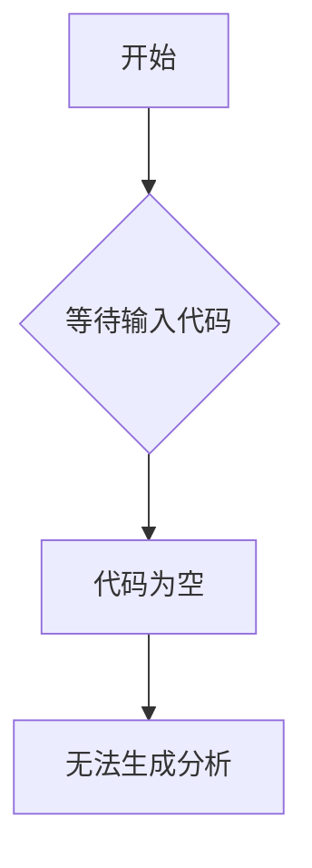

# `diffusers\tests\pipelines\controlnet_flux\__init__.py` 详细设计文档

未提供源代码，无法进行分析。请提供需要分析的代码。

## 整体流程



## 类结构

```
无可用结构信息 - 未提供代码
```

## 全局变量及字段


    

## 全局函数及方法


## 关键组件


## 问题及建议


### 已知问题

-   未提供代码，无法进行具体的技术债务和优化空间分析

### 优化建议

-   请提供需要分析的代码，以便进行详细的架构和逻辑分析
-   如果代码较大，建议提供核心模块或关键功能的代码片段
-   确认代码是否通过正确的方式传递（如文件上传、代码块等）


## 其它


### 设计目标与约束

- **设计目标**：实现…（待根据实际需求补充）  
- **约束条件**：技术栈版本、兼容性要求、性能指标、资源限制等（待补充）

### 错误处理与异常设计

- **异常分类**：系统异常、业务异常、第三方异常、网络异常等（待补充）  
- **错误码体系**：统一错误码定义、错误信息返回格式、异常堆栈记录规范（待补充）

### 数据流与状态机

- **数据流图**：描述数据在各个模块之间的流向、处理顺序及转换逻辑（待补充）  
- **状态机**：关键对象的状态集合、状态转换事件、触发条件及异常处理（待补充）

### 外部依赖与接口契约

- **第三方库**：库名称、版本号、主要功能概述（待补充）  
- **接口契约**：RESTful API、gRPC、消息队列等通信协议、请求/响应结构、鉴权方式（待补充）

### 性能与可伸缩性

- **性能指标**：响应时间、吞吐量、并发用户数、资源利用率等（待补充）  
- **可伸缩性方案**：水平/垂直扩展策略、缓存使用、负载均衡、分库分表等（待补充）

### 安全与权限

- **安全需求**：身份验证、授权、加密、脱敏、审计日志等（待补充）  
- **权限模型**：角色、权限划分、访问控制列表（ACL）、基于属性的访问控制（ABAC）等（待补充）

### 可维护性与可测试性

- **可维护性**：模块化设计、代码复杂度阈值、文档完整性、代码审查规范（待补充）  
- **可测试性**：单元测试覆盖率目标、集成测试策略、Mock/Stub 框架使用、自动化测试流水线（待补充）

### 部署架构

- **部署环境**：开发、测试、预生产、正式生产环境的划分与网络拓扑（待补充）  
- **部署方式**：容器化（Docker）、编排（Kubernetes / Docker Compose）、自动化部署脚本（待补充）

### 监控与日志

- **监控指标**：系统层面（CPU、内存、磁盘、网络）与业务层面（请求错误率、响应延迟）的关键指标（待补充）  
- **日志规范**：日志级别、格式标准、日志采集（ELK、 Loki）、告警阈值与响应流程（待补充）

### 持续集成/持续部署 (CI/CD)

- **流水线阶段**：代码静态检查、单元测试、构建、镜像推送、灰度/蓝绿部署、回归测试（待补充）  
- **触发规则**：代码提交自动触发、定时构建、版本发布触发、手动审批（待补充）

### 版本控制与发布策略

- **分支模型**：Git Flow、Trunk Based Development、特性分支策略（待补充）  
- **版本号规则**：语义化版本（SemVer）使用规范、发布频率与版本发布流程（待补充）

    