# `diffusers\tests\pipelines\controlnet_flux\test_controlnet_flux.py` 详细设计文档

这是一个用于测试FluxControlNetPipeline的单元测试和集成测试文件，包含了快速测试类和慢速测试类，用于验证FluxControlNetPipeline在图像生成任务中的功能正确性，包括控制网（ControlNet）集成、文本编码器、VAE和Transformer模型的使用，以及图像输出形状验证等。

## 整体流程

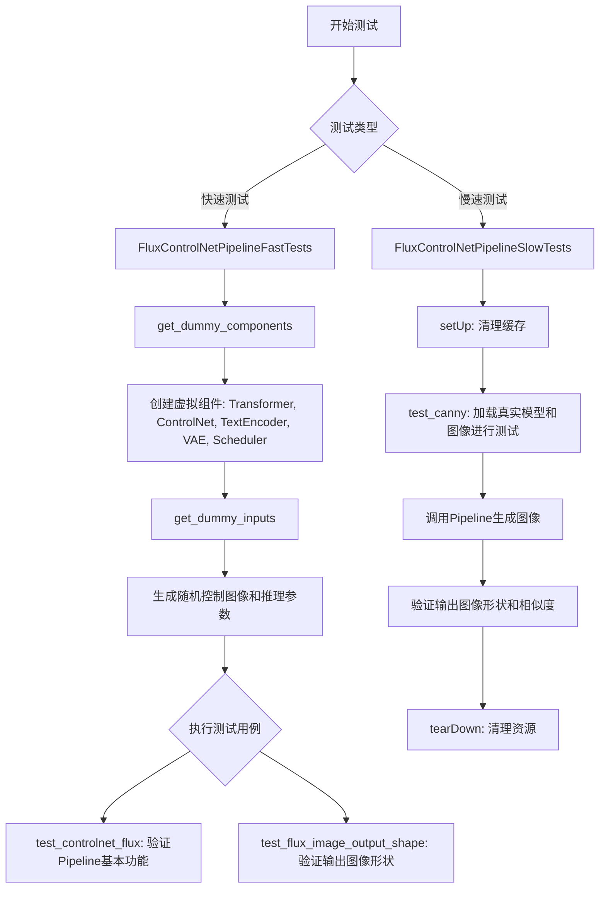

## 类结构

```
unittest.TestCase
├── FluxControlNetPipelineFastTests (快速单元测试类)
│   ├── get_dummy_components() -> dict
│   ├── get_dummy_inputs() -> dict
│   ├── test_controlnet_flux()
│   ├── test_xformers_attention_forwardGenerator_pass()
│   └── test_flux_image_output_shape()
└── FluxControlNetPipelineSlowTests (慢速集成测试类)
setUp()
tearDown()
test_canny()
```

## 全局变量及字段


### `enable_full_determinism`
    
Function to enable full determinism in tests for reproducible results

类型：`function`
    


### `torch_device`
    
Device string identifier for PyTorch operations (e.g., 'cuda', 'cpu')

类型：`str | torch.device`
    


### `nightly`
    
Decorator to mark tests that should only run during nightly test runs

类型：`decorator`
    


### `require_big_accelerator`
    
Decorator to skip tests that require large accelerator resources

类型：`decorator`
    


### `FluxControlNetPipelineFastTests.pipeline_class`
    
The pipeline class being tested, pointing to FluxControlNetPipeline

类型：`type[FluxControlNetPipeline]`
    


### `FluxControlNetPipelineFastTests.params`
    
Frozen set of parameter names that can be passed to the pipeline (prompt, height, width, guidance_scale, prompt_embeds, pooled_prompt_embeds)

类型：`frozenset[str]`
    


### `FluxControlNetPipelineFastTests.batch_params`
    
Frozen set of parameter names that support batch processing (prompt)

类型：`frozenset[str]`
    


### `FluxControlNetPipelineFastTests.test_layerwise_casting`
    
Flag to enable testing of layer-wise dtype casting in the pipeline

类型：`bool`
    


### `FluxControlNetPipelineFastTests.test_group_offloading`
    
Flag to enable testing of group offloading functionality in the pipeline

类型：`bool`
    


### `FluxControlNetPipelineSlowTests.pipeline_class`
    
The pipeline class being tested in slow tests, pointing to FluxControlNetPipeline

类型：`type[FluxControlNetPipeline]`
    
    

## 全局函数及方法


### `FluxControlNetPipelineFastTests.get_dummy_components`

该方法用于创建 FluxControlNetPipeline 测试所需的虚拟（dummy）组件集合，通过初始化各个模型组件（Transformer、ControlNet、文本编码器、VAE等）为测试提供一致的可重现环境。

参数：

- 该方法无显式参数（隐式接收 `self` 参数）

返回值：`Dict[str, Any]`，返回一个包含所有 pipeline 组件的字典，包括调度器、文本编码器、分词器、Transformer、VAE、ControlNet 等，用于实例化 FluxControlNetPipeline

#### 流程图

```mermaid
flowchart TD
    A[开始 get_dummy_components] --> B[设置随机种子 torch.manual_seed(0)]
    B --> C[创建 FluxTransformer2DModel]
    C --> D[创建 FluxControlNetModel]
    D --> E[配置 CLIPTextConfig]
    E --> F[创建 CLIPTextModel]
    F --> G[加载 T5EncoderModel]
    G --> H[加载 CLIPTokenizer 和 T5TokenizerFast]
    H --> I[创建 AutoencoderKL]
    I --> J[创建 FlowMatchEulerDiscreteScheduler]
    J --> K[构建返回字典]
    K --> L[包含 scheduler, text_encoder, text_encoder_2, tokenizer, tokenizer_2, transformer, vae, controlnet, image_encoder=None, feature_extractor=None]
    L --> M[结束并返回字典]
```

#### 带注释源码

```
def get_dummy_components(self):
    """
    生成用于测试的虚拟组件字典，初始化所有FluxControlNetPipeline需要的模型组件。
    使用固定随机种子确保测试结果可重现。
    """
    # 设置随机种子确保可重现性
    torch.manual_seed(0)
    
    # 创建 Flux 变换器模型 - 核心扩散模型
    transformer = FluxTransformer2DModel(
        patch_size=1,
        in_channels=16,
        num_layers=1,
        num_single_layers=1,
        attention_head_dim=16,
        num_attention_heads=2,
        joint_attention_dim=32,
        pooled_projection_dim=32,
        axes_dims_rope=[4, 4, 8],
    )

    # 重新设置随机种子
    torch.manual_seed(0)
    
    # 创建 Flux ControlNet 模型 - 用于条件控制
    controlnet = FluxControlNetModel(
        patch_size=1,
        in_channels=16,
        num_layers=1,
        num_single_layers=1,
        attention_head_dim=16,
        num_attention_heads=2,
        joint_attention_dim=32,
        pooled_projection_dim=32,
        axes_dims_rope=[4, 4, 8],
    )

    # 配置 CLIP 文本编码器参数
    clip_text_encoder_config = CLIPTextConfig(
        bos_token_id=0,
        eos_token_id=2,
        hidden_size=32,
        intermediate_size=37,
        layer_norm_eps=1e-05,
        num_attention_heads=4,
        num_hidden_layers=5,
        pad_token_id=1,
        vocab_size=1000,
        hidden_act="gelu",
        projection_dim=32,
    )
    
    # 创建 CLIP 文本编码器
    torch.manual_seed(0)
    text_encoder = CLIPTextModel(clip_text_encoder_config)

    # 创建 T5 文本编码器 (第二个文本编码器)
    torch.manual_seed(0)
    text_encoder_2 = T5EncoderModel.from_pretrained("hf-internal-testing/tiny-random-t5")

    # 加载分词器
    tokenizer = CLIPTokenizer.from_pretrained("hf-internal-testing/tiny-random-clip")
    tokenizer_2 = T5TokenizerFast.from_pretrained("hf-internal-testing/tiny-random-t5")

    # 创建 VAE (变分自编码器) 用于图像编码/解码
    torch.manual_seed(0)
    vae = AutoencoderKL(
        sample_size=32,
        in_channels=3,
        out_channels=3,
        block_out_channels=(4,),
        layers_per_block=1,
        latent_channels=4,
        norm_num_groups=1,
        use_quant_conv=False,
        use_post_quant_conv=False,
        shift_factor=0.0609,
        scaling_factor=1.5035,
    )

    # 创建调度器 - 控制扩散过程
    scheduler = FlowMatchEulerDiscreteScheduler()

    # 返回包含所有组件的字典
    return {
        "scheduler": scheduler,                    # 扩散调度器
        "text_encoder": text_encoder,              # CLIP 文本编码器
        "text_encoder_2": text_encoder_2,         # T5 文本编码器
        "tokenizer": tokenizer,                    # CLIP 分词器
        "tokenizer_2": tokenizer_2,                # T5 分词器
        "transformer": transformer,                # Flux 变换器
        "vae": vae,                                # VAE 模型
        "controlnet": controlnet,                  # ControlNet 模型
        "image_encoder": None,                     # 图像编码器 (可选, IP-Adapter)
        "feature_extractor": None,                 # 特征提取器 (可选)
    }
```


### `FluxControlNetPipelineFastTests.get_dummy_inputs`

该方法用于生成 FluxControlNetPipeline 的虚拟测试输入数据，根据设备类型（MPS 或其他）创建随机生成器，构造包含提示词、生成器、推理步数、引导系数、控制图像等完整输入字典，以便进行管道功能测试。

参数：

- `device`：`str` 或 `torch.device`，运行设备，用于确定随机张量生成的设备以及 MPS 设备判断
- `seed`：`int`，随机种子，默认值为 0，用于控制随机数生成的可重复性

返回值：`dict`，包含 FluxControlNetPipeline 推理所需的所有测试输入参数

#### 流程图

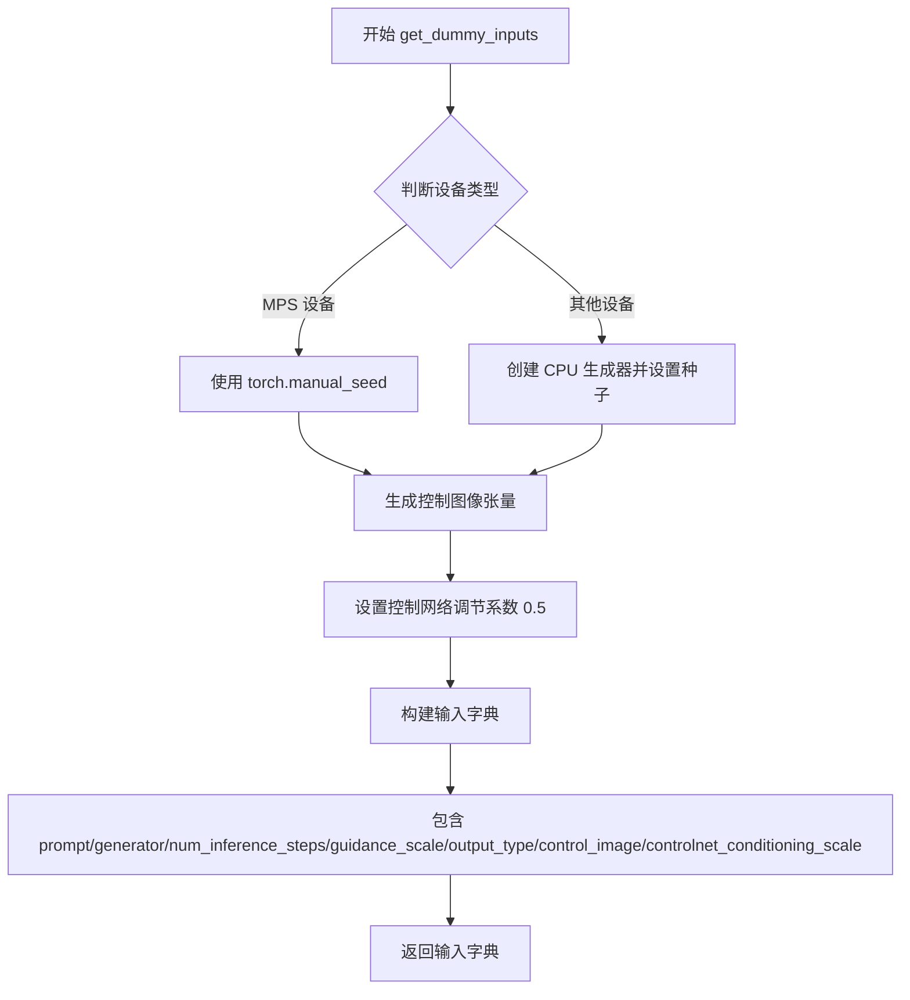

#### 带注释源码

```
def get_dummy_inputs(self, device, seed=0):
    """
    生成用于 FluxControlNetPipeline 测试的虚拟输入参数
    
    Args:
        device: 运行设备，支持 MPS 和其他设备（如 CUDA、CPU）
        seed: 随机种子，默认 0，用于保证测试可重复性
    
    Returns:
        dict: 包含完整推理参数的字典
    """
    
    # 根据设备类型选择随机数生成方式
    # MPS (Apple Silicon) 设备需要特殊处理，使用 torch.manual_seed
    if str(device).startswith("mps"):
        generator = torch.manual_seed(seed)
    else:
        # 其他设备创建 CPU 上的生成器并设置种子
        generator = torch.Generator(device="cpu").manual_seed(seed)

    # 生成随机控制图像张量 (1, 3, 32, 32)
    # 使用相同的生成器确保可重复性
    control_image = randn_tensor(
        (1, 3, 32, 32),           # 张量形状：批次1，3通道，32x32分辨率
        generator=generator,      # 复用上方创建的生成器
        device=torch.device(device), # 转换设备参数为 torch.device 对象
        dtype=torch.float16,      # 使用半精度浮点数
    )

    # 控制网络调节系数，控制条件图像对生成的影响程度
    controlnet_conditioning_scale = 0.5

    # 组装完整的输入参数字典
    inputs = {
        "prompt": "A painting of a squirrel eating a burger",  # 文本提示
        "generator": generator,                                  # 随机生成器
        "num_inference_steps": 2,                                # 推理步数
        "guidance_scale": 3.5,                                   # CFG 引导系数
        "output_type": "np",                                     # 输出类型为 numpy
        "control_image": control_image,                          # 控制图像
        "controlnet_conditioning_scale": controlnet_conditioning_scale,  # 控制系数
    }

    return inputs
```


### `FluxControlNetPipelineFastTests.test_controlnet_flux`

该测试方法用于验证 FluxControlNetPipeline 的核心功能：通过给定的提示词和控制图像（ControlNet conditioning）生成对应图像，并确保输出图像的像素值与预期值在允许的误差范围内一致。

参数：无（仅包含 `self`，由测试框架隐式传递）

返回值：`None`（测试方法，无返回值）

#### 流程图

```mermaid
flowchart TD
    A[开始测试] --> B[获取虚拟组件: get_dummy_components]
    B --> C[创建FluxControlNetPipeline实例]
    C --> D[将Pipeline移至指定设备并转换为float16]
    D --> E[配置进度条: set_progress_bar_config]
    E --> F[获取虚拟输入: get_dummy_inputs]
    F --> G[执行推理: flux_pipe(**inputs)]
    G --> H[提取输出图像]
    H --> I{验证图像形状}
    I -->|是| J[提取图像切片并与预期值比较]
    J --> K{误差是否小于1e-2}
    K -->|是| L[测试通过]
    K -->|否| M[抛出断言错误]
    I -->|否| M
```

#### 带注释源码

```python
def test_controlnet_flux(self):
    """
    测试 FluxControlNetPipeline 的基本推理功能
    
    验证流程：
    1. 创建包含虚拟组件的Pipeline实例
    2. 使用虚拟输入执行推理
    3. 验证输出图像的形状和像素值
    """
    # 步骤1: 获取预定义的虚拟组件（transformer, controlnet, vae, text_encoder等）
    components = self.get_dummy_components()
    
    # 步骤2: 使用虚拟组件初始化 FluxControlNetPipeline
    flux_pipe = FluxControlNetPipeline(**components)
    
    # 步骤3: 将Pipeline移至指定计算设备（CPU/GPU），并使用float16精度
    flux_pipe = flux_pipe.to(torch_device, dtype=torch.float16)
    
    # 步骤4: 配置进度条（disable=None 表示启用进度条）
    flux_pipe.set_progress_bar_config(disable=None)
    
    # 步骤5: 准备测试输入，包含：
    # - prompt: 文本提示词 "A painting of a squirrel eating a burger"
    # - generator: 随机数生成器（用于 reproducibility）
    # - num_inference_steps: 推理步数（2步）
    # - guidance_scale: 引导强度（3.5）
    # - control_image: 控制图像（随机噪声）
    # - controlnet_conditioning_scale: ControlNet 控制强度（0.5）
    inputs = self.get_dummy_inputs(torch_device)
    
    # 步骤6: 执行Pipeline推理，生成图像
    output = flux_pipe(**inputs)
    
    # 步骤7: 从输出中提取生成的图像
    image = output.images
    
    # 步骤8: 提取图像右下角3x3区域的最后一个通道作为验证样本
    image_slice = image[0, -3:, -3:, -1]
    
    # 步骤9: 断言验证 - 检查输出图像形状是否为 (1, 32, 32, 3)
    # 形状含义: batch=1, height=32, width=32, channels=3(RGB)
    assert image.shape == (1, 32, 32, 3)
    
    # 步骤10: 定义预期的像素值切片（通过离线计算得出）
    expected_slice = np.array(
        [0.47387695, 0.63134766, 0.5605469, 0.61621094, 0.7207031, 0.7089844, 0.70410156, 0.6113281, 0.64160156]
    )
    
    # 步骤11: 断言验证 - 检查生成图像与预期值的最大误差是否在允许范围内（1e-2）
    # 如果误差超过阈值，抛出详细的错误信息
    assert np.abs(image_slice.flatten() - expected_slice).max() < 1e-2, (
        f"Expected: {expected_slice}, got: {image_slice.flatten()}"
    )
```


### `FluxControlNetPipelineFastTests.test_xformers_attention_forwardGenerator_pass`

这是一个被跳过的单元测试方法，原本用于测试 xFormers 注意力机制的前向传播，但由于 xFormersAttnProcessor 不支持 SD3 联合注意力，当前已被禁用。

参数：

- `self`：`FluxControlNetPipelineFastTests`，测试类实例本身，包含测试所需的组件和方法

返回值：`None`，该方法不返回任何值

#### 流程图

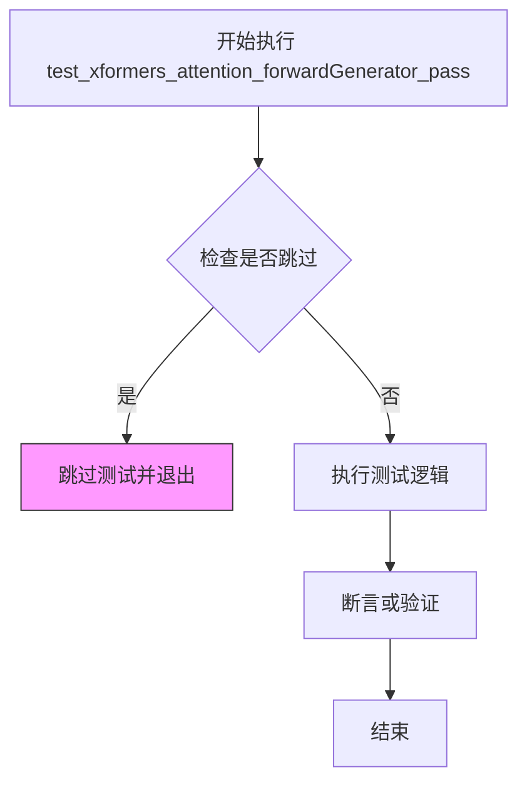

#### 带注释源码

```python
@unittest.skip("xFormersAttnProcessor does not work with SD3 Joint Attention")
def test_xformers_attention_forwardGenerator_pass(self):
    """
    测试 xFormers 注意力机制的前向传播功能。
    
    注意：此测试当前被跳过，因为 xFormersAttnProcessor 不支持 SD3 联合注意力机制。
    该测试原本旨在验证在 FluxControlNetPipeline 中使用 xFormers 加速的注意力计算，
    但由于兼容性限制，测试被禁用。
    """
    pass  # 测试逻辑未实现，仅包含 pass 语句以保持测试结构完整
```


### `FluxControlNetPipelineFastTests.test_flux_image_output_shape`

这是一个单元测试方法，用于验证 FluxControlNetPipeline 在给定不同高度和宽度的输入条件图像时，输出图像的形状是否符合预期（考虑了 VAE 缩放因子的影响，确保输出尺寸是 VAE 块大小的整数倍）。

参数：

- `self`：隐式参数，测试类实例本身，无额外描述

返回值：`None`，该方法无返回值，通过断言验证输出图像形状的正确性

#### 流程图

```mermaid
flowchart TD
    A[开始测试] --> B[创建Pipeline实例并移动到设备]
    B --> C[获取虚拟输入参数]
    C --> D[定义测试尺寸对: height_width_pairs = [(32, 32), (72, 56)]]
    D --> E{遍历 height, width}
    E -->|True| F[计算期望高度: expected_height = height - height % (pipe.vae_scale_factor * 2)]
    F --> G[计算期望宽度: expected_width = width - width % (pipe.vae_scale_factor * 2)]
    G --> H[使用randn_tensor生成指定尺寸的控制图像张量]
    H --> I[更新inputs中的control_image]
    I --> J[调用pipe执行推理获取图像]
    J --> K[从结果中提取输出图像]
    K --> L[获取输出图像的高度和宽度]
    L --> M{断言: output_height == expected_height 且 output_width == expected_width}
    M -->|通过| E
    M -->|失败| N[抛出AssertionError]
    E -->|遍历完成| O[测试结束]
```

#### 带注释源码

```python
def test_flux_image_output_shape(self):
    """
    测试 FluxControlNetPipeline 输出图像的形状是否符合预期。
    验证在给定不同的输入尺寸时，输出图像高度和宽度会按照 VAE 缩放因子进行调整。
    """
    # 使用管道类和虚拟组件创建 Pipeline 实例，并移至指定的计算设备
    pipe = self.pipeline_class(**self.get_dummy_components()).to(torch_device)
    
    # 获取用于测试的虚拟输入参数（包含 prompt、generator、guidance_scale 等）
    inputs = self.get_dummy_inputs(torch_device)

    # 定义多组测试用的 (高度, 宽度) 参数对
    height_width_pairs = [(32, 32), (72, 56)]
    
    # 遍历每组尺寸进行测试
    for height, width in height_width_pairs:
        # 计算期望的输出高度：原高度减去对 VAE 缩放因子两倍的余数
        # 这确保输出高度是 VAE 块大小的整数倍
        expected_height = height - height % (pipe.vae_scale_factor * 2)
        
        # 计算期望的输出宽度：原宽度减去对 VAE 缩放因子两倍的余数
        expected_width = width - width % (pipe.vae_scale_factor * 2)

        # 使用 randn_tensor 生成指定尺寸的控制图像（条件图像）
        # 形状为 (batch=1, channels=3, height, width)，数据类型为 float16
        inputs.update(
            {
                "control_image": randn_tensor(
                    (1, 3, height, width),
                    device=torch_device,
                    dtype=torch.float16,
                )
            }
        )
        
        # 将更新后的输入传递给 Pipeline，执行推理生成图像
        # 返回值包含 images 属性，其中 images[0] 为第一张生成的图像
        image = pipe(**inputs).images[0]
        
        # 从生成的图像中提取高度和宽度（图像形状为 [H, W, C]）
        output_height, output_width, _ = image.shape
        
        # 断言验证输出图像的实际尺寸与期望尺寸一致
        # 如果不一致会抛出 AssertionError
        assert (output_height, output_width) == (expected_height, expected_width)
```


### `FluxControlNetPipelineSlowTests.setUp`

该方法是 `FluxControlNetPipelineSlowTests` 测试类的初始化方法，继承自 `unittest.TestCase`，在每个测试方法执行前被调用，用于执行垃圾回收和清空 GPU 缓存，以确保测试环境处于干净状态。

参数：

- `self`：`unittest.TestCase`，测试类的实例对象，隐式参数

返回值：`None`，该方法不返回任何值，仅执行清理操作

#### 流程图

```mermaid
flowchart TD
    A[开始 setUp] --> B[调用 super().setUp]
    B --> C[执行 gc.collect 垃圾回收]
    C --> D[调用 backend_empty_cache 清理GPU缓存]
    D --> E[结束 setUp]
```

#### 带注释源码

```python
def setUp(self):
    # 调用父类的 setUp 方法，执行 unittest.TestCase 的初始化逻辑
    super().setUp()
    # 手动触发 Python 垃圾回收，释放不再使用的对象内存
    gc.collect()
    # 清空 GPU 缓存，释放 CUDA 显存，确保测试环境干净
    backend_empty_cache(torch_device)
```


### `FluxControlNetPipelineSlowTests.tearDown`

该方法是 `FluxControlNetPipelineSlowTests` 测试类的清理方法，用于在每个测试用例执行完成后进行资源释放和内存清理，确保测试环境干净，避免内存泄漏。

参数：无参数

返回值：`None`，无返回值描述

#### 流程图

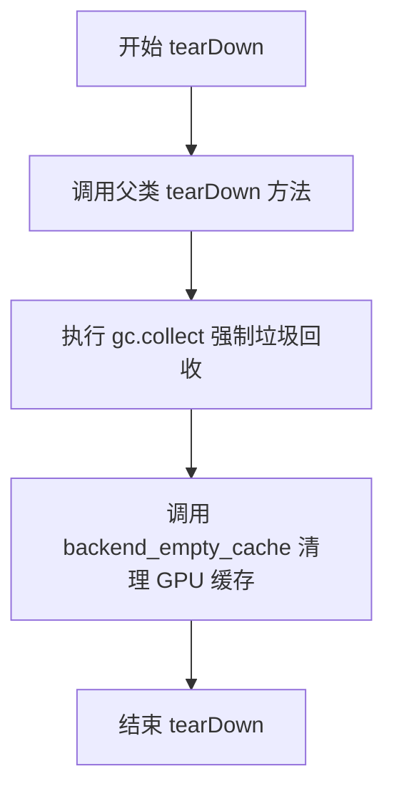

#### 带注释源码

```python
def tearDown(self):
    """
    测试用例清理方法，在每个测试方法执行完毕后被调用。
    用于释放测试过程中占用的资源，防止内存泄漏。
    """
    # 调用父类的 tearDown 方法，执行基础清理工作
    super().tearDown()
    
    # 强制 Python 垃圾回收器运行，回收测试过程中产生的无用对象
    gc.collect()
    
    # 调用后端工具函数清理 GPU 显存缓存，释放 GPU 内存资源
    backend_empty_cache(torch_device)
```


### `FluxControlNetPipelineSlowTests.test_canny`

该函数是一个集成测试方法，用于验证 FluxControlNetPipeline 在处理 Canny 边缘检测图像条件时的正确性。测试加载预训练的 ControlNet 模型和主 Pipeline，导入 Canny 边缘检测图像作为控制条件，执行推理流程，并验证输出图像的形状和内容是否符合预期。

参数：

- `self`：测试类实例，无需显式传递

返回值：`None`，该方法为测试函数，通过断言验证功能，不返回实际数据

#### 流程图

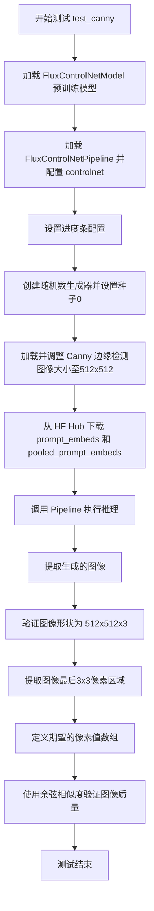

#### 带注释源码

```python
@nightly
@require_big_accelerator
def test_canny(self):
    # 1. 从 HuggingFace Hub 加载预训练的 Flux ControlNet 模型（专门用于 Canny 边缘检测）
    controlnet = FluxControlNetModel.from_pretrained(
        "InstantX/FLUX.1-dev-Controlnet-Canny-alpha", torch_dtype=torch.bfloat16
    )
    
    # 2. 加载 Flux 主 Pipeline，并注入自定义的 ControlNet 模型
    #    text_encoder 和 text_encoder_2 设为 None，使用预计算的 embed
    pipe = FluxControlNetPipeline.from_pretrained(
        "black-forest-labs/FLUX.1-dev",
        text_encoder=None,
        text_encoder_2=None,
        controlnet=controlnet,
        torch_dtype=torch.bfloat16,
    ).to(torch_device)
    
    # 3. 配置进度条显示（disable=None 表示启用进度条）
    pipe.set_progress_bar_config(disable=None)

    # 4. 创建随机数生成器，设置固定种子以确保测试可复现
    generator = torch.Generator(device="cpu").manual_seed(0)
    
    # 5. 从 URL 加载 Canny 边缘检测参考图像，并调整大小至 512x512
    control_image = load_image(
        "https://huggingface.co/InstantX/FLUX.1-dev-Controlnet-Canny-alpha/resolve/main/canny.jpg"
    ).resize((512, 512))

    # 6. 从 HuggingFace Hub 数据集下载预计算的 prompt embeddings
    #    这些是预先计算好的文本嵌入，用于加速测试
    prompt_embeds = torch.load(
        hf_hub_download(repo_id="diffusers/test-slices", repo_type="dataset", filename="flux/prompt_embeds.pt")
    ).to(torch_device)
    
    # 7. 下载预计算的 pooled prompt embeddings（池化后的文本表示）
    pooled_prompt_embeds = torch.load(
        hf_hub_download(
            repo_id="diffusers/test-slices", repo_type="dataset", filename="flux/pooled_prompt_embeds.pt"
        )
    ).to(torch_device)

    # 8. 执行 Pipeline 推理，传入所有必要参数
    output = pipe(
        prompt_embeds=prompt_embeds,           # 预计算的文本嵌入
        pooled_prompt_embeds=pooled_prompt_embeds,  # 池化后的文本嵌入
        control_image=control_image,           # Canny 边缘检测图像作为控制条件
        controlnet_conditioning_scale=0.6,      # ControlNet 条件强度
        num_inference_steps=2,                 # 推理步数（较少步数用于快速测试）
        guidance_scale=3.5,                    # Classifier-free guidance 强度
        max_sequence_length=256,               # 文本序列最大长度
        output_type="np",                      # 输出为 NumPy 数组
        height=512,                            # 输出图像高度
        width=512,                             # 输出图像宽度
        generator=generator,                   # 随机数生成器（确保可复现）
    )

    # 9. 从输出中提取生成的图像
    image = output.images[0]

    # 10. 断言验证：输出图像形状必须为 (512, 512, 3)
    assert image.shape == (512, 512, 3)

    # 11. 提取图像右下角 3x3 像素区域用于质量验证
    original_image = image[-3:, -3:, -1].flatten()

    # 12. 定义期望的像素值数组（基于先前测试的基准值）
    expected_image = np.array([0.2734, 0.2852, 0.2852, 0.2734, 0.2754, 0.2891, 0.2617, 0.2637, 0.2773])

    # 13. 使用余弦相似度距离验证生成图像与期望图像的相似程度
    #     距离必须小于 0.01（1e-2）才算通过
    assert numpy_cosine_similarity_distance(original_image.flatten(), expected_image) < 1e-2
```


### `FluxControlNetPipelineFastTests.get_dummy_components`

该方法用于创建 FluxControlNetPipeline 测试所需的虚拟组件（dummy components），包括 Transformer、ControlNet、文本编码器、VAE、调度器等，并返回一个包含所有组件的字典，供单元测试中的管道初始化使用。

参数：
- 该方法无显式参数（`self` 为隐含参数）

返回值：`Dict[str, Any]`，返回一个包含虚拟组件的字典，键包括 scheduler、text_encoder、text_encoder_2、tokenizer、tokenizer_2、transformer、vae、controlnet、image_encoder 和 feature_extractor。

#### 流程图

```mermaid
flowchart TD
    A[开始 get_dummy_components] --> B[设置随机种子 torch.manual_seed(0)]
    B --> C[创建 FluxTransformer2DModel]
    C --> D[创建 FluxControlNetModel]
    D --> E[创建 CLIPTextConfig 和 CLIPTextModel]
    E --> F[加载 T5EncoderModel 预训练模型]
    F --> G[加载 CLIPTokenizer 和 T5TokenizerFast]
    G --> H[创建 AutoencoderKL]
    H --> I[创建 FlowMatchEulerDiscreteScheduler]
    I --> J[构建并返回包含所有组件的字典]
    J --> K[结束]
    
    style A fill:#f9f,color:#000
    style K fill:#9f9,color:#000
```

#### 带注释源码

```
def get_dummy_components(self):
    """
    创建用于测试的虚拟组件。
    所有组件使用相同的随机种子(0)以确保可重复性。
    """
    # 设置 PyTorch 随机种子，确保结果可重复
    torch.manual_seed(0)
    
    # 创建 Flux Transformer 模型（图像生成主干网络）
    transformer = FluxTransformer2DModel(
        patch_size=1,              # 补丁大小
        in_channels=16,            # 输入通道数
        num_layers=1,              # Transformer 层数（测试用最小配置）
        num_single_layers=1,       # 单注意力层数
        attention_head_dim=16,     # 注意力头维度
        num_attention_heads=2,     # 注意力头数量
        joint_attention_dim=32,   # 联合注意力维度
        pooled_projection_dim=32,  # 池化投影维度
        axes_dims_rope=[4, 4, 8],  # RoPE 轴维度
    )

    # 设置随机种子
    torch.manual_seed(0)
    
    # 创建 Flux ControlNet 模型（控制网络）
    controlnet = FluxControlNetModel(
        patch_size=1,
        in_channels=16,
        num_layers=1,
        num_single_layers=1,
        attention_head_dim=16,
        num_attention_heads=2,
        joint_attention_dim=32,
        pooled_projection_dim=32,
        axes_dims_rope=[4, 4, 8],
    )

    # 定义 CLIP 文本编码器配置
    clip_text_encoder_config = CLIPTextConfig(
        bos_token_id=0,            # 句子开始标记 ID
        eos_token_id=2,            # 句子结束标记 ID
        hidden_size=32,            # 隐藏层大小
        intermediate_size=37,      # 中间层大小
        layer_norm_eps=1e-05,      # 层归一化 epsilon
        num_attention_heads=4,    # 注意力头数量
        num_hidden_layers=5,       # 隐藏层数量
        pad_token_id=1,            # 填充标记 ID
        vocab_size=1000,           # 词汇表大小
        hidden_act="gelu",        # 激活函数
        projection_dim=32,        # 投影维度
    )
    
    # 创建 CLIP 文本编码器
    torch.manual_seed(0)
    text_encoder = CLIPTextModel(clip_text_encoder_config)

    # 创建 T5 文本编码器（从预训练模型加载）
    torch.manual_seed(0)
    text_encoder_2 = T5EncoderModel.from_pretrained("hf-internal-testing/tiny-random-t5")

    # 加载分词器
    tokenizer = CLIPTokenizer.from_pretrained("hf-internal-testing/tiny-random-clip")
    tokenizer_2 = T5TokenizerFast.from_pretrained("hf-internal-testing/tiny-random-t5")

    # 创建 VAE（变分自编码器）用于图像编码/解码
    torch.manual_seed(0)
    vae = AutoencoderKL(
        sample_size=32,            # 样本大小
        in_channels=3,            # 输入通道数（RGB）
        out_channels=3,           # 输出通道数
        block_out_channels=(4,),  # 块输出通道数
        layers_per_block=1,       # 每块层数
        latent_channels=4,       # 潜在空间通道数
        norm_num_groups=1,        # 归一化组数
        use_quant_conv=False,     # 是否使用量化卷积
        use_post_quant_conv=False,# 是否使用后量化卷积
        shift_factor=0.0609,      # 移位因子
        scaling_factor=1.5035,    # 缩放因子
    )

    # 创建调度器（用于扩散过程）
    scheduler = FlowMatchEulerDiscreteScheduler()

    # 返回包含所有组件的字典
    return {
        "scheduler": scheduler,
        "text_encoder": text_encoder,
        "text_encoder_2": text_encoder_2,
        "tokenizer": tokenizer,
        "tokenizer_2": tokenizer_2,
        "transformer": transformer,
        "vae": vae,
        "controlnet": controlnet,
        "image_encoder": None,        # FluxControlNet 不使用
        "feature_extractor": None,    # FluxControlNet 不使用
    }
```


### `FluxControlNetPipelineFastTests.get_dummy_inputs`

该方法用于生成 FluxControlNetPipeline 的虚拟测试输入数据，包括随机生成的控制图像、提示文本以及推理相关参数，以便在单元测试中快速构建完整的输入字典。

参数：

- `device`：`str` 或 `torch.device`，指定生成张量所使用的设备（如 "cuda"、"cpu" 或 "mps"）
- `seed`：`int`，随机种子，用于保证测试结果的可重复性，默认为 0

返回值：`dict`，包含以下键值对的字典：
- `"prompt"`：str，提示文本
- `generator`：`torch.Generator`，随机数生成器
- `num_inference_steps`：`int`，推理步数
- `guidance_scale`：`float`，引导系数
- `output_type`：`str`，输出类型
- `control_image`：`torch.Tensor`，控制图像张量
- `controlnet_conditioning_scale`：`float`，ControlNet 条件缩放因子

#### 流程图

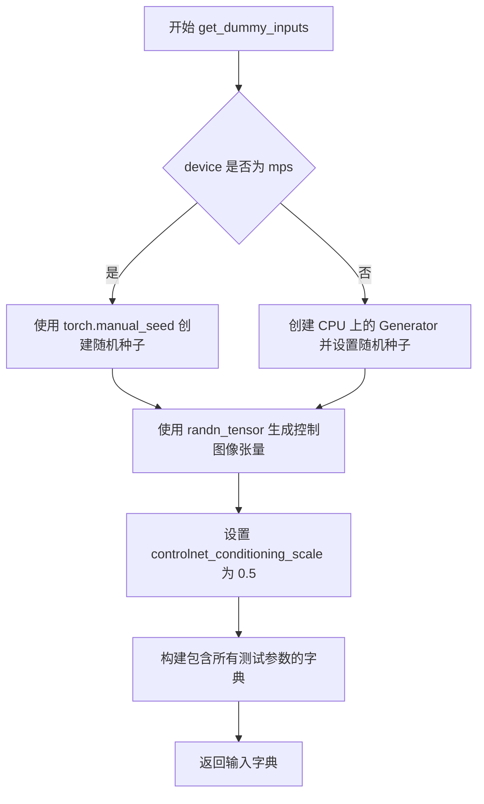

#### 带注释源码

```
def get_dummy_inputs(self, device, seed=0):
    # 判断设备类型，如果是 MPS (Apple Silicon) 设备
    if str(device).startswith("mps"):
        # MPS 设备使用 torch.manual_seed 直接设置种子
        generator = torch.manual_seed(seed)
    else:
        # 其他设备（CPU/CUDA）创建 Generator 对象并设置种子
        # 确保跨平台的随机性一致性
        generator = torch.Generator(device="cpu").manual_seed(seed)

    # 生成随机控制图像张量，形状为 (1, 3, 32, 32)
    # 使用指定的随机生成器和设备
    control_image = randn_tensor(
        (1, 3, 32, 32),           # 张量形状：batch=1, 通道=3, 高=32, 宽=32
        generator=generator,     # 随机数生成器，确保可重复性
        device=torch.device(device),  # 目标设备
        dtype=torch.float16,      # 使用半精度浮点数
    )

    # 设置 ControlNet 条件缩放因子
    # 控制图像对生成结果的影响程度
    controlnet_conditioning_scale = 0.5

    # 构建完整的测试输入字典
    inputs = {
        "prompt": "A painting of a squirrel eating a burger",  # 测试用提示词
        "generator": generator,                                  # 随机生成器
        "num_inference_steps": 2,                               # 推理步数（较少以加快测试）
        "guidance_scale": 3.5,                                  # Classifier-free guidance 系数
        "output_type": "np",                                    # 输出为 NumPy 数组
        "control_image": control_image,                         # 控制图像
        "controlnet_conditioning_scale": controlnet_conditioning_scale,  # 条件缩放
    }

    # 返回包含所有必要输入参数的字典
    return inputs
```


### `FluxControlNetPipelineFastTests.test_controlnet_flux`

该测试方法用于验证 FluxControlNetPipeline（Flux 控制网络管道）的核心功能，通过创建虚拟组件和输入，执行管道推理，并验证生成的图像形状和像素值是否符合预期。

参数：

- `self`：无显式参数，这是类的实例方法，隐式接收测试类实例

返回值：`None`，无返回值（测试方法不返回任何值）

#### 流程图

```mermaid
flowchart TD
    A[开始测试] --> B[获取虚拟组件: get_dummy_components]
    B --> C[创建FluxControlNetPipeline实例]
    C --> D[将管道移至设备并转换为torch.float16]
    D --> E[设置进度条配置: set_progress_bar_config]
    E --> F[获取虚拟输入: get_dummy_inputs]
    F --> G[执行管道推理: flux_pipe.__call__]
    G --> H[提取输出图像]
    H --> I{验证图像形状 == (1, 32, 32, 3)}
    I -->|是| J[提取图像切片并与预期值比较]
    I -->|否| K[断言失败抛出异常]
    J --> L{最大误差 < 1e-2}
    L -->|是| M[测试通过]
    L -->|否| K
    M --> N[结束测试]
```

#### 带注释源码

```python
def test_controlnet_flux(self):
    """
    测试 FluxControlNetPipeline 的核心功能
    验证控制网络生成的图像是否符合预期
    """
    # 步骤1: 获取虚拟组件（用于测试的模拟模型组件）
    components = self.get_dummy_components()
    
    # 步骤2: 使用虚拟组件创建 FluxControlNetPipeline 实例
    flux_pipe = FluxControlNetPipeline(**components)
    
    # 步骤3: 将管道移至指定设备（CPU/GPU）并使用 float16 精度
    flux_pipe = flux_pipe.to(torch_device, dtype=torch.float16)
    
    # 步骤4: 配置进度条（disable=None 表示不禁用进度条）
    flux_pipe.set_progress_bar_config(disable=None)
    
    # 步骤5: 获取虚拟输入参数（包含提示词、随机种子、控制图像等）
    inputs = self.get_dummy_inputs(torch_device)
    
    # 步骤6: 执行管道推理，生成图像
    # 输入参数: prompt, generator, num_inference_steps, guidance_scale, 
    #           output_type, control_image, controlnet_conditioning_scale
    output = flux_pipe(**inputs)
    
    # 步骤7: 从输出中提取生成的图像
    image = output.images
    
    # 步骤8: 提取图像右下角 3x3 像素区域用于验证
    # image shape: (batch, height, width, channels)
    image_slice = image[0, -3:, -3:, -1]
    
    # 步骤9: 断言验证图像形状
    # 期望形状: (1, 32, 32, 3) = (batch, height, width, channels)
    assert image.shape == (1, 32, 32, 3)
    
    # 步骤10: 定义预期的像素值切片（用于验证生成质量）
    expected_slice = np.array(
        [0.47387695, 0.63134766, 0.5605469, 0.61621094, 0.7207031, 
         0.7089844, 0.70410156, 0.6113281, 0.64160156]
    )
    
    # 步骤11: 验证生成图像与预期值的误差在可接受范围内
    # 最大允许误差: 1e-2 (0.01)
    assert np.abs(image_slice.flatten() - expected_slice).max() < 1e-2, (
        f"Expected: {expected_slice}, got: {image_slice.flatten()}"
    )
```


### `FluxControlNetPipelineFastTests.test_xformers_attention_forwardGenerator_pass`

这是一个用于测试xFormers注意力机制前向传播的测试方法，但由于xFormersAttnProcessor不支持SD3联合注意力，该测试被跳过。

参数：

- `self`：隐式参数，TestCase实例本身，包含测试类的状态和方法

返回值：`None`，该方法体为空（pass），不执行任何操作

#### 流程图

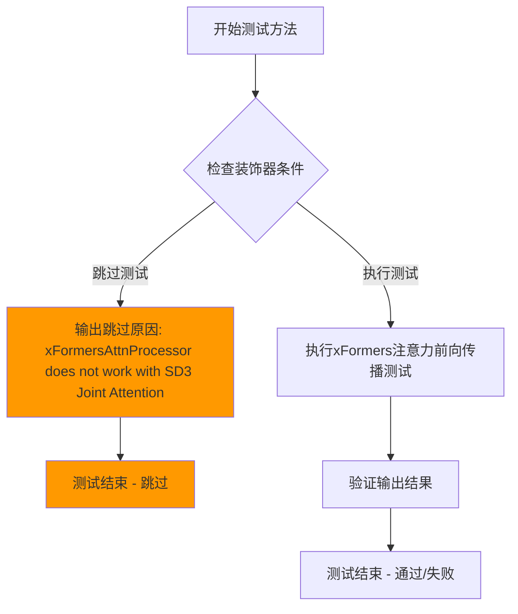

#### 带注释源码

```python
@unittest.skip("xFormersAttnProcessor does not work with SD3 Joint Attention")
def test_xformers_attention_forwardGenerator_pass(self):
    """
    测试xFormers注意力机制的前向传播功能。
    
    该测试方法用于验证FluxControlNetPipeline中transformer组件
    使用xFormers注意力处理器时的前向传播是否正确。
    
    注意：由于xFormersAttnProcessor与SD3 Joint Attention不兼容，
    该测试当前被跳过。
    """
    pass  # 方法体为空，测试被装饰器跳过
```

#### 详细说明

| 属性 | 详情 |
|------|------|
| **所属类** | `FluxControlNetPipelineFastTests` |
| **类定义** | `unittest.TestCase` 的子类，继承自 `PipelineTesterMixin` 和 `FluxIPAdapterTesterMixin` |
| **装饰器** | `@unittest.skip("xFormersAttnProcessor does not work with SD3 Joint Attention")` |
| **测试目的** | 验证xFormers注意力处理器在FluxControlNetPipeline中的前向传播功能 |
| **当前状态** | 已跳过（Skipped） |
| **跳过原因** | xFormersAttnProcessor 不支持 SD3 联合注意力机制 |
| **潜在问题** | 这是一个技术债务标记，表明xFormers与当前架构存在兼容性问题，需要在未来架构重构或xFormers更新后解决 |


### `FluxControlNetPipelineFastTests.test_flux_image_output_shape`

该测试方法用于验证 FluxControlNetPipeline 在不同输入尺寸下的输出图像形状是否符合预期，通过计算 VAE 缩放因子来确保输出尺寸被正确调整为 2 倍 VAE 缩放因子的倍数。

参数：

- `self`：`FluxControlNetPipelineFastTests`，测试类实例，隐式参数，包含测试所需的组件和配置
- `torch_device`：`str` 或 `torch.device`，目标计算设备，从类属性 `torch_device` 获取，用于指定模型和张量运行的设备

返回值：`None`，该方法无返回值，通过 `assert` 语句进行断言验证

#### 流程图

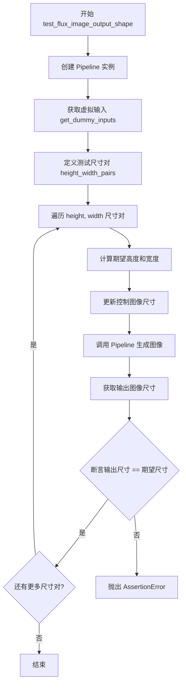

#### 带注释源码

```python
def test_flux_image_output_shape(self):
    """
    测试 FluxControlNetPipeline 输出图像的形状是否符合预期。
    
    该测试验证：
    1. Pipeline 能够正确处理不同尺寸的输入
    2. 输出图像尺寸被正确调整为 VAE 缩放因子的倍数
    """
    # 使用测试类定义的 pipeline_class 创建 Pipeline 实例
    # 从 get_dummy_components 获取虚拟组件（模型、tokenizer、scheduler 等）
    pipe = self.pipeline_class(**self.get_dummy_components()).to(torch_device)
    
    # 获取虚拟输入参数（包含 prompt、generator、guidance_scale 等）
    inputs = self.get_dummy_inputs(torch_device)

    # 定义测试用的 (height, width) 尺寸对列表
    height_width_pairs = [(32, 32), (72, 56)]
    
    # 遍历每组尺寸进行测试
    for height, width in height_width_pairs:
        # 计算期望的输出高度：原始高度减去对 2*vae_scale_factor 取模的结果
        # 这样可以确保输出尺寸是 VAE 缩放因子的偶数倍，符合模型要求
        expected_height = height - height % (pipe.vae_scale_factor * 2)
        expected_width = width - width % (pipe.vae_scale_factor * 2)

        # 更新 control_image 为指定尺寸的随机张量
        inputs.update(
            {
                "control_image": randn_tensor(
                    (1, 3, height, width),  # batch_size=1, channels=3
                    device=torch_device,
                    dtype=torch.float16,
                )
            }
        )
        
        # 调用 Pipeline 进行推理，获取输出结果
        image = pipe(**inputs).images[0]
        
        # 从输出图像中提取高度和宽度维度
        output_height, output_width, _ = image.shape
        
        # 断言输出尺寸必须与期望尺寸完全匹配
        assert (output_height, output_width) == (expected_height, expected_width)
```


### `FluxControlNetPipelineSlowTests.setUp`

这是测试类的初始化方法，在每个测试方法运行前被调用，用于清理 Python 垃圾回收和 GPU 缓存，确保测试环境干净。

参数：

- `self`：`unittest.TestCase`，代表测试类实例本身

返回值：`None`，无返回值（setUp 方法不返回任何内容）

#### 流程图

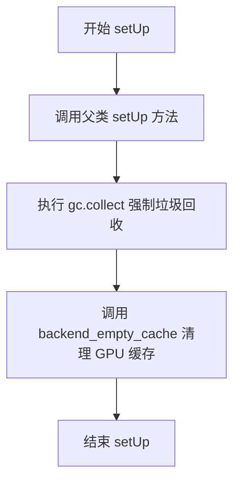

#### 带注释源码

```python
def setUp(self):
    # 调用父类 unittest.TestCase 的 setUp 方法
    # 初始化测试框架所需的基础资源
    super().setUp()
    
    # 手动触发 Python 垃圾回收
    # 释放未使用的 Python 对象，清理内存
    gc.collect()
    
    # 调用后端工具函数清理 GPU 缓存
    # torch_device 是全局变量，指定当前使用的设备（如 CUDA）
    # 这一步确保每次测试都在干净的 GPU 内存状态下开始
    backend_empty_cache(torch_device)
```


### `FluxControlNetPipelineSlowTests.tearDown`

这是 `FluxControlNetPipelineSlowTests` 测试类的清理方法，在每个测试用例执行完毕后自动调用，负责回收测试过程中占用的内存资源和 GPU 缓存，确保测试环境不会因为资源泄漏而影响后续测试的执行。

参数：

- `self`：`FluxControlNetPipelineSlowTests`，隐式参数，代表测试类的实例本身

返回值：`None`，无返回值

#### 流程图

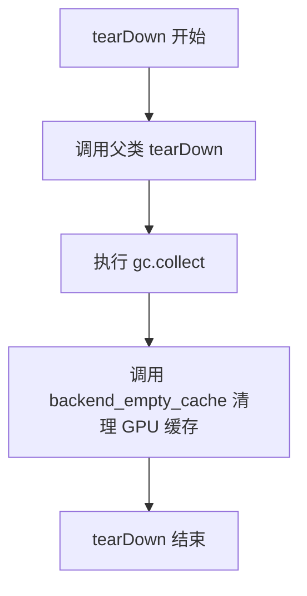

#### 带注释源码

```python
def tearDown(self):
    """
    测试用例清理方法，在每个测试方法执行完毕后自动调用。
    负责释放测试过程中产生的内存和 GPU 缓存资源。
    """
    # 调用父类的 tearDown 方法，执行 unittest.TestCase 的标准清理逻辑
    super().tearDown()
    
    # 触发 Python 垃圾回收器，主动回收测试过程中创建但已不再引用的对象
    gc.collect()
    
    # 调用后端工具函数清空 GPU 缓存，释放显存资源
    # torch_device 为全局变量，表示当前测试使用的计算设备（如 'cuda' 或 'cpu'）
    backend_empty_cache(torch_device)
```


### `FluxControlNetPipelineSlowTests.test_canny`

该测试函数用于验证 FluxControlNetPipeline 在使用 Canny 边缘检测图像作为控制条件下的图像生成能力。测试加载预训练的 ControlNet 模型和 FLUX.1-dev 管道，传入 Canny 边缘图像作为控制条件，验证生成的图像形状和内容是否符合预期。

参数：此测试方法无显式参数（`self` 为隐式测试实例参数）。

返回值：`None`，该测试函数无返回值，通过断言验证功能正确性。

#### 流程图

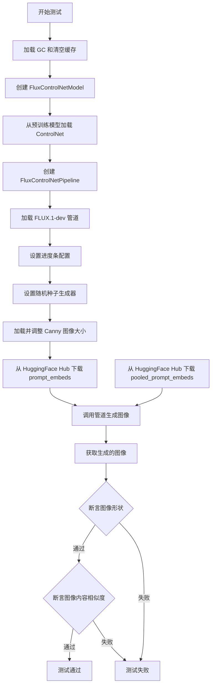

#### 带注释源码

```python
@unittest.skipIf(
    not is_torch_available() or not is_flux_available(),
    reason="This test requires PyTorch and FLUX dependencies."
)
@nightly  # 标记为夜间测试，运行时间较长
@require_big_accelerator  # 需要大型加速器（如 GPU）
class FluxControlNetPipelineSlowTests(unittest.TestCase):
    """Slow tests for FluxControlNetPipeline, marked for nightly execution."""
    pipeline_class = FluxControlNetPipeline  # 被测试的管道类

    def setUp(self):
        """测试前准备：回收垃圾并清空 GPU 缓存。"""
        super().setUp()
        gc.collect()  # 回收 Python 垃圾
        backend_empty_cache(torch_device)  # 清空 GPU 缓存

    def tearDown(self):
        """测试后清理：回收垃圾并清空 GPU 缓存。"""
        super().tearDown()
        gc.collect()  # 回收 Python 垃圾
        backend_empty_cache(torch_device)  # 清空 GPU 缓存

    def test_canny(self):
        """测试 Canny 边缘控制下的图像生成能力。"""
        
        # 1. 加载预训练的 FluxControlNetModel (Canny 边缘版本)
        # 使用 bfloat16 精度以减少显存占用
        controlnet = FluxControlNetModel.from_pretrained(
            "InstantX/FLUX.1-dev-Controlnet-Canny-alpha", 
            torch_dtype=torch.bfloat16
        )
        
        # 2. 加载 FLUX.1-dev 管道，禁用文本编码器以使用预计算的 embeddings
        # 传入加载的 controlnet 作为条件控制模型
        pipe = FluxControlNetPipeline.from_pretrained(
            "black-forest-labs/FLUX.1-dev",
            text_encoder=None,  # 不加载 text_encoder，使用预计算的 embeds
            text_encoder_2=None,  # 不加载 text_encoder_2
            controlnet=controlnet,  # 传入 ControlNet 模型
            torch_dtype=torch.bfloat16  # 使用 bfloat16 精度
        ).to(torch_device)  # 移动到指定设备（GPU/CPU）
        
        # 3. 禁用进度条以便安静执行测试
        pipe.set_progress_bar_config(disable=None)

        # 4. 创建随机数生成器，确保测试可复现
        generator = torch.Generator(device="cpu").manual_seed(0)
        
        # 5. 从 URL 加载 Canny 边缘检测图像并调整大小为 512x512
        control_image = load_image(
            "https://huggingface.co/InstantX/FLUX.1-dev-Controlnet-Canny-alpha/resolve/main/canny.jpg"
        ).resize((512, 512))

        # 6. 从 HuggingFace Hub 下载预计算的 prompt embeddings
        # 这些是预计算并存储的文本嵌入，可以加速测试
        prompt_embeds = torch.load(
            hf_hub_download(
                repo_id="diffusers/test-slices", 
                repo_type="dataset", 
                filename="flux/prompt_embeds.pt"
            )
        ).to(torch_device)
        
        # 7. 下载预计算的 pooled prompt embeddings
        pooled_prompt_embeds = torch.load(
            hf_hub_download(
                repo_id="diffusers/test-slices", 
                repo_type="dataset", 
                filename="flux/pooled_prompt_embeds.pt"
            )
        ).to(torch_device)

        # 8. 调用管道进行图像生成
        # 传入预计算的 embeddings、Canny 图像作为控制条件
        output = pipe(
            prompt_embeds=prompt_embeds,  # 预计算的 prompt embeddings
            pooled_prompt_embeds=pooled_prompt_embeds,  # 预计算的 pooled embeddings
            control_image=control_image,  # Canny 边缘控制图像
            controlnet_conditioning_scale=0.6,  # ControlNet 影响系数
            num_inference_steps=2,  # 推理步数（较少以加快测试）
            guidance_scale=3.5,  # CFG 引导强度
            max_sequence_length=256,  # 最大序列长度
            output_type="np",  # 输出为 NumPy 数组
            height=512,  # 输出图像高度
            width=512,  # 输出图像宽度
            generator=generator,  # 随机数生成器
        )

        # 9. 获取生成的图像
        image = output.images[0]

        # 10. 断言：验证生成的图像形状为 (512, 512, 3)
        assert image.shape == (512, 512, 3), \
            f"Expected image shape (512, 512, 3), got {image.shape}"

        # 11. 获取图像右下角 3x3 像素区域用于验证
        original_image = image[-3:, -3:, -1].flatten()

        # 12. 预期的像素值（用于相似度比较）
        expected_image = np.array([
            0.2734, 0.2852, 0.2852, 
            0.2734, 0.2754, 0.2891, 
            0.2617, 0.2637, 0.2773
        ])

        # 13. 断言：验证生成图像与预期图像的余弦相似度距离小于阈值
        assert numpy_cosine_similarity_distance(
            original_image.flatten(), 
            expected_image
        ) < 1e-2, \
            f"Generated image does not match expected output"
```

## 关键组件


### FluxControlNetPipeline

核心测试管道类，整合Transformer、ControlNet、VAE和文本编码器，实现基于文本提示和ControlNet条件图像的扩散生成。

### FluxTransformer2DModel

Flux变换器模型核心组件，提供图像生成的Transformer架构支持，包含patch处理、注意力机制和联合注意力维度配置。

### FluxControlNetModel

ControlNet模型，提供额外的条件图像控制能力，通过条件化机制影响主生成模型的输出。

### CLIPTextModel

第一个文本编码器，使用CLIP架构将文本提示转换为嵌入向量，支持文本到向量空间的映射。

### T5EncoderModel

第二个文本编码器，使用T5架构提供额外的文本编码能力，增强文本表示的丰富性。

### AutoencoderKL

变分自编码器(VAE)模型，负责潜在空间的编码和解码，将图像转换为潜在表示并从潜在表示重建图像。

### FlowMatchEulerDiscreteScheduler

离散欧拉调度器，实现Flow Match算法的离散化，用于控制扩散模型的采样过程。

### randn_tensor

张量生成工具函数，用于创建指定形状、设备和数据类型的随机张量，支持伪随机数生成器以确保可重复性。

### hf_hub_download

Hugging Face Hub下载工具，支持从远程仓库惰性加载预训练模型权重和测试数据，实现按需下载。

### test_controlnet_flux

核心功能测试方法，验证ControlNet条件图像引导的Flux生成流程，测试完整管道的端到端功能。

### test_flux_image_output_shape

输出形状验证测试，确保不同输入尺寸经过VAE尺度因子处理后产生正确的输出维度。


## 问题及建议


### 已知问题

- **死代码和无效测试**：`test_xformers_attention_forwardGenerator_pass` 方法被 `@unittest.skip` 装饰器跳过，方法体仅为 `pass`，属于完全无用的死代码。
- **硬编码的魔数**：多处使用硬编码数值（如 `controlnet_conditioning_scale=0.5`、`num_inference_steps=2`、`guidance_scale=3.5`、`height_width_pairs=[(32, 32), (72, 56)]` 等），缺乏配置化和可读性。
- **设备处理不一致**：对 MPS 设备有特殊处理逻辑（`if str(device).startswith("mps")`），与其他设备（CPU/CUDA）的随机数生成器初始化方式不同，可能导致测试行为不一致。
- **重复的随机种子设置**：在 `get_dummy_components` 中多次调用 `torch.manual_seed(0)`，无法实现组件间的真正随机隔离，且代码冗余。
- **测试精度阈值不明确**：使用 `np.abs(...).max() < 1e-2` 进行图像相似度断言，阈值 `1e-2` 的选择依据未在代码中说明或定义为常量。
- **缺少类型注解**：所有方法均无类型提示（type hints），降低了代码的可读性和可维护性。
- **内存管理不完善**：慢速测试中模型加载后，仅在 `tearDown` 时调用 `gc.collect()` 和 `backend_empty_cache`，缺少 `pipe.unload_model()` 等显式资源释放调用。
- **继承但未使用的Mixin**：类继承了 `FluxIPAdapterTesterMixin`，但未明确使用其任何方法或属性，可能造成接口污染。

### 优化建议

- 删除被跳过的空方法 `test_xformers_attention_forwardGenerator_pass`，或添加有意义的测试逻辑。
- 将硬编码的魔数提取为类级别常量或配置文件（如 `CONTROLNET_CONDITIONING_SCALE = 0.5`），提高可维护性。
- 统一随机数生成器的初始化逻辑，消除 MPS 设备的特殊分支，或在文档中明确说明差异原因。
- 简化 `get_dummy_components` 中的随机种子设置，考虑使用独立的随机状态管理。
- 为关键数值（如相似度阈值）定义常量并添加注释说明其业务含义。
- 为所有方法添加类型注解，提升代码的 self-documenting 特性。
- 在慢速测试的 `tearDown` 中显式调用模型卸载方法（如 `pipe.unload_model()`），确保 GPU 内存及时释放。
- 确认 `FluxIPAdapterTesterMixin` 的必要性，如无需删除该继承。

## 其它


### 设计目标与约束

本代码的设计目标是验证 FluxControlNetPipeline 管道在不同场景下的功能正确性，包括快速单元测试和夜间慢速测试。约束条件包括：使用 unittest 框架，部分测试因依赖问题被跳过（如 xFormersAttnProcessor），需要 GPU 或大 accelerator 才能运行夜间测试。

### 错误处理与异常设计

代码使用 unittest 框架进行错误处理。测试方法通过 assert 语句验证输出是否符合预期，如 `assert np.abs(image_slice.flatten() - expected_slice).max() < 1e-2` 用于比较图像像素差异。对于需要跳过的测试，使用 `@unittest.skip` 装饰器。夜间测试使用 `@nightly` 和 `@require_big_accelerator` 装饰器确保在适当环境下运行。

### 数据流与状态机

数据流：get_dummy_components() 创建虚拟组件（transformer、controlnet、text_encoder、vae 等）-> get_dummy_inputs() 生成测试输入（prompt、control_image、generator 等）-> test_controlnet_flux() 执行管道 -> 验证输出图像。状态机涉及：PipelineTesterMixin 的多阶段测试流程、FluxIPAdapterTesterMixin 的适配器测试流程。

### 外部依赖与接口契约

主要依赖包括：diffusers 库的 FluxControlNetPipeline、FluxControlNetModel、FlowMatchEulerDiscreteScheduler 等；transformers 库的 CLIPTextModel、CLIPTokenizer、T5EncoderModel、T5TokenizerFast；huggingface_hub 的 hf_hub_download；numpy 和 torch。接口契约：pipeline_class 必须是 FluxControlNetPipeline，params 和 batch_params 定义可测试参数，get_dummy_components 返回组件字典，get_dummy_inputs 返回输入字典。

### 性能优化与资源管理

在 SlowTests 中使用 gc.collect() 和 backend_empty_cache() 管理内存。FastTests 使用 float16  dtype 减少显存占用。支持 MPS 设备和 CPU 设备的 generator 初始化。测试层wise casting 和 group offloading 特性。

### 兼容性考虑

代码兼容多种设备：CUDA、MPS、CPU。通过 torch_device 判断设备类型。种子设置确保测试可复现性，enable_full_determinism() 启用全确定性。图像输出形状测试验证不同 height/width 输入的正确处理。

### 测试覆盖范围

覆盖场景包括：控制网功能测试（test_controlnet_flux）、图像输出形状验证（test_flux_image_output_shape）、Canny 边缘检测控制网测试（test_canny）。测试参数包括：prompt、height、width、guidance_scale、prompt_embeds、pooled_prompt_embeds、num_inference_steps 等。

### 关键技术特性

使用 FlowMatchEulerDiscreteScheduler 调度器。支持 FluxTransformer2DModel 和 FluxControlNetModel 架构。集成 CLIPTextModel 和 T5EncoderModel 双文本编码器。使用 AutoencoderKL 进行变分自编码。

    