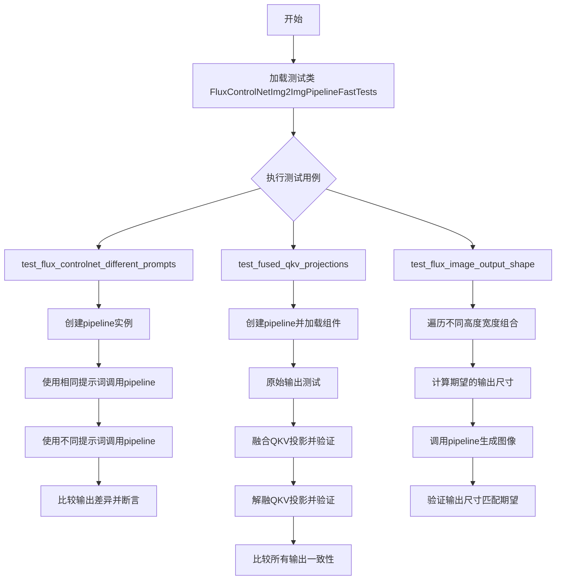
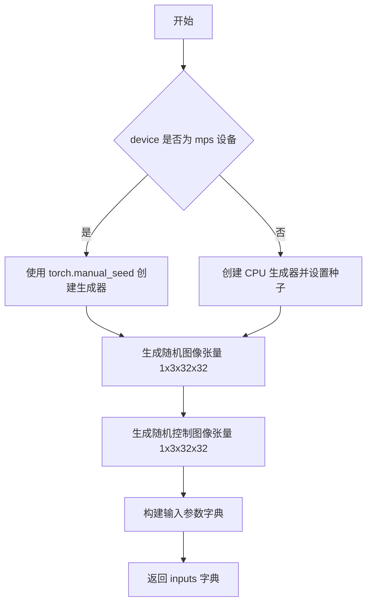
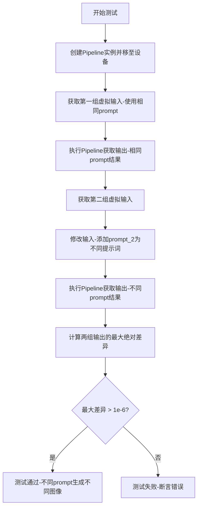
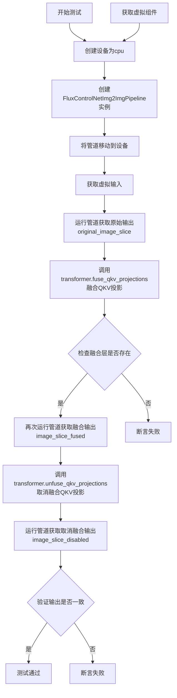
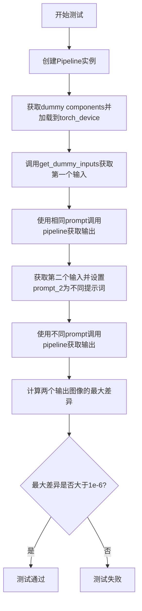
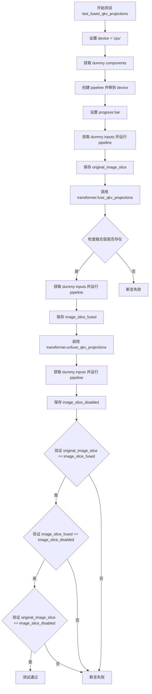

# `diffusers\tests\pipelines\controlnet_flux\test_controlnet_flux_img2img.py` 详细设计文档

这是一个针对FluxControlNetImg2ImgPipeline的单元测试文件，用于测试Flux模型的ControlNet图像到图像推理流水线，包含多个测试用例验证不同提示词、QKV融合投影和输出图像形状等功能。

## 整体流程



## 类结构

```
FluxControlNetImg2ImgPipelineFastTests (测试类)
├── unittest.TestCase (基类)
└── PipelineTesterMixin (混入类)
```

## 全局变量及字段


### `torch_device`
    
全局设备标识字符串，用于指定测试运行的设备（如'cuda'或'cpu'），从testing_utils模块导入

类型：`str`
    


### `PipelineTesterMixin`
    
测试混入类，提供管道测试的通用方法和断言辅助功能，来自test_pipelines_common模块

类型：`unittest.TestCase`
    


### `check_qkv_fused_layers_exist`
    
辅助测试函数，用于验证Transformer模型中QKV投影融合层是否正确实现，接受模型和层名称列表作为参数

类型：`function`
    


### `FluxControlNetImg2ImgPipelineFastTests.pipeline_class`
    
待测试的Flux控制网图像到图像管道类，指向FluxControlNetImg2ImgPipeline实现

类型：`type`
    


### `FluxControlNetImg2ImgPipelineFastTests.params`
    
管道调用参数集合，定义单次推理所需的参数名称集合，包括prompt、image、control_image等12个参数

类型：`frozenset`
    


### `FluxControlNetImg2ImgPipelineFastTests.batch_params`
    
批处理参数集合，标识支持批量处理的输入参数名称，包含prompt、image和control_image三个字段

类型：`frozenset`
    


### `FluxControlNetImg2ImgPipelineFastTests.test_xformers_attention`
    
xFormers注意力机制测试标志位，设置为False表示当前测试类不执行xFormers特定的注意力优化测试

类型：`bool`
    
    

## 全局函数及方法


### `FluxControlNetImg2ImgPipelineFastTests.get_dummy_components`

该方法用于创建 FluxControlNetImg2ImgPipeline 管道测试所需的虚拟组件（dummy components），包括 Transformer 模型、文本编码器（CLIP 和 T5）、VAE、ControlNet 和调度器等，并返回一个包含所有组件的字典，以便在单元测试中初始化管道。

参数： 无（仅包含 self 参数，在 Python 方法中隐式传递）

返回值：`Dict[str, Any]`，返回一个字典，包含以下键值对：
- `"scheduler"`：`FlowMatchEulerDiscreteScheduler` 实例，调度器
- `"text_encoder"`：`CLIPTextModel` 实例，CLIP 文本编码器
- `"text_encoder_2"`：`T5EncoderModel` 实例，T5 文本编码器
- `"tokenizer"`：`CLIPTokenizer` 实例，CLIP 分词器
- `"tokenizer_2"`：`AutoTokenizer` 实例，T5 分词器
- `"transformer"`：`FluxTransformer2DModel` 实例，Flux Transformer 模型
- `"vae"`：`AutoencoderKL` 实例，VAE 模型
- `"controlnet"`：`FluxControlNetModel` 实例，ControlNet 模型

#### 流程图

```mermaid
flowchart TD
    A[开始 get_dummy_components] --> B[设置随机种子 torch.manual_seed(0)]
    B --> C[创建 FluxTransformer2DModel]
    C --> D[创建 CLIPTextConfig]
    D --> E[创建 CLIPTextModel]
    E --> F[创建 T5EncoderModel]
    F --> G[创建 CLIPTokenizer 和 AutoTokenizer]
    G --> H[创建 AutoencoderKL]
    H --> I[创建 FluxControlNetModel]
    I --> J[创建 FlowMatchEulerDiscreteScheduler]
    J --> K[组装字典并返回]
```

#### 带注释源码

```python
def get_dummy_components(self):
    """
    创建用于测试的虚拟组件（dummy components）。
    使用固定的随机种子确保测试的可重复性。
    """
    # 设置随机种子为 0，确保每次调用生成相同的权重
    torch.manual_seed(0)
    
    # 创建 FluxTransformer2DModel：核心的 Diffusion Transformer 模型
    # 参数：patch_size=1, in_channels=4, num_layers=1 等
    transformer = FluxTransformer2DModel(
        patch_size=1,
        in_channels=4,
        num_layers=1,
        num_single_layers=1,
        attention_head_dim=16,
        num_attention_heads=2,
        joint_attention_dim=32,
        pooled_projection_dim=32,
        axes_dims_rope=[4, 4, 8],
    )
    
    # 创建 CLIP 文本编码器配置
    # 小型配置：hidden_size=32, num_attention_heads=4, num_hidden_layers=5
    clip_text_encoder_config = CLIPTextConfig(
        bos_token_id=0,
        eos_token_id=2,
        hidden_size=32,
        intermediate_size=37,
        layer_norm_eps=1e-05,
        num_attention_heads=4,
        num_hidden_layers=5,
        pad_token_id=1,
        vocab_size=1000,
        hidden_act="gelu",
        projection_dim=32,
    )

    # 使用随机种子创建 CLIP 文本编码器模型
    torch.manual_seed(0)
    text_encoder = CLIPTextModel(clip_text_encoder_config)

    # 使用预训练的小型 T5 模型作为第二个文本编码器
    torch.manual_seed(0)
    text_encoder_2 = T5EncoderModel.from_pretrained("hf-internal-testing/tiny-random-t5")

    # 加载分词器
    tokenizer = CLIPTokenizer.from_pretrained("hf-internal-testing/tiny-random-clip")
    tokenizer_2 = AutoTokenizer.from_pretrained("hf-internal-testing/tiny-random-t5")

    # 创建 VAE（变分自编码器）模型
    torch.manual_seed(0)
    vae = AutoencoderKL(
        sample_size=32,
        in_channels=3,
        out_channels=3,
        block_out_channels=(4,),
        layers_per_block=1,
        latent_channels=1,
        norm_num_groups=1,
        use_quant_conv=False,
        use_post_quant_conv=False,
        shift_factor=0.0609,
        scaling_factor=1.5035,
    )

    # 创建 Flux ControlNet 模型
    torch.manual_seed(0)
    controlnet = FluxControlNetModel(
        in_channels=4,
        num_layers=1,
        num_single_layers=1,
        attention_head_dim=16,
        num_attention_heads=2,
        joint_attention_dim=32,
        pooled_projection_dim=32,
        axes_dims_rope=[4, 4, 8],
    )

    # 创建调度器（使用欧拉离散方法）
    scheduler = FlowMatchEulerDiscreteScheduler()

    # 返回包含所有组件的字典，用于初始化 Pipeline
    return {
        "scheduler": scheduler,
        "text_encoder": text_encoder,
        "text_encoder_2": text_encoder_2,
        "tokenizer": tokenizer,
        "tokenizer_2": tokenizer_2,
        "transformer": transformer,
        "vae": vae,
        "controlnet": controlnet,
    }
```


### `FluxControlNetImg2ImgPipelineFastTests.get_dummy_inputs`

该方法用于生成 FluxControlNetImg2ImgPipeline 的虚拟输入参数，创建一个包含提示词、图像、控制图像及其他推理参数的字典，用于管道测试。

参数：

- `self`：`FluxControlNetImg2ImgPipelineFastTests`，测试类实例，隐含参数
- `device`：`torch.device` 或 `str`，目标设备（如 "cuda:0"、"cpu" 或 "mps"），用于将生成的张量移动到指定设备
- `seed`：`int`，随机种子，默认值为 0，用于控制随机数生成的确定性

返回值：`Dict[str, Any]`，返回包含以下键的字典：
- `prompt` (`str`): 测试用提示词
- `image` (`torch.Tensor`): 随机生成的输入图像张量
- `control_image` (`torch.Tensor`): 随机生成的控制图像张量
- `generator` (`torch.Generator` 或 `torch.Generator`): 随机数生成器
- `num_inference_steps` (`int`): 推理步数
- `guidance_scale` (`float`): 引导比例
- `controlnet_conditioning_scale` (`float`): ControlNet 条件比例
- `strength` (`float`): 图像转换强度
- `height` (`int`): 输出图像高度
- `width` (`int`): 输出图像宽度
- `max_sequence_length` (`int`): 最大序列长度
- `output_type` (`str`): 输出类型

#### 流程图



#### 带注释源码

```python
def get_dummy_inputs(self, device, seed=0):
    # 判断设备是否为 Apple Silicon MPS 设备
    if str(device).startswith("mps"):
        # MPS 设备使用 torch.manual_seed 直接设置种子
        generator = torch.manual_seed(seed)
    else:
        # 其他设备创建 CPU 生成器并设置随机种子
        generator = torch.Generator(device="cpu").manual_seed(seed)

    # 生成随机输入图像，形状为 (batch=1, channels=3, height=32, width=32)
    # 并移动到指定设备
    image = torch.randn(1, 3, 32, 32).to(device)
    
    # 生成随机控制图像，用于 ControlNet 条件输入
    control_image = torch.randn(1, 3, 32, 32).to(device)

    # 构建完整的输入参数字典
    inputs = {
        "prompt": "A painting of a squirrel eating a burger",  # 测试用提示词
        "image": image,                                        # 输入图像
        "control_image": control_image,                       # ControlNet 控制图像
        "generator": generator,                                # 随机数生成器，确保可复现性
        "num_inference_steps": 2,                             # 扩散推理步数
        "guidance_scale": 5.0,                                 # classifier-free guidance 强度
        "controlnet_conditioning_scale": 1.0,                 # ControlNet 条件影响比例
        "strength": 0.8,                                       # 图像转换强度 (0-1)
        "height": 32,                                          # 输出高度
        "width": 32,                                           # 输出宽度
        "max_sequence_length": 48,                            # 文本编码器最大序列长度
        "output_type": "np",                                  # 输出格式为 numpy 数组
    }
    return inputs
```


### `test_flux_controlnet_different_prompts`

该测试函数用于验证 FluxControlNetImg2ImgPipeline 在使用不同提示词（prompt 和 prompt_2）时能够生成不同的图像输出，确保多提示词功能正常工作。

参数：
- 无显式参数（继承自 unittest.TestCase 的实例方法）

返回值：`None`，测试函数无返回值，通过断言验证逻辑正确性

#### 流程图



#### 带注释源码

```python
def test_flux_controlnet_different_prompts(self):
    """
    测试 FluxControlNetImg2ImgPipeline 在使用不同提示词时的行为。
    验证当提供 prompt 和 prompt_2 时，生成的图像与仅使用单个 prompt 时不同。
    """
    # 步骤1: 创建Pipeline实例并移至测试设备
    # 使用 get_dummy_components() 获取虚拟组件配置
    pipe = self.pipeline_class(**self.get_dummy_components()).to(torch_device)

    # 步骤2: 获取第一组虚拟输入（使用相同提示词）
    inputs = self.get_dummy_inputs(torch_device)
    
    # 步骤3: 执行Pipeline，获取使用单一prompt时的输出图像
    output_same_prompt = pipe(**inputs).images[0]

    # 步骤4: 重新获取输入，添加第二个不同的提示词 prompt_2
    inputs = self.get_dummy_inputs(torch_device)
    inputs["prompt_2"] = "a different prompt"  # 设置第二个提示词
    
    # 步骤5: 执行Pipeline，获取使用双提示词时的输出图像
    output_different_prompts = pipe(**inputs).images[0]

    # 步骤6: 计算两组输出图像的最大绝对差异
    max_diff = np.abs(output_same_prompt - output_different_prompts).max()

    # 步骤7: 断言验证
    # 确保差异大于阈值，证明不同提示词确实产生了不同的输出
    assert max_diff > 1e-6
```


### `FluxControlNetImg2ImgPipelineFastTests.test_fused_qkv_projections`

该测试方法用于验证 FluxControlNetImg2ImgPipeline 中 Transformer 模块的 QKV（Query-Key-Value）投影融合功能是否正常工作。测试流程包括：创建管道并运行获取原始输出，融合 QKV 投影后再次运行获取融合输出，取消融合后获取最终输出，最后通过断言验证三种情况的输出应该一致（允许一定的数值误差），以确保 QKV 融合机制不会影响模型的计算结果。

参数：

- `self`：无参数，类实例方法

返回值：`None`，测试方法无返回值，通过 assert 语句进行验证

#### 流程图



#### 带注释源码

```python
def test_fused_qkv_projections(self):
    """测试QKV投影融合功能是否正常工作"""
    
    # 设置设备为cpu，确保随机数生成的可确定性
    device = "cpu"
    
    # 获取虚拟组件（包含transformer、text_encoder、vae、controlnet等）
    components = self.get_dummy_components()
    
    # 使用虚拟组件创建FluxControlNetImg2ImgPipeline实例
    pipe = self.pipeline_class(**components)
    
    # 将管道移动到指定设备
    pipe = pipe.to(device)
    
    # 设置进度条配置（disable=None表示不禁用进度条）
    pipe.set_progress_bar_config(disable=None)

    # 获取虚拟输入参数（包含prompt、image、control_image、generator等）
    inputs = self.get_dummy_inputs(device)
    
    # 运行管道获取原始输出图像
    image = pipe(**inputs).images
    
    # 提取原始输出的最后3x3像素切片用于后续比较
    original_image_slice = image[0, -3:, -3:, -1]

    # 调用transformer的fuse_qkv_projections方法融合QKV投影
    # 这会将分离的Q、K、V投影合并为一个统一的投影操作以提高效率
    pipe.transformer.fuse_qkv_projections()
    
    # 验证融合层是否存在，使用辅助函数检查transformer中是否包含名为"to_qkv"的融合层
    self.assertTrue(
        check_qkv_fused_layers_exist(pipe.transformer, ["to_qkv"]),
        ("Something wrong with the fused attention layers. Expected all the attention projections to be fused."),
    )

    # 使用相同的虚拟输入再次运行管道获取融合后的输出
    inputs = self.get_dummy_inputs(device)
    image = pipe(**inputs).images
    
    # 提取融合输出的最后3x3像素切片
    image_slice_fused = image[0, -3:, -3:, -1]

    # 调用unfuse_qkv_projections方法取消QKV投影融合
    # 将融合的投影操作恢复为分离的Q、K、V投影
    pipe.transformer.unfuse_qkv_projections()
    
    # 再次运行管道获取取消融合后的输出
    inputs = self.get_dummy_inputs(device)
    image = pipe(**inputs).images
    
    # 提取取消融合输出的最后3x3像素切片
    image_slice_disabled = image[0, -3:, -3:, -1]

    # 断言1：验证原始输出与融合后输出的差异在容差范围内
    # QKV融合不应影响输出结果
    assert np.allclose(original_image_slice, image_slice_fused, atol=1e-3, rtol=1e-3), (
        "Fusion of QKV projections shouldn't affect the outputs."
    )
    
    # 断言2：验证融合输出与取消融合输出的差异在容差范围内
    # 融合开关切换不应改变计算结果
    assert np.allclose(image_slice_fused, image_slice_disabled, atol=1e-3, rtol=1e-3), (
        "Outputs, with QKV projection fusion enabled, shouldn't change when fused QKV projections are disabled."
    )
    
    # 断言3：验证原始输出与取消融合输出的差异在容差范围内
    # 原始模型输出应该与取消融合后的输出一致（使用更宽松的容差）
    assert np.allclose(original_image_slice, image_slice_disabled, atol=1e-2, rtol=1e-2), (
        "Original outputs should match when fused QKV projections are disabled."
    )
```


### `FluxControlNetImg2ImgPipelineFastTests.test_flux_image_output_shape`

该测试函数用于验证 FluxControlNetImg2ImgPipeline 在给定不同高度和宽度输入时，输出图像的形状是否正确（输出高度和宽度应能被 VAE 缩放因子的两倍整除）。

参数：无（仅包含 self 隐式参数）

返回值：`None`，测试函数无返回值，通过断言验证输出形状

#### 流程图

```mermaid
flowchart TD
    A[开始测试] --> B[创建 Pipeline 实例并移动到设备]
    B --> C[获取虚拟输入]
    C --> D[定义测试尺寸对: height_width_pairs = [(32, 32), (72, 56)]]
    D --> E{遍历 height, width}
    E -->|每次迭代| F[计算期望输出尺寸]
    F --> G[更新 control_image 和 image 张量]
    G --> H[更新 height 和 width 参数]
    H --> I[调用 pipeline 获取输出图像]
    I --> J[获取输出图像的高度和宽度]
    J --> K{断言输出尺寸 == 期望尺寸}
    K -->|通过| E
    K -->|失败| L[抛出 AssertionError]
    E -->|遍历完成| M[测试通过]
```

#### 带注释源码

```python
def test_flux_image_output_shape(self):
    """
    测试 FluxControlNetImg2ImgPipeline 输出图像形状的测试函数。
    验证在不同输入尺寸下，输出图像尺寸是否正确（能被 vae_scale_factor * 2 整除）。
    """
    # 1. 创建 Pipeline 实例并移动到 torch_device
    pipe = self.pipeline_class(**self.get_dummy_components()).to(torch_device)
    
    # 2. 获取默认的虚拟输入参数
    inputs = self.get_dummy_inputs(torch_device)

    # 3. 定义测试用的 (height, width) 尺寸对列表
    height_width_pairs = [(32, 32), (72, 56)]
    
    # 4. 遍历每对尺寸进行测试
    for height, width in height_width_pairs:
        # 计算期望的输出高度和宽度
        # 公式: input_size - (input_size % (vae_scale_factor * 2))
        # 这确保输出尺寸是 vae_scale_factor * 2 的整数倍
        expected_height = height - height % (pipe.vae_scale_factor * 2)
        expected_width = width - width % (pipe.vae_scale_factor * 2)
        
        # 更新输入字典中的控制图像和输入图像
        inputs.update(
            {
                # 生成随机控制图像张量，形状为 [batch, channels, height, width]
                "control_image": randn_tensor(
                    (1, 3, height, width),
                    device=torch_device,
                    dtype=torch.float16,
                ),
                # 生成随机输入图像张量
                "image": randn_tensor(
                    (1, 3, height, width),
                    device=torch_device,
                    dtype=torch.float16,
                ),
                # 更新期望的高度和宽度参数
                "height": height,
                "width": width,
            }
        )
        
        # 5. 调用 pipeline 进行推理，获取输出图像
        image = pipe(**inputs).images[0]
        
        # 6. 从输出图像中提取高度和宽度
        output_height, output_width, _ = image.shape
        
        # 7. 断言输出尺寸是否与期望尺寸匹配
        assert (output_height, output_width) == (expected_height, expected_width)
```


### `FluxControlNetImg2ImgPipelineFastTests.get_dummy_components`

该方法用于创建虚拟（dummy）组件字典，包含 FluxControlNetImg2ImgPipeline 所需的所有模型和配置。这些组件使用最小化的参数配置和随机权重，用于单元测试目的，确保测试可以快速执行而不依赖真实的预训练模型。

参数：无（仅隐式参数 `self`）

返回值：`Dict[str, Any]`，返回一个包含以下键的字典：
- `scheduler`: 调度器实例
- `text_encoder`: CLIP 文本编码器
- `text_encoder_2`: T5 文本编码器
- `tokenizer`: CLIP 分词器
- `tokenizer_2`: T5 分词器
- `transformer`: Flux Transformer 模型
- `vae`: 变分自编码器
- `controlnet`: Flux 控制网模型

#### 流程图

```mermaid
flowchart TD
    A[开始 get_dummy_components] --> B[设置随机种子 torch.manual_seed(0)]
    B --> C[创建 FluxTransformer2DModel]
    C --> D[创建 CLIPTextConfig 和 CLIPTextModel]
    D --> E[创建 T5EncoderModel 和相关 Tokenizer]
    E --> F[创建 CLIPTokenizer]
    F --> G[创建 AutoencoderKL]
    G --> H[创建 FluxControlNetModel]
    H --> I[创建 FlowMatchEulerDiscreteScheduler]
    I --> J[构建并返回组件字典]
    J --> K[结束]
    
    style A fill:#f9f,stroke:#333
    style K fill:#9f9,stroke:#333
```

#### 带注释源码

```python
def get_dummy_components(self):
    """
    创建并返回虚拟组件字典，用于测试 FluxControlNetImg2ImgPipeline。
    所有组件使用最小化配置和随机权重，确保测试可快速执行。
    """
    # 设置随机种子以确保测试结果可复现
    torch.manual_seed(0)
    
    # 创建 Flux Transformer 模型 - 核心扩散变换器
    # 参数: patch_size=1, in_channels=4, 单层配置
    transformer = FluxTransformer2DModel(
        patch_size=1,
        in_channels=4,
        num_layers=1,           # 使用单层减少计算量
        num_single_layers=1,
        attention_head_dim=16, # 注意力头维度
        num_attention_heads=2,  # 注意力头数量
        joint_attention_dim=32, # 联合注意力维度
        pooled_projection_dim=32,
        axes_dims_rope=[4, 4, 8], # RoPE 轴维度
    )
    
    # 创建 CLIP 文本编码器配置
    clip_text_encoder_config = CLIPTextConfig(
        bos_token_id=0,
        eos_token_id=2,
        hidden_size=32,         # 隐藏层大小（远小于真实模型）
        intermediate_size=37,   # 中间层大小
        layer_norm_eps=1e-05,
        num_attention_heads=4,
        num_hidden_layers=5,   # 隐藏层数（远少于真实模型）
        pad_token_id=1,
        vocab_size=1000,        # 词汇表大小（远小于真实模型）
        hidden_act="gelu",
        projection_dim=32,
    )

    # 使用随机权重创建 CLIP 文本编码器
    torch.manual_seed(0)
    text_encoder = CLIPTextModel(clip_text_encoder_config)

    # 创建 T5 文本编码器（用于双文本编码器支持）
    torch.manual_seed(0)
    text_encoder_2 = T5EncoderModel.from_pretrained("hf-internal-testing/tiny-random-t5")

    # 创建对应的分词器
    tokenizer = CLIPTokenizer.from_pretrained("hf-internal-testing/tiny-random-clip")
    tokenizer_2 = AutoTokenizer.from_pretrained("hf-internal-testing/tiny-random-t5")

    # 创建变分自编码器 (VAE)
    torch.manual_seed(0)
    vae = AutoencoderKL(
        sample_size=32,           # 样本尺寸
        in_channels=3,            # 输入通道数 (RGB)
        out_channels=3,           # 输出通道数
        block_out_channels=(4,), # 块输出通道
        layers_per_block=1,       # 每块层数
        latent_channels=1,        # 潜在空间通道数
        norm_num_groups=1,        # 归一化组数
        use_quant_conv=False,     # 禁用量化卷积
        use_post_quant_conv=False,# 禁用后量化卷积
        shift_factor=0.0609,      # 移位因子
        scaling_factor=1.5035,    # 缩放因子
    )

    # 创建 Flux 控制网模型
    torch.manual_seed(0)
    controlnet = FluxControlNetModel(
        in_channels=4,            # 输入通道数
        num_layers=1,             # 层数
        num_single_layers=1,      # 单层数
        attention_head_dim=16,    # 注意力头维度
        num_attention_heads=2,    # 注意力头数
        joint_attention_dim=32,   # 联合注意力维度
        pooled_projection_dim=32, # 池化投影维度
        axes_dims_rope=[4, 4, 8], # RoPE 轴维度
    )

    # 创建调度器 - 使用 Euler 离散调度器
    scheduler = FlowMatchEulerDiscreteScheduler()

    # 返回包含所有组件的字典
    return {
        "scheduler": scheduler,
        "text_encoder": text_encoder,
        "text_encoder_2": text_encoder_2,
        "tokenizer": tokenizer,
        "tokenizer_2": tokenizer_2,
        "transformer": transformer,
        "vae": vae,
        "controlnet": controlnet,
    }
```


### `FluxControlNetImg2ImgPipelineFastTests.get_dummy_inputs`

该方法用于生成 FluxControlNetImg2ImgPipeline 测试所需的虚拟输入参数，包括文本提示、图像、控制图像、推理步数、引导强度等关键配置，以便在单元测试中进行流水线推理验证。

参数：

- `self`：隐含的类实例参数，表示 FluxControlNetImg2ImgPipelineFastTests 的实例
- `device`：`Union[str, torch.device]`，目标设备，用于确定张量存放位置和生成器的设备类型
- `seed`：`int`，随机种子，默认值为 0，用于确保测试结果的可复现性

返回值：`Dict[str, Any]`，返回包含以下键值的字典：
- `prompt` (str): 测试用文本提示
- `image` (torch.Tensor): 虚拟输入图像张量
- `control_image` (torch.Tensor): 虚拟控制图像张量
- `generator` (torch.Generator): 随机数生成器
- `num_inference_steps` (int): 推理步数
- `guidance_scale` (float): 引导强度
- `controlnet_conditioning_scale` (float): ControlNet 条件缩放因子
- `strength` (float): 图像变换强度
- `height` (int): 输出图像高度
- `width` (int): 输出图像宽度
- `max_sequence_length` (int): 最大序列长度
- `output_type` (str): 输出类型

#### 流程图

```mermaid
flowchart TD
    A[开始 get_dummy_inputs] --> B{device 是否以 'mps' 开头?}
    B -->|是| C[使用 torch.manual_seed(seed) 创建生成器]
    B -->|否| D[使用 torch.Generator(device='cpu').manual_seed(seed) 创建生成器]
    C --> E[创建随机图像张量 torch.randn]
    D --> E
    E --> F[创建随机控制图像张量 torch.randn]
    F --> G[构建输入参数字典 inputs]
    G --> H[返回 inputs 字典]
    H --> I[结束]
```

#### 带注释源码

```python
def get_dummy_inputs(self, device, seed=0):
    """
    生成用于 FluxControlNetImg2ImgPipeline 测试的虚拟输入参数。
    
    参数:
        device: 目标设备，用于确定张量存放位置
        seed: 随机种子，确保测试结果可复现
    
    返回:
        包含测试所需各项参数的字典
    """
    # 判断是否为 Apple M 系列芯片设备
    if str(device).startswith("mps"):
        # MPS 设备使用 torch.manual_seed 直接设置全局种子
        generator = torch.manual_seed(seed)
    else:
        # 其他设备创建 CPU 上的生成器并设置种子
        generator = torch.Generator(device="cpu").manual_seed(seed)

    # 创建虚拟输入图像: batch=1, channels=3, height=32, width=32
    image = torch.randn(1, 3, 32, 32).to(device)
    
    # 创建虚拟控制图像（用于 ControlNet 条件输入）
    control_image = torch.randn(1, 3, 32, 32).to(device)

    # 组装完整的输入参数字典
    inputs = {
        "prompt": "A painting of a squirrel eating a burger",  # 测试用文本提示
        "image": image,                                         # 输入图像
        "control_image": control_image,                        # ControlNet 控制图像
        "generator": generator,                                # 随机数生成器
        "num_inference_steps": 2,                              # 推理步数（较少以加快测试）
        "guidance_scale": 5.0,                                 # CFG 引导强度
        "controlnet_conditioning_scale": 1.0,                 # ControlNet 条件缩放因子
        "strength": 0.8,                                       # 图像变换强度 (0-1)
        "height": 32,                                          # 输出高度
        "width": 32,                                           # 输出宽度
        "max_sequence_length": 48,                            # 文本编码最大序列长度
        "output_type": "np",                                   # 输出格式为 numpy 数组
    }
    return inputs
```


### `FluxControlNetImg2ImgPipelineFastTests.test_flux_controlnet_different_prompts`

该测试方法用于验证 FluxControlNetImg2ImgPipeline 在使用不同提示词（prompt 和 prompt_2）时能够生成不同的图像输出，确保多提示词功能正常工作。

参数：

- `self`：隐式参数，测试类实例本身，无类型描述

返回值：`None`，无返回值（测试方法通过 assert 语句进行断言验证）

#### 流程图



#### 带注释源码

```python
def test_flux_controlnet_different_prompts(self):
    """
    测试FluxControlNetImg2ImgPipeline在使用不同提示词时能否生成不同图像
    
    该测试验证多提示词功能（prompt和prompt_2）是否正常工作，
    确保当提供不同提示词时，pipeline生成的图像存在可感知的差异。
    """
    # 使用dummy组件创建pipeline并移动到指定设备
    # get_dummy_components()返回包含transformer、text_encoder、vae等组件的字典
    pipe = self.pipeline_class(**self.get_dummy_components()).to(torch_device)

    # 第一次调用：使用默认的dummy prompt（"A painting of a squirrel eating a burger"）
    inputs = self.get_dummy_inputs(torch_device)
    # 调用pipeline执行推理，获取输出图像
    output_same_prompt = pipe(**inputs).images[0]

    # 第二次调用：使用不同的prompt_2
    inputs = self.get_dummy_inputs(torch_device)
    # 在输入字典中添加第二个提示词
    inputs["prompt_2"] = "a different prompt"
    # 再次调用pipeline获取输出
    output_different_prompts = pipe(**inputs).images[0]

    # 计算两个输出图像之间的最大绝对差异
    max_diff = np.abs(output_same_prompt - output_different_prompts).max()

    # 断言：不同提示词生成的图像必须存在可感知的差异
    # 如果max_diff <= 1e-6，说明两个图像基本相同，多提示词功能可能存在问题
    assert max_diff > 1e-6
```


### `FluxControlNetImg2ImgPipelineFastTests.test_fused_qkv_projections`

该方法是一个单元测试，用于验证 FluxControlNetImg2ImgPipeline 中 Transformer 的 QKV（Query-Key-Value）投影融合功能是否正常工作。测试通过比较融合前、融合后和解除融合后的输出来确保融合操作不会影响模型的推理结果。

参数：

- `self`：`FluxControlNetImg2ImgPipelineFastTests`，测试类实例本身

返回值：`None`，该方法为测试方法，通过断言验证功能，不返回具体数值

#### 流程图



#### 带注释源码

```python
def test_fused_qkv_projections(self):
    # 设置设备为 CPU，确保随机数生成器的确定性
    device = "cpu"  # ensure determinism for the device-dependent torch.Generator
    
    # 获取用于测试的虚拟组件（transformer, vae, text_encoder 等）
    components = self.get_dummy_components()
    
    # 创建 FluxControlNetImg2ImgPipeline 实例
    pipe = self.pipeline_class(**components)
    
    # 将 pipeline 移到指定设备
    pipe = pipe.to(device)
    
    # 配置进度条（disable=None 表示不禁用）
    pipe.set_progress_bar_config(disable=None)

    # 获取测试输入数据
    inputs = self.get_dummy_inputs(device)
    
    # 运行 pipeline 获取原始（未融合）输出
    image = pipe(**inputs).images
    # 提取图像最后 3x3 像素区域用于比较
    original_image_slice = image[0, -3:, -3:, -1]

    # 调用 Transformer 的 fuse_qkv_projections 方法融合 QKV 投影
    # 这会将分开的 query、key、value 投影融合为一个统一的投影矩阵
    pipe.transformer.fuse_qkv_projections()
    
    # 验证融合是否成功：检查是否存在 'to_qkv' 融合层
    self.assertTrue(
        check_qkv_fused_layers_exist(pipe.transformer, ["to_qkv"]),
        ("Something wrong with the fused attention layers. Expected all the attention projections to be fused."),
    )

    # 再次获取输入并运行 pipeline（使用融合后的 QKV 投影）
    inputs = self.get_dummy_inputs(device)
    image = pipe(**inputs).images
    image_slice_fused = image[0, -3:, -3:, -1]

    # 调用 unfuse_qkv_projections 解除 QKV 投影融合
    pipe.transformer.unfuse_qkv_projections()
    
    # 再次运行 pipeline（解除融合后）
    inputs = self.get_dummy_inputs(device)
    image = pipe(**inputs).images
    image_slice_disabled = image[0, -3:, -3:, -1]

    # 断言 1：融合 QKV 投影不应该改变输出结果
    assert np.allclose(original_image_slice, image_slice_fused, atol=1e-3, rtol=1e-3), (
        "Fusion of QKV projections shouldn't affect the outputs."
    )
    
    # 断言 2：融合 QKV 投影后，输出不应在禁用时改变
    assert np.allclose(image_slice_fused, image_slice_disabled, atol=1e-3, rtol=1e-3), (
        "Outputs, with QKV projection fusion enabled, shouldn't change when fused QKV projections are disabled."
    )
    
    # 断言 3：原始输出应该与禁用融合后的输出匹配（容差稍大）
    assert np.allclose(original_image_slice, image_slice_disabled, atol=1e-2, rtol=1e-2), (
        "Original outputs should match when fused QKV projections are disabled."
    )
```


### `FluxControlNetImg2ImgPipelineFastTests.test_flux_image_output_shape`

该方法用于测试 `FluxControlNetImg2ImgPipeline` 在不同输入尺寸下的输出图像形状是否符合预期，通过验证输出高度和宽度会根据 VAE 缩放因子自动调整为有效的尺寸。

参数：

- `self`：隐式参数，测试类实例本身

返回值：`None`，该方法为测试方法，使用 `assert` 语句进行断言验证，不返回任何值

#### 流程图

```mermaid
flowchart TD
    A[开始测试] --> B[创建Pipeline实例并移动到设备]
    B --> C[获取虚拟输入 get_dummy_inputs]
    C --> D[定义高度宽度对列表: [(32,32), (72,56)]]
    D --> E{遍历 height_width_pairs}
    E -->|当前 pair| F[计算期望高度和宽度]
    F --> G[根据 vae_scale_factor 调整尺寸]
    G --> H[更新输入: control_image, image, height, width]
    H --> I[调用 pipeline 获取输出图像]
    I --> J[获取输出图像的 height, width]
    J --> K{断言输出尺寸 == 期望尺寸}
    K -->|是| L{是否还有更多 pair}
    K -->|否| M[抛出 AssertionError]
    L -->|是| E
    L -->|否| N[测试通过]
    M --> N
```

#### 带注释源码

```python
def test_flux_image_output_shape(self):
    """
    测试 FluxControlNetImg2ImgPipeline 输出图像形状的测试方法
    
    验证管道在不同输入尺寸下，输出图像的高度和宽度会根据
    VAE 缩放因子自动调整到有效尺寸
    """
    # 步骤1: 使用虚拟组件创建 Pipeline 实例并移动到测试设备
    # torch_device 是测试工具提供的设备标识（如 'cuda', 'cpu' 等）
    pipe = self.pipeline_class(**self.get_dummy_components()).to(torch_device)
    
    # 步骤2: 获取虚拟输入参数，包含默认的提示词、图像、推理步数等
    inputs = self.get_dummy_inputs(torch_device)
    
    # 步骤3: 定义测试用的(高度, 宽度)参数对
    # 选择这两个尺寸是为了测试不同的边界情况
    height_width_pairs = [(32, 32), (72, 56)]
    
    # 步骤4: 遍历每对高度宽度进行测试
    for height, width in height_width_pairs:
        # 计算期望的输出尺寸:
        # 输出尺寸 = 输入尺寸 - (输入尺寸 % (vae_scale_factor * 2))
        # 这是因为 VAE 在处理图像时会进行下采样，需要保证尺寸是缩放因子的偶数倍
        expected_height = height - height % (pipe.vae_scale_factor * 2)
        expected_width = width - width % (pipe.vae_scale_factor * 2)
        
        # 步骤5: 使用指定尺寸更新输入张量
        # 生成指定形状的随机控制图像和输入图像
        inputs.update(
            {
                # 控制图像: (batch=1, 通道=3, 高度, 宽度)
                "control_image": randn_tensor(
                    (1, 3, height, width),
                    device=torch_device,
                    dtype=torch.float16,
                ),
                # 输入图像: (batch=1, 通道=3, 高度, 宽度)
                "image": randn_tensor(
                    (1, 3, height, width),
                    device=torch_device,
                    dtype=torch.float16,
                ),
                # 更新目标尺寸
                "height": height,
                "width": width,
            }
        )
        
        # 步骤6: 调用 Pipeline 进行推理，获取输出图像
        # 返回的 images 是一个图像列表，取第一个元素
        image = pipe(**inputs).images[0]
        
        # 步骤7: 获取输出图像的形状
        # 输出图像形状: (height, width, channels) - 通常是 (H, W, 3) 或 (H, W, C)
        output_height, output_width, _ = image.shape
        
        # 步骤8: 断言输出尺寸与期望尺寸一致
        # 如果不匹配会抛出 AssertionError，测试失败
        assert (output_height, output_width) == (expected_height, expected_width)
```

## 关键组件


### FluxControlNetImg2ImgPipeline

Flux模型的图像到图像ControlNet推理流水线，支持基于文本提示和ControlNet条件图像的条件图像生成与转换。

### FluxTransformer2DModel

Flux变换器2D模型，负责在潜在空间中进行去噪处理，支持joint_attention_dim和axes_dims_rope等注意力机制配置。

### FluxControlNetModel

Flux ControlNet模型，从输入条件图像提取控制特征，用于引导主生成模型的生成方向，支持注意力头维度和层数配置。

### CLIPTextModel

CLIP文本编码器，基于CLIPTextConfig配置将文本提示编码为embedding表示，支持bos_token_id、eos_token_id等词汇表配置。

### T5EncoderModel

T5文本编码器，辅助CLIP文本编码器提供更丰富的文本语义表示，使用来自huggingface的预训练tiny-t5模型。

### AutoencoderKL

变分自编码器(VAE)模型，负责图像在像素空间与潜在空间之间的编码解码，支持latent_channels和shift_factor、scaling_factor配置。

### FlowMatchEulerDiscreteScheduler

流匹配欧拉离散调度器，控制去噪过程的噪声调度策略，支持Flow Match概率流生成方法。

### get_dummy_components

创建测试用虚拟组件函数，初始化所有模型和调度器的测试配置，使用固定随机种子确保可重复性。

### get_dummy_inputs

创建测试用虚拟输入函数，生成图像、ControlNet条件图像及推理参数，支持MPS设备特殊处理和Generator种子设置。

### test_flux_controlnet_different_prompts

测试不同提示词对输出图像的影响，验证pipeline能正确处理prompt和prompt_2两个独立提示词输入。

### test_fused_qkv_projections

测试QKV投影融合功能，验证融合注意力层不影响输出结果，并检查融合/解融后输出的一致性。

### test_flux_image_output_shape

测试输出图像形状计算，验证VAE缩放因子和填充逻辑对最终输出尺寸的正确处理。

### 张量索引与惰性加载

通过torch.manual_seed固定随机种子实现确定性测试，使用Generator对象支持MPS设备的惰性随机数生成。

### 反量化支持

AutoencoderKL配置use_quant_conv=False和use_post_quant_conv=False，禁用量化卷积以支持标准浮点推理。

### 量化策略

测试代码未使用量化卷积(quant_conv)，采用完整的浮点运算路径确保推理精度。


## 问题及建议


### 已知问题

- **测试设备不一致**: `get_dummy_inputs` 方法对 MPS 设备使用 `torch.manual_seed(seed)`，而对其他设备使用 `torch.Generator(device="cpu").manual_seed(seed)`，导致跨设备测试的非确定性行为
- **测试状态隔离不足**: `test_fused_qkv_projections` 测试修改了 transformer 的状态（融合/解融 QKV 投影），可能在测试执行顺序不同时影响其他测试
- **断言逻辑问题**: `test_flux_controlnet_different_prompts` 中的断言 `assert max_diff > 1e-6` 只验证了不同 prompt 产生不同输出，但未验证输出的正确性或质量
- **资源未显式释放**: 测试创建了大型模型实例和 GPU 张量，但未显式清理内存，可能导致内存泄漏
- **硬编码值过多**: 多个测试中存在硬编码的种子值、推理步数（2）、guidance_scale（5.0）等参数，降低了测试的可配置性
- **循环内张量创建**: `test_flux_image_output_shape` 在循环内重复创建输入张量，未复用已有张量

### 优化建议

- 统一设备随机数生成器创建方式，使用 `torch.Generator(device=device).manual_seed(seed)` 以保持一致性
- 在每个测试方法后添加显式的资源清理逻辑（如 `del pipe`, `torch.cuda.empty_cache()`）
- 将测试参数提取为类级别或模块级别的常量，提高可维护性
- 为 `test_flux_controlnet_different_prompts` 添加更严格的输出验证，不仅检查差异存在，还应验证输出在合理范围内
- 考虑使用 pytest fixture 或 setUp/tearDown 方法来管理测试资源和状态隔离
- 在 `test_flux_image_output_shape` 循环外预创建张量并复用，减少内存分配开销
- 添加设备兼容性检查，当测试在不支持的设备上运行时给出明确提示而非静默失败

## 其它


### 设计目标与约束

验证FluxControlNetImg2ImgPipeline在图像到图像任务中的核心功能，确保pipeline能够正确处理控制图像（control_image）和输入图像（image）的融合，测试不同提示词下的输出差异、QKV投影融合对输出结果的影响，以及不同输入尺寸下的输出形状正确性。

### 错误处理与异常设计

测试中主要使用assert语句进行验证，包括：max_diff > 1e-6验证不同提示词产生不同输出；np.allclose验证融合QKV投影前后的输出一致性；图像尺寸断言验证输出形状符合VAE缩放因子约束。

### 数据流与状态机

get_dummy_components方法构建完整的pipeline组件（transformer、text_encoder、text_encoder_2、tokenizer、tokenizer_2、vae、controlnet、scheduler）；get_dummy_inputs方法生成测试所需的输入字典（prompt、image、control_image、generator、num_inference_steps、guidance_scale等）；pipeline调用流程：初始化组件 → 设置设备 → 执行推理 → 返回图像结果。

### 外部依赖与接口契约

依赖库：unittest（测试框架）、numpy（数值计算）、torch（深度学习）、transformers（CLIPTextModel、CLIPTokenizer、T5EncoderModel）、diffusers（AutoencoderKL、FlowMatchEulerDiscreteScheduler、FluxControlNetImg2ImgPipeline等）。接口契约：pipeline_class指定待测试的pipeline类；params和batch_params定义pipeline的必填参数和批处理参数。

### 配置与参数设计

pipeline参数：prompt（文本提示）、image（输入图像）、control_image（控制图像）、height/width（输出尺寸）、strength（图像变换强度）、guidance_scale（引导 scale）、controlnet_conditioning_scale（控制网条件缩放）、prompt_embeds/pooled_prompt_embeds（预计算的文本嵌入）。组件配置：transformer使用FluxTransformer2DModel（patch_size=1, num_layers=1, num_attention_heads=2）；VAE使用AutoencoderKL（sample_size=32, latent_channels=1）；ControlNet使用FluxControlNetModel配置。

### 性能考量与优化空间

test_fused_qkv_projections测试了xformers的QKV融合优化功能，验证融合后输出与原始输出一致性。当前使用较小的模型配置（num_layers=1, num_attention_heads=2）用于快速测试，可扩展至更大规模模型验证性能差异。

### 安全性考虑

测试使用hf-internal-testing/tiny-random-*系列预训练模型进行，不涉及真实用户数据或敏感信息。随机种子设置（torch.manual_seed(0)）确保测试可复现性。

### 可扩展性与未来改进

当前测试覆盖基础功能，可扩展的测试场景包括：多prompt批处理测试、图像质量评估、梯度回传测试、ONNX导出兼容性测试、分布式推理测试、内存泄漏检测等。

    