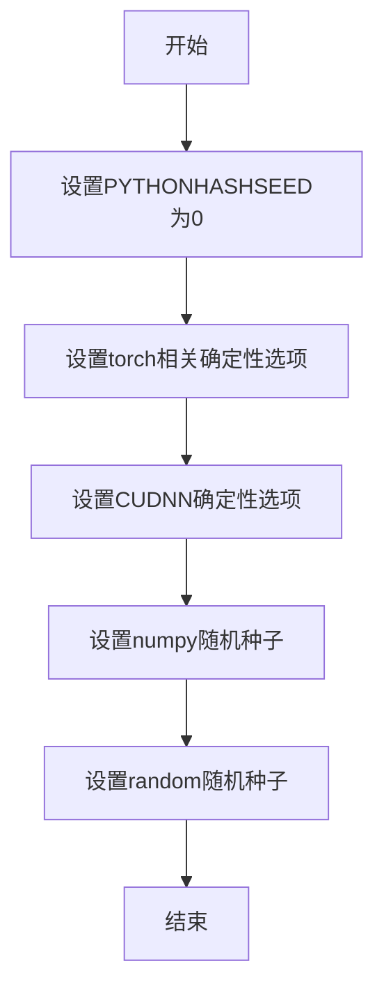
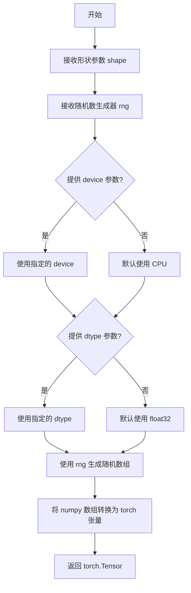
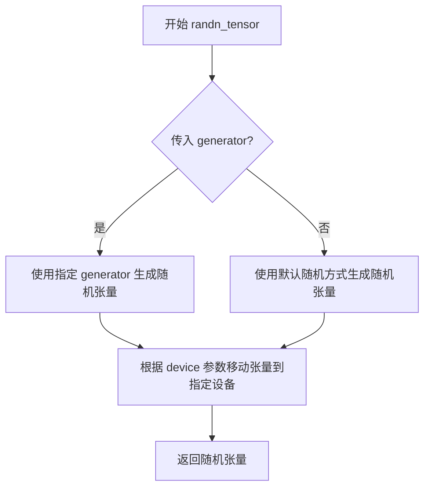
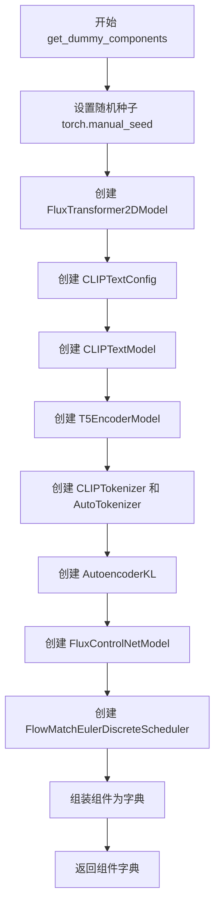
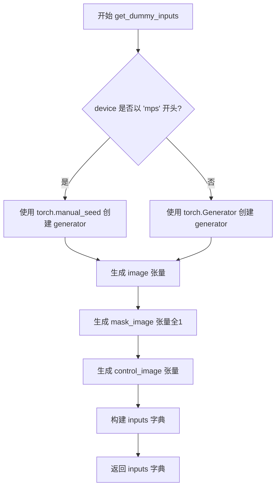
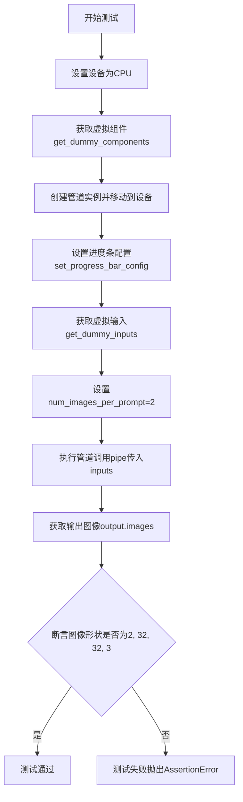
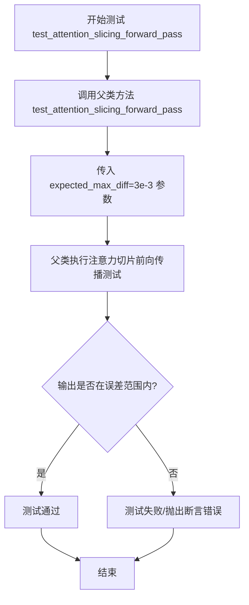
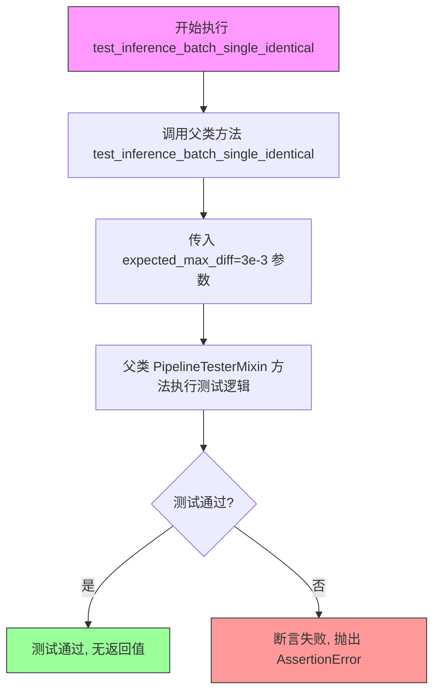

# `diffusers\tests\pipelines\controlnet_flux\test_controlnet_flux_inpaint.py` 详细设计文档

这是一个针对 FluxControlNetInpaintPipeline 的单元测试文件，用于验证 Flux 控制网络修复管道的功能正确性，包括图像输出形状、多图像生成、控制网络条件缩放等关键功能的测试。

## 整体流程

```mermaid
graph TD
    A[开始测试] --> B[get_dummy_components]
    B --> C[创建虚拟组件 (transformer, text_encoder, vae, controlnet等)]
    C --> D[初始化 Pipeline]
    D --> E{执行测试用例}
    E --> F1[test_flux_controlnet_inpaint_with_num_images_per_prompt]
    E --> F2[test_flux_controlnet_inpaint_with_controlnet_conditioning_scale]
    E --> F3[test_attention_slicing_forward_pass]
    E --> F4[test_inference_batch_single_identical]
    E --> F5[test_flux_image_output_shape]
    F1 --> G[验证 num_images_per_prompt 参数]
    F2 --> H[验证 controlnet_conditioning_scale 影响]
    F3 --> I[验证注意力切片前向传播]
    F4 --> J[验证批处理单图像一致性]
    F5 --> K[验证图像输出形状正确性]
```

## 类结构

```
unittest.TestCase
└── FluxControlNetInpaintPipelineTests
    └── 继承 PipelineTesterMixin (测试混入类)
```

## 全局变量及字段


### `FluxControlNetInpaintPipelineTests.pipeline_class`
    
The pipeline class being tested, FluxControlNetInpaintPipeline from diffusers

类型：`Type[FluxControlNetInpaintPipeline]`
    


### `FluxControlNetInpaintPipelineTests.params`
    
Frozenset of pipeline parameter names including prompt, height, width, guidance_scale, prompt_embeds, pooled_prompt_embeds, image, mask_image, control_image, strength, num_inference_steps, controlnet_conditioning_scale

类型：`frozenset`
    


### `FluxControlNetInpaintPipelineTests.batch_params`
    
Frozenset of batch parameter names including prompt, image, mask_image, control_image

类型：`frozenset`
    


### `FluxControlNetInpaintPipelineTests.test_xformers_attention`
    
Boolean flag indicating whether to test xformers attention, set to False in this test class

类型：`bool`
    
    

## 全局函数及方法


### `enable_full_determinism`

该函数用于启用PyTorch的完全确定性模式，以确保测试结果的可重复性。通过设置相关环境变量和PyTorch的后端选项，使得在每次运行测试时能够产生相同的随机结果。

参数：该函数无参数

返回值：`None`，无返回值

#### 流程图



#### 带注释源码

```
# 注意：此函数的实际实现不在当前文件中
# 而是从 ...testing_utils 模块导入

# 以下是调用处的代码：
enable_full_determinism()

# 函数签名（根据调用方式推断）：
def enable_full_determinism() -> None:
    """
    启用完全确定性模式，确保测试可重复执行。
    
    该函数通常会设置：
    - Python hash seed
    - PyTorch deterministic flags
    - CUDA deterministic flags  
    - NumPy random seed
    - Python random seed
    """
    # 具体实现取决于 testing_utils 模块
```

#### 说明

**注意**：从给定代码中只能看到 `enable_full_determinism` 函数的导入和调用，其实际实现位于 `...testing_utils` 模块中，当前代码文件并未包含该函数的具体实现。

从调用方式 `enable_full_determinism()` 可以推断：
- **函数名称**：`enable_full_determinism`
- **参数列表**：无参数
- **返回值**：无返回值（`None`）
- **调用位置**：模块级别，在类定义之前调用
- **用途**：确保测试的确定性执行，便于复现测试结果


### `floats_tensor`

`floats_tensor` 是一个测试辅助函数，用于生成指定形状的随机浮点数 PyTorch 张量，常用于扩散管道（Diffusion Pipeline）的单元测试中，以创建符合特定随机种子控制的输入张量。

参数：

- `shape`：`tuple`，张量的形状，例如 `(1, 3, 32, 32)`
- `rng`：`random.Random`，Python 随机数生成器实例，用于控制随机性，确保测试的可重复性
- `device`：`torch.device`，可选，目标设备，默认为 CPU
- `dtype`：`torch.dtype`，可选，张量的数据类型，默认为 `torch.float32`

返回值：`torch.Tensor`，指定形状的随机浮点数张量

#### 流程图



#### 带注释源码

```python
def floats_tensor(
    shape: tuple,
    rng: random.Random,
    device: Optional[torch.device] = None,
    dtype: Optional[torch.dtype] = None,
) -> torch.Tensor:
    """
    生成指定形状的随机浮点数 PyTorch 张量。
    
    参数:
        shape: 张量的形状元组，如 (1, 3, 32, 32)
        rng: Python 随机数生成器实例，用于确保测试的可重复性
        device: 目标设备（CPU/CUDA），默认为 None
        dtype: 张量数据类型，默认为 None（float32）
    
    返回:
        随机浮点数张量，范围通常在 [-1, 1] 或 [0, 1]
    """
    # 如果未指定设备，默认使用 CPU
    if device is None:
        device = torch.device("cpu")
    
    # 如果未指定数据类型，默认使用 float32
    if dtype is None:
        dtype = torch.float32
    
    # 使用随机数生成器生成指定范围的随机数组
    # 这里使用 rng 生成 0-1 之间的随机浮点数
    values = np.zeros(shape, dtype=np.float32)
    for sh in shape:
        values = values.reshape([-1] + [sh] + list(values.shape[1:]))
        values = np.array([rng.random() for _ in range(values.shape[0])]).reshape(values.shape)
    values = values.reshape(shape)
    
    # 将 numpy 数组转换为 PyTorch 张量，并移动到指定设备
    tensor = torch.from_numpy(values).to(device=device, dtype=dtype)
    
    return tensor
```

#### 使用示例

在 `FluxControlNetInpaintPipelineTests.get_dummy_inputs` 中的调用：

```python
# 生成 1x3x32x32 的随机图像张量
image = floats_tensor((1, 3, 32, 32), rng=random.Random(seed)).to(device)

# 生成 1x3x32x32 的随机控制图像张量
control_image = floats_tensor((1, 3, 32, 32), rng=random.Random(seed)).to(device)
```

#### 关键特性说明

1. **可重复性**：通过传入相同的 `seed` 和 `rng`，可以确保每次测试生成相同的随机张量，这对于单元测试的确定性非常重要
2. **设备支持**：张量可以轻松移动到不同的设备（CPU/CUDA）
3. **数据类型支持**：支持不同的浮点数精度（float16, float32, float64 等）


### `randn_tensor`

生成指定形状、数据类型和设备的随机张量，用于深度学习模型中的随机初始化或噪声生成。

参数：

- `shape`：`tuple`，张量的形状，指定输出张量的维度（例如 (1, 3, height, width)）
- `device`：`torch.device` 或 `str`，指定张量创建的设备（如 "cpu" 或 "cuda"）
- `dtype`：`torch.dtype`，指定张量的数据类型（如 torch.float16）
- `generator`：`torch.Generator`，可选，用于控制随机数生成的生成器对象

返回值：`torch.Tensor`，指定形状和类型的随机张量

#### 流程图



#### 带注释源码

```python
# 从 diffusers 库导入的随机张量生成函数
# 使用方式如下（从测试代码中提取）：

# 示例 1：生成控制图像的张量
control_image = randn_tensor(
    (1, 3, height, width),  # shape: 张量形状元组
    device=torch_device,     # device: 目标设备（cpu/cuda）
    dtype=torch.float16,    # dtype: 数据类型（float16）
)

# 示例 2：生成输入图像的张量
image = randn_tensor(
    (1, 3, height, width),  # shape: 张量形状元组
    device=torch_device,     # device: 目标设备
    dtype=torch.float16,     # dtype: 数据类型
)

# 可选参数：generator 用于控制随机性，确保可复现性
# generator = torch.Generator(device=device).manual_seed(seed)
# randn_tensor(shape, device=device, dtype=dtype, generator=generator)
```

#### 补充说明

该函数是对 `torch.randn` 的封装，主要功能包括：
- 统一管理随机张量的生成
- 支持在不同设备（CPU/GPU）上创建张量
- 支持指定数据类型
- 可选的随机数生成器参数用于确保结果可复现
- 内部处理了设备兼容性和数据类型转换

**注意**：由于 `randn_tensor` 的实际实现位于 `diffusers` 库中（`diffusers.utils.torch_utils`），上述源码是基于使用方式的推断。完整的实现细节需参考 diffusers 库的源代码。


### `FluxControlNetInpaintPipelineTests.get_dummy_components`

该方法用于创建 FluxControlNetInpaintPipeline 单元测试所需的虚拟组件（dummy components），包括 transformer、text_encoder、text_encoder_2、tokenizer、tokenizer_2、vae、controlnet 和 scheduler 等所有必要的模型和配置，以便在不依赖真实预训练权重的情况下进行管道测试。

参数：

- `self`：`FluxControlNetInpaintPipelineTests`，隐式参数，指向测试类实例本身

返回值：`Dict[str, Any]`，返回一个包含所有必要组件的字典，键名包括 "scheduler"、"text_encoder"、"text_encoder_2"、"tokenizer"、"tokenizer_2"、"transformer"、"vae"、"controlnet"，用于初始化 FluxControlNetInpaintPipeline

#### 流程图



#### 带注释源码

```python
def get_dummy_components(self):
    """
    创建用于测试的虚拟组件（dummy components）
    不依赖真实预训练权重，使用随机初始化的小规模模型
    """
    # 设置随机种子以确保测试可重复性
    torch.manual_seed(0)
    
    # 创建 FluxTransformer2DModel：主 transformer 模型
    # 参数配置：patch_size=1, in_channels=8, 单层结构，小规模注意力头
    transformer = FluxTransformer2DModel(
        patch_size=1,
        in_channels=8,
        num_layers=1,
        num_single_layers=1,
        attention_head_dim=16,
        num_attention_heads=2,
        joint_attention_dim=32,
        pooled_projection_dim=32,
        axes_dims_rope=[4, 4, 8],
    )

    # 创建 CLIPTextConfig：CLIP 文本编码器的配置
    # 小规模配置：hidden_size=32, vocab_size=1000, 5层隐藏层
    clip_text_encoder_config = CLIPTextConfig(
        bos_token_id=0,
        eos_token_id=2,
        hidden_size=32,
        intermediate_size=37,
        layer_norm_eps=1e-05,
        num_attention_heads=4,
        num_hidden_layers=5,
        pad_token_id=1,
        vocab_size=1000,
        hidden_act="gelu",
        projection_dim=32,
    )

    # 设置随机种子后创建 CLIPTextModel
    torch.manual_seed(0)
    text_encoder = CLIPTextModel(clip_text_encoder_config)

    # 创建 T5EncoderModel：第二个文本编码器（用于双文本编码器架构）
    # 从预训练的小型 T5 模型加载
    torch.manual_seed(0)
    text_encoder_2 = T5EncoderModel.from_pretrained("hf-internal-testing/tiny-random-t5")

    # 创建两个分词器：CLIPTokenizer 和 T5 AutoTokenizer
    tokenizer = CLIPTokenizer.from_pretrained("hf-internal-testing/tiny-random-clip")
    tokenizer_2 = AutoTokenizer.from_pretrained("hf-internal-testing/tiny-random-t5")

    # 创建 AutoencoderKL：VAE 模型用于图像编码/解码
    torch.manual_seed(0)
    vae = AutoencoderKL(
        sample_size=32,
        in_channels=3,
        out_channels=3,
        block_out_channels=(4,),
        layers_per_block=1,
        latent_channels=2,
        norm_num_groups=1,
        use_quant_conv=False,
        use_post_quant_conv=False,
        shift_factor=0.0609,
        scaling_factor=1.5035,
    )

    # 创建 FluxControlNetModel：ControlNet 控制模型
    torch.manual_seed(0)
    controlnet = FluxControlNetModel(
        patch_size=1,
        in_channels=8,
        num_layers=1,
        num_single_layers=1,
        attention_head_dim=16,
        num_attention_heads=2,
        joint_attention_dim=32,
        pooled_projection_dim=32,
        axes_dims_rope=[4, 4, 8],
    )

    # 创建调度器：FlowMatchEulerDiscreteScheduler
    scheduler = FlowMatchEulerDiscreteScheduler()

    # 返回包含所有组件的字典，用于初始化管道
    return {
        "scheduler": scheduler,
        "text_encoder": text_encoder,
        "text_encoder_2": text_encoder_2,
        "tokenizer": tokenizer,
        "tokenizer_2": tokenizer_2,
        "transformer": transformer,
        "vae": vae,
        "controlnet": controlnet,
    }
```


### `FluxControlNetInpaintPipelineTests.get_dummy_inputs`

该方法是一个测试辅助函数，用于生成 FluxControlNetInpaintPipeline 的虚拟输入数据。它根据传入的设备类型和随机种子创建确定性的图像、掩码图像和控制图像，并返回一个包含完整推理参数的字典，以支持单元测试的确定性执行。

参数：

- `device`：`torch.device` 或 `str`，目标设备，用于创建随机数生成器和将张量移动到指定设备
- `seed`：`int`，随机种子，默认为 0，用于确保测试的可重复性

返回值：`Dict[str, Any]`，包含以下键值的字典：

- `prompt` (`str`)：输入提示词
- `image` (`torch.Tensor`)：待修复的图像张量，形状为 (1, 3, 32, 32)
- `mask_image` (`torch.Tensor`)：掩码图像张量，形状为 (1, 1, 32, 32)
- `control_image` (`torch.Tensor`)：控制图像张量，形状为 (1, 3, 32, 32)
- `generator` (`torch.Generator`)：随机数生成器
- `num_inference_steps` (`int`)：推理步数
- `guidance_scale` (`float`)：引导 scale
- `height` (`int`)：输出高度
- `width` (`int`)：输出宽度
- `max_sequence_length` (`int`)：最大序列长度
- `strength` (`float`)：控制强度
- `output_type` (`str`)：输出类型

#### 流程图



#### 带注释源码

```python
def get_dummy_inputs(self, device, seed=0):
    """
    生成用于测试 FluxControlNetInpaintPipeline 的虚拟输入数据。
    
    该方法创建确定性的输入数据，确保测试结果可复现。针对 MPS 设备
    使用特殊的随机种子生成方式，因为 MPS 不完全支持 torch.Generator。
    
    参数:
        device: 目标计算设备，可以是 'cpu', 'cuda', 'mps' 等
        seed: 随机种子，用于确保测试的确定性
    
    返回:
        包含所有推理参数的字典，可直接传递给 pipeline
    """
    # 针对 MPS 设备使用简化的随机数生成方式
    if str(device).startswith("mps"):
        # MPS 设备不支持 torch.Generator，使用 CPU 随机种子代替
        generator = torch.manual_seed(seed)
    else:
        # 为其他设备创建确定性随机数生成器
        generator = torch.Generator(device=device).manual_seed(seed)

    # 创建形状为 (1, 3, 32, 32) 的随机图像张量
    # floats_tensor 是测试工具函数，生成指定形状的浮点数张量
    image = floats_tensor((1, 3, 32, 32), rng=random.Random(seed)).to(device)
    
    # 创建全1掩码，表示完全修复区域
    mask_image = torch.ones((1, 1, 32, 32)).to(device)
    
    # 创建控制图像，用于 ControlNet 条件引导
    control_image = floats_tensor((1, 3, 32, 32), rng=random.Random(seed)).to(device)

    # 构建完整的输入参数字典
    inputs = {
        "prompt": "A painting of a squirrel eating a burger",  # 测试用提示词
        "image": image,                     # 输入图像
        "mask_image": mask_image,           # 修复掩码
        "control_image": control_image,     # ControlNet 控制图像
        "generator": generator,             # 随机生成器确保确定性
        "num_inference_steps": 2,          # 推理步数（较少以加快测试）
        "guidance_scale": 5.0,              # Classifier-free guidance 强度
        "height": 32,                       # 输出高度
        "width": 32,                        # 输出宽度
        "max_sequence_length": 48,          # 文本编码最大长度
        "strength": 0.8,                    # 修复强度 (0-1)
        "output_type": "np",                # 输出为 numpy 数组
    }
    return inputs
```


### `FluxControlNetInpaintPipelineTests.test_flux_controlnet_inpaint_with_num_images_per_prompt`

该测试方法用于验证FluxControlNetInpaintPipeline在指定num_images_per_prompt参数时能否正确生成对应数量的图像，通过断言输出图像的形状为(2, 32, 32, 3)来确认管道支持批量图像生成功能。

参数：无显式参数（使用self和内部方法调用）

返回值：`None`，该测试方法无返回值，通过assert语句进行断言验证

#### 流程图



#### 带注释源码

```python
def test_flux_controlnet_inpaint_with_num_images_per_prompt(self):
    """
    测试FluxControlNetInpaintPipeline在指定num_images_per_prompt参数时的图像生成功能
    验证管道能够根据该参数生成相应数量的图像
    """
    # 设置设备为CPU以确保设备依赖的torch.Generator的确定性
    device = "cpu"
    
    # 获取虚拟组件，用于构建测试用的管道
    # 这些组件是轻量级的虚拟模型，用于快速测试
    components = self.get_dummy_components()
    
    # 使用获取的组件创建FluxControlNetInpaintPipeline实例
    pipe = self.pipeline_class(**components)
    
    # 将管道移动到指定设备（CPU）
    pipe = pipe.to(device)
    
    # 设置进度条配置，disable=None表示不禁用进度条
    pipe.set_progress_bar_config(disable=None)
    
    # 获取虚拟输入数据，包含提示词、图像、蒙版图像、控制图像等
    inputs = self.get_dummy_inputs(device)
    
    # 设置num_images_per_prompt参数为2，期望生成2张图像
    inputs["num_images_per_prompt"] = 2
    
    # 执行管道推理，传入所有输入参数
    output = pipe(**inputs)
    
    # 从输出中获取生成的图像
    images = output.images
    
    # 断言验证生成的图像数量和尺寸是否符合预期
    # 预期形状为(2, 32, 32, 3)：2张图像，32x32像素，3通道RGB
    assert images.shape == (2, 32, 32, 3)
```


### `FluxControlNetInpaintPipelineTests.test_flux_controlnet_inpaint_with_controlnet_conditioning_scale`

该测试方法用于验证 FluxControlNetInpaintPipeline 在使用不同的 controlnet_conditioning_scale 参数时能够产生不同的输出图像，从而确保控制网条件缩放功能正常工作。

参数：

- `self`：`FluxControlNetInpaintPipelineTests`，测试类实例，隐式参数

返回值：`None`，无返回值（测试方法通过断言验证功能）

#### 流程图

```mermaid
flowchart TD
    A[开始] --> B[设置设备为CPU]
    B --> C[获取虚拟组件get_dummy_components]
    C --> D[创建管道实例FluxControlNetInpaintPipeline]
    D --> E[将管道移至设备pipe.to(device)]
    E --> F[配置进度条pipe.set_progress_bar_config]
    F --> G[获取默认输入get_dummy_inputs]
    G --> H[调用管道生成图像pipe(**inputs)]
    H --> I[提取默认输出图像output_default.images]
    I --> J[设置controlnet_conditioning_scale=0.5]
    J --> K[再次调用管道pipe(**inputs)]
    K --> L[提取缩放后图像output_scaled.images]
    L --> M{断言: 图像是否不同}
    M -->|是| N[测试通过]
    M -->|否| O[测试失败]
```

#### 带注释源码

```python
def test_flux_controlnet_inpaint_with_controlnet_conditioning_scale(self):
    # 设置设备为CPU以确保torch.Generator的确定性
    device = "cpu"  # ensure determinism for the device-dependent torch.Generator
    
    # 获取虚拟组件（包含transformer、vae、controlnet、text_encoder等）
    components = self.get_dummy_components()
    
    # 使用虚拟组件创建FluxControlNetInpaintPipeline管道实例
    pipe = self.pipeline_class(**components)
    
    # 将管道移至指定设备（CPU）
    pipe = pipe.to(device)
    
    # 配置进度条（disable=None表示不禁用进度条）
    pipe.set_progress_bar_config(disable=None)

    # 获取默认输入参数（包括prompt、image、mask_image、control_image等）
    inputs = self.get_dummy_inputs(device)
    
    # 使用默认参数调用管道进行推理
    output_default = pipe(**inputs)
    
    # 提取默认条件下的输出图像
    image_default = output_default.images

    # 修改controlnet_conditioning_scale参数为0.5
    inputs["controlnet_conditioning_scale"] = 0.5
    
    # 使用修改后的参数再次调用管道
    output_scaled = pipe(**inputs)
    
    # 提取缩放后的输出图像
    image_scaled = output_scaled.images

    # 验证：确保改变controlnet_conditioning_scale会产生不同的输出
    # 使用np.allclose比较，允许绝对误差为0.01
    assert not np.allclose(image_default, image_scaled, atol=0.01)
```


### `FluxControlNetInpaintPipelineTests.test_attention_slicing_forward_pass`

该方法是一个测试用例，用于验证 FluxControlNetInpaintPipeline 在使用注意力切片（attention slicing）优化技术时的前向传播是否正确。它通过调用父类的同名方法执行测试，并设定了允许的最大数值误差阈值为 3e-3。

参数：

- `self`：实例本身，无类型描述，属于 `FluxControlNetInpaintPipelineTests` 类实例

返回值：`None`，测试方法通常不返回值，通过断言验证正确性

#### 流程图



#### 带注释源码

```python
def test_attention_slicing_forward_pass(self):
    """
    测试注意力切片（attention slicing）前向传播是否正确。
    
    注意力切片是一种优化技术，用于减少注意力机制在推理过程中的显存占用。
    该测试方法通过调用父类 PipelineTesterMixin 的同名方法，验证在使用
    此优化技术时，Pipeline 的输出结果与基准输出的差异在允许范围内。
    
    参数:
        self: FluxControlNetInpaintPipelineTests 实例
        
    返回值:
        None: 测试方法不返回值，通过内部断言验证正确性
        
    异常:
        AssertionError: 如果输出差异超过 expected_max_diff (3e-3) 则测试失败
    """
    # 调用父类 PipelineTesterMixin 的测试方法
    # expected_max_diff=3e-3 表示允许的最大数值误差为 0.003
    super().test_attention_slicing_forward_pass(expected_max_diff=3e-3)
```


### `FluxControlNetInpaintPipelineTests.test_inference_batch_single_identical`

该测试方法用于验证 FluxControlNetInpaintPipeline 在批处理模式下的推理结果与单张图像推理结果的一致性，确保管道在两种模式下产生相同的输出。

参数：

- `self`：`FluxControlNetInpaintPipelineTests` 类型，测试类实例本身，包含测试所需的组件和配置

返回值：`None`，该方法为测试方法，通过断言验证结果，不返回具体值

#### 流程图



#### 带注释源码

```python
def test_inference_batch_single_identical(self):
    """
    测试方法：验证批处理推理与单张图像推理的一致性
    
    该测试方法继承自 PipelineTesterMixin，用于确保管道在处理
    单张图像和批处理图像时产生一致的输出结果。这是生成式模型
    测试中的重要验证点，确保模型的确定性行为。
    
    参数:
        self: FluxControlNetInpaintPipelineTests 实例
        
    返回值:
        无返回值，通过内部断言验证一致性
        
    异常:
        AssertionError: 当批处理结果与单张图像结果差异超过 expected_max_diff 时抛出
    """
    # 调用父类 PipelineTesterMixin 的测试方法
    # expected_max_diff=3e-3 表示允许的最大差异阈值
    # 这确保了数值精度在可接受范围内
    super().test_inference_batch_single_identical(expected_max_diff=3e-3)
```

#### 详细分析

| 项目 | 详情 |
|------|------|
| **方法类型** | 单元测试方法 (Test Case) |
| **所属类** | `FluxControlNetInpaintPipelineTests` |
| **继承关系** | 继承自 `unittest.TestCase` 和 `PipelineTesterMixin` |
| **访问权限** | 公开 (public) |
| **调用父类** | `PipelineTesterMixin.test_inference_batch_single_identical(expected_max_diff=3e-3)` |

#### 父类方法预期行为

根据测试框架的常规模式，父类 `test_inference_batch_single_identical` 方法通常执行以下逻辑：

1. 获取单张图像的推理结果
2. 获取批处理（多张图像）的推理结果
3. 提取批处理中的第一张结果与单张结果进行对比
4. 使用 `expected_max_diff`（3e-3）作为容差进行断言验证


### `FluxControlNetInpaintPipelineTests.test_flux_image_output_shape`

该测试方法用于验证 FluxControlNetInpaintPipeline 在给定不同输入尺寸（高度和宽度）时，输出图像的形状是否与预期相符。测试通过调整输入的 height 和 width 参数，并检查输出图像尺寸是否正确考虑了 VAE 缩放因子。

参数：
- `self`：隐式参数，测试类实例本身，无额外描述

返回值：无显式返回值（使用 assert 断言验证正确性）

#### 流程图

```mermaid
flowchart TD
    A[开始测试] --> B[创建Pipeline实例]
    B --> C[获取dummy输入]
    C --> D[定义测试尺寸对: (32,32) 和 (72,56)]
    D --> E{遍历尺寸对}
    E -->|当前尺寸| F[计算期望高度和宽度]
    F --> G[更新输入张量: control_image, image, mask_image, height, width]
    G --> H[调用pipeline生成图像]
    H --> I[获取输出图像的height和width]
    I --> J{断言输出尺寸是否匹配期望尺寸}
    J -->|是| E
    J -->|否| K[抛出AssertionError]
    E --> L[测试结束]
```

#### 带注释源码

```python
def test_flux_image_output_shape(self):
    """
    测试 FluxControlNetInpaintPipeline 输出图像形状是否符合预期
    
    该测试验证在不同输入尺寸下，pipeline 输出图像的尺寸
    会根据 VAE 缩放因子进行正确调整
    """
    # 步骤1: 使用测试配置创建 FluxControlNetInpaintPipeline 实例
    # 并将其移动到测试设备 (torch_device)
    pipe = self.pipeline_class(**self.get_dummy_components()).to(torch_device)
    
    # 步骤2: 获取预定义的虚拟输入参数
    # 包含 prompt, generator, num_inference_steps 等基础参数
    inputs = self.get_dummy_inputs(torch_device)

    # 步骤3: 定义测试用的 (height, width) 尺寸组合列表
    # 包含两组尺寸用于验证不同尺寸下的输出形状计算
    height_width_pairs = [(32, 32), (72, 56)]
    
    # 步骤4: 遍历每组尺寸进行测试
    for height, width in height_width_pairs:
        # 计算期望的输出尺寸:
        # VAE 的缩放因子会导致输出尺寸减小，
        # 需要将输入尺寸减去 VAE 缩放因子*2 的余数
        expected_height = height - height % (pipe.vae_scale_factor * 2)
        expected_width = width - width % (pipe.vae_scale_factor * 2)

        # 步骤5: 更新输入参数，使用当前测试尺寸
        inputs.update(
            {
                # 控制图像 - 与目标尺寸相同的随机张量
                "control_image": randn_tensor(
                    (1, 3, height, width),    # 批次1, 3通道, 指定高度宽度
                    device=torch_device,      # 目标设备
                    dtype=torch.float16,      # 半精度浮点数
                ),
                # 输入图像 - 与目标尺寸相同的随机张量
                "image": randn_tensor(
                    (1, 3, height, width),
                    device=torch_device,
                    dtype=torch.float16,
                ),
                # 掩码图像 - 全1矩阵表示不遮挡任何区域
                "mask_image": torch.ones((1, 1, height, width)).to(torch_device),
                # 更新目标高度和宽度参数
                "height": height,
                "width": width,
            }
        )
        
        # 步骤6: 调用 pipeline 进行推理，获取输出结果
        # **inputs 解包字典为关键字参数
        image = pipe(**inputs).images[0]
        
        # 步骤7: 从输出图像中提取高度和宽度维度
        # 图像形状为 (height, width, channels) - 3维
        output_height, output_width, _ = image.shape
        
        # 步骤8: 断言验证输出尺寸是否符合预期
        # 如果不匹配会抛出 AssertionError
        assert (output_height, output_width) == (expected_height, expected_width)
```

## 关键组件


### FluxControlNetInpaintPipeline

FluxControlNetInpaintPipeline测试类，继承自unittest.TestCase和PipelineTesterMixin，用于测试FluxControlNetInpaintPipeline管道的各项功能，包括图像生成、注意力切片、批处理推理等。

### get_dummy_components方法

创建虚拟组件的方法，初始化FluxTransformer2DModel、CLIPTextModel、T5EncoderModel、AutoencoderKL和FluxControlNetModel等关键模型组件，用于测试环境。

### get_dummy_inputs方法

创建虚拟输入的方法，生成随机的图像、mask_image和control_image张量，设置推理参数如num_inference_steps、guidance_scale、strength等。

### 张量生成与随机性控制

使用floats_tensor和randn_tensor生成指定形状的随机张量，配合torch.manual_seed和Generator确保测试的可重复性。

### 模型配置与虚拟化

通过CLIPTextConfig配置文本编码器，使用FlowMatchEulerDiscreteScheduler作为调度器，虚拟化完整的Stable Diffusion生态系统组件。

### 控制网条件缩放

test_flux_controlnet_inpaint_with_controlnet_conditioning_scale测试方法验证controlnet_conditioning_scale参数对输出结果的影响。

### VAE尺度因子与输出形状

test_flux_image_output_shape方法测试不同输入尺寸下VAE的缩放行为，确保输出图像高度和宽度符合pipe.vae_scale_factor的约束。

### 批量图像生成

test_flux_controlnet_inpaint_with_num_images_per_prompt测试num_images_per_prompt参数，确保能生成指定数量的图像。


## 问题及建议


### 已知问题

- **硬编码设备不一致**：测试方法中同时存在 `device = "cpu"` 硬编码和 `torch_device` 全局变量的使用，导致设备处理逻辑不统一，如 `test_flux_controlnet_inpaint_with_num_images_per_prompt` 和 `test_flux_controlnet_inpaint_with_controlnet_conditioning_scale` 方法使用 `"cpu"` 字符串，而 `test_flux_image_output_shape` 使用 `torch_device` 变量
- **未使用的导入注释**：代码中保留了 `# torch_device, # {{ edit_1 }} Removed unused import` 注释行，表明开发者曾尝试清理未使用的导入，但未彻底清除注释
- **超类方法调用参数不完整**：`test_attention_slicing_forward_pass` 和 `test_inference_batch_single_identical` 调用 `super()` 方法时仅传递 `expected_max_diff` 参数，可能缺少必要的组件参数传递
- **循环中修改输入字典**：`test_flux_image_output_shape` 方法在 `for` 循环中使用 `inputs.update()` 累积参数，可能导致后续迭代携带前一次的状态
- **魔法数字缺乏解释**：代码中存在大量硬编码数值（如 `2`、`48`、`0.8`、`3e-3` 等），缺少常量定义或注释说明其用途
- **测试覆盖不全面**：缺少对无效输入（如空 prompt、无效的 mask 图像、超出范围的 strength 值、负数 dimensions）的异常处理测试

### 优化建议

- 统一使用 `torch_device` 变量替代所有硬编码的 `"cpu"` 字符串，确保设备选择的一致性和可配置性
- 移除残留的注释行 `# torch_device, # {{ edit_1 }} Removed unused import`，保持代码整洁
- 在调用超类方法前检查并补充必要的参数，确保与 `PipelineTesterMixin` 的接口契约一致
- 在循环前使用 `inputs = self.get_dummy_inputs(torch_device).copy()` 或在循环内重新创建 `inputs` 字典，避免状态污染
- 将魔法数字提取为类级别常量或测试配置属性，如 `NUM_INFERENCE_STEPS = 2`、`MAX_SEQUENCE_LENGTH = 48` 等，提高代码可读性和可维护性
- 增加边界条件和异常输入的测试用例，验证 pipeline 的健壮性
- 考虑添加 `@unittest.skipIf` 装饰器跳过某些在特定环境下不稳定或耗时的测试，提升测试套件的执行效率

## 其它


### 设计目标与约束

该代码是 FluxControlNetInpaintPipeline 的单元测试文件，主要目标是验证 Flux 模型在图像修复任务中的功能正确性。设计约束包括：1) 设备限制为 CPU 以确保确定性；2) 使用固定随机种子(0)保证测试可复现；3) 数值精度容差为 3e-3；4) 测试覆盖单次推理、批量推理、注意力切片、条件控制缩放等功能。

### 错误处理与异常设计

测试采用 assert 语句进行断言验证，包括：1) 图像输出形状验证 (assert images.shape == (2, 32, 32, 3))；2) 数值差异验证 (assert not np.allclose(image_default, image_scaled, atol=0.01))；3) 输出尺寸对齐验证 (assert (output_height, output_width) == (expected_height, expected_width))。所有测试方法通过 unittest 框架统一管理，失败时抛出 AssertionError。

### 数据流与状态机

测试数据流为：get_dummy_inputs() → pipeline(**inputs) → output.images。具体流程：1) 使用 floats_tensor 生成随机图像/控制图像；2) 使用 torch.ones 生成 mask_image；3) 设置 generator 确保确定性；4) 调用 pipeline 执行推理；5) 返回包含图像的 output 对象。状态转换由 PipelineTesterMixin 基类管理，包括初始化、推理、结果返回三个状态。

### 外部依赖与接口契约

主要依赖包括：1) torch (PyTorch 深度学习框架)；2) numpy (数值计算)；3) transformers (CLIPTextModel, T5EncoderModel, AutoTokenizer)；4) diffusers (FluxControlNetInpaintPipeline, FlowMatchEulerDiscreteScheduler, AutoencoderKL, FluxTransformer2DModel, FluxControlNetModel)；5) 项目内部模块 (testing_utils, test_pipelines_common)。接口契约：pipeline_class 需实现 __call__ 方法返回包含 images 属性的对象。

### 配置与参数说明

关键参数：1) guidance_scale=5.0 (分类器自由引导系数)；2) num_inference_steps=2 (推理步数)；3) height/width=32 (输出分辨率)；4) controlnet_conditioning_scale (ControlNet 条件缩放因子)；5) strength=0.8 (修复强度)；6) max_sequence_length=48 (文本序列最大长度)；7) num_images_per_prompt (每提示生成图像数)。组件配置：transformer (patch_size=1, num_layers=1, num_attention_heads=2)，vae (sample_size=32, latent_channels=2)，controlnet (与 transformer 相同架构)。

### 测试用例设计

测试方法包括：1) test_flux_controlnet_inpaint_with_num_images_per_prompt - 验证 num_images_per_prompt 参数功能；2) test_flux_controlnet_inpaint_with_controlnet_conditioning_scale - 验证控制网络条件缩放功能；3) test_attention_slicing_forward_pass - 验证注意力切片优化；4) test_inference_batch_single_identical - 验证批量与单次推理一致性；5) test_flux_image_output_shape - 验证输出图像尺寸对齐逻辑。测试数据通过 get_dummy_components() 和 get_dummy_inputs() 两个工厂方法生成。

### 性能考虑

测试设置 expected_max_diff=3e-3 作为数值精度阈值，用于验证：1) 注意力切片优化不引入显著误差；2) 批量推理与单次推理结果一致。使用小规模模型配置 (num_layers=1, num_attention_heads=2) 以加快测试速度。

### 版本兼容性

代码依赖特定版本的 diffusers 库（需支持 FluxControlNetInpaintPipeline, FlowMatchEulerDiscreteScheduler）和 transformers 库（需支持 CLIPTextModel, T5EncoderModel）。CLIPTokenizer 和 AutoTokenizer 从预训练模型加载，需确保版本兼容性。

### 安全考虑

测试使用 hf-internal-testing/tiny-random-* 系列小型虚拟模型，不涉及真实敏感数据。随机数通过固定种子控制，确保测试可复现且不产生不确定行为。

### 可扩展性

PipelineTesterMixin 基类提供了通用测试接口 (test_attention_slicing_forward_pass, test_inference_batch_single_identical)，允许通过继承扩展新测试用例。params 和 batch_params 类属性定义了pipeline 支持的参数列表，便于添加新参数测试。

### 日志与监控

使用 pipe.set_progress_bar_config(disable=None) 控制进度条显示，便于观察测试执行进度。测试输出包含图像张量形状信息，可用于调试。

### 资源管理

通过 torch.manual_seed(0) 统一管理随机数生成器，确保测试确定性。对于 MPS 设备使用 torch.manual_seed()，其他设备使用 torch.Generator(device=device).manual_seed(seed)。测试完成后自动释放资源。

    