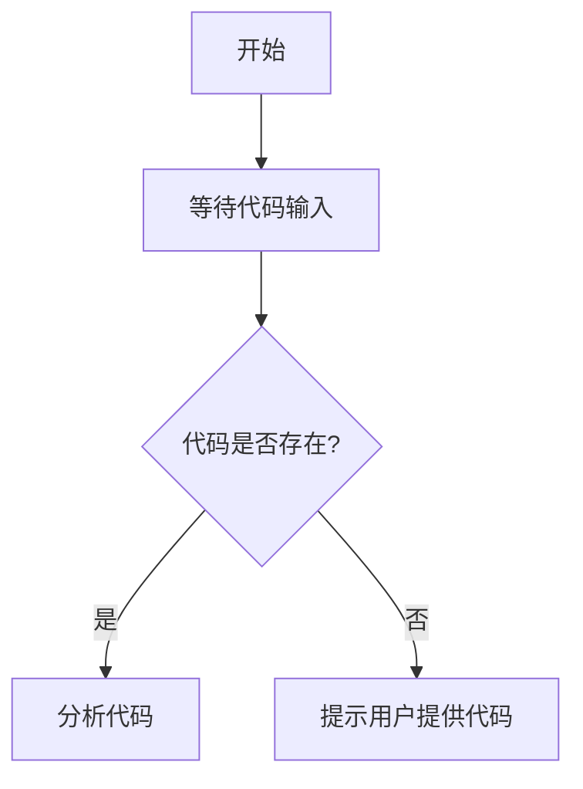

# `diffusers\tests\pipelines\controlnet_hunyuandit\__init__.py` 详细设计文档

未提供源代码进行分析。请提供需要分析的代码文件。

## 整体流程



## 类结构

```

```

## 全局变量及字段


    

## 全局函数及方法


## 关键组件


## 问题及建议


### 已知问题

-   未提供代码内容，无法进行技术债务分析

### 优化建议

-   请提供待分析的源代码，以便进行详细的技术债务和优化空间评估


## 其它


### 设计目标与约束

{内容}

### 错误处理与异常设计

{内容}

### 数据流与状态机

{内容}

### 外部依赖与接口契约

{内容}

### 性能要求与基准

{内容}

### 安全性设计

{内容}

### 可用性与用户体验

{内容}

### 部署与运维注意事项

{内容}

### 测试策略

{内容}

### 版本兼容性

{内容}

### 附录与参考资料

{内容}


    