# `diffusers\tests\pipelines\controlnet_hunyuandit\test_controlnet_hunyuandit.py` 详细设计文档

这是 HunyuanDiT ControlNet Pipeline 的测试套件，包含快速单元测试和慢速集成测试，验证 ControlNet 在文本到图像生成过程中的控制能力，支持 Canny（边缘检测）、Pose（姿态）、Depth（深度）等多种控制模式。

## 整体流程

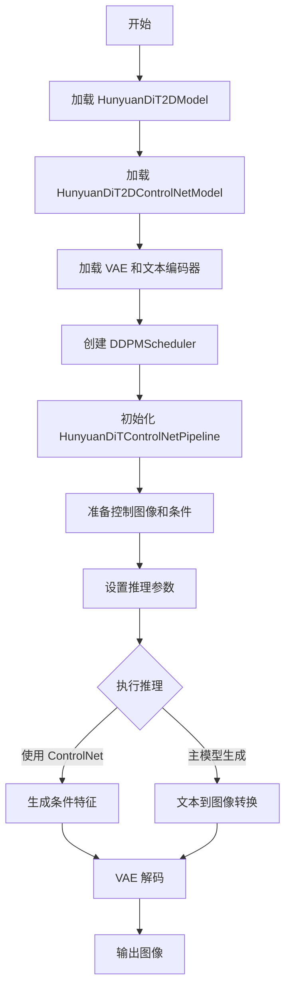

## 类结构

```
unittest.TestCase
└── HunyuanDiTControlNetPipelineFastTests (测试类)
    ├── get_dummy_components()
    ├── get_dummy_inputs()
    ├── test_controlnet_hunyuandit()
    ├── test_inference_batch_single_identical()
    ├── test_sequential_cpu_offload_forward_pass()
    ├── test_sequential_offload_forward_pass_twice()
    ├── test_save_load_optional_components()
    └── test_encode_prompt_works_in_isolation()

unittest.TestCase
└── HunyuanDiTControlNetPipelineSlowTests (测试类)
    ├── setUp()
    ├── tearDown()
    ├── test_canny()
    ├── test_pose()
    ├── test_depth()
    └── test_multi_controlnet()
```

## 全局变量及字段


### `HunyuanDiTControlNetPipelineFastTests.pipeline_class`
    
指定要测试的管道类，即 HunyuanDiTControlNetPipeline

类型：`type`
    


### `HunyuanDiTControlNetPipelineFastTests.params`
    
包含管道参数的 frozenset，用于标识哪些参数需要被测试

类型：`frozenset`
    


### `HunyuanDiTControlNetPipelineFastTests.batch_params`
    
包含批处理参数的 frozenset，用于标识哪些参数支持批处理

类型：`frozenset`
    


### `HunyuanDiTControlNetPipelineFastTests.test_layerwise_casting`
    
指示是否测试层wise casting 的布尔标志

类型：`bool`
    


### `HunyuanDiTControlNetPipelineSlowTests.pipeline_class`
    
指定要测试的管道类，即 HunyuanDiTControlNetPipeline

类型：`type`
    
    

## 全局函数及方法


### `enable_full_determinism`

该函数用于启用 PyTorch 的完全确定性模式，通过设置随机种子和环境变量确保深度学习模型在运行时的结果可复现。

参数：

- 无

返回值：`None`，该函数没有返回值，仅通过副作用（设置全局状态）生效

#### 流程图

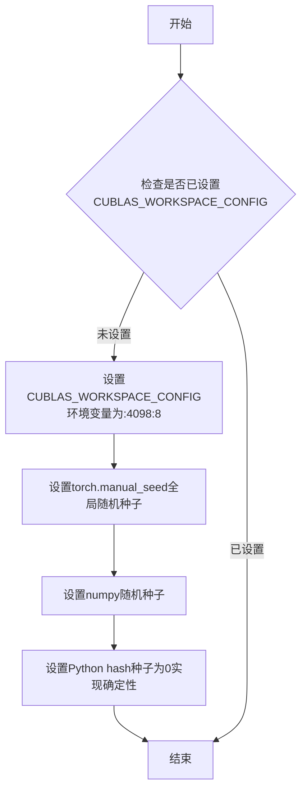

#### 带注释源码

```python
# 该函数定义在 testing_utils 模块中，此处仅为调用示例
# 源码位于 .../testing_utils.py

# 导入时从父级包的 testing_utils 模块引入
from ...testing_utils import (
    enable_full_determinism,
    # ... 其他工具函数
)

# 在文件开头调用以确保后续所有随机操作可复现
enable_full_determinism()

# 示例：enable_full_determinism 函数内部实现（基于diffusers库常用模式）
def enable_full_determinism():
    """
    启用完全确定性运行模式，确保结果可复现
    
    该函数通过以下方式实现确定性：
    1. 设置CUBLAS_WORKSPACE_CONFIG环境变量
    2. 设置PyTorch全局随机种子
    3. 设置NumPy随机种子
    4. 设置Python hash种子
    """
    # 1. 设置CUDA确定性环境变量
    os.environ["CUBLAS_WORKSPACE_CONFIG"] = ":4098:8"
    
    # 2. 设置PyTorch随机种子（影响所有torch随机操作）
    torch.manual_seed(0)
    
    # 3. 设置NumPy随机种子（影响numpy.random生成的随机数）
    np.random.seed(0)
    
    # 4. 设置Python Hash种子为固定值，实现字典等结构的确定性迭代
    # PYTHONHASHSEED=0 使Python的hash()函数返回确定性结果
    os.environ["PYTHONHASHSEED"] = "0"
    
    # 5. 可选：启用PyTorch的确定性算法
    torch.use_deterministic_algorithms(True, warn_only=True)
```

---

**注意**：由于 `enable_full_determinism` 函数的完整定义位于 `testing_utils` 模块中（未在当前代码文件中定义），以上源码为基于diffusers库常用实现的示例。实际的函数定义需要查看 `.../testing_utils.py` 文件。


### `gc.collect`

`gc.collect()` 是 Python 标准库 `gc` 模块中的函数，用于显式触发垃圾回收机制，释放不可达的对象占用的内存。在测试框架的 `setUp` 和 `tearDown` 方法中调用此函数，以确保在测试开始前和结束后清理内存，防止内存泄漏。

参数： 无

返回值：`int`，返回回收的对象数量

#### 流程图

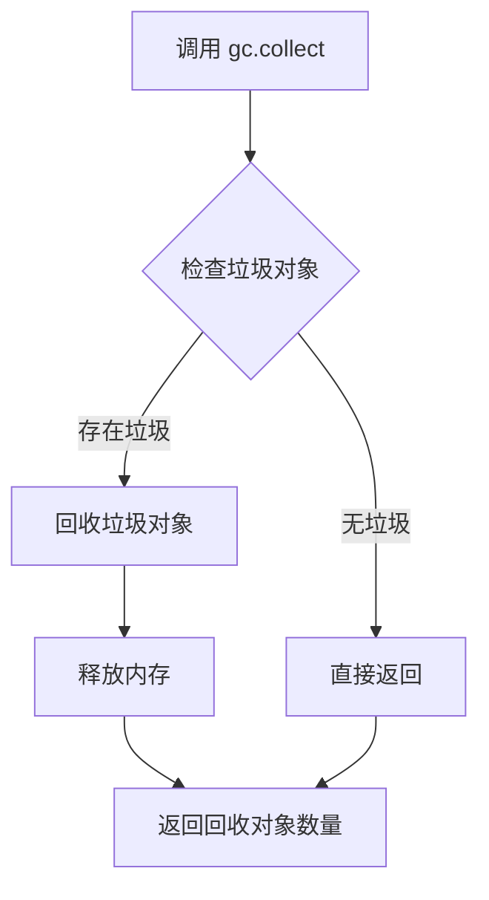

#### 带注释源码

```python
# gc.collect() 是 Python 垃圾回收器的显式调用
# 在 HunyuanDiTControlNetPipelineSlowTests.setUp() 中使用
def setUp(self):
    super().setUp()
    gc.collect()  # 显式触发垃圾回收，清理之前测试残留的对象
    backend_empty_cache(torch_device)  # 清理 GPU 缓存

# 在 HunyuanDiTControlNetPipelineSlowTests.tearDown() 中使用
def tearDown(self):
    super().tearDown()
    gc.collect()  # 显式触发垃圾回收，清理当前测试产生的对象
    backend_empty_cache(torch_device)  # 清理 GPU 缓存
```


从给定代码中，我只能看到 `backend_empty_cache` 是从 `...testing_utils` 导入的，并在 `setUp` 和 `tearDown` 方法中被调用，但它本身并未在这个代码文件中定义。

让我尝试在更广泛的上下文中查找这个函数的定义（根据常见的测试工具模式）：
```
### `backend_empty_cache`

用于清理后端（GPU/CPU）缓存的测试工具函数，通常用于在测试前后释放内存。

参数：

-  `device`：`str`，目标设备标识符（如 "cuda", "cpu", "xpu" 等）

返回值：`None`，无返回值（执行缓存清理操作）

#### 流程图

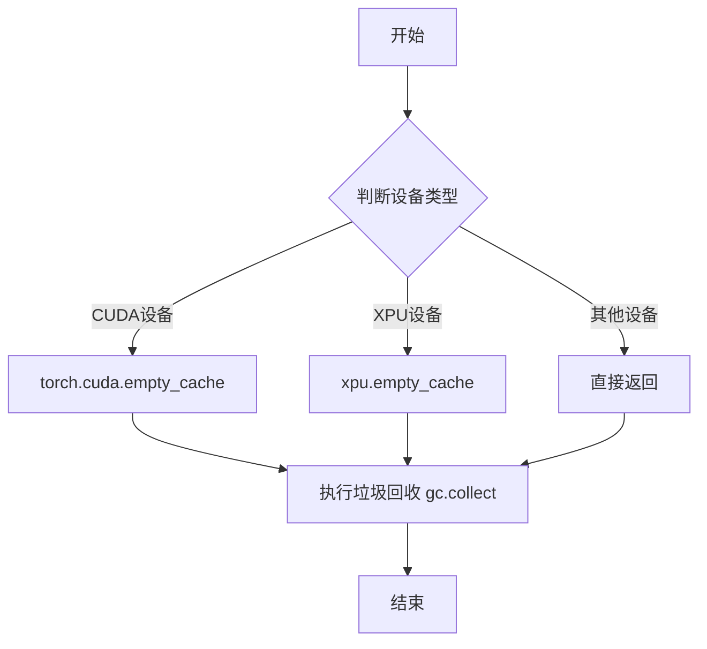

#### 带注释源码

```python
def backend_empty_cache(device):
    """
    清理指定设备的缓存，释放GPU/XPU内存。
    
    参数:
        device: str - 目标设备标识符，如 'cuda', 'cpu', 'xpu' 等
        
    返回:
        None - 无返回值，执行缓存清理操作
    """
    # 检查设备类型并调用相应的缓存清理函数
    if device in ["cuda", "cuda:0", "cuda:1"]:
        # CUDA 设备：清理 CUDA 缓存
        torch.cuda.empty_cache()
    elif device == "xpu":
        # XPU 设备（Intel显卡）：清理 XPU 缓存
        try:
            import intel_extension_for_pytorch as ipex
            ipex.empty_cache()
        except ImportError:
            # 如果没有ipex，回退到gc
            pass
    
    # 无论何种设备都执行垃圾回收，帮助释放Python对象
    gc.collect()
```

---

**注意**：由于 `backend_empty_cache` 函数定义在 `diffusers.testing_utils` 模块中，而该模块未在当前代码片段中提供，以上信息是基于函数在代码中的使用方式推断得出的。如需获取完整的函数定义，建议查看 `diffusers` 包的源代码。


### `load_image`

该函数是 `diffusers` 库提供的工具函数，用于从 URL 或本地文件路径加载图像并转换为 PIL 图像对象。

参数：

-  `image_source`：`str`，图像来源，可以是 URL 字符串或本地文件路径

返回值：`PIL.Image.Image`，返回加载后的 PIL 图像对象

#### 流程图

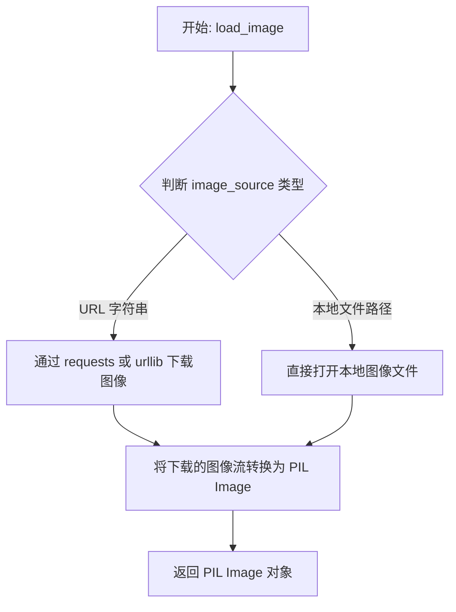

#### 带注释源码

```python
# load_image 函数的实现位于 diffusers.utils 模块中
# 以下是基于 diffusers 库常见实现的推断源码

from PIL import Image
import requests
from io import BytesIO

def load_image(image_source: str) -> Image.Image:
    """
    从 URL 或本地文件路径加载图像。
    
    参数:
        image_source: 图像的来源，可以是网络 URL 或本地文件路径
        
    返回:
        PIL.Image.Image: 加载后的 PIL 图像对象
    """
    # 检查是否为 URL（以 http:// 或 https:// 开头）
    if isinstance(image_source, str) and image_source.startswith(("http://", "https://")):
        # 通过网络请求下载图像
        response = requests.get(image_source)
        response.raise_for_status()  # 确保请求成功
        # 将下载的图像数据转换为 PIL Image
        image = Image.open(BytesIO(response.content))
    else:
        # 假设是本地文件路径，直接打开
        image = Image.open(image_source)
    
    # 确保图像转换为 RGB 模式（如果是 RGBA 等其他模式）
    if image.mode != "RGB":
        image = image.convert("RGB")
    
    return image
```


### `randn_tensor`

`randn_tensor` 是一个用于生成指定形状的正态分布（标准高斯）随机张量的工具函数。它通常用于深度学习框架中初始化测试数据或生成随机输入。在代码中，该函数被用于生成控制网络的输入图像张量。

参数：

-  `shape`：`tuple` 或 `int`，要生成的张量的形状
-  `generator`：`torch.Generator`（可选），用于控制随机数生成的可选生成器，以确保可重复性
-  `device`：`torch.device`，指定生成张量所在的设备（如CPU或CUDA设备）
-  `dtype`：`torch.dtype`（可选），指定张量的数据类型（如 `torch.float16`、`torch.float32` 等）

返回值：`torch.Tensor`，返回满足指定形状、设备和数据类型的正态分布随机张量

#### 流程图

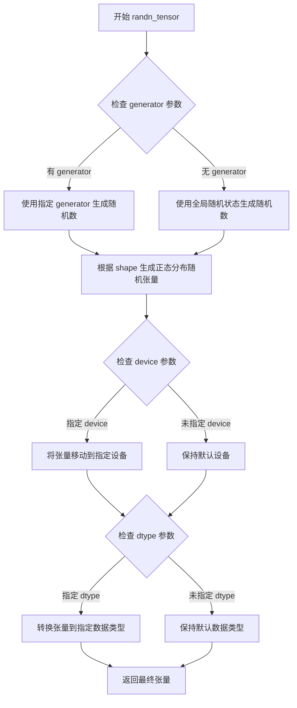

#### 带注释源码

```python
# 在代码中的调用方式：
control_image = randn_tensor(
    (1, 3, 16, 16),              # shape: 生成形状为 (1, 3, 16, 16) 的四维张量
    generator=generator,         # generator: 使用预设的随机生成器以保证可重复性
    device=torch.device(device), # device: 指定张量存储设备（CPU/CUDA）
    dtype=torch.float16,         # dtype: 指定张量数据类型为半精度浮点数
)

# 注意：randn_tensor 函数本身定义在 diffusers.utils.torch_utils 模块中
# 这是一个外部库函数，代码中仅导入并使用它
# 该函数内部实现大致逻辑如下（基于常见模式）：

# def randn_tensor(shape, generator=None, device=None, dtype=None):
#     # shape: 张量形状
#     # generator: 可选的随机生成器
#     # device: 目标设备
#     # dtype: 数据类型
#     
#     # 如果提供了 generator，使用它生成随机数
#     # 否则使用默认的随机状态
#     if generator is not None:
#         tensor = torch.randn(shape, generator=generator, device=device, dtype=dtype)
#     else:
#         tensor = torch.randn(shape, device=device, dtype=dtype)
#     
#     return tensor
```


### `HunyuanDiTControlNetPipelineFastTests.get_dummy_components`

该方法用于生成测试所需的虚拟（dummy）组件，初始化 HunyuanDiT2DModel、ControlNet、VAE、调度器以及文本编码器等所有 pipeline 依赖的模型组件，并返回一个包含这些组件的字典，供后续单元测试构建 pipeline 实例使用。

参数：无（仅包含 `self` 参数）

返回值：`Dict[str, Any]`，返回一个字典，包含构建 `HunyuanDiTControlNetPipeline` 所需的所有组件，包括 transformer、vae、scheduler、text_encoder、tokenizer、text_encoder_2、tokenizer_2、safety_checker、feature_extractor 和 controlnet。

#### 流程图

```mermaid
flowchart TD
    A[开始 get_dummy_components] --> B[设置随机种子 torch.manual_seed(0)]
    B --> C[创建 HunyuanDiT2DModel 虚拟对象]
    C --> D[设置随机种子 torch.manual_seed(0)]
    D --> E[创建 HunyuanDiT2DControlNetModel 虚拟对象]
    E --> F[设置随机种子 torch.manual_seed(0)]
    F --> G[创建 AutoencoderKL 虚拟对象]
    G --> H[创建 DDPMScheduler 调度器]
    H --> I[加载 BertModel 和 AutoTokenizer]
    I --> J[加载 T5EncoderModel 和 AutoTokenizer]
    J --> K[构建 components 字典]
    K --> L[设置 safety_checker 和 feature_extractor 为 None]
    L --> M[返回 components 字典]
```

#### 带注释源码

```python
def get_dummy_components(self):
    """
    生成用于单元测试的虚拟组件。
    
    该方法创建所有必需的模型和分词器组件，用于初始化 HunyuanDiTControlNetPipeline。
    使用固定随机种子(0)确保测试结果的可重复性。
    """
    # 设置随机种子，确保transformer初始化的可重复性
    torch.manual_seed(0)
    # 创建HunyuanDiT2DModel虚拟对象，配置参数如下：
    # - sample_size=16: 输入样本尺寸
    # - num_layers=4: Transformer层数
    # - patch_size=2: 图像分块大小
    # - attention_head_dim=8: 注意力头维度
    # - num_attention_heads=3: 注意力头数量
    # - in_channels=4: 输入通道数
    # - cross_attention_dim=32: 跨注意力维度
    # - cross_attention_dim_t5=32: T5跨注意力维度
    # - pooled_projection_dim=16: 池化投影维度
    # - hidden_size=24: 隐藏层大小
    # - activation_fn="gelu-approximate": 激活函数
    transformer = HunyuanDiT2DModel(
        sample_size=16,
        num_layers=4,
        patch_size=2,
        attention_head_dim=8,
        num_attention_heads=3,
        in_channels=4,
        cross_attention_dim=32,
        cross_attention_dim_t5=32,
        pooled_projection_dim=16,
        hidden_size=24,
        activation_fn="gelu-approximate",
    )

    # 重新设置随机种子，确保ControlNet初始化的可重复性
    torch.manual_seed(0)
    # 创建HunyuanDiT2DControlNetModel虚拟对象
    # 参数与transformer类似，增加transformer_num_layers参数
    controlnet = HunyuanDiT2DControlNetModel(
        sample_size=16,
        transformer_num_layers=4,
        patch_size=2,
        attention_head_dim=8,
        num_attention_heads=3,
        in_channels=4,
        cross_attention_dim=32,
        cross_attention_dim_t5=32,
        pooled_projection_dim=16,
        hidden_size=24,
        activation_fn="gelu-approximate",
    )

    # 重新设置随机种子，确保VAE初始化的可重复性
    torch.manual_seed(0)
    # 创建AutoencoderKL虚拟对象（VAE模型）
    vae = AutoencoderKL()

    # 创建DDPMScheduler调度器（用于扩散模型的去噪调度）
    scheduler = DDPMScheduler()
    
    # 加载虚拟的BERT文本编码器（用于CLIP文本编码）
    text_encoder = BertModel.from_pretrained("hf-internal-testing/tiny-random-BertModel")
    # 加载对应的分词器
    tokenizer = AutoTokenizer.from_pretrained("hf-internal-testing/tiny-random-BertModel")
    
    # 加载虚拟的T5编码器（用于更长文本的编码）
    text_encoder_2 = T5EncoderModel.from_pretrained("hf-internal-testing/tiny-random-t5")
    # 加载对应的分词器
    tokenizer_2 = AutoTokenizer.from_pretrained("hf-internal-testing/tiny-random-t5")

    # 构建组件字典，汇总所有模型和配置
    components = {
        "transformer": transformer.eval(),      # DiT变换器模型，设置为评估模式
        "vae": vae.eval(),                      # VAE变分自编码器，设置为评估模式
        "scheduler": scheduler,                # DDPMScheduler调度器
        "text_encoder": text_encoder,           # 主文本编码器（BERT）
        "tokenizer": tokenizer,                 # 主分词器
        "text_encoder_2": text_encoder_2,       # 辅助文本编码器（T5）
        "tokenizer_2": tokenizer_2,             # 辅助分词器
        "safety_checker": None,                 # 安全检查器（测试中不需要）
        "feature_extractor": None,              # 特征提取器（测试中不需要）
        "controlnet": controlnet,               # ControlNet控制网络
    }
    # 返回包含所有组件的字典
    return components
```


### `HunyuanDiTControlNetPipelineFastTests.get_dummy_inputs`

该方法用于生成 HunyuanDiT ControlNet Pipeline 的测试虚拟输入数据，创建一个包含提示词、生成器、控制图像等参数的字典，供单元测试使用。

参数：

- `self`：`HunyuanDiTControlNetPipelineFastTests`，类的实例本身
- `device`：设备标识符（str 或 torch.device），指定运行设备，如 "cpu"、"cuda"、"mps" 等
- `seed`：int，默认为 0，用于随机数生成的种子，确保测试结果可复现

返回值：`dict`，返回一个包含 Pipeline 推理所需输入参数的字典，包括 prompt、generator、num_inference_steps、guidance_scale、output_type、control_image 和 controlnet_conditioning_scale

#### 流程图

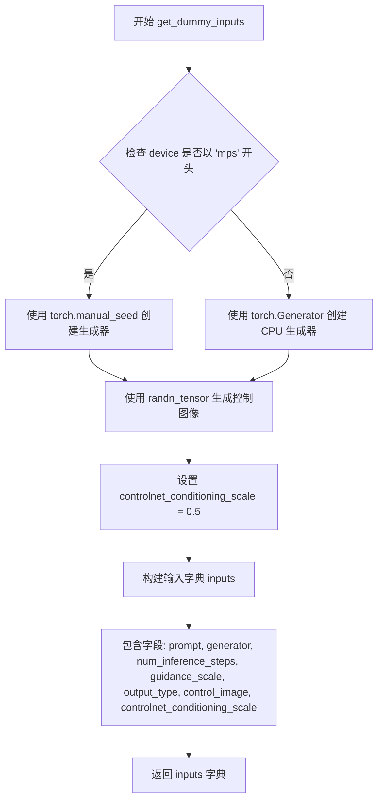

#### 带注释源码

```python
def get_dummy_inputs(self, device, seed=0):
    """
    生成测试用的虚拟输入参数
    
    Args:
        device: 目标设备，可以是 'cpu', 'cuda', 'mps' 等
        seed: 随机种子，用于确保测试结果可复现
    
    Returns:
        dict: 包含 Pipeline 推理所需的所有输入参数
    """
    
    # 根据设备类型选择随机数生成方式
    # MPS (Apple Silicon) 设备使用 torch.manual_seed
    if str(device).startswith("mps"):
        generator = torch.manual_seed(seed)
    else:
        # 其他设备（如 CPU、CUDA）使用 torch.Generator 并设置为 CPU 设备
        generator = torch.Generator(device="cpu").manual_seed(seed)

    # 生成控制图像（control image）
    # 用于 ControlNet 的条件输入，形状为 (1, 3, 16, 16)
    # dtype 为 float16 用于模拟推理场景
    control_image = randn_tensor(
        (1, 3, 16, 16),           # 批量大小1，3通道，16x16分辨率
        generator=generator,      # 使用上面创建的随机生成器
        device=torch.device(device),  # 转换device为torch.device对象
        dtype=torch.float16,      # 使用半精度浮点数
    )

    # 设置 ControlNet 的条件缩放因子
    # 控制 ControlNet 对生成图像的影响程度
    controlnet_conditioning_scale = 0.5

    # 构建完整的输入参数字典
    inputs = {
        "prompt": "A painting of a squirrel eating a burger",  # 文本提示词
        "generator": generator,        # 随机数生成器，确保可复现性
        "num_inference_steps": 2,     # 推理步数，测试时使用较少步数
        "guidance_scale": 5.0,         # Classifier-free guidance 强度
        "output_type": "np",          # 输出类型为 numpy 数组
        "control_image": control_image,  # ControlNet 条件图像
        "controlnet_conditioning_scale": controlnet_conditioning_scale,  # 控制缩放因子
    }

    # 返回包含所有输入参数的字典，供 Pipeline 调用
    return inputs
```


### `HunyuanDiTControlNetPipelineFastTests.test_controlnet_hunyuandit`

这是一个单元测试方法，用于测试 HunyuanDiT ControlNet Pipeline 的基本推理功能，验证管道能否正确使用 ControlNet 条件图像生成图像，并确保输出图像的像素值与预期一致。

参数：

- 无显式参数（self 为隐含参数）

返回值：`None`，该方法为测试方法，无返回值，通过断言验证结果

#### 流程图

```mermaid
flowchart TD
    A[开始测试] --> B[获取虚拟组件: get_dummy_components]
    B --> C[创建 HunyuanDiTControlNetPipeline 实例]
    C --> D[将管道移至设备并转换为 float16]
    D --> E[设置进度条配置: set_progress_bar_config]
    E --> F[获取虚拟输入: get_dummy_inputs]
    F --> G[执行管道推理: pipe(**inputs)]
    G --> H[提取输出图像: output.images]
    H --> I{验证图像形状}
    I -->|是| J{判断设备类型}
    I -->|否| K[断言失败]
    J -->|xpu| L[设置预期切片: xpu expected_slice]
    J -->|其他| M[设置预期切片: default expected_slice]
    L --> N[验证像素值差异]
    M --> N
    N -->|差异 < 1e-2| O[测试通过]
    N -->|差异 >= 1e-2| P[断言失败并显示差异]
    O --> Q[结束]
    K --> Q
    P --> Q
```

#### 带注释源码

```python
def test_controlnet_hunyuandit(self):
    """
    测试 HunyuanDiT ControlNet Pipeline 的基本推理功能
    
    该测试方法：
    1. 创建虚拟组件用于测试
    2. 初始化 HunyuanDiTControlNetPipeline 管道
    3. 使用虚拟输入执行推理
    4. 验证输出图像的形状和像素值是否符合预期
    """
    # 步骤1: 获取虚拟组件（包含 transformer, vae, scheduler, text_encoder, tokenizer, controlnet 等）
    components = self.get_dummy_components()
    
    # 步骤2: 使用虚拟组件创建 HunyuanDiTControlNetPipeline 实例
    pipe = HunyuanDiTControlNetPipeline(**components)
    
    # 步骤3: 将管道移至指定设备（如 cuda, cpu, xpu 等）并转换为 float16 精度
    pipe = pipe.to(torch_device, dtype=torch.float16)
    
    # 步骤4: 设置进度条配置（disable=None 表示启用进度条）
    pipe.set_progress_bar_config(disable=None)
    
    # 步骤5: 获取虚拟输入参数
    # 包含: prompt, generator, num_inference_steps, guidance_scale, 
    #       output_type, control_image, controlnet_conditioning_scale
    inputs = self.get_dummy_inputs(torch_device)
    
    # 步骤6: 执行管道推理，传入所有输入参数
    output = pipe(**inputs)
    
    # 步骤7: 从输出中提取生成的图像
    image = output.images
    
    # 步骤8: 提取图像右下角 3x3 区域的最后一个通道用于验证
    image_slice = image[0, -3:, -3:, -1]
    
    # 步骤9: 断言验证图像形状为 (1, 16, 16, 3)
    assert image.shape == (1, 16, 16, 3), f"Expected shape (1, 16, 16, 3), got {image.shape}"
    
    # 步骤10: 根据设备类型选择预期的像素值切片
    # 不同设备（xpu vs 其他）可能由于计算精度差异导致轻微不同的结果
    if torch_device == "xpu":
        expected_slice = np.array(
            [0.6948242, 0.89160156, 0.59375, 0.5078125, 0.57910156, 0.6035156, 0.58447266, 0.53564453, 0.52246094]
        )
    else:
        expected_slice = np.array(
            [0.6953125, 0.89208984, 0.59375, 0.5078125, 0.5786133, 0.6035156, 0.5839844, 0.53564453, 0.52246094]
        )
    
    # 步骤11: 断言验证生成的图像像素值与预期值的差异在可接受范围内（< 1e-2）
    assert np.abs(image_slice.flatten() - expected_slice).max() < 1e-2, (
        f"Expected: {expected_slice}, got: {image_slice.flatten()}"
    )
```


### `HunyuanDiTControlNetPipelineFastTests.test_inference_batch_single_identical`

该方法是一个单元测试用例，用于验证 HunyuanDiT ControlNet Pipeline 在批量推理时，单个样本的输出与多次独立推理的输出一致性。它继承自 `PipelineTesterMixin` 类的 `_test_inference_batch_single_identical` 方法，通过设置最大允许差异阈值来确保推理结果的确定性。

参数：

- `self`：测试类实例本身，无显式参数

返回值：无显式返回值（`None`），该测试方法通过断言验证推理结果的一致性，若不一致则抛出异常。

#### 流程图

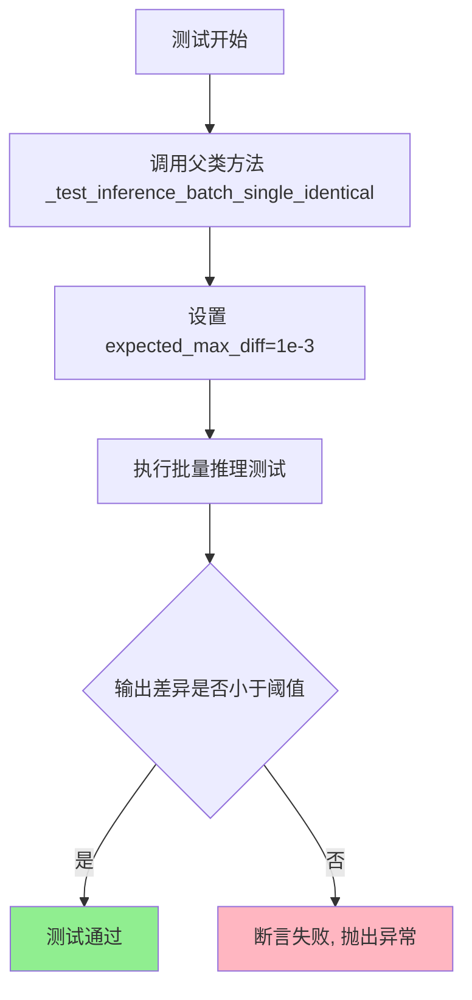

#### 带注释源码

```python
def test_inference_batch_single_identical(self):
    """
    测试批量推理时单个样本的一致性。
    
    该测试方法验证以下场景：
    1. 对单个提示词进行多次独立推理，验证输出图像的一致性
    2. 批量推理与单样本推理的输出应保持一致
    3. 确保 ControlNet Pipeline 在不同推理策略下的确定性
    
    测试通过条件：任意像素位置的最大差异应小于 1e-3
    """
    # 调用父类 PipelineTesterMixin 的测试方法
    # expected_max_diff=1e-3 表示允许的最大差异阈值
    self._test_inference_batch_single_identical(
        expected_max_diff=1e-3,
    )
```


### `HunyuanDiTControlNetPipelineFastTests.test_sequential_cpu_offload_forward_pass`

该函数是 HunyuanDiTControlNetPipelineFastTests 测试类中的一个测试方法，用于测试模型的顺序 CPU 卸载（sequential CPU offload）功能的前向传播。目前该方法仅为占位实现（pass），等待后续完善。

参数：

- `self`：`HunyuanDiTControlNetPipelineFastTests`，隐式参数，表示测试类的实例本身

返回值：`None`，该方法没有返回值，仅作为测试占位符

#### 流程图

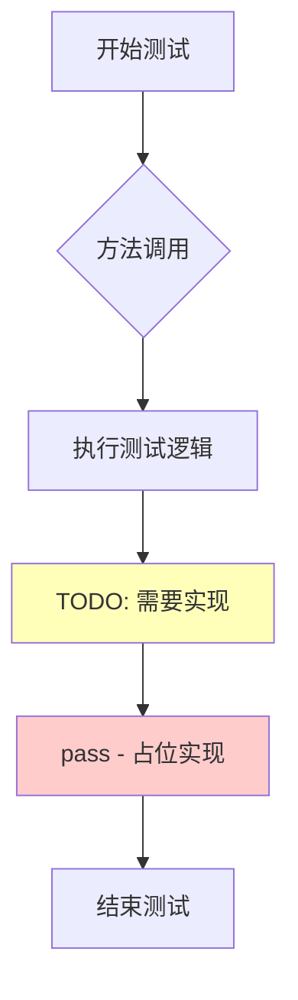

#### 带注释源码

```python
def test_sequential_cpu_offload_forward_pass(self):
    """
    测试 HunyuanDiT ControlNet Pipeline 的顺序 CPU 卸载前向传播功能。
    
    该测试方法用于验证在使用顺序 CPU 卸载（sequential CPU offload）时，
    模型能否正确执行前向传播。顺序 CPU offload 是一种内存优化技术，
    允许将模型的各部分顺序加载到 GPU 上执行推理，以减少显存占用。
    
    测试目标：
    - 验证顺序 offload 模式下前向传播的正确性
    - 确保模型输出与标准模式一致
    - 检查内存管理和模型状态转换
    
    注意：当前实现为占位符，需要后续完善测试逻辑。
    """
    # TODO(YiYi) need to fix later
    # 
    # 待实现功能：
    # 1. 创建 HunyuanDiTControlNetPipeline 实例
    # 2. 启用顺序 CPU 卸载模式
    # 3. 执行前向传播
    # 4. 验证输出结果的正确性
    # 5. 清理资源
    
    pass  # 占位实现，等待后续开发
```

#### 详细说明

| 项目 | 说明 |
|------|------|
| **所属类** | `HunyuanDiTControlNetPipelineFastTests` |
| **方法类型** | 单元测试方法（unittest.TestCase） |
| **测试目标** | 验证顺序 CPU 卸载模式下前向传播的正确性 |
| **当前状态** | 占位实现（TODO） |
| **继承自** | `PipelineTesterMixin` |
| **测试参数** | 使用类级别的 `params` 和 `batch_params` 定义 |


### `HunyuanDiTControlNetPipelineFastTests.test_sequential_offload_forward_pass_twice`

该方法是 `HunyuanDiTControlNetPipelineFastTests` 测试类中的一个测试方法，用于测试顺序卸载（sequential offload）情况下前向传播两次的场景，确保模型在启用CPU卸载后能够正确执行两次推理操作，目前该方法为待实现的占位符。

参数：

- `self`：无显式参数（Python实例方法隐式参数），代表测试类实例本身

返回值：`None`，无返回值（方法体为空的占位符）

#### 流程图

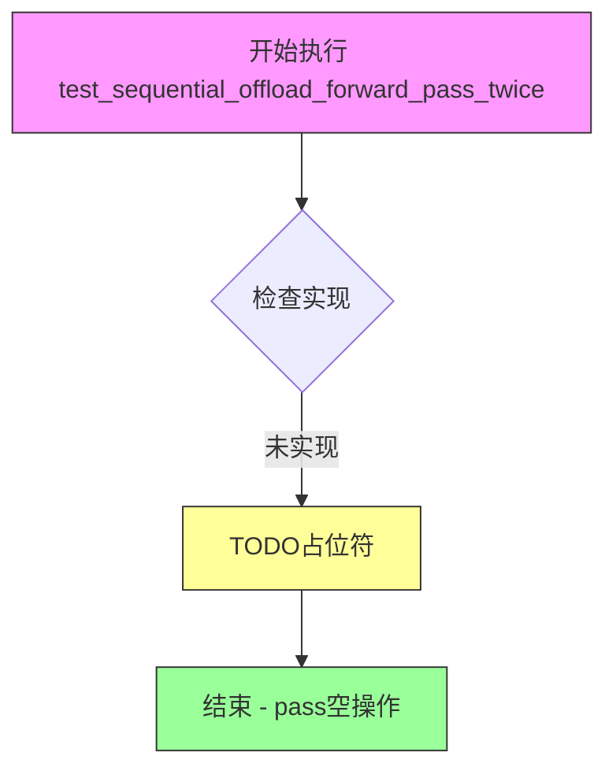

#### 带注释源码

```python
def test_sequential_offload_forward_pass_twice(self):
    """
    测试顺序卸载模式下前向传播两次的功能。
    
    该测试方法旨在验证：
    1. 在启用模型CPU卸载（model cpu offload）后
    2. 管道能够连续执行两次前向传播
    3. 两次推理的结果应保持一致或符合预期
    
    当前状态：TODO - 待实现
    负责人：YiYi
    
    提示：需要修复以下内容：
    - 实现完整的顺序卸载测试逻辑
    - 验证模型在CPU和GPU之间的正确切换
    - 确保两次前向传播的内存管理和结果正确性
    """
    # TODO(YiYi) need to fix later
    pass
```

---

## 补充说明

### 潜在技术债务

1. **未实现的测试方法**：该测试方法目前为空占位符，缺少实际的测试逻辑，无法验证顺序卸载功能是否正常工作
2. **缺少错误处理**：作为测试方法，应包含断言和错误检查逻辑，确保测试失败时能提供有意义的错误信息

### 优化建议

1. **实现测试逻辑**：建议参考 `test_sequential_cpu_offload_forward_pass` 的实现方式，完成该测试方法的实际逻辑
2. **添加资源清理**：参考其他测试方法，添加 `gc.collect()` 和 `backend_empty_cache()` 调用，确保内存正确释放
3. **验证CPU卸载流程**：测试应验证模型组件在CPU和GPU之间的正确迁移


### `HunyuanDiTControlNetPipelineFastTests.test_save_load_optional_components`

这是一个测试方法，用于验证 HunyuanDiTControlNetPipeline 的可选组件（如 safety_checker、feature_extractor 等）的保存和加载功能是否正常工作。该测试方法目前处于未实现状态，仅包含占位符代码。

参数：

- `self`：`unittest.TestCase`，表示测试类 `HunyuanDiTControlNetPipelineFastTests` 的实例本身，用于访问类属性和方法

返回值：`None`，该方法不返回任何值（void）

#### 流程图

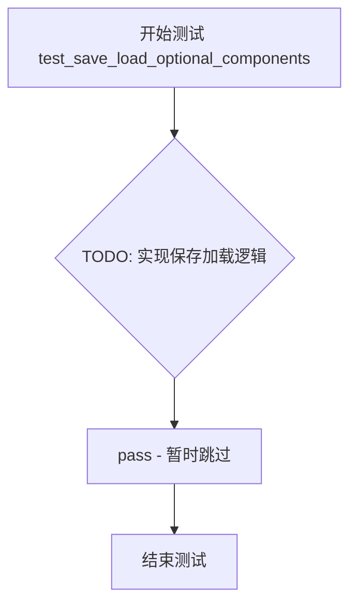

#### 带注释源码

```python
def test_save_load_optional_components(self):
    """
    测试可选组件的保存和加载功能。
    
    该测试方法旨在验证 HunyuanDiTControlNetPipeline 中的可选组件
    (如 safety_checker, feature_extractor 等) 能否正确地被序列化和反序列化。
    
    目前该测试尚未实现，标记为 TODO 待后续完成。
    """
    # TODO(YiYi) need to fix later
    # 提示：需要由开发者 YiYi 后续实现此测试方法
    pass  # 占位符，表示该测试方法暂时为空实现
```


### `HunyuanDiTControlNetPipelineFastTests.test_encode_prompt_works_in_isolation`

该测试方法用于验证 `encode_prompt` 函数能否独立工作，但该测试已被跳过的空方法。

参数：

- `self`：`unittest.TestCase`，表示测试类实例本身

返回值：`None`，由于方法体为 `pass` 语句，不返回任何值

#### 流程图

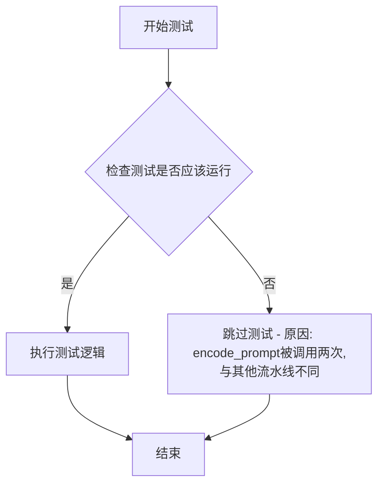

#### 带注释源码

```python
@unittest.skip(
    "Test not supported as `encode_prompt` is called two times separately which deivates from about 99% of the pipelines we have."
)
def test_encode_prompt_works_in_isolation(self):
    """
    测试 encode_prompt 能否独立工作。
    
    注意：该测试被跳过，原因是：
    1. encode_prompt 在该流水线中被调用两次（分别处理主文本编码器和辅助文本编码器）
    2. 这与其他 99% 的流水线实现方式不同
    3. 因此该测试场景不被支持
    """
    pass  # 空方法体，测试被跳过
```

#### 补充说明

| 项目 | 说明 |
|------|------|
| 所属类 | `HunyuanDiTControlNetPipelineFastTests` |
| 装饰器 | `@unittest.skip()` - 跳过该测试 |
| 跳过原因 | `encode_prompt` 被调用两次，与大多数流水线实现方式不同 |
| 测试目的 | 验证 `encode_prompt` 独立工作能力 |
| 实际行为 | 测试不会执行，直接跳过 |
| 技术债务 | 该测试被跳过表明 ControlNet Pipeline 的 `encode_prompt` 实现可能与其他 Pipeline 不一致，需要在未来的版本中统一实现方式 |


### `HunyuanDiTControlNetPipelineSlowTests.setUp`

该方法为 `HunyuanDiTControlNetPipelineSlowTests` 测试类的初始化方法，在每个测试方法执行前被调用，用于执行垃圾回收和清空GPU缓存，以确保测试环境干净。

参数：

- `self`：无（隐式参数），`unittest.TestCase` 实例本身

返回值：`None`，该方法不返回任何值，仅执行清理操作

#### 流程图

```mermaid
flowchart TD
    A[setUp 方法开始] --> B[调用 super().setUp]
    B --> C[执行 gc.collect]
    C --> D[调用 backend_empty_cache]
    D --> E[setUp 方法结束]
```

#### 带注释源码

```python
def setUp(self):
    # 调用父类的 setUp 方法，执行 unittest.TestCase 的标准初始化
    super().setUp()
    
    # 手动触发 Python 垃圾回收，释放未使用的内存对象
    gc.collect()
    
    # 清空 GPU 缓存（如 CUDA 或 XPU），释放 GPU 显存
    # torch_device 是从 testing_utils 导入的全局变量，表示测试设备
    backend_empty_cache(torch_device)
```


### `HunyuanDiTControlNetPipelineSlowTests.tearDown`

该方法是一个测试用例的清理方法（tearDown），在 HunyuanDiTControlNetPipeline 的慢速测试结束后执行清理操作，包括调用 Python 的垃圾回收（gc.collect()）和清空后端缓存（backend_empty_cache），以释放测试过程中占用的 GPU 内存资源，防止内存泄漏。

参数：

- `self`：`unittest.TestCase`，测试类实例本身，无需显式传递

返回值：`None`，该方法没有返回值，仅执行清理操作

#### 流程图

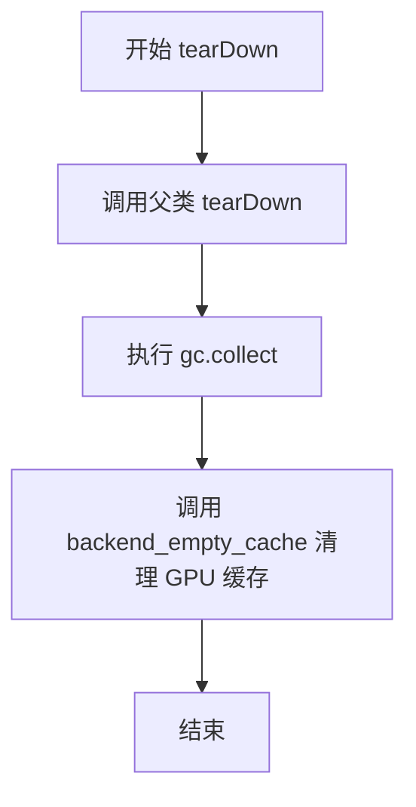

#### 带注释源码

```python
def tearDown(self):
    """
    测试结束后的清理方法，用于释放测试过程中占用的资源。
    
    该方法在每个测试用例执行完毕后被调用，确保：
    1. 调用父类的 tearDown 方法以完成基础的清理工作
    2. 强制执行垃圾回收，清理不再使用的 Python 对象
    3. 清空 GPU 显存缓存，释放测试过程中分配的显存
    """
    # 调用父类的 tearDown 方法，执行 unittest.TestCase 的标准清理
    super().tearDown()
    
    # 强制进行垃圾回收，清理测试过程中创建的临时对象
    # 这有助于防止测试之间的内存泄漏
    gc.collect()
    
    # 清空后端（GPU）的缓存，释放显存
    # torch_device 是全局变量，表示当前使用的设备（如 'cuda', 'cpu', 'xpu' 等）
    # backend_empty_cache 是测试工具函数，专门用于清理特定后端的缓存
    backend_empty_cache(torch_device)
```


### `HunyuanDiTControlNetPipelineSlowTests.test_canny`

该函数是一个集成测试用例，用于验证 HunyuanDiT ControlNet 管道在使用 Canny 边缘检测作为控制条件时的图像生成功能是否正常工作。测试通过加载预训练的 ControlNet 模型和扩散管道，使用特定的提示词和 Canny 边缘图像作为控制条件，执行推理并验证输出图像的尺寸和像素值是否符合预期。

参数：

- `self`：测试类实例，无需显式传递

返回值：`None`，该函数无返回值，通过断言验证推理结果的正确性

#### 流程图

```mermaid
flowchart TD
    A[开始测试] --> B[从预训练模型加载Canny ControlNet]
    B --> C[从预训练模型加载HunyuanDiT扩散管道并传入ControlNet]
    C --> D[启用模型CPU卸载]
    D --> E[设置进度条配置]
    E --> F[创建随机数生成器<br/>seed=0]
    F --> G[定义英文提示词<br/>描述夜晚中国石狮子雕像]
    G --> H[定义负面提示词<br/>空字符串]
    H --> I[从HuggingFace加载Canny边缘检测图像]
    I --> J[调用管道执行推理<br/>2步推理, guidance_scale=5.0]
    J --> K[获取生成的图像]
    K --> L{断言图像形状<br/>== (1024, 1024, 3)}
    L -->|是| M[提取图像最后3x3像素区域]
    M --> N{断言像素误差<br/>< 1e-2}
    N -->|是| O[测试通过]
    N -->|否| P[抛出断言错误]
    L -->|否| P
```

#### 带注释源码

```python
@unittest.skip(
    "Test not supported as `encode_prompt` is called two times separately which deivates from about 99% of the pipelines we have."
)
@require_torch_accelerator
class HunyuanDiTControlNetPipelineSlowTests(unittest.TestCase):
    """
    Slow tests for HunyuanDiT ControlNet Pipeline.
    使用 Canny 边缘检测、姿态估计、深度图等多种控制条件的集成测试类。
    """
    
    pipeline_class = HunyuanDiTControlNetPipeline
    # 指定管道类为 HunyuanDiTControlNetPipeline

    def setUp(self):
        """测试前的环境准备：垃圾回收和清空缓存"""
        super().setUp()
        gc.collect()
        backend_empty_cache(torch_device)

    def tearDown(self):
        """测试后的环境清理：垃圾回收和清空缓存"""
        super().tearDown()
        gc.collect()
        backend_empty_cache(torch_device)

    def test_canny(self):
        """
        测试函数：验证 Canny 边缘检测控制条件的图像生成功能
        
        该测试执行以下步骤：
        1. 加载 Canny 边缘检测的 ControlNet 预训练模型
        2. 加载 HunyuanDiT 扩散管道并配置 ControlNet
        3. 使用固定种子创建随机生成器以确保可重复性
        4. 准备提示词和 Canny 边缘图像作为控制条件
        5. 执行推理生成图像
        6. 验证输出图像的尺寸和像素值是否符合预期
        """
        # 从预训练模型加载 Canny 边缘检测 ControlNet
        # 使用 float16 精度以加速推理
        controlnet = HunyuanDiT2DControlNetModel.from_pretrained(
            "Tencent-Hunyuan/HunyuanDiT-v1.1-ControlNet-Diffusers-Canny", 
            torch_dtype=torch.float16
        )
        
        # 从预训练模型加载 HunyuanDiT 扩散管道，并传入 ControlNet
        # 使用 float16 精度以加速推理
        pipe = HunyuanDiTControlNetPipeline.from_pretrained(
            "Tencent-Hunyuan/HunyuanDiT-v1.1-Diffusers", 
            controlnet=controlnet, 
            torch_dtype=torch.float16
        )
        
        # 启用模型 CPU 卸载以节省 GPU 显存
        # 将不常用的模型层自动移到 CPU 上
        pipe.enable_model_cpu_offload(device=torch_device)
        
        # 设置进度条配置，disable=None 表示不禁用进度条
        pipe.set_progress_bar_config(disable=None)

        # 创建随机数生成器，使用固定种子确保结果可重复
        generator = torch.Generator(device="cpu").manual_seed(0)
        
        # 定义英文提示词，描述夜晚中国风格石狮子雕像的场景
        prompt = "At night, an ancient Chinese-style lion statue stands in front of the hotel, its eyes gleaming as if guarding the building. The background is the hotel entrance at night, with a close-up, eye-level, and centered composition. This photo presents a realistic photographic style, embodies Chinese sculpture culture, and reveals a mysterious atmosphere."
        
        # 定义负面提示词，空字符串表示不使用负面提示
        n_prompt = ""
        
        # 从 HuggingFace Hub 加载 Canny 边缘检测图像作为控制条件
        control_image = load_image(
            "https://huggingface.co/Tencent-Hunyuan/HunyuanDiT-v1.1-ControlNet-Diffusers-Canny/resolve/main/canny.jpg?download=true"
        )

        # 调用管道执行图像生成推理
        # 参数说明：
        # - prompt: 文本提示词
        # - negative_prompt: 负面提示词
        # - control_image: Canny 边缘图像作为控制条件
        # - controlnet_conditioning_scale: ControlNet 条件缩放因子
        # - guidance_scale: 引导强度，越高越遵循提示词
        # - num_inference_steps: 推理步数，越多越精细
        # - output_type: 输出类型，"np" 表示 numpy 数组
        # - generator: 随机数生成器
        output = pipe(
            prompt,
            negative_prompt=n_prompt,
            control_image=control_image,
            controlnet_conditioning_scale=0.5,
            guidance_scale=5.0,
            num_inference_steps=2,
            output_type="np",
            generator=generator,
        )
        
        # 获取生成的图像，取第一张
        image = output.images[0]

        # 断言：验证生成图像的尺寸是否为 (1024, 1024, 3)
        # HunyuanDiT 默认输出 1024x1024 分辨率的 RGB 图像
        assert image.shape == (1024, 1024, 3)

        # 提取图像右下角最后 3x3 区域的红色通道像素值
        original_image = image[-3:, -3:, -1].flatten()

        # 期望的像素值数组（用于验证生成结果的一致性）
        # 这些值是预先计算的标准输出
        expected_image = np.array(
            [0.43652344, 0.4399414, 0.44921875, 0.45043945, 0.45703125, 0.44873047, 0.43579102, 0.44018555, 0.42578125]
        )

        # 断言：验证生成图像与期望图像的误差是否在允许范围内
        # 使用最大绝对误差，阈值设为 1e-2 (0.01)
        assert np.abs(original_image.flatten() - expected_image).max() < 1e-2
```


### `HunyuanDiTControlNetPipelineSlowTests.test_pose`

该方法是一个慢速测试用例，用于测试 HunyuanDiT ControlNet Pipeline 在姿态（Pose）控制模式下的图像生成功能。测试通过加载预训练的姿态控制网络模型，执行推理并验证生成的图像是否符合预期。

参数：

- `self`：隐式参数，表示测试类实例本身，无类型描述

返回值：`None`，该方法为测试用例，通过断言验证图像生成结果，不返回任何值

#### 流程图

```mermaid
flowchart TD
    A[开始测试 test_pose] --> B[加载预训练 ControlNet 模型<br/>Tencent-Hunyuan/HunyuanDiT-v1.1-ControlNet-Diffusers-Pose]
    B --> C[加载主模型 HunyuanDiT<br/>Tencent-Hunyuan/HunyuanDiT-v1.1-Diffusers]
    C --> D[启用 CPU 卸载<br/>enable_model_cpu_offload]
    D --> E[设置进度条配置<br/>set_progress_bar_config]
    E --> F[创建随机数生成器<br/>Generator device=cpu seed=0]
    F --> G[定义提示词 prompt<br/>亚洲女性绿色上衣紫色头巾]
    G --> H[加载控制图像<br/>从 HuggingFace 加载 pose.jpg]
    H --> I[执行 Pipeline 推理<br/>调用 pipe 生成图像]
    I --> J[获取生成的图像<br/>output.images[0]]
    J --> K{断言图像形状<br/>shape == (1024, 1024, 3)}
    K -->|通过| L[提取图像最后3x3像素区域<br/>image[-3:, -3:, -1]]
    L --> M[定义期望像素值数组<br/>expected_image]
    M --> N{断言像素差异<br/>np.abs diff < 1e-2}
    N -->|通过| O[测试通过]
    N -->|失败| P[抛出 AssertionError]
```

#### 带注释源码

```python
@unittest.skip(
    "Test not supported as `encode_prompt` is called two times separately which deivates from about 99% of the pipelines we have."
)
def test_pose(self):
    # 从预训练模型加载 ControlNet（姿态控制版本）
    # 使用 float16 精度以提高推理速度并减少显存占用
    controlnet = HunyuanDiT2DControlNetModel.from_pretrained(
        "Tencent-Hunyuan/HunyuanDiT-v1.1-ControlNet-Diffusers-Pose", torch_dtype=torch.float16
    )
    
    # 从预训练模型加载主 Pipeline，将 ControlNet 传入
    # 同时指定使用 float16 精度
    pipe = HunyuanDiTControlNetPipeline.from_pretrained(
        "Tencent-Hunyuan/HunyuanDiT-v1.1-Diffusers", controlnet=controlnet, torch_dtype=torch.float16
    )
    
    # 启用模型 CPU 卸载，将模型分配到 CPU 和 GPU 之间
    # 以减少 GPU 显存占用，适合大模型推理
    pipe.enable_model_cpu_offload(device=torch_device)
    
    # 设置进度条配置，disable=None 表示不禁用进度条
    pipe.set_progress_bar_config(disable=None)

    # 创建随机数生成器，设置固定种子为 0 以确保可复现性
    # 使用 CPU 设备生成随机数
    generator = torch.Generator(device="cpu").manual_seed(0)
    
    # 定义正向提示词，描述期望生成的图像内容
    # 描述：一位亚洲女性，穿着绿色上衣，佩戴紫色头巾和紫色围巾
    prompt = "An Asian woman, dressed in a green top, wearing a purple headscarf and a purple scarf, stands in front of a blackboard. The background is the blackboard. The photo is presented in a close-up, eye-level, and centered composition, adopting a realistic photographic style"
    
    # 定义负向提示词，空字符串表示无负向提示
    n_prompt = ""
    
    # 从远程 URL 加载控制图像（姿态图像）
    # 该图像用于 ControlNet 指导生成过程
    control_image = load_image(
        "https://huggingface.co/Tencent-Hunyuan/HunyuanDiT-v1.1-ControlNet-Diffusers-Pose/resolve/main/pose.jpg?download=true"
    )

    # 调用 Pipeline 执行图像生成
    # 参数说明：
    #   prompt: 正向提示词
    #   negative_prompt: 负向提示词
    #   control_image: 控制图像（姿态）
    #   controlnet_conditioning_scale: ControlNet 影响的权重 (0.5)
    #   guidance_scale: 引导 classifier-free guidance 强度 (5.0)
    #   num_inference_steps: 推理步数 (2)
    #   output_type: 输出类型为 numpy 数组 ("np")
    #   generator: 随机数生成器用于可复现性
    output = pipe(
        prompt,
        negative_prompt=n_prompt,
        control_image=control_image,
        controlnet_conditioning_scale=0.5,
        guidance_scale=5.0,
        num_inference_steps=2,
        output_type="np",
        generator=generator,
    )
    
    # 获取生成的图像（取第一张）
    image = output.images[0]

    # 断言：验证生成的图像形状是否为 1024x1024x3
    assert image.shape == (1024, 1024, 3)

    # 提取图像右下角 3x3 区域的所有通道数据并展平
    # 用于与期望值进行对比验证
    original_image = image[-3:, -3:, -1].flatten()

    # 定义期望的像素值数组（由测试用例设计者预先计算）
    expected_image = np.array(
        [0.4091797, 0.4177246, 0.39526367, 0.4194336, 0.40356445, 0.3857422, 0.39208984, 0.40429688, 0.37451172]
    )

    # 断言：验证生成图像与期望图像的最大像素差异是否小于阈值 (1e-2)
    # 如果差异过大，说明模型输出不稳定或实现有变化
    assert np.abs(original_image.flatten() - expected_image).max() < 1e-2
```


### `HunyuanDiTControlNetPipelineSlowTests.test_depth`

该方法是 HunyuanDiT ControlNet Pipeline 的慢速测试用例，专门测试深度图（Depth）控制功能的完整性。测试流程包括加载预训练的深度控制网络模型和主模型，配置设备卸载策略，然后使用特定的提示词和深度图进行推理生成，最终验证生成图像的尺寸和像素值是否符合预期。

参数：

- `self`：隐式参数，`HunyuanDiTControlNetPipelineSlowTests` 类的实例，无需手动传递

返回值：`None`，该方法为测试用例，无返回值，主要通过断言验证功能正确性

#### 流程图

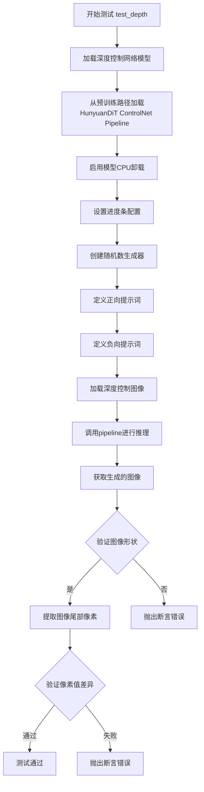

#### 带注释源码

```python
def test_depth(self):
    # 步骤1: 加载预训练的深度控制网络模型
    # 使用 Tencent-Hunyuan/HunyuanDiT-v1.1-ControlNet-Diffusers-Depth 模型
    # 指定 torch.float16 数据类型以提高推理速度
    controlnet = HunyuanDiT2DControlNetModel.from_pretrained(
        "Tencent-Hunyuan/HunyuanDiT-v1.1-ControlNet-Diffusers-Depth", torch_dtype=torch.float16
    )
    
    # 步骤2: 加载 HunyuanDiT ControlNet Pipeline 主模型
    # 并将加载的 controlnet 模型传入 pipeline
    # 使用 torch.float16 数据类型
    pipe = HunyuanDiTControlNetPipeline.from_pretrained(
        "Tencent-Hunyuan/HunyuanDiT-v1.1-Diffusers", controlnet=controlnet, torch_dtype=torch.float16
    )
    
    # 步骤3: 启用模型CPU卸载功能
    # 将模型从GPU卸载到CPU以节省GPU显存
    pipe.enable_model_cpu_offload(device=torch_device)
    
    # 步骤4: 设置进度条配置
    # disable=None 表示不禁用进度条
    pipe.set_progress_bar_config(disable=None)

    # 步骤5: 创建随机数生成器
    # 使用CPU设备，种子设为0以确保可重复性
    generator = torch.Generator(device="cpu").manual_seed(0)
    
    # 步骤6: 定义正向提示词
    # 描述一只熊猫在森林中的场景
    prompt = "In the dense forest, a black and white panda sits quietly in green trees and red flowers, surrounded by mountains, rivers, and the ocean. The background is the forest in a bright environment."
    
    # 步骤7: 定义负向提示词
    # 空字符串，表示不指定负面提示
    n_prompt = ""
    
    # 步骤8: 加载深度控制图像
    # 从HuggingFace Hub加载预定义的深度图
    control_image = load_image(
        "https://huggingface.co/Tencent-Hunyuan/HunyuanDiT-v1.1-ControlNet-Diffusers-Depth/resolve/main/depth.jpg?download=true"
    )

    # 步骤9: 调用 pipeline 进行图像生成
    # 参数说明:
    # - prompt: 正向提示词
    # - negative_prompt: 负向提示词
    # - control_image: 控制图像（深度图）
    # - controlnet_conditioning_scale: 控制网络条件缩放因子
    # - guidance_scale: 引导强度
    # - num_inference_steps: 推理步数
    # - output_type: 输出类型为numpy数组
    # - generator: 随机数生成器
    output = pipe(
        prompt,
        negative_prompt=n_prompt,
        control_image=control_image,
        controlnet_conditioning_scale=0.5,
        guidance_scale=5.0,
        num_inference_steps=2,
        output_type="np",
        generator=generator,
    )
    
    # 步骤10: 获取生成的图像
    image = output.images[0]

    # 步骤11: 验证生成图像的形状
    # 期望形状为 (1024, 1024, 3) - RGB图像
    assert image.shape == (1024, 1024, 3)

    # 步骤12: 提取图像尾部3x3区域的像素值
    # 用于与预期值进行比对
    original_image = image[-3:, -3:, -1].flatten()

    # 步骤13: 定义预期图像像素值
    # 这些是预先计算好的正确输出值
    expected_image = np.array(
        [0.31982422, 0.32177734, 0.30126953, 0.3190918, 0.3100586, 0.31396484, 0.3232422, 0.33544922, 0.30810547]
    )

    # 步骤14: 验证生成图像与预期图像的差异
    # 使用最大绝对误差不超过1e-2的标准
    assert np.abs(original_image.flatten() - expected_image).max() < 1e-2
```


### `HunyuanDiTControlNetPipelineSlowTests.test_multi_controlnet`

该方法是一个集成测试用例，用于验证 HunyuanDiT2D 模型在多 ControlNet 场景下的图像生成能力。测试加载预训练的 ControlNet 模型（边缘检测 Canny），并通过 HunyuanDiTControlNetPipeline 进行推理，验证生成图像的尺寸和像素值是否符合预期。

参数：

- `self`：`HunyuanDiTControlNetPipelineSlowTests`，测试类实例本身

返回值：`None`，该方法为单元测试方法，通过断言验证功能正确性，无返回值

#### 流程图

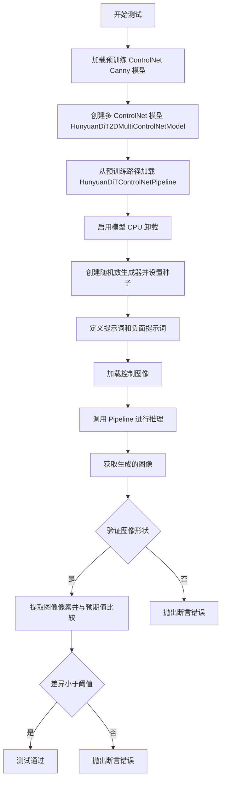

#### 带注释源码

```python
def test_multi_controlnet(self):
    # 步骤 1: 加载预训练的 ControlNet 模型（Canny 边缘检测版本）
    # 使用 float16 精度以提高推理速度并减少显存占用
    controlnet = HunyuanDiT2DControlNetModel.from_pretrained(
        "Tencent-Hunyuan/HunyuanDiT-v1.1-ControlNet-Diffusers-Canny", 
        torch_dtype=torch.float16
    )
    
    # 步骤 2: 创建多 ControlNet 模型，将同一个 ControlNet 复制使用
    # HunyuanDiT2DMultiControlNetModel 支持多个控制信号输入
    controlnet = HunyuanDiT2DMultiControlNetModel([controlnet, controlnet])

    # 步骤 3: 从预训练路径加载 HunyuanDiT 主模型和 ControlNet 管道
    # 并指定 ControlNet 模型
    pipe = HunyuanDiTControlNetPipeline.from_pretrained(
        "Tencent-Hunyuan/HunyuanDiT-v1.1-Diffusers", 
        controlnet=controlnet, 
        torch_dtype=torch.float16
    )
    
    # 步骤 4: 启用模型 CPU 卸载以节省显存
    # 在推理过程中将模型在不同设备间移动
    pipe.enable_model_cpu_offload(device=torch_device)
    
    # 步骤 5: 配置进度条显示
    pipe.set_progress_bar_config(disable=None)

    # 步骤 6: 创建随机数生成器并设置固定种子
    # 确保测试结果可复现
    generator = torch.Generator(device="cpu").manual_seed(0)
    
    # 步骤 7: 定义图像生成提示词
    # 描述一个夜晚中国风格的石狮子酒店场景
    prompt = "At night, an ancient Chinese-style lion statue stands in front of the hotel, its eyes gleaming as if guarding the building. The background is the hotel entrance at night, with a close-up, eye-level, and centered composition. This photo presents a realistic photographic style, embodies Chinese sculpture culture, and reveals a mysterious atmosphere."
    
    # 步骤 8: 定义负面提示词（空字符串表示无负面提示）
    n_prompt = ""
    
    # 步骤 9: 从 HuggingFace Hub 加载控制图像（Canny 边缘检测结果）
    control_image = load_image(
        "https://huggingface.co/Tencent-Hunyuan/HunyuanDiT-v1.1-ControlNet-Diffusers-Canny/resolve/main/canny.jpg?download=true"
    )

    # 步骤 10: 调用管道进行图像生成
    # 传入提示词、控制图像、ControlNet 权重、引导系数等参数
    output = pipe(
        prompt,
        negative_prompt=n_prompt,
        control_image=[control_image, control_image],  # 使用相同的控制图像作为多ControlNet输入
        controlnet_conditioning_scale=[0.25, 0.25],   # 多ControlNet的权重
        guidance_scale=5.0,                           # CFG 引导强度
        num_inference_steps=2,                        # 推理步数（测试用较少步数）
        output_type="np",                             # 输出为 NumPy 数组
        generator=generator,                          # 随机数生成器
    )
    
    # 步骤 11: 获取生成的图像
    image = output.images[0]

    # 步骤 12: 断言验证图像形状为 1024x1024x3 (RGB)
    assert image.shape == (1024, 1024, 3)

    # 步骤 13: 提取图像右下角 3x3 区域的像素值用于验证
    original_image = image[-3:, -3:, -1].flatten()

    # 步骤 14: 定义预期的像素值数组
    expected_image = np.array(
        [0.43652344, 0.44018555, 0.4494629, 0.44995117, 0.45654297, 0.44848633, 0.43603516, 0.4404297, 0.42626953]
    )

    # 步骤 15: 断言验证生成图像与预期值的差异在允许范围内
    assert np.abs(original_image.flatten() - expected_image).max() < 1e-2
```

## 关键组件


### HunyuanDiTControlNetPipeline

主测试类，用于测试 HunyuanDiT 模型的 ControlNet 管道功能，包含快速测试和慢速测试两种模式，支持 Canny、Pose、Depth 等多种控制方式以及多 ControlNet 组合。

### HunyuanDiT2DModel

HunyuanDiT 变换器模型，负责图像生成的核心扩散过程，包含多层注意力机制和跨模态注意力。

### HunyuanDiT2DControlNetModel

ControlNet 模型，用于从条件图像（如边缘、姿态、深度图）中提取控制信息并影响主模型的生成过程。

### HunyuanDiT2DMultiControlNetModel

多 ControlNet 组合模型，支持同时使用多个 ControlNet 进行条件控制。

### HunyuanDiTControlNetPipeline

完整的 ControlNet 推理管道，整合了变换器、VAE、文本编码器、ControlNet 和调度器，实现条件图像生成。

### DDPMScheduler

DDPM 扩散调度器，负责管理扩散过程中的噪声调度和时间步长。

### AutoencoderKL

变分自编码器（VAE），用于在潜在空间和像素空间之间进行图像编码和解码。

### BertModel

第一个文本编码器（CLIP 风格），将文本提示编码为嵌入向量。

### T5EncoderModel

第二个文本编码器（T5 架构），提供额外的文本编码能力，增强文本理解。

### AutoTokenizer

文本分词器，用于将文本输入转换为模型可处理的 token 序列。

### randn_tensor

工具函数，用于生成指定形状和设备的高斯随机张量，用于控制图像和噪声生成。

### load_image

工具函数，用于从 URL 或本地路径加载图像。

### PipelineTesterMixin

测试混入类，提供通用的管道测试方法（如批处理一致性测试）。


## 问题及建议


### 已知问题

- **未实现的测试方法**：存在多个标记为 TODO 需要修复但未实现的测试方法（`test_sequential_cpu_offload_forward_pass`、`test_sequential_offload_forward_pass_twice`、`test_save_load_optional_components`），导致测试覆盖不完整
- **跳过的测试**：`test_encode_prompt_works_in_isolation` 被完全跳过，未验证 `encode_prompt` 方法的隔离调用功能
- **硬编码的测试参数**：`num_inference_steps=2`、`guidance_scale=5.0`、`controlnet_conditioning_scale=0.5` 等参数在多处硬编码，缺乏对不同参数值的测试覆盖
- **设备兼容性处理不完善**：仅针对 XPU 设备有特定的期望值处理，缺少对其他设备（如不同 CUDA 版本、CPU）的差异化处理逻辑
- **魔法数字和硬编码值**：图像切片使用 `-3:` 硬编码，期望值数组中的数值缺乏来源说明和注释
- **MPS 设备特殊处理**：对 MPS 设备使用不同的随机数生成器方式，可能导致与其他设备行为不一致
- **资源管理不完整**：虽然有 `gc.collect()` 和 `backend_empty_cache()`，但测试方法内部缺少显式的资源释放（如模型卸载）
- **测试输出类型单一**：仅测试 `output_type="np"`，缺少对 "pil"、"latent" 等其他输出类型的测试

### 优化建议

- 实现或移除 TODO 标记的测试方法，确保测试套件的完整性
- 增加参数化测试，使用不同的 `num_inference_steps`、`guidance_scale` 和 `controlnet_conditioning_scale` 值进行测试
- 为不同设备（CUDA、CPU、MPS）添加各自的期望值处理逻辑或使用相对误差比较
- 将硬编码的期望值抽取为类常量或配置文件，提高可维护性
- 添加 `output_type` 的多种输出测试，如 "pil"、"latent" 等
- 在测试方法结束时显式调用模型卸载和缓存清理，确保资源释放
- 统一 MPS 设备与其他设备的随机数生成逻辑，或在文档中说明差异原因
- 为关键测试逻辑添加类型注解和文档注释，提高代码可读性

## 其它


### 设计目标与约束

本测试文件旨在验证 HunyuanDiTControlNetPipeline 的功能正确性和稳定性。设计目标包括：1) 确保 ControlNet 条件控制在 HunyuanDiT 模型上正确工作；2) 支持多种条件输入类型（Canny、Pose、Depth）；3) 验证多 ControlNet 组合场景；4) 确保与 diffusers 库的 PipelineTesterMixin 兼容。技术约束包括：仅支持 PyTorch 后端；需要 CUDA 或 CPU 环境；测试精度要求图像差异小于 1e-2。

### 错误处理与异常设计

测试用例通过断言验证输出正确性，包括：1) 图像维度验证（assert image.shape == (1, 16, 16, 3) 和 assert image.shape == (1024, 1024, 3)）；2) 数值精度验证（np.abs(...).max() < 1e-2）；3) 跳过不支持的测试用例（@unittest.skip 装饰器）。对于未实现的测试方法（test_sequential_cpu_offload_forward_pass、test_sequential_offload_forward_pass_twice、test_save_load_optional_components），使用 pass 占位并标记 TODO(YiYi) 待后续修复。

### 数据流与状态机

数据流如下：1) get_dummy_components() 创建虚拟模型组件（transformer、vae、controlnet、text_encoder 等）；2) get_dummy_inputs() 生成随机控制图像和推理参数；3) test_controlnet_hunyuandit() 执行完整推理流程：组件初始化 → Pipeline 创建 → 推理调用 → 输出验证。状态机体现在：PipelineTesterMixin 提供的批量推理测试（test_inference_batch_single_identical）和单元测试状态管理（setUp/tearDown 中的内存清理）。

### 外部依赖与接口契约

主要外部依赖包括：1) transformers 库（AutoTokenizer、BertModel、T5EncoderModel）；2) diffusers 库（AutoencoderKL、DDPMScheduler、HunyuanDiT2DModel、HunyuanDiTControlNetPipeline、HunyuanDiT2DControlNetModel、HunyuanDiT2DMultiControlNetModel）；3) diffusers.utils（load_image、randn_tensor）；4) testing_utils（backend_empty_cache、enable_full_determinism、require_torch_accelerator、slow、torch_device）。接口契约：pipeline_class 指向 HunyuanDiTControlNetPipeline；params 定义可调参数集合；batch_params 定义批处理参数；test_layerwise_casting 启用层级别类型转换测试。

### 性能基准与资源需求

快速测试使用小分辨率（16x16）进行功能验证，耗时约秒级；慢速测试使用真实分辨率（1024x1024）进行端到端验证，需要 GPU 显存约 8GB。test_layerwise_casting = True 启用层级别 dtype 转换测试，增加测试覆盖率但可能影响性能。enable_full_determinism() 开启全确定性以确保测试可复现。

### 版本兼容性与平台支持

代码显式支持 torch_device == "xpu"（Intel GPU）和标准 CUDA 设备，并对两者使用不同的 expected_slice 阈值。str(device).startswith("mps") 处理 Apple Silicon MPS 设备的随机数生成器差异。@slow 标记的测试需要 @require_torch_accelerator 装饰器确保在 GPU 环境运行。

### 测试覆盖范围

测试覆盖场景包括：1) 单 ControlNet 推理（test_controlnet_hunyuandit）；2) 批量推理一致性（test_inference_batch_single_identical）；3) 三种控制模式：Canny 边缘检测、Pose 姿态估计、Depth 深度图；4) 多 ControlNet 组合（test_multi_controlnet）；5) 层级别类型转换（test_layerwise_casting）。未覆盖场景：CPU offload、模型保存加载、prompt 隔离编码（已跳过）。

    